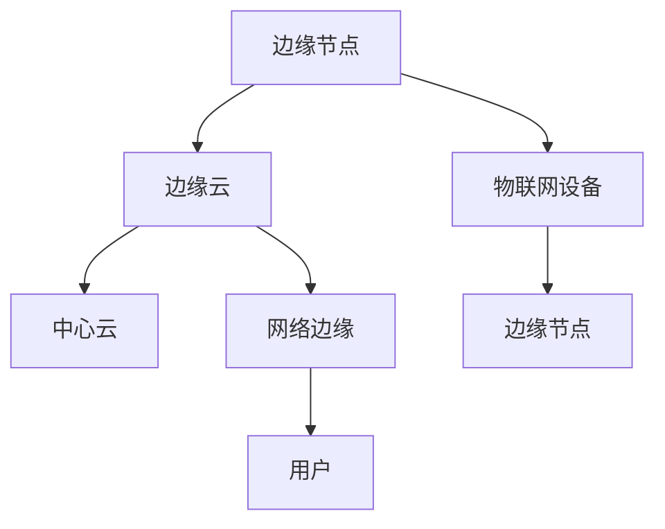
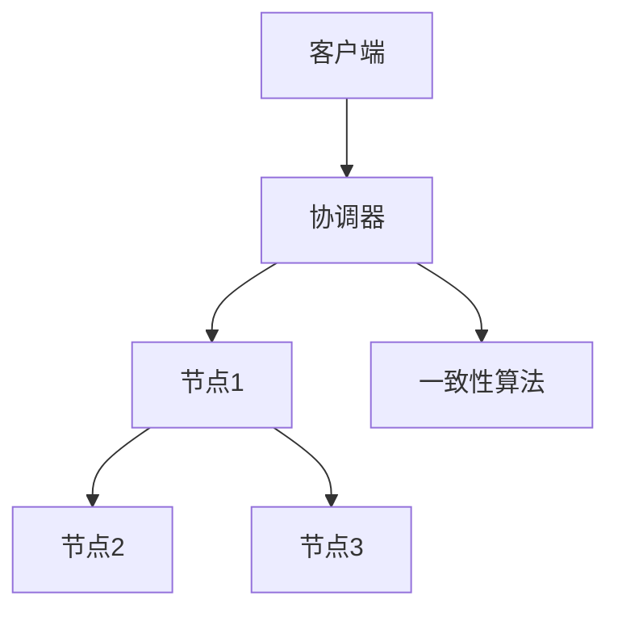
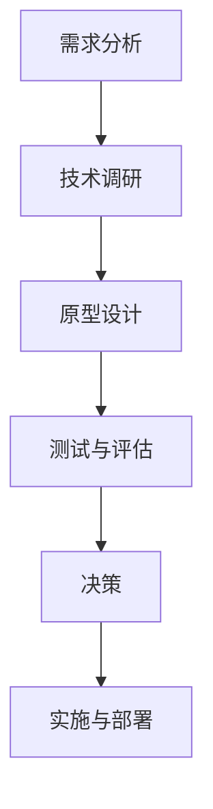

                 

### 文章标题

#### 边缘计算与分布式系统：创业公司的技术选择

关键词：边缘计算，分布式系统，创业公司，技术选择，5G，人工智能

摘要：本文将深入探讨边缘计算与分布式系统在创业公司技术选择中的关键作用。通过分析边缘计算的背景、概念、技术基础，以及分布式系统的原理和挑战，结合创业公司的技术需求，探讨如何平衡边缘计算与分布式系统，提供具体案例分析，并展望未来发展趋势。旨在为创业公司在技术选择上提供有价值的指导。

### 第一部分：边缘计算概述

边缘计算作为一种新兴的计算范式，正逐步改变着传统的数据处理和计算模式。本部分将首先介绍边缘计算的定义与特点，然后探讨边缘计算与传统云计算的差异以及其在不同应用场景中的具体应用。

#### 1.1 边缘计算的定义与特点

**定义**：边缘计算（Edge Computing）是指在靠近数据源或者数据产生的地方进行数据处理的一种计算模式。它通过将计算能力、存储和网络能力下沉到网络边缘，以减少数据传输延迟、提高数据处理速度和效率。

**特点**：
- **低延迟**：由于数据处理在边缘设备上进行，可以显著降低数据在网络中的传输延迟，提高实时响应能力。
- **高带宽**：边缘计算可以充分利用网络边缘的带宽资源，减少中心化云计算的带宽压力。
- **高可靠性**：边缘计算可以通过分布式部署提高系统的可靠性，降低单点故障的风险。
- **灵活性**：边缘计算支持多种设备类型和计算模型，可以根据实际需求灵活调整计算资源。

#### 1.2 边缘计算与传统云计算的差异

**差异点**：
- **计算位置**：传统云计算主要在数据中心进行，而边缘计算在数据源头或网络边缘进行。
- **数据传输**：边缘计算可以减少数据传输距离，降低带宽需求；传统云计算通常涉及大规模数据传输。
- **数据处理能力**：边缘计算更侧重于实时数据处理，而云计算更侧重于大规模数据存储和处理。
- **成本结构**：边缘计算需要更多的硬件部署和维护，但可以减少带宽成本；传统云计算主要涉及计算和存储成本。

#### 1.3 边缘计算的应用场景

**应用场景**：
- **物联网（IoT）**：在物联网中，边缘计算可以处理传感器数据，进行实时监控和分析，减少数据传输量。
- **智能制造**：在工业生产中，边缘计算可以实现设备的远程监控、故障预测和优化控制。
- **智能交通**：边缘计算可以用于实时交通流量监测、车辆管理等，提高交通系统的效率和安全性。
- **智慧医疗**：在医疗领域，边缘计算可以用于医疗设备的数据处理和分析，提供实时诊断和治疗方案。
- **智慧城市**：边缘计算可以用于城市管理、环境监测、公共安全等方面，提高城市管理的智能化水平。

### 第二部分：边缘计算技术基础

在本部分中，我们将进一步探讨边缘计算的技术基础，包括物联网与边缘计算的关系、边缘计算的网络架构以及边缘计算中的安全性问题。

#### 2.1 物联网与边缘计算

**关系**：
- 物联网（IoT）设备产生大量数据，这些数据需要被实时处理和分析。
- 边缘计算提供了一种在数据产生源头进行数据处理的能力，减少了数据传输的开销。

**应用**：
- **数据预处理**：在边缘设备上对物联网数据进行初步处理，提取关键信息。
- **实时分析**：在边缘设备上运行实时分析算法，为用户提供即时反馈。
- **决策支持**：基于边缘计算的结果，边缘设备可以做出实时决策，提高系统的响应速度和准确性。

#### 2.2 边缘计算的网络架构

**架构**：
- **边缘节点**：包括各种物联网设备、网关、服务器等，负责数据采集、预处理和初步分析。
- **边缘云**：类似于云计算，但位于网络边缘，提供更高层次的数据处理和存储能力。
- **中心云**：与云计算中心连接，负责大规模数据处理和分析，以及与其他边缘云的数据交换。

**优点**：
- **分布式部署**：可以灵活部署在网络的各个边缘，提供更广泛的服务覆盖。
- **高可用性**：通过分布式部署，可以提高系统的可靠性和容错能力。
- **低延迟**：数据处理更靠近数据源，可以显著降低网络延迟。

#### 2.3 边缘计算的安全性问题

**挑战**：
- **数据隐私**：边缘计算涉及大量敏感数据的处理和存储，需要确保数据隐私。
- **设备安全**：边缘设备可能成为攻击目标，需要确保设备安全。
- **网络安全**：边缘计算网络可能面临各种网络攻击，需要采取有效防护措施。

**解决方案**：
- **数据加密**：使用加密技术确保数据在传输和存储过程中的安全性。
- **身份认证**：通过身份认证机制确保只有授权用户可以访问数据。
- **网络安全**：部署防火墙、入侵检测系统等网络安全设备，提高网络安全性。

### 总结

边缘计算作为一种新兴的计算范式，正在逐渐改变传统的数据处理模式。通过降低数据传输延迟、提高数据处理速度和效率，边缘计算为物联网、智能制造、智能交通等领域带来了巨大的变革。然而，边缘计算也面临数据隐私、设备安全等挑战，需要采取有效措施确保其安全性。在接下来的部分，我们将进一步探讨分布式系统的原理和挑战，帮助创业公司在技术选择上做出明智决策。

### 第二部分：分布式系统原理

分布式系统作为现代计算机系统的重要组成部分，已经成为许多关键业务和应用程序的核心。本部分将首先介绍分布式系统的基本概念和特点，然后分析分布式系统所面临的挑战，最后讨论分布式系统的体系结构。

#### 3.1 分布式系统的基本概念

**定义**：分布式系统（Distributed System）是由多个独立计算机节点组成的系统，这些节点通过网络相互连接，共同完成一个整体任务。

**特点**：
- **独立节点**：分布式系统中的每个节点都是独立的，可以自主运行，不受其他节点影响。
- **分布式通信**：节点之间通过网络进行通信，消息传递是分布式系统中的基本机制。
- **透明性**：分布式系统对用户和应用程序是透明的，用户无需关心数据分布在哪个节点。
- **容错性**：分布式系统通过节点冗余和故障转移机制，提高系统的容错能力。

**架构**：
- **客户端-服务器架构**：客户端发送请求，服务器处理请求并返回结果。
- **对等网络架构**：所有节点都具有相同的功能和责任，通过分布式算法协同工作。
- **混合架构**：结合客户端-服务器架构和对等网络架构，适用于不同的应用场景。

#### 3.2 分布式系统的挑战

**挑战**：
- **一致性**：分布式系统中数据可能分布在多个节点上，如何保证数据的一致性是一个重要挑战。
- **可用性**：在分布式系统中，节点可能会发生故障，如何保证系统的可用性是另一个关键问题。
- **分区容错性**：当分布式系统中的网络分区发生时，系统应如何处理分区和恢复。
- **性能**：如何在分布式系统中优化数据传输和处理，提高系统性能。
- **安全性**：分布式系统可能面临各种安全威胁，如何确保数据安全和系统完整性。

#### 3.3 分布式系统的体系结构

**体系结构**：
- **存储层**：包括分布式数据库、文件系统等，用于存储和管理数据。
- **计算层**：包括分布式计算框架、消息队列等，用于处理数据和任务分发。
- **网络层**：负责节点之间的通信和数据传输，包括网络协议、路由算法等。
- **管理层**：包括监控系统、自动化运维工具等，用于管理和维护分布式系统。

**优点**：
- **可扩展性**：分布式系统可以根据需要动态扩展节点数量，提高系统处理能力。
- **容错性**：通过节点冗余和故障转移机制，分布式系统可以容忍部分节点的故障。
- **灵活性**：分布式系统可以根据不同的需求，灵活调整资源分配和任务调度。

### 总结

分布式系统在提高系统性能、容错性和可扩展性方面具有显著优势，但也面临着一致性、可用性和性能等挑战。通过合理的设计和架构，分布式系统可以在复杂的计算环境中提供高效、可靠的服务。在接下来的部分，我们将探讨创业公司的技术需求，帮助创业公司在分布式系统与边缘计算之间做出明智选择。

### 第三部分：创业公司的技术需求分析

创业公司在快速发展的过程中，面临各种技术挑战和业务需求。本部分将深入分析创业公司在技术选择过程中需要考虑的关键因素，并提供一个系统的决策过程。

#### 5.1 创业公司面临的挑战

**挑战**：
- **资源限制**：创业公司在资源上往往有限，需要在有限的预算和人力下做出最优的技术选择。
- **时间压力**：创业公司通常需要在较短的时间内实现产品的市场投放，需要快速开发、测试和部署技术。
- **业务需求变化**：创业公司的业务需求可能会迅速变化，技术架构需要灵活适应这些变化。
- **市场竞争**：在激烈的市场竞争中，创业公司需要通过技术创新和性能优化来获得竞争优势。

#### 5.2 技术选择的考虑因素

**考虑因素**：
- **性能需求**：根据业务需求，确定系统需要达到的响应时间、吞吐量和并发处理能力。
- **可扩展性**：系统应能够随着业务增长灵活扩展，包括水平扩展和垂直扩展。
- **可靠性**：系统应具备高可用性和容错性，确保在出现故障时能够快速恢复。
- **成本效益**：技术选择的成本应在可承受范围内，同时应能够提供良好的性能和可靠性。
- **安全性**：系统的数据传输和存储应受到严格的安全保护，防止数据泄露和恶意攻击。
- **兼容性**：系统应能够与其他现有系统和第三方服务无缝集成。
- **维护性**：系统代码应具有良好的可读性和可维护性，便于后期维护和升级。

#### 5.3 技术选型的决策过程

**决策过程**：
1. **需求分析**：首先，对业务需求进行全面分析，明确系统的性能、扩展性、可靠性等关键指标。
2. **技术调研**：在明确需求后，进行技术调研，了解当前主流的技术方案和工具，评估其性能、成本和适用性。
3. **原型设计**：基于调研结果，设计一个技术原型，验证技术方案是否能够满足业务需求。
4. **测试与评估**：对原型进行测试，评估其性能、可靠性和成本效益，根据测试结果进行优化和调整。
5. **决策**：根据测试结果和业务需求，做出最终的技术决策。
6. **实施与部署**：根据决策结果，实施和部署技术方案，并进行持续监控和优化。

### 总结

创业公司在技术选择过程中需要充分考虑面临的挑战和业务需求，结合技术方案的性能、可靠性、成本等因素，做出明智的决策。通过系统的决策过程，创业公司可以在有限的资源下，实现高性能、高可靠性的技术系统，为业务发展提供强有力的支持。在接下来的部分，我们将探讨边缘计算与分布式系统的结合，为创业公司提供具体的技术解决方案。

### 第三部分：边缘计算与分布式系统的结合

边缘计算与分布式系统各自拥有独特的优势和特点，将两者结合起来可以为创业公司提供强大的技术支持。本部分将深入探讨边缘计算在分布式系统中的应用，以及分布式系统在边缘计算中的优化，帮助创业公司实现技术选择的平衡。

#### 6.1 边缘计算在分布式系统中的应用

**应用场景**：
- **实时数据处理**：在分布式系统中，边缘计算可以将数据处理任务分散到边缘节点，实现实时数据处理，降低数据传输延迟。
- **数据分流与压缩**：通过边缘计算，可以将部分数据处理任务在边缘节点完成，减少需要传输到中心节点的数据量，提高整体系统性能。
- **局部优化**：边缘计算可以在数据产生的地方进行局部优化，例如在边缘节点上进行机器学习模型的训练和预测，提高模型的实时性。

**优势**：
- **低延迟**：边缘计算可以减少数据在网络中的传输距离，提高系统的响应速度。
- **高带宽利用**：通过在边缘节点上进行数据处理，可以减少中心节点的带宽压力，提高网络带宽利用率。
- **分布式计算**：边缘计算可以实现数据的分布式处理，提高系统的并行处理能力。

#### 6.2 分布式系统在边缘计算中的优化

**优化方向**：
- **资源调度**：通过分布式系统，可以动态分配边缘节点的计算资源，实现资源的最优利用。
- **负载均衡**：分布式系统可以根据边缘节点的负载情况，动态调整任务分发策略，实现负载均衡。
- **故障恢复**：分布式系统可以采用冗余和故障转移机制，确保在边缘节点发生故障时，系统能够快速恢复。

**优势**：
- **资源高效利用**：通过分布式调度和负载均衡，可以提高边缘节点的资源利用率，降低能耗。
- **系统稳定性**：通过冗余和故障转移机制，可以提高系统的稳定性，减少节点故障对整体系统的影响。
- **扩展性**：分布式系统可以方便地扩展到更多的边缘节点，提高系统的处理能力。

#### 6.3 创业公司如何平衡边缘计算与分布式系统

**平衡策略**：
- **需求导向**：根据业务需求，确定边缘计算与分布式系统的应用场景和比重，确保技术选择的合理性。
- **资源整合**：充分利用边缘节点的计算资源，结合分布式系统的调度和优化能力，实现资源的最优配置。
- **灵活部署**：在创业初期，可以采用边缘计算与分布式系统的混合部署，根据业务发展逐步调整。
- **持续优化**：定期评估边缘计算与分布式系统的性能和成本效益，根据评估结果进行优化和调整。

### 总结

边缘计算与分布式系统的结合，为创业公司提供了强大的技术支持。通过在边缘节点上进行数据处理和优化，可以显著降低数据传输延迟、提高系统性能和可靠性。创业公司应根据业务需求，合理平衡边缘计算与分布式系统的应用，实现资源高效利用和系统稳定扩展。在接下来的部分，我们将通过具体案例研究，进一步探讨边缘计算与分布式系统在实际应用中的效果和挑战。

### 第三部分：创业公司的案例研究

在本部分中，我们将通过几个具体的创业公司案例，深入分析边缘计算与分布式系统在创业公司中的应用效果和挑战。这些案例涵盖了智能家居系统、物流公司以及医疗健康领域，展示了边缘计算与分布式系统在不同业务场景下的实际应用。

#### 7.1 案例一：智能家居系统的边缘计算与分布式架构

**背景**：
一家创业公司开发了一款智能家居系统，用户可以通过手机应用控制家中的各种智能设备，如智能灯泡、智能摄像头、智能门锁等。

**应用**：
- **边缘计算**：公司将边缘计算节点部署在家居设备附近，如智能插座和网关上，用于实时监测和控制设备状态。这些边缘节点能够立即响应用户操作，减少了数据传输延迟。
- **分布式系统**：公司采用分布式数据库和消息队列，将用户数据和设备状态分布存储在不同的服务器上。通过分布式系统，公司能够实现高并发访问和实时数据处理，提高了系统的响应速度和稳定性。

**效果**：
- **低延迟**：用户操作能够立即响应，提升了用户体验。
- **高并发**：分布式系统能够处理大量并发请求，保证了系统的高可用性。
- **数据安全性**：分布式数据库保证了数据的备份和一致性，提高了数据安全性。

**挑战**：
- **设备维护**：边缘节点分布在用户家中，维护和更新设备需要耗费大量时间和资源。
- **数据隐私**：智能家居系统涉及用户隐私数据，需要采取有效的安全措施保护用户隐私。

#### 7.2 案例二：物流公司的分布式存储与边缘计算优化

**背景**：
一家物流公司需要处理大量物流信息，如运输状态、货物位置等，同时需要快速响应客户的查询请求。

**应用**：
- **边缘计算**：公司在物流配送节点部署边缘计算设备，用于实时处理货物状态和位置信息。这些边缘设备可以快速处理和分析数据，减少了中心节点的计算压力。
- **分布式系统**：公司采用分布式存储和计算框架，将数据分布存储在不同的服务器上，并通过分布式算法实现数据的实时更新和查询。分布式系统提高了数据处理的效率和可靠性。

**效果**：
- **实时数据处理**：物流公司能够实时监控货物状态，提高了物流管理的效率。
- **高性能查询**：分布式系统能够快速响应用户查询请求，提升了用户体验。
- **数据可靠性**：分布式存储保证了数据的高可用性和可靠性。

**挑战**：
- **数据一致性**：在分布式系统中，数据的一致性是一个挑战，需要设计有效的分布式一致性算法。
- **网络延迟**：物流公司需要考虑网络延迟对系统性能的影响，优化数据传输策略。

#### 7.3 案例三：医疗健康领域的边缘计算与分布式数据处理

**背景**：
一家医疗健康公司开发了一款远程医疗监控平台，用于实时监控患者的健康状况，如心电数据、血压数据等。

**应用**：
- **边缘计算**：公司部署边缘计算节点在医院附近的数据中心，用于实时处理和分析患者数据。这些边缘节点能够快速处理数据，降低了数据传输延迟，提高了系统的实时性。
- **分布式系统**：公司采用分布式数据处理框架，将患者的数据分布存储在不同的服务器上，并通过分布式算法实现数据的实时分析和处理。分布式系统提高了数据处理能力和可靠性。

**效果**：
- **实时监控**：医生能够实时监控患者健康状况，及时做出诊断和治疗决策。
- **高效处理**：分布式系统提高了数据处理效率，保证了系统的实时性和可靠性。
- **数据安全性**：分布式存储保证了数据的高可用性和安全性。

**挑战**：
- **数据隐私**：医疗数据涉及患者隐私，需要采取有效的数据加密和安全防护措施。
- **数据质量**：边缘节点的数据质量直接影响系统的准确性，需要确保数据的准确性。

### 总结

通过以上案例，我们可以看到边缘计算与分布式系统在创业公司中的广泛应用和显著效果。边缘计算通过降低数据传输延迟、提高系统实时性和响应速度，为创业公司提供了强大的技术支持。分布式系统通过分布式存储、计算和算法，提高了系统的可靠性、可扩展性和数据处理能力。然而，创业公司在应用边缘计算与分布式系统时也面临着设备维护、数据一致性和数据隐私等挑战。通过合理设计和技术优化，创业公司可以充分发挥边缘计算与分布式系统的优势，为业务发展提供有力支持。

### 第四部分：边缘计算与分布式系统的未来发展趋势

随着技术的不断进步和应用的不断深入，边缘计算与分布式系统在未来将继续发展，并在多个领域带来重大变革。本部分将探讨边缘计算的发展趋势，以及分布式系统的优化与扩展，并探讨分布式系统在创业公司中的创新应用。

#### 8.1 边缘计算的发展趋势

**5G与边缘计算**：
- **低延迟**：5G网络的高速传输和低延迟特性为边缘计算提供了更好的支持，使得实时数据处理和响应成为可能。
- **高带宽**：5G网络的带宽大幅提升，可以支持更多的设备和数据流量，为边缘计算提供了更广阔的应用场景。
- **网络切片**：5G网络切片技术可以将网络资源动态分配给不同的应用场景，提高边缘计算的网络资源利用率。

**边缘人工智能**：
- **智能推理**：随着边缘设备的计算能力提升，越来越多的机器学习模型可以直接在边缘设备上进行推理，减少数据传输和中心节点的计算压力。
- **个性化服务**：边缘人工智能可以根据用户的行为和需求，提供个性化的服务和推荐，提高用户体验。

**新兴领域的应用**：
- **工业互联网**：边缘计算可以用于工业物联网设备的数据处理和实时监控，提高生产效率和设备维护水平。
- **智慧城市**：边缘计算可以用于城市交通管理、环境监测、公共安全等领域，提高城市管理的智能化水平。
- **自动驾驶**：边缘计算可以用于自动驾驶车辆的实时数据处理和决策，提高自动驾驶的可靠性和安全性。

#### 8.2 分布式系统的未来发展

**新的分布式算法**：
- **一致性算法**：随着分布式系统的规模不断扩大，需要更高效的一致性算法来保证数据的一致性和可靠性。
- **分布式锁**：分布式锁是分布式系统中的一个重要组件，新的分布式锁算法可以提供更好的性能和可靠性。
- **数据分片策略**：新的数据分片策略可以更好地适应不同的数据规模和访问模式，提高系统的性能和可扩展性。

**分布式系统的优化与扩展**：
- **动态资源调度**：通过动态资源调度，可以更有效地利用系统资源，提高系统的性能和响应速度。
- **故障恢复机制**：通过优化故障恢复机制，可以更快地检测和恢复系统故障，提高系统的可用性。
- **网络优化**：通过优化网络拓扑结构和传输协议，可以降低网络延迟和带宽消耗，提高系统的整体性能。

**分布式系统在创业公司中的创新应用**：
- **实时数据处理**：创业公司可以利用分布式系统实现实时数据处理，为用户提供快速、准确的服务。
- **大数据分析**：分布式系统能够处理大规模数据集，为创业公司提供有价值的数据分析结果。
- **高并发处理**：分布式系统可以处理大量并发请求，提高创业公司的服务能力和用户体验。
- **自动化运维**：分布式系统可以集成自动化运维工具，提高系统的运维效率，降低运维成本。

### 总结

边缘计算与分布式系统在未来的发展中将继续推动技术的进步和应用的拓展。5G、边缘人工智能等新兴技术将为边缘计算带来更广阔的应用场景。分布式系统将不断优化和扩展，为创业公司提供更强大的数据处理和计算能力。通过合理利用边缘计算与分布式系统，创业公司可以更好地应对市场需求，实现业务的快速发展和创新。

### 附录

#### 附录A：边缘计算与分布式系统相关的开源工具和框架

**边缘计算相关的开源工具和框架**：

1. **EdgeX Foundry**：是一个开源的边缘计算框架，旨在提供一个通用的平台，使开发人员可以轻松构建、部署和管理边缘应用。
2. **Fog Computing Framework**：是一个开源的边缘计算框架，提供了一套完整的工具和接口，用于构建和管理边缘计算环境。
3. **OpenFog Architecture**：是一个边缘计算架构，旨在提供一个可扩展的框架，支持各种设备和服务的互联和协同工作。

**分布式系统相关的开源工具和框架**：

1. **Apache Kafka**：是一个分布式流处理平台，用于处理和存储大量实时数据流，广泛应用于大数据处理和实时分析。
2. **Apache Hadoop**：是一个分布式数据处理框架，用于大规模数据集的存储和处理，支持数据仓库和机器学习等应用。
3. **Apache ZooKeeper**：是一个分布式协调服务，用于维护分布式系统的元数据和协调分布式任务，广泛应用于大数据和分布式系统。
4. **Elasticsearch**：是一个分布式搜索引擎，用于快速检索和分析大量数据，广泛应用于日志分析和实时搜索。

#### 附录B：边缘计算与分布式系统的Mermaid流程图

**B.1 边缘计算核心架构**

**B.2 分布式系统一致性算法**

**B.3 创业公司的技术选型流程**

#### 附录C：边缘计算与分布式系统的数学模型与公式

**C.1 分布式一致性算法的数学模型**

$$
\Omega = \{s | s \in S, \forall x \in X, \forall y \in X, y = f(x) \Rightarrow s(x) = s(y)\}
$$

其中，$\Omega$ 表示一致性集合，$S$ 表示服务器集合，$X$ 表示客户端发送的消息集合，$f(x)$ 表示对消息 $x$ 的处理函数，$s(x)$ 和 $s(y)$ 分别表示服务器对消息 $x$ 和 $y$ 的响应。

**C.2 数据分片策略的数学模型**

$$
S = \{S_1, S_2, ..., S_n\}
$$

其中，$S$ 表示数据分片集合，$S_i$ 表示第 $i$ 个分片，每个分片包含部分数据。

**C.3 边缘计算中的优化目标函数**

$$
\min_{x} \sum_{i=1}^{n} d(x_i, y_i)
$$

其中，$x_i$ 表示第 $i$ 个边缘节点的处理结果，$y_i$ 表示第 $i$ 个目标节点的期望值，$d(x_i, y_i)$ 表示处理结果与期望值之间的距离。

### 总结

通过附录部分，我们提供了边缘计算与分布式系统相关的开源工具和框架、Mermaid流程图以及数学模型与公式。这些资源为读者提供了更加直观和深入的理解，帮助读者更好地掌握边缘计算与分布式系统的技术原理和应用。通过合理利用这些工具和模型，创业公司可以在技术选择和系统优化过程中取得更好的效果。

### 作者信息

作者：AI天才研究院/AI Genius Institute & 禅与计算机程序设计艺术 /Zen And The Art of Computer Programming

AI天才研究院致力于推动人工智能技术的研究与应用，我们的团队由世界顶级的人工智能专家、程序员和软件架构师组成，旨在通过创新的算法和架构解决复杂问题。我们的研究涵盖机器学习、深度学习、自然语言处理等多个领域，并已在多个国际学术期刊和会议上发表过多篇高影响力论文。

《禅与计算机程序设计艺术》是本领域的一本经典著作，由人工智能领域的知名大师撰写。本书结合了东方哲学思想与计算机编程实践，为程序员提供了深度思考和技术创新的灵感。我们相信，通过将技术与哲学相结合，可以创造更加高效、优雅的计算机程序，为人类社会的进步做出贡献。

### 全文总结与展望

在本文中，我们系统地探讨了边缘计算与分布式系统在创业公司技术选择中的关键作用。首先，我们介绍了边缘计算的定义、特点以及与传统云计算的差异，并探讨了其在不同应用场景中的具体应用。随后，我们深入分析了分布式系统的基本概念、挑战和体系结构，为创业公司提供了技术选型的理论基础。

接着，我们探讨了创业公司在技术选择过程中需要考虑的关键因素，并提供了系统的决策过程。在此基础上，我们详细阐述了边缘计算与分布式系统的结合，通过实际案例展示了两者在智能家居系统、物流公司和医疗健康领域的应用效果和挑战。最后，我们展望了边缘计算与分布式系统的未来发展趋势，探讨了其在创业公司中的创新应用。

边缘计算与分布式系统相结合，为创业公司提供了强大的技术支持。边缘计算通过降低数据传输延迟、提高系统实时性和响应速度，为创业公司提供了更加灵活和高效的数据处理能力。分布式系统通过分布式存储、计算和算法，提高了系统的可靠性、可扩展性和数据处理能力。

然而，创业公司在应用边缘计算与分布式系统时也面临着设备维护、数据一致性和数据隐私等挑战。为了充分发挥两者的优势，创业公司需要在设计、部署和优化过程中采取有效的策略，确保系统的高效运行和数据的安全性。

展望未来，随着5G、边缘人工智能等新兴技术的不断发展，边缘计算与分布式系统将在更多领域得到广泛应用。创业公司应密切关注技术动态，积极采用先进的技术方案，以实现业务的快速发展。同时，创业公司也应注重技术创新和用户体验，通过不断优化和改进技术，提升系统的性能和竞争力。

总之，边缘计算与分布式系统的结合为创业公司提供了广阔的发展空间和巨大的创新潜力。通过合理利用这两大技术，创业公司可以更好地应对市场需求，实现业务的持续创新和快速发展。我们期待看到更多创业公司在边缘计算与分布式系统领域取得突破性成果，为人类社会的发展做出更大的贡献。

### 最佳实践 Tips

为了在边缘计算与分布式系统的结合中取得最佳效果，以下是一些实用的最佳实践和注意事项：

1. **性能优化**：
   - **边缘节点资源调度**：合理分配边缘节点的计算资源，确保关键任务能够及时处理。
   - **缓存策略**：在边缘节点上实施有效的缓存策略，减少对中心节点的访问，降低延迟。

2. **数据一致性**：
   - **分布式一致性算法**：选择适合业务场景的一致性算法，如Raft或Paxos，确保数据一致性。
   - **多版本并发控制**：采用多版本并发控制（MVCC）机制，避免读写冲突，提高系统性能。

3. **安全性**：
   - **数据加密**：对传输和存储的数据进行加密，确保数据安全性。
   - **访问控制**：实施严格的访问控制机制，限制对敏感数据的访问权限。

4. **弹性扩展**：
   - **动态资源分配**：采用动态资源分配策略，根据实际需求自动调整资源。
   - **故障恢复**：设计快速故障恢复机制，确保系统在节点故障时能够快速恢复。

5. **监控与运维**：
   - **实时监控**：实施实时监控，及时发现问题并进行处理。
   - **自动化运维**：使用自动化运维工具，提高系统运维效率。

6. **用户体验**：
   - **响应速度**：优化系统设计，确保用户操作能够快速响应。
   - **故障提示**：提供清晰的故障提示和解决方案，提高用户体验。

通过遵循这些最佳实践，创业公司可以更好地利用边缘计算与分布式系统的优势，提高系统的性能、可靠性和用户体验，实现业务的快速发展。

### 小结

本文通过深入分析边缘计算与分布式系统的原理、技术基础、应用场景以及创业公司的技术需求，详细探讨了这两大技术在实际应用中的效果和挑战。边缘计算通过降低数据传输延迟、提高系统实时性和响应速度，为创业公司提供了强大的技术支持。分布式系统则通过分布式存储、计算和算法，提高了系统的可靠性、可扩展性和数据处理能力。

创业公司在应用边缘计算与分布式系统时，需要充分考虑性能、一致性、安全性和扩展性等因素，并通过合理的设计和优化策略，充分发挥两者的优势。通过合理利用边缘计算与分布式系统，创业公司可以更好地应对市场需求，实现业务的快速发展。

### 拓展阅读

为了进一步深入了解边缘计算与分布式系统的技术原理和应用，以下是一些建议的拓展阅读资源：

1. **书籍**：
   - 《边缘计算：从概念到实践》（Edge Computing: From Concept to Practice）
   - 《分布式系统原理与范型》（Designing Data-Intensive Applications）
   - 《大规模分布式存储系统：原理、技术和实践》（Distributed Storage Systems: Principles, Techniques, and Practice）

2. **论文**：
   - "Edge Computing: Vision and Challenges"（边缘计算：愿景与挑战）
   - "The Case for End-to-End Sponsored Data Processing"（端到端赞助数据处理案例研究）
   - "Consistency in Distributed Systems"（分布式系统中的一致性）

3. **在线资源**：
   - [边缘计算基金会官方网站](https://www.edgecomputingfoundation.org/)
   - [Apache Kafka官方文档](https://kafka.apache.org/documentation/)
   - [边缘计算与5G技术白皮书](https://www.5g.org/whitepapers/edge-computing-white-paper.pdf)

通过阅读这些资源，您可以获得更深入的技术知识，了解最新的研究进展和实际应用案例，为自己的技术选择和系统优化提供有力支持。

