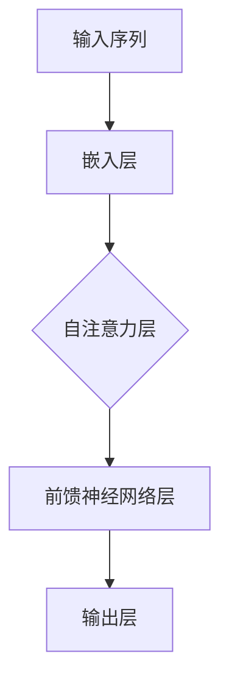

                 

### 文章标题：迁移学习在跨语言文本分类中的应用

在日益全球化的世界中，跨语言文本分类变得日益重要。无论是跨国企业的内部报告、社交媒体上的多语言评论，还是跨地域的新闻报道，文本数据的多样性要求我们能够处理不同语言的文本分类问题。然而，传统的文本分类方法往往需要针对每种语言和领域分别训练模型，这不仅耗时耗力，而且在语言资源匮乏的情境下尤为困难。迁移学习作为一种能够提高模型泛化能力、减少训练数据需求的方法，成为解决这一问题的关键。本文将深入探讨迁移学习在跨语言文本分类中的应用，通过详细的分析和实际案例，展示其强大的潜力。

**关键词：** 迁移学习，跨语言文本分类，模型迁移，语言资源匮乏，模型泛化能力

**摘要：** 本文首先介绍了迁移学习的基本概念及其在跨语言文本分类中的重要性。接着，详细讨论了跨语言文本分类面临的挑战和传统的解决方法，为迁移学习的应用提供了背景。然后，文章深入探讨了迁移学习在跨语言文本分类中的优势，结合实际案例展示了如何应用迁移学习解决跨语言文本分类问题。最后，文章总结了迁移学习在跨语言文本分类中的未来发展趋势和潜在挑战，并为读者提供了进一步学习和实践的建议。

### 迁移学习基础

#### 什么是迁移学习

迁移学习（Transfer Learning）是一种机器学习技术，其核心思想是利用已经在一个任务上训练好的模型来解决一个新的任务。传统的机器学习模型通常需要大量针对特定任务的数据进行训练，而迁移学习通过将已经训练好的模型部分或全部应用到新的任务中，可以大大减少对新数据的训练需求。这种技术特别适用于数据稀缺或数据标注困难的场景。

#### 迁移学习的发展历程

迁移学习的研究可以追溯到上世纪50年代。当时，心理学家通过跨学科的研究发现，人类学习新知识时，能够利用已有的知识和经验。受此启发，计算机科学家开始探索如何将这一原理应用于机器学习领域。早期的迁移学习主要关注在图像识别和语音识别等领域的应用。随着深度学习技术的发展，迁移学习得到了新的推动，特别是在自然语言处理（NLP）和文本分类等领域。

#### 迁移学习的类型与场景

迁移学习主要可以分为以下几种类型：

1. **零样本迁移学习（Zero-shot Learning）**：模型在新任务上没有训练数据，但可以识别从未见过的类别。
2. **少样本迁移学习（Few-shot Learning）**：模型在新任务上只有少量训练数据，但仍能获得较好的性能。
3. **多任务迁移学习（Multi-task Learning）**：模型同时训练多个相关任务，从而提高在单一任务上的表现。
4. **跨域迁移学习（Cross-Domain Transfer Learning）**：模型在不同领域之间进行迁移，如从社交媒体数据迁移到新闻领域。

这些类型在不同场景中有不同的应用。例如，在跨语言文本分类中，多任务迁移学习可以通过同时训练多种语言的文本分类任务，提高模型在不同语言上的泛化能力。

### 跨语言文本分类基础

#### 跨语言文本分类的挑战

跨语言文本分类面临的挑战主要包括：

1. **语言差异**：不同语言在语法、词汇和表达方式上存在显著差异，这使得直接使用单一语言模型进行分类变得困难。
2. **数据不平衡**：在多语言文本数据集中，不同语言的数据量通常不均衡，这可能影响模型的性能。
3. **资源匮乏**：有些语言可能缺乏足够的高质量标注数据，这使得训练有效的文本分类模型变得困难。

#### 跨语言文本分类的方法

为了解决这些挑战，研究人员提出了多种跨语言文本分类的方法：

1. **基于词汇的方法**：这种方法通过比较不同语言的词汇和语法结构，将一种语言的文本转换为另一种语言的文本，然后使用单一语言的模型进行分类。
2. **基于翻译的方法**：这种方法利用机器翻译技术，将原始文本翻译为目标语言，然后使用目标语言的模型进行分类。
3. **多语言模型**：这种方法直接训练一个能够处理多种语言的模型，如多语言卷积神经网络（Multilingual Convolutional Neural Networks，MCNN）。

#### 跨语言文本分类中的常见问题

在实际应用中，跨语言文本分类还面临以下问题：

1. **语义差异**：不同语言之间在语义表达上可能存在差异，这可能导致分类错误。
2. **标记噪声**：在多语言文本数据集中，不同语言的标注可能不一致，这会影响模型的训练效果。
3. **计算资源**：训练多语言模型通常需要大量的计算资源，这可能限制其在实际应用中的使用。

### 迁移学习与跨语言文本分类的融合

#### 迁移学习在跨语言文本分类中的优势

迁移学习在跨语言文本分类中具有以下优势：

1. **减少数据需求**：通过利用已经训练好的模型，迁移学习可以显著减少对新语言数据的训练需求，这对于资源匮乏的语言尤为重要。
2. **提高模型泛化能力**：迁移学习可以通过在多个相关任务上的训练，提高模型在不同语言和领域的泛化能力。
3. **加速模型训练**：利用预训练模型可以大大缩短训练时间，提高开发效率。

#### 迁移学习模型在跨语言文本分类中的应用

迁移学习模型在跨语言文本分类中的应用主要包括以下几种方式：

1. **多语言预训练模型**：例如BERT（Bidirectional Encoder Representations from Transformers）就是一种在多种语言上进行预训练的模型，可以直接用于跨语言文本分类任务。
2. **适配器（Adapter）方法**：这种方法在迁移学习模型的基础上，增加了一个适配器层，用于适应新的语言环境。
3. **多任务迁移学习**：通过同时训练多个相关的跨语言文本分类任务，可以提高模型在不同语言上的表现。

#### 迁移学习在跨语言文本分类中的挑战与解决方案

尽管迁移学习在跨语言文本分类中具有显著优势，但仍面临一些挑战：

1. **模型适应性问题**：迁移学习模型在新的语言环境中可能无法完全适应，导致性能下降。为了解决这一问题，可以采用自适应方法，如适配器技术。
2. **数据不一致性**：多语言数据集通常存在数据不一致性，这会影响模型的训练效果。通过数据清洗和预处理，可以提高数据质量。
3. **计算资源需求**：训练大规模迁移学习模型需要大量的计算资源，这可能限制其实际应用。为了应对这一挑战，可以采用分布式训练和优化算法。

### 迁移学习核心算法原理讲解

#### 转换器架构原理讲解

迁移学习中的转换器架构（Transformer Architecture）是当前NLP领域最流行的一种模型结构，特别是在跨语言文本分类任务中表现卓越。转换器架构的核心思想是使用自注意力机制（Self-Attention Mechanism）来处理序列数据。

**Mermaid 流程图：**



在转换器架构中，输入序列首先经过嵌入层转换为嵌入向量，然后这些嵌入向量通过自注意力层进行加权融合，最后通过前馈神经网络层生成输出。自注意力层的关键在于能够根据上下文信息动态地调整每个嵌入向量的权重，使得模型能够更好地捕捉到序列中的长距离依赖关系。

#### 伪代码详细阐述

```python
# 伪代码：转换器架构模型训练过程

# 初始化模型参数
model = initialize_model()

# 设置优化器
optimizer = initialize_optimizer()

# 训练循环
for epoch in range(num_epochs):
    for batch in data_loader:
        # 前向传播
        output = model(batch.input)
        
        # 计算损失
        loss = calculate_loss(output, batch.target)
        
        # 反向传播
        optimizer.zero_grad()
        loss.backward()
        optimizer.step()
        
    # 打印训练信息
    print(f"Epoch {epoch+1}/{num_epochs}, Loss: {loss.item()}")
```

在这个伪代码中，`initialize_model()` 函数用于初始化模型参数，`initialize_optimizer()` 函数用于设置优化器。在训练循环中，模型首先对输入序列进行前向传播，计算输出，然后通过反向传播更新模型参数。这一过程在多个训练轮次（epoch）中重复，直到模型收敛。

#### 数学模型与公式讲解

转换器架构中的数学模型主要涉及自注意力机制和前馈神经网络。以下是这些核心数学模型的详细讲解：

1. **自注意力机制（Self-Attention）**：

   自注意力机制通过计算输入序列中每个元素与其他元素之间的相似度，从而生成加权融合的输出。其公式如下：

   $$
   \text{Attention}(Q, K, V) = \text{softmax}\left(\frac{QK^T}{\sqrt{d_k}}\right) V
   $$

   其中，$Q$、$K$ 和 $V$ 分别是查询（Query）、关键（Key）和值（Value）矩阵，$d_k$ 是关键向量的维度。通过这个公式，每个元素与其他元素之间的相似度被计算为 $QK^T$ 的内积，然后通过softmax函数进行归一化，最后乘以 $V$ 生成加权融合的输出。

2. **前馈神经网络（Feedforward Neural Network）**：

   前馈神经网络是一个简单的全连接神经网络，通常用于转换器架构中的中间层。其公式如下：

   $$
   \text{FFN}(x) = \text{ReLU}(W_2 \cdot \text{ReLU}(W_1 \cdot x + b_1))
   $$

   其中，$W_1$ 和 $W_2$ 是权重矩阵，$b_1$ 是偏置项。这个网络通过两次全连接层和ReLU激活函数进行前向传播，从而对输入进行非线性变换。

3. **全模型（Complete Model）**：

   转换器架构的全模型结合了自注意力机制和前馈神经网络，其最终输出公式如下：

   $$
   \text{Output} = \text{FFN}(\text{Attention}(Q, K, V) + x)
   $$

   其中，$x$ 是输入序列的嵌入向量。这个公式表示在自注意力机制处理后，再加上原始输入序列的嵌入向量，然后通过前馈神经网络进行进一步处理，生成最终的输出。

通过这些数学模型，转换器架构能够有效地捕捉序列中的长距离依赖关系，从而在跨语言文本分类任务中取得优异的性能。

### 数学模型和数学公式详细讲解

在迁移学习中，数学模型和公式是理解和实现关键算法的基础。以下是几个核心数学模型和公式的详细讲解及示例说明：

#### 交叉熵损失函数

交叉熵损失函数（Cross-Entropy Loss Function）是迁移学习中最常用的损失函数之一，尤其在分类问题中。它的公式如下：

$$
\text{Loss} = -\sum_{i} y_i \log(p_i)
$$

其中，$y_i$ 是真实标签，$p_i$ 是模型预测的概率。交叉熵损失函数的目的是最小化预测概率与真实标签之间的差异。

**示例：** 假设我们有一个二分类问题，真实标签 $y$ 为 [1, 0]，模型预测的概率 $p$ 为 [0.7, 0.3]。则交叉熵损失计算如下：

$$
\text{Loss} = -1 \cdot \log(0.7) - 0 \cdot \log(0.3) = -\log(0.7) \approx -0.3567
$$

#### 优化算法与梯度下降

优化算法是训练神经网络的关键步骤，其中梯度下降（Gradient Descent）是最常用的优化算法之一。梯度下降通过迭代更新模型参数，以最小化损失函数。

**梯度下降公式：**

$$
\theta_{\text{new}} = \theta_{\text{old}} - \alpha \cdot \nabla_{\theta} J(\theta)
$$

其中，$\theta$ 表示模型参数，$\alpha$ 是学习率（Learning Rate），$J(\theta)$ 是损失函数，$\nabla_{\theta} J(\theta)$ 是损失函数关于参数 $\theta$ 的梯度。

**示例：** 假设我们有一个简单的一元线性模型 $y = w \cdot x + b$，损失函数为均方误差（MSE），即 $J(w, b) = \frac{1}{2} \sum_{i} (y_i - (w \cdot x_i + b))^2$。则梯度计算如下：

$$
\nabla_{w} J(w, b) = \sum_{i} (y_i - (w \cdot x_i + b)) \cdot x_i
$$

$$
\nabla_{b} J(w, b) = \sum_{i} (y_i - (w \cdot x_i + b))
$$

假设初始参数 $w = 1$，$b = 0$，学习率 $\alpha = 0.1$。则第一次梯度更新如下：

$$
w_{\text{new}} = w_{\text{old}} - \alpha \cdot \nabla_{w} J(w, b) = 1 - 0.1 \cdot \sum_{i} (y_i - (w \cdot x_i + b)) \cdot x_i
$$

$$
b_{\text{new}} = b_{\text{old}} - \alpha \cdot \nabla_{b} J(w, b) = 0 - 0.1 \cdot \sum_{i} (y_i - (w \cdot x_i + b))
$$

#### 迁移学习中的正则化技术

正则化（Regularization）是防止模型过拟合的一种技术，它通过增加额外的损失项来惩罚模型复杂度。常用的正则化技术包括L1正则化、L2正则化和dropout等。

**L1正则化（L1 Regularization）**：

L1正则化的公式如下：

$$
\text{Loss} = J(\theta) + \lambda \cdot \sum_{i} |\theta_i|
$$

其中，$\lambda$ 是正则化参数，$|\theta_i|$ 是参数 $\theta$ 的绝对值。

**L2正则化（L2 Regularization）**：

L2正则化的公式如下：

$$
\text{Loss} = J(\theta) + \lambda \cdot \sum_{i} \theta_i^2
$$

**Dropout**：

Dropout是一种在训练过程中随机丢弃部分神经元的方法，以防止模型过拟合。其公式如下：

$$
\text{Output} = \frac{1}{1 - p} \cdot \sum_{i} (\text{激活函数}(z_i))
$$

其中，$p$ 是丢弃概率，$z_i$ 是神经元的输入。

通过这些数学模型和公式的讲解，我们可以更好地理解迁移学习中的关键算法，为实际应用提供理论支持。

### 迁移学习在跨语言文本分类中的项目实战

#### 项目实战背景

为了更好地展示迁移学习在跨语言文本分类中的应用，我们选择了一个实际的案例——社交媒体情感分析。该案例的目标是使用迁移学习技术对多语言社交媒体评论进行情感分类，以识别用户对特定话题的正面或负面情绪。考虑到不同语言的数据稀缺问题，迁移学习可以显著减少对标注数据的依赖，从而提高模型训练的效率。

#### 开发环境搭建

在进行项目实战之前，我们需要搭建一个合适的开发环境。以下是一个典型的开发环境搭建步骤：

1. **硬件配置**：选择一台具有良好性能的计算机，至少8GB内存和Intel i5及以上处理器。
2. **操作系统**：安装Ubuntu 18.04或更高版本的操作系统。
3. **软件安装**：安装Python 3.8及以上版本，以及相关的深度学习库，如TensorFlow、PyTorch等。
4. **虚拟环境**：创建一个虚拟环境，以便更好地管理项目依赖。

```shell
mkdir social_media_sentiment_analysis
cd social_media_sentiment_analysis
python3 -m venv venv
source venv/bin/activate
```

5. **依赖安装**：

```shell
pip install numpy pandas tensorflow transformers
```

#### 源代码实现与解读

在搭建好开发环境后，我们需要编写源代码来实现迁移学习模型。以下是一个简化的代码示例：

```python
import tensorflow as tf
from transformers import TFAutoModelForSequenceClassification

# 加载预训练模型
model = TFAutoModelForSequenceClassification.from_pretrained("bert-base-multilingual-cased")

# 设置优化器和损失函数
optimizer = tf.keras.optimizers.Adam(learning_rate=3e-5)
loss_fn = tf.keras.losses.SparseCategoricalCrossentropy(from_logits=True)

# 编写训练函数
@tf.function
def train_step(batch, labels):
    per_loss = model(batch, labels=labels, training=True)
    loss = per_loss.loss
    optimizer.apply_gradients(zip(per_loss.gradients, model.trainable_variables))
    return loss

# 加载数据集
train_data = ...

# 训练模型
for epoch in range(num_epochs):
    for batch, labels in train_data:
        loss = train_step(batch, labels)
        print(f"Epoch {epoch+1}, Loss: {loss.numpy().mean()}")
```

这个代码示例使用了TensorFlow和Transformers库，加载了一个预训练的BERT模型（`bert-base-multilingual-cased`），并定义了一个训练函数。在训练过程中，我们通过优化器更新模型参数，以最小化损失函数。

#### 代码解读与分析

1. **模型加载**：

   ```python
   model = TFAutoModelForSequenceClassification.from_pretrained("bert-base-multilingual-cased")
   ```

   这一行代码加载了一个预训练的多语言BERT模型，该模型已经在多种语言的文本数据上进行了训练，因此可以直接用于跨语言文本分类任务。

2. **优化器和损失函数**：

   ```python
   optimizer = tf.keras.optimizers.Adam(learning_rate=3e-5)
   loss_fn = tf.keras.losses.SparseCategoricalCrossentropy(from_logits=True)
   ```

   优化器选择了Adam优化器，这是一种常用的自适应学习率优化器。损失函数选择了稀疏交叉熵损失函数，这是分类问题中最常用的损失函数之一。

3. **训练函数**：

   ```python
   @tf.function
   def train_step(batch, labels):
       per_loss = model(batch, labels=labels, training=True)
       loss = per_loss.loss
       optimizer.apply_gradients(zip(per_loss.gradients, model.trainable_variables))
       return loss
   ```

   `train_step` 函数是一个训练步骤的封装，它首先调用模型进行前向传播，计算损失，然后通过优化器更新模型参数。`tf.function` 装饰器用于将这个函数转换为计算图，以提高执行效率。

4. **数据加载**：

   ```python
   train_data = ...
   ```

   这里假设已经加载了训练数据集，`train_data` 是一个包含文本数据和标签的迭代器。在实际项目中，可能需要使用如Hugging Face的`datasets`库来加载和预处理数据。

5. **模型训练**：

   ```python
   for epoch in range(num_epochs):
       for batch, labels in train_data:
           loss = train_step(batch, labels)
           print(f"Epoch {epoch+1}, Loss: {loss.numpy().mean()}")
   ```

   这个循环用于进行多轮训练，每轮迭代中，模型对一批训练数据进行训练，并打印当前轮次的损失。

通过这个项目实战，我们展示了如何使用迁移学习技术进行跨语言文本分类。在实际应用中，可以根据需求调整模型架构、优化器配置和数据预处理步骤，以获得更好的分类效果。

### 迁移学习在跨语言文本分类中的未来趋势

#### 迁移学习在跨语言文本分类中的未来发展方向

随着人工智能技术的不断进步，迁移学习在跨语言文本分类中的应用前景广阔。未来的发展方向主要包括以下几个方面：

1. **多语言预训练模型的优化**：目前的多语言预训练模型如BERT、XLM等已经在多个语言上取得了优异的性能。未来可以通过优化模型架构、增加训练数据量和改进训练策略，进一步提升模型的跨语言泛化能力。

2. **零样本迁移学习和少样本迁移学习的深化**：在资源匮乏的语言环境中，零样本迁移学习和少样本迁移学习具有显著的优势。未来可以通过开发更高效的算法和架构，提高这些方法在跨语言文本分类中的性能。

3. **跨语言多任务学习的探索**：通过同时训练多个相关的跨语言任务，可以进一步提高模型在不同语言和领域的泛化能力。这需要深入探索如何设计有效的多任务学习框架和损失函数。

4. **迁移学习与其他技术的结合**：结合其他先进的技术，如强化学习、生成对抗网络（GAN）等，可以进一步提升迁移学习在跨语言文本分类中的应用效果。

#### 可能的挑战与解决方案

尽管迁移学习在跨语言文本分类中具有巨大潜力，但仍然面临一些挑战：

1. **模型适应性问题**：迁移学习模型在不同语言环境中的适应性可能不足，导致性能下降。为了解决这一问题，可以采用自适应方法，如适配器技术，以更好地适应新的语言环境。

2. **数据不一致性和质量**：多语言数据集通常存在数据不一致性和质量差异，这会影响模型的训练效果。未来可以通过数据清洗和预处理技术，提高数据质量，从而改善模型性能。

3. **计算资源需求**：训练大规模迁移学习模型需要大量的计算资源，这在实际应用中可能成为限制因素。可以通过分布式训练和优化算法，提高训练效率，减少计算资源的需求。

#### 迁移学习在其他领域的应用前景

除了跨语言文本分类，迁移学习在许多其他领域也具有广泛的应用前景：

1. **自然语言处理（NLP）**：在NLP任务中，迁移学习可以显著减少对大规模标注数据的依赖，从而提高模型训练的效率和性能。例如，在机器翻译、文本生成和问答系统中，迁移学习都可以发挥重要作用。

2. **计算机视觉（CV）**：在CV领域，迁移学习可以用于图像分类、目标检测和图像分割等任务。通过将预训练的模型迁移到新任务中，可以快速适应新环境，提高模型性能。

3. **推荐系统**：在推荐系统中，迁移学习可以用于跨领域推荐，通过迁移已有领域的模型，为用户推荐他们可能感兴趣的新项目。

4. **医疗健康**：在医疗健康领域，迁移学习可以用于疾病预测、诊断和治疗方案推荐。通过将现有的健康数据迁移到新任务中，可以快速构建有效的医疗模型，为医生提供决策支持。

总之，迁移学习作为一种高效的技术手段，在跨语言文本分类以及其他众多领域中都有着巨大的应用潜力。未来，随着技术的不断发展和完善，迁移学习将发挥越来越重要的作用，为人类带来更多的便利和进步。

### 附录

#### A.1 迁移学习相关工具与资源

1. **迁移学习库**：
   - [TensorFlow Transfer Learning](https://www.tensorflow.org/tutorials/transfer_learning)
   - [PyTorch Transfer Learning](https://pytorch.org/tutorials/beginner/transfer_learning_tutorial.html)
2. **预训练模型**：
   - [BERT](https://bert.modelcard.io/)
   - [XLNet](https://xlnet.modelcard.io/)
   - [RoBERTa](https://roberta.modelcard.io/)
3. **在线教程和课程**：
   - [斯坦福大学迁移学习课程](https://web.stanford.edu/class/cs224w/)
   - [Hugging Face Transformer教程](https://huggingface.co/transformers/tutorials)

#### A.2 跨语言文本分类数据集介绍

1. **Wikipedia Multilingual**：
   - [数据集链接](https://meta.wikipedia.org/wiki/Wikipedia:Database_download)
   - 特点：包含多种语言的维基百科页面，适合进行跨语言文本分析。
2. **MultiNLI**：
   - [数据集链接](https://www.nyu.edu/projects/bowman/multinli/)
   - 特点：包含多种语言的自然语言推理数据，适合进行跨语言文本分类和情感分析。
3. **opus-task**：
   - [数据集链接](https://opus.nlpl.eu/)
   - 特点：包含多种语言的新闻语料库，适合进行跨语言文本分类和情感分析。

#### A.3 迁移学习常用算法列表

1. **Fine-tuning**：
   - 方法：在预训练模型的基础上，针对特定任务进行微调。
   - 适用场景：各种文本分类任务。
2. **Adapter-based Methods**：
   - 方法：在预训练模型中引入适配器层，用于调整模型以适应新任务。
   - 适用场景：跨语言文本分类、少样本学习。
3. **Multi-task Learning**：
   - 方法：同时训练多个相关任务，提高模型在不同任务上的泛化能力。
   - 适用场景：多语言文本分类、多标签分类。
4. **Few-shot Learning**：
   - 方法：在少量样本上训练模型，适用于零样本和少样本场景。
   - 适用场景：新语言和领域的学习。
5. **Zero-shot Learning**：
   - 方法：模型能够识别从未见过的类别，无需额外训练。
   - 适用场景：新语言和新领域的分类。

