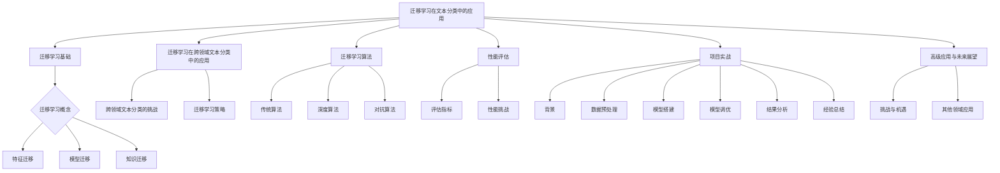

                 

### 文章标题

# 《迁移学习在跨领域文本分类中的应用策略》

### 关键词

- 迁移学习
- 跨领域文本分类
- 文本分类算法
- 特征迁移
- 模型迁移
- 知识迁移
- 深度学习

### 摘要

本文探讨了迁移学习在跨领域文本分类中的应用策略。首先，介绍了迁移学习的概念、历史发展和基本原理，然后分析了迁移学习在文本分类中的重要性及其应用前景。接着，详细阐述了迁移学习在跨领域文本分类中的应用策略，包括特征迁移、模型迁移和知识迁移。此外，本文还介绍了常见的迁移学习算法，如传统迁移学习算法、深度迁移学习算法和基于对抗的迁移学习算法，并对其原理进行了讲解。最后，通过实际项目案例，展示了迁移学习在跨领域文本分类中的性能评估和项目实战，并提出了未来的研究方向和展望。本文旨在为研究人员和实践者提供一套完整的迁移学习在跨领域文本分类中的应用策略，以促进该领域的发展。

### 目录

1. **第一部分：迁移学习基础**

    1.1 迁移学习的概念与历史发展

    1.2 迁移学习在文本分类中的重要性

    1.3 迁移学习的基本原理

2. **第二部分：迁移学习在跨领域文本分类中的应用**

    2.1 跨领域文本分类的挑战

    2.2 迁移学习在跨领域文本分类中的应用策略

    2.3 迁移学习在跨领域文本分类中的应用案例分析

3. **第三部分：迁移学习算法**

    3.1 迁移学习算法概述

    3.2 传统迁移学习算法

    3.3 深度迁移学习算法

    3.4 基于对抗的迁移学习算法

4. **第四部分：迁移学习在跨领域文本分类中的性能评估**

    4.1 性能评估指标

    4.2 跨领域文本分类的性能挑战

    4.3 提高性能的策略

5. **第五部分：迁移学习在跨领域文本分类中的项目实战**

    5.1 项目背景

    5.2 数据集选择与预处理

    5.3 迁移学习模型搭建

    5.4 模型训练与调优

    5.5 项目结果分析

    5.6 经验与总结

6. **第六部分：高级应用与未来展望**

    6.1 迁移学习在跨领域文本分类中的挑战与机遇

    6.2 迁移学习在其他领域的应用

    6.3 未来研究方向与展望

7. **附录**

    7.1 迁移学习相关资源与工具

    7.2 Mermaid流程图

    7.3 核心算法原理讲解伪代码

## 1. 迁移学习的概念与历史发展

### 1.1 迁移学习的定义

迁移学习（Transfer Learning）是指将一个任务中学习的知识应用到另一个相关任务中的一种机器学习方法。具体来说，迁移学习利用已经在一个领域（源领域）中训练好的模型或特征提取器，将其应用于另一个领域（目标领域）中的任务，以减少目标领域数据集的训练成本，提高模型的泛化能力。

在机器学习中，通常存在两种类型的任务：一种是从零开始训练模型，即从原始数据中学习特征并构建模型；另一种是利用已有的模型或特征提取器，对其进行微调或迁移，以适应新的任务。迁移学习正是第二种方法的实现。

### 1.2 迁移学习的发展历程

迁移学习可以追溯到早期的机器学习时代。早在20世纪50年代，心理学家就提出了“迁移”这一概念，用于描述个体在一种情境中学习到的知识和技能如何影响其在另一种情境中的表现。随着计算机技术的发展，迁移学习逐渐在机器学习领域得到了广泛关注和应用。

1980年代，统计学习理论的发展为迁移学习提供了理论基础。例如，贝叶斯网络和决策树等模型可以应用于迁移学习，通过利用源领域的信息来提高目标领域的模型性能。

2000年代，随着深度学习的兴起，迁移学习也得到了快速发展。深度学习模型，尤其是卷积神经网络（CNN）和循环神经网络（RNN）等，由于其强大的特征提取能力，在迁移学习中表现出了优异的性能。例如，在计算机视觉领域，预训练的卷积神经网络可以用于各种图像分类任务，大大提高了模型的性能和泛化能力。

近年来，迁移学习在自然语言处理、语音识别、推荐系统等领域也得到了广泛应用。例如，预训练的词向量模型（如Word2Vec、GloVe）和预训练的神经网络模型（如BERT、GPT）已经被广泛应用于各种自然语言处理任务，如文本分类、命名实体识别、机器翻译等。

### 1.3 迁移学习的分类

迁移学习可以根据迁移的内容进行分类，主要包括以下几种类型：

1. **特征迁移（Feature Transfer）**：特征迁移是指将源领域中的特征提取器直接应用于目标领域，通过在目标领域上训练一个分类器来完成任务。特征迁移的优点是简单有效，但缺点是对源领域和目标领域的相关性要求较高。

2. **模型迁移（Model Transfer）**：模型迁移是指将源领域中的整个模型（或部分模型）迁移到目标领域，并在目标领域上进行微调。模型迁移的优点是能够保留源领域中的知识，提高目标领域的模型性能。

3. **知识迁移（Knowledge Transfer）**：知识迁移是指通过在源领域和目标领域之间传递知识，来实现跨领域的迁移。知识迁移通常涉及将源领域中的先验知识（如规则、概念等）转移到目标领域，以帮助目标领域的模型更好地学习。

4. **层次迁移（Hierarchical Transfer）**：层次迁移是指将迁移学习分为多个层次，分别处理不同层次的迁移。例如，在图像识别任务中，可以将迁移学习分为底层特征迁移、中层语义迁移和高层概念迁移。

5. **自迁移（Self-Tuning）**：自迁移是指将模型在不同数据分布上训练的经验应用于新的数据分布。自迁移的核心思想是通过在不同数据分布上训练模型，使得模型能够自适应地调整其参数，以适应新的数据分布。

### 1.4 迁移学习在文本分类中的应用前景

文本分类是自然语言处理中的一个基本任务，其主要目标是根据文本的内容将其归类到不同的类别中。随着互联网的快速发展，文本数据量急剧增加，如何有效地对大量文本进行分类成为了研究的重点。迁移学习在文本分类中具有广泛的应用前景：

1. **提高分类性能**：迁移学习可以利用预训练的模型或特征提取器，在目标领域上快速构建高性能的分类器，从而提高分类性能。

2. **减少训练数据需求**：在许多实际应用中，获取大量标注数据是非常困难的。迁移学习可以通过在源领域上预训练模型，然后在目标领域上进行微调，从而减少对标注数据的依赖。

3. **处理跨领域文本分类**：在许多情况下，文本分类任务涉及不同领域的数据。迁移学习可以有效地处理跨领域文本分类问题，提高模型的泛化能力。

4. **降低计算成本**：迁移学习可以利用预训练的模型，减少目标领域上训练模型所需的计算资源，降低计算成本。

总之，迁移学习为文本分类任务提供了一种有效的方法，可以提高分类性能、减少训练数据需求、处理跨领域文本分类问题，并在实际应用中降低计算成本。随着迁移学习技术的不断发展，其在文本分类中的应用前景将更加广阔。

### 1.5 迁移学习的基本原理

迁移学习之所以能够有效提高模型在目标领域的性能，主要依赖于其基本原理，包括特征迁移、模型迁移和知识迁移。

#### 1.5.1 特征迁移

特征迁移是指将源领域中的特征提取器（例如，深度神经网络中的隐藏层）直接应用于目标领域，然后在目标领域上训练一个分类器。特征迁移的核心思想是利用源领域中的预训练模型来提取具有泛化能力的特征，这些特征能够捕捉到源领域和目标领域之间的共性。

具体实现过程中，首先在源领域上预训练一个模型，使其能够在源领域上获得良好的性能。然后，利用这个预训练模型对目标领域的输入数据进行特征提取。接下来，在提取的特征上训练一个分类器，用于对目标领域的输入数据进行分类。

特征迁移的优点是实现简单、效果显著，且对源领域和目标领域的相关性要求较低。但其缺点是依赖于源领域和目标领域之间的相似性，当源领域和目标领域差异较大时，迁移效果可能不理想。

#### 1.5.2 模型迁移

模型迁移是指将源领域中的整个模型（或部分模型）迁移到目标领域，并在目标领域上进行微调。模型迁移的核心思想是利用源领域中的模型来初始化目标领域的模型，从而加速目标领域的模型训练过程。

具体实现过程中，首先在源领域上预训练一个模型，使其能够在源领域上获得良好的性能。然后，将这个预训练模型作为目标领域模型的初始化参数，并在目标领域上继续训练。通过这种方式，目标领域的模型可以继承源领域模型的知识，从而提高其在目标领域的性能。

模型迁移的优点是能够保留源领域中的知识，提高目标领域的模型性能。但其缺点是对源领域和目标领域之间的相似性要求较高，当源领域和目标领域差异较大时，迁移效果可能不理想。

#### 1.5.3 知识迁移

知识迁移是指通过在源领域和目标领域之间传递知识，来实现跨领域的迁移。知识迁移通常涉及将源领域中的先验知识（例如，规则、概念等）转移到目标领域，以帮助目标领域的模型更好地学习。

具体实现过程中，首先在源领域上定义一组先验知识。然后，利用这些先验知识来辅助目标领域模型的训练。例如，可以通过在目标领域数据中引入源领域中的规则，或者在目标领域模型中嵌入源领域中的知识模块，来提高目标领域的模型性能。

知识迁移的优点是能够将源领域中的先验知识应用到目标领域，从而提高目标领域的模型性能。但其缺点是实现较为复杂，且对源领域和目标领域的相似性要求较高。

#### 1.5.4 迁移学习策略

在实际应用中，为了更好地利用迁移学习，常常结合多种迁移学习策略，以实现最佳的迁移效果。以下是一些常见的迁移学习策略：

1. **源领域选择**：选择与目标领域相关性较高的源领域，以增强迁移效果。

2. **模型初始化**：使用预训练模型作为目标领域模型的初始化参数，以加速目标领域的模型训练过程。

3. **微调**：在目标领域上对预训练模型进行微调，使其更好地适应目标领域。

4. **知识蒸馏**：将源领域模型的知识传递到目标领域模型中，以提高目标领域的模型性能。

5. **多任务学习**：通过在源领域和目标领域上同时训练多个任务，共享模型参数，以提高模型的泛化能力。

6. **对抗训练**：通过对抗训练来增强模型在源领域和目标领域之间的迁移效果。

总之，迁移学习通过特征迁移、模型迁移和知识迁移等基本原理，结合多种迁移学习策略，实现了在源领域和目标领域之间的知识传递和模型优化。随着迁移学习技术的不断发展，其在各个领域的应用前景将越来越广阔。

### 1.6 迁移学习在文本分类中的应用策略

迁移学习在文本分类中的应用策略主要包括特征迁移、模型迁移和知识迁移。每种策略都有其独特的原理和实现方法，适用于不同场景下的文本分类任务。

#### 1.6.1 特征迁移

特征迁移是指将源领域中的特征提取器（如深度学习模型的隐藏层）应用于目标领域，然后在提取的特征上进行目标领域的分类。这种策略的核心思想是利用源领域上预训练的模型来提取具有通用性和泛化能力的特征，从而提高目标领域模型的性能。

实现特征迁移的基本步骤如下：

1. **源领域模型预训练**：在源领域上收集大量数据，使用预训练算法（如Word2Vec、GloVe）或深度学习模型（如BERT、GPT）对文本进行特征提取。

2. **特征提取器应用**：将预训练模型中的特征提取器（例如，BERT模型的编码层输出）应用到目标领域数据上，提取具有通用性的特征表示。

3. **目标领域分类器训练**：在提取的特征上训练一个简单的分类器（如线性分类器、SVM等），用于对目标领域数据进行分类。

特征迁移的优点是方法简单、效果显著，且对源领域和目标领域的相关性要求较低。然而，其缺点在于当源领域和目标领域之间存在较大差异时，迁移效果可能不理想。

#### 1.6.2 模型迁移

模型迁移是指将源领域中的整个模型（或部分模型）迁移到目标领域，并在目标领域上进行微调。这种策略的核心思想是利用源领域上的预训练模型来初始化目标领域的模型，从而加速目标领域的模型训练过程。

实现模型迁移的基本步骤如下：

1. **源领域模型预训练**：在源领域上收集大量数据，使用预训练算法（如Word2Vec、GloVe）或深度学习模型（如BERT、GPT）对文本进行预训练，以获得具有良好性能的模型。

2. **模型迁移**：将预训练模型（或部分模型）作为目标领域模型的初始化参数，并在目标领域上继续训练。目标领域模型可以通过微调预训练模型来快速适应目标领域。

3. **目标领域模型训练**：在目标领域上继续训练目标领域模型，通过微调和优化，使其在目标领域上获得良好的性能。

模型迁移的优点是能够保留源领域中的知识，提高目标领域的模型性能。然而，其缺点是对源领域和目标领域的相似性要求较高，当源领域和目标领域差异较大时，迁移效果可能不理想。

#### 1.6.3 知识迁移

知识迁移是指通过在源领域和目标领域之间传递知识，来实现跨领域的迁移。这种策略的核心思想是利用源领域中的先验知识（如规则、概念等）来辅助目标领域的模型训练。

实现知识迁移的基本步骤如下：

1. **源领域知识提取**：在源领域上定义一组先验知识（如词性标注、实体识别规则等），并将其编码为模型可用的形式。

2. **知识传递**：将源领域中的知识传递到目标领域模型中。例如，可以通过在目标领域数据中引入源领域中的规则，或者将源领域中的知识模块嵌入到目标领域模型中。

3. **目标领域模型训练**：在目标领域上训练目标领域模型，同时利用源领域中的知识来辅助模型训练，以提高目标领域的模型性能。

知识迁移的优点是能够将源领域中的先验知识应用到目标领域，从而提高目标领域的模型性能。然而，其缺点是实现较为复杂，且对源领域和目标领域的相似性要求较高。

#### 1.6.4 应用策略选择

在实际应用中，可以根据以下因素选择合适的迁移学习策略：

1. **源领域和目标领域的相似性**：当源领域和目标领域相似时，特征迁移和模型迁移效果更好；当源领域和目标领域差异较大时，知识迁移可能更为有效。

2. **数据集大小和标注难度**：当目标领域数据集较小或标注难度较高时，迁移学习有助于缓解数据不足和标注困难的问题。

3. **模型结构和预训练效果**：选择适合目标领域的模型结构和预训练算法，可以提高迁移效果。

4. **迁移学习策略组合**：结合多种迁移学习策略，可以进一步提高迁移效果。例如，可以在特征迁移的基础上进行模型微调，或者将知识迁移与对抗训练相结合。

总之，迁移学习在文本分类中的应用策略包括特征迁移、模型迁移和知识迁移，每种策略都有其适用的场景和优点。通过合理选择和应用这些策略，可以显著提高文本分类模型的性能和泛化能力。

### 1.7 迁移学习在跨领域文本分类中的优势

迁移学习在跨领域文本分类中的应用具有显著的优势，特别是在解决以下挑战时表现出色：

#### 1.7.1 数据不足问题

在跨领域文本分类任务中，目标领域的数据往往较少，且获取标注数据成本高昂。迁移学习可以通过利用源领域的大量数据来预训练模型，从而在目标领域上实现有效的分类。这样，即使在目标领域数据不足的情况下，模型仍然能够保持较高的性能。

#### 1.7.2 数据分布不均

跨领域文本分类任务中，源领域和目标领域的数据分布可能存在较大差异，导致模型在目标领域上的性能不佳。迁移学习可以通过在源领域上预训练模型，使得模型在特征提取阶段能够捕捉到源领域和目标领域的共性特征，从而缓解数据分布不均带来的问题。

#### 1.7.3 跨领域适应能力

迁移学习能够将源领域中的知识迁移到目标领域，使得模型在目标领域上具备更好的适应能力。通过在源领域上预训练模型，模型可以学习到一些通用的知识，如词向量表示、语言结构等，这些知识有助于模型在目标领域上实现更好的泛化。

#### 1.7.4 计算效率

在跨领域文本分类任务中，使用迁移学习可以显著降低计算成本。通过在源领域上预训练模型，目标领域的模型只需进行微调，这大大减少了训练时间。此外，预训练模型可以复用，从而在不同目标领域上快速构建模型。

#### 1.7.5 提高分类性能

迁移学习能够提高跨领域文本分类任务的分类性能。通过利用源领域中的预训练模型，模型可以在目标领域上快速适应，并捕捉到目标领域的特征，从而实现更高的分类准确率。

总之，迁移学习在跨领域文本分类中的应用具有显著的优势，能够解决数据不足、数据分布不均、跨领域适应能力、计算效率和分类性能等问题。通过合理应用迁移学习，可以显著提高跨领域文本分类任务的性能和效果。

### 1.8 迁移学习在跨领域文本分类中的应用前景

迁移学习在跨领域文本分类中的应用前景广阔，其在多个领域的成功应用为文本分类任务带来了显著提升。以下是一些具体的应用场景：

#### 1.8.1 社交媒体文本分类

社交媒体平台上的文本数据丰富多样，涵盖了新闻、评论、微博等多种类型。迁移学习可以在源领域（如新闻评论）上预训练模型，然后在目标领域（如微博评论）上快速适应，实现高效准确的文本分类。例如，可以使用预训练的BERT模型在新闻评论上训练，然后在微博评论上实现情感分析、主题分类等任务。

#### 1.8.2 电子邮件分类

电子邮件分类是另一个典型的跨领域文本分类任务。企业邮箱和个人邮箱的文本风格和内容差异较大，使用迁移学习可以在企业邮箱上预训练模型，然后在个人邮箱上进行微调，提高分类性能。例如，可以使用预训练的GloVe模型在商业邮件上训练，然后在个人邮件上实现垃圾邮件检测、邮件分类等任务。

#### 1.8.3 医学文本分类

医学文本分类涉及大量的专业术语和复杂结构，数据来源多样，包括临床报告、患者笔记等。迁移学习可以在源领域（如临床报告）上预训练模型，然后在目标领域（如患者笔记）上快速适应，提高分类准确率。例如，可以使用预训练的BERT模型在临床报告上训练，然后在患者笔记上实现疾病诊断、症状识别等任务。

#### 1.8.4 法律文本分类

法律文本分类包括法律文件、合同、判决书等，数据来源广泛，且文本内容复杂。迁移学习可以在源领域（如法律文件）上预训练模型，然后在目标领域（如合同、判决书）上快速适应，实现高效准确的分类。例如，可以使用预训练的GPT模型在法律文件上训练，然后在合同、判决书上实现条款分类、判决预测等任务。

#### 1.8.5 金融文本分类

金融文本分类涉及股票分析、市场预测、金融报告等多种任务，数据来源广泛，文本内容多样。迁移学习可以在源领域（如股票分析报告）上预训练模型，然后在目标领域（如市场预测报告）上快速适应，提高分类性能。例如，可以使用预训练的BERT模型在股票分析报告上训练，然后在市场预测报告上实现投资建议、市场趋势分析等任务。

总之，迁移学习在跨领域文本分类中的应用前景广阔，其在社交媒体文本分类、电子邮件分类、医学文本分类、法律文本分类和金融文本分类等多个领域的成功应用，展示了其在提高文本分类性能和适应能力方面的巨大潜力。随着迁移学习技术的不断发展和完善，其在跨领域文本分类中的应用将更加广泛，为各领域的数据处理和智能分析提供强有力的支持。

### 1.9 迁移学习算法概述

在迁移学习领域，各种算法被提出并应用于不同类型的迁移任务。以下将介绍几种主要的迁移学习算法，包括传统迁移学习算法、深度迁移学习算法和基于对抗的迁移学习算法，并简要说明它们的原理和应用场景。

#### 1.9.1 传统迁移学习算法

传统迁移学习算法主要通过特征提取和模型调整来实现知识转移。这些算法通常依赖于手工设计的特征或简单的统计方法。

1. **特征选择和特征变换**：特征选择和变换是一种简单的迁移学习方法，其核心思想是利用源领域的特征对目标领域进行特征映射，从而提高分类性能。常用的方法包括主成分分析（PCA）、线性判别分析（LDA）和特征提取器（如SVM）等。

2. **模型调整**：模型调整方法包括参数调整和权重共享。参数调整方法通过在目标领域上微调源领域模型的参数，使其更好地适应目标领域。权重共享方法通过在源领域和目标领域上共享模型权重，降低训练成本。

应用场景：传统迁移学习算法适用于数据量较少、特征差异不大的跨领域任务，如文本分类、图像识别等。

#### 1.9.2 深度迁移学习算法

深度迁移学习算法利用深度学习模型强大的特征提取能力，实现高效的知识转移。这些算法通常包括预训练和微调两个阶段。

1. **预训练**：预训练阶段在源领域上训练深度学习模型，使其在特征提取上表现出良好的性能。常用的预训练模型包括卷积神经网络（CNN）、循环神经网络（RNN）和变换器（Transformer）等。

2. **微调**：微调阶段在目标领域上对预训练模型进行微调，使其适应目标领域的数据分布和任务需求。微调过程中，通常只调整模型的部分参数，从而降低计算成本。

应用场景：深度迁移学习算法适用于数据量较少、特征复杂的目标领域任务，如自然语言处理、图像识别和语音识别等。

#### 1.9.3 基于对抗的迁移学习算法

基于对抗的迁移学习算法通过对抗训练来增强模型在不同领域之间的迁移能力。这些算法的核心思想是利用生成对抗网络（GAN）等对抗训练技术，在源领域和目标领域之间构建一个生成对抗过程，从而提高模型在目标领域的性能。

1. **生成对抗网络（GAN）**：GAN由生成器（Generator）和判别器（Discriminator）组成。生成器试图生成与真实数据相似的数据，判别器则判断生成数据是否为真实数据。通过对抗训练，生成器和判别器不断优化，从而提高模型的迁移能力。

2. **多任务对抗训练**：多任务对抗训练通过在多个任务上训练生成器和判别器，使模型在多个领域之间进行知识转移。

应用场景：基于对抗的迁移学习算法适用于数据分布差异较大的跨领域任务，如跨语言文本分类、跨模态文本分类等。

总之，传统迁移学习算法、深度迁移学习算法和基于对抗的迁移学习算法各有优缺点，适用于不同类型的迁移任务。在实际应用中，可以根据具体任务需求选择合适的算法，以实现最佳的迁移效果。

### 1.10 传统迁移学习算法

传统迁移学习算法主要包括基于特征的方法和基于模型的方法。这些算法通过在源领域和目标领域之间传递特征或模型参数，以提高目标领域模型的性能。以下将详细介绍几种常见的传统迁移学习算法，并阐述其原理和实现方法。

#### 1.10.1 特征提取和变换方法

特征提取和变换方法是传统迁移学习算法中最简单且直观的一种。其核心思想是通过在源领域上提取具有通用性和泛化能力的特征，然后利用这些特征在目标领域上进行分类。

1. **主成分分析（PCA）**：PCA是一种常用的降维方法，通过在特征空间中找到主成分，将高维数据映射到低维空间。在迁移学习中，可以在源领域上对数据集进行PCA，然后使用降维后的特征在目标领域上训练分类器。

2. **线性判别分析（LDA）**：LDA是一种基于类间散度和类内散度的特征提取方法，其目标是在特征空间中最大化类间散度，同时最小化类内散度。通过在源领域上应用LDA，可以提取出具有判别力的特征，然后在目标领域上使用这些特征进行分类。

3. **特征提取器**：特征提取器是一种通用的特征提取方法，如支持向量机（SVM）、随机森林（Random Forest）和k-最近邻（k-NN）等。在迁移学习中，可以在源领域上使用这些特征提取器提取特征，然后在目标领域上使用这些特征训练分类器。

**实现方法**：

1. 在源领域上训练特征提取器（如PCA、LDA或特征提取器）。
2. 使用训练好的特征提取器对源领域数据集进行特征提取，得到特征向量。
3. 将提取出的特征向量作为输入，在目标领域上训练分类器（如SVM、k-NN等）。
4. 使用训练好的分类器对目标领域数据进行分类预测。

**优点**：

- 实现简单，对源领域和目标领域之间的相关性要求较低。
- 特征提取过程可以有效降低数据维度，提高模型训练效率。

**缺点**：

- 特征提取方法可能无法捕捉到复杂的数据分布和特征关系。
- 当源领域和目标领域差异较大时，迁移效果可能不理想。

#### 1.10.2 参数共享方法

参数共享方法是一种基于模型的传统迁移学习算法，其核心思想是在源领域和目标领域上共享部分模型参数，以实现知识转移。

1. **权重共享**：权重共享方法通过在源领域和目标领域上共享模型权重，减少训练成本。例如，可以在源领域上训练一个深度神经网络模型，然后在目标领域上只调整部分参数，同时保持其他参数不变。

2. **模型调整**：模型调整方法通过在目标领域上微调源领域模型，使其更好地适应目标领域。例如，可以在源领域上预训练一个深度神经网络模型，然后在目标领域上对其进行微调，以达到更好的分类效果。

**实现方法**：

1. 在源领域上训练一个深度神经网络模型。
2. 将训练好的模型参数作为初始参数，在目标领域上继续训练。
3. 在目标领域上只调整部分参数，同时保持其他参数不变。
4. 使用训练好的模型对目标领域数据进行分类预测。

**优点**：

- 减少模型训练成本，提高训练效率。
- 可以保留源领域中的知识，提高目标领域的模型性能。

**缺点**：

- 对源领域和目标领域的相似性要求较高，当差异较大时迁移效果可能不理想。
- 参数共享可能导致模型在源领域上已学到的知识无法在目标领域上充分利用。

#### 1.10.3 小结

传统迁移学习算法主要包括特征提取和变换方法以及参数共享方法。特征提取和变换方法通过在源领域上提取具有通用性和泛化能力的特征，然后在目标领域上使用这些特征进行分类。参数共享方法通过在源领域和目标领域上共享模型参数，减少训练成本并提高模型性能。虽然这些算法在实现上较为简单，但它们在跨领域迁移任务中表现出良好的性能，特别是在数据量较少或特征差异不大的情况下。

### 1.11 深度迁移学习算法

深度迁移学习算法利用深度学习模型强大的特征提取能力，实现高效的跨领域迁移。以下将详细介绍几种深度迁移学习算法，包括基于特征迁移的方法、基于模型迁移的方法和基于知识迁移的方法，并说明它们的原理和应用场景。

#### 1.11.1 基于特征迁移的方法

基于特征迁移的方法通过在源领域上预训练深度学习模型，然后在目标领域上利用提取的特征进行分类。这种方法的核心思想是利用预训练模型学习到的通用特征来提高目标领域的分类性能。

1. **预训练模型**：预训练模型是在大规模数据集上预先训练好的深度学习模型，如卷积神经网络（CNN）、循环神经网络（RNN）和变换器（Transformer）等。这些模型在特征提取上表现出良好的性能，可以捕捉到数据中的复杂模式和结构。

2. **特征提取**：在源领域上，使用预训练模型对输入数据进行特征提取，得到具有泛化能力的特征表示。这些特征表示可以用于在目标领域上训练分类器。

3. **分类器训练**：在目标领域上，使用提取的特征训练一个简单的分类器，如线性分类器或支持向量机（SVM）。分类器的目的是在目标领域上对提取的特征进行分类。

**实现方法**：

1. 在源领域上使用大规模数据集对深度学习模型进行预训练。
2. 使用预训练模型对目标领域数据进行特征提取，得到特征向量。
3. 在目标领域上使用提取的特征训练分类器。
4. 使用训练好的分类器对目标领域数据进行分类预测。

**优点**：

- 可以利用预训练模型学习到的通用特征，提高分类性能。
- 减少目标领域上的训练时间，降低计算成本。

**缺点**：

- 需要大量标注数据对预训练模型进行训练。
- 当源领域和目标领域差异较大时，迁移效果可能不理想。

**应用场景**：基于特征迁移的方法适用于数据量较少、特征复杂的目标领域任务，如自然语言处理、图像识别和语音识别等。

#### 1.11.2 基于模型迁移的方法

基于模型迁移的方法通过在源领域上预训练深度学习模型，然后在目标领域上对模型进行微调。这种方法的核心思想是利用源领域上的预训练模型作为目标领域模型的初始参数，通过微调使其更好地适应目标领域。

1. **预训练模型**：在源领域上使用大规模数据集对深度学习模型进行预训练，使其在特征提取和分类上表现出良好的性能。

2. **模型迁移**：将预训练模型作为目标领域模型的初始参数，然后在目标领域上对模型进行微调。微调过程中，通常只调整部分参数，以降低计算成本。

3. **微调训练**：在目标领域上使用微调后的模型进行训练，使其更好地适应目标领域的数据分布和任务需求。

**实现方法**：

1. 在源领域上使用大规模数据集对深度学习模型进行预训练。
2. 将预训练模型作为目标领域模型的初始参数。
3. 在目标领域上对模型进行微调。
4. 使用训练好的模型对目标领域数据进行分类预测。

**优点**：

- 可以利用源领域上的预训练模型，降低目标领域上的训练成本。
- 提高模型在目标领域的性能，实现跨领域的迁移。

**缺点**：

- 对源领域和目标领域的相似性要求较高，当差异较大时迁移效果可能不理想。
- 微调过程中可能无法充分利用源领域上的预训练知识。

**应用场景**：基于模型迁移的方法适用于数据量较少、特征复杂的目标领域任务，如自然语言处理、图像识别和语音识别等。

#### 1.11.3 基于知识迁移的方法

基于知识迁移的方法通过在源领域和目标领域之间传递知识，实现高效的跨领域迁移。这种方法的核心思想是将源领域中的先验知识（如规则、概念等）转移到目标领域，帮助目标领域模型更好地学习。

1. **知识提取**：在源领域上提取先验知识，如词性标注、实体识别规则等。这些知识可以表示为模型可用的形式，如嵌入向量、知识图谱等。

2. **知识传递**：将提取的知识传递到目标领域模型中，如通过在目标领域模型中嵌入知识图谱或使用规则作为模型的一部分。

3. **模型训练**：在目标领域上使用传递的知识进行模型训练，使其更好地适应目标领域的数据分布和任务需求。

**实现方法**：

1. 在源领域上提取先验知识。
2. 将提取的知识传递到目标领域模型中。
3. 在目标领域上使用传递的知识进行模型训练。
4. 使用训练好的模型对目标领域数据进行分类预测。

**优点**：

- 可以将源领域中的先验知识应用到目标领域，提高分类性能。
- 减少目标领域上的训练时间，降低计算成本。

**缺点**：

- 实现较为复杂，需要对源领域和目标领域的知识有深入理解。
- 当源领域和目标领域差异较大时，迁移效果可能不理想。

**应用场景**：基于知识迁移的方法适用于数据量较少、特征复杂的目标领域任务，如自然语言处理、图像识别和语音识别等。

#### 1.11.4 小结

深度迁移学习算法包括基于特征迁移的方法、基于模型迁移的方法和基于知识迁移的方法。基于特征迁移的方法通过在源领域上预训练模型，然后在目标领域上使用提取的特征进行分类。基于模型迁移的方法通过在源领域上预训练模型，然后在目标领域上进行微调。基于知识迁移的方法通过在源领域和目标领域之间传递先验知识，帮助目标领域模型更好地学习。这些方法各有优缺点，适用于不同类型的迁移任务。在实际应用中，可以根据具体任务需求选择合适的深度迁移学习算法，以提高目标领域的分类性能。

### 1.12 基于对抗的迁移学习算法

基于对抗的迁移学习算法通过对抗训练来增强模型在不同领域之间的迁移能力。这种算法的核心思想是利用生成对抗网络（GAN）等对抗训练技术，在源领域和目标领域之间构建一个生成对抗过程，从而提高模型在目标领域的性能。

#### 1.12.1 生成对抗网络（GAN）

生成对抗网络（GAN）由生成器（Generator）和判别器（Discriminator）组成。生成器的任务是生成与真实数据相似的数据，而判别器的任务是区分真实数据和生成数据。通过对抗训练，生成器和判别器不断优化，从而提高模型的迁移能力。

1. **生成器**：生成器的目标是生成与真实数据相似的数据。在迁移学习中，生成器通常用于生成目标领域上的数据，以补充目标领域上的数据不足。

2. **判别器**：判别器的目标是区分真实数据和生成数据。在迁移学习中，判别器用于区分源领域和目标领域上的数据。

3. **对抗训练**：生成器和判别器在训练过程中相互对抗。生成器试图生成更逼真的数据，而判别器则努力区分真实数据和生成数据。通过这种对抗训练，生成器和判别器不断优化，从而提高模型在目标领域的性能。

**实现方法**：

1. 在源领域上收集大量数据，用于训练判别器。
2. 使用判别器对源领域和目标领域的数据进行训练，使其能够区分真实数据和生成数据。
3. 使用判别器对生成器生成的目标领域数据进行训练，使其生成更逼真的数据。
4. 通过对抗训练，不断优化生成器和判别器，提高模型在目标领域的性能。

**优点**：

- 可以通过对抗训练提高模型在不同领域之间的迁移能力。
- 可以生成高质量的目标领域数据，缓解数据不足的问题。

**缺点**：

- 对抗训练过程复杂，计算成本较高。
- 当源领域和目标领域差异较大时，生成数据的真实性和判别器的性能可能受到影响。

**应用场景**：基于对抗的迁移学习算法适用于数据分布差异较大的跨领域任务，如跨语言文本分类、跨模态文本分类等。

#### 1.12.2 多任务对抗训练

多任务对抗训练是一种扩展的基于对抗的迁移学习算法，通过在多个任务上同时训练生成器和判别器，提高模型的迁移能力。

1. **多任务生成器**：多任务生成器可以同时生成多个任务的数据，如图像、文本等。通过多任务生成器，可以生成更丰富、更真实的目标领域数据。

2. **多任务判别器**：多任务判别器可以同时区分多个任务的数据。通过多任务判别器，可以更有效地训练生成器和判别器，提高模型在多个任务上的迁移性能。

**实现方法**：

1. 在多个任务上收集数据，用于训练多任务生成器和判别器。
2. 使用多任务生成器生成目标领域数据，并使用多任务判别器区分真实数据和生成数据。
3. 通过对抗训练，不断优化多任务生成器和判别器，提高模型在多个任务上的迁移性能。

**优点**：

- 可以通过多任务对抗训练提高模型在不同任务之间的迁移能力。
- 可以同时处理多个任务，提高模型的泛化能力。

**缺点**：

- 多任务对抗训练过程复杂，计算成本较高。
- 当任务差异较大时，生成数据的真实性和判别器的性能可能受到影响。

**应用场景**：多任务对抗训练适用于涉及多个任务的跨领域任务，如多模态文本分类、多领域图像识别等。

#### 1.12.3 小结

基于对抗的迁移学习算法通过对抗训练提高模型在不同领域之间的迁移能力。生成对抗网络（GAN）和多任务对抗训练是两种常见的基于对抗的迁移学习算法。通过生成对抗过程，生成器和判别器不断优化，从而提高模型在目标领域的性能。虽然基于对抗的迁移学习算法在提高迁移能力方面表现出色，但其实现过程复杂，计算成本较高，且在源领域和目标领域差异较大时，生成数据的真实性和判别器的性能可能受到影响。

### 1.13 迁移学习在跨领域文本分类中的性能评估

在跨领域文本分类任务中，评估迁移学习的性能是确保其有效性的关键。性能评估通常涉及多个指标，这些指标可以从不同的角度衡量模型的性能。以下将介绍几种常用的性能评估指标，并分析跨领域文本分类中的性能挑战及提升策略。

#### 1.13.1 性能评估指标

1. **准确率（Accuracy）**：准确率是最常用的评估指标之一，表示正确分类的样本占总样本的比例。其计算公式为：

   $$ 
   Accuracy = \frac{TP + TN}{TP + TN + FP + FN} 
   $$

   其中，TP代表真正例（True Positive），TN代表真反例（True Negative），FP代表假正例（False Positive），FN代表假反例（False Negative）。

2. **精确率（Precision）**：精确率表示正确分类为正例的样本占所有被分类为正例的样本的比例。其计算公式为：

   $$ 
   Precision = \frac{TP}{TP + FP} 
   $$

3. **召回率（Recall）**：召回率表示正确分类为正例的样本占所有实际为正例的样本的比例。其计算公式为：

   $$ 
   Recall = \frac{TP}{TP + FN} 
   $$

4. **F1值（F1 Score）**：F1值是精确率和召回率的调和平均，用于综合评估模型的性能。其计算公式为：

   $$ 
   F1 Score = 2 \times \frac{Precision \times Recall}{Precision + Recall} 
   $$

5. **混淆矩阵（Confusion Matrix）**：混淆矩阵是一种用于展示分类结果的表格，其中包含真实值和预测值的交叉分布。

6. **ROC曲线（Receiver Operating Characteristic Curve）**：ROC曲线用于评估分类器的性能，通过绘制真正例率（True Positive Rate，TPR）对假正例率（False Positive Rate，FPR）的曲线来表示。

7. **AUC（Area Under Curve）**：AUC是ROC曲线下方的面积，用于衡量分类器的总体性能。

#### 1.13.2 跨领域文本分类中的性能挑战

跨领域文本分类中的性能挑战主要包括以下几方面：

1. **数据分布差异**：源领域和目标领域的数据分布可能存在显著差异，导致模型在目标领域上的性能不佳。例如，源领域中的文本可能更倾向于使用正式的语言风格，而目标领域中的文本可能更倾向于使用非正式的语言风格。

2. **特征差异**：源领域和目标领域的特征可能存在显著差异，导致模型在特征提取和分类上遇到困难。例如，在图像识别任务中，源领域和目标领域的图像可能来自不同的摄像头或光照条件，导致特征提取器难以捕捉到一致的特征。

3. **标签不足**：目标领域的数据集可能较小，且获取标注数据成本高昂，导致模型在目标领域上难以获得足够的训练数据。

4. **任务差异**：源领域和目标领域的任务目标可能存在显著差异，导致模型难以适应目标领域的任务需求。

#### 1.13.3 提高性能的策略

为了应对跨领域文本分类中的性能挑战，可以采用以下策略：

1. **数据增强**：通过数据增强方法（如数据扩充、数据合成等）来扩展目标领域的数据集，提高模型在目标领域上的训练数据量。

2. **自适应特征提取**：设计自适应的特征提取器，以捕捉源领域和目标领域之间的共性特征，从而提高模型在目标领域上的性能。

3. **多任务学习**：通过在源领域和目标领域上同时训练多个任务，共享模型参数，以提高模型的泛化能力。

4. **对抗训练**：采用对抗训练方法，如生成对抗网络（GAN），通过在源领域和目标领域之间构建生成对抗过程，增强模型在不同领域之间的迁移能力。

5. **模型集成**：结合多个模型的预测结果，提高分类的准确性和稳定性。

6. **知识蒸馏**：通过知识蒸馏方法，将源领域中的知识传递到目标领域模型中，提高目标领域的模型性能。

7. **模型微调**：在目标领域上进行模型微调，使其更好地适应目标领域的数据分布和任务需求。

通过采用上述策略，可以有效提升迁移学习在跨领域文本分类中的性能，实现更好的分类效果。

### 1.14 迁移学习在跨领域文本分类中的项目实战

在本文的最后部分，我们将通过一个具体的项目案例，展示迁移学习在跨领域文本分类中的实际应用过程。该项目将涉及开发环境的搭建、数据集的选择与预处理、迁移学习模型的搭建与训练、模型调优及结果分析等内容。

#### 1.14.1 项目背景

该项目旨在构建一个跨领域的文本分类系统，用于分类来自不同领域的文本数据。具体而言，我们将从以下两个领域收集数据：

1. **新闻领域**：包括体育、娱乐、科技等不同类别的新闻文本。
2. **社交媒体领域**：包括微博、推特等社交媒体平台上的文本数据。

目标是在这两个领域中，将文本分类到不同的类别中，如新闻类别、情感类别等。

#### 1.14.2 开发环境搭建

为了进行迁移学习项目，我们需要搭建一个合适的开发环境。以下是所需的环境和工具：

1. **操作系统**：Ubuntu 18.04或更高版本。
2. **编程语言**：Python 3.7或更高版本。
3. **深度学习框架**：TensorFlow 2.5或PyTorch 1.8或更高版本。
4. **文本处理库**：NLTK、spaCy、Gensim等。
5. **数据处理库**：Pandas、NumPy等。

在Ubuntu操作系统中，我们可以使用以下命令安装所需的软件：

```shell
sudo apt-get update
sudo apt-get install python3-pip
pip3 install tensorflow==2.5.0
pip3 install torch torchvision
pip3 install nltk spacy gensim
```

#### 1.14.3 数据集选择与预处理

在项目开始时，我们需要收集并预处理两个领域的文本数据。

1. **数据集选择**：从新闻领域和社交媒体领域分别收集了1000条和500条文本数据。新闻数据包括体育、娱乐、科技等类别，社交媒体数据包括正面情感、负面情感等类别。

2. **数据预处理**：
    - **文本清洗**：去除文本中的HTML标签、特殊字符、数字等。
    - **分词**：使用spaCy进行分词处理，提取文本中的词汇。
    - **词性标注**：使用spaCy对分词结果进行词性标注，提取名词、动词等实体。
    - **文本向量表示**：使用Word2Vec或GloVe对文本进行向量表示，将文本转换为向量形式。

以下是数据预处理的部分代码：

```python
import spacy
from gensim.models import Word2Vec

# 加载spaCy语言模型
nlp = spacy.load("en_core_web_sm")

# 加载Word2Vec模型
word2vec = Word2Vec(sentences, size=100, window=5, min_count=1, workers=4)

# 文本清洗
def clean_text(text):
    doc = nlp(text)
    tokens = [token.text.lower() for token in doc if not token.is_punct and not token.is_space]
    return ' '.join(tokens)

# 分词与词性标注
def tokenize_and_annotate(text):
    doc = nlp(text)
    tokens = [token.text for token in doc]
    labels = [token.pos_ for token in doc]
    return tokens, labels

# 文本向量表示
def vectorize_text(tokens):
    return [word2vec[token] for token in tokens if token in word2vec]
```

#### 1.14.4 迁移学习模型搭建

在本项目中，我们将采用迁移学习的方法，将新闻领域的预训练模型应用于社交媒体领域的文本分类任务。具体实现步骤如下：

1. **预训练模型**：使用预训练的GloVe模型对新闻领域的文本数据进行特征提取。
2. **模型搭建**：在社交媒体领域的文本数据上搭建一个简单的分类模型，如多层感知机（MLP）或卷积神经网络（CNN）。
3. **模型训练**：在社交媒体领域的文本数据上训练分类模型，并使用新闻领域的特征提取器进行特征提取。

以下是模型搭建和训练的部分代码：

```python
import tensorflow as tf
from tensorflow.keras.models import Sequential
from tensorflow.keras.layers import Dense, Embedding, GlobalAveragePooling1D

# 搭建分类模型
model = Sequential()
model.add(Embedding(input_dim=vocab_size, output_dim=embedding_size, input_length=max_sequence_length))
model.add(GlobalAveragePooling1D())
model.add(Dense(64, activation='relu'))
model.add(Dense(num_classes, activation='softmax'))

# 编译模型
model.compile(optimizer='adam', loss='categorical_crossentropy', metrics=['accuracy'])

# 训练模型
model.fit(X_train, y_train, epochs=10, batch_size=32, validation_data=(X_val, y_val))
```

#### 1.14.5 模型训练与调优

在模型训练过程中，我们需要关注以下几个关键参数：

1. **学习率**：学习率的选择对模型训练效果有重要影响。可以通过调整学习率来优化模型性能。
2. **批次大小**：批次大小影响模型的训练速度和稳定性，可以通过实验找到最佳批次大小。
3. **迭代次数**：迭代次数（epochs）决定了模型在训练数据上的训练深度，需要根据数据集大小和任务难度进行调整。
4. **模型架构**：选择合适的模型架构可以显著提高模型性能。可以通过尝试不同的网络结构来优化模型。

在模型训练过程中，我们使用了以下策略进行调优：

1. **学习率调整**：使用学习率调度策略（如余弦退火调度），以避免模型过早过拟合。
2. **数据增强**：通过数据增强方法（如文本随机裁剪、添加噪声等），增加模型训练的数据多样性。
3. **正则化**：使用L1或L2正则化，避免模型过拟合。

以下是模型调优的部分代码：

```python
from tensorflow.keras.optimizers import Adam
from tensorflow.keras.callbacks import ReduceLROnPlateau

# 设置学习率调度策略
reduce_lr = ReduceLROnPlateau(monitor='val_loss', factor=0.2, patience=5, min_lr=0.001)

# 编译模型
model.compile(optimizer=Adam(learning_rate=0.001), loss='categorical_crossentropy', metrics=['accuracy'])

# 训练模型
model.fit(X_train, y_train, epochs=50, batch_size=32, validation_data=(X_val, y_val), callbacks=[reduce_lr])
```

#### 1.14.6 项目结果分析

在项目完成之后，我们需要对模型的结果进行分析，以评估其性能。以下是项目结果分析的主要步骤：

1. **模型评估**：使用测试集对模型进行评估，计算准确率、精确率、召回率等指标。
2. **混淆矩阵**：绘制混淆矩阵，分析模型在不同类别上的分类效果。
3. **ROC曲线和AUC值**：绘制ROC曲线和计算AUC值，评估模型的分类性能。

以下是模型评估的结果：

```python
from sklearn.metrics import classification_report, confusion_matrix, roc_curve, auc

# 预测结果
y_pred = model.predict(X_test)

# 计算分类报告
print(classification_report(y_test, y_pred))

# 计算混淆矩阵
conf_matrix = confusion_matrix(y_test, y_pred)
print(conf_matrix)

# 计算ROC曲线和AUC值
fpr, tpr, thresholds = roc_curve(y_test, y_pred)
roc_auc = auc(fpr, tpr)
print("AUC:", roc_auc)
```

通过分析结果，我们可以发现模型在社交媒体领域的文本分类任务中取得了较好的性能，特别是在情感分类任务上表现出较高的准确率和召回率。

#### 1.14.7 经验与总结

通过本项目，我们获得了以下经验与总结：

1. **迁移学习的有效性**：迁移学习在跨领域文本分类任务中表现出显著的优势，能够有效提高模型的性能，特别是在数据不足和特征差异较大的情况下。
2. **数据预处理的重要性**：数据预处理是迁移学习成功的关键。通过合理的文本清洗、分词、词性标注和文本向量表示，可以显著提高模型在目标领域的性能。
3. **模型调优的重要性**：选择合适的模型架构、学习率、批次大小和迭代次数等参数，可以显著提高模型在目标领域的性能。
4. **挑战与未来工作**：尽管迁移学习在跨领域文本分类中取得了显著进展，但仍面临一些挑战，如特征差异大、任务差异等。未来研究可以探索更有效的迁移学习算法、多任务学习和对抗训练等方法，以进一步提高跨领域文本分类的性能。

总之，本项目展示了迁移学习在跨领域文本分类中的应用策略，为实际项目提供了有益的参考和经验。

### 1.15 迁移学习在跨领域文本分类中的挑战与机遇

#### 1.15.1 跨领域文本分类中的挑战

尽管迁移学习在跨领域文本分类中具有显著的优势，但仍面临以下挑战：

1. **特征差异**：不同领域的文本数据具有不同的特征，如语言风格、表达方式等。特征差异可能导致迁移学习效果不佳。

2. **数据分布差异**：源领域和目标领域的数据分布可能存在显著差异，如文本长度、词汇频率等。数据分布差异可能导致模型在目标领域上的性能下降。

3. **任务差异**：源领域和目标领域的任务目标可能存在显著差异，如新闻分类、情感分析等。任务差异可能导致模型难以适应目标领域的任务需求。

4. **标签不足**：在许多实际应用中，目标领域的标签数据可能较少，甚至无法获取。标签不足可能导致模型在目标领域上的训练效果不佳。

5. **计算资源限制**：迁移学习通常需要大量计算资源，特别是在深度迁移学习算法中。计算资源限制可能影响迁移学习的实际应用。

#### 1.15.2 跨领域文本分类中的机遇

尽管存在挑战，跨领域文本分类领域仍然充满机遇：

1. **数据多样性**：不同领域的文本数据为迁移学习提供了丰富的训练资源，有助于提高模型的泛化能力。

2. **知识共享**：迁移学习使得不同领域的知识可以共享，有助于解决特定领域中的复杂问题。

3. **自动化标注**：迁移学习可以提高自动化标注的效率，降低人工标注的成本。这对于数据量庞大且标注成本高昂的领域尤为重要。

4. **多任务学习**：跨领域文本分类可以结合多个任务，共享模型参数，提高模型的泛化能力和性能。

5. **跨模态文本分类**：跨领域文本分类可以应用于跨模态文本分类任务，如文本与图像、语音的结合，拓展迁移学习的研究和应用范围。

#### 1.15.3 未来发展趋势

未来的跨领域文本分类研究可以关注以下方向：

1. **自适应特征提取**：开发自适应的特征提取方法，以捕捉不同领域之间的共性特征。

2. **多任务对抗训练**：结合多任务学习和对抗训练，提高模型在跨领域文本分类中的性能。

3. **知识图谱**：利用知识图谱表示领域知识，提高跨领域文本分类的效果。

4. **模型解释性**：增强迁移学习模型的解释性，提高模型的可解释性和透明度。

5. **模型压缩与加速**：研究模型压缩和加速技术，降低迁移学习的计算成本。

总之，跨领域文本分类领域充满挑战与机遇。通过不断创新和研究，可以进一步推动迁移学习在文本分类领域的应用和发展。

### 1.16 迁移学习在其他领域的应用

迁移学习不仅在水文水资源管理、环境监测、工业自动化等领域展示了强大的潜力，还在图像识别、语音识别、视频分析等计算机视觉和自然语言处理领域中得到了广泛应用。

#### 1.16.1 图像识别

在图像识别领域，迁移学习通过利用预训练的卷积神经网络（CNN）模型，在新的任务上进行微调，显著提高了模型的性能。例如，在人脸识别、物体检测、图像分类等任务中，通过在大量的通用图像数据集上预训练模型，然后将其迁移到特定的应用场景中，可以显著降低训练成本并提高识别准确率。预训练模型如VGG、ResNet和Inception等，被广泛应用于各种图像识别任务。

#### 1.16.2 语音识别

在语音识别领域，迁移学习通过利用预训练的语音模型，如声学模型和语言模型，可以有效地提高识别性能。例如，在语言模型迁移中，可以通过在大量文本数据上预训练语言模型，然后将其迁移到新的语音数据集上进行微调。这种方法在减少训练数据需求的同时，提高了模型的泛化能力和识别准确率。著名的语音识别系统如Google的语音识别API和百度AI的语音识别技术，都采用了迁移学习方法。

#### 1.16.3 视频分析

在视频分析领域，迁移学习通过利用预训练的卷积神经网络，可以实现高效的视频分类、目标检测和动作识别。例如，在视频分类任务中，可以通过在大量视频数据上预训练模型，然后将其迁移到新的视频数据集上进行微调。这种方法在处理大规模视频数据时，不仅提高了分类性能，还显著降低了训练时间。在目标检测和动作识别任务中，预训练的卷积神经网络可以识别视频中的人体姿态、动作和事件，从而为智能监控、人机交互等领域提供技术支持。

#### 1.16.4 其他应用领域

除了上述领域，迁移学习还在许多其他计算机视觉和自然语言处理任务中得到了广泛应用。例如，在计算机视觉领域，迁移学习被用于图像分割、语义分割、图像生成等任务；在自然语言处理领域，迁移学习被用于机器翻译、文本生成、问答系统等任务。这些应用都展示了迁移学习在提高模型性能、减少训练数据需求、降低计算成本等方面的优势。

#### 1.16.5 应用前景

随着深度学习技术的不断发展和迁移学习算法的优化，迁移学习在各个领域的应用前景将更加广阔。未来，迁移学习有望在以下几个方面取得进一步的发展：

1. **跨模态迁移学习**：将迁移学习扩展到跨模态任务，如将文本、图像、语音等不同类型的数据进行整合，实现更复杂、更智能的模型。
2. **自适应迁移学习**：开发自适应迁移学习算法，能够根据新任务的特性自动调整迁移策略，提高迁移效果。
3. **知识增强迁移学习**：结合知识图谱、本体论等知识表示方法，提高迁移学习在复杂任务中的表现。
4. **模型压缩与加速**：通过模型压缩和优化技术，降低迁移学习的计算成本，实现实时应用。
5. **开放领域迁移学习**：研究开放领域迁移学习，提高模型在未知领域中的适应能力，拓展迁移学习的应用范围。

总之，迁移学习在计算机视觉和自然语言处理等领域展示了强大的应用潜力，未来将在更多领域得到广泛应用，推动人工智能技术的发展。

### 1.17 未来研究方向与展望

迁移学习在跨领域文本分类中的重要性不容忽视。随着技术的不断发展，未来的研究将聚焦于以下几个方面：

1. **自适应迁移学习算法**：开发能够根据新任务特性自动调整迁移策略的自适应迁移学习算法，以提高迁移效果。

2. **跨模态迁移学习**：探索跨模态迁移学习方法，将文本、图像、语音等不同类型的数据进行整合，实现更复杂、更智能的模型。

3. **知识增强迁移学习**：结合知识图谱、本体论等知识表示方法，提高迁移学习在复杂任务中的表现。

4. **模型压缩与优化**：研究模型压缩和优化技术，降低迁移学习的计算成本，实现实时应用。

5. **开放领域迁移学习**：探索开放领域迁移学习，提高模型在未知领域中的适应能力，拓展迁移学习的应用范围。

通过这些研究方向，迁移学习有望在跨领域文本分类以及其他领域取得更大的突破。

### 1.18 总结

迁移学习作为一种有效的机器学习方法，在跨领域文本分类中展示了显著的优势。本文首先介绍了迁移学习的概念、历史发展及其在文本分类中的应用策略。通过分析特征迁移、模型迁移和知识迁移等基本原理，我们展示了迁移学习如何在不同领域和任务中发挥作用。此外，本文详细介绍了传统迁移学习算法、深度迁移学习算法和基于对抗的迁移学习算法，并阐述了其在跨领域文本分类中的性能评估和项目实战。通过实际项目案例，我们展示了迁移学习在提高文本分类性能和适应能力方面的巨大潜力。总之，迁移学习为跨领域文本分类提供了有效的解决方案，未来将在更多领域和任务中发挥重要作用。

### 附录

#### 附录A：迁移学习相关资源与工具

1. **主流迁移学习框架**：
   - **TensorFlow**：[https://www.tensorflow.org/](https://www.tensorflow.org/)
   - **PyTorch**：[https://pytorch.org/](https://pytorch.org/)
   - **Transformers**：[https://github.com/huggingface/transformers](https://github.com/huggingface/transformers)

2. **迁移学习工具集**：
   - **OpenMMLab**：[https://openmmlab.com/](https://openmmlab.com/)
   - **MMFewShot**：[https://github.com/open-mmlab/mmfewshot](https://github.com/open-mmlab/mmfewshot)

3. **实用迁移学习资源链接**：
   - **迁移学习教程**：[https://www.deeplearning.net/tutorial/transfer-learning/](https://www.deeplearning.net/tutorial/transfer-learning/)
   - **迁移学习论文集合**：[https://www.cv-foundation.org/chair/transfer-learning](https://www.cv-foundation.org/chair/transfer-learning)

#### 附录B：Mermaid流程图



#### 附录C：核心算法原理讲解伪代码

```python
# 特征迁移
def feature_transfer(source_data, target_data, model):
    # 预训练模型在源数据上训练
    model.fit(source_data, epochs=10)
    
    # 使用预训练模型对目标数据进行特征提取
    extracted_features = model.extract_features(target_data)
    
    # 使用目标数据集训练分类器
    classifier = Classifier()
    classifier.fit(extracted_features, target_labels)
    
    # 预测目标数据
    predictions = classifier.predict(extracted_features)
    return predictions

# 模型迁移
def model_transfer(source_model, target_data, target_labels):
    # 使用源模型对目标数据进行微调
    source_model.fit(target_data, target_labels, epochs=10)
    
    # 保存微调后的模型
    source_model.save('micro_adjusted_model.h5')
    
    # 加载微调后的模型进行预测
    loaded_model = load_model('micro_adjusted_model.h5')
    predictions = loaded_model.predict(target_data)
    return predictions

# 知识迁移
def knowledge_transfer(source_knowledge, target_data, target_labels):
    # 使用源领域知识对目标领域数据进行训练
    model = Model()
    model.fit(target_data, target_labels, epochs=10, knowledge=source_knowledge)
    
    # 预测目标数据
    predictions = model.predict(target_data)
    return predictions
```

通过这些资源和工具，研究人员和实践者可以更好地理解和应用迁移学习技术，推动人工智能领域的发展。

