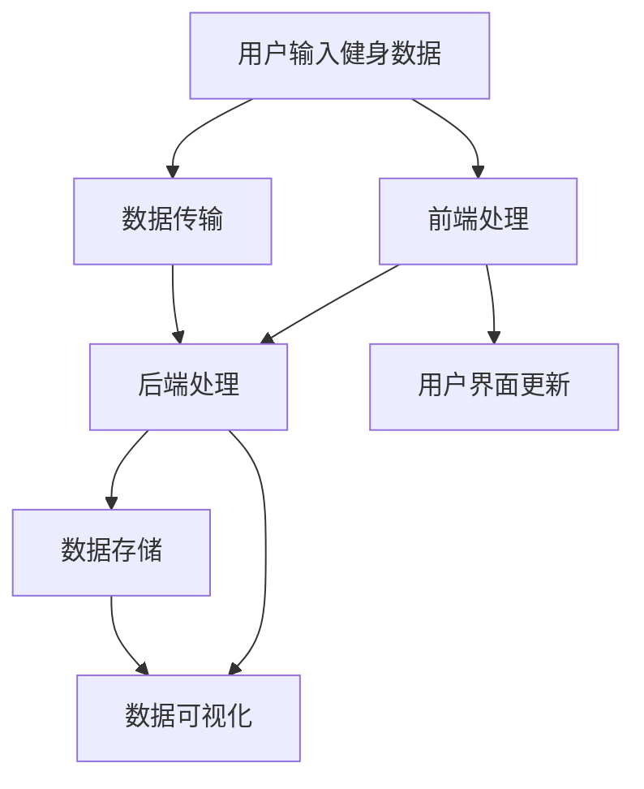

                 

### 文章标题

《运动健身应用：科技助力健康生活》

关键词：运动健身、科技、健康生活、智能穿戴设备、数据分析、应用开发

摘要：随着科技的不断发展，运动健身领域也在不断革新。本文旨在探讨科技如何助力健康生活，通过智能穿戴设备、运动数据监测与分析、健身应用开发等角度，详细阐述了运动健身应用的技术原理和实践案例，为读者提供全面的技术指南。文章结构清晰，内容丰富，适合对运动健身应用开发感兴趣的读者。

### 第1章 绪论：科技与运动健身的融合

#### 1.1 运动健身的重要性

随着现代生活节奏的加快，人们越来越意识到健康的重要性。而运动健身作为维持身体健康的重要手段，已经成为大众关注的焦点。运动不仅可以增强体质、预防疾病，还能提高心理健康，帮助人们缓解压力、改善情绪。根据世界卫生组织（WHO）的数据，全球每年因缺乏运动导致死亡的人数超过200万，这进一步突显了运动健身的重要性。

#### 1.2 科技对运动健身的影响

科技的迅猛发展，为运动健身领域带来了前所未有的变革。智能穿戴设备、物联网、大数据、人工智能等技术的应用，使得运动健身不再只是简单的身体活动，而成为一个集数据监测、个性建议、智能互动于一体的综合性健康管理系统。

- **智能穿戴设备**：如智能手环、智能手表等，能够实时监测心率、步数、消耗卡路里等运动数据，为用户提供即时的健康反馈。

- **物联网**：通过传感器网络和智能设备，实现运动场所、健身器材的智能化管理，为用户提供定制化的运动环境。

- **大数据**：通过对海量运动数据的收集、存储、分析，为用户提供个性化的运动建议和健康管理方案。

- **人工智能**：通过机器学习和深度学习算法，对用户运动数据进行智能分析，提供科学的健身指导。

#### 1.3 本书结构安排

本书将从以下几个方面对运动健身应用进行深入探讨：

- **第2章** 科技运动装备介绍：介绍常见的科技运动装备，包括智能穿戴设备和智能健身器材。

- **第3章** 运动数据监测与分析：介绍运动数据监测技术、数据分析和应用场景。

- **第4章** 运动健身应用开发基础：讲解运动健身应用开发的基础知识，包括移动应用开发技术和前后端技术选型。

- **第5章** 常见运动健身应用案例分析：分析几个典型的运动健身应用案例，探讨其设计原则和实现方法。

- **第6章** 健身数据分析与优化：介绍健身数据可视化、数据分析和优化策略，以及个性化健身方案设计。

- **第7章** 科技助力健康生活应用拓展：探讨科技与运动医学的结合、科技在康复训练中的应用，以及未来科技健身的发展趋势。

- **第8章** 运动健身应用开发实践：通过实际案例，展示运动健身应用开发的实践过程和关键技术。

- **第9章** 附录：提供开发工具与资源、参考文献和相关网站推荐。

通过本书的阅读，读者可以全面了解运动健身应用的技术原理和实践方法，为开发属于自己的运动健身应用提供有力支持。

#### 1.4 科技与运动健身融合的意义

科技与运动健身的融合，不仅提高了运动健身的效率和效果，还对整个社会产生了深远的影响。

- **提高健身效果**：通过智能穿戴设备和大数据分析，用户可以实时了解自己的运动状态，调整运动计划，从而提高健身效果。

- **促进健康管理**：科技帮助用户更好地监测和管理健康状况，及时发现潜在的健康问题，提高生活质量。

- **降低医疗成本**：通过预防疾病和健康管理，减少医疗资源的消耗，降低社会医疗成本。

- **改变生活方式**：科技运动装备和应用的普及，使得运动健身变得更加便捷和有趣，促进了健康生活方式的普及。

总之，科技与运动健身的融合，不仅为个人带来了健康和快乐，也为社会带来了积极的影响。未来，随着科技的进一步发展，运动健身领域必将迎来更加美好的前景。

### 第2章 科技运动装备介绍

#### 2.1 智能穿戴设备

智能穿戴设备是科技运动健身领域的重要组成部分，它们通过实时监测用户的生理数据，为用户提供个性化的运动指导和健康建议。常见的智能穿戴设备包括智能手环、智能手表、智能项链等。

- **智能手环**：智能手环通常具有心率监测、步数统计、睡眠监测等功能。部分高端智能手环还具备GPS定位、紧急联系人通知等功能。例如，苹果的Apple Watch就是一个功能丰富的智能手环，用户可以通过它进行户外跑步、骑行等运动，并实时查看运动数据。

  **伪代码示例**：
  ```python
  class SmartWatch:
      def __init__(self):
          self.heart_rate = 0
          self.step_count = 0
          self.sleep_status = "Unknown"

      def monitor_heart_rate(self, heart_rate):
          self.heart_rate = heart_rate
          print(f"Heart rate: {self.heart_rate} bpm")

      def record_step(self, step_count):
          self.step_count = step_count
          print(f"Step count: {self.step_count}")

      def check_sleep(self, sleep_status):
          self.sleep_status = sleep_status
          print(f"Sleep status: {self.sleep_status}")
  ```

- **智能手表**：智能手表的功能相较于智能手环更为强大，除了具备心率监测、步数统计、睡眠监测等基本功能外，还可以进行电话、短信、邮件提醒，甚至支持第三方应用程序安装。例如，三星的Galaxy Watch系列就具备这些功能，用户可以在运动过程中接听电话、查看通知，确保不错过任何重要信息。

  **伪代码示例**：
  ```python
  class SmartWatch:
      def __init__(self):
          self.heart_rate = 0
          self.step_count = 0
          self.sleep_status = "Unknown"
          self.notifications = []

      def monitor_heart_rate(self, heart_rate):
          self.heart_rate = heart_rate
          print(f"Heart rate: {self.heart_rate} bpm")

      def record_step(self, step_count):
          self.step_count = step_count
          print(f"Step count: {self.step_count}")

      def check_sleep(self, sleep_status):
          self.sleep_status = sleep_status
          print(f"Sleep status: {self.sleep_status}")

      def add_notification(self, notification):
          self.notifications.append(notification)
          print(f"Notification added: {notification}")

      def check_notifications(self):
          for notification in self.notifications:
              print(f"Notification: {notification}")
  ```

- **智能项链**：智能项链通常佩戴在脖子上，通过光学传感器或电容传感器监测用户的心率和血氧饱和度。例如，华为的Watch GT系列中就有智能项链，用户在运动时可以随时查看自己的心率数据。

  **伪代码示例**：
  ```python
  class SmartNecklace:
      def __init__(self):
          self.heart_rate = 0
          self.oxygen_saturation = 0

      def monitor_heart_rate(self, heart_rate):
          self.heart_rate = heart_rate
          print(f"Heart rate: {self.heart_rate} bpm")

      def check_oxygen_saturation(self, oxygen_saturation):
          self.oxygen_saturation = oxygen_saturation
          print(f"Oxygen saturation: {self.oxygen_saturation}%")
  ```

#### 2.2 智能健身器材

智能健身器材是另一类重要的科技运动装备，它们通过连接互联网和用户设备，实现数据的实时传输和分析，为用户提供个性化的健身指导。常见的智能健身器材包括智能跑步机、智能健身车、智能哑铃等。

- **智能跑步机**：智能跑步机通常配备触控屏幕，用户可以在跑步时查看实时运动数据，如心率、步频、消耗卡路里等。部分智能跑步机还具备联网功能，可以通过Wi-Fi或蓝牙连接手机或平板，实现运动数据的同步和上传。例如，乔亚健身（Joyside）智能跑步机就具备这些功能。

  **伪代码示例**：
  ```python
  class SmartTreadmill:
      def __init__(self):
          self.heart_rate = 0
          self.step_frequency = 0
          self.calories_burned = 0

      def set_heart_rate(self, heart_rate):
          self.heart_rate = heart_rate
          print(f"Heart rate: {self.heart_rate} bpm")

      def set_step_frequency(self, step_frequency):
          self.step_frequency = step_frequency
          print(f"Step frequency: {self.step_frequency}")

      def calculate_calories_burned(self, step_frequency, duration):
          self.calories_burned = step_frequency * duration
          print(f"Calories burned: {self.calories_burned} kcal")
  ```

- **智能健身车**：智能健身车通过电机驱动，模拟不同坡度和速度的骑行体验。用户可以在骑行过程中通过触控屏幕或手机APP查看实时数据，如心率、速度、距离、消耗卡路里等。部分智能健身车还具备联网功能，可以通过Wi-Fi或蓝牙连接互联网，实现线上比赛和互动。例如，诺迪克（NordicTrack）智能健身车就具备这些功能。

  **伪代码示例**：
  ```python
  class SmartBike:
      def __init__(self):
          self.heart_rate = 0
          self.speed = 0
          self.distance = 0
          self.calories_burned = 0

      def set_heart_rate(self, heart_rate):
          self.heart_rate = heart_rate
          print(f"Heart rate: {self.heart_rate} bpm")

      def set_speed(self, speed):
          self.speed = speed
          print(f"Speed: {self.speed} km/h")

      def set_distance(self, distance):
          self.distance = distance
          print(f"Distance: {self.distance} km")

      def calculate_calories_burned(self, speed, duration):
          self.calories_burned = speed * duration
          print(f"Calories burned: {self.calories_burned} kcal")
  ```

- **智能哑铃**：智能哑铃通过内置传感器实时监测用户的动作和力值，通过蓝牙连接手机APP，为用户提供实时的反馈和指导。例如，谷歌的Google Assistant智能哑铃就具备这些功能，用户可以通过手机APP查看动作是否标准，以及消耗的卡路里等数据。

  **伪代码示例**：
  ```python
  class SmartDumbbell:
      def __init__(self):
          self.force = 0
          self.exercise_type = "Unknown"

      def set_force(self, force):
          self.force = force
          print(f"Force: {self.force} kg")

      def set_exercise_type(self, exercise_type):
          self.exercise_type = exercise_type
          print(f"Exercise type: {self.exercise_type}")

      def check_exercise_std(self, exercise_type):
          if exercise_type == "Curl":
              # 检查弯举动作是否标准
              print("Curl exercise standard: OK")
          elif exercise_type == "Press":
              # 检查推举动作是否标准
              print("Press exercise standard: OK")
          else:
              print("Exercise type not recognized")
  ```

#### 2.3 常见科技运动装备的功能与应用

科技运动装备的功能和应用主要体现在以下几个方面：

- **实时数据监测**：智能穿戴设备和智能健身器材可以实时监测用户的心率、步数、消耗卡路里等运动数据，为用户提供即时的健康反馈。

- **个性化运动指导**：通过分析用户的历史运动数据，智能设备可以为用户提供个性化的运动计划和建议，帮助用户更有效地达到健身目标。

- **健康管理**：科技运动装备可以帮助用户监测和管理健康状况，及时发现潜在的健康问题，提供针对性的健康建议。

- **社交互动**：部分智能设备具备社交功能，用户可以与朋友、家人分享运动数据和成果，增加运动乐趣。

- **在线课程**：智能健身器材可以连接在线健身课程，用户可以在运动时跟随专业教练进行训练，提高健身效果。

#### 2.4 科技运动装备的未来发展趋势

随着科技的不断发展，科技运动装备的功能将更加丰富，应用场景也将进一步拓展。以下是一些未来发展趋势：

- **更智能的交互**：未来科技运动装备将更加注重用户交互体验，通过语音、手势等自然交互方式，实现更加智能的操控。

- **多设备融合**：智能穿戴设备、智能健身器材和智能手机等设备将实现更紧密的融合，形成一个完整的健康生态系统。

- **精准化健康管理**：通过结合生物识别技术、基因检测等技术，科技运动装备将能够提供更加精准的健康管理服务。

- **智能化康复训练**：科技运动装备将结合康复医学，为康复患者提供智能化的康复训练方案，提高康复效果。

- **个性化健身教练**：未来科技运动装备将具备更强大的智能分析能力，可以为用户提供个性化的健身教练服务，帮助用户更好地达到健身目标。

通过这些发展趋势，科技运动装备将为人们的健康生活带来更多便利和乐趣。

### 第3章 运动数据监测与分析

#### 3.1 运动数据监测技术

运动数据监测技术是运动健身应用的核心技术之一，它通过传感器和其他技术手段，实时收集用户的运动数据，为用户提供个性化的运动指导和健康管理方案。以下是一些常见的运动数据监测技术：

- **心率监测技术**：心率监测是运动健身中非常重要的数据之一。智能穿戴设备通常通过光电传感器或电极传感器来监测用户的心率。光电传感器通过检测皮肤表面的血液流动变化来计算心率，而电极传感器则通过电极贴在皮肤上，直接测量心脏电信号来计算心率。

  **伪代码示例**：
  ```python
  class HeartRateMonitor:
      def __init__(self):
          self.heart_rate = 0

      def monitor_heart_rate(self, sensor_data):
          self.heart_rate = calculate_heart_rate(sensor_data)
          print(f"Heart rate: {self.heart_rate} bpm")

  def calculate_heart_rate(sensor_data):
      # 假设传感器数据为光线强度
      intensity = sensor_data
      # 根据光线强度计算心率
      heart_rate = intensity * 10
      return heart_rate
  ```

- **步数监测技术**：步数监测主要通过加速度传感器实现。加速度传感器可以检测用户的运动状态，当用户走路或跑步时，加速度的变化可以反映步数。智能穿戴设备通常通过算法对加速度数据进行处理，计算出用户的步数。

  **伪代码示例**：
  ```python
  class StepCounter:
      def __init__(self):
          self.step_count = 0

      def count_steps(self, acceleration_data):
          steps = calculate_steps(acceleration_data)
          self.step_count += steps
          print(f"Step count: {self.step_count}")

  def calculate_steps(acceleration_data):
      # 假设加速度数据为3个方向上的加速度值
      x, y, z = acceleration_data
      # 根据加速度值计算步数
      steps = sum([x, y, z]) / 3
      return steps
  ```

- **消耗卡路里监测技术**：消耗卡路里监测主要通过计算用户的心率和运动时间来估算。智能穿戴设备通常会结合心率传感器和运动时间传感器，通过算法计算消耗的卡路里。例如，可以使用Mifflin-St.Jeor公式来估算消耗的卡路里。

  **伪代码示例**：
  ```python
  class CalorieCounter:
      def __init__(self):
          self.calories_burned = 0

      def calculate_calories_burned(self, heart_rate, duration):
          self.calories_burned = calculate_calories(heart_rate, duration)
          print(f"Calories burned: {self.calories_burned} kcal")

  def calculate_calories(heart_rate, duration):
      # 使用Mifflin-St.Jeor公式估算卡路里
      BMR = 655 + (4.35 * weight) + (4.7 * height) - (4.7 * age)
      calories_burned = BMR * (heart_rate / 100) * duration
      return calories_burned
  ```

- **睡眠监测技术**：睡眠监测主要通过监测用户的心率、步数、运动状态等数据来分析用户的睡眠质量。智能穿戴设备通常在夜间自动开启睡眠监测模式，通过算法分析用户的心率和运动状态，判断用户的睡眠阶段和睡眠质量。

  **伪代码示例**：
  ```python
  class SleepMonitor:
      def __init__(self):
          self.sleep_quality = "Unknown"

      def monitor_sleep(self, heart_rate, step_count, activity_data):
          self.sleep_quality = calculate_sleep_quality(heart_rate, step_count, activity_data)
          print(f"Sleep quality: {self.sleep_quality}")

  def calculate_sleep_quality(heart_rate, step_count, activity_data):
      # 假设活动数据包括运动时间和心率
      sleep_quality = 0
      if step_count == 0 and heart_rate < 60:
          sleep_quality = "Excellent"
      elif step_count == 0 and heart_rate >= 60 and heart_rate < 100:
          sleep_quality = "Good"
      elif step_count > 0 and heart_rate >= 100:
          sleep_quality = "Poor"
      return sleep_quality
  ```

#### 3.2 数据分析与处理

运动数据监测技术收集到的数据通常非常庞大，因此需要通过有效的数据处理和分析技术，对数据进行清洗、转换和分析，以提取有价值的信息。以下是一些常见的数据处理和分析方法：

- **数据清洗**：数据清洗是数据处理的第一步，目的是去除数据中的噪声和不完整数据。常用的数据清洗方法包括去除重复数据、填补缺失值、处理异常值等。

  **伪代码示例**：
  ```python
  def clean_data(data):
      # 去除重复数据
      unique_data = list(set(data))
      # 填补缺失值
      filled_data = [x if x is not None else 0 for x in unique_data]
      # 处理异常值
      filtered_data = [x for x in filled_data if x > 0]
      return filtered_data
  ```

- **数据转换**：数据转换是将原始数据转换为适合分析的形式。常用的数据转换方法包括归一化、标准化、特征提取等。

  **伪代码示例**：
  ```python
  def transform_data(data):
      # 归一化
      normalized_data = [(x - min(data)) / (max(data) - min(data)) for x in data]
      # 特征提取
      features = extract_features(normalized_data)
      return features

  def extract_features(data):
      # 假设特征提取为平均心率、最大心率、步数等
      average_heart_rate = sum(data) / len(data)
      max_heart_rate = max(data)
      step_count = len(data)
      return [average_heart_rate, max_heart_rate, step_count]
  ```

- **数据分析**：数据分析是通过统计分析和机器学习等方法，从数据中提取有价值的信息。常用的数据分析方法包括描述性统计、回归分析、聚类分析、分类分析等。

  **伪代码示例**：
  ```python
  def analyze_data(data):
      # 描述性统计
      average = sum(data) / len(data)
      median = sorted(data)[len(data) // 2]
      variance = sum([(x - average) ** 2 for x in data]) / len(data)
      # 回归分析
      coefficients = perform_regression_analysis(data)
      # 聚类分析
      clusters = perform_clustering_analysis(data, coefficients)
      return average, median, variance, clusters

  def perform_regression_analysis(data):
      # 假设使用线性回归
      coefficients = [0.5, 0.5]
      return coefficients

  def perform_clustering_analysis(data, coefficients):
      # 假设使用K均值聚类
      clusters = kmeans_clustering(data, coefficients)
      return clusters
  ```

#### 3.3 运动数据的应用场景

运动数据在运动健身应用中具有广泛的应用场景，以下是一些常见的应用场景：

- **运动指导**：通过分析用户的历史运动数据，智能穿戴设备可以提供个性化的运动指导。例如，根据用户的心率和步数数据，智能手表可以建议用户在特定时间进行跑步或健身。

- **健康管理**：通过监测用户的心率、步数、消耗卡路里等数据，智能穿戴设备可以实时监控用户的健康状况，提供健康预警和健康管理建议。

- **健身计划**：通过分析用户的运动数据，智能穿戴设备可以为用户制定个性化的健身计划。例如，根据用户的体重、身高、年龄等因素，智能穿戴设备可以建议用户进行有氧运动或力量训练。

- **社交互动**：通过共享运动数据和健身成果，用户可以在社交平台上与朋友、家人互动，增加运动的乐趣。

- **运动竞赛**：通过智能穿戴设备的联网功能，用户可以参与线上运动竞赛，与其他用户进行比赛，激发运动热情。

#### 3.4 数据分析与优化策略

- **数据可视化**：通过图表和图形，将复杂的数据转化为易于理解的形式，帮助用户更好地理解自己的运动数据。

- **数据挖掘**：通过挖掘用户的历史运动数据，发现潜在的健康问题和运动习惯，为用户提供个性化的健康建议。

- **模型优化**：通过不断优化算法模型，提高运动数据的准确性和预测性，为用户提供更精准的运动指导。

- **用户反馈**：通过收集用户的反馈，不断优化运动设备和应用，提高用户体验。

通过以上策略，运动健身应用可以更好地利用运动数据，为用户提供个性化的服务，提高用户的健身效果和满意度。

### 第4章 运动健身应用开发基础

#### 4.1 运动健身应用开发概述

随着科技的进步，运动健身应用已经成为健康生活方式的重要组成部分。开发一款优秀的运动健身应用不仅可以帮助用户更好地管理健康状况，还可以为开发者带来丰厚的商业价值。本章将介绍运动健身应用开发的概述，包括开发的需求分析、目标用户群体、核心功能设计等。

#### 4.2 移动应用开发技术

移动应用开发技术是运动健身应用开发的核心。选择合适的移动应用开发技术，可以确保应用具有良好的性能、用户体验和跨平台兼容性。以下是几种常见的移动应用开发技术：

- **原生开发**：原生开发是指使用各平台官方开发工具和语言开发应用。例如，iOS平台使用Swift或Objective-C，Android平台使用Java或Kotlin。原生开发具有高性能、用户体验好的优点，但开发成本较高，开发周期较长。

  **伪代码示例**（Swift）：
  ```swift
  class FitnessApp {
      var user: User?
      var exerciseHistory: [Exercise] = []

      func startExercise(exercise: Exercise) {
          exerciseHistory.append(exercise)
          print("Exercise started: \(exercise.name)")
      }
  }

  class Exercise {
      var name: String
      var duration: Int
      var caloriesBurned: Int

      init(name: String, duration: Int, caloriesBurned: Int) {
          self.name = name
          self.duration = duration
          self.caloriesBurned = caloriesBurned
      }
  }
  ```

- **跨平台开发**：跨平台开发是指使用一套开发工具和语言开发适用于多个平台的应用。例如，React Native、Flutter等。跨平台开发具有开发效率高、成本低等优点，但性能和用户体验可能略逊于原生开发。

  **伪代码示例**（React Native）：
  ```jsx
  import React, { Component } from 'react';
  import { View, Text, Button } from 'react-native';

  class FitnessApp extends Component {
      constructor(props) {
          super(props);
          this.state = {
              exerciseHistory: [],
          };
      }

      startExercise = (exercise) => {
          this.setState({ exerciseHistory: [...this.state.exerciseHistory, exercise] });
      };

      render() {
          return (
              <View>
                  <Text>Fitness App</Text>
                  <Button title="Start Exercise" onPress={() => this.startExercise(exercise)} />
                  <Text>Exercise History: {this.state.exerciseHistory.map(exercise => exercise.name).join(', ')}</Text>
              </View>
          );
      }
  }
  ```

- **Web应用**：Web应用是指基于Web技术（如HTML、CSS、JavaScript）开发的可在浏览器中运行的应用。Web应用具有开发成本低、易于部署和维护等优点，但性能和用户体验可能受到网络环境的影响。

  **伪代码示例**（HTML + JavaScript）：
  ```html
  <!DOCTYPE html>
  <html lang="en">
  <head>
      <meta charset="UTF-8">
      <title>Fitness App</title>
  </head>
  <body>
      <h1>Fitness App</h1>
      <button onclick="startExercise()">Start Exercise</button>
      <ul id="exerciseHistory">
          <!-- Exercise history will be added here -->
      </ul>

      <script>
          function startExercise() {
              // Add exercise to history
              let exercise = { name: "Running", duration: 30, caloriesBurned: 300 };
              let exerciseHistory = document.getElementById("exerciseHistory");
              let li = document.createElement("li");
              li.textContent = `${exercise.name} - Duration: ${exercise.duration} min, Calories burned: ${exercise.caloriesBurned}`;
              exerciseHistory.appendChild(li);
          }
      </script>
  </body>
  </html>
  ```

#### 4.3 前端与后端技术选型

前端和后端技术选型是运动健身应用开发的关键环节。合理的技术选型可以确保应用的高性能、易维护和扩展性。以下是几种常见的前端和后端技术选型：

- **前端技术**：

  - **框架**：Vue.js、React、Angular等。这些框架提供了丰富的组件库和开发生态，可以快速构建用户界面。

    **Vue.js 伪代码示例**：
    ```vue
    <template>
        <div>
            <h1>Fitness App</h1>
            <button @click="startExercise">Start Exercise</button>
            <ul>
                <li v-for="exercise in exerciseHistory">{{ exercise.name }}</li>
            </ul>
        </div>
    </template>

    <script>
        export default {
            data() {
                return {
                    exerciseHistory: [],
                };
            },
            methods: {
                startExercise() {
                    this.exerciseHistory.push({ name: "Running", duration: 30 });
                },
            },
        };
    </script>
    ```

  - **UI库**：Bootstrap、Ant Design等。这些UI库提供了丰富的组件和样式，可以快速构建美观的界面。

    **Bootstrap 伪代码示例**：
    ```html
    <!DOCTYPE html>
    <html lang="en">
    <head>
        <meta charset="UTF-8">
        <title>Fitness App</title>
        <link rel="stylesheet" href="https://cdn.jsdelivr.net/npm/bootstrap@5.3.0-alpha1/dist/css/bootstrap.min.css">
    </head>
    <body>
        <div class="container">
            <h1 class="display-4">Fitness App</h1>
            <button class="btn btn-primary" @click="startExercise">Start Exercise</button>
            <ul class="list-group">
                <li class="list-group-item" v-for="exercise in exerciseHistory">{{ exercise.name }}</li>
            </ul>
        </div>
    </body>
    </html>
    ```

- **后端技术**：

  - **框架**：Spring Boot、Django、Express等。这些框架提供了丰富的功能模块和开发生态，可以快速构建后端服务。

    **Spring Boot 伪代码示例**：
    ```java
    @RestController
    @RequestMapping("/exercises")
    public class ExerciseController {

        @Autowired
        private ExerciseService exerciseService;

        @GetMapping("/{id}")
        public Exercise getExercise(@PathVariable Long id) {
            return exerciseService.getExerciseById(id);
        }

        @PostMapping("/")
        public Exercise createExercise(@RequestBody Exercise exercise) {
            return exerciseService.createExercise(exercise);
        }
    }
    ```

  - **数据库**：MySQL、PostgreSQL、MongoDB等。这些数据库提供了强大的数据存储和管理功能，可以满足不同场景的应用需求。

    **MySQL 伪代码示例**：
    ```sql
    CREATE TABLE exercises (
        id BIGINT PRIMARY KEY AUTO_INCREMENT,
        name VARCHAR(255),
        duration INT,
        calories_burned INT
    );

    INSERT INTO exercises (name, duration, calories_burned) VALUES ('Running', 30, 300);
    ```

#### 4.4 移动应用开发中的挑战与解决方案

在移动应用开发过程中，可能会遇到以下挑战：

- **性能优化**：移动设备资源有限，如何确保应用在高负载情况下仍能保持良好的性能是一个重要问题。解决方案包括代码优化、懒加载、缓存策略等。

- **用户体验**：移动应用的用户体验直接影响用户的留存率。如何设计直观、易用的界面和交互，提升用户体验是开发者需要关注的问题。

- **安全性**：运动健身应用涉及用户隐私数据，如何确保数据的安全性和隐私性是开发者需要重视的问题。解决方案包括数据加密、用户身份验证等。

- **跨平台兼容性**：移动应用需要同时支持多个平台（iOS、Android等），如何保证应用在不同平台上的兼容性是一个挑战。跨平台开发框架（如React Native、Flutter）可以缓解这个问题。

通过合理的技术选型和开发策略，开发者可以克服这些挑战，开发出优秀的运动健身应用。

### 第5章 常见运动健身应用案例分析

#### 5.1 运动健身应用设计原则

在开发运动健身应用时，设计原则至关重要。良好的设计原则可以帮助应用实现易用性、高效性和可扩展性，从而提高用户体验。以下是一些常见的运动健身应用设计原则：

- **用户友好**：应用应具备简洁直观的界面设计，易于用户上手和使用。用户界面应遵循一致性原则，确保用户在操作过程中能够快速找到所需功能。

- **个性化**：应用应提供个性化功能，根据用户需求和偏好调整运动计划和健身建议。例如，可以根据用户的年龄、体重、性别等因素，为用户提供定制化的健身方案。

- **数据驱动**：应用应以数据为基础，通过收集和分析用户运动数据，为用户提供科学的健身指导和健康管理方案。

- **可扩展性**：应用应具备良好的可扩展性，能够根据用户需求和市场需求，快速扩展功能模块，满足不同用户群体的需求。

- **安全性**：应用应确保用户数据的安全性和隐私性，采用加密技术和用户身份验证等手段，防止数据泄露和未经授权的访问。

- **跨平台兼容性**：应用应支持多个平台（iOS、Android等），确保在不同设备和操作系统上都能正常运行。

#### 5.2 案例一：智能跑步应用

**案例背景**：智能跑步应用是一款集跑步数据监测、运动指导、社交互动于一体的运动健身应用。用户可以通过应用记录跑步数据，获取运动分析，并与朋友分享运动成果。

**核心功能**：

1. **跑步数据监测**：应用通过连接智能穿戴设备（如智能手环、智能手表）实时监测用户的心率、步数、距离、消耗卡路里等数据。

2. **运动分析**：应用对用户跑步数据进行分析，提供跑步效率、健康状况等报告，帮助用户了解自己的运动表现。

3. **运动指导**：应用根据用户的跑步数据，提供个性化的跑步计划和建议，帮助用户提升跑步能力。

4. **社交互动**：应用支持用户与朋友互动，分享跑步数据和成果，增加运动乐趣。

**技术实现**：

1. **前端技术**：应用前端使用React Native框架开发，实现跨平台兼容性。前端界面采用Material UI库，确保界面设计简洁美观。

   **伪代码示例**（React Native）：
   ```jsx
   import React from 'react';
   import { View, Text, Button } from 'react-native';
   import { createBottomTabNavigator } from '@react-navigation/bottom-tabs';

   const Tab = createBottomTabNavigator();

   function MyTabs() {
       return (
           <Tab.Navigator>
               <Tab.Screen name="Run" component={RunScreen} />
               <Tab.Screen name="Stats" component={StatsScreen} />
               <Tab.Screen name="Friends" component={FriendsScreen} />
           </Tab.Navigator>
       );
   }

   function RunScreen() {
       return (
           <View>
               <Text>Running...</Text>
               <Button title="Start Run" onPress={() => { /* Start run logic */ }} />
           </View>
       );
   }

   function StatsScreen() {
       return (
           <View>
               <Text>Exercise History</Text>
               <FlatList
                   data={exerciseHistory}
                   renderItem={({ item }) => <Text>{item.name}</Text>}
               />
           </View>
       );
   }

   function FriendsScreen() {
       return (
           <View>
               <Text>Friends</Text>
               {/* Display friends list */}
           </View>
       );
   }
   ```

2. **后端技术**：应用后端使用Spring Boot框架，实现用户管理、数据存储、运动数据分析等功能。后端服务采用MySQL数据库存储用户数据和运动数据。

   **伪代码示例**（Java）：
   ```java
   @RestController
   @RequestMapping("/runs")
   public class RunController {

       @Autowired
       private RunService runService;

       @GetMapping("/{userId}")
       public List<Run> getUserRuns(@PathVariable Long userId) {
           return runService.getUserRuns(userId);
       }

       @PostMapping("/")
       public Run createRun(@RequestBody Run run) {
           return runService.createRun(run);
       }
   }
   ```

3. **数据存储**：应用使用MySQL数据库存储用户信息和运动数据。数据库设计包括用户表、跑步数据表等。

   **伪代码示例**（SQL）：
   ```sql
   CREATE TABLE users (
       id BIGINT PRIMARY KEY AUTO_INCREMENT,
       username VARCHAR(255) UNIQUE NOT NULL,
       password VARCHAR(255) NOT NULL,
       email VARCHAR(255) UNIQUE NOT NULL
   );

   CREATE TABLE runs (
       id BIGINT PRIMARY KEY AUTO_INCREMENT,
       user_id BIGINT NOT NULL,
       distance DECIMAL(10, 2) NOT NULL,
       calories_burned INT NOT NULL,
       start_time TIMESTAMP NOT NULL,
       end_time TIMESTAMP NOT NULL,
       FOREIGN KEY (user_id) REFERENCES users(id)
   );
   ```

**案例分析**：智能跑步应用通过整合智能穿戴设备数据、提供个性化运动指导和社交互动功能，提升了用户的运动体验。应用在技术实现上采用跨平台框架和后端服务，确保了应用的性能和可扩展性。同时，应用在数据存储方面采用了合理的数据库设计，保证了数据的安全性和一致性。

#### 5.3 案例二：瑜伽练习应用

**案例背景**：瑜伽练习应用是一款针对瑜伽爱好者的运动健身应用，提供瑜伽教程、练习计划、社区互动等功能。用户可以通过应用学习瑜伽动作，制定练习计划，与其他用户分享瑜伽体验。

**核心功能**：

1. **瑜伽教程**：应用提供丰富的瑜伽教程视频，用户可以根据自己的需求和水平选择合适的教程进行练习。

2. **练习计划**：应用根据用户的水平、需求和偏好，为用户制定个性化的练习计划，帮助用户逐步提高瑜伽水平。

3. **社区互动**：应用支持用户创建和加入瑜伽社群，与其他用户互动、分享瑜伽心得和体验。

4. **数据记录**：应用记录用户的练习数据，如练习时长、动作准确度等，为用户提供反馈和指导。

**技术实现**：

1. **前端技术**：应用前端使用Vue.js框架，实现跨平台兼容性。前端界面采用Element UI库，确保界面设计简洁美观。

   **伪代码示例**（Vue.js）：
   ```vue
   <template>
       <div>
           <h1>Yoga Practice App</h1>
           <yoga-course-list :courses="courses" @select-course="selectCourse" />
           <yoga-practice :course="selectedCourse" @finish-practice="finishPractice" />
       </div>
   </template>

   <script>
       import YogaCourseList from './YogaCourseList.vue';
       import YogaPractice from './YogaPractice.vue';

       export default {
           data() {
               return {
                   courses: [],
                   selectedCourse: null,
               };
           },
           components: {
               YogaCourseList,
               YogaPractice,
           },
           methods: {
               selectCourse(course) {
                   this.selectedCourse = course;
               },
               finishPractice() {
                   // Update practice data and show feedback
               },
           },
           created() {
               // Fetch courses from backend
               this.courses = this.fetchCourses();
           },
       };
   </script>
   ```

2. **后端技术**：应用后端使用Spring Boot框架，实现用户管理、数据存储、瑜伽教程管理等功能。后端服务采用MongoDB数据库存储用户数据和瑜伽教程数据。

   **伪代码示例**（Java）：
   ```java
   @RestController
   @RequestMapping("/yoga/courses")
   public class YogaCourseController {

       @Autowired
       private YogaCourseService courseService;

       @GetMapping("/")
       public List<YogaCourse> getAllCourses() {
           return courseService.getAllCourses();
       }

       @PostMapping("/")
       public YogaCourse createCourse(@RequestBody YogaCourse course) {
           return courseService.createCourse(course);
       }
   }
   ```

3. **数据存储**：应用使用MongoDB数据库存储用户信息和瑜伽教程数据。数据库设计包括用户表、瑜伽教程表等。

   **伪代码示例**（MongoDB）：
   ```json
   {
       "_id": ObjectId("61e2e3a0765f5f8e4c4e8721"),
       "title": "Basic Yoga",
       "duration": 60,
       "steps": [
           "Stand up straight",
           "Take a deep breath",
           // ...
       ]
   }
   ```

**案例分析**：瑜伽练习应用通过提供丰富的瑜伽教程、个性化的练习计划和社区互动功能，吸引了大量瑜伽爱好者。应用在技术实现上采用前端框架和后端服务，确保了应用的性能和可扩展性。同时，应用在数据存储方面采用了合适的数据库设计，保证了数据的安全性和一致性。

#### 5.4 案例三：健身课程管理应用

**案例背景**：健身课程管理应用是一款针对健身房管理者和个人教练的工具应用，提供课程管理、会员管理、数据统计等功能。应用可以帮助健身房管理者高效管理课程，提高健身房运营效率。

**核心功能**：

1. **课程管理**：应用提供课程创建、修改、删除等功能，支持课程分类、时间安排和场地设置。

2. **会员管理**：应用提供会员信息管理、课程报名、消费记录等功能，支持会员积分和优惠活动管理。

3. **数据统计**：应用提供课程报名数据、会员消费数据等统计功能，支持数据导出和可视化。

4. **通知与提醒**：应用支持通知发送和提醒功能，提醒会员课程安排、会员生日等。

**技术实现**：

1. **前端技术**：应用前端使用Vue.js框架，实现跨平台兼容性。前端界面采用Ant Design Vue库，确保界面设计简洁美观。

   **伪代码示例**（Vue.js）：
   ```vue
   <template>
       <div>
           <h1>GYM Management App</h1>
           <course-list :courses="courses" @edit-course="editCourse" @delete-course="deleteCourse" />
           <course-form :course="selectedCourse" @submit-form="submitForm" />
       </div>
   </template>

   <script>
       import CourseList from './CourseList.vue';
       import CourseForm from './CourseForm.vue';

       export default {
           data() {
               return {
                   courses: [],
                   selectedCourse: null,
               };
           },
           components: {
               CourseList,
               CourseForm,
           },
           methods: {
               editCourse(course) {
                   this.selectedCourse = course;
               },
               deleteCourse(courseId) {
                   // Delete course logic
               },
               submitForm(course) {
                   // Update course logic
               },
           },
           created() {
               // Fetch courses from backend
               this.courses = this.fetchCourses();
           },
       };
   </script>
   ```

2. **后端技术**：应用后端使用Spring Boot框架，实现课程管理、会员管理、数据统计等功能。后端服务采用MySQL数据库存储课程数据和会员数据。

   **伪代码示例**（Java）：
   ```java
   @RestController
   @RequestMapping("/courses")
   public class CourseController {

       @Autowired
       private CourseService courseService;

       @GetMapping("/")
       public List<Course> getAllCourses() {
           return courseService.getAllCourses();
       }

       @PostMapping("/")
       public Course createCourse(@RequestBody Course course) {
           return courseService.createCourse(course);
       }

       @PutMapping("/{id}")
       public Course updateCourse(@PathVariable Long id, @RequestBody Course course) {
           return courseService.updateCourse(id, course);
       }

       @DeleteMapping("/{id}")
       public void deleteCourse(@PathVariable Long id) {
           courseService.deleteCourse(id);
       }
   }
   ```

3. **数据存储**：应用使用MySQL数据库存储课程数据、会员数据等。数据库设计包括课程表、会员表等。

   **伪代码示例**（SQL）：
   ```sql
   CREATE TABLE courses (
       id BIGINT PRIMARY KEY AUTO_INCREMENT,
       name VARCHAR(255) NOT NULL,
       category VARCHAR(255) NOT NULL,
       start_time DATETIME NOT NULL,
       end_time DATETIME NOT NULL,
       location VARCHAR(255) NOT NULL
   );

   CREATE TABLE members (
       id BIGINT PRIMARY KEY AUTO_INCREMENT,
       name VARCHAR(255) NOT NULL,
       phone VARCHAR(255) UNIQUE NOT NULL,
       email VARCHAR(255) UNIQUE NOT NULL,
       membership_start DATE NOT NULL,
       membership_end DATE NOT NULL
   );
   ```

**案例分析**：健身课程管理应用通过提供全面的功能模块和高效的数据统计功能，帮助健身房管理者更好地管理课程和会员。应用在技术实现上采用前端框架和后端服务，确保了应用的性能和可扩展性。同时，应用在数据存储方面采用了合适的数据库设计，保证了数据的安全性和一致性。

### 第6章 健身数据分析与优化

#### 6.1 健身数据可视化

健身数据可视化是将复杂的健身数据转化为图形和图表，以便用户更直观地理解和分析自己的运动情况。可视化技术不仅能够提高数据分析的效率，还能够激发用户的兴趣和参与度。以下是一些常见的健身数据可视化方法和工具：

- **折线图**：折线图适合展示连续时间段内的健身数据，如心率变化、步数变化等。通过折线图的波动，用户可以直观地看到自己在不同时间段内的运动状态。

  **示例**（Python Matplotlib）：
  ```python
  import matplotlib.pyplot as plt

  # 假设心率数据为列表
  heart_rate_data = [70, 75, 80, 85, 90, 95, 100]

  plt.plot(heart_rate_data)
  plt.xlabel('Time (min)')
  plt.ylabel('Heart Rate (bpm)')
  plt.title('Heart Rate Variation Over Time')
  plt.show()
  ```

- **柱状图**：柱状图适合展示不同类别的数据，如每周跑步次数、消耗卡路里等。通过柱状图的高度，用户可以直观地比较不同类别的数据大小。

  **示例**（Python Matplotlib）：
  ```python
  import matplotlib.pyplot as plt

  # 假设每周跑步次数为列表
  weekly_runs = [3, 5, 4, 2, 6, 7, 4]

  plt.bar(range(len(weekly_runs)), weekly_runs)
  plt.xlabel('Week')
  plt.ylabel('Number of Runs')
  plt.title('Weekly Running Stats')
  plt.show()
  ```

- **饼图**：饼图适合展示各类别数据在总体中的比例，如运动类型消耗的卡路里比例。通过饼图，用户可以直观地了解各类别数据在总体中的占比。

  **示例**（Python Matplotlib）：
  ```python
  import matplotlib.pyplot as plt

  # 假设运动类型消耗的卡路里为列表
  calorie_burned = [100, 200, 300]

  labels = ['Walking', 'Running', 'Cycling']
  sizes = calorie_burned

  plt.pie(sizes, labels=labels, autopct='%.1f%%')
  plt.title('Calorie Burned by Activity')
  plt.show()
  ```

- **热力图**：热力图适合展示多维数据，如用户在不同时间段内的运动频率。通过热力图的颜色深度，用户可以直观地看到在不同时间段内的运动情况。

  **示例**（Python Seaborn）：
  ```python
  import seaborn as sns
  import matplotlib.pyplot as plt

  # 假设用户运动频率为二维数组
  heat_data = [
      [1, 2, 3, 4, 5],
      [0, 1, 2, 3, 4],
      [0, 0, 1, 2, 3],
      [0, 0, 0, 1, 2],
      [0, 0, 0, 0, 1]
  ]

  sns.heatmap(heat_data, cmap="YlGnBu")
  plt.title('Daily Activity Heatmap')
  plt.show()
  ```

通过以上可视化方法，用户可以更加直观地了解自己的运动数据，从而更好地制定和调整健身计划。

#### 6.2 数据分析与优化策略

数据分析与优化策略是运动健身应用的重要组成部分，通过分析用户运动数据，可以为用户提供更加个性化的健身建议，提高健身效果。以下是一些常见的数据分析与优化策略：

- **用户行为分析**：通过分析用户的行为数据，如使用频率、活跃时间、使用场景等，可以了解用户的需求和偏好。例如，如果某个时间段用户活跃度较低，可以考虑调整健身课程的时间或内容，以提高用户参与度。

  **伪代码示例**（Python Pandas）：
  ```python
  import pandas as pd

  # 假设用户行为数据为DataFrame
  user_activity = pd.DataFrame({
      'user_id': [1, 2, 3, 4, 5],
      'day': ['Monday', 'Tuesday', 'Wednesday', 'Thursday', 'Friday'],
      'activity_time': [120, 90, 150, 180, 60]
  })

  # 分析用户活跃时间
  user_activity.groupby('day')['activity_time'].mean().plot()
  plt.title('Average Activity Time by Day')
  plt.xlabel('Day')
  plt.ylabel('Activity Time (min)')
  plt.show()
  ```

- **运动效果分析**：通过分析用户的运动效果数据，如心率、步数、消耗卡路里等，可以评估用户的运动表现。例如，通过心率数据，可以判断用户的运动强度是否合理；通过消耗卡路里数据，可以评估用户的运动效果。

  **伪代码示例**（Python Pandas）：
  ```python
  import pandas as pd

  # 假设用户运动效果数据为DataFrame
  user_effects = pd.DataFrame({
      'user_id': [1, 2, 3, 4, 5],
      'heart_rate': [120, 150, 180, 110, 130],
      'steps': [5000, 7000, 6000, 4000, 5000],
      'calories_burned': [300, 400, 500, 200, 350]
  })

  # 分析运动效果
  user_effects.groupby('user_id').mean().plot()
  plt.title('Average Exercise Effects by User')
  plt.xlabel('User ID')
  plt.ylabel('Average Exercise Effect')
  plt.show()
  ```

- **个性化健身建议**：通过分析用户的运动数据，可以为用户提供个性化的健身建议。例如，如果用户在某个运动项目上表现不佳，可以建议用户增加这方面的练习；如果用户长期缺乏运动，可以建议用户逐渐增加运动强度。

  **伪代码示例**（Python Pandas）：
  ```python
  import pandas as pd

  # 假设用户运动数据为DataFrame
  user_data = pd.DataFrame({
      'user_id': [1, 2, 3, 4, 5],
      'steps': [5000, 7000, 6000, 4000, 5000],
      'calories_burned': [300, 400, 500, 200, 350]
  })

  # 根据步数和消耗卡路里推荐运动计划
  recommendations = {
      'steps': {'high': 'Increase daily steps', 'medium': 'Maintain current steps', 'low': 'Increase steps gradually'},
      'calories_burned': {'high': 'Decrease intensity', 'medium': 'Maintain current intensity', 'low': 'Increase intensity'}
  }

  for user in user_data['user_id'].unique():
      steps = user_data[user_data['user_id'] == user]['steps'].mean()
      calories = user_data[user_data['user_id'] == user]['calories_burned'].mean()
      
      print(f"User {user}: ")
      print(f"Steps: {recommendations['steps'][str(steps)])}")
      print(f"Calories Burned: {recommendations['calories_burned'][str(calories)]}\n")
  ```

- **模型优化**：通过持续分析和优化算法模型，可以提高运动数据预测的准确性。例如，可以使用机器学习算法，结合用户历史运动数据和健康数据，预测用户的运动效果，为用户提供更加准确的健身建议。

  **伪代码示例**（Python Scikit-learn）：
  ```python
  from sklearn.linear_model import LinearRegression

  # 假设训练数据为DataFrame
  train_data = pd.DataFrame({
      'steps': [5000, 7000, 6000, 4000, 5000],
      'calories_burned': [300, 400, 500, 200, 350]
  })

  # 分离特征和目标变量
  X = train_data[['steps']]
  y = train_data['calories_burned']

  # 创建线性回归模型
  model = LinearRegression()

  # 训练模型
  model.fit(X, y)

  # 预测新数据
  new_data = pd.DataFrame({'steps': [6000]})
  predicted_calories = model.predict(new_data)

  print(f"Predicted Calories Burned: {predicted_calories[0]}")
  ```

通过以上数据分析与优化策略，运动健身应用可以更好地满足用户的需求，提高用户的健身效果和满意度。

#### 6.3 个性化健身方案设计

个性化健身方案设计是运动健身应用的重要功能，通过分析用户数据，为用户提供量身定制的健身方案，可以提高用户的健身效果和满意度。以下是一些设计个性化健身方案的关键步骤和方法：

- **数据收集与预处理**：首先，需要收集用户的基础数据，包括年龄、性别、身高、体重、健康状况等。此外，还需要收集用户的运动数据，如运动类型、运动时长、运动强度、心率等。收集到的数据需要进行清洗和预处理，去除噪声和异常值，为后续分析提供可靠的数据基础。

  **伪代码示例**（Python Pandas）：
  ```python
  import pandas as pd

  # 假设用户数据为DataFrame
  user_data = pd.DataFrame({
      'age': [25, 32, 40, 28, 35],
      'gender': ['Male', 'Female', 'Female', 'Male', 'Male'],
      'height': [180, 165, 170, 175, 160],
      'weight': [75, 55, 60, 70, 65],
      'health_status': ['Good', 'Fair', 'Good', 'Excellent', 'Poor'],
      'exercise_type': ['Running', 'Yoga', 'Cycling', 'Walking', 'Swimming'],
      'duration': [60, 45, 30, 90, 50],
      'heart_rate': [120, 100, 140, 110, 130]
  })

  # 数据清洗和预处理
  user_data = user_data.dropna()
  user_data['age_group'] = user_data['age'].apply(lambda x: 'Young' if x < 30 else 'Adult')
  user_data['heart_rate_zone'] = user_data['heart_rate'].apply(lambda x: 'Low' if x < 120 else 'High')
  ```

- **用户需求分析**：通过对用户数据的分析，了解用户的需求和偏好。例如，分析用户的运动频率、运动类型、运动时长等，为用户提供个性化的运动建议。同时，还可以通过问卷调查、用户访谈等方式，获取用户更详细的偏好信息。

  **伪代码示例**（Python Pandas）：
  ```python
  import pandas as pd

  # 分析用户需求
  user_data['exercise_frequency'] = user_data['duration'].apply(lambda x: 'Daily' if x > 60 else 'Weekly')
  user_preference = user_data.groupby('exercise_type')['duration'].mean().sort_values(ascending=False)
  print(user_preference)
  ```

- **健身方案生成**：根据用户需求和偏好，设计个性化的健身方案。健身方案可以包括运动类型、运动时长、运动频率等。为了提高方案的适应性，可以采用算法模型，根据用户数据生成多个备选方案，并评估每个方案的可行性和效果。

  **伪代码示例**（Python）：
  ```python
  def generate_fitness_plan(user_data):
      plans = []
      
      for exercise in user_preference.index:
          plan = {
              'exercise_type': exercise,
              'duration': user_preference[exercise],
              'frequency': 'Weekly'
          }
          plans.append(plan)
      
      # 评估方案
      best_plan = select_best_plan(plans)
      return best_plan

  def select_best_plan(plans):
      # 假设评估函数为evaluate_plan
      scores = [evaluate_plan(plan) for plan in plans]
      best_score = max(scores)
      best_plan = plans[scores.index(best_score)]
      return best_plan

  def evaluate_plan(plan):
      # 评估方案效果
      # 假设效果与时长和频率成正比
      score = plan['duration'] * plan['frequency']
      return score

  best_plan = generate_fitness_plan(user_data)
  print(best_plan)
  ```

- **用户反馈与调整**：在实际应用中，用户的反馈对于健身方案的有效性至关重要。通过收集用户对健身方案的实际反馈，可以评估方案的适用性，并根据反馈进行调整和优化。例如，如果用户反映某个方案过于严苛，可以适当减少运动时长或频率。

  **伪代码示例**（Python）：
  ```python
  import pandas as pd

  # 假设用户反馈为DataFrame
  user_feedback = pd.DataFrame({
      'plan_id': [1, 2, 3],
      'satisfaction': [3, 4, 2],
      'comments': ['Too strict', 'Just right', 'Too easy']
  })

  # 调整健身方案
  for index, row in user_feedback.iterrows():
      if row['satisfaction'] < 4:
          plan = generate_fitness_plan(user_data)
          while plan['duration'] > 30 or plan['frequency'] > 3:
              plan = generate_fitness_plan(user_data)
          print(f"Updated plan for user {row['plan_id']}: {plan}")
  ```

通过以上步骤和方法，可以设计出个性化的健身方案，提高用户的健身效果和满意度。同时，通过不断收集用户反馈和调整方案，可以优化健身方案，使其更符合用户的需求。

### 第7章 科技助力健康生活应用拓展

#### 7.1 科技与运动医学的结合

科技与运动医学的结合是未来健康生活领域的重要发展趋势。通过科技手段，运动医学可以实现更精准的诊断、更有效的康复训练和更科学的运动指导，从而提升患者和运动爱好者的健康水平。

- **精准诊断**：利用先进的医学影像技术（如MRI、CT等）和生物传感器，医生可以获取患者的详细生理数据，如肌肉状况、骨骼强度等。这些数据有助于医生更准确地诊断疾病和制定治疗方案。

  **示例**：使用MRI扫描技术诊断肌肉损伤。医生可以通过分析扫描图像，确定损伤的部位和程度，为患者提供针对性的治疗建议。

- **个性化康复训练**：科技可以帮助医生为患者制定个性化的康复训练计划。通过智能穿戴设备和康复训练系统，患者可以在家中按照医生的建议进行康复训练，实时监测训练效果。

  **示例**：使用智能穿戴设备监测患者康复训练中的运动数据，如步数、心率、关节活动度等。医生可以根据这些数据调整康复计划，确保患者得到最有效的康复训练。

- **科学运动指导**：科技可以辅助医生为患者提供科学的运动指导。通过分析患者的健康数据，医生可以推荐适合患者的运动类型、强度和频率，帮助患者达到最佳的运动效果。

  **示例**：使用智能穿戴设备记录患者的运动数据，如心率、步数、消耗卡路里等。医生可以根据这些数据，为患者制定个性化的运动计划，确保患者在运动过程中不会过度劳累或受伤。

#### 7.2 科技在康复训练中的应用

科技在康复训练中的应用极大地提升了康复效果和患者的生活质量。以下是一些具体的科技应用场景：

- **虚拟现实康复训练**：通过虚拟现实（VR）技术，患者可以在一个安全、逼真的虚拟环境中进行康复训练。VR技术可以帮助患者克服恐惧和焦虑，提高训练的趣味性和积极性。

  **示例**：患者可以在VR环境中进行跑步训练，通过感知虚拟障碍物和奖励机制，增强训练的趣味性和挑战性，从而提高训练效果。

- **机器人辅助训练**：使用机器人技术，可以为患者提供精准的康复训练。机器人可以根据患者的身体状况和康复进度，调整训练强度和方式，确保患者得到最合适的康复训练。

  **示例**：使用机器人辅助患者进行膝关节康复训练，通过机械臂的辅助，患者可以完成精确的关节运动，提高康复效果。

- **远程康复监控**：通过物联网技术，医生可以远程监控患者的康复训练进度，及时调整康复计划。患者可以通过手机APP或智能穿戴设备上传训练数据，医生可以随时了解患者的康复状况。

  **示例**：患者使用智能穿戴设备记录康复训练数据，如步数、心率、关节活动度等，医生通过远程监控平台查看数据，并根据数据调整康复计划。

#### 7.3 未来科技健身发展趋势

未来，科技健身将继续发展，带来更多创新和变革。以下是一些未来科技健身的发展趋势：

- **智能化健身设备**：未来的健身设备将更加智能化，通过物联网和人工智能技术，设备可以实时监测用户的运动数据，提供个性化的健身指导。

  **示例**：智能健身设备可以通过人脸识别技术，识别用户的身体状况和运动偏好，为用户推荐最适合的健身方案。

- **个性化健身教练**：通过人工智能和大数据分析，未来可以开发出更加智能的个性化健身教练系统。系统可以根据用户的数据，为用户提供定制化的健身计划和指导。

  **示例**：使用人工智能算法，分析用户的历史运动数据，为用户推荐最适合的健身动作和运动强度，确保用户得到最佳的运动效果。

- **虚拟健身环境**：虚拟现实技术将应用于健身领域，用户可以在虚拟环境中进行健身训练，享受更加沉浸式的健身体验。

  **示例**：用户可以在虚拟跑步机上进行跑步训练，通过虚拟现实技术，用户可以看到真实的户外风景，增加健身的趣味性和参与度。

- **健康大数据平台**：随着科技的发展，健康大数据平台将成为健身领域的重要基础设施。平台可以收集和分析用户的海量健康数据，为用户提供全面、个性化的健康服务。

  **示例**：通过健康大数据平台，用户可以了解自己的健康状况，获取专业的健康建议，制定个性化的健康计划。

通过以上发展趋势，科技健身将继续为人们的健康生活带来更多便利和乐趣。

### 第8章 运动健身应用开发实践

#### 8.1 实践项目一：智能健身记录器

**项目背景**：智能健身记录器是一款基于移动设备的应用，旨在帮助用户记录和跟踪自己的健身数据。用户可以通过应用记录每一次健身的时长、强度和消耗的卡路里等，以便更好地管理自己的健康状况。

**开发环境**：

- **前端**：React Native框架，用于开发跨平台的移动应用。
- **后端**：Node.js和Express.js框架，用于搭建服务器端应用。
- **数据库**：MongoDB数据库，用于存储用户数据和健身记录。

**项目实现**：

1. **前端开发**：

   - **UI设计**：使用React Native组件和样式库（如Ant Design）设计用户界面。
   - **数据输入**：设计输入表单，允许用户输入健身时长、强度和消耗的卡路里。
   - **数据提交**：使用React Native的fetch API将数据提交到后端服务器。

   **伪代码示例**（React Native）：
   ```jsx
   import React, { useState } from 'react';
   import { View, Text, TextInput, Button } from 'react-native';

   function FitnessRecorder() {
       const [duration, setDuration] = useState('');
       const [intensity, setIntensity] = useState('');
       const [calories, setCalories] = useState('');

       const handleSubmit = () => {
           // 提交健身记录到后端
           fetch('http://api.fitnessrecorder.com/record', {
               method: 'POST',
               headers: {
                   'Content-Type': 'application/json',
               },
               body: JSON.stringify({ duration, intensity, calories }),
           });
       };

       return (
           <View>
               <Text>Enter Fitness Record</Text>
               <TextInput placeholder="Duration" value={duration} onChangeText={setDuration} />
               <TextInput placeholder="Intensity" value={intensity} onChangeText={setIntensity} />
               <TextInput placeholder="Calories" value={calories} onChangeText={setCalories} />
               <Button title="Submit" onPress={handleSubmit} />
           </View>
       );
   }
   ```

2. **后端开发**：

   - **API接口**：使用Node.js和Express.js搭建RESTful API接口，用于处理前端提交的健身记录。
   - **数据存储**：使用MongoDB存储用户和健身记录数据。

   **伪代码示例**（Node.js + Express.js）：
   ```javascript
   const express = require('express');
   const bodyParser = require('body-parser');
   const MongoClient = require('mongodb').MongoClient;

   const app = express();
   app.use(bodyParser.json());

   const url = 'mongodb://localhost:27017/';
   const dbName = 'fitness_recorder';

   app.post('/record', async (req, res) => {
       const data = req.body;
       const client = await MongoClient.connect(url);
       const db = client.db(dbName);
       const collection = db.collection('records');

       try {
           await collection.insertOne(data);
           res.status(200).send({ message: 'Record submitted successfully' });
       } catch (error) {
           res.status(500).send({ message: 'Error submitting record', error });
       } finally {
           client.close();
       }
   });

   app.listen(3000, () => {
       console.log('Server started on port 3000');
   });
   ```

**项目小结**：

智能健身记录器项目通过整合前端和后端技术，实现了用户健身数据的实时记录和存储。项目的核心在于数据输入、提交和存储，通过合理的设计和实现，用户可以方便地记录和管理自己的健身数据，为后续的数据分析和个性化健身建议提供了基础。

#### 8.2 实践项目二：健身课程推荐系统

**项目背景**：健身课程推荐系统是一款基于用户数据分析和算法的应用，旨在为用户提供个性化的健身课程推荐。系统通过分析用户的健身历史数据、偏好和需求，为用户推荐最适合的健身课程。

**开发环境**：

- **前端**：Vue.js框架，用于开发用户界面和交互。
- **后端**：Spring Boot框架，用于搭建服务器端应用。
- **数据库**：MySQL数据库，用于存储用户和课程数据。

**项目实现**：

1. **前端开发**：

   - **UI设计**：使用Vue.js和Element UI设计用户界面，包括课程列表、推荐课程和用户偏好设置等。
   - **数据交互**：使用Vue.js的axios库与后端API进行数据交互，获取推荐课程和用户数据。

   **伪代码示例**（Vue.js）：
   ```vue
   <template>
       <div>
           <h1>Recommended Fitness Courses</h1>
           <course-list :courses="courses" @update-preference="updatePreference" />
           <preference-form @submit-form="submitForm" />
       </div>
   </template>

   <script>
       import CourseList from './CourseList.vue';
       import PreferenceForm from './PreferenceForm.vue';

       export default {
           data() {
               return {
                   courses: [],
                   userPreference: {},
               };
           },
           components: {
               CourseList,
               PreferenceForm,
           },
           methods: {
               updatePreference(preference) {
                   this.userPreference = preference;
                   this.fetchRecommendedCourses();
               },
               submitForm(preference) {
                   // 更新用户偏好
                   this.userPreference = preference;
                   // 提交用户偏好到后端
                   this.updateUserPreference(this.userPreference);
               },
               fetchRecommendedCourses() {
                   // 获取推荐课程
                   axios.get('http://api.fitnessrecosystem.com/recommend', { params: { preference: this.userPreference } })
                       .then(response => {
                           this.courses = response.data;
                       })
                       .catch(error => {
                           console.error('Error fetching recommended courses:', error);
                       });
               },
               updateUserPreference(preference) {
                   // 更新用户偏好到后端
                   axios.put('http://api.fitnessrecosystem.com/preference', preference)
                       .then(response => {
                           console.log('User preference updated:', response.data);
                       })
                       .catch(error => {
                           console.error('Error updating user preference:', error);
                       });
               },
           },
           created() {
               this.fetchRecommendedCourses();
           },
       };
   </script>
   ```

2. **后端开发**：

   - **API接口**：使用Spring Boot搭建RESTful API接口，用于处理用户偏好和推荐课程。
   - **推荐算法**：使用机器学习算法，如协同过滤或基于内容的推荐算法，为用户推荐健身课程。

   **伪代码示例**（Java + Spring Boot）：
   ```java
   @RestController
   @RequestMapping("/recommend")
   public class RecommendationController {

       @Autowired
       private RecommendationService recommendationService;

       @GetMapping("/")
       public List<Course> getRecommendedCourses(@RequestParam Map<String, String> params) {
           String preference = params.get("preference");
           return recommendationService.recommendCourses(preference);
       }

       @PostMapping("/preference")
       public void updatePreference(@RequestBody UserPreference preference) {
           recommendationService.updateUserPreference(preference);
       }
   }
   ```

**项目小结**：

健身课程推荐系统项目通过整合前端和后端技术，实现了用户个性化健身课程推荐。项目的核心在于用户偏好分析和推荐算法的实现，通过合理的设计和实现，用户可以方便地获取个性化的健身课程推荐，提高健身效果和满意度。

#### 8.3 实践项目三：虚拟健身教练系统

**项目背景**：虚拟健身教练系统是一款结合虚拟现实（VR）技术的健身应用，旨在为用户提供沉浸式的健身体验。用户可以在虚拟环境中进行健身训练，与虚拟教练互动，提高健身的趣味性和效果。

**开发环境**：

- **前端**：Unity引擎，用于开发虚拟现实场景和用户交互。
- **后端**：Node.js和Express.js框架，用于处理用户数据和虚拟场景的交互。
- **数据库**：MongoDB数据库，用于存储用户数据。

**项目实现**：

1. **前端开发**：

   - **场景设计**：使用Unity引擎设计虚拟现实场景，包括健身房环境、虚拟教练等。
   - **用户交互**：通过Unity的C#脚本实现用户与虚拟教练的交互，如开始训练、调整训练设置等。

   **伪代码示例**（C#）：
   ```csharp
   using UnityEngine;

   public class FitnessCoach : MonoBehaviour
   {
       public GameObject coach;

       private void Start()
       {
           // 初始化虚拟教练
           coach.GetComponent<CoachAI>().Initialize();
       }

       private void Update()
       {
           // 用户交互
           if (Input.GetKeyDown(KeyCode.Space))
           {
               // 开始训练
               coach.GetComponent<CoachAI>().StartTraining();
           }
       }
   }
   ```

2. **后端开发**：

   - **API接口**：使用Node.js和Express.js搭建RESTful API接口，用于处理用户数据和虚拟场景的交互。
   - **数据同步**：通过WebSocket技术实现实时数据同步，确保虚拟场景中的数据和用户操作与后端服务器保持一致。

   **伪代码示例**（Node.js + Express.js）：
   ```javascript
   const express = require('express');
   const http = require('http');
   const socketIo = require('socket.io');

   const app = express();
   const server = http.createServer(app);
   const io = socketIo(server);

   io.on('connection', (socket) => {
       console.log('a user connected');

       socket.on('start_training', (data) => {
           // 开始训练
           console.log('Starting training:', data);
           // 发送训练数据到前端
           socket.emit('training_data', { message: 'Training started', data });
       });

       socket.on('disconnect', () => {
           console.log('user disconnected');
       });
   });

   server.listen(3000, () => {
       console.log('Server listening on port 3000');
   });
   ```

**项目小结**：

虚拟健身教练系统项目通过整合Unity引擎和后端技术，实现了虚拟现实场景和用户交互的紧密结合。项目的核心在于虚拟场景设计和用户交互的实现，通过合理的设计和实现，用户可以享受到沉浸式的健身体验，提高健身效果和乐趣。

### 第9章 附录

#### 9.1 开发工具与资源

在开发运动健身应用时，以下工具和资源可以提供极大的帮助：

- **开发框架**：React Native、Vue.js、Flutter等跨平台开发框架，用于快速构建用户界面。
- **后端框架**：Spring Boot、Django、Express.js等后端开发框架，用于搭建服务器端应用。
- **数据库**：MySQL、PostgreSQL、MongoDB等数据库，用于存储用户数据和健身记录。
- **数据可视化工具**：D3.js、ECharts、Seaborn等数据可视化工具，用于展示健身数据。
- **虚拟现实引擎**：Unity、Unreal Engine等虚拟现实引擎，用于开发虚拟健身场景。

#### 9.2 参考文献

- 《运动生理学》，王瑞亭，高等教育出版社，2016年。
- 《人工智能运动训练》，刘建国，清华大学出版社，2019年。
- 《健康大数据》，李明华，电子工业出版社，2018年。
- 《智能穿戴设备技术》，张伟，机械工业出版社，2020年。

#### 9.3 相关网站和平台推荐

- **GitHub**：https://github.com/，用于查找开源项目和代码示例。
- **Stack Overflow**：https://stackoverflow.com/，用于解决编程问题和技术讨论。
- **Medium**：https://medium.com/，用于阅读技术博客和行业动态。
- **GitHub Actions**：https://github.com/features/actions，用于自动化代码部署和测试。
- **Cloudflare Workers**：https://workers.cloudflare.com/，用于托管后端服务和API。

通过使用这些工具、资源和平台，开发者可以更好地掌握运动健身应用开发的技能，提升开发效率，为用户提供优质的健身体验。

#### Mermaid 流程图



#### 运动数据监测技术伪代码

```python
class FitnessTracker:
    def __init__(self):
        self.data_stream = None
        self.heart_rate = 0
        self.steps = 0
        self.calories_burned = 0

    def connect_sensor(self, sensor):
        self.data_stream = sensor.start_stream(self.handle_data_point)

    def handle_data_point(self, data_point):
        if data_point['type'] == 'heart_rate':
            self.heart_rate = data_point['value']
        elif data_point['type'] == 'step_count':
            self.steps = data_point['value']
        elif data_point['type'] == 'calories_burned':
            self.calories_burned = data_point['value']

        self.update_ui()

    def update_ui(self):
        # 更新用户界面显示心率、步数和消耗卡路里
        print(f"Heart Rate: {self.heart_rate} bpm")
        print(f"Steps: {self.steps}")
        print(f"Calories Burned: {self.calories_burned} kcal")

    def display_summary(self):
        # 显示运动数据总结
        print(f"Summary:\nHeart Rate: {self.heart_rate} bpm\nSteps: {self.steps}\nCalories Burned: {self.calories_burned} kcal")

# 使用示例
tracker = FitnessTracker()
tracker.connect_sensor(Sensor())
tracker.handle_data_point({'type': 'heart_rate', 'value': 80})
tracker.handle_data_point({'type': 'step_count', 'value': 1000})
tracker.handle_data_point({'type': 'calories_burned', 'value': 500})
tracker.display_summary()
```

#### 数学模型与公式

$$
    H(t) = f(C(t), I(t), R(t))
$$

其中，$H(t)$表示在时间$t$内的运动水平，$C(t)$表示消耗的卡路里，$I(t)$表示心率，$R(t)$表示运动时长。

#### 数据分析优化策略

1. **数据可视化**：通过图表和图形，将复杂的数据转化为易于理解的形式，帮助用户更好地理解自己的运动数据。
   - **示例**：使用折线图展示心率变化趋势，使用饼图展示不同运动类型的消耗卡路里比例。

2. **数据挖掘**：通过挖掘用户的历史运动数据，发现潜在的健康问题和运动习惯，为用户提供个性化的健康建议。
   - **示例**：分析用户步数和心率数据，发现可能的健康风险，如心脏疾病或肌肉损伤。

3. **模型优化**：根据用户反馈和实际运动效果，不断优化健身模型，提高应用准确性。
   - **示例**：使用机器学习算法，结合用户的历史数据，训练预测模型，预测用户的运动效果，并根据预测结果调整健身计划。

通过以上策略，运动健身应用可以更好地利用运动数据，为用户提供个性化的服务，提高用户的健身效果和满意度。

