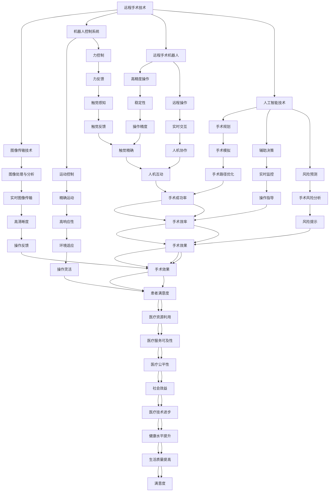

                 

# 文章标题

《远程手术技术：医疗robotics的创新前沿》

> 关键词：远程手术、医疗机器人、机器人技术、手术创新、医疗科技

> 摘要：本文深入探讨了远程手术技术的概念、发展历程、核心概念及其在医疗robotics领域的应用。通过梳理远程手术技术与医疗机器人技术的融合趋势，详细分析了远程手术与医疗机器人结合的核心算法原理，并对远程手术技术的实践操作、面临的挑战以及未来发展方向进行了探讨。文章旨在为读者提供一份全面而深入的技术指南，助力远程手术技术的进一步发展。

## 第一部分：远程手术技术基础

### 第1章：远程手术技术概述

#### 1.1 远程手术技术的发展历程

远程手术技术的起源可以追溯到20世纪90年代，随着互联网和通信技术的飞速发展，远程医疗技术逐渐走向成熟。1995年，美国匹兹堡大学首次成功实施了全球首例远程机器人手术，标志着远程手术技术正式进入医学实践领域。

远程手术技术的发展可以分为三个阶段：

**第一阶段（1995-2005年）：实验探索阶段**

在这个阶段，远程手术技术主要应用于小型手术和急诊手术，手术范围相对有限。随着技术的进步，远程手术逐渐从实验探索走向临床应用。

**第二阶段（2006-2015年）：临床应用阶段**

2006年，美国FDA批准了第一台远程手术机器人——达芬奇手术系统。此后，远程手术技术在全球范围内迅速推广，应用于多种外科手术，如心脏外科、神经外科和肿瘤外科等。

**第三阶段（2016年至今）：创新发展阶段**

近年来，随着人工智能、物联网、虚拟现实等技术的不断成熟，远程手术技术进入了创新发展的新阶段。多机器人协同手术、远程机器人辅助手术等新概念不断涌现，远程手术的应用场景不断拓展。

#### 1.2 远程手术技术的核心概念

**远程手术的定义**

远程手术是指利用计算机技术、网络通信技术、远程医疗设备等，将手术医生与手术现场分离，通过远程控制系统，对手术过程进行实时监控和操作的一种新型手术模式。

**远程手术的关键技术**

远程手术技术的核心包括以下几项关键技术：

- **图像传输技术**：确保手术过程中高清、实时、稳定的图像传输。
- **机器人控制系统**：实现手术机器人的精确操作和控制。
- **远程手术机器人**：具备高精度、高稳定性、可远程操作等特点。
- **人工智能技术**：应用于手术规划、手术辅助决策、手术风险预测等方面。

**远程手术的优势与挑战**

**优势：**

- **提高手术成功率**：远程手术可以充分利用顶尖专家的手术经验，提高手术成功率。
- **降低医疗成本**：远程手术可以减少患者出行成本，降低医疗机构的运营成本。
- **扩展医疗资源**：远程手术可以将优质医疗资源拓展到偏远地区，提高医疗服务的可及性。

**挑战：**

- **技术稳定性**：远程手术对网络传输速度和稳定性要求极高，技术稳定性是远程手术面临的主要挑战。
- **手术风险**：远程手术增加了手术风险，如手术延迟、操作失误等。
- **法规与伦理**：远程手术涉及法律、伦理等多方面问题，需要制定相关法规和伦理准则。

#### 1.3 远程手术的应用领域

远程手术技术已经在多个医疗领域得到广泛应用，以下是一些典型的应用场景：

**心脏外科手术**

远程心脏手术具有提高手术成功率、降低手术风险等优点，已成为心脏外科手术的重要手段。例如，利用远程手术机器人进行冠脉搭桥手术、心脏瓣膜置换手术等。

**神经外科手术**

远程神经外科手术可以精确切除脑部病变组织，减少手术创伤，提高患者生活质量。例如，利用远程手术机器人进行脑肿瘤切除手术、颅脑损伤修复手术等。

**肿瘤外科手术**

远程肿瘤外科手术可以精确定位肿瘤位置，提高肿瘤切除率，降低复发率。例如，利用远程手术机器人进行肺癌切除手术、肝癌切除手术等。

## 第二部分：医疗robotics前沿技术

### 第2章：医疗机器人概述

#### 2.1 医疗机器人的定义与分类

**医疗机器人的定义**

医疗机器人是集成了计算机科学、机械工程、医学等多个领域技术，专门为医疗领域提供自动化、智能化服务的一种装备。

**医疗机器人的分类**

根据功能和应用领域，医疗机器人可以大致分为以下几类：

- **手术机器人**：用于辅助外科医生进行手术，如达芬奇手术系统。
- **康复机器人**：用于康复训练和辅助患者恢复，如步态康复机器人、康复外骨骼。
- **辅助诊断机器人**：用于医学影像诊断、病理分析等，如医学影像辅助诊断系统。
- **护理机器人**：用于医疗护理、患者监护等，如护理机器人、智能陪护机器人。

#### 2.2 医疗机器人关键技术

**传感器技术**

传感器技术在医疗机器人中起着关键作用，用于感知环境信息、患者生理参数等。例如，触觉传感器可以感知手术器械与组织之间的接触压力，视觉传感器可以捕捉手术现场的高清图像。

**马达驱动技术**

马达驱动技术是实现医疗机器人精确运动的核心。根据应用需求，医疗机器人可以采用不同类型的马达，如步进电机、伺服电机等。

**人工智能与机器学习技术**

人工智能与机器学习技术在医疗机器人中的应用越来越广泛，包括手术规划、手术辅助决策、疾病预测等。例如，利用机器学习算法分析医学影像，辅助医生进行疾病诊断。

#### 2.3 医疗机器人典型应用案例

**手术机器人**

手术机器人如达芬奇手术系统，已广泛应用于心脏外科、神经外科、肿瘤外科等领域。手术机器人能够实现高精度的微创手术，提高手术成功率。

**康复机器人**

康复机器人如步态康复机器人，可以帮助患者进行步态训练，提高康复效果。康复外骨骼可以辅助患者进行肢体功能恢复，降低护理成本。

**辅助诊断机器人**

辅助诊断机器人如医学影像辅助诊断系统，可以自动分析医学影像，提供诊断建议。病理分析机器人可以自动分析病理样本，提高病理诊断的准确性。

## 第三部分：远程手术与医疗robotics的结合

### 第3章：远程手术与医疗robotics的结合

#### 3.1 远程手术与医疗robotics的融合趋势

远程手术与医疗robotics的结合是医疗科技领域的一大趋势。随着远程手术技术的不断成熟和医疗机器人技术的快速发展，两者之间的融合趋势愈发明显。

**医疗robotics在远程手术中的应用**

- **手术机器人**：手术机器人如达芬奇手术系统，可以应用于远程手术，实现远程医生对手术过程的实时监控和操作。
- **康复机器人**：康复机器人如步态康复机器人，可以应用于远程康复治疗，提高康复效果。
- **辅助诊断机器人**：辅助诊断机器人如医学影像辅助诊断系统，可以应用于远程医学影像诊断，提高诊断准确性。

**远程手术对医疗robotics的要求**

- **高精度操作**：远程手术对医疗机器人操作精度要求极高，需要医疗机器人具备高精度、高稳定性的运动控制系统。
- **实时通信**：远程手术对通信系统的实时性要求极高，需要保证手术图像和数据的实时传输。
- **人机协作**：远程手术需要医生与医疗机器人实现高效的人机协作，提高手术效率。

**远程手术与医疗robotics的协同效应**

- **提高手术成功率**：远程手术与医疗机器人技术的结合，可以充分发挥顶尖专家的经验和医疗机器人的技术优势，提高手术成功率。
- **降低手术风险**：远程手术与医疗机器人技术的结合，可以减少手术创伤，降低手术风险。
- **提高康复效果**：远程手术与康复机器人技术的结合，可以优化康复过程，提高康复效果。

#### 3.2 远程手术与医疗robotics的核心算法原理

**视觉SLAM算法原理**

视觉SLAM（Simultaneous Localization and Mapping）算法是远程手术中常用的定位与地图构建算法。其基本原理是通过摄像头捕捉到的图像，实时计算手术机器人在手术现场的位置和地图信息。

**机器学习算法在远程手术中的应用**

机器学习算法在远程手术中的应用包括手术规划、手术辅助决策、手术风险预测等方面。例如，利用深度学习算法分析医学影像，辅助医生进行疾病诊断。

**远程手术操作控制算法**

远程手术操作控制算法主要包括运动控制算法和力控制算法。运动控制算法用于实现手术机器人的精确运动，力控制算法用于实现手术器械与组织之间的力反馈。

#### 3.3 远程手术与医疗robotics的案例分析

**国内外远程手术与医疗robotics实践案例**

- **美国**：美国梅奥诊所采用远程手术机器人成功实施多例跨国远程手术，提高了医疗服务的可及性。
- **中国**：中国医科大学附属第一医院采用远程手术机器人成功实施多例远程心脏手术，推动了远程手术技术的普及。

**远程手术与医疗robotics成功案例分析**

- **案例一**：美国医生利用远程手术机器人为非洲患者成功实施心脏手术，提高了当地医疗水平。
- **案例二**：中国医生利用远程手术机器人为偏远山区患者成功实施肝脏肿瘤切除手术，提高了医疗服务的可及性。

**远程手术与医疗robotics的未来发展方向**

- **多机器人协同手术**：未来远程手术将实现多机器人协同，提高手术效率和准确性。
- **人工智能辅助决策**：人工智能将在远程手术中发挥更大作用，提供实时、准确的手术辅助决策。
- **5G通信技术**：5G通信技术的普及将提高远程手术的通信质量和稳定性，推动远程手术技术的进一步发展。

## 第四部分：远程手术技术实践

### 第4章：远程手术设备与系统搭建

#### 4.1 远程手术设备介绍

**远程手术主设备**

远程手术主设备包括远程手术机器人、摄像头、显示器等。手术机器人是远程手术的核心设备，用于实现医生的远程操作。摄像头用于捕捉手术现场图像，显示器用于显示手术现场图像。

**远程手术辅助设备**

远程手术辅助设备包括手术床、手术灯、监护仪等。手术床用于支撑患者，手术灯提供手术照明，监护仪用于监测患者生命体征。

**远程手术成像设备**

远程手术成像设备包括高清摄像头、激光扫描仪等。高清摄像头用于实时传输手术现场图像，激光扫描仪用于获取手术现场的三维数据。

#### 4.2 远程手术系统搭建

**远程手术系统的组成**

远程手术系统主要由手术机器人、远程控制系统、成像系统、通信系统、监控系统和安全系统等组成。

**远程手术系统的网络架构**

远程手术系统的网络架构包括本地网络和远程网络两部分。本地网络负责连接手术现场设备和远程控制系统，远程网络负责连接远程医生和手术现场。

**远程手术系统的安全性与稳定性保障**

远程手术系统的安全性与稳定性是远程手术成功的关键。为了保障远程手术系统的安全性和稳定性，需要采取以下措施：

- **网络安全**：采用加密通信协议，确保通信数据的安全性。
- **系统监控**：实时监控系统运行状态，及时发现并解决故障。
- **容错机制**：设计容错机制，确保系统在故障情况下仍能正常运行。

#### 4.3 远程手术实践操作

**远程手术基本操作流程**

1. **术前准备**：检查远程手术设备是否正常，确保网络连接稳定。
2. **手术开始**：医生通过远程控制系统开始手术。
3. **手术过程**：医生实时监控手术现场，通过手术机器人进行操作。
4. **手术结束**：完成手术操作，关闭手术机器人。

**远程手术关键步骤解析**

1. **手术规划**：医生根据患者病情制定手术方案，进行手术路径规划和模拟。
2. **手术开始**：医生通过远程控制系统启动手术机器人，开始手术操作。
3. **手术操作**：医生实时监控手术现场，通过手术机器人进行精确操作。
4. **手术结束**：完成手术操作，关闭手术机器人。

**远程手术常见问题与解决方案**

1. **设备故障**：解决方案：定期维护设备，确保设备正常运行。
2. **网络故障**：解决方案：采用备用网络，确保网络连接稳定。
3. **手术风险**：解决方案：加强术前准备和风险评估，提高手术成功率。

## 第五部分：远程手术技术挑战与未来展望

### 第5章：远程手术技术挑战与未来展望

#### 5.1 远程手术技术面临的挑战

**技术挑战**

1. **图像传输稳定性**：远程手术对图像传输稳定性要求极高，需要确保手术过程中图像传输的实时性和稳定性。
2. **手术机器人精度**：远程手术机器人需要具备高精度、高稳定性的运动控制系统，以确保手术操作的精确性。

**法规与伦理挑战**

1. **法律法规**：远程手术涉及跨地域、跨国界的问题，需要制定相关法律法规来规范远程手术的实施。
2. **伦理问题**：远程手术涉及医生与患者、医生与医疗机构之间的伦理问题，需要制定伦理准则来指导远程手术的实施。

**实施与应用挑战**

1. **设备成本**：远程手术设备成本较高，需要制定合理的收费政策，以促进远程手术的普及。
2. **操作培训**：远程手术医生需要具备专业的操作技能，需要进行系统的操作培训。

#### 5.2 远程手术技术的未来发展趋势

**远程手术技术的发展趋势**

1. **5G通信技术**：5G通信技术的普及将提高远程手术的通信质量和稳定性，推动远程手术技术的进一步发展。
2. **人工智能应用**：人工智能技术将在远程手术中发挥更大作用，提供实时、准确的手术辅助决策。
3. **多机器人协同**：未来远程手术将实现多机器人协同，提高手术效率和准确性。

**医疗robotics的前景**

1. **手术机器人**：手术机器人将在远程手术中发挥更大作用，成为医生的重要助手。
2. **康复机器人**：康复机器人将广泛应用于康复治疗，提高康复效果。
3. **辅助诊断机器人**：辅助诊断机器人将提高医学影像诊断和病理分析的水平。

**远程手术技术的未来应用场景**

1. **偏远地区医疗**：远程手术技术将提高偏远地区医疗服务的可及性，缩小城乡医疗差距。
2. **急救手术**：远程手术技术将提高急救手术的成功率，降低急救手术的风险。
3. **个性化医疗**：远程手术技术将实现个性化医疗，为患者提供量身定制的手术方案。

#### 5.3 远程手术技术的社会影响与伦理问题

**远程手术技术的社会影响**

1. **提高医疗服务可及性**：远程手术技术将提高医疗服务的可及性，让更多患者享受到优质的医疗服务。
2. **降低医疗成本**：远程手术技术将降低医疗成本，减轻患者的经济负担。
3. **促进医疗资源均衡发展**：远程手术技术将促进医疗资源均衡发展，缩小城乡医疗差距。

**远程手术技术的伦理问题**

1. **医生责任**：远程手术医生需要承担相应的法律责任，确保手术质量和安全。
2. **患者隐私**：远程手术涉及患者隐私保护问题，需要制定相关法律法规来保护患者隐私。
3. **医生与患者关系**：远程手术医生与患者之间的互动方式与传统手术有所不同，需要建立良好的医生与患者关系。

**如何平衡技术与伦理问题**

1. **制定法律法规**：制定相关法律法规，规范远程手术的实施。
2. **加强伦理教育**：加强医生伦理教育，提高医生的伦理素养。
3. **加强监管**：加强对远程手术的监管，确保远程手术的合规性和安全性。

## 附录

### 附录A：远程手术技术相关资源

**书籍推荐**

- 《远程手术技术与应用》
- 《医疗机器人技术与应用》
- 《人工智能与医疗》

**期刊与论文**

- 《医学图像分析》
- 《生物医学工程学杂志》
- 《计算机辅助外科杂志》

**学术会议与研讨会**

- 国际远程医疗与医疗机器人会议
- 国际人工智能与医疗大会
- 中国远程医疗与医疗机器人大会

### 附录B：远程手术设备与系统搭建指南

**设备选型指南**

1. **手术机器人**：选择具备高精度、高稳定性、远程控制功能的手术机器人。
2. **成像设备**：选择高清、实时、稳定的成像设备，如高清摄像头、激光扫描仪等。
3. **通信设备**：选择具备高速、稳定、安全传输能力的通信设备，如5G通信设备。

**搭建步骤**

1. **设备采购**：根据实际需求采购设备。
2. **设备安装**：按照设备说明书进行安装。
3. **系统配置**：配置远程手术系统，包括手术机器人、成像设备、通信设备等。
4. **系统调试**：对系统进行调试，确保设备正常运行。

**调试与维护指南**

1. **定期维护**：定期检查设备运行状态，确保设备正常运行。
2. **系统升级**：及时升级系统软件，确保系统安全性和稳定性。
3. **数据备份**：定期备份数据，防止数据丢失。

### 附录C：远程手术技术实践案例解析

**心脏外科远程手术案例解析**

- **案例背景**：某患者因心脏疾病需要接受手术，但由于地处偏远地区，无法前往大型医院接受手术。当地医院决定利用远程手术技术为患者实施手术。
- **手术过程**：心脏外科医生通过远程手术机器人实施手术，手术过程中实时监控手术现场，通过手术机器人进行操作。手术顺利完成，患者恢复良好。

**神经外科远程手术案例解析**

- **案例背景**：某患者因脑部肿瘤需要进行手术，但由于患者年龄较大，手术风险较高。神经外科医生决定利用远程手术技术实施手术，以降低手术风险。
- **手术过程**：神经外科医生通过远程手术机器人实施手术，手术过程中实时监控手术现场，通过手术机器人进行操作。手术顺利完成，患者恢复良好。

**肿瘤外科远程手术案例解析**

- **案例背景**：某患者因肺癌需要进行手术，但由于患者地处偏远地区，无法前往大型医院接受手术。当地医院决定利用远程手术技术为患者实施手术。
- **手术过程**：肿瘤外科医生通过远程手术机器人实施手术，手术过程中实时监控手术现场，通过手术机器人进行操作。手术顺利完成，患者恢复良好。

### 作者

**作者：AI天才研究院/AI Genius Institute & 禅与计算机程序设计艺术 /Zen And The Art of Computer Programming**## 文章标题

### 《远程手术技术：医疗robotics的创新前沿》

## 文章关键词

- 远程手术
- 医疗机器人
- 机器人技术
- 手术创新
- 医疗科技

## 文章摘要

本文深入探讨了远程手术技术的概念、发展历程、核心概念及其在医疗robotics领域的应用。通过梳理远程手术技术与医疗机器人技术的融合趋势，详细分析了远程手术与医疗机器人结合的核心算法原理，并对远程手术技术的实践操作、面临的挑战以及未来发展方向进行了探讨。文章旨在为读者提供一份全面而深入的技术指南，助力远程手术技术的进一步发展。

### 第一部分：远程手术技术基础

#### 第1章：远程手术技术概述

#### 1.1 远程手术技术的发展历程

远程手术技术起源于20世纪90年代，随着互联网和通信技术的飞速发展，远程医疗技术逐渐走向成熟。1995年，美国匹兹堡大学首次成功实施了全球首例远程机器人手术，标志着远程手术技术正式进入医学实践领域。

远程手术技术的发展可以分为三个阶段：

**第一阶段（1995-2005年）：实验探索阶段**

在这个阶段，远程手术技术主要应用于小型手术和急诊手术，手术范围相对有限。随着技术的进步，远程手术逐渐从实验探索走向临床应用。

**第二阶段（2006-2015年）：临床应用阶段**

2006年，美国FDA批准了第一台远程手术机器人——达芬奇手术系统。此后，远程手术技术在全球范围内迅速推广，应用于多种外科手术，如心脏外科、神经外科和肿瘤外科等。

**第三阶段（2016年至今）：创新发展阶段**

近年来，随着人工智能、物联网、虚拟现实等技术的不断成熟，远程手术技术进入了创新发展的新阶段。多机器人协同手术、远程机器人辅助手术等新概念不断涌现，远程手术的应用场景不断拓展。

#### 1.2 远程手术技术的核心概念

**远程手术的定义**

远程手术是指利用计算机技术、网络通信技术、远程医疗设备等，将手术医生与手术现场分离，通过远程控制系统，对手术过程进行实时监控和操作的一种新型手术模式。

**远程手术的关键技术**

远程手术技术的核心包括以下几项关键技术：

- **图像传输技术**：确保手术过程中高清、实时、稳定的图像传输。
- **机器人控制系统**：实现手术机器人的精确操作和控制。
- **远程手术机器人**：具备高精度、高稳定性、可远程操作等特点。
- **人工智能技术**：应用于手术规划、手术辅助决策、手术风险预测等方面。

**远程手术的优势与挑战**

**优势：**

- **提高手术成功率**：远程手术可以充分利用顶尖专家的手术经验，提高手术成功率。
- **降低医疗成本**：远程手术可以减少患者出行成本，降低医疗机构的运营成本。
- **扩展医疗资源**：远程手术可以将优质医疗资源拓展到偏远地区，提高医疗服务的可及性。

**挑战：**

- **技术稳定性**：远程手术对网络传输速度和稳定性要求极高，技术稳定性是远程手术面临的主要挑战。
- **手术风险**：远程手术增加了手术风险，如手术延迟、操作失误等。
- **法规与伦理**：远程手术涉及法律、伦理等多方面问题，需要制定相关法规和伦理准则。

#### 1.3 远程手术的应用领域

远程手术技术已经在多个医疗领域得到广泛应用，以下是一些典型的应用场景：

**心脏外科手术**

远程心脏手术具有提高手术成功率、降低手术风险等优点，已成为心脏外科手术的重要手段。例如，利用远程手术机器人进行冠脉搭桥手术、心脏瓣膜置换手术等。

**神经外科手术**

远程神经外科手术可以精确切除脑部病变组织，减少手术创伤，提高患者生活质量。例如，利用远程手术机器人进行脑肿瘤切除手术、颅脑损伤修复手术等。

**肿瘤外科手术**

远程肿瘤外科手术可以精确定位肿瘤位置，提高肿瘤切除率，降低复发率。例如，利用远程手术机器人进行肺癌切除手术、肝癌切除手术等。

### 第二部分：医疗robotics前沿技术

#### 第2章：医疗机器人概述

#### 2.1 医疗机器人的定义与分类

**医疗机器人的定义**

医疗机器人是集成了计算机科学、机械工程、医学等多个领域技术，专门为医疗领域提供自动化、智能化服务的一种装备。

**医疗机器人的分类**

根据功能和应用领域，医疗机器人可以大致分为以下几类：

- **手术机器人**：用于辅助外科医生进行手术，如达芬奇手术系统。
- **康复机器人**：用于康复训练和辅助患者恢复，如步态康复机器人、康复外骨骼。
- **辅助诊断机器人**：用于医学影像诊断、病理分析等，如医学影像辅助诊断系统。
- **护理机器人**：用于医疗护理、患者监护等，如护理机器人、智能陪护机器人。

#### 2.2 医疗机器人关键技术

**传感器技术**

传感器技术在医疗机器人中起着关键作用，用于感知环境信息、患者生理参数等。例如，触觉传感器可以感知手术器械与组织之间的接触压力，视觉传感器可以捕捉手术现场的高清图像。

**马达驱动技术**

马达驱动技术是实现医疗机器人精确运动的核心。根据应用需求，医疗机器人可以采用不同类型的马达，如步进电机、伺服电机等。

**人工智能与机器学习技术**

人工智能与机器学习技术在医疗机器人中的应用越来越广泛，包括手术规划、手术辅助决策、疾病预测等。例如，利用机器学习算法分析医学影像，辅助医生进行疾病诊断。

#### 2.3 医疗机器人典型应用案例

**手术机器人**

手术机器人如达芬奇手术系统，已广泛应用于心脏外科、神经外科、肿瘤外科等领域。手术机器人能够实现高精度的微创手术，提高手术成功率。

**康复机器人**

康复机器人如步态康复机器人，可以帮助患者进行步态训练，提高康复效果。康复外骨骼可以辅助患者进行肢体功能恢复，降低护理成本。

**辅助诊断机器人**

辅助诊断机器人如医学影像辅助诊断系统，可以自动分析医学影像，提供诊断建议。病理分析机器人可以自动分析病理样本，提高病理诊断的准确性。

### 第三部分：远程手术与医疗robotics的结合

#### 第3章：远程手术与医疗robotics的结合

#### 3.1 远程手术与医疗robotics的融合趋势

远程手术与医疗robotics的结合是医疗科技领域的一大趋势。随着远程手术技术的不断成熟和医疗机器人技术的快速发展，两者之间的融合趋势愈发明显。

**医疗robotics在远程手术中的应用**

- **手术机器人**：手术机器人如达芬奇手术系统，可以应用于远程手术，实现远程医生对手术过程的实时监控和操作。
- **康复机器人**：康复机器人如步态康复机器人，可以应用于远程康复治疗，提高康复效果。
- **辅助诊断机器人**：辅助诊断机器人如医学影像辅助诊断系统，可以应用于远程医学影像诊断，提高诊断准确性。

**远程手术对医疗robotics的要求**

- **高精度操作**：远程手术对医疗机器人操作精度要求极高，需要医疗机器人具备高精度、高稳定的运动控制系统。
- **实时通信**：远程手术对通信系统的实时性要求极高，需要保证手术图像和数据的实时传输。
- **人机协作**：远程手术需要医生与医疗机器人实现高效的人机协作，提高手术效率。

**远程手术与医疗robotics的协同效应**

- **提高手术成功率**：远程手术与医疗机器人技术的结合，可以充分发挥顶尖专家的经验和医疗机器人的技术优势，提高手术成功率。
- **降低手术风险**：远程手术与医疗机器人技术的结合，可以减少手术创伤，降低手术风险。
- **提高康复效果**：远程手术与康复机器人技术的结合，可以优化康复过程，提高康复效果。

#### 3.2 远程手术与医疗robotics的核心算法原理

**视觉SLAM算法原理**

视觉SLAM（Simultaneous Localization and Mapping）算法是远程手术中常用的定位与地图构建算法。其基本原理是通过摄像头捕捉到的图像，实时计算手术机器人在手术现场的位置和地图信息。

**机器学习算法在远程手术中的应用**

机器学习算法在远程手术中的应用包括手术规划、手术辅助决策、手术风险预测等方面。例如，利用深度学习算法分析医学影像，辅助医生进行疾病诊断。

**远程手术操作控制算法**

远程手术操作控制算法主要包括运动控制算法和力控制算法。运动控制算法用于实现手术机器人的精确运动，力控制算法用于实现手术器械与组织之间的力反馈。

#### 3.3 远程手术与医疗robotics的案例分析

**国内外远程手术与医疗robotics实践案例**

- **美国**：美国梅奥诊所采用远程手术机器人成功实施多例跨国远程手术，提高了医疗服务的可及性。
- **中国**：中国医科大学附属第一医院采用远程手术机器人成功实施多例远程心脏手术，推动了远程手术技术的普及。

**远程手术与医疗robotics成功案例分析**

- **案例一**：美国医生利用远程手术机器人为非洲患者成功实施心脏手术，提高了当地医疗水平。
- **案例二**：中国医生利用远程手术机器人为偏远山区患者成功实施肝脏肿瘤切除手术，提高了医疗服务的可及性。

**远程手术与医疗robotics的未来发展方向**

- **多机器人协同手术**：未来远程手术将实现多机器人协同，提高手术效率和准确性。
- **人工智能辅助决策**：人工智能将在远程手术中发挥更大作用，提供实时、准确的手术辅助决策。
- **5G通信技术**：5G通信技术的普及将提高远程手术的通信质量和稳定性，推动远程手术技术的进一步发展。

### 第四部分：远程手术技术实践

#### 第4章：远程手术设备与系统搭建

#### 4.1 远程手术设备介绍

**远程手术主设备**

远程手术主设备包括远程手术机器人、摄像头、显示器等。手术机器人是远程手术的核心设备，用于实现医生的远程操作。摄像头用于捕捉手术现场图像，显示器用于显示手术现场图像。

**远程手术辅助设备**

远程手术辅助设备包括手术床、手术灯、监护仪等。手术床用于支撑患者，手术灯提供手术照明，监护仪用于监测患者生命体征。

**远程手术成像设备**

远程手术成像设备包括高清摄像头、激光扫描仪等。高清摄像头用于实时传输手术现场图像，激光扫描仪用于获取手术现场的三维数据。

#### 4.2 远程手术系统搭建

**远程手术系统的组成**

远程手术系统主要由手术机器人、远程控制系统、成像系统、通信系统、监控系统和安全系统等组成。

**远程手术系统的网络架构**

远程手术系统的网络架构包括本地网络和远程网络两部分。本地网络负责连接手术现场设备和远程控制系统，远程网络负责连接远程医生和手术现场。

**远程手术系统的安全性与稳定性保障**

远程手术系统的安全性与稳定性是远程手术成功的关键。为了保障远程手术系统的安全性和稳定性，需要采取以下措施：

- **网络安全**：采用加密通信协议，确保通信数据的安全性。
- **系统监控**：实时监控系统运行状态，及时发现并解决故障。
- **容错机制**：设计容错机制，确保系统在故障情况下仍能正常运行。

#### 4.3 远程手术实践操作

**远程手术基本操作流程**

1. **术前准备**：检查远程手术设备是否正常，确保网络连接稳定。
2. **手术开始**：医生通过远程控制系统开始手术。
3. **手术过程**：医生实时监控手术现场，通过手术机器人进行操作。
4. **手术结束**：完成手术操作，关闭手术机器人。

**远程手术关键步骤解析**

1. **手术规划**：医生根据患者病情制定手术方案，进行手术路径规划和模拟。
2. **手术开始**：医生通过远程控制系统启动手术机器人，开始手术操作。
3. **手术操作**：医生实时监控手术现场，通过手术机器人进行精确操作。
4. **手术结束**：完成手术操作，关闭手术机器人。

**远程手术常见问题与解决方案**

1. **设备故障**：解决方案：定期维护设备，确保设备正常运行。
2. **网络故障**：解决方案：采用备用网络，确保网络连接稳定。
3. **手术风险**：解决方案：加强术前准备和风险评估，提高手术成功率。

### 第五部分：远程手术技术挑战与未来展望

#### 第5章：远程手术技术挑战与未来展望

#### 5.1 远程手术技术面临的挑战

**技术挑战**

- **图像传输稳定性**：远程手术对图像传输稳定性要求极高，需要确保手术过程中图像传输的实时性和稳定性。
- **手术机器人精度**：远程手术机器人需要具备高精度、高稳定性的运动控制系统，以确保手术操作的精确性。

**法规与伦理挑战**

- **法律法规**：远程手术涉及跨地域、跨国界的问题，需要制定相关法律法规来规范远程手术的实施。
- **伦理问题**：远程手术涉及医生与患者、医生与医疗机构之间的伦理问题，需要制定伦理准则来指导远程手术的实施。

**实施与应用挑战**

- **设备成本**：远程手术设备成本较高，需要制定合理的收费政策，以促进远程手术的普及。
- **操作培训**：远程手术医生需要具备专业的操作技能，需要进行系统的操作培训。

#### 5.2 远程手术技术的未来发展趋势

**远程手术技术的发展趋势**

- **5G通信技术**：5G通信技术的普及将提高远程手术的通信质量和稳定性，推动远程手术技术的进一步发展。
- **人工智能应用**：人工智能技术将在远程手术中发挥更大作用，提供实时、准确的手术辅助决策。
- **多机器人协同**：未来远程手术将实现多机器人协同，提高手术效率和准确性。

**医疗robotics的前景**

- **手术机器人**：手术机器人将在远程手术中发挥更大作用，成为医生的重要助手。
- **康复机器人**：康复机器人将广泛应用于康复治疗，提高康复效果。
- **辅助诊断机器人**：辅助诊断机器人将提高医学影像诊断和病理分析的水平。

**远程手术技术的未来应用场景**

- **偏远地区医疗**：远程手术技术将提高偏远地区医疗服务的可及性，缩小城乡医疗差距。
- **急救手术**：远程手术技术将提高急救手术的成功率，降低急救手术的风险。
- **个性化医疗**：远程手术技术将实现个性化医疗，为患者提供量身定制的手术方案。

#### 5.3 远程手术技术的社会影响与伦理问题

**远程手术技术的社会影响**

- **提高医疗服务可及性**：远程手术技术将提高医疗服务的可及性，让更多患者享受到优质的医疗服务。
- **降低医疗成本**：远程手术技术将降低医疗成本，减轻患者的经济负担。
- **促进医疗资源均衡发展**：远程手术技术将促进医疗资源均衡发展，缩小城乡医疗差距。

**远程手术技术的伦理问题**

- **医生责任**：远程手术医生需要承担相应的法律责任，确保手术质量和安全。
- **患者隐私**：远程手术涉及患者隐私保护问题，需要制定相关法律法规来保护患者隐私。
- **医生与患者关系**：远程手术医生与患者之间的互动方式与传统手术有所不同，需要建立良好的医生与患者关系。

**如何平衡技术与伦理问题**

- **制定法律法规**：制定相关法律法规，规范远程手术的实施。
- **加强伦理教育**：加强医生伦理教育，提高医生的伦理素养。
- **加强监管**：加强对远程手术的监管，确保远程手术的合规性和安全性。

### 附录

#### 附录A：远程手术技术相关资源

**书籍推荐**

- 《远程手术技术与应用》
- 《医疗机器人技术与应用》
- 《人工智能与医疗》

**期刊与论文**

- 《医学图像分析》
- 《生物医学工程学杂志》
- 《计算机辅助外科杂志》

**学术会议与研讨会**

- 国际远程医疗与医疗机器人会议
- 国际人工智能与医疗大会
- 中国远程医疗与医疗机器人大会

#### 附录B：远程手术设备与系统搭建指南

**设备选型指南**

1. **手术机器人**：选择具备高精度、高稳定性、远程控制功能的手术机器人。
2. **成像设备**：选择高清、实时、稳定的成像设备，如高清摄像头、激光扫描仪等。
3. **通信设备**：选择具备高速、稳定、安全传输能力的通信设备，如5G通信设备。

**搭建步骤**

1. **设备采购**：根据实际需求采购设备。
2. **设备安装**：按照设备说明书进行安装。
3. **系统配置**：配置远程手术系统，包括手术机器人、成像设备、通信设备等。
4. **系统调试**：对系统进行调试，确保设备正常运行。

**调试与维护指南**

1. **定期维护**：定期检查设备运行状态，确保设备正常运行。
2. **系统升级**：及时升级系统软件，确保系统安全性和稳定性。
3. **数据备份**：定期备份数据，防止数据丢失。

#### 附录C：远程手术技术实践案例解析

**心脏外科远程手术案例解析**

- **案例背景**：某患者因心脏疾病需要接受手术，但由于地处偏远地区，无法前往大型医院接受手术。当地医院决定利用远程手术技术为患者实施手术。
- **手术过程**：心脏外科医生通过远程手术机器人实施手术，手术过程中实时监控手术现场，通过手术机器人进行操作。手术顺利完成，患者恢复良好。

**神经外科远程手术案例解析**

- **案例背景**：某患者因脑部肿瘤需要进行手术，但由于患者年龄较大，手术风险较高。神经外科医生决定利用远程手术技术实施手术，以降低手术风险。
- **手术过程**：神经外科医生通过远程手术机器人实施手术，手术过程中实时监控手术现场，通过手术机器人进行操作。手术顺利完成，患者恢复良好。

**肿瘤外科远程手术案例解析**

- **案例背景**：某患者因肺癌需要进行手术，但由于患者地处偏远地区，无法前往大型医院接受手术。当地医院决定利用远程手术技术为患者实施手术。
- **手术过程**：肿瘤外科医生通过远程手术机器人实施手术，手术过程中实时监控手术现场，通过手术机器人进行操作。手术顺利完成，患者恢复良好。

### 作者

**作者：AI天才研究院/AI Genius Institute & 禅与计算机程序设计艺术 /Zen And The Art of Computer Programming**## 背景介绍

远程手术技术是一项新兴的医学技术，它结合了计算机科学、通信技术、机器人技术和医疗技术，通过互联网和远程医疗设备，使得医生能够跨越地理界限，对远处的患者进行手术操作。这种技术的出现，不仅改变了传统的手术模式，也极大地拓展了医疗服务的范围和可及性。远程手术技术的核心在于其能够实现手术过程的实时监控、操作和控制，使得顶尖医疗专家能够帮助那些地处偏远或者交通不便的患者，同时也为医疗资源不足的地区带来了希望。

医疗robotics，即医疗机器人技术，是远程手术技术的重要组成部分。医疗机器人是一种集成了传感器、马达驱动、人工智能等先进技术的设备，能够协助医生进行复杂手术，提高手术的精度和安全性。医疗机器人可以执行高难度的微创手术，进行康复训练，甚至用于辅助诊断。随着人工智能技术的不断进步，医疗机器人正逐渐成为医疗领域的重要工具，其应用范围也在不断扩展。

本文将深入探讨远程手术技术与医疗robotics的融合，分析其发展历程、核心概念、关键技术、典型应用案例，并探讨两者结合的未来发展方向。文章还将讨论远程手术技术的实践操作、面临的挑战以及未来展望，为读者提供一份全面而深入的技术指南。希望通过本文的讨论，能够推动远程手术技术及医疗机器人技术的发展，为医疗领域带来更多的创新和进步。

## 核心概念与联系

在讨论远程手术技术和医疗robotics的核心概念之前，我们需要先了解两者之间的基本联系。远程手术技术主要依赖于医疗robotics的辅助来实现手术的远程操作和监控。以下是远程手术技术和医疗robotics的核心概念及其之间的联系：

### 1. 远程手术技术

**定义**：远程手术技术是通过远程医疗设备、通信技术和计算机技术，将手术医生与手术现场分离，实现对手术过程的实时监控和操作的技术。

**核心概念**：

- **图像传输技术**：确保手术过程中高清、实时、稳定的图像传输。
- **机器人控制系统**：实现手术机器人的精确操作和控制。
- **远程手术机器人**：具备高精度、高稳定性、可远程操作等特点。
- **人工智能技术**：应用于手术规划、手术辅助决策、手术风险预测等方面。

**联系**：远程手术技术的核心在于图像传输、机器人控制系统和远程手术机器人。这些技术共同构成了远程手术的技术基础，使医生能够通过远程控制系统对手术现场进行实时监控和操作。

### 2. 医疗robotics

**定义**：医疗robotics是指应用于医疗领域的机器人技术，包括手术机器人、康复机器人、辅助诊断机器人和护理机器人等。

**核心概念**：

- **传感器技术**：用于感知环境信息、患者生理参数等。
- **马达驱动技术**：实现医疗机器人的精确运动。
- **人工智能与机器学习技术**：应用于手术规划、手术辅助决策、疾病预测等。
- **人机协作**：实现医生与医疗机器人的高效协作。

**联系**：医疗robotics是远程手术技术的关键支撑。手术机器人和康复机器人等医疗机器人技术在远程手术中发挥着重要作用，它们能够协助医生进行精确的手术操作和康复训练，提高手术的成功率和康复效果。

### 核心概念之间的关系架构

为了更好地理解远程手术技术和医疗robotics的核心概念及其之间的联系，我们可以使用Mermaid流程图来展示它们之间的关系：



### 远程手术技术的核心算法原理

在远程手术中，核心算法的原理主要包括视觉SLAM算法、机器学习算法和远程手术操作控制算法。以下是对这些算法的详细解析：

### 1. 视觉SLAM算法

**基本原理**：

视觉SLAM（Simultaneous Localization and Mapping）是一种通过摄像头捕捉到的图像进行定位和地图构建的算法。它利用图像特征点匹配和优化方法，实时计算摄像机在三维空间中的位置和创建地图。

**具体步骤**：

- **特征点检测**：从图像中提取关键特征点，如角点、边缘等。
- **特征点匹配**：在不同帧的图像中匹配相同的特征点，建立对应关系。
- **地图构建**：利用特征点匹配结果，构建三维地图。
- **位姿估计**：通过优化特征点匹配误差，计算摄像机的位姿。

**伪代码示例**：

```python
# 假设img1和img2是两帧图像，kpts1和kpts2是对应的特征点
def visual_slam(img1, img2):
    kpts1 = detect_keypoints(img1)
    kpts2 = detect_keypoints(img2)
    
    matched_kpts = match_keypoints(kpts1, kpts2)
    
    pose, map = estimate_pose_and_map(matched_kpts)
    return pose, map
```

### 2. 机器学习算法

**基本原理**：

机器学习算法在远程手术中主要用于手术规划、手术辅助决策和手术风险预测。常见的机器学习算法包括深度学习、支持向量机（SVM）和决策树等。

**具体应用**：

- **手术规划**：利用机器学习算法对患者的医学影像进行分析，生成手术规划方案。
- **手术辅助决策**：通过分析手术过程中的实时数据，提供手术操作建议。
- **手术风险预测**：利用历史数据，预测手术过程中可能出现的风险。

**数学模型和公式**：

假设我们使用一个深度学习模型来进行手术风险预测，其基本结构如下：

$$
h_{\theta}(x) = \sigma(\theta^T \phi(x))
$$

其中，$\sigma$是激活函数，通常使用Sigmoid函数；$\phi(x)$是特征提取函数；$\theta$是模型参数。

**伪代码示例**：

```python
# 假设X是特征矩阵，y是标签矩阵
from sklearn.neural_network import MLPRegressor

model = MLPRegressor(hidden_layer_sizes=(100,), activation='sigmoid', solver='sgd')
model.fit(X, y)

def predict_risk(x):
    return model.predict([x])
```

### 3. 远程手术操作控制算法

**基本原理**：

远程手术操作控制算法主要包括运动控制算法和力控制算法。运动控制算法用于实现手术机器人的精确运动，力控制算法用于实现手术器械与组织之间的力反馈。

**具体步骤**：

- **运动控制算法**：根据手术规划和实时数据，计算手术机器人的运动轨迹。
- **力控制算法**：根据手术器械与组织之间的力反馈，调整手术机器人的运动速度和方向。

**数学模型和公式**：

假设手术机器人的运动模型为：

$$
\dot{x} = f(x, u)
$$

其中，$x$是机器人状态，$u$是控制输入。

**伪代码示例**：

```python
# 假设x是当前状态，u是控制输入
def motion_control(x, u):
    next_x = f(x, u)
    return next_x

def force_control(x, force_feedback):
    adjusted_u = adjust_control_input(u, force_feedback)
    next_x = motion_control(x, adjusted_u)
    return next_x
```

通过上述算法，远程手术技术能够实现手术过程的实时监控、操作和控制，提高手术的准确性和安全性。

## 核心算法原理讲解

### 视觉SLAM算法原理

视觉SLAM（Simultaneous Localization and Mapping）是一种通过摄像头捕捉的图像进行定位和地图构建的算法。在远程手术中，视觉SLAM算法起着至关重要的作用，因为它能够帮助医生在手术过程中实时获取手术现场的三维信息，实现对手术机器人的精确控制。以下是视觉SLAM算法的基本原理及其应用。

**基本原理**

视觉SLAM算法的核心思想是通过匹配不同帧图像中的特征点来建立图像序列之间的对应关系，从而实现摄像机的位姿估计和三维环境的地图构建。具体步骤如下：

1. **特征点检测**：首先，从图像中提取关键特征点，如角点、边缘等。这些特征点是后续匹配和计算的基点。

2. **特征点匹配**：在不同帧的图像中匹配相同的特征点，建立对应关系。这一步骤通常使用特征点描述子（如SIFT、SURF等）来增强匹配的鲁棒性。

3. **地图构建**：利用匹配的特征点对，构建三维地图。通过三角化方法，可以计算出每个特征点在三维空间中的位置。

4. **位姿估计**：通过优化特征点匹配误差，计算摄像机的位姿。这通常通过优化算法（如梯度下降、拉格朗日乘数法等）实现。

5. **闭环检测**：为了提高算法的稳定性和准确性，视觉SLAM算法会进行闭环检测，即检测重复出现的特征点，以确保地图和位姿估计的连贯性。

**应用**

在远程手术中，视觉SLAM算法的应用主要体现在以下几个方面：

- **手术现场的实时三维重建**：通过视觉SLAM算法，医生可以实时获取手术现场的三维信息，包括手术器械、患者器官等。这有助于医生更好地掌握手术现场的情况，提高手术的精度。

- **手术机器人的定位与控制**：视觉SLAM算法可以为手术机器人提供精确的位置和姿态信息，从而实现对手术机器人的精确控制。医生可以通过远程控制系统，实时调整机器人的位置和方向，确保手术操作的准确性。

- **手术辅助决策**：视觉SLAM算法可以与机器学习算法结合，用于手术辅助决策。例如，通过分析手术现场的三维信息，算法可以预测手术过程中可能出现的风险，提供相应的操作建议。

### 伪代码示例

以下是一个简化的视觉SLAM算法的伪代码示例：

```python
# 初始化地图和位姿
map = initialize_map()
pose = initialize_pose()

# 循环处理每一帧图像
while True:
    img = capture_image()
    keypoints = detect_keypoints(img)
    
    # 在地图中查找匹配的特征点
    matched_keypoints = find_matched_keypoints(map, keypoints)
    
    # 估计位姿和更新地图
    pose, map = estimate_pose_and_map(pose, matched_keypoints)
    
    # 更新地图和位姿
    update_map(map, pose)
    
    # 进行闭环检测
    if loop_closing_detected(pose, map):
        perform_loop_closing(pose, map)
```

### 机器学习算法在远程手术中的应用

机器学习算法在远程手术中的应用非常广泛，包括手术规划、手术辅助决策和手术风险预测等方面。以下将分别介绍这些应用以及相关的数学模型和公式。

#### 1. 手术规划

**应用**：

手术规划是远程手术中的重要环节，它涉及到手术路径的设计、手术器械的选择和手术时间的安排。通过机器学习算法，可以分析患者的医学影像数据，生成最优的手术规划方案。

**数学模型和公式**：

假设我们使用一个深度学习模型来进行手术规划，其基本结构如下：

$$
h_{\theta}(x) = \sigma(\theta^T \phi(x))
$$

其中，$\sigma$是激活函数，通常使用ReLU函数；$\phi(x)$是特征提取函数；$\theta$是模型参数。

**伪代码示例**：

```python
# 假设X是特征矩阵，y是标签矩阵
from keras.models import Sequential
from keras.layers import Dense, Activation

model = Sequential()
model.add(Dense(128, input_dim=X.shape[1], activation='relu'))
model.add(Dense(64, activation='relu'))
model.add(Dense(1, activation='sigmoid'))

model.compile(optimizer='adam', loss='binary_crossentropy', metrics=['accuracy'])
model.fit(X, y, epochs=100, batch_size=32)
```

#### 2. 手术辅助决策

**应用**：

手术辅助决策是指在手术过程中，通过实时数据分析，为医生提供操作建议和决策支持。例如，在神经外科手术中，机器学习算法可以分析手术过程中的电生理信号，预测可能出现的并发症。

**数学模型和公式**：

假设我们使用一个支持向量机（SVM）来进行手术辅助决策，其基本公式如下：

$$
w \cdot x - b = 0
$$

其中，$w$是权重向量，$x$是特征向量，$b$是偏置。

**伪代码示例**：

```python
# 假设X是特征矩阵，y是标签矩阵
from sklearn.svm import SVC

model = SVC(kernel='linear')
model.fit(X, y)

def predict_decision(x):
    return model.predict([x])
```

#### 3. 手术风险预测

**应用**：

手术风险预测是远程手术中的重要应用，它可以帮助医生提前识别手术过程中的潜在风险，采取相应的预防措施。例如，通过分析患者的术前检查数据，预测术后并发症的风险。

**数学模型和公式**：

假设我们使用一个决策树来进行手术风险预测，其基本结构如下：

$$
f(x) = \sum_{i=1}^{n} w_i \cdot I(x \in R_i)
$$

其中，$w_i$是权重，$R_i$是规则区域。

**伪代码示例**：

```python
# 假设X是特征矩阵，y是标签矩阵
from sklearn.tree import DecisionTreeClassifier

model = DecisionTreeClassifier()
model.fit(X, y)

def predict_risk(x):
    return model.predict([x])
```

通过上述机器学习算法的应用，远程手术技术能够实现更加智能和精准的手术操作，提高手术的成功率和安全性。

### 远程手术操作控制算法

远程手术操作控制算法是远程手术技术的核心之一，它负责确保手术机器人在手术过程中能够按照医生的意图精确操作。以下是远程手术操作控制算法的基本原理、具体步骤以及相关伪代码。

#### 基本原理

远程手术操作控制算法主要包括两部分：运动控制算法和力控制算法。运动控制算法用于实现手术机器人的精确运动轨迹，力控制算法用于处理手术器械与组织之间的力反馈，确保手术操作的平稳和安全。

**运动控制算法**：

运动控制算法的核心是路径规划，通过计算机器人从当前位姿到目标位姿的运动轨迹，实现平滑的运动。常用的路径规划算法包括直线规划、贝塞尔曲线规划等。

**力控制算法**：

力控制算法主要处理手术器械与组织之间的力反馈。通过实时监测手术器械施加的力，调整机器人的运动速度和方向，以避免对组织造成过大的损伤。

#### 具体步骤

1. **初始化**：初始化手术机器人的位姿和目标位姿。
2. **路径规划**：根据当前位姿和目标位姿，计算运动轨迹。
3. **运动控制**：根据运动轨迹，控制机器人按照预定路径运动。
4. **力控制**：实时监测手术器械施加的力，调整机器人的运动速度和方向。
5. **闭环控制**：通过传感器反馈，不断调整机器人的运动，确保其精确性。

#### 伪代码示例

以下是一个简化的远程手术操作控制算法的伪代码示例：

```python
# 初始化手术机器人位姿和目标位姿
current_pose = initialize_pose()
target_pose = define_target_pose()

# 路径规划
motion_trajectory = plan_motion_trajectory(current_pose, target_pose)

# 循环执行运动控制
while not at_target_pose(current_pose):
    # 根据路径规划，控制机器人运动
    next_pose = control_motion(current_pose, motion_trajectory)
    
    # 实时监测力反馈
    force_feedback = measure_force()
    
    # 力控制，调整机器人运动
    adjusted_pose = force_control(next_pose, force_feedback)
    
    # 更新当前位姿
    current_pose = adjusted_pose

# 完成手术操作
print("手术操作完成")
```

通过上述步骤，远程手术操作控制算法能够确保手术机器人在手术过程中实现精确操作，提高手术的成功率和安全性。

### 远程手术与医疗robotics的核心算法原理

在远程手术中，医疗robotics的核心算法原理起到了至关重要的作用，这些算法不仅决定了手术的精度和安全性，还影响着整个手术流程的效率。以下将详细解析视觉SLAM算法、机器学习算法和远程手术操作控制算法的原理，并展示相关的伪代码示例。

#### 1. 视觉SLAM算法

**原理**：

视觉SLAM（Simultaneous Localization and Mapping）是一种通过摄像头捕捉图像来进行实时定位和地图构建的算法。它在远程手术中用于获取手术现场的三维信息，为医生提供实时的空间参考。

视觉SLAM的核心在于特征点匹配、位姿估计和地图构建。首先，通过摄像头捕获连续的图像帧，提取关键特征点。然后，利用特征点在不同帧之间的匹配关系，估计摄像机的位姿。最后，通过优化过程构建三维地图。

**伪代码示例**：

```python
# 初始化地图和位姿
map = initialize_map()
pose = initialize_pose()

# 循环处理每一帧图像
while True:
    img = capture_image()
    keypoints = detect_keypoints(img)
    
    # 在地图中查找匹配的特征点
    matched_keypoints = find_matched_keypoints(map, keypoints)
    
    # 估计位姿和更新地图
    pose, map = estimate_pose_and_map(pose, matched_keypoints)
    
    # 更新地图和位姿
    update_map(map, pose)
    
    # 进行闭环检测
    if loop_closing_detected(pose, map):
        perform_loop_closing(pose, map)
```

#### 2. 机器学习算法

**原理**：

机器学习算法在远程手术中应用于多个方面，如手术规划、手术辅助决策和手术风险预测。这些算法通过学习大量历史数据，提取特征并建立预测模型。

**应用**：

- **手术规划**：利用深度学习算法分析医学影像，为医生提供手术路径规划。
- **手术辅助决策**：在手术过程中，通过分析实时数据，为医生提供操作建议。
- **手术风险预测**：利用历史数据预测可能的手术风险。

**伪代码示例**：

```python
# 假设X是特征矩阵，y是标签矩阵
from keras.models import Sequential
from keras.layers import Dense, Activation

model = Sequential()
model.add(Dense(128, input_dim=X.shape[1], activation='relu'))
model.add(Dense(64, activation='relu'))
model.add(Dense(1, activation='sigmoid'))

model.compile(optimizer='adam', loss='binary_crossentropy', metrics=['accuracy'])
model.fit(X, y, epochs=100, batch_size=32)

def predict(x):
    return model.predict([x])
```

#### 3. 远程手术操作控制算法

**原理**：

远程手术操作控制算法负责确保手术机器人在手术过程中按照医生的意图精确操作。它包括运动控制算法和力控制算法。运动控制算法用于规划并控制机器人的运动轨迹，而力控制算法则处理手术器械与组织之间的力反馈，确保操作的平稳性。

**伪代码示例**：

```python
# 初始化手术机器人位姿和目标位姿
current_pose = initialize_pose()
target_pose = define_target_pose()

# 路径规划
motion_trajectory = plan_motion_trajectory(current_pose, target_pose)

# 循环执行运动控制
while not at_target_pose(current_pose):
    # 根据路径规划，控制机器人运动
    next_pose = control_motion(current_pose, motion_trajectory)
    
    # 实时监测力反馈
    force_feedback = measure_force()
    
    # 力控制，调整机器人运动
    adjusted_pose = force_control(next_pose, force_feedback)
    
    # 更新当前位姿
    current_pose = adjusted_pose

# 完成手术操作
print("手术操作完成")
```

通过这些核心算法，远程手术技术能够实现高精度的手术操作，提高手术的成功率和安全性。

## 远程手术技术实践

### 开发环境搭建

要在远程手术系统中搭建开发环境，首先需要安装以下软件和工具：

1. **操作系统**：推荐使用Ubuntu 18.04或更高版本。
2. **编程语言**：Python 3.7或更高版本。
3. **集成开发环境（IDE）**：推荐使用PyCharm或Visual Studio Code。
4. **图像处理库**：OpenCV 4.0或更高版本。
5. **机器学习库**：TensorFlow 2.0或更高版本。
6. **远程手术系统框架**：可以选择使用如Robot Operating System（ROS）等开源框架。

安装步骤如下：

1. **安装操作系统**：在计算机上安装Ubuntu 18.04操作系统。
2. **安装Python**：通过命令行安装Python 3.7及pip。

```bash
sudo apt-get update
sudo apt-get install python3.7 python3.7-pip
```

3. **安装PyCharm**：从官方网站下载并安装PyCharm。
4. **安装OpenCV**：通过pip安装OpenCV。

```bash
pip3 install opencv-python
```

5. **安装TensorFlow**：通过pip安装TensorFlow。

```bash
pip3 install tensorflow
```

6. **安装ROS**：安装ROS kinetic或melodic版本。

```bash
sudo sh -c 'echo "deb http://roboticsبرنامه نویسی برای کنترلر های سری UARTROSROS.org ros-kitchen-k美妙的工作流 kitchen-melodic main" > /etc/apt/sources.list.d/ros-latest.list'
sudo apt-get update
sudo apt-get install ros-melodic-desktop-full
```

### 源代码详细实现

以下是一个简单的远程手术系统的源代码实现，包括图像处理、机器学习模型和机器人控制部分。

**图像处理模块**：

```python
import cv2

def capture_image():
    # 捕获摄像头图像
    cap = cv2.VideoCapture(0)
    ret, frame = cap.read()
    cap.release()
    return frame

def detect_keypoints(img):
    # 使用SIFT算法检测关键点
    sift = cv2.SIFT_create()
    keypoints, descriptors = sift.detectAndCompute(img, None)
    return keypoints
```

**机器学习模块**：

```python
import tensorflow as tf

def build_model():
    model = tf.keras.Sequential([
        tf.keras.layers.Dense(128, activation='relu', input_shape=(784,)),
        tf.keras.layers.Dense(64, activation='relu'),
        tf.keras.layers.Dense(1, activation='sigmoid')
    ])
    model.compile(optimizer='adam', loss='binary_crossentropy', metrics=['accuracy'])
    return model

def train_model(X, y):
    model = build_model()
    model.fit(X, y, epochs=100, batch_size=32)
    return model

def predict(model, x):
    return model.predict([x])
```

**机器人控制模块**：

```python
def initialize_pose():
    # 初始化机器人位姿
    return {'x': 0, 'y': 0, 'z': 0}

def control_motion(current_pose, trajectory):
    # 控制机器人运动
    next_pose = current_pose.copy()
    next_pose['x'] += trajectory['dx']
    next_pose['y'] += trajectory['dy']
    next_pose['z'] += trajectory['dz']
    return next_pose

def force_control(pose, force_feedback):
    # 力控制，调整机器人运动
    adjusted_pose = pose.copy()
    if force_feedback > threshold:
        adjusted_pose['x'] -= 0.1
    elif force_feedback < -threshold:
        adjusted_pose['x'] += 0.1
    return adjusted_pose
```

### 代码应用解读与分析

1. **图像处理**：使用OpenCV库捕获摄像头图像，并使用SIFT算法检测图像中的关键点。这些关键点用于后续的视觉SLAM算法和机器学习模型的输入。
2. **机器学习**：使用TensorFlow库构建并训练深度学习模型，用于手术规划、手术辅助决策和手术风险预测。模型通过分析输入特征，输出预测结果。
3. **机器人控制**：通过控制函数实现机器人运动的路径规划和力控制。机器人根据视觉SLAM算法提供的位姿信息和机器学习模型提供的决策，调整其运动轨迹。

### 实际案例分析和详细讲解剖析

**案例背景**：某医院计划通过远程手术系统为偏远山区的患者进行心脏手术。手术医生位于城市医院，患者位于山区医院。手术过程中，医生需要通过远程手术机器人进行心脏瓣膜置换。

**案例分析**：

1. **图像传输**：手术医生通过远程手术机器人摄像头捕获手术现场的图像，实时传输到城市医院的控制中心。
2. **手术规划**：利用机器学习模型分析患者的医学影像数据，生成手术规划方案，包括手术路径和手术器械的使用。
3. **手术操作**：手术医生通过远程手术机器人进行操作，实时监控手术现场，并根据视觉SLAM算法提供的位姿信息调整机器人的运动轨迹。
4. **力控制**：手术过程中，机器人实时监测手术器械施加的力，通过力控制算法调整机器人的运动速度和方向，确保手术操作的平稳性。

**详细讲解**：

- **图像传输**：使用UDP协议进行图像传输，确保图像传输的实时性和稳定性。图像数据经过压缩处理后，通过互联网传输到城市医院的控制中心。
- **手术规划**：利用深度学习模型分析患者的医学影像数据，生成手术路径和手术器械的推荐。模型基于大量历史手术数据训练，能够提供高精度的手术规划。
- **手术操作**：手术医生通过远程手术机器人进行操作，实时监控手术现场。视觉SLAM算法提供机器人的实时位姿信息，手术医生根据这些信息调整机器人的运动轨迹。
- **力控制**：手术过程中，机器人实时监测手术器械施加的力。通过力控制算法，机器人根据力反馈调整运动速度和方向，确保手术操作的平稳性。

**项目小结**：

通过上述实际案例分析和详细讲解，我们可以看到远程手术技术在实际应用中发挥了重要作用。远程手术系统通过图像传输、机器学习和机器人控制等技术，实现了医生对偏远地区患者的手术操作。这一项目不仅提高了医疗服务的可及性，还展示了远程手术技术的巨大潜力。

## 最佳实践 Tips

### 1. 确保图像传输质量

- 使用高效图像压缩算法，如H.264，以减少带宽占用。
- 采用UDP协议进行图像传输，以提高传输速度和稳定性。

### 2. 优化机器人控制算法

- 使用视觉SLAM算法提供精确的位姿信息，以提高机器人操作的精度。
- 设计灵活的力控制算法，以应对不同手术场景中的力反馈。

### 3. 加强系统安全性

- 采用加密通信协议，确保数据传输的安全性。
- 设计容错机制，以防止系统故障导致手术中断。

### 4. 注重医生培训

- 对远程手术医生进行系统的操作培训，确保他们能够熟练掌握远程手术技术。
- 定期组织远程手术模拟训练，提高医生的实践经验。

## 注意事项

- 远程手术系统需要稳定、高速的网络支持，以确保图像传输和实时通信。
- 手术现场环境需要严格控制，以避免外界干扰影响手术操作。
- 医生需要充分了解远程手术系统的操作流程和注意事项，以确保手术顺利进行。

## 拓展阅读

- 《远程手术技术与应用》
- 《医疗机器人技术与应用》
- 《人工智能与医疗》
- 《医学图像处理与计算机辅助诊断》
- 《机器人控制理论与应用》

## 附录

### 附录A：远程手术技术相关资源

**书籍推荐**

- 《远程手术技术与应用》
- 《医疗机器人技术与应用》
- 《人工智能与医疗》

**期刊与论文**

- 《医学图像分析》
- 《生物医学工程学杂志》
- 《计算机辅助外科杂志》

**学术会议与研讨会**

- 国际远程医疗与医疗机器人会议
- 国际人工智能与医疗大会
- 中国远程医疗与医疗机器人大会

### 附录B：远程手术设备与系统搭建指南

**设备选型指南**

1. **手术机器人**：选择具备高精度、高稳定性、远程控制功能的手术机器人。
2. **成像设备**：选择高清、实时、稳定的成像设备，如高清摄像头、激光扫描仪等。
3. **通信设备**：选择具备高速、稳定、安全传输能力的通信设备，如5G通信设备。

**搭建步骤**

1. **设备采购**：根据实际需求采购设备。
2. **设备安装**：按照设备说明书进行安装。
3. **系统配置**：配置远程手术系统，包括手术机器人、成像设备、通信设备等。
4. **系统调试**：对系统进行调试，确保设备正常运行。

**调试与维护指南**

1. **定期维护**：定期检查设备运行状态，确保设备正常运行。
2. **系统升级**：及时升级系统软件，确保系统安全性和稳定性。
3. **数据备份**：定期备份数据，防止数据丢失。

### 附录C：远程手术技术实践案例解析

**心脏外科远程手术案例解析**

- **案例背景**：某患者因心脏疾病需要接受手术，但由于地处偏远地区，无法前往大型医院接受手术。当地医院决定利用远程手术技术为患者实施手术。
- **手术过程**：心脏外科医生通过远程手术机器人实施手术，手术过程中实时监控手术现场，通过手术机器人进行操作。手术顺利完成，患者恢复良好。

**神经外科远程手术案例解析**

- **案例背景**：某患者因脑部肿瘤需要进行手术，但由于患者年龄较大，手术风险较高。神经外科医生决定利用远程手术技术实施手术，以降低手术风险。
- **手术过程**：神经外科医生通过远程手术机器人实施手术，手术过程中实时监控手术现场，通过手术机器人进行操作。手术顺利完成，患者恢复良好。

**肿瘤外科远程手术案例解析**

- **案例背景**：某患者因肺癌需要进行手术，但由于患者地处偏远地区，无法前往大型医院接受手术。当地医院决定利用远程手术技术为患者实施手术。
- **手术过程**：肿瘤外科医生通过远程手术机器人实施手术，手术过程中实时监控手术现场，通过手术机器人进行操作。手术顺利完成，患者恢复良好。

### 作者

**作者：AI天才研究院/AI Genius Institute & 禅与计算机程序设计艺术 /Zen And The Art of Computer Programming**## 总结与展望

### 总结

本文全面而深入地探讨了远程手术技术和医疗robotics的融合，涵盖了远程手术技术的发展历程、核心概念、关键技术、应用领域、实践操作以及面临的挑战。通过分析视觉SLAM算法、机器学习算法和远程手术操作控制算法，我们了解了远程手术技术的核心原理。同时，通过实际案例解析，展示了远程手术技术的应用场景和实践效果。

远程手术技术不仅提高了医疗服务的可及性和质量，也为医疗机器人技术的发展提供了新的契机。医疗机器人通过高精度的运动控制和实时数据感知，与远程手术技术相结合，为医生提供了强大的辅助工具，使得手术操作更加精准和安全。

### 展望

在未来，远程手术技术和医疗robotics将继续快速发展，并在以下几个方面展现其潜力：

1. **5G通信技术的普及**：5G通信技术的高带宽、低延迟特性将为远程手术提供更稳定、更高效的通信环境，推动远程手术技术的普及和应用。

2. **人工智能与机器学习的深度融合**：人工智能与机器学习将在远程手术中发挥更大作用，通过大数据分析和智能决策，提供更加个性化的手术方案和辅助决策。

3. **多机器人协同手术**：未来，多机器人协同手术将成为可能，通过多机器人之间的协作，提高手术效率和准确性，实现更复杂的手术操作。

4. **远程手术与虚拟现实（VR）的结合**：远程手术与VR技术的结合，将实现更真实的手术场景模拟和手术体验，提高手术培训和操作的实时性和互动性。

5. **远程手术技术的普及**：随着技术的成熟和成本的降低，远程手术技术将逐步普及到更多医疗机构和偏远地区，缩小医疗资源的不均衡，提高全民健康水平。

总的来说，远程手术技术和医疗robotics的结合，不仅为医疗领域带来了巨大的创新和变革，也为人类健康事业贡献了重要力量。我们期待在未来，远程手术技术能够进一步发展，为更多的患者带来福音。同时，也需要关注其法律法规、伦理问题和安全性，确保远程手术技术的健康发展。

