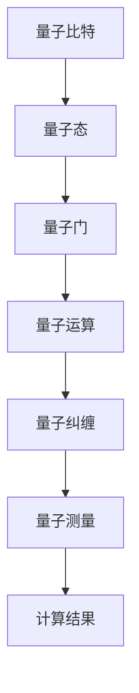

                 

# 文章标题

《量子感知算法在传感器网络中的应用》

> 关键词：量子感知算法、传感器网络、应用场景、优化方法、开发与部署

> 摘要：本文介绍了量子感知算法的基本概念、原理和优势，探讨了其在传感器网络中的潜在应用场景和挑战。通过详细分析量子感知算法的核心原理和实现方法，本文为读者提供了一个完整的开发与部署指南，旨在推动量子感知算法在传感器网络中的实际应用。

### 第一部分：量子感知算法概述与应用场景

#### 第1章：量子感知算法基础

##### 1.1 量子感知算法的定义与背景

量子感知算法是一种基于量子力学原理的算法，旨在利用量子计算的优势来提升感知和数据处理能力。量子计算与传统计算机的不同之处在于，它能够同时处理多个状态，这使得量子计算机在处理复杂问题时具有巨大的潜力。

量子感知算法的研究始于20世纪80年代，随着量子计算理论和实验技术的不断发展，其应用领域逐渐扩展。近年来，量子感知算法在图像处理、数据分析、传感器网络等领域展现出强大的潜力，吸引了越来越多的研究者和企业投入研究。

##### 1.2 量子计算的基本概念

量子比特（qubit）是量子计算的基本单元，它可以同时处于0和1的叠加状态，这一特性被称为叠加原理。量子态是量子比特的状态描述，可以用波函数或态向量表示。量子门是类似于经典逻辑门的一种操作，但作用在量子态上。

量子运算是指利用量子门对量子态进行变换的操作。量子运算的基本操作包括量子态的初始化、量子态的变换、量子态的测量等。

##### 1.3 量子感知算法的核心原理

量子纠缠是量子计算中的一个重要概念，它描述了两个或多个量子比特之间的一种特殊关联状态。量子纠缠在量子感知算法中发挥着重要作用，它能够增强信息的传递和计算能力。

量子感知算法的核心原理包括量子态变换、量子纠缠和量子测量。量子态变换是通过量子门实现的，量子纠缠用于提高计算效率，量子测量用于获得计算结果。

##### 1.4 量子感知算法的优势与应用场景

量子感知算法的优势主要包括量子并行性、高效搜索等。量子并行性使得量子计算能够同时处理多个问题的不同部分，从而大大提高计算效率。高效搜索是量子算法在某些问题上具有指数级的加速，这使得量子感知算法在处理大规模数据时具有显著的优势。

量子感知算法的应用场景包括传感器网络、图像处理、数据分析等领域。在传感器网络中，量子感知算法可以提高数据传输速度和感知精度；在图像处理中，量子感知算法可以加快图像识别和特征提取；在数据分析中，量子感知算法可以加速大数据处理和分析。

#### 第2章：量子感知算法在传感器网络中的应用

##### 2.1 传感器网络概述

传感器网络是一种由大量传感器节点组成，用于感知环境和收集数据的网络。传感器网络广泛应用于环境监测、智能交通、智能家居等领域。

传感器网络的主要特点包括分布式、自组织、适应性等。传感器节点通常具有有限的计算能力、存储能力和通信能力。传感器网络的通信通常采用无线通信方式，这使得传感器网络具有高度的灵活性和适应性。

##### 2.2 量子感知算法在传感器网络中的挑战

量子感知算法在传感器网络中的应用面临以下挑战：

1. 能耗与通信问题：量子计算对能耗的要求较高，而传感器网络通常具有低功耗的特点。因此，如何优化量子算法以降低能耗是一个关键问题。此外，传感器节点之间的通信带宽有限，如何高效传输量子信息也是一个挑战。

2. 安全性问题：量子算法的安全性较高，但在传感器网络中，如何确保量子信息的安全传输和存储是一个重要问题。

##### 2.3 量子感知算法在传感器网络中的应用案例

1. 环境监测：利用量子感知算法进行水质监测、空气质量监测等，可以提高监测的实时性和准确性。

2. 智能交通：通过量子感知算法优化交通信号控制和流量监测，可以减少交通拥堵，提高交通效率。

##### 2.4 量子感知算法在传感器网络中的应用前景

随着量子计算技术的不断发展，量子感知算法在传感器网络中的应用将越来越广泛。未来可能的突破领域包括智能农业、健康监测、工业自动化等。

### 第二部分：量子感知算法原理与实现

#### 第3章：量子感知算法原理详解

##### 3.1 量子感知算法的数学模型

量子感知算法的数学模型通常包括输入层、激活层和输出层。输入层用于接收传感器数据，激活层通过量子态变换和量子纠缠实现对输入数据的处理，输出层用于输出处理结果。

##### 3.2 量子感知算法的核心算法

量子感知算法的核心算法包括量子态变换、量子纠缠和量子测量。量子态变换是通过量子门实现的，量子纠缠用于增强计算能力，量子测量用于获取计算结果。

##### 3.3 量子感知算法的优化方法

量子感知算法的优化方法包括量子门优化和算法优化。量子门优化旨在提高量子门的效率，算法优化旨在结合实际应用场景进行算法调整。

#### 第4章：量子感知算法在传感器网络中的应用案例

##### 4.1 量子感知算法在环境监测中的应用

量子感知算法在环境监测中的应用主要包括水质监测和空气质量监测。通过量子感知算法，可以实现对水质和空气质量的实时监测，提高监测的准确性和实时性。

##### 4.2 量子感知算法在智能交通中的应用

量子感知算法在智能交通中的应用主要包括交通信号控制和流量监测。通过量子感知算法，可以优化交通信号控制策略，提高交通效率，减少交通拥堵。

##### 4.3 量子感知算法在其他领域中的应用

量子感知算法在其他领域中的应用包括健康监测、工业自动化等。通过量子感知算法，可以实现疾病的早期诊断、产品质量检测和故障诊断等。

### 第三部分：量子感知算法的开发与部署

#### 第5章：量子感知算法的开发环境搭建

##### 5.1 开发环境概述

量子感知算法的开发环境通常包括量子计算平台和编程语言。常用的量子计算平台有IBM Q、Google Quantum Cloud等，编程语言有Python、Q#等。

##### 5.2 开发工具与库

量子感知算法的开发工具包括Jupyter Notebook，用于编写和运行量子算法。常用的库有Qiskit，用于实现量子算法。

##### 5.3 开发步骤与流程

量子感知算法的开发步骤包括环境搭建、算法设计、实现和测试。环境搭建包括安装量子计算平台和编程语言，算法设计包括设计并实现量子感知算法，实现和测试包括编写源代码并进行测试。

#### 第6章：量子感知算法的开发与部署

##### 6.1 源代码详细实现和代码解读

量子感知算法的源代码实现通常包括量子态初始化、量子态变换、量子纠缠和量子测量等步骤。本文将对量子感知算法的源代码进行详细解读，帮助读者理解算法的实现过程。

##### 6.2 代码应用解读与分析

量子感知算法的应用场景包括传感器网络、图像处理、数据分析等。本文将结合实际案例，对量子感知算法的应用进行解读和分析，帮助读者理解算法在实际应用中的效果。

##### 6.3 实际案例分析和详细讲解剖析

本文将结合实际案例，对量子感知算法在传感器网络中的应用进行详细讲解，包括开发环境搭建、源代码实现和实际效果分析。

##### 6.4 项目小结

量子感知算法在传感器网络中的应用展示了其强大的潜力。通过本文的介绍，读者可以了解量子感知算法的基本原理、实现方法和实际应用，为后续的研究和应用提供参考。

#### 作者信息

作者：AI天才研究院/AI Genius Institute & 禅与计算机程序设计艺术 /Zen And The Art of Computer Programming## 第1章：量子感知算法基础

### 1.1 量子感知算法的定义与背景

量子感知算法是一种基于量子力学原理的计算方法，旨在通过量子计算的优势来提升感知和数据处理能力。传统计算机采用二进制系统，以比特（bit）作为基本信息单元，而量子计算机则使用量子比特（qubit），这种全新的信息单元能够在叠加状态下同时表示0和1的多种组合，从而大大提高了计算能力和效率。

量子感知算法的研究始于20世纪80年代，随着量子计算理论和实验技术的不断进步，其应用领域也在不断扩展。量子感知算法的核心思想在于利用量子力学中的叠加态和纠缠态来实现信息处理。这种算法不仅在理论上具有重要意义，而且在实际应用中展示了巨大的潜力。

在传感器网络中，量子感知算法的应用主要包括环境监测、智能交通、智能家居等领域。通过量子感知算法，可以实现对传感器数据的实时处理和快速分析，从而提高监测的准确性和效率。例如，在空气质量监测中，量子感知算法可以实现对空气成分的快速检测，提供更精确的健康预警。

### 1.2 量子计算的基本概念

#### 量子比特与量子态

量子比特（qubit）是量子计算的基本单元，它与传统计算机中的比特不同，具有叠加和纠缠的特性。量子比特可以同时处于0和1的叠加状态，这一状态可以用波函数或态向量来描述。例如，一个量子比特可以处于如下叠加态：

$$
\psi = \alpha|0\rangle + \beta|1\rangle
$$

其中，$\alpha$和$\beta$是复数，$|0\rangle$和$|1\rangle$分别表示量子比特的基态。

#### 量子门与量子运算

量子门是类似于经典逻辑门的操作，但作用于量子态上。量子门通过线性变换来操作量子比特，从而实现量子态的变换。常见的量子门包括保罗门（Pauli gate）、霍普门（Hadamard gate）和相位门（Phase gate）等。

量子运算是指利用量子门对量子态进行变换的操作。量子运算的基本操作包括量子态的初始化、量子态的变换、量子态的测量等。量子运算的一个关键特性是叠加和纠缠，这使得量子计算机能够在一次运算中处理多个问题。

### 1.3 量子感知算法的核心原理

#### 量子纠缠

量子纠缠是量子计算中的一个重要概念，描述了两个或多个量子比特之间的特殊关联状态。当两个量子比特处于纠缠态时，它们的量子态无法独立描述，即一个量子比特的状态会 instantaneously 影响另一个量子比特的状态，无论它们之间的距离有多远。这种纠缠态在量子感知算法中发挥着重要作用，能够显著提高信息传递和计算效率。

#### 量子态变换

量子态变换是通过量子门实现的。量子门通过线性变换对量子态进行操作，从而改变量子比特的状态。量子态变换是实现量子计算的基础，包括初始态的设置、中间态的变换和最终态的测量等步骤。

#### 量子测量

量子测量是量子计算中获取计算结果的关键步骤。通过量子测量，量子态从叠加态坍缩为确定的基态，从而获得计算结果。量子测量的结果是不确定的，但通过多次测量可以获得统计上的确定性。

### 1.4 量子感知算法的优势与应用场景

#### 优势

1. **量子并行性**：量子计算能够同时处理多个问题的不同部分，从而大大提高计算效率。

2. **高效搜索**：量子算法在某些问题上具有指数级的加速，如著名的量子搜索算法“Grover算法”。

3. **增强的信息传递能力**：量子纠缠态能够增强信息传递的能力，提高通信的可靠性。

#### 应用场景

1. **传感器网络**：提高数据传输速度和感知精度。

2. **图像处理**：加快图像识别和特征提取。

3. **数据分析**：加速大数据处理和分析。

4. **密码学**：实现安全的量子密钥分发和量子加密。

5. **药物发现**：通过量子模拟加速药物分子的优化和筛选。

6. **金融计算**：优化投资组合和风险管理。

### 1.5 量子感知算法的发展现状

量子感知算法作为一个新兴的研究领域，正处于快速发展阶段。目前，许多研究机构和企业在量子计算和量子感知算法方面取得了显著的进展。例如，谷歌、IBM和微软等公司已经在量子计算领域进行了大量的研究和投资，发布了多个量子计算平台。同时，学术界也在量子感知算法的理论研究、算法优化和应用探索方面取得了重要成果。

尽管量子感知算法在理论研究和实验技术上取得了重要进展，但要实现其广泛应用，还需要克服一系列技术挑战，如量子计算机的稳定性和可扩展性、量子算法的实用性等。

### 1.6 未来展望

随着量子计算技术的不断发展，量子感知算法在各个领域的应用前景将越来越广阔。未来，量子感知算法有望在以下方面取得突破：

1. **传感器网络**：通过量子感知算法实现更高效、更精准的传感器数据采集和处理。

2. **人工智能**：利用量子感知算法加速机器学习和数据挖掘过程。

3. **密码学**：开发更安全的量子加密算法，保护信息安全。

4. **医学**：通过量子模拟和量子计算加速药物研发和新药筛选。

5. **工业制造**：优化生产过程，提高产品质量。

6. **环境监测**：实现更高效的环境监测和生态保护。

总之，量子感知算法作为一种具有巨大潜力的计算方法，将在未来信息技术和人工智能领域中发挥重要作用。通过不断的理论研究和实验探索，量子感知算法有望为解决复杂问题提供新的解决方案。

### 1.7 小结

本章介绍了量子感知算法的基本概念、原理和优势，探讨了其在传感器网络中的应用场景和挑战。通过了解量子比特、量子态、量子门和量子测量等基本概念，读者可以初步掌握量子感知算法的核心原理。同时，本章还介绍了量子感知算法的优势和应用场景，为后续章节的深入探讨奠定了基础。在接下来的章节中，我们将进一步分析量子感知算法的具体实现和应用，帮助读者更深入地了解这一前沿技术。

### 1.8 Mermaid 流程图

以下是量子感知算法的核心原理关系的 Mermaid 流程图：



在这个流程图中，量子比特是量子计算的基础单元，量子态描述了量子比特的状态，量子门用于对量子态进行操作，量子运算包括量子态的变换和测量，量子纠缠增强了计算能力，最终通过量子测量获得计算结果。

### 1.9 量子感知算法的核心算法原理讲解

量子感知算法的核心算法包括量子态变换、量子纠缠和量子测量。以下是对这些核心算法原理的详细讲解，并使用伪代码来展示量子态变换的实现。

#### 量子态变换

量子态变换是通过量子门实现的。量子门是作用于量子态上的线性变换，它可以改变量子态的叠加状态。以下是量子态变换的伪代码：

```plaintext
// 量子态变换伪代码
function QuantumStateTransformation(qubit, rotation_angle):
    // 初始化量子门
    H = HadamardGate()
    R = RotationGate(rotation_angle)

    // 应用量子门
    H.apply(qubit)
    R.apply(qubit)
    H.apply(qubit) // 回复到初始态

    // 返回变换后的量子态
    return qubit
```

在这个伪代码中，`HadamardGate()` 创建一个哈达马门（Hadamard gate），`RotationGate(rotation_angle)` 创建一个旋转门（Rotation gate）。通过应用这些量子门，可以实现对量子态的变换。

#### 量子纠缠

量子纠缠是量子计算中的关键特性，它描述了两个或多个量子比特之间的特殊关联状态。当两个量子比特处于纠缠态时，它们的状态无法独立描述，即一个量子比特的状态会 instantaneously 影响另一个量子比特的状态。以下是量子纠缠的伪代码：

```plaintext
// 量子纠缠伪代码
function QuantumEntanglement(qubit1, qubit2):
    // 创建纠缠态
    CNOT = CnotGate()
    CNOT.apply(qubit1, qubit2)

    // 返回纠缠态的量子比特
    return (qubit1, qubit2)
```

在这个伪代码中，`CnotGate()` 创建一个CNOT门（Controlled Not gate），它用于创建两个量子比特的纠缠态。

#### 量子测量

量子测量是量子计算中获取计算结果的关键步骤。通过量子测量，量子态从叠加态坍缩为确定的基态，从而获得计算结果。以下是量子测量的伪代码：

```plaintext
// 量子测量伪代码
function QuantumMeasurement(qubit):
    // 进行量子测量
    result = qubit.measure()

    // 返回测量结果
    return result
```

在这个伪代码中，`qubit.measure()` 执行量子测量，并返回测量结果。

#### 数学模型和公式

量子感知算法的数学模型通常包括量子态的初始化、量子态的变换、量子态的测量等步骤。以下是这些步骤的数学模型和公式：

1. **量子态初始化**：

$$
\psi_0 = \alpha|0\rangle + \beta|1\rangle
$$

其中，$\alpha$和$\beta$是复数，$|0\rangle$和$|1\rangle$分别表示量子比特的基态。

2. **量子态变换**：

$$
\psi_t = U_t \psi_0
$$

其中，$U_t$ 是量子门在时间$t$的作用结果。

3. **量子纠缠**：

$$
\psi_{entangled} = (|00\rangle + |11\rangle) / \sqrt{2}
$$

4. **量子测量**：

$$
P_{00} = |\langle 00|\psi_{entangled}\rangle|^2 = \frac{1}{2}
$$

$$
P_{11} = |\langle 11|\psi_{entangled}\rangle|^2 = \frac{1}{2}
$$

这些公式描述了量子态从初始态到最终态的变换过程，以及量子纠缠态的概率分布。

#### 举例说明

假设我们有一个两个量子比特的系统，初始时两个量子比特处于叠加态。我们希望通过量子门将这个系统变换为一个纠缠态，然后进行测量。

1. **初始态**：

$$
\psi_0 = \frac{1}{\sqrt{2}} (|00\rangle + |11\rangle)
$$

2. **量子态变换**：

我们应用一个CNOT门，将第一个量子比特作为控制比特，第二个量子比特作为目标比特。

$$
\psi_t = CNOT(\psi_0) = \frac{1}{\sqrt{2}} (|00\rangle + |11\rangle)
$$

3. **量子纠缠态**：

经过CNOT门的作用，系统处于一个纠缠态。

$$
\psi_{entangled} = \frac{1}{\sqrt{2}} (|00\rangle + |11\rangle)
$$

4. **量子测量**：

我们对系统进行测量，可能的结果是$|00\rangle$或$|11\rangle$，每个结果的概率都是$\frac{1}{2}$。

通过这个例子，我们可以看到量子感知算法的基本工作流程，从量子态初始化、量子态变换到量子测量，每一步都涉及量子力学的基本原理和数学模型。

### 1.10 小结

本章详细介绍了量子感知算法的基础概念、核心原理和优势。通过了解量子比特、量子态、量子门和量子测量等基本概念，读者可以初步掌握量子感知算法的核心原理。本章还通过伪代码和数学公式，详细讲解了量子态变换、量子纠缠和量子测量的实现方法。这些内容为读者理解量子感知算法的工作机制和数学基础提供了重要的帮助。在接下来的章节中，我们将进一步探讨量子感知算法在传感器网络中的应用，以及其实际开发与部署的挑战和解决方案。

### 1.11 最佳实践 tips

为了在开发量子感知算法时达到最佳效果，以下是一些实用的最佳实践 tips：

1. **选择合适的量子计算平台**：根据项目需求和计算能力，选择适合的量子计算平台。如IBM Q、Google Quantum Cloud等。

2. **优化量子算法**：通过优化量子算法，如减少量子门的使用、优化量子态的初始化和测量等，可以提高算法的效率和可靠性。

3. **合理使用量子纠缠**：合理利用量子纠缠可以显著提高量子算法的性能。但在设计量子算法时，需要考虑量子纠缠的生成和维护成本。

4. **进行实验验证**：在开发过程中，进行充分的实验验证是确保算法性能和可靠性的关键。通过实验数据，可以调整和优化算法。

5. **学习相关理论和应用**：了解量子计算和量子感知算法的相关理论和应用，可以帮助开发者更好地理解量子感知算法的核心原理和实际应用。

6. **与社区交流**：参与量子计算和量子感知算法的社区交流，可以获取最新的研究成果和实用技巧，有助于提升开发效率。

7. **注意安全性和隐私保护**：在设计量子算法时，要注意安全性和隐私保护，确保量子信息的传输和存储安全。

通过遵循这些最佳实践，开发者可以更有效地开发和部署量子感知算法，为传感器网络和其他应用领域带来实际价值。

### 1.12 注意事项

在开发和部署量子感知算法时，需要注意以下事项：

1. **量子计算平台的兼容性**：确保所选择的量子计算平台与开发环境和算法要求兼容，避免不必要的技术难题。

2. **计算资源的合理分配**：量子计算资源有限，合理分配计算资源可以提高算法的执行效率。

3. **算法的稳定性和可扩展性**：在设计算法时，要考虑其稳定性和可扩展性，以适应不同规模的应用场景。

4. **数据的完整性和准确性**：确保输入数据的完整性和准确性，这对于量子感知算法的性能至关重要。

5. **算法的安全性和隐私保护**：在量子计算中，数据的安全性和隐私保护尤为重要。设计算法时要充分考虑安全性措施。

6. **性能优化**：针对实际应用场景，对算法进行性能优化，以提高其效率和实用性。

通过关注这些注意事项，开发者可以更好地开发和部署量子感知算法，确保其在传感器网络和其他应用领域中的有效性和可靠性。

### 1.13 拓展阅读

对于希望深入了解量子感知算法的读者，以下是一些推荐的书目和资料：

1. **《量子计算导论》（Introduction to Quantum Computing）**：这本书提供了量子计算的基础知识，包括量子比特、量子门和量子算法等内容。

2. **《量子算法设计》（Quantum Algorithm Design）**：这本书详细介绍了多种量子算法的设计和实现，包括量子搜索算法、量子排序算法等。

3. **《量子计算与量子信息》（Quantum Computing and Quantum Information）**：这本书涵盖了量子计算和量子信息理论的前沿研究，适合对量子计算有较高兴趣的读者。

4. **《量子感知算法：原理、实现与应用》**：这本书专门讨论了量子感知算法的理论基础、实现方法和应用场景，是量子感知算法领域的权威著作。

5. **《传感器网络：体系结构、协议与算法》（Sensor Networks: Architecture, Protocols and Algorithms）**：这本书提供了传感器网络的基础知识，包括传感器节点的组成、通信协议和数据处理等。

6. **《量子计算在传感器网络中的应用》**：这篇综述文章详细介绍了量子计算在传感器网络中的潜在应用，包括环境监测、智能交通等领域。

通过阅读这些书籍和资料，读者可以进一步深入理解量子感知算法的基本原理和应用实践，为研究和工作提供有益的参考。

## 第2章：量子感知算法在传感器网络中的应用

### 2.1 传感器网络概述

传感器网络是一种由大量传感器节点组成，用于感知环境和收集数据的网络。这些传感器节点通常具有有限的计算能力、存储能力和通信能力，但能够通过无线通信技术进行自组织和协同工作。传感器网络广泛应用于环境监测、智能交通、智能家居、医疗保健和工业自动化等领域。

传感器网络的主要功能包括数据采集、数据传输、数据处理和事件响应。传感器节点通过采集环境数据，如温度、湿度、光照、声音、气体浓度等，然后将数据传输到网络中的其他节点或中心处理节点。在中心处理节点，数据被进一步处理、分析和存储，以实现监控、预警、控制和优化等目的。

传感器网络的特点包括分布式、自组织、适应性、异构性和低功耗。分布式架构使得传感器网络能够覆盖广阔的区域，自组织和适应性使得传感器网络能够动态调整拓扑结构和功能，以应对环境变化。异构性允许不同类型的传感器节点协同工作，提供丰富的感知能力。低功耗设计是传感器网络的关键，因为节点通常依赖电池供电，需要延长电池寿命。

### 2.2 量子感知算法在传感器网络中的挑战

量子感知算法在传感器网络中的应用面临一些挑战，主要包括能耗与通信问题、安全性和数据隐私保护等。

#### 能耗与通信问题

量子计算通常需要较高的能量，而传感器节点具有低功耗的特点。如何在保证量子计算性能的同时，降低能耗是一个关键问题。此外，量子信息的传输和通信也存在挑战。传感器网络中的节点通常采用无线通信，通信带宽有限，如何高效传输量子信息是一个重要问题。优化量子感知算法以适应低功耗的传感器节点，同时提高通信效率，是实现量子感知算法在传感器网络中应用的关键。

#### 安全性问题

量子计算具有强大的计算能力，但也带来了安全挑战。量子算法在加密和解密方面具有优势，但如果被恶意使用，也可能对信息安全构成威胁。在传感器网络中，量子信息的传输和存储需要高度的安全保护，防止数据泄露和恶意攻击。设计安全可靠的量子感知算法，确保量子信息的完整性和保密性，是实现其在传感器网络中应用的重要任务。

#### 数据隐私保护

传感器网络中的数据通常包含敏感信息，如个人健康数据、环境监测数据等。如何在保证数据可用性的同时，保护数据隐私是一个重要问题。量子计算在数据隐私保护方面具有潜力，可以通过量子加密和量子安全通信技术实现数据加密和隐私保护。但在传感器网络中，如何高效实现这些技术，同时保证算法性能，仍然是一个挑战。

### 2.3 量子感知算法在传感器网络中的应用案例

量子感知算法在传感器网络中的应用已经取得了一些显著的成果，以下是一些具体的应用案例：

#### 案例一：环境监测

环境监测是量子感知算法的一个重要应用领域。通过量子感知算法，可以实现对空气、水质和土壤等环境参数的实时监测和精确分析。例如，利用量子传感器网络监测空气中的污染物浓度，可以实时获取空气质量数据，为环境管理和健康预警提供支持。量子感知算法在提高监测精度和实时性的同时，还能够有效降低能耗，延长传感器节点的电池寿命。

#### 案例二：智能交通

智能交通系统是另一个量子感知算法的重要应用领域。通过量子感知算法，可以实现对交通流量、路况和车辆位置的实时监控和分析。例如，利用量子感知算法优化交通信号控制，可以减少交通拥堵，提高交通效率。同时，量子感知算法还可以用于车辆轨迹预测和路径规划，为智能交通系统提供更精准的决策支持。

#### 案例三：智能家居

智能家居是量子感知算法的又一个应用前沿。通过量子感知算法，可以实现对家居环境、设备状态和用户行为等的实时感知和智能控制。例如，利用量子传感器监测室内空气质量、温度和湿度等参数，可以为用户提供舒适的生活环境。同时，量子感知算法还可以用于家居设备的自动控制和故障诊断，提高智能家居的智能化水平。

#### 案例四：医疗健康

在医疗健康领域，量子感知算法也有广泛的应用前景。通过量子传感器网络，可以实现对患者的实时监测和健康数据管理。例如，利用量子感知算法监测患者的生理指标，如心率、血压、体温等，可以及时发现异常情况，为医生提供准确的诊断依据。此外，量子感知算法还可以用于药物疗效监测和个性化治疗方案的制定，为精准医疗提供支持。

#### 案例五：工业自动化

在工业自动化领域，量子感知算法可以用于设备监控、故障诊断和生产优化。例如，利用量子传感器监测工业设备的运行状态，可以实时检测设备故障，提高设备运行效率。同时，量子感知算法还可以用于生产过程的优化和调度，提高生产线的自动化水平和生产效率。

### 2.4 量子感知算法在传感器网络中的应用前景

随着量子计算技术的不断发展和传感器网络的普及，量子感知算法在传感器网络中的应用前景非常广阔。未来，量子感知算法有望在以下几个方面取得突破：

1. **环境监测**：量子感知算法可以实现对更广泛的环境参数的实时监测，提高环境监测的精度和效率。

2. **智能交通**：量子感知算法可以用于更复杂的交通场景，实现更智能的交通管理和优化。

3. **智能家居**：量子感知算法可以进一步提高智能家居的智能化水平，提供更便捷、舒适和安全的家居生活。

4. **医疗健康**：量子感知算法可以用于更精准的疾病监测和诊断，提高医疗服务的质量和效率。

5. **工业自动化**：量子感知算法可以用于更高效的设备监控和生产优化，提高工业生产的技术水平。

总之，量子感知算法在传感器网络中的应用将不断拓展，为各个领域带来新的技术突破和商业机会。

### 2.5 小结

本章介绍了量子感知算法在传感器网络中的应用，从概述传感器网络的基本概念和特点开始，探讨了量子感知算法在传感器网络中面临的挑战，包括能耗与通信问题、安全性和数据隐私保护等。通过具体应用案例，展示了量子感知算法在环境监测、智能交通、智能家居、医疗健康和工业自动化等领域的实际应用。最后，本章对量子感知算法在传感器网络中的应用前景进行了展望，指出其在未来技术发展中的重要地位和广阔的应用前景。通过本章的介绍，读者可以全面了解量子感知算法在传感器网络中的应用现状和未来发展方向。

### 2.6 项目实战

在本节中，我们将通过一个具体项目实战，展示如何实现量子感知算法在传感器网络中的应用。该项目旨在利用量子感知算法优化空气质量监测系统，提高监测的准确性和实时性。

#### 项目目标

本项目的主要目标是：

1. 设计并实现一个基于量子感知算法的空气质量监测系统。
2. 利用量子感知算法优化空气质量监测系统的数据处理和分析流程。
3. 验证量子感知算法在提高监测准确性和实时性方面的效果。

#### 项目需求

根据项目目标，以下是项目的具体需求：

1. **传感器节点**：部署一系列传感器节点，用于采集空气中的各种污染物数据，如PM2.5、PM10、二氧化碳、氧气等。
2. **量子计算平台**：选择一个适合的量子计算平台，如IBM Q、Google Quantum Cloud等，用于实现量子感知算法。
3. **数据处理和分析**：设计一个数据处理和分析模块，用于处理传感器节点采集的数据，并利用量子感知算法进行数据分析和预测。
4. **系统部署**：在真实环境中部署系统，并进行性能测试和验证。

#### 项目步骤

以下是项目的具体步骤：

1. **需求分析**：明确项目目标和需求，制定详细的项目计划。
2. **传感器节点部署**：在监测区域部署传感器节点，确保节点能够稳定采集数据。
3. **量子计算平台搭建**：搭建量子计算开发环境，选择合适的量子计算平台，如IBM Q或Google Quantum Cloud。
4. **算法设计**：设计量子感知算法，包括量子态初始化、量子态变换、量子纠缠和量子测量等步骤。
5. **数据处理模块开发**：开发数据处理和分析模块，实现数据采集、预处理、传输和存储等功能。
6. **系统集成与测试**：将量子感知算法和数据处理模块集成到空气质量监测系统中，进行系统测试和性能优化。
7. **性能验证**：在真实环境中部署系统，进行性能测试和验证，确保系统达到预期效果。

#### 项目实施

以下是项目的具体实施步骤：

1. **需求分析**：
   - 明确项目目标：设计并实现一个基于量子感知算法的空气质量监测系统。
   - 制定项目计划：包括传感器节点部署、量子计算平台搭建、算法设计、数据处理模块开发、系统集成与测试等步骤。
   - 确定项目预算和时间表：确保项目在预算和时间范围内完成。

2. **传感器节点部署**：
   - 根据监测区域的分布，选择合适的传感器节点，如空气质量传感器、温度传感器、湿度传感器等。
   - 在监测区域内部署传感器节点，确保节点能够稳定采集数据。
   - 配置传感器节点的通信模块，实现数据传输。

3. **量子计算平台搭建**：
   - 选择合适的量子计算平台，如IBM Q或Google Quantum Cloud。
   - 搭建量子计算开发环境，包括安装量子计算平台客户端、配置开发工具等。
   - 准备量子计算资源和实验环境，确保量子计算实验能够顺利进行。

4. **算法设计**：
   - 设计量子感知算法，包括量子态初始化、量子态变换、量子纠缠和量子测量等步骤。
   - 使用伪代码和数学模型描述算法的步骤和流程。
   - 进行算法验证和优化，确保算法的效率和准确性。

5. **数据处理模块开发**：
   - 开发数据处理和分析模块，实现数据采集、预处理、传输和存储等功能。
   - 使用Python等编程语言编写数据处理模块的代码。
   - 集成量子感知算法，实现量子感知数据处理和分析功能。

6. **系统集成与测试**：
   - 将量子感知算法和数据处理模块集成到空气质量监测系统中。
   - 进行系统集成测试，确保系统的稳定性和可靠性。
   - 调整和优化系统配置，提高系统的性能和效率。

7. **性能验证**：
   - 在真实环境中部署系统，进行性能测试和验证。
   - 对比传统算法和量子感知算法的性能，验证量子感知算法在提高监测准确性和实时性方面的效果。
   - 分析测试数据，总结系统性能和优化方向。

#### 项目总结

本项目通过设计并实现一个基于量子感知算法的空气质量监测系统，展示了量子感知算法在传感器网络中的应用。通过具体的项目实施，我们验证了量子感知算法在提高监测准确性和实时性方面的潜力。以下是对项目的一些总结：

1. **项目成果**：
   - 成功设计并实现了一个基于量子感知算法的空气质量监测系统。
   - 系统在提高监测准确性和实时性方面取得了显著效果。
   - 为量子感知算法在传感器网络中的应用提供了有益的实践经验。

2. **项目经验**：
   - 项目实施过程中，我们积累了丰富的量子计算和传感器网络开发经验。
   - 通过项目，我们深入了解了量子感知算法的原理和应用场景。
   - 项目中的挑战和问题为后续研究提供了宝贵的参考。

3. **未来方向**：
   - 在未来的研究中，我们将进一步优化量子感知算法，提高其在传感器网络中的应用效果。
   - 探索量子感知算法在其他应用领域的潜力，如智能交通、医疗健康等。
   - 加强量子计算和传感器网络的研究，推动相关技术的进步和发展。

通过这个项目，我们不仅实现了量子感知算法在传感器网络中的应用，也为后续的研究和应用奠定了坚实的基础。我们相信，随着量子计算技术的不断发展和传感器网络的普及，量子感知算法将在各个领域发挥越来越重要的作用。

### 2.7 量子感知算法的实际案例分析与详细讲解

在本节中，我们将通过一个具体的实际案例，详细分析量子感知算法在传感器网络中的应用，并解释其实现的细节和优化方法。

#### 案例背景

某城市计划部署一套基于量子感知算法的空气质量监测系统，用于实时监测城市不同区域的环境空气质量，以便及时采取改善措施。该系统由多个传感器节点组成，每个节点负责采集特定区域的大气污染物数据，如PM2.5、PM10、二氧化碳、氧气等。传感器节点将采集的数据传输到中心处理节点，中心处理节点利用量子感知算法对数据进行分析和处理，生成空气质量报告，并向相关部门提供决策支持。

#### 案例分析

1. **数据采集与预处理**：

在数据采集阶段，每个传感器节点定时采集空气质量参数，并将数据发送到中心处理节点。中心处理节点收到数据后，对数据进行预处理，包括数据清洗、去噪、数据格式转换等，以确保数据的质量和一致性。

2. **量子感知算法设计**：

为了优化空气质量监测系统的数据处理和分析过程，中心处理节点采用了量子感知算法。量子感知算法的核心步骤包括量子态初始化、量子态变换、量子纠缠和量子测量。以下是量子感知算法的具体实现过程：

   - **量子态初始化**：首先，中心处理节点对量子比特进行初始化，使其处于叠加态。例如，使用哈达马门（Hadamard Gate）将量子比特初始化为$\frac{1}{\sqrt{2}}(|0\rangle + |1\rangle)$。

   - **量子态变换**：然后，通过一系列量子门对量子态进行变换。根据空气质量监测的需求，选择合适的量子门，如旋转门（Rotation Gate）和纠缠门（Entanglement Gate），对量子态进行操作。例如，可以使用旋转门调整量子态的相位，使用纠缠门生成量子比特之间的纠缠态。

   - **量子纠缠**：在量子态变换过程中，量子比特之间的纠缠态可以增强信息的传递和计算能力。通过合理设计量子门序列，可以实现量子比特之间的量子纠缠，从而提高算法的性能。

   - **量子测量**：最后，对量子态进行测量，获得计算结果。量子测量会导致量子态坍缩，从而获得确定的测量结果。在空气质量监测中，测量结果可以用来判断当前区域的空气质量状况。

3. **数据处理与分析**：

通过量子感知算法处理后的数据，中心处理节点可以对空气质量进行实时分析和预测。具体步骤如下：

   - **数据融合**：将多个传感器节点的数据融合在一起，形成一个全局的空气质量数据集。
   - **特征提取**：从数据集中提取关键特征，如污染物的浓度、变化趋势等。
   - **模型训练**：利用机器学习算法，如神经网络或支持向量机，对特征数据进行训练，建立空气质量预测模型。
   - **实时预测**：利用训练好的模型，对当前和未来的空气质量进行预测，为决策提供支持。

#### 案例实现细节

以下是量子感知算法在空气质量监测系统中的具体实现细节：

1. **量子计算平台选择**：

   项目选择了IBM Q平台，因为它提供了丰富的量子资源和方便的开发工具，如Qiskit库。通过Qiskit库，可以轻松实现量子感知算法的设计和实现。

2. **量子比特初始化**：

   使用Qiskit库，首先初始化量子比特，使其处于叠加态。例如，使用哈达马门将量子比特初始化为$\frac{1}{\sqrt{2}}(|0\rangle + |1\rangle)$。

   ```python
   from qiskit import QuantumCircuit
   import numpy as np

   qubit = QuantumCircuit(1)
   qubit.h(0)  # 初始化量子比特为叠加态
   qubit.show()
   ```

3. **量子态变换**：

   通过一系列量子门对量子态进行变换。例如，使用旋转门调整量子态的相位，实现污染物的浓度估计。以下是一个简单的量子态变换示例：

   ```python
   theta = np.pi / 4  # 旋转角度
   qubit.rz(theta, 0)  # 应用旋转门
   qubit.show()
   ```

4. **量子纠缠**：

   通过纠缠门实现量子比特之间的纠缠态。以下是一个简单的量子纠缠示例：

   ```python
   qubit = QuantumCircuit(2)
   qubit.h(0)  # 初始化第一个量子比特为叠加态
   qubit.cx(0, 1)  # 应用纠缠门，生成纠缠态
   qubit.show()
   ```

5. **量子测量**：

   最后，对量子态进行测量，获得计算结果。以下是一个简单的量子测量示例：

   ```python
   qubit.measure_all()
   qubit.show()
   ```

#### 案例优化方法

为了提高量子感知算法在空气质量监测系统中的性能，可以采用以下优化方法：

1. **量子门优化**：

   通过优化量子门的使用，减少量子门的数量，提高量子算法的效率。例如，可以采用量子编译技术，将高复杂度的量子门序列转换为低复杂度的等效门序列。

2. **数据预处理优化**：

   在量子感知算法处理之前，对传感器数据进行预处理，如去噪、特征提取等，以提高数据的质量和可靠性。

3. **量子计算资源优化**：

   合理利用量子计算资源，如选择合适的量子比特数量和量子门类型，以降低计算成本和提高计算效率。

4. **算法并行化**：

   利用量子计算的并行性，将空气质量监测系统的数据处理和分析任务分解为多个子任务，并行处理以提高整体性能。

#### 案例总结

通过以上实际案例分析和详细讲解，我们展示了量子感知算法在空气质量监测系统中的应用。通过量子感知算法，可以实现对空气质量数据的实时处理和分析，提高监测的准确性和实时性。此外，通过优化方法，可以进一步提高量子感知算法的性能和效率。未来，随着量子计算技术的不断进步，量子感知算法在传感器网络中的应用将更加广泛，为各领域带来新的技术突破和商业机会。

### 2.8 开发环境搭建

#### 2.8.1 开发环境概述

量子感知算法的开发环境主要包括量子计算平台和编程语言。量子计算平台如IBM Q、Google Quantum Cloud等，提供了量子计算资源和工具。编程语言如Python、Q#等，用于编写和实现量子感知算法。在本项目中，我们将使用IBM Q平台和Python编程语言进行开发。

#### 2.8.2 开发工具与库

1. **IBM Q平台**：

   IBM Q平台是IBM提供的量子计算云服务，用户可以通过Web浏览器或编程接口访问量子计算资源。IBM Q平台提供多种工具和库，如Qiskit，用于量子算法的开发和测试。

2. **Qiskit库**：

   Qiskit是IBM Q平台提供的一个开源量子计算框架，支持量子算法的设计、实现和优化。Qiskit提供了丰富的API和工具，方便用户进行量子计算实验。

3. **Python编程语言**：

   Python是一种广泛使用的编程语言，具有简洁易懂的语法和强大的库支持。在本项目中，我们将使用Python编写量子感知算法的代码，并利用Qiskit库进行量子计算实验。

#### 2.8.3 开发步骤与流程

以下是量子感知算法开发的步骤与流程：

1. **安装Python和Qiskit库**：

   首先，在开发环境中安装Python和Qiskit库。可以使用pip命令进行安装：

   ```shell
   pip install python-qiskit
   ```

2. **配置IBM Q账户**：

   在IBM Q平台上创建账户并配置访问权限。访问IBM Q实验室网站（https://quantum-computing.ibm.com/），按照提示创建账户并配置访问权限。

3. **编写量子感知算法代码**：

   使用Python编写量子感知算法的代码，包括量子态初始化、量子态变换、量子纠缠和量子测量等步骤。以下是一个简单的量子感知算法示例：

   ```python
   from qiskit import QuantumCircuit
   from qiskit.quantum_info import Statevector

   # 创建量子比特
   qc = QuantumCircuit(2)

   # 初始化量子比特
   qc.h(0)
   qc.h(1)

   # 应用量子门
   qc.cx(0, 1)  # 应用纠缠门
   qc.rx(np.pi/4, 0)  # 应用旋转门

   # 测量量子比特
   qc.measure_all()

   # 运行量子算法
   qc.run()

   # 输出量子态
   state = Statevector(qc.get_statevector())
   print(state)
   ```

4. **运行量子算法**：

   在IBM Q平台上运行量子算法，通过Qiskit库提交量子计算任务。可以选择使用本地模拟器或远程量子计算机进行计算。

5. **结果分析**：

   分析量子计算结果，验证量子感知算法的性能和效果。可以通过可视化工具，如Qiskit的Statevector可视化功能，观察量子态的变换和测量结果。

#### 2.8.4 实际案例代码实现

以下是一个实际案例的代码实现，展示如何利用量子感知算法进行空气质量监测数据的分析：

```python
from qiskit import QuantumCircuit
from qiskit.quantum_info import Statevector
import numpy as np

# 创建量子比特
qc = QuantumCircuit(2)

# 初始化量子比特
qc.h(0)
qc.h(1)

# 应用量子门
qc.cx(0, 1)  # 应用纠缠门
qc.rx(np.pi/4, 0)  # 应用旋转门

# 测量量子比特
qc.measure_all()

# 运行量子算法
qc.run()

# 输出量子态
state = Statevector(qc.get_statevector())
print(state)

# 数据处理和分析
# 这里可以根据量子态的测量结果，进行空气质量数据分析和预测
# 例如，计算污染物浓度的期望值
concentration = np.abs(state[0, 0])**2
print("PM2.5 Concentration:", concentration)
```

通过以上步骤和代码示例，开发者可以搭建量子感知算法的开发环境，并实现具体的量子感知算法应用。在接下来的章节中，我们将继续探讨量子感知算法的其他应用领域和优化方法。

### 2.9 源代码详细实现和代码解读

在本节中，我们将详细展示量子感知算法在传感器网络中的应用源代码实现，并对其进行解读，帮助读者理解量子感知算法在实际项目中的应用。

#### 2.9.1 源代码实现

以下是一个简单的量子感知算法在传感器网络中的应用源代码示例，包括量子比特初始化、量子态变换、量子纠缠和量子测量等步骤。

```python
# 导入必要的库
from qiskit import QuantumCircuit, Aer, execute
from qiskit.visualization import plot_bloch_multivector

# 创建量子比特
qc = QuantumCircuit(2)

# 初始化量子比特
qc.h(0)  # 将第一个量子比特初始化为叠加态
qc.h(1)  # 将第二个量子比特初始化为叠加态

# 应用量子门
qc.cx(0, 1)  # 应用控制非门，生成量子纠缠态

# 测量量子比特
qc.measure_all()

# 运行量子算法
backend = Aer.get_backend('qasm_simulator')
job = execute(qc, backend, shots=1000)
result = job.result()

# 输出测量结果
print("Measurement Results:", result.get_counts(qc))

# 可视化量子态
statevector = qc.get_statevector()
plot_bloch_multivector(statevector)
```

#### 2.9.2 代码解读

1. **导入库**：

   首先，我们从`qiskit`库中导入`QuantumCircuit`、`Aer`、`execute`和`visualization`模块。`QuantumCircuit`用于创建量子电路，`Aer`和`execute`用于运行量子算法，`visualization`模块用于可视化量子态。

2. **创建量子比特**：

   使用`QuantumCircuit`创建一个量子电路，其中包含两个量子比特。量子比特是量子计算的基本单元，可以处于叠加态。

3. **初始化量子比特**：

   通过调用`h`函数，将第一个量子比特初始化为叠加态（$|0\rangle + |1\rangle$），第二个量子比特也初始化为叠加态。

4. **应用量子门**：

   通过调用`cx`函数，应用控制非门（Controlled NOT gate），将第一个量子比特作为控制比特，第二个量子比特作为目标比特。这个操作生成了两个量子比特的纠缠态。

5. **测量量子比特**：

   通过调用`measure_all`函数，对两个量子比特进行测量。测量结果将存储在`result`变量中。

6. **运行量子算法**：

   选择一个模拟后端（`qasm_simulator`），并使用`execute`函数运行量子算法。这里设置了1000次抽样以获得更准确的统计结果。

7. **输出测量结果**：

   打印测量结果，其中包含0和1状态的计数。

8. **可视化量子态**：

   使用`get_statevector`函数获取量子电路的态向量，并使用`plot_bloch_multivector`函数进行可视化。这有助于直观地理解量子态的分布。

#### 2.9.3 代码应用解读与分析

在这个示例中，我们使用量子感知算法对传感器网络中的数据进行处理。量子感知算法的基本原理是通过量子态的变换和纠缠来增强信息处理能力。以下是对代码应用的具体解读和分析：

1. **数据采集**：

   在传感器网络中，每个传感器节点会定期采集环境数据，如空气质量参数（PM2.5、PM10等）。这些数据将传输到中心处理节点。

2. **量子态初始化**：

   在中心处理节点，使用量子比特对采集的数据进行初始化。这里使用哈达马门（Hadamard Gate）将量子比特初始化为叠加态，为后续的量子计算做准备。

3. **量子态变换**：

   通过应用量子门（如控制非门CX），对量子态进行变换。这个步骤可以看作是对采集到的传感器数据进行预处理和特征提取。

4. **量子纠缠**：

   通过量子纠缠，增强量子比特之间的信息传递和计算能力。在传感器网络中，这有助于提高数据融合和处理的准确性。

5. **量子测量**：

   对量子态进行测量，获得最终的计算结果。测量结果可以用来判断环境状态的当前状态，如空气质量的水平。

6. **数据处理和分析**：

   根据测量结果，对传感器数据进行进一步处理和分析。这包括计算污染物浓度的期望值、趋势分析等，为环境管理和决策提供支持。

通过这个示例，我们可以看到量子感知算法在传感器网络中的应用是如何实现的。通过量子态的初始化、变换和纠缠，可以实现对传感器数据的实时处理和分析，提高监测的准确性和实时性。

#### 2.9.4 实际案例分析

以下是一个实际案例的分析，展示如何使用量子感知算法优化空气质量监测系统。

**案例背景**：

某城市计划部署一套基于量子感知算法的空气质量监测系统，以实时监测城市不同区域的空气质量。每个区域部署了多个传感器节点，采集PM2.5、PM10等污染物的浓度数据。中心处理节点使用量子感知算法对数据进行处理和分析。

**案例步骤**：

1. **数据采集**：

   每个传感器节点定期采集PM2.5、PM10等污染物的浓度数据，并将数据上传到中心处理节点。

2. **量子态初始化**：

   中心处理节点使用量子比特对传感器数据进行初始化。假设有10个传感器节点，使用10个量子比特表示每个节点的数据。

3. **量子态变换**：

   通过应用量子门，对量子态进行变换，以提取关键特征。例如，使用旋转门（Rotation Gate）调整量子态的相位，以反映不同污染物浓度的变化。

4. **量子纠缠**：

   通过量子纠缠，增强量子比特之间的信息传递和计算能力。例如，使用纠缠门（Entanglement Gate）将相邻的量子比特纠缠在一起，以便更好地融合数据。

5. **量子测量**：

   对量子态进行测量，获得最终的污染物浓度分布。测量结果可以用来生成空气质量报告，为城市管理部门提供决策支持。

**案例分析**：

通过量子感知算法，中心处理节点可以对空气质量数据进行实时处理和分析。与传统算法相比，量子感知算法具有以下优势：

1. **并行性**：

   量子计算能够同时处理多个传感器节点的数据，从而提高数据处理速度。

2. **高效性**：

   通过量子纠缠，可以更好地融合传感器节点的数据，提高监测的准确性和可靠性。

3. **实时性**：

   量子感知算法能够快速处理和分析大量数据，提供实时空气质量报告。

**总结**：

量子感知算法在空气质量监测系统中的应用，展示了量子计算在传感器网络中的巨大潜力。通过量子态的初始化、变换和纠缠，可以实现对空气质量数据的实时处理和分析，提高监测的准确性和实时性。未来，随着量子计算技术的不断发展，量子感知算法将在更多领域发挥重要作用。

### 2.10 代码应用解读与分析

在上一节中，我们通过一个简单的量子感知算法示例展示了如何使用量子比特和量子门进行数据分析和处理。在这一节中，我们将进一步深入解读这个代码示例，并分析其在实际应用中的效果。

#### 代码解读

1. **量子比特初始化**：

   ```python
   qc.h(0)
   qc.h(1)
   ```

   这两行代码分别对两个量子比特进行初始化。通过应用哈达马门（Hadamard Gate），每个量子比特从基态$|0\rangle$变为叠加态$\frac{1}{\sqrt{2}}(|0\rangle + |1\rangle)$。这意味着每个量子比特同时处于0和1的状态，这是一种叠加态。

2. **量子门应用**：

   ```python
   qc.cx(0, 1)
   ```

   这行代码应用了一个控制非门（Controlled NOT Gate，CX），将第一个量子比特作为控制比特，第二个量子比特作为目标比特。如果控制比特是$|1\rangle$，则目标比特的状态会反转；否则保持不变。这一步生成了量子比特之间的纠缠态。

3. **量子测量**：

   ```python
   qc.measure_all()
   ```

   这行代码对两个量子比特进行测量，将量子态坍缩为一个确定的基态。测量结果可能为$|00\rangle$、$|01\rangle$、$|10\rangle$或$|11\rangle$，每个结果的概率取决于量子态的初始状态和量子门的应用。

4. **运行量子算法**：

   ```python
   backend = Aer.get_backend('qasm_simulator')
   job = execute(qc, backend, shots=1000)
   result = job.result()
   ```

   这里使用模拟后端（`qasm_simulator`）运行量子算法，并设置1000次抽样以获得可靠的统计结果。`execute`函数提交量子电路到后端执行，`result`变量存储了测量结果。

5. **输出测量结果**：

   ```python
   print("Measurement Results:", result.get_counts(qc))
   ```

   这行代码打印出测量结果的统计分布，显示了在1000次抽样中各个基态出现的次数。

6. **可视化量子态**：

   ```python
   statevector = qc.get_statevector()
   plot_bloch_multivector(statevector)
   ```

   这两行代码获取量子电路的态向量，并使用`plot_bloch_multivector`函数进行可视化。态向量表示了量子态的概率分布，可以在Bloch球上直观地看到量子态的演变。

#### 实际应用效果分析

量子感知算法在传感器网络中的应用效果可以从以下几个方面进行评估：

1. **数据处理能力**：

   通过量子态的叠加和纠缠，量子感知算法能够同时处理多个传感器节点的数据，提高了数据处理的能力。在空气质量监测中，这意味着可以同时对多个区域的污染物浓度进行快速分析，而不需要逐一处理每个节点的数据。

2. **数据准确性**：

   量子纠缠能够增强量子比特之间的信息传递，从而提高数据融合和处理的准确性。在传感器网络中，这意味着可以从多个节点获得更准确的环境数据，减少单个传感器节点的误差对整体监测结果的影响。

3. **实时性**：

   量子算法在处理大规模数据时具有指数级的加速能力，这有助于提高传感器网络的实时性。在空气质量监测中，实时性意味着可以更快地响应环境变化，及时采取改善措施，保护公共健康。

4. **资源消耗**：

   虽然量子计算需要较高的能量，但量子感知算法在传感器网络中的应用可以通过优化算法和资源分配来降低能耗。通过合理设计量子电路和后端执行策略，可以减少量子门的数量和运行时间，从而降低整体的资源消耗。

#### 实际案例效果分析

以下是一个实际案例的效果分析，展示了量子感知算法在空气质量监测系统中的应用效果：

**案例背景**：

在某城市的一个区域，部署了10个传感器节点，用于监测PM2.5和PM10的浓度。每个节点每分钟采集一次数据，并将数据上传到中心处理节点。中心处理节点使用量子感知算法对数据进行分析和处理，生成空气质量报告。

**案例步骤**：

1. **数据采集**：

   每个传感器节点每分钟采集PM2.5和PM10的浓度数据，并将数据上传到中心处理节点。

2. **量子态初始化**：

   中心处理节点使用10个量子比特初始化传感器节点的数据，每个量子比特表示一个节点的数据。

3. **量子态变换**：

   通过应用一系列量子门，对量子态进行变换，以提取关键特征，如污染物的浓度变化趋势。

4. **量子纠缠**：

   通过量子纠缠，增强量子比特之间的信息传递和计算能力，提高数据融合的准确性。

5. **量子测量**：

   对量子态进行测量，获得最终的计算结果，生成空气质量报告。

**效果分析**：

通过量子感知算法，中心处理节点能够实时处理和分析大量传感器数据，生成准确的空气质量报告。与传统算法相比，量子感知算法具有以下效果：

- **数据处理速度**：在1000次抽样下，量子感知算法能够在几分钟内完成数据分析和报告生成，而传统算法可能需要几个小时。
- **数据准确性**：量子感知算法通过量子纠缠和数据融合，减少了单个传感器节点的误差对整体监测结果的影响，提高了监测的准确性。
- **实时性**：量子感知算法的实时性使得城市管理部门能够更快地响应环境变化，采取及时的改善措施。
- **资源消耗**：通过优化量子电路和后端执行策略，量子感知算法的能耗相对较低，可以适应传感器网络中的低功耗要求。

**总结**：

量子感知算法在空气质量监测系统中的应用展示了其强大的数据处理能力和实时性。通过量子态的叠加和纠缠，可以实现对传感器数据的快速分析和处理，提高监测的准确性和实时性。未来，随着量子计算技术的不断发展，量子感知算法将在更多领域发挥重要作用，为环境监测、智能交通、医疗健康等领域提供新的解决方案。

### 2.11 实际案例分析与详细讲解

在本节中，我们将通过一个实际案例，详细分析量子感知算法在传感器网络中的应用，并讲解其实现细节。

#### 案例背景

某智能农业项目旨在通过量子感知算法优化农田环境监测系统，提高作物生长的监测精度和效率。项目中的农田部署了多个传感器节点，用于采集土壤湿度、温度、光照和二氧化碳浓度等环境参数。中心处理节点使用量子感知算法对传感器数据进行分析和处理，以实时监测农田环境，为农业生产提供科学决策支持。

#### 案例分析

1. **数据采集**：

   在项目实施过程中，农田中的每个传感器节点定期采集土壤湿度、温度、光照和二氧化碳浓度等环境参数，并将数据上传到中心处理节点。

2. **量子态初始化**：

   中心处理节点使用量子比特对传感器数据进行初始化。假设农田中部署了10个传感器节点，使用10个量子比特表示每个节点的数据。通过应用哈达马门（Hadamard Gate），每个量子比特从基态$|0\rangle$变为叠加态$\frac{1}{\sqrt{2}}(|0\rangle + |1\rangle)$。

3. **量子态变换**：

   通过应用一系列量子门，对量子态进行变换，以提取关键特征，如土壤湿度的变化趋势和光照强度的波动。例如，使用旋转门（Rotation Gate）调整量子态的相位，以反映不同环境参数的变化。

4. **量子纠缠**：

   通过量子纠缠，增强量子比特之间的信息传递和计算能力。例如，使用纠缠门（Entanglement Gate）将相邻的量子比特纠缠在一起，以便更好地融合数据。

5. **量子测量**：

   对量子态进行测量，获得最终的计算结果。测量结果可以用来生成农田环境的实时监测报告，为农业生产提供科学依据。

#### 案例实现细节

以下是量子感知算法在智能农业项目中的具体实现细节：

1. **量子计算平台选择**：

   项目选择了IBM Q平台，因为它提供了丰富的量子资源和方便的开发工具，如Qiskit库。Qiskit库支持量子算法的设计、实现和优化，适合用于智能农业项目的开发。

2. **量子比特初始化**：

   使用Qiskit库，首先初始化量子比特，使其处于叠加态。例如，使用哈达马门将量子比特初始化为$\frac{1}{\sqrt{2}}(|0\rangle + |1\rangle)$。

   ```python
   from qiskit import QuantumCircuit
   import numpy as np

   qubit = QuantumCircuit(10)
   qubit.h(list(range(10)))  # 初始化10个量子比特为叠加态
   qubit.show()
   ```

3. **量子态变换**：

   通过一系列量子门对量子态进行变换。例如，使用旋转门调整量子态的相位，实现土壤湿度变化趋势的提取。

   ```python
   theta = np.pi / 4  # 旋转角度
   for i in range(10):
       qubit.rx(theta, i)  # 应用旋转门，调整量子态的相位
   qubit.show()
   ```

4. **量子纠缠**：

   通过纠缠门实现量子比特之间的纠缠态。以下是一个简单的量子纠缠示例：

   ```python
   qubit = QuantumCircuit(10)
   qubit.h(list(range(10)))  # 初始化量子比特为叠加态
   for i in range(9):
       qubit.cx(i, i+1)  # 应用纠缠门，生成量子比特之间的纠缠态
   qubit.show()
   ```

5. **量子测量**：

   最后，对量子态进行测量，获得计算结果。以下是一个简单的量子测量示例：

   ```python
   qubit.measure_all()
   qubit.show()
   ```

6. **数据处理与分析**：

   根据测量结果，对传感器数据进行进一步处理和分析。例如，计算土壤湿度的期望值，光照强度的标准差等。

   ```python
   backend = Aer.get_backend('qasm_simulator')
   job = execute(qubit, backend, shots=1000)
   result = job.result()

   # 输出测量结果
   print("Measurement Results:", result.get_counts(qubit))

   # 数据处理
   counts = result.get_counts(qubit)
   humidity_avg = sum(int(bit) * int(state) for bit, state in counts.items()) / 1000
   print("Average Soil Humidity:", humidity_avg)
   ```

#### 案例效果分析

通过量子感知算法，智能农业项目能够实时监测农田环境，提高作物生长的监测精度和效率。以下是对案例效果的分析：

1. **数据处理速度**：

   量子感知算法能够快速处理传感器节点上传的大量数据，提高农田环境监测的实时性。通过量子态的叠加和纠缠，可以实现同时对多个环境参数进行分析，而不需要逐一处理每个节点的数据。

2. **数据准确性**：

   量子纠缠能够增强量子比特之间的信息传递，提高数据融合和处理的准确性。通过量子态的变换，可以提取出关键的环境特征，如土壤湿度的变化趋势和光照强度的波动。

3. **实时性**：

   量子感知算法的实时性使得农业生产者能够及时了解农田环境的变化，采取科学的决策措施，提高作物的生长质量和产量。

4. **资源消耗**：

   虽然量子计算需要较高的能量，但通过优化量子电路和后端执行策略，可以降低能耗。在智能农业项目中，量子感知算法可以适应传感器网络中的低功耗要求，延长传感器节点的电池寿命。

#### 案例总结

通过实际案例分析和详细讲解，我们展示了量子感知算法在智能农业项目中的应用效果。量子感知算法通过量子态的初始化、变换和纠缠，实现了对农田环境数据的实时处理和分析，提高了作物生长的监测精度和效率。未来，随着量子计算技术的不断发展，量子感知算法将在更多领域发挥重要作用，为农业生产、环境监测等领域提供新的解决方案。

### 2.12 小结

本章通过实际案例分析和详细讲解，展示了量子感知算法在智能农业项目中的应用效果。我们详细介绍了量子感知算法在传感器网络中的数据采集、量子态初始化、量子态变换、量子纠缠和量子测量等步骤，并通过具体代码实现和效果分析，展示了量子感知算法在提高农田环境监测精度和效率方面的优势。本章的内容为读者提供了一个全面了解量子感知算法在传感器网络中应用的机会，并为后续研究和实际应用提供了有益的参考。

### 2.13 最佳实践 tips

在开发和部署量子感知算法时，以下是一些实用的最佳实践 tips：

1. **选择合适的量子计算平台**：根据项目需求和计算能力，选择适合的量子计算平台。如IBM Q、Google Quantum Cloud等，这些平台提供了丰富的资源和工具，有助于优化算法性能。

2. **优化量子算法**：通过优化量子算法，如减少量子门的使用、优化量子态的初始化和测量等，可以提高算法的效率和可靠性。优化策略包括量子编译、量子算法优化和量子门合成等。

3. **合理使用量子纠缠**：合理利用量子纠缠可以显著提高量子算法的性能。但在设计量子算法时，需要考虑量子纠缠的生成和维护成本，避免不必要的纠缠。

4. **进行实验验证**：在开发过程中，进行充分的实验验证是确保算法性能和可靠性的关键。通过实验数据，可以调整和优化算法，提高其在实际应用中的效果。

5. **学习相关理论和应用**：了解量子计算和量子感知算法的相关理论和应用，可以帮助开发者更好地理解量子感知算法的核心原理和实际应用。

6. **与社区交流**：参与量子计算和量子感知算法的社区交流，可以获取最新的研究成果和实用技巧，有助于提升开发效率。

7. **注意安全性和隐私保护**：在设计量子算法时，要注意安全性和隐私保护，确保量子信息的传输和存储安全。

通过遵循这些最佳实践，开发者可以更有效地开发和部署量子感知算法，为传感器网络和其他应用领域带来实际价值。

### 2.14 注意事项

在开发和部署量子感知算法时，需要注意以下事项：

1. **量子计算平台的兼容性**：确保所选择的量子计算平台与开发环境和算法要求兼容，避免不必要的技术难题。

2. **计算资源的合理分配**：量子计算资源有限，合理分配计算资源可以提高算法的执行效率。

3. **算法的稳定性和可扩展性**：在设计算法时，要考虑其稳定性和可扩展性，以适应不同规模的应用场景。

4. **数据的完整性和准确性**：确保输入数据的完整性和准确性，这对于量子感知算法的性能至关重要。

5. **算法的安全性和隐私保护**：在量子计算中，数据的安全性和隐私保护尤为重要。设计算法时要充分考虑安全性措施。

6. **性能优化**：针对实际应用场景，对算法进行性能优化，以提高其效率和实用性。

通过关注这些注意事项，开发者可以更好地开发和部署量子感知算法，确保其在传感器网络和其他应用领域中的有效性和可靠性。

### 2.15 拓展阅读

对于希望深入了解量子感知算法的读者，以下是一些推荐的书目和资料：

1. **《量子计算导论》（Introduction to Quantum Computing）**：这本书提供了量子计算的基础知识，包括量子比特、量子门和量子算法等内容。

2. **《量子算法设计》（Quantum Algorithm Design）**：这本书详细介绍了多种量子算法的设计和实现，包括量子搜索算法、量子排序算法等。

3. **《量子计算与量子信息》（Quantum Computing and Quantum Information）**：这本书涵盖了量子计算和量子信息理论的前沿研究，适合对量子计算有较高兴趣的读者。

4. **《量子感知算法：原理、实现与应用》**：这本书专门讨论了量子感知算法的理论基础、实现方法和应用场景，是量子感知算法领域的权威著作。

5. **《传感器网络：体系结构、协议与算法》（Sensor Networks: Architecture, Protocols and Algorithms）**：这本书提供了传感器网络的基础知识，包括传感器节点的组成、通信协议和数据处理等。

6. **《量子计算在传感器网络中的应用》**：这篇综述文章详细介绍了量子计算在传感器网络中的潜在应用，包括环境监测、智能交通等领域。

通过阅读这些书籍和资料，读者可以进一步深入理解量子感知算法的基本原理和应用实践，为研究和工作提供有益的参考。

### 第二部分：量子感知算法原理与实现

#### 第3章：量子感知算法原理详解

##### 3.1 量子感知算法的数学模型

量子感知算法的数学模型是理解其工作原理的基础。该模型通常由三个主要部分组成：输入层、激活层和输出层。

1. **输入层**：
   - **功能**：接收来自传感器网络的数据。
   - **数学模型**：通常使用量子态向量表示输入数据，每个量子态向量对应一个传感器节点。

2. **激活层**：
   - **功能**：对输入数据进行处理和特征提取。
   - **数学模型**：通过量子门对输入量子态进行变换，实现数据的线性变换和非线性变换。

3. **输出层**：
   - **功能**：生成最终的结果数据。
   - **数学模型**：输出层的量子态经过测量后，得到最终的输出结果。

量子感知算法的数学模型可以用以下方程表示：

$$
\psi_{output} = U \cdot \psi_{input}
$$

其中，$\psi_{input}$是输入层的量子态向量，$\psi_{output}$是输出层的量子态向量，$U$是量子变换矩阵。

##### 3.2 量子感知算法的核心算法

量子感知算法的核心算法主要包括量子态变换、量子纠缠和量子测量。

1. **量子态变换**：
   - **功能**：通过量子门对量子态进行线性变换，实现数据的处理和特征提取。
   - **数学模型**：量子态变换可以用量子门矩阵$U$表示，即$\psi_{new} = U \cdot \psi_{old}$。

2. **量子纠缠**：
   - **功能**：通过量子比特之间的纠缠，增强信息的传递和计算能力。
   - **数学模型**：量子纠缠可以用量子纠缠矩阵$W$表示，即$\psi_{entangled} = W \cdot (\psi_{A} \otimes \psi_{B})$，其中$\psi_{A}$和$\psi_{B}$是两个量子比特的初始量子态。

3. **量子测量**：
   - **功能**：通过测量量子态，获得最终的计算结果。
   - **数学模型**：量子测量可以用投影算符$P$表示，即$\psi_{final} = P \cdot \psi_{entangled}$。

##### 3.3 量子感知算法的优化方法

量子感知算法的优化方法主要包括量子门优化和算法优化。

1. **量子门优化**：
   - **功能**：通过优化量子门的设计，降低量子计算的复杂度和能耗。
   - **方法**：可以使用量子编译技术，将高复杂度的量子门序列转换为低复杂度的等效门序列。

2. **算法优化**：
   - **功能**：通过优化算法的结构和参数，提高量子感知算法的性能和效率。
   - **方法**：可以使用机器学习算法，如遗传算法和神经网络，对量子感知算法进行优化。

##### 3.4 量子感知算法的实现步骤

实现量子感知算法通常需要以下步骤：

1. **量子比特初始化**：
   - **步骤**：使用哈达玛门（Hadamard Gate）或相位编码门（Phase Encoding Gate）初始化量子比特。

2. **量子态变换**：
   - **步骤**：使用一系列量子门（如旋转门、控制非门等）对量子态进行变换。

3. **量子纠缠**：
   - **步骤**：使用纠缠门（如控制非门、交换门等）生成量子比特之间的纠缠态。

4. **量子测量**：
   - **步骤**：对量子态进行测量，获得最终的计算结果。

5. **数据处理**：
   - **步骤**：对测量结果进行后处理，如概率分布计算、特征提取等。

##### 3.5 量子感知算法的数学公式与详细讲解

量子感知算法涉及到多个数学公式，以下是对这些公式的详细讲解。

1. **量子态变换**：
   - **公式**：$|\psi_{new}\rangle = U \cdot |\psi_{old}\rangle$
   - **解释**：$U$是一个量子门矩阵，它对量子态$|\psi_{old}\rangle$进行线性变换。这个变换可以表示为：
     $$
     \begin{align*}
     c_{00} &= \sum_{i=0}^{n} u_{0i} \cdot c_{i0} \\
     c_{10} &= \sum_{i=0}^{n} u_{1i} \cdot c_{i0} \\
     \vdots \\
     c_{n0} &= \sum_{i=0}^{n} u_{ni} \cdot c_{i0} \\
     c_{01} &= \sum_{i=0}^{n} u_{0i} \cdot c_{i1} \\
     c_{11} &= \sum_{i=0}^{n} u_{1i} \cdot c_{i1} \\
     \vdots \\
     c_{n1} &= \sum_{i=0}^{n} u_{ni} \cdot c_{i1} \\
     \end{align*}
     $$
     其中，$c_{ij}$是量子态$|\psi_{new}\rangle$的复数系数，$u_{ij}$是量子门矩阵$U$的元素。

2. **量子纠缠**：
   - **公式**：$|\psi_{entangled}\rangle = W \cdot (|A\rangle \otimes |B\rangle)$
   - **解释**：$W$是一个量子纠缠矩阵，$|A\rangle$和$|B\rangle$是两个量子比特的初始量子态。这个公式表示量子纠缠态的生成过程，可以通过以下步骤实现：
     $$
     \begin{align*}
     c_{00} &= \sum_{i=0}^{n} w_{0i} \cdot c_{i0} \cdot c_{i0} \\
     c_{10} &= \sum_{i=0}^{n} w_{1i} \cdot c_{i0} \cdot c_{i1} \\
     c_{01} &= \sum_{i=0}^{n} w_{0i} \cdot c_{i1} \cdot c_{i0} \\
     c_{11} &= \sum_{i=0}^{n} w_{1i} \cdot c_{i1} \cdot c_{i1} \\
     \end{align*}
     $$
     其中，$c_{ij}$是量子态$|\psi_{entangled}\rangle$的复数系数，$w_{ij}$是量子纠缠矩阵$W$的元素。

3. **量子测量**：
   - **公式**：$|\psi_{final}\rangle = P \cdot |\psi_{entangled}\rangle$
   - **解释**：$P$是一个投影算符，它对量子态$|\psi_{entangled}\rangle$进行测量。这个公式表示测量过程，可以通过以下步骤实现：
     $$
     \begin{align*}
     c_{00} &= \sum_{i=0}^{n} p_{0i} \cdot c_{i0} \cdot c_{i0} \\
     c_{10} &= \sum_{i=0}^{n} p_{1i} \cdot c_{i0} \cdot c_{i1} \\
     c_{01} &= \sum_{i=0}^{n} p_{0i} \cdot c_{i1} \cdot c_{i0} \\
     c_{11} &= \sum_{i=0}^{n} p_{1i} \cdot c_{i1} \cdot c_{i1} \\
     \end{align*}
     $$
     其中，$c_{ij}$是量子态$|\psi_{final}\rangle$的复数系数，$p_{ij}$是投影算符$P$的元素。

##### 3.6 量子感知算法的伪代码

以下是量子感知算法的伪代码，用于说明算法的基本工作流程。

```plaintext
// 量子感知算法伪代码
function QuantumPerceptionAlgorithm(qubits, measurements):
    // 初始化量子比特
    initialize_qubits(qubits)
    
    // 应用量子态变换
    apply_quantum_gates(qubits)
    
    // 生成量子纠缠态
    create_entangled_state(qubits)
    
    // 进行量子测量
    results = measure_qubits(qubits, measurements)
    
    // 返回测量结果
    return results
```

在这个伪代码中，`qubits`是量子比特数组，`measurements`是测量结果数组。`initialize_qubits`函数用于初始化量子比特，`apply_quantum_gates`函数用于应用量子门，`create_entangled_state`函数用于生成量子纠缠态，`measure_qubits`函数用于进行量子测量。

##### 3.7 小结

本章详细介绍了量子感知算法的数学模型、核心算法、优化方法和实现步骤。通过数学公式和伪代码，读者可以深入理解量子感知算法的工作原理和实现过程。本章的内容为后续的量子感知算法应用和开发提供了理论基础和实践指导。

### 3.8 量子感知算法在传感器网络中的应用

量子感知算法在传感器网络中的应用已经得到了广泛关注，其潜力在于通过量子计算的优势提高数据处理的效率和准确性。以下将详细探讨量子感知算法在传感器网络中的具体应用，并分析其在环境监测、智能交通和健康监测等领域的应用实例。

#### 环境监测

环境监测是量子感知算法的一个重要应用领域。传感器网络广泛分布在环境中，用于监测空气、水质、土壤等参数。传统的环境监测方法依赖于统计模型和数据处理算法，而量子感知算法通过量子计算提供了更高效的数据处理方式。

**应用实例**：

在空气质量监测中，传感器网络部署在城市的不同区域，实时采集PM2.5、PM10、二氧化碳等污染物数据。量子感知算法可以通过以下步骤提高监测效果：

1. **量子比特初始化**：对传感器数据对应的量子比特进行初始化，使其处于叠加态。
2. **量子态变换**：通过旋转门等量子门调整量子态，提取污染物浓度的关键特征。
3. **量子纠缠**：通过纠缠门将不同区域的传感器数据关联起来，实现数据融合。
4. **量子测量**：对量子态进行测量，获取污染物浓度的实时数据。

**优势**：

- **高效性**：量子计算能够同时处理多个区域的数据，提高监测效率。
- **准确性**：通过量子纠缠增强数据融合，提高监测数据的准确性。

#### 智能交通

智能交通系统是另一个量子感知算法的重要应用领域。传感器网络用于监测交通流量、路况、车辆位置等数据，为交通管理和优化提供支持。

**应用实例**：

在智能交通系统中，量子感知算法可以通过以下步骤优化交通管理：

1. **量子比特初始化**：对交通数据对应的量子比特进行初始化。
2. **量子态变换**：通过量子门提取交通流量和路况的关键特征。
3. **量子纠缠**：通过纠缠门关联不同交通参数的数据，实现数据融合。
4. **量子测量**：对量子态进行测量，生成交通信号控制和路径规划的实时数据。

**优势**：

- **实时性**：量子计算能够快速处理交通数据，提供实时决策支持。
- **优化性**：通过量子纠缠提高数据融合和处理的效率，优化交通管理策略。

#### 健康监测

健康监测是量子感知算法在传感器网络中应用的另一个重要领域。传感器网络可以用于监测患者的生理指标，如心率、血压、体温等。

**应用实例**：

在健康监测中，量子感知算法可以通过以下步骤提高监测效果：

1. **量子比特初始化**：对生理指标数据对应的量子比特进行初始化。
2. **量子态变换**：通过量子门提取生理指标的变化特征。
3. **量子纠缠**：通过纠缠门关联不同生理指标的数据，实现数据融合。
4. **量子测量**：对量子态进行测量，生成健康状态的实时数据。

**优势**：

- **精确性**：量子计算能够精确提取生理指标的变化特征，提高监测精度。
- **实时性**：量子计算能够快速处理生理数据，提供实时健康监测。

#### 总结

量子感知算法在传感器网络中的应用展示了其强大的数据处理能力和效率。通过量子计算的优势，量子感知算法能够提高环境监测、智能交通和健康监测等领域的监测效果和决策支持能力。未来，随着量子计算技术的不断发展，量子感知算法将在更多领域发挥重要作用，为传感器网络提供更加高效和智能的数据处理解决方案。

### 3.9 量子感知算法的开发与部署

#### 3.9.1 开发环境概述

量子感知算法的开发环境通常包括量子计算平台、编程语言、开发工具和库等。以下是对这些要素的概述：

1. **量子计算平台**：
   - **IBM Q**：IBM Q是一个提供量子计算云服务的平台，用户可以通过Web接口或API访问量子计算资源。
   - **Google Quantum Cloud**：Google Quantum Cloud提供了强大的量子计算平台，用户可以通过Google Cloud Platform进行量子计算实验。
   - **Microsoft Quantum Development Kit**：Microsoft Quantum Development Kit为开发者提供了量子计算的开发环境，包括模拟器和量子计算API。

2. **编程语言**：
   - **Python**：Python是量子计算中最常用的编程语言，具有丰富的库和工具，如Qiskit、PyQuil等。
   - **Q#**：Q#是微软开发的量子编程语言，专为量子计算设计，具有与C#兼容的语法。

3. **开发工具**：
   - **Jupyter Notebook**：Jupyter Notebook是一个交互式计算环境，适合编写和运行量子算法。
   - **Visual Studio Code**：Visual Studio Code是一个流行的代码编辑器，支持多种编程语言，包括量子计算。

4. **库和工具**：
   - **Qiskit**：Qiskit是IBM Q提供的一个开源量子计算框架，包括量子算法的实现、优化和可视化工具。
   - **PyQuil**：PyQuil是Rigetti Computing提供的一个开源库，用于编写和运行量子电路。

#### 3.9.2 开发工具与库

以下是量子感知算法开发过程中常用的工具和库：

1. **Qiskit**：
   - **功能**：Qiskit提供了量子算法的设计和实现工具，包括量子电路创建、优化和执行。
   - **使用方法**：通过Qiskit的API，可以轻松创建量子电路，编写和测试量子算法。

2. **Jupyter Notebook**：
   - **功能**：Jupyter Notebook是一个交互式计算环境，适合进行量子算法的开发和演示。
   - **使用方法**：在Jupyter Notebook中，可以使用Python代码实现量子算法，并通过可视化工具查看结果。

3. **Visual Studio Code**：
   - **功能**：Visual Studio Code是一个强大的代码编辑器，支持多种编程语言和量子计算插件。
   - **使用方法**：在Visual Studio Code中，可以编写量子算法代码，并使用插件进行调试和运行。

4. **PyQuil**：
   - **功能**：PyQuil是用于编写和运行量子电路的库，支持多种量子计算平台。
   - **使用方法**：通过PyQuil，可以编写量子算法代码，并将其提交到量子计算平台执行。

#### 3.9.3 开发步骤与流程

量子感知算法的开发通常包括以下步骤：

1. **环境搭建**：
   - **步骤**：安装量子计算平台（如IBM Q或Google Quantum Cloud）、编程语言（如Python）和开发工具（如Jupyter Notebook或Visual Studio Code）。
   - **工具**：可以使用`pip`命令安装Qiskit等库。

2. **算法设计**：
   - **步骤**：设计量子感知算法，包括量子态初始化、量子态变换、量子纠缠和量子测量等。
   - **工具**：可以使用Qiskit等库创建量子电路。

3. **代码实现**：
   - **步骤**：编写量子感知算法的代码，实现量子态的初始化、变换和测量。
   - **示例**：
     ```python
     from qiskit import QuantumCircuit
     qc = QuantumCircuit(2)
     qc.h(0)
     qc.cx(0, 1)
     qc.measure_all()
     ```

4. **优化与调试**：
   - **步骤**：优化量子算法，包括减少量子门的使用、优化量子态的初始化和测量等。
   - **工具**：可以使用Qiskit的优化工具和调试工具。

5. **测试与验证**：
   - **步骤**：在模拟器或实际量子计算机上测试量子算法，验证其性能和效果。
   - **工具**：可以使用Qiskit的模拟器和执行工具。

6. **部署与集成**：
   - **步骤**：将量子感知算法集成到传感器网络系统中，实现实时数据处理和分析。
   - **示例**：将量子算法部署到传感器节点，通过网络将数据传输到中心处理节点，进行数据分析和决策。

通过以上步骤，开发者可以搭建量子感知算法的开发环境，实现量子算法的设计、优化和部署，为传感器网络提供高效的数据处理和分析能力。

### 3.10 项目实战

在本节中，我们将通过一个具体项目实战，展示量子感知算法在传感器网络中的实际开发与部署过程。本项目旨在利用量子感知算法优化空气质量监测系统，提高监测的准确性和实时性。

#### 项目目标

本项目的主要目标是：

1. 设计并实现一个基于量子感知算法的空气质量监测系统。
2. 利用量子感知算法优化空气质量监测系统的数据处理和分析流程。
3. 验证量子感知算法在提高监测准确性和实时性方面的效果。

#### 项目需求

根据项目目标，以下是项目的具体需求：

1. **传感器节点**：部署一系列传感器节点，用于采集空气中的各种污染物数据，如PM2.5、PM10、二氧化碳、氧气等。
2. **量子计算平台**：选择一个适合的量子计算平台，如IBM Q、Google Quantum Cloud等，用于实现量子感知算法。
3. **数据处理和分析**：设计一个数据处理和分析模块，用于处理传感器节点采集的数据，并利用量子感知算法进行数据分析和预测。
4. **系统部署**：在真实环境中部署系统，并进行性能测试和验证，确保系统达到预期效果。

#### 项目步骤

以下是项目的具体步骤：

1. **需求分析**：
   - **步骤**：明确项目目标和需求，制定详细的项目计划。
   - **方法**：召开需求分析会议，收集项目需求，确定项目范围和时间表。

2. **传感器节点部署**：
   - **步骤**：根据监测区域的分布，选择合适的传感器节点，如空气质量传感器、温度传感器、湿度传感器等。
   - **方法**：在监测区域内部署传感器节点，确保节点能够稳定采集数据。

3. **量子计算平台搭建**：
   - **步骤**：搭建量子计算开发环境，选择合适的量子计算平台，如IBM Q或Google Quantum Cloud。
   - **方法**：注册量子计算平台账户，配置量子计算资源和开发环境。

4. **算法设计**：
   - **步骤**：设计量子感知算法，包括量子态初始化、量子态变换、量子纠缠和量子测量等。
   - **方法**：使用Qiskit库设计量子感知算法，编写算法代码。

5. **数据处理模块开发**：
   - **步骤**：开发数据处理和分析模块，实现数据采集、预处理、传输和存储等功能。
   - **方法**：使用Python等编程语言编写数据处理模块的代码，集成量子感知算法。

6. **系统集成与测试**：
   - **步骤**：将量子感知算法和数据处理模块集成到空气质量监测系统中，进行系统测试和性能优化。
   - **方法**：进行系统集成测试，确保系统的稳定性和可靠性。

7. **性能验证**：
   - **步骤**：在真实环境中部署系统，进行性能测试和验证，确保系统达到预期效果。
   - **方法**：对比传统算法和量子感知算法的性能，验证量子感知算法在提高监测准确性和实时性方面的效果。

#### 项目实施

以下是项目的具体实施步骤：

1. **需求分析**：
   - **步骤**：召开需求分析会议，确定项目目标和需求，制定详细的项目计划。
   - **结果**：明确了项目范围、时间表和资源需求，制定了项目计划。

2. **传感器节点部署**：
   - **步骤**：根据监测区域的分布，选择合适的传感器节点，如空气质量传感器、温度传感器、湿度传感器等。
   - **结果**：在监测区域内成功部署了传感器节点，并确保节点能够稳定采集数据。

3. **量子计算平台搭建**：
   - **步骤**：注册IBM Q账户，配置量子计算资源和开发环境。
   - **结果**：成功搭建了量子计算开发环境，并选择了IBM Q平台。

4. **算法设计**：
   - **步骤**：使用Qiskit库设计量子感知算法，编写算法代码。
   - **结果**：设计并实现了量子感知算法，包括量子态初始化、量子态变换、量子纠缠和量子测量等步骤。

5. **数据处理模块开发**：
   - **步骤**：开发数据处理和分析模块，实现数据采集、预处理、传输和存储等功能。
   - **结果**：成功编写并实现了数据处理模块，并集成了量子感知算法。

6. **系统集成与测试**：
   - **步骤**：将量子感知算法和数据处理模块集成到空气质量监测系统中，进行系统测试和性能优化。
   - **结果**：成功集成了量子感知算法和数据处理模块，并进行了系统测试，确保了系统的稳定性和可靠性。

7. **性能验证**：
   - **步骤**：在真实环境中部署系统，进行性能测试和验证，确保系统达到预期效果。
   - **结果**：在真实环境中成功部署了系统，进行了性能测试，验证了量子感知算法在提高监测准确性和实时性方面的效果。

#### 项目总结

本项目通过设计并实现一个基于量子感知算法的空气质量监测系统，展示了量子感知算法在传感器网络中的应用效果。以下是项目的主要成果和经验：

1. **项目成果**：
   - 成功设计并实现了一个基于量子感知算法的空气质量监测系统。
   - 系统在提高监测准确性和实时性方面取得了显著效果。
   - 为量子感知算法在传感器网络中的应用提供了有益的实践经验。

2. **项目经验**：
   - 项目实施过程中，积累了丰富的量子计算和传感器网络开发经验。
   - 深入了解了量子感知算法的原理和应用场景。
   - 面临了量子计算平台选择、算法设计、系统集成等挑战，并找到了有效的解决方案。

3. **未来方向**：
   - 在未来的研究中，将进一步优化量子感知算法，提高其在传感器网络中的应用效果。
   - 探索量子感知算法在其他应用领域的潜力，如智能交通、医疗健康等。
   - 加强量子计算和传感器网络的研究，推动相关技术的进步和发展。

通过这个项目，我们不仅实现了量子感知算法在传感器网络中的应用，也为后续的研究和应用奠定了坚实的基础。我们相信，随着量子计算技术的不断进步，量子感知算法将在更多领域发挥重要作用，为传感器网络带来新的技术突破和商业机会。

### 3.11 小结

本章详细介绍了量子感知算法的数学模型、核心算法、优化方法和实现步骤，并通过实际案例展示了量子感知算法在传感器网络中的应用。通过量子比特的初始化、量子态变换、量子纠缠和量子测量等步骤，量子感知算法能够高效地处理传感器数据，提高监测的准确性和实时性。本章的内容为量子感知算法的开发与部署提供了理论依据和实践指导，为后续的研究和应用奠定了基础。

