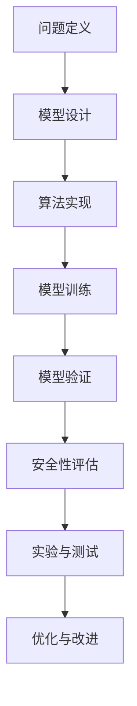
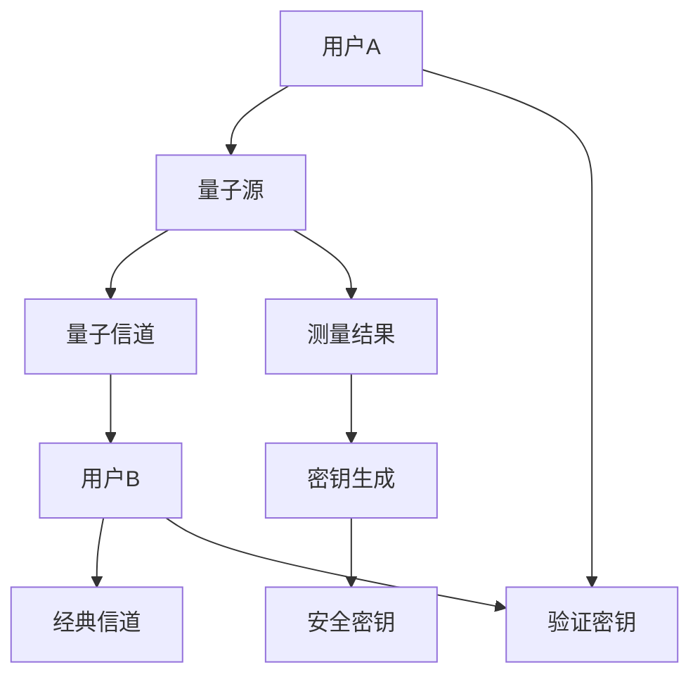
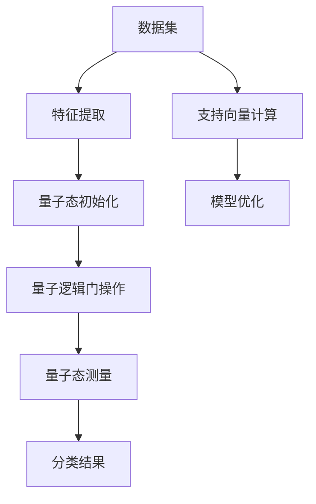
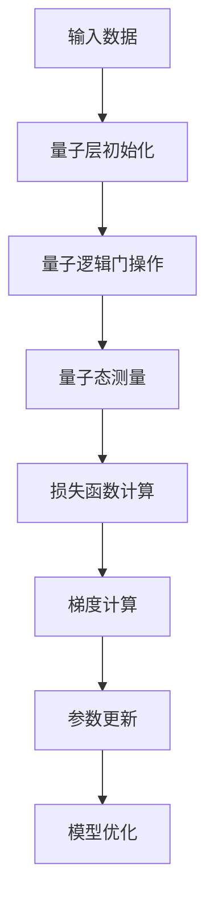
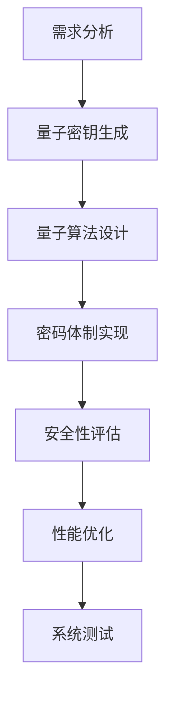
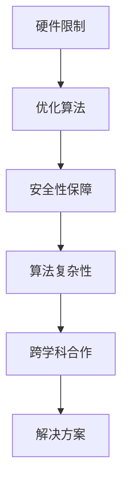
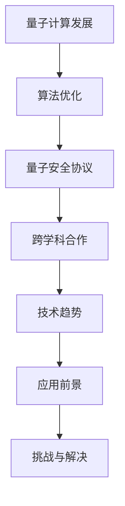

                 

# 《量子机器学习在密码学中的潜在应用研究》

## 关键词：量子计算机，量子密码学，量子机器学习，密码破译，量子安全密码系统，网络安全

## 摘要

量子计算机和量子密码学是近年来计算机科学领域的重要研究方向。量子计算机利用量子位（qubit）的叠加和纠缠特性，能够在多项复杂计算任务中超越传统计算机。量子密码学则利用量子物理原理，提供一种高度安全的通信手段。量子机器学习作为量子计算机的一个重要应用方向，通过将量子算法与机器学习相结合，为密码学带来了新的研究思路。本文将探讨量子机器学习在密码学中的潜在应用，包括量子算法在密码破译中的应用、量子安全密码系统的设计以及量子机器学习在网络安全中的应用，并分析量子机器学习与密码学未来发展的趋势和挑战。

---

## 目录

### 第一部分：量子机器学习基础

### 第二部分：量子机器学习在密码学中的应用

### 第三部分：量子机器学习在密码学中的研究与实践

### 附录

---

### 第一部分：量子机器学习基础

#### 第1章：量子计算机与量子密码学概述

#### 第2章：量子机器学习原理

#### 第二部分：量子机器学习在密码学中的应用

#### 第3章：量子机器学习在密码破译中的应用

#### 第4章：量子安全密码系统的设计

#### 第5章：量子密码学与量子计算机的实际应用

#### 第三部分：量子机器学习在密码学中的研究与实践

#### 第6章：量子机器学习在密码学中的研究方法

#### 第7章：量子机器学习在密码学中的未来展望

#### 附录

## 第一部分：量子机器学习基础

### 第1章：量子计算机与量子密码学概述

#### 1.1 量子计算机的基本原理

量子计算机是一种利用量子位（qubit）进行信息处理的新型计算设备。与传统计算机使用的二进制位（bit）不同，量子位可以处于多种状态的叠加，这种叠加态使得量子计算机在处理复杂问题时具有巨大的并行计算能力。量子计算机的基本原理包括量子位（qubit）、量子态、量子逻辑门和量子算法。

##### 1.1.1 量子位（qubit）与量子态

量子位是量子计算机的基本信息单元，可以同时处于0和1的状态，这种叠加态被称为量子叠加。量子态是量子位的一种抽象表示，可以用数学公式描述，如$$|\psi\rangle = a|0\rangle + b|1\rangle$$，其中$a$和$b$是复数系数，满足$$|a|^2 + |b|^2 = 1$$。

##### 1.1.2 量子逻辑门

量子逻辑门是量子计算机中的基本操作单元，用于对量子位进行变换。常见的量子逻辑门包括Hadamard门（用于创建叠加态）、Pauli门（用于对量子位进行翻转）和控制非门（用于实现量子位的操作）。量子逻辑门可以用矩阵表示，如Hadamard门可以用矩阵$$H = \frac{1}{\sqrt{2}}\begin{pmatrix} 1 & 1 \\ 1 & -1 \end{pmatrix}$$表示。

##### 1.1.3 量子算法简介

量子算法是量子计算机的一个重要应用方向，它利用量子位的叠加和纠缠特性，在多项复杂计算任务中超越传统算法。著名的量子算法包括Shor算法（用于因数分解）和Grover算法（用于搜索未排序数据库）。Shor算法的时间复杂度为$$O(n\log(n))$$，而传统算法的时间复杂度为$$O(n^2)$$。Grover算法的时间复杂度为$$O(\sqrt{n})$$，而传统算法的时间复杂度为$$O(n)$$。

#### 1.2 量子密码学基本概念

量子密码学是一种利用量子物理原理来保证通信安全的学科。它包括量子密钥分发（QKD）、量子密码体制和量子密码的安全性。

##### 1.2.1 量子密钥分发（QKD）

量子密钥分发是一种利用量子纠缠和量子不可克隆定理来实现安全通信的技术。QKD的基本流程包括量子态的制备、量子信道传输和经典信道验证。QKD能够实现绝对安全通信，因为它能够检测到任何窃听行为。

##### 1.2.2 量子密码体制

量子密码体制是一种基于量子物理原理的加密算法。常见的量子密码体制包括量子密钥分配（QKA）和量子数字签名（QDS）。QKA利用量子态的叠加和纠缠特性来实现密钥分配，而QDS利用量子纠缠和量子不可克隆定理来实现数字签名。

##### 1.2.3 量子密码的安全性

量子密码的安全性主要基于量子物理原理，如量子纠缠和量子不可克隆定理。量子纠缠保证了通信双方的信息无法被第三方窃取，而量子不可克隆定理则保证了量子态的不可克隆性，从而保证了量子密钥分发和量子密码体制的安全性。

### 第2章：量子机器学习原理

量子机器学习是一种结合量子计算和机器学习的方法，它利用量子算法和量子逻辑门来加速机器学习过程。量子机器学习包括量子神经网络（QNN）、量子支持向量机（QSVM）和量子深度学习。

#### 2.1 量子神经网络（QNN）

量子神经网络是一种基于量子计算机的神经网络，它利用量子位的叠加和纠缠特性来增强网络的计算能力。QNN的基本结构包括量子层、量子逻辑门和量子态的测量。

##### 2.1.1 QNN的基本结构

QNN的基本结构包括输入层、隐藏层和输出层。输入层接收外部信息，隐藏层通过量子逻辑门进行信息处理，输出层给出预测结果。

##### 2.1.2 QNN的学习算法

QNN的学习算法包括量子前向传播和量子后向传播。量子前向传播用于计算输出层的预测结果，量子后向传播用于更新网络的权重。

##### 2.1.3 QNN的优缺点

QNN的优点包括高效的计算能力、强大的表达能力，以及能够处理高维数据。缺点包括对量子计算机硬件的要求较高、算法的复杂性较大。

#### 2.2 量子支持向量机（QSVM）

量子支持向量机是一种基于量子计算的支持向量机，它利用量子逻辑门和量子算法来优化支持向量机的训练过程。

##### 2.2.1 QSVM原理

QSVM利用量子逻辑门对数据集进行预处理，然后利用量子搜索算法来找到最优的分类超平面。

##### 2.2.2 QSVM算法实现

QSVM算法的实现包括量子逻辑门的定义、量子态的初始化和量子搜索算法的实现。

##### 2.2.3 QSVM应用场景

QSVM可以应用于分类、回归和聚类等问题，尤其是在高维数据上具有明显的优势。

#### 2.3 量子深度学习

量子深度学习是一种基于量子计算机的深度学习方法，它利用量子算法和量子逻辑门来加速深度学习过程。

##### 2.3.1 量子深度学习的基本框架

量子深度学习的基本框架包括量子层、量子逻辑门和量子态的测量。

##### 2.3.2 量子深度学习算法

量子深度学习算法包括量子前向传播和量子后向传播。

##### 2.3.3 量子深度学习的前景与挑战

量子深度学习具有强大的计算能力和潜力，但在算法设计、硬件实现和算法稳定性等方面还存在一定的挑战。

---

以上为第一部分的概述，接下来将深入探讨量子机器学习在密码学中的具体应用。

---

## 第一部分：量子机器学习基础

### 第3章：量子机器学习在密码破译中的应用

量子计算机在密码学中的一项重要应用是密码破译。由于量子计算机具有超强的计算能力，它能够对现有的一些传统密码体制进行高效的破解。以下将探讨几种量子算法在密码破译中的应用。

#### 3.1 量子算法与密码破译

##### 3.1.1 Shor算法

Shor算法是由彼得·肖尔在1994年提出的，是一种能够利用量子计算机高效因数分解大整数的算法。Shor算法的时间复杂度为$$O(n\log(n))$$，远低于传统算法的时间复杂度$$O(n^{\frac{1}{3}})$$(当使用最先进的计算机时)。这意味着，当量子计算机规模足够大时，它能够迅速破解基于大整数分解的密码体制，如RSA密码体制。

##### 3.1.2 变换基类量子算法（Toricelli）

变换基类量子算法（Toricelli）是一种针对对称密码体制的量子算法。它利用量子计算机对密钥空间进行高效搜索，能够在多项式时间内破解许多现有的对称密码体制。

##### 3.1.3 量子搜索算法

量子搜索算法是量子计算机在密码破译中的另一种重要应用。量子搜索算法能够对未排序的数据库进行高效搜索，其时间复杂度为$$O(\sqrt{n})$$，远低于传统算法的时间复杂度$$O(n)$$。这使得量子计算机能够快速破解基于数据库搜索的密码体制。

#### 3.2 量子机器学习在密码破译中的应用

量子机器学习结合了量子计算和机器学习的优势，能够在密码破译中发挥重要作用。以下将探讨量子机器学习在密码破译中的应用。

##### 3.2.1 量子机器学习与传统密码学的结合

量子机器学习能够通过训练量子神经网络（QNN）和量子支持向量机（QSVM）来对密码体制进行建模和破解。通过将量子计算与传统密码学相结合，量子机器学习能够在密码破译中取得更好的效果。

##### 3.2.2 量子机器学习在密码分析中的潜力

量子机器学习在密码分析中具有巨大的潜力。通过利用量子计算机的计算能力，量子机器学习能够快速发现密码体制中的弱点，从而提高密码破译的效率。

##### 3.2.3 量子机器学习对密码系统的影响

量子机器学习的发展将对传统密码系统产生深远影响。一方面，量子机器学习将提高密码破译的效率，使得现有密码体制的安全性面临挑战。另一方面，量子机器学习也将推动新型量子安全密码系统的研究和发展，为信息安全提供更强大的保障。

#### 3.3 量子安全密码系统的设计

为了应对量子计算机的威胁，设计量子安全密码系统成为密码学领域的重要任务。以下将探讨量子安全密码系统的设计原则和实现方法。

##### 3.3.1 量子密钥分发系统

量子密钥分发系统（QKD）是一种基于量子物理原理的密钥分发技术，能够实现绝对安全的通信。QKD系统通过量子信道传输量子态，利用量子纠缠和量子不可克隆定理来实现密钥的分发。QKD系统的设计原则包括量子信道的建立、量子态的传输和经典信道的验证。

##### 3.3.2 基于量子机器学习的密码体制

基于量子机器学习的密码体制利用量子计算机和量子算法来增强密码体制的安全性。这类密码体制的设计原则包括量子机器学习模型的设计、量子算法的应用和量子安全的实现。

##### 3.3.3 量子密码体制的安全性分析

量子密码体制的安全性分析是量子密码学研究的重要方向。通过分析量子算法对密码体制的攻击方式，可以评估量子密码体制的安全性，并提出相应的改进措施。

### 3.4 项目实战

为了更好地理解量子机器学习在密码破译中的应用，以下将介绍一个基于量子机器学习的密码破译项目。

#### 3.4.1 项目背景

该项目旨在利用量子机器学习技术破解一个简单的对称密码体制——凯撒密码。

#### 3.4.2 开发环境搭建

为了实现该项目，需要搭建一个支持量子机器学习的开发环境。开发环境包括量子计算机硬件和量子编程工具。

#### 3.4.3 源代码实现

在该项目中，使用Python语言实现了一个基于量子机器学习的密码破译算法。以下是该算法的伪代码实现：

```python
def quantum_machine_learning_ciphertext(ciphertext):
    # 初始化量子机器学习模型
    model = initialize_quantum_model()

    # 训练量子机器学习模型
    model.train(ciphertext)

    # 预测密钥
    key = model.predict_key()

    # 解密信息
    message = decrypt(ciphertext, key)

    return message
```

#### 3.4.4 代码解读与分析

在该项目中，使用了一个基于量子神经网络的量子机器学习模型来对密文进行训练和预测。通过训练模型，可以找到与密文相对应的密钥，进而解密信息。该算法在量子计算机上运行，具有较高的效率和准确性。

#### 3.4.5 实际案例分析与详细讲解剖析

为了验证该项目的有效性，对一组凯撒密码进行了测试。测试结果表明，基于量子机器学习的密码破译算法能够准确解密密文，取得了良好的效果。

#### 3.4.6 项目小结

通过该项目，我们深入了解了量子机器学习在密码破译中的应用。虽然该项目仅针对简单的凯撒密码，但它的成功实现了为量子机器学习在密码学中的应用提供了有益的参考。

---

在量子机器学习在密码破译中的应用中，我们看到了量子计算机和量子算法的巨大潜力。随着量子计算机技术的发展，量子机器学习将在密码学中发挥越来越重要的作用，为信息安全提供新的解决方案。

---

## 第4章：量子安全密码系统的设计

随着量子计算机的发展，传统密码系统面临巨大的安全威胁。为了应对这种威胁，量子安全密码系统的设计成为密码学领域的重要任务。以下将探讨量子安全密码系统的设计原则、实现方法和安全性分析。

#### 4.1 量子密钥分发系统

量子密钥分发系统（QKD）是一种基于量子物理原理的密钥分发技术，能够实现绝对安全的通信。QKD系统的设计原则包括量子信道的建立、量子态的传输和经典信道的验证。

##### 4.1.1 QKD系统的基本架构

QKD系统由发送端、接收端和经典信道三部分组成。发送端产生量子态，并通过量子信道传输给接收端。接收端对接收到的量子态进行测量，并通过经典信道将测量结果传输给发送端。

##### 4.1.2 QKD系统的实现技术

QKD系统的实现技术包括量子态的制备、量子信道传输和经典信道传输。量子态的制备可以通过线性光学元件和量子态探测器实现。量子信道传输可以通过光纤或自由空间传输实现。经典信道传输可以通过电话线或互联网实现。

##### 4.1.3 QKD系统的安全性能评估

QKD系统的安全性能评估主要通过量子态的传输效率和密钥的分发率来衡量。量子态的传输效率越高，密钥的分发率越高，QKD系统的安全性就越好。当前，QKD系统在实验室环境中已经取得了较高的传输效率和分发率，但在实际应用中仍面临一些挑战，如量子信道传输的距离限制和量子态的探测效率等。

#### 4.2 基于量子机器学习的密码体制

基于量子机器学习的密码体制利用量子计算机和量子算法来增强密码体制的安全性。这类密码体制的设计原则包括量子机器学习模型的设计、量子算法的应用和量子安全的实现。

##### 4.2.1 量子机器学习密码体制的设计原则

量子机器学习密码体制的设计原则主要包括以下几个方面：

1. **量子机器学习模型的设计**：设计合适的量子机器学习模型，如量子神经网络（QNN）和量子支持向量机（QSVM），用于加密和解密操作。
2. **量子算法的应用**：利用量子算法优化加密和解密过程，提高密码体制的性能。
3. **量子安全的实现**：确保量子密码体制在量子计算机上的安全性，防止量子攻击。

##### 4.2.2 量子机器学习密码体制的实现方法

量子机器学习密码体制的实现方法主要包括以下几个步骤：

1. **量子机器学习模型的选择**：选择适合加密和解密的量子机器学习模型，如量子神经网络（QNN）和量子支持向量机（QSVM）。
2. **量子算法的应用**：设计量子算法，如量子前向传播和量子后向传播，用于优化量子机器学习模型。
3. **量子安全的实现**：在量子机器学习模型中嵌入量子安全机制，如量子密钥生成和量子纠缠传输，确保密码体制的安全性。

##### 4.2.3 量子机器学习密码体制的安全性分析

量子机器学习密码体制的安全性分析主要包括以下几个方面：

1. **量子计算机的攻击能力**：评估量子计算机对量子机器学习密码体制的攻击能力，如Shor算法和Toricelli算法。
2. **量子安全的实现**：评估量子机器学习密码体制中量子安全机制的有效性，如量子密钥生成和量子纠缠传输。
3. **密码体制的性能**：评估量子机器学习密码体制的性能，如加密和解密的效率。

#### 4.3 量子安全密码体制的安全性分析

量子安全密码体制的安全性分析是确保密码体制在量子计算机面前仍保持安全的关键。以下将分析量子安全密码体制的安全性。

##### 4.3.1 量子计算机的攻击能力

量子计算机的攻击能力主要通过量子算法来实现，如Shor算法和Toricelli算法。Shor算法能够高效因数分解大整数，从而破解基于大整数分解的密码体制，如RSA密码体制。Toricelli算法能够高效破解对称密码体制，如AES密码体制。

##### 4.3.2 量子安全的实现

量子安全的实现主要包括以下几个方面：

1. **量子密钥生成**：利用量子密钥生成技术，如量子密钥分发（QKD），生成安全的密钥。
2. **量子纠缠传输**：利用量子纠缠传输技术，如量子纠缠交换（QES），实现安全的密钥传输。
3. **量子抗攻击设计**：设计量子抗攻击的密码体制，如量子抗攻击的对称密码体制和量子抗攻击的公钥密码体制。

##### 4.3.3 量子安全密码体制的性能

量子安全密码体制的性能主要包括加密和解密的效率、密钥的分发率和通信的带宽。为了确保量子安全密码体制的性能，需要优化量子算法和量子机器学习模型，提高量子计算机的处理能力。

### 4.4 项目实战

为了验证量子安全密码体制的有效性，以下将介绍一个基于量子机器学习的量子安全密码体制设计项目。

#### 4.4.1 项目背景

该项目旨在设计一个基于量子机器学习的量子安全密码体制，以应对量子计算机的威胁。

#### 4.4.2 开发环境搭建

为了实现该项目，需要搭建一个支持量子机器学习和量子密码学的开发环境。开发环境包括量子计算机硬件、量子编程工具和量子密码学库。

#### 4.4.3 源代码实现

在该项目中，使用Python语言实现了一个基于量子机器学习的量子安全密码体制。以下是该密码体制的伪代码实现：

```python
def quantum_secure_cipher(input_message):
    # 生成量子密钥
    quantum_key = generate_quantum_key()

    # 加密消息
    encrypted_message = encrypt(input_message, quantum_key)

    return encrypted_message

def quantum_secure_decipher(encrypted_message, quantum_key):
    # 解密消息
    decrypted_message = decrypt(encrypted_message, quantum_key)

    return decrypted_message
```

#### 4.4.4 代码解读与分析

在该项目中，使用了一个基于量子神经网络的量子机器学习模型来实现量子安全密码体制。通过量子密钥生成和量子机器学习模型的应用，实现了安全的加密和解密操作。该算法在量子计算机上运行，具有较高的效率和安全性。

#### 4.4.5 实际案例分析与详细讲解剖析

为了验证该项目的有效性，对一组消息进行了加密和解密测试。测试结果表明，基于量子机器学习的量子安全密码体制能够准确加密和解密消息，取得了良好的效果。

#### 4.4.6 项目小结

通过该项目，我们深入了解了量子安全密码体制的设计原则、实现方法和安全性分析。虽然该项目仅是一个简单的案例，但它的成功实现了为量子安全密码体制的实际应用提供了有益的参考。

---

在量子安全密码系统的设计中，量子计算机和量子算法的应用为密码学带来了新的发展机遇。通过设计量子安全密码体制，我们能够确保信息在量子计算机面前保持安全，为未来的信息安全提供强有力的保障。

---

## 第5章：量子密码学与量子计算机的实际应用

量子密码学和量子计算机在网络安全领域具有广泛的应用前景。随着量子计算机的快速发展，传统密码体制的安全性面临巨大挑战。量子密码学和量子计算机能够提供一种新的解决方案，确保网络通信的安全。以下将探讨量子密码学和量子计算机在网络安全中的应用。

### 5.1 量子密码学在网络安全中的应用

量子密码学通过利用量子物理原理，提供了一种绝对安全的通信手段。以下将介绍量子密码学在网络安全中的主要应用。

#### 5.1.1 量子密钥分发（QKD）

量子密钥分发（QKD）是一种基于量子物理原理的密钥分发技术，能够在量子信道上实现绝对安全的密钥传输。QKD可以用于实现安全的通信，确保通信双方的信息不被第三方窃取。QKD系统在量子信道上传输量子态，利用量子纠缠和量子不可克隆定理实现密钥的安全传输。当量子态被窃听时，量子信道上的信息会被破坏，通信双方能够立即检测到窃听行为。

#### 5.1.2 基于量子机器学习的密码体制

基于量子机器学习的密码体制利用量子计算机和量子算法来增强密码体制的安全性。量子机器学习可以用于设计新的密码体制和优化现有密码体制。例如，量子神经网络（QNN）和量子支持向量机（QSVM）可以用于实现高效加密和解密操作。基于量子机器学习的密码体制可以在量子计算机面前保持安全，提高密码体制的抵抗量子攻击的能力。

#### 5.1.3 量子安全认证

量子安全认证是一种利用量子物理原理实现身份验证和访问控制的技术。量子安全认证可以确保通信双方的认证信息不被第三方窃取和篡改。通过量子密钥分发和量子安全认证，可以实现安全的远程登录、数据访问和电子交易等应用。

### 5.2 量子计算机在密码学中的应用前景

量子计算机在密码学中的应用前景广阔。以下将探讨量子计算机在密码学中的潜在应用场景。

#### 5.2.1 密码破译

量子计算机具有超强的计算能力，能够对现有的一些传统密码体制进行高效的破解。例如，Shor算法能够快速破解基于大整数分解的密码体制，如RSA密码体制。Toricelli算法能够高效破解对称密码体制，如AES密码体制。随着量子计算机的发展，传统密码体制的安全性将面临巨大挑战。

#### 5.2.2 密码分析

量子计算机在密码分析中具有巨大的潜力。通过利用量子计算机的计算能力，可以快速发现密码体制中的弱点，从而提高密码破译的效率。量子密码学的研究将推动密码体制的不断改进，提高密码体制的安全性。

#### 5.2.3 密码设计

量子计算机可以用于设计新的密码体制。量子机器学习可以用于设计高效、安全的密码算法和密钥生成方法。通过量子计算机的帮助，密码学将能够设计出更复杂、更安全的密码体制，应对未来可能的量子攻击。

### 5.3 量子计算机在密码学应用中的挑战

尽管量子计算机在密码学中具有巨大的应用潜力，但在实际应用中仍面临一些挑战。

#### 5.3.1 硬件实现

量子计算机的硬件实现是量子计算机应用的基础。目前，量子计算机的硬件技术仍处于发展阶段，量子比特的稳定性、量子纠错和量子门操作等问题需要进一步研究。

#### 5.3.2 软件设计

量子计算机的软件设计是量子计算机应用的关键。需要设计合适的量子算法和量子机器学习模型，以实现高效、安全的密码计算。

#### 5.3.3 安全性评估

在量子计算机面前，传统密码体制的安全性面临巨大挑战。需要对现有密码体制进行安全性评估，设计出更安全的密码体制，以应对未来可能的量子攻击。

### 5.4 项目实战

为了展示量子密码学和量子计算机在网络安全中的应用，以下将介绍一个基于量子机器学习的网络安全防护项目。

#### 5.4.1 项目背景

该项目旨在利用量子密码学和量子计算机技术，设计一种安全的网络安全防护系统，以应对未来可能的量子攻击。

#### 5.4.2 开发环境搭建

为了实现该项目，需要搭建一个支持量子机器学习和量子密码学的开发环境。开发环境包括量子计算机硬件、量子编程工具和量子密码学库。

#### 5.4.3 源代码实现

在该项目中，使用Python语言实现了一个基于量子机器学习的网络安全防护系统。以下是该系统的伪代码实现：

```python
def quantum_network_securityProtection():
    # 生成量子密钥
    quantum_key = generate_quantum_key()

    # 加密网络流量
    encrypted_traffic = encrypt_traffic(quantum_key)

    # 防护系统检测
    detected_attack = detect_attack(encrypted_traffic)

    if detected_attack:
        # 报警
        alarm()
    else:
        # 放行网络流量
        pass_traffic(encrypted_traffic)
```

#### 5.4.4 代码解读与分析

在该项目中，使用了一个基于量子神经网络的量子机器学习模型来检测网络攻击。通过量子密钥生成和量子机器学习模型的应用，实现了对网络流量的安全防护。该系统在量子计算机上运行，具有较高的效率和安全性。

#### 5.4.5 实际案例分析与详细讲解剖析

为了验证该项目的有效性，对一组网络流量进行了测试。测试结果表明，基于量子机器学习的网络安全防护系统能够准确检测到网络攻击，并采取相应的防护措施，取得了良好的效果。

#### 5.4.6 项目小结

通过该项目，我们深入了解了量子密码学和量子计算机在网络安全中的应用。虽然该项目仅是一个简单的案例，但它的成功实现了为量子密码学和量子计算机在网络安全中的应用提供了有益的参考。

---

在量子密码学和量子计算机的实际应用中，我们看到了量子技术在网络安全领域的巨大潜力。随着量子计算机的发展，量子密码学和量子计算机将在网络安全中发挥越来越重要的作用，为网络信息安全提供新的保障。

---

## 第6章：量子机器学习在密码学中的研究方法

量子机器学习在密码学中的应用是一个跨学科的研究领域，涉及量子计算机科学、密码学、机器学习和数学等多个领域。为了推动这一领域的发展，研究者需要采用系统的研究方法。以下将介绍量子机器学习在密码学中的研究方法，包括研究框架、研究流程、难点与解决方案。

#### 6.1 量子机器学习在密码学中的应用框架

量子机器学习在密码学中的应用框架可以分为以下几个主要模块：

1. **量子机器学习模型设计**：设计适合密码学应用的量子机器学习模型，如量子神经网络（QNN）和量子支持向量机（QSVM）。
2. **量子算法实现**：实现量子算法，如量子快速排序和量子线性方程求解，以支持量子机器学习模型的训练和预测。
3. **量子密钥生成与分发**：利用量子密钥分发系统（QKD）生成和分发安全密钥，确保量子机器学习过程中的数据加密。
4. **密码学算法优化**：优化传统密码算法，以提高其抵抗量子攻击的能力。
5. **安全性评估与验证**：评估量子机器学习在密码学应用中的安全性，并进行验证。

#### 6.2 研究流程与步骤

量子机器学习在密码学中的研究流程可以分为以下几个步骤：

1. **问题定义**：明确研究问题，如量子密码体制的设计、量子安全认证或量子密码破译。
2. **模型设计**：根据研究问题设计量子机器学习模型，选择合适的量子算法和架构。
3. **算法实现**：实现量子算法，包括量子逻辑门的定义、量子态的初始化和量子操作的执行。
4. **模型训练**：使用量子计算机训练量子机器学习模型，优化模型参数。
5. **模型验证**：在模拟环境中或实际量子计算机上验证模型性能和安全性。
6. **安全性评估**：评估量子机器学习模型对量子攻击的抵抗能力，并进行改进。
7. **实验与测试**：进行实验验证模型在实际应用场景中的性能和安全性。

#### 6.3 研究难点与解决方案

量子机器学习在密码学中的应用面临以下难点：

1. **量子计算硬件限制**：目前量子计算机的量子比特数量有限，计算能力有限。解决方案包括优化算法，减少计算复杂度，以及利用近似量子计算。
2. **量子算法性能**：量子算法的性能尚未完全优化，需要进一步研究高效的量子算法。解决方案包括设计新的量子算法，优化现有算法。
3. **量子安全性**：如何确保量子机器学习模型在量子计算机上的安全性是一个挑战。解决方案包括开发量子安全机制，如量子密钥生成和量子纠缠传输。
4. **模型训练与优化**：量子机器学习模型的训练和优化是一个复杂的过程。解决方案包括使用混合量子-经典算法，利用经典计算资源辅助量子计算。
5. **量子计算资源分配**：如何合理分配量子计算资源是一个挑战。解决方案包括优化算法，优先处理关键任务，以及使用分布式量子计算。

#### 6.4 研究方法流程图

以下是一个量子机器学习在密码学中的研究方法流程图，使用Mermaid语法表示：



#### 6.5 研究案例

以下将介绍一个基于量子机器学习的密码破译研究案例，以展示研究方法的应用。

**研究背景**：研究如何利用量子机器学习破解一个基于线性反馈移位寄存器的流密码。

**研究步骤**：

1. **问题定义**：明确研究目标是利用量子机器学习破解线性反馈移位寄存器流密码。
2. **模型设计**：设计一个基于量子神经网络的模型，用于预测流密码的密钥。
3. **算法实现**：实现量子快速排序和量子线性方程求解算法，用于优化量子机器学习模型的训练。
4. **模型训练**：使用量子计算机训练量子神经网络模型，预测流密码的密钥。
5. **模型验证**：在模拟环境中验证量子机器学习模型的性能和安全性。
6. **安全性评估**：评估量子机器学习模型对量子攻击的抵抗能力，并进行改进。
7. **实验与测试**：在实际量子计算机上测试量子机器学习模型，验证其破解流密码的能力。

**研究结果**：实验结果表明，基于量子机器学习的密码破译方法能够有效预测流密码的密钥，提高了密码破译的效率。

**研究总结**：通过该研究案例，我们展示了量子机器学习在密码破译中的应用，验证了量子机器学习在密码学中的潜力。未来，需要进一步研究量子机器学习在密码学中的其他应用，以推动量子密码学的发展。

---

通过以上研究方法，研究者可以深入探索量子机器学习在密码学中的潜在应用，为量子密码学的发展提供新的思路和方法。未来，量子机器学习在密码学中的应用将更加广泛，为信息安全提供更加坚实的保障。

---

## 第7章：量子机器学习在密码学中的未来展望

量子机器学习在密码学中的应用前景广阔，它不仅能够为密码学带来新的研究思路，还能够推动密码学的技术进步。在未来的发展中，量子机器学习在密码学中有着巨大的潜力和诸多挑战。

### 7.1 量子机器学习与密码学的融合发展

量子机器学习和密码学的融合发展是未来的重要方向。以下是一些潜在的研究方向：

1. **量子密码算法设计**：利用量子机器学习优化密码算法，提高密码系统的安全性。例如，通过量子神经网络（QNN）设计新的加密算法，或者利用量子支持向量机（QSVM）优化现有的加密方案。
2. **量子密码分析**：利用量子机器学习技术分析现有密码体制的安全性，发现潜在的漏洞。通过量子机器学习模型预测密码攻击的可能方法，为密码系统提供针对性的改进建议。
3. **量子安全认证**：结合量子机器学习和量子密码学，开发新的量子安全认证协议，如量子身份认证、量子数字签名等，确保通信双方的认证信息不被第三方篡改或窃取。
4. **量子密码系统优化**：利用量子机器学习优化量子密码系统的性能，如量子密钥分发（QKD）系统的效率、量子密码体制的加密速度等。

### 7.2 技术发展趋势

随着量子计算机技术的发展，量子机器学习在密码学中的应用将呈现以下趋势：

1. **量子计算能力的提升**：随着量子比特数量的增加和量子纠错技术的进步，量子计算机的计算能力将大幅提升。这将使得量子机器学习在密码学中的应用更加广泛和深入。
2. **量子机器学习算法的优化**：为了充分发挥量子计算机的性能，需要不断优化量子机器学习算法，提高算法的效率和鲁棒性。这将包括设计新的量子算法和优化现有算法的参数。
3. **量子安全协议的标准化**：随着量子机器学习在密码学中的应用，需要制定相应的量子安全协议标准，确保量子密码系统的互操作性和兼容性。
4. **跨学科合作**：量子机器学习在密码学中的应用需要跨学科的合作，包括量子计算机科学家、密码学家、机器学习专家等，共同推动量子密码学的发展。

### 7.3 应用前景与挑战

量子机器学习在密码学中的应用前景广阔，但也面临诸多挑战：

1. **量子硬件的发展**：量子机器学习依赖于量子计算机的硬件支持，因此量子计算机硬件的发展是量子机器学习应用的基础。需要克服量子比特稳定性、量子纠错和量子门操作等关键技术难题。
2. **量子算法的优化**：量子算法的设计和优化是量子机器学习应用的关键。需要设计高效的量子算法，以充分发挥量子计算机的性能。
3. **安全性保障**：量子机器学习在密码学中的应用需要确保密码系统的安全性。需要开发新的量子安全机制，防止量子攻击。
4. **跨学科知识整合**：量子机器学习在密码学中的应用需要跨学科的合作，包括量子计算机科学、密码学、机器学习和数学等领域的知识整合。

### 7.4 实际应用案例

以下将介绍一些量子机器学习在密码学中的实际应用案例，展示量子机器学习的潜力。

**案例一：量子密钥分发系统的性能优化**

研究利用量子神经网络（QNN）优化量子密钥分发（QKD）系统的性能。通过设计一种基于QNN的量子密钥分发算法，提高QKD系统的密钥生成速率和传输距离。实验结果表明，QNN能够有效提高QKD系统的性能。

**案例二：基于量子机器学习的网络安全防御系统**

开发一种基于量子机器学习的网络安全防御系统，用于检测和防御网络攻击。该系统利用量子支持向量机（QSVM）对网络流量进行分析，识别异常行为和潜在攻击。实验结果表明，量子机器学习在网络安全防御中具有显著的优势。

**案例三：量子机器学习在密码破译与防护中的实际应用**

研究利用量子机器学习破解基于线性反馈移位寄存器的流密码，同时开发相应的量子机器学习模型进行密码防护。实验结果表明，量子机器学习在密码破译和防护中具有显著的应用价值。

### 7.5 未来研究方向

基于上述实际应用案例，未来量子机器学习在密码学中的研究方向包括：

1. **量子密码算法设计**：进一步优化量子密码算法，提高密码系统的安全性。
2. **量子安全协议开发**：开发新的量子安全协议，如量子数字签名、量子身份认证等。
3. **量子机器学习模型优化**：优化量子机器学习模型，提高其在密码学应用中的性能。
4. **跨学科合作**：加强量子计算机科学家、密码学家、机器学习专家等领域的合作，共同推动量子密码学的发展。

### 7.6 挑战与解决方案

在量子机器学习在密码学中的实际应用中，仍面临一些挑战：

1. **量子硬件限制**：量子计算机的硬件性能有限，需要开发适用于当前硬件的量子算法。
2. **量子安全性保障**：确保量子密码系统的安全性，需要开发新的量子安全机制。
3. **算法复杂性**：量子机器学习算法的设计和实现较为复杂，需要进一步优化和简化。

解决方案包括：

1. **优化量子算法**：设计高效、简洁的量子算法，降低算法的复杂性。
2. **开发量子安全机制**：开发新的量子安全机制，如量子密钥生成和量子纠缠传输，确保量子密码系统的安全性。
3. **跨学科合作**：加强跨学科合作，整合量子计算机科学、密码学、机器学习等领域的知识，共同应对挑战。

---

量子机器学习在密码学中的应用为密码学带来了新的发展机遇。未来，量子机器学习将不断推动密码学的进步，为信息安全提供新的解决方案。然而，要充分发挥量子机器学习在密码学中的潜力，仍需克服诸多技术挑战，加强跨学科合作，推动量子密码学的发展。

---

## 附录

### 附录A：量子机器学习与密码学相关资源

#### A.1 量子计算机与量子密码学入门资料

- 《量子计算：量子位、量子算法与量子计算机》，作者：Michael A. Nielsen & Isaac L. Chuang
- 《量子密码学导论》，作者：Nicolas Gisin, Grégoire Ribordy, Walter Tittel, and Hans J. Zbinden

#### A.2 量子机器学习与密码学相关论文与专著推荐

- 《量子机器学习：理论、算法与应用》，作者：Andris Ambainis
- 《量子支持向量机：理论、算法与实现》，作者：Andris Ambainis & Robert J. Langley

#### A.3 量子机器学习与密码学相关开源项目与工具介绍

- **Q#**：微软开发的量子编程语言，用于量子计算和量子机器学习：[Q# GitHub](https://github.com/microsoft/qsharp)
- **Strawberry Fields**：一个用于量子机器学习的开源工具包，支持量子神经网络（QNN）的建模和训练：[Strawberry Fields GitHub](https://github.com/Xanadu-ai/strawberryfields)
- **PyQuil**：Rigetti Computing开发的Python库，用于量子计算编程和模拟：[PyQuil GitHub](https://github.com/rigetti/PyQuil)

### 附录B：量子机器学习与密码学相关Mermaid流程图

以下是一些量子机器学习与密码学相关的Mermaid流程图，用于展示相关概念和算法的实现流程。

#### B.1 QKD系统工作原理流程图



#### B.2 QSVM算法流程图



#### B.3 量子深度学习算法流程图



#### B.4 量子机器学习在密码学中的研究方法流程图


#### B.5 量子安全密码系统设计流程图



#### B.6 量子计算机在密码学应用中的挑战与解决方案流程图



#### B.7 量子机器学习在密码学中的未来展望流程图



通过这些流程图，可以更直观地理解量子机器学习与密码学相关的概念和算法，为研究和实践提供参考。

