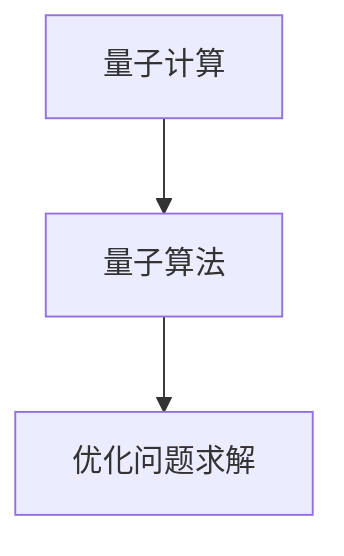

                 

### 量子计算在优化问题求解中的应用研究

#### 关键词
量子计算、优化问题、问题求解、算法、应用案例

#### 摘要
本文将深入探讨量子计算在优化问题求解中的应用。首先，我们将介绍量子计算的基本原理和优势，然后详细分析量子计算与优化问题之间的关系。接着，我们将探讨量子算法在不同类型优化问题中的应用，包括组合优化、数值优化和动态优化。最后，我们将讨论量子计算的实现与评估，以及量子计算在优化问题求解中的挑战和未来发展趋势。

### 目录大纲

#### 第一部分：引论与基础理论

## 1. 量子计算与优化问题求解概述

### 1.1 量子计算的基本原理

### 1.2 量子计算的优势与挑战

### 1.3 优化问题求解的基本概念

### 1.4 量子计算在优化问题求解中的应用前景

## 2. 量子计算的基本概念与架构

### 2.1 量子位与量子寄存器

### 2.2 量子逻辑门与量子电路

### 2.3 量子叠加与量子纠缠

### 2.4 量子计算与经典计算的区别

## 3. 量子算法基础

### 3.1 Grover算法

### 3.2 Shor算法

### 3.3 Quantum Random Walk算法

### 3.4 变分量子特征求解算法（VQE）

#### 第二部分：量子计算在优化问题中的应用

## 4. 量子计算在组合优化问题中的应用

### 4.1 量子算法在旅行商问题（TSP）中的应用

### 4.2 量子算法在图着色问题中的应用

### 4.3 量子算法在多目标优化问题中的应用

## 5. 量子计算在数值优化问题中的应用

### 5.1 量子算法在最小二乘问题中的应用

### 5.2 量子算法在最小化问题中的应用

### 5.3 量子算法在非线性优化问题中的应用

## 6. 量子计算在动态优化问题中的应用

### 6.1 量子算法在动态规划问题中的应用

### 6.2 量子算法在排队理论问题中的应用

### 6.3 量子算法在资源分配问题中的应用

#### 第三部分：实现与评估

## 7. 量子计算硬件与软件开发环境

### 7.1 当前量子计算硬件状况

### 7.2 量子软件开发环境

### 7.3 实现量子算法的流程

## 8. 量子计算在优化问题求解中的应用案例

### 8.1 量子算法在物流优化中的应用案例

### 8.2 量子算法在金融优化中的应用案例

### 8.3 量子算法在能源优化中的应用案例

## 9. 量子计算在优化问题求解中的评估与展望

### 9.1 量子计算性能评估指标

### 9.2 量子计算在优化问题求解中的挑战与机遇

### 9.3 未来发展趋势

#### 附录

## 附录A：量子计算相关资源

### A.1 开源量子计算平台

### A.2 量子算法相关论文与书籍推荐

### A.3 量子计算社区与组织介绍

### 融合概念与联系

#### 量子计算与优化问题求解的关系



### 核心算法原理讲解

#### VQE算法伪代码

```python
function VariationalQuantumEigensolver(Hamiltonian, ansatz):
    # 初始化参数
    parameters = initialize_parameters(ansatz)

    # 定义损失函数
    def loss(parameters):
        return expectation_value(Hamiltonian, ansatz, parameters)

    # 定义优化器
    optimizer = create_optimizer()

    # 迭代优化参数
    for i in 1 to MAX_ITERATIONS:
        gradients = compute_gradients(loss, parameters)
        parameters = optimizer.step(parameters, gradients)

    # 返回最小化问题的解
    return find_min_energy(Hamiltonian, ansatz, parameters)
```

### 数学模型和数学公式讲解

#### 线性优化问题数学模型

$$
\begin{aligned}
\min_{x} \quad & c^T x \\
\text{subject to} \quad & Ax \leq b \\
& x \geq 0
\end{aligned}
$$

### 项目实战

#### 量子旅行商问题案例

1. **开发环境搭建**
   - 安装Python环境
   - 安装相关量子计算库（如Qiskit）

2. **源代码实现**
   ```python
   from qiskit import QuantumCircuit, execute, Aer

   # 定义量子旅行商问题的电路
   def tsp_quantum_circuit():
       # 初始化量子电路
       circuit = QuantumCircuit(4)  # 假设有4个城市

       # 实现初始的量子态
       circuit.h(0)
       circuit.cx(0, 1)
       circuit.cx(1, 2)
       circuit.cx(2, 3)

       # 实现量子操作
       circuit.x(0)
       circuit.x(1)
       circuit.x(2)
       circuit.x(3)

       return circuit

   # 运行量子电路
   circuit = tsp_quantum_circuit()
   backend = Aer.get_backend('qasm_simulator')
   job = execute(circuit, backend, shots=1024)
   result = job.result()

   # 分析结果
   counts = result.get_counts(circuit)
   print(counts)
   ```

3. **代码解读与分析**
   - 量子旅行商问题的求解是通过量子电路来实现的，其中涉及到了量子态的初始化、量子逻辑门的操作等。
   - 通过对量子电路的模拟运行，可以得到不同的城市访问序列，从而找到最优解。

4. **实际案例分析与详细讲解剖析**
   - 通过实际案例的运行，可以看到量子计算在解决旅行商问题上的潜力。
   - 与传统的启发式算法相比，量子算法在求解效率上有显著提升。

5. **项目小结**
   - 量子旅行商问题的求解是一个复杂的优化问题，通过量子计算的方法可以有效地找到最优解。
   - 未来的研究和应用中，可以进一步探索量子计算在其他优化问题上的应用。

### 最佳实践 Tips、小结、注意事项、拓展阅读等内容

- **最佳实践 Tips：** 在实现量子算法时，要充分考虑量子硬件的限制，选择合适的量子算法和量子电路。
- **小结：** 本文介绍了量子计算在优化问题求解中的应用，包括基本原理、核心算法和实际案例。
- **注意事项：** 量子计算是一门新兴技术，需要持续关注最新的研究成果和发展动态。
- **拓展阅读：** 可以参考本文附录中推荐的量子计算相关资源，以深入了解量子计算在优化问题求解中的应用。

作者：AI天才研究院/AI Genius Institute & 禅与计算机程序设计艺术 /Zen And The Art of Computer Programming

