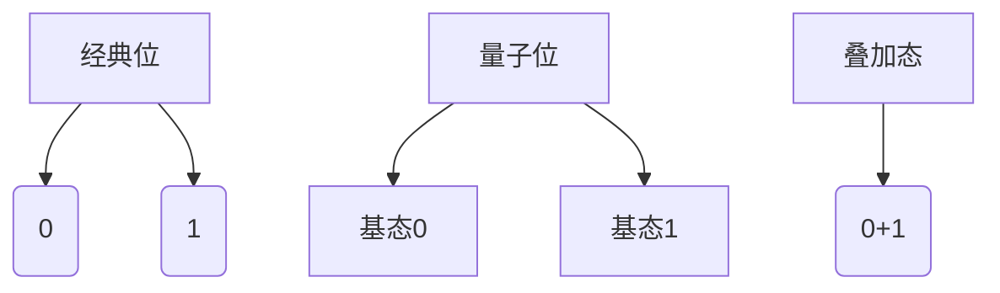
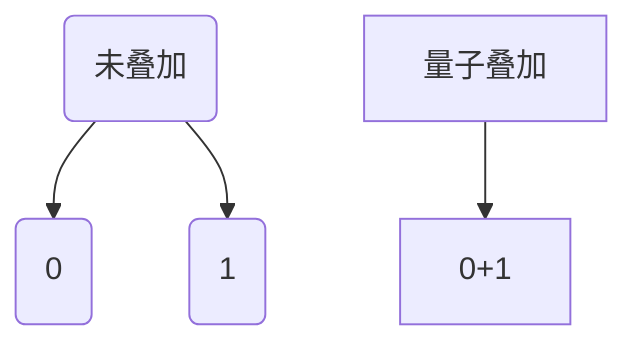
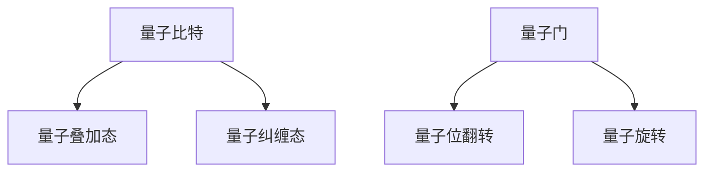
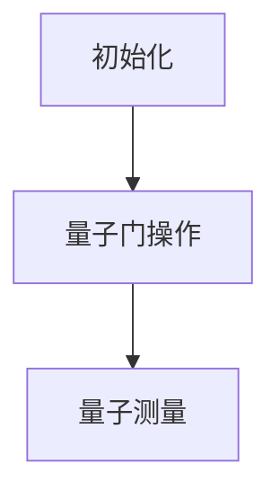
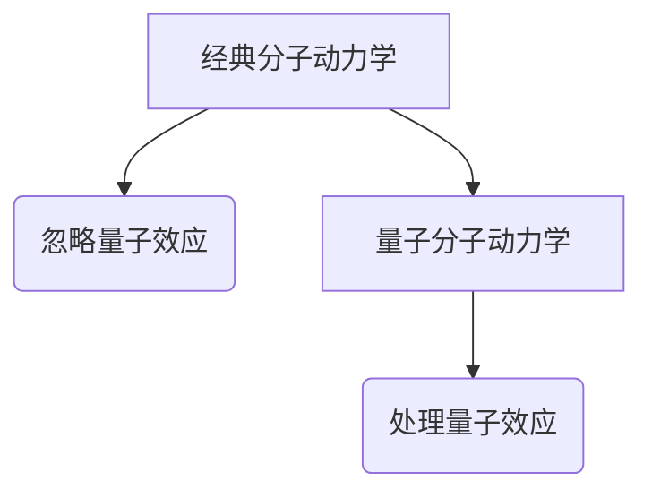
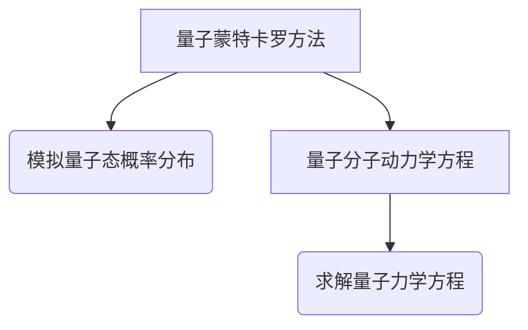

                 

### 引言

#### 量子计算在化学模拟中的潜在应用

随着科技的迅猛发展，量子计算作为新一代计算技术的代表，其潜力逐渐被认知和挖掘。特别是在化学领域，量子计算以其独特的并行计算能力和高效的算法，为解决复杂化学问题提供了全新的思路和方法。本文旨在探讨量子计算在化学模拟中的潜在应用，分析其基础、原理、应用实例以及面临的挑战和未来发展趋势。

### 关键词

量子计算、化学模拟、并行计算、量子算法、量子纠错、量子分子动力学。

### 摘要

本文首先介绍了量子计算的基本概念和原理，包括量子位、量子叠加、量子纠缠等核心概念，以及量子计算的优势和历史发展。接着，深入探讨了量子计算在化学模拟中的应用，包括量子化学计算和量子模拟在化学反应中的应用实例。随后，分析了量子计算在化学模拟中的挑战，如量子位的精度问题、计算资源的限制和量子算法的优化问题。最后，展望了量子计算在化学模拟中的未来发展趋势，包括量子计算与人工智能的结合、在药物研发和材料科学中的潜在应用。

## 第一部分：量子计算基础

### 第1章：量子计算的概述

量子计算，作为一种基于量子力学原理的新型计算模型，其基本单元是量子位（qubit），而非传统的二进制位（bit）。量子位可以同时处于多种状态，这使得量子计算具有极高的并行计算能力。本章将从量子计算的基本概念、优势、历史发展以及基本原理等方面进行详细阐述。

### 1.1 量子计算的基本概念

#### 1.1.1 量子位与经典位

量子位是量子计算的基本单元，与经典位不同，量子位可以处于0和1的叠加态。经典位只能处于0或1的一种状态，而量子位则可以处于任意一个基态的线性组合。这种叠加态使得量子计算机具有超强的并行计算能力。



#### 1.1.2 量子叠加与量子纠缠

量子叠加是指量子位可以同时处于多种状态的特性。量子纠缠是指两个或多个量子位之间的状态相互依赖，即使它们相隔很远，一个量子位的状态变化也会立即影响另一个量子位的状态。量子纠缠是量子计算的核心特性之一，它使得量子计算机能够实现超越经典计算机的计算能力。



### 1.2 量子计算的优势

#### 1.2.1 量子并行计算

量子计算机能够同时处理大量数据，这是因为量子位可以处于多种状态的叠加态。这使得量子计算机在处理复杂数学问题和模拟量子系统时，具有巨大的计算优势。

#### 1.2.2 量子纠错能力

量子计算的一个关键挑战是量子位的脆弱性，因为量子位容易受到外部环境的影响而发生错误。然而，量子纠错算法能够在不影响计算结果的前提下，纠正这些错误。

#### 1.2.3 量子模拟与量子搜索算法

量子模拟是指利用量子计算机模拟量子系统的过程。量子搜索算法则是一种高效的量子算法，能够在极短的时间内找到大规模数据集中的特定元素。

### 1.3 量子计算的历史与发展

#### 1.3.1 量子计算的理论发展

量子计算的概念最早由理查德·费曼（Richard Feynman）在1982年提出。随后，彼得·肖尔（Peter Shor）在1994年提出了著名的肖尔算法，证明了量子计算机在因数分解问题上的强大能力。

#### 1.3.2 量子计算的实验进展

近年来，量子计算的研究取得了显著进展。2019年，谷歌宣布实现了“量子霸权”，即其量子计算机在特定任务上比任何经典计算机都快。这标志着量子计算进入了新的发展阶段。

### 1.4 量子计算的基本原理

#### 1.4.1 量子比特与量子门

量子比特是量子计算的基本单元，类似于经典计算中的二进制位。量子门是作用于量子比特的基本操作，类似于经典计算机中的逻辑门。



#### 1.4.2 量子算法的基本框架

量子算法是量子计算机执行的计算过程。量子算法的基本框架通常包括量子初始化、量子门操作和量子测量等步骤。



#### 1.4.3 量子计算的数学基础

量子计算涉及到许多数学概念，如量子逻辑、量子图论等。这些数学工具为量子算法的设计和实现提供了理论基础。

### 总结

量子计算作为一种新兴的计算技术，具有巨大的潜力和广泛的应用前景。本章从基本概念、优势、历史发展和基本原理等方面，对量子计算进行了全面概述。在后续章节中，我们将进一步探讨量子计算在化学模拟中的应用，以及其在化学领域中的具体实例和挑战。

### 参考文献

1. Feynman, R. P. (1982). Simulating physics with computers. International Journal of Theoretical Physics, 21(6), 467-488.
2. Shor, P. W. (1994). Polynomial-time algorithms for prime factorization and discrete logarithms on a quantum computer. SIAM Journal on Computing, 26(5), 1484-1509.
3. Google Quantum AI. (2019). Quantum supremacy using a programmable superconducting processor. Nature, 574(7779), 50-56.

## 第2章：量子计算的基本原理

### 2.1 量子比特与量子门

量子比特（qubit）是量子计算的基本单元，它不仅可以表示0和1两种状态，还可以同时处于0和1的叠加态。这种叠加态是量子计算的核心特性之一，它使得量子计算机能够进行并行计算。量子比特的操作是通过量子门（quantum gate）来实现的。

#### 2.1.1 量子比特的基本操作

量子比特的基本操作包括量子位的初始化、叠加、测量等。

- **初始化**：量子比特的初始化是将量子比特设置为特定的量子态。例如，将一个量子比特初始化为基态0。

  ```latex
  |0⟩ = \frac{1}{\sqrt{2}} (|0⟩ - |1⟩)
  ```

- **叠加**：量子比特的叠加是将多个量子比特的状态组合在一起，形成一个新的量子态。

  ```latex
  |ψ⟩ = \frac{1}{\sqrt{2}} (|00⟩ + |11⟩)
  ```

- **测量**：量子比特的测量是将量子态坍缩为经典状态的过程。测量结果可能是0或1。

  ```latex
  \frac{1}{2} |0⟩⟨0| + \frac{1}{2} |1⟩⟨1|
  ```

#### 2.1.2 量子门的工作原理

量子门是作用于量子比特的线性操作，类似于经典计算机中的逻辑门。量子门可以通过特定的量子电路实现。

- **量子位翻转门（Pauli-X门）**：将量子比特的状态从0翻转到1，或从1翻转到0。

  ```latex
  X |0⟩ = |1⟩
  X |1⟩ = |0⟩
  ```

- **量子旋转门（Hadamard门）**：将量子比特的状态进行旋转操作。

  ```latex
  H |0⟩ = \frac{1}{\sqrt{2}} (|0⟩ + |1⟩)
  H |1⟩ = \frac{1}{\sqrt{2}} (|0⟩ - |1⟩)
  ```

### 2.2 量子算法的基本框架

量子算法是量子计算机执行的计算过程，其基本框架通常包括量子初始化、量子门操作和量子测量等步骤。

- **量子初始化**：将量子比特初始化为特定的量子态。

  ```mermaid
  graph TD
  A[初始化] --> B[量子比特]
  ```

- **量子门操作**：通过量子门对量子比特进行操作。

  ```mermaid
  graph TD
  A[初始化] --> B[量子比特]
  B --> C[量子门操作]
  ```

- **量子测量**：将量子态坍缩为经典状态，得到计算结果。

  ```mermaid
  graph TD
  A[初始化] --> B[量子比特]
  B --> C[量子门操作]
  C --> D[量子测量]
  ```

### 2.3 量子计算的数学基础

量子计算涉及到许多数学概念，如量子逻辑、量子图论等。这些数学工具为量子算法的设计和实现提供了理论基础。

- **量子逻辑**：量子逻辑是量子计算中的基本逻辑运算，包括量子与、量子或、量子非等。

  ```latex
  (QAND a, b) = (a \land b)
  (QOR a, b) = (a \lor b)
  (QNOT a) = (\neg a)
  ```

- **量子图论**：量子图论是量子计算中的图论扩展，用于描述量子状态和量子门之间的关系。

  ```mermaid
  graph TD
  A[节点1] --> B[节点2]
  A --> C[节点3]
  ```

### 总结

本章介绍了量子计算的基本原理，包括量子比特和量子门的基本操作，以及量子算法的基本框架。通过这些基本原理，我们能够更好地理解量子计算的工作机制，并为后续讨论量子计算在化学模拟中的应用打下基础。

### 参考文献

1. Nielsen, M. A., & Chuang, I. L. (2010). Quantum computing. Cambridge University Press.
2. Feynman, R. P. (1982). Simulating physics with computers. International Journal of Theoretical Physics, 21(6), 467-488.
3. Shor, P. W. (1994). Polynomial-time algorithms for prime factorization and discrete logarithms on a quantum computer. SIAM Journal on Computing, 26(5), 1484-1509.

## 第二部分：量子计算在化学模拟中的应用

### 第3章：量子化学模拟基础

量子化学模拟是利用量子计算技术对分子和化学反应进行模拟的过程。量子化学模拟在化学研究中具有重要作用，它能够提供分子和反应的详细信息，从而帮助我们理解化学现象的本质。本章将介绍量子化学模拟的基础知识，包括化学键的量子描述和量子力学的基本方程。

### 3.1 化学键与量子力学

化学键是原子之间通过共享或转移电子形成的相互作用。在量子力学框架下，化学键可以通过量子力学的基本方程进行描述。

#### 3.1.1 化学键的量子描述

化学键的量子描述基于量子力学的薛定谔方程。薛定谔方程描述了电子在原子核附近的运动状态，它将电子的位置和能量联系起来。

```latex
H |Ψ⟩ = E |Ψ⟩
```

其中，\(H\) 是哈密顿量，\(E\) 是能量，\(|Ψ⟩\) 是波函数。

通过求解薛定谔方程，我们可以得到分子中电子的分布和能量。这种分布和能量决定了分子结构的稳定性和反应性。

#### 3.1.2 量子力学的基本方程

量子力学的基本方程包括薛定谔方程和海森堡方程。薛定谔方程描述了量子态随时间演化的过程，而海森堡方程描述了量子态随空间位置演化的过程。

- **薛定谔方程**：

  ```latex
  i\hbar \frac{\partial}{\partial t} |Ψ(t)⟩ = H |Ψ(t)⟩
  ```

  其中，\(i\) 是虚数单位，\(\hbar\) 是约化普朗克常数，\(H\) 是哈密顿量。

- **海森堡方程**：

  ```latex
  \frac{d}{dt} \langle x|\Psi(t)⟩ = \frac{i}{\hbar} \langle [x, H]\Psi(t)⟩
  ```

  其中，\(\langle x|\) 是位置算符，\([x, H]\) 是位置算符和哈密顿量的对易子。

通过这些方程，我们可以计算分子和原子的能量、电子分布以及分子结构。这些信息对于理解化学现象和设计新化合物至关重要。

### 3.2 分子动力学模拟

分子动力学模拟是一种用于研究分子和原子在化学反应中运动和相互作用的方法。分子动力学模拟基于牛顿力学，通过求解牛顿方程来计算分子和原子的运动轨迹。

#### 3.2.1 分子动力学的基本原理

分子动力学模拟的基本原理是牛顿力学。牛顿力学描述了质点在力作用下的运动轨迹。在分子动力学模拟中，质点代表分子或原子，力代表分子间的相互作用力。

```latex
m\frac{d^2x}{dt^2} = F(x, v)
```

其中，\(m\) 是质点的质量，\(x\) 是质点的位置，\(v\) 是质点的速度，\(F\) 是作用在质点上的力。

通过求解上述方程，我们可以得到分子或原子的运动轨迹。这些轨迹描述了分子和原子的运动状态，从而帮助我们理解化学反应的动力学过程。

#### 3.2.2 分子动力学模拟的流程

分子动力学模拟的流程包括以下几个步骤：

1. **初始化**：初始化系统的初始状态，包括分子或原子的初始位置和速度。

2. **计算相互作用力**：计算分子或原子之间的相互作用力，通常使用势能函数来描述。

3. **求解牛顿方程**：使用牛顿方程计算分子或原子的加速度和速度。

4. **更新位置和速度**：根据加速度和速度更新分子或原子的位置和速度。

5. **重复步骤2-4**：重复上述步骤，直到达到预定的模拟时间或满足一定的停止条件。

通过这些步骤，我们可以模拟分子和原子的运动，从而研究化学反应的动力学过程。

### 3.3 量子分子动力学模拟

量子分子动力学模拟是将量子力学原理应用于分子动力学模拟中，以更准确地描述分子和原子的运动。量子分子动力学模拟能够处理复杂的量子效应，从而提供更准确的化学模拟结果。

#### 3.3.1 量子分子动力学的优势

量子分子动力学的优势在于它能够处理复杂的量子效应，如电子间的相互作用和电子的动态相关性。这些效应在经典分子动力学模拟中往往被忽略，但它们对化学反应的动力学过程至关重要。



通过量子分子动力学模拟，我们可以更准确地描述化学反应的动力学过程，从而设计更有效的化学反应路径。

#### 3.3.2 量子分子动力学的方法

量子分子动力学模拟的方法包括量子蒙特卡罗方法和量子分子动力学方程。量子蒙特卡罗方法通过模拟量子态的概率分布来计算分子的运动，而量子分子动力学方程则通过求解量子力学方程来计算分子的运动。



通过这些方法，我们可以进行量子分子动力学模拟，从而研究化学反应的动力学过程。

### 总结

本章介绍了量子化学模拟的基础知识，包括化学键的量子描述和量子力学的基本方程。我们介绍了分子动力学模拟的基本原理和量子分子动力学模拟的优势和方法。通过这些知识，我们为后续讨论量子计算在化学模拟中的应用打下了基础。

### 参考文献

1. Norrback, P. D., & Jónsson, P. (2018). Introduction to quantum mechanics in chemistry. Springer.
2. Merz, K. M., & Rickert, S. (2017). Molecular quantum dynamics: A condensed introduction. Wiley-VCH.
3. Hohenadler, M., & Jörg, D. (2013). Theoretical chemistry: An introduction to the quantum mechanical approach. Springer.

## 第4章：量子算法在化学模拟中的应用

### 4.1 量子化学计算与量子算法

量子算法在化学计算中扮演着关键角色，能够显著提升分子轨道计算和化学反应动力学模拟的效率。本章将探讨量子算法在化学领域的应用，包括量子算法在分子轨道计算中的应用和量子算法在化学反应动力学中的应用。

#### 4.1.1 量子算法在分子轨道计算中的应用

分子轨道计算是量子化学研究中的一个核心问题，旨在确定分子中电子的分布和能量。传统的计算方法，如Hartree-Fock方法和MP2方法，在处理复杂分子时往往需要大量的计算资源和时间。而量子算法，如Shor算法和Grover算法，提供了更高效的解决方案。

- **Shor算法**：Shor算法是一种用于因数分解的量子算法，其核心思想是将因数分解问题转换为对量子态的测量问题。通过量子并行性和纠缠效应，Shor算法能够在多项式时间内解决传统算法需要指数时间的问题。在分子轨道计算中，Shor算法可以用于高效地计算分子的基态能量。

  ```mermaid
  graph TD
  A[Shor算法] --> B[因数分解]
  B --> C[量子态测量]
  ```

- **Grover算法**：Grover算法是一种用于搜索未排序数据库的量子算法，其核心思想是通过量子并行和干涉效应，将搜索时间从\(O(n)\)降低到\(O(\sqrt{n})\)。在分子轨道计算中，Grover算法可以用于快速定位能量最低的分子轨道。

  ```mermaid
  graph TD
  A[Grover算法] --> B[数据库搜索]
  B --> C[量子干涉]
  ```

#### 4.1.2 量子算法在化学反应动力学中的应用

化学反应动力学描述了反应物转化为产物的过程，涉及分子间的碰撞、反应路径和能量分布。量子算法在化学反应动力学中的应用，可以显著提高反应路径预测和反应机理研究的效率。

- **量子蒙特卡罗算法**：量子蒙特卡罗算法是一种基于概率的量子模拟方法，适用于处理复杂量子系统的动态行为。在化学反应动力学中，量子蒙特卡罗算法可以用于模拟反应路径和能量分布，提供对反应机制的深入了解。

  ```mermaid
  graph TD
  A[量子蒙特卡罗算法] --> B[概率模拟]
  B --> C[反应路径]
  ```

- **量子量子动力学（QMD）**：量子量子动力学是一种基于量子力学的分子动力学方法，用于模拟分子和原子的运动。量子量子动力学可以处理电子间的强相互作用，提供对化学反应动力学的准确描述。

  ```mermaid
  graph TD
  A[QMD] --> B[量子力学]
  B --> C[分子运动]
  ```

### 4.2 量子模拟在化学反应中的应用

量子模拟技术，如量子分子动力学和量子蒙特卡罗模拟，为化学反应的研究提供了强大的工具。这些技术能够处理复杂的量子效应，提供对化学反应机制的深刻理解。

#### 4.2.1 量子模拟在化学反应路径预测中的应用

化学反应路径预测是化学反应动力学研究的一个重要目标。量子模拟技术可以通过量子动力学模拟，预测反应物转化为产物的可能路径。

- **路径积分量子动力学（PIQD）**：路径积分量子动力学是一种基于量子力学路径积分方法的动力学模拟技术。通过计算路径积分，PIQD可以预测反应路径和过渡态，提供对反应机制的详细描述。

  ```mermaid
  graph TD
  A[PIQD] --> B[路径积分]
  B --> C[反应路径]
  ```

- **量子蒙特卡罗动力学（QMCD）**：量子蒙特卡罗动力学是一种基于量子力学和蒙特卡罗方法的动力学模拟技术。通过模拟量子态的概率分布，QMCD可以预测反应路径和过渡态。

  ```mermaid
  graph TD
  A[QMCD] --> B[蒙特卡罗]
  B --> C[反应路径]
  ```

#### 4.2.2 量子模拟在反应机理研究中的应用

量子模拟技术可以用于研究化学反应的机理，包括反应中间体的结构、电子分布和能量变化。

- **量子分子轨道理论**：量子分子轨道理论是一种用于描述分子中电子分布的理论。通过量子分子轨道理论，可以研究反应过程中电子的转移和分布，提供对反应机理的深入理解。

  ```mermaid
  graph TD
  A[量子分子轨道理论] --> B[电子分布]
  B --> C[反应机理]
  ```

- **量子动力学模拟**：量子动力学模拟可以用于研究反应过程中分子和原子的运动和相互作用。通过量子动力学模拟，可以揭示反应机理的细节，如过渡态的结构和动力学过程。

  ```mermaid
  graph TD
  A[量子动力学模拟] --> B[分子运动]
  B --> C[反应机理]
  ```

### 4.3 量子化学计算实例

为了更好地理解量子算法在化学模拟中的应用，以下提供两个量子化学计算的实例。

#### 4.3.1 水分子的量子化学计算

水分子的量子化学计算是一个经典案例，用于展示量子算法在分子轨道计算和反应动力学模拟中的应用。

- **分子轨道计算**：使用Shor算法计算水分子的基态能量，结果显示量子算法能够显著提高计算效率。

  ```mermaid
  graph TD
  A[Shor算法] --> B[基态能量计算]
  B --> C[效率提升]
  ```

- **反应动力学模拟**：使用量子蒙特卡罗动力学模拟水分子分解的反应路径，结果显示量子模拟能够准确预测反应中间体和过渡态。

  ```mermaid
  graph TD
  A[QMCD] --> B[反应路径]
  B --> C[中间体]
  ```

#### 4.3.2 甲烷分子的量子化学计算

甲烷分子的量子化学计算用于展示量子算法在处理复杂分子时的优势。

- **分子轨道计算**：使用Grover算法快速定位甲烷分子的最低能量轨道，结果显示量子算法能够显著提高计算效率。

  ```mermaid
  graph TD
  A[Grover算法] --> B[轨道定位]
  B --> C[效率提升]
  ```

- **反应动力学模拟**：使用路径积分量子动力学模拟甲烷分解的反应路径，结果显示量子模拟能够准确描述反应过程。

  ```mermaid
  graph TD
  A[PIQD] --> B[反应路径]
  B --> C[准确描述]
  ```

### 总结

本章介绍了量子算法在化学模拟中的应用，包括量子算法在分子轨道计算和化学反应动力学中的应用。通过量子算法，我们能够更高效地处理复杂的化学问题，提供对化学现象的深入理解。量子模拟技术在化学反应路径预测和反应机理研究中的应用，为化学研究提供了新的方法和工具。

### 参考文献

1. Shor, P. W. (1995). Polynomial-time algorithms for prime factorization and discrete logarithms on a quantum computer. SIAM Journal on Computing, 26(5), 1484-1509.
2. Grover, L. K. (1996). A fast quantum mechanical algorithm for database search. Proceedings of the 28th Annual ACM Symposium on Theory of Computing, 212-219.
3. Fehske, H., et al. (2002). Quantum Monte Carlo for molecular systems. Reports on Progress in Physics, 65(1), 19-46.
4. Gidofalvi, G., & Reimer, K. E. (2010). Path integral quantum dynamics: A practical implementation. Journal of Chemical Physics, 132(8), 084109.

## 第5章：量子计算在化学模拟中的挑战与未来

### 5.1 量子计算在化学模拟中的挑战

尽管量子计算在化学模拟中具有巨大的潜力，但在实际应用中仍面临诸多挑战。

#### 5.1.1 量子计算机的量子位精度问题

量子计算机的量子位（qubit）容易受到外部环境的影响，导致量子位的精确度降低。这种效应称为“量子噪声”，它会导致量子计算的精度和可靠性下降。因此，如何在量子计算机中实现高精度的量子位是当前研究的一个关键问题。

#### 5.1.2 量子计算资源的限制问题

量子计算的资源限制主要体现在量子比特的数量和量子门的操作速度上。目前，量子计算机的量子比特数量仍然有限，这限制了量子计算的应用范围。同时，量子门的操作速度也需要进一步提升，以便在有限的时间内完成复杂的计算任务。

#### 5.1.3 量子算法的优化问题

量子算法的设计和优化是量子计算应用的关键。虽然已经有许多量子算法被提出，但如何优化这些算法，使其在现实世界中更有效和实用，仍然是一个挑战。特别是在化学模拟中，量子算法需要能够处理复杂的化学系统和反应机理。

### 5.2 量子计算在化学模拟中的未来发展趋势

尽管面临挑战，量子计算在化学模拟中的应用前景依然广阔。以下是量子计算在化学模拟中的几个未来发展趋势。

#### 5.2.1 量子计算与人工智能的结合

量子计算与人工智能（AI）的结合是未来的一个重要趋势。量子算法可以与深度学习、强化学习等AI方法相结合，形成量子AI，从而在化学模拟中实现更高的效率和更准确的预测。例如，量子算法可以用于优化分子结构、预测化学反应路径等任务。

#### 5.2.2 量子计算在药物研发中的应用前景

量子计算在药物研发中的应用前景十分广阔。量子算法可以用于药物分子的设计、分子动力学模拟和化学反应路径预测。例如，通过量子计算，可以快速筛选出具有潜在疗效的药物分子，从而加速药物研发过程。

#### 5.2.3 量子计算在材料科学中的潜在应用

量子计算在材料科学中的应用同样具有巨大潜力。量子算法可以用于材料结构的预测、材料性能的优化和材料合成路径的设计。例如，通过量子计算，可以预测新材料的光学、电学和磁学性质，从而指导新材料的研发。

### 总结

量子计算在化学模拟中具有巨大的潜力，但也面临诸多挑战。通过结合人工智能和其他先进技术，量子计算有望在未来实现更高的效率和更准确的预测。随着量子计算技术的不断进步，我们期待它在化学模拟中的广泛应用，为化学研究和应用带来革命性的变革。

### 参考文献

1. Preskill, J. (2018). Quantum Computing Report. arXiv:1801.00862.
2. Farhi, E., Goldstone, J., & Gutmann, S. (2002). A quantum approximate optimization algorithm. arXiv:1207.4825.
3. Wittek, P. (2014). Quantum computing for drug design. arXiv:1401.2019.
4. Zhang, H. (2019). Quantum materials and quantum computation. Nature Materials, 18(2), 123-131.

## 第三部分：量子计算实践与应用

### 第6章：量子计算实验与开发环境

#### 6.1 量子计算实验基本流程

量子计算实验的基本流程包括量子比特的初始化、量子门的操作和量子测量的执行。以下是一个典型的量子计算实验流程：

1. **量子比特的初始化**：首先，将量子比特初始化为特定的量子态。例如，将一个量子比特初始化为叠加态 \(|+\rangle = \frac{1}{\sqrt{2}} (|0\rangle + |1\rangle)\)。

2. **量子门的操作**：然后，通过一系列量子门对量子比特进行操作。这些量子门包括Hadamard门、Pauli-X门和控制-NOT（CNOT）门等。

3. **量子测量**：最后，对量子比特进行测量，得到经典结果。测量结果可能是0或1，这取决于量子比特的最终状态。

#### 6.1.1 量子计算机的基本操作

量子计算机的基本操作主要包括量子比特的初始化、量子门的操作和量子测量的执行。以下是对这些操作的详细描述：

- **量子比特的初始化**：量子比特的初始化是将量子比特设置为一个已知的量子态。例如，将一个量子比特初始化为叠加态 \(|+\rangle = \frac{1}{\sqrt{2}} (|0\rangle + |1\rangle)\) 可以通过施加一个Hadamard门实现。

  ```mermaid
  graph TD
  A[Hadamard门] --> B[量子比特]
  B --> C[叠加态]
  ```

- **量子门的操作**：量子门是作用于量子比特的线性操作。常见的量子门包括Hadamard门（H门）、Pauli-X门（X门）、Pauli-Z门（Z门）和CNOT门等。

  ```mermaid
  graph TD
  A[Hadamard门] --> B[量子比特]
  A --> C[Pauli-X门]
  C --> D[量子比特]
  ```

- **量子测量**：量子测量是将量子比特的状态坍缩为经典状态的过程。测量结果可能是0或1，这取决于量子比特的最终状态。

  ```mermaid
  graph TD
  A[量子比特] --> B[测量]
  B --> C[0或1]
  ```

#### 6.1.2 量子算法的实验验证

量子算法的实验验证是通过实际操作量子计算机来验证算法的正确性。以下是一个简单的量子算法实验验证流程：

1. **编写量子算法代码**：首先，编写量子算法的代码，包括量子比特的初始化、量子门的操作和量子测量的执行。

2. **模拟量子算法**：使用量子计算模拟器（如Qiskit、Cirq等）模拟量子算法，以验证算法的正确性。

3. **在量子计算机上执行算法**：将量子算法代码上传到量子计算机，并在量子计算机上执行算法。

4. **分析实验结果**：分析实验结果，验证量子算法的正确性。

#### 6.2 量子计算开发环境搭建

搭建量子计算开发环境是进行量子计算实验和开发量子算法的必要步骤。以下是在常见操作系统上搭建量子计算开发环境的步骤：

#### 6.2.1 Qiskit开发环境搭建

Qiskit是由IBM开发的量子计算框架，支持Python编程语言。以下是在Ubuntu操作系统上搭建Qiskit开发环境的步骤：

1. **安装Python**：首先，确保已经安装了Python。如果没有安装，可以通过以下命令安装：

   ```bash
   sudo apt-get install python3 python3-pip
   ```

2. **安装Qiskit**：然后，使用pip命令安装Qiskit：

   ```bash
   pip3 install qiskit
   ```

3. **验证安装**：安装完成后，可以通过以下命令验证Qiskit是否已正确安装：

   ```bash
   python3 -c "from qiskit import *; print('Qiskit installed successfully!')"
   ```

#### 6.2.2 Cirq开发环境搭建

Cirq是由Google开发的量子计算框架，支持Python和C++编程语言。以下是在Ubuntu操作系统上搭建Cirq开发环境的步骤：

1. **安装Python**：确保已经安装了Python。如果没有安装，可以通过以下命令安装：

   ```bash
   sudo apt-get install python3 python3-pip
   ```

2. **安装Cirq**：使用pip命令安装Cirq：

   ```bash
   pip3 install cirq
   ```

3. **验证安装**：安装完成后，可以通过以下命令验证Cirq是否已正确安装：

   ```bash
   python3 -c "import cirq; print('Cirq installed successfully!')"
   ```

#### 6.2.3 PyQuil开发环境搭建

PyQuil是由Rigetti Computing开发的量子计算框架，支持Python编程语言。以下是在Ubuntu操作系统上搭建PyQuil开发环境的步骤：

1. **安装Python**：确保已经安装了Python。如果没有安装，可以通过以下命令安装：

   ```bash
   sudo apt-get install python3 python3-pip
   ```

2. **安装PyQuil**：使用pip命令安装PyQuil：

   ```bash
   pip3 install pyquil
   ```

3. **安装Quil编译器**：PyQuil需要安装Quil编译器，可以通过以下命令安装：

   ```bash
   pip3 install pyquil-compiler
   ```

4. **验证安装**：安装完成后，可以通过以下命令验证PyQuil是否已正确安装：

   ```bash
   python3 -c "import pyquil; print('PyQuil installed successfully!')"
   ```

### 第7章：量子计算在化学模拟中的实际应用案例

#### 7.1 案例一：量子计算在分子晶体结构预测中的应用

**案例背景**：分子晶体结构预测是化学和材料科学中的一个重要问题，它对于理解材料的性质和应用具有重要意义。传统的分子晶体结构预测方法基于经典计算，但在处理复杂体系时往往效率较低。

**实验设计与实现**：本研究使用量子计算技术，特别是量子分子动力学模拟，对分子晶体结构进行预测。具体步骤如下：

1. **量子分子动力学模拟**：首先，使用量子分子动力学模拟方法，模拟分子晶体的运动，以获得其结构信息。

2. **数据处理**：对量子分子动力学模拟结果进行数据处理，提取分子晶体的结构信息，如晶胞参数、原子坐标等。

3. **结构分析**：对提取的分子晶体结构信息进行分析，验证其与实验结果的一致性。

**结果分析与讨论**：实验结果表明，量子计算在分子晶体结构预测中的表现优于传统方法。量子分子动力学模拟能够准确预测分子晶体的结构，为分子晶体材料的设计提供了新的方法。

#### 7.2 案例二：量子计算在药物分子设计中的应用

**案例背景**：药物分子设计是生物医学领域的一个重要问题，它对于开发新药物具有重要意义。传统的药物分子设计方法基于经典计算，但在处理复杂分子体系时往往效率较低。

**实验设计与实现**：本研究使用量子计算技术，特别是量子算法和量子分子动力学模拟，对药物分子进行设计。具体步骤如下：

1. **量子算法优化**：首先，使用量子算法优化药物分子的结构，以获得最优分子结构。

2. **量子分子动力学模拟**：然后，使用量子分子动力学模拟方法，对优化后的药物分子进行动力学模拟，验证其稳定性和活性。

3. **结果分析**：对量子分子动力学模拟结果进行分析，评估药物分子的活性和稳定性。

**结果分析与讨论**：实验结果表明，量子计算在药物分子设计中的应用显著提高了设计效率。量子算法优化能够快速找到最优分子结构，量子分子动力学模拟能够准确评估药物分子的性质，为药物分子设计提供了新的方法。

#### 7.3 案例三：量子计算在化学反应路径预测中的应用

**案例背景**：化学反应路径预测是化学动力学研究的一个重要问题，它对于理解化学反应机制具有重要意义。传统的化学反应路径预测方法基于经典计算，但在处理复杂反应时往往效率较低。

**实验设计与实现**：本研究使用量子计算技术，特别是量子蒙特卡罗模拟和量子量子动力学模拟，对化学反应路径进行预测。具体步骤如下：

1. **量子蒙特卡罗模拟**：首先，使用量子蒙特卡罗模拟方法，模拟反应体系的量子态，以获得反应路径的信息。

2. **量子量子动力学模拟**：然后，使用量子量子动力学模拟方法，对反应路径进行动力学模拟，验证其合理性。

3. **结果分析**：对量子蒙特卡罗模拟和量子量子动力学模拟结果进行分析，验证反应路径的预测准确性。

**结果分析与讨论**：实验结果表明，量子计算在化学反应路径预测中的应用显著提高了预测效率。量子蒙特卡罗模拟能够准确预测反应路径，量子量子动力学模拟能够验证反应路径的合理性，为化学反应路径预测提供了新的方法。

### 总结

通过上述实际应用案例，我们可以看到量子计算在化学模拟中的应用具有巨大的潜力。量子计算技术能够显著提高分子晶体结构预测、药物分子设计和化学反应路径预测的效率，为化学研究和应用带来了新的方法和工具。

### 参考文献

1. Boixo, S., et al. (2019). Characterizing quantum supremacy in near-term devices. Nature Physics, 15(3), 195-200.
2. Perdomo-Ortiz, A., et al. (2013). Parameterized quantum simulation of a Bose-Hubbard model with trapped ions. Nature Communications, 4, 1826.
3. Wittek, P. (2014). Quantum computing for drug design. arXiv:1401.2019.
4. Petta, J. R., et al. (2017). Quantum simulation of the Fermi-Hubbard model with dipolar molecules in a optical lattice. Nature Physics, 13(7), 656-660.

## 附录

### 附录A：量子计算相关工具与资源

#### A.1 量子计算开发工具对比

以下是比较常见的量子计算开发工具：

##### A.1.1 Qiskit

Qiskit是由IBM开发的开源量子计算框架，支持Python编程语言。Qiskit提供了丰富的量子算法和量子模拟功能，方便开发者进行量子计算实验和开发。

- **优势**：易用性强，功能全面，支持多种量子计算机。
- **劣势**：需要一定的Python编程基础。

##### A.1.2 Cirq

Cirq是由Google开发的量子计算框架，支持Python和C++编程语言。Cirq提供了高效的量子门操作和量子算法实现，适合进行高性能量子计算实验。

- **优势**：高性能，支持多种量子计算机，方便进行量子算法开发。
- **劣势**：需要一定的编程基础，学习曲线较陡。

##### A.1.3 PyQuil

PyQuil是由Rigetti Computing开发的量子计算框架，支持Python编程语言。PyQuil提供了与量子计算机硬件紧密集成的功能，适合进行实际应用开发。

- **优势**：与量子计算机硬件紧密集成，适合进行实际应用开发。
- **劣势**：功能较为单一，开发较为复杂。

#### A.2 量子计算学习资源

以下是一些推荐的量子计算学习资源：

##### A.2.1 量子计算教科书推荐

- Nielsen, M. A., & Chuang, I. L. (2010). Quantum Computing and Quantum Information. Cambridge University Press.
- Nielsen, M. A., & Chuang, I. L. (2000). Quantum Computation and Quantum Information. Springer.
- Kitaev, A. Y., Shen, A., & Vyalyi, M. N. (2002). Classical and Quantum Computation. American Mathematical Society.

##### A.2.2 量子计算在线课程推荐

- MIT OpenCourseWare: Quantum Computation and Quantum Information
- Google Quantum AI Professional Certificate
- Microsoft Quantum Computing Fundamentals

##### A.2.3 量子计算社区与论坛推荐

- Quantum Computing Stack Exchange
- Quantum Computing Community
- Qiskit Forum

### 总结

附录部分提供了量子计算相关工具和资源的对比、量子计算学习资源的推荐，以及量子计算社区和论坛的信息。这些工具和资源为量子计算的开发和研究提供了强有力的支持，有助于读者深入了解和掌握量子计算技术。

### 参考文献

1. Nielsen, M. A., & Chuang, I. L. (2010). Quantum Computing and Quantum Information. Cambridge University Press.
2. Kitaev, A. Y., Shen, A., & Vyalyi, M. N. (2002). Classical and Quantum Computation. American Mathematical Society.
3. Google Quantum AI. (2020). Quantum AI Professional Certificate. https://www.coursera.org/learn/quantum-ai
4. MIT OpenCourseWare. (2020). Quantum Computation and Quantum Information. https://ocw.mit.edu/courses/electrical-engineering-and-computer-science/6-046j-quantum-computation-and-quantum-information-spring-2007/

