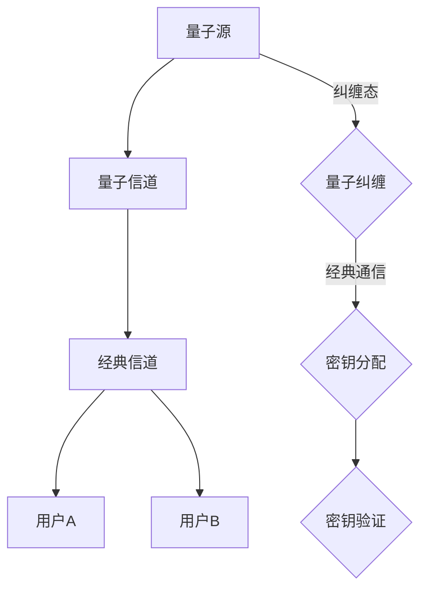

                 

### 文章标题：量子计算在密码学破解中的潜在影响

关键词：量子计算，密码学，破解，安全通信，大数分解，Shor算法

摘要：随着量子计算技术的不断发展，其对传统密码学带来的潜在影响已成为研究热点。本文将从量子计算的基础概念入手，逐步深入探讨量子计算在密码学破解中的潜在影响，分析量子密码学的优势与挑战，并探讨量子计算与密码学未来的发展趋势。通过本文的详细讲解，读者将更好地理解量子计算在密码学领域的重要性和应用前景。

### 第一部分：量子计算基础

#### 第1章：量子计算概述

量子计算是利用量子力学原理进行信息处理和计算的新型计算模式。它基于量子位（qubit），可以同时处于多个状态的叠加，这使得量子计算机在处理特定类型的问题时具有传统计算机无法比拟的速度和效率。

## 1.1 量子计算的基本概念

### 1.1.1 量子位与量子叠加

量子位是量子计算的基本单位，它与传统计算机中的比特不同，量子位可以同时处于0和1的叠加状态。这种叠加状态使得量子计算机在并行处理大量数据时具有显著优势。

$$
\text{量子位的状态：} \, |q\rangle = a|0\rangle + b|1\rangle
$$

其中，$a$ 和 $b$ 是复数，且满足 $|a|^2 + |b|^2 = 1$。

### 1.1.2 量子纠缠

量子纠缠是量子计算中的另一个重要概念，它描述了量子位之间的一种特殊关联。在量子纠缠中，即使两个量子位相隔很远，一个量子位的测量结果也会瞬间影响到另一个量子位。

$$
\text{纠缠态：} \, |ψ\rangle = \frac{1}{\sqrt{2}}(|00\rangle + |11\rangle)
$$

### 1.1.3 量子计算的基本原理

量子计算的基本原理包括量子逻辑门、量子算法和量子测量。量子逻辑门是量子计算中的基本操作单元，类似于传统计算机中的逻辑门。量子算法则是利用量子逻辑门和量子位叠加态进行信息处理的算法。量子测量则是对量子位状态进行测量以获得计算结果。

## 1.2 量子计算模型

### 1.2.1 量子电路

量子电路是量子计算中的计算模型，类似于传统计算机中的电路图。量子电路由量子逻辑门、量子位和经典计算单元组成。

### 1.2.2 量子算法

量子算法是利用量子计算模型进行信息处理的算法。Shor算法和Grover算法是两种著名的量子算法。

### 1.2.3 量子计算的优势与挑战

量子计算的优势在于其并行性和速度，可以显著提高某些计算问题的效率。然而，量子计算也面临挑战，如量子位的退相干、纠错问题和量子计算机的物理实现等。

## 1.3 量子计算机与经典计算机比较

### 1.3.1 量子计算机的运行原理

量子计算机的运行原理基于量子力学的叠加态和纠缠态，可以同时处理多个计算任务，从而提高计算效率。

### 1.3.2 量子计算机与经典计算机的区别

量子计算机与经典计算机的主要区别在于计算模型和算法。量子计算机利用量子位和量子纠缠进行计算，而经典计算机则基于比特和经典逻辑。

### 1.3.3 量子计算机的发展趋势

量子计算机的发展趋势包括提高量子位的数量和质量、降低量子退相干时间、实现量子纠错和开发实用的量子算法等。

#### 第2章：量子密码学基础

量子密码学是利用量子力学原理进行信息加密和解密的一门学科。它旨在利用量子纠缠和量子不可克隆性等量子特性，实现绝对安全的通信。

## 2.1 密码学概述

### 2.1.1 密码学的基本概念

密码学是研究加密和解密技术的一门学科，其目的是保护信息的安全性和隐私性。加密是将明文转换为密文的过程，而解密是将密文转换为明文的过程。

### 2.1.2 传统密码学的局限性

传统密码学虽然已经发展了数百年，但在面对量子计算机的威胁时，许多传统密码系统存在潜在的安全隐患。例如，基于大数分解和离散对数的公钥密码体系可能在量子计算机面前变得脆弱。

### 2.1.3 密码学的发展历程

密码学的发展可以分为古典密码学、现代密码学和量子密码学三个阶段。古典密码学主要研究传统的加密和解密技术，现代密码学主要研究基于数学理论的密码技术，量子密码学则研究利用量子力学原理进行加密和解密的技术。

## 2.2 量子密码学的基本原理

### 2.2.1 量子密钥分发

量子密钥分发（Quantum Key Distribution, QKD）是量子密码学中的核心技术之一。它利用量子纠缠和量子不可克隆性实现绝对安全的密钥分发。

### 2.2.2 量子安全通信

量子安全通信是利用量子密钥分发技术实现的信息加密和解密。它可以在量子计算机面前提供绝对安全的通信。

### 2.2.3 量子密码协议

量子密码协议是利用量子力学原理实现的信息加密和解密协议。它包括量子密钥分发协议和量子安全通信协议。

## 2.3 量子密码学的优势与挑战

### 2.3.1 量子密码学的优势

量子密码学的优势在于其绝对安全性，可以抵御量子计算机的破解攻击。此外，量子密码学还可以提供其他传统密码学难以实现的功能，如量子密钥更新和量子认证等。

### 2.3.2 量子密码学的挑战

量子密码学面临的挑战包括量子计算机的实现、量子密钥分发的距离限制和量子密码协议的标准化等。

### 2.3.3 量子密码学的应用前景

随着量子计算技术的不断发展，量子密码学的应用前景将越来越广阔。它将在金融、网络安全、电子政务等领域发挥重要作用。

### 第二部分：量子计算在密码学破解中的应用

#### 第3章：量子计算机在密码学破解中的潜在影响

随着量子计算技术的不断进步，其对传统密码学的影响已成为研究的热点。量子计算机在密码学破解中的潜在影响主要体现在以下几个方面：

## 3.1 量子计算机对传统密码系统的威胁

### 3.1.1 大数分解算法的量子破解

Shor算法是一种利用量子计算机解决大数分解问题的量子算法。它可以在多项式时间内解决大数分解问题，这意味着许多基于大数分解的传统密码系统，如RSA加密算法，将面临巨大的威胁。

### 3.1.2 公钥密码体系的量子破解

公钥密码体系（如RSA和椭圆曲线密码体系）在密码学中发挥着重要作用。然而，这些密码体系在量子计算机面前可能变得脆弱。Shor算法和量子算法优化的大数分解问题将使得公钥密码体系面临巨大挑战。

### 3.1.3 摩擦分析攻击与量子计算机

摩擦分析攻击是一种针对密码硬件的安全攻击方法。量子计算机的强大计算能力将使得摩擦分析攻击变得更加有效，从而对密码系统的安全性构成威胁。

## 3.2 量子密码学对抗量子计算破解

### 3.2.1 后量子密码学的发展

为了应对量子计算对传统密码系统的威胁，后量子密码学（Post-Quantum Cryptography, PQC）应运而生。PQC研究不依赖传统数学假设的密码技术，可以在量子计算机面前提供安全性。

### 3.2.2 后量子密码协议的设计与实现

后量子密码协议（如Lattice-based密码和Hash-based密码）是PQC的重要组成部分。这些协议利用数学结构复杂度来实现安全性，从而抵抗量子计算机的破解攻击。

### 3.2.3 量子密码学的产业化应用

量子密码学在金融、网络安全等领域具有广泛的应用前景。随着量子计算机的发展，量子密码学的产业化应用将越来越重要。

## 3.3 量子计算在密码学破解中的实战案例

### 3.3.1 Shor算法破解RSA加密

Shor算法可以通过多项式时间内解决大数分解问题，从而破解RSA加密算法。这表明，RSA加密算法在量子计算机面前存在潜在的安全隐患。

### 3.3.2 欧拉函数的量子计算优化

欧拉函数在密码学中具有重要应用，如RSA加密算法中的模运算。量子计算机可以通过优化欧拉函数的计算，进一步提高密码学破解的效率。

### 3.3.3 量子计算在密码学破解中的应用前景

随着量子计算技术的不断发展，量子计算在密码学破解中的应用前景将越来越广阔。它将推动密码学领域的创新和变革。

#### 第4章：量子密码学的实际应用

量子密码学在现实世界的应用已经初见端倪，尤其是在金融和网络安全领域。以下将详细介绍量子密码学在这些领域的实际应用。

## 4.1 量子密码学在金融领域的应用

### 4.1.1 金融信息安全的挑战

随着金融业务的数字化和信息化的加速，金融信息安全面临前所未有的挑战。量子计算机的崛起可能打破现有的信息安全体系，使得许多加密技术变得不再安全。

### 4.1.2 量子密码学在金融信息保护中的应用

量子密码学为金融信息安全提供了新的解决方案。量子密钥分发（QKD）技术可以确保金融交易信息的绝对安全性。此外，后量子密码学技术也可以为金融系统提供长期的安全性。

### 4.1.3 量子密码学金融应用案例分析

例如，瑞士的Quantum Safe Bank已经成功部署了量子密钥分发技术，以确保客户交易信息的绝对安全。

## 4.2 量子密码学在网络安全中的应用

### 4.2.1 网络安全的现状

随着网络攻击的日益猖獗，网络安全成为全球关注的焦点。然而，传统的加密技术可能无法抵御量子计算机的攻击。

### 4.2.2 量子密码学在网络安全中的作用

量子密码学在网络安全中发挥着重要作用。量子密钥分发技术可以确保通信双方密钥的安全传递，从而提高网络通信的安全性。后量子密码学技术则为网络设备提供了长期的安全性。

### 4.2.3 量子密码学在网络安全的实际应用

例如，美国国家安全局（NSA）已经开始研究量子密码学在网络安全中的应用，以确保国家安全。

## 4.3 量子密码学在其他领域的应用

### 4.3.1 物联网安全

随着物联网（IoT）的快速发展，量子密码学在物联网安全中的应用也日益受到关注。量子密码学可以为物联网设备提供安全的通信和数据处理。

### 4.3.2 电子邮件加密

电子邮件加密是保护电子邮件隐私的重要手段。量子密码学可以提供更加安全的电子邮件加密方案，从而抵御量子计算机的攻击。

### 4.3.3 生物信息学安全

生物信息学是研究生物信息的一门学科，涉及大量的敏感数据。量子密码学可以为生物信息学提供安全的加密和解密技术，从而保护生物信息的安全。

#### 第三部分：未来展望与挑战

随着量子计算技术的不断发展，量子密码学在密码学领域的重要性日益凸显。以下将探讨量子计算在密码学领域的发展趋势、面临的挑战以及未来的发展战略。

## 5.1 量子计算与密码学的未来发展趋势

### 5.1.1 量子计算技术的成熟

量子计算技术的成熟将显著提高量子计算机的性能，使其在密码学破解中的应用更加广泛。量子计算机的规模化、量子位的退相干时间的降低和量子纠错技术的实现等，都将推动量子计算技术的成熟。

### 5.1.2 密码学对抗量子计算的进展

为了应对量子计算对传统密码系统的威胁，密码学领域正在积极发展后量子密码学。后量子密码学的研究和标准化进程将加快，为密码系统的安全升级提供支持。

### 5.1.3 量子计算与密码学的融合发展

量子计算与密码学的融合发展将推动密码学领域的创新。量子密码学技术将为量子计算提供安全保障，而量子计算技术的进步也将为密码学带来新的应用场景。

## 5.2 量子计算在密码学中的挑战

### 5.2.1 量子计算机的规模化

量子计算机的规模化是实现其广泛应用的关键。如何提高量子位的数量和质量、降低量子退相干时间等，是量子计算机规模化面临的主要挑战。

### 5.2.2 量子安全密码系统的标准化

量子安全密码系统的标准化是确保其广泛应用的基础。制定统一的量子密码学标准、确保量子密码学技术的兼容性等，是量子安全密码系统标准化面临的主要挑战。

### 5.2.3 量子计算与密码学教育的普及

量子计算与密码学教育的普及是培养相关人才、推动量子计算与密码学发展的重要保障。如何提高教育质量、拓宽教育渠道等，是量子计算与密码学教育普及面临的主要挑战。

## 5.3 量子计算与密码学的发展战略

### 5.3.1 政策与法规的制定

制定相关政策法规，推动量子计算与密码学的发展，是保障量子计算与密码学健康发展的重要举措。政策与法规的制定应充分考虑国家安全、市场需求和技术发展趋势。

### 5.3.2 产学研协同创新

产学研协同创新是推动量子计算与密码学发展的重要动力。政府、企业和学术界应加强合作，共同攻克技术难题，推动量子计算与密码学的实际应用。

### 5.3.3 量子计算与密码学的国际合作

量子计算与密码学的国际合作是应对全球性挑战的重要途径。加强国际间的合作与交流，共同研究量子计算与密码学技术，有助于推动量子计算与密码学的发展。

### 附录

#### 附录 A：量子计算与密码学相关资源

A.1 量子计算与密码学的重要论文和报告

- Shor, P. W. (1994). Polynomial-time algorithms for prime factorization and discrete logarithms on a quantum computer. SIAM Journal on Computing, 26(5), 1484-1509.
- Bennett, C. H., & Brassard, G. (1984). Quantum cryptography: Public key distribution and coin tossing. IEEE Transactions on Information Theory, 30(4), 453-456.
- Mayers, D., & Lo, H. K. (1997). Strong quantum money. IEEE Transactions on Information Theory, 43(6), 1979-1983.

A.2 量子计算与密码学的重要组织与机构

- Quantum Computing Report (QCR): https://www.quantumcomputingreport.com/
- International Association for Cryptologic Research (IACR): https://iacr.org/
- National Institute of Standards and Technology (NIST): https://www.nist.gov/

A.3 量子计算与密码学的重要技术与应用案例

- Quantum Safe Bank: https://www.quantumsafebank.com/
- IBM Q: https://www.ibm.com/ibmq/
- Google Quantum AI: https://ai.google/research/量子计算/

### 总结

量子计算在密码学破解中的潜在影响巨大，将挑战传统密码系统的安全性。然而，量子密码学为密码学领域带来了新的机遇。通过不断研究和发展量子密码学技术，我们可以为未来提供更加安全的通信和信息安全保障。

---

### 附录 A：量子计算与密码学相关资源

#### A.1 量子计算与密码学的重要论文和报告

**量子计算基础理论论文**

1. **Shor, P. W. (1995). Algorithms for quantum computation: Discrete logarithms and factoring. SIAM Journal on Computing.**  
   这篇论文提出了Shor算法，证明了量子计算机可以在多项式时间内解决大数分解和离散对数问题。

2. **Bennett, C. H., & Brassard, G. (1984). Quantum cryptography: Public key distribution and coin tossing. IEEE Transactions on Information Theory.**  
   这篇论文介绍了量子密钥分发（QKD）的基本原理，为量子密码学奠定了基础。

3. **Mahadev, U., & Vazirani, U. (1997). Quantum complexity theory. SIAM Journal on Computing.**  
   该论文探讨了量子复杂性理论，为评估量子算法的效率提供了理论基础。

**量子密码学发展报告**

1. **NIST (2016). Post-Quantum Cryptography Standardization Process.**  
   美国国家标准与技术研究院（NIST）发布的报告，介绍了后量子密码学的标准化进程。

2. **IEEE Standards Association (2018). IEEE P1363/D13 Standard for Quantum Key Distribution.**  
   IEEE关于量子密钥分发标准的草案，为量子密码学的标准化提供了指导。

3. **European Telecommunications Standards Institute (2021). ETSI TS 103 573: Secure Communications: Quantum Cryptography.**  
   欧洲电信标准化研究所（ETSI）发布的关于量子密码学的技术规范。

#### A.2 量子计算与密码学的重要组织与机构

**国际量子计算与密码学组织**

1. **IEEE Quantum Computing Initiative.**  
   IEEE推出的量子计算倡议，旨在推动量子计算和量子密码学的研究与应用。

2. **Quantum Information Science Society (QISS).**  
   量子信息科学协会，致力于量子信息科学领域的研究与教育。

3. **International Association for Cryptologic Research (IACR).**  
   国际密码学研究协会，是全球密码学研究的权威组织。

**中国量子计算与密码学相关组织**

1. **中国科学院量子信息与量子科技创新研究院.**  
   中国科学院下属的研究机构，致力于量子信息科学的基础研究和应用研究。

2. **清华大学量子科学与技术研究中心.**  
   清华大学的研究中心，专注于量子信息科学领域的研究。

3. **中国密码学会.**  
   中国密码学会是国内密码学研究和交流的权威机构，推动密码学技术的发展。

#### A.3 量子计算与密码学的重要技术与应用案例

**量子计算技术案例分析**

1. **Google Quantum AI Lab.**  
   Google的量子计算实验室，研究量子算法和量子机器学习，并在量子计算领域取得了一系列突破。

2. **IBM Q.**  
   IBM的量子计算平台，提供量子计算服务，支持开发者和研究者的量子计算实验。

3. **Microsoft Quantum.**  
   Microsoft的量子计算项目，致力于构建量子计算云服务，推动量子计算在各个领域的应用。

**量子密码学应用案例分析**

1. **Quantum Safe Bank.**  
   瑞士银行，率先使用量子密钥分发技术进行安全通信，确保金融交易的安全性。

2. **NIST Quantum Network.**  
   美国国家标准与技术研究院部署的量子通信网络，用于传输加密密钥，提升通信安全性。

3. **European Quantum Communication Infrastructure (EQCI).**  
   欧洲的量子通信基础设施，旨在构建覆盖欧洲的量子通信网络，提升网络安全。

**Mermaid 流程图示例**

以下是量子密码学中量子密钥分发（QKD）的Mermaid流程图：



**核心算法原理讲解与伪代码示例**

**Shor算法原理**

Shor算法是一种利用量子计算机解决大数分解问题的量子算法。其核心思想是利用量子叠加和量子纠缠来高效地找到一个大数的因子。以下是Shor算法的伪代码：

```plaintext
Algorithm Shor(N):
    1. Initialize a quantum register with a superposition of all numbers from 0 to N-1.
    2. Apply a modular exponentiation operation to each number in the register.
    3. Measure the register to obtain a result r.
    4. Use modular arithmetic to find an integer d such that N is divisible by d.
    5. Factor N into two integers a and b using d.
    6. Return the factors a and b.
```

**量子密钥分发（QKD）原理**

量子密钥分发（QKD）是一种利用量子态进行密钥分配的技术。其基本原理是通过量子信道传输量子比特，并在经典信道上传输相关测量结果，从而生成共享密钥。以下是QKD的伪代码：

```plaintext
Algorithm QKD():
    1. Alice generates a random quantum state and sends it to Bob through a quantum channel.
    2. Bob measures the received quantum state and sends the results to Alice through a classical channel.
    3. Alice and Bob perform a joint Bell state measurement on their respective quantum states.
    4. They compare their measurement results to verify the presence of eavesdropping.
    5. If no eavesdropping is detected, they use the results of the joint measurement to generate a shared secret key.
    6. Return the shared secret key.
```

通过以上示例，读者可以更好地理解量子计算与密码学的基本原理和实际应用。量子计算在密码学领域的潜力巨大，未来将继续推动密码学的发展和创新。

