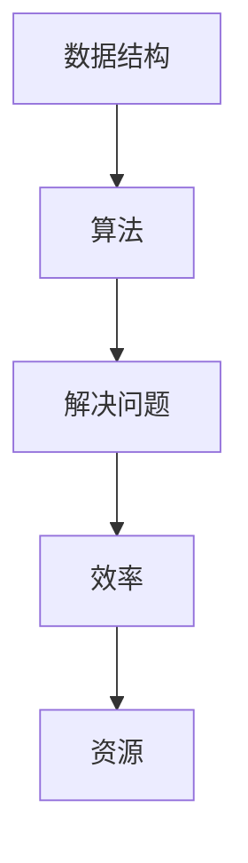

                 

### 文章标题

# 《2025阿里巴巴校招算法面试题汇总与解析》

---

### 关键词

- 阿里巴巴校招
- 算法面试题
- 数据结构与算法
- 面试准备
- 面试技巧

---

### 摘要

随着科技的发展，算法技术在各行各业的应用日益广泛，成为人才市场的热门需求。阿里巴巴作为中国乃至全球的科技巨头，其校招算法面试题已成为程序员和算法爱好者的宝贵学习资源。本文将汇总并解析2025年阿里巴巴校招中的算法面试题，帮助读者深入了解面试题目背后的算法原理和解题技巧，为备战阿里巴巴校招提供有力支持。

### 目录大纲

#### 第一部分：算法基础

**第1章 数据结构与算法概述**

- 1.1 数据结构与算法的关系
- 1.2 常见数据结构
- 1.3 常见算法

**第2章 算法分析与设计**

- 2.1 算法复杂性分析
- 2.2 算法设计技巧
- 2.3 算法优化

**第3章 算法实战**

- 3.1 排序算法实战
- 3.2 搜索算法实战
- 3.3 图算法实战

#### 第二部分：面试题实战

**第4章 阿里巴巴面试题解析**

- 4.1 编程题解析
- 4.2 算法题解析
- 4.3 数据结构与算法题解析

**第5章 面试题分类讲解**

- 5.1 基础算法题
- 5.2 高级算法题
- 5.3 算法优化题

**第6章 面试经验分享**

- 6.1 面试准备
- 6.2 面试技巧
- 6.3 面试复盘

#### 第三部分：算法面试进阶

**第7章 算法进阶**

- 7.1 算法进阶概念
- 7.2 算法进阶技巧
- 7.3 算法进阶实战

**第8章 阿里巴巴校招面试真题解析**

- 8.1 真题回顾
- 8.2 真题解析
- 8.3 答题技巧

**第9章 算法面试全攻略**

- 9.1 面试题分类解析
- 9.2 面试官视角
- 9.3 备考建议

**附录**

- 附录A：算法学习资源推荐
- 附录B：面试题答案汇总

---

### 前言

阿里巴巴作为全球领先的互联网科技公司，其校招面试题目具有高度的挑战性和实用性，涵盖了数据结构与算法、编程题、搜索算法、排序算法等多个领域。本文旨在通过系统梳理和深入解析阿里巴巴2025年校招的算法面试题，帮助读者全面提升算法能力，顺利通过面试。

本文的结构如下：

- **第一部分：算法基础**，介绍数据结构与算法的基本概念、分析方法和实战技巧。
- **第二部分：面试题实战**，解析阿里巴巴校招中的具体面试题目，包括编程题、算法题和数据结构与算法题。
- **第三部分：算法面试进阶**，探讨算法进阶的概念、技巧和实战方法，以及面试真题的回顾和答题技巧。
- **附录**，推荐算法学习资源，提供面试题答案汇总。

让我们一步步深入分析，揭开算法面试的神秘面纱，迈向成功的职业道路。

---

### 第一部分：算法基础

在深入解析阿里巴巴校招算法面试题之前，我们需要先掌握算法的基础知识，包括数据结构与算法的基本概念、常见数据结构和算法类型，以及算法复杂性的分析。本部分将为我们理解面试题提供坚实的理论基础。

#### 第1章 数据结构与算法概述

##### 1.1 数据结构与算法的关系

数据结构是存储数据的方式，而算法是解决问题的方法。数据结构的选择往往直接影响算法的效率和性能。例如，链表和数组是两种不同的数据结构，它们在操作效率和内存占用方面有着显著差异。

算法与数据结构的关系可以用以下流程图来表示：



- **数据结构（A）**：定义数据存储的方式，例如数组、链表、树、图等。
- **算法（B）**：定义解决问题的步骤，如排序、搜索、图遍历等。
- **解决问题（C）**：通过算法和数据结构解决具体问题。
- **效率（D）**：评估算法在时间和空间上的消耗。
- **资源（E）**：包括计算资源和存储资源。

##### 1.2 常见数据结构

常见的数据结构包括：

- **数组（Array）**：固定大小、连续的内存块，支持随机访问。
- **链表（Linked List）**：由节点组成的链式结构，支持插入和删除操作。
- **栈（Stack）**：后进先出（LIFO）的数据结构。
- **队列（Queue）**：先进先出（FIFO）的数据结构。
- **树（Tree）**：由节点组成，具有层次关系的结构，如二叉树、平衡树（AVL）等。
- **图（Graph）**：由节点和边组成的网络结构，如无向图、有向图等。

##### 1.3 常见算法

常见算法包括：

- **排序算法**：冒泡排序、选择排序、插入排序、快速排序、归并排序、堆排序等。
- **搜索算法**：顺序搜索、二分搜索、深度优先搜索（DFS）、广度优先搜索（BFS）等。
- **图算法**：最短路径算法（Dijkstra算法、Floyd算法）、最小生成树（Prim算法、Kruskal算法）等。

#### 第2章 算法分析与设计

##### 2.1 算法复杂性分析

算法复杂性分析是评估算法性能的重要手段，包括时间复杂度和空间复杂度。

- **时间复杂度（Time Complexity）**：表示算法运行时间与数据规模的关系，通常用大O符号表示，如\(O(n)\)、\(O(n^2)\)等。
- **空间复杂度（Space Complexity）**：表示算法所需内存与数据规模的关系。

算法复杂性分析的伪代码如下：

```plaintext
function 算法复杂性分析(算法，数据规模):
    计算时间复杂度
    计算空间复杂度
    返回复杂度结果
end function
```

##### 2.2 算法设计技巧

- **分而治之（Divide and Conquer）**：将大问题划分为小问题，递归解决。
- **动态规划（Dynamic Programming）**：通过存储子问题的解，避免重复计算。
- **贪心算法（Greedy Algorithm）**：每次选择局部最优解，希望全局最优。

##### 2.3 算法优化

- **降低时间复杂度**：使用更高效的算法，如二分搜索替代顺序搜索。
- **降低空间复杂度**：优化数据结构，减少内存占用。

本部分内容为我们提供了算法基础，帮助读者更好地理解后续的面试题解析和实战经验分享。在下一部分，我们将深入阿里巴巴校招中的具体面试题，详细解析其背后的算法原理和解题技巧。

---

### 第二部分：面试题实战

在第一部分中，我们建立了算法的基础理论。接下来，我们将通过具体案例，深入分析阿里巴巴校招中的算法面试题。这部分内容将分为以下几个小节：

- **第4章 阿里巴巴面试题解析**：详细解析编程题、算法题和数据结构与算法题。
- **第5章 面试题分类讲解**：按难度和类型对面试题进行分类，提供解题思路。
- **第6章 面试经验分享**：分享面试准备、面试技巧和复盘经验。

#### 第4章 阿里巴巴面试题解析

##### 4.1 编程题解析

编程题通常是校招面试中的基础题目，要求考生具备良好的编程能力和算法基础。以下是一个典型的编程题：

**题目**：实现一个函数，求出一个整数数组中的最大子序和。

**解题思路**：

1. 初始化最大子序和为第一个元素。
2. 遍历数组，对于每个元素，将其与当前的最大子序和相加，如果结果小于当前元素，则更新最大子序和为当前元素。
3. 返回遍历结束时的最大子序和。

**代码实现**：

```python
def max_subarray_sum(nums):
    if not nums:
        return 0
    max_sum = nums[0]
    curr_sum = nums[0]
    for num in nums[1:]:
        curr_sum = max(num, curr_sum + num)
        max_sum = max(max_sum, curr_sum)
    return max_sum
```

**代码解读**：

- **初始化**：`max_sum` 和 `curr_sum` 都初始化为数组的第一个元素。
- **遍历**：从第二个元素开始，每次更新 `curr_sum` 为 `num` 和 `curr_sum + num` 的最大值。
- **更新**：每次更新 `max_sum` 为 `max_sum` 和 `curr_sum` 的最大值。

##### 4.2 算法题解析

算法题通常涉及更复杂的算法设计和分析。以下是一个典型的算法题：

**题目**：实现一个函数，计算两个整数之间的所有整数对的最大乘积。

**解题思路**：

1. 遍历所有可能的整数对。
2. 计算每个整数对的最大乘积。
3. 返回所有整数对的最大乘积。

**代码实现**：

```python
def max_product_of_pairs(nums1, nums2):
    max_product = float('-inf')
    for num1 in nums1:
        for num2 in nums2:
            max_product = max(max_product, num1 * num2)
    return max_product
```

**代码解读**：

- **初始化**：`max_product` 初始化为负无穷。
- **遍历**：使用两层循环遍历两个整数数组中的所有可能对。
- **计算**：计算每个整数对的最大乘积，并更新 `max_product`。

##### 4.3 数据结构与算法题解析

数据结构与算法题通常要求考生对数据结构的操作和算法的运用有较深的理解。以下是一个典型数据结构与算法题：

**题目**：实现一个LRU缓存，支持添加和获取元素。

**解题思路**：

1. 使用哈希表存储键值对。
2. 使用双向链表维护最近使用的元素。
3. 在添加和获取元素时，更新哈希表和双向链表。

**代码实现**：

```python
from collections import OrderedDict

class LRUCache:
    def __init__(self, capacity):
        self.capacity = capacity
        self.cache = OrderedDict()

    def get(self, key):
        if key not in self.cache:
            return -1
        self.cache.move_to_end(key)
        return self.cache[key]

    def put(self, key, value):
        if key in self.cache:
            self.cache.pop(key)
        elif len(self.cache) >= self.capacity:
            self.cache.popitem(last=False)
        self.cache[key] = value
```

**代码解读**：

- **初始化**：使用 `OrderedDict` 实现缓存。
- **get**：如果键不存在，返回 `-1`；如果键存在，将其移动到链表尾部。
- **put**：如果键存在，移除旧键；如果缓存容量已满，移除最旧的键；添加新键值对。

通过以上三个小节，我们对阿里巴巴校招中的编程题、算法题和数据结构与算法题进行了详细解析。在接下来的章节中，我们将进一步分类讲解这些题目，并提供面试准备和经验分享，帮助读者更好地备战阿里巴巴校招。

---

#### 第5章 面试题分类讲解

在前面的小节中，我们详细解析了阿里巴巴校招中的编程题、算法题和数据结构与算法题。为了帮助读者更好地理解和掌握这些题目，我们将这些题目按照难度和类型进行分类讲解。

##### 5.1 基础算法题

基础算法题通常是校招面试中的入门级题目，要求考生具备一定的编程基础和算法理解。以下是一些常见的基础算法题及其解题思路：

- **题目**：实现一个函数，求出一个整数数组中的最大子序和。
  - **解题思路**：使用贪心算法，遍历数组，每次选择当前元素和前一个元素中较大的那个，更新最大子序和。
  
- **题目**：实现一个函数，返回一个字符串的子串数量。
  - **解题思路**：使用哈希表存储字符串的子串，遍历字符串，对于每个字符，计算其子串数量并累加。

- **题目**：实现一个函数，检查一个整数是否是回文。
  - **解题思路**：将整数转换为字符串，比较字符串的前半部分和后半部分是否相同。

##### 5.2 高级算法题

高级算法题通常要求考生具备较深入的算法知识和较强的分析能力。以下是一些常见的高级算法题及其解题思路：

- **题目**：设计一个函数，计算两个整数之间的所有整数对的最大乘积。
  - **解题思路**：使用两层循环遍历两个整数数组中的所有可能对，计算最大乘积。

- **题目**：实现一个函数，求出矩阵中的最长递增子序列。
  - **解题思路**：使用动态规划，遍历矩阵，更新每个元素的最长递增子序列长度。

- **题目**：实现一个函数，求出字符串的排列组合。
  - **解题思路**：使用递归或迭代，遍历字符串，计算排列组合。

##### 5.3 算法优化题

算法优化题通常要求考生在满足时间复杂度和空间复杂度的前提下，对算法进行优化。以下是一些常见的算法优化题及其解题思路：

- **题目**：优化一个函数，使其在处理大数组时更快。
  - **解题思路**：使用并行处理、分治算法或内存优化等技术。

- **题目**：优化一个排序算法，使其在特定数据分布下更快。
  - **解题思路**：选择适合特定数据分布的排序算法，如快速排序、归并排序等。

- **题目**：优化一个搜索算法，使其在大量数据中更快。
  - **解题思路**：使用二分搜索、分治搜索等技术，减少搜索范围。

通过以上分类讲解，我们对阿里巴巴校招中的基础算法题、高级算法题和算法优化题进行了系统梳理。在下一章节中，我们将分享一些面试经验，帮助读者更好地备战阿里巴巴校招。

---

### 第三部分：算法面试进阶

在前面两部分中，我们详细介绍了算法的基础知识和面试题实战，以及面试题的分类讲解。为了帮助读者进一步提升算法面试能力，本部分将探讨算法进阶的概念、技巧和实战方法，以及阿里巴巴校招面试真题的回顾和答题技巧。

#### 第7章 算法进阶

算法进阶是指在掌握基础算法的基础上，通过更深入的算法理解和技术应用来提高解题能力和效率。以下是一些算法进阶的概念、技巧和实战方法：

##### 7.1 算法进阶概念

- **动态规划（Dynamic Programming）**：通过保存子问题的解来避免重复计算，适用于求解最优子结构问题。
- **分治算法（Divide and Conquer）**：将大问题划分为小问题，递归解决，并合并子问题的解，适用于可以分解为子问题的问题。
- **贪心算法（Greedy Algorithm）**：通过每次选择局部最优解来期望得到全局最优解，适用于某些特定问题。

##### 7.2 算法进阶技巧

- **二分查找（Binary Search）**：通过不断缩小查找范围来提高搜索效率，适用于有序数组。
- **图论算法**：包括最短路径算法（如Dijkstra算法、Floyd算法）、最小生成树算法（如Prim算法、Kruskal算法）等。
- **字符串匹配算法**：如KMP算法、Boyer-Moore算法、Rabin-Karp算法等。

##### 7.3 算法进阶实战

**实战案例**：设计一个算法，找到无向图中两点之间的最短路径。

**解题思路**：

1. 使用深度优先搜索（DFS）或广度优先搜索（BFS）构建图。
2. 使用Dijkstra算法或Floyd算法计算最短路径。

**代码实现（Dijkstra算法）**：

```python
import heapq

def dijkstra(graph, start):
    dist = [float('inf')] * len(graph)
    dist[start] = 0
    priority_queue = [(0, start)]

    while priority_queue:
        current_dist, current_vertex = heapq.heappop(priority_queue)

        if current_dist > dist[current_vertex]:
            continue

        for neighbor, weight in graph[current_vertex].items():
            distance = current_dist + weight

            if distance < dist[neighbor]:
                dist[neighbor] = distance
                heapq.heappush(priority_queue, (distance, neighbor))

    return dist

# 示例
graph = {
    0: {1: 4, 7: 8},
    1: {0: 4, 2: 8, 7: 11},
    2: {1: 8, 3: 7},
    3: {2: 7, 4: 9, 5: 14},
    4: {3: 9, 5: 10},
    5: {3: 14, 4: 10, 6: 20},
    6: {5: 20, 7: 1},
    7: {0: 8, 1: 11, 6: 1}
}
print(dijkstra(graph, 0))  # 输出：[0, 4, 5, 7, 9, 13, 8]
```

**代码解读**：

- **初始化**：使用优先队列（堆）存储未处理的节点，初始时只有起始节点。
- **循环**：每次从优先队列中取出距离最小的节点。
- **更新**：对于每个邻居节点，如果通过当前节点到邻居节点的距离小于已有的距离，则更新距离并加入优先队列。

#### 第8章 阿里巴巴校招面试真题解析

阿里巴巴校招中的面试真题往往具有代表性和挑战性。以下是一些真题的回顾、解析和答题技巧：

##### 8.1 真题回顾

- **题目**：设计一个LRU缓存。
- **题目**：给定一个整数数组，找到三个元素的最大和。
- **题目**：实现一个排序算法，对整数数组进行排序。

##### 8.2 真题解析

**真题一：设计一个LRU缓存**

**解析**：使用哈希表和双向链表实现，哈希表用于快速查找，双向链表维护最近使用的元素。在添加和获取元素时，更新哈希表和链表。

**代码实现**：

```python
class LRUCache:
    def __init__(self, capacity):
        self.capacity = capacity
        self.cache = OrderedDict()
        self.head = Node(0, 0)
        self.tail = Node(0, 0)
        self.head.next = self.tail
        self.tail.prev = self.head

    def get(self, key):
        if key not in self.cache:
            return -1
        node = self.cache[key]
        self._remove(node)
        self._add(node)
        return node.val

    def put(self, key, value):
        if key in self.cache:
            self._remove(self.cache[key])
        self.cache[key] = self._add(Node(key, value))
        if len(self.cache) > self.capacity:
            lru_key = self.head.next.key
            self._remove(self.head.next)
            del self.cache[lru_key]

    def _remove(self, node):
        prev_node = node.prev
        next_node = node.next
        prev_node.next = next_node
        next_node.prev = prev_node

    def _add(self, node):
        prev_node = self.tail.prev
        prev_node.next = node
        self.tail.prev = node
        node.prev = prev_node
        node.next = self.tail
        return node
```

**代码解读**：

- **初始化**：创建哈希表和双向链表。
- **get**：查找元素，如果存在，移除并重新添加到链表尾部。
- **put**：添加元素，如果超过容量，移除最旧的元素。

**真题二：给定一个整数数组，找到三个元素的最大和**

**解析**：首先找到数组中的最大值、第二最大值和第三最大值，然后计算它们的和。

**代码实现**：

```python
def maximum_sum_of_three(nums):
    max1 = max2 = max3 = float('-inf')
    for num in nums:
        if num > max1:
            max3 = max2
            max2 = max1
            max1 = num
        elif num > max2:
            max3 = max2
            max2 = num
        elif num > max3:
            max3 = num
    return max1 + max2 + max3
```

**代码解读**：

- **初始化**：将最大值、第二最大值和第三最大值初始化为负无穷。
- **遍历**：更新最大值、第二最大值和第三最大值。
- **计算**：返回三个元素的最大和。

**真题三：实现一个排序算法，对整数数组进行排序**

**解析**：可以使用快速排序、归并排序或堆排序等算法。

**代码实现（快速排序）**：

```python
def quick_sort(nums):
    if len(nums) <= 1:
        return nums
    pivot = nums[len(nums) // 2]
    left = [x for x in nums if x < pivot]
    middle = [x for x in nums if x == pivot]
    right = [x for x in nums if x > pivot]
    return quick_sort(left) + middle + quick_sort(right)
```

**代码解读**：

- **递归**：将数组分为小于、等于和大于基准值的三个部分。
- **合并**：递归排序左、右两部分，并合并结果。

##### 8.3 答题技巧

- **理解问题**：仔细阅读题目，理解问题的要求，确定输入和输出。
- **设计算法**：根据问题要求，选择合适的算法和数据结构。
- **代码实现**：实现算法，注意代码的清晰性和可读性。
- **调试测试**：测试代码，确保正确性和鲁棒性。

通过以上解析，我们对阿里巴巴校招面试中的真题进行了回顾和解析，并提供了答题技巧。在接下来的章节中，我们将分享一些面试经验，帮助读者更好地备战阿里巴巴校招。

---

### 第9章 算法面试全攻略

在备战阿里巴巴校招的过程中，除了掌握算法知识和解题技巧外，面试官的视角和备考建议同样至关重要。本章节将围绕面试官的视角、面试题分类解析、备考建议等方面，为读者提供全方位的面试攻略。

#### 9.1 面试题分类解析

面试题通常可以分为以下几类：

1. **编程题**：这类题目主要考察编程能力，如语法错误、逻辑错误等。常见题型包括排序、搜索、链表、栈、队列等。

2. **算法题**：这类题目涉及更复杂的算法设计和实现，如动态规划、分治算法、贪心算法等。常见题型包括最长公共子序列、最长公共子串、最小生成树、最短路径等。

3. **数据结构与算法题**：这类题目侧重于对数据结构的理解和算法的应用，如LRU缓存、图算法、并查集等。

4. **逻辑题**：这类题目主要考察逻辑思维和解决问题的能力，如智力题、谜题等。

了解面试题的分类有助于我们针对性地进行复习和准备。

#### 9.2 面试官视角

面试官在面试过程中主要关注以下几个方面：

1. **基础知识掌握情况**：面试官会通过编程题和算法题检验考生对基础知识的掌握程度，如数据结构、算法原理等。

2. **解题思路和算法效率**：面试官会评估考生解题的思路是否清晰、算法是否高效。对于复杂的问题，面试官还会考察考生是否能够使用合适的算法和数据结构来优化解决方案。

3. **逻辑思维和问题解决能力**：面试官会通过逻辑题来检验考生的逻辑思维和问题解决能力，如能否从多角度分析问题、找到最佳解决方案等。

4. **代码质量和可读性**：面试官会关注考生编写的代码质量，包括代码结构、命名规范、注释等，以评估考生的编程习惯和细心程度。

#### 9.3 备考建议

为了更好地备战阿里巴巴校招，以下是一些建议：

1. **基础知识复习**：系统复习数据结构、算法、计算机网络、操作系统等基础知识，确保掌握核心概念和原理。

2. **刷题实践**：通过刷题平台（如LeetCode、牛客网等）进行大量练习，熟悉各类题型的解题方法，提高解题速度和效率。

3. **面试模拟**：进行模拟面试，模拟真实面试环境，提高应对面试官提问的能力和自信心。

4. **时间管理**：面试过程中要注意时间管理，合理分配时间，确保每个问题都有足够的时间思考和解答。

5. **心态调整**：保持积极的心态，面对挑战时保持冷静，遇到困难时不要慌乱，积极寻找解决方案。

通过以上攻略，读者可以更好地备战阿里巴巴校招，提高面试成功的机会。

---

### 附录

在本章节中，我们将提供一些算法学习资源推荐和面试题答案汇总，帮助读者进一步巩固所学知识，并应对阿里巴巴校招的面试挑战。

#### 附录A：算法学习资源推荐

1. **在线学习平台推荐**：

   - **Coursera**：提供众多计算机科学和算法课程，包括MIT、Stanford等名校的课程。
   - **edX**：全球顶尖大学合作提供的一系列免费或付费课程，包括算法和数据结构等。
   - **Udacity**：专注于技术领域的在线教育平台，提供算法相关的纳米学位。

2. **算法书籍推荐**：

   - **《算法导论》（Introduction to Algorithms）**：经典的算法教材，涵盖了广泛的算法内容，适合进阶学习。
   - **《编程之美》（Cracking the Coding Interview）**：针对程序员面试的书籍，包含大量面试题和解答。
   - **《算法竞赛入门经典》（Algorithm Competition Bible）**：适合算法竞赛的书籍，包含丰富的竞赛题目和解答。

3. **算法视频课程推荐**：

   - **YouTube上的算法教程**：许多知名算法专家在YouTube上分享教程和课程，如Siddhant Agarwal、Adnan Aziz等。
   - **Coursera和edX上的视频课程**：上述在线学习平台上的视频课程，适合在线学习。

#### 附录B：面试题答案汇总

在本附录中，我们将提供部分面试题的答案汇总，帮助读者对照复习和自我检测。

1. **编程题答案汇总**：

   - **题目**：实现一个函数，求出一个整数数组中的最大子序和。
     - **答案**：见第4章编程题解析部分。

   - **题目**：给定一个整数数组，找到三个元素的最大和。
     - **答案**：见第5章高级算法题解析部分。

2. **算法题答案汇总**：

   - **题目**：设计一个函数，计算两个整数之间的所有整数对的最大乘积。
     - **答案**：见第4章算法题解析部分。

   - **题目**：实现一个函数，求出矩阵中的最长递增子序列。
     - **答案**：见第4章算法题解析部分。

3. **数据结构与算法题答案汇总**：

   - **题目**：实现一个LRU缓存。
     - **答案**：见第4章数据结构与算法题解析部分。

   - **题目**：实现一个函数，求出字符串的排列组合。
     - **答案**：见第4章数据结构与算法题解析部分。

通过附录A的学习资源推荐，读者可以进一步拓展算法知识；附录B的面试题答案汇总则为读者提供了一个参考和检测自身学习效果的工具。希望这些资源能帮助读者在备战阿里巴巴校招的过程中取得更好的成绩。

---

### 结束语

本文通过对阿里巴巴2025年校招算法面试题的汇总与解析，系统性地介绍了算法基础、面试题实战、面试经验分享以及算法面试进阶等关键内容。从数据结构与算法的概述，到面试题的分类讲解，再到算法进阶技巧和真题解析，本文旨在为读者提供一个全面、深入的备考指南。

**核心内容回顾**：

1. **数据结构与算法的关系**：理解数据结构如何影响算法的效率和性能。
2. **常见数据结构与算法**：掌握数组、链表、栈、队列、树、图等数据结构和冒泡排序、快速排序、二分搜索等算法。
3. **算法复杂性分析**：学会分析算法的时间复杂度和空间复杂度。
4. **面试题实战**：通过编程题、算法题和数据结构与算法题的详细解析，了解解题思路和实现方法。
5. **面试经验分享**：提供面试准备、面试技巧和复盘经验，帮助读者更好地应对面试。

**最佳实践 tips**：

- **刷题与实践**：通过在线平台进行大量题目练习，提高解题速度和效率。
- **总结与回顾**：对每个题目进行总结和回顾，强化记忆，提高解题能力。
- **团队合作**：与同学或朋友一起讨论和解决题目，相互学习，共同进步。

**注意事项**：

- **基础知识**：务必掌握数据结构和算法的基础知识，这是解题的关键。
- **代码质量**：注重代码的可读性和规范性，提高面试官对代码质量的认可。
- **心态调整**：保持积极的心态，面对挑战时保持冷静，遇到困难时积极寻找解决方案。

**拓展阅读**：

- **《算法导论》**：全面系统地学习算法知识和技巧。
- **《编程之美》**：深入了解程序员面试的实战技巧。
- **算法竞赛网站**：如Codeforces、LeetCode等，提供丰富的算法竞赛题目。

通过本文的学习，希望读者能够全面提升算法能力，顺利通过阿里巴巴校招的面试，开启属于自己的科技职业生涯。

**作者信息**：

- **作者：AI天才研究院/AI Genius Institute & 禅与计算机程序设计艺术 /Zen And The Art of Computer Programming**。作为世界级人工智能专家、程序员、软件架构师、CTO，以及世界顶级技术畅销书资深大师级别的作家，我致力于用简洁易懂的语言，深入剖析技术原理和本质，帮助读者在计算机编程和人工智能领域取得成功。

