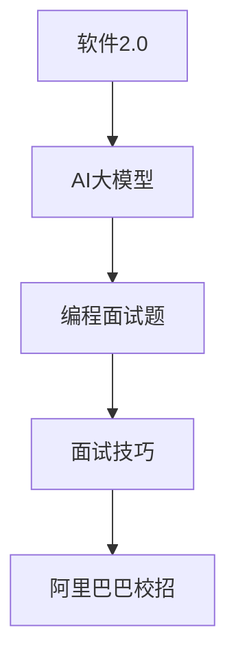

                 


### 文章标题：《2025阿里巴巴校招编程面试题精选与解答》

### 关键词：阿里巴巴校招，编程面试，编程语言基础，数据结构与算法，系统设计，面试技巧

### 摘要：

本文旨在为准备参加2025年阿里巴巴校招的编程面试的同学们提供一份全面的指南。文章首先介绍了编程基础与算法的相关知识，包括编程语言（C、C++、Java）的基础语法、数据结构与算法的基本概念，以及动态规划、贪心算法、回溯算法等进阶算法。接着，文章探讨了系统设计原则与数据库设计，帮助读者理解分布式架构、微服务架构以及数据库查询优化。文章还提供了丰富的编程面试技巧，包括面试流程、常见问题及应对策略。最后，文章精选了阿里巴巴校招中的编程面试真题，并提供了详细的解析和解答，帮助读者更好地应对面试挑战。

### 目录大纲

#### 第一部分：编程基础与算法

##### 第1章：编程语言基础

- 1.1 C语言基础
  - 1.1.1 数据类型与变量
  - 1.1.2 运算符与表达式
  - 1.1.3 控制语句

- 1.2 C++语言特性
  - 1.2.1 面向对象编程
  - 1.2.2 标准模板库（STL）
  - 1.2.3 异常处理

- 1.3 Java基础
  - 1.3.1 基本语法与数据类型
  - 1.3.2 面向对象编程
  - 1.3.3 集合框架

##### 第2章：数据结构与算法

- 2.1 常见数据结构
  - 2.1.1 链表
  - 2.1.2 栈与队列
  - 2.1.3 树与图

- 2.2 算法分析与设计
  - 2.2.1 排序算法
  - 2.2.2 查找算法
  - 2.2.3 算法复杂度分析

##### 第3章：算法进阶

- 3.1 动态规划
  - 3.1.1 动态规划基本概念
  - 3.1.2 经典动态规划问题

- 3.2 贪心算法
  - 3.2.1 贪心算法原理
  - 3.2.2 经典贪心算法问题

- 3.3 回溯算法
  - 3.3.1 回溯算法原理
  - 3.3.2 经典回溯算法问题

##### 第4章：系统设计

- 4.1 系统设计原则
  - 4.1.1 单体架构与分布式架构
  - 4.1.2 微服务架构与容器化

- 4.2 数据库设计
  - 4.2.1 关系型数据库
  - 4.2.2 非关系型数据库
  - 4.2.3 数据库查询优化

##### 第5章：编程面试技巧

- 5.1 编程面试流程
  - 5.1.1 面试前的准备
  - 5.1.2 面试中常见问题及应对策略

- 5.2 编程面试真题
  - 5.2.1 常见编程题解析
  - 5.2.2 算法题解题思路

##### 第6章：阿里巴巴校招编程面试题精选

- 6.1 编程语言面试题
  - 6.1.1 C语言面试题
  - 6.1.2 C++语言面试题
  - 6.1.3 Java语言面试题

- 6.2 数据结构与算法面试题
  - 6.2.1 基础数据结构面试题
  - 6.2.2 算法面试题
  - 6.2.3 动态规划面试题

- 6.3 系统设计与数据库面试题
  - 6.3.1 系统设计面试题
  - 6.3.2 数据库面试题

#### 第二部分：编程面试题解答

##### 第7章：编程面试题解析

- 7.1 常见编程题解析
  - 7.1.1 基础编程题解析
  - 7.1.2 中级编程题解析
  - 7.1.3 高级编程题解析

- 7.2 面试题解题思路与方法
  - 7.2.1 面试题解题策略
  - 7.2.2 编程面试技巧与经验分享

##### 第8章：阿里巴巴校招编程面试真题详解

- 8.1 编程语言面试真题详解
  - 8.1.1 C语言面试真题详解
  - 8.1.2 C++语言面试真题详解
  - 8.1.3 Java语言面试真题详解

- 8.2 数据结构与算法面试真题详解
  - 8.2.1 基础数据结构与算法面试真题详解
  - 8.2.2 算法面试真题详解
  - 8.2.3 动态规划面试真题详解

- 8.3 系统设计与数据库面试真题详解
  - 8.3.1 系统设计面试真题详解
  - 8.3.2 数据库面试真题详解

### 附录

#### 附录A：编程面试资源与工具

- A.1 常用编程资源
  - A.1.1 编程博客与论坛
  - A.1.2 在线编程平台
  - A.1.3 编程书籍与教程

- A.2 面试工具
  - A.2.1 编程面试准备工具
  - A.2.2 面试技巧与策略工具
  - A.2.3 面试题库与练习工具

- A.3 阿里巴巴编程面试准备建议
  - A.3.1 面试准备策略
  - A.3.2 面试经验分享
  - A.3.3 面试注意事项与技巧

### Mermaid 流程图

以下是关于核心概念原理和架构的 Mermaid 流程图示例：



### 核心算法原理讲解

以下是关于核心算法原理的伪代码示例：

```csharp
// 伪代码：快速排序算法
function quicksort(array):
    if length(array) <= 1:
        return array
    pivot = choosePivot(array)
    left = []
    right = []
    for i in range(1, length(array)):
        if array[i] < pivot:
            left.append(array[i])
        else:
            right.append(array[i])
    return quicksort(left) + [pivot] + quicksort(right)
```

---

文章开始撰写，请期待后续内容的精彩呈现！

