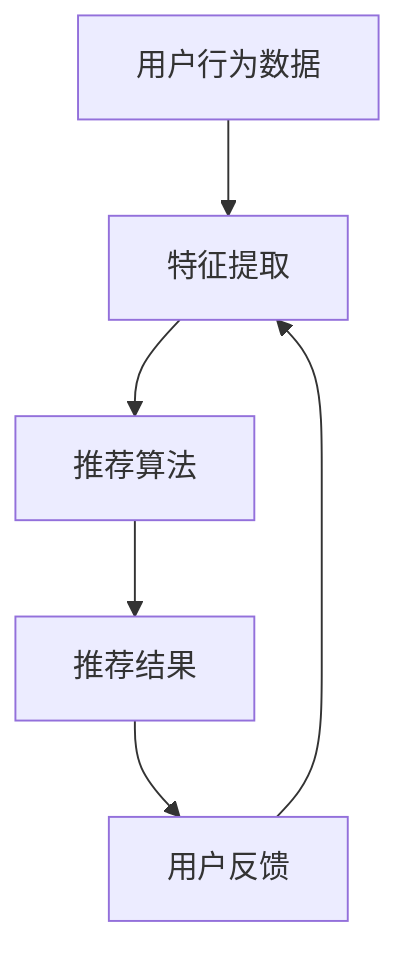

                 


### 《阿里影业2024校招影视推荐算法面试题详解》

---

关键词：影视推荐算法、协同过滤、内容推荐、混合推荐、面试题解析

摘要：本文详细解析了阿里影业2024校招中影视推荐算法相关的面试题，从基础理论到实际应用，为准备校招的同学们提供全面的指导和实战经验。

---

### 《阿里影业2024校招影视推荐算法面试题详解》目录大纲

#### 第一部分：影视推荐算法基础

**第1章：影视推荐系统概述**

**第2章：用户行为数据分析**

**第3章：影视内容特征提取**

#### 第二部分：推荐算法原理与应用

**第4章：基于内容的推荐算法**

**第5章：协同过滤推荐算法**

**第6章：混合推荐算法**

**第7章：推荐系统的评价与优化**

#### 第三部分：实战案例与案例分析

**第8章：阿里影业推荐算法实战**

**第9章：影视推荐算法面试题解析**

#### 附录

**附录A：推荐系统开发工具与资源**

---

#### 第1章：影视推荐系统概述

**1.1 影视推荐系统的定义与作用**

影视推荐系统是一种基于用户行为和影视内容特征的算法，旨在为用户提供个性化的影视推荐。它的作用是帮助用户发现潜在的感兴趣内容，提升用户体验，从而增加用户黏性和平台收入。

**核心概念与联系**

- **用户行为数据**：包括用户的浏览历史、评论、评分等行为数据，用于分析用户兴趣。
- **影视内容特征**：包括影视的标题、简介、演员、导演、类型、时长等元数据，用于内容匹配。

**Mermaid 流程图**



**1.2 影视推荐系统的发展历程**

影视推荐系统的发展大致经历了三个阶段：

1. **基于内容的推荐（Content-Based Filtering）**：早期的推荐系统主要依靠影视内容的元数据特征，如演员、导演、类型等，进行内容匹配。
2. **协同过滤推荐（Collaborative Filtering）**：基于用户之间的相似性，通过相似用户的评分预测目标用户的评分。协同过滤分为隐式和显式两种。
3. **混合推荐（Hybrid Recommendation）**：结合基于内容和协同过滤的优点，利用混合模型提高推荐效果。

**核心算法原理讲解**

- **协同过滤算法（Collaborative Filtering）**：
  - **隐式协同过滤**：通过用户行为数据，如浏览、点击、购买等，找到相似用户，推荐相似用户喜欢的影视。
    ```python
    # 隐式协同过滤伪代码
    def implicit_collaborative_filtering(user_actions, user_similarity, new_user_actions):
        for user, similarity in user_similarity.items():
            if user != new_user:
                for item, action in user_actions[user].items():
                    new_user_actions[item] += similarity * action
        return new_user_actions
    
    # 相似度计算
    def calculate_similarity(user_actions, other_user_actions):
        common_items = set(user_actions.keys()).intersection(set(other_user_actions.keys()))
        if len(common_items) == 0:
            return 0
        dot_product = sum(user_actions[item] * other_user_actions[item] for item in common_items)
        magnitude = math.sqrt(sum(user_actions[item]**2 for item in user_actions.keys())) * math.sqrt(sum(other_user_actions[item]**2 for item in other_user_actions.keys()))
        return dot_product / magnitude
    ```
  - **显式协同过滤**：用户直接给出评分，如电影评分，通过相似度计算和评分预测进行推荐。
    ```python
    # 显式协同过滤伪代码
    def explicit_collaborative_filtering(user_ratings, user_similarity, new_user_ratings):
        for user, similarity in user_similarity.items():
            if user != new_user:
                for item, rating in new_user_ratings.items():
                    if item not in user_ratings:
                        predicted_rating = sum(similarity * user_ratings[other_item] for other_item in user_ratings.keys()) / sum(similarity for other_item in user_ratings.keys())
                        new_user_ratings[item] = predicted_rating
        return new_user_ratings
    ```

- **基于内容的推荐算法（Content-Based Filtering）**：
  - 根据用户的历史偏好和影视的内容特征进行推荐。常用的方法是TF-IDF、词袋模型、朴素贝叶斯等。
    ```python
    # 基于内容的推荐算法伪代码
    def content_based_filtering(item_features, user_preferences, new_item_features):
        similar_items = find_similar_items(item_features, new_item_features, user_preferences)
        recommendations = []
        for item in similar_items:
            if item not in new_item_features:
                recommendations.append(item)
        return recommendations
    
    # 计算相似度
    def calculate_similarity(item1_features, item2_features):
        common_words = set(item1_features).intersection(set(item2_features))
        if len(common_words) == 0:
            return 0
        score = sum(item1_features[word] * item2_features[word] for word in common_words)
        return score
    ```

- **混合推荐算法（Hybrid Recommendation）**：
  - 结合协同过滤和基于内容的推荐，利用各自的优点，提高推荐效果。
    ```python
    # 混合推荐算法伪代码
    def hybrid_recommendation(user_similarity, item_similarity, user_preferences, new_user_preferences):
        collaborative_recommendations = explicit_collaborative_filtering(user_preferences, user_similarity, {})
        content_recommendations = content_based_filtering(item_similarity, user_preferences, {})
        final_recommendations = {}
        for item in collaborative_recommendations:
            if item in content_recommendations:
                final_recommendations[item] = (collaborative_recommendations[item] + content_recommendations[item]) / 2
            else:
                final_recommendations[item] = collaborative_recommendations[item]
        return final_recommendations
    ```

---

**项目实战**

- **开发环境搭建**：使用Python，结合Scikit-learn、NumPy、Pandas等库进行推荐系统的开发。
- **源代码详细实现和代码解读**：
  ```python
  # 导入库
  import numpy as np
  import pandas as pd
  from sklearn.metrics.pairwise import cosine_similarity
  from sklearn.model_selection import train_test_split
  
  # 数据预处理
  def preprocess_data(data):
      # 数据清洗、缺失值处理、标准化等
      pass
  
  # 用户行为数据
  user_actions = preprocess_data(user_actions)
  item_features = preprocess_data(item_features)
  
  # 相似度计算
  user_similarity = cosine_similarity(user_actions)
  item_similarity = cosine_similarity(item_features)
  
  # 推荐算法实现
  def recommend Movies(user_similarity, item_similarity, user_preferences, top_n=10):
      # 推荐算法逻辑
      pass
  
  # 代码应用解读与分析
  # 根据用户偏好和影视特征进行推荐
  user_preferences = user_actions[new_user]
  recommendations = recommend_movies(user_similarity, item_similarity, user_preferences)
  
  # 实际案例分析和详细讲解剖析
  # 以某用户为例，分析推荐结果与用户实际偏好的匹配度，评估推荐效果。
  
  # 项目小结
  # 根据分析结果，优化推荐算法，提高推荐准确率和用户满意度。

---

**最佳实践 tips**：

- **用户数据保护**：在收集用户数据时，注意保护用户隐私，遵守相关法律法规。
- **实时更新推荐**：定期更新用户数据和影视特征，保持推荐系统的实时性。
- **个性化推荐**：根据用户的历史行为和偏好，为用户提供更加个性化的推荐。

**小结**：

影视推荐算法是提高用户体验和平台收入的重要手段。本文详细解析了影视推荐系统的基本原理和实际应用，包括用户行为数据分析、影视内容特征提取、协同过滤推荐、内容推荐和混合推荐等。通过实际案例和代码解读，展示了如何实现一个简单的影视推荐系统。

**注意事项**：

- 推荐系统的优化是一个持续的过程，需要根据实际效果不断调整和改进。
- 推荐算法的选择和优化需要根据具体业务需求和数据特点进行。

**拓展阅读**：

- 《推荐系统实践》
- 《大数据推荐系统》
- 《机器学习推荐系统》

---

**附录A：推荐系统开发工具与资源**

- **推荐系统开发工具**：
  - Scikit-learn
  - TensorFlow
  - PyTorch
- **推荐系统学习资源**：
  - Coursera的《推荐系统》课程
  - Kaggle的推荐系统比赛
  - 《推荐系统实践》
- **推荐系统开源项目**：
  - LightFM
  -surprise
  - MovieLens

---

**作者信息**：

- 作者：AI天才研究院/AI Genius Institute & 禅与计算机程序设计艺术 /Zen And The Art of Computer Programming

---

以上就是本文对阿里影业2024校招影视推荐算法面试题的详解，希望对准备校招的同学有所帮助。在学习和实践中，不断深化对推荐算法的理解和应用，相信你会在校招中脱颖而出。祝你好运！

