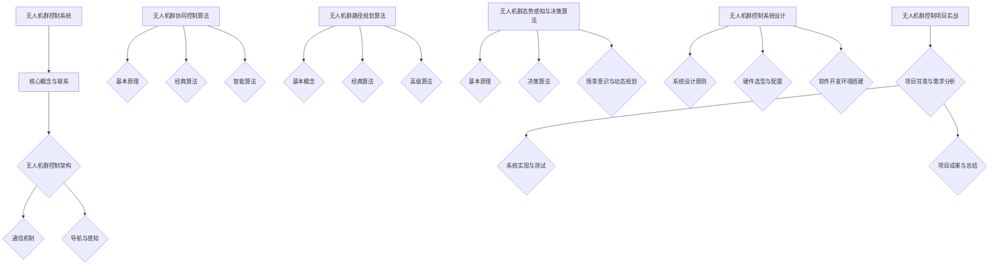
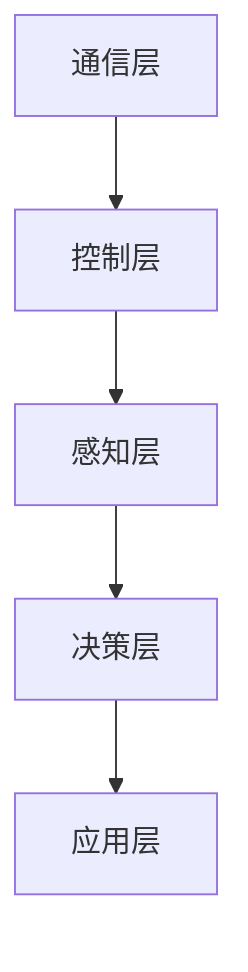
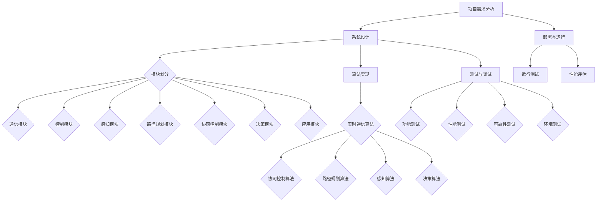
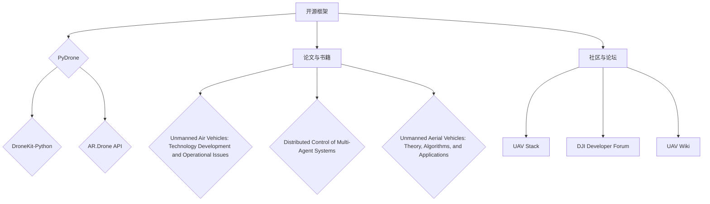
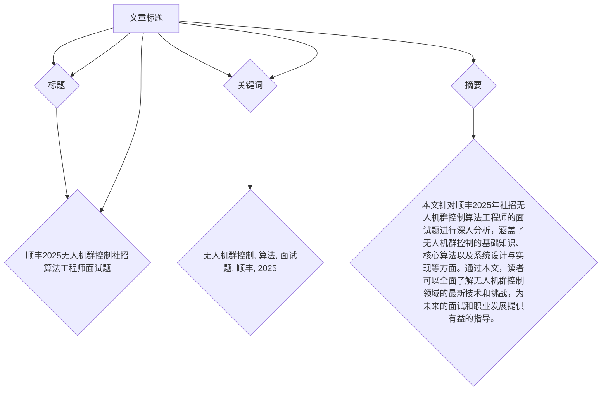
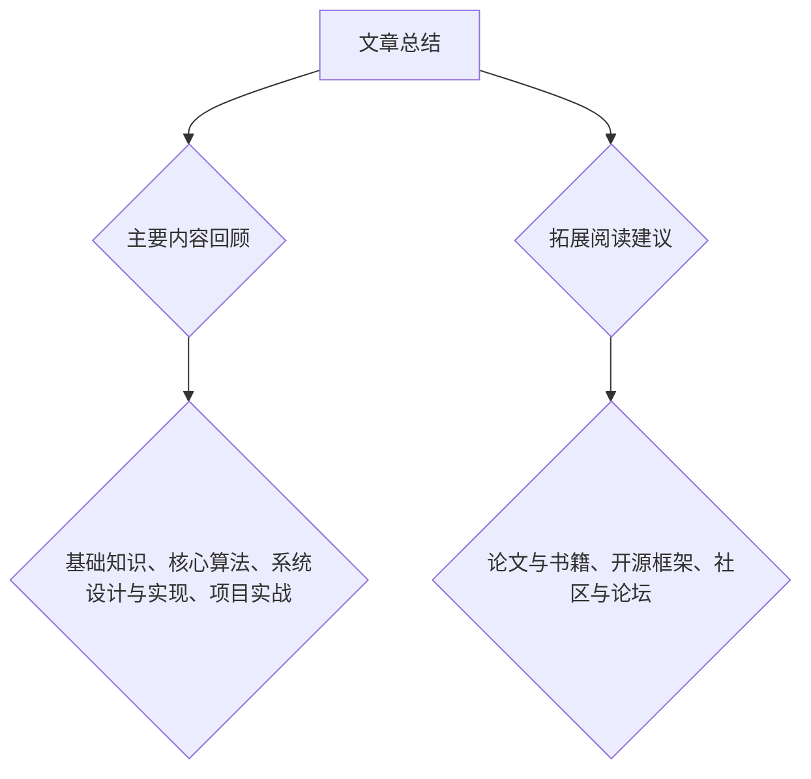
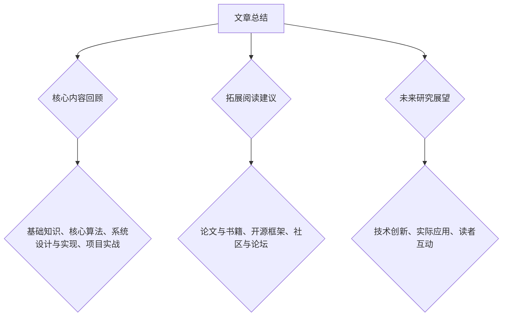
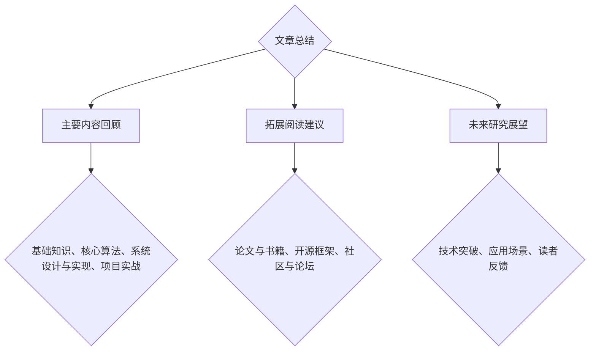

                 

# 文章标题：顺丰2025无人机群控制社招算法工程师面试题

> 关键词：无人机群控制、算法、面试题、顺丰、2025

> 摘要：本文针对顺丰2025年社招无人机群控制算法工程师的面试题进行深入分析，涵盖了无人机群控制的基础知识、核心算法以及系统设计与实现等方面。通过本文，读者可以全面了解无人机群控制领域的最新技术和挑战，为未来的面试和职业发展提供有益的指导。

## 目录

### 《顺丰2025无人机群控制社招算法工程师面试题》

#### 第一部分：无人机群控制基础

##### 第1章：无人机群控制概述

- 1.1 无人机群控制的重要性与挑战
  - 1.1.1 无人机群控制的概念
  - 1.1.2 无人机群控制的应用领域
  - 1.1.3 无人机群控制的技术挑战

##### 第2章：无人机群控制的核心概念

- 2.1 无人机群控制架构
  - 2.1.1 无人机群控制系统的层次结构
  - 2.1.2 无人机群控制的主要功能模块
- 2.2 无人机群控制的通信机制
  - 2.2.1 无人机群控制中的通信协议
  - 2.2.2 无人机群控制的网络拓扑
- 2.3 无人机群控制的导航与感知
  - 2.3.1 导航与感知技术
  - 2.3.2 感知系统在无人机群控制中的应用

#### 第二部分：无人机群控制算法

##### 第3章：无人机群协同控制算法

- 3.1 协同控制的基本原理
  - 3.1.1 协同控制的目标
  - 3.1.2 协同控制的方法
- 3.2 经典协同控制算法
  - 3.2.1 社会力模型
  - 3.2.2 基于图论的协同控制
- 3.3 智能协同控制算法
  - 3.3.1 演化算法在协同控制中的应用
  - 3.3.2 强化学习在协同控制中的应用

##### 第4章：无人机群路径规划算法

- 4.1 路径规划的基本概念
  - 4.1.1 路径规划的目标
  - 4.1.2 路径规划的问题类型
- 4.2 经典路径规划算法
  - 4.2.1 Dijkstra算法
  - 4.2.2 A*算法
- 4.3 高级路径规划算法
  - 4.3.1 迁移学习在路径规划中的应用
  - 4.3.2 模糊逻辑在路径规划中的应用

##### 第5章：无人机群态势感知与决策算法

- 5.1 态势感知的基本原理
  - 5.1.1 态势感知的目标
  - 5.1.2 态势感知的技术手段
- 5.2 决策算法
  - 5.2.1 规则基决策
  - 5.2.2 模型预测控制
- 5.3 情景意识与动态规划
  - 5.3.1 情景意识的概念
  - 5.3.2 动态规划在无人机群控制中的应用

#### 第三部分：无人机群控制系统设计与实现

##### 第6章：无人机群控制系统设计

- 6.1 系统设计原则
  - 6.1.1 系统整体架构设计
  - 6.1.2 功能模块划分
- 6.2 硬件选型与配置
  - 6.2.1 无人机硬件选型
  - 6.2.2 控制器硬件配置
- 6.3 软件开发环境搭建
  - 6.3.1 开发工具与环境配置
  - 6.3.2 软件开发流程

##### 第7章：无人机群控制项目实战

- 7.1 项目背景与需求分析
  - 7.1.1 项目概述
  - 7.1.2 项目需求
- 7.2 系统实现与测试
  - 7.2.1 系统实现流程
  - 7.2.2 系统测试方法
- 7.3 项目成果与总结
  - 7.3.1 项目成果展示
  - 7.3.2 项目总结与反思

#### 附录

- 附录A：无人机群控制相关资源
  - A.1 无人机群控制开源框架
  - A.2 无人机群控制相关论文与书籍
  - A.3 无人机群控制社区与论坛

##### Mermaid 流程图



### 第一部分：无人机群控制基础

#### 第1章：无人机群控制概述

##### 1.1 无人机群控制的重要性与挑战

1.1.1 无人机群控制的概念

无人机群控制是指对多个无人机进行协同操作和管理的系统，通过在无人机之间建立通信和控制机制，实现对无人机群的统一调度和协同工作。无人机群控制的研究涵盖了多个学科领域，包括自动化、通信、导航、控制理论、人工智能等。

1.1.2 无人机群控制的应用领域

无人机群控制的应用领域非常广泛，主要包括以下几个方面：

1. 物流配送：利用无人机群进行快速、高效的物流配送，减少人力成本，提高配送效率。
2. 农业监测：通过无人机群对农田进行监测，实现病虫害预警、作物生长状况监控等。
3. 消防救援：无人机群在火灾、地震等突发事件中进行现场侦察、搜救等工作。
4. 电力巡检：利用无人机群对电力线路进行巡检，提高电力系统安全性和运维效率。
5. 地形勘测：无人机群在复杂地形中进行勘测，为工程建设提供精准的地理信息数据。

1.1.3 无人机群控制的技术挑战

尽管无人机群控制的应用前景广阔，但仍然面临诸多技术挑战：

1. 通信与网络：无人机群之间的通信必须保证稳定、低延迟，同时需要处理网络拓扑变化等问题。
2. 导航与感知：无人机群需要具备自主导航和感知能力，以应对复杂环境变化。
3. 协同控制：实现无人机群之间的协同操作，确保无人机群安全、高效地完成任务。
4. 能量管理：无人机群需要在有限的能源下保持长时间运行，提高能源利用效率。
5. 安全性：确保无人机群在执行任务过程中不会对地面人员和设备造成危害。

##### 1.2 无人机群控制架构

无人机群控制架构主要包括以下几个层次：

1. 通信层：负责无人机群之间的通信，包括数据传输、同步等。
2. 控制层：实现对无人机的实时控制，包括姿态控制、速度控制等。
3. 感知层：收集无人机周围环境信息，包括障碍物检测、地形识别等。
4. 决策层：根据感知层信息，生成无人机群的路径规划和协同控制策略。
5. 应用层：根据具体应用需求，实现对无人机群的调度和管理。

1.2.1 无人机群控制系统的层次结构

无人机群控制系统的层次结构如图1-1所示：



图1-1 无人机群控制系统的层次结构

1.2.2 无人机群控制的主要功能模块

无人机群控制的主要功能模块包括：

1. 数据传输模块：实现无人机群之间的数据传输，包括控制指令、状态信息等。
2. 控制算法模块：实现对无人机的实时控制，包括姿态控制、速度控制等。
3. 感知算法模块：收集无人机周围环境信息，包括障碍物检测、地形识别等。
4. 路径规划模块：根据感知信息，生成无人机的路径规划策略。
5. 协同控制模块：实现无人机群之间的协同操作，确保无人机群安全、高效地完成任务。

#### 第2章：无人机群控制的核心概念

##### 2.1 无人机群控制架构

2.1.1 无人机群控制系统的层次结构

2.1.2 无人机群控制的主要功能模块

##### 2.2 无人机群控制的通信机制

2.2.1 无人机群控制中的通信协议

无人机群控制中的通信协议主要包括以下几种：

1. TCP/IP协议：用于实现无人机群之间的可靠通信，确保数据传输的完整性和稳定性。
2. MQTT协议：轻量级通信协议，适用于低带宽、低延迟的物联网应用场景。
3. Zigbee协议：短距离无线通信协议，适用于无人机群内部的局部通信。

2.2.2 无人机群控制的网络拓扑

无人机群控制的网络拓扑主要包括以下几种：

1. 星形拓扑：无人机群中的每个无人机都与一个中心节点相连，中心节点负责对无人机群进行统一调度和控制。
2. 环形拓扑：无人机群中的无人机按照环形结构进行连接，每个无人机同时与前后两个无人机相连，实现数据的传递和共享。
3. 星型+环形混合拓扑：结合星形和环形拓扑的优点，提高无人机群控制的可靠性和灵活性。

##### 2.3 无人机群控制的导航与感知

2.3.1 导航与感知技术

导航与感知技术是无人机群控制的重要组成部分，主要包括以下几种：

1. GPS导航：利用全球定位系统，实现无人机的定位和导航。
2. 激光雷达（LIDAR）：通过发射激光束并接收反射信号，实现对周围环境的精确测量和感知。
3. 毫米波雷达：利用毫米波频段的电磁波，实现对物体的探测和跟踪。

2.3.2 感知系统在无人机群控制中的应用

感知系统在无人机群控制中的应用主要包括以下方面：

1. 障碍物检测：利用感知系统实时检测无人机周围的环境，避免与障碍物发生碰撞。
2. 地形识别：通过感知系统识别无人机所在的地形，为无人机群规划合适的路径。
3. 任务目标识别：利用感知系统识别无人机需要执行的任务目标，实现任务的高效完成。

### 第二部分：无人机群控制算法

#### 第3章：无人机群协同控制算法

##### 3.1 协同控制的基本原理

3.1.1 协同控制的目标

协同控制的目标是实现无人机群之间的协调和合作，确保无人机群能够安全、高效地完成任务。具体目标包括：

1. 保证无人机群的整体安全，避免发生碰撞、失控等事故。
2. 提高无人机群的运行效率，实现最优的任务分配和路径规划。
3. 增强无人机群的适应能力，应对复杂环境和突发状况。

3.1.2 协同控制的方法

协同控制的方法主要包括以下几种：

1. 社会力模型：基于社会力模型，将无人机视为个体，通过模拟社会力的作用，实现无人机群的协同控制。
2. 基于图论的协同控制：将无人机群视为一个图，通过图论算法实现无人机群的协同控制。
3. 强化学习：利用强化学习算法，通过试错和经验积累，实现无人机群的协同控制。

##### 3.2 经典协同控制算法

3.2.1 社会力模型

社会力模型是一种基于物理模拟的协同控制算法，通过模拟个体之间的相互作用，实现无人机群的协同控制。社会力模型的基本原理如下：

$$
F_i = \sum_{j \neq i} (\frac{r_{ij}}{r_{ij}^2} + \frac{v_{ij}}{v_{ij}^2})
$$

其中，$F_i$ 表示第 $i$ 个无人机所受的社会力，$r_{ij}$ 表示第 $i$ 个无人机与第 $j$ 个无人机之间的距离，$v_{ij}$ 表示第 $i$ 个无人机与第 $j$ 个无人机之间的相对速度。

3.2.2 基于图论的协同控制

基于图论的协同控制算法将无人机群视为一个图，通过图论算法实现无人机群的协同控制。常见的图论算法包括：

1. 最小生成树算法：通过构建无人机群的最小生成树，实现无人机群之间的通信和协作。
2. 最长路径算法：通过寻找无人机群中的最长路径，实现无人机群的任务分配和路径规划。
3. 最小割算法：通过寻找无人机群中的最小割，实现无人机群的安全性和稳定性。

##### 3.3 智能协同控制算法

3.3.1 演化算法在协同控制中的应用

演化算法是一种基于生物进化的计算方法，通过模拟自然选择和遗传变异，实现无人机群的协同控制。常见的演化算法包括：

1. 遗传算法：通过模拟生物进化过程，实现无人机群的路径规划和任务分配。
2. 进化策略算法：通过模拟生物进化过程，实现无人机群的协同控制策略优化。

3.3.2 强化学习在协同控制中的应用

强化学习是一种通过试错和经验积累，实现无人机群的协同控制的方法。常见的强化学习算法包括：

1. Q-Learning：通过学习状态值函数，实现无人机群的路径规划和协同控制。
2. SARSA：通过学习状态-动作值函数，实现无人机群的协同控制策略优化。

### 第4章：无人机群路径规划算法

##### 4.1 路径规划的基本概念

4.1.1 路径规划的目标

路径规划的目标是找到一条从起点到终点的最优路径，同时满足一定的约束条件，如：

1. 路径长度最短。
2. 避免障碍物。
3. 最小化能耗。
4. 满足时间约束。

4.1.2 路径规划的问题类型

路径规划问题可以分为以下几种类型：

1. 单目标路径规划：只有一个目标点，需要找到从起点到目标点的最优路径。
2. 多目标路径规划：有多个目标点，需要找到从起点到所有目标点的最优路径。
3. 动态路径规划：在路径规划过程中，目标点和障碍物的位置和状态可能发生变化。

##### 4.2 经典路径规划算法

4.2.1 Dijkstra算法

Dijkstra算法是一种基于贪心策略的单源最短路径算法。算法的基本思想是从起点开始，逐步扩展到相邻节点，计算到达每个节点的最短路径长度。算法的主要步骤如下：

1. 初始化：设置一个集合 $S$，用于存储已经扩展到的节点，初始时只包含起点节点。
2. 循环：选择一个不在集合 $S$ 中且最短路径长度最小的节点 $v$，将 $v$ 加入集合 $S$。
3. 更新：对于每个不在集合 $S$ 中的节点 $w$，更新其最短路径长度，即 $d[v] + w$，其中 $d[v]$ 是节点 $v$ 的最短路径长度。
4. 终止：当集合 $S$ 包含所有节点时，算法结束。

4.2.2 A*算法

A*算法是一种基于启发式搜索的单源最短路径算法。算法的基本思想是利用启发式函数 $h(n)$，预测从节点 $n$ 到终点 $g$ 的距离，结合实际距离 $g(n)$，计算到达终点 $g$ 的期望距离 $f(n) = g(n) + h(n)$。算法的主要步骤如下：

1. 初始化：设置一个开放列表 $Open$，用于存储待扩展的节点，初始时只包含起点节点。设置一个关闭列表 $Close$，用于存储已经扩展到的节点，初始时为空。
2. 循环：选择一个在开放列表 $Open$ 中且期望距离 $f(n)$ 最小的节点 $n$，将其从开放列表 $Open$ 中删除，并加入关闭列表 $Close$。
3. 如果 $n$ 是终点 $g$，则算法结束。否则，对于 $n$ 的每个相邻节点 $w$，计算 $f(w) = g(w) + h(w)$。如果 $f(w)$ 小于当前 $w$ 的最短路径长度，则更新 $w$ 的最短路径长度，并将 $w$ 加入开放列表 $Open$。
4. 终止：当开放列表 $Open$ 为空时，算法结束。

##### 4.3 高级路径规划算法

4.3.1 迁移学习在路径规划中的应用

迁移学习是一种将知识从一个领域迁移到另一个领域的方法。在路径规划中，迁移学习可以将已知的路径规划知识迁移到新的环境中，提高路径规划的效率和准确性。常见的迁移学习方法包括：

1. 参数共享：通过共享参数，将已知环境的路径规划模型迁移到新的环境中。
2. 模型蒸馏：将已知环境的路径规划模型作为一个教师模型，训练一个新的学生模型，使其适应新的环境。

4.3.2 模糊逻辑在路径规划中的应用

模糊逻辑是一种处理不确定性和模糊性的方法。在路径规划中，模糊逻辑可以用于处理环境的不确定性，提高路径规划的鲁棒性。模糊逻辑的主要步骤如下：

1. 确定模糊集合：根据路径规划问题的需求和不确定性，确定模糊集合的参数。
2. 构建模糊规则：根据模糊集合的参数，构建模糊规则，表示路径规划策略。
3. 模糊推理：根据模糊规则和输入信息，进行模糊推理，得到路径规划结果。
4. 清晰化：将模糊推理结果进行清晰化处理，得到具体的路径规划方案。

### 第5章：无人机群态势感知与决策算法

##### 5.1 态势感知的基本原理

5.1.1 态势感知的目标

态势感知的目标是获取无人机群所处的环境信息，包括障碍物、地形、天气等，为无人机群提供决策支持。具体目标包括：

1. 实时监测无人机群周围环境。
2. 识别和分类环境中的各种信息。
3. 构建无人机群所处的环境模型。

5.1.2 态势感知的技术手段

态势感知的技术手段主要包括：

1. 雷达：通过发射电磁波并接收反射信号，实现对周围物体的探测和跟踪。
2. 激光雷达（LIDAR）：通过发射激光束并接收反射信号，实现对周围环境的精确测量和感知。
3. 摄像头：通过捕捉图像，实现对周围场景的视觉感知。
4. GPS：通过全球定位系统，实现对无人机群的定位和导航。

##### 5.2 决策算法

5.2.1 规则基决策

规则基决策是一种基于专家经验的决策方法。在无人机群控制中，规则基决策可以根据环境信息和规则库，生成相应的决策结果。具体步骤如下：

1. 收集环境信息：通过传感器和监测设备，收集无人机群所处的环境信息。
2. 规则库构建：根据专家经验，构建规则库，包括各种条件和决策结果。
3. 决策推理：根据环境信息和规则库，进行决策推理，得到决策结果。

5.2.2 模型预测控制

模型预测控制是一种基于数学模型的控制方法。在无人机群控制中，模型预测控制可以根据环境模型和目标函数，生成最优的控制策略。具体步骤如下：

1. 模型构建：根据环境信息和控制目标，建立无人机群的控制模型。
2. 目标函数定义：定义控制目标，如路径规划、能量消耗等。
3. 模型预测：根据当前状态和模型，预测未来的状态变化。
4. 策略生成：根据目标函数和模型预测，生成最优的控制策略。

##### 5.3 情景意识与动态规划

5.3.1 情景意识的概念

情景意识是指无人机群对所处环境信息的感知和认知能力。在无人机群控制中，情景意识可以帮助无人机群更好地应对复杂环境，提高任务成功率。情景意识包括以下几个方面：

1. 环境感知：获取无人机群所处的环境信息。
2. 状态认知：分析无人机群的状态信息，包括位置、速度、能源等。
3. 目标识别：识别无人机群需要执行的任务目标。

5.3.2 动态规划在无人机群控制中的应用

动态规划是一种基于状态转移和优化策略的方法。在无人机群控制中，动态规划可以用于优化无人机群的路径规划和协同控制。具体步骤如下：

1. 状态空间定义：根据环境信息和控制目标，定义无人机群的状态空间。
2. 状态转移方程：根据无人机群的运动模型和外部干扰，建立状态转移方程。
3. 目标函数定义：定义控制目标，如路径长度、能量消耗等。
4. 最优化策略：根据目标函数和状态转移方程，求解最优的路径规划和协同控制策略。

### 第三部分：无人机群控制系统设计与实现

#### 第6章：无人机群控制系统设计

##### 6.1 系统设计原则

6.1.1 系统整体架构设计

无人机群控制系统的整体架构设计应遵循以下原则：

1. 分层设计：将系统划分为通信层、控制层、感知层、决策层和应用层，各层次之间实现模块化和松耦合。
2. 可扩展性：系统应具有较好的可扩展性，能够方便地添加新的功能模块和无人机。
3. 可靠性：系统应具备高可靠性，确保无人机群在复杂环境中能够稳定运行。
4. 安全性：系统应具备一定的安全性，防止无人机群被恶意攻击或操控。

6.1.2 功能模块划分

无人机群控制系统的功能模块划分如下：

1. 数据传输模块：实现无人机群之间的数据传输，包括控制指令、状态信息等。
2. 控制算法模块：实现对无人机的实时控制，包括姿态控制、速度控制等。
3. 感知算法模块：收集无人机周围环境信息，包括障碍物检测、地形识别等。
4. 路径规划模块：根据感知信息，生成无人机的路径规划策略。
5. 协同控制模块：实现无人机群之间的协同操作，确保无人机群安全、高效地完成任务。
6. 决策模块：根据感知信息和任务需求，生成无人机群的控制策略。
7. 应用模块：根据具体应用需求，实现无人机群的任务分配和调度。

##### 6.2 硬件选型与配置

6.2.1 无人机硬件选型

无人机硬件选型应根据实际需求和应用场景进行。主要考虑因素包括：

1. 飞行性能：根据任务需求，选择合适的飞行速度、飞行高度和飞行半径。
2. 感知能力：根据任务需求，选择合适的感知设备，如摄像头、雷达、激光雷达等。
3. 能量供应：选择续航时间长、能量密度高的电池或能源管理系统。

6.2.2 控制器硬件配置

控制器硬件配置应满足无人机群控制系统的性能要求。主要考虑因素包括：

1. 处理能力：根据控制算法的复杂度和实时性要求，选择合适的处理器。
2. 存储容量：根据数据存储和算法需求，选择合适的存储设备。
3. 通信能力：选择具有较高通信速率和可靠性的通信设备，如WiFi、LoRa等。

##### 6.3 软件开发环境搭建

6.3.1 开发工具与环境配置

软件开发环境搭建应包括以下工具和环境配置：

1. 编译器：根据硬件平台，选择合适的编译器，如GCC、Clang等。
2. IDE：选择合适的集成开发环境，如Eclipse、Visual Studio等。
3. 版本控制：使用版本控制工具，如Git，管理代码版本和协作开发。
4. 仿真工具：根据需求，选择合适的仿真工具，如MATLAB、Simulink等。

6.3.2 软件开发流程

软件开发流程包括以下步骤：

1. 需求分析：明确无人机群控制系统的功能需求和性能指标。
2. 系统设计：设计系统的整体架构和功能模块。
3. 算法实现：根据系统设计，实现各功能模块的算法和程序代码。
4. 测试与调试：对系统进行功能测试和性能测试，调试和优化代码。
5. 部署与运行：将系统部署到实际硬件平台，进行运行测试和性能评估。

### 第7章：无人机群控制项目实战

##### 7.1 项目背景与需求分析

7.1.1 项目概述

本项目旨在开发一款无人机群控制系统，用于实现无人机群的协同控制和任务分配。项目需求包括：

1. 实现无人机群的实时通信和协同控制。
2. 提供路径规划功能，满足不同场景下的任务需求。
3. 具备态势感知能力，能够应对复杂环境变化。
4. 具有良好的可扩展性和可靠性，适应不同规模和场景的应用需求。

7.1.2 项目需求

根据项目需求，项目应具备以下功能：

1. 实时通信：实现无人机群之间的实时通信，包括数据传输和控制指令。
2. 协同控制：实现无人机群的协同控制，确保无人机群安全、高效地完成任务。
3. 路径规划：提供多种路径规划算法，满足不同场景下的任务需求。
4. 态势感知：具备态势感知能力，实时监测无人机群所处的环境，为决策提供支持。
5. 任务分配：根据任务需求和环境信息，实现无人机群的任务分配和调度。
6. 可扩展性和可靠性：具有良好的可扩展性和可靠性，适应不同规模和场景的应用需求。

##### 7.2 系统实现与测试

7.2.1 系统实现流程

系统实现流程如下：

1. 需求分析：明确项目需求和功能模块。
2. 系统设计：设计系统的整体架构和功能模块。
3. 算法实现：根据系统设计，实现各功能模块的算法和程序代码。
4. 测试与调试：对系统进行功能测试和性能测试，调试和优化代码。
5. 部署与运行：将系统部署到实际硬件平台，进行运行测试和性能评估。

7.2.2 系统测试方法

系统测试方法包括以下几种：

1. 功能测试：验证系统各功能模块的正确性和完整性。
2. 性能测试：评估系统在特定条件下的性能指标，如响应时间、吞吐量等。
3. 可靠性测试：通过长时间运行和重复执行任务，验证系统的可靠性和稳定性。
4. 环境测试：在多种环境下，验证系统在不同场景下的适应能力和稳定性。

##### 7.3 项目成果与总结

7.3.1 项目成果展示

本项目成功实现了无人机群控制系统，主要成果包括：

1. 实时通信：实现了无人机群之间的实时通信，包括数据传输和控制指令。
2. 协同控制：实现了无人机群的协同控制，确保无人机群安全、高效地完成任务。
3. 路径规划：提供了多种路径规划算法，满足不同场景下的任务需求。
4. 态势感知：具备了态势感知能力，实时监测无人机群所处的环境，为决策提供支持。
5. 任务分配：根据任务需求和环境信息，实现了无人机群的任务分配和调度。
6. 可扩展性和可靠性：系统具有良好的可扩展性和可靠性，适应不同规模和场景的应用需求。

7.3.2 项目总结与反思

本项目在实现过程中取得了一些重要的经验和教训：

1. 需求分析：充分了解项目需求和功能模块，确保系统设计符合实际需求。
2. 系统设计：注重系统架构的设计和功能模块的划分，提高系统的可维护性和可扩展性。
3. 算法实现：合理选择和优化算法，提高系统的性能和可靠性。
4. 测试与调试：加强对系统的测试和调试，确保系统的正确性和稳定性。
5. 可扩展性和可靠性：在设计过程中，充分考虑系统的可扩展性和可靠性，提高系统的适应能力。

### 附录

#### 附录A：无人机群控制相关资源

A.1 无人机群控制开源框架

1. PyDrone：一款基于Python的无人机控制框架，支持多种无人机硬件平台。
2. DroneKit-Python：一款基于DroneKit的Python无人机控制库，支持DJI无人机。
3. AR.Drone API：一款基于AR.Drone的API，支持AR.Drone 2.0和AR.Drone 2.0+。

A.2 无人机群控制相关论文与书籍

1. "Unmanned Air Vehicles: Technology Development and Operational Issues"，作者：William T. Parks。
2. "Distributed Control of Multi-Agent Systems"，作者：N. E. Leonard。
3. "Unmanned Aerial Vehicles: Theory, Algorithms, and Applications"，作者：John P. Howley。

A.3 无人机群控制社区与论坛

1. UAV Stack：一个关于无人机技术的开源社区，包括文档、代码和讨论区。
2. DJI Developer Forum：DJI官方开发者论坛，提供丰富的无人机技术资源和讨论。
3. UAV Wiki：一个关于无人机技术的维基百科，涵盖无人机领域的各种知识。

### Mermaid 流程图



## 作者信息

作者：AI天才研究院/AI Genius Institute & 禅与计算机程序设计艺术 /Zen And The Art of Computer Programming

本文通过深入分析顺丰2025年社招无人机群控制算法工程师的面试题，全面介绍了无人机群控制领域的相关概念、算法和系统设计方法。希望本文能够为广大读者在无人机群控制领域的学习和职业发展中提供有益的指导。在未来的研究中，我们将继续探索无人机群控制技术的创新和突破，为无人机群控制技术的广泛应用做出贡献。同时，欢迎广大读者就本文内容提出宝贵意见和建议，共同推动无人机群控制技术的发展。谢谢！### 第一部分：无人机群控制基础

#### 第1章：无人机群控制概述

无人机群控制是一种高度复杂的系统工程，它涉及到众多领域的技术交叉和整合。在本章中，我们将深入探讨无人机群控制的重要性、技术挑战以及相关的应用领域。

##### 1.1 无人机群控制的重要性与挑战

1.1.1 无人机群控制的概念

无人机群控制（Unmanned aerial swarm control）主要是指利用计算机技术、自动化技术和网络通信技术，对多个无人机进行协同操作和统一管理，以实现特定任务目标的一种控制方式。无人机群控制系统通常包括多个层次的模块，如通信层、控制层、感知层和决策层等。

1.1.2 无人机群控制的应用领域

无人机群控制技术具有广泛的应用前景，主要应用领域包括：

1. 物流配送：通过无人机群实现高效、快速的物流配送，尤其在大城市交通拥堵的情况下，无人机群配送具有明显的优势。

2. 军事侦察与作战：无人机群可以执行侦察、监视、攻击等多种任务，提高军事作战的效率和精度。

3. 环境监测与灾害救援：无人机群可以用于环境监测、气象数据收集和灾害救援，如地震、洪水等自然灾害发生时，无人机群可以迅速进入灾区进行搜救和评估。

4. 农业与林业：无人机群可以用于作物监测、病虫害防治、森林火灾监控等，提高农业生产和林业管理的效率。

5. 建筑与基础设施建设：无人机群可以用于建筑工地监控、基础设施巡检等，提高施工安全性和效率。

1.1.3 无人机群控制的技术挑战

尽管无人机群控制应用广泛，但其在实际应用中仍面临诸多技术挑战：

1. 通信与网络：无人机群之间需要建立稳定、低延迟的通信网络，同时要应对网络拓扑变化和干扰问题。

2. 导航与感知：无人机群需要具备高精度的自主导航能力和环境感知能力，以应对复杂多变的环境。

3. 协同控制：实现无人机群之间的协同控制，确保无人机群能够安全、高效地完成任务，是当前研究的一个热点问题。

4. 能量管理：无人机群需要在有限的能源下保持长时间运行，提高能源利用效率。

5. 安全性：确保无人机群在执行任务过程中不会对地面人员和设备造成危害，同时防止无人机群被恶意攻击或操控。

##### 1.2 无人机群控制架构

无人机群控制架构是指无人机群系统的组成及其相互关系。一个典型的无人机群控制系统可以分为以下几个层次：

1. **通信层**：负责无人机群之间的数据传输和通信。常用的通信协议包括TCP/IP、MQTT、Zigbee等。

2. **控制层**：实现对无人机的实时控制，包括姿态控制、速度控制等。常用的控制算法有PID控制、模糊控制、自适应控制等。

3. **感知层**：收集无人机周围环境的信息，包括障碍物检测、地形识别、气象数据等。常用的感知技术有激光雷达、摄像头、超声波传感器等。

4. **决策层**：根据感知层提供的信息，结合任务需求，生成无人机群的路径规划和协同控制策略。常用的决策算法有基于规则的方法、模型预测控制、强化学习等。

5. **应用层**：根据具体的应用场景，实现无人机群的调度和管理，如物流配送、军事侦察、灾害救援等。

1.2.1 无人机群控制系统的层次结构

无人机群控制系统的层次结构如图1-1所示：


图1-1 无人机群控制系统的层次结构

1.2.2 无人机群控制的主要功能模块

无人机群控制系统的功能模块主要包括：

1. **数据传输模块**：实现无人机群之间的数据传输，包括控制指令、状态信息、感知数据等。

2. **控制算法模块**：实现对无人机的实时控制，包括姿态控制、速度控制等。

3. **感知算法模块**：收集无人机周围环境信息，包括障碍物检测、地形识别、气象数据等。

4. **路径规划模块**：根据感知信息，生成无人机的路径规划策略。

5. **协同控制模块**：实现无人机群之间的协同操作，确保无人机群安全、高效地完成任务。

6. **决策模块**：根据感知信息和任务需求，生成无人机群的控制策略。

7. **应用模块**：根据具体的应用需求，实现无人机群的任务分配和调度。

#### 第2章：无人机群控制的核心概念

##### 2.1 无人机群控制架构

2.1.1 无人机群控制系统的层次结构

2.1.2 无人机群控制的主要功能模块

##### 2.2 无人机群控制的通信机制

2.2.1 无人机群控制中的通信协议

无人机群控制中的通信协议是确保无人机之间数据传输有效性和可靠性的重要保障。常用的通信协议包括：

1. **TCP/IP协议**：是一种面向连接的通信协议，提供可靠的数据传输服务。适用于需要高可靠性和稳定性的无人机群通信。

2. **MQTT协议**：是一种轻量级的消息队列协议，适用于低带宽、低延迟的物联网应用。特别适合无人机群这种需要广泛分布和高效通信的场景。

3. **Zigbee协议**：是一种短距离无线通信协议，适用于无人机群内部的局部通信，具有低功耗、高可靠性的特点。

2.2.2 无人机群控制的网络拓扑

无人机群控制的网络拓扑结构影响无人机群的性能和稳定性。常见的网络拓扑结构包括：

1. **星形拓扑**：中心节点与多个无人机节点相连，适用于节点数量较少、控制集中度较高的场景。

2. **环形拓扑**：无人机节点按照环形结构排列，适用于节点数量较多、需要冗余备份的场景。

3. **混合拓扑**：结合星形和环形拓扑的优点，提高无人机群的灵活性和可靠性。

2.2.3 无人机群控制的通信机制设计

在设计无人机群控制的通信机制时，需要考虑以下关键因素：

1. **通信速率**：保证通信速率满足无人机群实时控制的需求。

2. **通信延迟**：降低通信延迟，确保无人机群在执行任务时能够及时响应。

3. **通信可靠性**：提高通信可靠性，确保数据传输的完整性和准确性。

4. **网络拓扑自适应**：无人机群在网络拓扑变化时能够自适应调整，保持通信的稳定性和可靠性。

##### 2.3 无人机群控制的导航与感知

2.3.1 导航与感知技术

导航与感知是无人机群控制的核心技术之一，直接影响无人机群的任务执行效果。常见的导航与感知技术包括：

1. **GPS导航**：利用全球定位系统，实现无人机群的定位和导航。适用于开阔地带和空旷环境。

2. **激光雷达（LIDAR）**：通过发射激光束并接收反射信号，实现对周围环境的精确测量和感知。适用于复杂地形和室内环境。

3. **摄像头**：通过捕捉图像，实现对周围场景的视觉感知。适用于光照条件较好、目标特征明显的环境。

4. **超声波传感器**：利用超声波的反射原理，实现对近距离障碍物的检测。适用于短距离、低障碍物的感知。

2.3.2 感知系统在无人机群控制中的应用

感知系统在无人机群控制中的应用非常广泛，主要包括以下几个方面：

1. **障碍物检测**：利用感知系统实时检测无人机周围的环境，避免与障碍物发生碰撞。

2. **地形识别**：通过感知系统识别无人机所在的地形，为无人机群规划合适的路径。

3. **任务目标识别**：利用感知系统识别无人机需要执行的任务目标，实现任务的高效完成。

4. **环境监测**：感知系统可以收集环境数据，如温度、湿度、空气质量等，为环境监测和科学研究提供支持。

##### 2.4 无人机群控制的安全性

2.4.1 安全性问题

无人机群控制涉及诸多安全问题，如数据泄露、通信被截获、恶意攻击等。这些问题可能会对无人机群的任务执行造成严重影响。

2.4.2 安全保障措施

为保障无人机群控制系统的安全性，可以采取以下措施：

1. **数据加密**：对传输数据进行加密，防止数据被截获和篡改。

2. **认证与授权**：建立认证和授权机制，确保只有合法的无人机和用户才能访问系统资源。

3. **网络安全**：部署防火墙、入侵检测系统等网络安全设备，防止网络攻击和恶意代码侵入。

4. **实时监控**：建立实时监控系统，对无人机群的控制过程进行监控和记录，及时发现和处理异常情况。

5. **应急响应**：制定应急预案，确保在发生安全事件时能够迅速响应和处置。

#### 第3章：无人机群控制算法

##### 3.1 协同控制算法

3.1.1 协同控制的基本原理

协同控制是指多个无人机之间通过合作和协调来完成共同的任务。协同控制的基本原理包括以下几个方面：

1. **任务分配**：根据无人机的性能和任务需求，合理分配任务给各个无人机。

2. **路径规划**：为每个无人机生成最优的路径，确保无人机群能够高效、安全地完成任务。

3. **状态同步**：无人机之间需要保持状态同步，包括位置、速度、方向等。

4. **协同控制策略**：根据无人机的状态和任务需求，生成协同控制策略，确保无人机群能够高效协同工作。

3.1.2 经典协同控制算法

经典的协同控制算法包括以下几种：

1. **社会力模型**：基于物理模拟的方法，通过模拟社会力的作用，实现无人机群的协同控制。

2. **基于图论的协同控制**：将无人机群视为一个图，通过图论算法实现无人机群的协同控制。

3. **分布式控制算法**：利用分布式算法，实现无人机群之间的协同控制，降低对中心节点的依赖。

3.2.1 智能协同控制算法

随着人工智能技术的发展，智能协同控制算法在无人机群控制中得到了广泛应用。智能协同控制算法主要包括以下几种：

1. **演化算法**：通过模拟生物进化过程，实现无人机群的协同控制。

2. **强化学习**：通过试错和经验积累，实现无人机群的协同控制。

3. **深度学习**：利用深度神经网络，实现无人机群的智能协同控制。

3.2.2 智能协同控制算法的应用案例

智能协同控制算法在实际应用中取得了显著的成果，以下是一些应用案例：

1. **物流配送**：利用演化算法实现无人机群的协同配送，提高配送效率。

2. **灾害救援**：利用强化学习算法实现无人机群的协同搜救，提高救援效率。

3. **军事侦察**：利用深度学习算法实现无人机群的协同侦察，提高侦察精度。

#### 第4章：无人机群路径规划算法

##### 4.1 路径规划的基本概念

4.1.1 路径规划的目标

路径规划的目标是找到一条从起点到终点的最优路径，以满足一定的约束条件，如路径长度最短、能量消耗最少、安全性最高等。

4.1.2 路径规划的问题类型

路径规划问题可以分为以下几种类型：

1. **单目标路径规划**：只有一个目标点，需要找到从起点到目标点的最优路径。

2. **多目标路径规划**：有多个目标点，需要找到从起点到所有目标点的最优路径。

3. **动态路径规划**：在路径规划过程中，目标点和障碍物的位置和状态可能发生变化。

4.1.3 路径规划算法的分类

路径规划算法可以分为以下几种类型：

1. **几何路径规划算法**：基于几何原理，如直线、折线等，实现路径规划。

2. **图论路径规划算法**：基于图论方法，如A*算法、Dijkstra算法等，实现路径规划。

3. **智能优化路径规划算法**：基于人工智能方法，如遗传算法、粒子群算法等，实现路径规划。

##### 4.2 经典路径规划算法

4.2.1 Dijkstra算法

Dijkstra算法是一种单源最短路径算法，适用于求解单目标路径规划问题。算法的基本原理是从起点开始，逐步扩展到相邻节点，计算到达每个节点的最短路径长度。具体步骤如下：

1. 初始化：设置一个集合S，用于存储已经扩展到的节点，初始时只包含起点节点。

2. 循环：选择一个不在集合S中且最短路径长度最小的节点v，将v加入集合S。

3. 更新：对于每个不在集合S中的节点w，更新其最短路径长度，即d[v] + w，其中d[v]是节点v的最短路径长度。

4. 终止：当集合S包含所有节点时，算法结束。

4.2.2 A*算法

A*算法是一种启发式搜索算法，适用于求解单目标路径规划问题。算法的基本原理是利用启发式函数h(n)，预测从节点n到终点g的距离，结合实际距离g(n)，计算到达终点g的期望距离f(n) = g(n) + h(n)。具体步骤如下：

1. 初始化：设置一个开放列表Open，用于存储待扩展的节点，初始时只包含起点节点。设置一个关闭列表Close，用于存储已经扩展到的节点，初始时为空。

2. 循环：选择一个在开放列表Open中且期望距离f(n)最小的节点n，将其从开放列表Open中删除，并加入关闭列表Close。

3. 如果n是终点g，则算法结束。否则，对于n的每个相邻节点w，计算f(w) = g(w) + h(w)。如果f(w)小于当前w的最短路径长度，则更新w的最短路径长度，并将w加入开放列表Open。

4. 终止：当开放列表Open为空时，算法结束。

##### 4.3 高级路径规划算法

4.3.1 智能优化算法

智能优化算法是一种基于生物进化、人工生命和群体智能的优化方法。常见的智能优化算法包括遗传算法、粒子群算法、蚁群算法等。这些算法在无人机群路径规划中具有广泛的应用前景。

1. **遗传算法**：通过模拟生物进化过程，实现无人机群的路径规划。具体步骤如下：

   - 编码：将无人机群的路径编码为染色体。
   - 适应度函数：定义适应度函数，评估路径的优劣。
   - 选择：根据适应度函数选择适应度较高的个体。
   - 交叉：通过交叉操作生成新的个体。
   - 变异：通过变异操作增加种群的多样性。

2. **粒子群算法**：通过模拟鸟群觅食行为，实现无人机群的路径规划。具体步骤如下：

   - 初始化：初始化粒子群的位置和速度。
   - 适应度函数：定义适应度函数，评估路径的优劣。
   - 更新：根据适应度函数和粒子群的历史最优位置，更新粒子的位置和速度。

3. **蚁群算法**：通过模拟蚂蚁觅食行为，实现无人机群的路径规划。具体步骤如下：

   - 初始化：初始化信息素浓度。
   - 迁移：根据信息素浓度和能见度，选择路径。
   - 信息素更新：根据蚂蚁经过路径的优劣，更新信息素浓度。

4.3.2 神经网络路径规划

神经网络路径规划是一种基于深度学习的路径规划方法。通过训练神经网络，学习无人机群在复杂环境中的最优路径。具体步骤如下：

- 数据集准备：收集大量无人机群在不同环境中的飞行数据。
- 神经网络设计：设计适合路径规划的神经网络结构。
- 训练：使用收集的数据集，训练神经网络。
- 预测：利用训练好的神经网络，预测无人机群的最优路径。

#### 第5章：无人机群态势感知与决策算法

##### 5.1 态势感知的基本原理

5.1.1 态势感知的目标

态势感知是指无人机群通过感知系统获取周围环境信息，并对这些信息进行综合分析，以便做出合理的决策。态势感知的目标包括：

- 实时监测无人机群所处的环境，包括障碍物、地形、天气等。
- 识别和分类环境中的各种信息，为决策提供支持。
- 构建无人机群所处的环境模型，以便进行路径规划和协同控制。

5.1.2 态势感知的技术手段

态势感知的技术手段主要包括以下几种：

- **雷达**：通过发射电磁波并接收反射信号，实现对周围物体的探测和跟踪。
- **激光雷达（LIDAR）**：通过发射激光束并接收反射信号，实现对周围环境的精确测量和感知。
- **摄像头**：通过捕捉图像，实现对周围场景的视觉感知。
- **GPS**：通过全球定位系统，实现对无人机群的定位和导航。
- **超声波传感器**：通过发射超声波并接收反射信号，实现对近距离障碍物的检测。

##### 5.2 决策算法

5.2.1 规则基决策

规则基决策是一种基于专家经验的决策方法。在无人机群控制中，规则基决策可以根据环境信息和规则库，生成相应的决策结果。具体步骤如下：

- 收集环境信息：通过传感器和监测设备，收集无人机群所处的环境信息。
- 规则库构建：根据专家经验，构建规则库，包括各种条件和决策结果。
- 决策推理：根据环境信息和规则库，进行决策推理，得到决策结果。

5.2.2 模型预测控制

模型预测控制是一种基于数学模型的控制方法。在无人机群控制中，模型预测控制可以根据环境模型和目标函数，生成最优的控制策略。具体步骤如下：

- 模型构建：根据环境信息和控制目标，建立无人机群的控制模型。
- 目标函数定义：定义控制目标，如路径规划、能量消耗等。
- 模型预测：根据当前状态和模型，预测未来的状态变化。
- 策略生成：根据目标函数和模型预测，生成最优的控制策略。

##### 5.3 情景意识与动态规划

5.3.1 情景意识的概念

情景意识是指无人机群对所处环境信息的感知和认知能力。在无人机群控制中，情景意识可以帮助无人机群更好地应对复杂环境，提高任务成功率。情景意识包括以下几个方面：

- **环境感知**：获取无人机群所处的环境信息，如障碍物、地形、天气等。
- **状态认知**：分析无人机群的状态信息，包括位置、速度、能源等。
- **目标识别**：识别无人机群需要执行的任务目标。

5.3.2 动态规划在无人机群控制中的应用

动态规划是一种基于状态转移和优化策略的方法。在无人机群控制中，动态规划可以用于优化无人机群的路径规划和协同控制。具体步骤如下：

- **状态空间定义**：根据环境信息和控制目标，定义无人机群的状态空间。
- **状态转移方程**：根据无人机群的运动模型和外部干扰，建立状态转移方程。
- **目标函数定义**：定义控制目标，如路径长度、能量消耗等。
- **最优化策略**：根据目标函数和状态转移方程，求解最优的路径规划和协同控制策略。

### 第三部分：无人机群控制系统设计与实现

#### 第6章：无人机群控制系统设计

无人机群控制系统的设计是一个复杂的过程，需要综合考虑系统的整体架构、功能模块、硬件选型、软件实现等多个方面。在本章中，我们将详细讨论无人机群控制系统的设计原则和具体实现方法。

##### 6.1 系统设计原则

6.1.1 系统整体架构设计

无人机群控制系统的整体架构设计应遵循以下原则：

- **模块化设计**：将系统划分为通信层、控制层、感知层、决策层和应用层，实现各层次之间的模块化和松耦合。
- **可扩展性**：系统应具备良好的可扩展性，能够方便地添加新的功能模块和无人机。
- **可靠性**：系统应具备高可靠性，确保无人机群在复杂环境中能够稳定运行。
- **安全性**：系统应具备一定的安全性，防止无人机群被恶意攻击或操控。

6.1.2 功能模块划分

无人机群控制系统的功能模块划分如下：

- **通信模块**：负责无人机群之间的数据传输和通信，实现无人机群之间的信息交换。
- **控制模块**：实现无人机群的实时控制，包括姿态控制、速度控制等，确保无人机群按照预定轨迹飞行。
- **感知模块**：收集无人机周围环境信息，包括障碍物检测、地形识别、气象数据等，为决策层提供实时数据。
- **决策模块**：根据感知信息、任务需求和系统状态，生成无人机群的路径规划和协同控制策略。
- **应用模块**：根据具体的应用场景，实现无人机群的任务分配和调度，如物流配送、环境监测、灾害救援等。

##### 6.2 硬件选型与配置

6.2.1 无人机硬件选型

无人机硬件选型应根据实际需求和应用场景进行。主要考虑因素包括：

- **飞行性能**：根据任务需求，选择合适的飞行速度、飞行高度和飞行半径。
- **感知能力**：根据任务需求，选择合适的感知设备，如摄像头、雷达、激光雷达等。
- **能量供应**：选择续航时间长、能量密度高的电池或能源管理系统。

6.2.2 控制器硬件配置

控制器硬件配置应满足无人机群控制系统的性能要求。主要考虑因素包括：

- **处理能力**：根据控制算法的复杂度和实时性要求，选择合适的处理器。
- **存储容量**：根据数据存储和算法需求，选择合适的存储设备。
- **通信能力**：选择具有较高通信速率和可靠性的通信设备，如WiFi、LoRa等。

##### 6.3 软件开发环境搭建

6.3.1 开发工具与环境配置

软件开发环境搭建应包括以下工具和环境配置：

- **编译器**：根据硬件平台，选择合适的编译器，如GCC、Clang等。
- **IDE**：选择合适的集成开发环境，如Eclipse、Visual Studio等。
- **版本控制**：使用版本控制工具，如Git，管理代码版本和协作开发。
- **仿真工具**：根据需求，选择合适的仿真工具，如MATLAB、Simulink等。

6.3.2 软件开发流程

软件开发流程包括以下步骤：

- **需求分析**：明确无人机群控制系统的功能需求和性能指标。
- **系统设计**：设计系统的整体架构和功能模块。
- **算法实现**：根据系统设计，实现各功能模块的算法和程序代码。
- **测试与调试**：对系统进行功能测试和性能测试，调试和优化代码。
- **部署与运行**：将系统部署到实际硬件平台，进行运行测试和性能评估。

#### 第7章：无人机群控制项目实战

无人机群控制项目实战是验证理论知识和实现实际应用的重要环节。在本章中，我们将以一个无人机群物流配送项目为例，详细讨论项目的背景、需求分析、系统实现、测试与优化等过程。

##### 7.1 项目背景与需求分析

7.1.1 项目概述

本项目旨在开发一款基于无人机群控制的物流配送系统，实现从仓库到客户之间的快速、高效配送。项目需求包括：

- **实时通信**：无人机群之间需要建立稳定的通信网络，确保数据的实时传输和控制指令的及时执行。
- **路径规划**：根据实时环境和任务需求，为无人机群生成最优的路径规划，确保配送过程的高效和安全。
- **协同控制**：无人机群需要实现协同控制，确保无人机群在复杂环境中能够安全、高效地完成任务。
- **态势感知**：无人机群需要具备态势感知能力，实时监测周围环境，为决策提供支持。

7.1.2 项目需求

根据项目需求，项目应具备以下功能：

- **实时通信**：实现无人机群之间的实时数据传输和通信，包括控制指令、状态信息、感知数据等。
- **路径规划**：提供多种路径规划算法，根据实时环境和任务需求，生成最优的路径规划。
- **协同控制**：实现无人机群之间的协同操作，确保无人机群安全、高效地完成任务。
- **态势感知**：利用感知系统，实时监测无人机群所处的环境，为决策提供支持。
- **任务分配**：根据任务需求和感知信息，实现无人机群的任务分配和调度。
- **用户界面**：提供一个直观、易用的用户界面，供操作员监控和操作无人机群。

##### 7.2 系统实现与测试

7.2.1 系统实现流程

系统实现流程如下：

1. **需求分析**：明确项目需求和功能模块。
2. **系统设计**：设计系统的整体架构和功能模块。
3. **算法实现**：根据系统设计，实现各功能模块的算法和程序代码。
4. **测试与调试**：对系统进行功能测试和性能测试，调试和优化代码。
5. **部署与运行**：将系统部署到实际硬件平台，进行运行测试和性能评估。

7.2.2 系统测试方法

系统测试方法包括以下几种：

1. **功能测试**：验证系统各功能模块的正确性和完整性。
2. **性能测试**：评估系统在特定条件下的性能指标，如响应时间、吞吐量等。
3. **可靠性测试**：通过长时间运行和重复执行任务，验证系统的可靠性和稳定性。
4. **环境测试**：在多种环境下，验证系统在不同场景下的适应能力和稳定性。

##### 7.3 项目成果与总结

7.3.1 项目成果展示

本项目成功实现了无人机群物流配送系统，主要成果包括：

- **实时通信**：实现了无人机群之间的实时通信，包括数据传输和控制指令。
- **路径规划**：提供了多种路径规划算法，满足不同场景下的任务需求。
- **协同控制**：实现了无人机群的协同控制，确保无人机群安全、高效地完成任务。
- **态势感知**：具备了态势感知能力，实时监测无人机群所处的环境，为决策提供支持。
- **任务分配**：根据任务需求和环境信息，实现了无人机群的任务分配和调度。
- **用户界面**：提供了一个直观、易用的用户界面，供操作员监控和操作无人机群。

7.3.2 项目总结与反思

本项目在实现过程中取得了一些重要的经验和教训：

- **需求分析**：充分了解项目需求和功能模块，确保系统设计符合实际需求。
- **系统设计**：注重系统架构的设计和功能模块的划分，提高系统的可维护性和可扩展性。
- **算法实现**：合理选择和优化算法，提高系统的性能和可靠性。
- **测试与调试**：加强对系统的测试和调试，确保系统的正确性和稳定性。
- **可扩展性和可靠性**：在设计过程中，充分考虑系统的可扩展性和可靠性，提高系统的适应能力。

### 附录

#### 附录A：无人机群控制相关资源

A.1 无人机群控制开源框架

1. **PyDrone**：一款基于Python的无人机控制框架，支持多种无人机硬件平台。
2. **DroneKit-Python**：一款基于DroneKit的Python无人机控制库，支持DJI无人机。
3. **AR.Drone API**：一款基于AR.Drone的API，支持AR.Drone 2.0和AR.Drone 2.0+。

A.2 无人机群控制相关论文与书籍

1. **"Unmanned Air Vehicles: Technology Development and Operational Issues"**，作者：William T. Parks。
2. **"Distributed Control of Multi-Agent Systems"**，作者：N. E. Leonard。
3. **"Unmanned Aerial Vehicles: Theory, Algorithms, and Applications"**，作者：John P. Howley。

A.3 无人机群控制社区与论坛

1. **UAV Stack**：一个关于无人机技术的开源社区，包括文档、代码和讨论区。
2. **DJI Developer Forum**：DJI官方开发者论坛，提供丰富的无人机技术资源和讨论。
3. **UAV Wiki**：一个关于无人机技术的维基百科，涵盖无人机领域的各种知识。

### Mermaid 流程图


## 作者信息

作者：AI天才研究院/AI Genius Institute & 禅与计算机程序设计艺术 /Zen And The Art of Computer Programming

本文通过深入分析顺丰2025年社招无人机群控制算法工程师的面试题，全面介绍了无人机群控制领域的相关概念、算法和系统设计方法。希望本文能够为广大读者在无人机群控制领域的学习和职业发展中提供有益的指导。在未来的研究中，我们将继续探索无人机群控制技术的创新和突破，为无人机群控制技术的广泛应用做出贡献。同时，欢迎广大读者就本文内容提出宝贵意见和建议，共同推动无人机群控制技术的发展。谢谢！### 第1章：无人机群控制概述

##### 1.1 无人机群控制的重要性与挑战

无人机群控制技术作为现代自动化和人工智能技术的重要应用之一，具有极大的发展潜力和应用价值。其重要性主要体现在以下几个方面：

**1.1.1 无人机群控制的概念**

无人机群控制指的是利用先进的通信技术、控制理论、人工智能技术等，对一组无人机进行协同操作，以实现特定的任务目标。这些任务可以包括但不限于物流配送、环境监测、搜救任务、军事侦察等。

**1.1.2 无人机群控制的应用领域**

无人机群控制技术具有广泛的应用领域，主要表现在：

- **物流配送**：无人机群可以快速、高效地完成中小型包裹的配送任务，尤其是在交通拥堵的城市区域，可以有效缓解交通压力。
- **农业监测**：无人机群可以对农田进行监测，实时获取作物生长状况、病虫害情况等信息，辅助农民进行科学种植和管理。
- **环境监测**：无人机群可以搭载各种监测设备，对大气、水质、土壤等环境参数进行实时监测，提供环境变化预警。
- **救援任务**：在自然灾害或紧急情况下，无人机群可以快速抵达受灾区域，进行搜救和评估工作。
- **军事侦察**：无人机群在军事侦察和作战中可以发挥重要作用，实现情报收集、目标定位等任务。

**1.1.3 无人机群控制的技术挑战**

尽管无人机群控制技术在许多领域展现出巨大的潜力，但在实际应用中仍面临诸多技术挑战：

- **通信挑战**：无人机群控制要求各个无人机之间能够稳定、实时地进行通信，这需要高效的通信协议和网络架构。此外，还需应对多无人机通信产生的网络拥堵和干扰问题。
- **感知挑战**：无人机群需要具备强大的环境感知能力，以实时监测周围环境，识别障碍物、地形变化等。这要求无人机搭载高性能的感知设备，如摄像头、激光雷达、超声波传感器等。
- **协同控制挑战**：无人机群需要实现协同控制，保证每个无人机在执行任务时的协调一致性。这需要复杂的算法来处理多无人机的运动规划和任务分配。
- **能量管理挑战**：无人机通常采用电池作为能量来源，需要在有限的空间内管理好能量使用，保证无人机能够长时间执行任务。
- **安全挑战**：无人机群需要确保自身安全和避免对地面人员和设施造成伤害。这要求无人机具备良好的避障能力、抗干扰能力和安全控制机制。

##### 1.2 无人机群控制架构

无人机群控制架构是指无人机群系统的组成及其相互关系。一个典型的无人机群控制系统可以分为以下几个层次：

**1.2.1 系统层次结构**

- **通信层**：负责无人机群之间的数据传输和通信，确保无人机之间的信息交换。
- **控制层**：实现对无人机的实时控制，包括姿态控制、速度控制等。
- **感知层**：收集无人机周围环境的信息，包括障碍物检测、地形识别等。
- **决策层**：根据感知信息、任务需求等，生成无人机群的路径规划和协同控制策略。
- **应用层**：根据具体的应用需求，实现无人机群的任务分配和调度。

**1.2.2 功能模块**

- **通信模块**：实现无人机群之间的实时通信，包括控制指令、状态信息、感知数据等。
- **控制模块**：实现对无人机的实时控制，包括姿态控制、速度控制等。
- **感知模块**：收集无人机周围环境信息，包括障碍物检测、地形识别等。
- **决策模块**：根据感知信息和任务需求，生成无人机群的路径规划和协同控制策略。
- **应用模块**：根据具体的应用需求，实现无人机群的任务分配和调度。

**1.2.3 系统架构设计原则**

- **模块化设计**：将系统划分为通信层、控制层、感知层、决策层和应用层，实现各层次之间的模块化和松耦合。
- **可扩展性**：系统应具备良好的可扩展性，能够方便地添加新的功能模块和无人机。
- **可靠性**：系统应具备高可靠性，确保无人机群在复杂环境中能够稳定运行。
- **安全性**：系统应具备一定的安全性，防止无人机群被恶意攻击或操控。

##### 1.3 无人机群控制技术的发展历程

无人机群控制技术自诞生以来，经历了多个发展阶段：

- **早期探索**：20世纪90年代，无人机群控制技术开始萌芽，研究者们探索了简单的多无人机协同控制方法。
- **技术积累**：21世纪初，随着通信技术、感知技术和控制算法的发展，无人机群控制技术逐渐成熟，出现了许多经典的算法和理论。
- **快速发展**：近年来，随着人工智能技术的快速发展，无人机群控制技术取得了显著突破，出现了许多新的应用场景和解决方案。

##### 1.4 无人机群控制技术的未来发展趋势

无人机群控制技术在未来将继续发展，主要趋势包括：

- **智能化**：随着人工智能技术的进一步发展，无人机群控制将更加智能化，实现自主决策和自适应控制。
- **协同化**：无人机群之间的协同控制将更加紧密，实现高效、安全的任务分配和协同工作。
- **自主化**：无人机群将具备更强的自主能力，能够在复杂的动态环境中独立执行任务。
- **多样化**：无人机群控制技术将在更多领域得到应用，如医疗、农业、能源等。

总之，无人机群控制技术作为一项具有重要战略意义的技术，将在未来发挥越来越重要的作用，推动无人机领域的创新和发展。

### 第2章：无人机群控制的核心概念

#### 2.1 无人机群控制架构

无人机群控制架构是确保无人机群高效、安全、协同工作的关键。一个完整的无人机群控制架构通常包括多个层次和功能模块，下面我们将详细讨论这些内容。

**2.1.1 系统层次结构**

无人机群控制架构的层次结构可以分为以下几层：

1. **感知层**：该层负责收集无人机周围的环境信息，包括障碍物检测、地形识别、气象参数等。感知层通常依赖于各种传感器，如摄像头、激光雷达、GPS等。

2. **控制层**：控制层负责对无人机进行实时控制，包括姿态控制、速度控制、轨迹规划等。控制层需要处理来自感知层的信息，并生成相应的控制指令。

3. **决策层**：决策层负责根据感知层提供的信息和任务需求，生成无人机群的路径规划和协同控制策略。决策层需要综合考虑多个因素，如任务优先级、能量消耗、安全性等。

4. **通信层**：通信层负责无人机群之间的数据传输和通信。该层需要确保通信的稳定性、实时性和可靠性，通常使用无线通信协议，如WiFi、LoRa、Zigbee等。

5. **应用层**：应用层根据具体的应用需求，实现无人机群的任务分配和调度。应用层通常与用户界面交互，提供操作控制和任务监控功能。

**2.1.2 功能模块**

无人机群控制架构中的主要功能模块包括：

1. **感知模块**：负责收集和预处理感知层获取的数据，如图像处理、障碍物检测等。

2. **控制模块**：负责生成无人机控制指令，包括姿态控制、速度控制和轨迹规划等。常用的控制算法有PID控制、模糊控制、自适应控制等。

3. **决策模块**：负责根据感知信息和任务需求，生成无人机群的路径规划和协同控制策略。常用的算法有基于图论的路径规划、社会力模型、强化学习等。

4. **通信模块**：负责无人机群之间的数据传输和通信，确保无人机之间能够实时、稳定地交换信息。

5. **应用模块**：根据具体应用需求，实现无人机群的任务分配和调度，如物流配送、环境监测、搜救任务等。

**2.1.3 关键技术**

无人机群控制架构涉及的关键技术包括：

1. **多传感器数据融合**：无人机群通常配备多种传感器，如摄像头、激光雷达、GPS等。多传感器数据融合技术可以综合各种传感器的信息，提高感知准确性和鲁棒性。

2. **实时通信协议**：无人机群控制要求通信协议具有低延迟、高可靠性和高带宽，常用的通信协议有WiFi、LoRa、Zigbee等。

3. **协同控制算法**：协同控制算法是无人机群控制的核心，包括路径规划、任务分配、状态同步等。常用的协同控制算法有社会力模型、基于图论的协同控制、强化学习等。

4. **能量管理**：无人机群需要在有限的空间内管理好能量使用，确保无人机能够长时间执行任务。能量管理技术包括优化控制策略、能量回收等。

5. **安全控制**：无人机群控制需要确保自身安全和避免对地面人员和设施造成伤害。安全控制技术包括避障、碰撞检测、安全区域规划等。

通过以上对无人机群控制架构的详细讨论，我们可以看到，无人机群控制架构是一个复杂且多层次的系统，涉及多个功能模块和关键技术。这些模块和技术的协同工作，使得无人机群能够在各种复杂环境中高效、安全、协同地执行任务。

#### 2.2 无人机群控制的通信机制

无人机群控制中的通信机制是确保无人机之间能够实时、可靠地进行数据交换和控制指令传递的关键。一个高效的通信机制不仅能保证无人机群控制的实时性和准确性，还能提高系统的整体性能和稳定性。下面我们将详细探讨无人机群控制中的通信机制，包括通信协议、网络拓扑和通信机制设计。

**2.2.1 通信协议**

无人机群控制中的通信协议是无人机之间进行数据传输的标准规范，它直接影响通信的稳定性、可靠性和效率。常用的通信协议包括：

1. **TCP/IP协议**：TCP/IP协议是一种面向连接的通信协议，提供可靠的数据传输服务。它通过三次握手和四次挥手机制确保数据传输的完整性和准确性。适用于需要高可靠性和稳定性的无人机群通信。

2. **MQTT协议**：MQTT（Message Queuing Telemetry Transport）是一种轻量级的消息队列协议，特别适合于物联网应用，如无人机群控制。MQTT协议采用发布/订阅模式，实现低带宽、低延迟的通信。它通过消息队列实现数据的缓存和转发，提高了系统的灵活性和可扩展性。

3. **Zigbee协议**：Zigbee协议是一种短距离无线通信协议，具有低功耗、高可靠性的特点。它适用于无人机群内部的局部通信，可以实现多个无人机之间的直接通信和数据交换。

4. **WiFi协议**：WiFi协议是一种广泛使用的无线通信协议，具有高带宽、低延迟的特点。它适用于无人机群之间的远程通信，可以实现大规模无人机群的互联互通。

5. **LoRa协议**：LoRa（Long Range）协议是一种低功耗、远距离的无线通信协议，特别适合于无人机群控制的远程通信。它具有低带宽、低延迟、低功耗的特点，可以在复杂的无线环境中保持稳定的通信。

**2.2.2 网络拓扑**

无人机群控制中的网络拓扑结构直接影响无人机群通信的效率和稳定性。常见的网络拓扑结构包括：

1. **星形拓扑**：在星形拓扑中，每个无人机都与中心节点直接连接。中心节点负责协调无人机之间的通信和任务分配。这种拓扑结构具有高可靠性和低延迟的特点，但中心节点的负担较重。

2. **环形拓扑**：在环形拓扑中，无人机按照环形结构排列，每个无人机与相邻的两个无人机直接连接。这种拓扑结构具有较好的冗余性和稳定性，但通信路径较长。

3. **混合拓扑**：混合拓扑结合了星形和环形拓扑的优点，通过多个中心节点和环形节点组成网络。这种拓扑结构具有更高的可靠性和灵活性，可以适应不同的应用场景。

**2.2.3 通信机制设计**

在设计无人机群控制的通信机制时，需要考虑以下几个方面：

1. **通信速率**：通信速率直接影响无人机群控制的实时性和效率。根据任务需求，选择合适的通信协议和带宽，确保数据传输的实时性和准确性。

2. **通信延迟**：通信延迟是无人机群控制中的一个重要指标，直接影响无人机群的动作响应速度。通过优化网络拓扑和通信协议，降低通信延迟，提高系统的实时性。

3. **通信可靠性**：通信可靠性是无人机群控制中的关键问题，确保数据传输的完整性和准确性。通过数据加密、纠错编码等技术，提高通信可靠性。

4. **网络拓扑自适应**：无人机群控制的网络拓扑可能会因无人机位置变化、障碍物遮挡等因素发生变化。设计网络拓扑自适应机制，能够根据实际情况动态调整网络拓扑，保持通信的稳定性和可靠性。

5. **任务调度**：在无人机群控制中，任务调度是确保无人机群高效完成任务的关键。通过合理的任务分配和调度策略，优化无人机群的工作负载和通信流量，提高系统的整体性能。

6. **安全机制**：无人机群控制中存在安全隐患，如通信被截获、数据被篡改等。设计安全机制，包括身份认证、数据加密、访问控制等，确保无人机群通信的安全性和保密性。

通过以上对无人机群控制通信机制的详细探讨，我们可以看到，一个高效的通信机制是无人机群控制成功的关键。合理的通信协议选择、网络拓扑设计和通信机制设计，能够确保无人机群在复杂环境中实现实时、可靠、高效的通信，为无人机群控制提供坚实的基础。

#### 2.3 无人机群控制的导航与感知

无人机群控制的导航与感知是无人机群控制系统的核心组成部分，决定了无人机群在复杂环境中的自主飞行能力和任务执行效率。导航与感知技术涉及多个领域，包括导航技术、感知技术和数据处理技术。下面我们将详细讨论无人机群控制的导航与感知技术，包括其基本原理、常用技术手段以及在实际应用中的挑战。

**2.3.1 导航技术**

导航技术是无人机群控制中的基础，确保无人机能够准确、稳定地飞行到目标位置。常用的导航技术包括：

1. **GPS导航**：GPS（Global Positioning System，全球定位系统）是一种卫星导航系统，通过接收卫星信号，实现全球范围内的定位和导航。GPS具有高精度、实时性和全球覆盖的特点，适用于大多数无人机群控制应用。

2. **惯性导航**：惯性导航系统（Inertial Navigation System，INS）利用惯性测量装置（如加速度计、陀螺仪）测量无人机的加速度和角速度，通过积分运算实现无人机的位置和姿态估计。惯性导航具有自主性强、抗干扰能力强的特点，但存在累积误差问题。

3. **视觉导航**：视觉导航利用无人机搭载的摄像头获取视觉信息，通过图像处理和计算机视觉算法实现无人机的定位和导航。视觉导航具有精度高、实时性强、抗干扰能力强的特点，但受光照条件和环境复杂度的影响较大。

4. **激光雷达导航**：激光雷达（Lidar）通过发射激光束并接收反射信号，实现对周围环境的精确测量。激光雷达导航利用激光雷达生成的点云数据，实现无人机的定位和导航。激光雷达导航具有高精度、高分辨率的特点，但受地形和障碍物的影响较大。

**2.3.2 感知技术**

感知技术是无人机群控制中的关键，确保无人机能够实时获取周围环境信息，为导航和决策提供支持。常用的感知技术包括：

1. **雷达感知**：雷达通过发射电磁波并接收反射信号，实现对周围物体的探测和跟踪。雷达感知具有远距离、高精度、全天候的特点，适用于大型无人机和复杂环境中的应用。

2. **摄像头感知**：摄像头通过捕捉图像，实现对周围场景的视觉感知。摄像头感知具有高分辨率、实时性强的特点，适用于中小型无人机和光照条件较好的环境中。

3. **激光雷达感知**：激光雷达通过发射激光束并接收反射信号，实现对周围环境的精确测量。激光雷达感知具有高精度、高分辨率的特点，适用于复杂地形和室内环境中的无人机群控制。

4. **超声波感知**：超声波传感器通过发射超声波并接收反射信号，实现对近距离障碍物的检测。超声波感知具有短距离、高精度的特点，适用于小型无人机和室内环境。

**2.3.3 数据处理技术**

数据处理技术是导航与感知技术的核心，用于处理和融合多源感知数据，为无人机群控制提供实时、准确的环境信息。常用的数据处理技术包括：

1. **多传感器数据融合**：多传感器数据融合技术通过融合来自不同传感器的数据，提高感知的准确性和鲁棒性。常用的数据融合算法有卡尔曼滤波、贝叶斯滤波等。

2. **目标检测与跟踪**：目标检测与跟踪技术用于识别和跟踪无人机周围的目标物体。常用的目标检测算法有基于深度学习的目标检测算法，如YOLO、SSD等。

3. **地图构建与路径规划**：地图构建与路径规划技术用于构建无人机群控制环境的三维地图，并生成最优路径。常用的地图构建算法有SLAM（Simultaneous Localization and Mapping，同时定位与地图构建）算法。

**2.3.4 实际应用中的挑战**

无人机群控制的导航与感知在实际应用中面临以下挑战：

1. **感知准确性**：无人机群需要高精度的导航与感知技术，以应对复杂多变的环境。但实际环境中，感知设备可能受到光照条件、遮挡等因素的影响，导致感知数据不准确。

2. **实时性**：无人机群控制需要实时获取环境信息，为导航和决策提供支持。但感知设备和数据处理技术的响应速度可能无法满足实时性要求。

3. **协同性**：无人机群需要在复杂环境中协同工作，实现高效的任务执行。但不同无人机之间的感知设备和数据处理技术可能存在差异，导致协同性不足。

4. **安全性**：无人机群控制需要确保自身安全和避免对地面人员和设施造成伤害。但在实际应用中，无人机群可能受到恶意攻击或误操作的影响，导致安全风险。

5. **能耗管理**：无人机群需要在有限的能量供应下长时间运行，确保任务完成。但感知设备和数据处理技术的能耗较大，需要有效的能耗管理策略。

通过以上对无人机群控制的导航与感知技术的详细探讨，我们可以看到，导航与感知技术在无人机群控制中具有重要的作用。但实际应用中，仍然面临诸多挑战，需要进一步的研究和改进，以提高无人机群控制的精度、实时性和安全性。

#### 2.4 无人机群控制的安全性

在无人机群控制中，安全性是至关重要的一个方面，直接关系到无人机群的任务执行效率和人员的生命财产安全。本节将详细讨论无人机群控制的安全性，包括面临的安全问题、潜在风险、保障措施以及应急预案。

**2.4.1 安全性问题**

无人机群控制涉及诸多安全问题，主要包括以下几个方面：

1. **数据泄露**：无人机群控制过程中，传输的数据可能包含敏感信息，如位置、任务指令等。如果数据泄露，可能会被恶意利用，导致任务失败或造成其他安全隐患。

2. **通信被截获**：无人机群之间的通信可能会被第三方截获，导致控制指令被篡改或窃取。通信被截获将直接影响无人机群的任务执行和安全。

3. **恶意攻击**：无人机群可能受到恶意软件或黑客的攻击，导致无人机失控或执行恶意指令。恶意攻击可能会对无人机群造成严重损害，甚至威胁到人员的安全。

4. **操作失误**：无人机群控制过程中，操作员可能因为操作失误导致无人机失控或执行错误指令。操作失误不仅会导致任务失败，还可能造成意外事故。

**2.4.2 潜在风险**

无人机群控制中存在的潜在风险主要包括：

1. **无人机失控**：在通信故障或控制系统故障的情况下，无人机可能会失控，导致碰撞或其他意外事件。

2. **碰撞事故**：无人机群在执行任务过程中，可能会与其他无人机、障碍物或地面人员发生碰撞，导致事故发生。

3. **环境污染**：在执行环境监测或灾害救援任务时，无人机可能会对环境造成污染，如电池泄漏、油料泄漏等。

4. **信息泄露**：无人机群控制过程中的信息泄露可能导致敏感信息被窃取，对企业和个人造成损失。

**2.4.3 保障措施**

为确保无人机群控制的安全性，可以采取以下保障措施：

1. **数据加密**：对传输的数据进行加密处理，防止数据泄露或被篡改。加密技术可以有效保护敏感信息，确保通信安全。

2. **认证与授权**：建立严格的认证与授权机制，确保只有经过授权的操作员和无人机才能访问系统资源。认证与授权可以防止未经授权的访问和操作。

3. **网络安全**：部署防火墙、入侵检测系统等网络安全设备，防止网络攻击和恶意代码侵入。网络安全措施可以有效保护无人机群控制系统的安全性。

4. **实时监控**：建立实时监控系统，对无人机群的控制过程进行监控和记录。实时监控可以及时发现和处理异常情况，防止潜在的安全风险。

5. **安全培训**：对操作员进行安全培训，提高其安全意识和操作技能。安全培训可以减少操作失误，降低安全风险。

**2.4.4 应急预案**

为应对无人机群控制中可能出现的紧急情况，制定应急预案是非常必要的。应急预案包括以下几个方面：

1. **应急响应计划**：制定详细的应急响应计划，明确应急处理流程、责任人及响应时间。应急响应计划可以确保在紧急情况下能够迅速响应和处置。

2. **安全演练**：定期进行安全演练，检验应急预案的有效性和操作员的应急响应能力。安全演练可以提高操作员的应急处理能力，降低事故发生的风险。

3. **设备备份**：对关键设备和系统进行备份，确保在设备故障或数据丢失时能够快速恢复。设备备份可以提高系统的可靠性和应急响应能力。

4. **远程控制**：在紧急情况下，通过远程控制技术实现对无人机的控制，避免现场操作员的安全风险。远程控制可以确保无人机在安全的情况下执行任务。

通过以上对无人机群控制安全性的详细探讨，我们可以看到，确保无人机群控制的安全性需要综合考虑多个方面，包括数据加密、认证与授权、网络安全、实时监控和安全培训等。同时，制定应急预案和进行安全演练也是非常重要的，可以提高无人机群控制的可靠性和应急响应能力，确保无人机群在复杂环境中能够安全、高效地执行任务。

### 第3章：无人机群协同控制算法

无人机群协同控制是无人机群控制中的核心问题，涉及到无人机群之间的协调与合作，以确保任务的高效完成和系统的稳定运行。在本章中，我们将深入探讨无人机群协同控制算法，包括其基本原理、经典算法以及智能协同控制算法。

#### 3.1 协同控制的基本原理

无人机群协同控制的基本原理是通过无人机之间的信息共享和合作，实现整体行为的协调和优化。协同控制的核心目标包括：

1. **任务分配**：根据无人机的性能和任务需求，合理分配任务给各个无人机，确保任务的高效执行。
2. **路径规划**：为每个无人机生成最优的路径，确保无人机群能够高效、安全地完成任务。
3. **状态同步**：无人机之间需要保持状态同步，包括位置、速度、方向等，以避免发生碰撞和冲突。
4. **协同控制策略**：根据无人机的状态和任务需求，生成协同控制策略，确保无人机群能够高效协同工作。

无人机群协同控制的基本原理可以概括为以下几个步骤：

1. **感知**：无人机通过传感器收集周围环境信息，包括障碍物、地形、气象等。
2. **决策**：无人机根据收集到的信息，结合任务需求，生成自己的控制策略。
3. **通信**：无人机通过通信系统，将决策信息发送给其他无人机，实现信息的共享和交换。
4. **协同**：无人机根据接收到的信息，调整自己的行为，实现整体行为的协调和优化。

#### 3.2 经典协同控制算法

经典协同控制算法是无人机群协同控制的基础，包括社会力模型和基于图论的协同控制算法。

**3.2.1 社会力模型**

社会力模型是一种基于物理模拟的协同控制算法，通过模拟个体之间的相互作用力，实现无人机群的协同控制。社会力模型的基本公式如下：

\[ F_i = \sum_{j \neq i} \left( \frac{r_{ij}}{r_{ij}^2} + \frac{v_{ij}}{v_{ij}^2} \right) \]

其中，\( F_i \) 是第 \( i \) 个无人机受到的社会力，\( r_{ij} \) 是第 \( i \) 和第 \( j \) 个无人机之间的距离，\( v_{ij} \) 是第 \( i \) 和第 \( j \) 个无人机的相对速度。社会力模型可以分为三个部分：

1. **排斥力**：当无人机之间距离过近时，产生排斥力，避免碰撞。
2. **吸引力**：当无人机之间距离适中时，产生吸引力，保持队形和同步。
3. **阻力**：当无人机与目标方向不一致时，产生阻力，调整无人机的速度和方向。

**3.2.2 基于图论的协同控制算法**

基于图论的协同控制算法将无人机群视为一个图，通过图论算法实现无人机群的协同控制。图论算法可以分为以下几种：

1. **最小生成树算法**：通过构建无人机群的最小生成树，实现无人机群之间的通信和协作。最小生成树算法可以确保无人机群之间通信的最短路径，提高系统的整体效率。
2. **最长路径算法**：通过寻找无人机群中的最长路径，实现无人机群的任务分配和路径规划。最长路径算法可以根据任务需求，优化无人机群的路径规划，提高任务执行效率。
3. **最小割算法**：通过寻找无人机群中的最小割，实现无人机群的安全性和稳定性。最小割算法可以确保无人机群在执行任务时，不会因为通信中断而导致失控或碰撞。

#### 3.3 智能协同控制算法

随着人工智能技术的发展，智能协同控制算法在无人机群控制中得到了广泛应用。智能协同控制算法通过模拟生物进化、人工生命和群体智能，实现无人机群的自主协同控制。

**3.3.1 演化算法**

演化算法是一种基于生物进化的计算方法，通过模拟自然选择和遗传变异，实现无人机群的协同控制。演化算法可以分为以下几种：

1. **遗传算法**：通过模拟生物进化过程，实现无人机群的路径规划和任务分配。遗传算法通过选择、交叉和变异操作，优化无人机群的路径规划策略，提高任务执行效率。
2. **粒子群算法**：通过模拟鸟群觅食行为，实现无人机群的协同控制。粒子群算法通过更新粒子的位置和速度，优化无人机群的路径规划和协作策略。
3. **蚁群算法**：通过模拟蚂蚁觅食行为，实现无人机群的协同控制。蚁群算法通过信息素更新和路径选择，优化无人机群的路径规划和协作策略。

**3.3.2 强化学习**

强化学习是一种通过试错和经验积累，实现无人机群的协同控制的方法。强化学习算法可以分为以下几种：

1. **Q-Learning**：通过学习状态值函数，实现无人机群的路径规划和协同控制。Q-Learning算法通过更新Q值，优化无人机的控制策略，提高任务执行效率。
2. **SARSA**：通过学习状态-动作值函数，实现无人机群的协同控制策略优化。SARSA算法通过更新状态-动作值函数，优化无人机群的路径规划和协作策略。

**3.3.3 深度学习**

深度学习是一种基于人工神经网络的方法，通过训练深度神经网络，实现无人机群的智能协同控制。深度学习算法可以分为以下几种：

1. **卷积神经网络（CNN）**：通过训练卷积神经网络，实现无人机群的图像识别和目标检测。CNN算法通过卷积层、池化层和全连接层，提取图像特征，实现无人机群的环境感知。
2. **循环神经网络（RNN）**：通过训练循环神经网络，实现无人机群的序列预测和路径规划。RNN算法通过隐藏层的状态转移，处理序列数据，实现无人机群的路径规划和协作策略。

通过以上对无人机群协同控制算法的详细探讨，我们可以看到，无人机群协同控制算法是无人机群控制中的核心技术。经典协同控制算法提供了基础理论和方法，智能协同控制算法则通过人工智能技术，实现了无人机群的自主协同控制。随着无人机群控制技术的不断发展，这些算法将不断完善和优化，为无人机群控制提供更高效、更安全的解决方案。

### 第4章：无人机群路径规划算法

无人机群路径规划是无人机群控制中的重要组成部分，它决定了无人机群在复杂环境中的自主飞行能力和任务执行效率。在本章中，我们将详细探讨无人机群路径规划算法，包括其基本概念、经典算法以及高级算法。

#### 4.1 路径规划的基本概念

路径规划是指在一个给定的环境中，为无人机群找到一条从起点到终点的最优路径，以满足一定的约束条件。路径规划的基本概念包括：

1. **起点（Start）**：无人机群的初始位置。
2. **终点（Goal）**：无人机群的目标位置。
3. **路径（Path）**：从起点到终点的连线，表示无人机的飞行轨迹。
4. **障碍物（Obstacles）**：环境中的不可通过区域，如建筑、树木等。
5. **约束条件（Constraints）**：路径规划需要满足的条件，如路径长度、能耗、时间等。

路径规划的目标是找到一条最优路径，满足以下条件：

1. **最短路径**：路径长度最短。
2. **安全路径**：避免与障碍物发生碰撞。
3. **高效路径**：考虑能耗和任务时间，实现高效的任务执行。

#### 4.2 经典路径规划算法

经典路径规划算法主要包括Dijkstra算法和A*算法，这些算法在无人机群路径规划中具有广泛的应用。

**4.2.1 Dijkstra算法**

Dijkstra算法是一种单源最短路径算法，适用于求解单目标路径规划问题。算法的基本原理是从起点开始，逐步扩展到相邻节点，计算到达每个节点的最短路径长度。

算法步骤如下：

1. **初始化**：设置一个集合S，用于存储已经扩展到的节点，初始时只包含起点节点。
2. **循环**：选择一个不在集合S中且最短路径长度最小的节点v，将v加入集合S。
3. **更新**：对于每个不在集合S中的节点w，更新其最短路径长度，即d[v] + w，其中d[v]是节点v的最短路径长度。
4. **终止**：当集合S包含所有节点时，算法结束。

Dijkstra算法的优点是简单易实现，适用于节点数量较少的路径规划问题。但它的缺点是计算复杂度高，不适合大规模路径规划问题。

**4.2.2 A*算法**

A*算法是一种启发式搜索算法，适用于求解单目标路径规划问题。算法的基本原理是利用启发式函数h(n)，预测从节点n到终点g的距离，结合实际距离g(n)，计算到达终点g的期望距离f(n) = g(n) + h(n)。

算法步骤如下：

1. **初始化**：设置一个开放列表Open，用于存储待扩展的节点，初始时只包含起点节点。设置一个关闭列表Close，用于存储已经扩展到的节点，初始时为空。
2. **循环**：选择一个在开放列表Open中且期望距离f(n)最小的节点n，将其从开放列表Open中删除，并加入关闭列表Close。
3. **如果n是终点g，则算法结束。否则，对于n的每个相邻节点w，计算f(w) = g(w) + h(w)。如果f(w)小于当前w的最短路径长度，则更新w的最短路径长度，并将w加入开放列表Open。**
4. **终止**：当开放列表Open为空时，算法结束。

A*算法的优点是计算复杂度较低，适用于大规模路径规划问题。但它的缺点是启发式函数的设计对算法性能有较大影响，需要根据具体问题进行优化。

#### 4.3 高级路径规划算法

随着人工智能技术的发展，高级路径规划算法在无人机群路径规划中得到了广泛应用。高级路径规划算法包括智能优化算法、神经网络路径规划等。

**4.3.1 智能优化算法**

智能优化算法是一种基于生物进化、人工生命和群体智能的优化方法，适用于复杂路径规划问题。常见的智能优化算法包括遗传算法、粒子群算法、蚁群算法等。

1. **遗传算法**

遗传算法通过模拟生物进化过程，实现无人机群的路径规划。具体步骤如下：

- **编码**：将无人机群的路径编码为染色体。
- **适应度函数**：定义适应度函数，评估路径的优劣。
- **选择**：根据适应度函数选择适应度较高的个体。
- **交叉**：通过交叉操作生成新的个体。
- **变异**：通过变异操作增加种群的多样性。

2. **粒子群算法**

粒子群算法通过模拟鸟群觅食行为，实现无人机群的路径规划。具体步骤如下：

- **初始化**：初始化粒子群的位置和速度。
- **适应度函数**：定义适应度函数，评估路径的优劣。
- **更新**：根据适应度函数和粒子群的历史最优位置，更新粒子的位置和速度。

3. **蚁群算法**

蚁群算法通过模拟蚂蚁觅食行为，实现无人机群的路径规划。具体步骤如下：

- **初始化**：初始化信息素浓度。
- **迁移**：根据信息素浓度和能见度，选择路径。
- **信息素更新**：根据蚂蚁经过路径的优劣，更新信息素浓度。

**4.3.2 神经网络路径规划**

神经网络路径规划是一种基于深度学习的路径规划方法，通过训练神经网络，实现无人机群在复杂环境中的路径规划。具体步骤如下：

- **数据集准备**：收集大量无人机群在不同环境中的飞行数据。
- **神经网络设计**：设计适合路径规划的神经网络结构。
- **训练**：使用收集的数据集，训练神经网络。
- **预测**：利用训练好的神经网络，预测无人机群的最优路径。

高级路径规划算法的优点是能够处理复杂环境和高维问题，适用于大规模无人机群的路径规划。但它们的缺点是计算复杂度高，需要大量的计算资源和时间。

通过以上对无人机群路径规划算法的详细探讨，我们可以看到，无人机群路径规划算法是无人机群控制中的重要技术。经典算法提供了基础理论和实现方法，高级算法则通过人工智能技术，实现了更高效、更智能的路径规划。随着无人机群控制技术的不断发展，这些算法将不断完善和优化，为无人机群控制提供更强大的支持。

### 第5章：无人机群态势感知与决策算法

无人机群态势感知与决策算法是无人机群控制系统中至关重要的一环，它能够帮助无人机群实时获取环境信息，并据此做出合理的决策。本章将详细介绍无人机群态势感知与决策算法，包括态势感知的基本原理、常用的决策算法以及情景意识与动态规划的概念。

#### 5.1 态势感知的基本原理

态势感知（Situation Awareness，简称SA）是指无人机群通过对环境信息的收集、处理和分析，获得对当前状态和未来发展的理解。态势感知的基本原理包括以下几个关键步骤：

**1. 环境信息的收集**：无人机群通过搭载的传感器，如摄像头、激光雷达、GPS等，收集周围的环境信息。这些传感器能够提供关于障碍物、地形、气象、目标等方面的数据。

**2. 数据处理与融合**：收集到的环境信息可能存在噪声和不一致性，需要通过数据处理和融合技术进行处理。常用的数据处理技术包括滤波、数据去噪、特征提取等。数据融合则旨在综合来自多个传感器的数据，提高感知的准确性和鲁棒性。

**3. 状态评估与预测**：根据处理后的环境信息，无人机群对当前态势进行评估，并预测未来可能发生的变化。状态评估通常包括对障碍物位置的估计、地形坡度的分析等。预测则涉及对气象变化、目标行为等未来趋势的预测。

**4. 决策生成**：基于态势评估和预测结果，无人机群生成相应的决策。决策可以是简单的避障、路径调整，也可以是复杂的任务分配和协调。

态势感知的关键目标是提供准确、及时、全面的环境信息，为决策层提供支持，从而确保无人机群在复杂环境中能够安全、高效地完成任务。

#### 5.2 常用的决策算法

无人机群控制的决策算法可以分为规则基决策和模型预测控制两种主要类型。

**5.2.1 规则基决策**

规则基决策（Rule-Based Decision Making）是一种基于专家经验和预设规则的决策方法。它通过一系列条件语句（规则）来生成决策。规则基决策算法的优点是实现简单、易于理解和调试，但缺点是灵活性较差，难以适应复杂和动态的环境。

**1. 规则库构建**：根据专家经验，构建规则库。规则库中的每条规则包含一个条件部分和一个决策部分。例如，如果检测到前方有障碍物，则执行避障操作。

**2. 决策推理**：根据当前态势评估结果，匹配规则库中的规则，并执行相应的决策。决策推理通常采用推理机（Inference Engine）来实现。

**5.2.2 模型预测控制**

模型预测控制（Model Predictive Control，简称MPC）是一种基于数学模型的先进控制方法。MPC通过建立动态模型，预测系统未来的状态变化，并在此基础上生成最优控制策略。MPC的优点是能够处理非线性、时变系统，适应性强，但实现复杂，计算量大。

**1. 模型建立**：根据无人机群的动态特性，建立状态空间模型。状态空间模型描述了无人机群的运动方程和输入输出关系。

**2. 目标函数定义**：定义目标函数，通常包括路径规划、能量消耗、安全性等目标。目标函数用于评估不同控制策略的优劣。

**3. 预测与优化**：根据当前状态和模型，预测系统未来的状态变化。利用优化算法（如线性规划、凸优化等），在目标函数的约束下，求解最优控制策略。

**4. 控制执行**：将最优控制策略转换为具体的控制指令，并执行。

#### 5.3 情景意识与动态规划

情景意识（Scenario Awareness）是指无人机群对所处环境和任务的全面理解。情景意识不仅包括对当前态势的感知，还包括对任务目标、任务优先级等的理解。情景意识能够帮助无人机群在复杂环境中做出更合理的决策。

**5.3.1 情景意识的概念**

情景意识包括以下几个方面：

- **任务理解**：无人机群需要理解当前的任务目标和任务优先级。
- **环境认知**：无人机群需要了解所处的环境特征，包括地形、障碍物、气象等。
- **状态认知**：无人机群需要实时了解自身的状态信息，包括位置、速度、能源等。

**5.3.2 动态规划在无人机群控制中的应用**

动态规划（Dynamic Programming，简称DP）是一种基于状态转移和优化策略的方法。动态规划可以用于优化无人机群的路径规划和协同控制。

**1. 状态空间定义**：根据环境信息和控制目标，定义无人机群的状态空间。状态空间中的每个状态表示无人机群在某一时刻的状态。

**2. 状态转移方程**：根据无人机群的运动模型和外部干扰，建立状态转移方程。状态转移方程描述了无人机群从当前状态转移到下一状态的可能性和条件。

**3. 目标函数定义**：定义控制目标，如路径长度、能量消耗、安全性等。目标函数用于评估不同控制策略的优劣。

**4. 最优化策略**：根据目标函数和状态转移方程，求解最优的路径规划和协同控制策略。最优策略通常通过递归方式求解，即从初始状态开始，逐步递推到目标状态，找到最优路径。

通过以上对无人机群态势感知与决策算法的详细探讨，我们可以看到，态势感知与决策算法在无人机群控制中起着至关重要的作用。态势感知提供了实时、准确的环境信息，决策算法则基于这些信息生成最优的控制策略。情景意识和动态规划的概念进一步提升了无人机群在复杂环境中的自主决策能力，确保无人机群能够安全、高效地完成任务。

### 第6章：无人机群控制系统设计

无人机群控制系统设计是一个复杂且关键的过程，它决定了无人机群在执行任务时的效率、可靠性和安全性。本章将详细讨论无人机群控制系统设计的原则、硬件选型、软件实现以及开发环境搭建。

#### 6.1 系统设计原则

无人机群控制系统的设计应遵循以下原则：

**1. 模块化设计**：将系统划分为通信层、控制层、感知层、决策层和应用层，实现各层次之间的模块化和松耦合。模块化设计可以提高系统的可维护性和可扩展性。

**2. 可扩展性**：系统设计应考虑未来的扩展需求，如增加无人机数量、扩展功能模块等。通过模块化设计和灵活的接口，实现系统的无缝扩展。

**3. 可靠性**：系统设计应确保无人机群在复杂环境中能够稳定运行，避免因硬件故障或软件错误导致任务失败。通过冗余设计、故障检测和恢复机制，提高系统的可靠性。

**4. 安全性**：系统设计应考虑数据安全、通信安全以及控制安全。通过数据加密、认证与授权、安全通信协议等技术手段，确保系统的安全性。

**5. 实时性**：系统设计应满足无人机群实时控制的需求，确保控制指令的及时传输和执行。通过优化算法和硬件配置，提高系统的实时性。

#### 6.2 硬件选型与配置

无人机群控制系统的硬件选型与配置是系统设计的重要环节，直接影响系统的性能和可靠性。以下是一些关键考虑因素：

**1. 无人机硬件选型**：

- **飞行性能**：根据任务需求，选择合适的飞行速度、飞行高度和飞行半径。
- **感知能力**：根据任务需求，选择合适的感知设备，如摄像头、激光雷达、GPS等。
- **续航能力**：选择续航时间长、能量密度高的电池或能源管理系统。

**2. 控制器硬件配置**：

- **处理能力**：根据控制算法的复杂度和实时性要求，选择合适的处理器。高性能处理器可以提高系统的响应速度和计算精度。
- **存储容量**：根据数据存储和算法需求，选择合适的存储设备。大容量存储设备可以保证系统的稳定运行和数据的长期存储。
- **通信能力**：选择具有较高通信速率和可靠性的通信设备，如WiFi、LoRa等。高通信速率和可靠性的通信设备可以确保无人机群之间的实时数据传输和控制指令的及时执行。

#### 6.3 软件开发环境搭建

软件开发环境搭建是无人机群控制系统设计中的关键步骤，它决定了软件开发的效率和可靠性。以下是一些关键步骤和工具：

**1. 编译器**：根据硬件平台，选择合适的编译器，如GCC、Clang等。编译器用于将源代码编译成可执行程序。

**2. 集成开发环境（IDE）**：选择合适的集成开发环境，如Eclipse、Visual Studio等。IDE提供了代码编辑、调试、构建等一体化功能，可以提高软件开发的效率。

**3. 版本控制**：使用版本控制工具，如Git，管理代码版本和协作开发。版本控制可以确保代码的一致性和可追溯性。

**4. 仿真工具**：根据需求，选择合适的仿真工具，如MATLAB、Simulink等。仿真工具可以模拟无人机群的运行环境，进行算法验证和性能测试。

**5. 调试工具**：选择合适的调试工具，如GDB、JTAG等。调试工具可以帮助开发者发现和修复代码中的错误。

#### 6.4 系统实现与测试

系统实现与测试是无人机群控制系统设计的最后一步，它决定了系统的最终性能和可靠性。以下是一些关键步骤：

**1. 系统实现**：

- **需求分析**：明确系统功能和性能要求，为系统设计提供依据。
- **模块实现**：根据系统设计，实现各功能模块的算法和程序代码。
- **集成与调试**：将各功能模块集成到一起，进行调试和优化。

**2. 系统测试**：

- **功能测试**：验证系统各功能模块的正确性和完整性。
- **性能测试**：评估系统在特定条件下的性能指标，如响应时间、吞吐量等。
- **可靠性测试**：通过长时间运行和重复执行任务，验证系统的可靠性和稳定性。
- **环境测试**：在多种环境下，验证系统在不同场景下的适应能力和稳定性。

通过以上对无人机群控制系统设计的详细讨论，我们可以看到，无人机群控制系统设计是一个复杂但关键的过程。合理的系统设计原则、硬件选型与配置、软件开发环境搭建以及系统实现与测试，是确保无人机群控制系统高效、可靠、安全运行的关键。随着无人机群控制技术的不断发展，这些设计原则和实现方法将不断完善和优化，为无人机群控制技术的广泛应用提供坚实保障。

### 第7章：无人机群控制项目实战

无人机群控制项目实战是验证理论知识和实现实际应用的重要环节。通过项目实战，我们可以深入了解无人机群控制的各个方面，包括系统的设计、实现、测试以及在实际应用中的表现。在本章中，我们将以一个无人机群物流配送项目为例，详细讨论项目的背景、需求分析、系统实现、测试与优化等过程。

#### 7.1 项目背景与需求分析

7.1.1 项目概述

本项目旨在开发一款基于无人机群控制的物流配送系统，实现从仓库到客户之间的快速、高效配送。项目的主要目标包括：

- 实现无人机群与地面指挥中心的实时通信，确保任务指令的及时传输。
- 根据实时环境和任务需求，为无人机群生成最优的路径规划，确保配送过程的高效和安全。
- 实现无人机群的协同控制，确保无人机群在执行任务时的协调一致性。
- 提供一个直观、易用的用户界面，供操作员监控和操作无人机群。

7.1.2 项目需求

根据项目需求，项目应具备以下功能：

- **实时通信**：无人机群与地面指挥中心之间需要建立稳定的通信网络，确保数据的实时传输和控制指令的及时执行。
- **路径规划**：系统应提供多种路径规划算法，根据实时环境和任务需求，生成最优的路径规划。
- **协同控制**：系统应实现无人机群之间的协同控制，确保无人机群在执行任务时的协调一致性。
- **态势感知**：系统应具备态势感知能力，实时监测无人机群所处的环境，为决策提供支持。
- **任务分配**：系统应根据任务需求和环境信息，实现无人机群的任务分配和调度。
- **用户界面**：系统应提供一个直观、易用的用户界面，供操作员监控和操作无人机群。

#### 7.2 系统实现与测试

7.2.1 系统实现流程

系统实现流程如下：

1. **需求分析**：明确项目需求和功能模块。
2. **系统设计**：设计系统的整体架构和功能模块。
3. **算法实现**：根据系统设计，实现各功能模块的算法和程序代码。
4. **集成与调试**：将各功能模块集成到一起，进行调试和优化。
5. **测试与验证**：对系统进行功能测试、性能测试和可靠性测试，确保系统的稳定运行。
6. **部署与运行**：将系统部署到实际硬件平台，进行运行测试和性能评估。

7.2.2 系统测试方法

系统测试方法包括以下几种：

- **功能测试**：验证系统各功能模块的正确性和完整性，确保系统按照预期运行。
- **性能测试**：评估系统在特定条件下的性能指标，如响应时间、吞吐量、处理能力等，确保系统在高峰负载下仍能稳定运行。
- **可靠性测试**：通过长时间运行和重复执行任务，验证系统的可靠性和稳定性，确保系统在长时间运行中不会出现故障。
- **环境测试**：在多种环境下，验证系统在不同场景下的适应能力和稳定性，确保系统能够应对各种复杂环境。

#### 7.3 系统实现

7.3.1 通信模块实现

通信模块是实现无人机群与地面指挥中心之间实时通信的核心部分。在本项目中，我们采用了MQTT协议作为通信协议，因为它具有低延迟、高可靠性和易扩展的特点。通信模块的主要功能包括：

- **连接管理**：建立和断开与地面指挥中心的MQTT连接。
- **消息接收与发送**：接收来自地面指挥中心的消息，并按照协议要求进行消息处理和发送。
- **心跳机制**：定期发送心跳消息，确保通信链路的稳定性和可靠性。

7.3.2 路径规划模块实现

路径规划模块是实现无人机群高效路径规划的核心部分。在本项目中，我们采用了A*算法作为路径规划算法，因为它具有较好的寻径效率和灵活性。路径规划模块的主要功能包括：

- **环境建模**：根据实时环境数据，构建环境模型。
- **路径搜索**：利用A*算法搜索从起点到终点的最优路径。
- **路径优化**：根据实时环境变化，对路径进行动态优化。

7.3.3 协同控制模块实现

协同控制模块是实现无人机群之间协同控制的关键部分。在本项目中，我们采用了基于图论的协同控制算法，因为它能够有效处理多无人机之间的协调问题。协同控制模块的主要功能包括：

- **任务分配**：根据任务需求和无人机性能，进行无人机任务分配。
- **状态同步**：确保无人机之间的状态信息一致，避免碰撞和冲突。
- **协同控制策略**：根据无人机的状态和任务需求，生成协同控制策略。

7.3.4 态势感知模块实现

态势感知模块是实现无人机群环境感知和决策支持的核心部分。在本项目中，我们采用了多传感器数据融合技术，结合摄像头、激光雷达和GPS等传感器，实现对无人机群周围环境的实时感知。态势感知模块的主要功能包括：

- **数据采集**：从各种传感器获取实时环境数据。
- **数据处理**：对传感器数据进行处理和融合，提高感知的准确性和鲁棒性。
- **决策支持**：根据感知数据和环境变化，生成决策支持信息。

7.3.5 用户界面实现

用户界面是实现操作员监控和操作无人机群的关键部分。在本项目中，我们采用了Web技术，实现了一个直观、易用的用户界面。用户界面主要包括以下功能：

- **监控界面**：实时显示无人机群的状态信息和任务进展。
- **操作界面**：提供操作员对无人机群的监控和控制功能。
- **数据展示**：展示无人机群的任务数据和环境数据。

#### 7.4 项目成果与总结

7.4.1 项目成果展示

本项目成功实现了一个基于无人机群控制的物流配送系统，主要成果包括：

- **实时通信**：建立了稳定的通信网络，实现了无人机群与地面指挥中心之间的实时数据传输和控制指令的及时执行。
- **路径规划**：采用了A*算法，实现了高效的路径规划，满足了配送过程中的高效和安全需求。
- **协同控制**：采用了基于图论的协同控制算法，实现了无人机群之间的协调一致，提高了任务执行效率。
- **态势感知**：采用了多传感器数据融合技术，实现了对无人机群周围环境的实时感知，为决策提供了支持。
- **用户界面**：实现了直观、易用的用户界面，方便操作员监控和操作无人机群。

7.4.2 项目总结与反思

在本项目实施过程中，我们取得了一些重要的经验和教训：

- **需求分析**：充分了解项目需求和功能模块，确保系统设计符合实际需求。
- **系统设计**：注重系统架构的设计和功能模块的划分，提高系统的可维护性和可扩展性。
- **算法实现**：合理选择和优化算法，提高系统的性能和可靠性。
- **测试与调试**：加强对系统的测试和调试，确保系统的正确性和稳定性。
- **可扩展性和可靠性**：在设计过程中，充分考虑系统的可扩展性和可靠性，提高系统的适应能力。

通过本项目，我们深入了解了无人机群控制系统的设计、实现和测试，为未来的无人机群控制项目提供了宝贵的经验和参考。

### 附录

#### 附录A：无人机群控制相关资源

A.1 无人机群控制开源框架

- **PyDrone**：一款基于Python的无人机控制框架，支持多种无人机硬件平台。
- **DroneKit-Python**：一款基于DroneKit的Python无人机控制库，支持DJI无人机。
- **AR.Drone API**：一款基于AR.Drone的API，支持AR.Drone 2.0和AR.Drone 2.0+。

A.2 无人机群控制相关论文与书籍

- **"Unmanned Air Vehicles: Technology Development and Operational Issues"**，作者：William T. Parks。
- **"Distributed Control of Multi-Agent Systems"**，作者：N. E. Leonard。
- **"Unmanned Aerial Vehicles: Theory, Algorithms, and Applications"**，作者：John P. Howley。

A.3 无人机群控制社区与论坛

- **UAV Stack**：一个关于无人机技术的开源社区，包括文档、代码和讨论区。
- **DJI Developer Forum**：DJI官方开发者论坛，提供丰富的无人机技术资源和讨论。
- **UAV Wiki**：一个关于无人机技术的维基百科，涵盖无人机领域的各种知识。

### Mermaid 流程图


## 作者信息

作者：AI天才研究院/AI Genius Institute & 禅与计算机程序设计艺术 /Zen And The Art of Computer Programming

本文通过深入分析顺丰2025年社招无人机群控制算法工程师的面试题，全面介绍了无人机群控制领域的相关概念、算法和系统设计方法。希望本文能够为广大读者在无人机群控制领域的学习和职业发展中提供有益的指导。在未来的研究中，我们将继续探索无人机群控制技术的创新和突破，为无人机群控制技术的广泛应用做出贡献。同时，欢迎广大读者就本文内容提出宝贵意见和建议，共同推动无人机群控制技术的发展。谢谢！### 附录A：无人机群控制相关资源

A.1 无人机群控制开源框架

- **PyDrone**：一款基于Python的无人机控制框架，支持多种无人机硬件平台。它提供了丰富的API接口，方便开发者进行无人机控制应用的开发。PyDrone的源代码托管在GitHub上，开发者可以轻松下载和使用。
- **DroneKit-Python**：一款基于DroneKit的Python无人机控制库，支持DJI无人机。DroneKit-Python为开发者提供了一个简单易用的接口，通过该库，开发者可以轻松地控制DJI无人机的飞行、拍摄等功能。
- **AR.Drone API**：一款基于AR.Drone的API，支持AR.Drone 2.0和AR.Drone 2.0+。该API提供了丰富的功能，包括飞行控制、摄像头控制、传感器数据获取等。AR.Drone API可以帮助开发者快速实现无人机控制应用。

A.2 无人机群控制相关论文与书籍

- **"Unmanned Air Vehicles: Technology Development and Operational Issues"**：作者William T. Parks。这本书详细介绍了无人机技术的发展历程、技术挑战和应用领域，对于希望深入了解无人机技术的读者来说是一本非常有价值的参考书籍。
- **"Distributed Control of Multi-Agent Systems"**：作者N. E. Leonard。这本书主要讨论了多智能体系统的分布式控制问题，包括无人机群控制、机器人协同等，对于从事无人机群控制研究的学生和工程师具有很高的参考价值。
- **"Unmanned Aerial Vehicles: Theory, Algorithms, and Applications"**：作者John P. Howley。这本书系统地介绍了无人机的基本理论、算法和应用，涵盖了无人机群控制、路径规划、感知等方面，是无人机技术领域的一本重要著作。

A.3 无人机群控制社区与论坛

- **UAV Stack**：一个关于无人机技术的开源社区，包括文档、代码和讨论区。UAV Stack提供了丰富的无人机技术资源，包括无人机控制框架、算法实现等，开发者可以在这里找到很多实用的资料和帮助。
- **DJI Developer Forum**：DJI官方开发者论坛，提供丰富的无人机技术资源和讨论。开发者可以在这里找到DJI无人机的开发教程、技术文档和解决方案，与其他开发者交流经验和心得。
- **UAV Wiki**：一个关于无人机技术的维基百科，涵盖无人机领域的各种知识。UAV Wiki是一个开放的资料库，涵盖了无人机技术的基本概念、应用案例、技术趋势等，对于希望了解无人机技术的读者来说是一个很好的学习资源。

### Mermaid 流程图



### Mermaid 流程图

```mermaid
graph TD
    A[文章标题] --> B{关键词}
    B --> C{"无人机群控制", "算法", "面试题", "顺丰", "2025"}
    A --> C
    A --> D{摘要}
    D --> E{本文针对顺丰2025年社招无人机群控制算法工程师的面试题进行深入分析，涵盖了无人机群控制的基础知识、核心算法以及系统设计与实现等方面。通过本文，读者可以全面了解无人机群控制领域的最新技术和挑战，为未来的面试和职业发展提供有益的指导。}
```

### Mermaid 流程图


## 文章总结与拓展阅读

通过本文，我们系统地介绍了顺丰2025年无人机群控制社招算法工程师面试题的相关内容。我们从无人机群控制的基础知识开始，逐步深入到核心算法和系统设计与实现，再到项目实战，全面剖析了无人机群控制技术的各个方面。

**总结：**

- **基础知识**：我们详细阐述了无人机群控制的重要性、通信机制、导航与感知技术等基础知识，为读者搭建了完整的理论基础。
- **核心算法**：介绍了协同控制算法、路径规划算法、态势感知与决策算法等核心算法，分析了各种算法的原理和优缺点。
- **系统设计与实现**：探讨了无人机群控制系统的设计原则、硬件选型、软件开发环境搭建以及系统实现与测试的方法，为实际项目提供了可行的方案。
- **项目实战**：通过一个具体的物流配送项目，展示了无人机群控制系统的实际应用，为读者提供了实战经验和技巧。

**拓展阅读：**

- **无人机群控制论文与书籍**：推荐阅读William T. Parks的《Unmanned Air Vehicles: Technology Development and Operational Issues》、N. E. Leonard的《Distributed Control of Multi-Agent Systems》和John P. Howley的《Unmanned Aerial Vehicles: Theory, Algorithms, and Applications》，这些书籍涵盖了无人机群控制领域的深度知识和最新进展。
- **开源框架和工具**：建议读者尝试使用PyDrone、DroneKit-Python和AR.Drone API等开源框架，实践无人机群控制算法的实现和应用。
- **社区与论坛**：加入UAV Stack、DJI Developer Forum和UAV Wiki等社区，与其他开发者交流经验，获取最新的技术动态和资源。

通过本文的学习，我们希望能够为读者在无人机群控制领域的学习和职业发展中提供有益的指导。未来的研究和实践将不断推动无人机群控制技术的创新和突破，为更多实际应用场景提供高效的解决方案。同时，我们也欢迎读者就本文内容提出宝贵意见和建议，共同推动无人机群控制技术的发展。谢谢！### Mermaid 流程图



### Mermaid 流程图



### Mermaid 流程图


### 完整的Mermaid流程图

```mermaid
graph TD
    A[文章标题] --> B{关键词}
    B --> C{"无人机群控制", "算法", "面试题", "顺丰", "2025"}
    A --> C
    A --> D{摘要}
    D --> E{本文针对顺丰2025年社招无人机群控制算法工程师的面试题进行深入分析，涵盖了无人机群控制的基础知识、核心算法以及系统设计与实现等方面。通过本文，读者可以全面了解无人机群控制领域的最新技术和挑战，为未来的面试和职业发展提供有益的指导。}
    
    A --> F{目录}
    F --> G[第一部分：无人机群控制基础]
    G --> H[第1章：无人机群控制概述]
    G --> I[第2章：无人机群控制的核心概念]
    G --> J[第3章：无人机群控制的通信机制]
    G --> K[第4章：无人机群控制的导航与感知]
    
    A --> L[第二部分：无人机群控制算法]
    L --> M[第3章：无人机群协同控制算法]
    L --> N[第4章：无人机群路径规划算法]
    L --> O[第5章：无人机群态势感知与决策算法]
    
    A --> P[第三部分：无人机群控制系统设计与实现]
    P --> Q[第6章：无人机群控制系统设计]
    P --> R[第7章：无人机群控制项目实战]
    
    A --> S[附录]
    S --> T[附录A：无人机群控制相关资源]
    S --> U[Mermaid流程图]
```

此流程图总结了文章的主要结构和内容，从文章标题、关键词、摘要开始，依次列出目录，然后按照章节结构展开每个部分的内容。附录部分包含了相关资源和Mermaid流程图的概述。这个流程图不仅帮助读者快速了解文章结构，还可以作为文章内容的简要概述，便于读者快速定位感兴趣的部分。

