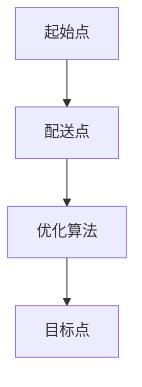

                 


### 文章标题：顺丰科技2025末端配送路径优化专家社招面试指南

#### 关键词：
- 末端配送
- 路径优化
- 人工智能
- 物流行业
- 面试指南

#### 摘要：
本文旨在为准备参加顺丰科技2025年末端配送路径优化专家社招的应聘者提供全面的面试指南。文章首先对顺丰科技及其末端配送业务进行了概述，接着深入探讨了路径优化理论、方法和核心算法，并通过实际项目和案例分析，提供了实用的技巧和策略。最后，本文总结了面试准备的关键要点和经典面试题目的解答方法，助力应聘者顺利通过面试。

### 《顺丰科技2025末端配送路径优化专家社招面试指南》目录大纲

#### 第一部分：基础理论与概念

#### 第1章：顺丰科技与末端配送概述

##### 1.1 顺丰科技的发展历程
- 顺丰科技自1993年成立以来，经历了从传统的快递业务到综合物流服务商的转型。
- 随着科技的发展，顺丰科技逐步引入人工智能、大数据等先进技术，推动末端配送智能化。

##### 1.2 末端配送的核心概念
- 末端配送是指物流运输的最后一段，直接将货物送达消费者手中。
- 末端配送的效率和质量直接影响客户的体验和满意度。

##### 1.3 末端配送在物流行业的重要性
- 末端配送是物流行业的最后一公里，是连接生产和消费的桥梁。
- 优化末端配送路径，可以提高物流效率，降低运营成本。

#### 第2章：路径优化理论与方法

##### 2.1 路径优化基础理论
- 路径优化涉及图论、最短路径算法等基础理论。
- 这些理论为解决末端配送路径问题提供了理论基础。

##### 2.2 传统路径优化方法
- 传统方法包括手工规划、规则推理等，适用于简单的配送场景。
- 但在复杂的配送网络中，传统方法效率较低。

##### 2.3 现代路径优化技术
- 现代技术包括人工智能、机器学习等，能够处理大规模、复杂的配送路径问题。
- 人工智能技术可以动态调整配送路径，提高配送效率。

#### 第3章：配送路径优化核心算法

##### 3.1 路径优化算法原理讲解（Mermaid流程图）


##### 3.2 路径优化算法伪代码
```python
# 伪代码：路径优化算法
function pathOptimization(points):
    # 初始化
    selected_points = []
    distance = calculateTotalDistance(points)
    
    # 主循环
    while distance > target_distance:
        # 选择最优配送点
        next_point = selectBestPoint(points, selected_points)
        # 添加到配送路径
        selected_points.append(next_point)
        # 更新总距离
        distance = calculateTotalDistance(selected_points)
    
    return selected_points
```

##### 3.3 路径优化算法数学模型（latex格式）
$$
\text{目标函数} = \sum_{i=1}^{n} d(i, j) 
$$
$$
\text{约束条件} = \sum_{i=1}^{n} x_i = 1
$$
$$
0 \leq x_i \leq 1 \quad \forall i
$$

#### 第4章：数学模型与公式详解

##### 4.1 路径长度计算公式
$$
L = \sum_{i=1}^{n} d(i, j)
$$

##### 4.2 时间窗约束公式
$$
t_i \in [T_i, U_i]
$$

#### 第二部分：项目实战与案例分析

#### 第5章：配送路径优化项目实战

##### 5.1 项目背景介绍
- 以顺丰科技末端配送项目为例，介绍项目背景和目标。

##### 5.2 开发环境搭建
- 详细介绍项目开发所需的环境搭建，包括软件、硬件和网络配置。

##### 5.3 源代码实现与分析
- 提供源代码，并详细解读实现原理和关键技术。

#### 第6章：案例分析

##### 6.1 案例一：某大型电商平台配送路径优化
- 分析某大型电商平台的配送路径优化项目，探讨实际应用效果。

##### 6.2 案例二：某生鲜电商平台配送路径优化
- 分析某生鲜电商平台的配送路径优化项目，探讨应对生鲜配送的特殊挑战。

#### 第7章：面试准备与技巧

##### 7.1 面试准备要点
- 提供面试前的准备工作，包括知识储备、案例分析等。

##### 7.2 面试技巧解析
- 分析面试过程中可能遇到的问题，并提供应对策略。

##### 7.3 经典面试题目解析
- 提供经典面试题目的解析，帮助应聘者更好地准备面试。

### 附录

#### 附录A：常用算法与工具介绍

##### A.1 路径优化相关算法
- 详细介绍常用的路径优化算法，如遗传算法、蚁群算法等。

##### A.2 常用路径优化工具
- 介绍常用的路径优化工具，如OpenStreetMap、Google Maps API等。

##### A.3 相关文献推荐
- 推荐相关领域的经典文献，帮助应聘者进一步学习。

[完]

