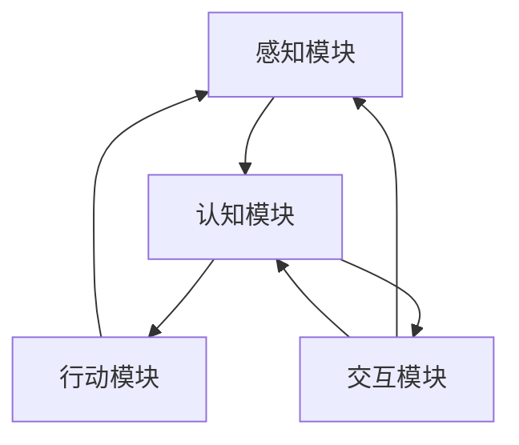
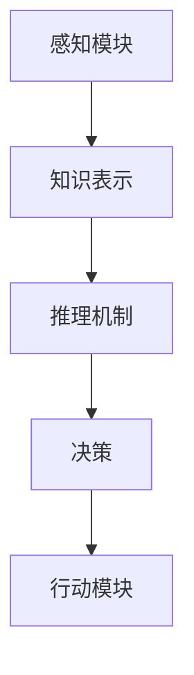
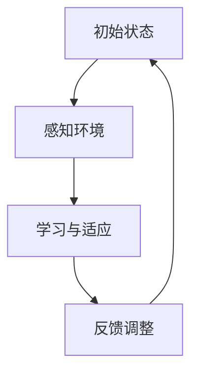
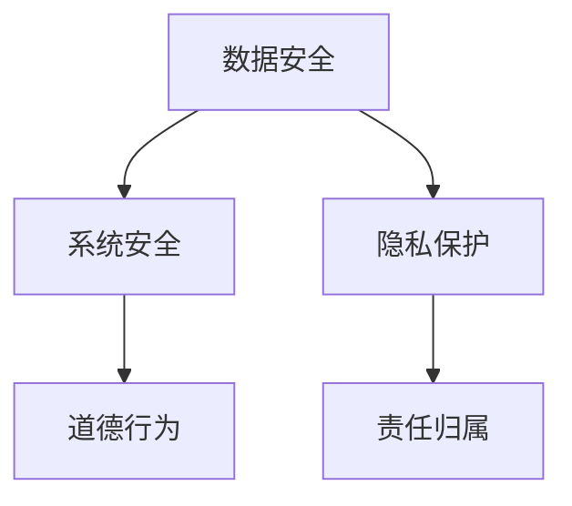
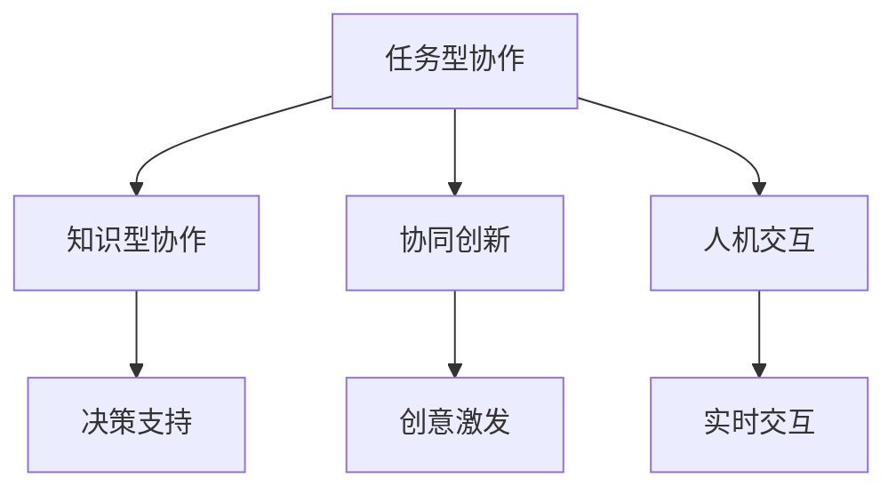
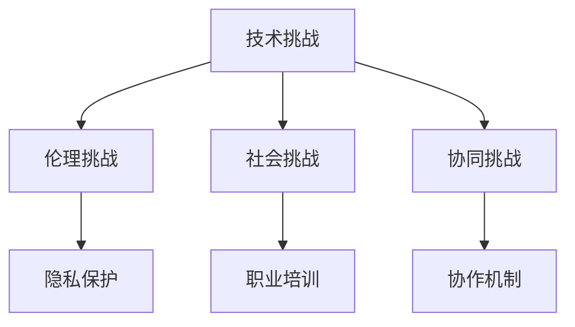

                 

### 文章标题：AGI与人类协作的未来工作模式

### 关键词：人工智能，通用智能，工作模式，职业发展，教育培训，就业市场，未来展望

### 摘要：
本文旨在探讨人工智能特别是通用智能（AGI）的发展及其对未来工作模式的影响。随着人工智能技术的不断进步，AGI作为一种具有广泛认知能力的人工智能系统，正逐步走进我们的现实生活。本文首先概述了人工智能与通用智能的基本概念和发展历程，深入剖析了AGI的核心技术、原理及其系统架构设计。接着，本文重点探讨了AGI在各个工作领域中的应用场景，分析了AGI与人类协作的工作模式，探讨了AGI对职业转变、教育培训和就业市场的影响，并展望了AGI时代的未来工作模式。通过本文的深入探讨，希望能够为读者提供关于AGI与未来工作模式的有益见解。

---

### 第一部分：AGI概述与未来工作模式

#### 第1章：人工智能与通用智能（AGI）

##### 1.1 人工智能的历史与发展

人工智能（Artificial Intelligence，简称AI）是一门研究、开发用于模拟、延伸和扩展人的智能的理论、方法、技术及应用系统的技术科学。人工智能的研究始于20世纪50年代，早期的探索主要集中在规则推理、知识表示、搜索算法等方面。随着计算机技术的发展，人工智能在20世纪80年代和90年代迎来了第一次发展高峰，主要表现为专家系统和模式识别技术的广泛应用。

进入21世纪，尤其是深度学习和大数据技术的快速发展，人工智能迎来了新的发展机遇。深度学习作为人工智能的一个重要分支，通过模拟人脑神经网络结构，实现了在图像识别、语音识别、自然语言处理等领域的突破性进展。这一阶段的人工智能，尽管在某些特定任务上达到了或超过了人类水平，但仍然无法称为通用智能。

##### 1.2 AGI的概念与特征

通用智能（AGI，Artificial General Intelligence）是指一种具有广泛认知能力的人工智能系统，能够像人类一样进行思考、学习、解决问题和适应环境。与现有的人工智能系统（如弱人工智能）不同，AGI不仅限于特定的任务，而是能够在各种不同的情境下进行自主学习和推理。

AGI的特征主要包括：

1. **泛化能力**：AGI能够在不同的领域和任务中表现出类似的智能行为。
2. **学习能力**：AGI具有强大的学习能力，能够从大量的数据和经验中不断学习、适应和改进。
3. **推理能力**：AGI能够进行高级的逻辑推理和抽象思考，解决复杂的问题。
4. **自主性**：AGI能够在没有人类干预的情况下，自主地设定目标、制定计划并执行任务。

##### 1.3 AGI与人类智能的对比

AGI与人类智能在很多方面具有相似性，但也存在显著的区别：

1. **认知范围**：人类智能具有广泛的认知范围，能够理解和处理复杂的情境。而AGI虽然在特定领域内表现出色，但在处理跨领域的复杂问题时，仍存在局限性。
2. **学习能力**：人类智能通过生活经验和教育不断学习，AGI则依赖于数据和算法进行学习。
3. **情感与创造力**：人类智能具有情感和创造力，能够进行艺术创作和情感交流。而AGI目前尚未具备这些能力，尽管在某种程度上可以通过算法模拟出类似的行为。
4. **伦理与道德**：人类智能能够理解和遵守伦理与道德规范，AGI则需要通过设计者和使用者的引导，逐步形成自己的伦理观。

##### 1.4 AGI的发展趋势与挑战

AGI的发展趋势主要体现在以下几个方面：

1. **计算能力的提升**：随着计算能力的不断提升，为AGI提供了更强大的计算资源。
2. **数据积累的增加**：随着互联网和物联网的发展，海量数据的积累为AGI提供了丰富的学习素材。
3. **多学科交叉**：AGI的发展需要依赖于多个学科领域的交叉融合，包括计算机科学、心理学、神经科学、认知科学等。

然而，AGI的发展也面临诸多挑战：

1. **技术难题**：如何构建能够模拟人类智能的复杂系统，仍是一个巨大的技术难题。
2. **伦理与法律**：AGI的发展引发了伦理和法律问题，包括隐私保护、责任归属等。
3. **社会适应**：AGI如何在复杂多变的社会环境中适应和发挥作用，是一个重要的研究课题。

通过上述分析，我们可以看到，AGI作为一种具有广泛认知能力的人工智能系统，正逐步走向成熟。尽管仍面临诸多挑战，但AGI的发展将对未来工作模式产生深远影响。在下一章中，我们将进一步探讨AGI的核心技术与原理，为理解AGI与未来工作模式的关系奠定基础。

### 第2章：AGI的核心技术与原理

#### 2.1 机器学习与深度学习基础

机器学习（Machine Learning，ML）是AGI的基础技术之一，其核心思想是通过算法让计算机从数据中自动学习，进行决策和预测。机器学习可以分为监督学习、无监督学习和强化学习三类。监督学习通过标记数据来训练模型，无监督学习则不依赖标记数据，旨在发现数据中的模式和结构，强化学习则通过奖励机制来引导模型的学习。

深度学习（Deep Learning，DL）是机器学习的一个重要分支，通过多层神经网络结构，对数据进行层层抽象和表示，从而实现复杂任务的学习和预测。深度学习在图像识别、语音识别、自然语言处理等领域取得了显著成果。

以下是深度学习的基础算法——卷积神经网络（CNN）的伪代码示意：

```
function CNN(input_data):
    layer1 = ConvolutionLayer(filter_size=3, stride=1, padding='same')(input_data)
    layer1 = Activation('relu')(layer1)
    layer2 = ConvolutionLayer(filter_size=3, stride=1, padding='same')(layer1)
    layer2 = Activation('relu')(layer2)
    layer3 = Flatten()(layer2)
    layer3 = Dense(units=10, activation='softmax')(layer3)
    return layer3
```

#### 2.2 自然语言处理与知识图谱

自然语言处理（Natural Language Processing，NLP）是AGI的重要组成部分，旨在使计算机能够理解、生成和处理人类语言。NLP的技术包括文本预处理、词向量表示、语言模型、文本分类和机器翻译等。

知识图谱（Knowledge Graph）是一种用于表示实体及其关系的图结构数据，通过知识图谱，计算机能够更好地理解和推理复杂的信息。知识图谱技术包括实体识别、关系抽取、图谱构建和推理等。

以下是一个知识图谱构建的伪代码示意：

```
function BuildKnowledgeGraph(entities, relationships):
    graph = Graph()
    for entity in entities:
        graph.add_node(entity)
    for relationship in relationships:
        graph.add_edge(relationship[0], relationship[1], weight=1)
    return graph
```

#### 2.3 机器人学与感知系统

机器人学（Robotics）是AGI的重要组成部分，旨在开发具有感知、决策和执行能力的机器人系统。机器人学的关键技术包括感知系统、运动控制系统和决策系统。

感知系统是机器人获取外部环境信息的重要手段，包括视觉感知、听觉感知、触觉感知等。以下是一个基于视觉感知的伪代码示意：

```
function ObjectDetection(image):
    features = ExtractFeatures(image)
    class_probs = ConvolutionalNeuralNetwork(features)
    object_classes = ApplyThreshold(class_probs)
    return object_classes
```

#### 2.4 AGI的多学科交叉融合

AGI的发展需要多学科交叉融合，包括计算机科学、心理学、神经科学、认知科学等。这种多学科交叉不仅有助于解决AGI面临的复杂问题，还能为AGI提供更丰富的理论基础。

以下是AGI多学科交叉融合的一个示例：利用神经科学原理设计的深度学习算法。

```
function NeuralInspiredDL(input_data):
    neuron = SigmoidNeuron()
    for data in input_data:
        neuron.learn(data)
    output = neuron.predict()
    return output
```

通过上述章节的讨论，我们可以看到AGI的核心技术与原理涵盖了机器学习、自然语言处理、机器人学等多个领域。在下一章中，我们将进一步探讨通用智能系统的架构设计，为理解AGI在实际应用中的工作模式奠定基础。

### 第3章：通用智能系统的架构设计

#### 3.1 AGI系统的总体架构

通用智能系统（AGI System）的总体架构通常包括感知模块、认知模块、行动模块和交互模块。这四个模块相互协作，使得AGI系统能够实现自主学习和智能行为。

1. **感知模块**：感知模块是AGI系统的感官部分，负责从外部环境中获取信息，包括视觉、听觉、触觉等多种感知方式。感知模块的核心任务是数据采集和预处理，如图像识别、语音识别等。

2. **认知模块**：认知模块是AGI系统的思考部分，负责对感知模块获取的信息进行处理和理解，包括语言理解、知识表示、推理等。认知模块的核心任务是知识管理和决策制定，如自然语言处理、知识图谱构建等。

3. **行动模块**：行动模块是AGI系统的执行部分，负责根据认知模块的决策执行具体的动作，如机器人控制、自主驾驶等。行动模块的核心任务是执行计划和行为调整。

4. **交互模块**：交互模块是AGI系统的交流部分，负责与其他系统或人进行信息交换和互动，包括语音合成、对话系统等。交互模块的核心任务是沟通和理解，如语音识别、对话管理等。

以下是一个简化的AGI系统架构的Mermaid流程图：



#### 3.2 知识表示与推理机制

知识表示（Knowledge Representation）是认知模块的重要组成部分，负责将感知模块获取的信息转化为计算机可以处理和理解的格式。知识表示的方法包括符号表示、语义网络、本体论等。

推理机制（Reasoning Mechanism）是基于知识表示的，它负责在给定的知识库中寻找逻辑关系和推理路径，以解决复杂问题。推理机制包括演绎推理、归纳推理、案例推理等。

以下是知识表示和推理机制的简化Mermaid流程图：



#### 3.3 交互式学习与适应性

交互式学习（Interactive Learning）是AGI系统的一个重要特性，它通过不断与外部环境或人的互动，获取反馈并优化自身性能。交互式学习的方法包括强化学习、在线学习等。

适应性（Adaptability）是AGI系统能够在复杂和动态环境中持续学习和进步的能力。适应性涉及多个方面，包括环境感知、行为调整、策略优化等。

以下是交互式学习和适应性的简化Mermaid流程图：



#### 3.4 AGI系统的安全与伦理

随着AGI系统在各个领域的广泛应用，安全与伦理问题愈发凸显。AGI系统的安全包括数据安全、系统安全等，旨在防止恶意攻击和数据泄露。伦理问题则涉及隐私保护、责任归属、道德行为等。

以下是AGI系统的安全与伦理框架的简化Mermaid流程图：



通过本章的讨论，我们可以看到通用智能系统的架构设计涉及到多个模块和层次的协调工作，包括感知、认知、行动和交互。知识表示与推理机制、交互式学习与适应性、安全与伦理等都是系统设计中的重要组成部分。在下一章中，我们将探讨AGI在协作工作中的应用场景，进一步分析AGI如何影响未来工作模式。

### 第二部分：AGI在协作工作中的应用场景

#### 第4章：AGI在协作工作中的应用场景

随着人工智能特别是通用智能（AGI）技术的快速发展，AGI在各个工作领域中的应用场景越来越广泛。AGI不仅能够提高工作效率，还能够协助人类解决复杂问题。在这一章中，我们将探讨AGI在项目管理、知识工作、创新工作和创意工作中的应用场景，并分析AGI在这些场景中的具体作用和优势。

##### 4.1 AGI在项目管理中的应用

项目管理是复杂且动态的过程，涉及任务分配、进度跟踪、风险管理和资源调度等多个方面。AGI的应用可以显著提高项目管理的效果和效率。

1. **任务分配与优先级排序**：AGI可以根据团队成员的能力和项目需求，自动分配任务并确定任务优先级，确保关键任务优先完成。

2. **进度跟踪与预测**：AGI可以通过分析历史数据和实时数据，预测项目的进度和可能的风险，及时调整计划和资源分配。

3. **风险管理**：AGI可以利用机器学习算法，识别潜在的风险因素，并提供相应的风险缓解策略。

4. **资源调度**：AGI可以优化资源分配，确保项目在资源有限的情况下，能够最大限度地利用。

以下是一个AGI在项目管理中的应用示例的伪代码：

```
function ProjectManagement(projects, team_members):
    tasks = AssignTasks(projects, team_members)
    priority = SetTaskPriority(tasks)
    progress = TrackProgress(tasks)
    risks = IdentifyRisks(tasks)
    resources = AllocateResources(tasks)
    return projects, progress, risks, resources
```

##### 4.2 AGI在知识工作中的应用

知识工作通常涉及大量信息处理、知识挖掘和决策支持。AGI的应用可以显著提升知识工作的效率和准确性。

1. **信息处理**：AGI可以自动处理和分析大量的文本、图像和音频数据，提取关键信息和知识。

2. **知识挖掘**：AGI可以通过自然语言处理和知识图谱技术，从大量数据中挖掘出潜在的知识和关系。

3. **决策支持**：AGI可以基于知识和数据，提供个性化的决策支持，帮助人类做出更明智的决策。

4. **知识共享**：AGI可以协助构建知识共享平台，促进知识的传播和利用。

以下是一个AGI在知识工作中的应用示例的伪代码：

```
function KnowledgeWork(data, users):
    processed_data = ProcessData(data)
    knowledge = ExtractKnowledge(processed_data)
    decisions = MakeDecisions(knowledge, users)
    share_platform = ShareKnowledge(knowledge)
    return processed_data, knowledge, decisions, share_platform
```

##### 4.3 AGI在创新工作中的应用

创新工作通常需要创造性的思维和复杂的决策。AGI的应用可以激发创新工作的新思路和解决方案。

1. **创意生成**：AGI可以通过机器学习和自然语言处理技术，生成新的创意和设计灵感。

2. **协同创新**：AGI可以协助团队成员进行协同创新，通过智能匹配和协作机制，提高创新效率。

3. **风险评估**：AGI可以评估创新项目的风险，提供相应的策略建议，降低创新失败的风险。

4. **持续改进**：AGI可以持续监控创新过程，通过数据分析，提供改进建议，推动创新工作的持续优化。

以下是一个AGI在创新工作中的应用示例的伪代码：

```
function InnovationWork(ideas, team_members):
    new_ideas = GenerateIdeas(ideas)
    matched_ideas = MatchIdeas(new_ideas, team_members)
    risks = AssessRisks(matched_ideas)
    improvements = SuggestImprovements(risks)
    return new_ideas, matched_ideas, risks, improvements
```

##### 4.4 AGI在创意工作中的应用

创意工作通常涉及艺术创作、设计、写作等多个领域。AGI的应用可以拓宽创意工作的边界，提供新的创作方式和工具。

1. **艺术创作**：AGI可以通过生成对抗网络（GAN）等技术，生成新的艺术作品，为艺术家提供创作灵感。

2. **设计优化**：AGI可以通过计算机辅助设计（CAD）技术，自动优化设计，提高设计效率和效果。

3. **写作辅助**：AGI可以通过自然语言处理技术，辅助写作，提供语法修正、内容建议等。

4. **交互体验**：AGI可以提供智能交互体验，通过语音、图像等多种方式，与用户进行互动，提升创作过程的乐趣。

以下是一个AGI在创意工作中的应用示例的伪代码：

```
function CreativeWork(data, users):
    artistic_creations = GenerateArtisticCreations(data)
    design = OptimizeDesign(data)
    writings = AssistWriting(data)
    interactive_experience = EnhanceInteractiveExperience(users)
    return artistic_creations, design, writings, interactive_experience
```

通过上述分析，我们可以看到AGI在项目管理、知识工作、创新工作和创意工作中的应用场景及其优势。AGI不仅能够提高工作效率和准确性，还能够激发创新思维，拓宽创意工作的边界。在下一章中，我们将进一步探讨AGI与人类协作的工作模式，分析AGI如何与人类实现有效协作，共同推动工作的进展。

### 第5章：AGI与人类协作的工作模式

#### 5.1 AGI与人类工作协同的原理

AGI与人类工作的协同原理是基于两者的互补性和协作性。具体来说，AGI通过其强大的计算能力和自主学习能力，能够承担重复性、复杂性和高风险的任务，而人类则擅长创造性、情感交流和决策判断。这种互补性使得AGI和人类能够在不同层面上共同完成工作，实现高效的协同效应。

1. **任务分配**：AGI可以根据人类的指示和任务需求，自动分配任务。通过分析任务的特征和人类的技能，AGI能够将合适的任务分配给合适的人类，从而提高任务的完成效率。

2. **知识共享**：AGI通过知识图谱和自然语言处理技术，可以高效地获取、存储和共享知识。这有助于人类快速获取所需的信息，提高决策质量和工作效率。

3. **决策支持**：AGI可以通过数据分析和预测模型，为人类提供决策支持。在复杂决策中，AGI可以提供多种备选方案和风险评估，帮助人类做出更加明智的决策。

4. **协同创新**：AGI能够与人类进行协同创新，通过智能匹配和协作机制，激发创新思维，提高创新效率。AGI可以为人类提供创意建议、设计优化和改进策略，共同推动创新工作。

#### 5.2 AGI辅助下的工作流程优化

AGI在辅助工作流程方面具有显著优势，能够通过自动化和智能化手段，优化工作流程，提高工作效率。

1. **自动化任务处理**：AGI可以通过自动化脚本和算法，自动处理大量的重复性任务，如数据录入、报告生成等。这大大减轻了人类的工作负担，使人类能够专注于更具创造性和策略性的工作。

2. **流程监控与优化**：AGI可以实时监控工作流程的执行情况，识别潜在的问题和瓶颈。通过分析流程数据，AGI可以提供优化建议，调整流程设计，提高整体工作效率。

3. **资源调度与优化**：AGI可以通过优化算法和预测模型，合理调度人力资源和物资资源，确保项目在资源有限的情况下，能够最大限度地利用。

以下是一个AGI辅助下的工作流程优化示例的伪代码：

```
function WorkflowOptimization(workflow, resources):
    automated_tasks = IdentifyAutomatableTasks(workflow)
    optimized_flow = RemoveBottlenecks(workflow)
    resource_allocation = OptimizeResourceAllocation(resources)
    return optimized_flow, resource_allocation
```

#### 5.3 AGI与人类协作的模式探讨

AGI与人类协作的模式可以分为以下几种：

1. **任务型协作**：在这种模式中，AGI主要负责执行具体的任务，人类则负责监督和调整AGI的工作。这种模式适用于重复性高、标准化的工作场景。

2. **知识型协作**：在这种模式中，AGI负责知识管理和决策支持，人类则负责制定战略和执行决策。这种模式适用于需要深度知识和复杂决策的工作场景。

3. **协同创新**：在这种模式中，AGI与人类共同参与创新过程，通过智能匹配和协作机制，激发创新思维。这种模式适用于需要高度创造性思维和团队协作的工作场景。

4. **人机交互**：在这种模式中，AGI通过自然语言处理和语音识别技术，与人类进行实时交互，提供即时信息和帮助。这种模式适用于需要即时响应和高度互动的工作场景。

以下是一个AGI与人类协作模式探讨的简化Mermaid流程图：



#### 5.4 AGI协作工作中的挑战与对策

尽管AGI与人类协作具有许多优势，但在实际应用中仍面临一些挑战。

1. **技术挑战**：AGI的技术尚不成熟，特别是在理解复杂情境、处理模糊信息和进行自主决策方面。为此，需要进一步研究和开发更先进的算法和模型，提升AGI的技术水平。

2. **伦理挑战**：AGI的引入引发了伦理问题，如隐私保护、责任归属和道德行为等。为此，需要建立完善的伦理规范和法律法规，确保AGI的安全和合规性。

3. **社会挑战**：AGI的普及和应用可能导致就业市场的变化和职业结构的调整，引发社会不平等和失业问题。为此，需要加强职业培训和再教育，提高人类的技能和适应能力。

4. **协同挑战**：AGI与人类之间的协作可能存在沟通障碍、信任问题和协调困难等。为此，需要建立有效的协作机制和沟通渠道，提高协作效率。

以下是一个AGI协作工作中的挑战与对策的简化Mermaid流程图：



通过上述分析，我们可以看到AGI与人类协作的工作模式具有广泛的应用前景，但也面临诸多挑战。通过技术创新、伦理规范和社会适应，我们可以更好地实现AGI与人类的协同工作，推动未来工作模式的创新和发展。

### 第6章：AGI时代的职业转变与教育培训

#### 6.1 AGI对职业的影响

随着人工智能特别是通用智能（AGI）的不断发展，职业领域正在经历深刻的变化。AGI的应用不仅改变了传统的职业结构，还催生了新的职业机会。

1. **替代性职业**：AGI在某些领域已经开始替代传统职业，如数据录入、重复性任务处理等。这些职业由于简单、重复性强，非常适合自动化，AGI的出现使得这些职业的需求减少。

2. **辅助性职业**：AGI在很多职业中成为人类的辅助工具，如医生、律师、教师等。AGI能够提供数据分析和决策支持，帮助人类更好地完成工作，提高工作效率和质量。

3. **创新性职业**：AGI的兴起催生了新的职业机会，如人工智能工程师、机器学习专家、数据科学家等。这些职业需要具备强大的技术能力和创新能力，能够应对AGI时代带来的挑战。

4. **消失的职业**：随着技术的进步，一些职业可能会因为被AGI替代而消失。例如，一些传统的制造业岗位、客服代表等，可能会因为机器人和智能客服的应用而减少。

#### 6.2 职业教育与培训的变革

为了应对AGI时代对职业的影响，职业教育和培训需要进行相应的变革，以培养适应未来需求的技能和知识。

1. **技术培训**：职业培训应更加注重技术的培养，特别是在人工智能、机器学习、数据分析等领域的知识。通过系统的培训，使从业人员能够掌握AGI技术的基本原理和应用。

2. **跨学科教育**：AGI的发展涉及多个学科领域，如计算机科学、心理学、神经科学、认知科学等。职业培训应注重跨学科的教育，培养具备多学科知识的复合型人才。

3. **实践教育**：职业培训应增加实践环节，通过实际项目操作，使从业人员能够将理论知识应用于实际工作中。这种实践教育有助于提高从业人员的实际操作能力和问题解决能力。

4. **持续学习**：AGI技术的快速发展要求从业人员具备持续学习的意识，不断更新知识和技能。职业培训应提供持续学习的平台和资源，帮助从业人员适应技术变化。

#### 6.3 新型职业人才的需求

在AGI时代，新型职业人才的需求呈现出以下几个特点：

1. **技术能力**：新型职业人才需要具备强大的技术能力，能够熟练运用AGI技术进行数据分析和问题解决。

2. **创新能力**：新型职业人才需要具备创新能力，能够在AGI技术的支持下，发现新的业务机会和解决方案。

3. **跨学科知识**：新型职业人才需要具备跨学科的知识体系，能够理解和运用不同学科的知识，解决复杂问题。

4. **沟通能力**：新型职业人才需要具备良好的沟通能力，能够与团队成员、客户和利益相关者进行有效沟通，确保项目的顺利进行。

5. **道德伦理**：新型职业人才需要具备道德伦理意识，能够在技术应用中遵守法律法规和伦理规范，确保技术的安全性和合规性。

#### 6.4 教育培训体系的重塑

为了培养适应AGI时代的新型职业人才，教育培训体系需要进行重塑，以适应新的职业需求和技能要求。

1. **教育理念**：教育理念应从传统的知识传授转向能力培养，注重学生的综合素质和创新能力。

2. **课程设置**：课程设置应更加灵活和多样化，涵盖人工智能、数据科学、心理学、神经科学等领域的知识，满足不同职业需求。

3. **教学模式**：教学模式应从传统的课堂教育转向线上线下结合的教育模式，利用互联网和大数据技术，提供个性化的学习资源和服务。

4. **教育资源**：教育资源应更加丰富和开放，提供免费的在线课程和优质教育资源，使更多的人能够接受高质量的教育。

5. **评估机制**：评估机制应更加注重学生的实际能力和综合素质，通过项目实战和实际操作，评估学生的学习效果。

通过本章的讨论，我们可以看到AGI时代对职业的影响以及职业教育和培训的变革需求。通过重塑教育培训体系，培养适应AGI时代的新型职业人才，将有助于推动社会的发展和进步。在下一章中，我们将进一步探讨AGI时代的就业市场变化，分析政府政策在AGI时代的作用，以及企业战略与人才培养的重要性。

### 第7章：AGI时代的就业市场与政策制定

#### 7.1 AGI时代的就业市场变化

随着通用智能（AGI）的快速发展，就业市场正经历着前所未有的变革。AGI的引入不仅改变了职业结构和就业模式，还对劳动力市场的供需关系产生了深远影响。

1. **供需变化**：一方面，AGI的自动化能力正在替代许多传统职业，导致某些领域的就业机会减少。另一方面，AGI的兴起也催生了大量新的职业机会，如人工智能工程师、机器学习专家、数据科学家等。这种供需变化要求劳动力市场具备高度的灵活性和适应性。

2. **技能需求**：AGI时代对劳动力的技能需求发生了显著变化。传统的职业技能逐渐被新的技术技能所取代，劳动力需要具备数据分析、机器学习、编程等领域的专业知识。此外，跨学科的知识和创新能力也变得越来越重要。

3. **就业模式**：AGI的普及改变了传统的就业模式，远程工作和自由职业逐渐成为主流。个体劳动者可以通过互联网平台，参与到全球范围内的项目，实现工作地点和时间的灵活性。

4. **就业稳定性**：AGI时代的就业稳定性受到挑战。随着自动化技术的广泛应用，某些职业的就业稳定性下降，而新兴职业的稳定性则难以预测。这种就业不稳定要求劳动力具备快速适应和持续学习的能力。

#### 7.2 政府政策在AGI时代的作用

政府在AGI时代的就业市场中扮演着关键角色，通过制定和实施相关政策，可以缓解AGI带来的就业压力，促进经济的稳定和可持续发展。

1. **就业促进政策**：政府可以通过就业促进政策，如职业培训计划、创业支持政策等，帮助劳动力适应AGI时代的需求。通过提供技术培训、职业转换支持等，提高劳动力的技能水平和就业能力。

2. **社会保障政策**：政府需要建立完善的社会保障体系，确保失业者和低收入群体在AGI时代的基本生活得到保障。通过失业保险、最低工资标准等政策，缓解因技术变革带来的就业不稳定性。

3. **税收政策**：政府可以通过税收优惠、减税政策等，鼓励企业投资于AGI技术的发展和应用，促进创新和就业机会的增加。同时，政府可以通过税收政策调节收入分配，减少因技术进步引发的社会不平等。

4. **国际合作**：在全球化的背景下，政府需要加强国际合作，共同应对AGI时代带来的挑战。通过跨国政策协调和合作，共同制定和推广AGI技术和标准的国际规范，确保全球就业市场的稳定和可持续发展。

#### 7.3 企业战略与人才培养

在AGI时代，企业需要制定有效的战略，以应对技术变革带来的机遇和挑战。人才培养是企业战略的重要组成部分，通过以下措施，企业可以培养适应AGI时代的优秀人才：

1. **人才引进**：企业需要吸引和培养具有创新能力和技术能力的人才。通过高薪聘请、人才引进计划等，吸引全球顶尖人才加入企业，为企业的创新和发展提供强有力的支持。

2. **内部培训**：企业应建立完善的内部培训体系，通过技术培训、领导力培训等，提高员工的专业技能和综合素质。内部培训有助于员工适应AGI时代的需求，提高企业的竞争力。

3. **职业发展**：企业应为员工提供清晰的职业发展路径，激励员工不断提升自己的能力。通过晋升机制、绩效评估等，激发员工的工作积极性和创造力。

4. **创新文化**：企业应营造创新文化，鼓励员工提出新的想法和解决方案。通过创新实验室、内部竞赛等，激发员工的创新潜能，推动企业的持续创新。

5. **合作与共享**：企业应与高校、研究机构等合作，共同培养和分享人才。通过产学研合作、联合培训等，实现人才的共同培养和资源共享，提高人才培养的质量和效率。

#### 7.4 AGI时代的国际竞争与合作

在AGI时代，国际竞争和合作成为各国政府和企业关注的焦点。通过以下措施，各国可以加强国际竞争和合作，共同推动AGI技术的发展和应用：

1. **技术合作**：各国应加强在AGI技术领域的合作，通过共同研究、技术交流和项目合作，推动技术的创新和进步。通过共享研究成果和专利，实现技术的共同发展和应用。

2. **人才培养**：各国应加强在人才培养领域的合作，通过国际交流、联合培养等，培养具备国际竞争力的人才。通过跨国教育和培训项目，提高人才的国际化水平，为全球AGI技术的发展提供人才支持。

3. **标准制定**：各国应共同参与AGI技术的标准制定，通过国际标准组织等平台，制定统一的AGI技术和应用标准。通过标准化的技术规范，确保AGI技术的安全和可靠性，促进全球AGI技术的应用和发展。

4. **政策协调**：各国应加强政策协调，共同制定和推广AGI技术的政策法规。通过跨国政策协调和合作，确保AGI技术的合规性和安全性，为全球AGI技术的发展创造良好的政策环境。

通过本章的讨论，我们可以看到AGI时代对就业市场带来的变化以及政府政策和企业战略在应对这些变化中的重要作用。通过国际竞争和合作，各国可以共同应对AGI时代带来的挑战，推动全球经济的可持续发展。在下一章中，我们将探讨AGI对人类社会的影响，分析经济与社会变革、法律与伦理问题以及全球治理的挑战与机遇。

### 第8章：AGI对人类社会的影响

#### 8.1 经济与社会变革

随着通用智能（AGI）的不断发展，其对经济和社会的变革影响深远。首先，AGI在提高生产效率方面的作用不可忽视。通过自动化和智能化，AGI能够显著提高生产线的效率，减少人力资源的依赖，从而降低生产成本。这使得企业能够更灵活地应对市场需求的变化，提高市场竞争力。

然而，AGI的普及也带来了一系列社会经济问题。首先，就业结构的转变成为一个突出问题。随着自动化技术的广泛应用，许多传统职业，特别是那些重复性高、技能要求低的岗位，面临着被替代的风险。这种就业结构的变化可能导致失业率的上升，尤其是对于低技能劳动者，他们可能需要重新培训以适应新的就业需求。

其次，收入分配的不平等问题也因AGI的普及而加剧。尽管AGI提高了整体生产效率，但技术红利往往集中在技术持有者和高技能劳动者手中，而低技能劳动者则可能面临收入下降的风险。这种收入差距的扩大，可能会引发社会不稳定，甚至社会动荡。

为了应对这些挑战，政府和社会需要采取一系列措施。首先，政府应加大对教育和职业培训的投入，提供更多的培训机会，帮助劳动力适应新技术的要求。其次，政府可以实施收入再分配政策，如税收调节、社会福利等，以减轻收入不平等带来的负面影响。此外，社会也应鼓励企业承担社会责任，通过提供培训和就业机会，帮助员工适应新的就业环境。

#### 8.2 法律与伦理问题

AGI的快速发展引发了诸多法律与伦理问题，这些问题需要引起社会各界的关注和讨论。

首先，隐私保护成为一个关键问题。AGI系统在处理和分析大量数据时，可能会涉及个人隐私。如何确保这些数据的安全性和隐私性，防止数据泄露和滥用，成为法律和伦理研究的重要课题。为此，需要制定严格的数据保护法律和隐私政策，确保个人数据的合法使用和保护。

其次，责任归属问题也是一个重要的法律和伦理问题。当AGI系统在执行任务时发生错误或导致损失，如何界定责任归属成为一个难题。是责任归咎于系统开发者、运营者，还是使用者？为了解决这个问题，需要建立明确的责任分配机制和法律框架，确保各方在AGI系统中的责任和义务。

此外，AGI的道德行为也是一个备受关注的问题。AGI系统在执行任务时，是否能够遵循道德规范和伦理标准？例如，在军事领域，如何确保AGI武器系统的行为符合国际法和伦理原则？这需要通过伦理研究和道德教育，培养AGI系统的道德意识和伦理行为。

#### 8.3 文化的融合与冲突

AGI的普及不仅对经济和法律产生影响，还涉及到文化层面的融合与冲突。首先，AGI技术的发展和应用促进了全球文化的融合。通过互联网和人工智能技术，人们可以更加便捷地获取和传播各种文化信息，促进不同文化之间的交流和互动。这种文化的融合有助于增进全球人民的相互理解和尊重，推动世界和平与发展。

然而，AGI的普及也引发了一些文化冲突。不同国家和地区在对待AGI技术的态度和策略上存在差异，这可能导致文化冲突。例如，一些国家可能担心AGI技术带来的安全和道德问题，而另一些国家则可能积极推动AGI技术的发展和应用。此外，文化冲突也可能在技术标准制定和国际合作中表现出来。为了解决这些问题，需要通过国际合作和对话，建立全球共识和合作机制，促进AGI技术的健康发展。

#### 8.4 全球治理的挑战与机遇

AGI的快速发展对全球治理提出了新的挑战和机遇。首先，全球治理需要应对AGI技术带来的法律和伦理问题。为了确保全球范围内的AGI技术的安全和合规性，需要建立统一的国际法律和伦理框架，确保各国在技术使用和监管上的协调一致。

其次，全球治理需要应对AGI技术对经济和社会的影响。为了促进全球经济的稳定和可持续发展，需要通过国际合作，制定和推广有利于经济发展的政策和标准，同时关注AGI技术对就业和社会不平等的负面影响。

此外，全球治理还需要关注AGI技术的文化影响。通过国际合作和文化交流，促进全球文化的融合与理解，减少文化冲突，为AGI技术的健康发展创造良好的社会环境。

总之，AGI对人类社会的影响是深远而复杂的。通过法律与伦理规范、经济与社会政策、国际合作与治理等多方面的努力，我们可以更好地应对AGI时代带来的挑战，实现人类社会与AGI技术的和谐发展。

### 第9章：未来工作模式的发展方向

#### 9.1 人工智能与工作的未来

随着人工智能特别是通用智能（AGI）技术的不断进步，人工智能与工作的未来呈现出一系列新的发展趋势。首先，人工智能将在更多领域实现广泛应用，从制造业到服务业，从医疗保健到教育，人工智能将深入融入各个行业，推动产业升级和效率提升。这不仅会提高生产力和服务质量，还会催生新的商业模式和就业机会。

1. **自动化与智能化**：人工智能将进一步提高生产自动化和智能化水平，减少人力劳动需求。例如，智能工厂中，机器人将执行复杂的制造任务，而人工智能系统将负责生产线的监控和优化。

2. **个性化和定制化**：人工智能能够通过大数据和个性化算法，提供高度定制化的产品和服务。在零售业中，智能推荐系统可以根据消费者的购买历史和偏好，提供个性化的商品推荐；在教育领域，智能教育系统可以根据学生的学习进度和能力，提供个性化的学习计划。

3. **协同工作**：人工智能与人类的协同工作将成为主流。人工智能系统将辅助人类完成复杂任务，如数据分析、决策制定等，而人类则发挥其创造力、情感交流和道德判断能力，与人工智能共同推动工作进展。

4. **跨行业融合**：人工智能将推动不同行业的融合，形成新的产业生态。例如，人工智能与医疗的结合将推动智慧医疗的发展，人工智能与金融的结合将推动智慧金融的兴起。

#### 9.2 创新型工作模式的探索

在AGI时代，创新型工作模式将成为推动社会进步的重要力量。创新型工作模式强调跨学科合作、开放共享和快速迭代，旨在激发创新思维，提高创新能力。

1. **跨学科合作**：创新型工作模式强调跨学科的知识融合，通过不同领域的专家合作，解决复杂问题。例如，人工智能与生物学、医学的结合，可以推动新药研发和疾病治疗的发展。

2. **开放共享**：创新型工作模式倡导开放共享，通过共享知识、资源和经验，促进创新成果的快速传播和应用。例如，开源社区和共享平台为创新提供了广阔的空间，加速了技术的传播和应用。

3. **快速迭代**：创新型工作模式强调快速试错和迭代，通过不断优化和改进，实现创新目标的实现。例如，敏捷开发方法在软件开发中广泛应用，通过快速迭代，确保产品能够及时适应市场需求。

4. **激励机制**：创新型工作模式需要建立有效的激励机制，激发员工的创新热情和创造力。例如，通过绩效奖励、股权激励等，激励员工积极参与创新项目，提高创新成果的转化率。

#### 9.3 新型劳动关系的建立

在AGI时代，传统劳动关系面临新的挑战，新型劳动关系的建立成为发展趋势。新型劳动关系强调灵活性、合作性和公平性，旨在适应AGI时代的就业模式。

1. **灵活性**：新型劳动关系强调工作时间和地点的灵活性，适应远程工作和自由职业的需求。例如，通过互联网平台，劳动者可以灵活选择工作时间和地点，实现工作与生活的平衡。

2. **合作性**：新型劳动关系强调劳动者与雇主、客户和合作伙伴之间的合作性。通过建立开放、透明和信任的协作机制，实现资源的共享和协作，提高工作效率和创新能力。

3. **公平性**：新型劳动关系强调公平性，确保劳动者的权益得到保障。例如，通过制定公平的劳动法规，确保劳动者在远程工作和自由职业中的合法权益。

4. **多样性和包容性**：新型劳动关系强调多样性和包容性，尊重劳动者的个性和差异，为不同背景和能力的劳动者提供公平的机会和平台。

#### 9.4 未来工作模式的可持续性

未来工作模式的可持续性是应对AGI时代挑战的关键。可持续性工作模式强调环境、社会和经济三方面的平衡，旨在实现长期发展。

1. **环境保护**：可持续性工作模式注重环境保护，减少资源消耗和环境污染。例如，通过绿色制造和节能减排，实现生产过程的环保化。

2. **社会责任**：可持续性工作模式强调企业和社会的责任，通过公益活动和社会投资，推动社会进步和可持续发展。

3. **经济平衡**：可持续性工作模式关注经济效益和社会效益的平衡，通过创新和转型，实现经济的可持续发展。

4. **人才培养**：可持续性工作模式重视人才培养，通过教育和培训，提高劳动力的技能和素质，为未来工作模式提供人才支持。

总之，未来工作模式的发展方向将在人工智能的推动下，呈现出自动化与智能化、个性化和定制化、跨学科合作和快速迭代等特点。同时，新型劳动关系的建立和可持续性工作模式的推行，将为人类社会的进步提供有力支撑。在探索未来工作模式的过程中，我们需要不断适应和应对变化，为AGI时代的发展创造良好的环境。

### 附录A：AGI关键技术与工具概述

#### A.1 AGI技术框架与平台

AGI技术的发展依赖于一系列关键技术和平台，这些技术和平台构成了AGI系统的核心基础。以下是一些主要的AGI技术框架与平台：

1. **TensorFlow**：TensorFlow是由谷歌开发的开源机器学习框架，广泛应用于深度学习和神经网络模型的开发和部署。其灵活性、可扩展性和强大的生态系统使其成为AGI开发中的重要工具。

2. **PyTorch**：PyTorch是另一个流行的开源深度学习框架，由Facebook开发。其动态计算图和易于理解的接口使其在学术界和工业界得到广泛应用。

3. **Keras**：Keras是一个高层次的神经网络API，构建在TensorFlow和Theano之上，提供了简单而强大的接口，适合快速原型开发和模型实验。

4. **MindSpore**：由华为开发的开源深度学习框架，旨在提供高效、灵活和智能的深度学习计算能力。它支持异构计算和动态计算图，适用于大规模分布式训练。

5. **OpenAI Gym**：OpenAI Gym是一个开源环境库，用于开发和测试强化学习算法。它提供了多种虚拟环境，包括从简单的游戏到复杂的模拟场景，适用于AGI系统的交互和训练。

#### A.2 开源AGI工具与应用

开源AGI工具为研究人员和开发者提供了强大的工具集，以支持通用智能的研究和开发。以下是一些主要的开源AGI工具与应用：

1. **DL4J（Deep Learning for Java）**：DL4J是一个用于Java的深度学习库，支持多核CPU和GPU，适用于嵌入式系统和服务器端的应用。

2. **DLB（Deep Learning Benchmark）**：DLB是一个用于评估深度学习模型性能的基准测试工具，帮助研究人员和开发者比较不同深度学习框架的性能。

3. **Protege**：Protege是一个知识表示和推理工具，用于构建和维护本体论。它支持OWL（Web本体语言）和RDF（资源描述框架），适用于知识图谱的构建和应用。

4. **GLM（General Language Model）**：GLM是一个开源的预训练语言模型库，支持多种编程语言，如Python和C++。它提供了高效的预训练和微调工具，适用于自然语言处理任务。

5. **OpenKE（Open Knowledge Embedding）**：OpenKE是一个用于知识嵌入的开源工具，通过嵌入实体和关系，实现了知识图谱的表示和推理。它广泛应用于推荐系统、信息检索和问答任务。

#### A.3 闭源AGI产品与案例

闭源AGI产品通常由大型科技公司开发，具有强大的功能和商业应用。以下是一些主要的闭源AGI产品与案例：

1. **IBM Watson**：IBM Watson是一个综合的AI平台，提供自然语言处理、机器学习、数据分析和推理等功能。它被广泛应用于医疗、金融、零售等行业。

2. **Google AI Platform**：Google AI Platform提供了全面的AI开发和管理工具，包括预训练模型、自定义模型开发、模型部署等。它支持TensorFlow和PyTorch等框架，适用于各种AI项目。

3. **Microsoft Azure AI**：Microsoft Azure AI提供了一个全面的AI开发平台，包括预训练模型、AI服务、工具和资源。它支持多种开发语言和框架，适用于企业级的AI应用。

4. **OpenAI GPT-3**：OpenAI GPT-3是一个强大的自然语言处理模型，具有广泛的生成和应用能力。它被广泛应用于文本生成、对话系统、翻译和问答等任务。

5. **NVIDIA GPU Cloud (NGC)**：NVIDIA GPU Cloud是一个用于AI模型训练和部署的平台，提供了丰富的预训练模型和深度学习框架。它支持高性能计算和大数据处理，适用于复杂AI任务的实现。

通过这些AGI技术和工具，研究人员和开发者可以构建和实现各种复杂的通用智能系统，推动人工智能技术的发展和应用。

### 附录B：参考文献

#### B.1 通用智能相关研究论文

1. **Bostrom, N. (2014). "Superintelligence: Paths, Dangers, Strategies." Oxford University Press.**
   - 本书探讨了通用智能的概念、潜在风险以及应对策略。

2. **Hannoun, A., & O’Connor, N. R. (2017). "Artificial General Intelligence: A Survey of Key Topics." IEEE Transactions on Cognitive and Developmental Systems, 9(3), 219-236.**
   - 该论文综述了通用智能研究的关键领域和最新进展。

3. **Russell, S., & Norvig, P. (2020). "Artificial Intelligence: A Modern Approach." Prentice Hall.**
   - 本书是人工智能领域的经典教材，涵盖了机器学习、知识表示等基础理论。

4. **Tegmark, M. (2017). "Life 3.0: Being Human in the Age of Artificial Intelligence." Penguin Random House.**
   - 本书探讨了人工智能对未来社会的影响，以及人类如何适应这种变化。

#### B.2 工作模式与职业发展相关书籍

1. **Dees, J. L., & Manthei, D. (2017). "The Future of Work: At the Nexus of Humanity and Technology." Springer.**
   - 本书探讨了人工智能和自动化技术对工作模式的影响，以及人类如何适应这些变化。

2. **Lewin-Epstein, N. (2018). "The Zero Hour: Work Time, Leisure Time, and the Coming of the New Proletariat." Harvard University Press.**
   - 本书分析了工作时间和职业发展的变化，探讨了新技术对社会的影响。

3. **Ford, R. (2015). "The Rise of the Robots: Technology and the Threat of a Jobless Future." Basic Books.**
   - 本书探讨了自动化和人工智能对就业市场的潜在威胁，以及社会如何应对这一挑战。

4. **Kane, G. C. (2018). "The Second Machine Age: Work, Progress, and Prosperity in a Time of Brilliant Technologies." Random House.**
   - 本书分析了人工智能和自动化技术对经济和社会的影响，提出了应对策略。

#### B.3 法律与伦理相关文献

1. **Floridi, L., & Taddeo, M. (2011). "The Onlife Manifesto: Being Human in a Hyperconnected Era." Springer.**
   - 本书探讨了数字技术和网络社会对法律与伦理的影响，提出了“onlife”概念。

2. **Noble, D. F. (2012). "The Internet of Things: Privacy and Security in a Connected World." Cambridge University Press.**
   - 本书分析了物联网对隐私和安全的挑战，探讨了相关政策和技术解决方案。

3. **Cavoukian, A. (2016). "Privacy and AI: The Privacy and Big Data Project’s Report on Realizing Value while Enhancing Privacy." University of Ottawa, Center for Law, Technology and Society.**
   - 本文报告探讨了人工智能与隐私保护之间的关系，提出了增强隐私的实践建议。

4. **Goodman, S. N., & Flach, P. A. (2016). "A Process Model for Algorithmic Fairness." Journal of Artificial Intelligence Research, 56, 915-955.**
   - 本文提出了一个算法公平性的过程模型，为设计公平的人工智能系统提供了理论指导。

通过上述参考文献，读者可以进一步了解通用智能、工作模式与职业发展以及法律与伦理等方面的理论和实践，为深入研究提供参考。

