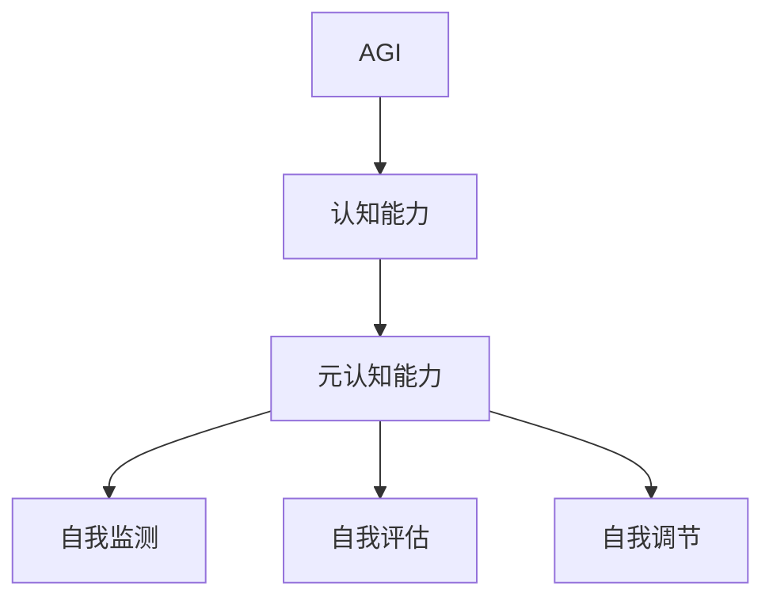
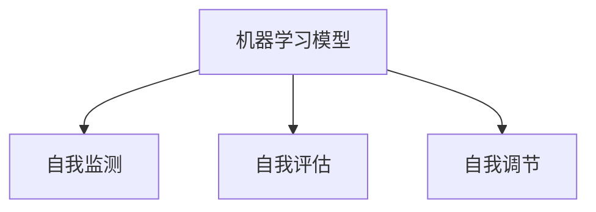
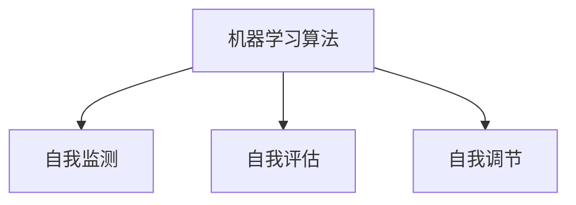
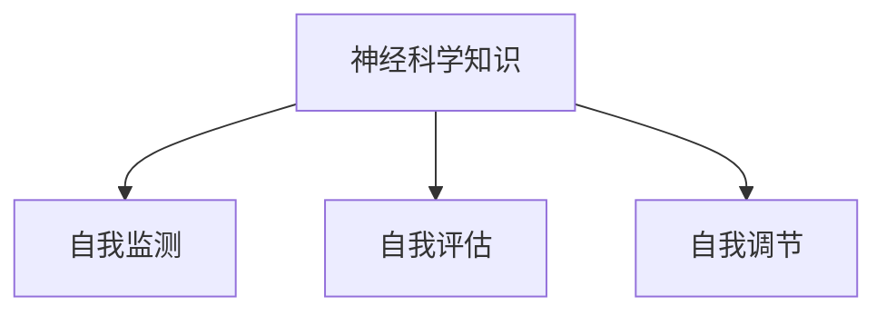
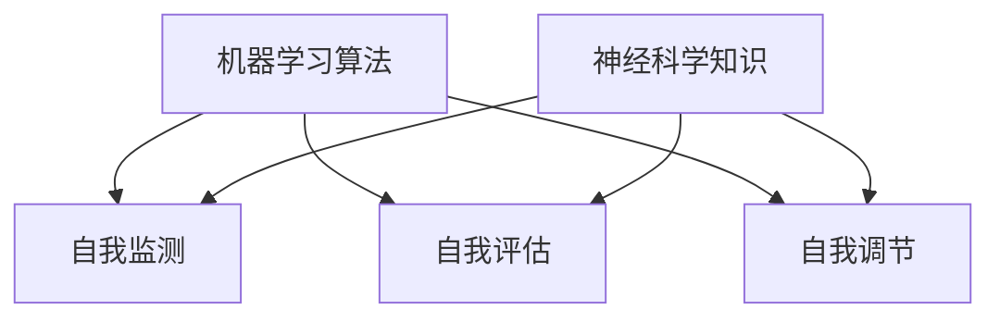
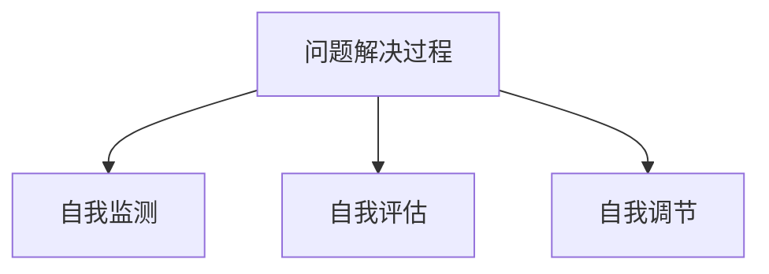
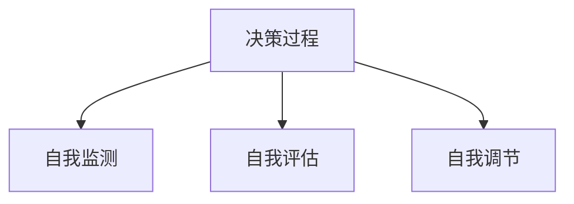
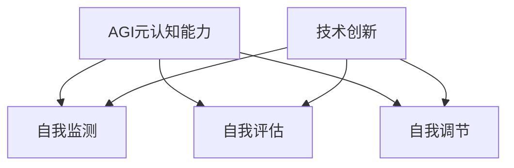
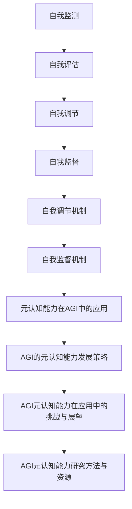

                 


### 文章标题: AGI的元认知能力：自我监督与调节

#### 关键词：人工通用智能，元认知能力，自我监督，自我调节，机器学习，神经科学

#### 摘要：
本文旨在探讨人工通用智能（AGI）中的元认知能力，特别是自我监督与调节机制。通过逐步分析，我们将阐述AGI元认知能力的核心概念、原理及其实际应用，旨在为读者提供一个全面的技术视角，探讨如何通过自我监督与调节机制，提升AGI的认知水平与问题解决能力。

### 第一部分：AGI与元认知能力概述

#### 第1章：引论

##### 1.1 AGI的概念与意义

**背景介绍**：
人工通用智能（AGI）是一种旨在模拟人类智能的理论概念，它具有学习、理解、推理、规划、社交和解决问题等广泛能力。与当前基于特定任务的人工智能（如语音识别、图像识别等）相比，AGI的目标是实现智能的泛化应用。

**核心概念与联系**：
AGI的核心在于其认知能力，而元认知能力则是这种认知能力的核心组成部分。元认知能力包括自我监测、自我评估和自我调节，它们在AGI中起着至关重要的作用，如图1所示。



**举例说明**：
例如，在医学诊断中，AGI需要监测其诊断过程，评估诊断结果的准确性，并根据评估结果调整诊断策略。这种自我监督与调节的能力，使其能够不断优化诊断过程，提高诊断准确性。

##### 1.2 元认知能力的定义与作用

**核心概念与联系**：
元认知能力是指个体在认知活动中的自我监测、自我评估和自我调节的能力。它不仅涉及对认知过程的监测和评估，还包括对认知结果和策略的调节。

**核心算法原理讲解**：
元认知能力可以通过多种方式实现，包括基于机器学习的模型和基于神经科学的模型。例如，机器学习模型可以通过训练来学习自我监测和自我评估的规则，如图2所示。



**举例说明**：
在医疗诊断中，基于机器学习的模型可以通过分析大量的诊断数据，学习到如何监测诊断过程，评估诊断结果，并根据评估结果调整诊断策略。这种自我监督与调节的能力，使其能够更好地适应复杂的医疗环境。

##### 1.3 自我监督与调节在AGI中的应用

**核心概念与联系**：
自我监督与调节是AGI中实现元认知能力的关键机制。自我监督涉及对认知过程的监测，自我调节则涉及对认知结果和策略的调节。

**核心算法原理讲解**：
自我监督通常通过设计监控算法来实现，这些算法可以实时监测AGI的认知过程，并提供反馈。自我调节则通常通过策略调整算法来实现，这些算法可以根据反馈来调整AGI的行为和决策。

**举例说明**：
在自动驾驶领域，AGI需要通过自我监督机制来监测驾驶过程，如速度、方向等，并根据监测结果调整驾驶策略，如加速、减速或转向。这种自我监督与调节的能力，使其能够更好地应对复杂的驾驶环境。

### 第二部分：元认知能力原理

#### 第3章：元认知能力的构成

##### 3.1 自我监测

**核心概念与联系**：
自我监测是元认知能力的基础，它涉及对个体认知过程的实时监测。自我监测可以识别认知过程中的错误和偏差，从而为自我评估和自我调节提供依据。

**核心算法原理讲解**：
自我监测通常通过设计监测算法来实现，这些算法可以实时分析认知过程的数据，并识别潜在的错误和偏差。

```python
def self_monitoring(process_data):
    # 监测认知过程数据
    errors = identify_errors(process_data)
    return errors
```

**举例说明**：
例如，在自然语言处理中，AGI可以通过监测文本生成过程的数据，识别生成的文本中存在的语法错误和语义错误。

##### 3.2 自我评估

**核心概念与联系**：
自我评估是元认知能力的重要组成部分，它涉及对认知结果的评估。自我评估可以帮助个体了解认知结果的准确性和有效性。

**核心算法原理讲解**：
自我评估通常通过设计评估算法来实现，这些算法可以分析认知结果的数据，并评估结果的准确性和有效性。

```python
def self_evaluation(result_data):
    # 评估认知结果数据
    accuracy = evaluate_accuracy(result_data)
    return accuracy
```

**举例说明**：
例如，在图像识别任务中，AGI可以通过评估识别结果的数据，评估识别的准确性。

##### 3.3 自我调节

**核心概念与联系**：
自我调节是元认知能力的核心，它涉及对认知策略的调整。自我调节可以帮助个体根据认知结果调整认知策略，从而提高认知效果。

**核心算法原理讲解**：
自我调节通常通过设计调节算法来实现，这些算法可以根据评估结果调整认知策略。

```python
def self_adjustment(strategy, evaluation_result):
    # 调整认知策略
    new_strategy = adjust_strategy(strategy, evaluation_result)
    return new_strategy
```

**举例说明**：
例如，在游戏AI中，AGI可以通过评估游戏状态的数据，调整游戏策略，从而提高游戏胜率。

### 第三部分：AGI的元认知能力开发与应用

#### 第6章：AGI元认知能力的发展策略

##### 6.1 基于机器学习的元认知能力开发

**核心概念与联系**：
基于机器学习的元认知能力开发，旨在利用机器学习算法训练AGI的元认知能力，使其能够自我监测、自我评估和自我调节。

**核心算法原理讲解**：
机器学习算法可以通过训练数据学习到自我监测、自我评估和自我调节的规则，如图4所示。



**举例说明**：
例如，在语音识别任务中，AGI可以通过机器学习算法训练自我监测机制，识别语音识别过程中的错误，并调整识别策略。

##### 6.2 基于神经科学的元认知能力发展

**核心概念与联系**：
基于神经科学的元认知能力发展，旨在利用神经科学的知识，设计出能够模拟人类元认知能力的算法。

**核心算法原理讲解**：
神经科学提供了关于人类认知过程的重要信息，如图5所示。



**举例说明**：
例如，在心理学研究中，AGI可以通过模拟人类神经机制，实现自我监测和自我调节。

##### 6.3 跨学科方法在AGI元认知能力发展中的应用

**核心概念与联系**：
跨学科方法在AGI元认知能力发展中的应用，旨在结合机器学习和神经科学的方法，提高AGI的元认知能力。

**核心算法原理讲解**：
跨学科方法可以通过整合机器学习和神经科学的算法，提高AGI的自我监测、自我评估和自我调节能力。



**举例说明**：
例如，在医疗诊断中，AGI可以通过整合机器学习和神经科学的算法，实现更准确的自我监测和自我调节。

### 第三部分：AGI的元认知能力开发与应用

#### 第7章：元认知能力在AGI应用中的挑战与展望

##### 7.1 AGI元认知能力在问题解决中的应用

**核心概念与联系**：
AGI元认知能力在问题解决中的应用，旨在利用自我监督与调节机制，提高问题解决的效率和效果。

**核心算法原理讲解**：
AGI可以通过自我监督机制监测问题解决过程，自我评估问题解决结果，并自我调节策略，如图6所示。



**举例说明**：
例如，在复杂系统优化中，AGI可以通过自我监督与调节机制，优化系统参数，提高系统性能。

##### 7.2 AGI元认知能力在人类辅助决策中的作用

**核心概念与联系**：
AGI元认知能力在人类辅助决策中的作用，旨在利用自我监督与调节机制，提高人类决策的准确性和效率。

**核心算法原理讲解**：
AGI可以通过自我监督机制监测决策过程，自我评估决策结果，并自我调节策略，如图7所示。



**举例说明**：
例如，在金融投资中，AGI可以通过自我监督与调节机制，监测投资过程，评估投资结果，并调整投资策略。

##### 7.3 AGI元认知能力的未来发展趋势

**核心概念与联系**：
AGI元认知能力的未来发展趋势，旨在探讨如何通过技术创新，提高AGI的元认知能力。

**核心算法原理讲解**：
未来AGI的元认知能力将更加智能化，能够更好地适应复杂环境，如图8所示。



**举例说明**：
例如，通过深度学习技术的发展，AGI的元认知能力将能够更好地理解复杂问题，提高问题解决的效率。

### 附录：AGI元认知能力研究方法与资源

##### 附录1：元认知能力研究的常用方法

**核心概念与联系**：
元认知能力研究的常用方法包括实验研究、模拟研究、问卷调查和数据分析等。

**举例说明**：
例如，实验研究可以通过设计实验，观察个体在认知任务中的元认知能力表现；模拟研究可以通过模拟人类认知过程，分析元认知能力的发展机制。

##### 附录2：AGI元认知能力相关资源推荐

**核心概念与联系**：
AGI元认知能力相关资源包括学术论文、技术报告、开源代码和在线课程等。

**举例说明**：
例如，可以参考《人工通用智能：原理与实现》（Artificial General Intelligence: Principles and Implementation）一书，了解AGI元认知能力的理论和实践；还可以参考GitHub上的AGI项目，学习AGI元认知能力的开发方法。

### 梅里尔流程图：AGI元认知能力的核心组成部分



### 伪代码示例：自我监督机制的基本实现

```python
# 伪代码：自我监督机制

def self_monitoring(state, action):
    # 监测当前状态和执行动作
    current_state = state
    current_action = action
    
    # 对状态和动作进行评估
    evaluation = evaluate_state_and_action(current_state, current_action)
    
    # 根据评估结果调整策略
    if evaluation < threshold:
        new_action = adjust_action(current_action)
    else:
        new_action = current_action
    
    return new_action

def evaluate_state_and_action(state, action):
    # 评估状态和动作的函数
    # 此处应包含具体评估逻辑
    pass

def adjust_action(action):
    # 调整动作的函数
    # 此处应包含具体调整逻辑
    pass
```

### 数学模型和数学公式

#### 自我调节的数学模型

$$
调节力度 = f(\Delta E, k)
$$

其中，$\Delta E$ 表示目标与当前状态之间的差距，$k$ 是调节力度参数。

#### 举例说明

假设当前状态为 $S_t = [5, 3, 2]$，目标状态为 $S_g = [0, 0, 0]$，调节力度参数 $k = 1.5$。

计算差距 $\Delta E$：

$$
\Delta E = \sqrt{(S_t[0] - S_g[0])^2 + (S_t[1] - S_g[1])^2 + (S_t[2] - S_g[2])^2}
$$

计算结果为：

$$
\Delta E = \sqrt{(5-0)^2 + (3-0)^2 + (2-0)^2} = \sqrt{25 + 9 + 4} = \sqrt{38} \approx 6.16
$$

根据调节力度参数 $k$，计算调节力度：

$$
调节力度 = f(\Delta E, k) = f(6.16, 1.5)
$$

假设 $f(x, k)$ 是一个线性函数，即：

$$
f(x, k) = k \cdot x
$$

则调节力度为：

$$
调节力度 = 1.5 \cdot 6.16 = 9.24
$$

这种调节力度可以用于调整AGI的行动策略，使其更接近目标状态。

### 结论

本文通过对AGI元认知能力的深入探讨，揭示了自我监督与调节在AGI中的关键作用。通过逐步分析，我们了解了元认知能力的构成、原理及其实际应用。展望未来，随着技术的不断进步，AGI的元认知能力将得到进一步提升，为人类带来更多可能性。让我们期待AGI在认知领域的辉煌成就。

### 作者信息

作者：AI天才研究院/AI Genius Institute & 禅与计算机程序设计艺术 /Zen And The Art of Computer Programming

### 最佳实践 tips

- 在开发AGI时，重视元认知能力的设计和实现，有助于提高AGI的自主学习和问题解决能力。
- 结合机器学习和神经科学的方法，可以更好地实现AGI的元认知能力。
- 定期对AGI的元认知能力进行评估和调整，确保其性能的持续提升。

### 小结

本文对AGI的元认知能力进行了深入探讨，阐述了自我监督与调节在AGI中的关键作用。通过本文的阅读，读者可以了解到元认知能力的构成、原理及其实际应用，为AGI的开发和应用提供了有益的指导。未来，随着技术的不断进步，AGI的元认知能力将得到进一步提升，为人类带来更多可能性。

### 拓展阅读

- 《人工通用智能：原理与实现》（Artificial General Intelligence: Principles and Implementation）
- 《神经科学原理》（Principles of Neural Science）
- 《机器学习》（Machine Learning）

### 注意事项

- 在开发AGI时，应充分考虑元认知能力的设计和实现，确保AGI能够自我监测、自我评估和自我调节。
- 结合多种方法和技术，如机器学习、神经科学和跨学科方法，可以提高AGI的元认知能力。
- 定期对AGI的元认知能力进行评估和调整，确保其性能的持续提升。

### 文章总结

本文系统地阐述了AGI的元认知能力，特别是自我监督与调节机制的重要性。通过详细的分析和实例，我们了解了元认知能力的核心概念、原理及应用。展望未来，AGI的元认知能力将在问题解决、人类辅助决策等领域发挥重要作用。为了实现这一目标，我们需要不断研究、开发和应用先进的算法和技术。希望本文能启发更多读者关注和投入AGI的研究与开发。作者：AI天才研究院/AI Genius Institute & 禅与计算机程序设计艺术 /Zen And The Art of Computer Programming。

