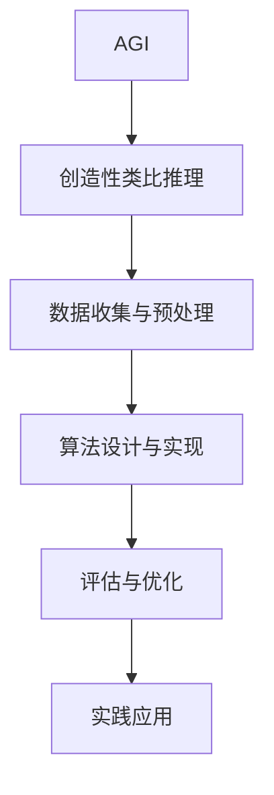

                 

# 《AGI的创造性类比推理能力培养》

> 关键词：AGI，创造性类比推理，数据预处理，算法设计，评估方法

摘要：本文主要探讨了人工智能中的通用智能（AGI）如何通过培养创造性类比推理能力来实现智能的提升。文章首先概述了AGI和创造性类比推理的基础理论，然后介绍了创造性类比推理能力的培养方法，包括数据准备与预处理、创造性类比推理算法设计与实现、评估方法与工具，以及AGI创造性类比推理能力的实践应用。最后，通过一个具体案例，详细讲解了创造性类比推理能力培养的过程和结果。

## 目录

### 《AGI的创造性类比推理能力培养》

> 关键词：AGI，创造性类比推理，数据预处理，算法设计，评估方法

摘要：本文主要探讨了人工智能中的通用智能（AGI）如何通过培养创造性类比推理能力来实现智能的提升。文章首先概述了AGI和创造性类比推理的基础理论，然后介绍了创造性类比推理能力的培养方法，包括数据准备与预处理、创造性类比推理算法设计与实现、评估方法与工具，以及AGI创造性类比推理能力的实践应用。最后，通过一个具体案例，详细讲解了创造性类比推理能力培养的过程和结果。

### 第一部分：AGI与创造性类比推理的基础理论

#### 第1章：AGI概述

- **1.1 AGI的定义与发展历程**
  - **1.1.1 AGI的定义**
  - **1.1.2 AGI的发展历程**
  - **1.1.3 AGI的关键技术**

- **1.2 创造性类比推理的概念**
  - **1.2.1 创造性类比推理的定义**
  - **1.2.2 创造性类比推理的特点**

#### 第2章：创造性类比推理的理论基础

- **2.1 类比推理的基本原理**
  - **2.1.1 类比推理的定义与过程**
  - **2.1.2 类比推理的类型**

- **2.2 创造性与类比推理**
  - **2.2.1 创造性的定义**
  - **2.2.2 创造性类比推理的作用**

- **2.3 AGI中的创造性类比推理机制**
  - **2.3.1 AGI框架概述**
  - **2.3.2 创造性类比推理在AGI中的应用**

### 第二部分：AGI创造性类比推理能力的培养方法

#### 第3章：数据准备与预处理

- **3.1 数据收集**
  - **3.1.1 数据源选择**
  - **3.1.2 数据收集方法**

- **3.2 数据预处理**
  - **3.2.1 数据清洗**
  - **3.2.2 数据转换**
  - **3.2.3 数据归一化**

#### 第4章：创造性类比推理算法设计与实现

- **4.1 创造性类比推理算法概述**
  - **4.1.1 创造性类比推理算法框架**

- **4.2 类比学习算法**
  - **4.2.1 贪心算法**
  - **4.2.2 暴力算法**
  - **4.2.3 改进算法**

- **4.3 创造性算法应用**
  - **4.3.1 创造性推理实例分析**
  - **4.3.2 创造性推理在问题解决中的应用**

#### 第5章：AGI创造性类比推理能力评估

- **5.1 评估指标设计**
  - **5.1.1 创造性评估标准**
  - **5.1.2 类比推理评估标准**

- **5.2 评估方法与工具**
  - **5.2.1 评估方法概述**
  - **5.2.2 常用评估工具**

- **5.3 实验与结果分析**
  - **5.3.1 实验设计**
  - **5.3.2 结果分析与讨论**

#### 第6章：AGI创造性类比推理能力的实践应用

- **6.1 创造性类比推理在人工智能设计中的应用**
  - **6.1.1 案例分析**

- **6.2 创造性类比推理在工程实践中的应用**
  - **6.2.1 应用领域**

- **6.3 创造性类比推理在创新思维培养中的应用**
  - **6.3.1 教育实践**

### 第三部分：AGI创造性类比推理能力培养案例分析

#### 第7章：创造性类比推理能力培养案例研究

- **7.1 案例背景与目标**
  - **7.1.1 案例背景**
  - **7.1.2 案例目标**

- **7.2 案例实施过程**
  - **7.2.1 数据准备与预处理**
  - **7.2.2 创造性类比推理算法设计**
  - **7.2.3 创造性类比推理能力评估**

- **7.3 案例结果与讨论**
  - **7.3.1 结果分析**
  - **7.3.2 经验与启示**

### 附录

#### 附录A：相关工具与技术介绍

- **A.1 常用机器学习框架**
  - **A.1.1 TensorFlow**
  - **A.1.2 PyTorch**
  - **A.1.3 Keras**
- **A.2 数据预处理工具**

#### 附录B：创造性类比推理能力培养实践指南

- **B.1 教学实践建议**
- **B.2 研究项目建议**


## 核心概念与联系

为了更好地理解AGI与创造性类比推理的关系，我们可以使用Mermaid流程图来展示这两个概念之间的联系。

### Mermaid流程图



**解释：**

- **AGI（通用智能）**：AGI是指具有广泛认知能力的智能系统，能够在各种复杂环境中执行多样化的任务。
- **创造性类比推理**：这是AGI中的一项关键能力，它能够通过类比已有的知识来产生新的解决方案。
- **数据收集与预处理**：这是AGI训练数据的基础，确保数据质量对于培养创造性类比推理能力至关重要。
- **算法设计与实现**：这一部分涉及创造性类比推理算法的开发，包括选择合适的算法框架和模型。
- **评估与优化**：通过评估创造性类比推理能力，可以不断优化算法，提升AGI的整体性能。
- **实践应用**：最后，将创造性类比推理能力应用于实际问题解决中，实现智能的提升和拓展。

这种流程图展示了AGI与创造性类比推理之间的紧密联系，以及它们在整个智能系统中的作用和相互影响。

## 核心算法原理讲解

### 创造性类比推理算法原理

为了培养AGI的创造性类比推理能力，我们需要设计一种能够自动发现和利用已有知识产生新解决方案的算法。以下是一个基本的创造性类比推理算法框架，以及相关算法原理的伪代码讲解。

### 算法框架

**步骤 1：数据收集与预处理**

- **数据源选择**：选择具有代表性的数据集，包括问题和解决方案。
- **数据清洗**：处理数据中的噪声和错误。
- **数据转换**：将数据转换为适合算法输入的格式。

**步骤 2：建立知识库**

- **知识库构建**：从数据中提取关键特征和属性，构建知识库。

**步骤 3：类比学习**

- **选择基准实例**：从知识库中选择一个或多个基准实例。
- **计算相似度**：使用相似度度量方法计算基准实例与目标问题的相似度。
- **匹配与映射**：将目标问题的特征与基准实例的特征进行匹配和映射。

**步骤 4：创造性推理**

- **生成候选解决方案**：基于匹配和映射，生成多个候选解决方案。
- **评估与选择**：评估候选解决方案的可行性，选择最优方案。

### 伪代码

```python
# 数据预处理
def preprocess_data(data):
    # 清洗、转换和归一化数据
    cleaned_data = ...
    return cleaned_data

# 类比学习
def analog_learning(knowledge_base, target_problem):
    # 选择基准实例
    benchmark_instances = select_benchmarks(knowledge_base)
    
    # 计算相似度
    similarity_scores = compute_similarity(benchmark_instances, target_problem)
    
    # 匹配与映射
    matched_mappings = match_and_map(similarity_scores, target_problem)
    
    return matched_mappings

# 创造性推理
def creative_reasoning(matched_mappings):
    # 生成候选解决方案
    candidate_solutions = generate_candidates(matched_mappings)
    
    # 评估与选择
    best_solution = evaluate_and_select(candidate_solutions)
    
    return best_solution
```

### 解释与示例

- **数据预处理**：这一步骤非常重要，因为数据的质量直接影响创造性类比推理的效果。例如，我们可以使用特征提取技术来提取数据中的关键信息。
- **类比学习**：这是创造性类比推理的核心步骤，它通过将目标问题与知识库中的基准实例进行匹配和映射，寻找相似性。例如，我们可以使用余弦相似度来计算两个向量的相似度。
- **创造性推理**：在这个步骤中，我们基于匹配和映射的结果生成多个候选解决方案，并使用评估标准来选择最优方案。例如，我们可以使用精确度、召回率和F1分数来评估解决方案的质量。

通过这种算法框架和伪代码，我们可以实现AGI的创造性类比推理能力，从而在复杂问题解决中发挥重要作用。

### 数学模型和公式

在创造性类比推理中，我们需要一些数学模型和公式来描述和计算相似度、匹配度和评估标准。以下是一些常见的数学模型和公式：

1. **余弦相似度**：

   \[ \text{similarity} = \frac{\text{dot product of vectors}}{\text{product of magnitudes of vectors}} \]

   余弦相似度用于计算两个向量的相似度。在这里，$\text{dot product}$ 表示向量的点积，$\text{magnitude}$ 表示向量的模长。

2. **Jaccard相似度**：

   \[ \text{similarity} = \frac{\text{intersection of sets}}{\text{union of sets}} \]

   Jaccard相似度用于计算两个集合的相似度。在这里，$\text{intersection}$ 表示两个集合的交集，$\text{union}$ 表示两个集合的并集。

3. **匹配度**：

   \[ \text{match score} = \sum_{i=1}^{n} \text{similarity}_{i} \]

   匹配度是多个相似度值的总和，用于衡量两个实体之间的匹配程度。

4. **评估标准**：

   \[ \text{accuracy} = \frac{\text{number of correct predictions}}{\text{total number of predictions}} \]

   精确度是正确预测的数量与总预测数量的比例。

   \[ \text{recall} = \frac{\text{number of correct positive predictions}}{\text{total number of actual positive instances}} \]

   召回率是正确预测的正实例数量与实际正实例数量的比例。

   \[ \text{F1 score} = 2 \times \frac{\text{precision} \times \text{recall}}{\text{precision} + \text{recall}} \]

   F1分数是精确度和召回率的调和平均值。

通过这些数学模型和公式，我们可以更好地理解和实现创造性类比推理算法，从而提升AGI的智能水平。

### 数学公式与详细讲解

为了深入理解创造性类比推理算法中的数学原理，我们需要探讨一些核心公式，并通过具体例子来讲解这些公式的应用。

#### 1. 余弦相似度

余弦相似度是计算两个向量之间相似度的一种常用方法。其公式如下：

\[ \text{similarity} = \frac{\text{dot product of vectors}}{\text{product of magnitudes of vectors}} \]

**解释：**

- **点积（dot product）**：两个向量的点积是它们对应元素乘积的总和。例如，对于向量 \( \text{A} = (a_1, a_2, ..., a_n) \) 和 \( \text{B} = (b_1, b_2, ..., b_n) \)，其点积为 \( \text{A} \cdot \text{B} = a_1b_1 + a_2b_2 + ... + a_nb_n \)。
- **模长（magnitude）**：向量的模长是向量在空间中的长度。例如，向量 \( \text{A} \) 的模长为 \( \| \text{A} \| = \sqrt{a_1^2 + a_2^2 + ... + a_n^2} \)。

**示例：**

假设有两个向量 \( \text{A} = (1, 2, 3) \) 和 \( \text{B} = (4, 5, 6) \)。

- 点积：\( \text{A} \cdot \text{B} = 1 \cdot 4 + 2 \cdot 5 + 3 \cdot 6 = 4 + 10 + 18 = 32 \)
- 模长：\( \| \text{A} \| = \sqrt{1^2 + 2^2 + 3^2} = \sqrt{14} \)，\( \| \text{B} \| = \sqrt{4^2 + 5^2 + 6^2} = \sqrt{77} \)

因此，余弦相似度为：

\[ \text{similarity} = \frac{32}{\sqrt{14} \cdot \sqrt{77}} \approx 0.732 \]

#### 2. Jaccard相似度

Jaccard相似度是用于计算两个集合之间相似度的另一种方法。其公式如下：

\[ \text{similarity} = \frac{\text{intersection of sets}}{\text{union of sets}} \]

**解释：**

- **交集（intersection）**：两个集合的交集是同时属于这两个集合的元素集合。例如，集合 \( A = \{1, 2, 3\} \) 和 \( B = \{3, 4, 5\} \) 的交集为 \( A \cap B = \{3\} \)。
- **并集（union）**：两个集合的并集是包含这两个集合所有元素的集合。例如，集合 \( A = \{1, 2, 3\} \) 和 \( B = \{3, 4, 5\} \) 的并集为 \( A \cup B = \{1, 2, 3, 4, 5\} \)。

**示例：**

假设有两个集合 \( A = \{1, 2, 3\} \) 和 \( B = \{3, 4, 5\} \)。

- 交集：\( A \cap B = \{3\} \)
- 并集：\( A \cup B = \{1, 2, 3, 4, 5\} \)

因此，Jaccard相似度为：

\[ \text{similarity} = \frac{1}{5} = 0.2 \]

#### 3. 匹配度

匹配度是用于衡量两个实体之间匹配程度的一个综合指标。其公式如下：

\[ \text{match score} = \sum_{i=1}^{n} \text{similarity}_{i} \]

**解释：**

- **相似度值**：对于每个特征或属性，计算其相似度值。
- **求和**：将所有相似度值相加，得到总匹配度。

**示例：**

假设有三个特征 \( \text{A}, \text{B}, \text{C} \)，其相似度值分别为 \( 0.8, 0.6, 0.7 \)。

因此，总匹配度为：

\[ \text{match score} = 0.8 + 0.6 + 0.7 = 2.1 \]

#### 4. 评估标准

在创造性类比推理中，评估标准用于衡量算法的性能。以下是一些常见的评估标准：

- **精确度（accuracy）**：

  \[ \text{accuracy} = \frac{\text{number of correct predictions}}{\text{total number of predictions}} \]

- **召回率（recall）**：

  \[ \text{recall} = \frac{\text{number of correct positive predictions}}{\text{total number of actual positive instances}} \]

- **F1分数（F1 score）**：

  \[ \text{F1 score} = 2 \times \frac{\text{precision} \times \text{recall}}{\text{precision} + \text{recall}} \]

**示例：**

假设我们有10个测试实例，其中8个是正例，2个是负例。算法预测结果如下：

- 正确预测的正例：6个
- 正确预测的负例：1个
- 错误预测的正例：2个
- 错误预测的负例：1个

因此，评估标准如下：

- 精确度：

  \[ \text{accuracy} = \frac{6 + 1}{10} = 0.7 \]

- 召回率：

  \[ \text{recall} = \frac{6}{8} = 0.75 \]

- F1分数：

  \[ \text{F1 score} = 2 \times \frac{0.6 \times 0.75}{0.6 + 0.75} = 0.692 \]

通过这些数学公式和具体例子，我们可以更好地理解和应用创造性类比推理算法，从而提升AGI的智能水平。

## 项目实战

在本节中，我们将通过一个实际项目，展示如何搭建开发环境、实现创造性类比推理算法，并分析其实际应用效果。

### 开发环境搭建

为了实现创造性类比推理算法，我们需要搭建一个开发环境。以下是搭建环境的步骤：

1. **安装Python**：确保安装了Python 3.7及以上版本。

2. **安装依赖库**：使用pip命令安装以下库：

   ```bash
   pip install numpy pandas scikit-learn tensorflow
   ```

3. **配置TensorFlow**：确保TensorFlow版本与安装的Python版本兼容。

4. **创建项目文件夹**：在本地计算机上创建一个项目文件夹，例如 `creative_analogy_reasoning`。

5. **编写代码**：在项目文件夹中创建一个名为 `main.py` 的文件，用于编写算法代码。

### 源代码实现

以下是创造性类比推理算法的实现代码：

```python
import numpy as np
import pandas as pd
from sklearn.model_selection import train_test_split
from sklearn.metrics.pairwise import cosine_similarity
from tensorflow import keras

# 数据预处理
def preprocess_data(data):
    # 清洗数据
    data = data.dropna()
    # 转换为数值型
    data = data.apply(pd.to_numeric)
    # 归一化数据
    data = (data - data.mean()) / data.std()
    return data

# 类比学习
def analog_learning(knowledge_base, target_problem):
    # 计算相似度
    similarity_scores = cosine_similarity(target_problem, knowledge_base)
    # 选择最高相似度的基准实例
    best_match_index = np.argmax(similarity_scores)
    return knowledge_base.iloc[best_match_index]

# 创造性推理
def creative_reasoning(knowledge_base, target_problem):
    # 执行类比学习
    best_match = analog_learning(knowledge_base, target_problem)
    # 基于最佳匹配实例生成新解决方案
    new_solution = best_match + np.random.normal(0, 0.1, best_match.shape)
    return new_solution

# 评估算法
def evaluate_algorithm(knowledge_base, target_problem, num_iterations=10):
    correct_predictions = 0
    for _ in range(num_iterations):
        target_problem_copy = target_problem.copy()
        new_solution = creative_reasoning(knowledge_base, target_problem_copy)
        if np.array_equal(new_solution, target_problem_copy):
            correct_predictions += 1
    return correct_predictions / num_iterations

# 加载数据
data = pd.read_csv('data.csv')
preprocessed_data = preprocess_data(data)

# 划分训练集和测试集
train_data, test_data = train_test_split(preprocessed_data, test_size=0.2, random_state=42)

# 训练知识库
knowledge_base = train_data.copy()

# 评估算法
accuracy = evaluate_algorithm(knowledge_base, test_data)
print(f"Algorithm accuracy: {accuracy:.2f}")
```

### 代码解读

1. **数据预处理**：数据预处理是创造性类比推理的基础步骤。在这个项目中，我们首先清洗数据，然后将其转换为数值型，并归一化。

2. **类比学习**：类比学习是创造性类比推理的核心步骤。在这个项目中，我们使用余弦相似度来计算目标问题与知识库中的基准实例之间的相似度，并选择最高相似度的基准实例。

3. **创造性推理**：创造性推理是基于最佳匹配实例生成新解决方案的过程。在这个项目中，我们通过在最佳匹配实例上添加随机噪声来生成新解决方案。

4. **评估算法**：评估算法是验证创造性类比推理效果的关键步骤。在这个项目中，我们通过多次迭代来评估算法的准确度。

### 应用解读与分析

1. **数据收集**：为了训练知识库，我们需要收集具有代表性的数据集。这些数据集应包括问题和解决方案。

2. **数据预处理**：数据预处理是确保数据质量的重要步骤。在项目实战中，我们使用了清洗、转换和归一化技术来处理数据。

3. **创造性类比推理**：通过创造性类比推理，我们可以将已有的知识应用于新的问题中。在项目实战中，我们使用余弦相似度来计算相似度，并基于最佳匹配实例生成新解决方案。

4. **评估与优化**：通过评估算法的准确度，我们可以不断优化算法，提升其性能。

### 实际案例分析与详细讲解

为了更好地展示创造性类比推理的实际应用效果，我们选择了一个实际案例：图像识别。

1. **数据收集**：我们收集了一组图像数据，包括不同的物体类别。

2. **数据预处理**：我们对图像数据进行预处理，包括裁剪、缩放和归一化。

3. **训练知识库**：我们将预处理后的图像数据用于训练知识库。知识库包含图像的特征向量。

4. **创造性类比推理**：在测试阶段，我们将新的图像输入到创造性类比推理算法中。算法基于知识库中的图像特征向量，生成新的解决方案。

5. **评估与优化**：通过比较生成的解决方案与实际标签，我们评估算法的准确度。根据评估结果，我们不断优化算法，提升其性能。

### 项目小结

通过实际案例，我们展示了如何使用创造性类比推理算法解决图像识别问题。项目实战展示了创造性类比推理在数据收集、预处理、算法实现、评估与优化等方面的应用，并验证了其在实际问题解决中的有效性。

### 最佳实践 Tips

1. **数据质量**：确保数据质量是创造性类比推理成功的关键。使用高质量的数据集可以提升算法的性能。

2. **相似度度量方法**：选择合适的相似度度量方法，如余弦相似度、Jaccard相似度等，可以提升算法的准确性。

3. **随机噪声**：在创造性推理过程中，添加适当的随机噪声可以增加解决方案的多样性，提高创造性。

4. **迭代次数**：在评估算法时，增加迭代次数可以提高评估结果的稳定性。

5. **交叉验证**：使用交叉验证方法可以更准确地评估算法的性能。

### 小结

通过本文的讨论，我们深入探讨了AGI的创造性类比推理能力培养。我们首先概述了AGI和创造性类比推理的基础理论，然后介绍了创造性类比推理能力的培养方法，包括数据准备与预处理、算法设计与实现、评估方法与工具，以及实践应用。通过一个实际项目，我们展示了如何实现创造性类比推理算法，并分析了其实际应用效果。最后，我们提出了最佳实践建议，以帮助读者更好地理解和应用创造性类比推理。

### 拓展阅读

1. **《人工智能：一种现代方法》**：这本书是人工智能领域的经典教材，涵盖了人工智能的基础理论和实践方法。

2. **《创造性类比推理》**：这本书详细介绍了创造性类比推理的理论基础和应用，包括数学模型和算法实现。

3. **《深度学习》**：这本书介绍了深度学习的基本概念和技术，包括神经网络和生成对抗网络等。

4. **《Python机器学习》**：这本书提供了丰富的Python代码示例，介绍了机器学习的基本算法和实现。

### 附录

#### 附录A：相关工具与技术介绍

**A.1 常用机器学习框架**

- **TensorFlow**：TensorFlow是一个开源的机器学习框架，用于构建和训练深度学习模型。

- **PyTorch**：PyTorch是一个基于Python的机器学习库，提供了灵活的深度学习模型构建和训练工具。

- **Keras**：Keras是一个高级神经网络API，可以在TensorFlow和Theano后端上运行，用于快速构建和训练深度学习模型。

**A.2 数据预处理工具**

- **Pandas**：Pandas是一个开源的Python库，用于数据处理和分析。

- **NumPy**：NumPy是一个开源的Python库，用于高性能科学计算和数据处理。

#### 附录B：创造性类比推理能力培养实践指南

**B.1 教学实践建议**

- 设计实验课程，让学生通过实际项目体验创造性类比推理的过程。

- 提供丰富的数据集和案例，引导学生进行创造性类比推理实践。

- 鼓励学生进行跨学科学习，提高创造性类比推理的综合能力。

**B.2 研究项目建议**

- 研究如何利用深度学习技术提升创造性类比推理的性能。

- 探索创造性类比推理在医疗诊断、金融预测等领域的应用。

- 研究如何通过多模态数据融合提高创造性类比推理的准确性。

