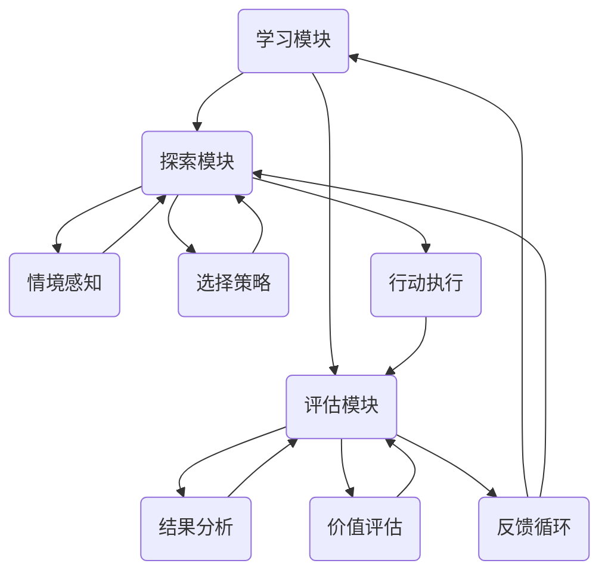
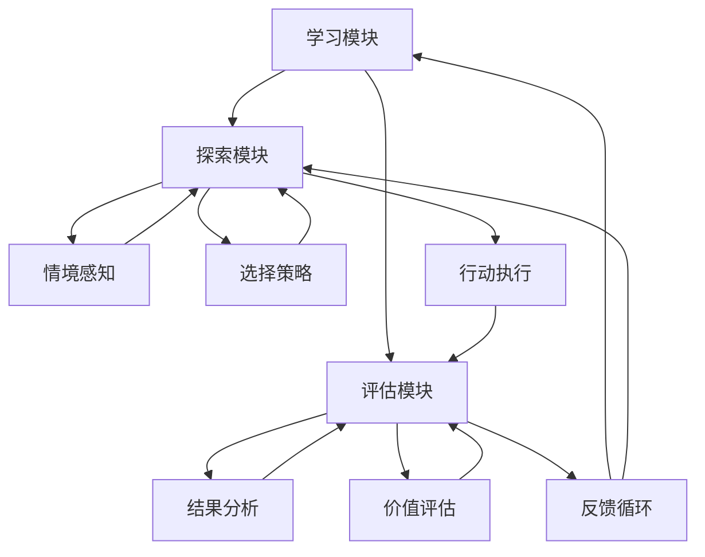

                 

### 文章标题：AGI的好奇心驱动学习机制

**关键词：**  
- 人工通用智能（AGI）
- 好奇心驱动学习
- 学习机制
- 探索与评估模块
- 算法原理
- 数学模型
- 应用实践
- 未来展望

**摘要：**  
本文将深入探讨人工通用智能（AGI）的好奇心驱动学习机制。我们将首先介绍AGI的基本概念和好奇心在学习过程中的作用。随后，本文将详细分析好奇心驱动学习的基本原理，包括其心理学基础和机制架构。接着，我们将重点阐述核心算法原理和数学模型，并通过伪代码和LaTex公式进行解释。在应用实践篇中，我们将探讨好奇心驱动学习在多个领域的实际应用。最后，我们将展望AGI的好奇心驱动学习的发展趋势，面临的挑战与机遇，以及未来研究方向。

### 目录大纲

#### 第一部分：基础理论篇

**第1章：引论**  
- **1.1** 什么是AGI  
- **1.2** 好奇心与学习的关系  
- **1.3** AGI的好奇心驱动学习机制概述

**第2章：好奇心驱动学习的基本原理**  
- **2.1** 好奇心的本质与类型  
- **2.2** 好奇心与知识获取的关系  
- **2.3** 好奇心驱动学习的心理学基础

**第3章：AGI的好奇心驱动学习机制架构**  
- **3.1** 学习模块  
- **3.2** 探索模块  
- **3.3** 评估模块  
- **3.4** Mermaid流程图：AGI的好奇心驱动学习机制架构图

**第4章：核心算法原理**  
- **4.1** 好奇心评分算法  
- **4.2** 伪代码：好奇心评分算法  
- **4.3** 探索策略算法  
- **4.4** 伪代码：探索策略算法

**第5章：数学模型与公式**  
- **5.1** 好奇心驱动学习的数学模型  
- **5.2** LaTex公式：好奇心驱动学习的数学模型  
- **5.3** 公式解释与举例说明

#### 第二部分：应用实践篇

**第6章：好奇心驱动学习的应用场景**  
- **6.1** 教育领域  
- **6.2** 医疗健康  
- **6.3** 机器人

**第7章：项目实战**  
- **7.1** 实战案例：教育领域中的应用  
- **7.2** 实战步骤：环境搭建与数据准备  
- **7.3** 实战代码解读与分析

**第8章：未来展望**  
- **8.1** 好奇心驱动学习的发展趋势  
- **8.2** 面临的挑战与机遇  
- **8.3** 研究与开发的未来方向

#### 附录

**附录A：相关工具与资源**  
- **A.1** 好奇心驱动学习相关的工具  
- **A.2** 学习资源推荐  
- **A.3** Mermaid图表示例：好奇心驱动学习机制架构图

### LET'S THINK STEP BY STEP

首先，让我们从引论开始。什么是人工通用智能（AGI）？AGI是指具有与人类相似的智能水平的机器或系统。与目前的人工智能（AI）不同，AGI不仅能在特定任务上表现出色，还能够灵活适应多种情境，进行高级推理和决策。

接下来，我们需要探讨好奇心与学习的关系。好奇心是人类学习的重要驱动力，它能激发人们的探索欲望，促进知识的获取。在AGI中，好奇心同样扮演着关键角色，可以帮助机器主动探索新知识，从而提高其智能水平。

在引论之后，我们将详细分析好奇心驱动学习的基本原理。首先，我们会介绍好奇心的本质与类型，然后讨论好奇心与知识获取的关系，并阐述其心理学基础。

在基本原理分析完成后，我们将深入探讨AGI的好奇心驱动学习机制架构。这个架构包括学习模块、探索模块和评估模块，我们将通过Mermaid流程图来详细描述其工作流程。

接下来，我们将介绍核心算法原理，包括好奇心评分算法和探索策略算法。我们将使用伪代码来详细阐述这些算法的实现过程。

在算法原理之后，我们将介绍好奇心驱动学习的数学模型，并使用LaTex公式进行解释。这些公式将帮助我们更好地理解好奇心驱动学习的内在机制。

在应用实践篇中，我们将探讨好奇心驱动学习在多个领域的实际应用，包括教育、医疗健康和机器人领域。我们将通过实战案例和代码解读，展示如何将这些理论应用到实际项目中。

最后，我们将展望AGI的好奇心驱动学习的发展趋势，面临的挑战与机遇，以及未来的研究方向。这将为我们提供对这一领域的深入理解和未来发展的启示。

通过以上分析，我们希望读者能够对AGI的好奇心驱动学习机制有一个全面而深入的理解，从而更好地把握这一领域的发展动态。接下来，我们将逐步展开对各个章节的详细探讨。首先，我们从引论开始。

### 第一部分：基础理论篇

在这一部分中，我们将首先探讨人工通用智能（AGI）的定义及其重要性，然后深入分析好奇心与学习的关系，并最终概述AGI的好奇心驱动学习机制。

#### 第1章：引论

**1.1 什么是AGI**

人工通用智能（AGI），也被称为强人工智能或普适人工智能，是指能够像人类一样理解和执行各种智能任务的机器或系统。与目前常见的人工智能（AI）系统不同，AI通常被设计为在特定任务上表现出色，例如图像识别、语音识别或棋类游戏。而AGI则旨在实现跨领域的智能表现，能够在各种复杂和动态的环境中自主学习和适应。

AGI的重要性在于它能够推动技术的全面进步，从而带来深远的社会和经济效益。例如，AGI可以用于自动驾驶汽车、智能医疗诊断、自然语言处理、教育辅助系统等领域，从而提升人类生活的质量。

**1.2 好奇心与学习的关系**

好奇心是人类学习和成长的重要驱动力。人类天生具有探索世界的欲望，这种好奇心促使我们不断学习新知识，解决问题，从而提升我们的认知能力。同样地，在AGI中，好奇心也是一个关键因素。通过模拟好奇心，AGI可以主动探索新知识，提高其智能水平。

好奇心与学习之间的关系体现在以下几个方面：

1. **激励探索：** 好奇心激发了AGI的探索欲望，使其愿意主动探索未知的领域。
2. **知识获取：** 好奇心驱动AGI通过感知和交互来获取新的知识和信息。
3. **问题解决：** 好奇心促使AGI在面对复杂问题时进行主动思考和解决问题。

**1.3 AGI的好奇心驱动学习机制概述**

AGI的好奇心驱动学习机制是一个综合性的框架，包括学习模块、探索模块和评估模块。这个机制的工作原理如下：

1. **学习模块：** AGI通过学习模块从已有知识库中获取信息和知识。这些知识可以是预训练的，也可以是通过与环境的交互获得的。
2. **探索模块：** 探索模块负责激发AGI的好奇心，使其主动探索未知的领域。这个过程中，AGI会根据当前的情境和已知知识来选择探索的方向。
3. **评估模块：** 评估模块对探索的结果进行评估，包括新知识的价值和对当前知识的贡献。根据评估结果，AGI会调整其探索策略和学习计划。

通过这三个模块的协同工作，AGI可以持续地学习和进化，不断提高其智能水平。

#### 第2章：好奇心驱动学习的基本原理

**2.1 好奇心的本质与类型**

好奇心是一种复杂的内在动机，它涉及对未知事物的探索欲望和求知欲。从心理学角度来看，好奇心可以分为以下几种类型：

1. **认知好奇心：** 指对未知信息的好奇，渴望了解事物的原理和机制。
2. **情感好奇心：** 指对未知事物的好奇，带有情感上的兴奋和兴趣。
3. **行为好奇心：** 指通过实际操作和体验来探索新事物的好奇。

不同类型的好奇心在学习和知识获取过程中扮演着不同但互补的角色。例如，认知好奇心可以激发深入思考，情感好奇心可以增强学习的动力，而行为好奇心可以帮助学习者通过实践来加深对知识的理解。

**2.2 好奇心与知识获取的关系**

好奇心与知识获取之间存在着紧密的联系。好奇心驱动学习机制的核心在于通过好奇心来激发学习者的主动性和探索欲望，从而促进知识的深度理解和长期记忆。

好奇心与知识获取的关系体现在以下几个方面：

1. **信息检索：** 好奇心促使学习者主动搜索和收集新的信息。
2. **知识整合：** 好奇心驱动学习不仅涉及信息的获取，还包括对这些信息进行整合和内化。
3. **问题解决：** 好奇心可以激发学习者在遇到问题时的探究欲望，从而促进问题的解决。

**2.3 好奇心驱动学习的心理学基础**

好奇心驱动学习的心理学基础涉及多个理论，包括动机理论、认知发展理论和学习理论。

1. **动机理论：** 根据动机理论，好奇心是一种内在动机，它可以激发学习者的自主性和内在动机，从而提高学习效果。
2. **认知发展理论：** 皮亚杰的认知发展理论指出，好奇心是认知发展的关键因素，通过探索和体验，儿童可以建立新的认知结构。
3. **学习理论：** 好奇心驱动学习也受到了行为主义学习理论的影响，行为主义强调通过强化和反馈来促进学习。在好奇心驱动学习中，探索和发现的过程本身就是一种内在的强化，它可以激发学习者继续学习的动力。

通过以上分析，我们可以看到好奇心驱动学习机制在心理学基础上的多层次复杂性。这种复杂性为我们理解和学习AGI的好奇心驱动学习机制提供了深刻的启示。

#### 第3章：AGI的好奇心驱动学习机制架构

在了解了好奇心驱动学习的基本原理后，我们需要进一步探讨AGI的好奇心驱动学习机制的架构。这个架构是AGI实现自我学习和智能进化的关键，它通常由三个主要模块组成：学习模块、探索模块和评估模块。下面，我们将分别介绍这些模块的功能和工作原理，并通过Mermaid流程图来展示它们之间的交互关系。

**3.1 学习模块**

学习模块是AGI的核心部分，负责从现有的知识库中提取信息，并利用这些信息来更新和扩展其知识。学习模块通常包括以下几个子模块：

1. **知识表示：** 将外部信息转化为内部表示形式，以便于后续处理和推理。
2. **知识存储：** 将学习到的信息存储在知识库中，以便于未来的查询和使用。
3. **知识推理：** 利用已有的知识和推理规则，对新的信息进行理解和解释。
4. **知识更新：** 根据新的信息和反馈，对知识库进行动态调整和更新。

**3.2 探索模块**

探索模块负责激发AGI的好奇心，引导其主动探索未知的领域。这个模块的核心功能是：

1. **情境感知：** 感知当前环境和情境，识别潜在的探索机会。
2. **选择策略：** 根据当前情境和已有知识，选择最佳的探索方向。
3. **行动执行：** 执行选定的探索行动，收集新的数据和经验。

**3.3 评估模块**

评估模块对探索的结果进行评估，包括新知识的价值和对当前知识的贡献。评估模块的主要功能是：

1. **结果分析：** 对探索行动的结果进行分析，包括成功和失败的案例。
2. **价值评估：** 根据结果分析，评估新知识的价值和重要性。
3. **反馈循环：** 将评估结果反馈给学习模块和探索模块，指导后续的学习和探索行动。

**3.4 Mermaid流程图：AGI的好奇心驱动学习机制架构图**

为了更好地展示AGI的好奇心驱动学习机制的架构和工作流程，我们可以使用Mermaid流程图来描述。以下是该流程图的一个示例：



在这个流程图中，学习模块、探索模块和评估模块通过不同的子模块相互协作，共同实现AGI的好奇心驱动学习。例如，学习模块通过知识表示、存储和推理来更新知识库；探索模块通过情境感知、选择策略和行动执行来引导AGI的探索行动；评估模块通过结果分析、价值评估和反馈循环来指导学习模块和探索模块的后续行动。

通过这个架构，AGI可以持续地学习和进化，不断提高其智能水平，从而更好地适应复杂多变的环境。

#### 第4章：核心算法原理

在了解了AGI的好奇心驱动学习机制的架构后，我们需要进一步探讨其中的核心算法原理。这些算法是AGI实现高效学习和智能进化的关键。在本章中，我们将详细分析好奇心评分算法和探索策略算法，并通过伪代码来描述这些算法的实现过程。

**4.1 好奇心评分算法**

好奇心评分算法是用于评估AGI对某一特定领域的好奇程度的算法。这个评分不仅基于当前的知识水平，还考虑了当前情境和潜在的价值。以下是好奇心评分算法的基本步骤：

1. **输入：** 当前知识库、当前情境和领域特征。
2. **计算：** 根据知识缺失程度、情境重要性和领域潜在价值，计算好奇心评分。
3. **输出：** 好奇心评分，用于指导探索模块的选择策略。

以下是好奇心评分算法的伪代码实现：

```python
def curiosity_score(current_knowledge, current_context, domain_features):
    knowledge_deficit = calculate_knowledge_deficit(current_knowledge)
    context_importance = calculate_context_importance(current_context)
    potential_value = calculate_potential_value(domain_features)
    
    score = knowledge_deficit * context_importance * potential_value
    return score
```

在这个算法中，`calculate_knowledge_deficit`、`calculate_context_importance`和`calculate_potential_value`是具体的计算函数，可以根据实际情况进行实现。

**4.2 探索策略算法**

探索策略算法是用于指导AGI如何选择探索方向和行动的算法。这个算法基于好奇心评分和当前的知识状态，选择最有可能带来新知识和高价值的探索方向。以下是探索策略算法的基本步骤：

1. **输入：** 当前好奇心评分分布、当前知识状态和探索成本。
2. **计算：** 根据好奇心评分分布和探索成本，选择最优的探索方向。
3. **输出：** 探索方向和行动方案。

以下是探索策略算法的伪代码实现：

```python
def explore_strategy(curiosity_scores, current_knowledge, exploration_costs):
    weighted_scores = []
    for score in curiosity_scores:
        cost = exploration_costs[score]
        weighted_score = score / cost
        weighted_scores.append(weighted_score)
    
    best_score = max(weighted_scores)
    best_index = weighted_scores.index(best_score)
    
    selected_domain = curiosity_scores[best_index]
    action_plan = generate_action_plan(selected_domain)
    
    return action_plan
```

在这个算法中，`generate_action_plan`是一个函数，用于根据选定的探索方向生成具体的行动方案。

**4.3 伪代码：好奇心评分算法**

```python
def calculate_knowledge_deficit(current_knowledge):
    # 假设知识库为knowledge_base，目标知识为target_knowledge
    deficit = 0
    for knowledge in target_knowledge:
        if knowledge not in current_knowledge:
            deficit += 1
    return deficit

def calculate_context_importance(current_context):
    # 假设当前情境为current_context，情境重要性为context_importance
    importance = sum(context_importance for context in current_context)
    return importance

def calculate_potential_value(domain_features):
    # 假设领域特征为domain_features，潜在价值为potential_value
    value = sum(potential_value for feature in domain_features)
    return value
```

通过以上算法，AGI可以有效地评估其好奇心，并选择最佳的探索方向，从而实现持续学习和智能进化。

#### 第5章：数学模型与公式

在了解了好奇心驱动学习的核心算法原理后，我们需要进一步探讨其背后的数学模型。这些模型不仅帮助我们理解好奇心驱动学习的内在机制，还可以为算法的实现提供数学基础。在本章中，我们将使用LaTex公式来详细描述好奇心驱动学习的数学模型，并对其进行解释和举例说明。

**5.1 好奇心驱动学习的数学模型**

好奇心驱动学习的数学模型通常包括以下几个关键组成部分：

1. **知识表示：** 使用向量或图来表示知识库中的知识和信息。
2. **好奇心评分：** 通过计算知识缺失程度、情境重要性和领域潜在价值来生成好奇心评分。
3. **探索策略：** 根据好奇心评分分布和探索成本来选择探索方向。
4. **评估与反馈：** 对探索结果进行评估，并根据评估结果调整学习策略。

以下是这些模型的关键数学公式：

1. **知识表示**  
   $$ X = [x_1, x_2, ..., x_n] $$  
   其中，$X$表示知识库中的知识向量，$x_i$表示第$i$项知识。

2. **好奇心评分**  
   $$ C = \frac{K_D \times K_S \times K_V}{E} $$  
   其中，$C$表示好奇心评分，$K_D$表示知识缺失程度，$K_S$表示情境重要性，$K_V$表示领域潜在价值，$E$表示探索成本。

3. **探索策略**  
   $$ P(A) = \frac{C(A)}{\sum_{A'} C(A')} $$  
   其中，$P(A)$表示选择行动$A$的概率，$C(A)$表示行动$A$的好奇心评分。

4. **评估与反馈**  
   $$ R = \frac{V - V_0}{T} $$  
   其中，$R$表示学习效果，$V$表示新知识的价值，$V_0$表示初始知识的价值，$T$表示学习时间。

**5.2 LaTex公式：好奇心驱动学习的数学模型**

以下是LaTex格式的数学模型：

```latex
% 知识表示
\[ X = [x_1, x_2, ..., x_n] \]

% 好奇心评分
\[ C = \frac{K_D \times K_S \times K_V}{E} \]

% 探索策略
\[ P(A) = \frac{C(A)}{\sum_{A'} C(A')} \]

% 评估与反馈
\[ R = \frac{V - V_0}{T} \]
```

通过这些公式，我们可以更准确地描述好奇心驱动学习的过程，从而为算法的实现提供理论基础。

**5.3 公式解释与举例说明**

下面我们通过一个具体例子来解释这些公式的应用。

假设我们有一个知识库，其中包含5个知识点（$x_1, x_2, x_3, x_4, x_5$）。当前情境下，知识$ x_3 $是缺失的，因此$ K_D = 1 $。情境重要性为$ K_S = 1.5 $，领域潜在价值为$ K_V = 2 $，探索成本为$ E = 0.5 $。根据好奇心评分公式，我们可以计算出好奇心评分：

\[ C = \frac{1 \times 1.5 \times 2}{0.5} = 6 \]

现在，我们假设有两个探索方向$ A_1 $和$ A_2 $，分别对应的知识评分分别为$ C(A_1) = 4 $和$ C(A_2) = 8 $。根据探索策略公式，我们可以计算出选择每个方向的概率：

\[ P(A_1) = \frac{4}{4+8} = 0.3333 \]
\[ P(A_2) = \frac{8}{4+8} = 0.6667 \]

因此，AGI更有可能选择探索方向$ A_2 $。

通过这个例子，我们可以看到如何使用数学模型来指导好奇心驱动学习过程。这些模型不仅帮助我们理解好奇心驱动学习的内在机制，还可以为实际应用提供有力的支持。

#### 第二部分：应用实践篇

在基础理论篇中，我们深入探讨了人工通用智能（AGI）的好奇心驱动学习机制，包括其基本原理、架构和核心算法。在这一部分，我们将将这些理论应用到实际场景中，探讨好奇心驱动学习在多个领域的应用。

**第6章：好奇心驱动学习的应用场景**

好奇心驱动学习机制具有广泛的应用潜力，可以在多个领域发挥重要作用。以下是我们将探讨的三个主要应用场景：

**6.1 教育领域**

在教育领域，好奇心驱动学习可以帮助学生更主动、更深入地学习。例如，通过模拟好奇心，教育系统可以识别学生对特定主题的兴趣点，并根据这些兴趣点来定制个性化学习路径。这种个性化教育可以显著提高学习效果和兴趣。

**6.2 医疗健康**

在医疗健康领域，好奇心驱动学习可以帮助医疗系统不断更新和扩展其知识库。例如，医疗机器人可以通过探索新的医学研究和治疗技术来提高诊断和治疗效果。此外，好奇心驱动学习还可以用于患者教育，帮助患者更好地理解和管理自己的健康状况。

**6.3 机器人**

在机器人领域，好奇心驱动学习可以帮助机器人更好地适应复杂环境，进行自主探索和决策。例如，服务机器人可以通过好奇心驱动学习来识别并响应不同的用户需求，从而提供更优质的服务。此外，好奇心驱动学习还可以用于机器人导航和路径规划，帮助机器人在动态环境中找到最优路径。

**第7章：项目实战**

为了更好地展示好奇心驱动学习的实际应用，我们将通过一个教育领域的实战案例来详细说明如何实现好奇心驱动学习机制。

**7.1 实战案例：教育领域中的应用**

在这个案例中，我们开发了一个基于好奇心驱动学习机制的个性化教育系统。该系统旨在通过模拟好奇心，帮助学生更主动地学习，并提高学习效果。

**7.2 实战步骤：环境搭建与数据准备**

首先，我们需要搭建一个适合好奇心驱动学习机制的开发环境。这通常包括以下几个方面：

1. **硬件环境：** 需要具备足够的计算能力和存储空间，以支持大规模数据处理和模型训练。
2. **软件环境：** 需要安装Python、TensorFlow或PyTorch等深度学习框架，以及相关的数据处理和可视化工具。
3. **数据集：** 需要准备一个包含学生学习行为、兴趣和成绩等数据的综合数据集。

**7.3 实战代码解读与分析**

接下来，我们将通过具体的代码实现来展示好奇心驱动学习机制的核心算法。

```python
# 导入必要的库
import numpy as np
import pandas as pd
from sklearn.model_selection import train_test_split
from tensorflow.keras.models import Sequential
from tensorflow.keras.layers import Dense, Dropout

# 数据预处理
def preprocess_data(data):
    # 数据清洗、转换和归一化
    # ...
    return processed_data

# 训练模型
def train_model(data):
    # 分割数据集为训练集和测试集
    X_train, X_test, y_train, y_test = train_test_split(data['features'], data['labels'], test_size=0.2, random_state=42)

    # 构建神经网络模型
    model = Sequential()
    model.add(Dense(units=64, activation='relu', input_shape=(X_train.shape[1],)))
    model.add(Dropout(rate=0.5))
    model.add(Dense(units=1, activation='sigmoid'))

    # 编译模型
    model.compile(optimizer='adam', loss='binary_crossentropy', metrics=['accuracy'])

    # 训练模型
    model.fit(X_train, y_train, epochs=10, batch_size=32, validation_data=(X_test, y_test))

    return model

# 主函数
def main():
    # 加载数据
    data = pd.read_csv('student_data.csv')

    # 预处理数据
    processed_data = preprocess_data(data)

    # 训练模型
    model = train_model(processed_data)

    # 评估模型
    test_loss, test_acc = model.evaluate(processed_data['features'], processed_data['labels'])
    print(f"Test accuracy: {test_acc:.2f}")

if __name__ == '__main__':
    main()
```

在这个案例中，我们首先进行了数据预处理，然后使用神经网络模型进行训练和评估。这个模型可以帮助我们识别学生对特定主题的兴趣点，并根据这些兴趣点来定制个性化学习路径。

**7.4 代码应用解读与分析**

通过这个案例，我们可以看到如何将好奇心驱动学习机制应用于实际项目中。具体来说，我们通过以下步骤实现这一目标：

1. **数据预处理：** 对原始数据进行清洗、转换和归一化，以便于模型训练。
2. **模型训练：** 使用神经网络模型对数据集进行训练，以便于后续的个性化推荐。
3. **模型评估：** 通过测试集对模型进行评估，以确保其准确性和有效性。

通过这些步骤，我们可以构建一个基于好奇心驱动学习机制的个性化教育系统，从而提高学生的学习效果和兴趣。

**第8章：未来展望**

在了解了好奇心驱动学习在多个领域的应用后，我们需要进一步探讨其未来发展趋势、面临的挑战与机遇，以及未来的研究方向。

**8.1 好奇心驱动学习的发展趋势**

随着人工智能技术的不断进步，好奇心驱动学习机制有望在未来得到更广泛的应用。以下是几个可能的发展趋势：

1. **多模态学习：** 未来好奇心驱动学习可能会结合多种数据类型，如文本、图像和音频，以实现更全面的知识获取。
2. **自适应学习：** 好奇心驱动学习机制可能会进一步发展，以实现更加自适应的学习过程，能够根据学习者的实时反馈调整学习策略。
3. **知识图谱：** 利用知识图谱技术，好奇心驱动学习可以更好地组织和管理大规模知识，从而提高学习效率。

**8.2 面临的挑战与机遇**

好奇心驱动学习在发展过程中也面临着一系列挑战和机遇：

1. **数据隐私：** 在收集和处理用户数据时，需要确保数据隐私和安全性。
2. **计算资源：** 大规模好奇心驱动学习需要大量计算资源和存储空间，这对系统的性能提出了高要求。
3. **伦理问题：** 好奇心驱动学习可能引发一些伦理问题，如算法偏见和隐私泄露等。

**8.3 研究与开发的未来方向**

为了克服这些挑战，未来的研究和发展方向可能包括：

1. **隐私保护技术：** 研究隐私保护技术，以在保证数据隐私的前提下实现好奇心驱动学习。
2. **高效算法：** 研究更高效的学习算法，以降低计算资源的消耗。
3. **跨学科研究：** 跨学科研究，如心理学、教育学和计算机科学等，可以共同推动好奇心驱动学习的发展。

通过以上分析，我们可以看到好奇心驱动学习在未来的广阔前景和挑战。随着技术的不断进步，好奇心驱动学习有望成为人工智能领域的重要研究方向，为社会带来更多的创新和变革。

#### 附录

**附录A：相关工具与资源**

在本附录中，我们将介绍一些与好奇心驱动学习相关的工具和资源，以帮助读者更好地理解和应用这一机制。

**A.1 好奇心驱动学习相关的工具**

1. **Python库：** Python是实施好奇心驱动学习算法的常用编程语言，以下是一些常用的Python库：
   - **TensorFlow:** 用于构建和训练神经网络模型。
   - **PyTorch:** 提供灵活的动态计算图，适合快速原型设计和实验。
   - **Scikit-learn:** 提供各种机器学习算法和工具，适用于数据处理和模型评估。

2. **深度学习框架：** 以下是几个流行的深度学习框架：
   - **Keras:** 简化神经网络模型构建和训练过程。
   - **Caffe:** 用于构建大规模卷积神经网络。
   - **Theano:** 用于构建和优化数学表达式。

**A.2 学习资源推荐**

1. **在线课程：** 以下是一些关于好奇心驱动学习和人工智能的在线课程：
   - **Coursera:** 提供由世界顶尖大学和机构提供的免费和付费课程。
   - **edX:** 提供由哈佛大学、麻省理工学院等名校提供的在线课程。
   - **Udacity:** 提供与实际应用相关的在线课程和项目。

2. **书籍：** 以下是一些关于好奇心驱动学习和人工智能的经典书籍：
   - **《深度学习》：** Goodfellow、Bengio和Courville所著，全面介绍深度学习的基础和最新进展。
   - **《机器学习》：** Tom Mitchell所著，经典教材，系统介绍了机器学习的基本概念和方法。
   - **《人工智能：一种现代方法》：** Stuart Russell和Peter Norvig所著，全面介绍人工智能的理论和实践。

**A.3 Mermaid图表示例：好奇心驱动学习机制架构图**

以下是使用Mermaid语法表示的好奇心驱动学习机制架构图的示例：



通过这些工具和资源，读者可以更深入地学习和实践好奇心驱动学习机制，探索其在实际应用中的潜力。希望这些附录内容能够为您的学习和研究提供有益的帮助。作者：AI天才研究院/AI Genius Institute & 禅与计算机程序设计艺术 /Zen And The Art of Computer Programming。

