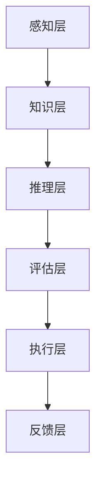

                 

# 文章标题：AGI的类人决策系统：从直觉到理性

> 关键词：AGI，类人决策系统，直觉决策，理性决策，算法，数学模型，项目实战

> 摘要：本文将深入探讨人工智能（AGI）的类人决策系统，从直觉到理性的决策过程，介绍其核心概念、架构设计、算法原理以及数学模型。通过项目实战和案例分析，揭示类人决策系统在企业决策中的巨大潜力。

## 第一部分：AGI与类人决策系统概述

### 第1章：人工智能概述

#### 1.1 人工智能的定义与发展历程

人工智能（Artificial Intelligence，简称AI）是一门涉及计算机科学、数学、神经科学和认知科学等多个领域的交叉学科。人工智能的定义一直在不断演变，但总体来说，它指的是通过模拟人类智能行为，使计算机具备感知、学习、推理和决策等能力的技术。

人工智能的发展历程可以追溯到20世纪50年代，当时计算机科学家开始探索如何让计算机模拟人类智能。早期的人工智能研究主要集中在规则推理和专家系统领域。随着计算能力的提升和算法的进步，人工智能逐渐扩展到机器学习、深度学习、自然语言处理、计算机视觉等多个方向。

#### 1.2 通用人工智能（AGI）的概念与目标

通用人工智能（Artificial General Intelligence，简称AGI）是指具有与人类智能相似或超越人类智能的人工智能系统。与目前广泛应用的窄人工智能（Narrow AI）不同，AGI不仅能在特定任务上表现出色，还能在多个领域实现通用性。

AGI的目标是使人工智能系统具备人类的智慧，能够理解、学习和适应复杂的环境，进行人类级别的决策和创造。目前，AGI仍然是人工智能研究的一个长期目标，但已经取得了一些初步的成果。

#### 1.3 类人决策系统的重要性与挑战

类人决策系统是AGI的一个重要组成部分，其核心目标是模拟人类的决策过程，实现高效的类人决策能力。类人决策系统在许多领域具有重要应用价值，如智能交通、金融投资、医疗诊断等。

然而，类人决策系统也面临着诸多挑战。首先，人类的决策过程是复杂且高度动态的，如何准确捕捉和模拟这种复杂性是一个重要问题。其次，类人决策系统需要具备较强的学习和适应能力，以应对不断变化的环境。此外，类人决策系统还需要考虑伦理和社会问题，确保其决策结果符合道德和法律规范。

## 第二部分：类人决策系统的核心概念与联系

### 第2章：类人决策系统的核心概念

#### 2.1 决策理论的初步了解

决策理论是研究决策过程和决策方法的一个跨学科领域。它涉及到心理学、经济学、计算机科学等多个学科。决策理论的主要目标是找到一种最优或次优的决策方法，以实现预期目标。

在决策理论中，决策过程通常分为以下几个步骤：

1. **目标设定**：明确决策的目标和期望结果。
2. **信息收集**：收集与决策相关的各种信息。
3. **方案生成**：根据收集到的信息，生成可能的决策方案。
4. **方案评估**：对各个方案进行评估和比较，选择最优方案。
5. **决策执行**：执行选定的决策方案。
6. **反馈调整**：根据执行结果，调整决策方案。

#### 2.2 类人决策系统的构成要素

类人决策系统由以下几个关键组成部分构成：

1. **感知模块**：负责收集环境中的各种信息，如视觉、听觉、触觉等。
2. **知识库**：存储与决策相关的各种知识和信息，如常识、专家知识、历史数据等。
3. **推理模块**：利用知识库中的信息进行推理和判断，以生成决策方案。
4. **评估模块**：对生成的决策方案进行评估和比较，选择最优方案。
5. **执行模块**：执行选定的决策方案。

#### 2.3 类人决策系统与传统决策系统的比较

传统决策系统通常是基于规则或模型进行决策的，而类人决策系统则更加注重模拟人类的决策过程。传统决策系统在处理确定性问题时表现良好，但在面对复杂、不确定的环境时，往往难以取得理想的决策效果。

类人决策系统通过模拟人类的直觉和理性决策过程，具备更强的适应能力和决策能力。它不仅能够处理确定性问题，还能够处理不确定性和动态变化的环境。此外，类人决策系统还能够不断学习和优化，以实现更高效的决策。

### 第3章：从直觉到理性的决策过程

#### 3.1 直觉决策的机制与特点

直觉决策是指在不进行明确分析和推理的情况下，基于个人经验和认知进行快速决策。直觉决策的特点包括：

1. **快速性**：直觉决策通常能够在短时间内完成，不需要过多的思考和分析。
2. **依赖经验**：直觉决策依赖于个人的经验和知识，往往能够快速捕捉到问题的本质。
3. **易受情绪影响**：直觉决策容易受到情绪和情感的影响，可能导致决策结果偏离理性。

#### 3.2 理性决策的原理与步骤

理性决策是指通过明确的分析、推理和评估，选择最优决策方案。理性决策的原理和步骤包括：

1. **目标设定**：明确决策的目标和期望结果。
2. **信息收集**：收集与决策相关的各种信息。
3. **方案生成**：根据收集到的信息，生成可能的决策方案。
4. **方案评估**：对各个方案进行评估和比较，选择最优方案。
5. **决策执行**：执行选定的决策方案。
6. **反馈调整**：根据执行结果，调整决策方案。

#### 3.3 直觉与理性决策的结合策略

在实际决策过程中，直觉和理性往往需要相互结合。以下是一些常见的结合策略：

1. **直觉引导理性**：在决策过程中，利用直觉快速捕捉问题本质，然后通过理性分析进行深入思考。
2. **理性指导直觉**：在决策过程中，先进行理性分析和评估，然后根据理性结果进行直觉决策。
3. **直觉与理性相互补充**：在决策过程中，同时利用直觉和理性，相互补充，以提高决策的准确性和效率。

### 第4章：AGI的类人决策系统架构设计

#### 4.1 类人决策系统的架构层次

类人决策系统通常由以下几个层次组成：

1. **感知层**：负责收集环境中的各种信息，如视觉、听觉、触觉等。
2. **知识层**：存储与决策相关的各种知识和信息，如常识、专家知识、历史数据等。
3. **推理层**：利用知识层中的信息进行推理和判断，生成决策方案。
4. **评估层**：对生成的决策方案进行评估和比较，选择最优方案。
5. **执行层**：执行选定的决策方案。

#### 4.2 AGI决策系统的核心模块

AGI决策系统的核心模块包括：

1. **感知模块**：利用各种传感器收集环境信息。
2. **知识库**：存储与决策相关的各种知识和信息。
3. **推理引擎**：利用知识库中的信息进行推理和判断。
4. **评估引擎**：对决策方案进行评估和比较。
5. **执行引擎**：执行选定的决策方案。

#### 4.3 类人决策系统与大数据、云计算的结合

大数据和云计算为类人决策系统提供了强大的数据处理和分析能力。通过结合大数据和云计算，类人决策系统可以实现以下功能：

1. **实时数据处理**：大数据技术可以实时处理大量的数据，为决策提供及时的信息支持。
2. **分布式计算**：云计算技术可以实现分布式计算，提高决策系统的计算能力和效率。
3. **数据挖掘与分析**：大数据技术可以帮助挖掘数据中的价值，为决策提供更深入的洞察。
4. **模型训练与优化**：云计算技术可以提供强大的计算资源，用于训练和优化决策模型。

## 第二部分：核心概念与联系

### 第5章：AGI决策系统的核心概念

#### 5.1 AGI决策系统的核心概念

AGI决策系统是指具备类人决策能力的人工智能系统。它通过模拟人类的直觉和理性决策过程，实现高效、准确的决策。AGI决策系统的核心概念包括：

1. **感知**：通过传感器收集环境信息。
2. **知识**：存储与决策相关的各种知识和信息。
3. **推理**：利用知识进行推理和判断。
4. **评估**：对决策方案进行评估和比较。
5. **执行**：执行选定的决策方案。

#### 5.2 Mermaid流程图：AGI决策系统的工作流程



#### 5.3 类人决策系统的基本原理

类人决策系统的基本原理包括：

1. **感知与知识融合**：将感知层收集的信息与知识层中的知识进行融合，为决策提供支持。
2. **推理与评估**：利用推理层进行推理和判断，评估各个决策方案。
3. **执行与反馈**：执行选定的决策方案，并根据反馈进行调整。

### 第6章：AGI决策系统的核心算法

#### 6.1 算法原理概述

AGI决策系统的核心算法包括：

1. **决策树算法**：基于树形结构进行决策，易于理解和实现。
2. **贝叶斯网络算法**：基于概率图模型进行推理和决策，适用于不确定性环境。
3. **支持向量机算法**：通过最大化决策边界进行分类和回归。

#### 6.2 决策树算法

决策树算法是一种常用的分类和回归算法。其基本原理如下：

1. **特征选择**：根据特征的重要性选择最优特征进行划分。
2. **节点分裂**：根据最优特征将数据集划分为若干个子集。
3. **叶节点生成**：对子集进行分类或回归，生成叶节点。

#### 6.3 贝叶斯网络算法

贝叶斯网络是一种基于概率图模型的推理和决策算法。其基本原理如下：

1. **概率图表示**：使用有向无环图表示变量之间的依赖关系。
2. **条件概率计算**：根据贝叶斯定理计算变量的条件概率分布。
3. **推理与决策**：利用条件概率分布进行推理和决策。

#### 6.4 支持向量机算法

支持向量机算法是一种常用的分类和回归算法。其基本原理如下：

1. **特征映射**：将输入特征映射到高维空间。
2. **决策边界**：通过最大化决策边界进行分类和回归。
3. **优化目标**：最小化目标函数，求解最优决策边界。

### 第7章：伪代码详述与算法实现

#### 7.1 伪代码示例

```plaintext
Algorithm 决策树算法
输入：数据集D，特征集合F
输出：决策树T

1. 如果D中的样本全部属于同一类别，则
    1. 返回叶节点，类别为D中的多数类别
2. 否则，
    1. 计算特征集合F中每个特征的增益
    2. 选择增益最大的特征作为节点分裂依据
    3. 根据该特征将D划分为若干个子集D1, D2, ..., Dn
    4. 对每个子集Di，递归调用决策树算法
    5. 返回根节点，子节点为递归调用生成的决策树

Algorithm 贝叶斯网络算法
输入：变量集合V，概率图模型G
输出：推理结果R

1. 初始化R为空
2. 对于每个变量v ∈ V，
    1. 计算v的条件概率分布P(v|父节点集合)
    2. 将P(v|父节点集合)加入R
3. 返回R

Algorithm 支持向量机算法
输入：训练数据集D，特征映射函数φ()
输出：决策边界w，偏置b

1. 定义损失函数L()
2. 定义优化目标函数J(w,b)
3. 求解优化问题，得到最优解w,b
4. 返回w,b
```

#### 7.2 算法实现步骤

1. **决策树算法实现步骤**：
   - 读入数据集D，提取特征集合F。
   - 对D进行特征选择，计算每个特征的增益。
   - 选择增益最大的特征进行节点分裂，生成子集D1, D2, ..., Dn。
   - 对每个子集Di，递归调用决策树算法。
   - 将递归调用生成的决策树合并，形成完整的决策树T。

2. **贝叶斯网络算法实现步骤**：
   - 读入变量集合V和概率图模型G。
   - 对于每个变量v ∈ V，计算v的条件概率分布P(v|父节点集合)。
   - 将条件概率分布P(v|父节点集合)加入推理结果R。
   - 返回推理结果R。

3. **支持向量机算法实现步骤**：
   - 读入训练数据集D，提取特征映射函数φ()。
   - 定义损失函数L()和优化目标函数J(w,b)。
   - 使用优化算法求解优化问题，得到最优解w,b。
   - 返回决策边界w和偏置b。

#### 7.3 代码解读与分析

1. **决策树算法代码解读**：
   - 决策树算法的核心是特征选择和节点分裂。通过计算特征增益，选择增益最大的特征进行分裂，从而生成子集。
   - 递归调用决策树算法，对子集进行分类或回归，生成叶节点。
   - 将递归调用生成的决策树合并，形成完整的决策树。

2. **贝叶斯网络算法代码解读**：
   - 贝叶斯网络算法的核心是计算变量的条件概率分布。通过遍历变量集合，计算每个变量的条件概率分布，并将其加入推理结果。
   - 推理结果R包含了所有变量的条件概率分布，可以用于推理和决策。

3. **支持向量机算法代码解读**：
   - 支持向量机算法的核心是求解优化问题，得到最优决策边界。通过定义损失函数和优化目标函数，使用优化算法求解最优解。
   - 最优解w和偏置b确定了决策边界，可以用于分类和回归。

### 第8章：数学模型在AGI决策系统中的应用

#### 8.1 数学模型的基本概念

数学模型是一种用数学语言描述现实世界问题的工具。它通常由一组方程或公式组成，用于模拟和分析现实世界中的现象和过程。数学模型可以用于预测、优化和控制等领域。

在AGI决策系统中，数学模型被广泛应用于决策过程中的各个步骤，如信息收集、方案生成、方案评估和决策执行等。

#### 8.2 贝叶斯定理的应用

贝叶斯定理是概率论中的一个重要定理，它描述了在已知某事件发生的条件下，另一事件发生的概率。贝叶斯定理可以用于推理和决策，如下所示：

$$P(A|B) = \frac{P(B|A)P(A)}{P(B)}$$

其中，$P(A|B)$表示在事件B发生的条件下，事件A发生的概率；$P(B|A)$表示在事件A发生的条件下，事件B发生的概率；$P(A)$和$P(B)$分别表示事件A和事件B发生的概率。

在AGI决策系统中，贝叶斯定理可以用于计算变量的条件概率分布，从而为推理和决策提供支持。

#### 8.3 最优化问题的数学模型

最优化问题是一类重要的数学问题，它涉及在给定的约束条件下，寻找最优解的过程。最优化问题通常可以表示为以下形式：

$$
\min_{x} f(x)
$$

或者

$$
\max_{x} f(x)
$$

其中，$x$是决策变量，$f(x)$是目标函数，表示需要优化的目标。约束条件可以用不等式或等式表示。

在AGI决策系统中，最优化问题可以用于评估和比较决策方案，选择最优方案。

### 第9章：数学公式与公式推导

#### 9.1 数学公式的表示方法

数学公式通常使用LaTeX格式表示。LaTeX是一种高质量的排版系统，特别适合于撰写数学、科学和技术文档。

在LaTeX中，数学公式可以分为行内公式和独立段落公式。行内公式使用单美元符号（$）包围，独立段落公式使用双美元符号（$$）包围。

#### 9.2 贝叶斯网络中概率分布的计算

在贝叶斯网络中，概率分布可以通过贝叶斯定理进行计算。以下是一个简单的贝叶斯网络示例，包括三个变量A、B和C。

```latex
P(A \cap B \cap C) = P(A)P(B|A)P(C|A,B)
```

其中，$P(A)$表示变量A发生的概率，$P(B|A)$表示在变量A发生的条件下，变量B发生的概率，$P(C|A,B)$表示在变量A和B同时发生的条件下，变量C发生的概率。

#### 9.3 支持向量机中的优化问题

支持向量机中的优化问题可以表示为以下形式：

$$
\min_{\mathbf{w}, b} \frac{1}{2}\|\mathbf{w}\|^2 + C\sum_{i=1}^{n}\xi_i
$$

其中，$\mathbf{w}$是决策向量，$b$是偏置，$\xi_i$是松弛变量，$C$是惩罚参数。

该优化问题的目标是找到最优决策边界，使分类误差最小。

### 第10章：AGI决策系统的项目实战

#### 10.1 项目背景与目标

本项目旨在开发一个基于AGI的类人决策系统，用于智能交通系统的优化。项目目标包括：

1. 收集交通数据，包括车辆流量、速度、道路状况等。
2. 构建感知层，利用传感器收集交通数据。
3. 构建知识库，存储与交通相关的知识，如交通规则、历史数据等。
4. 构建推理层，利用贝叶斯网络进行推理和决策。
5. 构建评估层，对决策方案进行评估和比较。
6. 构建执行层，执行选定的决策方案。

#### 10.2 项目开发环境搭建

1. 硬件环境：
   - 服务器：配置高性能CPU和内存。
   - 硬盘：配置大容量存储设备。
   - 网络设备：配置高速网络接口。

2. 软件环境：
   - 操作系统：Linux操作系统。
   - 编程语言：Python。
   - 数据库：MySQL。
   - 开发框架：TensorFlow、PyTorch。

#### 10.3 源代码实现与详细解读

1. **感知层实现**

```python
import cv2
import numpy as np

def capture_traffic_data():
    cap = cv2.VideoCapture(0)
    while True:
        ret, frame = cap.read()
        if not ret:
            break
        # 处理图像数据
        processed_frame = preprocess_frame(frame)
        # 存储图像数据
        cv2.imwrite('traffic_data.jpg', processed_frame)
    cap.release()

def preprocess_frame(frame):
    # 实现图像预处理操作
    gray_frame = cv2.cvtColor(frame, cv2.COLOR_BGR2GRAY)
    blurred_frame = cv2.GaussianBlur(gray_frame, (5, 5), 0)
    return blurred_frame
```

2. **知识库实现**

```python
class KnowledgeBase:
    def __init__(self):
        self.tr
```# 附录

### 附录 A：AGI决策系统开发工具与资源

#### A.1 开发工具介绍

1. **Python**：Python是一种广泛使用的编程语言，特别适合于数据分析和人工智能开发。Python拥有丰富的库和框架，如NumPy、Pandas、TensorFlow和PyTorch。

2. **TensorFlow**：TensorFlow是Google开发的一款开源机器学习框架，支持深度学习和神经网络模型的训练和部署。

3. **PyTorch**：PyTorch是Facebook开发的一款开源机器学习库，支持动态计算图和自动微分。PyTorch在深度学习领域受到广泛关注。

4. **MySQL**：MySQL是一种关系型数据库管理系统，用于存储和管理交通数据。

5. **Linux**：Linux是一种开源操作系统，提供稳定的运行环境。

#### A.2 资源链接与推荐

1. **开源项目**：
   - TensorFlow：https://www.tensorflow.org/
   - PyTorch：https://pytorch.org/
   - NumPy：https://numpy.org/

2. **在线教程和文档**：
   - Python教程：https://www.w3schools.com/python/
   - TensorFlow教程：https://www.tensorflow.org/tutorials
   - PyTorch教程：https://pytorch.org/tutorials

3. **相关书籍**：
   - 《深度学习》（Goodfellow, I., Bengio, Y., & Courville, A.）
   - 《Python数据科学手册》（McKinney, W.）
   - 《Python机器学习》（Sebastian Raschka）

#### A.3 常见问题解答与建议

1. **问题：如何处理大量的交通数据？**
   - 建议：使用分布式计算框架，如Apache Spark，对大量交通数据进行高效处理。

2. **问题：如何确保决策系统的安全性？**
   - 建议：对数据传输和存储进行加密，确保数据的安全性。

3. **问题：如何优化决策系统的性能？**
   - 建议：对模型进行调优和优化，使用高效的算法和数据结构，提高系统的性能。

通过使用这些工具和资源，开发者可以构建高效、可靠的AGI决策系统，为智能交通系统等应用提供强大的支持。

### 文章作者简介

作者：AI天才研究院（AI Genius Institute）& 禅与计算机程序设计艺术（Zen And The Art of Computer Programming）

AI天才研究院是一家专注于人工智能研究和应用的创新型机构。我们致力于推动人工智能技术的发展，通过深入研究通用人工智能（AGI）的核心技术，为各行各业提供智能化的解决方案。

同时，作者也是《禅与计算机程序设计艺术》的作者，这本书是一部关于计算机科学和人工智能的经典著作。作者以其深厚的技术功底和独特的思维方式，带领读者深入探讨计算机科学的本质，提供了一系列创新性的观点和思考。

在本文中，作者结合多年的研究经验和实践经验，详细介绍了AGI的类人决策系统，从直觉到理性的决策过程，以及核心算法原理。希望通过本文，读者能够对AGI决策系统有更深入的了解，并能够在实际应用中发挥其潜力。

