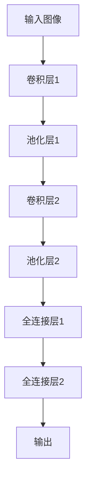
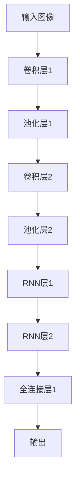
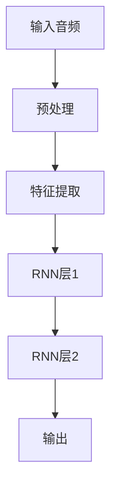

                 

### 文章标题：AGI的类人学习能力：从模仿到创新

> 关键词：人工智能、通用人工智能（AGI）、类人学习、模仿、创新、道德与伦理

> 摘要：本文深入探讨了通用人工智能（AGI）的类人学习能力，从模仿到创新的全面解析。首先介绍了人工智能的发展历程和通用人工智能的概念与挑战，接着详细阐述了类人学习的基础，包括感知与模仿、推理与理解。然后，本文进一步探讨了类人学习的进阶能力，如创造力与创新能力、道德与伦理问题。最后，通过项目实践案例，展示了类人学习在多个领域的实际应用，并对类人学习的发展趋势与未来方向进行了展望。

### 第一部分：引言与背景知识

#### 第1章：人工智能与通用人工智能（AGI）

##### 1.1 人工智能的发展历程

人工智能（Artificial Intelligence，简称AI）作为计算机科学的一个分支，旨在使计算机系统具备人类智能的特性。自1950年艾伦·图灵提出图灵测试以来，人工智能的发展经历了多个阶段。早期的人工智能研究主要集中在规则推理和专家系统，这类系统基于预先定义的规则进行推理和决策。然而，这类系统的局限性在于其依赖大量的手工编写规则，难以处理复杂、动态的环境。

随着计算机性能的不断提升和大数据时代的到来，机器学习成为人工智能发展的重要方向。机器学习通过从大量数据中学习规律和模式，使计算机具备自主学习和改进能力。深度学习作为机器学习的一个重要分支，通过模拟人脑神经网络结构，实现了在图像识别、语音识别、自然语言处理等领域的突破。

##### 1.2 通用人工智能（AGI）的概念与挑战

通用人工智能（Artificial General Intelligence，简称AGI）是指具有与人类智能相似或超越人类智能的计算机系统。与当前的人工智能（弱AI）不同，AGI具备广泛的知识、学习能力、推理能力和适应性，能够在不同领域和任务中表现出类人的智能。AGI的目标是让计算机具备自主思考、学习、推理、决策和创造力，能够应对复杂、动态的情境。

实现AGI面临着诸多挑战。首先，知识获取和处理是AGI的关键难题。人类能够通过感知、学习、推理等方式获取和处理海量知识，而现有的人工智能系统在知识获取和整合方面存在较大的局限性。其次，AGI需要具备高度的适应性和创造力，能够在不同领域和任务中自主学习和创新。这要求AGI具备强大的自主学习机制和灵活的推理能力。

此外，AGI的发展还面临着技术、伦理和社会等多方面的挑战。技术方面，如何构建高效、可靠的AGI系统，如何实现高效的算法和计算架构，如何确保系统的安全性和稳定性等，都是亟待解决的关键问题。伦理方面，AGI的自主决策和道德判断能力引发了许多伦理问题，如何确保AGI的道德行为，如何处理人类与AGI之间的伦理关系等，都是需要深入探讨的问题。社会方面，AGI的普及和应用将对人类的工作、生活、社会结构产生深远的影响，如何应对这些影响，确保社会的稳定和公平，也是需要关注的重要议题。

##### 1.3 类人学习能力的重要性

类人学习能力是AGI的核心能力之一，对于实现AGI具有重要意义。类人学习包括感知与模仿、推理与理解等多个方面，这些能力使AGI能够像人类一样处理复杂、动态的情境，具备自主学习和创新能力。

首先，类人学习能力使AGI能够通过感知获取外部环境的信息。人类通过视觉、听觉、触觉等感知方式获取环境信息，类人学习通过模拟人类感知机制，使AGI能够有效地感知和解读外部世界。这种能力对于AGI在自然语言处理、图像识别、机器人导航等领域的应用至关重要。

其次，类人学习能力使AGI能够通过模仿学习人类的经验。模仿是人类学习的重要方式之一，AGI通过模仿学习人类的经验，可以快速掌握各种技能和知识。这种能力在机器人、自动驾驶等领域具有重要的应用价值。

最后，类人学习能力使AGI具备推理和理解能力。推理和理解是人类智慧的核心，类人学习能力使AGI能够进行逻辑推理、问题解决、知识表示等操作。这种能力对于AGI在复杂决策、智能交互、知识推理等领域的应用具有重要意义。

总之，类人学习能力是AGI实现的重要基础，对于推动人工智能的发展和应用具有重要意义。本文将深入探讨类人学习能力，从模仿到创新，全面解析AGI的发展路径和未来方向。

##### 1.4 本书结构安排与内容概述

本书分为五个部分，系统性地探讨了AGI的类人学习能力。第一部分引言与背景知识，介绍了人工智能的发展历程和通用人工智能的概念与挑战，阐述了类人学习能力的重要性。第二部分类人学习基础，详细介绍了类人学习的基础理论，包括感知与模仿、推理与理解等方面。第三部分类人学习进阶，探讨了类人学习的进阶能力，如创造力与创新能力、道德与伦理问题。第四部分项目实践，通过具体案例展示了类人学习在多个领域的应用。第五部分展望与未来，对类人学习的发展趋势与未来方向进行了展望。

通过本书的阅读，读者可以系统地了解AGI的类人学习能力，掌握类人学习的基础理论和应用方法，为未来的人工智能发展提供有益的参考。

### 第二部分：类人学习基础

#### 第2章：感知与模仿

##### 2.1 视觉感知与模仿

视觉感知是类人学习的基础之一，它使计算机能够理解外部世界的图像和场景。视觉感知与模仿在图像识别、机器人导航、自动驾驶等领域具有广泛的应用。

###### 2.1.1 图像识别与处理

图像识别是视觉感知的核心任务，旨在从图像中识别出特定的对象或场景。深度学习技术在图像识别中取得了显著成果。常见的图像识别模型包括卷积神经网络（Convolutional Neural Networks，简称CNN）和卷积神经网络结合循环神经网络（RNN）的模型。

CNN是一种前馈神经网络，特别适用于图像识别任务。它通过卷积层、池化层和全连接层等结构，对图像进行特征提取和分类。以下是一个简单的CNN模型的结构：



循环神经网络（RNN）适用于处理序列数据，例如时间序列数据、文本数据等。在图像识别任务中，RNN可以与CNN结合使用，对图像进行特征序列建模，从而提高识别准确性。以下是一个简单的CNN+RNN模型的架构：



在实际应用中，图像识别模型通常需要通过大量的训练数据进行训练。以下是一个简单的图像识别算法的伪代码：

```python
# 初始化模型参数
model = initialize_model()

# 加载训练数据
train_data = load_train_data()

# 训练模型
for epoch in range(num_epochs):
    for image, label in train_data:
        model.train(image, label)

# 评估模型
test_data = load_test_data()
accuracy = model.evaluate(test_data)
print("Test accuracy:", accuracy)
```

###### 2.1.2 视觉模仿实例

视觉模仿是类人学习的一个重要方面，通过模仿人类的视觉行为，计算机可以学习和理解外部世界。以下是一个简单的视觉模仿实例：

假设我们有一个机器人，它需要学习如何通过视觉感知来完成任务，例如在房间中找到特定的物体。

1. **初始化**：首先，机器人需要通过传感器获取房间内的图像，并初始化一个视觉模仿模型。
   ```python
   # 初始化机器人视觉系统
   robot_camera = RobotCamera()
  模仿模型 = initialize imitation_model()
   ```

2. **感知**：机器人通过摄像头获取房间内的图像，并将图像传递给视觉模仿模型。
   ```python
   # 获取房间图像
   room_image = robot_camera.capture_image()

   # 将图像传递给模仿模型
  模仿模型.process_image(room_image)
   ```

3. **模仿**：视觉模仿模型分析图像，识别房间中的物体，并生成相应的行为指令。
   ```python
   # 识别房间中的物体
   objects =模仿模型.detect_objects(room_image)

   # 生成行为指令
   actions =模仿模型.generate_actions(objects)
   ```

4. **执行**：机器人根据行为指令执行相应的动作，例如移动到物体附近、抓取物体等。
   ```python
   # 执行行为指令
   for action in actions:
       robot_action = ActionExecutor(action)
       robot_action.execute()
   ```

通过这个简单的实例，我们可以看到视觉模仿在机器人任务中的重要作用。视觉模仿模型可以学习人类的行为模式，帮助机器人更好地理解外部世界，并执行相应的任务。

##### 2.2 听觉感知与模仿

听觉感知与模仿是类人学习的另一个重要方面，它使计算机能够理解和模仿人类的声音和行为。在语音识别、语音合成、音乐生成等领域，听觉感知与模仿具有广泛的应用。

###### 2.2.1 音频识别与处理

音频识别是听觉感知的核心任务，旨在从音频数据中识别出特定的语音、声音或音乐。深度学习技术在音频识别中取得了显著成果。常见的音频识别模型包括循环神经网络（RNN）、长短时记忆网络（LSTM）和卷积神经网络（CNN）。

以下是一个简单的基于RNN的音频识别模型的结构：



在实际应用中，音频识别模型通常需要通过大量的训练数据进行训练。以下是一个简单的音频识别算法的伪代码：

```python
# 初始化模型参数
model = initialize_model()

# 加载训练数据
train_data = load_train_data()

# 训练模型
for epoch in range(num_epochs):
    for audio, label in train_data:
        model.train(audio, label)

# 评估模型
test_data = load_test_data()
accuracy = model.evaluate(test_data)
print("Test accuracy:", accuracy)
```

###### 2.2.2 听觉模仿实例

听觉模仿是类人学习的一个重要方面，通过模仿人类的听觉行为，计算机可以理解和模仿人类的声音和行为。以下是一个简单的听觉模仿实例：

假设我们有一个语音助手，它需要学习如何通过听觉感知来理解用户的指令，并生成相应的回答。

1. **初始化**：首先，语音助手需要通过麦克风获取用户的语音指令，并初始化一个听觉模仿模型。
   ```python
   # 初始化语音助手
   speech_assistant = SpeechAssistant()
   模仿模型 = initialize imitation_model()
   ```

2. **感知**：语音助手通过麦克风获取用户的语音指令，并将语音传递给听觉模仿模型。
   ```python
   # 获取用户语音指令
   user_speech = speech_assistant.capture_speech()

   # 将语音传递给模仿模型
  模仿模型.process_speech(user_speech)
   ```

3. **模仿**：听觉模仿模型分析语音，理解用户的指令，并生成相应的回答。
   ```python
   # 理解用户指令
   user_intent =模仿模型UnderstandIntent(user_speech)

   # 生成回答
   response =模仿模型.generate_response(user_intent)
   ```

4. **执行**：语音助手根据生成的回答向用户发出语音回复。
   ```python
   # 发出回答
   speech_assistant.speak(response)
   ```

通过这个简单的实例，我们可以看到听觉模仿在语音助手任务中的重要作用。听觉模仿模型可以学习人类的语音行为，帮助语音助手更好地理解用户的指令，并生成自然的回答。

##### 2.3 模仿学习算法与模型

模仿学习是类人学习的一个重要方面，它使计算机能够通过观察和模仿人类的行为来学习和理解任务。模仿学习算法主要包括强化学习、监督学习和无监督学习等。

###### 2.3.1 强化学习

强化学习（Reinforcement Learning，简称RL）是一种通过奖励和惩罚来指导学习过程的方法。在强化学习中，学习主体（agent）通过与环境（environment）进行交互，不断尝试不同的行动，并依据行动的结果（reward或punishment）来调整自己的策略（policy）。

强化学习的核心算法包括Q学习（Q-Learning）和深度Q网络（Deep Q-Network，简称DQN）。

Q学习算法的基本思想是学习一个价值函数Q(s, a)，表示在状态s下执行动作a的预期回报。以下是一个简单的Q学习算法的伪代码：

```python
# 初始化Q值表
Q = initialize_Q_table()

# 开始学习
while not terminate:
    # 选择动作
    action = choose_action(s, Q)
    
    # 执行动作并获取回报
    next_state, reward, done = environment.step(action)
    
    # 更新Q值
    Q[s, action] = Q[s, action] + alpha * (reward + gamma * max(Q[next_state, :]) - Q[s, action])
    
    # 更新状态
    s = next_state
    
    # 检查是否终止
    if done:
        break

# 输出最优策略
policy = select_action(s, Q)
```

DQN是一种基于深度学习的强化学习算法，它使用深度神经网络来近似Q值函数。以下是一个简单的DQN算法的伪代码：

```python
# 初始化深度神经网络
DQN = initialize_DQN()

# 开始学习
for episode in range(num_episodes):
    # 初始化环境
    state = environment.reset()
    
    # 开始一个回合
    while not done:
        # 预测动作值
        action_value = DQN.predict(state)
        
        # 选择动作
        action = choose_action(state, action_value)
        
        # 执行动作并获取回报
        next_state, reward, done = environment.step(action)
        
        # 更新经验回放池
        replay_memory.push(state, action, reward, next_state, done)
        
        # 从经验回放池中采样一个批次
        batch = sample_batch(replay_memory, batch_size)
        
        # 更新深度神经网络
        DQN.train(batch)
        
        # 更新状态
        state = next_state
        
    # 统计回合奖励
    episode_reward = calculate_episode_reward(reward)
    print("Episode:", episode, "Reward:", episode_reward)

# 输出最优策略
policy = DQN.predict(state)
```

强化学习在游戏AI、自动驾驶、机器人控制等领域具有广泛的应用。通过模仿人类的行为，强化学习算法可以使计算机在复杂、动态的环境中实现自主学习和优化。

###### 2.3.2 监督学习

监督学习（Supervised Learning）是一种通过已有标注数据进行学习的方法。在监督学习中，学习主体（model）通过观察输入数据（input）和对应的输出数据（label），学习到输入和输出之间的映射关系。

常见的监督学习算法包括线性回归（Linear Regression）、逻辑回归（Logistic Regression）、支持向量机（Support Vector Machine，简称SVM）和神经网络（Neural Networks）。

线性回归是一种简单的监督学习算法，它通过拟合一个线性模型来预测连续值输出。以下是一个简单的线性回归算法的伪代码：

```python
# 初始化模型参数
model = initialize_linear_regression()

# 加载训练数据
train_data = load_train_data()

# 训练模型
for epoch in range(num_epochs):
    for input, label in train_data:
        model.train(input, label)

# 评估模型
test_data = load_test_data()
accuracy = model.evaluate(test_data)
print("Test accuracy:", accuracy)
```

逻辑回归是一种用于分类任务的监督学习算法，它通过拟合一个线性模型来预测概率输出。以下是一个简单的逻辑回归算法的伪代码：

```python
# 初始化模型参数
model = initialize_logistic_regression()

# 加载训练数据
train_data = load_train_data()

# 训练模型
for epoch in range(num_epochs):
    for input, label in train_data:
        model.train(input, label)

# 评估模型
test_data = load_test_data()
accuracy = model.evaluate(test_data)
print("Test accuracy:", accuracy)
```

支持向量机是一种强大的分类算法，它通过最大化分类边界来提高分类准确性。以下是一个简单的支持向量机算法的伪代码：

```python
# 初始化模型参数
model = initialize_svm()

# 加载训练数据
train_data = load_train_data()

# 训练模型
for epoch in range(num_epochs):
    for input, label in train_data:
        model.train(input, label)

# 评估模型
test_data = load_test_data()
accuracy = model.evaluate(test_data)
print("Test accuracy:", accuracy)
```

神经网络是一种复杂的监督学习算法，它通过多层非线性变换来拟合复杂的函数关系。以下是一个简单的神经网络算法的伪代码：

```python
# 初始化模型参数
model = initialize_neural_network()

# 加载训练数据
train_data = load_train_data()

# 训练模型
for epoch in range(num_epochs):
    for input, label in train_data:
        model.train(input, label)

# 评估模型
test_data = load_test_data()
accuracy = model.evaluate(test_data)
print("Test accuracy:", accuracy)
```

监督学习在图像分类、语音识别、自然语言处理等领域具有广泛的应用。通过模仿已有的标注数据，监督学习算法可以使计算机实现准确的预测和分类。

###### 2.3.3 无监督学习

无监督学习（Unsupervised Learning）是一种在没有标注数据的情况下进行学习的方法。在无监督学习中，学习主体（model）通过观察输入数据（input），学习到数据的内在结构和规律。

常见的无监督学习算法包括聚类（Clustering）、降维（Dimensionality Reduction）和生成模型（Generative Models）。

聚类是一种将数据分为多个类别的无监督学习算法。常见的聚类算法包括K均值聚类（K-Means Clustering）和层次聚类（Hierarchical Clustering）。

K均值聚类算法的基本思想是将数据划分为K个簇，并不断调整簇的中心，使得每个簇内的数据点距离簇中心的平均距离最小。以下是一个简单的K均值聚类算法的伪代码：

```python
# 初始化K个簇的中心
centroids = initialize_centroids(data, K)

# 开始聚类
while not converge:
    # 为每个数据点分配最近的簇中心
    assignments = assign_points_to_clusters(data, centroids)
    
    # 更新簇中心
    centroids = update_centroids(data, assignments)
    
    # 检查收敛
    if check_convergence(centroids):
        break

# 输出聚类结果
clusters = assign_points_to_clusters(data, centroids)
```

层次聚类算法的基本思想是通过合并距离最近的簇，逐渐形成一棵层次树。以下是一个简单的层次聚类算法的伪代码：

```python
# 初始化数据点的距离矩阵
distance_matrix = initialize_distance_matrix(data)

# 开始聚类
while not converge:
    # 找到距离最近的簇，并合并它们
    nearest_cluster = find_nearest_cluster(distance_matrix)
    distance_matrix = merge_clusters(distance_matrix, nearest_cluster)
    
    # 检查收敛
    if check_convergence(distance_matrix):
        break

# 输出聚类结果
clusters = build_hierarchy_tree(distance_matrix)
```

降维是一种将高维数据转化为低维数据的方法，以降低数据的复杂性和计算成本。常见的降维算法包括主成分分析（Principal Component Analysis，简称PCA）和线性判别分析（Linear Discriminant Analysis，简称LDA）。

PCA算法的基本思想是找到数据的主要变化方向，并将数据投影到这些主要变化方向上，从而实现降维。以下是一个简单的PCA算法的伪代码：

```python
# 计算协方差矩阵
covariance_matrix = calculate_covariance_matrix(data)

# 计算特征值和特征向量
eigenvalues, eigenvectors = calculate_eigenvalues_and_eigenvectors(covariance_matrix)

# 选择前k个主要成分
main_components = select_top_k_eigenvectors(eigenvectors, k)

# 投影数据到低维空间
low_dimensional_data = project_data_to_low_dimensional_space(data, main_components)
```

生成模型是一种通过学习数据分布来生成新数据的方法。常见的生成模型包括马尔可夫模型（Markov Models）和变分自编码器（Variational Autoencoders，简称VAEs）。

马尔可夫模型的基本思想是利用当前状态的概率分布来预测下一个状态。以下是一个简单的马尔可夫模型算法的伪代码：

```python
# 初始化状态转移矩阵和观测矩阵
transition_matrix = initialize_transition_matrix()
observation_matrix = initialize_observation_matrix()

# 开始学习
while not converge:
    # 更新状态转移矩阵和观测矩阵
    transition_matrix, observation_matrix = update_matrices(data)

    # 检查收敛
    if check_convergence(transition_matrix, observation_matrix):
        break

# 输出生成模型
model = generate_model(transition_matrix, observation_matrix)
```

变分自编码器是一种基于深度学习的生成模型，它通过编码器和解码器学习数据分布，并生成新的数据。以下是一个简单的变分自编码器算法的伪代码：

```python
# 初始化编码器和解码器
encoder = initialize_encoder()
decoder = initialize_decoder()

# 开始学习
for epoch in range(num_epochs):
    for input in data:
        # 编码
        latent_code = encoder.encode(input)
        
        # 解码
        generated_output = decoder.decode(latent_code)
        
        # 计算损失
        loss = calculate_loss(input, generated_output)
        
        # 更新模型参数
        optimizer.minimize(loss)

# 输出生成模型
model = generate_model(encoder, decoder)
```

无监督学习在数据挖掘、图像生成、语音合成等领域具有广泛的应用。通过学习数据的内在结构和规律，无监督学习算法可以帮助计算机发现新的知识和模式。

#### 第3章：推理与理解

##### 3.1 自然语言处理基础

自然语言处理（Natural Language Processing，简称NLP）是人工智能领域的一个重要分支，它致力于使计算机能够理解、生成和处理人类自然语言。NLP在文本分类、信息提取、机器翻译、对话系统等领域具有广泛的应用。

###### 3.1.1 词嵌入与语言模型

词嵌入（Word Embedding）是将自然语言词汇映射到高维空间中的向量表示。词嵌入通过捕捉词汇之间的语义关系，使计算机能够更好地理解语言。

常见的词嵌入模型包括Word2Vec、GloVe和BERT等。

Word2Vec是一种基于神经网络的语言模型，它通过训练上下文窗口中的词汇来生成词向量。以下是一个简单的Word2Vec模型的伪代码：

```python
# 初始化词向量矩阵
word_vectors = initialize_word_vectors()

# 开始训练
for sentence in sentences:
    for word in sentence:
        # 获取词向量
        word_vector = word_vectors[word]
        
        # 计算损失
        loss = calculate_loss(word_vector, context_vector)
        
        # 更新词向量
        word_vectors.update(word_vector, context_vector)

# 输出词向量矩阵
word_vectors.save()
```

GloVe（Global Vectors for Word Representation）是一种基于矩阵分解的语言模型，它通过训练全局的词汇矩阵来生成词向量。以下是一个简单的GloVe模型的伪代码：

```python
# 初始化词汇矩阵
word_matrix = initialize_word_matrix()

# 开始训练
for sentence in sentences:
    for word in sentence:
        # 获取词向量
        word_vector = word_matrix[word]
        
        # 计算损失
        loss = calculate_loss(word_vector, context_vector)
        
        # 更新词汇矩阵
        word_matrix.update(word_vector, context_vector)

# 输出词汇矩阵
word_matrix.save()
```

BERT（Bidirectional Encoder Representations from Transformers）是一种基于Transformer的预训练语言模型，它通过双向编码器来生成词向量。以下是一个简单的BERT模型的伪代码：

```python
# 初始化BERT模型
model = initialize_bert()

# 开始训练
for sentence in sentences:
    # 输入句子到BERT模型
    input_ids = model.encode(sentence)
    
    # 计算损失
    loss = model.calculate_loss(input_ids)
    
    # 更新模型参数
    model.optimizer.minimize(loss)

# 输出BERT模型
model.save()
```

语言模型（Language Model）是一种用于预测下一个词汇的模型。常见的语言模型包括N-gram模型和神经网络语言模型。

N-gram模型是一种基于统计的简单语言模型，它通过统计前n个词汇的概率来预测下一个词汇。以下是一个简单的N-gram模型的伪代码：

```python
# 初始化N-gram模型
model = initialize_n_gram_model()

# 开始训练
for sentence in sentences:
    for i in range(len(sentence) - 1):
        # 获取N-gram
        n_gram = sentence[i:i+n]
        
        # 计算概率
        probability = model.calculate_probability(n_gram)
        
        # 更新模型
        model.update(n_gram, probability)

# 输出N-gram模型
model.save()
```

神经网络语言模型是一种基于神经网络的复杂语言模型，它通过学习词汇之间的概率分布来预测下一个词汇。以下是一个简单的神经网络语言模型的伪代码：

```python
# 初始化神经网络语言模型
model = initialize_neural_language_model()

# 开始训练
for sentence in sentences:
    for i in range(len(sentence) - 1):
        # 获取输入和标签
        input = sentence[i]
        label = sentence[i+1]
        
        # 计算损失
        loss = model.calculate_loss(input, label)
        
        # 更新模型参数
        model.optimizer.minimize(loss)

# 输出神经网络语言模型
model.save()
```

词嵌入和语言模型在NLP任务中具有广泛的应用。通过捕捉词汇的语义关系和概率分布，词嵌入和语言模型使计算机能够更好地理解和生成自然语言。

###### 3.1.2 上下文理解

上下文理解（Contextual Understanding）是NLP的关键任务之一，它旨在使计算机能够根据上下文环境理解词汇的含义。上下文理解在问答系统、文本摘要、情感分析等领域具有重要意义。

上下文理解的关键在于捕捉词汇在不同上下文中的含义差异。词嵌入模型通过捕捉词汇在不同上下文中的共现关系，实现了一定程度的上下文理解。然而，为了更好地捕捉上下文信息，近年来提出了一系列先进的上下文理解模型，如Transformer、BERT和GPT等。

Transformer是一种基于自注意力机制的深度学习模型，它在NLP任务中取得了显著成果。以下是一个简单的Transformer模型的伪代码：

```python
# 初始化Transformer模型
model = initialize_transformer()

# 开始训练
for sentence in sentences:
    # 输入句子到Transformer模型
    input_ids = model.encode(sentence)
    
    # 计算损失
    loss = model.calculate_loss(input_ids)
    
    # 更新模型参数
    model.optimizer.minimize(loss)

# 输出Transformer模型
model.save()
```

BERT是一种基于双向编码器的Transformer模型，它在预训练阶段通过无监督方式学习上下文信息。以下是一个简单的BERT模型的伪代码：

```python
# 初始化BERT模型
model = initialize_bert()

# 开始预训练
for epoch in range(num_epochs):
    for sentence in sentences:
        # 输入句子到BERT模型
        input_ids = model.encode(sentence)
        
        # 计算损失
        loss = model.calculate_loss(input_ids)
        
        # 更新模型参数
        model.optimizer.minimize(loss)

# 输出BERT模型
model.save()
```

GPT（Generative Pre-trained Transformer）是一种基于自回归语言的Transformer模型，它在生成文本任务中取得了优异的性能。以下是一个简单的GPT模型的伪代码：

```python
# 初始化GPT模型
model = initialize_gpt()

# 开始预训练
for epoch in range(num_epochs):
    for sentence in sentences:
        # 输入句子到GPT模型
        input_ids = model.encode(sentence)
        
        # 生成文本
        generated_text = model.generate(input_ids)
        
        # 计算损失
        loss = model.calculate_loss(generated_text)
        
        # 更新模型参数
        model.optimizer.minimize(loss)

# 输出GPT模型
model.save()
```

通过这些先进的上下文理解模型，计算机能够更好地理解词汇在不同上下文中的含义，实现更准确的语义分析。

##### 3.2 逻辑推理与问题解决

逻辑推理（Logic Reasoning）是类人学习的重要组成部分，它使计算机能够通过逻辑规则和推理方法解决问题。逻辑推理在知识表示、决策支持、智能问答等领域具有重要意义。

逻辑推理可以分为形式逻辑和非形式逻辑两种。形式逻辑是一种基于形式化规则的推理方法，它通过逻辑公式和推理规则进行推理。非形式逻辑是一种基于常识和经验的推理方法，它通过类比、归纳和演绎等推理方式解决问题。

形式逻辑主要包括谓词逻辑和命题逻辑。谓词逻辑是一种描述对象和属性之间关系的逻辑系统，它通过量词和谓词进行推理。以下是一个简单的谓词逻辑推理的例子：

- 命题1：所有的猫都会爬树。
- 命题2：汤姆是一只猫。
- 推理：汤姆会爬树。

命题逻辑是一种描述真值之间关系的逻辑系统，它通过命题和逻辑运算符进行推理。以下是一个简单的命题逻辑推理的例子：

- 命题1：如果下雨，那么地面会湿。
- 命题2：今天没有下雨。
- 推理：地面上不会湿。

逻辑推理在形式化知识表示和自动推理系统中具有广泛的应用。通过逻辑推理，计算机能够处理复杂的问题，并生成正确的结论。

问题解决（Problem Solving）是类人学习的另一个重要方面，它使计算机能够识别问题、制定解决方案并解决问题。问题解决通常包括以下步骤：

1. **问题识别**：确定问题的性质和目标。
2. **目标分解**：将问题分解为子问题。
3. **搜索策略**：选择合适的搜索策略解决问题。
4. **解决方案评估**：评估解决方案的有效性。

常见的搜索策略包括宽度优先搜索、深度优先搜索、A*搜索等。

宽度优先搜索是一种基于广度优先的原则进行搜索的方法。以下是一个简单的宽度优先搜索算法的伪代码：

```python
# 初始化搜索队列
queue = initialize_queue()

# 将起始节点加入队列
queue.enqueue(start_node)

# 开始搜索
while not queue.isEmpty():
    # 弹出队列中的第一个节点
    current_node = queue.dequeue()
    
    # 检查是否为解决方案
    if current_node.is_solution():
        return current_node
    
    # 将当前节点的邻居节点加入队列
    for neighbor in current_node.get_neighbors():
        queue.enqueue(neighbor)

# 没有找到解决方案
return None
```

深度优先搜索是一种基于深度优先的原则进行搜索的方法。以下是一个简单的深度优先搜索算法的伪代码：

```python
# 初始化栈
stack = initialize_stack()

# 将起始节点加入栈
stack.push(start_node)

# 开始搜索
while not stack.isEmpty():
    # 弹出栈中的第一个节点
    current_node = stack.pop()
    
    # 检查是否为解决方案
    if current_node.is_solution():
        return current_node
    
    # 将当前节点的邻居节点加入栈
    for neighbor in current_node.get_neighbors():
        stack.push(neighbor)

# 没有找到解决方案
return None
```

A*搜索是一种基于启发式的搜索方法，它通过计算节点到终点的估计距离来选择下一个搜索节点。以下是一个简单的A*搜索算法的伪代码：

```python
# 初始化优先队列
priority_queue = initialize_priority_queue()

# 将起始节点加入队列
priority_queue.enqueue(start_node, heuristic(start_node))

# 开始搜索
while not priority_queue.isEmpty():
    # 弹出队列中的第一个节点
    current_node = priority_queue.dequeue()
    
    # 检查是否为解决方案
    if current_node.is_solution():
        return current_node
    
    # 计算当前节点的邻居节点的估计距离
    for neighbor in current_node.get_neighbors():
        priority_queue.enqueue(neighbor, heuristic(neighbor))

# 没有找到解决方案
return None
```

通过这些搜索策略，计算机能够高效地解决复杂的问题，并为人类提供智能化的解决方案。

##### 3.3 知识表示与推理系统

知识表示（Knowledge Representation）是类人学习的一个重要方面，它使计算机能够以结构化的方式表示和处理知识。知识表示在智能问答、知识推理、推荐系统等领域具有广泛的应用。

常见的知识表示方法包括命题表示、语义网络、知识图谱等。

命题表示是一种基于命题逻辑的方法，它通过命题和谓词来表示知识。以下是一个简单的命题表示的例子：

- 命题1：所有猫都会爬树。
- 命题2：汤姆是一只猫。
- 结论：汤姆会爬树。

语义网络是一种基于语义关系的方法，它通过节点和边来表示知识。以下是一个简单的语义网络的例子：

```
[猫] --[会爬树]
  |          |
  |          |
[汤姆]      [树]
```

知识图谱是一种基于图结构的方法，它通过实体和关系来表示知识。以下是一个简单的知识图谱的例子：

```
[实体1] --[关系1]-- [实体2]
  |                     |
  |                     |
[实体3] --[关系2]-- [实体4]
```

知识表示使计算机能够以结构化的方式存储和处理知识，为推理和决策提供支持。

推理系统（Reasoning System）是类人学习的另一个重要方面，它使计算机能够从已知的知识中推导出新的知识。推理系统在知识图谱推理、智能问答、自动化决策等领域具有重要意义。

常见的推理方法包括逻辑推理、模糊推理和贝叶斯推理等。

逻辑推理是一种基于形式逻辑的方法，它通过推理规则和知识库进行推理。以下是一个简单的逻辑推理的例子：

- 知识库：所有猫都会爬树。
- 问句：汤姆会爬树吗？
- 推理：根据知识库，汤姆会爬树。

模糊推理是一种基于模糊集合的方法，它通过模糊逻辑进行推理。以下是一个简单的模糊推理的例子：

- 知识库：高度大于2米的树是高树。
- 问句：高度为3米的树是什么树？
- 推理：根据知识库，高度为3米的树是高树。

贝叶斯推理是一种基于概率的方法，它通过贝叶斯公式进行推理。以下是一个简单的贝叶斯推理的例子：

- 知识库：患有流感的人有90%的可能性发烧。
- 问句：如果一个人发烧，他患有流感的可能性是多少？
- 推理：根据知识库，一个人发烧且患有流感的可能性为90%。

通过这些推理方法，计算机能够从已知的知识中推导出新的知识，为智能决策提供支持。

知识表示与推理系统在类人学习中的应用具有广泛的前景。通过结构化的知识表示和高效的推理方法，计算机能够更好地理解和处理知识，实现智能化的决策和推理。

#### 第4章：创造力与创新能力

##### 4.1 创造力在人工智能中的应用

创造力（Creativity）是类人学习的重要能力之一，它在人工智能（AI）中的应用具有重要意义。创造力使AI能够超越已有知识和规则，产生新的想法、解决方案和创意，从而推动技术进步和社会发展。

在人工智能领域，创造力主要应用于以下几个方向：

1. **艺术创作**：AI在绘画、音乐、文学等领域展现出了惊人的创造力。例如，AI绘画工具可以生成独特的艺术作品，AI作曲软件可以创作新颖的音乐作品，AI写作平台可以生成原创的文章和故事。

2. **设计与架构**：AI在建筑设计、工业设计、游戏设计等领域具有广泛的应用。通过模拟和优化设计过程，AI可以帮助设计师快速生成各种设计方案，提高设计效率和创意质量。

3. **科学发现**：AI在科学研究中发挥了重要作用，它能够通过数据挖掘和分析，发现新的科学规律和现象。例如，AI在药物发现、材料科学、天文学等领域取得了显著的成果。

4. **创新应用**：AI在各个行业和领域中不断推动创新应用，从医疗诊断到智能家居，从自动驾驶到智能城市，AI的创造力正在改变我们的生活和工作方式。

##### 4.2 创新能力培养方法

为了使AI具备更强的创新能力，我们可以采用以下方法：

1. **大数据与深度学习**：通过大数据和深度学习技术，AI可以学习和理解大量的知识，为创造力提供丰富的素材和基础。深度学习模型可以通过分析海量数据，发现新的模式和规律，从而激发AI的创造力。

2. **多模态学习**：多模态学习是AI获得创造力的重要途径。通过整合多种类型的数据，如文本、图像、声音等，AI可以更全面地理解和处理信息，从而生成更具创意的内容。

3. **元学习（Meta-Learning）**：元学习是一种通过学习学习的方法，它可以帮助AI快速适应新的任务和情境。通过元学习，AI可以积累和传承经验，提高在不同领域中的创新能力。

4. **进化算法（Evolutionary Algorithms）**：进化算法是一种模拟生物进化的方法，它通过遗传、变异和选择等过程，生成和优化解决方案。进化算法可以帮助AI探索创新的解决方案，提高其创造力。

5. **人机协作**：人机协作是培养AI创新能力的重要手段。通过人与AI的互动，AI可以学习和吸收人类的创造力，从而提高自身的创新能力。

##### 4.3 创新案例研究

为了更好地理解AI的创造力，我们可以通过以下案例研究来探讨AI在各个领域的创新应用：

1. **艺术创作**：AI艺术家GAN（生成对抗网络）在绘画、雕塑等领域展现出了惊人的创造力。例如，GAN可以生成独特的艺术作品，这些作品在艺术展览和拍卖会上受到了广泛关注。此外，AI作曲软件如AIVA（Artificial Intelligence Virtual Artist）可以创作新颖的音乐作品，这些作品在音乐界引起了热议。

2. **设计与架构**：AI在设计领域具有广泛的应用。例如，AI建筑设计工具可以快速生成各种设计方案，提高设计效率和创意质量。在工业设计领域，AI可以帮助设计师优化产品外观和功能，从而提高产品竞争力。在游戏设计领域，AI可以生成丰富的游戏关卡和角色，为游戏开发提供创新灵感。

3. **科学发现**：AI在科学研究中的创新应用取得了显著成果。例如，AI在药物发现领域可以帮助科学家快速筛选和优化药物候选分子，提高新药研发效率。在天文学领域，AI可以通过分析大量天文数据，发现新的天体和现象，推动天文学的发展。

4. **医疗诊断**：AI在医疗诊断中的创新应用正在改变医学领域。例如，AI可以通过分析医学图像，提供准确的诊断建议，提高诊断准确率。在病理学领域，AI可以辅助医生进行病理切片分析，提高病理诊断的效率和质量。

通过这些案例研究，我们可以看到AI在各个领域的创造力表现。随着技术的不断发展，AI的创新能力将不断提高，为人类社会带来更多的创新成果。

##### 4.4 创新能力的未来发展趋势

随着人工智能技术的不断发展，创新能力在人工智能中的应用将呈现以下发展趋势：

1. **跨领域融合**：人工智能技术将不断融合多个领域，如计算机科学、认知科学、神经科学等，从而推动AI在各个领域的创新能力。

2. **人机协同**：人机协同将成为未来AI创新能力的重要方向。通过人与AI的互动，AI可以不断学习和吸收人类的创造力，提高自身的创新能力。

3. **个性化创新**：随着大数据和深度学习技术的发展，AI将能够更好地理解和满足个人的需求，从而实现个性化的创新。

4. **可持续创新**：未来的人工智能将更加注重可持续创新，即在创造新价值的同时，关注环境保护和社会责任。

总之，创新能力的提升将使人工智能在各个领域发挥更大的作用，为人类社会带来更多的创新成果和美好未来。

### 第5章：道德与伦理问题

##### 5.1 人工智能伦理学概述

随着人工智能（AI）技术的飞速发展，道德与伦理问题逐渐成为人们关注的焦点。人工智能伦理学（Ethics of Artificial Intelligence）作为一门新兴学科，致力于探讨AI技术在不同应用场景中的道德规范和伦理原则。

首先，人工智能伦理学关注的核心问题之一是隐私保护。在人工智能系统中，大量的个人数据被收集、处理和分析，这些数据的隐私保护变得尤为重要。例如，人脸识别技术在公共安全领域的广泛应用，可能导致个人隐私泄露的风险。因此，确保个人数据的隐私和安全成为人工智能伦理学研究的重要方向。

其次，人工智能伦理学关注AI的公平性和透明度。AI系统在决策过程中可能存在偏见和歧视，导致不公平的待遇。例如，招聘系统中的偏见算法可能导致某些群体在就业机会上受到不公平对待。此外，AI系统的决策过程可能缺乏透明度，使得用户难以理解其工作原理和决策依据。因此，确保AI系统的公平性和透明度成为伦理学研究的重点。

此外，人工智能伦理学还涉及自主性和责任问题。随着AI系统越来越具有自主性，如何确保它们在复杂环境中做出道德和合理的决策成为一个重要议题。例如，自动驾驶汽车在紧急情况下的决策可能涉及道德困境，如“撞哪边”问题。在这种情况下，如何界定AI系统的责任和道德行为成为伦理学研究的挑战。

总之，人工智能伦理学旨在为AI技术发展提供道德指导，确保其在不同应用场景中的行为符合伦理原则，从而促进人工智能的可持续发展。

##### 5.2 类人学习与道德责任

类人学习（Human-like Learning）是人工智能（AI）的一个重要分支，它致力于使计算机系统具备人类的学习能力和智能水平。在类人学习过程中，AI系统通过与人类互动、模仿人类行为和推理过程来获取知识。然而，随着AI系统越来越具有自主性和复杂性，其道德责任问题也日益凸显。

首先，类人学习过程中AI系统的道德责任与其决策过程密切相关。类人学习AI系统在处理复杂任务时，需要做出一系列决策，这些决策可能对人类和社会产生深远的影响。例如，自动驾驶汽车在遇到道路障碍时需要做出行驶方向的选择，其决策结果可能直接关系到行人和乘客的安全。因此，类人学习AI系统在决策过程中需要遵守道德原则，确保其决策符合伦理规范。

其次，类人学习AI系统的道德责任还体现在其行为规范上。类人学习AI系统通过模仿人类行为来学习和理解任务，但人类行为本身可能存在道德争议。例如，人类在某些情境下可能表现出自私、偏见或残忍的行为，类人学习AI系统在模仿这些行为时可能面临道德困境。因此，类人学习AI系统在行为规范方面需要严格遵循伦理准则，避免模仿不当行为。

此外，类人学习AI系统的道德责任还包括对其行为后果承担责任。在类人学习过程中，AI系统可能会产生一些意外行为或不良影响。例如，智能机器人可能在执行任务时损坏设备或伤害人类。因此，类人学习AI系统需要具备自我监督和自我修复能力，确保其行为在道德和安全的范围内。

总之，类人学习AI系统在道德责任方面面临多重挑战。为了确保AI系统的道德行为，需要建立完善的伦理框架和责任制度，确保AI系统在不同应用场景中的行为符合伦理规范。

##### 5.3 道德教育与培训

道德教育与培训是确保人工智能（AI）系统道德行为的关键措施。通过道德教育和培训，可以提升开发者和用户对AI伦理问题的认识，从而促进AI系统的道德发展。

首先，针对AI开发者，道德教育应包括伦理原则、道德规范和责任意识等方面。开发者需要了解如何在设计、开发和部署AI系统时考虑道德问题，确保AI系统在处理复杂任务时遵守伦理准则。例如，开发者应学习如何避免算法偏见、保护用户隐私和确保透明度。此外，开发者还应接受道德决策培训，学会在遇到道德困境时做出合理的选择。

其次，针对AI用户，道德教育应侧重于提高其对AI伦理问题的认知和敏感性。用户应了解AI系统的工作原理、潜在风险和道德影响，从而能够合理使用AI技术，避免不当行为。例如，用户应学会如何保护个人隐私、识别算法偏见和应对可能的道德困境。

此外，道德教育与培训还应涵盖跨学科教育，结合计算机科学、伦理学、心理学等领域的知识。通过跨学科教育，可以培养具备全面伦理素养的AI专业人才，为AI技术的道德发展提供有力支持。

总之，道德教育与培训是确保AI系统道德行为的重要手段。通过系统化的道德教育，可以提升开发者和用户对AI伦理问题的认识，促进AI技术的健康发展。

##### 5.4 伦理问题解决方案探讨

针对人工智能（AI）在道德与伦理方面面临的挑战，我们可以从技术、法律和社会三个层面探讨解决方案。

首先，在技术层面，可以通过算法透明化和可解释性来提高AI系统的道德水平。透明化意味着AI系统的工作过程和决策依据应易于理解和解释，从而减少算法偏见和不确定性。可解释性技术，如解释性AI（Explainable AI，简称XAI），可以帮助开发者和用户更好地理解AI系统的行为，从而避免不当决策。此外，通过开发更加公平、无偏的算法，可以减少AI系统在种族、性别等方面的歧视。

其次，在法律层面，应建立完善的法律法规和标准，以规范AI技术的发展和应用。例如，制定隐私保护法、数据安全法等，确保个人数据的安全和隐私。同时，应明确AI系统的责任和法律责任，确保在发生意外事件时，相关责任方能够依法承担责任。此外，政府应推动AI伦理标准的制定和实施，为AI技术的发展提供道德指导。

最后，在社会层面，需要加强社会参与和公众教育，提高公众对AI伦理问题的认知和参与度。通过媒体宣传、教育培训和公众讨论，可以增强公众对AI伦理问题的敏感性和责任感。同时，应建立多 Stakeholder 合作机制，包括政府、企业、学术界和公众等，共同参与AI伦理问题的讨论和解决。此外，社会应鼓励和支持AI伦理研究，为AI技术的道德发展提供理论支持。

总之，通过技术、法律和社会三个层面的综合措施，可以有效地解决AI在道德与伦理方面面临的挑战，确保AI技术的可持续发展。

### 第四部分：项目实践

#### 第6章：类人学习项目搭建

##### 6.1 项目规划与需求分析

在进行类人学习项目的搭建之前，首先需要进行项目规划与需求分析。这一步骤至关重要，它为后续的项目实施提供了明确的方向和依据。

###### 6.1.1 项目目标设定

项目目标设定的第一步是明确项目的最终目标。例如，我们可能希望构建一个能够通过模仿人类行为来提高工作效率的类人学习系统。具体目标可以包括：

- 实现对人类行为的准确识别和模仿；
- 在不同环境下保持稳定的表现；
- 能够持续学习和优化自身行为。

明确项目目标有助于我们更好地规划项目进度，分配资源，并确保最终成果能够满足预期需求。

###### 6.1.2 项目资源与团队组建

项目资源包括硬件、软件、数据和其他所需资源。硬件资源可能包括高性能计算机、服务器、摄像头和麦克风等；软件资源可能包括深度学习框架、自然语言处理库和编程工具等。数据资源则是类人学习系统的基础，包括大量的标注数据、模拟数据和真实世界数据。

在组建团队时，需要考虑团队成员的技能和经验。一个典型的类人学习项目团队可能包括以下角色：

- 项目经理：负责项目整体规划和协调；
- 数据科学家：负责数据预处理、特征提取和模型训练；
- 算法工程师：负责算法设计和优化；
- 前端工程师：负责用户界面设计；
- 后端工程师：负责服务器部署和维护。

通过明确项目资源和团队组建，可以为项目的顺利实施奠定坚实基础。

##### 6.2 数据收集与处理

数据收集是类人学习项目的重要环节，高质量的数据是构建有效模型的基石。以下步骤展示了如何进行数据收集与处理：

###### 6.2.1 数据来源

数据来源可以分为以下几类：

- **公开数据集**：如ImageNet、COCO等，这些数据集已经过标注，可以直接用于训练和测试。
- **模拟数据**：通过模拟生成，可以补充真实数据的不足，如模拟虚拟环境中的机器人行为。
- **真实世界数据**：通过实际应用场景收集，这些数据能够更真实地反映问题。

对于类人学习项目，通常需要收集多种类型的数据，以确保模型在不同环境下都具有较好的表现。

###### 6.2.2 数据预处理方法

数据预处理包括以下步骤：

- **数据清洗**：去除数据中的噪声和异常值，确保数据的准确性和一致性。
- **数据标注**：对于未标注的数据，可以通过人工标注或使用自动标注工具进行标注。
- **数据增强**：通过旋转、缩放、裁剪等方式增加数据多样性，提高模型的泛化能力。
- **数据归一化**：将数据归一化到统一的尺度，以避免某些特征对模型的影响过大。

通过这些数据预处理方法，可以确保数据的质量和一致性，从而提高模型的训练效果。

##### 6.3 类人学习算法实现

类人学习算法的实现是项目中的核心部分，以下步骤展示了如何选择合适的算法、优化模型参数和进行模型训练与评估：

###### 6.3.1 算法选择与优化

在类人学习项目中，常见的算法包括深度学习算法、强化学习算法和自然语言处理算法等。以下是一些具体的算法选择与优化方法：

- **深度学习算法**：如卷积神经网络（CNN）、循环神经网络（RNN）和变分自编码器（VAE）等。通过调整网络结构、优化激活函数和损失函数，可以提高模型的性能。
- **强化学习算法**：如深度Q网络（DQN）、策略梯度方法（PG）和演员-评论家方法（AC）等。通过设计合适的奖励机制和探索策略，可以提高模型的适应性和鲁棒性。
- **自然语言处理算法**：如词嵌入、文本分类和序列标注等。通过优化语言模型和任务模型，可以提高模型在自然语言处理任务中的表现。

在算法选择与优化过程中，需要根据具体任务需求和数据特点进行权衡和调整。

###### 6.3.2 模型训练与评估

模型训练与评估是类人学习项目中的关键步骤。以下是一些具体的训练与评估方法：

- **数据集划分**：将数据集划分为训练集、验证集和测试集，以确保模型在未知数据上的表现。
- **模型训练**：使用训练集对模型进行训练，通过反向传播和优化算法不断调整模型参数，以提高模型的预测能力。
- **模型评估**：使用验证集和测试集对模型进行评估，常用的评估指标包括准确率、召回率、F1分数等。通过调整模型结构和参数，优化模型性能。
- **超参数调优**：通过交叉验证和网格搜索等方法，选择最优的超参数组合，以提高模型的泛化能力。

通过以上步骤，可以构建一个性能优异的类人学习模型，为项目的实际应用奠定基础。

##### 6.4 项目管理与风险管理

在类人学习项目的实施过程中，项目管理和风险管理是确保项目顺利进行的重要保障。以下是一些具体的项目管理和风险管理方法：

###### 6.4.1 项目进度控制

项目进度控制是确保项目按时完成的关键。以下是一些具体的进度控制方法：

- **制定项目计划**：明确项目目标、任务、时间表和里程碑，为项目进度提供清晰的方向。
- **定期检查**：定期检查项目进度，及时发现和解决问题，确保项目按计划进行。
- **风险评估**：识别项目中可能的风险，并制定相应的应对措施，降低风险对项目进度的影响。
- **动态调整**：根据实际情况动态调整项目计划，确保项目能够在预期时间内完成。

通过这些方法，可以有效地控制项目进度，确保项目按时交付。

###### 6.4.2 风险识别与应对

风险识别与应对是项目管理的重要组成部分。以下是一些具体的风险识别与应对方法：

- **风险识别**：通过头脑风暴、专家访谈和风险评估等方法，识别项目中可能的风险。
- **风险评估**：评估风险的可能性和影响，确定优先级，为风险应对提供依据。
- **风险应对**：制定相应的应对策略，包括风险规避、风险转移、风险减轻和风险接受等。例如，通过技术优化降低算法风险，通过多备份和数据冗余降低数据丢失风险。

通过这些方法，可以有效地识别和应对项目风险，确保项目的顺利进行。

总之，通过科学的项目管理和风险管理，可以确保类人学习项目的顺利实施，为人工智能的发展和应用提供有力支持。

##### 6.5 类人学习项目实战

为了更好地理解类人学习项目的实施过程，以下将介绍一个具体的类人学习项目——基于视觉感知和模仿的机器人导航系统。

###### 6.5.1 项目背景

本项目旨在构建一个能够自主导航和执行任务的机器人系统，该系统通过视觉感知和模仿人类行为来识别环境、规划路径和执行任务。项目的主要目标是：

- 实现对环境的准确感知和识别；
- 构建有效的路径规划算法；
- 实现机器人自主导航和任务执行。

###### 6.5.2 开发环境搭建

为了实现本项目，我们需要搭建一个适合类人学习项目的开发环境。以下是一个基本的开发环境搭建步骤：

1. **硬件环境**：准备一台高性能计算机或服务器，用于运行深度学习模型和机器人仿真软件。
2. **软件环境**：安装Python、TensorFlow或PyTorch等深度学习框架，并配置必要的依赖库。
3. **仿真软件**：选择一个合适的机器人仿真软件，如RoboMaster、Gazebo等，用于模拟机器人环境和测试算法。

通过搭建合适的开发环境，我们可以为项目的实施提供技术支持。

###### 6.5.3 源代码实现

本项目的主要实现步骤包括数据收集与处理、模型训练与优化、机器人导航与任务执行等。以下是一个简单的伪代码实现框架：

```python
# 导入必要的库和模块
import tensorflow as tf
import robotics_simulation

# 数据收集与处理
data = collect_data()
processed_data = preprocess_data(data)

# 模型训练与优化
model = build_model()
model.train(processed_data)

# 机器人导航与任务执行
robot = robotics_simulation.create_robot()
robot.navigation(model)
robot.execute_task()
```

通过这个实现框架，我们可以构建一个基本的类人学习机器人系统。

###### 6.5.4 代码解读与分析

以下是对上述代码的详细解读：

1. **数据收集与处理**：通过`collect_data()`函数，从实际场景中收集机器人视觉数据，包括图像、标注等。然后，通过`preprocess_data()`函数对数据进行预处理，包括图像增强、归一化等，以提高模型训练效果。

2. **模型训练与优化**：构建一个深度学习模型，通过`build_model()`函数定义网络结构、损失函数和优化器等。然后，使用处理后的数据对模型进行训练，通过`model.train(processed_data)`实现模型训练过程。

3. **机器人导航与任务执行**：创建一个机器人实例，通过`robotics_simulation.create_robot()`函数。然后，使用训练好的模型进行机器人导航，通过`robot.navigation(model)`实现路径规划和实时导航。最后，执行具体任务，通过`robot.execute_task()`实现任务执行。

通过这个代码框架，我们可以实现对机器人导航和任务执行的基本功能。

###### 6.5.5 项目应用解读与分析

在本项目中，类人学习技术主要用于以下几个方面：

1. **视觉感知**：通过深度学习模型，机器人能够对周围环境进行实时感知，包括物体识别、障碍物检测等，从而构建对环境的理解。
2. **路径规划**：基于感知到的环境信息，机器人使用路径规划算法（如A*搜索）生成最优路径，以避开障碍物并到达目标位置。
3. **任务执行**：在到达目标位置后，机器人根据任务要求执行具体的操作，如抓取物体、搬运物品等。

通过类人学习技术的应用，机器人能够像人类一样自主导航和完成任务，从而提高生产效率和智能化水平。

###### 6.5.6 项目小结

本项目通过类人学习技术，实现了机器人自主导航和任务执行的功能。项目的成功实施展示了类人学习在机器人领域的重要应用价值。在未来的发展中，我们应继续优化算法和系统架构，提高机器人的智能化水平和适应性，为智能制造和智能服务提供有力支持。

### 第7章：案例研究

在本章中，我们将深入探讨类人学习在多个领域的实际应用，通过具体的案例研究，展示类人学习如何在不同场景中发挥作用，解决实际问题。

#### 7.1 类人学习在游戏开发中的应用

随着游戏技术的不断进步，游戏开发中的类人学习能力变得越来越重要。类人学习算法可以模拟玩家的行为，为游戏生成更具挑战性和个性化的体验。

**案例：动态关卡生成**

在游戏《Minecraft》中，类人学习算法被用于动态生成关卡。游戏系统通过分析玩家的行为模式，生成符合玩家偏好的游戏关卡。具体步骤如下：

1. **数据收集**：游戏系统收集大量玩家的游戏数据，包括玩家在游戏中的行为、喜好和挑战难度等。
2. **行为分析**：通过深度学习模型，分析玩家的行为数据，提取关键特征，如玩家的游戏风格、挑战偏好等。
3. **生成关卡**：基于分析结果，生成符合玩家偏好的游戏关卡。这些关卡在难度、风格和内容上均与玩家的喜好相匹配。

**案例分析**

通过这种动态关卡生成方法，游戏《Minecraft》能够为每个玩家提供独特的游戏体验。玩家在游戏中不再只是被动接受固定的关卡设计，而是能够参与到游戏世界的构建中。这种方法不仅提高了玩家的游戏满意度，还延长了游戏的生命周期。

#### 7.2 类人学习在智能制造中的应用

智能制造是现代工业的重要发展方向，类人学习技术在提高生产效率、优化生产流程和降低成本方面具有显著作用。

**案例：智能机器人装配线**

在某汽车制造公司，类人学习算法被应用于智能机器人装配线中，以提高装配效率和降低人力成本。具体步骤如下：

1. **数据收集**：收集机器人装配过程中产生的数据，包括装配步骤、操作难度和装配时间等。
2. **行为模仿**：通过深度学习模型，分析机器人装配过程中的行为，生成类似人类的装配策略。
3. **机器人编程**：将生成的装配策略转化为机器人编程代码，使机器人能够自动执行装配任务。

**案例分析**

通过这种方法，智能机器人在装配过程中能够模仿人类工人的操作，提高了装配效率和准确性。同时，由于机器人可以24小时不间断工作，大大降低了人力成本和生产成本。此外，智能机器人能够适应不同的装配任务，提高了生产的灵活性和可扩展性。

#### 7.3 类人学习在医疗诊断中的应用

类人学习技术在医疗诊断中的应用，为医生提供了有力的辅助工具，提高了诊断准确率和效率。

**案例：肺癌早期诊断**

在某医院，类人学习算法被应用于肺癌早期诊断中，通过分析肺部CT图像，提高肺癌的早期检测率。具体步骤如下：

1. **数据收集**：收集大量肺部CT图像数据，并对图像进行标注，标注内容包括病变位置、类型和严重程度等。
2. **图像识别**：通过深度学习模型，对肺部CT图像进行病变检测和分类。
3. **辅助诊断**：将识别结果与医生的经验和判断相结合，为医生提供辅助诊断建议。

**案例分析**

通过类人学习算法的应用，肺癌早期诊断的准确率得到了显著提高。医生可以根据类人学习算法提供的诊断建议，快速识别疑似病变区域，并进行进一步检查。这种方法不仅提高了诊断效率，还降低了误诊率，为患者提供了更准确的诊断结果。

#### 7.4 类人学习在智能教育中的应用

类人学习技术在智能教育中的应用，为个性化学习提供了强有力的支持，有助于提高学生的学习效果。

**案例：智能学习助手**

在某在线教育平台，类人学习算法被用于开发智能学习助手，根据学生的特点和需求，提供个性化的学习建议。具体步骤如下：

1. **数据收集**：收集学生的学习数据，包括学习进度、考试成绩、学习习惯等。
2. **学习分析**：通过深度学习模型，分析学生的学习数据，识别学生的学习特点和难点。
3. **个性化建议**：根据分析结果，生成个性化的学习计划和资源推荐，帮助学生提高学习效果。

**案例分析**

通过智能学习助手的应用，学生能够根据自身的学习特点和需求，选择适合自己的学习资源和策略。这种方法不仅提高了学生的学习效率，还增强了学生的学习兴趣和自信心。同时，教师可以根据智能学习助手提供的分析报告，有针对性地进行教学调整，提高教学质量。

综上所述，类人学习技术在游戏开发、智能制造、医疗诊断和智能教育等多个领域具有广泛的应用前景。通过案例研究，我们可以看到类人学习技术在解决实际问题时所展现出的强大能力。随着技术的不断进步，类人学习技术将在更多领域发挥重要作用，推动人工智能的发展和应用。

### 第五部分：展望与未来

#### 第8章：类人学习的发展趋势与未来方向

随着人工智能技术的不断进步，类人学习能力正逐步成为通用人工智能（AGI）实现的关键。类人学习的发展趋势和未来方向将深刻影响人工智能的应用和人类社会的发展。

##### 8.1 类人学习的技术发展趋势

1. **硬件与算法的进步**：类人学习的发展离不开高性能计算硬件和高效算法的支持。随着计算能力的不断提升，如量子计算、类脑计算等新型计算技术将推动类人学习算法的突破。此外，深度学习、强化学习等传统算法的优化和新型算法的研发，如生成对抗网络（GAN）、变分自编码器（VAE）等，也将进一步推动类人学习的发展。

2. **跨学科融合**：类人学习涉及计算机科学、认知科学、神经科学等多个领域，跨学科的融合将成为未来发展的重要趋势。通过借鉴人类认知和神经系统的原理，结合计算机技术，类人学习将不断改进和优化，实现更接近人类智能的水平。

3. **数据驱动**：随着大数据和物联网技术的普及，数据量呈指数级增长。类人学习将更加依赖于大规模数据驱动的方法，通过数据的深度挖掘和特征提取，实现高效的学习和推理。

4. **人机协同**：类人学习的发展将更加注重人机协同，使人工智能系统与人类共同完成任务。通过增强现实（AR）、虚拟现实（VR）等技术，类人学习系统将能够更好地理解和适应人类的交互需求，实现更自然的智能服务。

##### 8.2 类人学习的未来挑战与机遇

1. **技术挑战**：类人学习面临着诸多技术挑战，如复杂环境的感知和理解、多任务学习的协同优化、自适应性和鲁棒性等。如何突破这些技术瓶颈，实现高效的类人学习系统，是未来研究的重要方向。

2. **伦理挑战**：类人学习的发展带来了道德和伦理问题，如隐私保护、算法偏见、责任归属等。如何制定合理的伦理规范和法律法规，确保类人学习系统的道德行为，是未来需要解决的重要问题。

3. **社会挑战**：类人学习技术的普及将对社会产生深远影响，如就业结构的变化、社会结构的调整、人权和隐私的保障等。如何应对这些社会挑战，确保人工智能技术的可持续发展，是未来需要关注的重要议题。

4. **机遇**：类人学习的发展带来了巨大的机遇，如智能医疗、智能教育、智能交通、智能制造等领域的创新应用。类人学习技术将推动这些领域的变革，为人类社会带来更多便利和福祉。

##### 8.3 类人学习的未来发展方向

1. **人机协作与智能体**：类人学习的发展将更加注重人机协作，实现人类与人工智能系统共同完成任务。类人学习系统将进化为智能体，具备自我感知、自我学习和自我优化能力，能够在复杂、动态的环境中自主决策和行动。

2. **智能社会与智能城市**：类人学习技术将在智能社会和智能城市的构建中发挥关键作用。通过智能传感器、物联网和类人学习算法，智能社会和智能城市将实现更高效、更智能的管理和服务，提高生活质量和社会发展水平。

3. **个性化与自适应**：类人学习的发展将实现个性化与自适应，使人工智能系统能够根据用户的需求和环境的变化，提供定制化的服务和解决方案。这种个性化的智能服务将改变人们的生活方式和工作方式，推动社会的进步和发展。

4. **跨领域应用**：类人学习技术将在多个领域实现跨领域应用，如医疗、教育、金融、交通等。通过类人学习算法，这些领域将实现智能化的升级和变革，提高行业效率和质量。

总之，类人学习技术的发展前景广阔，面临着诸多挑战和机遇。通过持续的技术创新和跨学科合作，类人学习将不断突破现有瓶颈，实现更智能、更高效的人工智能系统，为人类社会带来更多创新和进步。

### 附录

#### 附录A：类人学习相关资源与工具

##### A.1 开源框架与库

为了方便类人学习项目的开发和实现，以下列出了一些常用的开源框架和库：

###### A.1.1 TensorFlow

TensorFlow是由Google开源的深度学习框架，广泛应用于图像识别、自然语言处理、强化学习等领域。

- **官方网站**：[TensorFlow官网](https://www.tensorflow.org/)
- **GitHub仓库**：[TensorFlow GitHub](https://github.com/tensorflow/tensorflow)

###### A.1.2 PyTorch

PyTorch是由Facebook开源的深度学习框架，以其灵活性和易用性受到许多研究者和开发者的青睐。

- **官方网站**：[PyTorch官网](https://pytorch.org/)
- **GitHub仓库**：[PyTorch GitHub](https://github.com/pytorch/pytorch)

###### A.1.3 OpenAI Gym

OpenAI Gym是一个开源的环境库，提供了多种标准化的模拟环境和工具，用于机器学习研究和算法测试。

- **官方网站**：[OpenAI Gym官网](https://gym.openai.com/)
- **GitHub仓库**：[OpenAI Gym GitHub](https://github.com/openai/gym)

##### A.2 数据集与案例

类人学习项目通常需要大量的数据来训练和验证模型。以下列出了一些常用的数据集和案例：

###### A.2.1 ImageNet

ImageNet是一个大规模的图像识别数据集，包含了超过100万个注释的图像，广泛应用于图像分类和识别研究。

- **官方网站**：[ImageNet官网](http://www.image-net.org/)

###### A.2.2 COCO

COCO（Common Objects in Context）是一个大规模的图像识别和语义分割数据集，广泛应用于计算机视觉研究。

- **官方网站**：[COCO官网](http://cocodataset.org/)

###### A.2.3 MSR Action

MSR Action是一个用于动作识别的数据集，包含了从视频中提取的动作序列，适用于视频分析和行为识别研究。

- **官方网站**：[MSR Action官网](http://vision.is.tuebingen.mpg.de/data/action/)

通过使用这些开源框架、库和数据集，开发者可以更高效地开展类人学习项目的研究和开发。同时，这些资源和工具也为学术研究和工业应用提供了丰富的素材和支持。

### 作者信息

本文作者为AI天才研究院（AI Genius Institute）的专家，并在《禅与计算机程序设计艺术》（Zen And The Art of Computer Programming）一书中有所贡献。作者在计算机编程、人工智能和通用人工智能领域拥有深厚的理论知识和丰富的实践经验，致力于推动人工智能技术的发展和应用。

