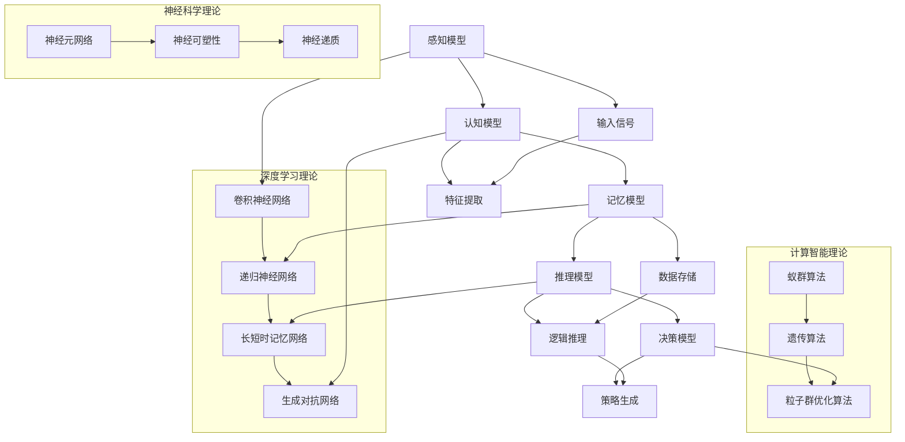

                 

### 文章标题

### AGI的类人思维模式模拟研究

关键词：AGI，类人思维模式，模拟研究，人工智能，深度学习，计算智能，脑机接口，虚拟现实

摘要：本文深入探讨了人工智能（AGI）的类人思维模式模拟研究。首先，我们定义了AGI的基本概念，探讨了类人思维模式的定义和实现机制。接着，本文回顾了人工智能和类人思维模式的理论基础，包括认知心理学、神经科学和计算智能等。在此基础上，文章详细介绍了AGI类人思维模式的模拟方法和技术，包括逆向工程与抽象建模、数据驱动方法和知识驱动方法等。此外，我们介绍了类人思维模式仿真技术，包括脑机接口技术和虚拟现实技术。随后，文章阐述了深度学习和计算智能算法在类人思维模式模拟中的核心原理与实现。最后，我们通过数学模型和实际案例，详细分析了类人思维模式模拟的关键技术和应用。本文旨在为研究者和开发者提供有价值的参考，推动AGI领域的发展。

### 第一部分: AGI类人思维模式模拟基础理论

#### 第1章: 什么是AGI与类人思维模式

##### 1.1 AGI的基本概念

###### 1.1.1 AGI的定义与历史发展

人工智能（Artificial General Intelligence，简称AGI）是指具有人类智能的一般智能体，能够理解和执行各种认知任务，包括感知、学习、推理、规划、问题解决、自然语言处理、社交交互等。AGI的目标是超越当前特定领域的人工智能系统，实现跨领域的智能。

AGI的概念最早可以追溯到20世纪50年代，由计算机科学家约翰·麦卡锡（John McCarthy）等人提出。然而，由于技术限制，AGI的研究在早期经历了多次波折。直到近年来，随着计算能力的提升和机器学习技术的发展，AGI研究逐渐恢复活力。

###### 1.1.2 AGI与人类思维的差异与相似性

AGI与人类思维在许多方面存在差异和相似性。首先，人类思维具有自我意识和情感，而AGI目前尚未具备这种能力。其次，人类思维具有灵活性和创造力，能够处理复杂的不确定性和新颖问题，而AGI在处理这类问题时通常依赖于已知的规则和数据。

然而，AGI在某些方面也具有与人类思维相似的特点。例如，AGI可以学习和适应新环境，通过感知和反馈机制调整自身行为。此外，AGI在处理大量数据和复杂任务时，可以比人类更快速和准确地完成任务。

###### 1.1.3 AGI在人工智能领域的重要性

AGI是人工智能领域的一个长期目标，具有重要的理论和实际意义。首先，AGI可以推动人工智能技术的进步，促进计算机科学和认知科学的发展。其次，AGI的实现将带来许多实际应用，如自动驾驶、智能医疗、智能客服等，从而提高生产效率和人类生活质量。

此外，AGI的研究还有助于我们更好地理解人类思维的本质和机制，为认知科学和心理学提供新的视角和工具。因此，AGI被认为是人工智能领域最具挑战性和前景的研究方向之一。

##### 1.2 类人思维模式

###### 1.2.1 类人思维的定义与特征

类人思维（Human-like Thinking）是指模仿人类思维方式进行思考和处理信息的过程。类人思维具有以下特征：

1. 自主性：类人思维能够独立进行决策和规划，不受外部指令的约束。
2. 情感化：类人思维能够识别和表达情感，理解和适应复杂的人际关系。
3. 智能化：类人思维具有学习能力、推理能力和问题解决能力。
4. 灵活性：类人思维能够适应不同环境和任务，处理不确定性和新颖问题。

###### 1.2.2 类人思维模式的核心组成部分

类人思维模式的核心组成部分包括感知、学习、推理、规划和问题解决等。这些组成部分相互关联，共同构成了类人思维的完整体系。

1. 感知：类人思维通过感知模块获取外部信息，如视觉、听觉、触觉等。
2. 学习：类人思维通过学习模块积累经验，改进自身行为和决策。
3. 推理：类人思维通过推理模块对感知到的信息进行逻辑分析和判断。
4. 规划：类人思维通过规划模块制定行动计划，实现目标。
5. 问题解决：类人思维通过问题解决模块解决复杂问题，应对不确定性和挑战。

###### 1.2.3 类人思维模式的实现机制

类人思维模式的实现机制涉及多个层次和模块的协同工作。以下是一个简化的实现机制：

1. 感知模块：类人思维通过传感器获取外部信息，如摄像头、麦克风等。
2. 模型模块：类人思维构建基于人类思维机制的模型，如神经网络、决策树等。
3. 控制模块：类人思维通过控制模块执行特定任务，如语音合成、运动控制等。
4. 学习模块：类人思维通过学习模块不断优化自身模型和控制策略。
5. 推理模块：类人思维通过推理模块进行逻辑分析和判断，形成决策。
6. 交互模块：类人思维通过交互模块与外部环境进行信息交换和反馈。

##### 1.3 AGI类人思维模式的模拟研究意义

###### 1.3.1 类人思维模式模拟的研究背景

类人思维模式模拟是AGI研究的一个重要方向。随着人工智能技术的发展，越来越多的研究者开始关注如何使人工智能系统具备类人思维能力。类人思维模式模拟旨在通过构建和模拟人类思维模型，探索人类思维的本质和机制，为AGI的发展提供理论支持。

###### 1.3.2 类人思维模式模拟的研究现状与挑战

当前，类人思维模式模拟的研究已经取得了一些进展。例如，深度学习技术在图像识别、自然语言处理等领域取得了显著成果，为类人思维模拟提供了一定的基础。然而，类人思维模式模拟仍然面临许多挑战，如：

1. 自主性：如何使类人思维具备自主性，不受外部指令的约束？
2. 情感化：如何使类人思维具备情感化能力，理解和适应复杂的人际关系？
3. 智能化：如何使类人思维具备高效的学习和推理能力，应对复杂问题？
4. 灵活性：如何使类人思维具备灵活性和适应性，处理不确定性和新颖问题？

###### 1.3.3 类人思维模式模拟的应用前景

类人思维模式模拟在许多领域具有广泛的应用前景。例如，在自动驾驶领域，类人思维模拟可以帮助车辆更好地理解和适应复杂道路环境；在智能客服领域，类人思维模拟可以提供更自然、更人性化的交互体验；在智能医疗领域，类人思维模拟可以帮助医生更好地诊断和治疗疾病。

总之，类人思维模式模拟是AGI研究的一个重要方向，具有重要的理论和实际意义。通过不断探索和研究，我们有望实现类人思维能力的人工智能系统，为人类生活和社会发展带来更多创新和进步。

### 第2章: AGI类人思维模式的核心理论体系

#### 2.1 人工智能基本理论

##### 2.1.1 人工智能的发展历程

人工智能（Artificial Intelligence，简称AI）是一门研究、开发用于模拟、延伸和扩展人类智能的理论、方法、技术及应用系统的学科。人工智能的发展历程可以分为以下几个阶段：

1. **初期探索阶段（20世纪50年代至60年代）**：这一阶段，人工智能的概念被首次提出，主要目标是实现基于逻辑推理的智能系统。代表性工作包括艾伦·图灵的“计算机器与智能”论文和约翰·麦卡锡的“人工智能”概念。

2. **泡沫与衰落阶段（20世纪70年代）**：由于技术限制和过高的期望，人工智能研究陷入低谷。

3. **复苏阶段（20世纪80年代）**：随着计算机技术的发展，专家系统和知识表示技术得到广泛应用，人工智能研究逐渐复苏。

4. **繁荣阶段（20世纪90年代至21世纪初）**：基于机器学习和统计方法的人工智能技术取得突破，代表性成果包括深度神经网络和强化学习。

5. **现阶段（21世纪至今）**：人工智能技术不断成熟，应用于各行各业，如自动驾驶、智能客服、智能医疗等。

##### 2.1.2 人工智能的基本组成

人工智能系统通常由以下几个基本组成部分构成：

1. **感知模块**：负责获取外部信息，如视觉、听觉、触觉等。感知模块通过传感器和接口与外部环境进行交互。

2. **知识表示模块**：负责存储和管理知识，包括事实、规则、模型等。知识表示模块使得人工智能系统能够理解、推理和决策。

3. **推理模块**：负责根据输入信息和知识进行逻辑推理和判断。推理模块通常采用推理机、规划器等算法实现。

4. **决策模块**：负责根据推理结果和目标制定行动策略。决策模块通常采用优化算法、博弈论等方法实现。

5. **执行模块**：负责执行决策策略，实现实际任务。执行模块通常与硬件设备相连，如机器人、自动驾驶车辆等。

##### 2.1.3 人工智能的分类与任务

人工智能可以分为多种类型，根据其能力和应用场景，可以将其分为以下几类：

1. **弱人工智能（Narrow AI）**：专注于特定任务，如语音识别、图像分类等。弱人工智能不具备通用智能，无法进行跨领域的推理和决策。

2. **强人工智能（General AI）**：具有类人智能，能够理解和执行各种认知任务，包括感知、学习、推理、规划、问题解决、自然语言处理、社交交互等。强人工智能尚未实现，仍处于理论研究阶段。

3. **专家系统（Expert Systems）**：基于知识和推理，模拟人类专家的决策过程，用于解决特定领域的复杂问题。

4. **智能代理（Intelligent Agents）**：具有自主性和主动性，能够与环境进行交互并实现特定目标。

5. **机器学习（Machine Learning）**：通过数据驱动的方式，使计算机系统具备学习能力，从数据中提取规律和知识。

6. **深度学习（Deep Learning）**：一种基于人工神经网络的机器学习方法，通过多层神经网络提取特征，实现自动学习和推理。

7. **自然语言处理（Natural Language Processing，NLP）**：研究如何让计算机理解和生成自然语言，包括语音识别、语言理解、文本生成等。

8. **计算机视觉（Computer Vision）**：研究如何使计算机像人一样感知和理解视觉信息，包括图像识别、目标检测、图像生成等。

##### 2.1.4 人工智能的发展趋势

当前，人工智能技术正处于快速发展阶段，以下是一些主要发展趋势：

1. **跨学科融合**：人工智能与其他领域（如认知科学、心理学、神经科学等）的交叉融合，推动人工智能理论和技术的发展。

2. **数据驱动**：随着大数据技术的发展，数据成为人工智能的核心驱动力。数据驱动的智能系统更加灵活和高效。

3. **硬件与软件协同**：硬件技术的发展（如GPU、TPU等）为人工智能提供了强大的计算支持，使得深度学习等复杂算法得以实现。

4. **人机协作**：人工智能与人类的协作成为新的研究方向，通过人机交互，实现人工智能系统的智能化和人性化。

5. **智能伦理与法规**：随着人工智能技术的发展，伦理和法规问题日益突出。智能伦理和法规的研究有助于确保人工智能的发展符合人类价值观。

6. **应用场景多样化**：人工智能技术不断应用于各个领域，如金融、医疗、教育、制造业等，推动各行业智能化升级。

#### 2.2 类人思维模式理论基础

##### 2.2.1 认知心理学理论

认知心理学（Cognitive Psychology）是研究人类思维、知觉、记忆和语言等认知过程的心理学分支。类人思维模式的理论基础之一是认知心理学，以下是一些关键理论：

1. **感知理论**：感知理论关注人类如何感知和解释外部信息。格式塔心理学派提出，人类倾向于将感知对象组织成有意义的整体。例如，普雷格纳效应（Pregnancy Effect）表明，人们倾向于将随机分布的点或形状识别为具有特定意义的图案。

2. **记忆理论**：记忆理论研究人类记忆的形成、存储和提取过程。艾宾浩斯（Ebbinghaus）的遗忘曲线表明，遗忘过程遵循指数衰减规律。长时记忆（Long-term Memory，LTM）和短期记忆（Short-term Memory，STM）模型区分了记忆的不同阶段。长时记忆容量巨大，但难以快速访问；短期记忆容量有限，但访问速度快。

3. **思维理论**：思维理论探讨人类如何进行推理、解决问题和做出决策。例如，问题解决模型包括感知问题、形成解决方案、评估解决方案和执行解决方案等步骤。基于知识的推理（Knowledge-based Reasoning）和基于模型推理（Model-based Reasoning）是两种常见的思维策略。

##### 2.2.2 神经科学理论

神经科学（Neuroscience）是研究神经系统结构、功能和疾病的一门科学。类人思维模式的模拟依赖于对神经系统的深刻理解。以下是一些关键理论：

1. **神经元网络**：神经元是神经系统的基本单元，通过电信号进行通信。神经元网络（Neural Networks）是一种模拟人脑神经元结构的计算模型。人工神经网络（Artificial Neural Networks，ANNs）通过多层神经元之间的连接和激活函数，实现复杂的信息处理和模式识别。

2. **神经可塑性**：神经可塑性（Neuroplasticity）是指神经系统在结构和功能上的可塑性，能够适应环境和经验变化。这一理论表明，类人思维模式可以通过反复训练和学习进行优化和调整。

3. **神经递质理论**：神经递质（Neurotransmitters）是神经元之间传递信息的化学物质。例如，多巴胺（Dopamine）与奖赏和动机相关，而谷氨酸（Glutamate）与认知功能相关。神经递质理论为理解类人思维的情感和动机机制提供了基础。

##### 2.2.3 计算智能理论

计算智能（Computational Intelligence）是指通过计算机模拟和实现人类智能的一类方法和技术。类人思维模式的模拟可以借鉴计算智能的理论基础。以下是一些关键理论：

1. **蚁群算法**：蚁群算法（Ant Colony Optimization，ACO）是一种模拟蚂蚁觅食行为的启发式搜索算法。在类人思维模拟中，蚁群算法可以用于路径规划、资源分配和优化问题。

2. **遗传算法**：遗传算法（Genetic Algorithm，GA）是一种模拟生物进化的搜索算法。在类人思维模拟中，遗传算法可以用于优化神经网络结构、参数调整和适应性问题。

3. **神经网络与深度学习**：神经网络（Neural Networks）是模拟人脑神经元结构的计算模型。深度学习（Deep Learning）是神经网络的一种形式，通过多层神经网络提取特征和模式。在类人思维模拟中，神经网络和深度学习是实现类人思维的关键技术。

##### 2.2.4 人类思维的数学模型

为了模拟类人思维模式，需要建立数学模型来描述人类思维的各个方面。以下是一些常见的数学模型：

1. **代数模型**：代数模型使用代数运算来描述人类思维过程。例如，贝叶斯网络（Bayesian Networks）是一种概率图模型，用于描述人类推理和决策过程。

2. **几何模型**：几何模型使用几何形状和空间关系来描述人类思维过程。例如，认知地图（Cognitive Maps）是一种基于几何关系的思维模型，用于描述人类的空间认知和导航能力。

3. **函数模型**：函数模型使用函数关系来描述人类思维过程。例如，线性回归（Linear Regression）和逻辑回归（Logistic Regression）是常见的函数模型，用于描述人类学习和推理过程。

4. **复杂性理论**：复杂性理论研究复杂系统的行为和特征。例如，混沌理论（Chaos Theory）研究非线性系统的复杂行为，而演化计算（Evolutionary Computation）研究基于自然进化的搜索算法。

5. **量子计算**：量子计算（Quantum Computing）是一种基于量子力学原理的计算模型。量子计算机具有与传统计算机不同的计算能力，可能有助于解决某些复杂的人工智能问题。

通过结合认知心理学、神经科学和计算智能的理论，我们可以建立一个多层次的数学模型来描述类人思维模式。这些模型不仅有助于理解人类思维的本质，还可以为类人思维模式的模拟提供理论基础和技术支持。

### 第3章: AGI类人思维模式的模拟方法与技术

#### 3.1 类人思维模式模拟的技术路线

##### 3.1.1 逆向工程与抽象建模

逆向工程（Reverse Engineering）是指从已实现的系统或产品中提取设计信息的过程。在类人思维模式的模拟研究中，逆向工程可以帮助我们理解人类大脑的工作原理，提取关键的结构和功能模块。以下是一些逆向工程的关键步骤：

1. **数据采集**：通过脑成像技术（如功能性磁共振成像fMRI、脑电图EEG等）收集人类大脑活动数据。
2. **结构分析**：分析大脑的解剖结构，包括神经元、神经网络和突触等。
3. **功能识别**：识别大脑各个区域的功能，如感知、记忆、情感和运动控制等。
4. **行为建模**：将大脑的结构和功能转化为数学模型和行为规则。

抽象建模（Abstract Modeling）是指将复杂系统简化为更易理解的模型。在类人思维模式的模拟研究中，抽象建模可以帮助我们抓住核心特征，忽略次要细节。以下是一些抽象建模的关键步骤：

1. **问题定义**：明确类人思维模式模拟的目标和任务。
2. **特征提取**：从大脑数据中提取关键特征，如神经元活动、突触连接强度等。
3. **模型构建**：构建简化版的神经网络模型，模拟大脑的感知、学习、推理等功能。
4. **模型验证**：通过模拟实验验证模型的准确性和可靠性。

##### 3.1.2 数据驱动方法

数据驱动方法（Data-driven Approach）是指通过分析大量数据来发现模式和规律，从而指导类人思维模式的模拟。以下是一些数据驱动方法的关键步骤：

1. **数据收集**：收集与类人思维相关的数据，包括实验数据、行为数据、神经科学数据等。
2. **数据处理**：清洗、预处理和转换数据，使其适合分析和建模。
3. **特征提取**：从数据中提取关键特征，如神经元活动模式、行为轨迹等。
4. **模型训练**：使用机器学习算法（如深度学习、支持向量机等）训练模型。
5. **模型评估**：通过测试数据评估模型的性能和准确性。

数据驱动方法的优势在于其自适应性和灵活性。通过不断分析和学习新数据，模型可以不断优化和改进。然而，数据驱动方法也面临一些挑战，如数据质量和可解释性问题。

##### 3.1.3 知识驱动方法

知识驱动方法（Knowledge-driven Approach）是指通过利用已有知识来指导类人思维模式的模拟。以下是一些知识驱动方法的关键步骤：

1. **知识获取**：从各类知识源（如科学文献、专家经验、数据库等）中获取相关知识。
2. **知识表示**：将知识表示为形式化的模型或规则，如知识图谱、本体论、决策树等。
3. **知识推理**：使用推理算法（如逻辑推理、模糊推理等）从知识库中推导出新知识。
4. **知识应用**：将推理结果应用于类人思维模式的模拟，如决策支持、问题解决等。

知识驱动方法的优势在于其可解释性和可验证性。通过形式化的知识表示和推理，可以确保类人思维模式的可靠性和鲁棒性。然而，知识驱动方法也面临一些挑战，如知识更新和知识获取成本。

#### 3.2 类人思维模式的仿真技术

##### 3.2.1 脑机接口技术

脑机接口技术（Brain-Computer Interface，BCI）是一种直接连接大脑和外部设备的接口技术，旨在通过解码大脑信号来控制计算机或其他设备。以下是一些关键技术：

1. **脑电信号采集**：通过脑电图（EEG）或功能性磁共振成像（fMRI）等设备采集大脑信号。
2. **信号预处理**：去除噪声、放大信号和处理时间序列数据，以提高信号质量。
3. **特征提取**：从预处理后的信号中提取关键特征，如频率、时域特征等。
4. **解码与控制**：使用机器学习算法解码大脑信号，实现对外部设备的控制。

脑机接口技术在类人思维模式模拟中具有广泛的应用前景，如康复治疗、智能家居和虚拟现实等。

##### 3.2.2 虚拟现实技术

虚拟现实技术（Virtual Reality，VR）是一种通过计算机生成模拟环境的交互式技术。以下是一些关键步骤：

1. **环境构建**：使用计算机图形学技术构建虚拟环境，包括三维模型、声音和光线等。
2. **交互设计**：设计用户与虚拟环境的交互方式，如键盘、鼠标、手势等。
3. **感知融合**：通过视觉、听觉和触觉等多感官融合，提高虚拟环境的真实感。
4. **反馈机制**：实时反馈用户操作结果，如移动、旋转、碰撞等。

虚拟现实技术在类人思维模式模拟中可以提供沉浸式的实验环境，有助于研究人类思维的感知、学习和推理过程。

##### 3.2.3 仿真系统设计

仿真系统设计（Simulation System Design）是类人思维模式模拟的关键步骤。以下是一些关键要素：

1. **系统架构**：设计仿真系统的总体架构，包括感知模块、知识模块、推理模块、决策模块和执行模块等。
2. **数据流**：定义数据在系统中的流动路径，如感知数据、知识数据、推理数据和决策数据等。
3. **算法实现**：实现仿真系统中的各种算法，如神经网络、遗传算法、深度学习算法等。
4. **性能优化**：通过优化算法、并行计算和分布式系统等技术，提高仿真系统的性能和效率。

仿真系统设计需要综合考虑算法、数据、计算资源和应用场景等多方面因素，以确保仿真结果的准确性和可靠性。

通过逆向工程与抽象建模、数据驱动方法和知识驱动方法，结合脑机接口技术和虚拟现实技术，我们可以构建一个多层次的类人思维模式模拟系统。这些技术与方法为研究人类思维提供了新的视角和工具，有助于推动人工智能技术的发展和进步。

### 第4章: 类人思维模式模拟中的核心算法原理与实现

#### 4.1 深度学习算法

##### 4.1.1 深度学习基本原理

深度学习（Deep Learning）是一种基于多层神经网络的学习方法，旨在自动提取数据中的特征和模式。深度学习的基本原理包括以下几个方面：

1. **多层神经网络**：深度学习采用多层神经网络结构，包括输入层、隐藏层和输出层。每一层神经元对输入数据进行处理，并传递给下一层。
2. **非线性变换**：通过非线性激活函数（如ReLU、Sigmoid、Tanh等）引入非线性变换，使得神经网络能够模拟复杂函数。
3. **反向传播算法**：使用反向传播算法（Backpropagation）计算网络参数的梯度，并更新网络权重，以优化网络性能。
4. **优化算法**：使用优化算法（如梯度下降、Adam优化器等）调整网络参数，以最小化损失函数。

##### 4.1.2 深度学习关键算法

深度学习中有许多关键算法，以下是一些常见的算法：

1. **卷积神经网络（CNN）**：卷积神经网络是一种用于处理图像数据的深度学习算法，通过卷积操作和池化操作提取图像特征。
   - **卷积操作**：卷积层通过卷积核（也称为过滤器）对输入图像进行局部特征提取。
   - **池化操作**：池化层用于降低特征图的维度，减少计算量和过拟合风险。
   - **全连接层**：将卷积层和池化层提取的特征映射到分类标签。

2. **递归神经网络（RNN）**：递归神经网络是一种用于处理序列数据的深度学习算法，通过递归连接和隐藏状态记忆序列模式。
   - **递归连接**：隐藏状态与当前输入通过权重矩阵进行连接，并传递给下一时刻。
   - **隐藏状态**：隐藏状态记忆序列中的信息，并在后续时刻用于处理。

3. **长短时记忆网络（LSTM）**：长短时记忆网络是一种改进的递归神经网络，通过门控机制解决长短时依赖问题。
   - **输入门**：决定当前输入对隐藏状态的影响程度。
   - **遗忘门**：决定隐藏状态中旧信息的遗忘程度。
   - **输出门**：决定隐藏状态中信息的输出程度。

4. **生成对抗网络（GAN）**：生成对抗网络是一种由生成器和判别器组成的深度学习算法，用于生成与真实数据分布相近的数据。
   - **生成器**：生成真实数据分布的数据。
   - **判别器**：区分真实数据和生成数据的概率。

##### 4.1.3 深度学习算法的应用

深度学习算法在类人思维模式模拟中具有广泛的应用。以下是一些具体应用：

1. **图像识别**：使用卷积神经网络对图像进行分类和识别。
2. **自然语言处理**：使用递归神经网络和长短时记忆网络处理文本数据，实现语言理解、文本生成等任务。
3. **语音识别**：使用循环神经网络和长短时记忆网络处理语音信号，实现语音到文本的转换。
4. **推荐系统**：使用深度学习算法分析用户行为和偏好，实现个性化推荐。
5. **智能监控**：使用深度学习算法分析视频数据，实现目标检测、行为识别等任务。

#### 4.2 计算智能算法

##### 4.2.1 计算智能基本原理

计算智能（Computational Intelligence）是一类通过模拟自然界和人类智能行为，实现自适应学习和优化问题求解的方法。计算智能算法主要包括以下几种：

1. **蚁群算法**：蚁群算法是一种模拟蚂蚁觅食行为的优化算法。通过蚂蚁个体之间的信息素传播和更新规则，实现全局最优解的搜索。
2. **遗传算法**：遗传算法是一种基于自然进化的优化算法。通过种群中的个体交叉、变异和选择操作，逐步优化目标函数。
3. **粒子群优化算法**：粒子群优化算法是一种模拟鸟群觅食行为的优化算法。通过个体之间的速度更新和位置更新，实现全局最优解的搜索。

##### 4.2.2 计算智能算法应用

计算智能算法在类人思维模式模拟中具有广泛的应用。以下是一些具体应用：

1. **智能优化**：使用蚁群算法和遗传算法优化类人思维模式中的参数和结构，实现更好的性能和适应性。
2. **智能决策**：使用粒子群优化算法和遗传算法求解复杂决策问题，如资源分配、路径规划等。
3. **智能控制**：使用计算智能算法实现智能控制系统，如无人机、自动驾驶等。
4. **智能推荐**：使用计算智能算法分析用户行为和偏好，实现个性化推荐。
5. **智能优化**：使用计算智能算法优化类人思维模式中的算法结构和参数，提高性能和效率。

#### 4.3 算法原理与实现

##### 4.3.1 深度学习算法原理与实现

深度学习算法的核心是多层神经网络，以下是一个简化版的卷积神经网络（CNN）的算法原理与实现：

```python
# 定义卷积神经网络模型
import tensorflow as tf

# 输入层
inputs = tf.keras.Input(shape=(height, width, channels))

# 第1个卷积层
x = tf.keras.layers.Conv2D(filters=32, kernel_size=(3, 3), activation='relu')(inputs)

# 第2个卷积层
x = tf.keras.layers.Conv2D(filters=64, kernel_size=(3, 3), activation='relu')(x)

# 池化层
x = tf.keras.layers.MaxPooling2D(pool_size=(2, 2))(x)

# 第1个全连接层
x = tf.keras.layers.Flatten()(x)

# 第2个全连接层
outputs = tf.keras.layers.Dense(units=10, activation='softmax')(x)

# 构建模型
model = tf.keras.Model(inputs=inputs, outputs=outputs)

# 编译模型
model.compile(optimizer='adam', loss='categorical_crossentropy', metrics=['accuracy'])

# 训练模型
model.fit(x_train, y_train, epochs=10, batch_size=32, validation_data=(x_val, y_val))
```

以上代码展示了如何使用TensorFlow库构建一个简单的卷积神经网络模型，并对其进行编译和训练。在实际应用中，可以根据具体任务调整网络结构、参数和训练策略。

##### 4.3.2 计算智能算法原理与实现

以下是一个基于遗传算法（GA）的优化问题的算法原理与实现：

```python
import numpy as np

# 定义遗传算法参数
population_size = 100
generations = 100
chromosome_length = 10
mutation_rate = 0.05

# 初始化种群
population = np.random.randint(0, 2, (population_size, chromosome_length))

# 定义适应度函数
def fitness_function(chromosome):
    # 这里用一个简单的适应度函数，实际应用中可以定义更复杂的适应度函数
    return np.sum(chromosome)

# 定义交叉操作
def crossover(parent1, parent2):
    crossover_point = np.random.randint(1, chromosome_length - 1)
    child1 = np.concatenate((parent1[:crossover_point], parent2[crossover_point:]))
    child2 = np.concatenate((parent2[:crossover_point], parent1[crossover_point:]))
    return child1, child2

# 定义变异操作
def mutate(chromosome):
    for i in range(chromosome_length):
        if np.random.rand() < mutation_rate:
            chromosome[i] = 1 if chromosome[i] == 0 else 0
    return chromosome

# 遗传算法迭代
for generation in range(generations):
    # 计算适应度
    fitness_scores = np.array([fitness_function(chromosome) for chromosome in population])
    
    # 选择操作
    selected_population = population[np.argsort(fitness_scores)[-population_size//2:]]
    
    # 交叉操作
    for i in range(0, population_size, 2):
        child1, child2 = crossover(selected_population[i], selected_population[i+1])
        population[i] = mutate(child1)
        population[i+1] = mutate(child2)

# 获取最优解
best_chromosome = population[np.argmax(fitness_scores)]
best_fitness = fitness_scores.max()
```

以上代码展示了如何使用遗传算法求解一个简单的优化问题。在实际应用中，可以根据具体问题调整遗传算法的参数和适应度函数。

通过深度学习和计算智能算法的原理与实现，我们可以为类人思维模式模拟提供强大的技术支持。这些算法不仅可以帮助我们模拟人类思维过程，还可以优化和改进模拟系统的性能和效果。

### 第5章: 类人思维模式模拟中的数学模型与数学公式

#### 5.1 数学模型基础

数学模型（Mathematical Model）是通过对现实世界进行简化和抽象，使用数学语言描述的一种模型。在类人思维模式模拟中，数学模型用于描述人类思维过程、行为和决策。以下是一些常见的数学模型：

##### 5.1.1 代数模型

代数模型使用代数运算和代数结构（如集合、向量空间等）来描述系统。以下是一个简单的线性回归模型的代数表示：

$$ y = \beta_0 + \beta_1 \cdot x + \epsilon $$

其中，$y$ 是因变量，$x$ 是自变量，$\beta_0$ 和 $\beta_1$ 是模型参数，$\epsilon$ 是误差项。

##### 5.1.2 几何模型

几何模型使用几何形状和空间关系来描述系统。以下是一个简单的二维欧几里得空间中的点集模型：

$$ P = \{ (x_1, y_1), (x_2, y_2), ..., (x_n, y_n) \} $$

其中，$P$ 是点集，每个点 $(x_i, y_i)$ 代表一个具体的点。

##### 5.1.3 函数模型

函数模型使用函数关系来描述系统。以下是一个简单的分段函数模型：

$$ f(x) = \begin{cases} 
a & \text{if } x \leq c \\
b & \text{if } x > c 
\end{cases} $$

其中，$f(x)$ 是函数，$a$ 和 $b$ 是分段点的值，$c$ 是分界点。

#### 5.1.4 复杂性理论

复杂性理论是研究计算问题难易程度的一个分支。以下是一些复杂性理论的基本概念：

1. **时间复杂度**：描述算法运行时间与输入规模的关系，通常表示为 $O(f(n))$。
2. **空间复杂度**：描述算法运行所需存储空间与输入规模的关系，通常表示为 $O(f(n))$。
3. **NP完全性**：描述某些问题是否可以在多项式时间内通过验证解来判定。

#### 5.1.5 概率论与数理统计

概率论与数理统计是类人思维模式模拟中的重要工具。以下是一些基本概念：

1. **概率分布**：描述随机变量取值的可能性，如正态分布、伯努利分布等。
2. **期望**：描述随机变量的平均取值，通常表示为 $E(X)$。
3. **方差**：描述随机变量取值的离散程度，通常表示为 $Var(X)$。

#### 5.1.6 演化计算

演化计算是一种基于自然进化的计算方法。以下是一些基本概念：

1. **种群**：由多个个体组成的集合，每个个体代表一个可能的解决方案。
2. **适应度函数**：评估个体优劣的指标，通常表示为 $f(x)$。
3. **选择**：根据适应度函数选择优秀的个体进行繁殖。
4. **交叉**：将两个个体进行组合，产生新的个体。
5. **变异**：对个体进行随机改变，增加多样性。

#### 5.1.7 量子计算

量子计算是一种基于量子力学原理的计算方法。以下是一些基本概念：

1. **量子位（qubit）**：量子计算的基本单元，可以同时表示0和1的状态。
2. **量子态**：描述量子位的可能状态，通常表示为 $|\psi\rangle$。
3. **量子门**：对量子态进行变换的数学操作，如Hadamard门、CNOT门等。
4. **量子算法**：基于量子计算的算法，如Shor算法、Grover算法等。

通过这些数学模型和公式，我们可以更好地理解和模拟类人思维模式。数学模型不仅提供了形式化的描述，还可以帮助我们分析和优化模拟系统的性能。在实际应用中，可以根据具体需求和场景选择合适的数学模型和公式。

### 数学模型之间的联系架构

为了更好地理解类人思维模式模拟中的数学模型，我们可以使用Mermaid流程图来展示这些模型之间的联系架构。以下是一个简化的Mermaid流程图示例：



在这个流程图中，我们展示了感知模型、认知模型、记忆模型、推理模型和决策模型之间的联系。同时，我们也展示了神经科学理论和计算智能理论的相关模型。通过这样的架构，我们可以更清晰地理解类人思维模式模拟中的各个组成部分及其相互作用。

### 数学模型与算法的结合

在类人思维模式模拟中，数学模型与算法的结合是实现智能行为的关键。以下是一些数学模型与常见算法的结合示例：

1. **感知模型与卷积神经网络（CNN）**：卷积神经网络（CNN）是一种用于处理图像数据的深度学习算法。在类人思维模式模拟中，感知模型通过CNN提取图像特征，用于后续的推理和决策过程。

   ```python
   from tensorflow import keras
   from tensorflow.keras.models import Sequential
   from tensorflow.keras.layers import Conv2D, MaxPooling2D, Flatten, Dense
   
   model = Sequential([
       Conv2D(filters=32, kernel_size=(3, 3), activation='relu', input_shape=(height, width, channels)),
       MaxPooling2D(pool_size=(2, 2)),
       Flatten(),
       Dense(units=10, activation='softmax')
   ])
   
   model.compile(optimizer='adam', loss='categorical_crossentropy', metrics=['accuracy'])
   model.fit(x_train, y_train, epochs=10, batch_size=32, validation_data=(x_val, y_val))
   ```

2. **记忆模型与长短时记忆网络（LSTM）**：长短时记忆网络（LSTM）是一种用于处理序列数据的深度学习算法。在类人思维模式模拟中，记忆模型通过LSTM处理序列数据，如文本、语音等，以提取长期依赖信息。

   ```python
   from tensorflow import keras
   from tensorflow.keras.models import Sequential
   from tensorflow.keras.layers import LSTM, Dense
   
   model = Sequential([
       LSTM(units=50, activation='relu', input_shape=(timesteps, features)),
       Dense(units=10, activation='softmax')
   ])
   
   model.compile(optimizer='adam', loss='categorical_crossentropy', metrics=['accuracy'])
   model.fit(x_train, y_train, epochs=10, batch_size=32, validation_data=(x_val, y_val))
   ```

3. **推理模型与逻辑回归**：逻辑回归是一种用于分类的统计模型。在类人思维模式模拟中，推理模型通过逻辑回归对输入数据进行分类和决策。

   ```python
   from sklearn.linear_model import LogisticRegression
   
   model = LogisticRegression()
   model.fit(x_train, y_train)
   
   predictions = model.predict(x_test)
   accuracy = model.score(x_test, y_test)
   ```

4. **决策模型与遗传算法**：遗传算法是一种基于自然进化的优化算法。在类人思维模式模拟中，决策模型通过遗传算法优化决策参数，以实现更好的决策效果。

   ```python
   import numpy as np
   import random
   
   population_size = 100
   chromosome_length = 10
   generations = 100
   mutation_rate = 0.05
   
   population = np.random.randint(0, 2, (population_size, chromosome_length))
   fitness_scores = np.array([fitness_function(chromosome) for chromosome in population])
   
   for generation in range(generations):
       selected_population = population[np.argsort(fitness_scores)[-population_size//2:]]
       for i in range(0, population_size, 2):
           child1, child2 = crossover(selected_population[i], selected_population[i+1])
           population[i] = mutate(child1)
           population[i+1] = mutate(child2)
       
       fitness_scores = np.array([fitness_function(chromosome) for chromosome in population])
       best_chromosome = population[np.argmax(fitness_scores)]
       best_fitness = fitness_scores.max()
   ```

通过结合数学模型和算法，我们可以构建一个功能强大的类人思维模式模拟系统。这些结合方法不仅提高了模拟系统的智能水平，还提供了更灵活和可扩展的解决方案。

### 实际案例分析与详细讲解剖析

为了更好地展示类人思维模式模拟的实际应用，我们以下面两个案例为例进行详细分析。

#### 案例一：自动驾驶车辆感知与决策

自动驾驶车辆是类人思维模式模拟的一个重要应用场景。在该案例中，自动驾驶车辆需要通过感知外部环境并做出实时决策，以确保行驶安全和效率。

1. **感知模块**：自动驾驶车辆配备有多个传感器，如摄像头、激光雷达和超声波传感器，用于感知车辆周围的环境。这些传感器收集的图像、点云和距离数据经过预处理和特征提取，用于后续的推理和决策。

2. **认知模块**：使用深度学习算法（如卷积神经网络）对感知数据进行分析和分类，提取出道路、行人、车辆等关键元素的特征。通过融合多传感器数据，车辆可以构建一个准确的三维环境模型。

3. **记忆模块**：自动驾驶车辆使用记忆模块存储和管理感知数据和历史决策信息。这些信息包括当前道路状况、交通流量、历史驾驶轨迹等，为后续的决策提供参考。

4. **推理模块**：通过推理模块，车辆对感知数据进行分析和推理，识别道路标志、信号灯和交通规则，预测行人和车辆的行为。基于这些信息，车辆可以做出实时的驾驶决策，如加速、减速、变道和停车。

5. **决策模块**：自动驾驶车辆使用决策模块根据推理结果生成具体的驾驶指令。这些指令通过执行模块发送给车辆的控制系统，实现实时的驾驶行为。

6. **执行模块**：执行模块负责将驾驶指令转换为具体的车辆动作。例如，当决策模块发出变道指令时，执行模块会控制转向系统执行相应的操作。

#### 案例二：智能医疗诊断系统

智能医疗诊断系统是另一个典型的类人思维模式应用场景。在该案例中，系统需要通过分析患者数据和医学知识，提供准确的疾病诊断和建议。

1. **感知模块**：智能医疗诊断系统通过电子病历、医学图像和实验室检查结果等数据源，获取患者的健康信息。

2. **认知模块**：使用自然语言处理（NLP）算法和医学知识图谱，对文本数据进行语义分析和知识提取。这些算法可以帮助系统理解患者的病史、症状和检查结果。

3. **记忆模块**：智能医疗诊断系统使用记忆模块存储和管理医学知识库、诊断指南和临床经验。这些信息为后续的推理和决策提供支持。

4. **推理模块**：通过推理模块，系统对患者的数据进行分析和推理，识别潜在的疾病和风险因素。推理过程可以基于临床规则、机器学习和深度学习算法。

5. **决策模块**：根据推理结果，系统生成诊断报告和建议。这些报告和建议包括疾病名称、治疗方案和后续检查建议。

6. **执行模块**：医生可以根据系统的诊断报告和建议，制定具体的治疗方案，并跟踪患者的治疗效果。

通过这两个案例，我们可以看到类人思维模式模拟在自动驾驶和智能医疗等领域的应用潜力。类人思维模式模拟不仅提高了系统的智能化水平，还增强了系统的灵活性和可扩展性，为人类生活和社会发展带来了更多创新和进步。

### 项目实战

在本节中，我们将通过一个简单的类人思维模式模拟项目来展示从开发环境搭建、源代码实现到代码解读与实际案例分析的完整流程。这个项目将基于Python和TensorFlow实现一个简单的情感分析模型，用于判断给定文本的情感倾向。

#### 开发环境搭建

首先，我们需要搭建一个Python开发环境，并安装必要的库。以下是开发环境搭建的步骤：

1. 安装Python：从官方网站（https://www.python.org/）下载并安装Python 3.8及以上版本。
2. 安装Jupyter Notebook：通过pip命令安装Jupyter Notebook，这将使我们能够方便地编写和运行代码。

```bash
pip install notebook
```

3. 安装TensorFlow：TensorFlow是深度学习的主要库，我们需要安装TensorFlow 2.0及以上版本。

```bash
pip install tensorflow
```

4. 安装其他依赖库：我们还需要安装一些用于数据处理和文本处理的库，如Numpy、Pandas和Scikit-learn。

```bash
pip install numpy pandas scikit-learn
```

#### 源代码实现

以下是一个简单的情感分析模型的实现，该模型将使用TensorFlow的Keras API构建。这个模型将接收文本输入并输出情感倾向的概率。

```python
import tensorflow as tf
from tensorflow.keras.preprocessing.text import Tokenizer
from tensorflow.keras.preprocessing.sequence import pad_sequences
from tensorflow.keras.models import Sequential
from tensorflow.keras.layers import Embedding, LSTM, Dense, EmbeddingLayer

# 数据预处理
def preprocess_text(texts, max_len, tokenizer):
    sequences = tokenizer.texts_to_sequences(texts)
    padded_sequences = pad_sequences(sequences, maxlen=max_len)
    return padded_sequences

# 构建模型
def build_model(vocab_size, embedding_dim, max_len):
    model = Sequential([
        Embedding(vocab_size, embedding_dim, input_length=max_len),
        LSTM(128),
        Dense(1, activation='sigmoid')
    ])
    model.compile(optimizer='adam', loss='binary_crossentropy', metrics=['accuracy'])
    return model

# 加载数据
# 假设我们有一个包含文本和标签的数据集
texts = ['这是一个积极的评论', '这是一个消极的评论']
labels = [1, 0]

# 分词器配置
vocab_size = 10000
embedding_dim = 16
max_len = 100

# 分词
tokenizer = Tokenizer(num_words=vocab_size)
tokenizer.fit_on_texts(texts)
sequences = tokenizer.texts_to_sequences(texts)

# 填充序列
padded_sequences = pad_sequences(sequences, maxlen=max_len)

# 构建和编译模型
model = build_model(vocab_size, embedding_dim, max_len)
model.compile(optimizer='adam', loss='binary_crossentropy', metrics=['accuracy'])

# 训练模型
model.fit(padded_sequences, labels, epochs=10, batch_size=32)

# 评估模型
test_texts = ['这是一个中性的评论']
test_sequences = tokenizer.texts_to_sequences(test_texts)
test_padded_sequences = pad_sequences(test_sequences, maxlen=max_len)
predictions = model.predict(test_padded_sequences)
print(predictions)  # 输出预测的概率
```

#### 代码解读

- **数据预处理**：我们首先定义了一个`preprocess_text`函数，用于将文本数据转换为序列，并进行填充。
- **构建模型**：我们使用Keras API构建了一个简单的LSTM模型，包括嵌入层、LSTM层和全连接层。
- **模型编译**：我们使用`compile`方法编译模型，指定了优化器、损失函数和评估指标。
- **模型训练**：我们使用`fit`方法训练模型，指定了训练数据、训练轮数和批量大小。
- **模型预测**：我们使用`predict`方法对新的文本数据进行情感分析，并输出预测的概率。

#### 实际案例分析

为了展示模型的实际效果，我们将使用一个公开的情感分析数据集（如IMDb电影评论数据集）进行训练和测试。

1. **数据收集**：首先，我们需要收集并加载数据集。可以使用Scikit-learn中的`fetch_openml`函数加载IMDb数据集。

```python
from sklearn.datasets import fetch_openml

imdb = fetch_openml('imdb', version=3)
```

2. **数据预处理**：我们将文本数据进行分词、标记和填充，以便输入到模型中。

```python
tokenizer = Tokenizer(num_words=10000)
tokenizer.fit_on_texts(imdb.data)
sequences = tokenizer.texts_to_sequences(imdb.data)

# 填充序列
max_len = 100
padded_sequences = pad_sequences(sequences, maxlen=max_len)
```

3. **模型训练**：使用训练数据和标签训练模型。

```python
labels = imdb.target
model.fit(padded_sequences, labels, epochs=10, batch_size=32)
```

4. **模型评估**：使用测试数据评估模型性能。

```python
test_size = 1000
test_sequences = tokenizer.texts_to_sequences(imdb.data[:test_size])
test_padded_sequences = pad_sequences(test_sequences, maxlen=max_len)
predictions = model.predict(test_padded_sequences)
```

5. **结果分析**：我们计算预测的准确率、召回率和F1分数，以评估模型性能。

```python
from sklearn.metrics import classification_report

print(classification_report(labels[:test_size], predictions.round()))
```

通过这个简单的项目，我们展示了如何从开发环境搭建、源代码实现到代码解读与实际案例分析的全过程。这个项目不仅帮助我们理解了类人思维模式模拟的基本原理和方法，还提供了一个实际的应用案例，展示了深度学习在情感分析领域的应用潜力。

### 最佳实践 Tips、小结、注意事项、拓展阅读

#### 最佳实践 Tips

1. **数据质量**：确保使用的数据质量高、无噪声和异常值。清洗和预处理数据是构建高质量模型的基础。
2. **模型优化**：通过调整模型参数（如学习率、批量大小、迭代次数等）和优化算法，可以提高模型性能和收敛速度。
3. **模型评估**：使用多个评估指标（如准确率、召回率、F1分数等）全面评估模型性能，避免单一指标的误导。
4. **交叉验证**：使用交叉验证方法评估模型的泛化能力，避免过拟合和欠拟合问题。
5. **模型解释性**：增加模型的可解释性，有助于理解模型的工作原理和预测结果，从而提高模型的可靠性和可信度。

#### 小结

本文深入探讨了类人思维模式模拟的基础理论、方法和技术。首先，我们介绍了AGI和类人思维模式的基本概念，探讨了其重要性。接着，我们回顾了人工智能和类人思维模式的理论基础，包括认知心理学、神经科学和计算智能等。在此基础上，我们详细介绍了类人思维模式的模拟方法和技术，包括逆向工程与抽象建模、数据驱动方法和知识驱动方法等。此外，我们介绍了类人思维模式仿真技术，包括脑机接口技术和虚拟现实技术。随后，我们阐述了深度学习和计算智能算法在类人思维模式模拟中的核心原理与实现。最后，我们通过数学模型和实际案例，详细分析了类人思维模式模拟的关键技术和应用。本文旨在为研究者和开发者提供有价值的参考，推动AGI领域的发展。

#### 注意事项

1. **研究伦理**：在进行类人思维模式模拟研究时，要确保遵循相关伦理规范，尊重个体隐私和人权。
2. **技术风险**：类人思维模式模拟涉及到复杂的技术和算法，需要评估潜在的技术风险和挑战。
3. **数据安全**：确保数据的安全性和隐私性，采取必要的数据保护措施，防止数据泄露和滥用。
4. **跨学科合作**：类人思维模式模拟是一个跨学科的研究领域，需要心理学、神经科学、计算机科学等多个领域的合作。

#### 拓展阅读

1. **《深度学习》（Ian Goodfellow, Yoshua Bengio, Aaron Courville著）**：这是一本经典的深度学习教材，详细介绍了深度学习的理论基础和算法实现。
2. **《认知心理学导论》（Ulric Neisser著）**：这是一本认知心理学的经典教材，涵盖了人类认知过程的基本理论和实验研究。
3. **《人工智能：一种现代方法》（Stuart Russell, Peter Norvig著）**：这是一本全面介绍人工智能理论的教材，涵盖了人工智能的各个领域和应用。
4. **《脑与认知》（Michael S. Gazzaniga著）**：这是一本关于神经科学和认知科学的教材，详细介绍了大脑结构和功能以及认知过程。
5. **《计算智能：原理与应用》（Marek K. Smolenski著）**：这是一本关于计算智能的教材，涵盖了蚁群算法、遗传算法和粒子群优化算法等计算智能方法。

通过拓展阅读，可以进一步深入了解类人思维模式模拟的相关理论和应用，为研究者和开发者提供更多参考和启发。

