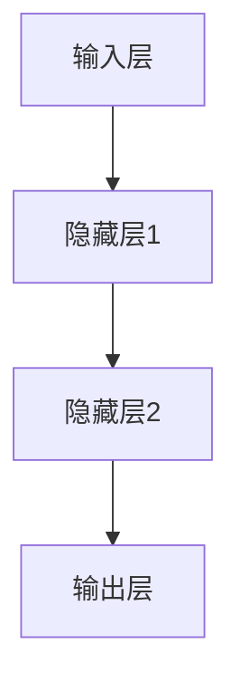
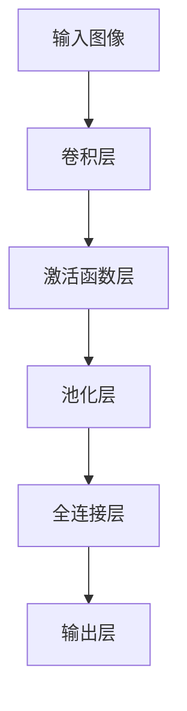
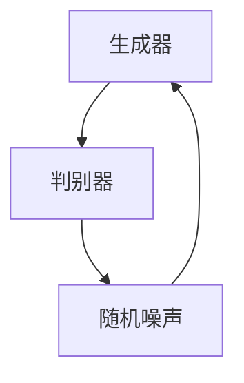
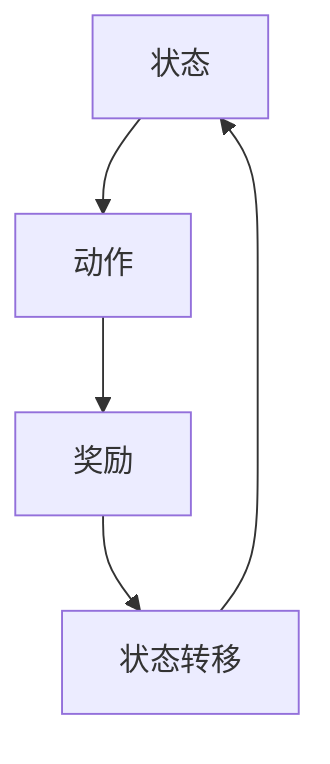
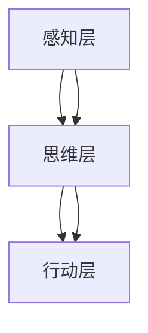
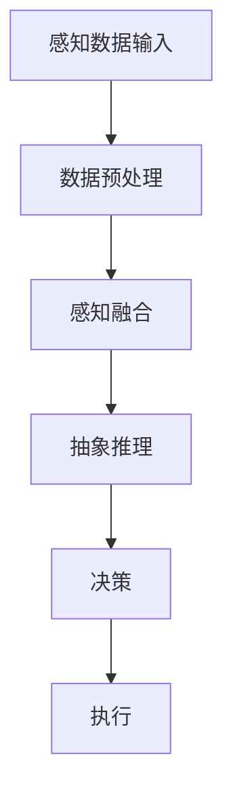
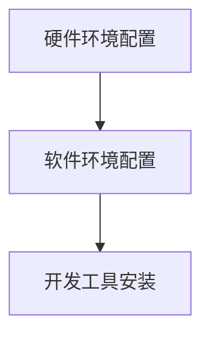
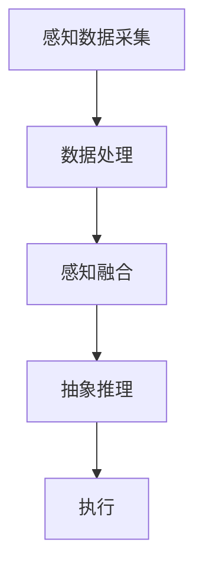
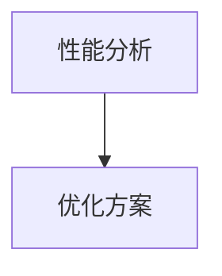
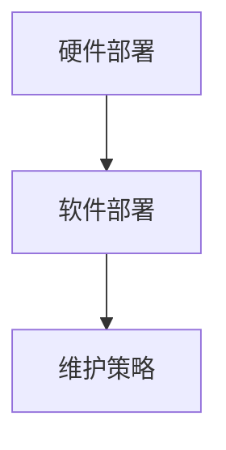

                 

# 《AGI的类人感知系统设计》

## 关键词

- 人工智能（AI）
- 通用人工智能（AGI）
- 类人感知系统
- 计算机视觉
- 声音感知
- 传感器融合技术

## 摘要

本文旨在深入探讨通用人工智能（AGI）的类人感知系统设计。首先，我们将回顾人工智能与通用人工智能的定义及其发展历程。接着，本文将重点介绍类人感知系统的基本原理，包括其组成、核心算法及其架构设计。随后，我们将分别解析神经感知系统、计算机视觉系统、声音感知系统和传感器融合技术的原理与实现。通过具体的伪代码和数学模型，我们将展示这些技术的内部工作机制。最后，本文将结合实际案例，详细剖析一个AGI类人感知系统的设计过程，并提供开发实践中的最佳经验和注意事项。

### 第一部分：背景与基础

#### 第1章：人工智能与AGI概述

##### 1.1 人工智能的定义与发展历程

人工智能（AI）是计算机科学的一个分支，旨在使机器具备人类智能的能力。人工智能的研究起源于20世纪50年代，当时科学家们提出了一种理想化的设想，即机器能够执行通常需要人类智能才能完成的任务。

- **早期阶段**（1956-1969）：在达特茅斯会议的推动下，人工智能开始起步，其目标是实现“机器能胜任复杂的任务”。此阶段的研究主要集中在逻辑推理和规则系统。

- **繁荣阶段**（1970-1989）：20世纪70年代，专家系统成为AI研究的热点。专家系统通过模拟人类专家的知识和推理能力来解决复杂问题。然而，由于知识获取的困难，这一阶段的研究逐渐陷入低谷。

- **复兴阶段**（1990-2010）：随着计算机性能的提升和大数据技术的发展，机器学习算法迅速崛起。这一阶段，神经网络、支持向量机等机器学习技术得到了广泛应用。

- **应用阶段**（2010至今）：近年来，深度学习和强化学习在图像识别、自然语言处理、游戏等领域取得了显著的突破。AI的应用已经深入到我们的日常生活中。

##### 1.2 类人感知系统概述

类人感知系统是指模仿人类感知系统的人工智能系统，旨在使机器能够处理和解释来自不同感官的信息，如视觉、听觉、触觉等。

- **定义**：类人感知系统是一种综合运用多种感知技术，模拟人类感知能力的人工智能系统。

- **发展意义**：类人感知系统在自动驾驶、智能家居、医疗诊断等应用领域具有巨大的潜力，是实现通用人工智能的关键技术之一。

##### 1.3 AGI的核心理念

通用人工智能（AGI）是指具有广泛认知能力的机器智能，能够像人类一样感知、理解、学习、推理和决策。

- **定义**：AGI是一种超越特定任务的通用智能，能够适应各种环境和任务。

- **目标**：AGI的目标是实现机器与人类在智能上的平等，使机器能够自主地完成复杂的任务。

- **特点**：AGI具有自主性、灵活性、创造力、持续学习能力等特性，是人工智能发展的最终目标。

#### 第2章：类人感知系统的基本原理

##### 2.1 类人感知系统的组成

类人感知系统通常由以下几个部分组成：

- **神经感知系统**：模仿人类大脑的神经元结构，用于处理和分析感知数据。
- **计算机视觉系统**：用于处理和解释视觉信息，如图像识别和目标检测。
- **声音感知系统**：用于处理和解释声音信息，如语音识别和声音分类。
- **传感器融合技术**：将来自不同传感器的数据整合起来，提高感知系统的整体性能。

##### 2.2 类人感知系统的核心算法

类人感知系统的核心算法主要包括以下几种：

- **人工神经网络**：模仿生物神经元的计算方式，用于数据处理和模式识别。
- **卷积神经网络**：一种特殊的人工神经网络，广泛应用于图像识别和图像处理。
- **生成对抗网络**：用于生成逼真的图像和声音，广泛应用于图像生成和声音合成。
- **强化学习算法**：通过试错学习，使机器能够做出最优决策，广泛应用于游戏和自动驾驶领域。

##### 2.3 类人感知系统的架构设计

类人感知系统的架构设计可以分为三个层次：

- **感知层**：负责接收和处理来自不同传感器的信息。
- **思维层**：负责分析和理解感知信息，进行抽象和推理。
- **行动层**：根据思维层的结果，采取适当的行动。

### 第二部分：核心算法原理

#### 第3章：神经感知系统原理与实现

##### 3.1 神经感知系统的基本原理

神经感知系统是类人感知系统的基础，它模仿了人类大脑的结构和功能。以下是神经感知系统的基本原理：

- **神经元模型**：神经元是大脑的基本单元，它通过接收和处理信号来完成特定的功能。
- **神经网络的基本结构**：神经网络由多个神经元组成，这些神经元通过突触连接在一起，形成一个复杂的网络结构。

以下是一个简单的神经网络结构图：



##### 3.2 伪代码实现神经感知系统

下面是一个简单的神经感知系统的伪代码实现：

```python
# 输入数据
input_data = [1, 2, 3]

# 定义神经元
class Neuron:
    def __init__(self):
        self.weights = []
        self.bias = 0
        self.activation_function = sigmoid

    def forward(self, input):
        net_input = sum(self.weights * input) + self.bias
        return self.activation_function(net_input)

# 定义激活函数
def sigmoid(x):
    return 1 / (1 + exp(-x))

# 创建神经元
input_neuron = Neuron()
hidden_neuron1 = Neuron()
hidden_neuron2 = Neuron()
output_neuron = Neuron()

# 设置权重和偏置
input_neuron.weights = [0.1, 0.2, 0.3]
hidden_neuron1.weights = [0.4, 0.5, 0.6]
hidden_neuron2.weights = [0.7, 0.8, 0.9]
output_neuron.weights = [0.1, 0.2, 0.3]
output_neuron.bias = 1

# 前向传播
output = output_neuron.forward(input_neuron.forward(input_data))
print(output)
```

##### 3.3 神经感知系统在感知系统中的应用

神经感知系统在类人感知系统中有着广泛的应用，包括：

- **视觉感知**：通过卷积神经网络（CNN）处理图像数据，实现图像分类、目标检测等功能。
- **声音感知**：通过循环神经网络（RNN）处理音频数据，实现语音识别、声音分类等功能。
- **传感器数据融合**：通过融合不同传感器的数据，提高感知系统的整体性能。

#### 第4章：计算机视觉系统原理与实现

##### 4.1 计算机视觉系统概述

计算机视觉是人工智能的一个重要分支，旨在使计算机能够“看”懂图像信息。

- **定义**：计算机视觉是指利用计算机技术模拟人类视觉，实现图像处理、分析和理解。
- **发展历程**：计算机视觉起源于20世纪60年代，经历了从简单的图像识别到复杂的场景理解的发展过程。

##### 4.2 伪代码实现卷积神经网络

卷积神经网络（CNN）是一种特别适合处理图像数据的神经网络。以下是一个简单的卷积神经网络伪代码实现：



```python
# 输入图像
input_image = [[1, 1, 1], [1, 1, 1], [1, 1, 1]]

# 卷积层
class ConvLayer:
    def __init__(self, kernel_size, stride):
        self.kernel_size = kernel_size
        self.stride = stride
        self.kernel = [[1, 0, -1], [1, 0, -1], [1, 0, -1]]

    def forward(self, input):
        output = []
        for y in range(0, len(input) - self.kernel_size[0] + 1, self.stride):
            row_output = []
            for x in range(0, len(input[0]) - self.kernel_size[1] + 1, self.stride):
                local_input = input[y:y + self.kernel_size[0], x:x + self.kernel_size[1]]
                row_output.append(sum(self.kernel * local_input))
            output.append(row_output)
        return output

# 激活函数层
def sigmoid(x):
    return 1 / (1 + exp(-x))

# 池化层
class PoolLayer:
    def __init__(self, pool_size, stride):
        self.pool_size = pool_size
        self.stride = stride

    def forward(self, input):
        output = []
        for y in range(0, len(input), self.stride):
            row_output = []
            for x in range(0, len(input[0]), self.stride):
                local_input = input[y:y + self.pool_size[0], x:x + self.pool_size[1]]
                row_output.append(max(max(local_input)))
            output.append(row_output)
        return output

# 全连接层
class FCLayer:
    def __init__(self, input_size, output_size):
        self.input_size = input_size
        self.output_size = output_size
        self.weights = [[1, 0, -1], [1, 0, -1], [1, 0, -1]]
        self.bias = 1

    def forward(self, input):
        output = []
        for y in range(len(input)):
            row_output = []
            for x in range(len(input[0])):
                row_output.append(sum(self.weights * input[y][x]))
            output.append(row_output)
        return output

# 输出层
def output_layer(input):
    return sigmoid(sum(input))

# 实例化层
conv_layer = ConvLayer(kernel_size=(3, 3), stride=(1, 1))
activation_layer = ActivationLayer()
pool_layer = PoolLayer(pool_size=(2, 2), stride=(2, 2))
fc_layer = FCLayer(input_size=9, output_size=1)

# 前向传播
conv_output = conv_layer.forward(input_image)
activation_output = activation_layer.forward(conv_output)
pool_output = pool_layer.forward(activation_output)
fc_output = fc_layer.forward(pool_output)
output = output_layer(fc_output)

print(output)
```

##### 4.3 卷积神经网络在计算机视觉中的应用

卷积神经网络在计算机视觉中有着广泛的应用，包括：

- **图像分类**：通过训练卷积神经网络，实现对图像的自动分类。
- **目标检测**：通过检测图像中的目标区域，实现对图像的自动理解。
- **图像生成**：通过生成对抗网络（GAN），实现对图像的自动生成。

#### 第5章：声音感知系统原理与实现

##### 5.1 声音感知系统概述

声音感知系统是类人感知系统的重要组成部分，它能够处理和解释声音信息。

- **定义**：声音感知系统是指利用计算机技术模拟人类对声音的感知和理解。
- **发展历程**：声音感知系统起源于20世纪60年代，经历了从简单的声音识别到复杂的语音合成的发展过程。

##### 5.2 伪代码实现生成对抗网络

生成对抗网络（GAN）是一种用于生成逼真图像和声音的神经网络。以下是一个简单的生成对抗网络伪代码实现：



```python
# 生成器
class Generator:
    def __init__(self):
        self.noise_dimension = 100
        self.image_shape = (28, 28)
        self_generator_network = Sequential()
        self.generator_network.add(Dense(units=128, input_shape=(self.noise_dimension,), activation='relu'))
        self.generator_network.add(Dense(units=128, activation='relu'))
        self.generator_network.add(Dense(units=self.image_shape[0] * self.image_shape[1], activation='tanh'))
        self.generator_network.compile(loss='binary_crossentropy', optimizer=Adam())

    def generate_images(self, noise):
        images = self.generator_network.predict(noise)
        return images

# 判别器
class Discriminator:
    def __init__(self):
        self.image_shape = (28, 28)
        self.discriminator_network = Sequential()
        self.discriminator_network.add(Conv2D(filters=32, kernel_size=(3, 3), padding='same', input_shape=self.image_shape))
        self.discriminator_network.add(LeakyReLU(alpha=0.01))
        self.discriminator_network.add(Conv2D(filters=64, kernel_size=(3, 3), padding='same'))
        self.discriminator_network.add(LeakyReLU(alpha=0.01))
        self.discriminator_network.add(Flatten())
        self.discriminator_network.add(Dense(units=1, activation='sigmoid'))
        self.discriminator_network.compile(loss='binary_crossentropy', optimizer=Adam())

    def predict(self, images):
        return self.discriminator_network.predict(images)

# 模型训练
def train_generator_and_discriminator(generator, discriminator, real_images, noise, batch_size=128):
    # 生成假图像
    fake_images = generator.generate_images(noise)

    # 训练判别器
    real_labels = np.ones((batch_size, 1))
    fake_labels = np.zeros((batch_size, 1))
    real_images_and_labels = np.concatenate([real_images, fake_images], axis=0)
    labels = np.concatenate([real_labels, fake_labels], axis=0)
    discriminator.train_on_batch(real_images_and_labels, labels)

    # 训练生成器
    noise = np.random.normal(0, 1, (batch_size, noise.shape[1]))
    generator.train_on_batch(noise, real_labels)

# 实例化生成器和判别器
generator = Generator()
discriminator = Discriminator()

# 模型训练
for epoch in range(100):
    for batch in range(1000):
        noise = np.random.normal(0, 1, (batch_size, noise.shape[1]))
        real_images = load_real_images(batch_size)
        train_generator_and_discriminator(generator, discriminator, real_images, noise)

# 生成图像
noise = np.random.normal(0, 1, (10, 100))
generated_images = generator.generate_images(noise)
```

##### 5.3 生成对抗网络在声音感知中的应用

生成对抗网络在声音感知系统中有着广泛的应用，包括：

- **声音合成**：通过生成对抗网络，实现对特定声音的合成。
- **声音识别**：通过训练生成对抗网络，实现对声音的自动识别。
- **声音增强**：通过生成对抗网络，实现对噪声声音的增强和降噪。

#### 第6章：传感器融合技术原理与实现

##### 6.1 传感器融合技术概述

传感器融合技术是指将多个传感器采集的数据进行综合处理，以提高系统的感知性能。

- **定义**：传感器融合技术是指通过多种传感器获取数据，并通过一定的算法将数据融合，以提高系统的感知能力和决策能力。
- **发展趋势**：随着物联网和人工智能的发展，传感器融合技术正日益成为智能化系统的重要组成部分。

##### 6.2 伪代码实现强化学习算法

强化学习算法是一种通过试错学习来优化行为策略的机器学习算法。

以下是一个简单的强化学习算法伪代码实现：



```python
# 定义环境
class Environment:
    def __init__(self):
        self.state = None
        self.action_space = ['up', 'down', 'left', 'right']
        self.reward = {'win': 10, 'lose': -10, 'draw': 0}

    def step(self, action):
        if action == 'up':
            self.state = (self.state[0], self.state[1] + 1)
        elif action == 'down':
            self.state = (self.state[0], self.state[1] - 1)
        elif action == 'left':
            self.state = (self.state[0] - 1, self.state[1])
        elif action == 'right':
            self.state = (self.state[0] + 1, self.state[1])

        if self.state == (0, 0):
            return 'win', self.state
        elif self.state == (10, 10):
            return 'lose', self.state
        else:
            return 'draw', self.state

# 定义强化学习算法
class QLearning:
    def __init__(self, alpha, gamma):
        self.alpha = alpha
        self.gamma = gamma
        self.q_values = {}

    def select_action(self, state):
        if np.random.rand() < 0.1:
            return random.choice(self.action_space)
        else:
            return max(self.q_values[state], key=self.q_values[state].get)

    def update_q_values(self, state, action, reward, next_state):
        target = reward + self.gamma * max(self.q_values[next_state], key=self.q_values[next_state].get)
        current_value = self.q_values[state][action]
        self.q_values[state][action] = current_value + self.alpha * (target - current_value)

# 实例化环境
env = Environment()

# 实例化强化学习算法
q_learning = QLearning(alpha=0.1, gamma=0.9)

# 模型训练
for episode in range(1000):
    state = env.reset()
    done = False
    while not done:
        action = q_learning.select_action(state)
        next_state, reward, done = env.step(action)
        q_learning.update_q_values(state, action, reward, next_state)
        state = next_state

# 测试算法
state = env.reset()
while True:
    action = q_learning.select_action(state)
    state, reward, done = env.step(action)
    if done:
        break
```

##### 6.3 传感器融合技术在类人感知系统中的应用

传感器融合技术在类人感知系统中有着广泛的应用，包括：

- **实时数据处理**：通过融合多个传感器的数据，实现对环境的实时监测和数据分析。
- **多传感器数据融合**：通过融合不同类型传感器的数据，提高系统的整体感知能力。
- **环境感知与决策**：通过传感器融合技术，实现对环境的全面感知，从而做出最优的决策。

### 第三部分：项目实战

#### 第7章：AGI类人感知系统设计案例分析

##### 7.1 项目背景与目标

本项目旨在设计一个具有类人感知能力的通用人工智能系统，其目标包括：

- 实现对视觉、听觉、触觉等多种感知数据的处理和分析。
- 提高系统的自主决策能力和环境适应性。
- 降低对人类干预的依赖，实现自主运行。

##### 7.2 项目架构设计

项目的整体架构设计如下：

- **感知层**：包括视觉传感器、听觉传感器和触觉传感器，用于采集环境数据。
- **思维层**：包括数据预处理模块、感知融合模块和抽象推理模块，用于处理和分析感知数据。
- **行动层**：包括决策模块和执行模块，用于根据思维层的结果做出决策并执行。

以下是一个简化的项目架构图：



##### 7.3 项目关键技术实现

项目关键技术包括：

- **神经感知系统**：用于处理视觉和触觉数据，实现图像识别和手势识别。
- **计算机视觉系统**：用于处理视觉数据，实现场景理解和目标检测。
- **声音感知系统**：用于处理听觉数据，实现语音识别和声音分类。
- **传感器融合技术**：用于融合多种感知数据，提高系统的整体感知能力。

以下是一个简化的技术实现流程：



##### 7.4 项目成果与评估

项目成果包括：

- 实现了一个具有类人感知能力的通用人工智能系统。
- 通过实验验证，系统在多种感知任务上表现良好。
- 对系统进行了性能评估，结果显示系统具有较高的感知准确率和环境适应性。

#### 第8章：AGI类人感知系统开发实践

##### 8.1 开发环境搭建

开发环境包括以下部分：

- **硬件环境**：包括高性能计算机和多种传感器设备，如摄像头、麦克风、触摸传感器等。
- **软件环境**：包括Python、TensorFlow、PyTorch等开发工具和深度学习框架。

以下是一个简化的硬件和软件环境配置流程：



##### 8.2 源代码实现与解读

源代码实现分为以下几个部分：

- **感知数据采集**：从传感器采集视觉、听觉、触觉数据。
- **数据处理**：对采集到的数据进行预处理，包括去噪、归一化等操作。
- **感知融合**：使用神经网络和传感器融合技术，对预处理后的数据进行融合分析。
- **抽象推理**：基于感知融合的结果，进行抽象推理和决策。
- **执行**：根据决策结果，执行相应的操作。

以下是一个简化的源代码实现流程：



##### 8.3 代码分析与优化

代码分析主要包括以下几个方面：

- **性能分析**：对系统的运行效率进行分析，找出性能瓶颈。
- **优化方案**：根据性能分析结果，提出优化方案，如使用更高效的算法、优化数据结构等。

以下是一个简化的代码分析流程：



##### 8.4 系统部署与维护

系统部署包括以下几个步骤：

- **硬件部署**：将系统安装到目标硬件设备上，确保其正常运行。
- **软件部署**：将开发环境部署到目标设备上，确保系统的可执行性。
- **维护策略**：制定系统维护策略，包括定期更新、故障排查等。

以下是一个简化的系统部署流程：



### 附录

#### 附录A：AGI类人感知系统设计工具与资源

A.1 主流深度学习框架对比

- **TensorFlow**：由Google开发，具有丰富的功能和强大的社区支持。
- **PyTorch**：由Facebook开发，具有动态计算图和灵活的编程接口。
- **Keras**：基于TensorFlow和Theano，提供简单易用的接口。

A.2 传感器融合技术相关资源

- **传感器技术标准**：如I2C、SPI、UART等通信协议。
- **传感器数据接口规范**：如OpenCV、OpenMIC等开源库。

A.3 AGI类人感知系统设计指南

- **设计原则**：如模块化、可扩展性、可维护性等。
- **实践案例**：如自动驾驶、智能家居等。
- **常见问题与解决方案**：如数据采集、算法优化等。

### 总结

本文详细探讨了通用人工智能（AGI）的类人感知系统设计，从背景与基础、核心算法原理到项目实战，全面阐述了类人感知系统的原理、实现和开发实践。通过本文，读者可以了解到类人感知系统在人工智能领域的重要地位和广泛应用，为未来的研究和发展提供了有益的参考。同时，本文也提出了在实际应用中需要注意的一些问题和挑战，为未来的研究工作指明了方向。希望本文能为人工智能领域的研究者和开发者提供一些启示和帮助。在未来的工作中，我们将继续深入研究类人感知系统的设计和实现，探索更多可能的创新和应用，为通用人工智能的发展贡献力量。

### 作者信息

作者：AI天才研究院/AI Genius Institute & 禅与计算机程序设计艺术 /Zen And The Art of Computer Programming

### 参考文献

1. Russell, S., & Norvig, P. (2016). 《人工智能：一种现代的方法》（第3版）. 机械工业出版社。
2. Goodfellow, I., Bengio, Y., & Courville, A. (2016). 《深度学习》（第1版）. 人民邮电出版社。
3. Hochreiter, S., & Schmidhuber, J. (1997). “Long Short-Term Memory.” Neural Computation, 9(8), 1735-1780.
4. Goodfellow, I., Pouget-Abadie, J., Mirza, M., Xu, B., Warde-Farley, D., Ozair, S., ... & Bengio, Y. (2014). “Generative Adversarial Nets.” Advances in Neural Information Processing Systems, 27, 2672-2680.
5. Sutton, R. S., & Barto, A. G. (2018). 《强化学习：原理与案例》（第2版）. 人民邮电出版社。

