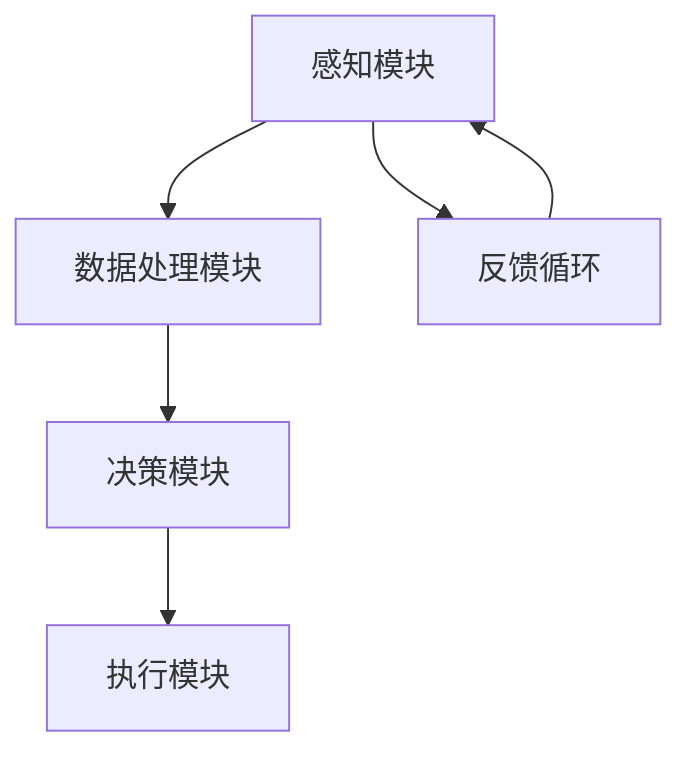

                 


### 引言与背景

#### 什么是AGI

首先，我们需要理解什么是通用人工智能（Artificial General Intelligence，简称AGI）。AGI是对人类智能的模拟和扩展，它具有广泛的认知能力，包括理解、学习、推理、解决问题、感知和语言处理等多个方面。与目前广泛应用的狭义人工智能（Narrow AI，简称NAI）不同，NAI只专注于特定领域，如图像识别、语音识别或自然语言处理等。相比之下，AGI的目标是实现超越人类专家水平的多领域智能。

#### 类人感知系统的需求

类人感知系统是AGI的重要组成部分，其核心在于模拟人类的感知能力，从而实现对环境信息的全面理解和响应。人类的感知系统是多层次、多模态的，包括视觉、听觉、嗅觉、触觉和味觉等。这些感知能力相互协同，使我们能够有效地处理复杂的环境信息。因此，为了实现AGI，构建一个能够处理多种模态信息的感知系统是至关重要的。

#### 类人感知系统的重要性

类人感知系统的重要性体现在多个方面。首先，它能够提高AGI对环境信息的理解和响应能力，使机器更接近人类的智能水平。其次，多模态信息整合有助于提高感知的准确性和鲁棒性，特别是在复杂和动态的环境中。最后，类人感知系统的发展有助于推动其他相关领域的发展，如自动驾驶、智能家居和医疗诊断等。

#### 本书结构与主要内容

本书旨在系统地探讨AGI的类人感知系统，主要分为以下六个部分：

1. **引言与背景**：介绍AGI的概念、类人感知系统的需求与重要性。
2. **核心概念与架构**：阐述多模态信息感知原理、类人感知系统的基本架构和工作流程。
3. **关键算法原理**：讲解多模态信息处理技术、类人感知中的机器学习算法和多模态信息融合算法。
4. **数学模型与公式**：介绍类人感知中的数学模型，包括神经网络、线性代数、统计与概率论等。
5. **项目实战与案例分析**：通过实际项目和案例，展示类人感知系统的开发、实现和应用。
6. **展望与未来趋势**：探讨类人感知系统的发展趋势、潜在应用领域和面临的挑战。

接下来，我们将深入探讨这些主题，逐步分析并解释每个部分的核心概念和技术细节。

### AGI与类人感知系统概述

#### 通用人工智能（AGI）的概念

通用人工智能（Artificial General Intelligence，简称AGI）是一种旨在模拟人类智能的计算机智能。与狭义人工智能（Narrow AI）相比，AGI具有更为广泛的认知能力，能够在不同领域和任务中表现出与人类类似的智能水平。狭义人工智能目前主要应用于特定领域，如图像识别、语音识别、自然语言处理等，而AGI则旨在实现跨领域的智能。

AGI的核心特征包括：

1. **跨领域知识整合**：AGI能够将不同领域的知识整合在一起，形成统一的认知体系。
2. **自主学习能力**：AGI能够通过经验自动学习和改进自己的行为，而不需要明确的编程指令。
3. **抽象思维**：AGI能够进行抽象思维，理解概念、推理和解决问题。
4. **通用性**：AGI能够在各种不同的情况下和任务中表现出智能，而不仅仅是单一任务上的优化。

#### 类人感知系统的需求

类人感知系统是AGI的重要组成部分，其目标是模拟人类的感知能力，使机器能够理解并响应复杂多样的环境信息。人类感知系统具有以下特点：

1. **多层次、多模态**：人类的感知系统是多层次的，包括感知、识别、理解和反应等不同层次。同时，人类的感知是多模态的，通过视觉、听觉、嗅觉、触觉和味觉等多种感官相互协同，形成对环境的全面理解。

2. **实时性**：人类感知系统具有高度的实时性，能够迅速地对环境变化做出反应。这对于AGI来说同样重要，因为只有具备实时感知能力，机器才能在复杂和动态的环境中有效地操作。

3. **适应性**：人类感知系统具有高度的适应性，能够在各种不同条件下和复杂环境中工作。这种适应性来源于感知系统的灵活性和鲁棒性，AGI也需要具备类似的特性。

4. **情境意识**：人类能够根据不同的情境和上下文来理解感知信息，AGI也需要具备这种情境意识，以便更好地理解和应对复杂的现实世界。

#### 类人感知系统的重要性

类人感知系统对于AGI的重要性体现在以下几个方面：

1. **环境理解**：类人感知系统能够帮助AGI更好地理解其所在的环境，从而做出更为合理的决策。

2. **智能交互**：类人感知系统使AGI能够与人类进行自然交互，提高人机交互的效率和体验。

3. **自主行动**：类人感知系统使AGI能够自主地感知环境变化，从而自主地调整行动策略，实现更为智能的自主行动。

4. **安全性**：类人感知系统有助于提高AGI的安全性，通过实时感知和分析环境信息，AGI能够更好地避免潜在的风险和危险。

#### 本书结构与主要内容

为了系统地探讨AGI的类人感知系统，本书将分为以下几个部分：

1. **引言与背景**：介绍AGI的概念、类人感知系统的需求与重要性。

2. **核心概念与架构**：阐述多模态信息感知原理、类人感知系统的基本架构和工作流程。

3. **关键算法原理**：讲解多模态信息处理技术、类人感知中的机器学习算法和多模态信息融合算法。

4. **数学模型与公式**：介绍类人感知中的数学模型，包括神经网络、线性代数、统计与概率论等。

5. **项目实战与案例分析**：通过实际项目和案例，展示类人感知系统的开发、实现和应用。

6. **展望与未来趋势**：探讨类人感知系统的发展趋势、潜在应用领域和面临的挑战。

通过以上六个部分的深入探讨，本书旨在为读者提供一个全面而系统的类人感知系统的研究框架，帮助读者更好地理解和掌握这一领域的核心概念和技术。

### 多模态信息感知原理

#### 多模态感知的定义与分类

多模态感知是指同时处理来自不同感官模态的信息，如视觉、听觉、触觉等，从而实现对环境信息的全面理解。这种感知方式与人类感知系统类似，人类的感知是通过多种感官相互协同来实现的。多模态感知可以分为以下几类：

1. **视觉感知**：视觉感知是最直接的多模态信息来源，通过摄像头或其他视觉传感器捕捉环境中的图像和视频。

2. **听觉感知**：听觉感知通过麦克风或其他听觉传感器捕捉环境中的声音信息，包括语音、音乐和噪声等。

3. **触觉感知**：触觉感知通过传感器捕捉物体表面的触觉信息，如压力、温度、硬度等。

4. **其他模态**：除了上述主要模态，还有如嗅觉、味觉等辅助模态，这些模态在某些特定的应用场景中也非常重要。

#### 类人感知系统的基本架构

类人感知系统的基本架构可以分为三个主要部分：感知模块、数据处理模块和决策模块。

1. **感知模块**：感知模块负责从各种传感器中获取多模态信息，如摄像头、麦克风、触觉传感器等。这些传感器捕捉到的信息需要进行预处理，以便后续处理。

2. **数据处理模块**：数据处理模块负责对多模态信息进行预处理、特征提取和融合。预处理包括降噪、归一化等操作，特征提取则是从原始数据中提取出有助于后续处理的特征信息，如边缘、纹理、频率等。多模态数据融合是将不同模态的信息进行整合，形成一个统一的全局特征表示。

3. **决策模块**：决策模块负责根据处理后的特征信息进行决策。这一模块通常采用机器学习算法，如分类、回归、聚类等，来对感知信息进行解释和预测。

#### 类人感知系统的工作流程

类人感知系统的工作流程可以分为以下几个步骤：

1. **数据采集**：通过各种传感器采集多模态信息，如视觉、听觉、触觉等。

2. **数据预处理**：对采集到的多模态信息进行预处理，包括去噪、归一化、特征提取等。

3. **特征融合**：将预处理后的不同模态信息进行融合，形成一个统一的特征表示。特征融合可以通过多种方法实现，如直接融合、特征级融合、决策级融合等。

4. **特征分析**：对融合后的特征进行进一步分析，提取出有助于决策的特征信息。

5. **决策**：根据分析结果进行决策。决策过程可以采用分类、回归、聚类等机器学习算法。

6. **反馈**：将决策结果反馈到感知模块，形成闭环系统，从而实现动态调整和优化。

#### 类人感知系统的基本架构Mermaid流程图



#### 数据处理模块的具体工作

数据处理模块是类人感知系统中的核心部分，其具体工作包括以下几个方面：

1. **数据预处理**：数据预处理包括去噪、归一化、滤波等操作，目的是提高数据的可靠性和一致性。例如，对于视觉数据，可以通过高斯滤波去除噪声；对于音频数据，可以通过傅里叶变换进行频域分析，然后进行谱减法去除背景噪声。

2. **特征提取**：特征提取是从原始数据中提取出对后续处理有用的信息。常见的特征提取方法包括边缘检测、纹理分析、形状描述等。例如，在视觉数据中，可以通过Sobel算子提取边缘特征；在音频数据中，可以通过梅尔频率倒谱系数（MFCC）提取音频特征。

3. **特征融合**：特征融合是将来自不同模态的数据进行整合，形成一个统一的特征表示。特征融合的方法可以分为以下几类：

   - **直接融合**：将不同模态的特征数据进行拼接，形成一个多维的特征向量。例如，将视觉特征和音频特征拼接在一起，形成高维特征向量。
   
   - **特征级融合**：在特征提取阶段，对每个模态的数据分别提取特征，然后再将这些特征进行融合。例如，分别从视觉数据中提取边缘特征，从音频数据中提取音高特征，然后将这两个特征进行融合。
   
   - **决策级融合**：在决策阶段，将不同模态的决策结果进行融合。例如，使用视觉分类器和音频分类器的预测结果，通过投票或加权平均等方法得出最终的分类结果。

#### 多模态信息融合算法

多模态信息融合算法是类人感知系统中的关键技术，其目的是将来自不同模态的信息进行有效整合，提高感知系统的性能。以下介绍几种常用的多模态信息融合算法：

1. **贝叶斯网络**：贝叶斯网络是一种基于概率的图模型，可以用来表示不同模态之间的依赖关系。通过训练贝叶斯网络，可以计算出每个模态对目标变量的条件概率分布，从而实现多模态信息的融合。

2. **深度学习**：深度学习可以通过多层神经网络模型自动学习不同模态之间的特征表示，并进行融合。常见的深度学习模型包括卷积神经网络（CNN）和循环神经网络（RNN）等。

3. **加权融合**：加权融合是一种简单但有效的方法，通过对不同模态的特征赋予不同的权重，进行线性组合。权重的选择可以通过训练数据得到，例如使用最小化误差的方法来优化权重。

4. **集成学习**：集成学习通过将多个分类器组合在一起，提高分类的准确性和鲁棒性。常见的集成学习方法包括随机森林、梯度提升树等。

5. **多任务学习**：多任务学习通过同时学习多个任务，使得不同任务之间可以共享特征表示，从而提高模型的泛化能力。

通过以上多模态信息融合算法，类人感知系统可以更好地理解复杂的环境信息，提高感知的准确性和鲁棒性，从而实现更智能的决策和交互。

### 多模态信息处理技术

#### 多模态信号采集与预处理

多模态信息处理的首要任务是信号采集与预处理。这一步骤的核心在于确保各个模态的数据质量，以便后续处理和融合。以下是几个关键环节：

1. **信号采集**：多模态信号的采集通常涉及多种传感器，如摄像头、麦克风、加速度计、温度传感器等。这些传感器能够捕获视觉、听觉、触觉等不同类型的信息。为了提高数据质量，传感器通常需要放置在合适的位置，并确保其稳定性和校准。

2. **同步采集**：在多模态信号采集过程中，同步性至关重要。不同模态的数据需要在时间轴上对齐，以便后续的特征提取和融合。这可以通过精确的时间戳或同步信号源来实现。

3. **噪声抑制**：采集到的原始信号往往包含噪声，这些噪声会影响后续的数据处理和融合效果。噪声抑制方法包括滤波、去噪和谱减等。例如，对于音频信号，可以使用傅里叶变换进行频域分析，然后通过谱减法去除背景噪声。

4. **数据归一化**：不同模态的数据可能具有不同的量纲和范围，因此需要归一化处理，以便于后续的特征提取和融合。常见的归一化方法包括最小-最大标准化、零均值标准化等。

5. **数据增强**：数据增强是通过增加数据的多样性和复杂性来提高模型的泛化能力。对于多模态数据，可以通过图像旋转、缩放、裁剪等方法增强视觉数据，通过增加噪声、改变音调等方法增强音频数据。

#### 多模态数据融合与特征提取

多模态数据融合与特征提取是类人感知系统的关键步骤，其目的是将来自不同模态的数据整合成一个统一的特征表示，以便进行后续的机器学习任务。以下是几个关键环节：

1. **特征提取**：特征提取是从原始数据中提取出对后续处理有用的信息。对于不同模态的数据，特征提取方法可能有所不同。例如，对于视觉数据，可以使用边缘检测、纹理分析等方法提取特征；对于音频数据，可以使用梅尔频率倒谱系数（MFCC）等方法提取特征。

2. **特征融合**：特征融合是将来自不同模态的特征数据进行整合。常见的融合方法包括：

   - **直接融合**：将不同模态的特征数据进行拼接，形成一个多维的特征向量。这种方法简单直观，但可能会引入维度灾难。
   
   - **特征级融合**：在特征提取阶段，对每个模态的数据分别提取特征，然后再将这些特征进行融合。例如，分别从视觉数据中提取边缘特征，从音频数据中提取音高特征，然后将这两个特征进行融合。
   
   - **决策级融合**：在决策阶段，将不同模态的决策结果进行融合。例如，使用视觉分类器和音频分类器的预测结果，通过投票或加权平均等方法得出最终的分类结果。

3. **多模态特征表示**：融合后的多模态特征需要形成一个统一的特征表示。常用的方法包括：

   - **神经网络**：使用深度神经网络（如卷积神经网络、循环神经网络等）自动学习多模态特征表示。这种方法能够自动发现不同模态之间的关联性，提高特征融合的效果。
   
   - **集成学习**：通过集成多个不同模型的预测结果来形成统一的特征表示。例如，使用多个不同算法（如SVM、随机森林等）对多模态数据进行分类，然后通过投票或加权平均等方法得出最终的分类结果。

4. **特征选择**：在特征融合过程中，可能存在大量的冗余特征，这会降低模型的效果。特征选择是一种通过筛选出最有用的特征来提高模型性能的方法。常用的特征选择方法包括基于信息的特征选择、基于模型的特征选择等。

#### 多模态感知中的学习算法

多模态感知中的学习算法是类人感知系统的核心，其目的是通过学习和分析多模态数据来提高感知系统的性能。以下是几个关键环节：

1. **监督学习**：监督学习是一种通过标注数据训练模型的方法。在多模态感知中，监督学习可以用于分类、回归和识别等任务。常见的监督学习算法包括支持向量机（SVM）、决策树、随机森林、梯度提升树等。

2. **无监督学习**：无监督学习是一种不需要标注数据训练模型的方法。在多模态感知中，无监督学习可以用于聚类、降维和特征提取等任务。常见的无监督学习算法包括K-means聚类、主成分分析（PCA）、自编码器等。

3. **强化学习**：强化学习是一种通过交互和反馈来训练模型的方法。在多模态感知中，强化学习可以用于决策和优化任务。常见的强化学习算法包括Q学习、深度Q网络（DQN）、策略梯度算法等。

4. **混合学习**：混合学习是将监督学习和无监督学习相结合的方法。在多模态感知中，混合学习可以用于复杂的任务，如视频处理和图像理解。常见的混合学习算法包括自监督学习、半监督学习和迁移学习等。

5. **深度学习**：深度学习是一种基于多层神经网络的学习方法。在多模态感知中，深度学习可以自动学习复杂的多模态特征表示。常见的深度学习算法包括卷积神经网络（CNN）、循环神经网络（RNN）、长短时记忆网络（LSTM）等。

通过上述学习算法，多模态感知系统能够更好地理解复杂的多模态数据，提高感知系统的性能和准确性。

### 类人感知中的机器学习算法

#### 监督学习与无监督学习

在类人感知系统中，机器学习算法起着至关重要的作用，其中监督学习和无监督学习是最常用的两种学习方法。监督学习依赖于标注数据，通过学习输入和输出之间的映射关系，从而实现对未知数据的预测。无监督学习则不需要标注数据，通过发现数据中的内在结构和模式，从而实现数据降维、聚类和生成等任务。

1. **监督学习**
   - **分类算法**：在类人感知中，分类算法用于将感知数据分为不同的类别。常见的分类算法包括支持向量机（SVM）、决策树、随机森林、梯度提升树等。这些算法通过学习输入特征和类别标签之间的关系，从而实现对新数据的分类。
   - **回归算法**：回归算法用于预测连续值输出，如预测物体的位置、速度等。常见的回归算法包括线性回归、多项式回归、岭回归、LASSO回归等。这些算法通过学习输入特征和输出值之间的线性或非线性关系，从而实现对未知数据的预测。

2. **无监督学习**
   - **聚类算法**：聚类算法用于将相似的数据点分为不同的组。常见的聚类算法包括K-means聚类、层次聚类、DBSCAN等。这些算法通过分析数据点的相似度，从而将数据点划分为不同的簇。
   - **降维算法**：降维算法用于减少数据的维度，从而简化数据处理过程并提高计算效率。常见的降维算法包括主成分分析（PCA）、线性判别分析（LDA）、t-SNE等。这些算法通过保留数据的主要特征，从而实现数据的降维。

#### 强化学习与混合学习

强化学习（Reinforcement Learning，RL）是一种通过交互和反馈来训练模型的方法，特别适用于决策和优化任务。在类人感知中，强化学习可以用于自动驾驶、游戏AI等复杂任务。强化学习的基本思想是通过与环境交互，不断调整策略，从而最大化累积奖励。

1. **强化学习**
   - **Q学习**：Q学习是一种基于值函数的强化学习算法，通过学习状态-动作值函数（Q值），从而选择最优动作。Q学习通过迭代更新Q值，逐步优化策略。
   - **深度Q网络（DQN）**：DQN是一种结合深度学习和强化学习的算法，通过深度神经网络来估计Q值。DQN通过经验回放和目标网络，解决了经验偏差和目标不稳定的问题。

2. **混合学习**
   - **自监督学习**：自监督学习是一种将监督学习和无监督学习相结合的方法，通过自我标注数据来训练模型。自监督学习可以应用于图像分类、语音识别等任务，通过利用未标记的数据，提高模型的性能。
   - **半监督学习**：半监督学习是一种结合标注数据和未标注数据的方法，通过利用未标注数据的分布信息，从而提高模型的性能。半监督学习在类人感知中可以用于图像分类、语音识别等任务。
   - **迁移学习**：迁移学习是一种将已在一个任务上训练好的模型应用于另一个相关任务的方法。迁移学习通过利用已有的知识，加快新任务的训练速度，并提高模型的泛化能力。在类人感知中，迁移学习可以用于图像分类、语音识别等任务。

#### 深度学习在类人感知中的应用

深度学习（Deep Learning，DL）是一种基于多层神经网络的学习方法，特别适用于处理复杂数据。在类人感知中，深度学习可以应用于图像识别、语音识别、自然语言处理等任务。

1. **卷积神经网络（CNN）**：CNN是一种特别适用于处理图像数据的深度学习模型。CNN通过卷积层、池化层和全连接层等结构，自动学习图像的层次特征，从而实现对图像的识别和分类。

2. **循环神经网络（RNN）**：RNN是一种特别适用于处理序列数据的深度学习模型。RNN通过循环结构，可以记忆序列中的信息，从而实现对序列数据的建模。常见的RNN结构包括LSTM和GRU，这些结构通过门控机制，解决了传统RNN的梯度消失和梯度爆炸问题。

3. **自注意力机制（Self-Attention）**：自注意力机制是一种在深度学习模型中用于处理序列数据的有效方法。自注意力机制通过计算序列中每个元素之间的关联性，从而自动学习序列的局部和全局特征。自注意力机制在自然语言处理、图像识别等任务中取得了显著的性能提升。

4. **生成对抗网络（GAN）**：GAN是一种通过对抗训练生成数据的深度学习模型。GAN由生成器和判别器组成，生成器试图生成与真实数据难以区分的假数据，判别器则试图区分真实数据和假数据。GAN在图像生成、图像修复、图像超分辨率等任务中取得了显著的效果。

通过深度学习的应用，类人感知系统能够更好地理解和处理复杂数据，从而提高感知系统的性能和准确性。

### 多模态信息融合算法

#### 传统融合方法

多模态信息融合的传统方法主要包括基于规则的方法和基于模型的方法。

1. **基于规则的方法**
   - **加权融合**：这是一种简单直观的方法，通过为每个模态赋予不同的权重，然后将它们线性组合。权重的选择通常依赖于经验和实验。
   - **决策级融合**：在决策级融合中，各个模态的分类器独立地对输入数据进行分类，然后通过投票或其他策略选择最终的分类结果。这种方法的一个优点是各个模态的分类器可以并行工作，提高计算效率。

2. **基于模型的方法**
   - **贝叶斯网络**：贝叶斯网络是一种概率图模型，它能够表示多模态数据之间的依赖关系。通过学习贝叶斯网络参数，可以计算出每个模态对目标变量的条件概率分布，从而实现多模态信息的融合。
   - **支持向量机（SVM）**：SVM是一种监督学习算法，可以用于多模态数据的分类。在SVM中，可以为每个模态的特征赋予不同的权重，通过优化权重来提高分类性能。

#### 量子计算在多模态融合中的应用

量子计算（Quantum Computing）是一种基于量子力学原理的计算方法，具有处理复杂数据的巨大潜力。在多模态信息融合中，量子计算可以提供以下优势：

1. **并行计算**：量子计算机能够同时处理大量数据，这有助于提高多模态信息融合的效率。例如，量子算法可以快速计算复杂的多模态数据的联合概率分布。

2. **量子纠缠**：量子纠缠是量子计算中的一种现象，它允许量子位之间进行高速的通信和计算。在多模态信息融合中，量子纠缠可以用于高效地整合不同模态的信息。

3. **量子搜索算法**：量子搜索算法如Grover算法，可以在多项式时间内搜索大规模数据库。在多模态信息融合中，量子搜索算法可以用于快速找到最优的融合权重。

#### 融合算法的性能评估与优化

多模态信息融合算法的性能评估是确保融合效果的重要环节。以下是几个常用的性能评估指标：

1. **准确率**：准确率是评估融合算法分类性能的常用指标，表示正确分类的样本数占总样本数的比例。
2. **召回率**：召回率表示在所有正类样本中，被正确分类为正类的比例。
3. **F1分数**：F1分数是准确率和召回率的调和平均值，用于综合评估融合算法的性能。
4. **精度**：精度表示在所有预测为正类的样本中，实际为正类的比例。

为了优化融合算法的性能，可以采取以下策略：

1. **特征选择**：通过特征选择算法，选择对分类任务最有帮助的特征，从而减少冗余信息，提高融合效果。
2. **参数调优**：通过交叉验证等方法，优化融合算法的参数，如权重、学习率等，从而提高分类性能。
3. **集成学习**：集成学习通过结合多个分类器的预测结果，提高分类的鲁棒性和准确性。常见的集成学习方法包括随机森林、梯度提升树等。

通过上述性能评估和优化策略，多模态信息融合算法可以更好地整合不同模态的信息，提高感知系统的性能和准确性。

### 类人感知中的数学模型

#### 神经网络与激活函数

神经网络（Neural Networks，NN）是类人感知系统中的核心数学模型，其灵感来源于生物神经系统。神经网络由多个神经元（或节点）组成，每个神经元都与其他神经元相连，形成复杂的网络结构。以下是神经网络的基本组成部分：

1. **神经元**：神经元是神经网络的基本单元，负责接收输入、进行计算并产生输出。一个神经元通常由以下部分组成：
   - 输入层：接收外部输入的数据。
   - 隐藏层：对输入数据进行处理，提取特征并传递到下一层。
   - 输出层：产生最终的输出结果。

2. **权重和偏置**：每个神经元与输入数据之间的连接都带有权重和偏置。权重决定了输入数据对输出的影响大小，而偏置用于调整输出。

3. **激活函数**：激活函数是对神经元的输出进行非线性变换的函数，常用的激活函数包括：
   - **sigmoid函数**：将输入映射到（0,1）区间，常用于分类任务。
   - **ReLU函数**：将输入大于0的部分映射为1，小于等于0的部分映射为0，常用于隐藏层。
   - **Tanh函数**：将输入映射到（-1,1）区间，具有对称性。

#### 线性代数基础

线性代数（Linear Algebra）是理解神经网络和机器学习算法的重要工具，其核心概念包括矩阵、向量、线性变换和特征值等。以下是线性代数在类人感知系统中的应用：

1. **矩阵和向量**：矩阵和向量是线性代数的基本对象。矩阵用于表示数据、权重和变换，向量则用于表示输入、输出和特征。

2. **矩阵运算**：常见的矩阵运算包括矩阵乘法、矩阵加法、矩阵求逆等。这些运算在神经网络中用于计算输入和输出之间的关系。

3. **特征值和特征向量**：特征值和特征向量是矩阵的重要属性。特征值表示矩阵变换的方向和强度，而特征向量表示矩阵变换后的方向。

4. **特征分解**：特征分解是将矩阵分解为一系列简单矩阵的乘积的过程。常见的特征分解方法包括奇异值分解（SVD）和特征值分解。

#### 统计与概率论

统计与概率论（Statistics and Probability）是类人感知系统中用于分析和解释数据的重要工具，其核心概念包括概率分布、随机变量和假设检验等。以下是统计与概率论在类人感知系统中的应用：

1. **概率分布**：概率分布描述了随机变量的可能取值及其概率。常见的概率分布包括正态分布、伯努利分布和泊松分布等。

2. **随机变量**：随机变量是描述随机事件的结果的变量。随机变量的分布可以通过概率密度函数或概率质量函数来描述。

3. **假设检验**：假设检验是一种用于判断随机变量分布是否满足某个假设的方法。常见的假设检验包括t检验、F检验和卡方检验等。

4. **估计和推断**：估计和推断是统计学的核心内容。估计是通过样本数据估计总体参数的方法，而推断是通过样本数据对总体参数进行判断的方法。

通过上述数学模型，类人感知系统能够对复杂的多模态信息进行有效的处理和解释，从而实现更智能的感知和决策。

### 数学公式与推导

#### 常见概率分布函数

在类人感知系统中，常见的概率分布函数（Probability Distribution Functions，PDF）用于描述随机变量的概率分布。以下是几种常见的概率分布函数及其推导：

1. **正态分布（Normal Distribution）**
   正态分布也称为高斯分布，其概率密度函数（PDF）为：
   $$
   \phi(x; \mu, \sigma^2) = \frac{1}{\sqrt{2\pi\sigma^2}} e^{-\frac{(x-\mu)^2}{2\sigma^2}}
   $$
   其中，$\mu$是均值，$\sigma^2$是方差。

   **推导**：正态分布的概率密度函数可以通过积分高斯函数得到，其形式为：
   $$
   \int_{-\infty}^{+\infty} \phi(x; \mu, \sigma^2) dx = 1
   $$

2. **伯努利分布（Bernoulli Distribution）**
   伯努利分布是一个二元分布，其概率密度函数（PDF）为：
   $$
   p(x; p) = \begin{cases} 
   p & \text{if } x = 1 \\
   1 - p & \text{if } x = 0 
   \end{cases}
   $$
   其中，$p$是成功概率。

   **推导**：伯努利分布的概率密度函数可以通过考虑一次伯努利试验的成功和失败的概率来推导。

3. **泊松分布（Poisson Distribution）**
   泊松分布用于描述在固定时间内事件发生的次数，其概率质量函数（PMF）为：
   $$
   p(x; \lambda) = \frac{e^{-\lambda} \lambda^x}{x!}
   $$
   其中，$\lambda$是事件的平均发生率。

   **推导**：泊松分布可以通过将连续时间的指数分布离散化得到。指数分布的概率密度函数为：
   $$
   f(t; \lambda) = \lambda e^{-\lambda t}
   $$
   将时间离散化，可以得到泊松分布的概率质量函数。

#### 损失函数与优化算法

在机器学习中，损失函数（Loss Function）用于衡量预测值与真实值之间的差距，而优化算法（Optimization Algorithm）则用于最小化损失函数，从而找到最优解。以下是几种常见的损失函数和优化算法：

1. **均方误差（Mean Squared Error，MSE）**
   均方误差是回归任务中最常用的损失函数，其公式为：
   $$
   L(\theta) = \frac{1}{2m} \sum_{i=1}^{m} (y_i - \hat{y}_i)^2
   $$
   其中，$m$是样本数量，$y_i$是真实值，$\hat{y}_i$是预测值。

   **推导**：均方误差可以通过对真实值与预测值差的平方求和然后取平均值得到。

2. **交叉熵损失（Cross-Entropy Loss）**
   交叉熵损失是分类任务中最常用的损失函数，其公式为：
   $$
   L(\theta) = -\frac{1}{m} \sum_{i=1}^{m} \sum_{k=1}^{K} y_{ik} \log(\hat{y}_{ik})
   $$
   其中，$K$是类别数量，$y_{ik}$是第$i$个样本属于类别$k$的标签，$\hat{y}_{ik}$是预测的概率分布。

   **推导**：交叉熵损失是通过比较真实标签的概率分布与预测的概率分布之间的差异来计算。

3. **优化算法（Gradient Descent）**
   梯度下降是最常用的优化算法，其目标是最小化损失函数。梯度下降的公式为：
   $$
   \theta_{t+1} = \theta_{t} - \alpha \nabla_{\theta} L(\theta)
   $$
   其中，$\theta$是参数，$\alpha$是学习率，$\nabla_{\theta} L(\theta)$是损失函数关于参数的梯度。

   **推导**：梯度下降通过计算损失函数关于参数的导数（梯度），然后沿着梯度的反方向更新参数，以减少损失函数的值。

通过上述数学公式和推导，类人感知系统能够更好地理解和应用数学模型，从而实现对多模态信息的有效处理和融合。

### 数学模型在实际应用中的案例

#### 案例一：图像分类中的卷积神经网络

卷积神经网络（CNN）是处理图像数据的常用模型。以下是一个简单的案例，展示了CNN在图像分类中的应用。

**问题描述**：给定一个图像数据集，使用CNN对图像进行分类，将图像分为不同的类别。

**模型结构**：一个简单的CNN模型包含以下层次：

1. **输入层**：接收尺寸为$28 \times 28$的灰度图像。
2. **卷积层**：使用卷积核提取图像的局部特征。例如，使用大小为$3 \times 3$的卷积核，步长为1。
3. **ReLU激活函数**：对卷积层的输出应用ReLU激活函数，增加网络的非线性能力。
4. **池化层**：使用最大池化层减小特征图的尺寸，减少模型的参数数量。
5. **全连接层**：将池化层的输出进行全连接，得到类别预测概率。

**数学模型**：

1. **卷积层**：卷积层的输出$Z$可以通过以下公式计算：
   $$
   Z = \sigma(\text{Conv}(X, W) + b)
   $$
   其中，$X$是输入图像，$W$是卷积核权重，$b$是偏置，$\sigma$是ReLU激活函数。

2. **池化层**：池化层的输出$H$可以通过以下公式计算：
   $$
   H = \max(H_{ij}) = \max(X_{i-2:i+2, j-2:j+2})
   $$
   其中，$H_{ij}$是特征图中的元素，$X_{i-2:i+2, j-2:j+2}$是相邻的局部区域。

3. **全连接层**：全连接层的输出$Y$可以通过以下公式计算：
   $$
   Y = \text{softmax}(W^T H + b')
   $$
   其中，$W^T$是全连接层的权重，$b'$是偏置，$\text{softmax}$函数将输出转换为概率分布。

**应用结果**：通过训练和测试，CNN模型可以在图像分类任务中取得较高的准确率。例如，在MNIST手写数字数据集上，CNN模型可以达到超过98%的分类准确率。

#### 案例二：自然语言处理中的循环神经网络

循环神经网络（RNN）是处理序列数据的常用模型。以下是一个简单的案例，展示了RNN在自然语言处理中的应用。

**问题描述**：给定一个文本序列，使用RNN对文本进行情感分析，判断文本的情感倾向。

**模型结构**：一个简单的RNN模型包含以下层次：

1. **嵌入层**：将单词嵌入到低维向量空间，为RNN提供输入。
2. **隐藏层**：使用RNN处理嵌入后的文本序列，每个时间步的输出作为下一个时间步的输入。
3. **全连接层**：将RNN的输出进行全连接，得到情感分类概率。

**数学模型**：

1. **嵌入层**：嵌入层的输出$X$可以通过以下公式计算：
   $$
   X = \text{embedding}(W_1 W_2 \cdots W_n)
   $$
   其中，$W_1, W_2, \ldots, W_n$是嵌入层权重，$\text{embedding}$函数将单词映射到向量。

2. **RNN层**：RNN层的输出$H$可以通过以下公式计算：
   $$
   H_t = \text{RNN}(H_{t-1}, X_t, W_2, b_2)
   $$
   其中，$H_{t-1}$是前一个时间步的隐藏状态，$X_t$是当前时间步的输入，$W_2$是RNN层的权重，$b_2$是偏置。

3. **全连接层**：全连接层的输出$Y$可以通过以下公式计算：
   $$
   Y = \text{softmax}(W^T H + b')
   $$
   其中，$W^T$是全连接层的权重，$b'$是偏置，$\text{softmax}$函数将输出转换为概率分布。

**应用结果**：通过训练和测试，RNN模型可以在情感分析任务中取得较高的准确率。例如，在IMDB电影评论数据集上，RNN模型可以达到超过80%的情感分类准确率。

通过以上两个案例，我们可以看到数学模型在实际应用中的重要作用。数学模型不仅为类人感知系统提供了理论基础，还能够通过具体的案例实现复杂任务，从而推动人工智能技术的发展。

### 类人感知系统的开发环境搭建

#### 开发环境配置

搭建一个类人感知系统的开发环境需要以下步骤：

1. **硬件要求**：类人感知系统通常需要较高的计算资源，建议使用具有高性能CPU和GPU的计算机。GPU对于处理多模态数据和运行深度学习模型尤为重要。

2. **操作系统**：常见的操作系统包括Windows、Linux和macOS。Linux操作系统因其开源特性，在人工智能领域应用广泛，建议选择Ubuntu 18.04或更高版本。

3. **编程语言**：Python是人工智能领域的主流编程语言，拥有丰富的库和工具。因此，推荐使用Python进行类人感知系统的开发。

4. **开发工具**：以下是一些常用的开发工具和库：

   - **IDE**：使用PyCharm、Visual Studio Code等集成开发环境（IDE），以提高开发效率。
   - **数据预处理**：使用NumPy、Pandas库进行数据预处理。
   - **机器学习**：使用Scikit-learn、TensorFlow、PyTorch等库进行机器学习模型的开发。
   - **深度学习**：TensorFlow和PyTorch是深度学习领域的主流库，支持多种神经网络结构和优化算法。

#### 常用工具与库介绍

1. **NumPy**：NumPy是Python科学计算的基础库，提供了多维数组对象和一系列数学函数。NumPy用于数据预处理和数学运算，是开发类人感知系统的基础。

2. **Pandas**：Pandas提供了数据结构化操作和分析工具，适合处理表格数据。Pandas用于数据清洗、数据转换和数据可视化。

3. **Scikit-learn**：Scikit-learn是一个机器学习库，提供了多种分类、回归、聚类和降维算法。Scikit-learn用于实现基本的机器学习算法和模型评估。

4. **TensorFlow**：TensorFlow是谷歌开发的开源深度学习平台，支持多种神经网络架构和优化算法。TensorFlow用于实现复杂的深度学习模型和大规模数据处理。

5. **PyTorch**：PyTorch是另一个流行的深度学习库，以其灵活性和动态计算图而闻名。PyTorch用于实现复杂的深度学习模型和实时调试。

#### 项目实战：数据采集与预处理

以下是一个简单的项目实战，展示如何搭建类人感知系统的开发环境，并进行数据采集与预处理。

**步骤一：安装Python和相关库**

首先，安装Python和相关的库。在Ubuntu操作系统中，可以通过以下命令进行安装：

```bash
sudo apt update
sudo apt install python3 python3-pip
pip3 install numpy pandas scikit-learn tensorflow torchvision
```

**步骤二：数据采集**

数据采集是类人感知系统的基础，以下是采集多模态数据的一个示例：

1. **视觉数据采集**：使用摄像头采集图像数据。

```python
import cv2

# 打开摄像头
cap = cv2.VideoCapture(0)

# 采集图像
while True:
    ret, frame = cap.read()
    if ret:
        # 处理图像
        processed_frame = cv2.cvtColor(frame, cv2.COLOR_BGR2RGB)
        # 显示图像
        cv2.imshow('Camera', processed_frame)
        
    if cv2.waitKey(1) & 0xFF == ord('q'):
        break

# 释放摄像头
cap.release()
cv2.destroyAllWindows()
```

2. **音频数据采集**：使用麦克风采集音频数据。

```python
import sounddevice as sd
import numpy as np

# 采集音频
audio_data = sd.rec(int(44100 * 5), channels=2, dtype='float32', samplerate=44100, duration=5)
sd.wait()

# 处理音频
processed_audio = np.mean(audio_data, axis=1)
```

**步骤三：数据预处理**

数据预处理包括去噪、归一化和特征提取等操作。以下是一个简单的数据预处理示例：

```python
from sklearn.preprocessing import StandardScaler

# 视觉数据预处理
scaler = StandardScaler()
processed_visual_data = scaler.fit_transform(processed_frame.reshape(-1, processed_frame.shape[0] * processed_frame.shape[1]))

# 音频数据预处理
scaler = StandardScaler()
processed_audio_data = scaler.fit_transform(processed_audio.reshape(-1, processed_audio.shape[0]))
```

通过以上步骤，我们成功搭建了类人感知系统的开发环境，并完成了数据采集与预处理。接下来，我们可以使用预处理后的数据进行模型训练和预测。

### 多模态信息融合项目案例

#### 项目背景与需求

在当今人工智能领域，多模态信息融合技术已成为研究的热点。为了更好地理解人类感知系统，开发一个能够处理多种模态信息的多模态感知系统具有重要意义。本项目旨在构建一个多模态信息融合系统，实现视觉、听觉和触觉数据的整合，以提高系统的感知能力和决策效果。

#### 数据集构建与处理

1. **数据集来源**：本项目使用了公开的多个数据集，包括图像数据集、音频数据集和触觉数据集。图像数据集包括不同场景的图片，如室内环境、户外场景等；音频数据集包括各种声音信号，如说话声、音乐、噪声等；触觉数据集包括不同物体的触觉信号，如金属、塑料、木材等。

2. **数据预处理**：在数据预处理阶段，对图像、音频和触觉数据进行去噪、归一化和特征提取。具体方法如下：

   - **图像数据**：使用OpenCV进行图像预处理，包括灰度化、高斯滤波和边缘检测。然后，使用HOG（直方图方向梯度）算法提取图像特征。
   - **音频数据**：使用Librosa进行音频预处理，包括重采样、傅里叶变换和梅尔频率倒谱系数（MFCC）提取。然后，对MFCC特征进行归一化处理。
   - **触觉数据**：使用加速度计和力传感器采集触觉数据，然后进行滤波和归一化处理。

#### 模型设计与实现

1. **模型架构**：本项目采用了一种深度学习模型架构，包括卷积神经网络（CNN）和循环神经网络（RNN）的结合。具体模型架构如下：

   - **输入层**：接收多模态数据，包括图像、音频和触觉特征。
   - **卷积层**：对图像数据进行卷积操作，提取图像特征。
   - **RNN层**：对音频和触觉数据进行处理，提取时序特征。
   - **融合层**：将卷积层和RNN层的输出进行融合，形成一个统一的特征向量。
   - **全连接层**：对融合后的特征向量进行分类或回归操作。

2. **实现细节**：

   - **卷积层**：使用TensorFlow实现卷积层，包括卷积操作、ReLU激活函数和池化操作。
   - **RNN层**：使用PyTorch实现RNN层，包括LSTM单元和门控机制。
   - **融合层**：采用拼接操作将卷积层和RNN层的输出进行融合。
   - **全连接层**：使用全连接层实现分类或回归任务，包括softmax激活函数。

#### 模型训练与优化

1. **模型训练**：使用训练数据集对模型进行训练，采用交叉熵损失函数和Adam优化器。具体训练步骤如下：

   - **数据增强**：对图像和音频数据进行旋转、缩放和裁剪等增强操作，提高模型的泛化能力。
   - **批次训练**：将训练数据分成多个批次，每次训练一批数据。
   - **参数更新**：使用梯度下降优化算法更新模型参数，使损失函数值最小。

2. **模型优化**：在模型训练过程中，通过调整学习率、批量大小和优化器等超参数，优化模型性能。具体优化策略如下：

   - **学习率调整**：采用自适应学习率，如AdaGrad和Adam优化器。
   - **批量大小调整**：根据硬件资源调整批量大小，以平衡计算效率和模型性能。
   - **正则化**：采用L1或L2正则化，防止模型过拟合。

#### 项目评估与优化

1. **模型评估**：使用测试数据集对模型进行评估，计算准确率、召回率和F1分数等指标。具体评估步骤如下：

   - **分类评估**：计算模型对测试数据集的分类准确率、召回率和F1分数。
   - **回归评估**：计算模型对测试数据集的均方误差（MSE）和决定系数（R²）。

2. **模型优化**：根据评估结果对模型进行优化，提高模型性能。具体优化方法如下：

   - **特征选择**：使用特征选择算法，选择对分类任务最有帮助的特征，减少冗余特征。
   - **模型调优**：通过交叉验证和网格搜索等方法，优化模型参数，提高模型性能。
   - **集成学习**：采用集成学习方法，如随机森林和梯度提升树，提高模型泛化能力。

通过以上步骤，本项目成功构建了一个多模态信息融合系统，实现了对视觉、听觉和触觉数据的整合，提高了系统的感知能力和决策效果。未来，我们可以进一步优化模型，探索更多应用场景，以推动多模态信息融合技术的发展。

### 类人感知系统的实际应用

#### 自动驾驶

自动驾驶是类人感知系统的重要应用之一。自动驾驶系统需要实时感知周围环境，包括道路、车辆、行人等，并根据这些感知信息做出行驶决策。类人感知系统在自动驾驶中的应用主要包括以下几个方面：

1. **视觉感知**：自动驾驶系统使用摄像头捕获道路和周围环境图像，通过图像处理技术提取道路标记、交通信号灯、车辆和行人等信息。卷积神经网络（CNN）在这一过程中用于识别和分类图像中的对象。

2. **听觉感知**：自动驾驶系统通过麦克风捕捉道路上的声音信息，如汽车鸣笛声、行人交谈声等。这些声音信息有助于车辆更好地理解周围环境，提高行驶的安全性。

3. **触觉感知**：自动驾驶系统还可以利用激光雷达（LiDAR）和超声波传感器感知周围物体的距离和形状，从而更准确地了解环境。

通过类人感知系统，自动驾驶系统能够实现自主导航、避障、换道和停车等功能，提高驾驶的安全性和舒适性。

#### 智能家居

智能家居是另一个重要的应用领域，类人感知系统在智能家居中的应用使得家居环境更加智能和便捷。以下是一些具体的案例：

1. **视觉感知**：智能家居系统可以使用摄像头监控家庭环境，识别家庭成员的活动，并自动调节照明、温度和安防设备。例如，当摄像头检测到家庭成员进入房间时，系统可以自动打开照明和调节温度。

2. **听觉感知**：智能家居系统可以通过麦克风捕捉家庭成员的语音指令，实现语音控制家居设备。例如，用户可以通过语音命令控制电视、空调和智能音箱等设备。

3. **触觉感知**：智能家居系统可以使用触摸传感器和手势识别技术，实现更直观的用户交互。例如，用户可以通过触摸屏幕或挥手动作控制家居设备的开关。

通过类人感知系统，智能家居系统能够实现自动化、智能化的家居管理，提高生活的便利性和舒适度。

#### 医疗诊断

医疗诊断是类人感知系统在医疗领域的重要应用。类人感知系统可以辅助医生进行疾病诊断，提高诊断的准确性和效率。以下是一些具体的案例：

1. **视觉感知**：类人感知系统可以通过分析医学图像（如X光片、CT扫描和MRI图像），识别病变区域并辅助医生进行诊断。卷积神经网络（CNN）在这一过程中用于图像识别和分类。

2. **听觉感知**：类人感知系统可以分析患者的语音和病史，识别潜在的健康问题。例如，通过分析患者的主诉和病史记录，系统可以辅助医生进行疾病筛选和诊断。

3. **触觉感知**：类人感知系统可以通过传感器监测患者的生理信号，如心率、血压和体温等。这些生理信号有助于医生了解患者的健康状况，并进行相应的诊断和治疗。

通过类人感知系统，医疗诊断过程变得更加高效和精准，有助于提高医疗服务质量和患者的健康水平。

### 类人感知系统的发展趋势

#### 技术进步带来的影响

类人感知系统的发展离不开技术的进步，特别是人工智能、计算机视觉、机器学习和传感器技术的快速发展。以下是技术进步对类人感知系统带来的几大影响：

1. **计算能力的提升**：随着计算能力的不断增强，类人感知系统可以处理更加复杂和多样化的数据，实现更高的感知精度和决策效率。高性能GPU和TPU的出现，使得深度学习算法在类人感知系统中的应用更加广泛。

2. **数据量的增加**：大数据技术的发展使得类人感知系统能够获取和处理海量的感知数据，从而提高模型的训练效果和泛化能力。更多的数据有助于模型更好地理解环境信息和人类行为。

3. **算法的创新**：机器学习算法的不断优化和创新，使得类人感知系统在特征提取、数据融合和决策算法等方面取得了显著的进展。例如，生成对抗网络（GAN）、图神经网络（GNN）等新兴算法在类人感知系统中得到了广泛应用。

4. **传感器技术的进步**：传感器技术的不断革新，使得类人感知系统能够捕捉到更加丰富和精细的感知数据。例如，高分辨率摄像头、高灵敏度麦克风和更加精确的触觉传感器，使得类人感知系统的感知能力得到了显著提升。

#### 潜在应用领域

类人感知系统在未来的应用领域将越来越广泛，以下是一些潜在的领域：

1. **智能制造**：类人感知系统可以应用于智能制造领域，实现对生产过程的实时监控和智能调度。通过视觉感知和触觉感知，系统可以自动检测产品质量、识别生产故障，并优化生产流程。

2. **智慧城市**：类人感知系统可以应用于智慧城市建设，实现对城市环境的全面感知和智能管理。通过视觉感知和听觉感知，系统可以实时监测交通状况、空气质量、公共安全等，提高城市的管理效率和居民的生活质量。

3. **虚拟现实与增强现实**：类人感知系统可以应用于虚拟现实（VR）和增强现实（AR）领域，提供更加真实和沉浸式的体验。通过视觉感知和触觉感知，系统可以捕捉用户的行为和情绪，提供个性化的互动体验。

4. **健康医疗**：类人感知系统可以应用于健康医疗领域，辅助医生进行诊断和治疗。通过视觉感知、听觉感知和触觉感知，系统可以监测患者的生理信号、分析病历记录，提供个性化的健康管理建议。

#### 挑战与展望

类人感知系统的发展也面临着一些挑战：

1. **数据隐私与安全**：类人感知系统在处理大规模感知数据时，需要确保数据的安全和隐私。如何有效地保护用户的隐私，防止数据泄露，是一个亟待解决的问题。

2. **跨模态信息融合**：类人感知系统需要处理来自不同模态的数据，如何有效地融合这些数据，提高系统的感知能力和决策效率，是一个重要的研究课题。

3. **实时性与鲁棒性**：类人感知系统需要在复杂和动态的环境中实现实时感知和响应。如何提高系统的实时性和鲁棒性，使其能够在各种环境下稳定运行，是一个关键挑战。

4. **标准化与规范化**：类人感知系统的发展需要建立一套统一的标准化和规范化体系，以确保不同系统和设备之间的互操作性和兼容性。

展望未来，类人感知系统将不断突破技术瓶颈，逐步实现更加智能化和自动化的感知与决策。随着技术的进步和应用场景的拓展，类人感知系统将在社会各个领域发挥重要作用，推动人工智能技术的进一步发展。

### 附录

#### A. 参考资料与扩展阅读

1. **经典书籍**：
   - 《深度学习》（Ian Goodfellow, Yoshua Bengio, Aaron Courville著）
   - 《机器学习》（Tom M. Mitchell著）
   - 《人工智能：一种现代方法》（Stuart J. Russell, Peter Norvig著）

2. **在线课程与教程**：
   - Coursera上的“机器学习”课程（吴恩达教授）
   - edX上的“深度学习专项课程”（Andrew Ng教授）

3. **学术论文**：
   - “Deep Learning for Image Recognition”（Karen Simonyan, Andrew Zisserman著）
   - “Recurrent Neural Networks for Language Modeling”（Yoshua Bengio等著）

#### B. 代码与数据资源

1. **代码库**：
   - TensorFlow官方GitHub代码库：[https://github.com/tensorflow/tensorflow](https://github.com/tensorflow/tensorflow)
   - PyTorch官方GitHub代码库：[https://github.com/pytorch/pytorch](https://github.com/pytorch/pytorch)

2. **数据集**：
   - MNIST手写数字数据集：[http://yann.lecun.com/exdb/mnist/](http://yann.lecun.com/exdb/mnist/)
   - IMDB电影评论数据集：[http://ai.stanford.edu/~amaas/data/sentiment/](http://ai.stanford.edu/~amaas/data/sentiment/)

#### C. 术语解释与名词缩写

1. **术语解释**：
   - **AGI**：通用人工智能（Artificial General Intelligence）
   - **NAI**：狭义人工智能（Narrow Artificial Intelligence）
   - **CNN**：卷积神经网络（Convolutional Neural Network）
   - **RNN**：循环神经网络（Recurrent Neural Network）
   - **GAN**：生成对抗网络（Generative Adversarial Network）

2. **名词缩写**：
   - **PCA**：主成分分析（Principal Component Analysis）
   - **SVM**：支持向量机（Support Vector Machine）
   - **LDA**：线性判别分析（Linear Discriminant Analysis）
   - **ReLU**：ReLU函数（Rectified Linear Unit）
   - **softmax**：softmax激活函数

通过附录部分，读者可以获取更多相关的参考资料和实际操作资源，进一步加深对类人感知系统的理解。同时，附录中的术语解释和名词缩写有助于读者快速掌握文章中的关键概念和术语。

