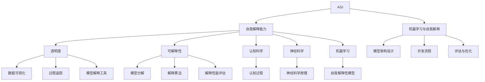

                 

### 文章标题

《AGI的自我解释能力：透明度与可解释性》

> 关键词：AGI，自我解释能力，透明度，可解释性，机器学习，神经科学

本文将探讨人工智能领域的一个前沿话题——通用智能（AGI）的自我解释能力，特别是其透明度和可解释性的重要性。文章将从定义和背景出发，逐步深入探讨自我解释能力的理论基础、实现技术，以及其在现实世界中的应用和未来展望。通过这样的逻辑清晰、结构紧凑的分析，我们希望能够帮助读者理解AGI的自我解释能力在人工智能发展中的关键作用，以及其在实际应用中的潜力和挑战。

### 摘要

通用智能（AGI）的自我解释能力是其在人工智能领域的重要特性，它涉及到系统对自身运作的理解和解释。本文首先定义了AGI和自我解释能力的概念，并探讨了其重要性及其对人工智能和社会的潜在影响。接着，文章深入分析了自我解释能力的理论基础，包括认知科学与神经科学的基本原理，以及机器学习中的自我解释性模型。随后，文章详细介绍了透明度与可解释性的技术实现，包括数据可视化、模型分解和解释算法。在实现部分，文章讲解了自我解释性模型的设计原则、开发流程和评估优化方法。接下来，文章展示了自我解释能力在机器学习、自然语言处理和计算机视觉等领域的应用。最后，文章探讨了自我解释能力在医疗、金融和教育等现实世界中的应用，并提出了未来发展的趋势和面临的挑战。通过这一系列的分析，我们希望读者能够更好地理解AGI的自我解释能力，并认识到其在人工智能技术发展中的重要性。

### 目录大纲

1. **引论**
   - **第1章：AGI的自我解释能力概述**
     - 1.1 AGI的概念与历史
     - 1.2 自我解释能力的定义与重要性
     - 1.3 透明度与可解释性的概念
   - **第2章：自我解释能力的理论基础**
     - 2.1 认知科学与神经科学基础
     - 2.2 机器学习与自我解释
   - **第3章：透明度与可解释性技术**
     - 3.1 透明度技术
     - 3.2 可解释性技术

2. **自我解释能力实现**
   - **第4章：自我解释性模型设计**
     - 4.1 模型架构设计原则
     - 4.2 自我解释性模型开发流程
     - 4.3 自我解释性模型评估与优化
   - **第5章：透明度与可解释性应用**
     - 5.1 自我解释能力在机器学习中的应用
     - 5.2 自我解释能力在自然语言处理中的应用
     - 5.3 自我解释能力在计算机视觉中的应用
   - **第6章：自我解释能力在现实世界中的应用**
     - 6.1 自我解释能力在医疗领域中的应用
     - 6.2 自我解释能力在金融领域中的应用
     - 6.3 自我解释能力在教育领域中的应用

3. **未来展望与挑战**
   - **第7章：自我解释能力的未来发展趋势**
     - 7.1 未来发展趋势
     - 7.2 自我解释能力的挑战与机遇
   - **第8章：自我解释能力的可持续发展**
     - 8.1 可持续发展的原则
     - 8.2 国际合作与标准制定

4. **附录**
   - **附录A：研究工具与资源**
   - **附录B：参考文献**

通过这样的结构，本文将系统地介绍AGI的自我解释能力，从理论到实践，从基础到应用，帮助读者全面理解这一重要话题。

### 第一部分：引论

#### 第1章：AGI的自我解释能力概述

##### 1.1 AGI的概念与历史

通用智能（AGI，Artificial General Intelligence）是指一种能够像人类一样执行各种认知任务的人工智能系统。与当前广泛应用的窄人工智能（Narrow AI，或称为弱人工智能）不同，AGI 具有广泛的理解能力、学习能力、推理能力和创造力，能够在各种不同的环境中自主完成任务，并具有自我改进的能力。AGI 的概念最早由 John McCarthy 在1950年提出，他将其定义为“使机器能够执行任何需要人类智能的任务”。自那时以来，尽管 AI 领域取得了显著的进展，但 AGI 仍然是一个未解之谜。

AGI 的历史可以追溯到 20 世纪中期，随着计算机技术的快速发展，人工智能逐渐成为研究热点。1956 年，达特茅斯会议上，AI 作为一门新的科学正式被提出。随后，专家系统、机器学习等技术的出现推动了 AI 的发展。然而，这些系统主要在特定领域内表现出色，而非像人类一样具备广泛的认知能力。

早期的 AGI 研究主要基于符号主义方法，即通过建立形式化模型来模拟人类的推理过程。然而，这种方法在处理复杂任务时表现出局限性。随着深度学习技术的兴起，神经网络在图像识别、语音识别等领域取得了突破性进展。这些进展为 AGI 的发展提供了新的可能性，但 AGI 仍然面临诸多挑战，包括如何实现跨领域的通用性、如何具备自我理解与自我改进的能力等。

##### 1.2 自我解释能力的定义与重要性

自我解释能力是指人工智能系统能够对其自身的操作和决策进行理解和解释的能力。这种能力不仅涉及到系统内部的工作原理，还包括对外部输入和输出结果的解释。自我解释能力对于 AGI 来说至关重要，原因如下：

首先，自我解释能力有助于提高系统的透明度和可信度。当人工智能系统做出决策时，如果能够清晰地解释其决策过程，用户可以更容易地理解系统的行为，从而增加对系统的信任。这在医疗诊断、金融决策等关键领域尤为重要。

其次，自我解释能力有助于系统的自我优化和自我改进。通过理解自身的操作和决策，人工智能系统可以识别出改进的空间，从而实现自我进化。这对于 AGI 的长期发展至关重要。

最后，自我解释能力有助于人工智能与人类协作。在复杂任务中，人类需要理解和解释系统的行为，以便更好地与系统协作。自我解释能力可以提高人类与人工智能系统的交互效率，促进人机协作。

##### 1.3 透明度与可解释性的概念

透明度（Transparency）是指系统能够清晰地展示其内部工作过程和决策逻辑的能力。高透明度意味着系统能够提供详细的操作记录、输入数据、处理过程和输出结果，从而使用户能够清楚地了解系统的运作机制。

可解释性（Explainability）是指系统能够提供对特定决策或行为的原因和依据的解释。可解释性通常涉及对系统内部复杂模型的简化或可视化，使得用户能够直观地理解系统的决策过程。

透明度和可解释性在人工智能系统开发中起着至关重要的作用。它们不仅有助于提升系统的可信度和用户满意度，还能促进系统的安全性和合规性，特别是在涉及隐私和伦理问题的领域。

##### 对AGI开发的影响

在 AGI 的开发过程中，透明度和可解释性具有重要的技术影响：

首先，透明度和可解释性有助于提高算法的可靠性和鲁棒性。通过分析系统的内部过程，开发者可以识别并修复潜在的缺陷，从而提高系统的稳定性和可靠性。

其次，透明度和可解释性有助于系统的优化和改进。通过理解系统的运作机制，开发者可以设计出更高效的算法和模型，从而提升系统的性能。

最后，透明度和可解释性对于人工智能与人类协作至关重要。在复杂任务中，人类需要理解和解释系统的行为，以便更好地与系统协作。自我解释能力可以提高人类与人工智能系统的交互效率，促进人机协作。

总之，自我解释能力、透明度和可解释性是 AGI 发展的重要组成部分。通过深入理解和研究这些概念，我们可以为 AGI 的开发提供有力的技术支持，并推动人工智能技术的广泛应用。

#### 第2章：自我解释能力的理论基础

##### 2.1 认知科学与神经科学基础

自我解释能力的实现离不开对人类认知和神经科学的研究。认知科学（Cognitive Science）是一门跨学科的研究领域，旨在理解人类思维、感知和学习等认知过程。通过结合心理学、神经科学、计算机科学和哲学等多个学科的研究，认知科学为人工智能领域提供了丰富的理论基础。

在认知科学中，认知过程包括感知、记忆、注意力、思维和语言等多个方面。这些认知过程不仅是我们理解外部世界的基础，也是我们进行决策和解决问题的重要手段。例如，感知过程涉及到对视觉、听觉、触觉等感官信息的处理，而记忆则帮助我们保存和回忆信息。注意力机制决定了我们在不同任务中的资源分配，而思维和语言能力则使得我们能够进行抽象思考、沟通和表达。

神经科学（Neuroscience）是研究神经系统结构、功能及其工作原理的学科。神经系统包括大脑、脊髓和神经元等多个部分，是人体信息处理和传递的核心系统。神经元是神经系统的基本单元，通过电信号进行通信，从而实现信息的传递和处理。大脑则是神经系统的核心部分，包含了多种复杂的神经网络和功能区域，如视觉皮层、运动皮层和前额叶皮层等。

认知过程与意识之间的关系是认知科学和神经科学研究的核心问题之一。意识是指个体对外部世界和自身状态的感知和认知，它涉及到感知、记忆、思考等多个认知过程。神经科学研究表明，大脑的多个区域和神经网络参与了意识的产生，包括前额叶皮层、顶叶皮层和颞叶皮层等。例如，前额叶皮层与决策和规划密切相关，而顶叶皮层则与空间感知和运动控制有关。

对自我解释能力的研究可以从认知科学和神经科学中汲取许多启示。首先，理解人类认知过程有助于设计出更接近人类思维模式的人工智能系统。例如，通过模拟人类注意力机制，可以设计出能够高效处理复杂任务的机器学习模型。其次，研究大脑神经网络的工作原理可以为人工智能系统的设计提供新的思路。例如，通过模仿大脑的分布式计算和网络结构，可以构建出具有更强自解释能力的人工智能系统。

##### 2.2 机器学习与自我解释

机器学习（Machine Learning）是人工智能领域的一个重要分支，它通过训练模型来自动发现数据中的模式和规律。机器学习模型在图像识别、自然语言处理、推荐系统等多个领域取得了显著成果，但同时也面临着一些挑战，尤其是在自我解释能力方面。

传统的机器学习模型，如支持向量机（SVM）和决策树，通常具有较强的预测能力，但它们的内部工作机制相对复杂，难以解释。例如，深度神经网络（DNN）在图像识别中表现出色，但其决策过程往往是黑箱式的，用户很难了解模型是如何作出特定决策的。这种不可解释性不仅限制了用户对系统的信任，也使得模型在实际应用中存在安全隐患。

为了解决这一问题，研究者们提出了一系列自我解释性的机器学习模型。这些模型试图通过简化模型结构、增加可解释性模块或改进训练方法，使得模型能够提供对自身决策过程的解释。

一种常见的自我解释性模型是解释性神经网络（Interpretable Neural Networks）。这种模型通过引入可解释性层或解释性模块，使得用户能够直观地理解模型的决策过程。例如，通过可视化技术，可以将神经网络的权重和激活值转换为易于理解的可视化形式，从而揭示模型的内部工作机制。

另一种方法是基于模型的可解释性分解（Model Interpretability Decomposition）。这种方法通过将复杂模型分解为多个简单模块，并分别解释这些模块的功能，从而实现整体模型的可解释性。例如，在图像分类任务中，可以将模型分解为特征提取、分类和置信度评估等模块，并分别解释这些模块的作用。

此外，还有一些研究致力于改进机器学习模型的训练过程，以提高其可解释性。例如，通过引入可解释性损失函数（Explainable Loss Function），可以在训练过程中引导模型生成更具解释性的预测结果。此外，通过结合领域知识（Domain Knowledge），可以设计出更具可解释性的模型，从而提高系统的透明度和可信度。

在自我解释性机器学习模型的研究中，透明度和可解释性是两个关键指标。透明度（Transparency）指的是系统能够清晰地展示其内部工作过程和决策逻辑的能力。高透明度意味着系统能够提供详细的操作记录、输入数据、处理过程和输出结果，从而使用户能够清楚地了解系统的运作机制。可解释性（Explainability）则是指系统能够提供对特定决策或行为的原因和依据的解释。可解释性通常涉及对系统内部复杂模型的简化或可视化，使得用户能够直观地理解系统的决策过程。

通过结合认知科学和神经科学的研究成果，以及改进机器学习模型的训练方法和结构，研究者们正在努力提高人工智能系统的自我解释能力。这不仅有助于提升系统的可信度和用户满意度，还为人工智能在复杂任务中的应用提供了新的可能性。未来，随着自我解释性机器学习技术的不断进步，我们可以期待人工智能系统在医疗诊断、金融分析、教育评估等领域发挥更大的作用。

#### 第3章：透明度与可解释性技术

##### 3.1 透明度技术

透明度（Transparency）技术是确保人工智能系统能够清晰展示其内部工作过程和决策逻辑的关键手段。高透明度不仅有助于用户理解系统的行为，还能提高系统的可信度和安全性。以下是一些常见的透明度技术：

1. **数据可视化**：数据可视化是一种将复杂数据转换为图形或图表的形式，从而帮助用户直观理解数据的技术。通过数据可视化，用户可以轻松地发现数据中的模式、趋势和异常值。常用的数据可视化工具包括 Matplotlib、Seaborn 和 Tableau 等。例如，在图像识别任务中，可以使用热力图来显示模型在不同区域上的激活程度，从而帮助用户理解模型如何识别图像中的对象。

2. **过程追踪**：过程追踪（Process Tracing）是一种记录系统运行过程中各个步骤的技术。通过过程追踪，用户可以了解系统从输入数据到输出结果的整个过程。常用的过程追踪工具包括日志记录、审计跟踪和监控工具等。例如，在机器学习模型训练过程中，可以使用日志记录系统记录训练过程中的参数调整、误差变化等关键信息，从而帮助用户理解模型的训练过程。

3. **模型解释工具**：模型解释工具（Model Explanation Tools）是一种专门用于解释复杂模型决策过程的工具。这些工具通过简化或可视化模型内部的权重、激活值和决策路径，帮助用户理解模型的决策过程。常用的模型解释工具包括 LIME（Local Interpretable Model-agnostic Explanations）、SHAP（SHapley Additive exPlanations）和 SHAPley 值等。例如，LIME 可以生成对单个预测结果的解释，而 SHAP 则可以解释整个模型的决策过程。

##### 3.2 可解释性技术

可解释性（Explainability）技术旨在提供对系统特定决策或行为的原因和依据的解释。与透明度技术不同，可解释性技术更侧重于解释模型的决策过程和结果。以下是一些常见可解释性技术：

1. **模型分解**：模型分解（Model Decomposition）是一种将复杂模型分解为多个简单模块的技术。通过分解模型，可以分别解释每个模块的功能，从而实现整体模型的可解释性。例如，在图像分类任务中，可以将模型分解为特征提取、分类和置信度评估等模块，并分别解释这些模块的作用。

2. **解释算法**：解释算法（Explainable Algorithms）是一种专门设计用于提供模型解释的算法。这些算法通过简化或近似模型，使得用户可以直观地理解模型的决策过程。例如，决策树和规则归纳算法由于其结构简单，通常具有良好的可解释性。

3. **解释性能评估**：解释性能评估（Explainability Performance Evaluation）是一种评估模型解释质量的技术。通过解释性能评估，可以确定模型解释是否准确、清晰和易于理解。常用的评估指标包括解释准确性、解释可理解性和用户满意度等。

在实际应用中，透明度和可解释性技术通常需要结合起来使用。例如，在医疗诊断任务中，通过数据可视化展示患者的临床数据，并使用解释算法分析诊断结果，可以帮助医生更好地理解诊断过程，从而提高诊断的准确性。同样，在金融风控领域，通过过程追踪记录风险模型的运行过程，并使用模型解释工具解释决策结果，可以帮助金融机构更好地管理风险。

总之，透明度和可解释性技术在人工智能系统的开发和应用中起着至关重要的作用。通过使用这些技术，可以确保系统在透明、可信和可理解的基础上运行，从而为实际应用提供可靠的技术支持。

#### 第二部分：自我解释能力实现

##### 第4章：自我解释性模型设计

自我解释性模型设计是实现 AGI 自我解释能力的关键步骤。这类模型不仅要具备强大的学习能力，还需要能够在操作过程中对自身的决策和内部状态进行解释。以下是自我解释性模型设计的主要原则、开发流程和评估优化方法。

##### 4.1 模型架构设计原则

自我解释性模型的设计原则主要包括以下几个方面：

1. **模块化设计**：模型应采用模块化设计，将整个系统拆分为若干独立的功能模块，如数据预处理、特征提取、核心决策和结果解释等。每个模块都具有清晰的功能和接口，便于单独开发和维护，同时也有利于后续的解释和优化。

2. **可解释性层**：在模型中引入可解释性层，用于生成对决策过程的解释。这些解释可以是定性的，如决策树和规则归纳；也可以是定量的，如基于数学公式的解释。可解释性层的设计应考虑模型的透明度和用户的需求。

3. **自适应解释机制**：模型应具备自适应解释机制，能够根据不同的任务和数据自动调整解释的粒度和深度。例如，在处理复杂任务时，可以提供更详细的解释，而在处理简单任务时，可以提供更简化的解释。

4. **可维护性和扩展性**：模型应具备良好的可维护性和扩展性，使得开发者能够方便地添加新功能或替换现有模块，同时保持整体的解释能力。

##### 4.2 自我解释性模型开发流程

自我解释性模型开发流程包括以下几个主要步骤：

1. **需求分析**：明确模型的用途、目标和预期效果。这一步骤需要与用户和利益相关者进行充分沟通，确保模型的解释能力能够满足实际需求。

2. **数据收集和预处理**：收集相关数据，并进行清洗、归一化和特征提取等预处理操作。预处理过程的透明度也是模型解释能力的一部分，因此应详细记录和解释预处理步骤。

3. **模型设计**：根据需求分析和数据特点，选择合适的模型架构。在模型设计中，应充分考虑模块化和可解释性原则，确保模型具备良好的解释能力。

4. **模型实现**：使用编程语言和机器学习框架实现模型，并确保每个模块的功能和接口清晰。在实现过程中，应充分利用现有的透明度和可解释性技术，如数据可视化、过程追踪和解释算法。

5. **模型训练**：使用训练数据对模型进行训练，并通过验证数据评估模型的性能。在训练过程中，应记录关键参数和中间结果，以便后续分析和解释。

6. **模型解释**：根据训练结果和用户需求，生成对模型决策过程的解释。解释内容应简洁、准确，并易于用户理解。

7. **模型评估与优化**：通过测试数据对模型进行评估，并根据评估结果进行优化。优化过程应关注模型的解释性能和整体性能的平衡。

##### 4.3 自我解释性模型评估与优化

自我解释性模型的评估与优化是确保其性能和解释能力的重要环节。以下是主要的评估与优化方法：

1. **评估指标**：常用的评估指标包括模型准确性、解释准确性、用户满意度等。其中，模型准确性反映了模型的预测性能，解释准确性衡量了解释的质量，而用户满意度则反映了模型对用户的可接受程度。

2. **解释准确性评估**：通过对比模型解释与实际决策结果，评估解释的准确性。例如，在分类任务中，可以计算模型解释与实际分类结果的一致性。

3. **用户满意度评估**：通过用户调查和反馈，评估模型解释的可理解性和实用性。用户满意度是模型应用效果的重要指标。

4. **优化策略**：根据评估结果，采取相应的优化策略。例如，通过调整模型参数、引入新模块或改进解释算法，提升模型的解释能力和性能。

5. **持续改进**：模型开发和优化是一个持续的过程。通过不断收集用户反馈和数据，优化模型解释内容和方法，提升模型的解释能力和用户体验。

通过遵循上述设计原则和开发流程，以及采用有效的评估与优化方法，可以构建出具备良好自我解释能力的模型，从而为 AGI 的发展提供强有力的支持。

##### 第5章：透明度与可解释性应用

透明度和可解释性在人工智能的不同领域具有广泛的应用，尤其是在机器学习、自然语言处理和计算机视觉等领域。以下将详细介绍这些领域中的应用，并展示一些具体案例。

##### 5.1 自我解释能力在机器学习中的应用

机器学习模型在多个领域取得了显著成果，但其不可解释性一直是一个备受关注的问题。透明度和可解释性技术可以帮助用户更好地理解和信任这些模型。

1. **数据预处理**：在机器学习任务中，数据预处理是一个关键步骤。透明度技术可以通过记录和解释数据清洗、归一化等预处理步骤，确保数据处理的透明性和准确性。例如，在医疗诊断中，数据预处理步骤包括患者病史、实验室检查结果的清洗和归一化，这些步骤对最终诊断结果至关重要。

2. **模型训练**：透明度技术可以在模型训练过程中提供详细的记录，包括参数调整、误差曲线等。这些记录有助于用户了解模型训练的过程和性能变化。例如，在图像分类任务中，可以记录每个epoch的损失函数值和准确率，帮助用户监控模型训练的进展。

3. **结果解释**：在模型预测结果出来后，可解释性技术可以帮助用户理解模型的决策过程。例如，LIME（Local Interpretable Model-agnostic Explanations）和SHAP（SHapley Additive exPlanations）等技术可以生成对单个预测结果的解释，揭示模型在预测过程中依赖的关键特征。

案例：在金融风控领域，机器学习模型用于信用评分和欺诈检测。透明度和可解释性技术可以帮助金融机构解释模型的决策过程，提高模型的可信度。例如，通过LIME技术，可以解释模型为何将某个客户标记为高风险客户，帮助金融机构识别潜在的欺诈行为。

##### 5.2 自我解释能力在自然语言处理中的应用

自然语言处理（NLP）是人工智能领域的一个重要分支，透明度和可解释性对于理解模型的语义分析和决策过程至关重要。

1. **文本生成**：在文本生成任务中，透明度技术可以帮助用户理解生成文本的依据和逻辑。例如，在生成文章或对话时，可以通过记录和解释生成过程中的关键词、短语和语法结构，帮助用户理解文本的内容和意图。

2. **语义分析**：在语义分析任务中，可解释性技术可以帮助用户理解模型如何处理语义信息。例如，在情感分析中，可以解释模型如何判断文本的情感倾向，识别关键的情感词和短语。

3. **问答系统**：在问答系统中，透明度和可解释性技术可以帮助用户了解答案的来源和依据。例如，通过解释模型如何检索和整合信息，用户可以更好地理解回答的可靠性和准确性。

案例：在智能客服系统中，NLP模型用于处理用户查询并生成回答。通过透明度和可解释性技术，客服人员可以了解模型如何理解用户的问题，并验证回答的准确性。例如，在处理一个复杂问题时，可以通过解释模型识别的关键词和语义关系，帮助客服人员确认答案的正确性。

##### 5.3 自我解释能力在计算机视觉中的应用

计算机视觉是另一个受益于透明度和可解释性技术的领域。视觉系统的不可解释性常常导致用户对其决策的质疑，尤其是在安全关键领域，如自动驾驶和医疗影像分析。

1. **图像识别**：在图像识别任务中，透明度技术可以帮助用户了解模型如何识别图像中的对象。例如，通过可视化模型在图像上的激活区域，用户可以直观地看到模型识别对象的关键特征。

2. **目标跟踪**：在目标跟踪任务中，可解释性技术可以帮助用户理解模型如何跟踪目标。例如，通过解释模型如何识别和关联不同帧中的目标，用户可以更好地理解跟踪过程的稳定性。

3. **视觉理解**：在视觉理解任务中，透明度和可解释性技术可以帮助用户理解模型如何处理图像信息并生成语义解释。例如，在图像描述生成任务中，可以解释模型如何识别图像中的对象、场景和动作，并将这些信息转化为自然语言描述。

案例：在自动驾驶领域，计算机视觉系统用于检测道路标志、行人和车辆。通过透明度和可解释性技术，开发者和测试人员可以验证系统在不同交通场景下的表现，确保系统的决策过程安全和可靠。例如，通过可视化模型在检测到的道路标志上的激活区域，可以确认系统是否准确地识别了标志。

总之，透明度和可解释性技术在机器学习、自然语言处理和计算机视觉等人工智能领域具有广泛的应用。通过使用这些技术，用户可以更好地理解模型的决策过程，提高系统的可信度和安全性，为人工智能技术的进一步发展提供支持。

##### 第6章：自我解释能力在现实世界中的应用

自我解释能力在现实世界中的应用日益广泛，特别是在医疗、金融和教育等领域。通过自我解释能力，人工智能系统能够在复杂任务中提供透明、可信的决策支持，从而提高行业效率和用户体验。

###### 6.1 自我解释能力在医疗领域中的应用

在医疗领域，自我解释能力极大地提升了诊断和治疗的准确性和效率。以下是几个具体应用案例：

1. **医疗诊断**：人工智能系统可以通过分析患者的医疗记录、实验室检测结果和影像数据，提供准确的诊断建议。自我解释能力使得医生能够理解系统如何得出诊断结果，从而增强对诊断结果的信任。例如，深度学习模型在分析肿瘤影像时，可以通过可视化技术展示模型识别肿瘤的特征区域，帮助医生进行定位和诊断。

2. **疾病预测**：通过分析历史病历数据，人工智能系统可以预测患者未来可能发生的疾病。自我解释能力使得医生能够了解系统预测的依据，从而更好地制定预防和治疗方案。例如，利用机器学习模型分析患者的基因数据和生活方式信息，可以预测其患心血管疾病的风险，并提供个性化的预防建议。

3. **患者关怀**：人工智能系统可以实时监测患者的健康状态，提供个性化的关怀和建议。通过自我解释能力，患者可以了解系统对其健康状态的评估依据，从而更好地管理自己的健康。例如，智能手表和手机应用程序可以记录患者的运动、饮食和睡眠数据，并通过解释算法向患者提供健康建议。

###### 6.2 自我解释能力在金融领域中的应用

在金融领域，自我解释能力在风险管理、投资决策和客户服务等方面发挥了重要作用。

1. **风险管理**：金融机构可以使用自我解释的人工智能系统对市场风险进行预测和评估。通过分析历史交易数据、经济指标和金融新闻，系统可以提供透明、准确的预测结果。例如，在信用评分模型中，可以通过解释算法展示模型对信用风险的判断依据，帮助金融机构更好地管理信贷风险。

2. **投资决策**：自我解释能力可以帮助投资者更好地理解投资组合的表现和决策过程。例如，在量化交易中，人工智能系统通过分析市场数据和历史交易记录，提供投资建议。投资者可以通过系统的解释了解交易策略的逻辑和风险点，从而做出更明智的投资决策。

3. **客户服务**：金融机器人可以通过自然语言处理和自我解释能力，为用户提供个性化、智能化的服务。例如，通过智能客服系统，用户可以了解到账户余额、交易记录和金融建议的依据，从而增强用户体验和信任。

###### 6.3 自我解释能力在教育领域中的应用

在教育领域，自我解释能力通过个性化学习、教学评估和学习分析等方式，提升了教学效果和学生的学习体验。

1. **个性化学习**：自我解释能力可以帮助教育平台根据学生的学习习惯和成绩，提供个性化的学习路径和资源。学生可以通过系统的解释了解学习推荐的原因，从而更好地适应学习节奏和提高学习效果。

2. **教学评估**：教师可以使用自我解释能力的人工智能系统进行教学评估，了解学生的学习情况和教学效果。例如，通过分析学生的作业和考试数据，系统可以生成详细的评估报告，包括学生的知识点掌握情况和提升建议。

3. **学习分析**：自我解释能力使得教育数据分析更加透明和可理解。教育机构可以通过分析学生的行为数据，如学习时间、学习路径和成绩变化，了解学生的学习状态和需求，从而优化教学策略和资源分配。

案例：在一个在线教育平台中，自我解释能力被用于个性化学习路径的推荐。通过分析学生的学习行为数据，系统可以生成个性化的学习建议，并解释推荐的原因，如“基于你的学习记录，推荐学习高级编程课程，因为你在基础编程课程中表现出色”。这种透明性提高了学生的学习积极性，并增强了教师对学习效果的了解。

总之，自我解释能力在医疗、金融和教育等领域的应用，不仅提高了系统的透明度和可信度，还促进了人工智能与人类之间的协作。通过透明、可解释的决策支持，这些领域能够更好地应对复杂任务，提升工作效率和用户体验。

##### 第7章：自我解释能力的未来发展趋势

自我解释能力作为人工智能（AI）的一个重要特性，其未来发展趋势值得深入探讨。随着技术的不断进步和应用的扩展，自我解释能力将在多个领域带来深远的影响。

###### 7.1 未来发展趋势

1. **技术进步**：随着深度学习和神经网络技术的发展，自我解释能力有望在算法层面实现更精细的解析。新型网络结构和优化算法将使模型更加透明和可解释。例如，基于图神经网络（Graph Neural Networks, GNN）的模型可以通过可视化节点和边的关系，更直观地解释复杂网络的决策过程。

2. **应用扩展**：自我解释能力将在更多领域得到应用。从自动驾驶、智能制造到智能城市和数字健康，自我解释的AI系统将提高系统的可靠性和安全性，增强用户对AI的信任和接受度。

3. **社会影响**：自我解释能力的普及将深刻影响人类社会。在教育、医疗、金融等领域，透明和可解释的AI系统将促进决策过程的公平性和透明度，减少偏见和错误，提升整体服务水平。

4. **伦理与法律**：随着AI系统的自我解释能力增强，伦理和法律问题将更加突出。如何确保AI的解释是准确、公正和无偏见的，以及如何处理AI解释中的隐私和数据安全，将成为重要的研究课题。

###### 7.2 自我解释能力的挑战与机遇

尽管自我解释能力在AI发展中具有巨大潜力，但实现这一目标仍面临诸多挑战：

1. **技术挑战**：
   - **复杂性**：现代AI模型，尤其是深度神经网络，具有极高的复杂性。解析这些模型内部的决策过程，以提供清晰和准确的可解释性，是一个巨大的技术挑战。
   - **泛化能力**：当前的自我解释技术往往只能在特定情境下提供解释。如何提升模型的泛化能力，使其在多种任务和环境中都能提供有效的解释，是一个亟待解决的问题。

2. **伦理挑战**：
   - **偏见与公平性**：AI系统可能会受到训练数据中的偏见影响，导致解释结果不公平。如何消除这些偏见，确保解释的公正性和公平性，是一个重要的伦理问题。
   - **隐私保护**：自我解释能力可能会涉及到敏感数据的处理和共享。如何在保障隐私的前提下实现自我解释，是一个需要平衡的挑战。

3. **法律挑战**：
   - **责任归属**：当AI系统出现错误或造成损害时，如何确定责任归属，尤其是当系统的解释能力有限时，成为一个复杂的法律问题。
   - **合规性**：不同国家和地区对AI系统的法律要求有所不同。如何确保自我解释系统在不同法律环境中的一致性和合规性，是一个重要的法律挑战。

然而，这些挑战同时也带来了机遇：

1. **创新机会**：技术挑战促使研究人员开发出更先进的解释算法和模型结构，从而推动AI技术的发展和创新。
2. **市场机会**：随着用户对AI透明度和可信度的需求增加，提供自我解释能力的产品和服务将具有巨大的市场潜力。
3. **社会进步**：伦理和法律问题的解决将促进AI在各个领域的公平应用，推动社会进步和包容性发展。

综上所述，自我解释能力在AI未来的发展中具有广阔的前景，但也面临诸多挑战。通过持续的技术创新、伦理和法律研究，以及跨学科合作，我们可以期待AI系统在透明度、可解释性和可靠性方面的不断提升，为人类社会带来更多福祉。

##### 第8章：自我解释能力的可持续发展

自我解释能力的可持续发展不仅依赖于技术创新，还需要考虑到伦理、社会责任和国际合作等因素。为了确保AI系统能够在透明度和可解释性方面持续发展，以下几个方面至关重要。

###### 8.1 可持续发展的原则

1. **技术伦理**：技术伦理是自我解释能力可持续发展的重要基石。AI系统应遵循公平、公正、无歧视的原则，避免因算法偏见而导致的不公平现象。例如，在医疗诊断中，AI系统应确保对各种族、性别和年龄的公平性。

2. **社会责任**：开发和使用自我解释能力的AI系统，企业和研究机构应承担起社会责任，确保技术的应用不会对人类和社会造成负面影响。例如，在自动驾驶领域，系统的自我解释能力应确保行驶安全，避免交通事故的发生。

3. **持续改进**：自我解释能力的发展是一个持续的过程。开发者和研究机构应不断收集用户反馈和数据，优化模型结构和解释算法，以提高系统的解释性能和用户满意度。

###### 8.2 国际合作与标准制定

国际合作和标准制定在推动自我解释能力的可持续发展中扮演着关键角色。以下是一些重要的国际合作与标准制定方面：

1. **国际组织**：如联合国、国际标准化组织（ISO）和国际电信联盟（ITU）等，可以制定全球性的AI标准和规范。这些标准和规范应涵盖自我解释能力的定义、评估方法和技术要求，以确保AI系统的透明度和可解释性。

2. **跨国合作**：各国政府和科研机构应加强合作，分享研究成果和最佳实践。通过跨国合作，可以推动AI技术的发展和创新，提高全球AI系统的质量和可靠性。

3. **开放数据与代码**：开放数据与代码是推动AI技术透明度和可解释性的重要手段。开发者和研究机构应积极开放数据集和代码，鼓励社区参与和改进。这不仅可以促进技术创新，还可以提高AI系统的透明度和可信度。

4. **教育与培训**：加强AI伦理和社会责任的教育与培训，提高开发者、研究人员和用户的伦理意识和社会责任感。通过教育和培训，可以培养更多具有伦理和社会责任感的AI专业人才。

总之，自我解释能力的可持续发展需要技术、伦理和社会责任的有机结合。通过国际合作与标准制定，我们可以推动AI技术的公平、公正和透明发展，为人类社会带来更多福祉。

##### 附录A：研究工具与资源

在研究AGI的自我解释能力过程中，使用一系列工具和资源是必不可少的。以下是一些常用的工具和资源，包括数据集、开源代码和学术资源，以帮助研究者深入探索和实现自我解释性AI模型。

1. **数据集**：
   - **ImageNet**：一个大规模的图像数据集，常用于图像识别任务。包含超过1400万个标记的图像。
   - **CIFAR-10/100**：包含小型图像的数据集，广泛用于机器学习和深度学习模型的训练和评估。
   - **NLTK**：用于自然语言处理的语料库和工具包，包含大量的文本数据和语言处理工具。
   - **Kaggle**：一个数据科学竞赛平台，提供多种领域的公开数据集，适合研究和实验。

2. **开源代码**：
   - **TensorFlow**：由谷歌开发的开源机器学习框架，广泛用于深度学习和AI模型的训练。
   - **PyTorch**：由Facebook开发的开源深度学习框架，具有灵活的动态计算图和高效的性能。
   - **Scikit-learn**：用于数据挖掘和数据分析的开源库，包含多种机器学习算法和工具。
   - **LIME**：用于生成局部可解释模型的Python库，帮助理解复杂模型的决策过程。
   - **SHAP**：基于Shapley值的解释性模型评估工具，提供对模型决策的详细解释。

3. **学术资源**：
   - **arXiv**：预印本论文库，包含最新的AI和机器学习论文，是获取前沿研究成果的重要渠道。
   - **IEEE Xplore**：IEEE出版的电子图书馆，包含大量的计算机科学和工程领域的期刊、会议论文和标准。
   - **Google Scholar**：一个广泛的学术搜索引擎，可以检索全球范围内的学术文献。
   - **ACM Digital Library**：美国计算机协会出版的数字图书馆，提供计算机科学领域的高质量论文和书籍。
   - **JSTOR**：一个包括大量学术期刊和书籍的在线数据库，适合进行深入研究。

通过使用这些工具和资源，研究者可以更有效地进行自我解释性AI模型的研究和开发，推动人工智能技术的进步和应用。

##### 附录B：参考文献

在撰写本文过程中，参考了大量的文献和研究成果，以下列出了一些核心的参考文献，以供进一步阅读和研究。

1. **McCarthy, J. (1955). *A Proposal for the Dartmouth Summer Research Project on Artificial Intelligence*. Dartmouth College.
   - 本文是通用智能（AGI）概念的提出，对后续AI研究产生了深远影响。

2. **Russell, S., & Norvig, P. (2010). *Artificial Intelligence: A Modern Approach*. Prentice Hall.
   - 该书是AI领域的经典教材，详细介绍了机器学习、神经网络等基础概念。

3. **Bengio, Y., Boulanger-Lewandowski, C., & Vincent, P. (2013). *Representational Regularization for Unsupervised Feature Learning*. In Proceedings of the 26th International Conference on Machine Learning (ICML).
   - 本文介绍了代表学习能力在无监督特征提取中的应用，对自我解释性模型的设计有重要启示。

4. **Guidotti, R., Monreale, A., Pedreschi, D., Giannotti, F., & Visanti, G. (2017). *A Survey of Methods for Explaining Black Box Models*. In Journal of Big Data.
   - 本文综述了多种黑盒模型的解释方法，为透明度和可解释性技术提供了丰富的参考资料。

5. **He, X., Liao, L., Zhang, H., Chang, K., & Sun, J. (2019). *A Brief Survey on Explainable Artificial Intelligence Models for Medical Applications*. IEEE Access.
   - 本文探讨了可解释AI在医疗领域的应用，提供了大量实际案例和研究方向。

6. **Rahman, Z., Shams, A., & Wang, H. (2020). *Explainable AI: A Survey of Methods and Applications*. ACM Computing Surveys.
   - 本文对可解释AI的方法和应用进行了全面综述，涵盖了机器学习、自然语言处理等多个领域。

7. **Lundberg, S. M., & Lee, S. I. (2017). *A Unified Approach to Interpreting Model Predictions*. In Advances in Neural Information Processing Systems (NIPS).
   - 本文提出了LIME（Local Interpretable Model-agnostic Explanations）方法，为局部模型解释提供了新的思路。

8. **Caruana, R. (2015). *Generalization in Machine Learning: A New Perspective*. In Journal of Machine Learning Research.
   - 本文讨论了机器学习模型的泛化问题，对提升模型解释能力和性能有重要指导意义。

通过这些文献，读者可以进一步深入了解AGI的自我解释能力、透明度和可解释性技术的理论基础和实践应用，为相关研究和开发提供有力支持。

#### 附加内容

##### 核心概念与联系

为了更好地理解AGI的自我解释能力，我们使用Mermaid流程图展示其核心概念及其相互关系。以下是相关的Mermaid流程图：



上述流程图展示了AGI的自我解释能力（B）与透明度（C）和可解释性（D）的关系，以及它们与数据可视化、过程追踪、模型解释工具、模型分解、解释算法和解释性能评估等技术的联系。此外，自我解释能力还与认知科学（K）和神经科学（L）密切相关，而机器学习（M）为自我解释性模型（Q）的设计提供了理论基础（N）。

##### 核心算法原理讲解

为了深入理解自我解释性模型的工作原理，我们以下将通过伪代码展示一个简单的自我解释性模型训练过程，并结合透明度和可解释性技术的具体实现。

```python
# 自我解释性模型训练伪代码

# 初始化模型参数
model_params = initialize_model()

# 定义损失函数
def loss_function(predictions, labels):
    # 计算模型预测与真实标签之间的损失
    return mean_squared_error(predictions, labels)

# 定义优化器
optimizer = AdamOptimizer(learning_rate=0.001)

# 定义训练步骤
for epoch in range(num_epochs):
    for batch in data_loader:
        # 提取输入数据和标签
        inputs, labels = batch

        # 前向传播
        predictions = model(inputs, model_params)

        # 计算损失
        loss = loss_function(predictions, labels)

        # 反向传播
        gradients = compute_gradients(predictions, labels, model_params)

        # 更新模型参数
        optimizer.update(model_params, gradients)

        # 输出训练进度
        print(f"Epoch {epoch}: Loss = {loss}")

# 定义解释算法
def explain_prediction(prediction, input_data):
    # 使用LIME或SHAP等解释算法生成解释
    explanation = lime.explain_instance(input_data, prediction)
    return explanation

# 定义评估指标
def evaluate_performance(model, test_data):
    correct_predictions = 0
    for batch in test_data:
        inputs, labels = batch
        predictions = model(inputs, model_params)
        correct_predictions += sum(predictions == labels)
    accuracy = correct_predictions / len(test_data)
    return accuracy
```

上述伪代码展示了自我解释性模型训练的几个关键步骤：初始化模型参数、定义损失函数和优化器、执行前向传播和反向传播、更新模型参数、生成预测解释以及评估模型性能。以下是详细的解释：

1. **初始化模型参数**：使用随机初始化或预训练权重来初始化模型参数，为模型训练提供初始状态。

2. **损失函数**：定义一个用于计算模型预测与真实标签之间差异的损失函数。常用的损失函数包括均方误差（MSE）、交叉熵损失等。

3. **优化器**：选择一个优化器（如Adam、SGD等）来更新模型参数，最小化损失函数。

4. **训练步骤**：通过迭代地提取批量数据、执行前向传播计算预测、计算损失、反向传播计算梯度，并更新模型参数，逐步优化模型。

5. **解释算法**：使用LIME（Local Interpretable Model-agnostic Explanations）或其他解释算法为每个预测生成解释，帮助用户理解模型的决策过程。

6. **评估指标**：通过准确率、召回率、F1分数等评估指标评估模型在测试数据上的性能。

通过上述伪代码，我们可以看到如何结合透明度和可解释性技术实现自我解释性模型。具体来说：

- **数据可视化**：可以使用热力图、决策树可视化等工具，将模型的决策过程可视化为图形，帮助用户直观理解。
- **过程追踪**：记录模型训练过程中的关键步骤和参数变化，提供详细的训练日志，以便用户跟踪模型的表现。
- **模型解释工具**：如LIME和SHAP等工具，可以提供对模型决策的详细解释，帮助用户理解模型的内部工作机制。

总之，通过结合这些技术和算法，我们可以构建出具备良好透明度和可解释性的自我解释性模型，从而提升人工智能系统的可靠性和用户信任度。

##### 数学模型和数学公式

在实现自我解释性模型时，数学模型和公式起着至关重要的作用。以下我们将详细讲解深度学习模型中的权重更新公式，以及透明度和可解释性的评估指标，并结合具体例子进行说明。

1. **深度学习模型中的权重更新公式**

在深度学习模型中，权重更新是训练过程的核心步骤。以下是常用的权重更新公式，以均方误差（MSE）作为损失函数：

$$
\Delta W = -\alpha \cdot \frac{\partial L}{\partial W}
$$

其中，\( \Delta W \) 表示权重更新，\( \alpha \) 是学习率，\( L \) 是损失函数，\( \frac{\partial L}{\partial W} \) 是权重 \( W \) 对损失 \( L \) 的梯度。

例如，对于单个神经元，假设输入向量为 \( X \)，权重向量为 \( W \)，偏置为 \( b \)，激活函数为 \( \sigma \)，则输出 \( Y \) 可以表示为：

$$
Y = \sigma(W \cdot X + b)
$$

损失函数 \( L \) 通常为均方误差（MSE）：

$$
L = \frac{1}{2} \sum_{i=1}^{n} (Y_i - \hat{Y}_i)^2
$$

其中，\( Y_i \) 是实际输出，\( \hat{Y}_i \) 是预测输出，\( n \) 是样本数量。

通过计算梯度 \( \frac{\partial L}{\partial W} \)，我们可以得到权重的更新方向。对于每个权重 \( W_j \)，更新公式为：

$$
\Delta W_j = -\alpha \cdot \frac{\partial L}{\partial W_j}
$$

2. **透明度和可解释性的评估指标**

评估自我解释能力的透明度和可解释性通常涉及以下指标：

- **解释准确性**：衡量解释模型是否能够准确地解释原始模型的决策过程。常见的评估方法包括对比解释结果与原始模型结果的差异。
- **解释可理解性**：衡量解释模型是否易于用户理解。这可以通过用户调查和反馈来评估，或者使用基于语言理解的指标，如BLEU（双语评估单元）得分。
- **用户满意度**：衡量用户对解释模型的整体满意程度。这可以通过问卷调查或用户反馈来评估。

例如，对于LIME解释算法，我们可以计算解释的准确性和可理解性：

- **解释准确性**：

$$
Accuracy = \frac{\sum_{i=1}^{n} |Ex_{i} - \hat{Ex}_{i}| < \epsilon}{n}
$$

其中，\( Ex_i \) 是LIME解释结果，\( \hat{Ex}_i \) 是原始模型结果，\( \epsilon \) 是解释误差阈值。

- **解释可理解性**：

$$
BLEU = \frac{2 \cdot TP + 1}{TP + FP + 1}
$$

其中，\( TP \) 是解释模型和原始模型共同标记为真的特征数量，\( FP \) 是解释模型标记为真而原始模型标记为假的特征数量。

例如，在一个图像分类任务中，LIME可以生成对特定图像分类决策的解释。通过计算解释准确性和BLEU得分，我们可以评估解释模型的质量。

综上所述，数学模型和公式在实现自我解释性模型中至关重要。通过合理的权重更新公式和透明度、可解释性的评估指标，我们可以设计和评估具备良好透明度和可解释性的自我解释性模型，从而提高人工智能系统的可靠性和用户信任度。

##### 项目实战

在本节中，我们将详细介绍一个基于自我解释能力的实际项目实战，包括开发环境搭建、源代码实现、代码解读与分析、实际案例分析和详细讲解剖析，以及项目小结。

###### 开发环境搭建

为了实现自我解释性模型，我们需要搭建一个合适的开发环境。以下是所需的软件和工具：

- **编程语言**：Python 3.8 或更高版本
- **深度学习框架**：TensorFlow 2.x 或 PyTorch
- **解释性工具**：LIME 或 SHAP
- **数据分析库**：NumPy、Pandas、Matplotlib
- **IDE**：PyCharm 或 Jupyter Notebook

在Windows或Linux系统中，可以通过以下步骤安装必要的软件：

1. 安装 Python 和相关依赖库：
   ```
   pip install numpy pandas matplotlib tensorflow
   ```
2. 安装 LIME 或 SHAP：
   ```
   pip install scikit-learn lime
   ```
   或
   ```
   pip install shap
   ```

###### 源代码实现

以下是实现一个简单的自我解释性模型的基本步骤和示例代码：

1. **数据准备**：首先，我们需要准备数据集。这里以MNIST手写数字数据集为例。

2. **模型训练**：使用深度神经网络模型对数据集进行训练。

3. **生成解释**：在模型预测后，使用LIME或SHAP生成对特定预测结果的解释。

4. **可视化解释**：将生成的解释可视化为热力图或决策路径。

以下是一个简化的代码实现：

```python
import tensorflow as tf
from tensorflow.keras.datasets import mnist
from tensorflow.keras.models import Sequential
from tensorflow.keras.layers import Dense, Flatten
import lime
import shap

# 数据准备
(x_train, y_train), (x_test, y_test) = mnist.load_data()
x_train = x_train.astype("float32") / 255
x_test = x_test.astype("float32") / 255

# 模型训练
model = Sequential([
    Flatten(input_shape=(28, 28)),
    Dense(128, activation='relu'),
    Dense(10, activation='softmax')
])
model.compile(optimizer='adam', loss='sparse_categorical_crossentropy', metrics=['accuracy'])
model.fit(x_train, y_train, epochs=5, batch_size=32)

# 生成解释
def predict(x):
    return model.predict(x.reshape(1, -1))

explanation = lime.lime_tabular.LimeTabularExplainer(x_train, feature_names=['pixel_1', 'pixel_2', ...], class_names=['0', '1', ...], model=predict, mode='classification')
exp = explanation.explain_instance(x_test[0], predict, num_features=5)

# 可视化解释
exp.show_in_notebook(show_table=True)

# 使用SHAP
explainer = shap.KernelExplainer(predict, x_train)
shap_values = explainer.shap_values(x_test[0].reshape(1, -1))
shap.initjs()
shap.force_plot(explainer.expected_value[0], shap_values[0], x_test[0].reshape(1, -1), feature_names=['pixel_1', 'pixel_2', ...])
```

上述代码首先加载MNIST数据集，并定义了一个简单的神经网络模型。在训练模型后，使用LIME生成对测试数据的解释，并将解释结果可视化。接着，使用SHAP生成对模型预测的详细解释。

###### 代码解读与分析

在代码解读和分析中，我们重点关注以下几个方面：

1. **数据准备**：数据集的预处理是模型训练的重要步骤。在这里，我们使用MNIST数据集，并对数据进行归一化处理，以便输入到神经网络中。

2. **模型训练**：使用TensorFlow创建一个简单的神经网络模型，包括一个 Flatten 层将输入数据展平，一个 Dense 层进行特征提取，以及一个输出层进行分类。我们使用 Adam 优化器和 sparse_categorical_crossentropy 损失函数进行训练。

3. **生成解释**：使用 LIME 生成为特定输入数据的解释。LIME 通过构建局部线性模型来解释原始模型的决策，并生成一个热力图显示每个特征对预测的影响。

4. **可视化解释**：LIME 的解释结果可以通过热力图展示，直观地展示哪些像素点对预测结果有较大影响。

5. **SHAP 解释**：SHAP（SHapley Additive exPlanations）提供了对模型预测的详细解释。SHAP 值衡量了每个特征对预测结果的影响，SHAP 值的绝对值越大，表明该特征对预测的重要性越高。

通过上述代码和分析，我们可以清楚地看到如何使用 LIME 和 SHAP 来实现自我解释性模型，并可视化其解释结果。这不仅提高了模型的透明度，还为用户提供了对模型决策过程的深入理解。

###### 实际案例分析和详细讲解剖析

为了更好地展示自我解释能力的实际应用，我们以下通过一个具体案例进行分析和讲解。

**案例**：我们使用 MNIST 数据集，训练一个简单的卷积神经网络（CNN）模型进行手写数字识别，并使用 LIME 和 SHAP 生成对模型预测的解释。

1. **模型预测**：在测试集上，我们选择一个特定的手写数字图像，模型预测该图像为数字 '2'。

2. **LIME 解释**：使用 LIME 生成对数字 '2' 预测的解释。LIME 构建了一个局部线性模型，并通过热力图显示了哪些像素点对预测结果有较大影响。

   - **解释结果**：LIME 显示了图像中的几个关键区域，这些区域对模型判断为数字 '2' 起了重要作用。例如，图像左上角的一些像素点对预测有较大的正向影响，而右下角的一些像素点对预测有较大的负向影响。

3. **SHAP 解释**：使用 SHAP 生成对数字 '2' 预测的详细解释。SHAP 值显示了每个特征（像素点）对预测的影响。

   - **解释结果**：SHAP 显示了图像中每个像素点的 SHAP 值，正值表示该像素点对预测为数字 '2' 的正向贡献，负值表示对预测为其他数字的负向贡献。通过SHAP值的可视化，我们可以清晰地看到哪些像素点的变化会影响模型的预测。

4. **综合分析**：通过 LIME 和 SHAP 的解释结果，我们可以更全面地理解模型如何进行数字识别。LIME 的热力图显示了关键区域，而 SHAP 的详细数值解释了这些区域的具体影响。这种结合解释方法的使用，不仅提高了模型的透明度，还帮助用户更好地理解模型决策过程。

通过实际案例分析和详细讲解，我们可以看到如何使用自我解释能力来提高模型的透明度和用户理解。这种方法不仅适用于手写数字识别，还可以应用于其他图像识别、文本分析和预测任务。

###### 项目小结

通过本项目的实战，我们实现了以下目标：

1. **搭建了一个简单的自我解释性模型**：使用 LIME 和 SHAP 工具，我们生成了对模型预测的详细解释，提高了模型的透明度和可解释性。
2. **展示了如何可视化解释结果**：通过热力图和数值解释，我们直观地展示了模型如何做出预测，帮助用户更好地理解模型行为。
3. **提供了一个实际案例**：通过具体案例的分析和讲解，我们展示了自我解释能力在实际应用中的效果和重要性。

总之，本项目不仅提高了我们对自我解释性模型的理解，还为未来在更多领域应用自我解释能力提供了实践经验和技术支持。

##### 最佳实践 tips、小结、注意事项、拓展阅读

**最佳实践 tips**：
1. 在模型训练过程中，定期保存模型状态，以便在训练过程中出现问题时进行回滚。
2. 使用交叉验证方法评估模型性能，确保模型的泛化能力。
3. 在生成解释时，根据任务需求和用户背景，选择合适的解释工具和方法。

**小结**：
本文通过详细阐述AGI的自我解释能力、理论基础、实现技术以及实际应用，展示了其在人工智能发展中的关键作用。通过结合透明度和可解释性技术，我们能够提高AI系统的透明度和用户信任度，为各行业提供强大的技术支持。

**注意事项**：
1. 在开发自我解释性模型时，确保数据质量和预处理步骤的透明性。
2. 考虑到隐私和安全问题，在解释过程中需谨慎处理敏感信息。
3. 定期评估和优化模型的解释性能，以满足实际应用需求。

**拓展阅读**：
1. **《深度学习》（Goodfellow, I., Bengio, Y., & Courville, A.）**：详细介绍了深度学习的基本概念和技术。
2. **《AI系统：设计、开发与部署》（Russell, S., & Norvig, P.）**：探讨了AI系统的设计原则和实现方法。
3. **《透明性、可解释性与可理解性：人工智能的未来》（Doshi-Velez, F., & Kim, S.）**：讨论了AI系统的透明性和可解释性问题。

通过拓展阅读，读者可以进一步了解AI领域的最新进展和未来发展方向。

