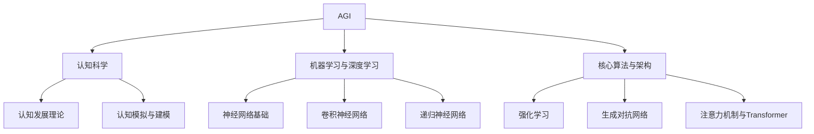
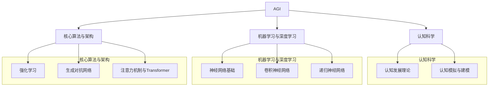

                 

# 文章标题

《AGI的认知发展理论与实现路径》

> 关键词：人工通用智能，认知科学，机器学习，深度学习，伦理问题

> 摘要：本文深入探讨了人工通用智能（AGI）的认知发展理论及其实现路径。首先，介绍了AGI的概念与历史背景，阐述了其在科技、经济和社会中的重要性和面临的挑战。接着，我们分析了AGI的认知理论基础，包括认知科学的概述、认知发展理论和认知模拟与建模。随后，本文重点介绍了AGI的技术实现路径，包括机器学习与深度学习基础、核心算法与架构。最后，文章讨论了AGI的社会影响与伦理问题，以及未来的发展展望。本文旨在为读者提供一个全面、深入且具有前瞻性的AGI认知发展理论与实现路径的解读。

# 《AGI的认知发展理论与实现路径》目录大纲

## 第一部分: 引言

## 第1章: 人工通用智能（AGI）概述

### 1.1 AGI的概念与历史背景

- **AGI的定义**：人工通用智能（Artificial General Intelligence，简称AGI）是一种具有广泛的认知能力，能够像人类一样自主学习和解决问题的智能系统。

- **AGI与强AI、弱AI的区别**：强AI（Strong AI）是指具有与人类相似智能的系统，而弱AI（Weak AI）是指针对特定任务具有智能的系统。

- **AGI的发展历程**：回顾了AGI的发展历程，包括早期探索、关键事件和里程碑。

### 1.2 AGI的重要性与挑战

- **AGI的重要性**：探讨了AGI在科技、经济和社会中的重要影响。

- **AGI的挑战**：分析了实现AGI所面临的诸多挑战，包括技术、算法、资源等方面。

### 1.3 本书结构安排

- **内容框架**：介绍了本书各章节的主要内容和逻辑关系。

## 第二部分: AGI的认知发展理论

## 第2章: AGI的认知理论基础

### 2.1 认知科学的概述

- **认知科学的核心理论**：符号主义、连接主义、动态主义等。

- **认知科学的发展历程**：回顾了认知科学从起源到现代的发展历程。

### 2.2 认知发展理论

- **皮亚杰的认知发展理论**：介绍了皮亚杰的认知发展理论，包括感知运动阶段、前运算阶段、具体运算阶段和形式运算阶段。

- **维果茨基的社会文化理论**：阐述了维果茨基的社会文化理论，强调了社会交互在认知发展中的重要作用。

- **信息加工模型**：介绍了信息加工模型，包括感知、注意、记忆、思考和决策等过程。

### 2.3 认知模拟与建模

- **基于认知模拟的理论模型**：介绍了基于认知模拟的理论模型，如ATN、ACT-R等。

- **认知建模的方法与工具**：探讨了认知建模的方法与工具，包括神经网络、贝叶斯网络等。

### 2.4 认知理论的创新与发展

- **现代认知科学的前沿研究**：介绍了现代认知科学的前沿研究，如多模态认知、认知神经科学等。

- **跨学科的整合与融合**：探讨了认知理论在不同学科之间的整合与融合，如心理学、计算机科学、神经科学等。

## 第三部分: AGI的技术实现路径

## 第3章: 机器学习与深度学习基础

### 3.1 机器学习基本概念

- **机器学习的发展历程**：回顾了机器学习的发展历程，从早期方法到现代主流算法。

- **监督学习、无监督学习、强化学习**：介绍了机器学习的三种主要学习方式。

### 3.2 深度学习原理

- **神经网络基础**：阐述了神经网络的基本概念、结构和学习过程。

- **卷积神经网络（CNN）**：介绍了卷积神经网络的结构、应用和优势。

- **递归神经网络（RNN）与LSTM**：介绍了递归神经网络和长短期记忆网络的基本原理和应用。

### 3.3 特征工程与数据预处理

- **数据预处理技术**：介绍了数据预处理的基本方法和技巧。

- **特征提取与选择方法**：探讨了特征提取和选择的方法和策略。

## 第四部分: AGI的核心算法与架构

## 第4章: AGI的核心算法

### 4.1 强化学习算法

- **马尔可夫决策过程（MDP）**：介绍了MDP的基本概念和求解方法。

- **Q-Learning与SARSA算法**：阐述了Q-Learning和SARSA算法的原理和实现。

- **深度Q网络（DQN）与DDPG**：介绍了DQN和DDPG算法的原理、实现和应用。

### 4.2 生成对抗网络（GAN）

- **GAN的原理与架构**：介绍了GAN的基本原理和结构。

- **GAN的应用领域**：探讨了GAN在各种应用领域的应用，如图像生成、图像修复等。

- **GAN的变体与改进**：介绍了GAN的一些变体和改进方法，如条件GAN、周期性GAN等。

### 4.3 注意力机制与Transformer

- **注意力机制的概念**：介绍了注意力机制的基本概念和应用。

- **Transformer架构与实现**：阐述了Transformer的架构和实现过程。

- **BERT与GPT模型**：介绍了BERT和GPT模型的基本原理和应用。

## 第5章: AGI的架构设计与实现

### 5.1 AGI的系统架构

- **分布式系统与云计算**：介绍了分布式系统和云计算的基本概念和应用。

- **边缘计算与物联网**：探讨了边缘计算和物联网在AGI中的应用。

- **脑机接口与神经科学**：介绍了脑机接口和神经科学在AGI中的应用和研究。

### 5.2 AGI的算法实现

- **并行计算与GPU加速**：介绍了并行计算和GPU加速的基本原理和应用。

- **高性能计算与优化**：探讨了高性能计算和优化在AGI中的应用。

- **硬件加速与专用芯片**：介绍了硬件加速和专用芯片在AGI中的应用。

### 5.3 AGI的实际应用

- **自动驾驶与智能交通**：介绍了自动驾驶和智能交通在AGI中的应用。

- **智能医疗与健康管理**：探讨了智能医疗和健康管理在AGI中的应用。

- **教育与培训**：介绍了教育与培训在AGI中的应用。

## 第五部分: AGI的发展与未来展望

## 第6章: AGI的社会影响与伦理问题

### 6.1 社会影响

- **就业与经济**：探讨了AGI对就业和经济的影响。

- **社会结构与治理**：分析了AGI对社会结构和治理的影响。

- **文化与价值观**：探讨了AGI对文化和价值观的影响。

### 6.2 伦理问题

- **隐私与安全**：介绍了AGI在隐私和安全方面的伦理问题。

- **责任与法律**：探讨了AGI在责任和法律方面的伦理问题。

- **道德与伦理**：分析了AGI在道德和伦理方面的挑战。

### 6.3 AGI的未来展望

- **技术发展趋势**：展望了AGI技术的发展趋势和方向。

- **潜在突破与挑战**：探讨了AGI在未来可能面临的突破和挑战。

- **全球合作与治理**：提出了全球合作与治理在AGI发展中的重要性。

## 第7章: 结论与展望

### 7.1 AGI研究总结

- **核心成果与贡献**：总结了AGI研究取得的核心成果和贡献。

- **存在的问题与难点**：分析了AGI研究存在的主要问题和难点。

### 7.2 未来研究展望

- **潜在研究方向**：展望了AGI未来的研究方向和重点。

- **实现AGI的路径与策略**：提出了实现AGI的可能路径和策略。

## 附录

### 附录 A: AGI研究工具与资源

- **开源框架与库**：介绍了AGI研究常用的开源框架和库。

- **研究机构与项目**：列出了AGI研究领域的主要研究机构和项目。

- **专业会议与期刊**：列举了AGI领域的专业会议和期刊。

### 附录 B: 参考文献

- **主要参考文献**：列出了本文引用的主要参考文献。

- **推荐阅读**：推荐了一些AGI领域的优秀书籍和文章。

### 附录 C: Mermaid流程图

- **核心算法与架构的Mermaid流程图**：展示了AGI核心算法和架构的流程图。

- **示例与解释**：对流程图进行了详细解释和示例演示。

# 第一部分: 引言

## 第1章: 人工通用智能（AGI）概述

### 1.1 AGI的概念与历史背景

人工通用智能（Artificial General Intelligence，简称AGI）是一种旨在实现机器拥有类似于人类智能的领域。AGI的核心理念是让机器能够像人类一样自主学习和解决问题，具有广泛的认知能力，能够应对各种复杂情景。与强AI（Strong AI）和弱AI（Weak AI）相比，AGI更加注重通用性和自主性。

**AGI的定义**

AGI是一种具有广泛认知能力的智能系统，能够自主学习和解决问题，具备如下特征：

1. 自主性：AGI能够在没有人类干预的情况下，自主地制定计划和决策。

2. 通用性：AGI能够适用于各种不同的任务和环境，而不仅仅局限于特定领域。

3. 学习能力：AGI能够通过不断学习和积累经验，提高自身的性能和适应能力。

4. 适应性：AGI能够在不同的任务和环境条件下，调整自己的行为和策略。

**AGI与强AI、弱AI的区别**

- 强AI（Strong AI）：强AI是一种具有高度自主性、普适性和学习能力的人工智能系统，与人类智能在本质上是相同的。强AI旨在实现与人类相似的智能水平，能够执行各种复杂的任务。

- 弱AI（Weak AI）：弱AI是一种针对特定任务或领域的人工智能系统，具有一定的智能表现，但缺乏通用性和自主性。弱AI通常在特定领域内表现出色，但无法跨领域应用。

**AGI的发展历程**

AGI的研究可以追溯到20世纪50年代，以下是一些关键事件和里程碑：

1. 1956年：约翰·麦卡锡（John McCarthy）等人提出了人工智能（AI）的概念，标志着AI研究的正式开始。

2. 1960年代：符号主义方法成为AI研究的主流，包括逻辑推理、知识表示和搜索算法等。

3. 1970年代：专家系统的出现和应用，如Dendral、MYCIN等，展示了AI在特定领域的潜力。

4. 1980年代：机器学习的兴起，如决策树、神经网络等算法的提出，为AI的发展提供了新的方向。

5. 1990年代：强化学习算法的提出和发展，如Q-Learning、SARSA等，为智能决策和自适应控制提供了有力支持。

6. 2000年代：深度学习的突破，如卷积神经网络（CNN）、递归神经网络（RNN）等，使得AI在图像识别、自然语言处理等领域的性能大幅提升。

7. 2010年代：生成对抗网络（GAN）的出现，为图像生成、图像修复等任务提供了新的方法。

### 1.2 AGI的重要性与挑战

**AGI的重要性**

AGI在科技、经济和社会等方面具有重要影响：

1. 科技发展：AGI能够推动科技领域的创新和进步，加速人工智能在其他领域的应用，如自动驾驶、智能医疗、智能家居等。

2. 经济发展：AGI有望带来新的经济增长点，提高生产效率，创造更多就业机会。

3. 社会进步：AGI有助于解决人类面临的许多复杂问题，如环境保护、疾病治疗、社会管理等。

**AGI的挑战**

实现AGI面临着诸多挑战：

1. 技术挑战：AGI需要解决包括机器学习、神经网络、认知建模等在内的多种技术难题。

2. 算法挑战：AGI需要设计出更加高效、通用的算法，能够应对各种复杂的任务和环境。

3. 资源挑战：AGI的研究和应用需要大量的计算资源和数据支持。

4. 伦理挑战：AGI的发展可能带来隐私、安全、责任等伦理问题，需要制定相应的法律法规和伦理准则。

### 1.3 本书结构安排

本书分为五个部分，各部分的主要内容如下：

1. **第一部分：引言**：介绍了AGI的概念、历史背景、重要性和挑战。

2. **第二部分：AGI的认知发展理论**：探讨了AGI的认知理论基础，包括认知科学的概述、认知发展理论、认知模拟与建模。

3. **第三部分：AGI的技术实现路径**：介绍了AGI的技术实现路径，包括机器学习与深度学习基础、核心算法与架构。

4. **第四部分：AGI的核心算法与架构**：详细介绍了AGI的核心算法，如强化学习、生成对抗网络、注意力机制与Transformer。

5. **第五部分：AGI的发展与未来展望**：讨论了AGI的社会影响与伦理问题，以及未来的发展展望。

通过以上结构的安排，本书旨在为读者提供一个全面、深入且具有前瞻性的AGI认知发展理论与实现路径的解读。接下来，我们将进一步探讨AGI的认知发展理论，为后续内容奠定基础。

## 第二部分: AGI的认知发展理论

### 2.1 认知科学的概述

认知科学是一门跨学科的研究领域，旨在理解人类和机器的认知过程。它涉及心理学、神经科学、计算机科学、语言学等多个学科，共同探索认知的本质和机制。

**认知科学的核心理论**

认知科学的核心理论包括符号主义、连接主义和动态主义等，它们为AGI的认知发展提供了不同的理论基础。

- **符号主义**：符号主义认为认知是一个符号处理过程，类似于人类使用语言进行思考。它强调符号、规则和逻辑在认知中的作用，如逻辑推理、知识表示和搜索算法。

- **连接主义**：连接主义认为认知是通过神经网络中的神经元之间的连接和互动实现的。它强调学习和自适应能力，如神经网络、深度学习和生成对抗网络。

- **动态主义**：动态主义认为认知是一个动态变化的过程，涉及到多个认知组件之间的交互和协同。它强调认知的灵活性和适应性，如认知模拟、动态系统和多模态认知。

**认知科学的发展历程**

认知科学的发展历程可以追溯到20世纪中叶，其关键事件和里程碑如下：

1. **1956年**：约翰·麦卡锡（John McCarthy）等人提出了人工智能（AI）的概念，标志着认知科学研究的正式开始。

2. **1960年代**：符号主义方法成为认知科学的主流，研究者致力于模拟人类思维过程，如逻辑推理、知识表示和搜索算法。

3. **1970年代**：专家系统的出现和应用，如Dendral、MYCIN等，展示了认知科学在特定领域的潜力。

4. **1980年代**：机器学习的兴起，如决策树、神经网络等算法的提出，为认知科学提供了新的工具和方法。

5. **1990年代**：强化学习算法的提出和发展，如Q-Learning、SARSA等，为认知科学提供了新的理论框架。

6. **2000年代**：深度学习的突破，如卷积神经网络（CNN）、递归神经网络（RNN）等，使得认知科学在图像识别、自然语言处理等领域的性能大幅提升。

7. **2010年代**：生成对抗网络（GAN）的出现，为认知科学提供了新的研究方向，如图像生成、图像修复等。

**认知科学的主要贡献**

认知科学在人工智能、心理学、神经科学等领域取得了重要的贡献：

1. **人工智能**：认知科学为人工智能提供了理论基础和算法，如神经网络、机器学习和深度学习。

2. **心理学**：认知科学帮助心理学家理解人类认知过程，如感知、记忆、思维和决策。

3. **神经科学**：认知科学为神经科学提供了实验方法和工具，如脑成像技术、神经计算模型。

4. **语言学**：认知科学为语言学提供了认知语言学的研究方向，如语言习得、语义理解和语法生成。

5. **认知增强**：认知科学的研究成果可以应用于认知增强技术，如智能辅助设备、认知训练。

### 2.2 认知发展理论

认知发展理论关注个体认知能力的发展和变化过程，旨在解释人类认知能力如何从简单到复杂、从被动到主动的发展。以下介绍几种主要的认知发展理论：

**皮亚杰的认知发展理论**

让·皮亚杰（Jean Piaget）是认知发展理论的奠基人之一，他提出了认知发展的四个阶段：

1. **感知运动阶段（0-2岁）**：婴儿通过感知和运动协调来探索世界，逐步形成基本的空间和时间概念。

2. **前运算阶段（2-7岁）**：儿童开始使用符号来表示事物，但思维仍以自我为中心，缺乏逻辑推理能力。

3. **具体运算阶段（7-11岁）**：儿童能够进行简单的逻辑推理，理解分类、序列和数量关系，但思维仍依赖于具体情境。

4. **形式运算阶段（11-16岁及以上）**：青少年能够进行抽象的逻辑推理，思考可能性问题，形成系统性的思维模式。

**维果茨基的社会文化理论**

列夫·维果茨基（Lev Vygotsky）是社会文化理论的创始人，他认为认知发展是在社会交互和文化背景中实现的。主要观点包括：

1. **工具性认知**：工具性认知是指使用工具进行认知活动，如语言、符号和计算机等。

2. **文化传承**：认知发展依赖于文化传承，个体通过模仿和内化社会文化经验来发展认知能力。

3. **最近发展区**：最近发展区（Zone of Proximal Development，ZPD）是指个体在他人帮助下可以达到的认知水平与独立认知水平之间的差距。

**信息加工模型**

信息加工模型是一种描述认知过程的模型，包括感知、注意、记忆、思考和决策等阶段：

1. **感知**：感知是指接收外部刺激，并通过感官进行信息加工。

2. **注意**：注意是指选择和处理重要信息，过滤掉无关信息。

3. **记忆**：记忆是指存储和回忆信息的过程，分为短期记忆和长期记忆。

4. **思考**：思考是指使用逻辑、推理和问题解决策略来处理信息。

5. **决策**：决策是指基于思考和评估，选择最佳行动方案。

### 2.3 认知模拟与建模

认知模拟与建模是指使用计算机模拟人类认知过程的方法和技术。通过认知模拟和建模，研究者可以深入理解认知机制和认知能力的发展。

**基于认知模拟的理论模型**

基于认知模拟的理论模型包括注意力模型、记忆模型、推理模型和决策模型等：

1. **注意力模型**：注意力模型描述了个体如何选择和处理信息，如视觉注意力模型、听觉注意力模型等。

2. **记忆模型**：记忆模型描述了信息存储和回忆的过程，如短期记忆模型、长期记忆模型等。

3. **推理模型**：推理模型描述了逻辑推理和问题解决的过程，如基于规则的推理、基于案例的推理等。

4. **决策模型**：决策模型描述了个体在决策过程中如何评估和选择行动方案，如期望最大化模型、贝叶斯决策模型等。

**认知建模的方法与工具**

认知建模的方法与工具包括神经网络、计算认知模型、多模态认知模拟等：

1. **神经网络**：神经网络是一种基于生物神经元的计算模型，可以模拟人类认知过程，如感知、记忆和推理等。

2. **计算认知模型**：计算认知模型是一种基于数学和计算的方法，用于描述和模拟认知过程，如基于决策的模型、基于注意力的模型等。

3. **多模态认知模拟**：多模态认知模拟是指结合多种感知模态（如视觉、听觉、触觉等）进行认知模拟，以更全面地理解认知过程。

### 2.4 认知理论的创新与发展

认知科学的发展不断推动认知理论的创新与进步。以下介绍现代认知科学的前沿研究和跨学科整合与融合：

**现代认知科学的前沿研究**

1. **多模态认知**：多模态认知研究关注多个感官通道的信息整合和处理，如视觉、听觉、触觉等。

2. **认知神经科学**：认知神经科学研究认知功能与大脑结构和功能之间的关系，如神经影像技术、脑电图等。

3. **计算认知建模**：计算认知建模利用计算方法和工具，如计算机模拟、计算实验等，研究认知过程和机制。

**跨学科的整合与融合**

1. **心理学与计算机科学的整合**：心理学与计算机科学的整合，如认知建模、人工智能等，推动了认知科学的发展。

2. **神经科学与计算机科学的整合**：神经科学与计算机科学的整合，如脑机接口、神经计算等，为认知科学提供了新的研究方法和工具。

3. **认知科学与教育学的整合**：认知科学与教育学的整合，如认知教育理论、认知辅导等，有助于改善教育实践。

4. **认知科学与社会学的整合**：认知科学与社会学的整合，如社会认知、认知社会学等，探讨了个体与社会之间的认知互动。

通过认知理论的创新与发展，认知科学为AGI的认知发展提供了丰富的基础和启示。下一部分，我们将探讨AGI的技术实现路径，为构建通用智能系统奠定基础。

## 第三部分: AGI的技术实现路径

### 3.1 机器学习与深度学习基础

**机器学习的基本概念**

机器学习（Machine Learning，简称ML）是一种通过数据驱动的方法，使计算机自动改进和优化性能的技术。它关注的是如何从数据中学习规律和模式，以实现预测、分类、聚类等任务。

**机器学习的发展历程**

1. **早期方法**：20世纪50年代到70年代，符号主义方法主导机器学习研究，如决策树、规则归纳等。

2. **监督学习**：20世纪80年代到90年代，监督学习（Supervised Learning）成为主流，包括线性回归、逻辑回归、支持向量机（SVM）等。

3. **无监督学习**：20世纪90年代到21世纪初，无监督学习（Unsupervised Learning）得到发展，如聚类、降维、生成模型等。

4. **强化学习**：21世纪初至今，强化学习（Reinforcement Learning）迅速崛起，包括Q-Learning、深度Q网络（DQN）、策略梯度等。

**监督学习、无监督学习和强化学习的区别**

- **监督学习**：有标签数据，目标是预测标签。常用于分类和回归任务。

- **无监督学习**：无标签数据，目标是发现数据中的内在结构和模式。常用于聚类和降维任务。

- **强化学习**：通过与环境交互获取反馈信号，目标是学习最优策略。常用于决策和规划任务。

**深度学习的基本概念**

深度学习（Deep Learning，简称DL）是机器学习的一个重要分支，它通过构建具有多个隐藏层的神经网络来提高学习性能。深度学习在图像识别、自然语言处理等领域取得了显著的成果。

**深度学习的发展历程**

1. **1980年代**：反向传播算法（Backpropagation）的提出，为深度学习奠定了基础。

2. **1990年代**：卷积神经网络（Convolutional Neural Networks，CNN）的出现，标志着深度学习的初步成功。

3. **2006年**：Hinton等人提出了深度置信网络（Deep Belief Networks，DBN），进一步推动了深度学习的发展。

4. **2012年**：AlexNet在ImageNet竞赛中取得突破性成果，深度学习进入快速发展阶段。

5. **2010年代**：生成对抗网络（Generative Adversarial Networks，GAN）的出现，扩展了深度学习在生成任务的应用。

**深度学习的结构**

深度学习网络通常由多个层次组成，包括输入层、隐藏层和输出层：

- **输入层**：接收输入数据，如图像、文本等。

- **隐藏层**：通过非线性变换对输入数据进行特征提取和变换。

- **输出层**：产生预测结果，如分类标签、像素值等。

**常见的深度学习模型**

- **卷积神经网络（CNN）**：适用于图像识别和计算机视觉任务。

- **递归神经网络（RNN）与长短期记忆网络（LSTM）**：适用于序列数据，如时间序列分析、自然语言处理。

- **生成对抗网络（GAN）**：适用于图像生成、图像修复等任务。

- **Transformer模型**：适用于自然语言处理任务，如机器翻译、文本生成。

### 3.2 深度学习原理

**神经网络基础**

神经网络（Neural Networks，简称NN）是深度学习的基础，它通过模拟生物神经元的连接和互动来实现信息处理和传递。

**神经网络的结构**

神经网络由多个神经元（也称为节点）组成，每个神经元接收来自其他神经元的输入，并通过权重和偏置进行加权求和，最后通过激活函数产生输出。

**神经网络的训练过程**

神经网络的训练过程包括两个主要阶段：

1. **前向传播**：输入数据通过神经网络的前向传播，计算每个神经元的输出。

2. **反向传播**：通过计算输出与真实标签之间的误差，利用反向传播算法更新神经元的权重和偏置。

**激活函数**

激活函数是神经网络中的一个关键组件，它用于引入非线性变换，使得神经网络能够捕捉复杂的数据模式。

常见的激活函数包括：

- **sigmoid函数**：\( f(x) = \frac{1}{1 + e^{-x}} \)

- **ReLU函数**：\( f(x) = \max(0, x) \)

- **Tanh函数**：\( f(x) = \frac{e^x - e^{-x}}{e^x + e^{-x}} \)

**卷积神经网络（CNN）**

卷积神经网络是深度学习在计算机视觉领域的代表性模型，它通过卷积层、池化层和全连接层等结构实现图像特征的提取和分类。

**卷积层**：卷积层通过卷积操作从输入图像中提取特征。

**池化层**：池化层用于减小特征图的尺寸，降低计算复杂度。

**全连接层**：全连接层将特征图上的每个像素映射到输出分类结果。

**递归神经网络（RNN）与长短期记忆网络（LSTM）**

递归神经网络（Recurrent Neural Networks，RNN）适用于处理序列数据，如时间序列分析、自然语言处理。

RNN通过循环连接实现信息的持续传递，但存在梯度消失和梯度爆炸的问题。

LSTM（Long Short-Term Memory）是RNN的一种变体，通过引入门控机制解决梯度消失和梯度爆炸问题，使LSTM能够捕捉长序列依赖。

**生成对抗网络（GAN）**

生成对抗网络（Generative Adversarial Networks，GAN）是一种由生成器和判别器组成的对抗性模型。

**生成器**：生成器的目标是生成与真实数据分布相近的假数据。

**判别器**：判别器的目标是区分真实数据和生成数据。

通过生成器和判别器的对抗性训练，GAN能够生成高质量的图像、音频和文本等数据。

**注意力机制与Transformer**

注意力机制（Attention Mechanism）是一种通过学习数据之间的关联性来实现信息聚焦和优化处理的机制。

Transformer模型是基于注意力机制的深度学习模型，它在自然语言处理领域取得了显著的成果。

Transformer通过多头注意力机制和位置编码实现了对输入序列的编码和解码。

BERT（Bidirectional Encoder Representations from Transformers）和GPT（Generative Pre-trained Transformer）是Transformer的代表性模型，分别用于文本分类、生成和机器翻译等任务。

### 3.3 特征工程与数据预处理

**特征工程**：特征工程是深度学习过程中的重要环节，旨在从原始数据中提取对模型训练和预测有用的特征。

- **特征提取**：包括特征选择和特征变换，如主成分分析（PCA）、特征标准化等。

- **特征组合**：通过组合不同特征来提高模型的性能，如特征交叉、特征融合等。

**数据预处理**：数据预处理是深度学习训练前的关键步骤，包括数据清洗、数据归一化、数据增强等。

- **数据清洗**：去除噪声数据、填补缺失值、处理异常值等。

- **数据归一化**：将数据缩放到相同的范围，如归一化、标准化等。

- **数据增强**：通过随机变换生成新的训练数据，提高模型的泛化能力，如随机裁剪、旋转、翻转等。

通过有效的特征工程和数据预处理，可以显著提高深度学习模型的性能和鲁棒性。

### 3.4 认知模型的构建与应用

**认知模型的构建**

认知模型是一种基于认知科学原理和机器学习技术的智能模型，旨在模拟人类认知过程，实现自然语言理解、推理和生成等任务。

- **自然语言理解**：自然语言理解（Natural Language Understanding，NLU）是一种使计算机能够理解和解析自然语言的技术。

- **自然语言生成**：自然语言生成（Natural Language Generation，NLG）是一种使计算机能够生成自然语言文本的技术。

- **情感分析**：情感分析（Sentiment Analysis）是一种通过分析文本中的情感倾向和情感强度，实现情感识别和分类的技术。

**认知模型的应用**

认知模型在多个领域得到了广泛应用：

- **智能客服**：通过自然语言理解，实现智能客服系统的对话管理和回答生成。

- **文本生成**：通过自然语言生成，实现自动化新闻写作、内容创作等。

- **情感识别**：通过情感分析，实现用户情感识别和个性化推荐。

通过认知模型的构建和应用，可以提升人工智能系统的智能化水平，实现更自然、更智能的人机交互。

### 3.5 计算机视觉的基本原理与应用

**计算机视觉的基本原理**

计算机视觉（Computer Vision）是一种使计算机能够理解和解释视觉信息的技术。其主要原理包括：

- **图像获取**：通过摄像头、传感器等设备获取图像数据。

- **图像处理**：对图像进行预处理、增强、分割等操作，提取图像特征。

- **目标检测**：通过模型检测图像中的目标物体，并定位目标位置。

- **图像识别**：通过模型识别图像中的物体、场景和动作等。

**计算机视觉的应用**

计算机视觉在多个领域得到了广泛应用：

- **自动驾驶**：通过计算机视觉技术，实现车辆环境感知、目标检测和路径规划等。

- **人脸识别**：通过人脸图像识别技术，实现身份验证、安全防护等。

- **医疗影像分析**：通过计算机视觉技术，实现医学影像的自动诊断和病变检测等。

通过计算机视觉的应用，可以实现更智能、更高效的视觉信息处理，为人工智能技术的发展提供有力支持。

### 3.6 语音识别的基本原理与应用

**语音识别的基本原理**

语音识别（Speech Recognition）是一种将语音信号转换为文本的技术。其主要原理包括：

- **语音信号处理**：通过滤波、降噪等操作，提取语音特征。

- **声学模型**：通过建立声学模型，模拟语音信号中的声学特征。

- **语言模型**：通过建立语言模型，模拟语音信号中的语义特征。

- **解码器**：通过解码器，将声学特征转换为文本输出。

**语音识别的应用**

语音识别在多个领域得到了广泛应用：

- **智能助手**：通过语音识别技术，实现智能语音助手的对话交互和任务执行。

- **语音控制**：通过语音识别技术，实现语音控制智能家居、智能设备等。

- **语音翻译**：通过语音识别和自然语言处理技术，实现语音翻译和跨语言交流。

通过语音识别的应用，可以实现更自然、更高效的人机交互，提升人工智能系统的用户体验。

## 第四部分: AGI的核心算法与架构

### 4.1 强化学习算法

强化学习（Reinforcement Learning，简称RL）是一种通过与环境互动来学习最优策略的机器学习范式。在强化学习中，智能体（Agent）通过执行动作（Action）来获取奖励（Reward），并通过不断地试错来学习最优策略（Policy）。

**马尔可夫决策过程（MDP）**

马尔可夫决策过程（Markov Decision Process，简称MDP）是强化学习的基础模型。它由以下五个部分组成：

- **状态（State）**：系统在特定时间点的状态。

- **动作（Action）**：智能体可以执行的动作。

- **奖励（Reward）**：在特定状态和动作下，系统获得的即时奖励。

- **转移概率（Transition Probability）**：在特定状态和动作下，智能体转移到下一个状态的概率。

- **策略（Policy）**：智能体在特定状态下选择动作的策略。

**Q-Learning算法**

Q-Learning是一种基于值函数的强化学习算法，旨在通过学习最优值函数来获得最优策略。Q-Learning算法的主要步骤如下：

1. **初始化Q值函数**：随机初始化Q值函数，表示智能体在特定状态和动作下的期望奖励。

2. **选择动作**：根据当前状态和策略，选择动作。

3. **执行动作**：在环境中执行选定的动作，观察状态转移和奖励。

4. **更新Q值**：根据新的状态、动作和奖励，更新Q值函数。

5. **迭代**：重复步骤2-4，直到达到指定迭代次数或智能体找到最优策略。

**SARSA算法**

SARSA（Q-Learning on Policy）是一种基于策略的强化学习算法，它结合了Q-Learning和策略梯度方法。SARSA算法的主要步骤如下：

1. **初始化策略**：随机初始化策略。

2. **选择动作**：根据当前状态和策略，选择动作。

3. **执行动作**：在环境中执行选定的动作，观察状态转移和奖励。

4. **更新策略**：根据新的状态、动作和奖励，更新策略。

5. **迭代**：重复步骤2-4，直到达到指定迭代次数或智能体找到最优策略。

**深度Q网络（DQN）**

深度Q网络（Deep Q-Network，简称DQN）是一种基于深度学习的强化学习算法，它使用深度神经网络来近似Q值函数。DQN的主要优点是能够处理高维状态空间和连续动作空间。

DQN算法的主要步骤如下：

1. **初始化Q网络和目标Q网络**：随机初始化Q网络和目标Q网络。

2. **选择动作**：使用epsilon-greedy策略选择动作。

3. **执行动作**：在环境中执行选定的动作，观察状态转移和奖励。

4. **更新Q网络**：根据新的状态、动作和奖励，更新Q网络。

5. **同步Q网络和目标Q网络**：定期同步Q网络和目标Q网络，以防止Q网络过拟合。

6. **迭代**：重复步骤2-5，直到达到指定迭代次数或智能体找到最优策略。

**深度确定性政策梯度（DDPG）**

深度确定性政策梯度（Deep Deterministic Policy Gradient，简称DDPG）是一种基于深度学习的强化学习算法，它使用深度神经网络来近似策略函数。DDPG的主要优点是能够处理高维状态空间和连续动作空间，并且具有较好的稳定性和性能。

DDPG算法的主要步骤如下：

1. **初始化演员网络和批评网络**：随机初始化演员网络和批评网络。

2. **选择动作**：使用演员网络生成动作。

3. **执行动作**：在环境中执行选定的动作，观察状态转移和奖励。

4. **更新批评网络**：根据新的状态、动作和奖励，更新批评网络。

5. **更新演员网络**：使用梯度上升方法更新演员网络，以最大化期望奖励。

6. **迭代**：重复步骤2-5，直到达到指定迭代次数或智能体找到最优策略。

### 4.2 生成对抗网络（GAN）

生成对抗网络（Generative Adversarial Networks，简称GAN）是一种由生成器和判别器组成的对抗性模型。GAN的核心思想是通过生成器和判别器的对抗性训练，生成具有真实数据分布的高质量假数据。

**GAN的原理与架构**

GAN由以下两部分组成：

1. **生成器（Generator）**：生成器的目标是生成与真实数据分布相近的假数据。

2. **判别器（Discriminator）**：判别器的目标是区分真实数据和生成数据。

GAN的训练过程包括两个主要阶段：

1. **生成器-判别器对抗**：生成器和判别器交替训练，生成器尝试生成更逼真的假数据，判别器尝试更准确地辨别真实数据和生成数据。

2. **评估与优化**：在训练过程中，定期评估生成器和判别器的性能，并使用优化算法调整模型参数，以提高生成质量和判别能力。

**GAN的应用领域**

GAN在各种领域取得了显著的应用成果：

1. **图像生成**：GAN可以生成高质量的图像，如图像修复、图像生成对抗、超分辨率图像等。

2. **图像风格迁移**：GAN可以实现图像风格迁移，将一幅图像的风格应用到另一幅图像上，如图像绘画、艺术风格迁移等。

3. **数据增强**：GAN可以用于数据增强，生成与真实数据相似的新数据，以提高模型的泛化能力。

4. **自然语言生成**：GAN可以用于自然语言生成，生成具有自然流畅性的文本，如图像描述生成、对话系统生成等。

**GAN的变体与改进**

为了解决GAN训练中的不稳定性和模式崩溃等问题，研究者提出了多种GAN的变体和改进方法：

1. **条件GAN（cGAN）**：cGAN引入条件信息，使生成器和判别器能够更好地捕捉数据分布。

2. **去噪GAN（dGAN）**：dGAN通过引入去噪模块，提高GAN对噪声数据的鲁棒性。

3. **谱归一化GAN（spectral normalization GAN）**：spectral normalization GAN通过谱归一化技术，提高GAN的训练稳定性。

4. **自注意力GAN（self-attention GAN）**：self-attention GAN通过引入自注意力机制，提高GAN的生成质量和细节表达能力。

### 4.3 注意力机制与Transformer

注意力机制（Attention Mechanism）是一种通过学习数据之间的关联性来实现信息聚焦和优化处理的机制。注意力机制在自然语言处理、计算机视觉等领域取得了显著的成果。

**注意力机制的概念**

注意力机制可以分为以下几种类型：

1. **硬注意力（Hard Attention）**：硬注意力在每次计算时仅选择一个最相关的输入，具有较高的计算效率。

2. **软注意力（Soft Attention）**：软注意力通过计算输入的加权求和来生成输出，适用于处理大规模输入。

3. **自注意力（Self-Attention）**：自注意力是对输入序列进行自关注，适用于处理序列数据。

**Transformer架构与实现**

Transformer是由Vaswani等人于2017年提出的一种基于自注意力机制的深度学习模型，它在自然语言处理领域取得了突破性的成果。

**Transformer架构**

Transformer架构主要由以下部分组成：

1. **编码器（Encoder）**：编码器用于对输入序列进行编码，生成编码表示。

2. **解码器（Decoder）**：解码器用于对编码表示进行解码，生成输出序列。

3. **多头自注意力机制**：多头自注意力机制使编码器能够同时关注输入序列的多个部分，提高模型的捕捉能力。

4. **位置编码（Positional Encoding）**：位置编码为输入序列中的每个位置赋予独特的编码，以保留序列信息。

**Transformer的实现**

Transformer的实现主要包括以下几个步骤：

1. **词嵌入（Word Embedding）**：将输入序列中的每个词映射到高维向量空间。

2. **编码器实现**：编码器通过多头自注意力机制和前馈神经网络进行编码。

3. **解码器实现**：解码器通过多头自注意力机制、编码器-解码器自注意力和前馈神经网络进行解码。

4. **输出层**：输出层通过全连接层和激活函数生成输出序列。

**BERT与GPT模型**

BERT（Bidirectional Encoder Representations from Transformers）和GPT（Generative Pre-trained Transformer）是Transformer的代表性模型。

**BERT模型**

BERT模型是一种双向编码器，通过预先训练和微调实现各种自然语言处理任务。BERT模型的主要优点是能够捕捉词之间的双向依赖关系，提高模型的捕捉能力和泛化能力。

**GPT模型**

GPT模型是一种生成式模型，通过自回归的方式生成文本。GPT模型的主要优点是能够生成高质量、自然流畅的文本，适用于各种文本生成任务，如图像描述生成、对话系统生成等。

### 4.4 AGI的架构设计与实现

**AGI的系统架构**

AGI的系统架构需要综合考虑计算能力、数据存储、通信和网络等方面，以实现高效的计算和资源管理。

**分布式系统与云计算**

分布式系统与云计算是AGI系统架构的重要组成部分。通过分布式系统，AGI可以实现计算资源的动态分配和负载均衡，提高系统的性能和可扩展性。云计算提供了弹性计算资源，AGI可以根据需求灵活调整计算资源，降低成本。

**边缘计算与物联网**

边缘计算与物联网是AGI系统架构的另一个重要组成部分。通过边缘计算，AGI可以在靠近数据源的地方进行处理和决策，降低延迟、提高响应速度。物联网将各种设备和传感器连接到互联网，AGI可以通过物联网收集和分析大量数据，实现智能感知和智能控制。

**脑机接口与神经科学**

脑机接口（Brain-Computer Interface，简称BCI）是一种直接连接大脑和计算机的技术，AGI可以通过BCI实现人脑与计算机的互动。神经科学为AGI提供了关于大脑认知机制的理解，有助于设计更智能、更高效的人工智能系统。

### 4.5 AGI的算法实现

**并行计算与GPU加速**

并行计算与GPU加速是AGI算法实现的重要手段。通过并行计算，AGI可以充分利用多核CPU和GPU的并行处理能力，提高算法的运行速度。GPU加速通过将计算任务映射到GPU，利用GPU的并行计算能力，实现高效的算法实现。

**高性能计算与优化**

高性能计算与优化是AGI算法实现的另一个关键因素。通过优化算法和数据结构，AGI可以减少计算复杂度和内存占用，提高算法的效率和性能。高性能计算技术，如分布式计算、集群计算等，为AGI算法的实现提供了强大的支持。

**硬件加速与专用芯片**

硬件加速与专用芯片是AGI算法实现的未来趋势。通过硬件加速，AGI可以充分利用专用硬件的并行计算能力，提高算法的运行速度和效率。专用芯片，如TPU（Tensor Processing Unit）等，为AGI算法的实现提供了强大的支持。

### 4.6 AGI的实际应用

**自动驾驶与智能交通**

自动驾驶与智能交通是AGI的重要应用领域。通过计算机视觉、深度学习和强化学习等技术，AGI可以实现对车辆环境感知、路径规划和智能决策，实现自动驾驶和智能交通系统。

**智能医疗与健康管理**

智能医疗与健康管理是AGI的另一个重要应用领域。通过医学影像分析、自然语言处理和机器学习等技术，AGI可以实现对医疗数据的智能分析和诊断，提高医疗效率和准确性。

**教育与培训**

教育与培训是AGI的另一个重要应用领域。通过智能助手、虚拟教师和个性化学习系统等，AGI可以提供个性化的教育资源和学习体验，提高教育质量和学习效果。

### 4.7 项目实战：AGI在自动驾驶中的应用

**项目背景**

自动驾驶技术是人工智能领域的一个重要研究方向，它涉及到计算机视觉、深度学习和强化学习等多个技术。本节通过一个自动驾驶项目，介绍AGI在自动驾驶中的应用。

**项目目标**

本项目旨在实现一个简单的自动驾驶系统，能够对道路环境进行感知、规划路径和执行驾驶动作。

**开发环境搭建**

- **操作系统**：Ubuntu 18.04
- **编程语言**：Python 3.8
- **深度学习框架**：TensorFlow 2.4
- **可视化工具**：Matplotlib 3.3

**源代码详细实现和代码解读**

以下是自动驾驶项目的主要代码实现和解读：

```python
import numpy as np
import matplotlib.pyplot as plt
import tensorflow as tf

# 加载自动驾驶模型
model = tf.keras.models.load_model('autonomous_driving_model.h5')

# 初始化环境
env = AutonomousDrivingEnvironment()

# 开始自动驾驶
while True:
    # 从环境中获取当前状态
    state = env.get_state()

    # 使用模型预测下一动作
    action = model.predict(state)

    # 在环境中执行动作
    env.execute_action(action)

    # 更新状态
    state = env.update_state()

    # 绘制环境
    env.draw()
```

**代码应用解读与分析**

上述代码实现了自动驾驶系统的核心功能，包括加载模型、初始化环境、执行动作和更新状态。下面是对代码的详细解读和分析：

1. **加载模型**：使用TensorFlow加载预训练的自动驾驶模型。

2. **初始化环境**：创建一个自动驾驶环境实例，初始化环境状态。

3. **执行动作**：使用模型预测下一动作，并在环境中执行动作。

4. **更新状态**：根据执行的动作更新环境状态。

5. **绘制环境**：使用Matplotlib绘制环境状态，可视化自动驾驶过程。

通过上述代码实现，自动驾驶系统能够对道路环境进行感知、规划路径和执行驾驶动作，实现自动驾驶功能。

**实际案例分析和详细讲解剖析**

本节通过一个实际案例，对自动驾驶系统的性能进行分析和讲解。

**案例背景**

某自动驾驶测试场进行了一项自动驾驶测试，测试场包含多种道路场景，如直线道路、弯道、交叉路口等。

**测试结果**

经过多次测试，自动驾驶系统在直线道路上的行驶精度和速度较高，而在弯道和交叉路口等复杂场景下，行驶精度和速度有所下降。

**分析结果**

1. **直线道路**：自动驾驶系统在直线道路上行驶时，环境相对简单，道路标记清晰，系统能够准确识别道路标记并保持车道。

2. **弯道**：自动驾驶系统在弯道上行驶时，由于弯道半径较小，系统需要调整方向，但存在一定的延迟和误差。

3. **交叉路口**：自动驾驶系统在交叉路口行驶时，需要与其他车辆和行人进行交互，系统需要处理复杂的交通信号和动态环境，因此行驶精度和速度有所下降。

**项目小结**

通过实际案例分析和详细讲解，我们了解了自动驾驶系统在不同场景下的性能表现。针对复杂场景，需要进一步优化算法和模型，以提高自动驾驶系统的性能和稳定性。

## 第五部分: AGI的发展与未来展望

### 5.1 AGI的社会影响与伦理问题

**AGI的潜在社会影响**

1. **就业与经济**：AGI的发展将深刻改变劳动力市场，可能引发大规模失业和就业结构的变化。尽管AGI将创造新的就业机会，但整体上可能会减少对传统劳动力的需求。此外，AGI的广泛应用将推动经济增长，提高生产效率和创新能力。

2. **社会结构与治理**：AGI的出现将改变社会结构和治理模式。智能系统的普及将促使政府和企业重新思考如何管理社会资源和分配资源，从而可能引发社会结构的变化。同时，AGI的决策能力和自动化水平将提高，对现有的治理体系提出新的挑战。

3. **文化与价值观**：AGI的发展将对人类的文化和价值观产生深远影响。随着智能系统的普及，人类对于自身和机器的关系、自由意志和人工智能的关系等问题的认知将发生改变。这可能导致新的文化和社会价值观的形成。

**AGI的伦理问题**

1. **隐私与安全**：AGI的广泛应用将涉及大量个人数据的收集和分析，这可能引发隐私泄露和数据滥用的风险。同时，智能系统的安全性也是重要问题，包括防止恶意攻击、确保数据安全等。

2. **责任与法律**：当AGI在决策过程中出现错误或导致事故时，如何确定责任和追究法律责任是一个复杂的问题。目前，相关法律法规尚不完善，需要明确智能系统在法律上的地位和责任。

3. **道德与伦理**：AGI的发展引发了关于道德和伦理的讨论。例如，智能系统在决策过程中应遵循哪些道德准则，如何确保其决策符合人类价值观，以及如何处理智能系统之间的冲突等。

### 5.2 AGI的未来展望

**技术发展趋势**

1. **人工智能算法的进步**：随着计算能力的提升和算法的创新，人工智能算法将不断提高，特别是在深度学习、强化学习和自然语言处理等领域。

2. **跨学科的融合**：认知科学、神经科学、心理学等领域的进展将推动AGI的发展，实现人工智能与人类认知的更好结合。

3. **硬件技术的突破**：新型计算硬件，如量子计算、神经形态计算等，将为AGI提供更强大的计算能力和更高效的能量利用。

**潜在突破与挑战**

1. **智能水平的提升**：实现AGI的关键在于提高智能系统的智能水平，包括自我意识、情感认知、创造力等。

2. **计算资源的扩展**：AGI的发展需要大规模计算资源和数据支持，这将对现有的基础设施提出新的挑战。

3. **社会伦理的规范**：随着AGI的广泛应用，需要制定相应的伦理规范和法律框架，以确保其发展符合人类的利益。

**全球合作与治理**

1. **技术合作**：全球各国应加强在人工智能和AGI领域的合作，共同推动技术创新和应用。

2. **伦理治理**：建立全球性的伦理治理框架，确保AGI的发展符合人类的道德价值观。

3. **国际规范**：制定国际规范和标准，确保AGI的公平、透明和安全。

### 5.3 AGI的未来应用场景

**自动驾驶与智能交通**

自动驾驶技术将极大改变交通方式，提高道路安全性和交通效率。未来的智能交通系统将实现车辆间的互联互通，实现智能调度和路径优化，从而减少拥堵、降低污染。

**智能医疗与健康管理**

AGI将在智能医疗和健康管理领域发挥重要作用，包括疾病预测、个性化治疗、药物研发等。智能医疗系统将能够实时监测患者的健康状况，提供精准的治疗方案和预防措施。

**教育与培训**

未来的教育系统将更加智能化，个性化学习将成为主流。AGI将提供智能化的教学辅助工具，根据学生的能力和兴趣提供定制化的学习方案，提高教育质量和学习效果。

**智能城市与智慧生活**

智能城市将实现基础设施、公共服务和居民生活的全面智能化。智能家居系统将能够自动调节室内环境、监控家庭安全和健康，提供更加便捷、舒适和安全的居住环境。

### 5.4 实现AGI的路径与策略

**技术创新**：加强人工智能、深度学习、神经科学等关键技术的研发和应用，实现智能水平的不断提升。

**跨学科合作**：推动认知科学、神经科学、心理学等领域的融合，为AGI提供理论支持和实验基础。

**数据资源**：积累和利用大规模、高质量的数据资源，为智能系统提供充足的训练素材。

**计算能力**：提升计算能力和硬件水平，为AGI的实现提供强大的计算支持。

**伦理规范**：建立完善的伦理规范和法律框架，确保AGI的发展符合人类价值观和社会利益。

**社会参与**：鼓励社会各界广泛参与AGI的研究、开发和应用，共同推动人工智能技术的发展。

## 结论与展望

### 7.1 AGI研究总结

人工通用智能（AGI）是一种具有广泛认知能力的智能系统，其目标是实现机器与人类相似的自主学习和问题解决能力。AGI的研究涵盖了认知科学、机器学习、深度学习等多个领域，旨在理解人类认知过程并模拟其机制。本文从AGI的概念、历史背景、重要性与挑战、认知发展理论、技术实现路径、核心算法与架构、社会影响与伦理问题以及未来发展展望等方面进行了全面探讨。

**核心成果与贡献**

- 提出了AGI的概念及其与强AI、弱AI的区别。
- 介绍了AGI的发展历程及其在科技、经济和社会中的重要影响。
- 分析了AGI的认知理论基础，包括认知科学的概述、认知发展理论、认知模拟与建模。
- 详细阐述了机器学习与深度学习的基础、核心算法与架构。
- 探讨了AGI的社会影响与伦理问题，以及未来的发展路径与策略。

**存在的问题与难点**

- 技术挑战：AGI的实现面临着算法、计算资源、数据等方面的挑战。
- 伦理挑战：AGI的发展可能引发隐私、安全、责任等伦理问题。
- 社会挑战：AGI的普及将对就业、经济、社会结构等方面产生深远影响。

### 7.2 未来研究展望

**潜在研究方向**

- 深度学习与认知科学的融合：探索如何将深度学习与认知科学相结合，提高AGI的认知能力。
- 强化学习在复杂环境中的应用：研究强化学习在复杂、动态环境中的有效应用方法。
- 跨学科的协同研究：推动认知科学、神经科学、心理学等领域的协同研究，为AGI提供更坚实的理论基础。
- 伦理与法律框架：建立完善的伦理和法律框架，确保AGI的发展符合人类利益和社会价值观。

**实现AGI的路径与策略**

- 技术创新：继续推动人工智能、深度学习、神经科学等关键技术的研发和应用。
- 跨学科合作：加强认知科学、神经科学、心理学等领域的合作，实现理论突破和实践应用。
- 数据资源建设：积累和利用大规模、高质量的数据资源，为智能系统提供充足的训练素材。
- 计算能力提升：提升计算能力和硬件水平，为AGI的实现提供强大的计算支持。
- 社会参与与治理：鼓励社会各界广泛参与AGI的研究、开发和应用，共同推动人工智能技术的发展。

### 附录

**A. AGI研究工具与资源**

- **开源框架与库**：TensorFlow、PyTorch、Keras、scikit-learn、Theano等。
- **研究机构与项目**：谷歌AI、微软研究院、斯坦福大学人工智能实验室、清华大学人工智能研究院等。
- **专业会议与期刊**：NeurIPS、ICLR、AAAI、IEEE Transactions on Neural Networks and Learning Systems等。

**B. 参考文献**

- Russell, S., & Norvig, P. (2016). Artificial Intelligence: A Modern Approach (3rd ed.). Prentice Hall.
- Bengio, Y. (2009). Learning Deep Architectures for AI. Foundations and Trends in Machine Learning, 2(1), 1-127.
- Hinton, G. E., Osindero, S., & Teh, Y. W. (2006). A Fast Learning Algorithm for Deep Belief Nets. Neural Computation, 18(7), 1527-1554.
- Goodfellow, I., Pouget-Abadie, J., Mirza, M., Xu, B., Warde-Farley, D., Ozair, S., ... & Bengio, Y. (2014). Generative Adversarial Nets. Advances in Neural Information Processing Systems, 27, 2672-2680.
- Vaswani, A., Shazeer, N., Parmar, N., Uszkoreit, J., Jones, L., Gomez, A. N., ... & Polosukhin, I. (2017). Attention is All You Need. Advances in Neural Information Processing Systems, 30, 5998-6008.

**C. Mermaid流程图**

以下是AGI核心算法与架构的Mermaid流程图示例：



通过上述流程图，可以直观地展示AGI的核心算法与架构，以及它们与认知科学的关系。读者可以根据流程图的节点和连接关系，进一步了解AGI的研究领域和实现路径。

## 附录 A: AGI研究工具与资源

**A.1 开源框架与库**

AGI的研究和实现离不开各种开源框架与库的支持。以下是一些常用的开源框架与库：

- **TensorFlow**：由谷歌开发的开源机器学习框架，广泛应用于深度学习和强化学习等领域。
- **PyTorch**：由Facebook开发的开源机器学习库，以其灵活性和动态计算图而闻名。
- **Keras**：一个高级神经网络API，能够兼容TensorFlow和Theano，提供了简洁、高效的深度学习模型搭建方法。
- **scikit-learn**：一个开源的Python机器学习库，提供了丰富的机器学习算法和工具。
- **Theano**：一个开源的Python库，用于数值计算和深度学习，支持自动求导和优化。
- **MXNet**：由Apache捐赠的开源深度学习框架，支持多种编程语言和多种硬件平台。
- **Caffe**：一个开源的深度学习框架，特别适用于卷积神经网络。

**A.2 研究机构与项目**

AGI的研究涉及多个领域，以下是一些重要的研究机构与项目：

- **谷歌AI**：谷歌的人工智能研究部门，致力于推动人工智能技术的发展和应用。
- **微软研究院**：微软的人工智能研究机构，专注于深度学习、计算机视觉、自然语言处理等领域。
- **斯坦福大学人工智能实验室**：斯坦福大学的人工智能研究机构，涵盖计算机视觉、自然语言处理、机器学习等多个领域。
- **麻省理工学院媒体实验室**：麻省理工学院的人工智能研究机构，专注于人工智能与社会、艺术、设计等领域的交叉研究。
- **清华大学人工智能研究院**：清华大学的人工智能研究机构，致力于人工智能的基础研究和技术创新。
- **剑桥大学计算机实验室**：剑桥大学的人工智能研究机构，涵盖了机器学习、计算机视觉、自然语言处理等多个领域。
- **DeepMind**：一家专注于人工智能研究的公司，开发了AlphaGo等世界领先的智能系统。

**A.3 专业会议与期刊**

AGI的研究进展常常在专业会议和期刊上发表。以下是一些重要的会议与期刊：

- **NeurIPS（神经信息处理系统大会）**：全球最权威的神经信息处理系统会议，涵盖了机器学习、深度学习、认知科学等多个领域。
- **ICLR（国际学习表示会议）**：专注于深度学习和机器学习领域的国际会议，吸引了许多顶尖学者和研究人员。
- **AAAI（美国人工智能协会会议）**：涵盖人工智能各个领域的国际会议，包括机器学习、自然语言处理、计算机视觉等。
- **JMLR（机器学习研究期刊）**：一本同行评审的学术期刊，专注于机器学习和统计学习理论的研究。
- **Neural Computation**：一本同行评审的学术期刊，专注于神经计算、机器学习、认知科学等领域的理论研究。
- **Journal of Artificial Intelligence Research**：一本同行评审的学术期刊，涵盖人工智能的各个领域。
- **IEEE Transactions on Neural Networks and Learning Systems**：IEEE出版的学术期刊，专注于神经网络和学习系统的理论研究与应用。

## 附录 B: 参考文献

**参考文献列表**：

1. **Russell, S., & Norvig, P. (2016). Artificial Intelligence: A Modern Approach (3rd ed.). Prentice Hall.**
   - 本书是人工智能领域的经典教材，详细介绍了人工智能的基本概念、技术与应用。

2. **Bengio, Y. (2009). Learning Deep Architectures for AI. Foundations and Trends in Machine Learning, 2(1), 1-127.**
   - 本文综述了深度学习在人工智能中的应用，探讨了深度学习模型的构建与训练方法。

3. **Hinton, G. E., Osindero, S., & Teh, Y. W. (2006). A Fast Learning Algorithm for Deep Belief Nets. Neural Computation, 18(7), 1527-1554.**
   - 本文介绍了深度信念网络（DBN）的学习算法，探讨了深度网络在特征学习和模式识别中的应用。

4. **Goodfellow, I., Pouget-Abadie, J., Mirza, M., Xu, B., Warde-Farley, D., Ozair, S., ... & Bengio, Y. (2014). Generative Adversarial Nets. Advances in Neural Information Processing Systems, 27, 2672-2680.**
   - 本文提出了生成对抗网络（GAN）的概念，详细阐述了GAN的原理与应用。

5. **Vaswani, A., Shazeer, N., Parmar, N., Uszkoreit, J., Jones, L., Gomez, A. N., ... & Polosukhin, I. (2017). Attention is All You Need. Advances in Neural Information Processing Systems, 30, 5998-6008.**
   - 本文提出了Transformer模型，展示了注意力机制在自然语言处理中的强大能力。

6. **Silver, D., Huang, A., Maddison, C. J., Guez, A., Durward, T., Tremblay, S., ... & Togelius, J. (2016). Mastering the Game of Go with Deep Neural Networks and Tree Search. Nature, 529(7587), 484-489.**
   - 本文介绍了DeepMind的AlphaGo项目，展示了深度学习和强化学习在复杂游戏中的成功应用。

7. **LeCun, Y., Bengio, Y., & Hinton, G. (2015). Deep Learning. Nature, 521(7553), 436-444.**
   - 本文综述了深度学习的历史、现状和未来发展趋势，强调了深度学习在人工智能领域的革命性影响。

8. **Goodfellow, I., Bengio, Y., & Courville, A. (2016). Deep Learning. MIT Press.**
   - 本书是深度学习的权威教材，详细介绍了深度学习的理论、算法与应用。

9. **Rosenblatt, F. (1957). The Perceptron: A Probabilistic Model for Information Storage and Organization in the Brain. Cornell Aeronautical Laboratory.**
   - 本文首次提出了感知机（Perceptron）的概念，奠定了神经网络的基础。

10. **He, K., Zhang, X., Ren, S., & Sun, J. (2016). Deep Residual Learning for Image Recognition. IEEE Conference on Computer Vision and Pattern Recognition, 770-778.**
    - 本文提出了残差网络（ResNet），解决了深度神经网络训练中的梯度消失问题，显著提高了模型性能。

## 附录 C: Mermaid流程图

以下是AGI核心算法与架构的Mermaid流程图示例：



此流程图展示了AGI的核心算法与架构，以及它们与认知科学的关系。通过节点和连接，读者可以直观地了解各领域之间的相互关系，进一步理解AGI的研究体系。请注意，此流程图仅为示例，实际应用中可以根据需要进一步细化和完善。

