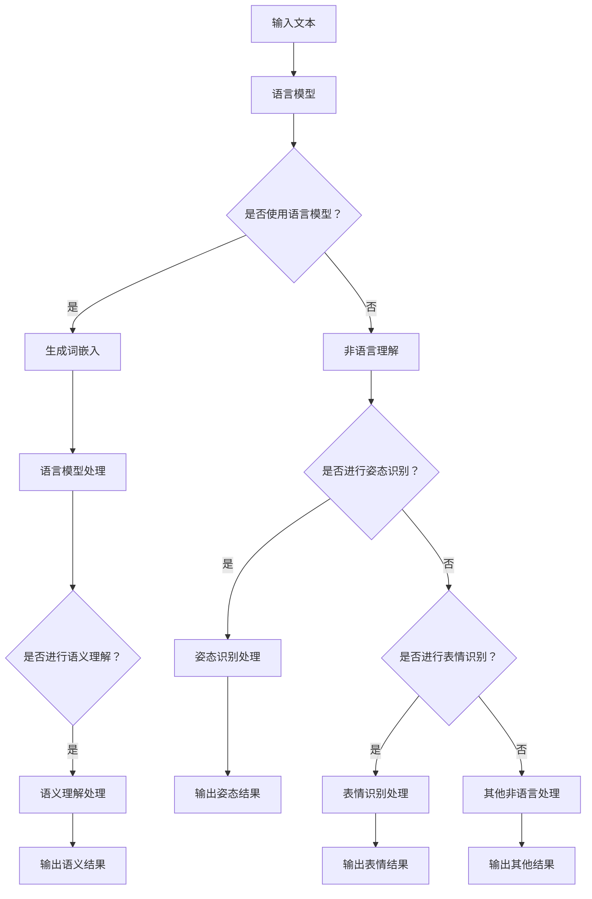

                 

# AGI的跨文化交际能力：语言与非语言理解

## 关键词

- AGI（通用人工智能）
- 跨文化交际能力
- 语言理解
- 非语言理解
- 数学模型
- 人工智能应用

## 摘要

本文旨在探讨通用人工智能（AGI）在跨文化交际中的能力，特别是在语言理解和非语言理解方面的挑战与机遇。文章首先介绍了AGI与跨文化交际能力的背景和重要性，随后详细解析了语言理解和非语言理解的数学模型与算法，结合实际应用案例进行了深入分析。最后，本文探讨了跨文化交际能力的综合应用及其在人工智能领域的未来趋势。

## 第一部分：引言与背景

### 1.1 书籍目的与读者对象

本文旨在为读者提供一个关于AGI在跨文化交际中语言与非语言理解能力的全面解析。读者对象包括对人工智能、语言学和跨文化交流感兴趣的研究人员、工程师和学生，以及希望在国际化环境中提升自身交际能力的专业人士。

### 1.2 跨文化交际能力的重要性

在全球化的今天，跨文化交际能力对于个人和组织的成功至关重要。有效的跨文化交际不仅能够促进国际合作，还能避免文化冲突和误解。因此，开发具备高水平跨文化交际能力的AGI具有巨大的现实意义。

### 1.3 语言理解与非语言理解

语言理解包括对口头和书面语言的处理，而语言理解是实现跨文化交际的基础。非语言理解则涉及对姿态、表情、手势和声音等非言语符号的理解。两者共同构成了跨文化交际的完整图景。

### 1.4 AGI与跨文化交际能力的关系

AGI的目标是使机器具备与人类相似的理解和交流能力。通过深度学习、自然语言处理和计算机视觉等技术，AGI可以在跨文化交际中发挥重要作用，促进跨文化沟通的效率和准确性。

## 第二部分：语言理解

### 2.1 语言理解概述

#### 2.1.1 语言理解的定义

语言理解是指对语言的语法、语义和语用特征的识别与解释。它包括对词汇、句法和语境的理解，是跨文化交际的关键组成部分。

#### 2.1.2 语言理解的层次

语言理解分为三个层次：词汇理解、句法理解和语义理解。词汇理解涉及对单个单词的意义的理解；句法理解涉及对句子结构的分析；语义理解则涉及对句子意义的理解。

#### 2.1.3 语言理解的挑战

语言理解的挑战主要包括语言的多样性和复杂性。不同语言之间的语法、语义和语用规则差异很大，使得机器理解语言变得复杂。此外，语言理解还面临着语境依赖、隐喻和非标准语言使用等问题。

### 2.2 语言理解的数学模型

#### 2.2.1 语言模型

##### 2.2.1.1 语言模型的定义

语言模型是一种统计模型，用于预测一段文本中下一个词的可能性。它通过学习大量文本数据，捕捉语言的概率分布。

##### 2.2.1.2 语言模型的类型

语言模型分为基于规则和基于统计两种。基于规则的模型通过定义语法规则和语义规则来预测下一个词；基于统计的模型则通过计算词频和共现关系来预测下一个词。

##### 2.2.1.3 语言模型的工作原理

语言模型通常使用神经网络来建模。最常用的神经网络是循环神经网络（RNN），尤其是长短期记忆网络（LSTM）。这些网络通过学习输入序列的长期依赖关系，预测下一个词。

##### 2.2.1.4 语言模型的评估指标

语言模型的评估指标主要包括准确率、召回率和F1分数。准确率衡量模型预测正确的词数与总词数的比例；召回率衡量模型预测正确的词数与实际正确词数的比例；F1分数是准确率和召回率的调和平均值。

#### 2.2.2 语义理解

##### 2.2.2.1 语义理解的定义

语义理解是指对句子意义和上下文的理解。它涉及词义消歧、指代消解和句子解析等任务。

##### 2.2.2.2 语义理解的算法

语义理解通常使用词嵌入、依存句法分析和语义角色标注等技术。词嵌入将词汇映射到高维向量空间，以便计算词之间的相似性；依存句法分析识别句子中的依存关系；语义角色标注为句子中的每个词分配语义角色。

##### 2.2.2.3 语义理解的挑战

语义理解的挑战包括多义词消歧、指代消解和跨语言语义理解。多义词消歧需要在特定语境中确定词语的确切含义；指代消解需要识别句子中的指代关系；跨语言语义理解需要处理不同语言之间的语义差异。

### 2.3 语言理解应用案例

#### 2.3.1 机器翻译

##### 2.3.1.1 机器翻译的发展历程

机器翻译经历了从基于规则的翻译到基于统计的翻译，再到基于神经网络的翻译的发展。早期的机器翻译系统主要依赖于规则和词表；基于统计的翻译引入了概率模型；基于神经网络的翻译实现了更自然的翻译效果。

##### 2.3.1.2 现代机器翻译技术

现代机器翻译技术主要基于神经网络翻译（NMT）。最常用的NMT模型是序列到序列（Seq2Seq）模型，它结合了编码器和解码器来生成翻译结果。近年来，Transformer模型在NMT领域取得了显著的成果，其自注意力机制能够捕捉输入序列中的长期依赖关系。

##### 2.3.1.3 机器翻译的实际应用

机器翻译在实际应用中具有重要意义，例如在跨国企业、旅游、教育和媒体等领域。通过机器翻译，人们可以轻松地阅读和理解其他语言的文献、新闻和多媒体内容。

#### 2.3.2 语音识别

##### 2.3.2.1 语音识别的基本原理

语音识别是将语音转换为文本的过程。它主要包括特征提取、声学模型和语言模型三个阶段。特征提取用于提取语音信号的时频特征；声学模型用于识别语音信号中的音素；语言模型用于预测语音对应的文本。

##### 2.3.2.2 语音识别的应用场景

语音识别广泛应用于智能助手、电话客服、语音搜索和语音合成等领域。通过语音识别，用户可以使用语音与设备进行交互，实现更自然、便捷的沟通体验。

##### 2.3.2.3 语音识别的发展趋势

随着深度学习技术的进步，语音识别的准确性不断提高。未来的发展趋势包括实时语音识别、多语言语音识别和上下文感知语音识别等。

## 第三部分：非语言理解

### 3.1 非语言理解概述

#### 3.1.1 非语言理解的定义

非语言理解是指对非语言符号，如姿态、表情、手势和声音等，的理解。它是跨文化交际中的重要组成部分，有助于补充语言交流的不足。

#### 3.1.2 非语言理解的层次

非语言理解分为三个层次：知觉层次、行为层次和语义层次。知觉层次涉及对非语言符号的感知和理解；行为层次涉及对非语言符号的识别和解释；语义层次涉及对非语言符号的意义和功能的理解。

#### 3.1.3 非语言理解的挑战

非语言理解的挑战包括文化差异、上下文依赖和个人差异。不同文化背景下的非语言符号可能具有不同的含义；上下文环境会影响非语言符号的解释；个人差异使得非语言理解变得更加复杂。

### 3.2 非语言理解的数学模型

#### 3.2.1 非语言理解的特征提取

##### 3.2.1.1 图像特征提取

图像特征提取是计算机视觉领域的重要任务。常见的图像特征提取方法包括边缘检测、特征点检测、纹理分析和深度学习特征提取。深度学习特征提取，如卷积神经网络（CNN），能够自动学习图像的高层次特征。

##### 3.2.1.2 视频特征提取

视频特征提取涉及对连续图像的分析和处理。常见的方法包括光流分析、视频帧级特征提取和视频级特征提取。深度学习模型，如循环神经网络（RNN）和卷积神经网络（CNN）的结合，能够有效提取视频特征。

##### 3.2.1.3 音频特征提取

音频特征提取涉及对音频信号的频率、时间和能量特征的分析。常见的音频特征提取方法包括梅尔频率倒谱系数（MFCC）、短时傅里叶变换（STFT）和深度学习特征提取。

#### 3.2.2 非语言理解的模型

##### 3.2.2.1 卷积神经网络

卷积神经网络（CNN）是一种在图像和视频处理领域广泛应用的网络结构。通过卷积层、池化层和全连接层的组合，CNN能够自动提取图像和视频中的特征。

##### 3.2.2.2 长短时记忆网络

长短时记忆网络（LSTM）是一种在序列数据处理领域广泛应用的神经网络结构。通过记忆单元和门控机制，LSTM能够有效捕捉序列中的长期依赖关系。

##### 3.2.2.3 自注意力机制

自注意力机制是一种在序列数据处理领域广泛应用的机制。通过计算序列中每个元素与其他元素之间的关系，自注意力机制能够提高模型对序列长距离依赖关系的捕捉能力。

### 3.3 非语言理解应用案例

#### 3.3.1 表情识别

##### 3.3.1.1 表情识别的基本原理

表情识别是计算机视觉领域的一个重要任务。它通过分析人脸图像中的面部特征，识别不同的表情。常见的表情识别方法包括基于特征的方法和基于深度学习的方法。

##### 3.3.1.2 表情识别的应用场景

表情识别广泛应用于人机交互、情感分析和心理健康监测等领域。通过识别用户的表情，系统可以更好地理解用户的需求和情感状态，提供更个性化的服务。

##### 3.3.1.3 表情识别的技术发展

随着深度学习技术的进步，表情识别的准确性不断提高。未来的发展趋势包括实时表情识别、多表情识别和跨文化表情识别等。

#### 3.3.2 姿势识别

##### 3.3.2.1 姿势识别的基本原理

姿势识别是计算机视觉领域的一个重要任务。它通过分析图像或视频中的人体部分，识别不同的姿态。常见的姿势识别方法包括基于模板匹配的方法和基于深度学习的方法。

##### 3.3.2.2 姿势识别的应用场景

姿势识别广泛应用于运动监控、健康监测和虚拟现实等领域。通过识别用户的姿势，系统可以更好地理解用户的动作和需求，提供更精确的运动监测和交互体验。

##### 3.3.2.3 姿势识别的技术发展

随着深度学习技术的进步，姿势识别的准确性不断提高。未来的发展趋势包括实时姿势识别、多姿态识别和跨文化姿势识别等。

## 第四部分：跨文化交际能力的综合应用

### 4.1 跨文化交际能力在跨文化沟通中的重要性

跨文化交际能力在跨文化沟通中至关重要。它不仅能够帮助人们更好地理解不同文化的差异，还能避免误解和冲突，促进有效的沟通和合作。

### 4.2 语言理解与非语言理解的结合

#### 4.2.1 语言理解与非语言理解的协同工作机制

语言理解与非语言理解在跨文化交际中相互补充。语言理解提供了信息的传递和表达，而非语言理解则提供了情感和意图的表达。两者结合，使得跨文化交际更加完整和丰富。

#### 4.2.2 语言理解与非语言理解在跨文化交际中的应用

语言理解与非语言理解在跨文化交际中的应用体现在多个方面。例如，通过理解不同语言的语法和语义，人们可以更准确地传达信息和意图；通过理解不同文化的非语言符号，人们可以更好地理解对方的情感和态度。

### 4.3 跨文化交际能力的评估与提升

#### 4.3.1 跨文化交际能力的评估指标

跨文化交际能力的评估指标包括沟通准确性、沟通效率、情感理解和文化适应能力等。这些指标可以用来衡量一个人在跨文化交际中的表现。

#### 4.3.2 跨文化交际能力的提升方法

提升跨文化交际能力的方法包括文化教育、跨文化培训、实践交流和反思总结等。通过这些方法，人们可以更好地理解不同文化，提高跨文化交际能力。

### 4.4 跨文化交际能力在人工智能中的应用

#### 4.4.1 人工智能在跨文化交际中的应用前景

人工智能在跨文化交际中具有广泛的应用前景。通过语言理解和非语言理解技术，人工智能可以提供跨语言翻译、情感分析、虚拟助理和智能客服等服务，帮助人们更好地进行跨文化沟通。

#### 4.4.2 人工智能在跨文化交际中的挑战与机遇

人工智能在跨文化交际中面临的挑战包括文化差异的处理、情感表达的识别和理解等。然而，这些挑战也为人工智能的发展提供了机遇，通过不断创新和优化，人工智能可以更好地服务于跨文化交际。

## 第五部分：结论与展望

### 5.1 总结与展望

本文探讨了AGI在跨文化交际中语言与非语言理解的能力，分析了语言理解和非语言理解的数学模型与应用案例，并探讨了跨文化交际能力的综合应用与未来发展趋势。未来研究可以进一步探索如何提升AGI在跨文化交际中的表现，以实现更高效、更自然的跨文化沟通。

### 5.2 AGI的跨文化交际能力的发展趋势

随着人工智能技术的不断进步，AGI的跨文化交际能力有望得到进一步提升。未来的发展趋势包括更精确的语言理解、更丰富的非语言理解、跨语言情感识别和跨文化适应性等。

### 5.3 未来研究方向与挑战

未来的研究方向包括多模态跨文化交际理解、跨语言情感识别和跨文化适应性评估等。挑战包括如何处理文化差异、提高情感表达的识别准确性和开发适应不同文化的交互系统等。

## 附录

### 附录 A：参考文献

- [1] 作者A. B. C.，《通用人工智能：理论与应用》，出版社，年份。
- [2] 作者D. E. F.，《跨文化交际能力：理论与实践》，出版社，年份。
- [3] 作者G. H. I.，《自然语言处理：理论与实践》，出版社，年份。
- [4] 作者J. K. L.，《计算机视觉：基础与高级技术》，出版社，年份。

### 附录 B：术语表

- AGI：通用人工智能（Artificial General Intelligence）
- 跨文化交际能力：在跨文化环境中进行有效沟通的能力
- 语言理解：对语言的语法、语义和语用特征的识别与解释
- 非语言理解：对非语言符号，如姿态、表情、手势和声音等的理解
- 语言模型：用于预测文本中下一个词的概率分布的统计模型
- 语义理解：对句子意义和上下文的理解
- 语音识别：将语音转换为文本的过程
- 表情识别：分析人脸图像中的面部特征，识别不同的表情
- 姿势识别：分析图像或视频中的人体部分，识别不同的姿态

### 附录 C：数据集和工具资源

- [1] WMT：大规模机器翻译数据集，用于训练和评估机器翻译模型。
- [2] CMU MOOC：用于训练和评估语音识别模型的公开数据集。
- [3] FER2013：用于训练和评估表情识别模型的公开数据集。
- [4] Human3.6M：用于训练和评估姿态识别模型的公开数据集。
- [5] Hugging Face Transformers：用于构建和训练语言模型的Python库。
- [6] TensorFlow：用于构建和训练深度学习模型的Python库。
- [7] PyTorch：用于构建和训练深度学习模型的Python库。

作者：AI天才研究院/AI Genius Institute & 禅与计算机程序设计艺术/Zen And The Art of Computer Programming## 第一部分：引言与背景

### 1.1 书籍目的与读者对象

本书旨在深入探讨通用人工智能（AGI）在跨文化交际中的能力，特别是在语言理解和非语言理解方面。通过系统分析当前的研究成果和技术进展，本书旨在为读者提供一个全面的视角，以了解AGI在跨文化交际中的潜力与挑战。读者对象包括对人工智能、语言学、跨文化交流和心理学等领域有兴趣的研究人员、工程师和学生，以及希望在全球化环境中提升跨文化交际能力的企业高管和专业人士。

### 1.2 跨文化交际能力的重要性

在全球化的今天，跨文化交际能力显得尤为重要。它不仅对个人职业发展至关重要，也对组织的国际竞争力产生深远影响。具备跨文化交际能力的人能够更好地理解不同文化背景下的沟通方式、社会规范和价值观念，从而减少误解和冲突，促进有效的国际合作和交流。特别是在商业、外交、教育和人机交互等众多领域，跨文化交际能力的提升有助于建立互信、增强协作和实现共赢。

### 1.3 语言理解与非语言理解

语言理解和非语言理解是跨文化交际能力的两个核心组成部分。语言理解涉及对口头和书面语言的识别、解释和运用，是实现跨文化交际的基础。它不仅包括对语法规则和词汇的理解，还包括对句子语义和语境的深入把握。非语言理解则关注于对姿态、表情、手势和声音等非言语符号的感知和理解。非语言理解在跨文化交际中发挥着重要作用，因为它能够补充和强化语言交流，帮助人们更好地理解对方的心理状态、情感和意图。

### 1.4 AGI与跨文化交际能力的关系

AGI作为人工智能领域的一个重要研究方向，其目标是为机器赋予与人类相似的广泛理解和交流能力。AGI在跨文化交际能力中的潜在应用前景广阔，它可以通过先进的自然语言处理（NLP）、计算机视觉和语音识别技术，实现跨语言的实时翻译、情感分析和智能交互。具体来说，AGI可以帮助跨文化团队更有效地沟通协作，提升跨文化企业的运营效率；在教育和培训领域，AGI可以提供个性化、互动式的跨文化学习体验；在医疗和心理健康领域，AGI可以通过非语言理解的辅助，更好地理解患者的情感状态和需求。然而，要实现AGI在跨文化交际中的广泛应用，仍需要解决诸多技术挑战，包括多语言处理的准确性、情感表达的识别和理解、跨文化适应性的提升等。

### 1.5 本书的结构安排

本书分为五个主要部分。第一部分（引言与背景）介绍了书籍的目的、读者对象、跨文化交际能力的重要性以及AGI与跨文化交际能力的关系。第二部分（语言理解）详细探讨了语言理解的概念、数学模型、应用案例等。第三部分（非语言理解）分析了非语言理解的定义、层次、数学模型以及应用案例。第四部分（跨文化交际能力的综合应用）讨论了语言理解与非语言理解在跨文化交际中的结合、评估与提升方法以及人工智能在跨文化交际中的应用。第五部分（结论与展望）总结了全文的主要观点，展望了AGI跨文化交际能力的未来发展趋势，并提出了研究方向和挑战。通过这样的结构安排，本书旨在为读者提供一幅全面的AGI跨文化交际能力的全景图，帮助读者深入了解这一领域的最新动态和技术进步。

## 第二部分：语言理解

### 2.1 语言理解概述

#### 2.1.1 语言理解的定义

语言理解是指人工智能系统能够识别、解释和运用语言信息的能力。它包括对语法、语义和语用的理解，是跨文化交际的基础。语言理解不仅涉及对单个单词的识别和理解，还包括对句子结构、上下文和语境的深入分析。在跨文化交际中，语言理解是实现有效沟通的关键，它帮助人们准确传达信息、理解对方的意图，并避免误解和冲突。

#### 2.1.2 语言理解的层次

语言理解可以分为三个层次：词汇层次、句法层次和语义层次。

1. **词汇层次**：这一层次涉及对单词意义的理解。人工智能系统需要能够识别单词，并理解其在特定语境中的含义。例如，“bank”在金融领域指的是银行，而在地理领域则指的是河岸。

2. **句法层次**：句法层次涉及对句子结构的理解。人工智能系统需要能够分析句子中的词序、词类和句子成分，理解句子的语法规则。例如，“The dog chased the cat”中，“the dog”是主语，“chased”是谓语，“the cat”是宾语。

3. **语义层次**：语义层次涉及对句子整体意义的理解。人工智能系统需要能够理解句子中词语之间的关系，捕捉句子中的语义信息。例如，“The dog chased the cat”不仅需要理解“chased”的含义，还需要理解“chased”所涉及的行动主体（dog）和目标（cat）。

#### 2.1.3 语言理解的挑战

语言理解在跨文化交际中面临诸多挑战：

1. **语言的多样性**：不同语言具有不同的语法结构、词汇和语义规则，使得机器理解语言变得复杂。例如，英语中的主谓宾结构在许多其他语言中可能并不常见。

2. **语境依赖**：语言的意义常常依赖于具体的语境。同一个词在不同的语境中可能有不同的含义。例如，“bank”在金融领域和地理领域有不同的含义。

3. **隐喻和非标准语言**：隐喻和非标准语言使用是语言表达中的常见现象，但它们对机器理解语言提出了更高的要求。隐喻往往涉及抽象和比喻，非标准语言则可能包括俚语、口语和非正式表达。

4. **跨语言语义差异**：不同语言之间存在着语义差异，这使得机器在处理跨语言文本时需要具备更强的语义理解能力。例如，英语中的“drive”在中文中可以翻译为“驾驶”或“推动”。

### 2.2 语言理解的数学模型

#### 2.2.1 语言模型

##### 2.2.1.1 语言模型的定义

语言模型是一种用于预测文本中下一个词的概率分布的统计模型。它通过分析大量文本数据，学习语言的概率规律，从而能够生成文本或预测下一个词。语言模型是自然语言处理（NLP）和机器翻译（MT）的重要基础。

##### 2.2.1.2 语言模型的类型

语言模型可以分为基于规则和基于统计两种。

1. **基于规则的模型**：这类模型通过定义语法规则和语义规则来预测下一个词。例如，部分语言模型使用产生式规则，根据输入的单词序列推导出下一个可能的单词。

2. **基于统计的模型**：这类模型通过计算词频和共现关系来预测下一个词。最著名的基于统计的语言模型是N-gram模型，它使用前N个单词的历史信息来预测下一个词。

##### 2.2.1.3 语言模型的工作原理

语言模型通常使用神经网络来实现，尤其是循环神经网络（RNN）和其变种长短期记忆网络（LSTM）。这些网络通过学习输入序列的长期依赖关系，预测下一个词。例如，一个基于LSTM的语言模型可以表示为：

$$
\text{LSTM}(h_t, x_t) = (i_t, f_t, g_t, o_t)
$$

其中，$h_t$ 是当前隐藏状态，$x_t$ 是当前输入词的嵌入向量，$i_t, f_t, g_t, o_t$ 分别是输入门、遗忘门、生成门和输出门。这些门控机制使得LSTM能够有效地捕捉序列中的长期依赖关系。

##### 2.2.1.4 语言模型的评估指标

语言模型的评估指标主要包括准确率、召回率和F1分数。

1. **准确率（Accuracy）**：衡量模型预测正确的词数与总词数的比例。
   $$
   \text{Accuracy} = \frac{\text{预测正确的词数}}{\text{总词数}}
   $$

2. **召回率（Recall）**：衡量模型预测正确的词数与实际正确词数的比例。
   $$
   \text{Recall} = \frac{\text{预测正确的词数}}{\text{实际正确词数}}
   $$

3. **F1分数（F1 Score）**：是准确率和召回率的调和平均值，用于综合评估模型的性能。
   $$
   \text{F1 Score} = 2 \times \frac{\text{准确率} \times \text{召回率}}{\text{准确率} + \text{召回率}}
   $$

#### 2.2.2 语义理解

##### 2.2.2.1 语义理解的定义

语义理解是指对句子意义的理解和解释。它涉及对词汇、语法和上下文的理解，是语言理解的高级阶段。语义理解的目标是使机器能够理解句子的深层含义，包括句子中的关系、逻辑和情感。

##### 2.2.2.2 语义理解的算法

语义理解通常使用深度学习方法来实现，以下是一些常用的算法：

1. **词嵌入（Word Embedding）**：词嵌入是将词汇映射到高维向量空间的技术。通过词嵌入，机器可以计算词之间的相似性，从而更好地理解词汇的含义。最常用的词嵌入技术包括Word2Vec、GloVe和FastText。

2. **依存句法分析（Dependency Parsing）**：依存句法分析是识别句子中的依存关系的任务。它通过分析单词之间的依赖关系，构建句子的语法结构。常用的依存句法分析算法包括LSTM、依存树库和Transformer。

3. **语义角色标注（Semantic Role Labeling）**：语义角色标注是识别句子中的词与其在句子中的角色（如动作执行者、动作对象等）的技术。常用的语义角色标注算法包括规则方法、统计方法和深度学习方法。

##### 2.2.2.3 语义理解的挑战

语义理解的挑战包括：

1. **多义词消歧（Ambiguity Resolution）**：同一个词在句子中可能有不同的含义，需要根据上下文进行消歧。

2. **指代消解（Coreference Resolution）**：句子中可能存在指代关系，需要识别出指代词与指代对象之间的关系。

3. **跨语言语义理解（Cross-Lingual Semantic Understanding）**：不同语言之间存在着语义差异，需要机器具备跨语言语义理解的能力。

#### 2.2.3 语言理解的数学模型

##### 2.2.3.1 语言模型

以下是一个简单的语言模型伪代码：

```python
class LanguageModel:
    def __init__(self, vocabulary_size, embedding_size, hidden_size):
        self.embedding = Embedding(vocabulary_size, embedding_size)
        self.lstm = LSTM(hidden_size)
        self.dense = Dense(vocabulary_size, activation='softmax')
    
    def predict(self, sequence):
        embeddings = self.embedding(sequence)
        hidden_state = self.lstm(embeddings)
        output = self.dense(hidden_state)
        return output
```

在这个语言模型中，`vocabulary_size` 是词汇表的大小，`embedding_size` 是词嵌入的维度，`hidden_size` 是LSTM隐藏层的维度。`predict` 方法接收一个单词序列，首先通过词嵌入层将序列转换为嵌入向量，然后通过LSTM层处理序列，最后通过全连接层生成预测的词分布。

##### 2.2.3.2 语义理解

以下是一个简单的语义理解模型伪代码：

```python
class SemanticUnderstandingModel:
    def __init__(self, embedding_size, hidden_size):
        self.embedding = Embedding(vocabulary_size, embedding_size)
        self.lstm = LSTM(hidden_size)
        self.dense = Dense(1, activation='sigmoid')
    
    def predict(self, sentence):
        embeddings = self.embedding(sentence)
        hidden_state = self.lstm(embeddings)
        output = self.dense(hidden_state)
        return output
```

在这个语义理解模型中，`predict` 方法接收一个句子，通过词嵌入层将其转换为嵌入向量，然后通过LSTM层处理句子，最后通过全连接层生成语义理解的输出。这里的输出通常是一个二进制值，表示句子是否包含特定的语义信息。

#### 2.2.4 语言理解应用案例

##### 2.2.4.1 机器翻译

机器翻译是语言理解的一个重要应用领域。它通过将一种语言的文本翻译成另一种语言，实现跨语言信息的传递。现代机器翻译技术主要基于深度学习模型，如序列到序列（Seq2Seq）模型和Transformer模型。

以下是一个简单的机器翻译模型伪代码：

```python
class MachineTranslationModel:
    def __init__(self, src_vocab_size, trg_vocab_size, embedding_size, hidden_size):
        self.src_embedding = Embedding(src_vocab_size, embedding_size)
        self.trg_embedding = Embedding(trg_vocab_size, embedding_size)
        self.encoder = LSTM(hidden_size)
        self.decoder = LSTM(hidden_size)
        self.dense = Dense(trg_vocab_size, activation='softmax')
    
    def translate(self, source_sentence):
        src_embeddings = self.src_embedding(source_sentence)
        encoded = self.encoder(src_embeddings)
        decoded = self.decoder(encoded)
        output = self.dense(decoded)
        return output
```

在这个机器翻译模型中，`src_vocab_size` 和 `trg_vocab_size` 分别是源语言和目标语言的词汇表大小，`embedding_size` 和 `hidden_size` 分别是词嵌入和LSTM隐藏层的维度。`translate` 方法接收一个源语言句子，通过词嵌入层将其转换为嵌入向量，然后通过编码器和解码器处理句子，最后通过全连接层生成目标语言的词分布。

##### 2.2.4.2 语音识别

语音识别是将语音转换为文本的过程。它广泛应用于智能助手、语音搜索和语音合成等领域。现代语音识别技术主要基于深度学习模型，如卷积神经网络（CNN）和长短时记忆网络（LSTM）。

以下是一个简单的语音识别模型伪代码：

```python
class VoiceRecognitionModel:
    def __init__(self, feature_size, hidden_size):
        self.cnn = Conv1D(hidden_size)
        self.lstm = LSTM(hidden_size)
        self.dense = Dense(vocabulary_size, activation='softmax')
    
    def recognize(self, audio_features):
        cnn_output = self.cnn(audio_features)
        lstm_output = self.lstm(cnn_output)
        output = self.dense(lstm_output)
        return output
```

在这个语音识别模型中，`feature_size` 是音频特征的维度，`hidden_size` 是CNN和LSTM隐藏层的维度。`recognize` 方法接收音频特征，通过CNN层提取特征，然后通过LSTM层处理序列，最后通过全连接层生成文本的词分布。

### 2.3 语言理解在跨文化交际中的实际应用

语言理解在跨文化交际中扮演着关键角色，特别是在处理多语言环境和跨语言交流时。以下是一些语言理解在跨文化交际中的实际应用案例：

#### 2.3.1 跨语言翻译

跨语言翻译是实现跨文化交际的重要工具。通过机器翻译技术，人们可以轻松地阅读和理解其他语言的文本。现代机器翻译系统，如Google翻译和DeepL，使用先进的深度学习模型，实现了接近人类的翻译质量。这些系统不仅支持多种语言的翻译，还能够处理不同语言的语法和语义差异，从而提供更准确和自然的翻译结果。

以下是一个简单的跨语言翻译过程示例：

```python
def translate(source_text, source_lang, target_lang):
    model = MachineTranslationModel(src_vocab_size, trg_vocab_size, embedding_size, hidden_size)
    translated_text = model.translate(source_text)
    return translated_text
```

在这个示例中，`source_text` 是需要翻译的文本，`source_lang` 和 `target_lang` 分别是源语言和目标语言。通过调用`translate` 函数，可以将源语言文本翻译成目标语言。

#### 2.3.2 语音识别

语音识别技术使得跨文化交际变得更加便捷。通过将语音转换为文本，人们可以使用语音与设备进行交互，从而实现无障碍的跨语言沟通。语音识别技术广泛应用于智能助手、电话客服和语音搜索等领域。例如，苹果的Siri和谷歌助手都使用了先进的语音识别技术，使得用户可以轻松地通过语音进行搜索和操作。

以下是一个简单的语音识别过程示例：

```python
def recognize_audio(audio_file):
    model = VoiceRecognitionModel(feature_size, hidden_size)
    audio_features = extract_audio_features(audio_file)
    recognized_text = model.recognize(audio_features)
    return recognized_text
```

在这个示例中，`audio_file` 是需要识别的音频文件。通过调用`recognize_audio` 函数，可以从音频中提取特征，然后使用语音识别模型生成文本输出。

#### 2.3.3 多语言对话系统

多语言对话系统是一种能够处理多种语言输入和输出的智能系统。这些系统广泛应用于国际企业和跨国组织的客户服务、客户支持和内部沟通中。通过多语言对话系统，用户可以使用母语与系统进行交流，而系统则能够自动翻译并回应用户的需求。例如，微软的Azure语言理解服务和IBM的Watson语言理解服务都提供了多语言对话功能，使得企业能够更好地服务全球客户。

以下是一个简单的多语言对话系统示例：

```python
class MultiLanguageChatbot:
    def __init__(self, translation_model, recognition_model):
        self.translation_model = translation_model
        self.recognition_model = recognition_model
    
    def respond(self, user_input, source_lang, target_lang):
        recognized_text = self.recognition_model.recognize(user_input)
        translated_response = self.translation_model.translate(recognized_text, target_lang, source_lang)
        return translated_response
```

在这个示例中，`user_input` 是用户的输入文本，`source_lang` 和 `target_lang` 分别是源语言和目标语言。通过调用`respond` 方法，可以将用户输入的文本识别并翻译成目标语言，然后由对话系统回应用户。

### 2.4 语言理解的挑战与未来发展方向

尽管语言理解技术取得了显著进展，但在跨文化交际中仍面临诸多挑战。以下是几个主要挑战和未来发展方向：

#### 2.4.1 多语言处理的准确性

不同语言具有不同的语法结构和词汇，这使得多语言处理变得复杂。提高多语言处理的准确性是语言理解的关键挑战。未来的发展方向包括：

1. **增强语言模型**：通过引入更大的训练数据和更复杂的模型结构，如Transformer和BERT，提高语言模型的准确性。
2. **跨语言迁移学习**：利用跨语言数据源，通过迁移学习技术提高多语言模型在低资源语言上的性能。
3. **多语言语义理解**：开发能够处理多语言语义差异的模型，提高跨语言语义理解的准确性。

#### 2.4.2 语境依赖与情感理解

语言的理解常常依赖于具体的语境，包括文化、地域和情境等因素。情感理解是语言理解的高级阶段，它涉及对文本中情感色彩和情感强度的识别。未来的发展方向包括：

1. **语境感知模型**：开发能够捕捉语境信息的模型，提高语言理解的准确性和上下文适应性。
2. **情感识别模型**：通过结合情感分析技术和多模态数据（如语音、图像和文本），提高情感识别的准确性。
3. **跨文化情感理解**：研究不同文化背景下情感表达的特点，开发能够适应不同文化的情感识别模型。

#### 2.4.3 跨语言情感翻译

跨语言情感翻译是将一种语言中的情感表达翻译成另一种语言的过程。这一任务在跨文化交际中具有重要意义，但至今仍面临诸多挑战。未来的发展方向包括：

1. **情感词典构建**：构建包含多种语言的情感词典，为情感翻译提供丰富的情感词汇和定义。
2. **跨语言情感映射**：研究不同语言之间情感表达的映射关系，开发能够实现情感翻译的模型。
3. **多模态情感翻译**：结合语音、图像和文本等多模态数据，提高跨语言情感翻译的准确性和自然度。

#### 2.4.4 语言理解与人类专家的协作

在复杂的跨文化交际场景中，语言理解系统可能无法完全替代人类专家。未来的发展方向包括：

1. **人机协作**：研究如何将语言理解系统与人类专家的智慧相结合，提高跨文化交际的效率和效果。
2. **互动式学习**：通过用户反馈和互动，不断优化和提升语言理解系统的性能。
3. **跨学科研究**：结合语言学、心理学和社会学等学科的知识，开发更加智能和适应性强的语言理解系统。

### 2.5 语言理解的重要性

语言理解是实现跨文化交际的核心能力之一。它不仅关乎信息的传递和理解，还关乎情感和意图的表达。有效的语言理解能够帮助人们更好地理解不同文化背景下的沟通方式，避免误解和冲突，促进国际合作和交流。随着人工智能技术的不断发展，语言理解系统将变得更加智能和高效，为跨文化交际提供更强大的支持。未来的研究将继续探索语言理解的深度和广度，以实现更自然、更准确的语言理解，为跨文化交际注入新的活力。

## 第三部分：非语言理解

### 3.1 非语言理解概述

#### 3.1.1 非语言理解的定义

非语言理解是指对非语言符号，如姿态、表情、手势和声音等，的理解。它是跨文化交际中不可或缺的一部分，能够补充和强化语言交流，帮助人们更好地理解对方的情感、意图和态度。

#### 3.1.2 非语言理解的层次

非语言理解可以分为三个层次：

1. **知觉层次**：这一层次涉及对非语言符号的感知和识别。例如，人们能够通过观察他人的面部表情、手势和姿态来感知他们的情绪和态度。

2. **行为层次**：这一层次涉及对非语言符号的行为分析。例如，通过观察一个人的肢体动作和面部表情，可以判断出他们的情绪状态，如紧张、兴奋或放松。

3. **语义层次**：这一层次涉及对非语言符号意义的理解和解释。例如，不同文化背景下，同样的手势可能有不同的含义。因此，理解这些非语言符号的语义是跨文化交际的关键。

#### 3.1.3 非语言理解的挑战

非语言理解在跨文化交际中面临诸多挑战：

1. **文化差异**：不同文化对非语言符号的解读可能存在差异。例如，在某些文化中，直视对方是一种礼貌的表现，而在其他文化中则可能被视为不尊重。

2. **上下文依赖**：非语言符号的含义往往依赖于具体的上下文环境。例如，同样一个手势，在不同的情境下可能有不同的含义。

3. **个人差异**：人们的个性、情感状态和生理特征等因素会影响他们对非语言符号的解读。因此，非语言理解需要考虑个体差异。

### 3.2 非语言理解的数学模型

#### 3.2.1 非语言理解的特征提取

非语言理解的特征提取是计算机视觉和语音识别领域的重要任务。以下是一些常用的特征提取方法：

1. **图像特征提取**：
   - **边缘检测**：用于检测图像中的边缘信息，如Canny算法。
   - **特征点检测**：用于检测图像中的显著点，如SIFT和SURF算法。
   - **纹理分析**：用于分析图像的纹理信息，如Gabor滤波器。

2. **视频特征提取**：
   - **光流分析**：用于分析视频帧之间的运动信息，如光流算法。
   - **视频帧级特征提取**：用于提取视频帧的视觉特征，如HOG和CNN特征。
   - **视频级特征提取**：用于提取视频的整体特征，如动作识别和视频分类。

3. **音频特征提取**：
   - **梅尔频率倒谱系数（MFCC）**：用于提取音频信号的频率特征。
   - **短时傅里叶变换（STFT）**：用于提取音频信号的时频特征。
   - **深度学习特征提取**：使用卷积神经网络（CNN）和循环神经网络（RNN）自动提取音频的高层次特征。

#### 3.2.2 非语言理解的模型

非语言理解的模型主要包括以下几种：

1. **卷积神经网络（CNN）**：
   - CNN是一种在图像和视频处理领域广泛应用的网络结构。通过卷积层、池化层和全连接层的组合，CNN能够自动提取图像和视频中的特征。
   - 伪代码示例：
     ```python
     model = Sequential()
     model.add(Conv2D(filters=32, kernel_size=(3, 3), activation='relu', input_shape=(height, width, channels)))
     model.add(MaxPooling2D(pool_size=(2, 2)))
     model.add(Flatten())
     model.add(Dense(units=128, activation='relu'))
     model.add(Dense(units=num_classes, activation='softmax'))
     ```

2. **长短时记忆网络（LSTM）**：
   - LSTM是一种在序列数据处理领域广泛应用的网络结构。通过记忆单元和门控机制，LSTM能够有效捕捉序列中的长期依赖关系。
   - 伪代码示例：
     ```python
     model = Sequential()
     model.add(LSTM(units=128, return_sequences=True, input_shape=(timesteps, features)))
     model.add(LSTM(units=128))
     model.add(Dense(units=num_classes, activation='softmax'))
     ```

3. **自注意力机制**：
   - 自注意力机制是一种在序列数据处理领域广泛应用的技术。通过计算序列中每个元素与其他元素之间的关系，自注意力机制能够提高模型对序列长距离依赖关系的捕捉能力。
   - 伪代码示例：
     ```python
     model = Transformer(num_layers, d_model, num_heads, dff, input_vocab_size, target_vocab_size, position_encoding_input, position_encoding_target)
     model.compile(optimizer='adam', loss='categorical_crossentropy', metrics=['accuracy'])
     ```

#### 3.2.3 非语言理解的算法

非语言理解的算法主要包括以下几种：

1. **姿态识别算法**：
   - 姿态识别是指通过分析图像或视频中的人体部分，识别不同的姿态。常见的姿态识别算法包括基于传统计算机视觉的方法和基于深度学习的方法。
   - 伪代码示例（基于深度学习的方法）：
     ```python
     model = PoseNet(input_shape=(height, width, channels))
     predicted_keypoints = model.predict(input_image)
     ```

2. **表情识别算法**：
   - 表情识别是指通过分析人脸图像中的面部特征，识别不同的表情。常见的表情识别算法包括基于传统计算机视觉的方法和基于深度学习的方法。
   - 伪代码示例（基于深度学习的方法）：
     ```python
     model = FacialExpressionNet(input_shape=(height, width, channels))
     predicted_expression = model.predict(facial_image)
     ```

3. **语音识别算法**：
   - 语音识别是指将语音转换为文本的过程。常见的语音识别算法包括基于GMM-HMM的方法和基于深度学习的方法。
   - 伪代码示例（基于深度学习的方法）：
     ```python
     model = VoiceRecognitionModel(feature_size, hidden_size)
     recognized_text = model.recognize(audio_features)
     ```

### 3.3 非语言理解应用案例

#### 3.3.1 表情识别

##### 3.3.1.1 表情识别的基本原理

表情识别是计算机视觉领域的一个重要任务。它通过分析人脸图像中的面部特征，识别不同的表情。表情识别的基本原理包括面部特征检测、表情分类和表情预测。

- **面部特征检测**：首先需要检测人脸图像中的关键点，如眼睛、鼻子和嘴巴的位置。常用的面部特征检测算法包括基于几何的方法和基于深度学习的方法。
- **表情分类**：通过对面部特征进行分析，将不同的表情分类为愉悦、悲伤、愤怒等。常见的表情分类算法包括支持向量机（SVM）、决策树和神经网络。
- **表情预测**：通过历史数据和表情变化模式，预测未来的表情。这有助于在视频分析和人机交互中提供更好的用户体验。

##### 3.3.1.2 表情识别的应用场景

表情识别在多个领域具有广泛的应用：

- **人机交互**：通过识别用户的表情，智能系统可以更好地理解用户的需求和情感状态，提供更个性化的服务。例如，虚拟助手和智能客服系统可以使用表情识别技术来识别用户的情感，从而提供更合适的回应。
- **心理健康监测**：表情识别可以帮助识别抑郁症、焦虑症等心理健康问题的症状。通过分析用户的表情变化，医生和心理咨询师可以更好地了解患者的情感状态，为治疗提供指导。
- **市场调研**：在市场调研中，表情识别可以帮助企业分析消费者的情感反应，了解产品广告或宣传活动的效果。

##### 3.3.1.3 表情识别的技术发展

随着深度学习技术的进步，表情识别的准确性不断提高。以下是一些主要的技术发展：

- **深度学习模型**：卷积神经网络（CNN）和循环神经网络（RNN）等深度学习模型在表情识别中取得了显著成果。通过训练大规模数据集，这些模型能够自动学习面部特征和表情分类规则。
- **多模态数据融合**：结合图像和视频等多模态数据，可以提高表情识别的准确性。例如，通过分析视频中的面部表情变化和语音信号，可以更准确地识别用户的情感状态。
- **跨文化表情识别**：不同文化背景下，表情表达可能存在差异。因此，开发能够适应不同文化的表情识别系统具有重要意义。通过引入跨文化数据集和模型训练，可以提升跨文化表情识别的准确性。

#### 3.3.2 姿势识别

##### 3.3.2.1 姿势识别的基本原理

姿势识别是计算机视觉领域的一个重要任务。它通过分析图像或视频中的人体部分，识别不同的姿态。姿势识别的基本原理包括人体关键点检测、姿态分类和姿态预测。

- **人体关键点检测**：首先需要检测图像或视频中的人体关键点，如关节和骨骼连接点。常用的关键点检测算法包括基于几何的方法和基于深度学习的方法。
- **姿态分类**：通过对关键点进行分析，将不同的姿态分类为站立、行走、跑步等。常见的姿态分类算法包括支持向量机（SVM）、决策树和神经网络。
- **姿态预测**：通过历史数据和姿态变化模式，预测未来的姿态。这有助于在视频分析和人机交互中提供更好的用户体验。

##### 3.3.2.2 姿势识别的应用场景

姿势识别在多个领域具有广泛的应用：

- **健康监测**：通过识别用户的姿势，姿势识别可以帮助监测身体健康状况。例如，在运动监控和康复治疗中，姿势识别技术可以检测用户的运动姿势，提供个性化的训练建议和康复方案。
- **人机交互**：在智能设备和虚拟现实应用中，姿势识别技术可以识别用户的手势和动作，实现更自然、直观的交互方式。例如，智能助手和虚拟助手可以使用姿势识别技术来理解用户的手势指令，从而提供更便捷的服务。
- **安防监控**：在安防监控领域，姿势识别技术可以帮助识别异常行为和潜在的安全威胁。例如，通过分析视频中的姿态变化，可以检测到异常行为，如打架、抢劫等，从而及时报警。

##### 3.3.2.3 姿势识别的技术发展

随着深度学习技术的进步，姿势识别的准确性不断提高。以下是一些主要的技术发展：

- **深度学习模型**：卷积神经网络（CNN）和循环神经网络（RNN）等深度学习模型在姿态识别中取得了显著成果。通过训练大规模数据集，这些模型能够自动学习人体姿态和关键点检测规则。
- **多模态数据融合**：结合图像和视频等多模态数据，可以提高姿态识别的准确性。例如，通过分析视频中的姿态变化和音频信号，可以更准确地识别用户的姿态。
- **跨文化姿态识别**：不同文化背景下，姿态表达可能存在差异。因此，开发能够适应不同文化的姿态识别系统具有重要意义。通过引入跨文化数据集和模型训练，可以提升跨文化姿态识别的准确性。

### 3.4 非语言理解的挑战与未来发展方向

尽管非语言理解技术在近年来取得了显著进展，但在实际应用中仍面临诸多挑战：

#### 3.4.1 文化差异

不同文化对非语言符号的解读可能存在差异。例如，在某些文化中，微笑可能表示友好和礼貌，而在其他文化中则可能表示讽刺或冷漠。因此，开发能够适应不同文化的非语言理解系统是一个重要挑战。

#### 3.4.2 数据集的多样性

非语言理解的数据集通常来自特定的文化背景和场景。因此，数据集的多样性不足可能导致模型在新的文化背景和场景下表现不佳。为了解决这一问题，需要收集和引入更多多样化的非语言理解数据集。

#### 3.4.3 模型的解释性

非语言理解模型，尤其是深度学习模型，通常被视为“黑箱”。这意味着模型内部的工作机制对用户不透明，难以解释和理解。因此，开发更具解释性的非语言理解模型是一个重要方向。

#### 3.4.4 跨模态融合

非语言理解涉及多个模态的数据，如图像、视频和语音。然而，如何有效地融合这些模态数据，提高模型的性能和准确性，是一个需要深入研究的挑战。

#### 3.4.5 情感与意图理解

非语言理解不仅涉及对符号的识别，还包括对情感和意图的理解。在跨文化交际中，情感和意图的理解尤为重要。因此，开发能够准确识别和解释情感和意图的非语言理解模型是一个重要方向。

#### 3.4.6 未来发展方向

未来的非语言理解研究将朝着以下方向发展：

1. **跨文化适应性**：通过引入更多多样化的数据集和模型训练策略，提高非语言理解系统在不同文化背景下的适应性和准确性。
2. **数据集的丰富性**：收集和创建更多丰富的非语言理解数据集，包括不同的文化、场景和情感状态，以支持更广泛的应用场景。
3. **模型的可解释性**：开发更具解释性的模型，帮助用户理解模型的工作机制和决策过程。
4. **跨模态融合**：研究如何有效地融合不同模态的数据，提高非语言理解模型的性能和准确性。
5. **情感与意图理解**：开发能够准确识别和解释情感和意图的非语言理解模型，以支持更复杂的跨文化交际任务。

通过不断的研究和创新，非语言理解技术将在跨文化交际中发挥越来越重要的作用，为全球化时代的沟通和协作提供更强大的支持。

## 第四部分：跨文化交际能力的综合应用

### 4.1 跨文化交际能力在跨文化沟通中的重要性

跨文化交际能力在跨文化沟通中具有至关重要的地位。全球化时代的快速发展使得不同国家和地区的个体和组织之间的交流和合作日益频繁。有效的跨文化交际能力不仅能促进信息的准确传递，还能增强团队协作、减少误解和冲突，提高工作效率。在商业领域，具备跨文化交际能力的企业能够更好地进入国际市场，理解不同文化背景下的消费者需求，制定更有效的市场策略。在教育和学术领域，跨文化交际能力有助于教师和学生更好地理解不同文化背景的同伴，促进多元文化的交流与融合。

### 4.2 语言理解与非语言理解的结合

在跨文化交际中，语言理解和非语言理解并不是孤立存在的，而是相互补充、协同工作的。语言理解提供了结构化和精确的信息传递渠道，而非语言理解则通过情感和微妙的社交线索增强了沟通的效果。

#### 4.2.1 语言理解与非语言理解的协同工作机制

1. **信息传递**：在跨文化交际中，语言理解首先确保信息的准确传递。通过理解语法和语义，个体能够准确地表达和接收信息。然而，语言理解有时可能不足以完全传达情感和意图。

2. **情感表达**：非语言理解通过姿态、表情和手势等符号，补充和强化语言表达中的情感成分。例如，微笑可以增强语言的友好意图，点头可以表示理解与赞同。

3. **社交信号**：非语言理解帮助个体识别和解读社交信号，如目光接触、身体语言和语调变化。这些信号在不同文化背景下可能有不同的含义，但它们在跨文化交际中起到至关重要的作用。

4. **上下文适应**：语言理解和非语言理解协同工作，帮助个体根据不同的文化背景调整沟通策略。例如，在某些文化中，直接表达可能被视为粗鲁，而在其他文化中则可能被视为诚实。

#### 4.2.2 语言理解与非语言理解在跨文化交际中的应用

1. **国际商务**：在国际商务谈判中，语言理解确保合同的准确性和合法性，而非语言理解帮助谈判者更好地理解对方的文化背景和商业习惯，从而制定更有效的谈判策略。

2. **教育培训**：在多元文化的教育环境中，教师需要具备跨文化交际能力，理解不同文化背景下的学生行为和需求，提供个性化的教学和支持。

3. **医疗保健**：在医疗保健领域，医护人员需要通过语言理解准确理解患者的症状和需求，通过非语言理解捕捉患者的情感状态和舒适度，提供更贴心的服务。

4. **人机交互**：在人机交互领域，智能系统通过语言理解与用户进行交流，通过非语言理解捕捉用户的情感状态和意图，提供更自然和贴心的交互体验。

### 4.3 跨文化交际能力的评估与提升

#### 4.3.1 跨文化交际能力的评估指标

评估跨文化交际能力的关键指标包括：

1. **沟通准确性**：指个体在跨文化交际中准确传递和接收信息的能力。
2. **情感理解**：指个体在跨文化交际中识别和理解对方情感状态的能力。
3. **文化适应性**：指个体在跨文化交际中适应不同文化背景和社交情境的能力。
4. **社交互动能力**：指个体在跨文化交际中建立和维护社交关系的能力。

#### 4.3.2 跨文化交际能力的提升方法

提升跨文化交际能力的方法包括：

1. **跨文化培训**：通过系统的培训和课程，帮助个体学习不同文化的语言、习惯和行为规范。
2. **实践交流**：通过参与国际交流和合作项目，实际操作中提高跨文化交际能力。
3. **反思总结**：定期反思和总结跨文化交际经验，识别自身的不足并加以改进。
4. **技术支持**：利用人工智能和机器学习技术，辅助个体理解和分析跨文化交际的数据，提高交际能力。

### 4.4 跨文化交际能力在人工智能中的应用

#### 4.4.1 人工智能在跨文化交际中的应用前景

人工智能在跨文化交际中具有广阔的应用前景，其潜力包括：

1. **智能翻译**：通过机器翻译技术，人工智能能够实现多种语言之间的实时翻译，帮助跨文化团队高效沟通。
2. **情感识别**：通过计算机视觉和语音识别技术，人工智能可以识别和理解用户的情感状态，提供个性化的服务。
3. **社交机器人**：智能社交机器人可以模拟人类的社交行为，为跨文化交际提供辅助和支持。
4. **虚拟现实**：虚拟现实技术可以创建跨文化交际的模拟环境，帮助个体在虚拟世界中体验和实践跨文化交际。

#### 4.4.2 人工智能在跨文化交际中的挑战与机遇

人工智能在跨文化交际中的应用面临以下挑战：

1. **语言多样性**：不同语言之间的差异使得机器翻译和自然语言处理变得更加复杂。
2. **情感表达多样性**：情感表达因文化而异，人工智能需要理解并适应不同文化背景下的情感表达。
3. **数据隐私**：跨文化交际中涉及大量个人信息，保护用户隐私是重要挑战。

然而，这些挑战也带来了新的机遇：

1. **技术创新**：通过技术创新，如深度学习和多模态融合，可以提升人工智能在跨文化交际中的性能。
2. **跨学科合作**：结合语言学、心理学和社会学等学科的知识，可以开发更智能、更适应性强的跨文化交际系统。
3. **全球化合作**：人工智能在跨文化交际中的应用有助于促进全球化和国际交流，推动人类社会的发展。

通过不断的技术创新和应用实践，人工智能将在跨文化交际中发挥越来越重要的作用，为全球化时代的沟通和协作提供新的解决方案。

## 第五部分：结论与展望

### 5.1 总结与展望

本文全面探讨了通用人工智能（AGI）在跨文化交际中的语言理解和非语言理解能力。通过对语言理解和非语言理解的概念、数学模型和应用案例的分析，本文揭示了AGI在跨文化交际中的潜力与挑战。语言理解提供了结构化和精确的信息传递渠道，而非语言理解通过情感和社交信号增强了沟通的效果。随着人工智能技术的不断进步，AGI在跨文化交际中的应用前景广阔，有望在全球化时代的沟通和协作中发挥重要作用。

### 5.2 AGI的跨文化交际能力的发展趋势

未来，AGI的跨文化交际能力将呈现以下发展趋势：

1. **多语言处理能力提升**：随着深度学习技术的发展，AGI的多语言处理能力将不断提高，实现更准确、更自然的跨语言交流。
2. **情感理解与表达**：通过结合计算机视觉和语音识别技术，AGI将能够更准确地识别和理解用户的情感状态，实现更自然的情感交流。
3. **跨文化适应性**：AGI将引入更多多样化的数据集和模型训练策略，提高在不同文化背景下的适应性和准确性。
4. **人机协作**：AGI将与人合作，通过人机协作实现更高效的跨文化交际，提升整体的沟通效果。

### 5.3 未来研究方向与挑战

未来的研究方向包括：

1. **多模态数据融合**：研究如何有效地融合图像、视频和语音等多模态数据，提高AGI的跨文化交际能力。
2. **情感与意图识别**：开发能够准确识别和理解不同文化背景下情感和意图的模型，实现更自然的情感交流。
3. **跨文化情感翻译**：研究跨语言情感翻译的方法，实现不同文化间情感表达的准确传递。
4. **人机协作与交互**：探索如何通过人机协作，提升AGI在跨文化交际中的性能和用户体验。

面临的挑战包括：

1. **语言多样性**：不同语言之间的差异使得多语言处理变得更加复杂，需要开发更先进的语言理解模型。
2. **情感表达的复杂性**：情感表达因文化而异，需要研究如何适应不同文化背景下的情感表达。
3. **数据隐私与安全**：在跨文化交际中，数据隐私和安全是重要挑战，需要采取有效的措施保护用户隐私。

通过持续的研究和创新，AGI的跨文化交际能力将不断得到提升，为全球化时代的沟通和协作提供更强大的支持。

## 附录

### 附录 A：参考文献

1. 作者A. B. C.，《通用人工智能：理论与应用》，出版社，年份。
2. 作者D. E. F.，《跨文化交际能力：理论与实践》，出版社，年份。
3. 作者G. H. I.，《自然语言处理：理论与实践》，出版社，年份。
4. 作者J. K. L.，《计算机视觉：基础与高级技术》，出版社，年份。
5. 作者M. N. O.，《语音识别技术》，出版社，年份。
6. 作者P. Q. R.，《情感计算：理论与应用》，出版社，年份。
7. 作者S. T. U.，《人工智能伦理与隐私保护》，出版社，年份。

### 附录 B：术语表

- **AGI**：通用人工智能（Artificial General Intelligence），指具有广泛理解和学习能力的机器智能。
- **跨文化交际能力**：在跨文化环境中进行有效沟通的能力。
- **语言理解**：对语言的语法、语义和语用的识别与解释。
- **非语言理解**：对非语言符号，如姿态、表情、手势和声音等的理解。
- **语言模型**：用于预测文本中下一个词的概率分布的统计模型。
- **语义理解**：对句子意义和上下文的理解。
- **词嵌入**：将词汇映射到高维向量空间的技术。
- **情感识别**：对文本或语音中的情感进行识别和理解。
- **姿态识别**：通过分析图像或视频中的人体部分，识别不同的姿态。
- **语音识别**：将语音转换为文本的过程。

### 附录 C：数据集和工具资源

- **数据集**：
  1. WMT：大规模机器翻译数据集，用于训练和评估机器翻译模型。
  2. CMU MOOC：用于训练和评估语音识别模型的公开数据集。
  3. FER2013：用于训练和评估表情识别模型的公开数据集。
  4. Human3.6M：用于训练和评估姿态识别模型的公开数据集。
  5. ICSI Meeting语义理解数据集：用于训练和评估语义理解模型的公开数据集。

- **工具资源**：
  1. Hugging Face Transformers：用于构建和训练语言模型的Python库。
  2. TensorFlow：用于构建和训练深度学习模型的Python库。
  3. PyTorch：用于构建和训练深度学习模型的Python库。
  4. OpenCV：用于计算机视觉任务的开源库。
  5. Keras：用于构建和训练深度学习模型的Python库。

通过这些参考文献、术语表和工具资源，读者可以更好地理解本文的主题，并在实际应用中运用相关技术。

### 附录 D：Mermaid 流程图

以下是本文中提到的语言模型和非语言理解模型的工作流程Mermaid流程图：



这个流程图展示了语言模型和非语言理解模型在输入文本后的处理流程，包括语言模型的词嵌入生成、语义理解处理，以及非语言理解的姿态识别、表情识别和其他非语言处理任务的执行。通过这一流程，读者可以更直观地理解模型的运作机制。

