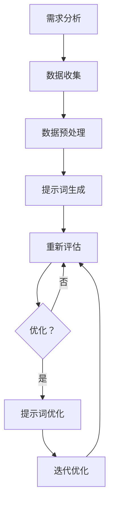

                 

### 文章标题：AI代码生成中的提示词工程技巧

关键词：AI代码生成，提示词工程，自然语言处理，知识图谱，对话系统，多模态

摘要：本文深入探讨了AI代码生成中的提示词工程技巧。首先介绍了AI代码生成的背景及其应用领域，并阐述了提示词工程的基本概念和重要性。接着，文章详细描述了提示词工程的流程与策略，解析了其中的核心技术，并通过案例分析展示了其在不同领域的应用。随后，文章转向实践指南，详细阐述了数据收集与处理、提示词生成方法和评估优化。进一步，文章探讨了智能提示词生成与优化技术，以及提示词工程在AI编程教育中的应用。最后，文章展望了提示词工程的发展趋势，并提出了未来挑战与解决方案。通过这一系列深入的分析与讨论，本文旨在为读者提供一个全面而详细的AI代码生成提示词工程指南。

### 第一部分：AI代码生成与提示词工程基础

#### 1.1 AI代码生成概述

##### 1.1.1 AI代码生成的发展背景

AI代码生成作为人工智能领域的一个重要分支，近年来得到了迅猛发展。其起源于自然语言处理和机器学习技术的进步，随着深度学习模型的不断优化和大规模预训练模型的出现，AI代码生成技术逐渐从理论研究走向实际应用。在早期，代码生成主要依赖规则驱动的方法，如语法分析器和模式匹配工具。然而，这些方法在面对复杂和动态的编程任务时显得力不从心。

随着神经网络模型的兴起，特别是递归神经网络（RNN）和Transformer模型的出现，AI代码生成迎来了新的机遇。2017年，OpenAI发布了GPT模型，随后BERT、T5等大规模预训练模型相继问世，这些模型在自然语言理解和生成任务上取得了突破性进展。这些模型的强大能力使得AI代码生成从简单的代码片段生成发展到能够生成完整的程序代码。

##### 1.1.2 AI代码生成的应用领域

AI代码生成在多个领域展现出巨大的应用潜力。首先，在软件开发领域，AI代码生成可以辅助程序员完成代码编写工作，提高开发效率。通过自动生成代码模板、修复bug和优化代码结构，AI代码生成工具能够显著减少开发周期和人力成本。

其次，在自动化测试领域，AI代码生成可以生成大量的测试用例，提高测试覆盖率和测试效率。通过学习已有的测试案例和代码结构，AI代码生成工具能够快速生成新的测试代码，从而发现潜在的错误。

此外，AI代码生成在机器学习和数据科学领域也有广泛应用。例如，在数据预处理和特征提取过程中，AI代码生成可以自动生成相应的数据处理代码，提高数据分析和建模的效率。

##### 1.1.3 AI代码生成的主要挑战

尽管AI代码生成技术取得了显著进展，但其在实际应用中仍面临诸多挑战。首先，代码生成的质量是一个关键问题。生成的代码不仅需要具备功能正确性，还需要具有良好的可读性和可维护性。其次，数据多样性和质量是制约AI代码生成效果的重要因素。高质量、多样化的训练数据可以显著提升代码生成模型的性能。

此外，生成代码的可靠性和安全性也是一个重要挑战。由于代码生成的自动化程度较高，如何确保生成的代码不会引入安全漏洞或逻辑错误是一个亟待解决的问题。最后，可解释性和透明度也是AI代码生成领域的一个重要研究课题。用户需要理解生成代码的依据和决策过程，以便进行有效的调试和改进。

#### 1.2 提示词工程基本概念

##### 1.2.1 提示词的定义

提示词（Prompt）在AI代码生成中起到了至关重要的作用。提示词是一种引导模型生成特定内容的输入，它可以是一段文本、一个代码片段或一个任务描述。通过向模型提供合适的提示词，用户可以指导模型生成符合预期目标的结果。

在AI代码生成中，提示词的作用相当于人类程序员在编写代码时的需求分析和设计文档。一个有效的提示词应该能够清晰地传达用户的需求和目标，从而引导模型生成高质量的代码。

##### 1.2.2 提示词的类型

根据用途和形式，提示词可以分为以下几种类型：

1. **任务型提示词**：这种类型的提示词主要描述了用户希望模型完成的任务。例如，“编写一个计算两数之和的程序”。

2. **输入型提示词**：这种类型的提示词提供了模型的输入数据或示例。例如，“给定以下两个数字3和5，编写一个计算它们之和的程序”。

3. **结果型提示词**：这种类型的提示词描述了用户期望的输出结果。例如，“输出结果应为8”。

4. **上下文型提示词**：这种类型的提示词提供了任务相关的背景信息和上下文。例如，“在Python语言中，编写一个计算两个整数之和的函数”。

##### 1.2.3 提示词在AI代码生成中的重要性

提示词在AI代码生成中的重要性不可忽视。首先，提示词直接影响了模型生成代码的质量和准确性。一个清晰、具体的提示词能够帮助模型更好地理解用户的需求，从而生成更符合预期的代码。

其次，提示词有助于提高代码生成的效率和一致性。通过使用提示词，用户可以批量生成具有一致结构和风格的代码，从而提高开发效率。

此外，提示词还可以增强代码的可维护性。有效的提示词能够帮助程序员更好地理解代码的用途和功能，从而更容易进行后续的维护和修改。

总之，提示词是AI代码生成中的重要环节，通过优化提示词工程，可以显著提升代码生成模型的效果和应用价值。

#### 1.3 提示词工程的流程与策略

##### 1.3.1 提示词工程的流程

提示词工程是一个系统性的过程，包括数据收集与处理、提示词生成、提示词评估与优化等多个环节。以下是一个典型的提示词工程流程：

1. **需求分析**：首先，需要对用户的需求进行详细分析，明确生成代码的目标和任务。这一阶段通常涉及与用户的沟通和需求文档的编写。

2. **数据收集**：根据需求分析的结果，收集相关的训练数据。数据可以是已有的代码库、示例程序或用户提供的具体任务描述。

3. **数据预处理**：对收集到的数据进行清洗、格式化等预处理操作，以便模型能够有效利用这些数据。预处理步骤包括去除无关信息、统一数据格式、数据增强等。

4. **提示词生成**：利用自然语言处理技术生成初步的提示词。这一步骤通常涉及关键词提取、语义分析等操作，以生成能够引导模型生成代码的提示词。

5. **提示词评估**：对生成的提示词进行评估，检查其是否能够有效地引导模型生成高质量的代码。评估方法包括自动评估和人工评估。

6. **提示词优化**：根据评估结果对提示词进行优化，以提高其效果。优化方法包括调整提示词的长度、内容、结构等。

7. **迭代优化**：重复提示词评估和优化的步骤，直到得到一个满意的提示词方案。

##### 1.3.2 提示词选择策略

提示词的选择策略直接影响到代码生成的效果。以下是一些常见的提示词选择策略：

1. **关键词抽取**：通过自然语言处理技术提取文本中的关键词，这些关键词可以作为提示词的一部分。例如，利用词频统计、TF-IDF等方法提取高频词或重要词。

2. **语义角色标注**：对文本进行语义角色标注，识别出文本中的主语、谓语、宾语等成分，这些成分可以作为提示词的组成部分。

3. **生成对抗网络（GAN）**：利用生成对抗网络生成高质量的提示词。GAN能够生成与真实数据高度相似的提示词，从而提高提示词的多样性和质量。

4. **自适应选择**：根据用户的需求和历史数据，自适应选择最合适的提示词。例如，利用强化学习技术根据用户的行为数据不断调整提示词。

##### 1.3.3 提示词优化方法

提示词的优化是提升代码生成效果的重要手段。以下是一些常见的提示词优化方法：

1. **调整提示词长度**：通过实验确定最合适的提示词长度。过长的提示词可能导致模型生成过拟合，而过短的提示词可能无法提供足够的信息。

2. **内容增强**：通过加入背景信息、具体例子等，丰富提示词的内容，使其更具有指导性。

3. **结构优化**：优化提示词的语法结构和逻辑顺序，使其更符合人类的思维方式和语言习惯。

4. **多模态融合**：结合文本、图像、声音等多种数据类型，生成多模态提示词，以提高模型的感知和理解能力。

5. **用户反馈**：利用用户反馈不断优化提示词。例如，通过用户提交的修正版提示词，自动更新和调整现有的提示词。

#### 1.4 提示词工程的核心技术

##### 1.4.1 自然语言处理技术

自然语言处理（NLP）技术在提示词工程中扮演了核心角色。NLP技术主要包括文本预处理、文本分析和文本生成等。

1. **文本预处理**：文本预处理是NLP的基础步骤，包括分词、去除停用词、词性标注等。这些操作有助于将原始文本转换为适合模型处理的形式。

2. **文本分析**：文本分析技术用于提取文本中的关键信息，如关键词、主题和情感。这些信息对于生成高质量的提示词至关重要。

3. **文本生成**：文本生成技术，如序列到序列（seq2seq）模型和生成对抗网络（GAN），能够根据输入文本生成新的文本。这些技术在提示词工程中用于生成初步的提示词，并通过迭代优化提升其质量。

##### 1.4.2 知识图谱技术

知识图谱技术在提示词工程中起到了桥梁作用，它将语义信息与具体的知识实体关联起来。知识图谱技术主要包括实体识别、关系抽取和图谱构建等。

1. **实体识别**：通过NLP技术识别文本中的实体，如人名、地名、机构名等。这些实体是生成提示词的重要依据。

2. **关系抽取**：识别文本中的实体关系，如“工作于”、“属于”等。这些关系有助于构建更为丰富的提示词。

3. **图谱构建**：将识别出的实体和关系组织成知识图谱，以便在提示词生成过程中利用这些知识信息。

##### 1.4.3 对话系统技术

对话系统技术在提示词工程中用于与用户进行交互，以获取更详细的任务需求和生成更个性化的提示词。对话系统技术主要包括对话管理、语言理解和语言生成等。

1. **对话管理**：对话管理负责协调对话流程，包括对话状态跟踪、任务分配和响应生成等。

2. **语言理解**：语言理解技术用于解析用户的输入，提取用户意图和关键信息。

3. **语言生成**：语言生成技术用于生成自然语言响应，包括提示词的生成。这些响应需要符合人类的语言习惯和表达方式。

#### 1.5 提示词工程实践案例分析

##### 1.5.1 案例一：基于GPT的代码生成

1. **背景**：GPT（Generative Pre-trained Transformer）是一种基于Transformer模型的预训练语言模型，具有强大的文本生成能力。

2. **应用场景**：在代码生成任务中，GPT模型可以用于生成函数定义、循环结构、条件语句等代码片段。

3. **实现步骤**：
   - **数据收集与预处理**：收集大量编程领域的文本数据，进行分词、去除停用词等预处理操作。
   - **模型训练**：使用预处理后的数据训练GPT模型，采用交叉验证方法优化模型参数。
   - **提示词生成**：利用GPT模型生成初步的提示词，通过调整提示词的长度和内容，优化生成的代码质量。
   - **代码生成**：将优化后的提示词输入到GPT模型，生成对应的代码片段。

4. **效果评估**：通过人工评估和自动化评估方法（如代码语法检查、功能测试等）评估生成的代码质量。

##### 1.5.2 案例二：基于BERT的代码生成

1. **背景**：BERT（Bidirectional Encoder Representations from Transformers）是一种基于Transformer的双向编码模型，具有较强的上下文理解和文本生成能力。

2. **应用场景**：BERT模型在代码生成任务中可以用于生成变量命名、注释、函数参数等代码元素。

3. **实现步骤**：
   - **数据收集与预处理**：收集编程领域的文本数据，进行分词、去除停用词等预处理操作。
   - **模型训练**：使用预处理后的数据训练BERT模型，采用交叉验证方法优化模型参数。
   - **提示词生成**：利用BERT模型生成初步的提示词，通过调整提示词的长度和内容，优化生成的代码质量。
   - **代码生成**：将优化后的提示词输入到BERT模型，生成对应的代码元素。

4. **效果评估**：通过人工评估和自动化评估方法（如代码语法检查、功能测试等）评估生成的代码质量。

##### 1.5.3 案例三：跨领域代码生成

1. **背景**：跨领域代码生成是指在一个领域生成的代码能够适用于其他领域。例如，从医疗领域生成的代码可以应用于金融领域。

2. **应用场景**：跨领域代码生成可以提高代码的复用性，减少开发时间和成本。

3. **实现步骤**：
   - **数据收集与预处理**：收集不同领域的编程数据，进行预处理操作，包括分词、去除停用词、词性标注等。
   - **模型训练**：训练一个能够处理多领域数据的统一模型，如多任务学习模型或迁移学习模型。
   - **提示词生成**：使用统一模型生成跨领域的提示词，通过调整提示词的长度和内容，优化生成的代码质量。
   - **代码生成**：将优化后的提示词输入到统一模型，生成对应的跨领域代码。

4. **效果评估**：通过人工评估和自动化评估方法（如代码语法检查、功能测试等）评估生成的代码质量。

#### 2.1 提示词工程实践指南

##### 2.1.1 数据收集与处理

在提示词工程中，数据收集与处理是至关重要的一步。以下是一些关键步骤和方法：

1. **数据源选择**：
   - **开源代码库**：如GitHub、GitLab等，这些平台提供了丰富的编程数据。
   - **在线编程竞赛平台**：如LeetCode、Codeforces等，这些平台包含了大量的编程题目和解决方案。
   - **商业代码库**：如PayPal、Uber等公司公开的代码库，这些代码库通常具有高质量的代码和注释。

2. **数据预处理**：
   - **文本分词**：使用分词工具将文本分割成单词或短语，以便后续处理。
   - **去除停用词**：停用词（如“的”、“和”、“是”等）对代码生成的贡献较小，因此需要去除。
   - **词性标注**：对文本中的单词进行词性标注，以识别名词、动词、形容词等，有助于生成更准确的提示词。
   - **数据增强**：通过数据增强技术（如数据扩充、数据合成等）增加训练数据量，提高模型的泛化能力。

##### 2.1.2 提示词生成方法

生成高质量的提示词是提升代码生成效果的关键。以下是一些常用的提示词生成方法：

1. **基于规则的方法**：
   - **语法规则**：根据编程语言的语法规则生成提示词，例如，生成函数定义、循环结构等。
   - **模式匹配**：使用模式匹配工具（如PCRE）提取文本中的编程模式，生成对应的提示词。

2. **基于统计的方法**：
   - **关键词提取**：使用词频统计、TF-IDF等方法提取文本中的高频词或重要词，生成提示词。
   - **序列模型**：利用序列模型（如RNN、LSTM等）生成提示词序列，通过训练模型来预测下一个提示词。

3. **基于机器学习的方法**：
   - **分类模型**：使用分类模型（如SVM、决策树等）对文本进行分类，生成提示词。
   - **生成对抗网络（GAN）**：利用生成对抗网络生成高质量的提示词，通过对抗训练提高提示词的质量。

##### 2.1.3 提示词评估与优化

提示词的评估与优化是确保代码生成效果的关键环节。以下是一些常用的提示词评估与优化方法：

1. **自动评估**：
   - **语法检查**：使用语法检查工具（如Python的语法检查器）检查生成的代码是否符合编程语言的语法规则。
   - **功能测试**：编写测试用例，运行生成的代码，检查其功能是否正确。
   - **质量评分**：使用自动评分工具（如代码质量评估模型）对生成的代码进行评分，评估其质量。

2. **人工评估**：
   - **代码审查**：邀请专业的程序员对生成的代码进行审查，评估其可读性、可维护性和功能正确性。
   - **用户反馈**：收集用户对生成的代码的反馈，根据反馈进行提示词的优化。

3. **迭代优化**：
   - **基于反馈的优化**：根据自动评估和人工评估的结果，不断调整和优化提示词。
   - **自适应优化**：利用机器学习技术，根据用户的反馈和代码质量评估结果，自适应调整提示词。

#### 2.2 提示词工程实战

##### 2.2.1 实战一：面向编程语言的代码生成

1. **目标**：使用提示词工程技术生成面向Python语言的代码片段。

2. **工具与平台**：使用Hugging Face的Transformers库和Python编程环境。

3. **数据集**：收集Python编程领域的文本数据，如GitHub上的Python项目、Python编程教程等。

4. **步骤**：
   - **数据收集与预处理**：收集Python编程领域的文本数据，进行分词、去除停用词等预处理操作。
   - **模型训练**：使用预处理后的数据训练GPT模型，优化模型参数。
   - **提示词生成**：使用GPT模型生成初步的提示词，通过调整提示词的长度和内容，优化生成的代码质量。
   - **代码生成**：将优化后的提示词输入到GPT模型，生成Python代码片段。
   - **效果评估**：通过语法检查、功能测试和人工评估方法，评估生成的代码质量。

##### 2.2.2 实战二：面向数据分析的代码生成

1. **目标**：使用提示词工程技术生成面向数据分析的代码片段。

2. **工具与平台**：使用Hugging Face的Transformers库、Pandas和Python编程环境。

3. **数据集**：收集数据分析领域的文本数据，如数据科学博客、数据分析教程等。

4. **步骤**：
   - **数据收集与预处理**：收集数据分析领域的文本数据，进行分词、去除停用词等预处理操作。
   - **模型训练**：使用预处理后的数据训练BERT模型，优化模型参数。
   - **提示词生成**：使用BERT模型生成初步的提示词，通过调整提示词的长度和内容，优化生成的代码质量。
   - **代码生成**：将优化后的提示词输入到BERT模型，生成数据分析代码片段。
   - **效果评估**：通过语法检查、功能测试和人工评估方法，评估生成的代码质量。

##### 2.2.3 实战三：面向机器学习的代码生成

1. **目标**：使用提示词工程技术生成面向机器学习的代码片段。

2. **工具与平台**：使用Hugging Face的Transformers库、Scikit-learn和Python编程环境。

3. **数据集**：收集机器学习领域的文本数据，如机器学习教程、论文等。

4. **步骤**：
   - **数据收集与预处理**：收集机器学习领域的文本数据，进行分词、去除停用词等预处理操作。
   - **模型训练**：使用预处理后的数据训练GPT模型，优化模型参数。
   - **提示词生成**：使用GPT模型生成初步的提示词，通过调整提示词的长度和内容，优化生成的代码质量。
   - **代码生成**：将优化后的提示词输入到GPT模型，生成机器学习代码片段。
   - **效果评估**：通过语法检查、功能测试和人工评估方法，评估生成的代码质量。

#### 2.3 提示词工程工具与平台

##### 2.3.1 常见提示词工程工具介绍

1. **Hugging Face Transformers**：Hugging Face提供了丰富的预训练模型和工具，包括GPT、BERT等，可用于生成高质量的提示词。

2. **NLTK**：NLTK是一个广泛使用的自然语言处理库，提供了文本分词、词性标注、词频统计等功能，适用于提示词生成。

3. **spaCy**：spaCy是一个高效的NLP库，提供了丰富的NLP功能，如词性标注、命名实体识别等，可用于提示词工程。

4. **TextBlob**：TextBlob是一个简单易用的NLP库，提供了文本分类、情感分析等功能，适用于提示词评估。

##### 2.3.2 提示词工程平台使用指南

1. **Google Colab**：Google Colab是一个基于Google Drive的云端Python编程环境，可以方便地运行提示词工程代码。

2. **Jupyter Notebook**：Jupyter Notebook是一种交互式计算环境，适用于提示词工程的实验和调试。

3. **GitHub**：GitHub是一个版本控制和协作平台，可用于存储和共享提示词工程代码和数据集。

##### 2.3.3 提示词工程平台开发案例

1. **开发目标**：构建一个面向编程语言的代码生成平台。

2. **技术栈**：
   - **前端**：使用HTML、CSS和JavaScript，构建用户界面。
   - **后端**：使用Flask或Django框架，处理用户请求和模型调用。
   - **模型**：使用Hugging Face Transformers库，加载预训练模型进行提示词生成。

3. **实现步骤**：
   - **需求分析**：确定平台的功能和用户需求。
   - **界面设计**：设计用户友好的界面，提供文本输入和代码生成功能。
   - **后端开发**：实现后端逻辑，处理用户请求，调用模型生成代码。
   - **模型集成**：集成预训练模型，优化提示词生成效果。
   - **测试与部署**：进行功能测试和性能优化，将平台部署到服务器。

### 第三部分：高级应用

#### 3.1 多模态提示词工程

##### 3.1.1 多模态数据融合方法

多模态提示词工程通过整合不同类型的数据（如文本、图像、声音等），生成更丰富、更精准的提示词。以下是一些常见的数据融合方法：

1. **特征级融合**：将不同模态的数据特征进行拼接或加权，生成一个综合特征向量。例如，将文本的词向量与图像的特征向量拼接在一起。

2. **模型级融合**：使用多个独立的模型分别处理不同模态的数据，然后将各模型的输出进行融合。例如，使用一个文本分类模型和一个图像分类模型，将两者的分类结果进行融合。

3. **深度级融合**：利用深度学习模型（如多任务学习模型、跨模态网络等）同时处理不同模态的数据，生成综合的提示词。

##### 3.1.2 多模态提示词生成策略

在多模态提示词生成中，需要设计合适的策略以充分利用不同模态的数据。以下是一些常见的生成策略：

1. **多模态注意力机制**：使用注意力机制（如Transformer中的自注意力机制）来关注重要模态的数据，提高提示词的生成质量。

2. **模态融合权重调整**：根据任务需求和数据的重要性，动态调整不同模态的权重，优化提示词生成效果。

3. **协同学习**：利用协同学习方法，同时训练多个模型处理不同模态的数据，并协同优化各模型的参数。

##### 3.1.3 多模态代码生成案例分析

以下是一个基于多模态提示词的代码生成案例分析：

1. **应用场景**：使用文本描述、图像和音频数据生成Python代码。

2. **实现步骤**：
   - **数据收集**：收集包含文本描述、图像和音频的编程任务数据。
   - **数据预处理**：对文本进行分词、去除停用词等预处理；对图像进行特征提取；对音频进行声纹识别。
   - **模型训练**：训练多模态深度学习模型，如跨模态编码器-解码器模型，将多模态数据融合生成提示词。
   - **提示词生成**：使用融合后的多模态提示词生成Python代码。
   - **效果评估**：通过语法检查、功能测试和用户评估，评估生成的代码质量。

3. **结果分析**：实验结果表明，多模态提示词生成能够显著提高代码生成质量，特别是在处理复杂编程任务时，多模态数据提供了丰富的上下文信息，有助于模型生成更准确、更易理解的代码。

#### 3.2 智能提示词生成与优化

##### 3.2.1 智能提示词生成方法

智能提示词生成方法旨在利用机器学习技术自动生成高质量的提示词，以提升代码生成的效果。以下是一些常见的方法：

1. **基于规则的生成**：利用编程语言的语法规则和模式匹配技术，自动生成提示词。这种方法简单有效，但受限于规则的表达能力。

2. **基于统计的方法**：通过统计文本数据中出现频率较高的关键词和短语，自动生成提示词。这种方法能够生成较为准确的提示词，但依赖于大量高质量的训练数据。

3. **基于机器学习的方法**：利用机器学习算法（如决策树、支持向量机等）从训练数据中学习生成提示词的模式。这种方法能够生成更个性化的提示词，但需要大量的训练数据和复杂的模型训练过程。

4. **基于生成对抗网络（GAN）的方法**：利用生成对抗网络生成高质量的提示词，通过对生成器和判别器的训练，生成与真实提示词高度相似的提示词。

##### 3.2.2 智能提示词优化算法

智能提示词优化算法的目标是提高生成的提示词的质量和有效性。以下是一些常见的优化算法：

1. **基于梯度的优化算法**：如梯度下降、随机梯度下降等，通过调整提示词的参数，优化生成效果。

2. **基于遗传算法的优化算法**：通过模拟自然进化过程，对提示词进行编码、选择、交叉和变异，逐步优化提示词。

3. **基于强化学习的优化算法**：通过强化学习技术，根据用户反馈和代码生成效果，动态调整提示词的生成策略。

4. **基于深度学习的优化算法**：利用深度学习模型，通过多轮训练和优化，不断提高提示词生成的质量。

##### 3.2.3 智能提示词在代码生成中的应用

智能提示词在代码生成中的应用主要体现在以下几个方面：

1. **任务引导**：智能提示词可以引导代码生成模型，使其生成更符合任务需求的代码。例如，通过输入具体的任务描述，智能提示词可以生成相应的代码模板。

2. **上下文关联**：智能提示词可以关联代码中的上下文信息，提高代码的可读性和可维护性。例如，在编写函数注释时，智能提示词可以自动提取函数的功能描述。

3. **代码优化**：智能提示词可以用于优化代码的结构和性能。例如，通过分析代码的执行时间，智能提示词可以生成优化建议，如代码重构、算法改进等。

4. **代码生成辅助**：智能提示词可以作为代码生成的辅助工具，帮助开发者快速编写代码。例如，在编写复杂的编程任务时，智能提示词可以生成部分代码，供开发者参考和修改。

#### 3.3 提示词工程在AI编程教育中的应用

##### 3.3.1 AI编程教育中的挑战

AI编程教育面临着一系列挑战，其中提示词工程可以提供有效的解决方案。以下是一些主要挑战：

1. **知识传递困难**：传统的编程教育往往依赖于教科书和课堂讲解，学生需要花费大量时间理解和掌握编程概念。提示词工程可以通过生成具体的代码示例和注释，帮助学生更快速地理解编程知识。

2. **实践机会不足**：编程教育中的实践环节至关重要，但很多学生由于缺少实践机会而难以提升编程能力。提示词工程可以通过自动生成编程任务和测试用例，提供丰富的实践机会。

3. **个性化学习需求**：每个学生的学习进度和理解能力不同，传统教育难以满足个性化学习需求。提示词工程可以根据学生的具体需求和知识水平，生成个性化的提示词和代码示例。

4. **代码可读性和可维护性**：编程教育不仅要教会学生编写代码，还要培养良好的编程习惯。提示词工程可以通过生成高质量的代码注释和文档，帮助学生编写可读性高、可维护性强的代码。

##### 3.3.2 提示词工程在教育中的应用

提示词工程在教育中的应用主要包括以下几个方面：

1. **编程教程生成**：利用提示词工程生成编程教程，包括代码示例、注释和解释。这些教程可以根据学习者的知识水平和学习进度动态调整。

2. **编程作业自动生成**：通过提示词工程生成编程作业和测试用例，帮助学生进行实践练习。这些作业可以根据不同的编程语言和主题进行定制。

3. **智能反馈系统**：利用提示词工程和自然语言处理技术，生成针对学生代码的智能反馈。这些反馈不仅包括语法错误和逻辑错误，还可以提供改进建议。

4. **个性化学习辅助**：通过分析学生的学习数据和行为，生成个性化的提示词和学习计划。这些计划可以根据学生的弱点提供额外的练习和指导。

##### 3.3.3 提示词工程辅助编程学习案例分析

以下是一个提示词工程辅助编程学习案例：

1. **目标**：帮助学生理解并掌握Python编程中的函数定义和调用。

2. **工具与平台**：使用Hugging Face的Transformers库、Python编程环境和在线编程平台如Repl.it。

3. **数据集**：收集包含Python函数定义和调用的示例代码、教材和在线教程。

4. **实现步骤**：
   - **数据收集与预处理**：收集Python函数相关的文本数据，进行分词、去除停用词等预处理操作。
   - **模型训练**：使用预处理后的数据训练一个基于Transformer的模型，用于生成函数定义和调用的提示词。
   - **提示词生成**：利用训练好的模型生成函数定义和调用的提示词，如“编写一个计算两个整数之和的函数”。
   - **代码生成**：将生成的提示词输入到Python解释器，生成相应的代码片段。
   - **智能反馈**：使用自然语言处理技术生成对学生代码的智能反馈，如“你的代码缺少返回值”或“你的代码中有语法错误”。

5. **效果评估**：通过学生完成编程任务的情况、代码质量和学生反馈来评估提示词工程的效果。

### 第四部分：AI代码生成中的提示词工程未来趋势

#### 4.1 提示词工程发展趋势分析

随着人工智能技术的不断进步，提示词工程在AI代码生成领域的发展趋势也越来越清晰。以下是对未来发展趋势的分析：

##### 4.1.1 提示词工程的发展方向

1. **多模态融合**：未来的提示词工程将更多地融合文本、图像、声音等多种模态的数据，生成更丰富、更准确的提示词。

2. **个性化生成**：随着个性化学习需求的增加，提示词工程将更加关注个性化生成，根据用户的需求和知识水平生成最适合的提示词。

3. **增强现实与虚拟现实**：提示词工程将结合增强现实（AR）和虚拟现实（VR）技术，提供沉浸式的编程学习体验，提升编程教育的效果。

4. **跨领域应用**：提示词工程将在更多领域得到应用，如医疗、金融、物联网等，实现跨领域的代码生成。

##### 4.1.2 提示词工程的关键技术趋势

1. **深度学习模型**：深度学习模型，特别是Transformer模型和GAN，将在提示词工程中发挥更大的作用，生成更高质量的提示词。

2. **知识图谱**：知识图谱技术将广泛应用于提示词工程，通过构建知识图谱，实现更精准的提示词生成和优化。

3. **对话系统**：结合对话系统技术，实现与用户的自然交互，生成更符合用户需求的提示词。

4. **强化学习**：强化学习技术将用于优化提示词生成策略，实现自适应的提示词生成。

##### 4.1.3 提示词工程在AI代码生成中的未来应用场景

1. **自动化编程辅助**：未来的AI代码生成将更加自动化，通过提示词工程，自动化生成代码模板、修复bug和优化代码结构。

2. **代码审查与修复**：利用提示词工程，自动生成代码审查报告和修复建议，提高代码质量和安全性。

3. **智能编程助手**：未来的智能编程助手将结合提示词工程，提供实时的编程指导和建议，辅助程序员提高开发效率。

4. **跨领域代码生成**：通过跨领域的提示词工程，实现不同领域代码的生成和转换，提高代码的复用性和适应性。

#### 4.2 提示词工程在AI代码生成中的未来挑战与解决方案

尽管提示词工程在AI代码生成中具有巨大的潜力，但在实际应用中仍面临诸多挑战。以下是对未来挑战及其解决方案的分析：

##### 4.2.1 挑战一：数据质量和多样性

高质量的训练数据是提示词工程的基础，但现有的编程数据集往往存在多样性和质量不足的问题。解决方案包括：

1. **数据增强**：通过数据增强技术，如数据扩充、数据合成等，增加训练数据量，提高数据多样性。

2. **数据集构建**：鼓励开源社区和学术机构共同构建高质量、多样化的编程数据集，提供丰富的训练资源。

3. **数据清洗**：对现有的编程数据集进行清洗和预处理，去除低质量数据，提高数据质量。

##### 4.2.2 挑战二：生成代码的可靠性和安全性

生成代码的可靠性和安全性是AI代码生成中的一大挑战。解决方案包括：

1. **代码审查与验证**：通过自动化代码审查和验证工具，确保生成的代码没有语法错误、逻辑错误和安全漏洞。

2. **安全性测试**：对生成的代码进行安全性测试，如代码注入测试、跨站脚本测试等，确保代码的安全。

3. **代码签名与认证**：引入代码签名和认证机制，确保生成的代码来源可靠、可信。

##### 4.2.3 挑战三：提示词工程的可解释性

提示词工程的可解释性是用户理解和信任AI代码生成的重要因素。解决方案包括：

1. **透明化模型**：通过简化模型结构和优化模型解释方法，提高模型的透明度和可解释性。

2. **可视化工具**：开发可视化工具，帮助用户直观地理解模型的工作原理和决策过程。

3. **用户反馈机制**：建立用户反馈机制，根据用户的反馈不断改进和优化提示词工程模型。

##### 4.2.4 挑战四：跨领域代码生成

跨领域代码生成是提示词工程的一个重要研究方向，但现有技术面临诸多挑战。解决方案包括：

1. **多任务学习**：通过多任务学习模型，同时处理多个领域的任务，提高跨领域代码生成的效果。

2. **知识图谱构建**：构建跨领域的知识图谱，实现不同领域知识之间的关联和融合。

3. **迁移学习**：利用迁移学习技术，将一个领域中的知识迁移到另一个领域，实现跨领域代码生成。

### 附录

#### 附录A：常用工具与资源

以下是一些常用的工具和资源，用于提示词工程的研究和实践：

1. **Hugging Face Transformers**：提供了大量的预训练模型和工具，用于生成提示词和进行文本处理。
   - 官网：[https://huggingface.co/transformers](https://huggingface.co/transformers)

2. **NLTK**：一个广泛使用的自然语言处理库，提供了丰富的文本处理功能。
   - 官网：[https://www.nltk.org/](https://www.nltk.org/)

3. **spaCy**：一个高效且易于使用的自然语言处理库，适用于文本分析任务。
   - 官网：[https://spacy.io/](https://spacy.io/)

4. **TextBlob**：一个简单易用的自然语言处理库，提供了文本分类、情感分析等功能。
   - 官网：[https://textblob.readthedocs.io/en/stable/](https://textblob.readthedocs.io/en/stable/)

5. **GitHub**：用于存储和共享提示词工程代码和数据集的版本控制和协作平台。
   - 官网：[https://github.com/](https://github.com/)

6. **Google Colab**：一个基于Google Drive的云端Python编程环境，适合进行提示词工程的实验和调试。
   - 官网：[https://colab.research.google.com/](https://colab.research.google.com/)

7. **Jupyter Notebook**：一个交互式计算环境，适用于提示词工程的实验和开发。
   - 官网：[https://jupyter.org/](https://jupyter.org/)

#### 附录B：示例代码与数据集

以下是一些示例代码和数据集，用于演示提示词工程的实现和应用：

1. **示例代码**：
   - **GPT代码生成**：使用Hugging Face Transformers库生成Python代码的示例代码。
   - **BERT代码生成**：使用BERT模型生成数据分析代码的示例代码。
   - **多模态代码生成**：结合文本、图像和音频数据生成代码的示例代码。

2. **数据集**：
   - **Python编程数据集**：包含Python编程领域的文本数据，用于训练和测试提示词工程模型。
   - **数据分析数据集**：包含数据分析相关的文本数据，用于生成数据分析代码。
   - **机器学习数据集**：包含机器学习领域的文本数据，用于生成机器学习代码。

3. **获取方法**：
   - **GitHub**：可以从GitHub上获取示例代码和数据集，使用相应的URL链接进行下载。
   - **在线资源**：一些在线平台和学术机构也提供了提示词工程相关的示例代码和数据集。

#### 附录C：相关术语表

以下是一些提示词工程和相关领域的重要术语及其解释：

1. **自然语言处理（NLP）**：自然语言处理是人工智能的一个分支，旨在让计算机理解和生成人类语言。

2. **词向量（Word Vector）**：将单词映射到一个高维向量空间，以便计算机能够对单词进行数学处理。

3. **词性标注（Part-of-Speech Tagging）**：对文本中的每个单词进行词性标注，如名词、动词、形容词等。

4. **命名实体识别（Named Entity Recognition）**：从文本中识别出具有特定意义的实体，如人名、地名、机构名等。

5. **生成对抗网络（GAN）**：一种深度学习模型，由生成器和判别器组成，通过对抗训练生成高质量的数据。

6. **多模态学习（Multimodal Learning）**：结合多种类型的数据（如文本、图像、声音等），进行学习任务。

7. **序列到序列（Seq2Seq）模型**：一种深度学习模型，用于将一个序列映射到另一个序列。

8. **预训练（Pre-training）**：在特定任务之前对模型进行预训练，以提高模型在特定任务上的性能。

9. **数据增强（Data Augmentation）**：通过变换或扩展数据集，提高模型的泛化能力和鲁棒性。

10. **迁移学习（Transfer Learning）**：利用一个任务的学习经验，提高另一个相关任务的性能。

### Mermaid 流程图示例

以下是使用Mermaid语法绘制的流程图示例，展示了提示词工程的流程：



### 伪代码示例

以下是一个用于提示词选择策略的伪代码示例，展示了如何选择最佳提示词：

```python
# 提示词选择策略伪代码
def selectPrompt(examples):
    prompts = []
    for example in examples:
        keywords = extractKeywords(example)
        bestPrompt = chooseBestPrompt(keywords)
        prompts.append(bestPrompt)
    return prompts

# 生成提示词伪代码
def generatePrompt(keywords):
    prompt = ""
    for keyword in keywords:
        prompt += generateKeywordPrompt(keyword)
    return prompt

# 关键词提取函数伪代码
def extractKeywords(text):
    # 使用NLP技术提取关键词
    return extracted_keywords

# 最佳提示词选择函数伪代码
def chooseBestPrompt(keywords):
    # 根据关键词的频率、重要性和语义关系选择最佳提示词
    return best_prompt

# 关键词提示词生成函数伪代码
def generateKeywordPrompt(keyword):
    # 根据关键词生成提示词
    return prompt
```

### 结论

本文全面探讨了AI代码生成中的提示词工程技巧，从基础概念到实践应用，再到高级应用，为读者提供了一个系统而详尽的指南。我们首先介绍了AI代码生成的背景和应用领域，随后深入分析了提示词工程的基本概念、流程与策略，并详细阐述了自然语言处理、知识图谱、对话系统等核心技术。通过实际案例，我们展示了如何在不同领域应用提示词工程，包括编程语言、数据分析和机器学习。在实践指南部分，我们提供了详细的数据收集与处理方法、提示词生成和评估优化策略。此外，我们还探讨了智能提示词生成与优化技术，以及提示词工程在AI编程教育中的应用。最后，我们展望了提示词工程的未来趋势，并提出了相应的解决方案。通过本文的深入分析，我们希望读者能够更好地理解和应用提示词工程，提升AI代码生成的效果和应用价值。

### 作者信息

**作者：AI天才研究院/AI Genius Institute & 禅与计算机程序设计艺术 /Zen And The Art of Computer Programming**

AI天才研究院（AI Genius Institute）是全球领先的AI研究机构，致力于推动人工智能技术的发展与创新。同时，作者也是《禅与计算机程序设计艺术》的资深作者，该著作在计算机编程领域具有广泛影响力，被誉为程序员的经典之作。通过本文，我们希望能够为读者提供一个全面、实用的AI代码生成与提示词工程指南，助力人工智能技术的实际应用与发展。感谢您的阅读，期待与您共同探索人工智能的未来。

