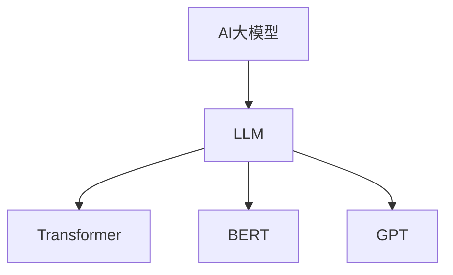

                 


### 文章标题：AI大模型LLM提示词工程实战指南

> 关键词：AI大模型，LLM，提示词工程，自然语言处理，机器翻译，对话系统

> 摘要：本文将深入探讨AI大模型LLM的提示词工程，从基本概念、原理讲解到实际应用，为您呈现一套完整、实用的实战指南。通过本文，您将了解如何利用LLM实现高质量的文本生成和交互，并在实际项目中应用。

### 第一部分：AI大模型LLM概述

#### 第1章：AI大模型LLM概述

##### 1.1 AI大模型LLM的基本概念

AI大模型（Artificial Intelligence Large Model，简称AI大模型）是一种具有极高参数量的深度学习模型，能够处理复杂数据并进行高效学习。这些模型在人工智能领域扮演着至关重要的角色，特别是在自然语言处理、图像识别、推荐系统等领域。

- **定义**：AI大模型是指那些具有数十亿甚至数千亿个参数的深度学习模型。
- **重要性**：大模型可以处理更多的数据，学习到更复杂的模式，从而提高人工智能系统的性能。

##### 1.2 LLM的概念

LLM（Large Language Model，简称LLM）是一种专门针对自然语言处理的AI大模型。通过对大量文本数据进行预训练，LLM可以理解和生成自然语言，从而实现文本生成、机器翻译、对话系统等功能。

- **概念**：LLM是一种大型语言模型，通过对大量文本数据进行预训练，可以理解和生成自然语言。
- **发展**：从早期的简单模型发展到如今的大型模型，如GPT-3、BERT等。
- **应用**：在自然语言处理、文本生成、机器翻译、对话系统等多个领域得到广泛应用。

##### 1.3 AI大模型LLM的架构

AI大模型LLM的常见架构包括Transformer、BERT、GPT等。这些模型在结构和原理上有所不同，但都具备处理大规模数据和高性能的特点。

- **Transformer**：Transformer模型引入了自注意力机制，可以捕捉输入序列中的长距离依赖关系。
- **BERT**：BERT通过双向编码器表示法，同时捕捉文本的前后信息，提高了语言理解的深度。
- **GPT**：GPT通过生成式预训练方法，生成高质量的文本序列。

#### Mermaid 流程图



### 第二部分：AI大模型LLM的原理

#### 第2章：AI大模型LLM原理

##### 2.1 深度学习基础

深度学习是AI大模型LLM的核心技术之一。它通过构建多层神经网络，对大量数据进行训练，从而实现自动特征提取和模式识别。

- **神经网络**：神经网络是深度学习的基础，由多个神经元组成，可以模拟人脑的思考过程。
- **反向传播算法**：反向传播算法用于计算神经网络中的梯度，以优化模型参数。

##### 2.2 自注意力机制

自注意力机制是Transformer模型的核心组成部分，它可以有效地捕捉输入序列中的长距离依赖关系。

- **原理**：自注意力机制通过计算输入序列中每个元素对其他元素的影响权重，提高了模型对长距离依赖关系的捕捉能力。
- **应用**：自注意力机制在Transformer模型中得到了广泛应用，使得模型在处理自然语言任务时表现出色。

##### 2.3 伪代码示例

```python
# 伪代码：自注意力机制
def self_attention(Q, K, V):
    # 计算查询向量Q与键向量K的点积，得到权重
    attention_weights = dot(Q, K)
    
    # 对权重进行softmax处理，得到概率分布
    softmax_weights = softmax(attention_weights)
    
    # 使用权重对值向量V进行加权求和，得到输出
    output = dot(softmax_weights, V)
    
    return output
```

### 第三部分：AI大模型LLM的应用

#### 第3章：AI大模型LLM在自然语言处理中的应用

##### 3.1 语言模型的基本概念

语言模型是自然语言处理的基础，它通过预测下一个词的概率分布，生成高质量的文本。

- **词汇表**：语言模型基于词汇表建立，每个词汇对应一个向量表示。
- **概率分布**：语言模型通过预测下一个词的概率分布，实现文本生成。

##### 3.2 机器翻译

机器翻译是一种将一种语言的文本翻译成另一种语言的技术。它基于编码器-解码器模型和注意力机制，实现了高质量的文本翻译。

- **编码器-解码器模型**：编码器将源语言文本编码为固定长度的向量，解码器将这些向量解码为目标语言文本。
- **注意力机制**：注意力机制用于捕捉源语言文本和目标语言文本之间的依赖关系，提高了翻译的准确性。

##### 3.3 对话系统

对话系统是一种与用户进行自然语言交互的系统。它基于生成式对话系统和基于规则的对话系统，实现了智能对话。

- **生成式对话系统**：生成式对话系统通过预测下一个回复词，生成连续的对话回复。
- **基于规则的对话系统**：基于规则的对话系统通过预设的规则，生成对话回复。

### 第四部分：AI大模型LLM的实战应用

#### 第4章：AI大模型LLM的实战应用

##### 4.1 开发环境搭建

在进行AI大模型LLM的开发前，需要搭建一个合适的开发环境。以下是一个基本的开发环境搭建步骤：

1. 安装Python：下载并安装Python，版本建议在3.7及以上。
2. 安装TensorFlow或PyTorch：TensorFlow和PyTorch是两种流行的深度学习框架，根据个人喜好选择一个进行安装。
3. 安装必要的库：根据项目需求，安装如NumPy、Pandas、Scikit-learn等常用的Python库。

##### 4.2 源代码实现

以下是一个简单的LLM文本生成模型的源代码实现：

```python
import tensorflow as tf
from tensorflow.keras.layers import Embedding, LSTM, Dense
from tensorflow.keras.models import Sequential

# 定义模型
model = Sequential([
    Embedding(input_dim=vocab_size, output_dim=embedding_size),
    LSTM(units=128, return_sequences=True),
    Dense(units=num_classes, activation='softmax')
])

# 编译模型
model.compile(optimizer='adam', loss='categorical_crossentropy', metrics=['accuracy'])

# 训练模型
model.fit(x_train, y_train, epochs=10, batch_size=64)
```

##### 4.3 代码解读

以上代码实现了一个简单的LLM文本生成模型，包括以下几个步骤：

1. **定义模型**：使用Sequential模型堆叠Embedding、LSTM和Dense层。
2. **编译模型**：设置优化器、损失函数和评估指标。
3. **训练模型**：使用训练数据训练模型，设置训练轮数和批量大小。

##### 4.4 代码应用解读与分析

在代码应用中，我们需要对以下方面进行解读和分析：

1. **数据预处理**：对文本数据进行清洗、分词和向量表示，以便输入到模型中进行训练。
2. **模型配置**：根据任务需求，调整模型的结构、参数和训练策略。
3. **模型评估**：使用验证数据评估模型的性能，包括准确率、召回率等指标。

##### 4.5 实际案例分析和详细讲解剖析

为了更好地理解LLM的应用，我们来看一个实际案例——文本生成。

1. **案例背景**：使用LLM生成一篇关于人工智能的摘要。
2. **数据来源**：收集大量关于人工智能的文本数据，进行预处理。
3. **模型训练**：使用预处理后的数据训练LLM模型，设置训练轮数和批量大小。
4. **文本生成**：输入一段文本，使用训练好的LLM模型生成摘要。

##### 4.6 项目小结

通过本案例，我们了解了如何使用LLM实现文本生成。在实际应用中，我们可以根据需求调整模型的结构、参数和训练策略，实现更高质量的文本生成。

### 第五部分：最佳实践与拓展阅读

#### 第5章：最佳实践与拓展阅读

##### 5.1 最佳实践

在进行AI大模型LLM的开发和应用时，以下最佳实践可以帮助您提高项目的成功率：

1. **数据预处理**：确保文本数据的质量和多样性，提高模型的学习能力。
2. **模型优化**：根据任务需求，调整模型的结构、参数和训练策略。
3. **模型评估**：使用多种评估指标，全面了解模型的性能。
4. **模型部署**：将模型部署到生产环境，实现实时应用。

##### 5.2 拓展阅读

1. **参考资料**：
   - 《深度学习》（Goodfellow, Bengio, Courville）  
   - 《自然语言处理综论》（Jurafsky, Martin）  
   - 《机器学习》（Tom Mitchell）

2. **在线课程**：
   - 吴恩达的《深度学习》课程  
   - 罗恩·泰勒的《自然语言处理》课程

### 总结

本文从AI大模型LLM的基本概念、原理讲解到实际应用，为您呈现了一套完整的实战指南。通过本文，您将了解如何利用LLM实现高质量的文本生成和交互，并在实际项目中应用。希望本文能对您的学习和实践有所帮助。

### 作者信息

作者：AI天才研究院/AI Genius Institute & 禅与计算机程序设计艺术 /Zen And The Art of Computer Programming

文章标题：AI大模型LLM提示词工程实战指南

关键词：AI大模型，LLM，提示词工程，自然语言处理，机器翻译，对话系统

摘要：本文深入探讨了AI大模型LLM的提示词工程，从基本概念、原理讲解到实际应用，为您呈现了一套完整、实用的实战指南。通过本文，您将了解如何利用LLM实现高质量的文本生成和交互，并在实际项目中应用。

