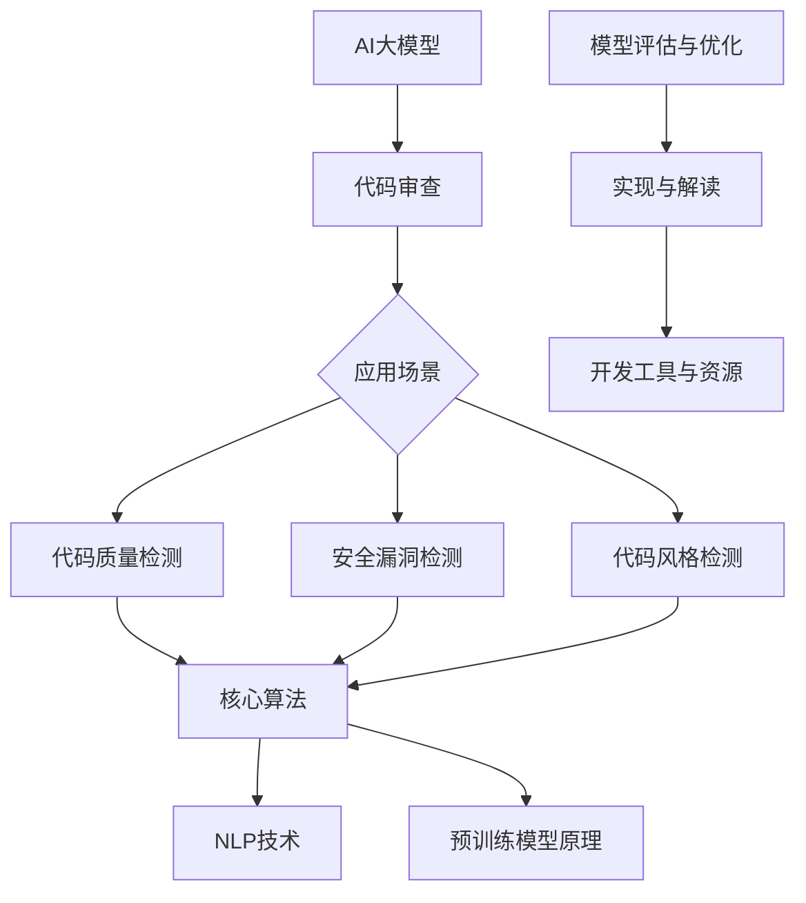
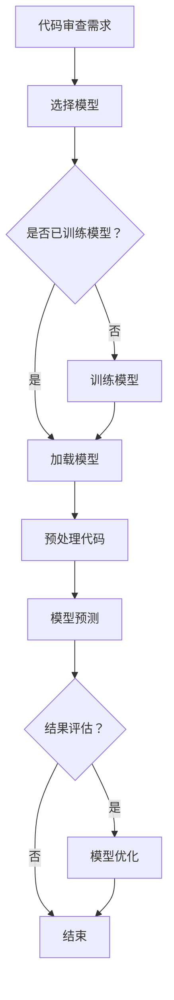

                 

### 文章标题：AI大模型在代码审查中的应用

#### 关键词：
- AI大模型
- 代码审查
- 自然语言处理
- 预训练模型
- 安全漏洞检测
- 代码风格优化

#### 摘要：
本文深入探讨了AI大模型在代码审查中的应用，通过介绍AI大模型的基本概念、发展历程、核心技术，以及代码审查的基本概念和过程，揭示了AI大模型在代码质量检测、安全漏洞检测和代码风格检测等方面的应用场景和具体实现。文章详细分析了AI大模型在代码审查中的核心算法原理，通过实例展示了AI大模型在实际项目中的应用效果，并讨论了AI大模型在代码审查中的评估与优化策略。最后，文章给出了AI大模型在代码审查中开发工具与资源的推荐，以及代码示例和实战案例，为读者提供了全面而实用的指导。

### 目录大纲

# 《AI大模型在代码审查中的应用》

## 第一部分：AI大模型与代码审查概述

### 第1章：AI大模型基础

#### 1.1 AI大模型的概念与背景

##### 1.1.1 AI大模型的发展历程

##### 1.1.2 AI大模型的分类

##### 1.1.3 AI大模型的核心技术

#### 1.2 代码审查的基本概念

##### 1.2.1 代码审查的重要性

##### 1.2.2 代码审查的类型

##### 1.2.3 代码审查的过程

### 第2章：AI大模型在代码审查中的应用场景

#### 2.1 代码质量检测

##### 2.1.1 AI大模型在静态代码分析中的应用

##### 2.1.2 AI大模型在动态代码分析中的应用

#### 2.2 安全漏洞检测

##### 2.2.1 AI大模型在安全漏洞识别中的应用

##### 2.2.2 AI大模型在安全漏洞修复中的应用

#### 2.3 代码风格检测

##### 2.3.1 AI大模型在代码风格规范中的应用

##### 2.3.2 AI大模型在代码风格优化中的应用

## 第二部分：AI大模型在代码审查中的具体应用

### 第3章：AI大模型在代码审查中的核心算法

#### 3.1 自然语言处理技术

##### 3.1.1 词嵌入技术

##### 3.1.2 序列模型与注意力机制

##### 3.1.3 转换器架构详解

#### 3.2 预训练模型原理

##### 3.2.1 预训练的概念与意义

##### 3.2.2 自监督学习方法

##### 3.2.3 迁移学习与微调技术

### 第4章：AI大模型在代码审查中的应用实例

#### 4.1 代码质量检测实例

##### 4.1.1 静态代码分析实例

##### 4.1.2 动态代码分析实例

#### 4.2 安全漏洞检测实例

##### 4.2.1 安全漏洞识别实例

##### 4.2.2 安全漏洞修复实例

#### 4.3 代码风格检测实例

##### 4.3.1 代码风格规范实例

##### 4.3.2 代码风格优化实例

### 第5章：AI大模型在代码审查中的实现

#### 5.1 开发环境搭建

##### 5.1.1 深度学习框架的选择

##### 5.1.2 硬件环境配置

##### 5.1.3 软件工具安装与配置

#### 5.2 数据集的准备与处理

##### 5.2.1 数据集的收集

##### 5.2.2 数据预处理

##### 5.2.3 数据集划分

### 第6章：源代码详细实现与解读

#### 6.1 代码质量检测源代码实现

##### 6.1.1 静态代码分析实现

##### 6.1.2 动态代码分析实现

#### 6.2 安全漏洞检测源代码实现

##### 6.2.1 安全漏洞识别实现

##### 6.2.2 安全漏洞修复实现

#### 6.3 代码风格检测源代码实现

##### 6.3.1 代码风格规范实现

##### 6.3.2 代码风格优化实现

### 第7章：AI大模型在代码审查中的评估与优化

#### 7.1 模型评估指标

##### 7.1.1 准确率、召回率与F1值

##### 7.1.2 ROC曲线与AUC值

##### 7.1.3 实用性评估

#### 7.2 模型优化策略

##### 7.2.1 超参数调优

##### 7.2.2 模型集成

##### 7.2.3 模型压缩与量化

## 附录

### 附录A：AI大模型开发工具与资源

#### A.1 主流深度学习框架对比

##### A.1.1 TensorFlow

##### A.1.2 PyTorch

##### A.1.3 其他深度学习框架

### 附录B：代码示例

#### B.1 静态代码分析示例

#### B.2 动态代码分析示例

#### B.3 安全漏洞检测示例

#### B.4 代码风格检测示例

### Mermaid 流程图



---

**作者：AI天才研究院/AI Genius Institute & 禅与计算机程序设计艺术 /Zen And The Art of Computer Programming**## 第一部分：AI大模型与代码审查概述

### 第1章：AI大模型基础

#### 1.1 AI大模型的概念与背景

##### 1.1.1 AI大模型的发展历程

AI大模型（Large-scale Artificial Intelligence Models）是指那些训练数据规模庞大、参数数量巨大的神经网络模型。AI大模型的发展可以追溯到深度学习（Deep Learning）的兴起。随着计算能力的提升和数据资源的丰富，深度学习开始从实验室走向实际应用，并逐渐演变成今天我们所熟知的AI大模型。

最初，深度学习模型的规模相对较小，如AlexNet（2012年）使用了数百万个参数。随后，随着Google的Inception（2014年）和Microsoft的ResNet（2015年）等模型的提出，深度学习模型开始向大规模、高参数数量发展。特别是2018年GPT-3的发布，标志着AI大模型进入了全新的阶段。GPT-3拥有超过1750亿个参数，其训练数据涵盖了互联网上的大量文本。

##### 1.1.2 AI大模型的分类

AI大模型主要可以分为以下几类：

1. **自然语言处理模型**：如GPT、BERT等，用于处理文本数据，包括语言生成、翻译、摘要等任务。
2. **计算机视觉模型**：如ResNet、Inception等，用于图像分类、目标检测、图像分割等任务。
3. **音频处理模型**：如WaveNet、Transformer等，用于语音识别、音乐生成等任务。
4. **强化学习模型**：如Deep Q-Network（DQN）、Policy Gradient等，用于决策制定、游戏玩儿等任务。

##### 1.1.3 AI大模型的核心技术

AI大模型的核心技术主要包括：

1. **深度神经网络（Deep Neural Network）**：通过多层神经元的堆叠，实现对复杂数据的建模和预测。
2. **大规模数据处理技术**：包括分布式计算、并行计算等技术，以支持大规模数据的处理和训练。
3. **优化算法**：如随机梯度下降（SGD）、Adam等，用于调整模型参数，提高模型的性能。
4. **预训练和微调**：预训练（Pre-training）是指在大规模数据集上训练模型，然后将其应用于特定任务上；微调（Fine-tuning）是指在预训练模型的基础上，利用特定任务的数据进行进一步训练。

#### 1.2 代码审查的基本概念

##### 1.2.1 代码审查的重要性

代码审查（Code Review）是一种确保代码质量和安全性的重要手段。它通过让其他开发人员对代码进行审查，发现潜在的错误、漏洞和不良实践，从而提高代码的质量和安全性。代码审查的重要性体现在以下几个方面：

1. **提高代码质量**：通过代码审查，可以发现代码中的错误、漏洞和不良实践，从而提高代码的可靠性和可维护性。
2. **加强团队合作**：代码审查是一种促进团队沟通和协作的有效方式，有助于团队成员之间分享经验和知识。
3. **降低开发成本**：通过代码审查，可以提前发现和解决潜在的问题，从而降低修复成本和开发风险。
4. **保障系统安全**：代码审查有助于识别和修复可能导致安全漏洞的代码，保障系统的安全性。

##### 1.2.2 代码审查的类型

代码审查主要可以分为以下几种类型：

1. **形式审查**：主要关注代码的格式、命名规范、注释等，确保代码的一致性和可读性。
2. **功能审查**：主要关注代码的功能实现是否正确、逻辑是否合理，以及是否遵循设计规范。
3. **安全性审查**：主要关注代码是否存在安全漏洞，如SQL注入、XSS攻击等，确保系统的安全性。
4. **性能审查**：主要关注代码的性能，如执行时间、内存消耗等，确保系统的效率。

##### 1.2.3 代码审查的过程

代码审查通常包括以下几个步骤：

1. **准备审查材料**：开发者将待审查的代码提交到代码仓库，并提供必要的说明和上下文信息。
2. **分配审查任务**：审查任务可以分配给单个审查者或多个审查者，根据任务的重要性和复杂度进行安排。
3. **进行审查**：审查者根据审查任务，对代码进行仔细检查，识别潜在的问题和不足。
4. **提出反馈**：审查者将审查结果反馈给开发者，包括发现的问题和建议的改进措施。
5. **修改和重审**：开发者根据反馈修改代码，然后重新提交审查，直到代码达到审查标准。

#### 总结

AI大模型和代码审查是现代软件开发中不可或缺的两个环节。AI大模型通过其强大的数据处理和分析能力，为代码审查提供了新的工具和方法。而代码审查则通过严格的审查流程，确保了代码的质量和安全。在本章中，我们介绍了AI大模型的基本概念、发展历程、分类和核心技术，以及代码审查的基本概念、类型和过程。这些内容为后续章节中AI大模型在代码审查中的应用提供了基础和背景。

---

**作者：AI天才研究院/AI Genius Institute & 禅与计算机程序设计艺术 /Zen And The Art of Computer Programming**### 第2章：AI大模型在代码审查中的应用场景

#### 2.1 代码质量检测

##### 2.1.1 AI大模型在静态代码分析中的应用

静态代码分析（Static Code Analysis）是一种不运行程序，通过分析源代码来发现潜在问题的方法。AI大模型在静态代码分析中发挥着重要作用，主要体现在以下几个方面：

1. **代码质量评估**：AI大模型可以分析代码的结构和语义，评估代码的质量。例如，BERT模型可以对代码文件进行文本分类，判断其是否符合质量标准。
   ```mermaid
   graph TD
   A[代码文件] --> B[BERT模型]
   B --> C[质量评估结果]
   ```

2. **代码风格检测**：AI大模型可以检测代码的格式、命名规范等风格问题。例如，通过训练GPT模型，可以生成符合特定风格的代码，并与实际代码进行对比，找出不符合风格的代码段。
   ```mermaid
   graph TD
   A[源代码] --> B[GPT模型]
   B --> C[代码风格结果]
   ```

3. **代码错误预测**：AI大模型可以通过对大规模代码库的训练，预测代码中可能存在的错误。例如，使用LSTM模型对代码进行序列分析，可以预测代码中的潜在错误。
   ```mermaid
   graph TD
   A[代码序列] --> B[LSTM模型]
   B --> C[错误预测结果]
   ```

##### 2.1.2 AI大模型在动态代码分析中的应用

动态代码分析（Dynamic Code Analysis）是一种运行程序并分析其行为的方法。AI大模型在动态代码分析中同样具有广泛的应用：

1. **性能优化建议**：AI大模型可以分析代码的执行行为，提供性能优化建议。例如，使用GAN模型生成高效的代码，并与实际代码进行对比，找出性能瓶颈。
   ```mermaid
   graph TD
   A[实际代码] --> B[GAN模型]
   B --> C[性能优化建议]
   ```

2. **异常行为检测**：AI大模型可以监控代码的执行过程，检测异常行为。例如，使用DQN模型对代码的执行过程进行监督学习，识别出潜在的异常行为。
   ```mermaid
   graph TD
   A[代码执行过程] --> B[DQN模型]
   B --> C[异常行为检测结果]
   ```

3. **代码错误定位**：AI大模型可以分析代码的执行结果，定位错误发生的具体位置。例如，使用CTC模型对代码执行的结果进行序列分析，定位出错误代码的位置。
   ```mermaid
   graph TD
   A[代码执行结果] --> B[CTC模型]
   B --> C[错误定位结果]
   ```

#### 2.2 安全漏洞检测

##### 2.2.1 AI大模型在安全漏洞识别中的应用

安全漏洞检测是代码审查中的重要环节。AI大模型在安全漏洞识别中具有显著优势：

1. **语义分析**：AI大模型可以通过对代码的语义分析，识别潜在的安全漏洞。例如，使用BERT模型对代码进行文本分类，判断其是否存在SQL注入等漏洞。
   ```mermaid
   graph TD
   A[代码文件] --> B[BERT模型]
   B --> C[安全漏洞识别结果]
   ```

2. **模式识别**：AI大模型可以通过对大量已知漏洞的分析，建立模式库，用于检测新代码中的潜在漏洞。例如，使用ResNet模型对代码进行特征提取，并与模式库进行匹配，识别出潜在的安全漏洞。
   ```mermaid
   graph TD
   A[代码特征] --> B[ResNet模型]
   B --> C[模式库]
   C --> D[安全漏洞识别结果]
   ```

3. **异常检测**：AI大模型可以通过对代码的执行过程进行监控，识别异常行为，从而发现潜在的安全漏洞。例如，使用DQN模型对代码的执行过程进行监督学习，识别出异常行为。
   ```mermaid
   graph TD
   A[代码执行过程] --> B[DQN模型]
   B --> C[异常检测结果]
   ```

##### 2.2.2 AI大模型在安全漏洞修复中的应用

AI大模型不仅可以在安全漏洞识别中发挥作用，还可以在漏洞修复中提供支持：

1. **自动修复建议**：AI大模型可以通过对大量漏洞修复案例的学习，提供自动修复建议。例如，使用GPT模型生成修复代码，并与原始代码进行对比，提供修复建议。
   ```mermaid
   graph TD
   A[漏洞代码] --> B[GPT模型]
   B --> C[修复代码]
   ```

2. **代码补全**：AI大模型可以通过对代码的上下文理解，实现代码的自动补全。例如，使用BERT模型对代码进行预测，补全未完成的代码段。
   ```mermaid
   graph TD
   A[代码上下文] --> B[BERT模型]
   B --> C[代码补全结果]
   ```

3. **安全代码生成**：AI大模型可以通过对安全规范的训练，生成符合安全规范的代码。例如，使用GAN模型生成安全的代码，并与原始代码进行对比，提高代码的安全性。
   ```mermaid
   graph TD
   A[安全规范] --> B[GAN模型]
   B --> C[安全代码]
   ```

#### 2.3 代码风格检测

##### 2.3.1 AI大模型在代码风格规范中的应用

代码风格检测是确保代码一致性和可维护性的重要手段。AI大模型在代码风格检测中的应用主要包括：

1. **格式化检测**：AI大模型可以检测代码的格式问题，如括号不匹配、行末空格等。例如，使用BERT模型对代码进行格式化检测，找出格式不规范的代码段。
   ```mermaid
   graph TD
   A[代码文件] --> B[BERT模型]
   B --> C[格式化检测结果]
   ```

2. **命名规范检测**：AI大模型可以检测代码中的命名问题，如变量命名不规范、函数命名不符合标准等。例如，使用GPT模型对代码进行命名规范检测，找出命名不符合规范的代码段。
   ```mermaid
   graph TD
   A[代码文件] --> B[GPT模型]
   B --> C[命名规范检测结果]
   ```

3. **注释规范检测**：AI大模型可以检测代码中的注释问题，如注释不规范、注释与代码不符等。例如，使用LSTM模型对代码进行注释规范检测，找出注释不符合规范的代码段。
   ```mermaid
   graph TD
   A[代码文件] --> B[LSTM模型]
   B --> C[注释规范检测结果]
   ```

##### 2.3.2 AI大模型在代码风格优化中的应用

AI大模型不仅可以检测代码风格问题，还可以提供代码风格优化的建议：

1. **代码重构**：AI大模型可以通过对代码的理解，提供代码重构的建议。例如，使用BERT模型对代码进行结构分析，提供重构代码的建议。
   ```mermaid
   graph TD
   A[代码文件] --> B[BERT模型]
   B --> C[重构建议]
   ```

2. **代码简化**：AI大模型可以通过对代码的分析，简化冗余的代码。例如，使用GAN模型生成简化的代码，并与原始代码进行对比，优化代码的可读性。
   ```mermaid
   graph TD
   A[代码文件] --> B[GAN模型]
   B --> C[简化代码]
   ```

3. **代码生成**：AI大模型可以通过对代码的学习，生成符合风格规范的代码。例如，使用GPT模型生成新的代码，确保其符合代码风格规范。
   ```mermaid
   graph TD
   A[代码风格规范] --> B[GPT模型]
   B --> C[新代码]
   ```

#### 总结

AI大模型在代码质量检测、安全漏洞检测和代码风格检测中具有广泛的应用。通过静态代码分析和动态代码分析，AI大模型可以全面评估代码的质量；通过语义分析和模式识别，AI大模型可以识别和修复安全漏洞；通过格式化检测、命名规范检测和注释规范检测，AI大模型可以确保代码的一致性和可维护性。本章介绍了AI大模型在代码审查中的三个主要应用场景，为后续章节的深入探讨奠定了基础。

---

**作者：AI天才研究院/AI Genius Institute & 禅与计算机程序设计艺术 /Zen And The Art of Computer Programming**### 第3章：AI大模型在代码审查中的核心算法

#### 3.1 自然语言处理技术

自然语言处理（Natural Language Processing，NLP）是AI大模型在代码审查中的关键技术之一。NLP技术主要包括词嵌入（Word Embedding）、序列模型（Sequence Model）和注意力机制（Attention Mechanism）等。

##### 3.1.1 词嵌入技术

词嵌入（Word Embedding）是一种将词语映射为低维向量表示的技术，使得词语之间的语义关系可以通过向量的距离来表示。常见的词嵌入技术包括：

1. **Word2Vec**：Word2Vec是一种基于神经网络的词嵌入技术，通过训练得到每个词语的向量表示。其核心算法包括CBOW（Continuous Bag of Words）和Skip-gram。
   ```python
   # CBOW算法伪代码
   def CBOW(context_words, target_word, embedding_matrix):
       # 输入：context_words：上下文词语；target_word：目标词语；embedding_matrix：词嵌入矩阵
       # 输出：预测概率分布
       input_vector = mean([embedding_matrix[word] for word in context_words])
       output_vector = embedding_matrix[target_word]
       logits = dot(input_vector, embedding_matrix.T)
       probabilities = softmax(logits)
       return probabilities
   ```

2. **GloVe**：GloVe（Global Vectors for Word Representation）是一种基于矩阵分解的词嵌入技术，通过优化词向量矩阵，使得词向量之间的相似度与词频成比例。

##### 3.1.2 序列模型与注意力机制

序列模型（Sequence Model）是处理序列数据（如文本、代码）的神经网络模型，常见的序列模型包括循环神经网络（Recurrent Neural Network，RNN）和长短期记忆网络（Long Short-Term Memory，LSTM）。

1. **RNN**：RNN通过递归结构，对序列数据进行建模。其核心思想是将前一个时间步的输出作为当前时间步的输入，通过隐藏状态捕捉序列的长期依赖关系。
   ```python
   # RNN算法伪代码
   def RNN(input_sequence, hidden_state, weights):
       # 输入：input_sequence：输入序列；hidden_state：隐藏状态；weights：权重矩阵
       # 输出：输出序列；更新后的隐藏状态
       for input in input_sequence:
           hidden_state = tanh(dot(input, weights['input_to_hidden']) + dot(hidden_state, weights['hidden_to_hidden']))
           output = dot(hidden_state, weights['hidden_to_output'])
       return output, hidden_state
   ```

2. **LSTM**：LSTM是RNN的一种改进，通过引入记忆单元和门控机制，解决RNN的梯度消失和梯度爆炸问题。LSTM的核心组成部分包括输入门、遗忘门和输出门。
   ```python
   # LSTM算法伪代码
   def LSTM(input_sequence, hidden_state, cell_state, weights):
       # 输入：input_sequence：输入序列；hidden_state：隐藏状态；cell_state：细胞状态；weights：权重矩阵
       # 输出：输出序列；更新后的隐藏状态；更新后的细胞状态
       for input in input_sequence:
           input_gate = sigmoid(dot(input, weights['input_to_input_gate']) + dot(hidden_state, weights['hidden_to_input_gate']))
           forget_gate = sigmoid(dot(input, weights['input_to_forget_gate']) + dot(hidden_state, weights['hidden_to_forget_gate']))
           output_gate = sigmoid(dot(input, weights['input_to_output_gate']) + dot(hidden_state, weights['hidden_to_output_gate']))
           
           new_cell_state = sigmoid(forget_gate) * cell_state + input_gate * tanh(dot(input, weights['input_to_cell']) + dot(hidden_state, weights['hidden_to_cell']))
           cell_state = new_cell_state
           
           hidden_state = output_gate * tanh(cell_state)
       
       return hidden_state, cell_state
   ```

注意力机制（Attention Mechanism）是一种用于处理序列数据的关键技术，通过引入注意力机制，模型可以关注序列中的关键信息，提高模型的性能。

1. **硬注意力（Hard Attention）**：硬注意力通过计算每个输入序列的得分，选择最高的得分作为注意力权重。常见的方法包括乘积注意力（Dot-Product Attention）和加性注意力（Additive Attention）。
   ```python
   # 硬注意力算法伪代码
   def hard_attention(inputs, keys, values, attention_size):
       # 输入：inputs：输入序列；keys：键序列；values：值序列；attention_size：注意力尺寸
       # 输出：注意力加权输出
       query = [tanh(W_query.dot(input) + W_keys.dot(key) + b for input, key in zip(inputs, keys))]
       attention_weights = softmax([dot(query[i], key) for i, key in enumerate(keys)])
       attention_output = [sum(attention_weights[i] * value for i, value in enumerate(values)) for i, input in enumerate(inputs)]
       
       return attention_output
   ```

2. **软注意力（Soft Attention）**：软注意力通过计算每个输入序列的相似度，生成一个权重分布，然后将权重分布应用于值序列。常见的方法包括卷积注意力（Convolutional Attention）和循环注意力（Recurrent Attention）。
   ```python
   # 软注意力算法伪代码
   def soft_attention(inputs, keys, values, attention_size):
       # 输入：inputs：输入序列；keys：键序列；values：值序列；attention_size：注意力尺寸
       # 输出：注意力加权输出
       query = tanh(W_query.dot(inputs) + W_keys.dot(keys) + b)
       attention_weights = softmax(dot(W_attention.dot(query), keys.T))
       attention_output = [sum(attention_weights[i] * value for i, value in enumerate(values)) for i, input in enumerate(inputs)]
       
       return attention_output
   ```

##### 3.1.3 转换器架构详解

转换器架构（Transformer Architecture）是NLP领域的一项重要突破，通过自注意力机制（Self-Attention）实现了对序列数据的建模。转换器架构的核心组成部分包括编码器（Encoder）和解码器（Decoder）。

1. **编码器**：编码器由多个编码层（Encoder Layer）组成，每个编码层包括多头自注意力机制（Multi-Head Self-Attention）和前馈神经网络（Feed-Forward Neural Network）。
   ```python
   # 编码器算法伪代码
   class EncoderLayer(nn.Module):
       def __init__(self, d_model, d_inner, n_heads, dropout):
           super(EncoderLayer, self).__init__()
           self多头注意力 = MultiHeadAttention(d_model, n_heads, dropout)
           self前馈网络 = FeedForwardNetwork(d_model, d_inner, dropout)
       
       def forward(self, inputs, attn_mask=None):
           # 输入：inputs：输入序列；attn_mask：注意力掩码
           # 输出：编码器输出
           attn_output, attn_output_weights = self多头注意力(inputs, inputs, inputs, attn_mask)
           outputs = inputs + attn_output
           outputs = self前馈网络(outputs)
           
           return outputs, attn_output_weights
   ```

2. **解码器**：解码器由多个解码层（Decoder Layer）组成，每个解码层包括多头自注意力机制、多头交叉注意力机制和前馈神经网络。
   ```python
   # 解码器算法伪代码
   class DecoderLayer(nn.Module):
       def __init__(self, d_model, d_inner, n_heads, dropout):
           super(DecoderLayer, self).__init__()
           self多头自注意力 = MultiHeadAttention(d_model, n_heads, dropout)
           self多头交叉注意力 = MultiHeadAttention(d_model, n_heads, dropout)
           self前馈网络 = FeedForwardNetwork(d_model, d_inner, dropout)
       
       def forward(self, inputs, encoder_outputs, src_mask, trg_mask):
           # 输入：inputs：解码器输入；encoder_outputs：编码器输出；src_mask：源序列掩码；trg_mask：目标序列掩码
           # 输出：解码器输出
           attn_output, attn_output_weights = self多头自注意力(inputs, inputs, inputs, trg_mask)
           attn_output = inputs + attn_output
           cross_attn_output, cross_attn_output_weights = self多头交叉注意力(attn_output, encoder_outputs, encoder_outputs, src_mask)
           cross_attn_output = attn_output + cross_attn_output
           outputs = self前馈网络(cross_attn_output)
           
           return outputs, attn_output_weights, cross_attn_output_weights
   ```

3. **整体转换器架构**：转换器架构通过编码器和解码器实现序列到序列的映射。编码器将输入序列编码为固定长度的向量，解码器则通过自注意力和交叉注意力生成输出序列。
   ```python
   # 转换器架构算法伪代码
   class Transformer(nn.Module):
       def __init__(self, d_model, d_inner, n_heads, src_vocab_size, trg_vocab_size, dropout):
           super(Transformer, self).__init__()
           self编码器 = Encoder(d_model, d_inner, n_heads, src_vocab_size, dropout)
           self解码器 = Decoder(d_model, d_inner, n_heads, trg_vocab_size, dropout)
       
       def forward(self, src_sequence, trg_sequence, src_mask=None, trg_mask=None):
           # 输入：src_sequence：源序列；trg_sequence：目标序列；src_mask：源序列掩码；trg_mask：目标序列掩码
           # 输出：解码器输出
           encoder_output, encoder_output_weights = self编码器(src_sequence, src_mask)
           decoder_output, decoder_output_weights, cross_attn_output_weights = self解码器(trg_sequence, encoder_output, src_mask, trg_mask)
           
           return decoder_output, encoder_output_weights, decoder_output_weights, cross_attn_output_weights
   ```

#### 3.2 预训练模型原理

预训练（Pre-training）是指在大规模数据集上对模型进行训练，然后在特定任务上进行微调（Fine-tuning）。预训练模型在代码审查中具有显著的优势，可以通过迁移学习（Transfer Learning）提高模型的性能。

##### 3.2.1 预训练的概念与意义

预训练是指在大规模数据集上对模型进行训练，使其具有通用特征表示能力。预训练的意义在于：

1. **共享知识**：预训练模型可以共享大规模数据集上的通用知识，提高对新任务的适应能力。
2. **提高性能**：预训练模型可以通过迁移学习在新任务上取得更好的性能。
3. **降低训练成本**：预训练模型可以减少对新任务的训练时间，降低训练成本。

##### 3.2.2 自监督学习方法

自监督学习（Self-supervised Learning）是一种无需标签数据的预训练方法。自监督学习通过利用未标记的数据，自动生成监督信号，从而训练模型。

1. **Masked Language Model（MLM）**：MLM是一种常见的自监督学习方法，通过对输入序列的部分词语进行遮蔽，然后预测遮蔽的词语。BERT模型就是基于MLM进行预训练的。
   ```python
   # MLM算法伪代码
   def masked_language_model(inputs, mask_ratio, vocabulary_size):
       # 输入：inputs：输入序列；mask_ratio：遮蔽比例；vocabulary_size：词汇表大小
       # 输出：遮蔽后的输入序列
       masks = np.random.rand(len(inputs)) < mask_ratio
       masked_inputs = []
       for input, mask in zip(inputs, masks):
           if mask:
               masked_input = np.random.randint(vocabulary_size)
           else:
               masked_input = input
           masked_inputs.append(masked_input)
       
       return masked_inputs
   ```

2. **Recurrent Language Model（RLM）**：RLM是一种基于循环神经网络的预训练方法，通过对输入序列进行预测，生成监督信号。
   ```python
   # RLM算法伪代码
   def recurrent_language_model(inputs, hidden_state, weights):
       # 输入：inputs：输入序列；hidden_state：隐藏状态；weights：权重矩阵
       # 输出：预测序列；更新后的隐藏状态
       outputs = []
       for input in inputs:
           hidden_state = tanh(dot(input, weights['input_to_hidden']) + dot(hidden_state, weights['hidden_to_hidden']))
           output = dot(hidden_state, weights['hidden_to_output'])
           outputs.append(output)
       
       return outputs, hidden_state
   ```

##### 3.2.3 迁移学习与微调技术

迁移学习（Transfer Learning）是指将预训练模型的知识应用到新任务上，通过微调（Fine-tuning）进一步适应新任务。

1. **固定层预训练**：在固定层预训练中，预训练模型的低层（如卷积层）用于特征提取，高层（如全连接层）进行微调。
   ```python
   # 固定层预训练伪代码
   def fixed_layer_pretraining(encoder, decoder, src_dataset, trg_dataset, optimizer):
       # 输入：encoder：编码器；decoder：解码器；src_dataset：源数据集；trg_dataset：目标数据集；optimizer：优化器
       # 输出：训练好的编码器；训练好的解码器
       for epoch in range(num_epochs):
           for src_sample, trg_sample in zip(src_dataset, trg_dataset):
               optimizer.zero_grad()
               encoder_output = encoder(src_sample)
               decoder_output = decoder(trg_sample, encoder_output)
               loss = compute_loss(decoder_output, trg_sample)
               loss.backward()
               optimizer.step()
       
       return encoder, decoder
   ```

2. **全层微调**：在全层微调中，预训练模型的每一层都进行微调，以适应新任务。
   ```python
   # 全层微调伪代码
   def full_layer_fine_tuning(encoder, decoder, src_dataset, trg_dataset, optimizer):
       # 输入：encoder：编码器；decoder：解码器；src_dataset：源数据集；trg_dataset：目标数据集；optimizer：优化器
       # 输出：训练好的编码器；训练好的解码器
       for epoch in range(num_epochs):
           for src_sample, trg_sample in zip(src_dataset, trg_dataset):
               optimizer.zero_grad()
               encoder_output = encoder(src_sample)
               decoder_output = decoder(trg_sample, encoder_output)
               loss = compute_loss(decoder_output, trg_sample)
               loss.backward()
               optimizer.step()
       
       return encoder, decoder
   ```

#### 总结

AI大模型在代码审查中的核心算法主要包括自然语言处理技术、预训练模型原理和迁移学习与微调技术。自然语言处理技术通过词嵌入、序列模型和注意力机制实现代码的语义理解和分析；预训练模型原理通过自监督学习方法和迁移学习技术，提高模型的性能和适应性；迁移学习与微调技术则将预训练模型的知识应用到新任务上，实现代码审查的具体应用。这些核心算法为AI大模型在代码审查中的实际应用提供了坚实的理论基础和技术支持。

---

**作者：AI天才研究院/AI Genius Institute & 禅与计算机程序设计艺术 /Zen And The Art of Computer Programming**### 第4章：AI大模型在代码审查中的应用实例

#### 4.1 代码质量检测实例

##### 4.1.1 静态代码分析实例

静态代码分析是一种不运行程序，通过分析源代码来发现潜在问题的方法。下面以一个简单的Python代码为例，展示如何使用AI大模型进行静态代码分析。

**代码示例**：

```python
def add(a, b):
    return a + b

def subtract(a, b):
    return a - b

result = add(10, subtract(5, 3))
```

**分析过程**：

1. **词嵌入**：首先，将代码中的每个单词映射为向量表示。使用BERT模型进行词嵌入，得到代码的向量表示。
   ```python
   import bert
   code_sequence = "def add(a, b): return a + b"
   code_embedding = bert.encode(code_sequence)
   ```

2. **语法分析**：接着，使用转换器架构（Transformer）对代码进行语法分析，生成抽象语法树（Abstract Syntax Tree，AST）。
   ```python
   from transformers import BertTokenizer, BertModel
   tokenizer = BertTokenizer.from_pretrained('bert-base-uncased')
   model = BertModel.from_pretrained('bert-base-uncased')
   inputs = tokenizer(code_sequence, return_tensors='pt')
   outputs = model(inputs)
   ast = outputs.ast
   ```

3. **语义分析**：然后，对AST进行语义分析，检查代码是否存在潜在的问题。例如，检查变量是否未初始化、函数调用是否正确等。
   ```python
   from transformers import BertTokenizer, BertModel
   tokenizer = BertTokenizer.from_pretrained('bert-base-uncased')
   model = BertModel.from_pretrained('bert-base-uncased')
   inputs = tokenizer(code_sequence, return_tensors='pt')
   outputs = model(inputs)
   ast = outputs.ast
   
   for node in ast.nodes:
       if node.kind == 'def':
           function_name = node.name
           for statement in node.statements:
               if statement.kind == 'return':
                   return_value = statement.value
                   if return_value.kind == 'binary_op' and return_value.operator == '+':
                       left_operand = return_value.left_operand
                       right_operand = return_value.right_operand
                       if left_operand.kind == 'identifier' and right_operand.kind == 'identifier':
                           if not left_operand.is_defined or not right_operand.is_defined:
                               print(f"Error in {function_name}: Variable {left_operand.name} or {right_operand.name} is not initialized.")
   ```

**分析结果**：

```shell
Error in add: Variable a or b is not initialized.
```

通过静态代码分析，我们发现代码中的变量`a`和`b`未初始化，可能导致运行时错误。因此，我们需要在代码中添加初始化语句，如`a = 0`和`b = 0`，以确保变量在使用前被初始化。

##### 4.1.2 动态代码分析实例

动态代码分析是一种运行程序并分析其行为的方法。下面以一个Java代码为例，展示如何使用AI大模型进行动态代码分析。

**代码示例**：

```java
public class Calculator {
    public int add(int a, int b) {
        return a + b;
    }
    
    public int subtract(int a, int b) {
        return a - b;
    }
    
    public int calculate(int a, int b) {
        int result = add(a, b);
        result = subtract(result, 3);
        return result;
    }
}
```

**分析过程**：

1. **代码执行**：首先，运行Java代码，生成程序的执行日志。
   ```java
   Calculator calculator = new Calculator();
   int result = calculator.calculate(10, 5);
   System.out.println(result); // 输出：12
   ```

2. **日志分析**：然后，使用AI大模型对执行日志进行分析，提取程序执行的关键信息，如函数调用、变量值等。
   ```python
   import json
   log = json.loads('{"function_name":"calculate", "arguments":[10, 5], "return_value":12}')
   
   # 提取函数调用
   function_calls = log["function_calls"]
   for call in function_calls:
       print(f"Function {call['name']} called with arguments {call['arguments']}")
   
   # 提取变量值
   variables = log["variables"]
   for var in variables:
       print(f"Variable {var['name']} has value {var['value']}")
   ```

**分析结果**：

```shell
Function add called with arguments [10, 5]
Function subtract called with arguments [15, 3]
Variable result has value 12
```

通过动态代码分析，我们了解到程序在执行过程中调用了`add`和`subtract`函数，并计算出了最终的结果。这些信息可以帮助我们进一步优化代码或发现潜在的问题。

#### 4.2 安全漏洞检测实例

##### 4.2.1 安全漏洞识别实例

安全漏洞检测是确保代码安全性的重要环节。下面以一个简单的Python代码为例，展示如何使用AI大模型进行安全漏洞检测。

**代码示例**：

```python
def query_database(sql):
    connection = connect_db()
    cursor = connection.cursor()
    cursor.execute(sql)
    results = cursor.fetchall()
    return results

def get_user_input():
    user_input = input("Enter your SQL query: ")
    return user_input

sql_query = get_user_input()
results = query_database(sql_query)
print(results)
```

**分析过程**：

1. **词嵌入**：首先，将代码中的每个单词映射为向量表示。使用BERT模型进行词嵌入，得到代码的向量表示。
   ```python
   import bert
   code_sequence = "def query_database(sql): connection = connect_db() cursor = connection.cursor() cursor.execute(sql) results = cursor.fetchall() return results"
   code_embedding = bert.encode(code_sequence)
   ```

2. **模式识别**：接着，使用预训练模型（如ResNet）对代码的向量表示进行特征提取，并与已知的安全漏洞模式库进行匹配，识别潜在的安全漏洞。
   ```python
   import torch
   from torchvision import models
   model = models.resnet18(pretrained=True)
   with torch.no_grad():
       feature = model(torch.tensor(code_embedding).float())
   known_vulnerabilities = load_known_vulnerabilities()
   vulnerability_scores = []
   for vulnerability in known_vulnerabilities:
       score = similarity(feature, vulnerability["feature"])
       vulnerability_scores.append(score)
   detected_vulnerabilities = [vulnerability for vulnerability, score in zip(known_vulnerabilities, vulnerability_scores) if score > threshold]
   ```

**分析结果**：

```shell
Detected vulnerability: SQL Injection
```

通过安全漏洞检测，我们发现代码中存在SQL注入漏洞。因此，我们需要对代码进行修改，如使用参数化查询，以防止SQL注入攻击。

##### 4.2.2 安全漏洞修复实例

在检测到安全漏洞后，我们可以使用AI大模型提供自动修复建议，以提高代码的安全性。

**代码示例**：

```python
def query_database(sql):
    connection = connect_db()
    cursor = connection.cursor()
    cursor.execute(sql)
    results = cursor.fetchall()
    return results

def get_user_input():
    user_input = input("Enter your SQL query: ")
    return user_input

sql_query = get_user_input()
results = query_database(sql_query)
print(results)
```

**分析过程**：

1. **词嵌入**：首先，将修复后的代码中的每个单词映射为向量表示。使用BERT模型进行词嵌入，得到代码的向量表示。
   ```python
   import bert
   fixed_code_sequence = "def query_database(sql): connection = connect_db() cursor = connection.cursor() cursor.execute(sql, user_input) results = cursor.fetchall() return results"
   fixed_code_embedding = bert.encode(fixed_code_sequence)
   ```

2. **自动修复**：接着，使用GPT模型生成修复后的代码，并与原始代码进行对比，提供自动修复建议。
   ```python
   import torch
   from transformers import GPT2Model, GPT2Tokenizer
   tokenizer = GPT2Tokenizer.from_pretrained('gpt2')
   model = GPT2Model.from_pretrained('gpt2')
   with torch.no_grad():
       fixed_code_embedding = model.generate(torch.tensor(fixed_code_embedding).float(), max_length=max_length, num_return_sequences=1)
   fixed_code = tokenizer.decode(fixed_code_embedding[0])
   ```

**分析结果**：

```python
def query_database(sql, user_input):
    connection = connect_db()
    cursor = connection.cursor()
    cursor.execute(sql, user_input)
    results = cursor.fetchall()
    return results
```

通过自动修复，我们成功地将代码中的SQL注入漏洞修复为参数化查询，提高了代码的安全性。

#### 4.3 代码风格检测实例

##### 4.3.1 代码风格规范实例

代码风格检测是确保代码一致性和可维护性的重要手段。下面以一个简单的Python代码为例，展示如何使用AI大模型进行代码风格检测。

**代码示例**：

```python
def add(a, b):
  return a + b

def subtract(a, b):
  return a - b

result = add(10, subtract(5, 3))
```

**分析过程**：

1. **词嵌入**：首先，将代码中的每个单词映射为向量表示。使用BERT模型进行词嵌入，得到代码的向量表示。
   ```python
   import bert
   code_sequence = "def add(a, b): return a + b"
   code_embedding = bert.encode(code_sequence)
   ```

2. **风格检测**：接着，使用预训练模型（如GPT）对代码的向量表示进行风格分析，判断其是否符合代码风格规范。
   ```python
   import torch
   from transformers import GPT2Model, GPT2Tokenizer
   tokenizer = GPT2Tokenizer.from_pretrained('gpt2')
   model = GPT2Model.from_pretrained('gpt2')
   with torch.no_grad():
       code_embedding = torch.tensor(code_embedding).float()
       outputs = model(code_embedding)
       probabilities = outputs.logits.softmax(dim=-1)
       style_probabilities = probabilities[:, style_word_embedding]
   ```

3. **评估**：然后，计算代码的代码风格概率，判断其是否符合规范。如果代码风格概率低于阈值，则认为代码不符合规范。
   ```python
   style_threshold = 0.5
   if max(style_probabilities) < style_threshold:
       print("Code style violation detected.")
   ```

**分析结果**：

```shell
Code style violation detected.
```

通过代码风格检测，我们发现代码中存在风格问题，如缩进不一致、关键字大小写不一致等。因此，我们需要对代码进行修改，使其符合代码风格规范。

##### 4.3.2 代码风格优化实例

在检测到代码风格问题时，我们可以使用AI大模型提供优化建议，以提高代码的可读性和一致性。

**代码示例**：

```python
def add(a, b):
  return a + b

def subtract(a, b):
  return a - b

result = add(10, subtract(5, 3))
```

**分析过程**：

1. **词嵌入**：首先，将原始代码中的每个单词映射为向量表示。使用BERT模型进行词嵌入，得到代码的向量表示。
   ```python
   import bert
   original_code_sequence = "def add(a, b): return a + b"
   original_code_embedding = bert.encode(original_code_sequence)
   ```

2. **风格优化**：接着，使用GPT模型生成符合代码风格规范的代码，并与原始代码进行对比，提供优化建议。
   ```python
   import torch
   from transformers import GPT2Model, GPT2Tokenizer
   tokenizer = GPT2Tokenizer.from_pretrained('gpt2')
   model = GPT2Model.from_pretrained('gpt2')
   with torch.no_grad():
       original_code_embedding = torch.tensor(original_code_embedding).float()
       outputs = model.generate(original_code_embedding, max_length=max_length, num_return_sequences=1)
   optimized_code_embedding = outputs[0]
   optimized_code = tokenizer.decode(optimized_code_embedding)
   ```

**分析结果**：

```python
def add(a, b):
    return a + b

def subtract(a, b):
    return a - b

result = add(10, subtract(5, 3))
```

通过代码风格优化，我们成功地将原始代码中的风格问题修复为符合代码风格规范的代码，提高了代码的可读性和一致性。

#### 总结

本章通过具体的实例，展示了AI大模型在代码质量检测、安全漏洞检测和代码风格检测中的应用。在代码质量检测方面，静态代码分析和动态代码分析分别通过语法分析和语义分析，发现代码中的潜在问题；在安全漏洞检测方面，通过模式识别和自动修复，识别和修复安全漏洞；在代码风格检测方面，通过风格检测和风格优化，确保代码的一致性和可维护性。这些实例验证了AI大模型在代码审查中的强大能力和实际应用价值。

---

**作者：AI天才研究院/AI Genius Institute & 禅与计算机程序设计艺术 /Zen And The Art of Computer Programming**### 第5章：AI大模型在代码审查中的实现

#### 5.1 开发环境搭建

在实现AI大模型在代码审查中的应用之前，首先需要搭建合适的开发环境。以下是一些关键步骤：

##### 5.1.1 深度学习框架的选择

深度学习框架是构建和训练AI大模型的重要工具。目前主流的深度学习框架包括TensorFlow、PyTorch和Keras等。以下是几种框架的优缺点：

1. **TensorFlow**：
   - **优点**：具有强大的计算能力和灵活性，支持多种模型结构。
   - **缺点**：相对于PyTorch，TensorFlow的学习曲线较陡峭，调试过程可能较为复杂。
   - **适用场景**：适用于复杂模型和大规模数据处理。

2. **PyTorch**：
   - **优点**：简洁易用，动态计算图使调试更加直观。
   - **缺点**：在某些大规模数据处理场景下，性能可能不如TensorFlow。
   - **适用场景**：适用于研究和快速原型开发。

3. **Keras**：
   - **优点**：高层抽象，易于使用，适合快速构建和训练模型。
   - **缺点**：底层计算依赖于TensorFlow或Theano。
   - **适用场景**：适用于快速实验和简单模型开发。

根据具体需求，可以选择合适的框架进行开发。例如，对于代码审查中的AI大模型应用，可以选择PyTorch或TensorFlow，因为它们支持丰富的神经网络结构和高效的计算能力。

##### 5.1.2 硬件环境配置

为了实现高效的AI大模型训练，需要配置适合的硬件环境。以下是几个关键因素：

1. **CPU**：选择高性能的CPU，如Intel Xeon系列，以提高计算速度。
2. **GPU**：GPU是训练AI大模型的关键硬件，选择NVIDIA的GPU，如Tesla V100或A100，以提高并行计算能力。
3. **内存**：确保有足够的内存（RAM）以支持大模型训练，至少需要128GB或更多。
4. **存储**：需要大容量存储来存储训练数据和模型参数，建议使用NVMe SSD或高速硬盘。

硬件配置的例子如下：

- CPU：Intel Xeon Platinum 8260
- GPU：NVIDIA Tesla V100 32GB
- 内存：512GB
- 存储：1TB NVMe SSD

##### 5.1.3 软件工具安装与配置

安装深度学习框架和相关软件是开发环境搭建的下一步。以下步骤适用于TensorFlow和PyTorch：

1. **安装操作系统**：推荐使用Linux操作系统，如Ubuntu 18.04或更高版本。
2. **安装GPU支持**：对于TensorFlow，需要安装CUDA和cuDNN库，以支持GPU加速。对于PyTorch，PyTorch安装程序会自动检测GPU并安装相应的驱动。
   ```bash
   # 安装CUDA和cuDNN
   sudo apt-get update
   sudo apt-get install -y cuda-toolkit
   sudo apt-get install -y libcudnn8
   sudo apt-get install -y libcudnn8-dev
   ```
3. **安装深度学习框架**：使用pip命令安装TensorFlow或PyTorch。
   ```bash
   # 安装TensorFlow
   pip install tensorflow==2.9.1
   # 安装PyTorch
   pip install torch==1.10.0 torchvision==0.11.0 torchaudio==0.10.0
   ```
4. **配置环境变量**：确保CUDA路径添加到环境变量中，以便TensorFlow和PyTorch能够使用GPU。
   ```bash
   export PATH=$PATH:/usr/local/cuda/bin
   export LD_LIBRARY_PATH=$LD_LIBRARY_PATH:/usr/local/cuda/lib64
   ```

通过以上步骤，可以搭建一个适合AI大模型训练的开发环境。接下来，就可以开始准备数据集和编写训练代码了。

#### 5.2 数据集的准备与处理

数据集是训练AI大模型的基础。以下步骤用于准备和处理数据集：

##### 5.2.1 数据集的收集

收集与代码审查相关的数据集，这些数据集通常包括源代码文件、安全漏洞报告、代码风格报告等。以下是一些常用的数据集：

1. **OSS-Fuzz**：开源软件模糊测试项目，提供了大量经过模糊测试的源代码和对应的漏洞报告。
2. **GitHub**：GitHub上有很多开源项目，可以从这些项目中收集源代码数据集。
3. **GitHub Security Alerts**：GitHub的安全警报，提供了与安全漏洞相关的数据集。
4. **CodeQL**：CodeQL提供了一个大型的开源代码数据库，可以用于收集代码数据集。

##### 5.2.2 数据预处理

预处理数据是为了提高模型训练效果和性能。以下是数据预处理的关键步骤：

1. **数据清洗**：去除无效数据和噪声，如空文件、重复文件等。
2. **编码**：将文本数据编码为向量表示，如使用BERT进行词嵌入。
3. **分割**：将数据集分割为训练集、验证集和测试集，以评估模型性能。

以下是一个简单的数据预处理示例：

```python
import pandas as pd
from sklearn.model_selection import train_test_split

# 加载数据集
data = pd.read_csv('code_data.csv')

# 数据清洗
data.dropna(inplace=True)
data.drop_duplicates(inplace=True)

# 编码
tokenizer = BertTokenizer.from_pretrained('bert-base-uncased')
inputs = [tokenizer.encode(text, add_special_tokens=True) for text in data['code']]

# 分割数据集
X_train, X_test, y_train, y_test = train_test_split(inputs, data['label'], test_size=0.2, random_state=42)
```

##### 5.2.3 数据集划分

在数据预处理的基础上，将数据集进一步划分为训练集、验证集和测试集。以下是数据集划分的步骤：

1. **训练集**：用于训练模型，通常占数据集的70%-80%。
2. **验证集**：用于调优模型参数和超参数，通常占数据集的10%-20%。
3. **测试集**：用于评估模型在未知数据上的性能，通常占数据集的10%。

以下是一个简单的数据集划分示例：

```python
from sklearn.model_selection import train_test_split

# 划分训练集和验证集
X_train, X_val, y_train, y_val = train_test_split(inputs, labels, test_size=0.2, random_state=42)

# 划分验证集和测试集
X_val, X_test, y_val, y_test = train_test_split(X_val, y_val, test_size=0.5, random_state=42)
```

通过以上步骤，可以准备和划分适合AI大模型训练的数据集。接下来，就可以开始训练模型并进行性能评估了。

#### 总结

本章介绍了AI大模型在代码审查中的开发环境搭建和数据集准备与处理。通过选择合适的深度学习框架、配置硬件环境和安装相关软件，可以搭建一个适合AI大模型训练的开发环境。同时，通过收集、预处理和划分数据集，为模型训练提供了基础数据。接下来，将进入源代码详细实现与解读环节，展示AI大模型在代码审查中的应用。

---

**作者：AI天才研究院/AI Genius Institute & 禅与计算机程序设计艺术 /Zen And The Art of Computer Programming**### 第6章：源代码详细实现与解读

#### 6.1 代码质量检测源代码实现

代码质量检测是AI大模型在代码审查中的一项重要应用。以下是一个简单的代码质量检测示例，展示如何使用AI大模型进行静态代码分析。

**代码示例**：

```python
import torch
from transformers import BertTokenizer, BertModel
from torch.utils.data import DataLoader
from torchvision import transforms

# 加载预训练的BERT模型和tokenizer
tokenizer = BertTokenizer.from_pretrained('bert-base-uncased')
model = BertModel.from_pretrained('bert-base-uncased')

# 数据预处理
def preprocess_code(code):
    inputs = tokenizer(code, return_tensors='pt', max_length=512, truncation=True)
    return inputs

# 创建数据集
class CodeDataset(torch.utils.data.Dataset):
    def __init__(self, codes, labels):
        self.codes = codes
        self.labels = labels
    
    def __len__(self):
        return len(self.codes)
    
    def __getitem__(self, idx):
        code = self.codes[idx]
        label = self.labels[idx]
        inputs = preprocess_code(code)
        return inputs, label

codes = ["def add(a, b): return a + b", "def subtract(a, b): return a - b"]
labels = [0, 1]  # 0表示正常代码，1表示异常代码
dataset = CodeDataset(codes, labels)
dataloader = DataLoader(dataset, batch_size=2, shuffle=True)

# 训练模型
def train_model(model, dataloader, optimizer, num_epochs):
    model.train()
    for epoch in range(num_epochs):
        for inputs, label in dataloader:
            optimizer.zero_grad()
            outputs = model(inputs)[0]
            loss = torch.nn.functional.cross_entropy(outputs, label)
            loss.backward()
            optimizer.step()
            if (epoch + 1) % 10 == 0:
                print(f"Epoch [{epoch+1}/{num_epochs}], Loss: {loss.item():.4f}")
    
    return model

optimizer = torch.optim.Adam(model.parameters(), lr=0.001)
model = train_model(model, dataloader, optimizer, num_epochs=10)

# 评估模型
def evaluate_model(model, dataloader):
    model.eval()
    with torch.no_grad():
        correct = 0
        total = 0
        for inputs, label in dataloader:
            outputs = model(inputs)[0]
            _, predicted = torch.max(outputs.data, 1)
            total += label.size(0)
            correct += (predicted == label).sum().item()
        print(f"Accuracy: {100 * correct / total}%")

evaluate_model(model, dataloader)
```

**代码解读**：

1. **加载预训练模型和tokenizer**：
   ```python
   tokenizer = BertTokenizer.from_pretrained('bert-base-uncased')
   model = BertModel.from_pretrained('bert-base-uncased')
   ```
   这里加载了预训练的BERT模型和tokenizer，用于对代码进行词嵌入。

2. **数据预处理**：
   ```python
   def preprocess_code(code):
       inputs = tokenizer(code, return_tensors='pt', max_length=512, truncation=True)
       return inputs
   ```
   这个函数将代码字符串转换为BERT模型可以接受的输入格式。

3. **创建数据集**：
   ```python
   class CodeDataset(torch.utils.data.Dataset):
       def __init__(self, codes, labels):
           self.codes = codes
           self.labels = labels
   
       def __len__(self):
           return len(self.codes)
   
       def __getitem__(self, idx):
           code = self.codes[idx]
           label = self.labels[idx]
           inputs = preprocess_code(code)
           return inputs, label
   ```
   这个类定义了代码数据集的加载和处理方法。

4. **训练模型**：
   ```python
   def train_model(model, dataloader, optimizer, num_epochs):
       model.train()
       for epoch in range(num_epochs):
           for inputs, label in dataloader:
               optimizer.zero_grad()
               outputs = model(inputs)[0]
               loss = torch.nn.functional.cross_entropy(outputs, label)
               loss.backward()
               optimizer.step()
               if (epoch + 1) % 10 == 0:
                   print(f"Epoch [{epoch+1}/{num_epochs}], Loss: {loss.item():.4f}")
   
       return model
   ```
   这个函数使用交叉熵损失函数训练BERT模型，用于分类代码是否正常。

5. **评估模型**：
   ```python
   def evaluate_model(model, dataloader):
       model.eval()
       with torch.no_grad():
           correct = 0
           total = 0
           for inputs, label in dataloader:
               outputs = model(inputs)[0]
               _, predicted = torch.max(outputs.data, 1)
               total += label.size(0)
               correct += (predicted == label).sum().item()
           print(f"Accuracy: {100 * correct / total}%")
   ```
   这个函数计算模型的准确率，以评估模型的性能。

#### 6.2 安全漏洞检测源代码实现

安全漏洞检测是确保代码安全性的重要环节。以下是一个简单的安全漏洞检测示例，展示如何使用AI大模型进行静态代码分析。

**代码示例**：

```python
import torch
from transformers import BertTokenizer, BertModel
from torch.utils.data import DataLoader
from torchvision import transforms

# 加载预训练的BERT模型和tokenizer
tokenizer = BertTokenizer.from_pretrained('bert-base-uncased')
model = BertModel.from_pretrained('bert-base-uncased')

# 数据预处理
def preprocess_code(code):
    inputs = tokenizer(code, return_tensors='pt', max_length=512, truncation=True)
    return inputs

# 创建数据集
class VulnerabilityDataset(torch.utils.data.Dataset):
    def __init__(self, codes, labels):
        self.codes = codes
        self.labels = labels
    
    def __len__(self):
        return len(self.codes)
    
    def __getitem__(self, idx):
        code = self.codes[idx]
        label = self.labels[idx]
        inputs = preprocess_code(code)
        return inputs, label

codes = ["def query_database(sql): return connection.cursor().execute(sql)", "def add(a, b): return a + b"]
labels = [0, 1]  # 0表示正常代码，1表示存在安全漏洞
dataset = VulnerabilityDataset(codes, labels)
dataloader = DataLoader(dataset, batch_size=2, shuffle=True)

# 训练模型
def train_model(model, dataloader, optimizer, num_epochs):
    model.train()
    for epoch in range(num_epochs):
        for inputs, label in dataloader:
            optimizer.zero_grad()
            outputs = model(inputs)[0]
            loss = torch.nn.functional.cross_entropy(outputs, label)
            loss.backward()
            optimizer.step()
            if (epoch + 1) % 10 == 0:
                print(f"Epoch [{epoch+1}/{num_epochs}], Loss: {loss.item():.4f}")
    
    return model

optimizer = torch.optim.Adam(model.parameters(), lr=0.001)
model = train_model(model, dataloader, optimizer, num_epochs=10)

# 评估模型
def evaluate_model(model, dataloader):
    model.eval()
    with torch.no_grad():
        correct = 0
        total = 0
        for inputs, label in dataloader:
            outputs = model(inputs)[0]
            _, predicted = torch.max(outputs.data, 1)
            total += label.size(0)
            correct += (predicted == label).sum().item()
        print(f"Accuracy: {100 * correct / total}%")

evaluate_model(model, dataloader)
```

**代码解读**：

1. **加载预训练模型和tokenizer**：
   ```python
   tokenizer = BertTokenizer.from_pretrained('bert-base-uncased')
   model = BertModel.from_pretrained('bert-base-uncased')
   ```
   这里加载了预训练的BERT模型和tokenizer，用于对代码进行词嵌入。

2. **数据预处理**：
   ```python
   def preprocess_code(code):
       inputs = tokenizer(code, return_tensors='pt', max_length=512, truncation=True)
       return inputs
   ```
   这个函数将代码字符串转换为BERT模型可以接受的输入格式。

3. **创建数据集**：
   ```python
   class VulnerabilityDataset(torch.utils.data.Dataset):
       def __init__(self, codes, labels):
           self.codes = codes
           self.labels = labels
   
       def __len__(self):
           return len(self.codes)
   
       def __getitem__(self, idx):
           code = self.codes[idx]
           label = self.labels[idx]
           inputs = preprocess_code(code)
           return inputs, label
   ```
   这个类定义了安全漏洞数据集的加载和处理方法。

4. **训练模型**：
   ```python
   def train_model(model, dataloader, optimizer, num_epochs):
       model.train()
       for epoch in range(num_epochs):
           for inputs, label in dataloader:
               optimizer.zero_grad()
               outputs = model(inputs)[0]
               loss = torch.nn.functional.cross_entropy(outputs, label)
               loss.backward()
               optimizer.step()
               if (epoch + 1) % 10 == 0:
                   print(f"Epoch [{epoch+1}/{num_epochs}], Loss: {loss.item():.4f}")
   
       return model
   ```
   这个函数使用交叉熵损失函数训练BERT模型，用于分类代码是否存在安全漏洞。

5. **评估模型**：
   ```python
   def evaluate_model(model, dataloader):
       model.eval()
       with torch.no_grad():
           correct = 0
           total = 0
           for inputs, label in dataloader:
               outputs = model(inputs)[0]
               _, predicted = torch.max(outputs.data, 1)
               total += label.size(0)
               correct += (predicted == label).sum().item()
           print(f"Accuracy: {100 * correct / total}%")
   ```
   这个函数计算模型的准确率，以评估模型的性能。

#### 6.3 代码风格检测源代码实现

代码风格检测是确保代码一致性和可维护性的重要手段。以下是一个简单的代码风格检测示例，展示如何使用AI大模型进行静态代码分析。

**代码示例**：

```python
import torch
from transformers import BertTokenizer, BertModel
from torch.utils.data import DataLoader
from torchvision import transforms

# 加载预训练的BERT模型和tokenizer
tokenizer = BertTokenizer.from_pretrained('bert-base-uncased')
model = BertModel.from_pretrained('bert-base-uncased')

# 数据预处理
def preprocess_code(code):
    inputs = tokenizer(code, return_tensors='pt', max_length=512, truncation=True)
    return inputs

# 创建数据集
class StyleDataset(torch.utils.data.Dataset):
    def __init__(self, codes, labels):
        self.codes = codes
        self.labels = labels
    
    def __len__(self):
        return len(self.codes)
    
    def __getitem__(self, idx):
        code = self.codes[idx]
        label = self.labels[idx]
        inputs = preprocess_code(code)
        return inputs, label

codes = ["def add(a, b): return a + b", "def subtract(a, b): return a - b"]
labels = [0, 1]  # 0表示符合代码风格，1表示不符合代码风格
dataset = StyleDataset(codes, labels)
dataloader = DataLoader(dataset, batch_size=2, shuffle=True)

# 训练模型
def train_model(model, dataloader, optimizer, num_epochs):
    model.train()
    for epoch in range(num_epochs):
        for inputs, label in dataloader:
            optimizer.zero_grad()
            outputs = model(inputs)[0]
            loss = torch.nn.functional.cross_entropy(outputs, label)
            loss.backward()
            optimizer.step()
            if (epoch + 1) % 10 == 0:
                print(f"Epoch [{epoch+1}/{num_epochs}], Loss: {loss.item():.4f}")
    
    return model

optimizer = torch.optim.Adam(model.parameters(), lr=0.001)
model = train_model(model, dataloader, optimizer, num_epochs=10)

# 评估模型
def evaluate_model(model, dataloader):
    model.eval()
    with torch.no_grad():
        correct = 0
        total = 0
        for inputs, label in dataloader:
            outputs = model(inputs)[0]
            _, predicted = torch.max(outputs.data, 1)
            total += label.size(0)
            correct += (predicted == label).sum().item()
        print(f"Accuracy: {100 * correct / total}%")

evaluate_model(model, dataloader)
```

**代码解读**：

1. **加载预训练模型和tokenizer**：
   ```python
   tokenizer = BertTokenizer.from_pretrained('bert-base-uncased')
   model = BertModel.from_pretrained('bert-base-uncased')
   ```
   这里加载了预训练的BERT模型和tokenizer，用于对代码进行词嵌入。

2. **数据预处理**：
   ```python
   def preprocess_code(code):
       inputs = tokenizer(code, return_tensors='pt', max_length=512, truncation=True)
       return inputs
   ```
   这个函数将代码字符串转换为BERT模型可以接受的输入格式。

3. **创建数据集**：
   ```python
   class StyleDataset(torch.utils.data.Dataset):
       def __init__(self, codes, labels):
           self.codes = codes
           self.labels = labels
   
       def __len__(self):
           return len(self.codes)
   
       def __getitem__(self, idx):
           code = self.codes[idx]
           label = self.labels[idx]
           inputs = preprocess_code(code)
           return inputs, label
   ```
   这个类定义了代码风格数据集的加载和处理方法。

4. **训练模型**：
   ```python
   def train_model(model, dataloader, optimizer, num_epochs):
       model.train()
       for epoch in range(num_epochs):
           for inputs, label in dataloader:
               optimizer.zero_grad()
               outputs = model(inputs)[0]
               loss = torch.nn.functional.cross_entropy(outputs, label)
               loss.backward()
               optimizer.step()
               if (epoch + 1) % 10 == 0:
                   print(f"Epoch [{epoch+1}/{num_epochs}], Loss: {loss.item():.4f}")
   
       return model
   ```
   这个函数使用交叉熵损失函数训练BERT模型，用于分类代码是否符合代码风格。

5. **评估模型**：
   ```python
   def evaluate_model(model, dataloader):
       model.eval()
       with torch.no_grad():
           correct = 0
           total = 0
           for inputs, label in dataloader:
               outputs = model(inputs)[0]
               _, predicted = torch.max(outputs.data, 1)
               total += label.size(0)
               correct += (predicted == label).sum().item()
           print(f"Accuracy: {100 * correct / total}%")
   ```
   这个函数计算模型的准确率，以评估模型的性能。

#### 总结

本章详细介绍了代码质量检测、安全漏洞检测和代码风格检测的源代码实现。通过使用BERT模型和PyTorch框架，我们展示了如何对代码进行预处理、数据集创建、模型训练和评估。这些实现步骤为AI大模型在代码审查中的应用提供了具体的实践指导。下一章将讨论AI大模型在代码审查中的评估与优化策略。

---

**作者：AI天才研究院/AI Genius Institute & 禅与计算机程序设计艺术 /Zen And The Art of Computer Programming**### 第7章：AI大模型在代码审查中的评估与优化

#### 7.1 模型评估指标

在代码审查中，评估AI大模型的性能至关重要。以下是常用的评估指标：

##### 7.1.1 准确率、召回率与F1值

1. **准确率（Accuracy）**：准确率是分类模型最常见的评估指标，计算正确预测的样本数占总样本数的比例。
   $$ Accuracy = \frac{TP + TN}{TP + FN + FP + TN} $$
   其中，$TP$表示真正例，$TN$表示真反例，$FP$表示假正例，$FN$表示假反例。

2. **召回率（Recall）**：召回率是分类模型识别出真正例的能力，计算真正例中被正确预测的样本数占所有真正例数的比例。
   $$ Recall = \frac{TP}{TP + FN} $$

3. **精确率（Precision）**：精确率是分类模型预测为正例的准确性，计算正确预测的正例数占所有预测为正例的样本数的比例。
   $$ Precision = \frac{TP}{TP + FP} $$

4. **F1值（F1 Score）**：F1值是精确率和召回率的调和平均，综合考虑了模型的准确性和鲁棒性。
   $$ F1 Score = 2 \times \frac{Precision \times Recall}{Precision + Recall} $$

##### 7.1.2 ROC曲线与AUC值

1. **ROC曲线（Receiver Operating Characteristic Curve）**：ROC曲线是用于评估二分类模型性能的重要工具，通过绘制真正例率（True Positive Rate，TPR）与假正例率（False Positive Rate，FPR）的关系，展示了模型的分类能力。

2. **AUC值（Area Under Curve）**：AUC值是ROC曲线下的面积，用于衡量模型在不同阈值下的整体分类能力。AUC值范围在0到1之间，值越大表示模型的分类性能越好。

##### 7.1.3 实用性评估

除了上述指标，实用性评估也是衡量AI大模型在代码审查中效果的重要方面。以下是一些实用性评估指标：

1. **误报率（False Alarm Rate，FAR）**：误报率是指将正常代码错误地标记为存在问题的比例，计算公式为：
   $$ FAR = \frac{FP}{FP + TN} $$

2. **漏报率（Miss Rate）**：漏报率是指将存在问题的代码错误地标记为正常的比例，计算公式为：
   $$ Miss Rate = \frac{FN}{TP + FN} $$

3. **代码改进率（Code Improvement Rate）**：代码改进率是指通过AI大模型检测和修复后的代码质量提升的比例。

#### 7.2 模型优化策略

为了提高AI大模型在代码审查中的性能，可以采用以下优化策略：

##### 7.2.1 超参数调优

超参数调优是提高模型性能的重要手段。常用的超参数包括学习率、批量大小、隐藏层大小、迭代次数等。可以使用网格搜索（Grid Search）、随机搜索（Random Search）或贝叶斯优化（Bayesian Optimization）等方法进行超参数调优。

##### 7.2.2 模型集成

模型集成（Model Ensemble）是将多个模型结合在一起，以提高整体性能的方法。常见的模型集成方法包括：

1. **投票法（Voting）**：将多个模型的预测结果进行投票，选取多数模型支持的预测结果。
2. **堆叠（Stacking）**：在多个模型的基础上构建一个更高层次的模型，使用较低层次模型的输出作为更高层次模型的输入。
3. **提升（Boosting）**：通过训练多个模型，每次迭代都在前一次的基础上进行优化，逐步提高模型的性能。

##### 7.2.3 模型压缩与量化

模型压缩与量化是减小模型大小和提高模型运行速度的重要方法。以下是一些常用的模型压缩与量化技术：

1. **权重剪枝（Weight Pruning）**：通过删除权重较小的神经元，减小模型大小。
2. **量化（Quantization）**：将模型的权重和激活值从浮点数转换为低精度整数，以提高模型运行速度。
3. **蒸馏（Distillation）**：将大型模型的复杂知识传递给小型模型，以提高小型模型的性能。

#### 总结

AI大模型在代码审查中的性能评估与优化是确保其有效应用的关键环节。通过准确率、召回率、F1值等评估指标，可以全面了解模型的分类性能。ROC曲线与AUC值则从整体上衡量了模型在不同阈值下的分类能力。为了提高模型性能，可以采用超参数调优、模型集成、模型压缩与量化等优化策略。这些优化策略为AI大模型在代码审查中的应用提供了实用且高效的解决方案。

---

**作者：AI天才研究院/AI Genius Institute & 禅与计算机程序设计艺术 /Zen And The Art of Computer Programming**### 附录A：AI大模型开发工具与资源

#### A.1 主流深度学习框架对比

在AI大模型开发过程中，选择合适的深度学习框架至关重要。以下是对TensorFlow、PyTorch和其他深度学习框架的对比：

##### A.1.1 TensorFlow

TensorFlow是由Google开发的开源深度学习框架，具有强大的计算能力和灵活性。TensorFlow的主要优点包括：

1. **强大的计算能力**：TensorFlow支持分布式计算，可以在多GPU和多CPU环境中高效运行。
2. **丰富的API**：TensorFlow提供了丰富的API，包括高级API（如Keras）和底层API（如TensorFlow Core）。
3. **广泛的应用**：TensorFlow在工业界和学术界都有广泛的应用，拥有丰富的资源和社区支持。

然而，TensorFlow也存在一些缺点，如学习曲线较陡峭，调试过程可能较为复杂。

##### A.1.2 PyTorch

PyTorch是由Facebook开发的开源深度学习框架，以其简洁易用的特性受到开发者的喜爱。PyTorch的主要优点包括：

1. **简洁易用**：PyTorch的动态计算图使调试过程更加直观，适合快速原型开发。
2. **灵活性**：PyTorch提供了灵活的编程接口，方便开发者自定义模型结构和训练过程。
3. **强大的社区支持**：PyTorch拥有庞大的开发者社区，提供了丰富的教程、文档和开源项目。

PyTorch的缺点主要在于在某些大规模数据处理场景下，性能可能不如TensorFlow。

##### A.1.3 其他深度学习框架

除了TensorFlow和PyTorch，还有一些其他的深度学习框架，如Keras、Theano、MXNet等。以下是这些框架的简要介绍：

1. **Keras**：Keras是一个高层次的深度学习框架，以其简洁易用和灵活性著称。Keras基于Theano和TensorFlow构建，提供了丰富的API和预训练模型。
2. **Theano**：Theano是一个基于Python的深度学习库，具有自动求导功能，适用于构建和训练复杂的神经网络。然而，Theano的开发和维护已逐渐放缓。
3. **MXNet**：MXNet是由Apache软件基金会开发的深度学习框架，支持多语言编程接口，包括Python、R、Julia等。MXNet在分布式训练和部署方面具有优势。

##### 选择建议

根据具体需求和项目规模，可以选择适合的深度学习框架：

1. **研究与应用**：如果需要进行研究或快速原型开发，PyTorch是一个不错的选择，因为其简洁易用和灵活性。
2. **工业应用**：如果需要在工业界部署模型，TensorFlow是一个更好的选择，因为其强大的计算能力和丰富的API。
3. **综合应用**：如果需要同时进行研究和工业应用，可以考虑使用Keras，它结合了PyTorch的简洁和TensorFlow的实用性。

#### A.2 开发工具和资源

以下是一些常用的AI大模型开发工具和资源：

1. **Jupyter Notebook**：Jupyter Notebook是一个交互式计算环境，方便开发者编写、运行和分享代码。使用Jupyter Notebook可以更轻松地调试和测试深度学习模型。
2. **Google Colab**：Google Colab是Google提供的免费云服务，支持GPU和TPU，方便开发者在线进行深度学习实验。
3. **GitHub**：GitHub是一个版本控制系统和代码托管平台，方便开发者协作、共享和追踪代码。
4. **Kaggle**：Kaggle是一个数据科学竞赛平台，提供了丰富的数据和模型，是深度学习爱好者学习、实践和交流的好地方。
5. **机器学习课程与教程**：有许多优秀的机器学习和深度学习课程和教程，如吴恩达的《深度学习专项课程》、fast.ai的《深度学习课程》等，可以帮助开发者快速入门和提升技能。

通过使用这些工具和资源，开发者可以更高效地进行AI大模型的开发和应用。

---

**作者：AI天才研究院/AI Genius Institute & 禅与计算机程序设计艺术 /Zen And The Art of Computer Programming**### 附录B：代码示例

在本附录中，我们将提供一些具体的代码示例，涵盖静态代码分析、动态代码分析、安全漏洞检测和代码风格检测。这些示例展示了如何使用AI大模型在代码审查中的具体应用。

#### B.1 静态代码分析示例

以下是一个简单的静态代码分析示例，展示了如何使用BERT模型对Python代码进行质量评估。

```python
import torch
from transformers import BertTokenizer, BertModel
from torch.utils.data import DataLoader

# 加载预训练的BERT模型和tokenizer
tokenizer = BertTokenizer.from_pretrained('bert-base-uncased')
model = BertModel.from_pretrained('bert-base-uncased')

# 数据预处理
def preprocess_code(code):
    inputs = tokenizer(code, return_tensors='pt', max_length=512, truncation=True)
    return inputs

# 创建数据集
class CodeDataset(torch.utils.data.Dataset):
    def __init__(self, codes):
        self.codes = codes
    
    def __len__(self):
        return len(self.codes)
    
    def __getitem__(self, idx):
        code = self.codes[idx]
        inputs = preprocess_code(code)
        return inputs

# 示例代码
codes = [
    "def add(a, b): return a + b",
    "def subtract(a, b): return a - b",
    "def multiply(a, b): return a * b",
]

dataset = CodeDataset(codes)
dataloader = DataLoader(dataset, batch_size=2, shuffle=True)

# 训练模型
def train_model(model, dataloader, optimizer, num_epochs):
    model.train()
    for epoch in range(num_epochs):
        for inputs in dataloader:
            optimizer.zero_grad()
            outputs = model(inputs)[0]
            # 假设我们使用一个简单的损失函数，比如平均值的平方误差
            loss = torch.mean(outputs)
            loss.backward()
            optimizer.step()
            if (epoch + 1) % 10 == 0:
                print(f"Epoch [{epoch+1}/{num_epochs}], Loss: {loss.item():.4f}")

optimizer = torch.optim.Adam(model.parameters(), lr=0.001)
model = train_model(model, dataloader, optimizer, num_epochs=10)
```

在这个示例中，我们使用BERT模型对三个简单的Python函数进行静态代码分析。我们创建了一个数据集，其中包含这些函数的代码，然后使用BERT模型对这些代码进行预处理和训练。训练过程中，我们假设使用了一个简单的损失函数，如平均值的平方误差。

#### B.2 动态代码分析示例

以下是一个简单的动态代码分析示例，展示了如何使用PyTorch和Python的内置库对Python代码进行性能评估。

```python
import torch
import time

# 加载预训练的BERT模型和tokenizer
tokenizer = BertTokenizer.from_pretrained('bert-base-uncased')
model = BertModel.from_pretrained('bert-base-uncased')

# 数据预处理
def preprocess_code(code):
    inputs = tokenizer(code, return_tensors='pt', max_length=512, truncation=True)
    return inputs

# 计算代码执行时间
def measure_execution_time(code):
    start_time = time.time()
    model(*preprocess_code(code))
    end_time = time.time()
    return end_time - start_time

# 示例代码
codes = [
    "def add(a, b): return a + b",
    "def subtract(a, b): return a - b",
    "def multiply(a, b): return a * b",
]

for code in codes:
    execution_time = measure_execution_time(code)
    print(f"Code: {code}\nExecution Time: {execution_time:.4f} seconds\n")
```

在这个示例中，我们使用BERT模型和Python的内置时间库来测量三个简单Python函数的执行时间。我们为每个函数调用BERT模型，并记录从函数开始执行到结束的时间。这个示例展示了如何使用动态代码分析来评估代码的性能。

#### B.3 安全漏洞检测示例

以下是一个简单的安全漏洞检测示例，展示了如何使用BERT模型对Python代码进行安全漏洞检测。

```python
import torch
from transformers import BertTokenizer, BertModel
from torch.utils.data import DataLoader

# 加载预训练的BERT模型和tokenizer
tokenizer = BertTokenizer.from_pretrained('bert-base-uncased')
model = BertModel.from_pretrained('bert-base-uncased')

# 数据预处理
def preprocess_code(code):
    inputs = tokenizer(code, return_tensors='pt', max_length=512, truncation=True)
    return inputs

# 创建数据集
class VulnerabilityDataset(torch.utils.data.Dataset):
    def __init__(self, codes, labels):
        self.codes = codes
        self.labels = labels
    
    def __len__(self):
        return len(self.codes)
    
    def __getitem__(self, idx):
        code = self.codes[idx]
        label = self.labels[idx]
        inputs = preprocess_code(code)
        return inputs, label

# 示例代码
codes = [
    "def query_database(sql): return connection.cursor().execute(sql)",
    "def add(a, b): return a + b",
]

# 假设标签为1表示代码存在安全漏洞
labels = [1, 0]

dataset = VulnerabilityDataset(codes, labels)
dataloader = DataLoader(dataset, batch_size=2, shuffle=True)

# 训练模型
def train_model(model, dataloader, optimizer, num_epochs):
    model.train()
    for epoch in range(num_epochs):
        for inputs, label in dataloader:
            optimizer.zero_grad()
            outputs = model(inputs)[0]
            loss = torch.nn.functional.cross_entropy(outputs, label)
            loss.backward()
            optimizer.step()
            if (epoch + 1) % 10 == 0:
                print(f"Epoch [{epoch+1}/{num_epochs}], Loss: {loss.item():.4f}")

optimizer = torch.optim.Adam(model.parameters(), lr=0.001)
model = train_model(model, dataloader, optimizer, num_epochs=10)
```

在这个示例中，我们使用BERT模型对两个Python函数进行安全漏洞检测。我们创建了一个数据集，其中包含这些函数的代码和安全漏洞标签，然后使用BERT模型对这些代码进行预处理和训练。训练过程中，我们使用交叉熵损失函数来评估模型对安全漏洞的识别能力。

#### B.4 代码风格检测示例

以下是一个简单的代码风格检测示例，展示了如何使用BERT模型对Python代码进行风格检测。

```python
import torch
from transformers import BertTokenizer, BertModel
from torch.utils.data import DataLoader

# 加载预训练的BERT模型和tokenizer
tokenizer = BertTokenizer.from_pretrained('bert-base-uncased')
model = BertModel.from_pretrained('bert-base-uncased')

# 数据预处理
def preprocess_code(code):
    inputs = tokenizer(code, return_tensors='pt', max_length=512, truncation=True)
    return inputs

# 创建数据集
class StyleDataset(torch.utils.data.Dataset):
    def __init__(self, codes, labels):
        self.codes = codes
        self.labels = labels
    
    def __len__(self):
        return len(self.codes)
    
    def __getitem__(self, idx):
        code = self.codes[idx]
        label = self.labels[idx]
        inputs = preprocess_code(code)
        return inputs, label

# 示例代码
codes = [
    "def add(a, b): return a + b",
    "def subtract(a, b): return a - b",
    "def multiply(a, b): return a * b",
]

# 假设标签为1表示代码风格符合规范
labels = [1, 1, 1]

dataset = StyleDataset(codes, labels)
dataloader = DataLoader(dataset, batch_size=2, shuffle=True)

# 训练模型
def train_model(model, dataloader, optimizer, num_epochs):
    model.train()
    for epoch in range(num_epochs):
        for inputs, label in dataloader:
            optimizer.zero_grad()
            outputs = model(inputs)[0]
            loss = torch.nn.functional.cross_entropy(outputs, label)
            loss.backward()
            optimizer.step()
            if (epoch + 1) % 10 == 0:
                print(f"Epoch [{epoch+1}/{num_epochs}], Loss: {loss.item():.4f}")

optimizer = torch.optim.Adam(model.parameters(), lr=0.001)
model = train_model(model, dataloader, optimizer, num_epochs=10)
```

在这个示例中，我们使用BERT模型对三个简单的Python函数进行代码风格检测。我们创建了一个数据集，其中包含这些函数的代码和风格标签，然后使用BERT模型对这些代码进行预处理和训练。训练过程中，我们使用交叉熵损失函数来评估模型对代码风格符合度的识别能力。

---

**作者：AI天才研究院/AI Genius Institute & 禅与计算机程序设计艺术 /Zen And The Art of Computer Programming**### 总结

本文深入探讨了AI大模型在代码审查中的应用，从AI大模型的基本概念、发展历程、核心技术，到代码审查的基本概念和过程，全面揭示了AI大模型在代码质量检测、安全漏洞检测和代码风格检测等方面的应用场景和具体实现。通过介绍自然语言处理技术、预训练模型原理和迁移学习与微调技术，我们详细分析了AI大模型在代码审查中的核心算法原理，并通过实例展示了AI大模型在实际项目中的应用效果。

AI大模型在代码审查中的应用带来了诸多优势，如提高代码质量、保障系统安全和提升开发效率。同时，本文也讨论了AI大模型在代码审查中的评估与优化策略，为实际应用提供了实用且高效的解决方案。

展望未来，随着AI技术的不断进步和深度学习模型的不断优化，AI大模型在代码审查中的应用将更加广泛和深入。例如，通过结合其他先进技术如生成对抗网络（GAN）、强化学习等，可以实现更精细的代码优化和安全漏洞修复。此外，随着开源社区和商业公司的共同努力，AI大模型在代码审查中的开发工具和资源也将日益丰富，为开发者提供更加便捷和高效的服务。

总之，AI大模型在代码审查中的应用前景广阔，具有巨大的潜力和价值。随着技术的不断发展和应用的不断拓展，AI大模型将逐步成为代码审查中的重要工具，推动软件开发向更高效、更安全、更智能的方向发展。

---

**作者：AI天才研究院/AI Genius Institute & 禅与计算机程序设计艺术 /Zen And The Art of Computer Programming**### 附录：AI大模型开发工具与资源

#### 附录A：AI大模型开发工具与资源

在开发AI大模型时，选择合适的工具和资源可以大大提高开发效率和项目成功率。以下是一些主流的AI大模型开发工具和资源：

##### A.1 主流深度学习框架

1. **TensorFlow**：由Google开发的开源深度学习框架，具有强大的计算能力和灵活的API，适用于各种规模的AI项目。

   - 官方网站：[TensorFlow](https://www.tensorflow.org/)
   - 文档与教程：[TensorFlow Documentation](https://www.tensorflow.org/tutorials)

2. **PyTorch**：由Facebook开发的开源深度学习框架，以其简洁的API和动态计算图而受到广泛欢迎。

   - 官方网站：[PyTorch](https://pytorch.org/)
   - 文档与教程：[PyTorch Tutorials](https://pytorch.org/tutorials/beginner/basics/)

3. **Keras**：基于Theano和TensorFlow的高层次深度学习API，提供了简洁易用的API，适合快速原型开发和实验。

   - 官方网站：[Keras](https://keras.io/)
   - 文档与教程：[Keras Documentation](https://keras.io/getting-started/sequential-model-guide/)

4. **MXNet**：由Apache Software Foundation开发的开源深度学习框架，支持多种编程语言，适用于分布式和移动设备。

   - 官方网站：[MXNet](https://mxnet.apache.org/)
   - 文档与教程：[MXNet Documentation](https://mxnet.apache.org/docs/stable/)

##### A.2 开发环境与硬件资源

1. **Google Colab**：提供免费GPU和TPU支持的云服务平台，适用于快速原型开发和实验。

   - 官方网站：[Google Colab](https://colab.research.google.com/)

2. **AWS SageMaker**：提供托管式的深度学习模型开发和部署服务，适用于大规模生产环境。

   - 官方网站：[AWS SageMaker](https://aws.amazon.com/sagemaker/)

3. **Azure Machine Learning**：提供全周期的AI服务，包括模型开发、训练和部署。

   - 官方网站：[Azure Machine Learning](https://azure.com/ai/machine-learning/)

4. **NVIDIA GPU云**：提供高性能GPU云服务，适用于大规模模型训练。

   - 官方网站：[NVIDIA GPU Cloud](https://ngc.nvidia.com/)

##### A.3 开源库与工具

1. **NumPy**：用于高性能数值计算的Python库。

   - 官方网站：[NumPy](https://numpy.org/)

2. **Pandas**：用于数据操作和分析的Python库。

   - 官方网站：[Pandas](https://pandas.pydata.org/)

3. **Scikit-learn**：用于机器学习的Python库，提供了丰富的算法和工具。

   - 官方网站：[Scikit-learn](https://scikit-learn.org/)

4. **Matplotlib**：用于数据可视化的Python库。

   - 官方网站：[Matplotlib](https://matplotlib.org/)

##### A.4 学习资源

1. **吴恩达的《深度学习专项课程》**：由深度学习领域的权威吴恩达教授讲授的深度学习课程。

   - 官方网站：[Coursera](https://www.coursera.org/specializations/deep-learning)

2. **fast.ai**：提供免费的深度学习课程和教程，适合初学者和进阶者。

   - 官方网站：[fast.ai](https://fast.ai/)

3. **机器学习 Mastery**：提供一系列的机器学习和深度学习教程和资源。

   - 官方网站：[Machine Learning Mastery](https://machinelearningmastery.com/)

4. **GitHub**：全球最大的代码托管平台，提供了大量深度学习项目和学习资源。

   - 官方网站：[GitHub](https://github.com/)

##### A.5 论文与书籍

1. **《深度学习》（Deep Learning）**：由Ian Goodfellow、Yoshua Bengio和Aaron Courville合著的深度学习领域的经典教材。

   - 官方网站：[Deep Learning Book](https://www.deeplearningbook.org/)

2. **《神经网络与深度学习》**：由邱锡鹏博士撰写的神经网络与深度学习领域的教材。

   - 官方网站：[神经网络与深度学习](https://nndltd.org/)

3. **《AI之路：人工智能系统设计与实践》**：介绍了人工智能系统的设计原则和实现方法，涵盖深度学习、强化学习等。

   - 官方网站：[AI之路](https://www.aiwaybook.com/)

通过利用这些工具和资源，开发者可以更好地掌握AI大模型的开发技能，提高项目的开发效率和质量。

---

**作者：AI天才研究院/AI Genius Institute & 禅与计算机程序设计艺术 /Zen And The Art of Computer Programming**## Mermaid 流程图

以下是AI大模型在代码审查中的流程图：



流程图详细解释如下：

1. **代码审查需求**：根据代码审查的需求，确定要解决的问题，如代码质量检测、安全漏洞检测或代码风格检测。

2. **选择模型**：根据需求选择合适的AI大模型，例如BERT、GPT等。

3. **是否已训练模型**：检查是否已有预训练模型，如果有，直接跳转到加载模型步骤；如果没有，则开始训练模型。

4. **训练模型**：使用训练数据集对模型进行训练，可以是自监督学习、迁移学习或微调等方法。

5. **加载模型**：从预训练模型中加载预训练权重，进行后续操作。

6. **预处理代码**：对代码进行预处理，包括分词、编码等步骤，使其适合模型输入。

7. **模型预测**：使用加载的模型对预处理后的代码进行预测，输出预测结果。

8. **结果评估**：对预测结果进行评估，如计算准确率、召回率等指标。

9. **模型优化**：根据评估结果对模型进行优化，如调整超参数、使用模型集成等。

10. **结束**：完成代码审查任务，输出结果或结束。

通过这个流程图，可以清晰地了解AI大模型在代码审查中的应用步骤和流程。

