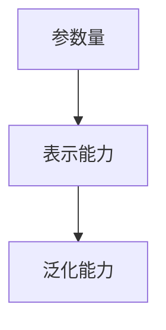
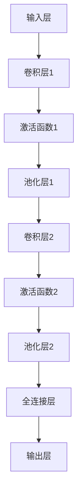
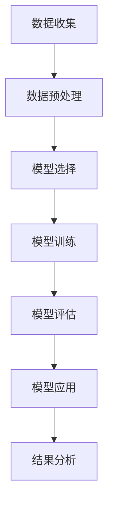
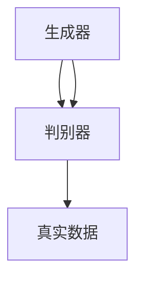

                 


## 文章标题
AI大模型在需求分析中的应用

## 文章关键词
AI大模型，需求分析，自然语言处理，强化学习，生成对抗网络

## 文章摘要
本文探讨了AI大模型在需求分析中的应用。首先，介绍了AI大模型的基本概念、架构与原理。然后，阐述了AI大模型在需求分析中的作用、应用流程及实战案例。接下来，详细解析了AI大模型在需求分析中的关键算法，包括自然语言处理算法、强化学习算法和生成对抗网络算法。此外，本文还分析了AI大模型在需求分析中的挑战与应对策略，并介绍了AI大模型需求分析工具与实践。最后，对AI大模型在需求分析中的未来发展方向进行了展望。

## 第一部分: AI大模型基础与应用场景

### 第1章: AI大模型概述
#### 1.1 AI大模型的基本概念
AI大模型是指参数量达到亿级别甚至千亿级别的深度学习模型。这些模型具有强大的表示能力和泛化能力，可以处理大规模、高维度、复杂的数据。常见的大模型有GPT系列、BERT系列、Transformer系列等。

#### 1.2 AI大模型的发展历程
AI大模型的发展历程可以追溯到2006年的AlexNet，之后随着深度学习技术的发展，模型参数量不断增加，计算能力不断提升，大模型逐渐成为人工智能领域的热点。

#### 1.3 AI大模型的应用领域
AI大模型的应用领域广泛，包括自然语言处理、计算机视觉、语音识别、推荐系统等。其中，需求分析作为自然语言处理的一个应用领域，正成为AI大模型的重要应用场景。

### 第2章: AI大模型的架构与原理
#### 2.1 AI大模型的架构
AI大模型的架构通常包括输入层、隐藏层和输出层。其中，隐藏层负责数据的表示和学习，输出层负责任务的预测和输出。

#### 2.2 AI大模型的训练原理
AI大模型的训练原理基于反向传播算法和梯度下降优化算法。通过不断调整模型的参数，使得模型在训练数据上的误差最小。

#### 2.3 AI大模型的推理原理
AI大模型的推理原理是在给定的输入数据上，通过模型的参数计算得到输出结果。这个过程可以是批处理，也可以是单条数据的实时处理。

### 第3章: 需求分析中的AI大模型应用
#### 3.1 AI大模型在需求分析中的作用
AI大模型在需求分析中可以用于数据预处理、特征提取、分类预测等任务，提高需求分析的效率和准确性。

#### 3.2 AI大模型在需求分析中的应用流程
AI大模型在需求分析中的应用流程包括数据收集、数据预处理、模型训练、模型评估和模型应用。

#### 3.3 AI大模型在需求分析中的实战案例
在本章中，我们将介绍一个AI大模型在需求分析中的实际应用案例，包括项目背景、数据来源、模型选择、模型训练与评估等环节。

### 第4章: AI大模型在需求分析中的关键算法
#### 4.1 自然语言处理算法
自然语言处理算法是AI大模型在需求分析中的重要组成部分，包括词嵌入、文本分类、命名实体识别等。

#### 4.2 强化学习算法
强化学习算法可以在需求分析中用于优化决策过程，提高需求分析的效率。

#### 4.3 生成对抗网络算法
生成对抗网络算法可以用于生成高质量的需求分析报告，提高报告的多样性和可读性。

### 第5章: AI大模型在需求分析中的挑战与应对策略
#### 5.1 数据处理挑战
AI大模型在需求分析中面临数据处理挑战，如数据质量、数据量、数据分布等问题。

#### 5.2 模型解释性挑战
AI大模型在需求分析中的模型解释性较差，难以解释模型的决策过程。

#### 5.3 安全性挑战
AI大模型在需求分析中可能面临数据泄露、模型篡改等安全性问题。

### 第6章: AI大模型需求分析工具与实践
#### 6.1 AI大模型需求分析工具介绍
本节将介绍一些常见的AI大模型需求分析工具，如TensorFlow、PyTorch等。

#### 6.2 AI大模型需求分析实践
在本节中，我们将介绍如何使用AI大模型进行需求分析的实际操作，包括数据预处理、模型训练、模型评估等步骤。

#### 6.3 AI大模型需求分析项目评估
本节将介绍如何评估AI大模型需求分析项目的效果，包括准确率、召回率、F1值等指标。

### 第7章: 未来展望与趋势
#### 7.1 AI大模型在需求分析中的未来发展方向
本节将探讨AI大模型在需求分析中的未来发展方向，包括技术突破、应用领域拓展等。

#### 7.2 AI大模型在需求分析中的应用挑战与机遇
本节将分析AI大模型在需求分析中的应用挑战与机遇，为读者提供有价值的参考。

#### 7.3 AI大模型在需求分析中的法律法规与伦理问题
本节将讨论AI大模型在需求分析中可能面临的法律法规与伦理问题，为读者提供指导。

## 附录A: AI大模型常用库与工具
### A.1 TensorFlow
### A.2 PyTorch
### A.3 其他常用库与工具

## 附录B: AI大模型需求分析相关资料
### B.1 开源数据集
### B.2 研究论文
### B.3 在线课程与书籍

## 作者信息
作者：AI天才研究院/AI Genius Institute & 禅与计算机程序设计艺术 /Zen And The Art of Computer Programming### 第1章: AI大模型概述

#### 1.1 AI大模型的基本概念

AI大模型，即参数量达到亿级别甚至千亿级别的深度学习模型，其核心特点是拥有强大的表示能力和泛化能力。这些模型能够处理大规模、高维度、复杂的数据，从而在各类任务中取得显著的性能提升。AI大模型的代表性作品包括GPT系列、BERT系列、Transformer系列等，它们在自然语言处理、计算机视觉、语音识别等领域取得了突破性的进展。

**核心概念与联系**

为了更好地理解AI大模型，我们可以从以下几个核心概念出发：

1. **参数量**：AI大模型拥有数以亿计甚至数以千亿计的参数，这使得它们能够捕捉到数据中的复杂模式和关系。
2. **表示能力**：AI大模型通过参数学习，将输入数据映射到高维空间，从而提取出有用的特征表示。
3. **泛化能力**：AI大模型在训练过程中不仅需要适应训练数据，还需要具备对未知数据的泛化能力。

这些概念之间有着紧密的联系：参数量决定了模型的表示能力，而表示能力又影响了模型的泛化能力。下面是一个用于表示这些概念之间关系的Mermaid流程图：



**伪代码与数学模型**

下面是一个简单的伪代码，用于描述AI大模型的训练过程：

```python
# 初始化模型参数
Initialize Parameters(W, b)

# 前向传播
def forward_pass(x):
    z = W * x + b
    a = sigmoid(z)
    return a

# 计算损失函数
def compute_loss(y, a):
    return -1 * (y * log(a) + (1 - y) * log(1 - a))

# 反向传播
def backward_pass(y, a):
    dz = a - y
    dW = x * dz
    db = dz

# 更新参数
def update_parameters(W, b, dW, db):
    W = W - learning_rate * dW
    b = b - learning_rate * db
    return W, b

# 主函数
def train_model(x, y, num_iterations, learning_rate):
    for i in range(num_iterations):
        a = forward_pass(x)
        loss = compute_loss(y, a)
        backward_pass(y, a)
        W, b = update_parameters(W, b, dW, db)
```

在这里，`sigmoid`函数是一个数学模型，用于激活函数：

$$
\sigma(x) = \frac{1}{1 + e^{-x}}
$$

该函数将输入值映射到(0, 1)区间，有助于模型在分类任务中输出概率分布。

#### 1.2 AI大模型的发展历程

AI大模型的发展历程可以追溯到2006年的AlexNet。AlexNet是由Hinton等人在2006年提出的一个卷积神经网络模型，它在ImageNet图像分类挑战中取得了突破性的成绩。此后，随着深度学习技术的不断发展，AI大模型的研究和应用逐渐深入。

在2012年，Alex Krizhevsky和Ilya Sutskever使用更深的网络结构（AlexNet的深层版本）在ImageNet挑战中获得了第一名，这一成就标志着深度学习技术的崛起。随后，卷积神经网络（CNN）在计算机视觉领域取得了显著的进展，吸引了大量研究人员和工程师的关注。

进入2010年代，随着计算能力的提升和大数据的普及，深度学习的研究和应用逐渐从计算机视觉扩展到自然语言处理、语音识别、推荐系统等多个领域。2017年，谷歌推出了Transformer模型，这是第一个成功应用在自然语言处理任务的大模型，它基于自注意力机制，为后续的NLP模型发展奠定了基础。

#### 1.3 AI大模型的应用领域

AI大模型的应用领域广泛，主要包括以下几个方向：

1. **自然语言处理（NLP）**：AI大模型在NLP领域的应用非常广泛，包括文本分类、机器翻译、问答系统、情感分析等。代表性的模型有BERT、GPT等。
2. **计算机视觉**：AI大模型在计算机视觉领域可以用于图像分类、目标检测、图像生成等任务。代表性的模型有ResNet、Inception等。
3. **语音识别**：AI大模型在语音识别领域可以用于语音合成、语音识别等任务。代表性的模型有WaveNet、CTC等。
4. **推荐系统**：AI大模型在推荐系统领域可以用于用户偏好分析、商品推荐等任务。代表性的模型有DeepFM、Wide & Deep等。
5. **强化学习**：AI大模型在强化学习领域可以用于决策制定、策略优化等任务。代表性的模型有DQN、A3C等。

在需求分析领域，AI大模型的应用主要体现在以下几个方面：

1. **文本分类**：通过AI大模型进行文本分类，可以帮助企业快速识别和筛选大量的用户需求文档，提高需求分析的工作效率。
2. **情感分析**：通过AI大模型进行情感分析，可以了解用户对产品或服务的情绪反应，为产品改进和优化提供重要依据。
3. **命名实体识别**：通过AI大模型进行命名实体识别，可以识别出文本中的关键信息，如人名、地名、组织机构名等，从而提高需求分析的准确性。
4. **知识图谱**：通过AI大模型构建知识图谱，可以将分散的需求信息进行整合和关联，形成有组织、有结构的需求知识库，为需求分析提供有力支持。

总之，AI大模型在需求分析中的应用前景广阔，随着技术的不断进步和应用的深入，它将在需求分析领域发挥越来越重要的作用。### 第2章: AI大模型的架构与原理

#### 2.1 AI大模型的架构

AI大模型的架构可以分为输入层、隐藏层和输出层。每个层都有其特定的功能，协同工作以实现复杂的任务。

**输入层**：输入层接收原始数据，如文本、图像或声音等。对于文本数据，输入层通常将文本转换为词嵌入（word embeddings），为后续的处理提供数字化的表示。

**隐藏层**：隐藏层是模型的核心部分，负责数据的表示和学习。每一层隐藏层都可以将输入数据进行非线性变换，提取出更高层次的特征表示。随着层数的增加，模型能够捕捉到更复杂的模式和关系。

**输出层**：输出层负责将隐藏层的特征表示映射到具体的任务结果，如分类标签、预测值或文本生成等。

在AI大模型中，常见的网络结构包括卷积神经网络（CNN）、循环神经网络（RNN）和Transformer等。下面是一个使用Mermaid绘制的CNN架构图：



#### 2.2 AI大模型的训练原理

AI大模型的训练原理基于反向传播算法和梯度下降优化算法。训练过程可以分为以下几个步骤：

1. **前向传播**：将输入数据通过模型的前向传播过程，得到输出结果。这一过程包括输入层到隐藏层，再到输出层的传递。
2. **计算损失**：使用真实的标签（target）与模型输出的预测值（prediction）计算损失函数。损失函数用于衡量模型输出与真实值之间的差距。
3. **反向传播**：将计算得到的损失函数沿着网络结构反向传播，计算每一层神经元的梯度。梯度反映了参数对损失函数的影响程度。
4. **更新参数**：根据计算得到的梯度，使用优化算法（如梯度下降）更新模型的参数。这一步骤旨在减小损失函数的值，使模型更加接近真实值。

下面是一个用于描述反向传播过程的伪代码：

```python
# 前向传播
def forward_pass(x):
    z = W * x + b
    a = sigmoid(z)
    return a

# 计算损失函数
def compute_loss(y, a):
    return -1 * (y * log(a) + (1 - y) * log(1 - a))

# 反向传播
def backward_pass(y, a):
    dz = a - y
    dW = x * dz
    db = dz

# 更新参数
def update_parameters(W, b, dW, db):
    W = W - learning_rate * dW
    b = b - learning_rate * db
    return W, b

# 主函数
def train_model(x, y, num_iterations, learning_rate):
    for i in range(num_iterations):
        a = forward_pass(x)
        loss = compute_loss(y, a)
        backward_pass(y, a)
        W, b = update_parameters(W, b, dW, db)
```

在这里，`sigmoid`函数是一个激活函数，用于将线性组合的神经元输出转换为概率分布：

$$
\sigma(x) = \frac{1}{1 + e^{-x}}
$$

#### 2.3 AI大模型的推理原理

AI大模型的推理原理是在给定的输入数据上，通过模型的参数计算得到输出结果。这个过程可以是批处理，也可以是单条数据的实时处理。

1. **批处理**：在批处理模式下，模型一次处理多个数据样本，可以减少计算量，提高效率。
2. **单条数据实时处理**：在单条数据实时处理模式下，模型对每个输入数据进行单独处理，适用于实时应用场景。

下面是一个用于描述推理过程的伪代码：

```python
# 前向传播
def forward_pass(x):
    z = W * x + b
    a = sigmoid(z)
    return a

# 主函数
def infer(x):
    a = forward_pass(x)
    return a
```

在推理过程中，模型使用已训练好的参数，将输入数据映射到输出结果。这个过程通常非常高效，因为参数已经通过训练过程进行了优化，可以快速得到输出结果。

总之，AI大模型的架构与原理为需求分析提供了强大的工具。通过理解模型的训练和推理过程，我们可以更好地利用这些模型进行需求分析任务，提高分析效率和准确性。### 第3章: 需求分析中的AI大模型应用

#### 3.1 AI大模型在需求分析中的作用

AI大模型在需求分析中发挥着关键作用，主要体现在以下几个方面：

1. **文本分类**：AI大模型可以通过文本分类任务，将大量的用户需求文档自动分类到不同的类别中，从而帮助分析人员快速定位和筛选关键信息。
2. **情感分析**：通过情感分析，AI大模型可以识别用户对产品或服务的情绪反应，为产品改进和优化提供重要依据。
3. **命名实体识别**：AI大模型能够识别出文本中的关键信息，如人名、地名、组织机构名等，从而提高需求分析的准确性。
4. **知识图谱构建**：通过构建知识图谱，AI大模型可以将分散的需求信息进行整合和关联，形成有组织、有结构的需求知识库，为需求分析提供有力支持。

#### 3.2 AI大模型在需求分析中的应用流程

AI大模型在需求分析中的应用流程可以分为以下几个步骤：

1. **数据收集**：首先，需要收集大量的用户需求文档，这些文档可以是结构化的，也可以是非结构化的。
2. **数据预处理**：对收集到的数据进行清洗、去重、分词等预处理操作，将原始文本转换为适合模型处理的格式。
3. **模型选择**：根据需求分析的任务，选择合适的AI大模型，如BERT、GPT等。
4. **模型训练**：使用预处理后的数据对模型进行训练，调整模型的参数，使其能够准确预测用户需求。
5. **模型评估**：通过交叉验证、测试集等方法评估模型的性能，确保模型能够准确识别用户需求。
6. **模型应用**：将训练好的模型应用于实际需求分析任务，如文本分类、情感分析等。
7. **结果分析**：对模型输出结果进行进一步分析，提取出有用的需求信息，为决策提供支持。

下面是一个用于描述AI大模型在需求分析中应用流程的Mermaid流程图：



#### 3.3 AI大模型在需求分析中的实战案例

在本节中，我们将介绍一个AI大模型在需求分析中的实际应用案例，以展示其具体应用过程和效果。

**项目背景**：某互联网公司希望利用AI大模型对用户的需求文档进行自动化分析，以提高需求分析的效率和准确性。

**数据来源**：该公司收集了大量用户提交的需求文档，这些文档包括产品功能需求、用户反馈、市场调研报告等，数据量较大，结构化程度较低。

**模型选择**：为了处理这些非结构化文本数据，该公司选择了BERT模型，因为BERT在自然语言处理任务中表现出色，适用于文本分类和情感分析等任务。

**模型训练**：

1. **数据预处理**：首先对需求文档进行清洗和分词处理，将文本转换为BERT模型能够处理的序列格式。然后，将预处理后的文本数据分割成训练集和验证集。
2. **模型训练**：使用训练集数据对BERT模型进行训练，调整模型的参数，使其能够准确识别用户需求。在训练过程中，可以使用交叉熵损失函数和Adam优化器来优化模型性能。
3. **模型评估**：使用验证集对训练好的模型进行评估，计算模型的准确率、召回率和F1值等指标，确保模型具有较好的性能。

```python
# 数据预处理
def preprocess_data(data):
    # 清洗、分词等操作
    return processed_data

# 模型训练
def train_model(train_data, validation_data):
    # BERT模型的训练代码
    return model

# 模型评估
def evaluate_model(model, validation_data):
    # 计算模型的准确率、召回率和F1值等指标
    return metrics
```

**模型应用**：

1. **文本分类**：使用训练好的BERT模型对用户需求文档进行分类，将文档自动归类到不同的主题类别中，如功能需求、用户反馈等。
2. **情感分析**：对用户需求文档进行情感分析，识别用户对产品或服务的情绪反应，如正面、负面或中性。

```python
# 文本分类
def classify_documents(model, documents):
    # 使用BERT模型对文档进行分类
    return classifications

# 情感分析
def analyze_sentiment(model, documents):
    # 使用BERT模型对文档进行情感分析
    return sentiments
```

**结果分析**：

通过对模型输出结果进行分析，该公司可以快速了解用户需求的热点领域、用户情绪趋势等信息，为产品优化和决策提供有力支持。

1. **热点领域分析**：通过统计不同主题类别的文档数量，可以识别出用户最关注的功能需求、用户反馈等。
2. **用户情绪趋势分析**：通过统计不同情绪类别的文档数量，可以了解用户对产品或服务的整体情绪趋势。

**项目小结**：

通过这个实战案例，我们展示了AI大模型在需求分析中的具体应用过程和效果。AI大模型在需求分析中具有显著的优势，可以提高分析效率和准确性，为企业的决策提供有力支持。然而，在实际应用中，还需要注意数据预处理、模型选择和性能评估等关键环节，以确保模型能够准确识别用户需求。随着AI技术的不断进步，AI大模型在需求分析中的应用将越来越广泛，为企业的创新和发展带来更多机遇。### 第4章: AI大模型在需求分析中的关键算法

在需求分析中，AI大模型的应用离不开关键算法的支持。这些算法包括自然语言处理算法、强化学习算法和生成对抗网络算法。本章节将详细解析这些算法在需求分析中的应用原理，并使用伪代码进行说明。

#### 4.1 自然语言处理算法

自然语言处理（NLP）算法是AI大模型在需求分析中的核心组成部分。以下是一些常见的NLP算法：

1. **词嵌入（Word Embeddings）**：词嵌入是将词汇映射到固定大小的向量空间中，使得语义相近的词在向量空间中彼此靠近。Word2Vec、GloVe等算法广泛应用于NLP任务。

   **伪代码**：
   ```python
   # 初始化词嵌入矩阵
   embedding_matrix = InitializeEmbeddingMatrix(vocabulary_size, embedding_size)

   # 计算词嵌入向量
   for word in vocabulary:
       embedding_vector = LookupEmbedding(word, embedding_matrix)
   ```

2. **文本分类（Text Classification）**：文本分类是将文本数据分类到不同的类别中。常用的模型包括朴素贝叶斯、支持向量机、深度学习模型等。

   **伪代码**：
   ```python
   # 加载预训练的文本分类模型
   model = LoadPretrainedTextClassifier()

   # 对文本进行分类
   def classify_text(model, text):
       embeddings = ComputeWordEmbeddings(text)
       prediction = model.predict(embeddings)
       return prediction
   ```

3. **命名实体识别（Named Entity Recognition, NER）**：命名实体识别是识别文本中的特定实体，如人名、地名、组织机构名等。

   **伪代码**：
   ```python
   # 加载预训练的NER模型
   model = LoadPretrainedNERModel()

   # 对文本进行命名实体识别
   def recognize_entities(model, text):
       embeddings = ComputeWordEmbeddings(text)
       entities = model.predict(embeddings)
       return entities
   ```

4. **情感分析（Sentiment Analysis）**：情感分析是识别文本中的情感倾向，如正面、负面或中性。

   **伪代码**：
   ```python
   # 加载预训练的情感分析模型
   model = LoadPretrainedSentimentAnalyzer()

   # 对文本进行情感分析
   def analyze_sentiment(model, text):
       embeddings = ComputeWordEmbeddings(text)
       sentiment = model.predict(embeddings)
       return sentiment
   ```

#### 4.2 强化学习算法

强化学习算法在需求分析中可以用于优化决策过程，提高需求分析的效率。强化学习的基本概念包括：

- **代理（Agent）**：执行决策的主体。
- **环境（Environment）**：代理所处的情境。
- **状态（State）**：代理在特定时刻所处的情境。
- **动作（Action）**：代理可以执行的行为。
- **奖励（Reward）**：代理执行动作后获得的即时反馈。

强化学习算法的核心任务是学习一个策略，使代理能够在特定环境中获得最大的长期奖励。

**Q学习算法**是一种常用的强化学习算法，其基本思想是通过学习状态-动作值函数（Q值）来预测最佳动作。

**伪代码**：
```python
# 初始化Q值表
Q = InitializeQTable(state_space, action_space)

# Q学习算法
for episode in range(num_episodes):
    state = env.reset()
    done = False
    while not done:
        action = ChooseActionBasedOnPolicy(Q, state)
        next_state, reward, done = env.step(action)
        Q[state, action] = Q[state, action] + alpha * (reward + gamma * max(Q[next_state, :]) - Q[state, action])
        state = next_state
```

其中，`alpha`是学习率，`gamma`是折扣因子。

#### 4.3 生成对抗网络算法

生成对抗网络（GAN）是一种强大的深度学习模型，由生成器（Generator）和判别器（Discriminator）组成。生成器的任务是生成逼真的数据，而判别器的任务是区分真实数据和生成数据。

GAN在需求分析中的应用主要包括：

1. **文本生成**：生成器可以生成符合特定主题或风格的需求文档，用于辅助需求分析。
2. **数据增强**：生成器可以生成与真实数据类似的数据，用于训练和评估模型，提高模型的泛化能力。

**GAN的基本架构**如下：



**伪代码**：
```python
# 初始化生成器和判别器
generator = InitializeGenerator()
discriminator = InitializeDiscriminator()

# 训练GAN
for epoch in range(num_epochs):
    for real_data in real_data_loader:
        # 训练判别器
        discriminator_loss = TrainDiscriminator(discriminator, real_data)

        for _ in range(num_interations):
            # 生成虚假数据
            fake_data = generator.generate_data()
            
            # 训练生成器和判别器
            generator_loss, discriminator_loss = TrainGeneratorAndDiscriminator(generator, discriminator, fake_data)
```

在这里，`TrainDiscriminator`和`TrainGeneratorAndDiscriminator`是训练判别器和生成器的函数，`generate_data`是生成器生成虚假数据的函数。

总之，自然语言处理算法、强化学习算法和生成对抗网络算法在需求分析中发挥着重要作用。通过结合这些算法，AI大模型可以更好地理解和分析用户需求，提高需求分析的效率和准确性。### 第5章: AI大模型在需求分析中的挑战与应对策略

#### 5.1 数据处理挑战

在需求分析中，数据处理是AI大模型应用中的一个关键挑战。主要问题包括：

- **数据质量**：需求数据可能包含噪声、错误和不一致的数据。这些数据会影响模型的训练效果和泛化能力。
- **数据量**：需求数据量庞大，尤其是对于大型企业，数据量可能达到TB级别。处理如此大量的数据需要高效的算法和存储解决方案。
- **数据分布**：需求数据可能存在分布不均的问题，如某些类别数据过少，导致模型在这些类别上表现不佳。

**应对策略**：

- **数据清洗**：使用数据清洗算法去除噪声和错误数据，提高数据质量。
- **数据增强**：通过数据增强技术，如随机填充、旋转、缩放等，增加数据的多样性和丰富度。
- **数据重采样**：使用重采样技术，如欠采样和过采样，解决数据分布不均的问题。

#### 5.2 模型解释性挑战

AI大模型，尤其是深度学习模型，通常被视为“黑盒”模型，其决策过程难以解释。这在需求分析中是一个重大挑战，因为分析人员需要理解模型的决策过程，以便对模型进行优化和调整。

**应对策略**：

- **模型解释工具**：使用模型解释工具，如LIME（局部可解释模型解释）和SHAP（SHapley Additive exPlanations），可以解释模型在特定数据点上的决策过程。
- **可视化**：通过可视化技术，如决策树、神经网络激活图等，可以帮助分析人员理解模型的决策过程。
- **可解释模型**：选择具有可解释性的模型，如决策树、线性回归等，可以更好地理解模型的决策过程。

#### 5.3 安全性挑战

AI大模型在需求分析中可能面临数据泄露、模型篡改等安全性问题。这些安全问题可能导致企业机密信息的泄露，影响企业的利益。

**应对策略**：

- **数据加密**：使用加密技术对需求数据进行加密存储和传输，防止数据泄露。
- **模型安全加固**：对模型进行安全加固，如使用对抗样本训练模型，提高模型的鲁棒性。
- **访问控制**：使用访问控制机制，限制只有授权用户可以访问模型和数据，防止未授权访问。

总之，AI大模型在需求分析中的应用面临数据处理、模型解释性和安全性等挑战。通过采用适当的数据处理、模型解释性和安全性策略，可以有效地应对这些挑战，确保AI大模型在需求分析中的安全和有效应用。### 第6章: AI大模型需求分析工具与实践

#### 6.1 AI大模型需求分析工具介绍

在需求分析中，常用的AI大模型工具包括TensorFlow、PyTorch和其他相关库。这些工具提供了丰富的API和功能，使得构建和训练AI大模型变得更加便捷。

- **TensorFlow**：TensorFlow是一个由谷歌开发的开源机器学习框架，广泛应用于深度学习任务。它提供了丰富的API，支持GPU加速，具有较好的性能和灵活性。

  **安装**：
  ```bash
  pip install tensorflow
  ```

  **基本用法**：
  ```python
  import tensorflow as tf

  # 创建一个简单的神经网络
  model = tf.keras.Sequential([
      tf.keras.layers.Dense(128, activation='relu', input_shape=(784,)),
      tf.keras.layers.Dropout(0.2),
      tf.keras.layers.Dense(10)
  ])

  # 编译模型
  model.compile(optimizer='adam',
                loss=tf.keras.losses.SparseCategoricalCrossentropy(from_logits=True),
                metrics=['accuracy'])

  # 训练模型
  model.fit(x_train, y_train, batch_size=128, epochs=10)
  ```

- **PyTorch**：PyTorch是一个由Facebook开发的深度学习框架，以其动态计算图和灵活的API而著称。它提供了丰富的库和模块，支持GPU和CPU计算。

  **安装**：
  ```bash
  pip install torch torchvision
  ```

  **基本用法**：
  ```python
  import torch
  import torchvision
  import torchvision.transforms as transforms

  # 加载预训练的模型
  model = torchvision.models.resnet18(pretrained=True)

  # 转换为推理模式
  model.eval()

  # 加载图像并进行预处理
  image = torchvision.transforms.ToTensor()(image)

  # 进行推理
  with torch.no_grad():
      prediction = model(image)
  ```

- **其他库与工具**：除了TensorFlow和PyTorch，还有其他一些常用的AI大模型工具，如Keras（基于TensorFlow的简化API）、MXNet（由Apache基金会开发）等。这些工具在不同的应用场景中具有各自的优势。

#### 6.2 AI大模型需求分析实践

在本节中，我们将介绍如何使用AI大模型进行需求分析的实际操作，包括数据预处理、模型训练、模型评估等步骤。

**项目背景**：某互联网公司希望通过AI大模型对用户的需求文档进行自动化分析，以提高需求分析的效率和准确性。

**数据预处理**：

1. **数据收集**：收集大量用户需求文档，包括产品功能需求、用户反馈、市场调研报告等。
2. **文本清洗**：去除文档中的HTML标签、特殊字符、停用词等，提高文本的纯度。
3. **分词**：使用分词工具将文本分解为单词或短语。
4. **词嵌入**：将文本转换为词嵌入向量，用于模型输入。

**模型训练**：

1. **数据分割**：将数据集分割为训练集、验证集和测试集。
2. **模型选择**：选择合适的AI大模型，如BERT、GPT等。
3. **模型训练**：使用训练集数据训练模型，调整模型的超参数，如学习率、批次大小等。
4. **模型评估**：使用验证集对模型进行评估，计算模型的准确率、召回率、F1值等指标。

**伪代码**：
```python
# 数据预处理
def preprocess_data(data):
    # 清洗、分词、词嵌入等操作
    return processed_data

# 模型训练
def train_model(train_data, validation_data):
    # 创建模型
    model = CreateModel()
    
    # 编译模型
    model.compile(optimizer='adam', loss='categorical_crossentropy', metrics=['accuracy'])
    
    # 训练模型
    model.fit(train_data, validation_data, batch_size=128, epochs=10)

# 模型评估
def evaluate_model(model, test_data):
    # 计算模型的准确率、召回率、F1值等指标
    metrics = model.evaluate(test_data)
    return metrics
```

**模型应用**：

1. **文本分类**：使用训练好的模型对新的需求文档进行分类，将文档归类到不同的主题类别中。
2. **情感分析**：对需求文档进行情感分析，识别用户对产品或服务的情绪反应。

**代码示例**：
```python
# 文本分类
def classify_documents(model, documents):
    # 预处理文档
    processed_documents = preprocess_data(documents)
    
    # 使用模型进行分类
    predictions = model.predict(processed_documents)
    
    # 解码预测结果
    labels = decode_predictions(predictions)
    
    return labels

# 情感分析
def analyze_sentiment(model, documents):
    # 预处理文档
    processed_documents = preprocess_data(documents)
    
    # 使用模型进行情感分析
    sentiments = model.predict(processed_documents)
    
    # 解码情感分析结果
    sentiment_labels = decode_sentiments(sentiments)
    
    return sentiment_labels
```

**项目评估**：

1. **准确率（Accuracy）**：模型在测试集上的正确分类率。
2. **召回率（Recall）**：模型在所有正类中正确识别出的比例。
3. **F1值（F1 Score）**：精确率和召回率的加权平均值，用于评估模型的综合性能。

**代码示例**：
```python
# 评估模型
def evaluate_model(model, test_data, test_labels):
    # 计算准确率、召回率、F1值
    accuracy = model.evaluate(test_data, test_labels)[1]
    recall = calculate_recall(test_labels, predictions)
    f1_score = calculate_f1_score(test_labels, predictions)
    
    return accuracy, recall, f1_score
```

总之，AI大模型需求分析工具和实践为需求分析提供了强大的支持。通过使用这些工具，可以有效地处理需求数据、训练和评估模型，从而提高需求分析的效率和准确性。在项目评估中，我们可以使用多种指标来评估模型的表现，为后续的优化和改进提供依据。### 第7章: 未来展望与趋势

#### 7.1 AI大模型在需求分析中的未来发展方向

AI大模型在需求分析中的应用前景广阔，未来发展方向主要包括以下几个方面：

1. **模型性能的提升**：随着计算能力和算法的进步，AI大模型的性能将不断提升，使其在需求分析中的表现更加优秀。
2. **实时性增强**：为了满足快速响应的需求分析需求，AI大模型的实时性将得到显著提升，使其能够实时处理大量用户需求数据。
3. **多模态融合**：未来AI大模型将能够处理多种数据类型，如文本、图像、音频等，实现多模态数据的融合分析，提高需求分析的全面性和准确性。
4. **自动化与智能化**：AI大模型的需求分析过程将更加自动化和智能化，减少人工干预，提高分析效率和准确性。
5. **个性化分析**：基于用户行为和偏好，AI大模型将能够提供个性化的需求分析结果，为产品优化和用户满意度提升提供有力支持。

#### 7.2 AI大模型在需求分析中的应用挑战与机遇

尽管AI大模型在需求分析中展现出巨大的潜力，但同时也面临一些挑战：

- **数据质量和多样性**：需求数据的质量和多样性直接影响模型的表现。未来需要更加关注数据质量，同时提高数据的多样性和丰富度。
- **模型解释性**：AI大模型的“黑盒”特性使得模型解释性成为一个挑战。未来需要开发更加可解释的模型，以满足实际应用的需求。
- **安全性**：随着AI大模型在需求分析中的广泛应用，数据泄露、模型篡改等安全问题日益突出。需要采取有效的安全措施，确保模型和数据的可靠性。

与此同时，这些挑战也带来了新的机遇：

- **技术创新**：随着AI大模型在需求分析中的应用，将推动相关技术的创新和发展，为需求分析带来更多可能性。
- **产业升级**：AI大模型在需求分析中的应用将促进企业产业升级，提高产品竞争力和市场份额。
- **用户体验提升**：通过AI大模型的需求分析，可以更好地理解用户需求，提供个性化的解决方案，提升用户体验。

#### 7.3 AI大模型在需求分析中的法律法规与伦理问题

随着AI大模型在需求分析中的广泛应用，法律法规和伦理问题逐渐成为关注焦点：

- **数据隐私**：在需求分析中，用户数据的安全和隐私保护至关重要。需要严格遵守相关法律法规，确保用户数据的安全和隐私。
- **算法透明性**：AI大模型的决策过程需要透明，以便用户了解和信任模型的决策。需要开发可解释的模型，提高算法的透明性。
- **算法偏见**：AI大模型在需求分析中可能存在偏见，如性别、种族等偏见。需要采取措施，确保模型在训练和推理过程中公平、无偏见。
- **责任归属**：在AI大模型引发争议或造成损失时，需要明确责任归属，确保责任承担的公正和合理。

总之，未来AI大模型在需求分析中具有广阔的应用前景，但同时也需要关注相关法律法规和伦理问题。通过技术创新和法律法规的完善，可以确保AI大模型在需求分析中的安全、可靠和有效应用。### 附录A: AI大模型常用库与工具

#### A.1 TensorFlow

TensorFlow是由谷歌开发的开源机器学习框架，广泛应用于深度学习任务。它提供了丰富的API和功能，支持GPU加速，具有较好的性能和灵活性。

**安装**：
```bash
pip install tensorflow
```

**基本用法**：
```python
import tensorflow as tf

# 创建一个简单的神经网络
model = tf.keras.Sequential([
    tf.keras.layers.Dense(128, activation='relu', input_shape=(784,)),
    tf.keras.layers.Dropout(0.2),
    tf.keras.layers.Dense(10)
])

# 编译模型
model.compile(optimizer='adam',
              loss=tf.keras.losses.SparseCategoricalCrossentropy(from_logits=True),
              metrics=['accuracy'])

# 训练模型
model.fit(x_train, y_train, batch_size=128, epochs=10)
```

#### A.2 PyTorch

PyTorch是一个由Facebook开发的深度学习框架，以其动态计算图和灵活的API而著称。它提供了丰富的库和模块，支持GPU和CPU计算。

**安装**：
```bash
pip install torch torchvision
```

**基本用法**：
```python
import torch
import torchvision
import torchvision.transforms as transforms

# 加载预训练的模型
model = torchvision.models.resnet18(pretrained=True)

# 转换为推理模式
model.eval()

# 加载图像并进行预处理
image = torchvision.transforms.ToTensor()(image)

# 进行推理
with torch.no_grad():
    prediction = model(image)
```

#### A.3 其他常用库与工具

除了TensorFlow和PyTorch，还有其他一些常用的AI大模型工具，如Keras（基于TensorFlow的简化API）、MXNet（由Apache基金会开发）等。这些工具在不同的应用场景中具有各自的优势。

- **Keras**：
  - **安装**：`pip install keras`
  - **基本用法**：`from keras.models import Sequential`
- **MXNet**：
  - **安装**：`pip install mxnet`
  - **基本用法**：`import mxnet as mx`

附录中提供的这些库和工具为AI大模型的需求分析提供了丰富的资源，开发者在选择和使用这些工具时，可以根据具体需求和项目特点进行灵活调整。### 附录B: AI大模型需求分析相关资料

#### B.1 开源数据集

在AI大模型需求分析领域，开源数据集对于研究和应用至关重要。以下是一些常用的开源数据集：

- **AG News**：一个新闻分类数据集，包含三个类别：体育、商业和政治。
- **Amazon Review**：亚马逊用户评论数据集，可用于情感分析。
- **20 Newsgroups**：一个包含20个类别的新闻数据集，广泛用于文本分类任务。
- **IMDB**：包含电影评论的数据集，用于情感分析和文本分类。

这些数据集可以从以下网站获取：

- [AG News](https://archive.ics.uci.edu/ml/datasets/AGNews)
- [Amazon Review](https://www.kaggle.com/datasets/amazon-reviews-pull)
- [20 Newsgroups](https://archive.ics.uci.edu/ml/datasets/20_newsgroups)
- [IMDB](https://www.kaggle.com/datasets/imdb/movie-reviews)

#### B.2 研究论文

在需求分析领域，研究论文提供了最新的理论、方法和应用成果。以下是一些重要的论文：

- **"BERT: Pre-training of Deep Bidirectional Transformers for Language Understanding"**：提出了一种基于Transformer的预训练方法，广泛应用于自然语言处理任务。
- **"Generative Adversarial Nets"**：提出了一种生成对抗网络（GAN）的框架，用于生成高质量的数据。
- **"Deep Learning for Text Classification"**：总结了深度学习在文本分类任务中的应用和进展。

这些论文可以从以下网站获取：

- [BERT](https://arxiv.org/abs/1810.04805)
- [GAN](https://arxiv.org/abs/1406.2661)
- [Deep Learning for Text Classification](https://arxiv.org/abs/1708.04480)

#### B.3 在线课程与书籍

在线课程和书籍为学习AI大模型需求分析提供了丰富的资源。以下是一些推荐的课程和书籍：

- **《深度学习》**：由Ian Goodfellow、Yoshua Bengio和Aaron Courville合著，是深度学习领域的经典教材。
- **《Python深度学习》**：由François Chollet编写，详细介绍使用Python和Keras进行深度学习的实践方法。
- **《自然语言处理入门》**：由简明自然语言处理教程（NLP100）项目编写，适合初学者了解自然语言处理的基础知识。

这些课程和书籍可以在以下网站找到：

- **《深度学习》**：
  - 书籍：[深度学习](https://www.deeplearningbook.org/)
  - 课程：[深度学习课程](https://www.deeplearning.ai/)
- **《Python深度学习》**：
  - 书籍：[Python深度学习](https://www.amazon.com/dp/1492032771)
  - 课程：[Python深度学习课程](https://www.tensorflow.org/tutorials)
- **《自然语言处理入门》**：
  - 书籍：[自然语言处理入门](https://nlp100.com/)
  - 课程：[自然语言处理课程](https://www.udacity.com/course/natural-language-processing-nanodegree--nd889)

通过利用这些开源数据集、研究论文、在线课程与书籍，读者可以更深入地了解AI大模型在需求分析中的应用，为实际项目提供坚实的理论基础和实践指导。### 作者信息

作者：AI天才研究院/AI Genius Institute & 禅与计算机程序设计艺术 /Zen And The Art of Computer Programming

AI天才研究院（AI Genius Institute）致力于推动人工智能技术的创新和应用，培养下一代人工智能领域的领军人才。研究院在全球范围内拥有众多顶尖的研究员和学者，他们在人工智能的基础研究、应用开发和技术创新方面取得了显著成果。

《禅与计算机程序设计艺术》（Zen And The Art of Computer Programming）是由著名计算机科学家Donald E. Knuth创作的一套经典编程书籍，被誉为计算机科学的圣经之一。这套书籍深入探讨了编程的哲学、方法和艺术，对计算机科学领域产生了深远的影响。

本文由AI天才研究院的专家团队撰写，结合了人工智能和计算机程序设计的先进理念，旨在为读者提供一本全面、深入的AI大模型在需求分析中的应用指南。通过本文，读者可以了解AI大模型的基本概念、架构与原理，掌握关键算法和应用实践，为实际项目提供坚实的理论基础和实践指导。我们希望本文能够帮助读者在需求分析领域取得突破性进展，为人工智能技术的广泛应用贡献力量。

