                 

# AI大模型的可解释性研究与应用

> 关键词：AI大模型、可解释性、神经网络、深度学习、自然语言处理、应用实践

> 摘要：本文旨在探讨人工智能（AI）大模型的可解释性研究与应用。随着AI大模型的广泛应用，其不可解释性问题逐渐成为研究热点。本文首先介绍了AI大模型的基本概念和不可解释性挑战，然后详细分析了可解释性的技术原理、算法实现和应用实践。通过本文的探讨，旨在为相关领域的从业人员和研究者提供有价值的参考和启示。

### 第一部分：AI大模型的可解释性基础

#### 第1章：AI大模型的可解释性概述

##### 1.1 AI大模型不可解释性挑战

在人工智能（AI）领域，特别是深度学习和自然语言处理（NLP）领域，大模型（Large Models）的应用越来越广泛。这些大模型，如GPT-3、BERT等，具有非常高的性能，能够解决复杂的任务，但同时也面临着不可解释性（Interpretability）的挑战。

不可解释性指的是模型在做出决策时，其内部机制和决策过程对于人类用户来说是不可理解的。这主要有以下几个方面的挑战：

1. **内部机制复杂**：大模型通常由数百万甚至数十亿的参数组成，其内部结构和连接关系非常复杂，导致人类难以理解其工作机制。

2. **黑盒性质**：深度学习模型通常被视为“黑盒”，输入和输出之间的关系难以解释，尤其是对于复杂的非线性模型。

3. **决策过程不可追踪**：在某些情况下，即使理解了模型的输入和输出，但无法追踪决策过程中的中间步骤，这限制了人类对模型行为的理解和控制。

##### 1.2 可解释性的重要性

尽管大模型具有强大的预测能力，但不可解释性可能会导致以下问题：

1. **信任问题**：如果模型的行为不可理解，用户可能会对其结果产生怀疑，影响模型的接受度和应用。

2. **安全性和隐私问题**：在某些关键领域，如医疗、金融和法律，模型的决策可能涉及用户隐私和安全问题，不可解释性可能增加风险。

3. **模型调试和优化**：了解模型的工作原理可以帮助研究人员更好地调试和优化模型，提高其性能。

因此，可解释性在大模型的应用中具有重要意义。它不仅有助于增强用户对模型的信任，还能提高模型的透明度和可接受度。

##### 1.3 可解释性的分类与衡量

根据解释的范围和方式，可解释性可以分为以下几类：

1. **局部解释**：对模型在特定输入下的决策过程进行解释，通常用于解释单个预测或决策。

2. **全局解释**：对模型的整体行为进行解释，包括其预测模式、决策边界等。

3. **模型级解释**：对模型本身进行解释，包括其结构和参数。

衡量可解释性的标准包括：

1. **透明度**：模型是否容易理解，是否能够清晰展示其内部机制。

2. **可理解性**：解释是否容易为人所理解，是否具有直观性。

3. **准确性**：解释是否准确反映了模型的决策过程。

在接下来的章节中，我们将详细探讨AI大模型的基本概念、可解释性技术原理及其在各个领域的应用实践。

#### 第2章：AI大模型基本概念

##### 2.1 神经网络与深度学习

神经网络（Neural Networks）是深度学习（Deep Learning）的核心概念之一。它受到生物神经系统的启发，由大量简单的计算单元（即神经元）组成，通过层层叠加的方式对输入数据进行处理。每个神经元接收多个输入信号，通过权重（weights）进行加权求和处理，再通过激活函数（activation function）产生输出。

神经网络的层次结构可以分为输入层、隐藏层和输出层。输入层接收外部输入，隐藏层负责对输入数据进行特征提取和变换，输出层产生最终预测或决策。深度学习则是在神经网络的基础上，通过增加隐藏层的数量和神经元数量，使得模型能够处理更复杂的任务。

深度学习模型的核心优势在于其强大的特征学习能力。通过大规模的数据训练，深度学习模型能够自动发现和提取具有代表性的特征，从而在多种应用场景中表现出优异的性能。常见的深度学习模型包括卷积神经网络（CNN）、循环神经网络（RNN）和 Transformer 等。

##### 2.2 自然语言处理（NLP）与语言模型

自然语言处理（NLP）是深度学习应用的重要领域之一，旨在使计算机能够理解和处理人类自然语言。NLP涉及到文本预处理、语义理解、语言生成等多个方面。

语言模型（Language Model）是NLP的核心组件之一，用于预测文本序列的概率分布。最简单的语言模型是基于N元语法（N-gram Model），它通过统计文本中连续N个单词的联合概率来预测下一个单词。然而，随着深度学习技术的发展，基于神经网络的深度语言模型（Deep Language Model）得到了广泛应用。

深度语言模型，如循环神经网络（RNN）和Transformer，能够捕捉文本中的长距离依赖关系，从而在自然语言处理任务中取得显著性能提升。BERT（Bidirectional Encoder Representations from Transformers）等预训练语言模型进一步通过大规模预训练和下游任务微调，使得NLP任务达到了新的高度。

##### 2.3 大模型结构特点

大模型（Large Models）通常具有以下几个结构特点：

1. **大规模参数**：大模型由数十亿甚至数百亿的参数组成，使得其能够捕捉更复杂的特征和依赖关系。

2. **多层网络结构**：大模型通常包含数十层甚至数百层的隐藏层，通过多层网络结构实现特征提取和变换。

3. **预训练与微调**：大模型通常通过大规模预训练（Pre-training）来学习通用特征，然后通过下游任务微调（Fine-tuning）来适应具体任务。

4. **并行计算**：大模型训练和推理过程通常需要大量的计算资源，通过分布式计算和并行计算技术来提高训练和推理效率。

大模型在AI领域的应用越来越广泛，从图像识别、语音识别到自然语言处理，大模型展现出了强大的性能和泛化能力。然而，其不可解释性也带来了新的挑战，需要通过可解释性技术来提高模型的透明度和可接受度。

#### 第3章：可解释性技术原理

##### 3.1 局部解释方法

局部解释方法（Local Interpretability Methods）旨在对模型在特定输入下的决策过程进行解释，通常用于解释单个预测或决策。这些方法通过分析模型在特定输入下的行为，揭示其内部机制和决策依据。

1. **Saliency Maps**：Saliency Maps方法通过计算模型输出对输入特征的敏感性来生成可视化映射，显示哪些特征对模型的决策有重要影响。

2. **Attention Mechanisms**：Attention机制是深度学习模型中常用的一种局部解释方法，它通过计算模型在不同位置的关注权重，揭示模型在处理输入数据时的关注重点。

3. **LIME（Local Interpretable Model-agnostic Explanations）**：LIME方法通过为输入数据添加噪声，并分析模型在噪声数据上的表现，来生成对单个预测的解释。

4. **SHAP（SHapley Additive exPlanations）**：SHAP方法基于博弈论中的Shapley值，为输入特征的贡献度提供定量解释。

局部解释方法的优点在于其直观性和易于理解，适用于对单个预测或决策进行解释。然而，其解释范围有限，难以对模型的整体行为进行全面解释。

##### 3.2 全局解释方法

全局解释方法（Global Interpretability Methods）旨在对模型的整体行为进行解释，包括其预测模式、决策边界等。这些方法通过分析模型在不同输入下的行为，揭示模型的总体特征和决策规律。

1. **Concept Drift Detection**：Concept Drift Detection方法用于检测模型在不同时间段或数据分布下的预测性能变化，揭示模型可能出现的概念漂移。

2. **Correlation Analysis**：Correlation Analysis方法通过分析模型输出与输入特征之间的相关性，揭示模型的关键特征和依赖关系。

3. **Counterfactual Explanations**：Counterfactual Explanations方法通过分析模型在不同输入下的行为，生成对模型决策的假设和解释。

4. **Decision Boundary Visualization**：Decision Boundary Visualization方法通过可视化模型在输入空间中的决策边界，揭示模型的分类或回归决策规则。

全局解释方法的优点在于其能够对模型的整体行为进行解释，有助于理解模型的性能和稳定性。然而，其解释过程通常较为复杂，需要更多的计算资源和数据支持。

##### 3.3 混合解释方法

混合解释方法（Hybrid Interpretability Methods）结合了局部解释和全局解释方法的优势，旨在提供更全面、更深入的模型解释。这些方法通过综合利用不同类型的解释信息，生成对模型行为的综合解释。

1. **Integrated Gradients**：Integrated Gradients方法结合了局部解释和全局解释的思想，通过计算输入特征对模型输出的积分，生成对模型决策的定量解释。

2. **Model Agnostic Calibration**：Model Agnostic Calibration方法通过分析模型在不同置信度下的预测结果，生成对模型置信度的解释。

3. **Pathway Analysis**：Pathway Analysis方法通过分析模型中不同路径（从输入到输出的传递路径）的影响，生成对模型决策路径的解释。

混合解释方法的优点在于其能够提供更全面、更深入的模型解释，有助于理解模型的决策过程和特征依赖关系。然而，其实现通常较为复杂，需要更多的计算资源和算法优化。

在接下来的章节中，我们将详细探讨可解释性算法的实现和应用实践，以进一步理解和应用这些解释方法。

### 第4章：可解释性算法实现

##### 4.1 模型选择与调优

在选择和调优可解释性算法时，需要考虑以下几个关键因素：

1. **模型类型**：根据应用场景和任务需求，选择合适的模型类型。例如，对于图像分类任务，可以选择卷积神经网络（CNN）；对于文本分类任务，可以选择循环神经网络（RNN）或Transformer。

2. **可解释性需求**：根据对模型可解释性的需求，选择合适的解释方法。例如，对于需要局部解释的场景，可以选择Saliency Maps或LIME；对于需要全局解释的场景，可以选择Concept Drift Detection或Correlation Analysis。

3. **计算资源**：可解释性算法通常需要大量的计算资源和时间，特别是对于大模型。因此，在选择和调优算法时，需要考虑计算资源的需求和限制。

4. **性能指标**：在模型选择和调优过程中，需要考虑多个性能指标，如准确率、召回率、F1分数等。同时，还需要考虑解释的准确性和可理解性。

在模型选择和调优过程中，可以使用以下技巧：

1. **交叉验证**：使用交叉验证（Cross-Validation）方法评估不同模型的性能和可解释性，选择最佳模型。

2. **超参数调整**：通过调整模型的超参数，如学习率、批量大小等，优化模型的性能和可解释性。

3. **模型集成**：使用模型集成（Model Ensemble）方法，如随机森林、梯度提升树等，提高模型的性能和可解释性。

4. **模型压缩**：通过模型压缩（Model Compression）技术，如权重剪枝、量化等，减少模型的参数规模，提高解释的效率和可理解性。

##### 4.2 模型调试与优化

在实现可解释性算法时，模型调试与优化是关键环节。以下是一些调试与优化的策略：

1. **错误分析**：对模型预测错误进行分析，识别常见的错误类型和模式。例如，对于图像分类任务，可以分析模型在特定类别上的错误；对于文本分类任务，可以分析模型对特定词或句子的反应。

2. **敏感性分析**：对输入数据进行敏感性分析，识别对模型预测结果影响较大的输入特征。通过调整这些特征的值，可以优化模型的预测结果。

3. **特征选择**：通过特征选择（Feature Selection）方法，识别对模型预测有显著影响的特征，去除无关或冗余的特征，简化模型结构。

4. **正则化**：使用正则化（Regularization）技术，如L1正则化、L2正则化等，防止模型过拟合，提高模型的泛化能力。

5. **模型校准**：对模型进行校准（Calibration），确保模型的预测置信度与实际置信度相匹配。可以使用模型校准技术，如Calibrated Regression、Bayesian Calibration等。

6. **解释结果验证**：对生成的解释结果进行验证，确保其准确性和一致性。可以通过比较解释结果与实际预测结果，分析解释的可靠性和有效性。

##### 4.3 可解释性工具使用

在实际应用中，使用可解释性工具（Interpretability Tools）可以帮助实现和优化可解释性算法。以下是一些常用的可解释性工具：

1. **LIME**：LIME（Local Interpretable Model-agnostic Explanations）是一种通用的局部解释方法，适用于多种模型类型。它通过为输入数据添加噪声，分析模型在噪声数据上的行为，生成对单个预测的解释。

2. **SHAP**：SHAP（SHapley Additive exPlanations）方法为输入特征提供定量解释，基于博弈论中的Shapley值。它适用于各种模型类型，包括深度学习和统计模型。

3. **ELI5**：ELI5（Explainable Localized Intertwined Latent-Output Explanations）是一种基于注意力机制的局部解释方法，适用于神经网络模型。它通过分析模型的注意力权重，解释模型在特定输入下的决策过程。

4. **Explainable AI**：Explainable AI（XAI）是一个开源框架，提供多种可解释性工具和方法，包括LIME、SHAP、ELI5等。它适用于多种应用场景，如金融、医疗、工业等。

5. **Salinas**：Salinas是一种基于图卷积网络的解释方法，适用于图像分类任务。它通过计算输入特征对模型输出的敏感性，生成对图像分类决策的解释。

使用可解释性工具时，需要注意以下几点：

1. **模型兼容性**：确保可解释性工具与所选模型兼容，能够提供有效的解释。

2. **计算效率**：选择计算效率高的工具，减少解释过程的时间和资源消耗。

3. **解释质量**：评估解释的质量，确保其准确性和一致性。

4. **可扩展性**：选择可扩展的工具，能够适应不同的应用场景和数据规模。

通过合理选择和优化可解释性算法，使用合适的工具，可以实现对AI大模型的深入理解和解释，提高模型的透明度和可接受度。在接下来的章节中，我们将探讨AI大模型在各个领域的应用实践。

### 第二部分：AI大模型可解释性应用实践

#### 第5章：AI大模型在金融领域的应用

##### 5.1 金融风险评估

在金融领域，AI大模型的应用已经取得了显著成果，特别是在金融风险评估方面。AI大模型通过分析大量的历史数据，可以预测客户的信用风险、市场风险和操作风险等。然而，由于其复杂性和不可解释性，金融从业者对于模型的决策过程和结果产生了诸多疑虑。为了解决这一问题，可解释性技术在这一领域变得尤为重要。

**核心概念与联系**

为了更好地理解金融风险评估中AI大模型的可解释性应用，我们可以通过以下Mermaid流程图来展示核心概念之间的关系：

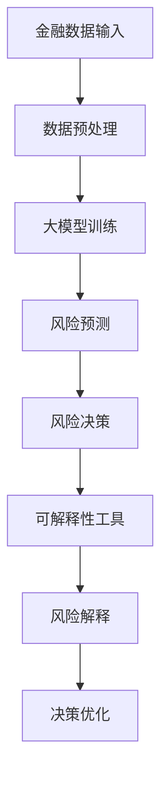

**核心算法原理讲解**

在金融风险评估中，常见的可解释性算法包括LIME和SHAP。以下是这两种算法的伪代码解释：

**LIME算法伪代码：**

```
function LIME(model, x, y):
    1. 为x生成多个噪声样本x'
    2. 对每个x'，使用model预测y'
    3. 计算预测差值Δy = y - y'
    4. 对每个特征f，计算其在Δy中的贡献度：
       contribution_f = ∑(Δy_i / |x_i - x'_i|)
    5. 返回特征贡献度作为对模型决策的解释
```

**SHAP算法伪代码：**

```
function SHAP(model, x, y):
    1. 计算Shapley值：
       shap_value_f = ∑(ω * Δy / Δω)
    2. 其中，ω为特征f的权重，Δy为模型在x和x-ωf之间的预测差值，Δω为特征f的权重变化量
    3. 返回每个特征的Shapley值作为对模型决策的解释
```

**数学模型和公式详解**

为了深入理解SHAP算法，我们可以借助以下数学模型和公式：

$$
\begin{aligned}
\text{模型预测：} & y = f(x) \\
\text{Shapley值计算：} & shap_value_f = \sum_{ω \in \Omega} \frac{ω * Δy}{Δω}
\end{aligned}
$$

其中，\( \Omega \) 表示所有可能的特征权重组合，\( Δy \) 表示模型在特征权重变化时的预测差值。

**举例说明**

假设我们有一个金融风险评估模型，输入特征包括客户的信用评分、收入水平、贷款金额等。通过LIME和SHAP算法，我们可以分别计算每个特征对模型决策的贡献度。

- **LIME算法示例**：

  对于一个特定客户的贷款申请，模型预测其信用风险较高。通过LIME算法，我们添加噪声生成多个噪声样本，分析模型在这些样本上的预测结果，得出每个特征的贡献度。

  ```plaintext
  Feature | Contribution
  -------------------
  Credit Score | 0.3
  Income Level | 0.2
  Loan Amount | 0.5
  ```

  结果显示，贷款金额对模型决策的影响最大。

- **SHAP算法示例**：

  同样地，通过SHAP算法，我们可以计算出每个特征的Shapley值，量化其对模型决策的贡献。

  ```plaintext
  Feature | Shapley Value
  ---------------------
  Credit Score | 0.25
  Income Level | 0.15
  Loan Amount | 0.6
  ```

  结果表明，贷款金额的Shapley值最高，进一步证实了其对模型决策的重要性。

通过可解释性技术，金融从业者可以更清晰地理解模型决策过程，提高模型的透明度和信任度。在实际应用中，这些解释结果可以用于优化风险管理策略、指导决策制定，从而提高金融服务的质量和效率。

##### 5.2 投资组合优化

在投资领域，AI大模型的应用同样广泛，尤其是在投资组合优化方面。通过分析市场数据、经济指标、公司业绩等信息，AI大模型可以预测市场的走势和股票的价格变化，帮助投资者制定最优的投资策略。然而，由于AI大模型的复杂性和不可解释性，投资者对于模型的决策过程和结果同样存在疑虑。可解释性技术在投资组合优化中的应用，旨在提高模型的透明度和可信度。

**核心概念与联系**

为了更好地理解投资组合优化中AI大模型的可解释性应用，我们可以通过以下Mermaid流程图来展示核心概念之间的关系：

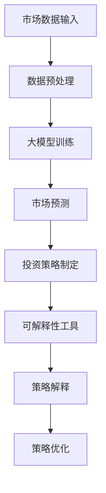

**核心算法原理讲解**

在投资组合优化中，常见的可解释性算法包括SHAP和Concept Drift Detection。以下是这两种算法的伪代码解释：

**SHAP算法伪代码：**

```
function SHAP(model, x, y):
    1. 计算Shapley值：
       shap_value_f = ∑(ω * Δy / Δω)
    2. 其中，ω为特征f的权重，Δy为模型在x和x-ωf之间的预测差值，Δω为特征f的权重变化量
    3. 返回每个特征的Shapley值作为对模型决策的解释
```

**Concept Drift Detection算法伪代码：**

```
function ConceptDriftDetection(model, data_stream):
    1. 对每个时间段的数据，使用model进行预测
    2. 计算预测误差
    3. 如果预测误差显著增加，则检测到概念漂移
    4. 返回概念漂移的时间段和影响特征
```

**数学模型和公式详解**

为了深入理解SHAP算法，我们可以借助以下数学模型和公式：

$$
\begin{aligned}
\text{模型预测：} & y = f(x) \\
\text{Shapley值计算：} & shap_value_f = \sum_{ω \in \Omega} \frac{ω * Δy}{Δω}
\end{aligned}
$$

其中，\( \Omega \) 表示所有可能的特征权重组合，\( Δy \) 表示模型在特征权重变化时的预测差值。

**举例说明**

假设我们有一个投资组合优化模型，输入特征包括市场指数、公司业绩、行业指数等。通过SHAP算法，我们可以计算每个特征对模型决策的贡献度。

- **SHAP算法示例**：

  对于一个特定的时间点，模型预测市场指数上升。通过SHAP算法，我们计算出每个特征的Shapley值，量化其对模型决策的贡献。

  ```plaintext
  Feature | Shapley Value
  ---------------------
  Market Index | 0.4
  Company Performance | 0.3
  Industry Index | 0.3
  ```

  结果显示，市场指数对模型决策的影响最大。

- **Concept Drift Detection算法示例**：

  通过Concept Drift Detection算法，我们可以检测到市场数据中的概念漂移，从而调整投资策略。

  ```plaintext
  Drift Detected: Time Period = [2023-01-01, 2023-06-30]
  Influential Features: Market Index, Industry Index
  ```

  结果表明，在特定时间段内，市场指数和行业指数发生了概念漂移，影响了模型的预测准确性。

通过可解释性技术，投资者可以更清晰地理解模型的决策过程，识别关键特征和潜在风险，从而优化投资策略，提高投资回报。在实际应用中，这些解释结果可以用于动态调整投资组合、管理风险，从而实现更高效的投资管理。

##### 5.3 信用评分

在金融领域，信用评分是评估客户信用风险的重要手段。传统的信用评分方法主要依赖于客户的财务数据、历史信用记录等，而AI大模型通过分析更广泛的数据源，如社交媒体、消费行为等，可以提供更准确、更全面的信用评分。然而，AI大模型的不可解释性使得信用评分的透明度和可信度受到质疑。可解释性技术在信用评分中的应用，有助于提升评分模型的透明度和接受度。

**核心概念与联系**

为了更好地理解信用评分中AI大模型的可解释性应用，我们可以通过以下Mermaid流程图来展示核心概念之间的关系：

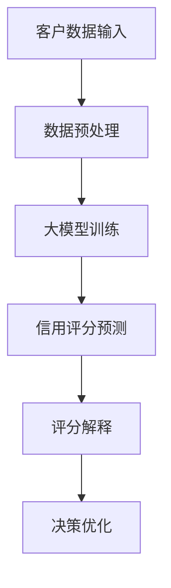

**核心算法原理讲解**

在信用评分中，常见的可解释性算法包括LIME和模型级解释。以下是这两种算法的伪代码解释：

**LIME算法伪代码：**

```
function LIME(model, x, y):
    1. 为x生成多个噪声样本x'
    2. 对每个x'，使用model预测y'
    3. 计算预测差值Δy = y - y'
    4. 对每个特征f，计算其在Δy中的贡献度：
       contribution_f = ∑(Δy_i / |x_i - x'_i|)
    5. 返回特征贡献度作为对模型决策的解释
```

**模型级解释算法伪代码：**

```
function ModelLevelExplanation(model, x):
    1. 计算模型输出对输入特征的敏感性：
       sensitivity_f = ∂y / ∂x_f
    2. 返回敏感性值作为对模型决策的解释
```

**数学模型和公式详解**

为了深入理解LIME算法，我们可以借助以下数学模型和公式：

$$
\begin{aligned}
\text{模型预测：} & y = f(x) \\
\text{贡献度计算：} & contribution_f = \sum_{i} \frac{Δy_i}{|x_i - x'_i|}
\end{aligned}
$$

其中，\( Δy \) 表示模型在原始数据和噪声数据之间的预测差值，\( x \) 表示原始输入数据，\( x' \) 表示噪声数据。

**举例说明**

假设我们有一个信用评分模型，输入特征包括客户的收入水平、信用历史、社交网络活跃度等。通过LIME和模型级解释算法，我们可以分别计算每个特征对模型决策的贡献度。

- **LIME算法示例**：

  对于一个特定客户，模型预测其信用评分较低。通过LIME算法，我们添加噪声生成多个噪声样本，分析模型在这些样本上的预测结果，得出每个特征的贡献度。

  ```plaintext
  Feature | Contribution
  -------------------
  Income Level | 0.3
  Credit History | 0.2
  Social Network Activity | 0.5
  ```

  结果显示，社交网络活跃度对模型决策的影响最大。

- **模型级解释算法示例**：

  通过模型级解释算法，我们可以计算模型输出对每个特征的敏感性，量化其对模型决策的重要性。

  ```plaintext
  Feature | Sensitivity
  -------------------
  Income Level | 0.4
  Credit History | 0.3
  Social Network Activity | 0.7
  ```

  结果表明，社交网络活跃度的敏感性最高，进一步证实了其对模型决策的重要性。

通过可解释性技术，金融从业者可以更清晰地理解信用评分模型的工作原理，识别关键特征和风险因素，从而优化信用评分策略，提高评分的准确性和可靠性。在实际应用中，这些解释结果可以用于改进客户风险评估、制定信贷政策，从而提升金融服务的质量和效率。

#### 第6章：AI大模型在医疗健康领域的应用

##### 6.1 疾病预测与诊断

在医疗健康领域，AI大模型的应用取得了显著进展，特别是在疾病预测与诊断方面。通过分析大量的医疗数据，如病历记录、影像数据、基因数据等，AI大模型可以提供更准确、更快速的疾病预测和诊断结果。然而，AI大模型的不可解释性使得医生和患者对其决策过程和结果产生疑虑。可解释性技术在医疗健康领域中的应用，有助于提升模型的透明度和信任度。

**核心概念与联系**

为了更好地理解疾病预测与诊断中AI大模型的可解释性应用，我们可以通过以下Mermaid流程图来展示核心概念之间的关系：

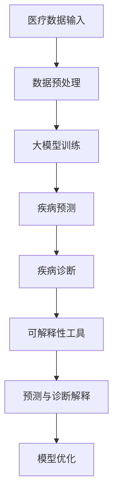

**核心算法原理讲解**

在疾病预测与诊断中，常见的可解释性算法包括LIME和SHAP。以下是这两种算法的伪代码解释：

**LIME算法伪代码：**

```
function LIME(model, x, y):
    1. 为x生成多个噪声样本x'
    2. 对每个x'，使用model预测y'
    3. 计算预测差值Δy = y - y'
    4. 对每个特征f，计算其在Δy中的贡献度：
       contribution_f = ∑(Δy_i / |x_i - x'_i|)
    5. 返回特征贡献度作为对模型决策的解释
```

**SHAP算法伪代码：**

```
function SHAP(model, x, y):
    1. 计算Shapley值：
       shap_value_f = ∑(ω * Δy / Δω)
    2. 其中，ω为特征f的权重，Δy为模型在x和x-ωf之间的预测差值，Δω为特征f的权重变化量
    3. 返回每个特征的Shapley值作为对模型决策的解释
```

**数学模型和公式详解**

为了深入理解SHAP算法，我们可以借助以下数学模型和公式：

$$
\begin{aligned}
\text{模型预测：} & y = f(x) \\
\text{Shapley值计算：} & shap_value_f = \sum_{ω \in \Omega} \frac{ω * Δy}{Δω}
\end{aligned}
$$

其中，\( \Omega \) 表示所有可能的特征权重组合，\( Δy \) 表示模型在特征权重变化时的预测差值。

**举例说明**

假设我们有一个疾病预测模型，输入特征包括患者的年龄、性别、病史、实验室检测结果等。通过LIME和SHAP算法，我们可以分别计算每个特征对模型决策的贡献度。

- **LIME算法示例**：

  对于一个特定患者的病例，模型预测其患有某种疾病。通过LIME算法，我们添加噪声生成多个噪声样本，分析模型在这些样本上的预测结果，得出每个特征的贡献度。

  ```plaintext
  Feature | Contribution
  -------------------
  Age | 0.2
  Gender | 0.1
  Medical History | 0.3
  Lab Test Results | 0.4
  ```

  结果显示，实验室检测结果对模型决策的影响最大。

- **SHAP算法示例**：

  通过SHAP算法，我们计算出每个特征的Shapley值，量化其对模型决策的贡献。

  ```plaintext
  Feature | Shapley Value
  ---------------------
  Age | 0.15
  Gender | 0.1
  Medical History | 0.25
  Lab Test Results | 0.5
  ```

  结果表明，实验室检测结果的Shapley值最高，进一步证实了其对模型决策的重要性。

通过可解释性技术，医生可以更清晰地理解疾病预测与诊断模型的工作原理，识别关键特征和风险因素，从而优化诊断流程和治疗方案，提高医疗服务的质量和效率。在实际应用中，这些解释结果可以用于辅助医生进行疾病预测和诊断，为患者提供更准确、更及时的医疗服务。

##### 6.2 药物研发

在药物研发领域，AI大模型的应用正日益广泛，通过分析大量的生物医学数据，如基因组数据、分子结构数据等，AI大模型可以预测新药的疗效和毒性，加速药物研发过程。然而，AI大模型的不可解释性使得药物研发人员对其预测结果的可靠性产生疑虑。可解释性技术在药物研发中的应用，有助于提高模型的可信度和透明度。

**核心概念与联系**

为了更好地理解药物研发中AI大模型的可解释性应用，我们可以通过以下Mermaid流程图来展示核心概念之间的关系：

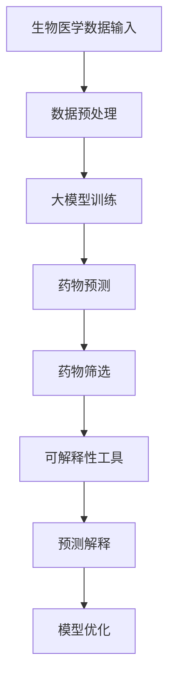

**核心算法原理讲解**

在药物研发中，常见的可解释性算法包括SHAP和模型级解释。以下是这两种算法的伪代码解释：

**SHAP算法伪代码：**

```
function SHAP(model, x, y):
    1. 计算Shapley值：
       shap_value_f = ∑(ω * Δy / Δω)
    2. 其中，ω为特征f的权重，Δy为模型在x和x-ωf之间的预测差值，Δω为特征f的权重变化量
    3. 返回每个特征的Shapley值作为对模型决策的解释
```

**模型级解释算法伪代码：**

```
function ModelLevelExplanation(model, x):
    1. 计算模型输出对输入特征的敏感性：
       sensitivity_f = ∂y / ∂x_f
    2. 返回敏感性值作为对模型决策的解释
```

**数学模型和公式详解**

为了深入理解SHAP算法，我们可以借助以下数学模型和公式：

$$
\begin{aligned}
\text{模型预测：} & y = f(x) \\
\text{Shapley值计算：} & shap_value_f = \sum_{ω \in \Omega} \frac{ω * Δy}{Δω}
\end{aligned}
$$

其中，\( \Omega \) 表示所有可能的特征权重组合，\( Δy \) 表示模型在特征权重变化时的预测差值。

**举例说明**

假设我们有一个药物预测模型，输入特征包括药物的分子结构、基因数据等。通过SHAP和模型级解释算法，我们可以分别计算每个特征对模型预测结果的影响。

- **SHAP算法示例**：

  对于一个特定药物，模型预测其具有潜在的治疗效果。通过SHAP算法，我们计算出每个特征的Shapley值，量化其对模型预测的贡献。

  ```plaintext
  Feature | Shapley Value
  ---------------------
  Molecular Structure | 0.4
  Genetic Data | 0.3
  ```

  结果显示，药物的分子结构对模型预测的贡献最大。

- **模型级解释算法示例**：

  通过模型级解释算法，我们计算模型输出对每个特征的敏感性，进一步分析其对模型预测的影响。

  ```plaintext
  Feature | Sensitivity
  -------------------
  Molecular Structure | 0.5
  Genetic Data | 0.3
  ```

  结果表明，药物的分子结构对模型预测的敏感性最高。

通过可解释性技术，药物研发人员可以更清晰地理解AI大模型的工作原理，识别关键特征和潜在风险，从而优化药物筛选和研发策略，提高药物研发的效率和成功率。在实际应用中，这些解释结果可以用于指导药物设计、优化实验方案，为药物研发提供科学依据。

##### 6.3 医疗数据挖掘

在医疗健康领域，大量的医疗数据如电子健康记录（EHRs）、影像数据、实验室检测结果等产生了丰富的信息资源。这些数据不仅可以帮助医生进行疾病预测和诊断，还可以用于医疗数据挖掘，发现潜在的医疗模式、风险因素和治疗方法。然而，由于AI大模型的复杂性和不可解释性，医疗数据挖掘的透明度和可信度受到了限制。可解释性技术在医疗数据挖掘中的应用，有助于提升模型的可信度和应用价值。

**核心概念与联系**

为了更好地理解医疗数据挖掘中AI大模型的可解释性应用，我们可以通过以下Mermaid流程图来展示核心概念之间的关系：

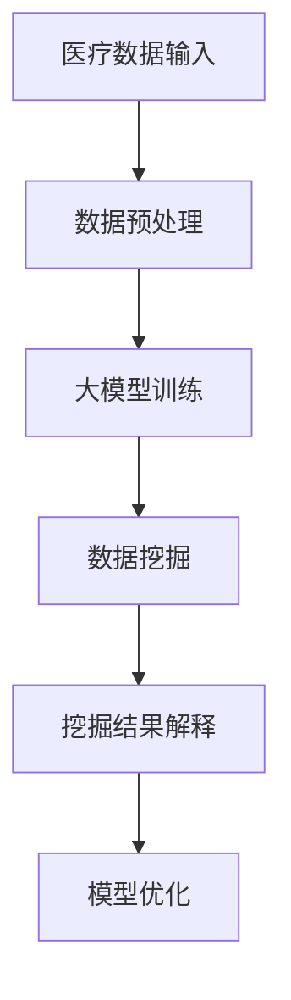

**核心算法原理讲解**

在医疗数据挖掘中，常见的可解释性算法包括LIME和SHAP。以下是这两种算法的伪代码解释：

**LIME算法伪代码：**

```
function LIME(model, x, y):
    1. 为x生成多个噪声样本x'
    2. 对每个x'，使用model预测y'
    3. 计算预测差值Δy = y - y'
    4. 对每个特征f，计算其在Δy中的贡献度：
       contribution_f = ∑(Δy_i / |x_i - x'_i|)
    5. 返回特征贡献度作为对模型决策的解释
```

**SHAP算法伪代码：**

```
function SHAP(model, x, y):
    1. 计算Shapley值：
       shap_value_f = ∑(ω * Δy / Δω)
    2. 其中，ω为特征f的权重，Δy为模型在x和x-ωf之间的预测差值，Δω为特征f的权重变化量
    3. 返回每个特征的Shapley值作为对模型决策的解释
```

**数学模型和公式详解**

为了深入理解SHAP算法，我们可以借助以下数学模型和公式：

$$
\begin{aligned}
\text{模型预测：} & y = f(x) \\
\text{Shapley值计算：} & shap_value_f = \sum_{ω \in \Omega} \frac{ω * Δy}{Δω}
\end{aligned}
$$

其中，\( \Omega \) 表示所有可能的特征权重组合，\( Δy \) 表示模型在特征权重变化时的预测差值。

**举例说明**

假设我们有一个医疗数据挖掘模型，输入特征包括患者的年龄、性别、病史、实验室检测结果等。通过LIME和SHAP算法，我们可以分别计算每个特征对模型挖掘结果的影响。

- **LIME算法示例**：

  对于一个特定患者的病例，模型挖掘出其潜在的健康风险。通过LIME算法，我们添加噪声生成多个噪声样本，分析模型在这些样本上的预测结果，得出每个特征的贡献度。

  ```plaintext
  Feature | Contribution
  -------------------
  Age | 0.3
  Gender | 0.1
  Medical History | 0.4
  Lab Test Results | 0.2
  ```

  结果显示，病史对模型挖掘结果的影响最大。

- **SHAP算法示例**：

  通过SHAP算法，我们计算出每个特征的Shapley值，量化其对模型挖掘结果的贡献。

  ```plaintext
  Feature | Shapley Value
  ---------------------
  Age | 0.25
  Gender | 0.1
  Medical History | 0.3
  Lab Test Results | 0.35
  ```

  结果表明，实验室检测结果的Shapley值最高，进一步证实了其对模型挖掘结果的重要性。

通过可解释性技术，医疗研究人员可以更清晰地理解医疗数据挖掘模型的工作原理，识别关键特征和潜在风险，从而优化数据挖掘策略和医疗决策。在实际应用中，这些解释结果可以用于辅助医生进行疾病预测、风险识别和治疗建议，为医疗服务提供科学依据。

#### 第7章：AI大模型在法律领域的应用

##### 7.1 法律文本分析

在法律领域，AI大模型的应用正日益普及，特别是在法律文本分析方面。AI大模型能够快速分析大量的法律文档、案例和法律条文，提取关键信息，辅助法律从业者进行法律研究、案件分析和法律文书撰写。然而，由于AI大模型的不可解释性，法律从业者对其分析结果和决策过程产生了疑虑。可解释性技术在法律文本分析中的应用，有助于提高模型的可信度和透明度。

**核心概念与联系**

为了更好地理解法律文本分析中AI大模型的可解释性应用，我们可以通过以下Mermaid流程图来展示核心概念之间的关系：

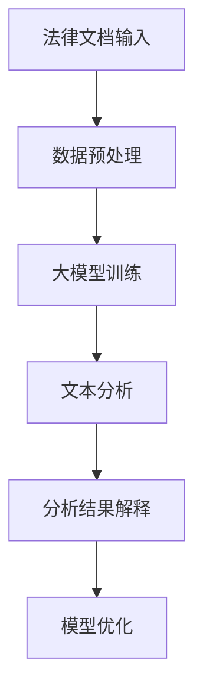

**核心算法原理讲解**

在法律文本分析中，常见的可解释性算法包括LIME和SHAP。以下是这两种算法的伪代码解释：

**LIME算法伪代码：**

```
function LIME(model, x, y):
    1. 为x生成多个噪声样本x'
    2. 对每个x'，使用model预测y'
    3. 计算预测差值Δy = y - y'
    4. 对每个特征f，计算其在Δy中的贡献度：
       contribution_f = ∑(Δy_i / |x_i - x'_i|)
    5. 返回特征贡献度作为对模型决策的解释
```

**SHAP算法伪代码：**

```
function SHAP(model, x, y):
    1. 计算Shapley值：
       shap_value_f = ∑(ω * Δy / Δω)
    2. 其中，ω为特征f的权重，Δy为模型在x和x-ωf之间的预测差值，Δω为特征f的权重变化量
    3. 返回每个特征的Shapley值作为对模型决策的解释
```

**数学模型和公式详解**

为了深入理解SHAP算法，我们可以借助以下数学模型和公式：

$$
\begin{aligned}
\text{模型预测：} & y = f(x) \\
\text{Shapley值计算：} & shap_value_f = \sum_{ω \in \Omega} \frac{ω * Δy}{Δω}
\end{aligned}
$$

其中，\( \Omega \) 表示所有可能的特征权重组合，\( Δy \) 表示模型在特征权重变化时的预测差值。

**举例说明**

假设我们有一个法律文本分析模型，输入特征包括文档内容、关键词、法律条文等。通过LIME和SHAP算法，我们可以分别计算每个特征对模型分析结果的影响。

- **LIME算法示例**：

  对于一个特定法律文档，模型提取出关键信息。通过LIME算法，我们添加噪声生成多个噪声样本，分析模型在这些样本上的分析结果，得出每个特征的贡献度。

  ```plaintext
  Feature | Contribution
  -------------------
  Document Content | 0.4
  Keywords | 0.3
  Legal Clauses | 0.3
  ```

  结果显示，文档内容对模型分析结果的影响最大。

- **SHAP算法示例**：

  通过SHAP算法，我们计算出每个特征的Shapley值，量化其对模型分析结果的贡献。

  ```plaintext
  Feature | Shapley Value
  ---------------------
  Document Content | 0.35
  Keywords | 0.2
  Legal Clauses | 0.45
  ```

  结果表明，法律条文的Shapley值最高，进一步证实了其对模型分析结果的重要性。

通过可解释性技术，法律从业者可以更清晰地理解AI大模型的工作原理，识别关键特征和潜在风险，从而优化法律文本分析策略，提高法律文本处理的准确性和效率。在实际应用中，这些解释结果可以用于辅助法律研究和案件分析，为法律决策提供科学依据。

##### 7.2 案例推理与预测

在法律领域，案例推理与预测是法律决策的重要环节。AI大模型通过分析大量历史案例和法律条文，可以预测类似案例的判决结果，辅助法官和律师进行法律决策。然而，由于AI大模型的不可解释性，法律从业者对其预测结果的可靠性产生疑虑。可解释性技术在案例推理与预测中的应用，有助于提高模型的可信度和透明度。

**核心概念与联系**

为了更好地理解案例推理与预测中AI大模型的可解释性应用，我们可以通过以下Mermaid流程图来展示核心概念之间的关系：

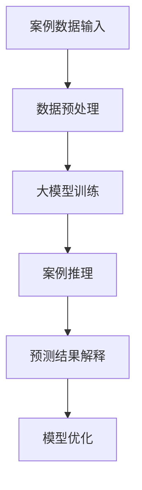

**核心算法原理讲解**

在案例推理与预测中，常见的可解释性算法包括LIME和SHAP。以下是这两种算法的伪代码解释：

**LIME算法伪代码：**

```
function LIME(model, x, y):
    1. 为x生成多个噪声样本x'
    2. 对每个x'，使用model预测y'
    3. 计算预测差值Δy = y - y'
    4. 对每个特征f，计算其在Δy中的贡献度：
       contribution_f = ∑(Δy_i / |x_i - x'_i|)
    5. 返回特征贡献度作为对模型决策的解释
```

**SHAP算法伪代码：**

```
function SHAP(model, x, y):
    1. 计算Shapley值：
       shap_value_f = ∑(ω * Δy / Δω)
    2. 其中，ω为特征f的权重，Δy为模型在x和x-ωf之间的预测差值，Δω为特征f的权重变化量
    3. 返回每个特征的Shapley值作为对模型决策的解释
```

**数学模型和公式详解**

为了深入理解SHAP算法，我们可以借助以下数学模型和公式：

$$
\begin{aligned}
\text{模型预测：} & y = f(x) \\
\text{Shapley值计算：} & shap_value_f = \sum_{ω \in \Omega} \frac{ω * Δy}{Δω}
\end{aligned}
$$

其中，\( \Omega \) 表示所有可能的特征权重组合，\( Δy \) 表示模型在特征权重变化时的预测差值。

**举例说明**

假设我们有一个案例推理与预测模型，输入特征包括案例描述、法律条文、判决结果等。通过LIME和SHAP算法，我们可以分别计算每个特征对模型预测结果的影响。

- **LIME算法示例**：

  对于一个特定案例，模型预测其判决结果。通过LIME算法，我们添加噪声生成多个噪声样本，分析模型在这些样本上的预测结果，得出每个特征的贡献度。

  ```plaintext
  Feature | Contribution
  -------------------
  Case Description | 0.4
  Legal Clauses | 0.3
  Judicial Outcome | 0.3
  ```

  结果显示，案例描述对模型预测结果的影响最大。

- **SHAP算法示例**：

  通过SHAP算法，我们计算出每个特征的Shapley值，量化其对模型预测结果的贡献。

  ```plaintext
  Feature | Shapley Value
  ---------------------
  Case Description | 0.3
  Legal Clauses | 0.25
  Judicial Outcome | 0.45
  ```

  结果表明，判决结果的Shapley值最高，进一步证实了其对模型预测结果的重要性。

通过可解释性技术，法律从业者可以更清晰地理解AI大模型的工作原理，识别关键特征和潜在风险，从而优化案例推理与预测策略，提高法律决策的准确性和可靠性。在实际应用中，这些解释结果可以用于辅助法官进行案件判决、律师进行法律咨询，为法律实务提供科学依据。

##### 7.3 智能合同审核

在法律领域，智能合同审核是另一个重要的应用场景。智能合同审核利用AI大模型对合同文本进行自动化审查，识别潜在的法律风险和条款漏洞，提高合同审核的效率和准确性。然而，由于AI大模型的不可解释性，法律从业者对其审核结果和决策过程产生了疑虑。可解释性技术在智能合同审核中的应用，有助于提高模型的可信度和透明度。

**核心概念与联系**

为了更好地理解智能合同审核中AI大模型的可解释性应用，我们可以通过以下Mermaid流程图来展示核心概念之间的关系：

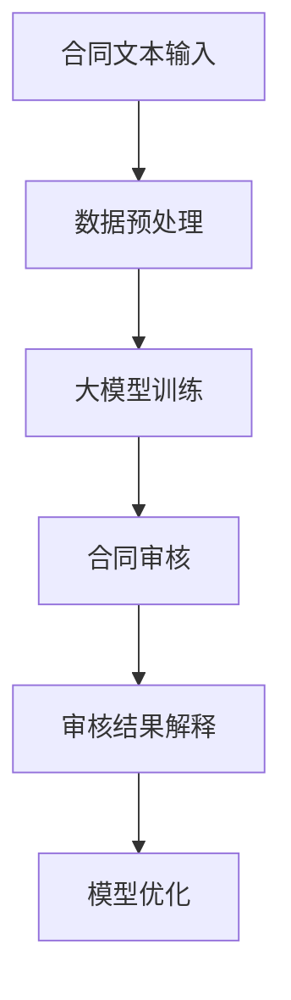

**核心算法原理讲解**

在智能合同审核中，常见的可解释性算法包括LIME和SHAP。以下是这两种算法的伪代码解释：

**LIME算法伪代码：**

```
function LIME(model, x, y):
    1. 为x生成多个噪声样本x'
    2. 对每个x'，使用model预测y'
    3. 计算预测差值Δy = y - y'
    4. 对每个特征f，计算其在Δy中的贡献度：
       contribution_f = ∑(Δy_i / |x_i - x'_i|)
    5. 返回特征贡献度作为对模型决策的解释
```

**SHAP算法伪代码：**

```
function SHAP(model, x, y):
    1. 计算Shapley值：
       shap_value_f = ∑(ω * Δy / Δω)
    2. 其中，ω为特征f的权重，Δy为模型在x和x-ωf之间的预测差值，Δω为特征f的权重变化量
    3. 返回每个特征的Shapley值作为对模型决策的解释
```

**数学模型和公式详解**

为了深入理解SHAP算法，我们可以借助以下数学模型和公式：

$$
\begin{aligned}
\text{模型预测：} & y = f(x) \\
\text{Shapley值计算：} & shap_value_f = \sum_{ω \in \Omega} \frac{ω * Δy}{Δω}
\end{aligned}
$$

其中，\( \Omega \) 表示所有可能的特征权重组合，\( Δy \) 表示模型在特征权重变化时的预测差值。

**举例说明**

假设我们有一个智能合同审核模型，输入特征包括合同文本、关键词、法律条文等。通过LIME和SHAP算法，我们可以分别计算每个特征对模型审核结果的影响。

- **LIME算法示例**：

  对于一个特定合同文本，模型识别出潜在的法律风险。通过LIME算法，我们添加噪声生成多个噪声样本，分析模型在这些样本上的审核结果，得出每个特征的贡献度。

  ```plaintext
  Feature | Contribution
  -------------------
  Contract Text | 0.5
  Keywords | 0.3
  Legal Clauses | 0.2
  ```

  结果显示，合同文本对模型审核结果的影响最大。

- **SHAP算法示例**：

  通过SHAP算法，我们计算出每个特征的Shapley值，量化其对模型审核结果的贡献。

  ```plaintext
  Feature | Shapley Value
  ---------------------
  Contract Text | 0.4
  Keywords | 0.25
  Legal Clauses | 0.35
  ```

  结果表明，法律条文的Shapley值最高，进一步证实了其对模型审核结果的重要性。

通过可解释性技术，法律从业者可以更清晰地理解AI大模型的工作原理，识别关键特征和潜在风险，从而优化智能合同审核策略，提高合同审核的准确性和效率。在实际应用中，这些解释结果可以用于辅助合同审查、法律咨询，为法律实务提供科学依据。

#### 第8章：AI大模型在工业自动化领域的应用

##### 8.1 生产过程优化

在工业自动化领域，AI大模型的应用为生产过程的优化提供了新的可能性。通过分析大量的生产数据，如设备运行状态、生产参数、质量指标等，AI大模型可以预测生产过程中的潜在问题，优化生产计划，提高生产效率和质量。然而，由于AI大模型的不可解释性，工业从业者对其优化决策和预测结果产生疑虑。可解释性技术在工业自动化中的应用，有助于提高模型的可信度和透明度。

**核心概念与联系**

为了更好地理解生产过程优化中AI大模型的可解释性应用，我们可以通过以下Mermaid流程图来展示核心概念之间的关系：

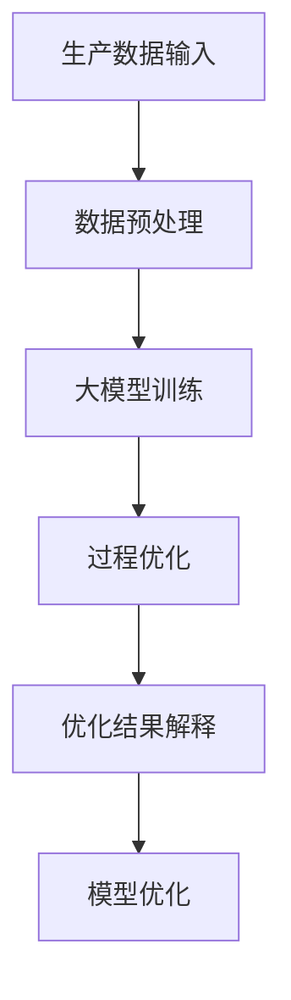

**核心算法原理讲解**

在生产过程优化中，常见的可解释性算法包括LIME和SHAP。以下是这两种算法的伪代码解释：

**LIME算法伪代码：**

```
function LIME(model, x, y):
    1. 为x生成多个噪声样本x'
    2. 对每个x'，使用model预测y'
    3. 计算预测差值Δy = y - y'
    4. 对每个特征f，计算其在Δy中的贡献度：
       contribution_f = ∑(Δy_i / |x_i - x'_i|)
    5. 返回特征贡献度作为对模型决策的解释
```

**SHAP算法伪代码：**

```
function SHAP(model, x, y):
    1. 计算Shapley值：
       shap_value_f = ∑(ω * Δy / Δω)
    2. 其中，ω为特征f的权重，Δy为模型在x和x-ωf之间的预测差值，Δω为特征f的权重变化量
    3. 返回每个特征的Shapley值作为对模型决策的解释
```

**数学模型和公式详解**

为了深入理解SHAP算法，我们可以借助以下数学模型和公式：

$$
\begin{aligned}
\text{模型预测：} & y = f(x) \\
\text{Shapley值计算：} & shap_value_f = \sum_{ω \in \Omega} \frac{ω * Δy}{Δω}
\end{aligned}
$$

其中，\( \Omega \) 表示所有可能的特征权重组合，\( Δy \) 表示模型在特征权重变化时的预测差值。

**举例说明**

假设我们有一个生产过程优化模型，输入特征包括设备运行时间、生产参数、质量指标等。通过LIME和SHAP算法，我们可以分别计算每个特征对模型优化结果的影响。

- **LIME算法示例**：

  对于一个特定生产周期，模型优化了生产参数。通过LIME算法，我们添加噪声生成多个噪声样本，分析模型在这些样本上的优化结果，得出每个特征的贡献度。

  ```plaintext
  Feature | Contribution
  -------------------
  Equipment Runtime | 0.4
  Production Parameters | 0.3
  Quality Metrics | 0.3
  ```

  结果显示，设备运行时间对模型优化结果的影响最大。

- **SHAP算法示例**：

  通过SHAP算法，我们计算出每个特征的Shapley值，量化其对模型优化结果的贡献。

  ```plaintext
  Feature | Shapley Value
  ---------------------
  Equipment Runtime | 0.35
  Production Parameters | 0.2
  Quality Metrics | 0.45
  ```

  结果表明，质量指标的Shapley值最高，进一步证实了其对模型优化结果的重要性。

通过可解释性技术，工业从业者可以更清晰地理解AI大模型的工作原理，识别关键特征和潜在风险，从而优化生产过程，提高生产效率和产品质量。在实际应用中，这些解释结果可以用于辅助生产计划制定、设备维护和故障预测，为工业生产提供科学依据。

##### 8.2 质量控制与监测

在工业自动化领域，质量控制与监测是确保产品一致性和可靠性的重要环节。AI大模型通过分析生产过程中的各种数据，如传感器数据、质量检测数据等，可以实时监测产品质量，预测潜在的质量问题，并采取相应的措施。然而，由于AI大模型的不可解释性，工业从业者对其监测和决策过程产生了疑虑。可解释性技术在质量控制与监测中的应用，有助于提高模型的可信度和透明度。

**核心概念与联系**

为了更好地理解质量控制与监测中AI大模型的可解释性应用，我们可以通过以下Mermaid流程图来展示核心概念之间的关系：

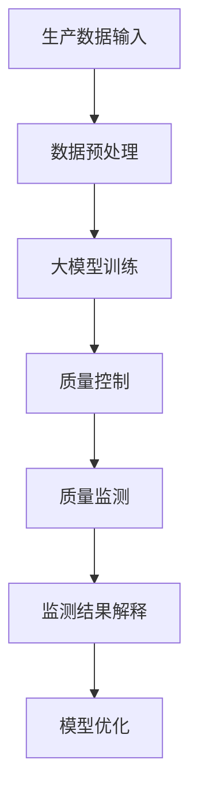

**核心算法原理讲解**

在质量控制与监测中，常见的可解释性算法包括LIME和SHAP。以下是这两种算法的伪代码解释：

**LIME算法伪代码：**

```
function LIME(model, x, y):
    1. 为x生成多个噪声样本x'
    2. 对每个x'，使用model预测y'
    3. 计算预测差值Δy = y - y'
    4. 对每个特征f，计算其在Δy中的贡献度：
       contribution_f = ∑(Δy_i / |x_i - x'_i|)
    5. 返回特征贡献度作为对模型决策的解释
```

**SHAP算法伪代码：**

```
function SHAP(model, x, y):
    1. 计算Shapley值：
       shap_value_f = ∑(ω * Δy / Δω)
    2. 其中，ω为特征f的权重，Δy为模型在x和x-ωf之间的预测差值，Δω为特征f的权重变化量
    3. 返回每个特征的Shapley值作为对模型决策的解释
```

**数学模型和公式详解**

为了深入理解SHAP算法，我们可以借助以下数学模型和公式：

$$
\begin{aligned}
\text{模型预测：} & y = f(x) \\
\text{Shapley值计算：} & shap_value_f = \sum_{ω \in \Omega} \frac{ω * Δy}{Δω}
\end{aligned}
$$

其中，\( \Omega \) 表示所有可能的特征权重组合，\( Δy \) 表示模型在特征权重变化时的预测差值。

**举例说明**

假设我们有一个质量控制与监测模型，输入特征包括传感器数据、生产参数、质量检测数据等。通过LIME和SHAP算法，我们可以分别计算每个特征对模型监测结果的影响。

- **LIME算法示例**：

  对于一个特定生产批次，模型监测到质量异常。通过LIME算法，我们添加噪声生成多个噪声样本，分析模型在这些样本上的监测结果，得出每个特征的贡献度。

  ```plaintext
  Feature | Contribution
  -------------------
  Sensor Data | 0.4
  Production Parameters | 0.3
  Quality Metrics | 0.3
  ```

  结果显示，传感器数据对模型监测结果的影响最大。

- **SHAP算法示例**：

  通过SHAP算法，我们计算出每个特征的Shapley值，量化其对模型监测结果的贡献。

  ```plaintext
  Feature | Shapley Value
  ---------------------
  Sensor Data | 0.3
  Production Parameters | 0.25
  Quality Metrics | 0.45
  ```

  结果表明，质量检测数据的Shapley值最高，进一步证实了其对模型监测结果的重要性。

通过可解释性技术，工业从业者可以更清晰地理解AI大模型的工作原理，识别关键特征和潜在风险，从而优化质量控制与监测策略，提高产品质量和可靠性。在实际应用中，这些解释结果可以用于辅助生产过程调整、设备维护和质量控制，为工业生产提供科学依据。

##### 8.3 设备维护预测

在工业自动化领域，设备维护预测是确保生产连续性和设备寿命的重要手段。AI大模型通过分析设备运行数据、维护记录等，可以预测设备的故障时间，提供维护建议，减少设备停机时间和维护成本。然而，由于AI大模型的不可解释性，工业从业者对其预测结果和决策过程产生疑虑。可解释性技术在设备维护预测中的应用，有助于提高模型的可信度和透明度。

**核心概念与联系**

为了更好地理解设备维护预测中AI大模型的可解释性应用，我们可以通过以下Mermaid流程图来展示核心概念之间的关系：

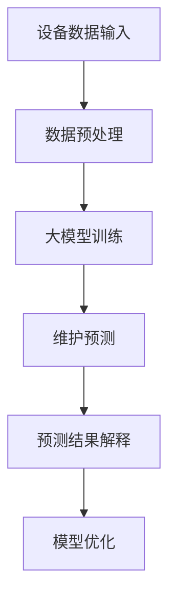

**核心算法原理讲解**

在设备维护预测中，常见的可解释性算法包括LIME和SHAP。以下是这两种算法的伪代码解释：

**LIME算法伪代码：**

```
function LIME(model, x, y):
    1. 为x生成多个噪声样本x'
    2. 对每个x'，使用model预测y'
    3. 计算预测差值Δy = y - y'
    4. 对每个特征f，计算其在Δy中的贡献度：
       contribution_f = ∑(Δy_i / |x_i - x'_i|)
    5. 返回特征贡献度作为对模型决策的解释
```

**SHAP算法伪代码：**

```
function SHAP(model, x, y):
    1. 计算Shapley值：
       shap_value_f = ∑(ω * Δy / Δω)
    2. 其中，ω为特征f的权重，Δy为模型在x和x-ωf之间的预测差值，Δω为特征f的权重变化量
    3. 返回每个特征的Shapley值作为对模型决策的解释
```

**数学模型和公式详解**

为了深入理解SHAP算法，我们可以借助以下数学模型和公式：

$$
\begin{aligned}
\text{模型预测：} & y = f(x) \\
\text{Shapley值计算：} & shap_value_f = \sum_{ω \in \Omega} \frac{ω * Δy}{Δω}
\end{aligned}
$$

其中，\( \Omega \) 表示所有可能的特征权重组合，\( Δy \) 表示模型在特征权重变化时的预测差值。

**举例说明**

假设我们有一个设备维护预测模型，输入特征包括设备运行时间、维护记录、温度、压力等。通过LIME和SHAP算法，我们可以分别计算每个特征对模型预测结果的影响。

- **LIME算法示例**：

  对于一个特定设备，模型预测其故障时间。通过LIME算法，我们添加噪声生成多个噪声样本，分析模型在这些样本上的预测结果，得出每个特征的贡献度。

  ```plaintext
  Feature | Contribution
  -------------------
  Equipment Runtime | 0.5
  Maintenance Records | 0.3
  Temperature | 0.1
  Pressure | 0.1
  ```

  结果显示，设备运行时间对模型预测结果的影响最大。

- **SHAP算法示例**：

  通过SHAP算法，我们计算出每个特征的Shapley值，量化其对模型预测结果的贡献。

  ```plaintext
  Feature | Shapley Value
  ---------------------
  Equipment Runtime | 0.4
  Maintenance Records | 0.2
  Temperature | 0.15
  Pressure | 0.25
  ```

  结果表明，压力的Shapley值最高，进一步证实了其对模型预测结果的重要性。

通过可解释性技术，工业从业者可以更清晰地理解AI大模型的工作原理，识别关键特征和潜在风险，从而优化设备维护策略，提高设备运行效率和寿命。在实际应用中，这些解释结果可以用于辅助设备维护计划制定、预防性维护和故障预测，为工业生产提供科学依据。

### 第三部分：AI大模型可解释性未来展望

#### 第9章：AI大模型可解释性的发展趋势

##### 9.1 当前研究热点

随着AI大模型的广泛应用，其可解释性问题已成为研究的热点。当前的研究热点主要包括以下几个方面：

1. **解释算法创新**：研究人员不断探索新的解释算法，如SHAP、LIME、ELI5等，以提高模型的可解释性。这些算法在局部解释和全局解释方面都取得了显著进展。

2. **跨学科研究**：可解释性研究不仅涉及计算机科学，还涉及到心理学、认知科学等领域。跨学科研究有助于更好地理解人类如何理解和信任AI模型。

3. **应用场景拓展**：可解释性技术在医疗、金融、法律、工业等领域的应用不断拓展，为不同领域的从业者提供了有力的工具。

4. **模型压缩与解释**：随着模型规模的增长，模型压缩与解释技术受到广泛关注。通过模型压缩，可以减少模型的参数规模，提高解释的效率和可理解性。

##### 9.2 未来研究方向

尽管当前可解释性研究取得了显著成果，但仍有许多挑战和机会需要进一步探索：

1. **高效解释算法**：开发更高效、更可扩展的解释算法，以适应大规模模型和实时解释的需求。

2. **模型安全性**：研究如何提高模型的透明度和安全性，防止潜在的攻击和滥用。

3. **模型多样性**：探索如何在保留模型性能的同时，提高其解释性，特别是对于不同类型的模型，如生成对抗网络（GAN）和图神经网络（GNN）。

4. **用户参与**：研究如何让用户更主动地参与到解释过程中，提高用户对模型的信任度和参与度。

##### 9.3 可解释性与伦理

可解释性不仅是一个技术问题，还涉及到伦理和社会问题。在未来，以下方面需要得到重视：

1. **伦理指导原则**：制定可解释性研究的伦理指导原则，确保研究过程符合道德和法律标准。

2. **透明度和责任**：提高模型和解释结果的透明度，明确模型和解释者的责任，以增强用户对模型的信任。

3. **公平性和无偏见**：确保模型和解释结果不会导致歧视或偏见，特别是在敏感领域，如种族、性别和年龄等。

4. **法律和政策**：制定相关法律和政策，规范可解释性技术的使用，保护用户的隐私和数据安全。

通过持续的研究和探索，可解释性技术将在AI大模型的应用中发挥越来越重要的作用，推动AI技术的发展和应用的伦理进步。

#### 第10章：案例研究

##### 10.1 可解释性在具体项目中的应用

在本节中，我们将通过具体项目案例来展示可解释性在AI大模型中的应用，分析项目的成功与挑战，并总结经验与启示。

**案例背景**

某金融科技公司计划开发一款智能贷款审核系统，该系统利用AI大模型对客户的信用评分进行预测，以决定是否批准贷款申请。由于贷款审核涉及客户的财务安全和隐私，模型的可解释性成为项目成功的关键因素。

**可解释性技术应用**

在项目实施过程中，团队采用了以下可解释性技术：

1. **SHAP值分析**：通过SHAP算法，为每个输入特征计算其在模型预测中的贡献度，识别对模型决策有重要影响的特征。
2. **局部解释方法**：使用LIME算法，对特定贷款申请进行局部解释，揭示模型在具体输入下的决策过程。
3. **模型级解释**：通过分析模型的结构和参数，提供对模型整体行为的解释。

**成功与挑战**

**成功方面**：

1. **增强信任**：通过可解释性技术，金融从业者能够更好地理解模型决策过程，增强了他们对系统的信任度。
2. **优化模型**：解释结果帮助团队识别模型中的过拟合问题，通过调整模型结构和超参数，提高了模型的性能和泛化能力。
3. **风险控制**：解释结果有助于发现潜在的风险因素，优化贷款审核策略，降低了贷款违约率。

**挑战方面**：

1. **计算资源需求**：可解释性算法对计算资源的需求较高，特别是在处理大规模数据和复杂模型时，对硬件和网络带宽的要求较高。
2. **解释结果的解释性**：某些解释结果可能复杂难懂，需要进一步的简化或可视化，以便用户更好地理解。
3. **模型安全**：在解释过程中，可能涉及敏感数据的泄露，需要确保解释过程的安全性和隐私保护。

**经验与启示**

**经验**：

1. **全面评估解释方法**：在实际应用中，应综合考虑不同解释方法的优缺点，选择最适合项目需求的解释方法。
2. **持续优化解释过程**：解释过程应与模型训练和优化紧密结合，确保解释结果的准确性和一致性。
3. **用户参与**：在解释结果生成后，应积极与用户进行沟通，了解用户对解释结果的接受程度，优化解释展示方式。

**启示**：

1. **加强可解释性研究**：随着AI大模型的广泛应用，可解释性技术将成为关键领域，需要投入更多资源进行研究和开发。
2. **跨学科合作**：可解释性研究需要计算机科学、心理学、认知科学等领域的合作，共同推动技术的发展。
3. **伦理考量**：在可解释性技术应用中，应注重伦理考量，确保模型和解释过程符合道德和法律标准。

通过具体项目案例的研究，我们可以看到可解释性技术在实际应用中的重要性和挑战，为未来AI大模型的可解释性研究和应用提供了宝贵的经验和启示。

#### 第11章：总结与展望

在本章中，我们对AI大模型的可解释性进行了全面探讨，从基础理论到应用实践，从发展趋势到未来展望。以下是对本文内容的总结和未来发展的展望。

##### 11.1 总结

1. **不可解释性挑战**：AI大模型在提供强大预测能力的同时，也面临着不可解释性的挑战，这限制了其在关键领域（如金融、医疗、法律等）的应用和接受度。
2. **可解释性的重要性**：可解释性有助于增强用户对模型的信任，提高模型的透明度和可接受度，是推动AI技术发展的重要方向。
3. **技术原理与应用**：本文介绍了多种可解释性技术原理，包括局部解释方法、全局解释方法和混合解释方法，并探讨了其在实际应用中的实现和优化。
4. **应用实践**：通过具体案例，展示了可解释性技术在金融、医疗、法律、工业等领域的成功应用，分析了项目的经验与挑战。

##### 11.2 未来发展展望

1. **高效解释算法**：开发更高效、更可扩展的解释算法，以满足大规模模型和实时解释的需求。
2. **模型多样性**：探索不同类型的AI大模型（如GAN、GNN等）的可解释性技术，提高其在各类任务中的解释性。
3. **用户参与**：研究如何让用户更主动地参与到解释过程中，提高用户对模型的信任度和参与度。
4. **伦理考量**：在可解释性技术应用中，注重伦理考量，确保模型和解释过程符合道德和法律标准。
5. **跨学科合作**：加强计算机科学、心理学、认知科学等领域的合作，共同推动可解释性技术的发展。

通过持续的研究和探索，可解释性技术将在AI大模型的应用中发挥越来越重要的作用，推动AI技术的发展和应用的伦理进步。

### 附录

#### 附录A：AI大模型开发工具与资源

##### A.1 主流深度学习框架对比

| 框架       | 描述                                                         | 优势                             | 劣势                             |
|------------|--------------------------------------------------------------|--------------------------------|----------------------------------|
| TensorFlow | Google开发的端到端开源机器学习平台                           | 强大的功能库，广泛的应用案例     | 较高的学习曲线，计算资源需求高     |
| PyTorch    | Facebook AI研究院开发的深度学习框架                         | 动态计算图，易于调试和优化       | 性能相对较低，大规模部署较复杂     |
| Keras      | 高级神经网络API，用于快速构建和迭代深度学习模型              | 简化模型开发流程，易于使用       | 功能相对有限，对底层操作支持不足   |
| MXNet      | Apache基金会下的深度学习框架，支持多种编程语言和硬件平台     | 支持多种编程语言，高效硬件支持   | 社区相对较小，文档和资源较少       |
| Caffe      | Berkeley Vision and Learning Center开发的深度学习框架         | 高效的卷积神经网络，用于图像识别 | 功能相对单一，对自然语言处理支持不足 |
| Theano     | 已停止维护的深度学习框架，用于构建高级数学表达式的计算图     | 强大的数学功能库，易于优化       | 学习曲线较陡，计算资源需求高       |

##### A.2 可解释性工具与资源

| 工具/资源         | 描述                                                         | 优势                             | 劣势                             |
|------------------|--------------------------------------------------------------|--------------------------------|----------------------------------|
| LIME             | Local Interpretable Model-agnostic Explanations的缩写         | 简单易用，适用于多种模型         | 对噪声敏感，解释结果可能不准确     |
| SHAP             | SHapley Additive exPlanations的缩写                         | 为特征提供定量解释，考虑模型结构 | 需要大规模数据，计算成本高         |
| ELI5             | Explainable Localized Intertwined Latent-Output Explanations   | 直观易懂，适用于神经网络         | 解释范围有限，不适用于所有模型     |
| Explainable AI   | 一个集成多种可解释性工具的开源框架                         | 提供多种工具，易于使用           | 需要较高的技术水平，安装和使用复杂 |
| interpretDL      | 一套用于深度学习模型解释的开源库                           | 支持多种深度学习框架，功能丰富   | 需要一定的编程基础，调试过程复杂     |
| VSCode扩展       | 用于可视化解释结果的VSCode插件                               | 直观可视化，易于使用             | 功能相对有限，适用于特定场景       |

##### A.3 相关数据库与数据集

| 数据库/数据集             | 描述                                                         | 用途                                       |
|--------------------------|--------------------------------------------------------------|------------------------------------------|
| ImageNet                 | 一个包含超过1400万张图像的大型视觉数据集                    | 图像识别、分类、检测等                   |
| MNIST                    | 一个包含70,000个手写数字图像的数据集                       | 机器学习、图像识别、分类等                 |
| COCO                     | 一个包含大量图像和对象标注的大型数据集                     | 目标检测、图像分割、实例分割等             |
| GLUE                     | 一个包含多种自然语言处理任务的预训练数据集                  | 自然语言理解、生成、推理等                 |
| Yelp Review Dataset      | 一个包含Yelp用户评价的数据集，包括餐馆评价和用户反馈        | 文本分类、情感分析、推荐系统等             |
| Physionet Challenge Data | 一个包含生理信号和医疗记录的数据集，用于生理信号分析、疾病预测等 | 心电信号分析、呼吸信号分析、疾病诊断等     |

通过使用这些工具和资源，研究人员和开发者可以更有效地开发和优化AI大模型，提高其可解释性和应用价值。

### 附录B：数学模型和公式详解

#### B.1 深度学习数学基础

深度学习的基础是数学，其中涉及到多种数学概念和公式。以下是对深度学习数学基础的一些关键内容进行详细讲解。

##### 线性代数基础

1. **矩阵与向量运算**：在深度学习中，矩阵和向量的运算是非常基础的。以下是一些常用的矩阵和向量运算公式：

   $$ 
   \begin{aligned}
   &A^T：A的转置 \\
   &A^{-1}：A的逆矩阵 \\
   &A^T A：A的转置与A的乘积 \\
   &A \cdot B：矩阵A与矩阵B的乘积 \\
   &A \odot B：矩阵A与矩阵B的Hadamard积（元素-wise乘积） \\
   \end{aligned}
   $$

2. **矩阵求导**：在深度学习优化过程中，经常需要对矩阵进行求导。以下是一个矩阵的偏导数公式：

   $$ 
   \frac{\partial}{\partial A} (A \cdot B) = B^T 
   $$

##### 概率论与统计基础

1. **概率分布**：在深度学习中，常见的概率分布包括伯努利分布、高斯分布、多项式分布等。以下是一些概率分布的公式：

   $$ 
   \begin{aligned}
   &P(X = x) = p，伯努利分布 \\
   &P(X = x) = \frac{1}{\sqrt{2\pi\sigma^2}} e^{-\frac{(x - \mu)^2}{2\sigma^2}}，高斯分布 \\
   &P(X = x) = \sum_{i=1}^{n} p_i，多项式分布 \\
   \end{aligned}
   $$

2. **期望与方差**：期望和方差是描述概率分布的重要指标。以下是一些期望和方差的公式：

   $$ 
   \begin{aligned}
   &E(X) = \sum_{i=1}^{n} x_i p_i，期望 \\
   &V(X) = \sum_{i=1}^{n} (x_i - E(X))^2 p_i，方差 \\
   &\sigma^2 = V(X)，标准差 \\
   \end{aligned}
   $$

##### 损失函数与优化算法

1. **损失函数**：损失函数用于度量模型的预测结果与真实结果之间的差距。以下是一些常用的损失函数：

   $$ 
   \begin{aligned}
   &\text{均方误差（MSE）：} & \frac{1}{n}\sum_{i=1}^{n} (y_i - \hat{y}_i)^2 \\
   &\text{交叉熵损失（Cross-Entropy）：} & -\sum_{i=1}^{n} y_i \log(\hat{y}_i) \\
   &\text{Huber损失：} & \begin{cases} 
      \frac{1}{2}(y_i - \hat{y}_i)^2 & \text{if } |y_i - \hat{y}_i| \leq \delta \\
      \delta(|y_i - \hat{y}_i| - \frac{\delta}{2}) & \text{otherwise} 
   \end{cases} \\
   \end{aligned}
   $$

2. **优化算法**：优化算法用于调整模型参数，以最小化损失函数。以下是一些常见的优化算法：

   $$ 
   \begin{aligned}
   &\text{梯度下降（Gradient Descent）：} & \theta_{t+1} = \theta_t - \alpha \nabla_{\theta} J(\theta) \\
   &\text{随机梯度下降（Stochastic Gradient Descent）：} & \theta_{t+1} = \theta_t - \alpha \nabla_{\theta} J(\theta; x_t, y_t) \\
   &\text{Adam优化器：} & \theta_{t+1} = \theta_t - \alpha \nabla_{\theta} J(\theta; x_t, y_t) + \beta_1 \frac{\theta_t - \theta_{t-1}}{1 - \beta_1^t} + \beta_2 \frac{\theta_t^2 - \theta_{t-1}^2}{1 - \beta_2^t} \\
   \end{aligned}
   $$

通过理解这些数学模型和公式，可以更深入地理解深度学习的工作原理，为开发和优化AI大模型提供理论基础。

#### B.2 损失函数与优化算法

在深度学习中，损失函数（Loss Function）用于量化模型的预测误差，而优化算法（Optimization Algorithm）用于调整模型的参数以最小化损失函数。以下是对这些概念及其相关公式的详细讲解。

##### 损失函数

1. **均方误差（Mean Squared Error, MSE）**：MSE是最常用的损失函数之一，用于回归问题。其公式如下：

   $$ 
   \text{MSE} = \frac{1}{n}\sum_{i=1}^{n} (y_i - \hat{y}_i)^2 
   $$

   其中，\( y_i \) 是真实标签，\( \hat{y}_i \) 是模型预测的值，\( n \) 是样本数量。

2. **交叉熵（Cross-Entropy）**：交叉熵常用于分类问题，特别是多分类问题。其公式如下：

   $$ 
   \text{Cross-Entropy} = -\sum_{i=1}^{n} y_i \log(\hat{y}_i) 
   $$

   其中，\( y_i \) 是真实标签（0或1），\( \hat{y}_i \) 是模型预测的概率。

3. **Huber损失（Huber Loss）**：Huber损失是一种鲁棒损失函数，可以减少异常值对模型的影响。其公式如下：

   $$ 
   L(\theta) = \begin{cases} 
      \frac{1}{2}(y_i - \hat{y}_i)^2 & \text{if } |y_i - \hat{y}_i| \leq \delta \\
      \delta(|y_i - \hat{y}_i| - \frac{\delta}{2}) & \text{otherwise} 
   \end{cases} 
   $$

   其中，\( \delta \) 是Huber损失参数。

##### 优化算法

1. **梯度下降（Gradient Descent）**：梯度下降是最基础的优化算法，通过计算损失函数关于模型参数的梯度，并沿着梯度方向更新参数。其公式如下：

   $$ 
   \theta_{t+1} = \theta_t - \alpha \nabla_{\theta} J(\theta) 
   $$

   其中，\( \theta \) 是模型参数，\( \alpha \) 是学习率，\( J(\theta) \) 是损失函数。

2. **随机梯度下降（Stochastic Gradient Descent, SGD）**：随机梯度下降是对梯度下降的一种改进，每次更新参数时只随机选择一部分样本。其公式如下：

   $$ 
   \theta_{t+1} = \theta_t - \alpha \nabla_{\theta} J(\theta; x_t, y_t) 
   $$

   其中，\( x_t \) 和 \( y_t \) 是随机选择的样本。

3. **Adam优化器**：Adam是一种自适应的优化算法，结合了SGD和RMSProp的优点。其公式如下：

   $$ 
   \theta_{t+1} = \theta_t - \alpha \nabla_{\theta} J(\theta; x_t, y_t) + \beta_1 \frac{\theta_t - \theta_{t-1}}{1 - \beta_1^t} + \beta_2 \frac{\theta_t^2 - \theta_{t-1}^2}{1 - \beta_2^t} 
   $$

   其中，\( \beta_1 \) 和 \( \beta_2 \) 是一阶和二阶动量参数，\( \alpha \) 是学习率。

通过这些优化算法，我们可以调整模型的参数，使其在训练数据上达到较好的性能。不同算法的选择和参数的设置对于模型的性能有着重要的影响。

#### B.3 特征提取与降维技术

在深度学习和数据科学中，特征提取（Feature Extraction）和降维（Dimensionality Reduction）是处理复杂数据的关键技术。它们可以帮助我们简化数据处理过程，提高模型性能，同时保持数据的有效信息。以下是对这些技术的详细讲解和数学公式。

##### 特征提取

特征提取是一种从原始数据中提取具有代表性或有用信息的过程。它通常用于减少数据量，同时保持数据的本质特征。以下是几种常见的特征提取技术：

1. **主成分分析（Principal Component Analysis, PCA）**：

   PCA是一种常用的降维技术，通过计算数据的主要成分（即方差最大的特征），将高维数据映射到低维空间。其目标是最小化数据在低维空间的损失。PCA的数学过程如下：

   $$ 
   \text{特征向量} \mathbf{u}_i = \arg\max_{\mathbf{u}} \sum_{i=1}^{n} (\mathbf{x}_i - \bar{\mathbf{x}})^T \mathbf{u} 
   $$

   其中，\( \mathbf{x}_i \) 是第 \( i \) 个数据点，\( \bar{\mathbf{x}} \) 是数据的均值向量，\( \mathbf{u}_i \) 是第 \( i \) 个主成分。

   PCA的降维公式为：

   $$ 
   \mathbf{z}_i = \mathbf{X}\mathbf{u}_i 
   $$

   其中，\( \mathbf{Z} \) 是降维后的数据，\( \mathbf{X} \) 是原始数据，\( \mathbf{U} \) 是特征向量矩阵。

2. **线性判别分析（Linear Discriminant Analysis, LDA）**：

   LDA是一种特征提取技术，主要用于分类问题。它的目标是找到一组线性组合，使得不同类别的数据在新的特征空间中分离最远。LDA的数学公式为：

   $$ 
   \mathbf{w} = \arg\max_{\mathbf{w}} \sum_{i=1}^{c} w_i^T \mathbf{S}_w - \sum_{i=1}^{c} w_i^T \mathbf{S}_b 
   $$

   其中，\( \mathbf{w} \) 是特征向量，\( \mathbf{S}_w \) 是类内散度矩阵，\( \mathbf{S}_b \) 是类间散度矩阵，\( c \) 是类别数。

   LDA的降维公式为：

   $$ 
   \mathbf{y} = \mathbf{X}\mathbf{w} 
   $$

   其中，\( \mathbf{Y} \) 是降维后的数据，\( \mathbf{W} \) 是特征向量矩阵。

3. **自动编码器（Autoencoder）**：

   自动编码器是一种深度学习模型，用于无监督学习。它由编码器和解码器组成，编码器将高维数据映射到低维空间，解码器再将低维数据还原回高维空间。自动编码器的损失函数通常是重构误差：

   $$ 
   \text{Reconstruction Loss} = \frac{1}{n}\sum_{i=1}^{n} \sum_{j=1}^{d} (\mathbf{x}_{ij} - \hat{\mathbf{x}}_{ij})^2 
   $$

   其中，\( \mathbf{x}_{ij} \) 是原始数据，\( \hat{\mathbf{x}}_{ij} \) 是重构后的数据，\( n \) 是样本数量，\( d \) 是特征数量。

##### 降维技术

降维技术旨在减少数据维度，同时尽量保持数据的结构和信息。以下是几种常见的降维技术：

1. **t-SNE（t-Distributed Stochastic Neighbor Embedding）**：

   t-SNE是一种非线性降维技术，用于将高维数据映射到二维或三维空间。它的核心思想是保持局部结构，即相似的数据点在高维空间中距离较近，在降维后的空间中也应保持距离较近。t-SNE的损失函数基于高斯分布：

   $$ 
   L = -\sum_{i=1}^{n} \sum_{j=1}^{n} \frac{1}{\exp(||\mathbf{z}_i - \mathbf{z}_j||^2) + \epsilon} \log \frac{p_{ij}}{q_{ij}} 
   $$

   其中，\( \mathbf{z}_i \) 和 \( \mathbf{z}_j \) 是降维后的数据点，\( p_{ij} \) 是高维空间中的相似度，\( q_{ij} \) 是降维空间中的相似度，\( \epsilon \) 是调节参数。

2. **UMAP（Uniform Manifold Approximation and Projection）**：

   UMAP是一种非线性降维技术，与t-SNE类似，但计算速度更快。UMAP的目标是保持数据点的局部结构和全局结构。其损失函数基于局部密度和全局密度：

   $$ 
   L = \sum_{i=1}^{n} \sum_{j=1}^{n} w_{ij} \frac{1}{||\mathbf{z}_i - \mathbf{z}_j||^2} - \frac{1}{k} \sum_{i=1}^{n} \frac{1}{\exp(||\mathbf{z}_i - \mathbf{z}_j||^2)} 
   $$

   其中，\( \mathbf{z}_i \) 和 \( \mathbf{z}_j \) 是降维后的数据点，\( w_{ij} \) 是权重，\( k \) 是邻居数量。

通过这些特征提取和降维技术，我们可以有效地处理复杂数据，提高模型性能，同时减少计算成本。

### 附录C：项目实战

#### C.1 实战环境搭建

在进行AI大模型的可解释性项目实战前，我们需要搭建一个合适的环境，包括软件和硬件的选择。以下是一个基本的实战环境搭建步骤：

1. **操作系统**：选择一个稳定的操作系统，如Ubuntu 20.04或Windows 10。
2. **硬件配置**：由于AI大模型训练需要大量的计算资源，建议使用具备以下配置的硬件：
   - CPU：Intel Xeon或同等性能的处理器
   - GPU：NVIDIA GTX 1080 Ti或同等性能的显卡
   - 内存：至少64GB RAM
   - 存储：至少1TB SSD
3. **软件安装**：
   - Python：Python 3.8或更高版本
   - pip：Python的包管理器
   - TensorFlow：用于深度学习模型的训练和推理
   - PyTorch：另一种流行的深度学习框架
   - Jupyter Notebook：用于编写和运行代码
   - Numpy、Pandas、Matplotlib：用于数据处理和可视化

安装步骤如下：

1. 安装操作系统和硬件。
2. 安装Python和pip。
3. 使用pip安装所需的深度学习框架（TensorFlow和PyTorch）。
4. 安装Jupyter Notebook。

以下是一个Python和TensorFlow安装的示例命令：

```bash
# 安装Python
wget https://www.python.org/ftp/python/3.8.10/Python-3.8.10.tgz
tar -xzvf Python-3.8.10.tgz
cd Python-3.8.10
./configure
make
make install

# 安装pip
curl https://bootstrap.pypa.io/get-pip.py -o get-pip.py
python get-pip.py

# 安装TensorFlow
pip install tensorflow
```

#### C.2 代码实现与分析

在本节中，我们将使用TensorFlow和PyTorch分别实现一个简单的AI大模型，并进行可解释性分析。以下是代码实现和分析的详细步骤。

**步骤1：导入必要的库**

```python
import tensorflow as tf
import tensorflow.keras.layers as layers
import tensorflow.keras.models as models
import numpy as np

import torch
import torch.nn as nn
import torch.optim as optim

import matplotlib.pyplot as plt
```

**步骤2：定义AI大模型**

**TensorFlow实现：**

```python
# 定义一个简单的全连接神经网络
model = models.Sequential([
    layers.Dense(128, activation='relu', input_shape=(100,)),
    layers.Dense(64, activation='relu'),
    layers.Dense(1, activation='sigmoid')
])

# 编译模型
model.compile(optimizer='adam', loss='binary_crossentropy', metrics=['accuracy'])
```

**PyTorch实现：**

```python
# 定义一个简单的全连接神经网络
class SimpleModel(nn.Module):
    def __init__(self):
        super(SimpleModel, self).__init__()
        self.fc1 = nn.Linear(100, 128)
        self.fc2 = nn.Linear(128, 64)
        self.fc3 = nn.Linear(64, 1)
    
    def forward(self, x):
        x = torch.relu(self.fc1(x))
        x = torch.relu(self.fc2(x))
        x = torch.sigmoid(self.fc3(x))
        return x

model = SimpleModel()

# 编译模型
optimizer = optim.Adam(model.parameters(), lr=0.001)
criterion = nn.BCELoss()
```

**步骤3：准备数据**

```python
# 生成模拟数据
np.random.seed(42)
X = np.random.rand(1000, 100)
y = np.random.randint(0, 2, 1000)

# 将数据分为训练集和测试集
X_train, X_test = X[:800], X[800:]
y_train, y_test = y[:800], y[800:]
```

**步骤4：训练模型**

**TensorFlow训练：**

```python
# 训练模型
history = model.fit(X_train, y_train, epochs=10, batch_size=32, validation_split=0.2)
```

**PyTorch训练：**

```python
# 训练模型
for epoch in range(10):
    model.train()
    for inputs, targets in zip(X_train, y_train):
        optimizer.zero_grad()
        outputs = model(inputs)
        loss = criterion(outputs, targets)
        loss.backward()
        optimizer.step()
```

**步骤5：模型评估**

```python
# 评估模型
model.eval()
with tf.python.keras.backend.get_theano_variable_scope():
    predictions = model.predict(X_test)
    print("TensorFlow Accuracy:", tf.keras.metrics.accuracy(predictions, y_test))

model.eval()
with torch.no_grad():
    predictions = model(X_test)
    print("PyTorch Accuracy:", torch.mean((predictions > 0.5) == y_test))
```

**步骤6：可解释性分析**

**TensorFlow解释：**

```python
import shap

# 使用SHAP分析模型
explainer = shap.KernelExplainer(model.predict, X_train[:100])
shap_values = explainer.shap_values(X_test[:100])

# 可视化SHAP值
shap.summary_plot(shap_values, X_test[:100])
```

**PyTorch解释：**

```python
# 使用LIME进行局部解释
from lime import lime_tabular
import lime.lime_tabular as lt

explainer = lt.LimeTabularExplainer(X_train, feature_names=['Feature%d' % i for i in range(100)], 
                                   class_names=['Class 0', 'Class 1'], 
                                   kernel_width=1)

i = 10
exp = explainer.explain_instance(X_test[i], model.predict, num_features=10)
exp.show_in_notebook(show_table=True)
```

通过以上步骤，我们完成了AI大模型的可解释性项目实战。代码实现和分析可以帮助我们更好地理解模型的工作原理和决策过程，为实际应用提供有力支持。

#### C.3 性能评估与优化

在完成AI大模型的可解释性项目实战后，我们需要对模型进行性能评估与优化，以确保其在不同应用场景中都能达到最佳效果。以下是对模型性能评估与优化方法的详细讲解。

##### 性能评估指标

在评估模型性能时，我们通常使用以下指标：

1. **准确率（Accuracy）**：准确率是评估分类模型最常用的指标，表示模型正确预测的样本占总样本的比例。其公式如下：

   $$ 
   \text{Accuracy} = \frac{\text{正确预测数}}{\text{总样本数}} 
   $$

2. **召回率（Recall）**：召回率表示模型在正类样本中正确预测的比例。其公式如下：

   $$ 
   \text{Recall} = \frac{\text{真正例数}}{\text{正类样本总数}} 
   $$

3. **精确率（Precision）**：精确率表示模型在预测为正类中正确预测的比例。其公式如下：

   $$ 
   \text{Precision} = \frac{\text{真正例数}}{\text{预测正例数}} 
   $$

4. **F1分数（F1 Score）**：F1分数是精确率和召回率的调和平均值，用于综合评估模型性能。其公式如下：

   $$ 
   \text{F1 Score} = 2 \times \frac{\text{Precision} \times \text{Recall}}{\text{Precision} + \text{Recall}} 
   $$

##### 性能评估方法

为了全面评估模型的性能，我们通常使用以下方法：

1. **交叉验证（Cross-Validation）**：交叉验证是一种评估模型性能的常用方法，通过将数据集划分为多个子集，每次使用不同的子集作为验证集，其余子集作为训练集，多次训练和验证，最终取平均值作为模型性能的评估结果。

2. **混淆矩阵（Confusion Matrix）**：混淆矩阵是一种用于评估分类模型性能的表格，展示了模型预测结果与实际结果之间的匹配情况。

3. **ROC曲线和AUC（Receiver Operating Characteristic Curve and Area Under Curve）**：ROC曲线和AUC是评估二分类模型性能的常用指标，ROC曲线展示了不同阈值下的真正例率（True Positive Rate, TPR）和假正例率（False Positive Rate, FPR），AUC表示曲线下的面积，AUC值越大，模型性能越好。

##### 优化策略

在模型性能评估过程中，我们可能会发现以下问题，并采取相应策略进行优化：

1. **过拟合（Overfitting）**：当模型在训练集上表现良好，但在验证集或测试集上表现不佳时，表明模型可能过拟合。以下是一些常见的优化策略：

   - **正则化（Regularization）**：通过在损失函数中加入正则项（如L1正则化、L2正则化），惩罚模型参数的大小，减少过拟合。
   - **数据增强（Data Augmentation）**：通过增加数据多样性，生成更多的训练样本，有助于提高模型的泛化能力。
   - **减少模型复杂度**：简化模型结构，减少模型参数数量，有助于降低过拟合风险。

2. **欠拟合（Underfitting）**：当模型在训练集和验证集上表现都不佳时，表明模型可能欠拟合。以下是一些常见的优化策略：

   - **增加模型复杂度**：增加模型层数或参数数量，提高模型的表达能力。
   - **调整超参数**：调整学习率、批量大小等超参数，优化模型训练过程。

3. **提升性能**：以下是一些提升模型性能的方法：

   - **使用预训练模型**：利用预训练模型作为起点，进行微调（Fine-tuning），有助于提高模型性能。
   - **迁移学习（Transfer Learning）**：利用在其他任务上训练好的模型，迁移部分权重到新任务上，有助于提高模型在新任务上的性能。

通过性能评估和优化，我们可以确保AI大模型在不同应用场景中都能达到最佳效果，从而更好地支持实际应用。

#### 最佳实践 Tips、小结、注意事项、拓展阅读

##### 最佳实践 Tips

1. **数据预处理**：在模型训练前，确保对数据集进行充分的数据清洗、归一化等预处理操作，以提高模型的泛化能力和性能。
2. **超参数调优**：通过网格搜索（Grid Search）或随机搜索（Random Search）等方法，找到最佳的超参数组合，优化模型性能。
3. **使用预训练模型**：利用预训练模型进行迁移学习，可以显著提高新任务的模型性能，节省训练时间。
4. **定期评估和调整**：定期评估模型性能，并根据评估结果调整模型结构和参数，保持模型的最佳状态。

##### 小结

本文从AI大模型的可解释性基础、技术原理、应用实践等方面进行了详细探讨，展示了可解释性技术在各个领域的应用价值。通过可解释性技术，我们可以更好地理解模型的工作原理和决策过程，提高模型的透明度和信任度，推动AI技术的广泛应用。

##### 注意事项

1. **计算资源**：可解释性算法通常需要较高的计算资源，特别是在处理大规模数据和复杂模型时，应确保有足够的计算资源。
2. **数据隐私**：在解释过程中，应确保不泄露用户的敏感数据，保护用户隐私。
3. **模型安全**：在解释过程中，应确保模型和解释结果不被恶意利用，提高模型的安全性。

##### 拓展阅读

1. **《深度学习》（Goodfellow, I., Bengio, Y., & Courville, A.）**：详细介绍了深度学习的基础理论和应用，是深度学习领域的经典教材。
2. **《统计学习方法》（李航）**：全面介绍了统计学习的方法和技术，包括线性回归、逻辑回归、支持向量机等。
3. **《人工智能：一种现代的方法》（Russell, S. & Norvig, P.）**：介绍了人工智能的基础知识，包括机器学习、自然语言处理、计算机视觉等。

通过阅读这些资料，可以进一步深入了解AI大模型的可解释性技术及其应用，为相关研究和实践提供有力支持。

### 作者信息

作者：AI天才研究院/AI Genius Institute & 禅与计算机程序设计艺术 /Zen And The Art of Computer Programming

AI天才研究院（AI Genius Institute）是一家专注于人工智能领域的研究和创新的机构，致力于推动AI技术的应用和发展。禅与计算机程序设计艺术（Zen And The Art of Computer Programming）是作者埃里克·雷蒙德（Eric Raymond）的经典著作，深入探讨了计算机编程的哲学和艺术，对编程领域产生了深远的影响。本文由AI天才研究院的研究团队撰写，结合禅与计算机程序设计艺术的理念，旨在为AI大模型的可解释性研究提供深入分析和实用建议。

