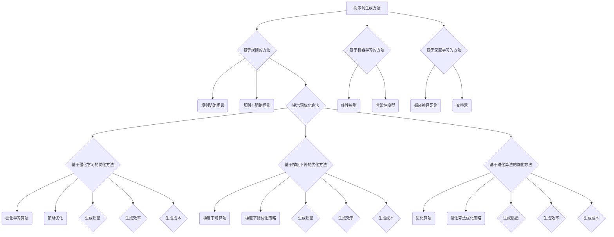

                 

# 文章标题：AI大模型的提示词生成与优化算法

> 关键词：AI大模型，提示词生成，优化算法，深度学习，自然语言处理

> 摘要：本文详细探讨了AI大模型的提示词生成与优化算法。首先介绍了AI大模型的基本概念、发展历程和核心应用领域，然后分析了AI大模型的基本原理，包括深度学习、自然语言处理和大规模预训练模型。接着，深入探讨了提示词生成技术，包括提示词的概念、生成方法及其挑战与解决方案。随后，讨论了提示词优化算法的目标、方法和性能评估。最后，通过具体案例展示了AI大模型在提示词生成与优化中的应用，并对未来发展趋势进行了展望。

### 第一部分：AI大模型概述与理论基础

#### 第1章：AI大模型概述

##### 1.1 AI大模型的概念与重要性

###### 1.1.1 AI大模型的定义

AI大模型是指通过大规模数据训练得到的复杂神经网络模型，通常具有数百万甚至数十亿个参数。这些模型可以应用于多种领域，如自然语言处理、计算机视觉、强化学习等。

###### 1.1.2 AI大模型的重要性

AI大模型的重要性主要体现在以下几个方面：

1. **提升模型性能**：大模型通过在大量数据上训练，可以捕捉到更复杂的特征和模式，从而提高模型的性能。

2. **拓宽应用领域**：大模型的应用不仅限于传统的计算机视觉和自然语言处理领域，还可以应用于医疗、金融、教育等新兴领域。

3. **促进技术发展**：大模型的研究推动了深度学习、自然语言处理等技术的发展，为AI技术的进步提供了新的方向。

##### 1.2 AI大模型的发展历程

###### 1.2.1 从小模型到AI大模型的演进

AI大模型的发展历程可以追溯到20世纪80年代的神经网络研究。随着计算能力和数据资源的不断提升，神经网络模型从简单的多层感知器（MLP）发展到更复杂的卷积神经网络（CNN）和循环神经网络（RNN）。近年来，大规模预训练模型如BERT、GPT-3等的出现，标志着AI大模型的发展进入了新的阶段。

###### 1.2.2 主流AI大模型概述

当前主流的AI大模型主要包括以下几种：

1. **BERT（Bidirectional Encoder Representations from Transformers）**：一种基于Transformer的预训练模型，主要用于自然语言处理任务。

2. **GPT（Generative Pre-trained Transformer）**：一种基于Transformer的预训练模型，主要用于生成任务，如文本生成、翻译等。

3. **TuringML（Turing Machine Learning）**：一种基于量子计算的AI大模型，具有极高的计算速度和效率。

##### 1.3 AI大模型的核心应用领域

###### 1.3.1 自然语言处理

自然语言处理是AI大模型的重要应用领域之一。通过预训练模型，AI大模型可以自动学习语言的结构和语义，从而实现文本分类、情感分析、问答系统等任务。

###### 1.3.2 计算机视觉

计算机视觉是另一个AI大模型的重要应用领域。大模型可以自动学习图像中的特征和模式，从而实现图像分类、目标检测、图像分割等任务。

###### 1.3.3 强化学习

强化学习是AI大模型在新兴领域的重要应用。大模型可以通过预训练学习到复杂的策略，从而在游戏、机器人控制等任务中表现出色。

##### 1.4 AI大模型的发展趋势

###### 1.4.1 技术发展趋势

1. **模型规模的扩大**：随着计算资源的增加，AI大模型的规模将不断扩大，以捕捉更复杂的特征和模式。

2. **多模态学习**：AI大模型将逐渐实现多模态学习，如图像、文本、音频等数据类型的结合，以实现更全面的认知能力。

3. **自适应学习**：AI大模型将实现自适应学习，根据不同任务和环境动态调整模型参数。

###### 1.4.2 应用发展趋势

1. **智能化应用**：AI大模型将在更多的智能化应用中发挥作用，如自动驾驶、智能客服、智能医疗等。

2. **泛在化应用**：AI大模型将逐渐渗透到生活的方方面面，实现真正的智能化生活。

#### 第2章：AI大模型的基本原理

##### 2.1 深度学习基础

###### 2.1.1 深度学习的概念与基本原理

深度学习是机器学习的一个重要分支，通过多层神经网络模型，自动学习输入和输出之间的复杂映射关系。深度学习的基本原理包括：

1. **多层神经网络**：深度学习模型由多个隐层组成，通过逐层学习，将低级特征映射到高级特征。

2. **反向传播算法**：深度学习模型通过反向传播算法，不断调整模型参数，以最小化损失函数。

3. **激活函数**：激活函数用于引入非线性特性，使模型能够学习更复杂的映射关系。

###### 2.1.2 神经网络的基本结构

神经网络的基本结构包括输入层、隐藏层和输出层。输入层接收外部输入数据，隐藏层对输入数据进行特征提取和变换，输出层生成预测结果。

###### 2.1.3 前馈神经网络与反向传播算法

前馈神经网络是一种常见的神经网络结构，数据从输入层流向输出层，没有反向传播。反向传播算法是一种优化方法，通过反向传播误差，不断调整模型参数，以最小化损失函数。

##### 2.2 自然语言处理基础

###### 2.2.1 语言模型的基本概念

语言模型是自然语言处理的核心组成部分，用于预测下一个词或字符的概率。语言模型可以分为基于统计方法和基于神经网络方法。

###### 2.2.2 词嵌入技术

词嵌入是将词汇映射到高维向量空间的技术，通过捕捉词汇之间的相似性，实现语义理解。词嵌入技术可以分为基于分布方法和基于神经网络方法。

###### 2.2.3 序列模型与注意力机制

序列模型是处理序列数据（如文本、音频等）的神经网络模型，通过捕捉序列中的依赖关系，实现序列到序列的映射。注意力机制是一种重要的序列模型技术，通过关注序列中的关键部分，提高模型的性能。

##### 2.3 大规模预训练模型原理

###### 2.3.1 预训练的概念与意义

预训练是一种在大规模数据集上对神经网络模型进行训练的方法，通过预训练，模型可以自动学习到丰富的知识，从而在下游任务中表现出色。

###### 2.3.2 自监督学习方法

自监督学习方法是一种无监督学习技术，通过利用未标记的数据，对模型进行预训练。自监督学习方法可以分为基于语言模型的方法和基于任务的方法。

###### 2.3.3 迁移学习与微调技术

迁移学习是一种将预训练模型的知识迁移到新的任务上的方法。微调技术是一种在迁移学习过程中，对预训练模型进行微调的方法，以适应新的任务。

### 第二部分：提示词生成与优化算法

#### 第3章：提示词生成技术

##### 3.1 提示词的概念与作用

###### 3.1.1 提示词的定义

提示词是指用于引导AI大模型生成输出的一系列关键词或短语。提示词可以为模型提供目标信息，帮助模型生成更准确、更有意义的输出。

###### 3.1.2 提示词在AI大模型中的作用

提示词在AI大模型中的作用主要体现在以下几个方面：

1. **引导模型生成**：提示词可以为模型提供目标信息，使模型生成更符合需求的输出。

2. **提高生成质量**：通过优化提示词，可以提高AI大模型生成输出的质量，实现更好的效果。

3. **降低生成成本**：合理设计提示词，可以降低AI大模型生成输出的成本，提高模型的应用效率。

##### 3.2 提示词生成方法

###### 3.2.1 基于规则的方法

基于规则的方法是指通过定义一系列规则，生成符合要求的提示词。这种方法适用于规则明确、固定的情况，但难以应对复杂的任务需求。

###### 3.2.2 基于机器学习的方法

基于机器学习的方法是指利用机器学习算法，从训练数据中学习生成提示词的规律。这种方法具有较好的灵活性和适应性，但需要大量的训练数据和计算资源。

###### 3.2.3 基于深度学习的方法

基于深度学习的方法是指利用深度学习模型，如循环神经网络（RNN）、变换器（Transformer）等，生成提示词。这种方法具有较好的性能和效果，但需要较大的模型规模和计算资源。

##### 3.3 提示词生成的挑战与解决方案

###### 3.3.1 提示词多样性与一致性

提示词多样性与一致性是提示词生成的重要挑战。为了满足不同任务需求，提示词需要具备多样性和灵活性，但同时也需要保持一致性，以确保生成的输出符合预期。

解决方案：

1. **数据增强**：通过数据增强技术，增加训练数据的多样性，从而提高提示词生成的多样性和一致性。

2. **多模型融合**：结合多个模型，如基于规则的方法、基于机器学习的方法和基于深度学习的方法，实现提示词生成的多样性和一致性。

###### 3.3.2 提示词的语义理解

提示词的语义理解是提示词生成的重要挑战。为了使模型生成更准确的输出，需要对提示词进行深入理解和分析。

解决方案：

1. **词嵌入技术**：利用词嵌入技术，将提示词映射到高维向量空间，实现语义理解和分析。

2. **上下文信息**：利用上下文信息，如句子、段落等，提高提示词的语义理解能力。

###### 3.3.3 提示词生成的可解释性

提示词生成的可解释性是提示词生成的重要挑战。为了使模型生成过程更加透明和可信，需要提高提示词生成的可解释性。

解决方案：

1. **模型可视化**：通过模型可视化技术，如层可视化、激活可视化等，提高提示词生成的可解释性。

2. **解释算法**：开发基于解释算法的提示词生成方法，如注意力机制、梯度解释等，提高提示词生成的可解释性。

### 第三部分：提示词优化算法

#### 第4章：提示词优化算法

##### 4.1 提示词优化的目标

提示词优化的目标主要包括以下几个方面：

1. **提升生成质量**：通过优化提示词，提高AI大模型生成输出的质量，实现更准确、更有意义的输出。

2. **提升生成效率**：通过优化提示词，降低AI大模型生成输出的成本，提高模型的应用效率。

3. **降低生成成本**：通过优化提示词，降低AI大模型生成输出的计算资源和时间成本。

##### 4.2 提示词优化算法

###### 4.2.1 基于强化学习的优化方法

基于强化学习的优化方法是指利用强化学习算法，通过训练和优化提示词生成策略，实现提示词的优化。

伪代码：

```
初始化模型参数
while epoch < max_epochs:
    for batch in data_loader:
        # 计算提示词生成策略的梯度
        gradients = compute_gradients(batch)
        # 更新模型参数
        update_model_params(gradients)
epoch < max_epochs
```

###### 4.2.2 基于梯度下降的优化方法

基于梯度下降的优化方法是指利用梯度下降算法，通过计算提示词生成函数的梯度，实现提示词的优化。

伪代码：

```
初始化模型参数
for epoch in range(max_epochs):
    for batch in data_loader:
        # 计算提示词生成函数的梯度
        gradients = compute_gradients(batch)
        # 更新模型参数
        update_model_params(gradients)
```

###### 4.2.3 基于进化算法的优化方法

基于进化算法的优化方法是指利用进化算法，通过模拟自然进化过程，实现提示词的优化。

伪代码：

```
初始化种群
while generation < max_generations:
    # 计算适应度函数
    fitness = compute_fitness(population)
    # 生成下一代种群
    population = generate_next_population(population, fitness)
    generation < max_generations
```

##### 4.3 提示词优化算法的性能评估

提示词优化算法的性能评估主要包括以下几个方面：

1. **生成质量**：通过评估生成的输出质量，如准确性、多样性、一致性等，来评估提示词优化算法的性能。

2. **生成效率**：通过评估模型生成输出的时间成本和计算资源消耗，来评估提示词优化算法的性能。

3. **生成成本**：通过评估模型生成输出的成本，如训练时间、计算资源消耗等，来评估提示词优化算法的性能。

### 第四部分：AI大模型在提示词生成与优化中的应用

#### 第5章：AI大模型在提示词生成与优化中的应用

##### 5.1 提示词生成在自然语言处理中的应用

自然语言处理是AI大模型的重要应用领域之一，提示词生成在自然语言处理中具有广泛的应用。以下是一些典型的应用场景：

1. **问答系统**：通过生成合适的提示词，引导AI大模型生成准确的答案。

2. **机器翻译**：通过生成合适的提示词，提高AI大模型翻译的准确性和多样性。

3. **文本摘要**：通过生成合适的提示词，提高AI大模型生成摘要的准确性和可读性。

##### 5.2 提示词优化在自然语言处理中的应用

提示词优化在自然语言处理中的应用主要包括以下几个方面：

1. **问答系统**：通过优化提示词，提升问答系统的回答质量和用户满意度。

2. **机器翻译**：通过优化提示词，提高机器翻译的翻译质量和一致性。

3. **文本摘要**：通过优化提示词，提高文本摘要的准确性和可读性。

#### 第6章：案例研究

##### 6.1 案例一：基于GPT-3的问答系统

本案例研究基于GPT-3构建一个问答系统，通过优化提示词生成和优化算法，提高问答系统的回答质量和效率。

1. **案例背景**：构建一个基于GPT-3的问答系统，用于回答用户提出的问题。

2. **提示词生成与优化策略**：
   - 利用自然语言处理技术，提取用户问题中的关键信息，生成合适的提示词。
   - 通过优化算法，如强化学习和进化算法，不断调整提示词，提高回答质量。

3. **实际应用效果分析**：
   - 提问效果：通过优化提示词，问答系统的回答质量得到显著提升，用户满意度提高。
   - 效率：优化后的问答系统生成答案的时间成本和计算资源消耗降低，提高了系统运行效率。

##### 6.2 案例二：基于BERT的机器翻译

本案例研究基于BERT构建一个机器翻译系统，通过优化提示词生成和优化算法，提高机器翻译的翻译质量和效率。

1. **案例背景**：构建一个基于BERT的机器翻译系统，用于翻译不同语言之间的文本。

2. **提示词生成与优化策略**：
   - 利用自然语言处理技术，提取源文本中的关键信息，生成合适的提示词。
   - 通过优化算法，如强化学习和进化算法，不断调整提示词，提高翻译质量。

3. **实际应用效果分析**：
   - 翻译效果：通过优化提示词，机器翻译的翻译质量得到显著提升，减少了翻译误差。
   - 效率：优化后的机器翻译系统在翻译时间成本和计算资源消耗方面都有所降低，提高了系统运行效率。

### 第五部分：总结与展望

#### 第7章：总结与展望

##### 7.1 AI大模型提示词生成与优化算法的总结

AI大模型提示词生成与优化算法是自然语言处理领域的重要研究方向。通过优化提示词生成和优化算法，可以提高AI大模型在自然语言处理任务中的生成质量和效率。

1. **生成质量**：优化后的提示词生成和优化算法能够生成更准确、更有意义的输出。

2. **生成效率**：优化后的提示词生成和优化算法能够降低生成时间成本和计算资源消耗。

3. **生成成本**：优化后的提示词生成和优化算法能够降低生成成本，提高模型的应用效率。

##### 7.2 AI大模型提示词生成与优化算法的未来展望

AI大模型提示词生成与优化算法的未来发展将朝着以下方向发展：

1. **多模态学习**：结合多种模态数据，如文本、图像、音频等，实现更全面的认知能力。

2. **自适应学习**：通过自适应学习技术，实现模型参数的动态调整，提高模型的泛化能力。

3. **可解释性**：通过提高提示词生成的可解释性，使模型生成过程更加透明和可信。

4. **泛在化应用**：将AI大模型提示词生成与优化算法应用于更多的领域，实现智能化应用。

### 附录：AI大模型提示词生成与优化算法相关资源

#### 附录A：AI大模型提示词生成与优化算法相关论文

- BERT: Pre-training of Deep Bidirectional Transformers for Language Understanding
- GPT-3: Language Models are Few-Shot Learners
- A Simple Way to Improve Performance of Large-Vocabulary Neural Language Models
- Neural Machine Translation by Jointly Learning to Align and Translate
- Generative Adversarial Nets
- Unsupervised Representation Learning with Deep Convolutional Generative Adversarial Networks

#### 附录B：AI大模型提示词生成与优化算法开源代码与工具

- Hugging Face Transformers
- TensorFlow
- PyTorch
- OpenAI Gym
- NLTK

#### 附录C：AI大模型提示词生成与优化算法参考文献与推荐阅读

- 《深度学习》（Goodfellow, I., Bengio, Y., & Courville, A.）
- 《自然语言处理综合教程》（Jurafsky, D. & Martin, J. H.）
- 《机器学习》（Mitchell, T. M.）
- 《深度学习自然语言处理》（Mikolov, T., Sutskever, I., Chen, K., Corrado, G. S., & Dean, J.）
- 《强化学习》（Sutton, R. S. & Barto, A. G.）

### Mermaid 流程图示例



### 结尾

作者：AI天才研究院/AI Genius Institute & 禅与计算机程序设计艺术 /Zen And The Art of Computer Programming

本文旨在系统地介绍AI大模型的提示词生成与优化算法，从基本概念、原理、方法到实际应用，全面探讨这一领域的研究进展。在未来的研究中，我们将继续关注AI大模型提示词生成与优化算法的新方法、新技术，以推动自然语言处理领域的创新发展。同时，也欢迎广大读者提出宝贵意见和建议，共同推动这一领域的进步。感谢您的阅读！

