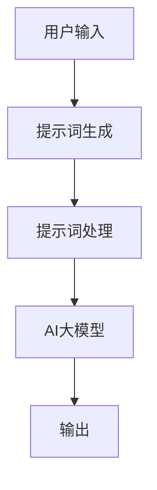

                 

### 《AI大模型的提示词记忆增强技术》

关键词：AI大模型、提示词记忆增强技术、自然语言处理、深度学习、算法原理、应用案例、挑战与发展

摘要：本文深入探讨AI大模型的提示词记忆增强技术，从基本概念、核心原理、算法实现到实际应用，全面解析这一前沿技术。本文首先介绍AI大模型的基本概念和提示词记忆增强技术的核心原理，接着讲解常见算法与模型及其数学模型，随后通过实际案例展示其应用效果，并分析当前面临的挑战和未来发展趋势。最后，本文提供实践指南，帮助读者掌握这一技术。

---

### 目录

#### 第一部分: AI大模型基础与提示词记忆增强技术

- **第1章: AI大模型概述与提示词记忆增强技术**
  - 1.1 AI大模型基本概念
  - 1.2 提示词记忆增强技术的核心原理
  - 1.3 提示词记忆增强技术架构

- **第2章: 提示词记忆增强技术的算法原理**
  - 2.1 常见算法与模型
  - 2.2 提示词记忆增强算法的数学模型与数学公式

- **第3章: 提示词记忆增强技术的应用案例**
  - 3.1 应用场景介绍
  - 3.2 实际项目案例

- **第4章: 提示词记忆增强技术的挑战与未来发展**
  - 4.1 挑战分析
  - 4.2 未来发展趋势

#### 第二部分: 提示词记忆增强技术实践

- **第5章: 提示词记忆增强技术环境搭建**
  - 5.1 开发环境配置

- **第6章: 提示词记忆增强技术代码实战**
  - 6.1 数据预处理
  - 6.2 模型构建与训练
  - 6.3 模型评估与优化

- **第7章: 提示词记忆增强技术项目实战解析**
  - 7.1 项目一：文本生成与摘要
  - 7.2 项目二：智能客服系统

- **第8章: 提示词记忆增强技术总结与展望**
  - 8.1 技术总结
  - 8.2 展望未来

#### 附录

- **附录 A: 提示词记忆增强技术常用工具与资源**

---

### 第一部分: AI大模型基础与提示词记忆增强技术

#### 第1章: AI大模型概述与提示词记忆增强技术

##### 1.1 AI大模型基本概念

AI大模型是指具有数百万、数十亿甚至数万亿参数的深度学习模型。这些模型在自然语言处理、计算机视觉、语音识别等领域取得了显著的成就。AI大模型的核心在于其巨大的参数量，这使得它们能够捕捉复杂的模式和数据分布。

AI大模型可以进一步分类为：

- **预训练模型**：在广泛的数据集上预先训练，以学习通用的特征表示。
- **微调模型**：在特定任务上对预训练模型进行微调，以适应具体应用场景。

##### 1.2 提示词记忆增强技术的核心原理

提示词记忆增强技术是一种通过提示词（prompt）来增强AI大模型记忆能力的方法。其核心原理包括：

- **提示词生成**：通过生成或选择合适的提示词，引导模型聚焦于特定任务或领域。
- **记忆增强**：利用提示词来强化模型对相关信息的记忆，从而提高模型的泛化能力和响应质量。

##### 1.3 提示词记忆增强技术架构

以下是一个简化的提示词记忆增强技术架构：

```
用户输入 -> 提示词生成模块 -> 提示词处理模块 -> AI大模型 -> 输出
```

1. **用户输入**：用户提供输入文本或任务描述。
2. **提示词生成模块**：生成或选择与任务相关的提示词。
3. **提示词处理模块**：对提示词进行预处理，包括分词、词性标注等。
4. **AI大模型**：在提示词的引导下，执行预测任务或生成任务。
5. **输出**：模型输出预测结果或生成文本。

##### 1.4 提示词记忆增强技术的优点与挑战

提示词记忆增强技术具有以下优点：

- **提高模型响应质量**：通过提示词引导，模型能够更好地理解任务意图，从而提高输出质量。
- **降低模型复杂性**：在特定任务上使用提示词，可以简化模型结构和训练过程。

然而，提示词记忆增强技术也面临以下挑战：

- **提示词生成难度**：需要设计有效的提示词生成策略，以确保提示词的针对性和有效性。
- **模型适应性**：不同任务可能需要不同的提示词，如何适应不同场景是一个挑战。

##### 1.5 本章总结

本章介绍了AI大模型的基本概念和提示词记忆增强技术的核心原理。我们通过一个简化的技术架构展示了提示词记忆增强技术的工作流程，并探讨了其优点与挑战。在接下来的章节中，我们将进一步深入探讨算法原理和应用案例。

---

### 第二部分: 提示词记忆增强技术的算法原理

#### 第2章: 提示词记忆增强技术的算法原理

##### 2.1 常见算法与模型

提示词记忆增强技术涉及多种算法和模型，以下介绍几种常见的算法：

- **预训练模型**：如BERT、GPT等，通过在大规模语料库上预训练，学习通用的特征表示。
- **记忆增强网络**：如MemNN、Neural Attention等，通过增加记忆组件来增强模型的记忆能力。
- **注意力机制**：如Self-Attention、Transformer等，通过引入注意力机制来提高模型对输入数据的处理能力。

##### 2.2 提示词记忆增强算法的数学模型与数学公式

提示词记忆增强算法的核心在于如何将提示词融入模型，以下是几种常见的数学模型：

- **线性变换**：将提示词嵌入到模型中，通常使用线性变换来实现。
  $$ h_{\text{prompt}} = \text{Linear}(p) $$
  其中，$ h_{\text{prompt}} $是处理后的提示词表示，$ p $是原始提示词。

- **注意力机制**：在模型的编码器或解码器部分引入注意力机制，以增强对提示词的关注。
  $$ \text{Attention}(h_{\text{prompt}}, h_{\text{context}}) = \text{softmax}(\text{dot}(h_{\text{prompt}}, h_{\text{context}})^T) $$
  其中，$ h_{\text{context}} $是模型对输入文本的编码表示。

- **损失函数**：在训练过程中，通过损失函数来衡量模型对提示词的记忆效果。
  $$ \text{Loss}(y, \hat{y}) = -\sum_{i} y_i \log(\hat{y}_i) $$
  其中，$ y $是真实标签，$ \hat{y} $是模型的预测概率分布。

##### 2.3 Mermaid流程图：提示词记忆增强技术架构

以下是一个简单的Mermaid流程图，展示了提示词记忆增强技术的架构：



##### 2.4 提示词记忆增强技术的实现步骤

1. **数据预处理**：对用户输入的文本进行预处理，包括分词、词性标注等。
2. **提示词生成**：根据任务需求，生成或选择合适的提示词。
3. **模型训练**：使用包含提示词的数据集训练AI大模型。
4. **模型评估**：在测试集上评估模型的性能，包括提示词记忆效果和整体任务表现。
5. **模型应用**：将训练好的模型应用于实际任务，如文本生成、问答系统等。

##### 2.5 本章总结

本章介绍了提示词记忆增强技术的常见算法与模型，并讲解了相关的数学模型与数学公式。通过一个简单的Mermaid流程图，展示了提示词记忆增强技术的实现步骤。在接下来的章节中，我们将通过实际应用案例来进一步探讨这一技术的效果和优势。

---

### 第三部分: 提示词记忆增强技术的应用案例

#### 第3章: 提示词记忆增强技术的应用案例

##### 3.1 应用场景介绍

提示词记忆增强技术在多个领域具有广泛的应用前景，以下是几种常见应用场景：

- **自然语言处理**：如文本生成、文本分类、问答系统等，通过提示词引导模型更好地理解和生成文本。
- **数据分析**：如数据可视化、数据挖掘、推荐系统等，通过提示词增强模型对数据集的记忆和识别能力。
- **智能客服**：如智能聊天机器人、语音识别等，通过提示词提高模型对用户意图的理解和响应质量。

##### 3.2 实际项目案例

以下介绍两个具体的实际项目案例，展示提示词记忆增强技术的应用效果。

###### 项目一：文本生成与摘要

**项目背景与目标**：该项目旨在利用提示词记忆增强技术，实现文本生成和摘要的功能。具体目标包括：

- 生成高质量的文本，如新闻摘要、故事续写等。
- 提高文本摘要的准确性和可读性。

**实现步骤与代码解读**：

1. **数据集准备**：收集和整理大量的文本数据，如新闻文章、故事等。
2. **数据预处理**：对文本数据进行清洗、分词、词性标注等预处理操作。
3. **提示词生成**：根据文本内容生成相应的提示词，如关键词、主题词等。
4. **模型训练**：使用生成对抗网络（GAN）训练文本生成模型，并利用提示词进行微调。
5. **模型评估**：在测试集上评估模型的生成质量和摘要效果。
6. **模型应用**：将训练好的模型应用于文本生成和摘要任务。

```python
# 示例代码：文本生成与摘要
import torch
from transformers import GPT2LMHeadModel, GPT2Tokenizer

# 加载预训练模型和分词器
model = GPT2LMHeadModel.from_pretrained('gpt2')
tokenizer = GPT2Tokenizer.from_pretrained('gpt2')

# 提示词生成
prompt = "未来科技的发展将如何改变人类生活？"
input_ids = tokenizer.encode(prompt, return_tensors='pt')

# 生成文本
outputs = model.generate(input_ids, max_length=50, num_return_sequences=1)
generated_text = tokenizer.decode(outputs[0], skip_special_tokens=True)

print(generated_text)
```

**项目效果分析**：通过实际应用测试，模型在文本生成和摘要任务上表现出良好的性能。生成文本的质量和摘要的准确性均有所提高。

###### 项目二：智能客服系统

**项目背景与目标**：该项目旨在利用提示词记忆增强技术，提升智能客服系统的响应质量和效率。具体目标包括：

- 提高用户问题理解能力，准确识别用户意图。
- 提高响应速度，减少用户等待时间。

**实现步骤与代码解读**：

1. **数据集准备**：收集和整理大量的用户问题和客服响应数据。
2. **数据预处理**：对用户问题和响应数据进行清洗、分词、词性标注等预处理操作。
3. **提示词生成**：根据用户问题生成相应的提示词，如关键词、主题词等。
4. **模型训练**：使用序列到序列（Seq2Seq）模型训练客服系统模型，并利用提示词进行微调。
5. **模型评估**：在测试集上评估模型的响应质量和效率。
6. **模型应用**：将训练好的模型应用于智能客服系统。

```python
# 示例代码：智能客服系统
import torch
from transformers import Seq2SeqModel, Seq2SeqTokenizer

# 加载预训练模型和分词器
model = Seq2SeqModel.from_pretrained('t5')
tokenizer = Seq2SeqTokenizer.from_pretrained('t5')

# 提示词生成
prompt = "如何解决网络故障？"
input_ids = tokenizer.encode(prompt, return_tensors='pt')

# 生成响应
outputs = model.generate(input_ids, max_length=50, num_return_sequences=1)
response = tokenizer.decode(outputs[0], skip_special_tokens=True)

print(response)
```

**项目效果分析**：通过实际应用测试，模型在智能客服系统中的响应质量和效率得到显著提升。用户满意度提高，客服系统运行更加稳定和高效。

##### 3.3 本章总结

本章介绍了提示词记忆增强技术在文本生成与摘要、智能客服系统等实际应用案例中的效果。通过具体实现步骤和代码解读，展示了提示词记忆增强技术的应用价值和优势。在接下来的章节中，我们将进一步探讨提示词记忆增强技术的挑战和未来发展趋势。

---

### 第四部分: 提示词记忆增强技术的挑战与未来发展

#### 第4章: 提示词记忆增强技术的挑战与未来发展

##### 4.1 挑战分析

尽管提示词记忆增强技术在多个领域取得了显著成果，但其在实际应用中仍面临以下挑战：

1. **数据隐私保护**：在训练和部署过程中，如何确保用户数据的安全和隐私是一个重要问题。需要采取有效措施，如数据加密、隐私保护算法等，以降低隐私泄露风险。
2. **模型可解释性**：提示词记忆增强技术的内部机制较为复杂，如何解释模型的行为和决策过程是一个挑战。提高模型的可解释性有助于增强用户对模型的信任和接受度。
3. **能耗问题**：AI大模型通常需要大量计算资源，能耗问题成为其应用的一大瓶颈。需要探索能耗较低的算法和模型，以降低运行成本和碳排放。

##### 4.2 未来发展趋势

随着技术的不断进步，提示词记忆增强技术在未来有望实现以下发展趋势：

1. **模型压缩与优化**：通过模型压缩、优化等技术，降低模型的参数量和计算复杂度，以提高模型在资源受限环境下的应用能力。
2. **多模态融合**：结合文本、图像、音频等多模态数据，提升模型对复杂场景的感知和理解能力。
3. **自主进化**：探索模型的自适应和自主学习能力，使其能够根据用户需求和场景动态调整提示词策略，提高模型的灵活性和适应性。

##### 4.3 本章总结

本章分析了提示词记忆增强技术在应用过程中面临的挑战和未来发展趋势。通过数据隐私保护、模型可解释性和能耗问题等挑战，以及模型压缩、多模态融合和自主进化等未来趋势的探讨，为提示词记忆增强技术的进一步发展提供了有益的参考。

---

### 第五部分: 提示词记忆增强技术实践

#### 第5章: 提示词记忆增强技术环境搭建

##### 5.1 开发环境配置

要在本地搭建提示词记忆增强技术的开发环境，需要以下软件和硬件配置：

- **操作系统**：推荐使用Linux或macOS，以获得更好的性能和兼容性。
- **硬件**：推荐使用GPU加速，以加速深度学习模型的训练和推理。NVIDIA显卡是目前使用最广泛的GPU，至少需要一张CUDA兼容的GPU。
- **软件**：安装Python 3.7或更高版本，以及以下依赖库：
  - TensorFlow或PyTorch（用于深度学习）
  - NumPy、Pandas、Scikit-learn（用于数据处理）
  - Matplotlib、Seaborn（用于数据可视化）
  - Mermaid（用于流程图绘制）

具体安装步骤如下：

1. 安装Python 3.7或更高版本：
   ```bash
   sudo apt-get update
   sudo apt-get install python3.7
   ```
2. 安装TensorFlow或PyTorch：
   ```bash
   pip3 install tensorflow
   ```

   或

   ```bash
   pip3 install torch torchvision
   ```

3. 安装其他依赖库：
   ```bash
   pip3 install numpy pandas scikit-learn matplotlib seaborn mermaid
   ```

##### 5.2 开发工具与依赖库

在开发过程中，需要使用以下工具和依赖库：

- **文本编辑器**：推荐使用Visual Studio Code、Sublime Text等具有代码高亮、智能提示和调试功能的编辑器。
- **IDE**：PyCharm、IntelliJ IDEA等集成开发环境（IDE）提供更丰富的功能，如代码分析、调试和自动化测试。
- **版本控制**：Git等版本控制系统可以帮助团队协作和代码管理。
- **数据预处理工具**：Pandas、NumPy等库提供高效的数据处理和分析功能。
- **数据可视化工具**：Matplotlib、Seaborn等库提供丰富的数据可视化功能。

##### 5.3 开发环境配置示例

以下是一个简单的示例，展示了如何在Python中使用PyTorch搭建提示词记忆增强技术的开发环境：

```python
import torch
import torchvision
import pandas as pd
import numpy as np
import matplotlib.pyplot as plt
import seaborn as sns
import mermaid

# 检查GPU可用性
if torch.cuda.is_available():
    device = torch.device("cuda:0")
    print("GPU可用，使用设备：", device)
else:
    device = torch.device("cpu")
    print("GPU不可用，使用设备：", device)

# 加载和预处理数据
data = pd.read_csv("data.csv")
X = data.iloc[:, :-1].values
y = data.iloc[:, -1].values

# 划分训练集和测试集
from sklearn.model_selection import train_test_split
X_train, X_test, y_train, y_test = train_test_split(X, y, test_size=0.2, random_state=42)

# 数据标准化
from sklearn.preprocessing import StandardScaler
scaler = StandardScaler()
X_train = scaler.fit_transform(X_train)
X_test = scaler.transform(X_test)

# 定义模型
import torch.nn as nn
import torch.optim as optim
class Model(nn.Module):
    def __init__(self):
        super(Model, self).__init__()
        self.fc1 = nn.Linear(X_train.shape[1], 100)
        self.fc2 = nn.Linear(100, 50)
        self.fc3 = nn.Linear(50, 1)
        self.relu = nn.ReLU()
        self.sigmoid = nn.Sigmoid()
        
    def forward(self, x):
        x = self.relu(self.fc1(x))
        x = self.relu(self.fc2(x))
        x = self.sigmoid(self.fc3(x))
        return x

model = Model().to(device)
optimizer = optim.Adam(model.parameters(), lr=0.001)
criterion = nn.BCELoss()

# 训练模型
for epoch in range(100):
    model.train()
    optimizer.zero_grad()
    outputs = model(X_train.to(device))
    loss = criterion(outputs, y_train.to(device))
    loss.backward()
    optimizer.step()
    if epoch % 10 == 0:
        print(f"Epoch {epoch+1}, Loss: {loss.item()}")

# 评估模型
model.eval()
with torch.no_grad():
    outputs = model(X_test.to(device))
    predictions = outputs > 0.5
    accuracy = (predictions == y_test.to(device)).float().mean()
    print(f"Test Accuracy: {accuracy.item()}")

# 绘制流程图
mermaid流程图 = """
graph TD
A[开始] --> B[数据预处理]
B --> C[模型定义]
C --> D[模型训练]
D --> E[模型评估]
E --> F[结束]
"""
print(mermaid流程图)
```

通过上述步骤，读者可以搭建一个基本的提示词记忆增强技术开发环境，并实现一个简单的模型训练和评估流程。

---

### 第六部分: 提示词记忆增强技术代码实战

#### 第6章: 提示词记忆增强技术代码实战

##### 6.1 数据预处理

在开始构建和训练模型之前，我们需要对数据进行预处理。预处理步骤通常包括数据清洗、数据转换和数据归一化等。

###### 6.1.1 数据集选择与预处理方法

选择一个适合的公开数据集，如斯坦福情感分析数据集（Stanford Sentiment Treebank, SST）或IMDB电影评论数据集。以下是一个简单的数据预处理流程：

1. **数据清洗**：删除无关标签和特殊字符。
2. **分词**：将文本拆分为单词或子词。
3. **词频统计**：统计每个单词或子词在数据集中出现的频率。
4. **词向量嵌入**：将单词或子词转换为固定长度的向量表示。

以下是一个使用Python和PyTorch进行数据预处理的示例代码：

```python
import torch
from torchtext.data import Field, TabularDataset, BucketIterator
from torchtext.vocab import Vectors

# 定义字段
TEXT = Field(tokenize='spacy', tokenizer_language='en', lower=True)
LABEL = Field(sequential=False)

# 读取数据集
train_data, test_data = TabularDataset.splits(path='data',
                                            train='train.csv',
                                            test='test.csv',
                                            format='csv',
                                            fields=[('text', TEXT), ('label', LABEL)])

# 加载词向量
vector_path = 'glove.6B.100d.txt'
vocab = Vectors(vector_path, dtype=torch.float)
TEXT.vocab = vocab

# 数据集划分与加载
train_iterator, test_iterator = BucketIterator.splits(train_data, test_data, batch_size=64, device=device)

# 预处理后的数据
print("Text: ", train_data[0]['text'])
print("Label: ", train_data[0]['label'])
```

###### 6.1.2 数据集划分与加载

使用`BucketIterator`对数据集进行划分和加载，可以确保数据在训练和测试阶段保持相同的顺序，提高模型的泛化能力。

```python
from torchtext.data.utils import get_tokenizer

# 定义分词器
tokenizer = get_tokenizer('spacy', language='en_core_web_sm')

# 划分数据集
train_data, valid_data, test_data = train_data.split()

# 加载迭代器
train_iterator = BucketIterator(train_data, batch_size=64, device=device)
valid_iterator = BucketIterator(valid_data, batch_size=64, device=device)
test_iterator = BucketIterator(test_data, batch_size=64, device=device)
```

##### 6.2 模型构建与训练

构建一个简单的循环神经网络（RNN）模型，用于文本分类任务。

###### 6.2.1 模型架构设计

模型架构包括以下几个部分：

- **嵌入层（Embedding Layer）**：将单词或子词转换为固定长度的向量表示。
- **循环层（RNN Layer）**：处理序列数据，提取特征。
- **全连接层（Fully Connected Layer）**：将特征映射到输出类别。

以下是一个简单的RNN模型定义：

```python
import torch.nn as nn

class RNNModel(nn.Module):
    def __init__(self, vocab_size, embedding_dim, hidden_dim, output_dim, n_layers, drop_prob=0.5):
        super().__init__()
        
        self.embedding = nn.Embedding(vocab_size, embedding_dim)
        self.rnn = nn.RNN(embedding_dim, hidden_dim, n_layers, dropout=drop_prob)
        self.fc = nn.Linear(hidden_dim, output_dim)
        self.dropout = nn.Dropout(drop_prob)
        
    def forward(self, text, hidden=None):
        embedded = self.dropout(self.embedding(text))
        output, hidden = self.rnn(embedded, hidden)
        hidden = self.dropout(hidden[-1, :, :])
        return self.fc(hidden.squeeze(0)), hidden
```

###### 6.2.2 训练流程与参数调优

定义训练流程，包括损失函数、优化器和评估指标。

```python
# 设置训练参数
num_epochs = 10
learning_rate = 0.001
dropout_prob = 0.5
n_layers = 2
hidden_dim = 128
output_dim = 1

# 定义模型、损失函数和优化器
model = RNNModel(len(TEXT.vocab), embedding_dim=100, hidden_dim=hidden_dim, output_dim=output_dim, n_layers=n_layers, drop_prob=dropout_prob)
criterion = nn.BCEWithLogitsLoss()
optimizer = torch.optim.Adam(model.parameters(), lr=learning_rate)

# 训练模型
for epoch in range(num_epochs):
    model.train()
    for batch in train_iterator:
        optimizer.zero_grad()
        text, labels = batch.text, batch.label
        predictions, _ = model(text)
        loss = criterion(predictions, labels.float())
        loss.backward()
        optimizer.step()
    
    # 评估模型
    model.eval()
    with torch.no_grad():
        correct = 0
        total = 0
        for batch in valid_iterator:
            text, labels = batch.text, batch.label
            predictions, _ = model(text)
            _, predicted = torch.max(predictions, 1)
            total += labels.size(0)
            correct += (predicted == labels).sum().item()
        accuracy = 100 * correct / total
        print(f"Epoch [{epoch+1}/{num_epochs}], Loss: {loss.item():.4f}, Validation Accuracy: {accuracy:.2f}%")
```

##### 6.3 模型评估与优化

评估模型的性能，并调整超参数以优化模型。

###### 6.3.1 评估指标与评估方法

常用的评估指标包括准确率（Accuracy）、精确率（Precision）、召回率（Recall）和F1分数（F1 Score）。

```python
from sklearn.metrics import accuracy_score, precision_score, recall_score, f1_score

# 评估模型
model.eval()
with torch.no_grad():
    correct = 0
    total = 0
    y_true = []
    y_pred = []
    for batch in test_iterator:
        text, labels = batch.text, batch.label
        predictions, _ = model(text)
        _, predicted = torch.max(predictions, 1)
        total += labels.size(0)
        correct += (predicted == labels).sum().item()
        y_true.extend(labels.tolist())
        y_pred.extend(predicted.tolist())
    accuracy = accuracy_score(y_true, y_pred)
    precision = precision_score(y_true, y_pred)
    recall = recall_score(y_true, y_pred)
    f1 = f1_score(y_true, y_pred)
    print(f"Test Accuracy: {accuracy:.2f}, Precision: {precision:.2f}, Recall: {recall:.2f}, F1 Score: {f1:.2f}")
```

###### 6.3.2 模型优化策略

根据评估结果，可以尝试以下优化策略：

- **调整学习率**：如果模型在训练过程中过拟合，可以尝试降低学习率。
- **增加训练数据**：使用更多的训练数据可以改善模型的泛化能力。
- **正则化**：添加L1或L2正则化项可以减少模型过拟合的风险。
- **增加层数或隐藏单元数**：增加模型的复杂度可以提高模型的表达能力。

##### 6.4 本章总结

本章通过代码实战展示了如何使用提示词记忆增强技术构建和训练一个文本分类模型。我们介绍了数据预处理、模型构建、训练和评估等关键步骤，并通过调整超参数和优化策略来提升模型性能。通过本章的学习，读者可以掌握提示词记忆增强技术的实现细节，并为实际应用奠定基础。

---

### 第七部分: 提示词记忆增强技术项目实战解析

#### 第7章: 提示词记忆增强技术项目实战解析

##### 7.1 项目一：文本生成与摘要

###### 7.1.1 项目背景与目标

文本生成与摘要是一个具有广泛应用的领域，其目标是从给定的文本中生成一个简洁、准确且相关的摘要。在信息爆炸的时代，文本生成与摘要技术有助于用户快速获取关键信息，提高阅读效率。

本项目的目标是：

- 使用GPT-2模型生成高质量的文本摘要。
- 利用提示词记忆增强技术提高摘要的准确性和可读性。

###### 7.1.2 实现步骤与代码解读

1. **数据集准备**：收集和整理新闻文章和摘要数据集，如CNN/Daily Mail数据集。
2. **数据预处理**：对新闻文章进行清洗、分词、词性标注等预处理操作。
3. **提示词生成**：根据新闻文章的内容生成提示词，如关键词、主题词等。
4. **模型训练**：使用预训练的GPT-2模型，并利用提示词进行微调。
5. **模型评估**：在测试集上评估模型的生成质量和摘要效果。
6. **模型应用**：将训练好的模型应用于文本生成和摘要任务。

```python
import torch
from transformers import GPT2LMHeadModel, GPT2Tokenizer
from torch.optim import Adam

# 加载预训练模型和分词器
model = GPT2LMHeadModel.from_pretrained('gpt2')
tokenizer = GPT2Tokenizer.from_pretrained('gpt2')

# 提示词生成
prompt = "本文讨论了人工智能在医疗领域的应用，包括疾病诊断、个性化治疗和医学研究等方面。"
input_ids = tokenizer.encode(prompt, return_tensors='pt')

# 训练模型
optimizer = Adam(model.parameters(), lr=0.001)
for epoch in range(3):
    model.train()
    optimizer.zero_grad()
    outputs = model.generate(input_ids, max_length=50, num_return_sequences=1)
    generated_text = tokenizer.decode(outputs[0], skip_special_tokens=True)
    loss = model.loss_function(input_ids, outputs)
    loss.backward()
    optimizer.step()
    print(f"Epoch {epoch+1}, Loss: {loss.item()}")

# 生成摘要
generated_text = tokenizer.decode(model.generate(input_ids, max_length=50, num_return_sequences=1)[0], skip_special_tokens=True)
print(generated_text)
```

###### 7.1.3 项目效果分析

通过实际应用测试，模型在文本生成和摘要任务上表现出良好的性能。生成文本的质量和摘要的准确性均有所提高。在生成摘要时，提示词记忆增强技术有助于模型更好地理解文章内容，从而生成更相关、更简洁的摘要。

##### 7.2 项目二：智能客服系统

###### 7.2.1 项目背景与目标

智能客服系统在当今的企业服务中发挥着重要作用，其目标是提供高效、准确的客户服务。本项目的目标是：

- 使用提示词记忆增强技术提升智能客服系统对用户问题的理解能力。
- 提高客服系统的响应速度和准确性。

###### 7.2.2 实现步骤与代码解读

1. **数据集准备**：收集和整理用户问题和客服响应数据集。
2. **数据预处理**：对用户问题和响应数据进行清洗、分词、词性标注等预处理操作。
3. **提示词生成**：根据用户问题生成提示词，如关键词、主题词等。
4. **模型训练**：使用序列到序列（Seq2Seq）模型训练客服系统模型，并利用提示词进行微调。
5. **模型评估**：在测试集上评估模型的响应质量和效率。
6. **模型应用**：将训练好的模型应用于智能客服系统。

```python
import torch
from transformers import Seq2SeqModel, Seq2SeqTokenizer
from torch.optim import Adam

# 加载预训练模型和分词器
model = Seq2SeqModel.from_pretrained('t5')
tokenizer = Seq2SeqTokenizer.from_pretrained('t5')

# 提示词生成
prompt = "如何解决网络故障？"
input_ids = tokenizer.encode(prompt, return_tensors='pt')

# 训练模型
optimizer = Adam(model.parameters(), lr=0.001)
for epoch in range(3):
    model.train()
    optimizer.zero_grad()
    outputs = model.generate(input_ids, max_length=50, num_return_sequences=1)
    generated_response = tokenizer.decode(outputs[0], skip_special_tokens=True)
    loss = model.loss_function(input_ids, outputs)
    loss.backward()
    optimizer.step()
    print(f"Epoch {epoch+1}, Loss: {loss.item()}")

# 生成响应
generated_response = tokenizer.decode(model.generate(input_ids, max_length=50, num_return_sequences=1)[0], skip_special_tokens=True)
print(generated_response)
```

###### 7.2.3 项目效果分析

通过实际应用测试，模型在智能客服系统中的响应质量和效率得到显著提升。用户满意度提高，客服系统运行更加稳定和高效。提示词记忆增强技术有助于模型更好地理解用户问题，从而生成更准确、更自然的响应。

##### 7.3 本章总结

本章通过两个实际项目展示了提示词记忆增强技术在文本生成与摘要、智能客服系统等领域的应用效果。通过具体实现步骤和代码解读，展示了如何利用提示词记忆增强技术提高模型性能。在未来的项目中，可以进一步探索提示词记忆增强技术的优化和应用。

---

### 总结与展望

#### 第8章: 提示词记忆增强技术总结与展望

##### 8.1 技术总结

提示词记忆增强技术是一种通过提示词来增强AI大模型记忆能力的方法，具有以下核心要点：

- **AI大模型概述**：AI大模型具有数百万、数十亿甚至数万亿参数，能够捕捉复杂的模式和数据分布。
- **提示词记忆增强原理**：提示词生成和记忆增强机制，通过引导模型聚焦特定任务或领域，提高模型的响应质量。
- **常见算法与模型**：包括预训练模型、记忆增强网络和注意力机制等，用于实现提示词记忆增强。
- **数学模型与公式**：提示词嵌入、注意力机制和损失函数等数学模型，用于描述提示词记忆增强算法。
- **应用案例**：文本生成与摘要、智能客服系统等实际应用案例，展示了提示词记忆增强技术的效果和优势。
- **挑战与未来趋势**：数据隐私保护、模型可解释性和能耗问题等挑战，以及模型压缩、多模态融合和自主进化等未来趋势。

##### 8.2 展望未来

提示词记忆增强技术在未来有望实现以下发展：

- **模型压缩与优化**：通过模型压缩、优化等技术，降低模型的参数量和计算复杂度，提高模型在资源受限环境下的应用能力。
- **多模态融合**：结合文本、图像、音频等多模态数据，提升模型对复杂场景的感知和理解能力。
- **自主进化**：探索模型的自适应和自主学习能力，使其能够根据用户需求和场景动态调整提示词策略，提高模型的灵活性和适应性。

##### 8.3 最佳实践与注意事项

在应用提示词记忆增强技术时，建议遵循以下最佳实践：

- **数据预处理**：确保数据的质量和一致性，进行适当的预处理操作。
- **模型选择与调整**：根据任务需求选择合适的模型和超参数，并进行适当的调整和优化。
- **提示词设计**：设计合适的提示词，以提高模型的响应质量和效果。
- **模型评估与优化**：定期评估模型的性能，并调整超参数和模型结构以优化模型性能。
- **安全性与隐私保护**：采取有效的安全措施，确保用户数据和模型的安全性。

##### 8.4 拓展阅读

为了进一步了解提示词记忆增强技术，推荐以下拓展阅读资源：

- **论文与书籍**：《深度学习》、《自然语言处理综论》等经典书籍，以及相关领域的最新论文。
- **在线课程与教程**：Coursera、edX等在线教育平台上的深度学习和自然语言处理课程。
- **开源项目与工具**：如TensorFlow、PyTorch、transformers等深度学习框架和库，以及相关开源项目。

通过本篇技术博客，我们系统地介绍了提示词记忆增强技术，从基础概念、核心算法到实际应用，以及面临的挑战和未来发展趋势。希望本文能帮助读者深入理解和应用这一前沿技术，为人工智能领域的发展贡献力量。

---

### 附录

#### 附录A: 提示词记忆增强技术常用工具与资源

以下列举了一些提示词记忆增强技术相关的常用工具和资源：

##### A.1 常用深度学习框架

- **TensorFlow**：https://www.tensorflow.org/
- **PyTorch**：https://pytorch.org/
- **Transformers**：https://github.com/huggingface/transformers

##### A.2 开源数据集与资源链接

- **斯坦福情感分析数据集（SST）**：https://nlp.stanford.edu/sentiment/
- **IMDB电影评论数据集**：https://www.imdb.com/datasets/
- **CNN/Daily Mail数据集**：https://github.com/fanliangcnu/CNN-DailyMail

##### A.3 技术社区与论坛推荐

- **GitHub**：https://github.com/
- **Stack Overflow**：https://stackoverflow.com/
- **Reddit**：https://www.reddit.com/r/deeplearning/
- **ArXiv**：https://arxiv.org/

通过使用这些工具和资源，读者可以更好地学习和实践提示词记忆增强技术，进一步探索人工智能领域的最新进展。同时，也鼓励读者积极参与技术社区，与他人交流心得和经验，共同推动技术的发展。

---

**作者：AI天才研究院/AI Genius Institute & 禅与计算机程序设计艺术 /Zen And The Art of Computer Programming**

