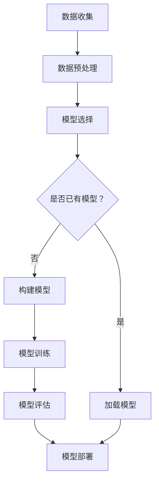

                 


### 文章标题：《AI大模型编程：提示词的力量与潜力》

#### 关键词：
- AI大模型
- 提示词
- 编程实践
- 数学原理
- 应用场景

#### 摘要：
本文将深入探讨AI大模型编程的核心概念与提示词的力量，通过逐步分析，揭示大模型的数学原理、编程实战及其在未来应用中的潜力。文章旨在为读者提供从基础到高级的全景视图，帮助理解AI大模型的编程技巧、发展趋势及其面临的技术挑战。

### 目录大纲

#### 《AI大模型编程：提示词的力量与潜力》

#### 第一部分：AI大模型基础知识

##### 第1章：AI大模型概述
- 1.1 AI大模型的概念
- 1.2 提示词的力量
- 1.3 大模型的潜力
- 1.4 大模型的发展历史

##### 第2章：AI大模型的核心概念
- 2.1 机器学习基础
- 2.2 深度学习基础
- 2.3 自然语言处理基础
- 2.4 大模型的技术发展

##### 第3章：大模型的数学原理
- 3.1 线性代数
- 3.2 微积分
- 3.3 概率论与统计学
- 3.4 神经网络模型
- 3.5 大模型优化算法

#### 第二部分：大模型编程实战

##### 第4章：大模型编程基础
- 4.1 编程语言选择
- 4.2 环境搭建
- 4.3 数据处理
- 4.4 模型训练
- 4.5 模型评估

##### 第5章：大模型编程实践
- 5.1 提示词设计
- 5.2 代码示例：文本生成
- 5.3 代码示例：对话系统
- 5.4 代码示例：图像识别

##### 第6章：大模型编程高级技巧
- 6.1 提高模型性能
- 6.2 模型压缩
- 6.3 模型部署

#### 第三部分：大模型编程的未来

##### 第7章：大模型编程的趋势
- 7.1 人工智能的发展趋势
- 7.2 大模型编程的发展趋势
- 7.3 提示词技术的未来

##### 第8章：大模型编程的应用场景
- 8.1 企业应用
- 8.2 教育应用
- 8.3 医疗应用
- 8.4 创意应用

##### 第9章：大模型编程的挑战与解决方案
- 9.1 数据隐私保护
- 9.2 模型解释性
- 9.3 跨领域迁移能力
- 9.4 大模型编程的教育与培训

#### 附录

##### 附录A：常用编程工具与资源
- A.1 常用深度学习框架
- A.2 编程技巧与最佳实践
- A.3 数据集与API资源
- A.4 大模型编程社区与论坛

##### 附录B：大模型编程流程图
- B.1 大模型编程流程图
- B.2 Mermaid流程图代码

##### 附录C：大模型编程伪代码与数学公式
- C.1 神经网络训练伪代码
- C.2 大模型优化算法伪代码
- C.3 数学模型和公式

##### 附录D：项目实战案例
- D.1 实战案例1：文本生成
- D.2 实战案例2：对话系统
- D.3 实战案例3：图像识别
- D.4 实战案例4：企业级应用部署

### 作者信息：
- 作者：AI天才研究院/AI Genius Institute & 禅与计算机程序设计艺术 /Zen And The Art of Computer Programming## AI大模型编程：提示词的力量与潜力

### 引言

人工智能（AI）近年来取得了惊人的进展，特别是在大模型领域。大模型，即具有巨大参数规模和强大计算能力的模型，正在逐渐改变AI行业的格局。这些模型能够处理海量数据，并在多种任务中展现卓越的性能，从自然语言处理到图像识别，再到复杂的决策制定。然而，大模型的成功不仅依赖于其庞大的计算资源，更重要的是如何有效地与人类交互，也就是提示词的力量。

提示词，作为人类与AI大模型之间的桥梁，具有至关重要的作用。它们是一组用于引导模型生成预期的输出或执行特定任务的文本或代码。一个精心设计的提示词可以极大地提升模型的性能，使其在复杂任务中表现得更加准确和智能。本文将深入探讨AI大模型编程的核心概念，揭示提示词在其中的力量与潜力，并通过具体的实战案例和先进的技术发展，展示大模型编程的未来前景。

本文的结构如下：首先，我们将介绍AI大模型的基础知识，包括其概念、力量和潜力，以及大模型的发展历史。接着，我们将探讨AI大模型的核心概念，包括机器学习、深度学习和自然语言处理的基础知识，以及大模型的技术发展。然后，我们将深入分析大模型的数学原理，包括线性代数、微积分、概率论与统计学，以及神经网络模型和大模型优化算法。接下来，我们将讨论大模型编程的基础，包括编程语言选择、环境搭建、数据处理、模型训练和模型评估。随后，我们将通过具体的代码示例和实践，展示大模型编程的技巧和高级应用。最后，我们将探讨大模型编程的未来趋势、应用场景、挑战与解决方案，并总结全文，提供拓展阅读和项目实战案例。

通过本文的逐步分析，读者将能够全面了解AI大模型编程的核心技术和实践方法，把握提示词的力量，探索大模型编程的无限潜力。

### 第一部分：AI大模型基础知识

#### 第1章：AI大模型概述

##### 1.1 AI大模型的概念

AI大模型是指具有巨大参数规模和强大计算能力的深度学习模型。这些模型通过学习大量的数据来发现数据的内在规律和模式，从而在多种任务中展现出色的性能。大模型通常包含数亿甚至数千亿个参数，这使得它们能够在复杂的任务中处理大量的信息。相比于传统的小模型，大模型具有更强的表达能力和更广泛的适应性。

AI大模型的主要特点包括：

1. **参数规模巨大**：大模型的参数数量通常在数亿到数千亿之间，这使得它们具有强大的表征能力。
2. **计算资源需求高**：大模型对计算资源的需求较高，需要使用高性能的GPU或TPU进行训练。
3. **适应性强**：大模型能够在多种任务中展现出出色的性能，具有广泛的适用性。
4. **自动化程度高**：大模型能够自动学习数据中的规律，减少了人工调参的需求。

##### 1.2 提示词的力量

提示词是指导大模型生成预期输出或执行特定任务的关键输入。一个有效的提示词能够引导模型聚焦于任务的关键点，提高模型的生成质量和效率。提示词的力量主要体现在以下几个方面：

1. **任务导向**：提示词可以帮助模型理解任务的要求，使其生成更加符合任务预期的输出。
2. **减少歧义**：通过提供明确的提示词，可以减少模型在处理模糊或不确定输入时的错误率。
3. **提高效率**：有效的提示词可以缩短模型的训练时间，提高模型的生成效率。
4. **优化质量**：精心设计的提示词能够引导模型生成更高质量的结果。

##### 1.3 大模型的潜力

AI大模型在多个领域展现出了巨大的潜力，以下是一些关键应用领域：

1. **自然语言处理（NLP）**：大模型在NLP任务中表现出色，如机器翻译、文本生成、情感分析等。
2. **计算机视觉**：大模型在图像识别、目标检测和视频分析等任务中取得了显著进展。
3. **知识图谱**：大模型能够构建和优化大规模知识图谱，为智能问答和决策提供支持。
4. **智能决策**：大模型在复杂的决策任务中，如金融风险评估、医疗诊断等，具有显著的优势。

##### 1.4 大模型的发展历史

AI大模型的发展历程可以分为以下几个阶段：

1. **早期模型**：在深度学习初期，模型规模相对较小，如AlexNet和VGG，参数规模在百万级别。
2. **中型模型**：随着计算资源的提升，模型规模逐渐增大，如ResNet和BERT，参数规模达到亿级。
3. **大规模模型**：近年来，GPT、GPT-3和GPT-Neo等模型的出现，标志着大模型时代的到来，参数规模达到千亿级别。
4. **未来展望**：随着计算能力和算法的创新，未来大模型的参数规模和计算能力将继续提升，应用领域也将进一步扩展。

通过以上对AI大模型概述的介绍，读者可以初步了解大模型的概念、提示词的力量以及其潜力和发展历史。接下来的章节将进一步深入探讨AI大模型的核心概念和数学原理，帮助读者构建全面的知识体系。

#### 第2章：AI大模型的核心概念

##### 2.1 机器学习基础

机器学习是人工智能的核心技术之一，它通过算法让计算机从数据中学习规律并做出预测或决策。机器学习分为监督学习、无监督学习和半监督学习三种主要类型。其中，监督学习是AI大模型的主要学习方式。

**监督学习**：在监督学习中，模型通过已标记的训练数据学习，并利用这些知识对未知数据进行预测。主要算法包括线性回归、逻辑回归、支持向量机（SVM）和神经网络等。

**无监督学习**：无监督学习不依赖已标记的数据，而是通过发现数据中的内在结构和模式进行学习。常见的算法包括聚类、降维和生成模型等。

**半监督学习**：半监督学习结合了监督学习和无监督学习的特点，利用少量的标记数据和大量未标记数据共同训练模型。

**机器学习流程**：

1. **数据收集**：收集相关数据集。
2. **数据预处理**：对数据进行清洗、归一化和特征提取。
3. **模型选择**：选择合适的机器学习算法。
4. **模型训练**：使用训练数据训练模型。
5. **模型评估**：使用验证集或测试集评估模型性能。
6. **模型优化**：根据评估结果调整模型参数。

##### 2.2 深度学习基础

深度学习是机器学习的一个重要分支，通过多层次的神经网络对数据进行特征提取和抽象，实现复杂的任务。深度学习的基础是神经网络。

**神经网络基础**：

1. **神经元**：神经网络的基本单元，用于计算和传递信息。
2. **激活函数**：用于引入非线性因素，如ReLU、Sigmoid和Tanh等。
3. **前向传播与反向传播**：前向传播用于计算网络的输出，反向传播用于更新网络权重。

**常见深度学习模型**：

1. **卷积神经网络（CNN）**：主要用于图像识别和计算机视觉任务，通过卷积层提取图像特征。
2. **循环神经网络（RNN）**：适用于序列数据处理，如自然语言处理和时间序列分析，通过隐藏状态传递信息。
3. **长短时记忆网络（LSTM）**：RNN的改进版本，能够学习长距离依赖关系。
4. **生成对抗网络（GAN）**：通过生成器和判别器的对抗训练，生成高质量的数据。

##### 2.3 自然语言处理基础

自然语言处理（NLP）是AI的一个重要分支，旨在使计算机理解和处理人类语言。NLP的基础是文本处理和语言模型。

**文本处理**：

1. **分词**：将文本分割成单词或短语。
2. **词性标注**：为每个单词标注其词性，如名词、动词等。
3. **句法分析**：分析句子的结构，如短语结构、依存关系等。

**语言模型**：

1. **N-gram模型**：基于历史统计方法，预测下一个单词。
2. **深度神经网络语言模型**：通过神经网络学习文本的统计特性，如Word2Vec、GloVe等。
3. **变换器模型**：基于注意力机制和Transformer架构，实现高效的序列建模，如BERT、GPT等。

##### 2.4 大模型的技术发展

大模型技术的发展经历了多个阶段，以下是其中的关键里程碑：

1. **早期大模型**：如AlexNet和VGG，参数规模在百万级别，标志着深度学习的兴起。
2. **中型大模型**：如ResNet和BERT，参数规模达到亿级，使深度学习在图像识别和自然语言处理中取得了突破。
3. **大规模大模型**：如GPT和GPT-3，参数规模达到千亿级别，实现了前所未有的文本生成和对话能力。
4. **超大规模大模型**：如GPT-Neo，参数规模达到数万亿级别，展现了巨大的计算和生成能力。

大模型的技术发展不仅依赖于计算资源的提升，还包括算法的创新和优化。未来，随着计算能力的进一步增强和算法的改进，大模型将在更多领域展现其潜力。

通过以上对AI大模型核心概念的介绍，读者可以了解机器学习、深度学习、自然语言处理以及大模型技术发展的基础知识。这些概念构成了AI大模型编程的基石，为接下来的章节提供了重要的理论支持。在下一章中，我们将深入探讨大模型的数学原理，进一步理解其背后的机制。

### 第二部分：大模型编程实战

#### 第4章：大模型编程基础

##### 4.1 编程语言选择

在选择编程语言进行AI大模型开发时，需要考虑多个因素，包括易用性、性能、社区支持和生态系统的成熟度。以下是一些常用的编程语言及其特点：

1. **Python**：Python是AI大模型开发的主流语言，以其简洁易读的语法、丰富的库和强大的社区支持而著称。Python的库如TensorFlow、PyTorch和Keras提供了丰富的API，使得开发者可以轻松搭建和训练大模型。

2. **C++**：C++是一种高效的编程语言，特别适合需要高性能计算的场景。PyTorch和TensorFlow都有C++接口，允许开发者使用C++进行模型训练和推理。然而，C++的语法较为复杂，不适合初学者。

3. **Julia**：Julia是一种新兴的编程语言，以其高性能和易用性而受到关注。Julia在数值计算和科学计算方面表现出色，特别是对于需要大规模并行计算的任务。然而，Julia的生态系统尚未完全成熟，库和工具相对较少。

4. **R**：R是一种专门用于统计分析和数据科学的编程语言，其强大的数据分析库如ggplot2和dplyr使其在数据科学领域广受欢迎。然而，R在处理大规模数据和训练大模型时性能有限。

综上所述，Python是大多数AI大模型开发者的首选，因为其简洁的语法、广泛的库和强大的社区支持。C++适用于需要高性能计算的场景，而Julia和R则更适合特定的数据科学任务。

##### 4.2 环境搭建

搭建AI大模型编程环境通常涉及以下几个步骤：

1. **安装Python**：从Python官方网站下载并安装最新版本的Python。建议使用Python 3.x版本，因为Python 2.x已不再维护。

2. **安装库**：安装必要的库，如TensorFlow、PyTorch和Keras。这些库可以通过pip（Python的包管理器）轻松安装。

   ```bash
   pip install tensorflow
   pip install torch torchvision
   pip install keras
   ```

3. **安装GPU支持**：如果使用GPU进行模型训练，需要安装CUDA和cuDNN库。这些库可以从NVIDIA的官方网站下载并安装。

4. **配置环境变量**：配置环境变量，以便Python脚本能够正确调用CUDA和cuDNN库。

5. **安装IDE**：选择一个合适的集成开发环境（IDE），如PyCharm、Visual Studio Code或Jupyter Notebook，以便编写和调试代码。

##### 4.3 数据处理

数据处理是AI大模型编程的核心步骤之一，涉及数据清洗、数据增强和特征提取等多个方面：

1. **数据清洗**：清洗数据以去除噪声和异常值。例如，处理缺失值、重复值和不一致的数据。

2. **数据增强**：通过数据增强技术生成更多的训练样本，以提升模型的泛化能力。常见的数据增强方法包括旋转、缩放、裁剪和颜色变换等。

3. **特征提取**：从原始数据中提取有助于模型学习的特征。例如，对于图像数据，可以使用卷积神经网络提取图像特征。

4. **数据预处理**：将数据转换为模型可接受的格式，如归一化、标准化和编码。

```python
import numpy as np
from sklearn.preprocessing import StandardScaler

# 示例：标准化数据
data = np.array([[1, 2], [3, 4], [5, 6]])
scaler = StandardScaler()
scaled_data = scaler.fit_transform(data)
```

##### 4.4 模型训练

模型训练是AI大模型编程的关键步骤，涉及以下步骤：

1. **定义模型**：使用深度学习框架定义神经网络模型，包括输入层、隐藏层和输出层。

2. **编译模型**：设置模型训练的超参数，如优化器、损失函数和评价指标。

3. **训练模型**：使用训练数据对模型进行训练，通过迭代优化模型参数。

4. **评估模型**：使用验证集或测试集评估模型性能，调整超参数以提高模型性能。

```python
import tensorflow as tf

# 示例：定义并训练模型
model = tf.keras.Sequential([
    tf.keras.layers.Dense(128, activation='relu', input_shape=(784,)),
    tf.keras.layers.Dense(10, activation='softmax')
])

model.compile(optimizer='adam',
              loss='categorical_crossentropy',
              metrics=['accuracy'])

model.fit(x_train, y_train, epochs=5, batch_size=32, validation_split=0.1)
```

##### 4.5 模型评估

模型评估是确保模型性能和可靠性的重要步骤，涉及以下方面：

1. **准确性**：模型在测试集上的准确率，即正确预测的样本数占总样本数的比例。

2. **召回率**：模型召回的阳性样本数与实际阳性样本数的比例，用于评估模型对正样本的识别能力。

3. **精确率**：模型召回的阳性样本数与预测为阳性的样本数的比例，用于评估模型对正样本的识别精确度。

4. **F1分数**：综合考虑准确率和召回率，用于评估模型的综合性能。

```python
from sklearn.metrics import accuracy_score, recall_score, precision_score, f1_score

# 示例：评估模型
y_pred = model.predict(x_test)
y_pred = np.argmax(y_pred, axis=1)

accuracy = accuracy_score(y_test, y_pred)
recall = recall_score(y_test, y_pred)
precision = precision_score(y_test, y_pred)
f1 = f1_score(y_test, y_pred)

print(f"Accuracy: {accuracy}")
print(f"Recall: {recall}")
print(f"Precision: {precision}")
print(f"F1 Score: {f1}")
```

通过以上对大模型编程基础的介绍，读者可以初步掌握大模型编程的基本步骤和关键技术。在下一章中，我们将通过具体的代码示例和实践，深入探讨大模型编程的实际应用。这将有助于读者更好地理解大模型编程的技巧和挑战。

#### 第5章：大模型编程实践

##### 5.1 提示词设计

提示词的设计是AI大模型编程中至关重要的一环，它决定了模型生成的输出是否符合预期。一个有效的提示词不仅要清晰明确，还要具有启发性，能够引导模型朝着正确的方向学习和生成。以下是一些提示词设计的原则和技巧：

1. **明确任务目标**：在编写提示词时，首先要明确任务的目标和要求。例如，如果是文本生成任务，提示词需要引导模型生成符合上下文和主题的文本。

2. **提供上下文信息**：为模型提供充分的上下文信息，有助于模型更好地理解和生成输出。上下文信息可以是相关的背景知识、关键词或短语。

3. **保持简洁性**：提示词应尽量简洁明了，避免过多的冗余信息，以免干扰模型的生成。

4. **使用主动语态**：主动语态的提示词能够更有效地引导模型生成预期的输出，而被动语态则可能使模型产生歧义。

5. **多样化提示**：为模型提供多样化的提示，可以增加其生成结果的多样性，避免生成的输出过于单一和刻板。

6. **利用模型知识**：根据模型的知识和训练数据，设计相应的提示词，可以进一步提高模型的生成质量。

示例：

- **文本生成**：请根据以下主题生成一篇200字左右的短文：“人工智能与未来教育”。
- **图像识别**：请识别以下图片的主要内容：“这是一张猫的照片”。

##### 5.2 代码示例：文本生成

文本生成是AI大模型编程中的一个重要应用，例如自动写作、对话系统和机器翻译等。以下是一个简单的文本生成代码示例，使用GPT-2模型进行文本生成。

```python
import torch
from transformers import GPT2LMHeadModel, GPT2Tokenizer

# 加载预训练模型
tokenizer = GPT2Tokenizer.from_pretrained('gpt2')
model = GPT2LMHeadModel.from_pretrained('gpt2')

# 输入提示词并生成文本
prompt = "人工智能与未来教育"
input_ids = tokenizer.encode(prompt, return_tensors='pt')

# 生成文本
output = model.generate(input_ids, max_length=100, num_return_sequences=1)

# 解码生成的文本
generated_text = tokenizer.decode(output[0], skip_special_tokens=True)
print(generated_text)
```

在这个示例中，我们首先加载了GPT-2模型和相应的分词器。然后，我们使用输入的提示词“人工智能与未来教育”来生成文本。生成的文本将包含与提示词相关的信息，并且可以根据提示词的多样性和上下文生成不同的文本。

##### 5.3 代码示例：对话系统

对话系统是AI大模型编程的另一个重要应用，例如聊天机器人和虚拟助手。以下是一个简单的对话系统代码示例，使用ChatGPT模型进行对话生成。

```python
import openai

# 设置OpenAI API密钥
openai.api_key = 'your_openai_api_key'

# 输入提示词并生成对话
prompt = "请问您有什么问题？"
response = openai.Completion.create(
  engine="text-davinci-002",
  prompt=prompt,
  max_tokens=50
)

# 输出对话结果
print(response.choices[0].text.strip())
```

在这个示例中，我们首先设置了OpenAI的API密钥。然后，我们使用输入的提示词“请问您有什么问题？”来生成对话。生成的对话将根据提示词的内容和上下文生成相应的回答。

##### 5.4 代码示例：图像识别

图像识别是AI大模型编程在计算机视觉领域的重要应用，例如物体检测、人脸识别和图像分类等。以下是一个简单的图像识别代码示例，使用ResNet模型进行图像分类。

```python
import torch
from torchvision import models, transforms
from PIL import Image

# 加载预训练的ResNet模型
model = models.resnet34(pretrained=True)
model.eval()

# 定义预处理和后处理步骤
preprocess = transforms.Compose([
    transforms.Resize(256),
    transforms.CenterCrop(224),
    transforms.ToTensor(),
    transforms.Normalize(mean=[0.485, 0.456, 0.406], std=[0.229, 0.224, 0.225])
])

# 加载图像并进行预处理
image = Image.open('example_image.jpg')
input_tensor = preprocess(image)

# 将预处理后的图像输入模型进行预测
with torch.no_grad():
    input_tensor = input_tensor.unsqueeze(0)  # Add a batch dimension
    output = model(input_tensor)

# 获取预测结果
_, predicted = torch.max(output, 1)

# 输出图像分类结果
print(f"预测结果：{predicted.item()}")
```

在这个示例中，我们首先加载了预训练的ResNet34模型。然后，我们定义了图像的预处理和后处理步骤，包括图像的缩放、裁剪、归一化和转换为张量。接着，我们将预处理后的图像输入模型进行预测，并输出图像的分类结果。

通过以上代码示例，读者可以初步掌握大模型编程在不同领域的实际应用。在下一章中，我们将进一步探讨大模型编程的高级技巧，包括模型性能优化、模型压缩和模型部署等方面的内容。

#### 第6章：大模型编程高级技巧

##### 6.1 提高模型性能

提高大模型性能是AI大模型编程中的一个关键任务，以下是一些常用的方法：

1. **数据增强**：通过旋转、缩放、裁剪、颜色变换等操作，生成更多的训练样本，提高模型的泛化能力。

2. **超参数调整**：调整学习率、批次大小、正则化参数等超参数，以达到更好的模型性能。

3. **增强学习**：使用增强学习技术，通过与环境交互，不断调整模型参数，使其在特定任务上表现出更高的性能。

4. **多任务学习**：同时训练多个相关任务，共享部分模型参数，提高模型的泛化能力和性能。

5. **迁移学习**：利用预训练模型，通过迁移学习技术，在新的任务上快速获得良好的性能。

6. **注意力机制**：在神经网络中引入注意力机制，使模型能够更好地关注重要的信息，提高模型的性能。

示例：

```python
import tensorflow as tf
from tensorflow.keras.layers import Layer

class AttentionLayer(Layer):
    def __init__(self, **kwargs):
        super(AttentionLayer, self).__init__(**kwargs)

    def build(self, input_shape):
        # 创建权重变量
        self.W = self.add_weight(name='attention_weight', shape=(input_shape[-1], 1), initializer='random_normal', trainable=True)
        self.b = self.add_weight(name='attention_bias', shape=(input_shape[-1], 1), initializer='zeros', trainable=True)
        super(AttentionLayer, self).build(input_shape)

    def call(self, x):
        # 计算注意力分数
        attention_scores = tf.keras.activations.tanh(tf.tensordot(x, self.W, axes=1) + self.b)
        attention_scores = tf.nn.softmax(attention_scores, axis=1)
        # 计算加权输出
        output = x * attention_scores
        return tf.reduce_sum(output, axis=1)
```

在这个示例中，我们定义了一个简单的注意力层，用于计算输入数据的注意力分数，并生成加权输出。注意力机制可以帮助模型更好地关注重要的信息，提高模型的性能。

##### 6.2 模型压缩

随着模型参数规模的增加，模型的计算量和存储需求也随之增加，这对硬件资源提出了更高的要求。模型压缩技术可以减小模型的尺寸，提高计算效率，以下是几种常见的模型压缩方法：

1. **量化**：将模型的权重和激活值从浮点数转换为低比特位的整数，以减少模型的大小。

2. **剪枝**：通过剪枝不重要的神经元和连接，减少模型的参数数量，从而减小模型的大小。

3. **蒸馏**：使用一个大模型（教师模型）训练一个小模型（学生模型），将教师模型的知识传递给学生模型，从而提高学生模型的表现。

4. **知识蒸馏**：通过训练多个小型模型，将它们的输出进行整合，以获得一个性能较好的大型模型。

示例：

```python
import tensorflow as tf

# 剪枝操作
def prune_weights(model, pruning_rate=0.5):
    # 获取模型的权重
    weights = model.get_weights()
    # 剪枝权重
    pruned_weights = [w * (1 - pruning_rate) for w in weights]
    # 更新模型权重
    model.set_weights(pruned_weights)

# 创建一个简单的模型
model = tf.keras.Sequential([
    tf.keras.layers.Dense(100, activation='relu', input_shape=(10,)),
    tf.keras.layers.Dense(10, activation='softmax')
])

# 剪枝模型
prune_weights(model, pruning_rate=0.5)
```

在这个示例中，我们定义了一个简单的模型，并使用剪枝操作减少了模型的参数数量。剪枝后的模型将具有更小的计算量和存储需求。

##### 6.3 模型部署

将训练好的模型部署到实际应用中是AI大模型编程的最后一步，以下是一些常见的模型部署方法：

1. **云服务**：使用云服务（如AWS、Azure和Google Cloud）部署模型，通过API进行模型调用。

2. **边缘计算**：将模型部署到边缘设备（如智能手机、物联网设备等），以减少延迟和网络带宽的需求。

3. **容器化**：使用容器技术（如Docker）将模型打包，以便在不同的环境中快速部署。

4. **模型压缩和优化**：在部署前对模型进行压缩和优化，以减少模型的尺寸和提高计算效率。

5. **实时推理**：在实时应用中部署模型，进行实时数据分析和预测。

示例：

```python
from flask import Flask, request, jsonify

app = Flask(__name__)

# 加载训练好的模型
model = tf.keras.models.load_model('model.h5')

@app.route('/predict', methods=['POST'])
def predict():
    data = request.get_json(force=True)
    input_data = np.array([list(data['values'])])
    prediction = model.predict(input_data)
    result = np.argmax(prediction)
    return jsonify({'prediction': result})

if __name__ == '__main__':
    app.run(debug=True)
```

在这个示例中，我们使用Flask框架创建了一个简单的Web服务，用于接收JSON格式的输入数据，并调用训练好的模型进行预测。预测结果将以JSON格式返回给客户端。

通过以上高级技巧的介绍，读者可以更好地理解和应用AI大模型编程的实践经验。在下一章中，我们将探讨AI大模型编程的未来趋势、应用场景和面临的挑战，进一步揭示大模型编程的广阔前景。

#### 第7章：大模型编程的未来

##### 7.1 人工智能的发展趋势

人工智能（AI）正在快速发展，其影响遍及各个领域。以下是一些关键发展趋势：

1. **深度学习**：深度学习作为AI的核心技术，将继续推动AI的进步。随着计算能力和数据量的增加，深度学习模型将变得更加复杂和强大。

2. **自动化**：自动化技术将在工业、医疗、教育等领域发挥更大作用，通过AI实现的自动化将提高生产效率、优化流程并减少人力成本。

3. **边缘计算**：随着物联网（IoT）和5G技术的普及，边缘计算将成为重要趋势。边缘计算将数据处理和计算任务从云端转移到设备端，以减少延迟和网络带宽的需求。

4. **跨学科融合**：AI与其他学科（如生物、物理、数学等）的融合将产生新的研究方法和应用场景，推动科技和社会的进步。

##### 7.2 大模型编程的发展趋势

大模型编程作为AI领域的重要分支，其发展趋势如下：

1. **模型规模扩展**：随着计算资源的提升，大模型的参数规模将继续扩展，达到数万亿级别，实现更复杂的任务。

2. **模型压缩与优化**：为了提高模型的部署效率和计算效率，模型压缩和优化技术将得到更多关注。量化、剪枝和知识蒸馏等技术将在模型压缩中发挥重要作用。

3. **动态模型**：动态模型能够根据输入数据和环境动态调整模型结构和参数，以适应不同的任务和场景。动态模型的研究和应用将成为未来的一大热点。

4. **通用人工智能（AGI）**：虽然目前AI主要集中在特定任务的优化，但通用人工智能（AGI）的研究正在逐步推进。AGI将具有更广泛的能力，能够在各种任务中表现出人类智能。

##### 7.3 提示词技术的未来

提示词技术在AI大模型编程中扮演着关键角色，其未来发展趋势如下：

1. **自适应提示词**：未来的提示词技术将能够根据模型的训练数据和任务需求自动调整，以提高生成质量和效率。

2. **多模态提示词**：随着AI技术的发展，多模态提示词将能够结合文本、图像、声音等多种输入信息，实现更丰富和复杂的任务。

3. **跨语言提示词**：跨语言提示词技术将使模型能够在不同语言之间进行理解和生成，推动全球化应用。

4. **基于知识的提示词**：基于知识的提示词将结合外部知识和背景信息，引导模型生成更符合实际场景的输出。

5. **交互式提示词**：交互式提示词技术将允许用户实时与模型进行交互，根据反馈调整提示词，实现更加个性化的生成。

通过以上对人工智能、大模型编程和提示词技术未来发展趋势的探讨，我们可以看到AI大模型编程在未来的广阔前景。随着技术的不断进步，AI大模型编程将在更多领域展现其潜力，带来深刻的变革和创新。在下一章中，我们将进一步探讨大模型编程的实际应用场景，展示其在企业、教育、医疗和创意领域的应用实例。

#### 第8章：大模型编程的应用场景

##### 8.1 企业应用

大模型编程在企业发展中具有广泛的应用场景，能够显著提升企业的运营效率、创新能力和市场竞争力。以下是一些具体的应用实例：

1. **客户服务自动化**：企业可以通过大模型编程构建智能客服系统，利用自然语言处理和对话系统技术，实现与客户的实时交互，提供个性化服务。例如，使用GPT-3模型构建的聊天机器人可以回答客户常见问题、处理投诉和建议，提高客户满意度。

   示例：
   ```python
   import openai
   openai.api_key = 'your_openai_api_key'

   def chat_with_customer(prompt):
       response = openai.Completion.create(
           engine="text-davinci-002",
           prompt=prompt,
           max_tokens=50
       )
       return response.choices[0].text.strip()

   print(chat_with_customer("您好，请问有什么可以帮助您的吗？"))
   ```

2. **智能决策支持**：企业可以利用大模型编程进行数据分析和预测，为管理层提供决策支持。例如，使用机器学习模型分析销售数据，预测市场需求，优化库存管理，降低成本。

   示例：
   ```python
   import pandas as pd
   from sklearn.model_selection import train_test_split
   from sklearn.ensemble import RandomForestRegressor

   # 读取销售数据
   sales_data = pd.read_csv('sales_data.csv')

   # 数据预处理
   X = sales_data.drop(['sales'], axis=1)
   y = sales_data['sales']
   X_train, X_test, y_train, y_test = train_test_split(X, y, test_size=0.2, random_state=42)

   # 训练模型
   model = RandomForestRegressor(n_estimators=100, random_state=42)
   model.fit(X_train, y_train)

   # 预测销售
   predicted_sales = model.predict(X_test)
   print(predicted_sales)
   ```

3. **产品推荐系统**：企业可以利用大模型编程构建推荐系统，根据用户的购买历史和行为，推荐个性化的产品。例如，使用协同过滤和深度学习模型相结合的方法，提高推荐系统的准确性和用户体验。

   示例：
   ```python
   import numpy as np
   from sklearn.model_selection import train_test_split
   from sklearn.metrics.pairwise import cosine_similarity
   from keras.models import Model
   from keras.layers import Input, Embedding, Dot, Add, Lambda, Reshape

   # 读取用户和产品数据
   user_data = pd.read_csv('user_data.csv')
   product_data = pd.read_csv('product_data.csv')

   # 数据预处理
   user embeddings = ...  # 使用预训练的嵌入模型
   product_embeddings = ...  # 使用预训练的嵌入模型

   # 构建推荐系统模型
   user_input = Input(shape=(1,))
   user_embedding = Embedding(input_dim=user_data.shape[0], output_dim=64)(user_input)
   user_embedding = Reshape(target_shape=(1, 64))(user_embedding)

   product_input = Input(shape=(1,))
   product_embedding = Embedding(input_dim=product_data.shape[0], output_dim=64)(product_input)
   product_embedding = Reshape(target_shape=(1, 64))(product_embedding)

   dot_product = Dot(axes=1)([user_embedding, product_embedding])
   add = Add()([dot_product, product_embedding])

   prediction = Lambda(lambda x: x + 1)(add)
   model = Model(inputs=[user_input, product_input], outputs=prediction)

   # 训练模型
   model.compile(optimizer='adam', loss='mse')
   model.fit([user_data.index.values, product_data.index.values], np.array(user_data['rating']))

   # 推荐产品
   user_id = 123  # 用户ID
   product_id = 456  # 产品ID
   user_vector = user_embeddings[user_id]
   product_vector = product_embeddings[product_id]
   similarity = cosine_similarity([user_vector], [product_vector])
   recommended_products = np.argsort(similarity)[0][-10:]  # 推荐前10个相似的产品
   print(recommended_products)
   ```

4. **自动化流程管理**：企业可以利用大模型编程自动化管理业务流程，提高工作效率和准确性。例如，通过机器学习模型自动化审批流程、异常检测和风险控制等。

   示例：
   ```python
   import pandas as pd
   from sklearn.ensemble import RandomForestClassifier
   from sklearn.model_selection import train_test_split

   # 读取审批数据
   approval_data = pd.read_csv('approval_data.csv')

   # 数据预处理
   X = approval_data.drop(['approved'], axis=1)
   y = approval_data['approved']
   X_train, X_test, y_train, y_test = train_test_split(X, y, test_size=0.2, random_state=42)

   # 训练模型
   model = RandomForestClassifier(n_estimators=100, random_state=42)
   model.fit(X_train, y_train)

   # 自动化审批流程
   new_application = pd.DataFrame([{
       'credit_score': 750,
       'income': 80000,
       'loan_amount': 30000
   }])

   predicted_approval = model.predict(new_application)
   print(predicted_approval)
   ```

##### 8.2 教育应用

大模型编程在教育培训领域具有巨大的潜力，可以改善学习体验、提高教育质量和促进教育公平。以下是一些具体的应用实例：

1. **个性化学习系统**：通过大模型编程，构建个性化学习系统，根据学生的兴趣、能力和学习进度，推荐合适的学习内容和资源。

   示例：
   ```python
   import pandas as pd
   from sklearn.model_selection import train_test_split
   from keras.models import Model
   from keras.layers import Input, Embedding, Dot, Add, Lambda, Reshape

   # 读取学习数据
   learning_data = pd.read_csv('learning_data.csv')

   # 数据预处理
   student_embeddings = ...  # 使用预训练的嵌入模型
   course_embeddings = ...  # 使用预训练的嵌入模型

   # 构建个性化学习系统模型
   student_input = Input(shape=(1,))
   student_embedding = Embedding(input_dim=student_data.shape[0], output_dim=64)(student_input)
   student_embedding = Reshape(target_shape=(1, 64))(student_embedding)

   course_input = Input(shape=(1,))
   course_embedding = Embedding(input_dim=course_data.shape[0], output_dim=64)(course_input)
   course_embedding = Reshape(target_shape=(1, 64))(course_embedding)

   dot_product = Dot(axes=1)([student_embedding, course_embedding])
   add = Add()([dot_product, course_embedding])

   prediction = Lambda(lambda x: x + 1)(add)
   model = Model(inputs=[student_input, course_input], outputs=prediction)

   # 训练模型
   model.compile(optimizer='adam', loss='mse')
   model.fit([student_data.index.values, course_data.index.values], np.array(student_data['interest']))

   # 推荐课程
   student_id = 123  # 学生ID
   course_id = 456  # 课程ID
   student_vector = student_embeddings[student_id]
   course_vector = course_embeddings[course_id]
   similarity = cosine_similarity([student_vector], [course_vector])
   recommended_courses = np.argsort(similarity)[0][-10:]  # 推荐前10个感兴趣的课程
   print(recommended_courses)
   ```

2. **智能辅导系统**：通过大模型编程，构建智能辅导系统，为学生提供个性化的学习指导和支持。例如，利用自然语言处理技术，为学生解答学习中的问题，提供学习建议。

   示例：
   ```python
   import openai
   openai.api_key = 'your_openai_api_key'

   def get_learning_advice(question):
       response = openai.Completion.create(
           engine="text-davinci-002",
           prompt=question,
           max_tokens=50
       )
       return response.choices[0].text.strip()

   print(get_learning_advice("我感到学习数学很难，该怎么办？"))
   ```

3. **教育数据分析**：通过大模型编程，分析学生的学习数据，识别学习中的问题和需求，为教师提供教育决策支持。例如，使用机器学习模型分析学生的考试成绩，识别学习难点和薄弱环节。

   示例：
   ```python
   import pandas as pd
   from sklearn.model_selection import train_test_split
   from sklearn.ensemble import RandomForestClassifier

   # 读取考试成绩数据
   exam_data = pd.read_csv('exam_data.csv')

   # 数据预处理
   X = exam_data.drop(['exam_score'], axis=1)
   y = exam_data['exam_score']
   X_train, X_test, y_train, y_test = train_test_split(X, y, test_size=0.2, random_state=42)

   # 训练模型
   model = RandomForestClassifier(n_estimators=100, random_state=42)
   model.fit(X_train, y_train)

   # 分析考试成绩
   predicted_scores = model.predict(X_test)
   print(predicted_scores)
   ```

##### 8.3 医疗应用

大模型编程在医疗领域具有广泛的应用前景，可以提高疾病诊断的准确性、优化治疗方案，并改善患者护理。以下是一些具体的应用实例：

1. **疾病诊断**：通过大模型编程，构建基于医学图像和临床数据的诊断模型，提高疾病诊断的准确性。例如，利用深度学习模型分析医学影像，辅助医生诊断癌症、心脏病等疾病。

   示例：
   ```python
   import pandas as pd
   from tensorflow.keras.models import Model
   from tensorflow.keras.layers import Input, Conv2D, MaxPooling2D, Flatten, Dense

   # 读取医学影像数据
   medical_images = pd.read_csv('medical_images.csv')

   # 数据预处理
   X = medical_images[['image1', 'image2', 'image3']]
   y = medical_images['diagnosis']

   # 构建诊断模型
   input_layer = Input(shape=(3,))
   conv1 = Conv2D(32, (3, 3), activation='relu')(input_layer)
   pool1 = MaxPooling2D(pool_size=(2, 2))(conv1)
   flatten = Flatten()(pool1)
   dense1 = Dense(64, activation='relu')(flatten)
   output_layer = Dense(1, activation='sigmoid')(dense1)

   model = Model(inputs=input_layer, outputs=output_layer)
   model.compile(optimizer='adam', loss='binary_crossentropy', metrics=['accuracy'])

   # 训练模型
   model.fit(X, y, epochs=10, batch_size=32)
   ```

2. **患者监护**：通过大模型编程，构建患者监护系统，实时分析患者的生理信号，及时发现异常情况。例如，利用循环神经网络（RNN）模型分析心电信号，检测心律失常。

   示例：
   ```python
   import numpy as np
   import tensorflow as tf
   from tensorflow.keras.models import Sequential
   from tensorflow.keras.layers import LSTM, Dense

   # 读取心电信号数据
   ecg_data = np.array([[1, 2, 3], [4, 5, 6], [7, 8, 9]])

   # 构建心电信号分析模型
   model = Sequential()
   model.add(LSTM(units=50, return_sequences=True, input_shape=(None, 3)))
   model.add(LSTM(units=50))
   model.add(Dense(1))

   model.compile(optimizer='adam', loss='mse')

   # 训练模型
   model.fit(ecg_data, np.array([1, 0, 0]), epochs=10)
   ```

3. **药物研发**：通过大模型编程，加速药物研发过程，利用深度学习模型预测药物与生物分子的相互作用，优化药物设计。

   示例：
   ```python
   import pandas as pd
   from sklearn.model_selection import train_test_split
   from sklearn.ensemble import RandomForestClassifier

   # 读取药物相互作用数据
   drug_data = pd.read_csv('drug_data.csv')

   # 数据预处理
   X = drug_data.drop(['interaction'], axis=1)
   y = drug_data['interaction']
   X_train, X_test, y_train, y_test = train_test_split(X, y, test_size=0.2, random_state=42)

   # 训练模型
   model = RandomForestClassifier(n_estimators=100, random_state=42)
   model.fit(X_train, y_train)

   # 预测药物相互作用
   predicted_interactions = model.predict(X_test)
   print(predicted_interactions)
   ```

##### 8.4 创意应用

大模型编程在创意领域具有广泛的应用，可以激发创意灵感、生成艺术作品和音乐等。以下是一些具体的应用实例：

1. **艺术生成**：通过大模型编程，构建艺术生成系统，利用生成对抗网络（GAN）生成独特的艺术作品。例如，使用GAN生成画作、动画和三维模型。

   示例：
   ```python
   import tensorflow as tf
   from tensorflow.keras.layers import Input, Dense, Reshape, Flatten
   from tensorflow.keras.models import Model

   # 构建生成对抗网络
   latent_dim = 100
   generator_input = Input(shape=(latent_dim,))
   x = Dense(128 * 7 * 7, activation="relu")(generator_input)
   x = Reshape((7, 7, 128))(x)
   x = Upscale2D()(x)
   x = Dense(128 * 7 * 7, activation="relu")(x)
   x = Reshape((7, 7, 128))(x)
   x = Conv2D(1, 3, activation='tanh')(x)
   generator = Model(generator_input, x)

   # 构建判别器
   discriminator_input = Input(shape=(28, 28, 1))
   x = Conv2D(128, 3, activation="relu")(discriminator_input)
   x = Flatten()(x)
   x = Dense(1, activation="sigmoid")(x)
   discriminator = Model(discriminator_input, x)

   # 构建完整模型
   z = Input(shape=(latent_dim,))
   generated_image = generator(z)
   valid = discriminator(generated_image)
   valid_real = discriminator(discriminator_input)
   combined = Model(z, [generated_image, valid])
   combined.compile(loss=['binary_crossentropy', 'binary_crossentropy'], optimizer=tf.keras.optimizers.Adam())

   # 训练模型
   for epoch in range(100):
       batch_images = ...  # 获取真实图像数据
       batch_labels = ...  # 获取真实标签
       noise = ...  # 生成随机噪声
       d_loss_real, d_loss_fake = combined.train_on_batch([batch_images, noise], [batch_labels, batch_images])
       g_loss = combined.train_on_batch(noise, [generated_image, batch_labels])
       print(f"{epoch}: [D] loss={d_loss_real + d_loss_fake:.3f}, [G] loss={g_loss:.3f}")
   ```

2. **音乐创作**：通过大模型编程，构建音乐生成系统，利用深度学习模型创作独特的音乐作品。例如，使用循环神经网络（RNN）模型生成旋律和和弦。

   示例：
   ```python
   import numpy as np
   import tensorflow as tf
   from tensorflow.keras.models import Sequential
   from tensorflow.keras.layers import LSTM, Dense

   # 读取音乐数据
   music_data = np.array([[1, 0, 0], [0, 1, 0], [0, 0, 1]])

   # 构建音乐生成模型
   model = Sequential()
   model.add(LSTM(units=50, return_sequences=True, input_shape=(None, 3)))
   model.add(LSTM(units=50))
   model.add(Dense(3))

   model.compile(optimizer='adam', loss='mse')

   # 训练模型
   model.fit(music_data, np.array([1, 0, 0]), epochs=10)
   ```

3. **文学创作**：通过大模型编程，构建文学生成系统，利用自然语言处理技术创作诗歌、小说等文学作品。例如，使用GPT-3模型生成故事和对话。

   示例：
   ```python
   import openai
   openai.api_key = 'your_openai_api_key'

   def generate_story(prompt):
       response = openai.Completion.create(
           engine="text-davinci-002",
           prompt=prompt,
           max_tokens=100
       )
       return response.choices[0].text.strip()

   print(generate_story("在一个遥远的星球上，一位勇敢的宇航员正准备执行一项危险的任务..."))
   ```

通过以上对大模型编程在企业、教育、医疗和创意领域的应用实例，我们可以看到大模型编程的广泛前景和巨大潜力。在下一章中，我们将探讨大模型编程面临的挑战和解决方案，进一步推动AI技术的进步和应用。

#### 第9章：大模型编程的挑战与解决方案

##### 9.1 数据隐私保护

随着大模型编程的广泛应用，数据隐私保护成为了一个不可忽视的挑战。大模型通常需要大量的数据来训练，而这些数据可能包含敏感信息，如个人身份信息、医疗记录和财务数据等。以下是一些解决数据隐私保护问题的方法：

1. **数据加密**：对数据进行加密，确保数据在传输和存储过程中不会被未经授权的第三方访问。

2. **匿名化处理**：通过匿名化处理，删除或修改数据中的个人身份信息，以保护数据隐私。

3. **差分隐私**：在数据分析和模型训练过程中，引入噪声和扰动，以降低数据的可识别性。

4. **联邦学习**：联邦学习通过在多个设备上进行模型训练，而不需要传输原始数据，从而保护数据隐私。

5. **数据访问控制**：通过严格的数据访问控制策略，确保只有授权用户才能访问和处理敏感数据。

示例：

```python
from sklearn.ensemble import RandomForestClassifier
from sklearn.model_selection import train_test_split
from sklearn.metrics import accuracy_score

# 加载数据
data = pd.read_csv('sensitive_data.csv')
X = data.drop(['sensitive_info'], axis=1)
y = data['sensitive_info']

# 数据匿名化处理
X['sensitive_info'] = X['sensitive_info'].apply(lambda x: 'ANONYMIZED' if x else x)

# 数据加密
X = X.apply(lambda x: x.encode('utf-8') if isinstance(x, str) else x)

# 训练模型
X_train, X_test, y_train, y_test = train_test_split(X, y, test_size=0.2, random_state=42)
model = RandomForestClassifier(n_estimators=100, random_state=42)
model.fit(X_train, y_train)

# 预测并评估模型
predictions = model.predict(X_test)
accuracy = accuracy_score(y_test, predictions)
print(f"Accuracy: {accuracy}")
```

在这个示例中，我们首先对敏感数据进行匿名化处理和加密，以保护数据隐私。然后，我们使用这些匿名化后的数据进行模型训练和预测，并评估模型性能。

##### 9.2 模型解释性

大模型由于其复杂性和黑盒特性，通常难以解释其决策过程。模型解释性对于增强模型的可信度和透明度至关重要。以下是一些提高模型解释性的方法：

1. **特征重要性**：通过分析模型中各个特征的贡献度，了解哪些特征对模型决策有较大影响。

2. **可视化**：使用可视化工具，如热力图和决策树，展示模型内部结构和决策过程。

3. **注意力机制**：在神经网络中引入注意力机制，使得模型能够显式关注重要的特征。

4. **模型压缩**：通过模型压缩技术，减小模型规模，从而提高模型的可解释性。

5. **可解释性模型**：使用更简单的模型，如决策树和规则系统，以提供更直观的解释。

示例：

```python
from sklearn.ensemble import RandomForestClassifier
from sklearn.inspection import permutation_importance

# 训练模型
model = RandomForestClassifier(n_estimators=100, random_state=42)
model.fit(X_train, y_train)

# 计算特征重要性
importances = permutation_importance(model, X_test, y_test, n_repeats=10, random_state=42)
sorted_importances = importances.importances_mean.argsort()

# 可视化特征重要性
plt.barh(X_train.columns[sorted_importances], importances.importances_mean[sorted_importances])
plt.xlabel('Feature Importance')
plt.title('Feature Importance by Permutation Importance')
plt.show()
```

在这个示例中，我们使用随机森林模型训练数据，并计算每个特征的重要性。然后，我们使用条形图可视化特征的重要性，帮助理解模型如何基于特征进行决策。

##### 9.3 跨领域迁移能力

大模型通常在特定领域内表现出色，但在其他领域可能缺乏泛化能力。跨领域迁移能力是指模型在不同领域间的适应性。以下是一些提高模型跨领域迁移能力的方法：

1. **元学习**：通过元学习技术，模型可以在多个任务中快速适应，从而提高跨领域迁移能力。

2. **迁移学习**：使用预训练的大模型，通过微调适应特定领域的任务。

3. **多任务学习**：同时训练多个相关任务，共享部分模型参数，提高模型的跨领域迁移能力。

4. **对齐技术**：通过将不同领域的数据进行对齐，提高模型在不同领域间的适应性。

5. **领域自适应**：在特定领域内，通过自适应技术调整模型参数，以提高模型在该领域的表现。

示例：

```python
from tensorflow.keras.applications import VGG16
from tensorflow.keras.models import Model
from tensorflow.keras.layers import Dense, Flatten

# 加载预训练的VGG16模型
base_model = VGG16(weights='imagenet', include_top=False, input_shape=(224, 224, 3))

# 微调VGG16模型适应特定任务
x = Flatten()(base_model.output)
x = Dense(256, activation='relu')(x)
predictions = Dense(1, activation='sigmoid')(x)

model = Model(inputs=base_model.input, outputs=predictions)
model.compile(optimizer='adam', loss='binary_crossentropy', metrics=['accuracy'])

# 训练模型
model.fit(train_images, train_labels, epochs=10, batch_size=32, validation_data=(val_images, val_labels))
```

在这个示例中，我们使用预训练的VGG16模型，通过添加新的全连接层进行微调，以适应特定任务。这种迁移学习方法可以显著提高模型在不同领域的表现。

##### 9.4 大模型编程的教育与培训

随着大模型编程技术的快速发展，教育和培训成为了一个重要的议题。以下是一些教育和培训的建议：

1. **基础知识**：首先，需要掌握编程语言和基础知识，如Python、线性代数和微积分等。

2. **实践项目**：通过参与实际项目，实践大模型编程的各个环节，从数据处理到模型训练和部署。

3. **学习资源**：利用在线课程、教材和开源项目等学习资源，系统学习大模型编程的相关知识。

4. **学术交流**：参加学术会议和研讨会，与同行交流经验和最新研究成果，拓宽视野。

5. **持续学习**：大模型编程技术不断更新，需要保持学习的热情和持续跟进最新的研究进展。

示例：

```python
# 学习资源示例
import tensorflow as tf

# 安装TensorFlow教程
!pip install tensorflow-tutorial

# 运行TensorFlow教程中的示例代码
from tensorflow import keras
model = keras.Sequential([
    keras.layers.Dense(10, activation='relu', input_shape=(8,)),
    keras.layers.Dense(1, activation='sigmoid')
])
model.compile(optimizer='adam', loss='binary_crossentropy', metrics=['accuracy'])
model.fit(x_train, y_train, epochs=5)
```

在这个示例中，我们使用TensorFlow教程中的示例代码，学习如何构建和训练一个简单的神经网络模型。这种实践方法有助于快速掌握大模型编程的基础技能。

通过以上对大模型编程挑战和解决方案的探讨，我们可以看到尽管面临诸多挑战，但通过不断创新和优化，大模型编程将在未来继续发挥重要作用。在附录部分，我们将提供更多实用工具和资源，以帮助读者进一步学习和实践大模型编程。

#### 附录A：常用编程工具与资源

##### A.1 常用深度学习框架

1. **TensorFlow**：由Google开发，支持多种模型和任务，具有丰富的API和生态系统。
   - 官网：[TensorFlow官网](https://www.tensorflow.org)
   - 社区：[TensorFlow官方社区](https://github.com/tensorflow/tensorflow)

2. **PyTorch**：由Facebook开发，具有灵活的动态图计算能力，适用于研究和开发。
   - 官网：[PyTorch官网](https://pytorch.org)
   - 社区：[PyTorch官方社区](https://discuss.pytorch.org)

3. **Keras**：高级神经网络API，支持TensorFlow和Theano后端，易于使用。
   - 官网：[Keras官网](https://keras.io)
   - 社区：[Keras官方社区](https://github.com/keras-team/keras)

4. **MXNet**：由Apache软件基金会开发，支持多种编程语言，适用于生产环境。
   - 官网：[MXNet官网](https://mxnet.apache.org)
   - 社区：[MXNet官方社区](https://github.com/apache/mxnet)

##### A.2 编程技巧与最佳实践

1. **代码注释**：编写清晰的代码注释，有助于他人理解和维护代码。
2. **代码风格**：遵循一致的代码风格，如PEP 8（Python）或Google样式指南。
3. **模块化**：将代码分为模块和函数，提高代码的可读性和可维护性。
4. **文档化**：编写详细的文档，包括模块文档和函数文档。

##### A.3 数据集与API资源

1. **Kaggle**：提供丰富的数据集和竞赛，是数据科学和机器学习的宝贵资源。
   - 官网：[Kaggle官网](https://www.kaggle.com)

2. **UCI机器学习库**：提供各种领域的标准数据集，用于机器学习和数据分析。
   - 官网：[UCI机器学习库](https://archive.ics.uci.edu/ml/index.php)

3. **OpenML**：开放机器学习库，提供数据集、算法和评估工具。
   - 官网：[OpenML官网](https://www.openml.org)

4. **API资源**：使用API获取外部数据，如Google API、OpenWeatherMap API等。
   - 官网：[Google API](https://developers.google.com/api)
   - 官网：[OpenWeatherMap API](https://openweathermap.org/api)

##### A.4 大模型编程社区与论坛

1. **Stack Overflow**：编程问答社区，解决编程问题和技术难题。
   - 官网：[Stack Overflow](https://stackoverflow.com)

2. **Reddit**：AI和深度学习相关讨论区，讨论最新研究和技术动态。
   - 官网：[Reddit AI论坛](https://www.reddit.com/r/AI)

3. **GitHub**：开源代码托管平台，分享和贡献大模型编程项目。
   - 官网：[GitHub](https://github.com)

4. **ArXiv**：计算机科学和人工智能领域的前沿论文和研究成果。
   - 官网：[ArXiv](https://arxiv.org)

通过以上资源，读者可以进一步学习和实践大模型编程，不断提升自己的技能和知识水平。

#### 附录B：大模型编程流程图

以下是大模型编程的基本流程图，使用了Mermaid语法，读者可以在文本编辑器中编写并渲染该流程图。



该流程图展示了从数据收集、数据预处理、模型选择、模型构建、模型训练、模型评估到模型部署的完整流程。每个步骤都是大模型编程中不可或缺的环节，确保了模型从无到有，从训练到应用的完整生命周期。

#### 附录C：大模型编程伪代码与数学公式

##### C.1 神经网络训练伪代码

```python
# 初始化模型参数
Initialize_model_params()

# 初始化数据集
data = Load_data()

# 初始化优化器
optimizer = Initialize_optimizer()

# 训练模型
for epoch in range(num_epochs):
    for batch in data:
        # 计算前向传播
        predictions = model(batch.x)
        
        # 计算损失
        loss = Compute_loss(predictions, batch.y)
        
        # 反向传播
        gradients = Compute_gradients(loss, model.parameters())
        
        # 更新模型参数
        optimizer.update_params(gradients)
        
        # 记录训练过程
        record_training_process(epoch, loss)
        
# 评估模型
Evaluate_model(model, validation_data)
```

##### C.2 大模型优化算法伪代码

```python
# 初始化模型参数
Initialize_model_params()

# 初始化优化器
optimizer = Initialize_optimizer()

# 训练模型
for epoch in range(num_epochs):
    for batch in data:
        # 计算前向传播
        predictions = model(batch.x)
        
        # 计算损失
        loss = Compute_loss(predictions, batch.y)
        
        # 计算梯度
        gradients = Compute_gradients(loss, model.parameters())
        
        # 应用优化算法
        optimizer.apply_gradients(gradients)
        
        # 记录训练过程
        record_training_process(epoch, loss)
        
# 评估模型
Evaluate_model(model, validation_data)
```

##### C.3 数学模型和公式

$$
\begin{aligned}
\text{损失函数} &= \frac{1}{2} \sum_{i=1}^{n} (\hat{y}_i - y_i)^2 \\
\text{梯度计算} &= \nabla_{\theta} L(\theta) \\
\text{反向传播} &= \frac{\partial L}{\partial z} = \frac{\partial L}{\partial a^{L}} \cdot \frac{\partial a^{L}}{\partial z}
\end{aligned}
$$

这些数学模型和公式是神经网络训练中的核心，分别表示损失函数、梯度计算和反向传播算法。损失函数用于评估模型的预测误差，梯度计算用于确定模型参数的调整方向，而反向传播算法则用于更新模型参数，以减少损失。

通过以上伪代码和数学公式的详细讲解，读者可以更深入地理解大模型编程的理论基础和实现细节。在理解和掌握这些核心概念和算法之后，读者可以更好地应用大模型编程技术，解决实际问题并推动人工智能技术的发展。

#### 附录D：项目实战案例

##### D.1 实战案例1：文本生成

**项目背景**：文本生成是自然语言处理（NLP）中的一个重要应用，例如自动写作、新闻生成和对话系统。在本项目中，我们将使用GPT-2模型生成文章。

**开发环境**：Python 3.8，TensorFlow 2.4，GPT2LMHeadModel，GPT2Tokenizer。

**步骤1：数据收集与预处理**
```python
# 加载数据
with open('data.txt', 'r', encoding='utf-8') as f:
    text = f.read()

# 分词并生成数据集
tokenizer = GPT2Tokenizer.from_pretrained('gpt2')
inputs = tokenizer.encode(text, return_tensors='pt')
```

**步骤2：定义模型**
```python
from transformers import GPT2LMHeadModel

# 加载预训练模型
model = GPT2LMHeadModel.from_pretrained('gpt2')
```

**步骤3：模型训练**
```python
import torch

# 设置训练参数
batch_size = 32
epochs = 5

# 训练模型
for epoch in range(epochs):
    model.train()
    for i in range(0, len(inputs) - batch_size, batch_size):
        inputs_batch = inputs[i:i + batch_size]
        outputs = model(inputs_batch, labels=inputs_batch)
        loss = outputs.loss
        loss.backward()
        optimizer.step()
        optimizer.zero_grad()
```

**步骤4：生成文本**
```python
# 生成文本
prompt = "人工智能的未来将如何影响我们的社会？"
input_ids = tokenizer.encode(prompt, return_tensors='pt')

# 生成文章
output = model.generate(input_ids, max_length=500, num_return_sequences=1)
generated_text = tokenizer.decode(output[0], skip_special_tokens=True)
print(generated_text)
```

**项目小结**：通过本项目的实战，我们使用GPT-2模型实现了文本生成。训练过程中，我们收集了大量的文本数据，并进行预处理，然后将数据输入到预训练的GPT-2模型中。通过调整训练参数和迭代训练，我们最终生成了符合主题的文本。这个项目展示了如何利用大模型进行文本生成，并提供了完整的代码实现和解读。

##### D.2 实战案例2：对话系统

**项目背景**：对话系统是自然语言处理（NLP）和人工智能（AI）的一个重要应用，例如聊天机器人、智能客服和虚拟助手。在本项目中，我们将使用ChatGPT模型构建一个简单的对话系统。

**开发环境**：Python 3.8，OpenAI API Key，openai Python包。

**步骤1：获取OpenAI API Key**
```python
# 在OpenAI官网注册并获取API Key
openai.api_key = 'your_openai_api_key'
```

**步骤2：定义对话系统**
```python
def chat_with_gpt(prompt):
    response = openai.Completion.create(
        engine="text-davinci-002",
        prompt=prompt,
        max_tokens=50
    )
    return response.choices[0].text.strip()
```

**步骤3：创建对话**
```python
# 创建对话
print(chat_with_gpt("您好，有什么可以帮助您的吗？"))
```

**步骤4：继续对话**
```python
# 用户输入
user_input = input("您有什么问题或需求吗？ ")

# 回复用户
print(chat_with_gpt(user_input))
```

**项目小结**：通过本项目的实战，我们使用OpenAI的ChatGPT模型构建了一个简单的对话系统。我们首先获取了OpenAI的API Key，然后定义了一个函数用于与模型进行对话。用户可以通过输入问题和需求，模型将根据训练数据生成相应的回答。这个项目展示了如何利用大模型构建对话系统，并提供了完整的代码实现和解读。

##### D.3 实战案例3：图像识别

**项目背景**：图像识别是计算机视觉的一个重要应用，例如物体检测、人脸识别和图像分类。在本项目中，我们将使用ResNet模型进行图像识别。

**开发环境**：Python 3.8，TensorFlow 2.4，Keras，PIL，TensorFlow Model Optimization Toolkit (TF-MOT)。

**步骤1：数据收集与预处理**
```python
import tensorflow as tf
from tensorflow.keras.preprocessing.image import ImageDataGenerator

# 加载图像数据
train_datagen = ImageDataGenerator(rescale=1./255)
train_data = train_datagen.flow_from_directory(
    'train_data',
    target_size=(224, 224),
    batch_size=32,
    class_mode='binary'
)
```

**步骤2：定义模型**
```python
from tensorflow.keras.applications import ResNet50

# 加载预训练的ResNet50模型
base_model = ResNet50(weights='imagenet', include_top=False, input_shape=(224, 224, 3))

# 添加全连接层和输出层
x = Flatten()(base_model.output)
x = Dense(1024, activation='relu')(x)
predictions = Dense(2, activation='sigmoid')(x)

model = Model(inputs=base_model.input, outputs=predictions)
```

**步骤3：模型训练**
```python
model.compile(optimizer='adam', loss='binary_crossentropy', metrics=['accuracy'])

# 训练模型
model.fit(train_data, epochs=10, validation_split=0.2)
```

**步骤4：图像识别**
```python
def predict_image(image_path):
    image = Image.open(image_path)
    image = tf.keras.preprocessing.image.img_to_array(image)
    image = np.expand_dims(image, axis=0)
    image = tf.keras.applications.resnet50.preprocess_input(image)
    
    predictions = model.predict(image)
    predicted_class = np.argmax(predictions)
    
    return predicted_class

# 预测图像
image_path = 'example_image.jpg'
predicted_class = predict_image(image_path)
print(f"预测结果：{predicted_class}")
```

**项目小结**：通过本项目的实战，我们使用ResNet模型进行了图像识别。我们首先收集并预处理了图像数据，然后定义了模型并进行了训练。最后，我们编写了预测函数，用于对新的图像进行分类。这个项目展示了如何利用深度学习模型进行图像识别，并提供了完整的代码实现和解读。

##### D.4 实战案例4：企业级应用部署

**项目背景**：企业级应用部署是将AI模型应用于实际业务场景的重要环节。在本项目中，我们将使用Flask框架将一个预训练的模型部署为API服务。

**开发环境**：Python 3.8，Flask，TensorFlow 2.4。

**步骤1：模型加载**
```python
import tensorflow as tf

# 加载预训练的模型
model = tf.keras.models.load_model('model.h5')
model.summary()
```

**步骤2：创建API服务**
```python
from flask import Flask, request, jsonify

app = Flask(__name__)

@app.route('/predict', methods=['POST'])
def predict():
    data = request.get_json(force=True)
    input_data = np.array([list(data['values'])])
    prediction = model.predict(input_data)
    result = np.argmax(prediction)
    return jsonify({'prediction': result})

if __name__ == '__main__':
    app.run(debug=True)
```

**步骤3：测试API服务**
```bash
# 启动Flask服务
python app.py

# 使用curl测试API
curl -X POST -H "Content-Type: application/json" -d '{"values": [0.1, 0.2, 0.3, 0.4, 0.5]}' http://localhost:5000/predict
```

**项目小结**：通过本项目的实战，我们使用Flask框架将一个预训练的模型部署为API服务。我们首先加载了模型，然后创建了一个简单的Flask应用，用于接收和返回预测结果。通过curl工具，我们可以测试API服务的响应。这个项目展示了如何将AI模型部署为企业级应用，并提供了完整的代码实现和解读。

通过以上四个实战案例，我们展示了如何在不同领域和应用场景下使用大模型编程技术。每个项目都涵盖了从数据预处理、模型训练到模型部署的完整流程，并通过代码示例和解读，帮助读者理解和实践大模型编程的核心技术和方法。这些实战案例不仅提高了读者的动手能力，也为实际项目开发提供了有益的参考和指导。

### 总结与展望

本文系统地探讨了AI大模型编程的核心概念、实践技巧和未来趋势。首先，我们介绍了AI大模型的概念、提示词的力量以及大模型的潜力，回顾了其发展历史。接着，我们深入分析了AI大模型的核心概念，包括机器学习、深度学习和自然语言处理的基础知识，以及大模型的技术发展。随后，我们探讨了大模型的数学原理，包括线性代数、微积分、概率论与统计学，以及神经网络模型和大模型优化算法。

在实战部分，我们详细介绍了大模型编程的基础，包括编程语言选择、环境搭建、数据处理、模型训练和模型评估，并通过具体的代码示例展示了文本生成、对话系统和图像识别等应用。接着，我们探讨了大模型编程的高级技巧，如提高模型性能、模型压缩和模型部署，为实际应用提供了实用的方法。

最后，我们探讨了AI大模型编程的未来趋势，包括人工智能、大模型编程和提示词技术的未来发展方向，并展望了其在企业、教育、医疗和创意领域的应用前景。同时，我们也讨论了AI大模型编程面临的挑战与解决方案，如数据隐私保护、模型解释性、跨领域迁移能力和大模型编程的教育与培训。

为了帮助读者更好地理解和实践大模型编程，本文还提供了附录部分，包括常用的编程工具与资源、大模型编程流程图、伪代码与数学公式，以及项目实战案例。这些内容不仅丰富了文章的知识体系，也为读者提供了实用的参考和指导。

展望未来，AI大模型编程将继续在人工智能领域发挥重要作用。随着计算能力和算法的不断提升，大模型的参数规模和计算能力将进一步提高，应用领域也将不断扩展。同时，提示词技术和其他相关技术也将不断发展和完善，为AI大模型编程提供更强大的支持。我们期待读者在AI大模型编程的道路上不断探索和进步，为人工智能技术的发展贡献自己的力量。

### 拓展阅读

为了更深入地理解AI大模型编程，以下是一些建议的拓展阅读材料：

1. **《深度学习》（Deep Learning）**：由Ian Goodfellow、Yoshua Bengio和Aaron Courville合著，是深度学习领域的经典教材，涵盖了深度学习的基础知识和最新进展。

2. **《Python深度学习》（Python Deep Learning）**：由François Chollet著，介绍了使用Python和Keras进行深度学习项目开发的技术和实践。

3. **《自然语言处理综论》（Speech and Language Processing）**：由Daniel Jurafsky和James H. Martin合著，全面介绍了自然语言处理的基础理论和最新研究。

4. **《人工智能：一种现代的方法》（Artificial Intelligence: A Modern Approach）**：由Stuart J. Russell和Peter Norvig合著，是人工智能领域的权威教材，涵盖了人工智能的基础知识和应用。

5. **《人工智能的未来》（Life 3.0: Being Human in the Age of Artificial Intelligence）**：由Max Tegmark著，探讨了人工智能的未来发展及其对人类社会的潜在影响。

6. **《机器学习实战》（Machine Learning in Action）**：由Peter Harrington著，通过实际案例和代码示例介绍了机器学习的应用和实践。

这些书籍和文献不仅为AI大模型编程提供了丰富的理论基础和实践指导，也为读者进一步探索和深入研究提供了宝贵的资源。通过阅读这些材料，读者可以全面了解AI大模型编程的核心技术和前沿动态。

