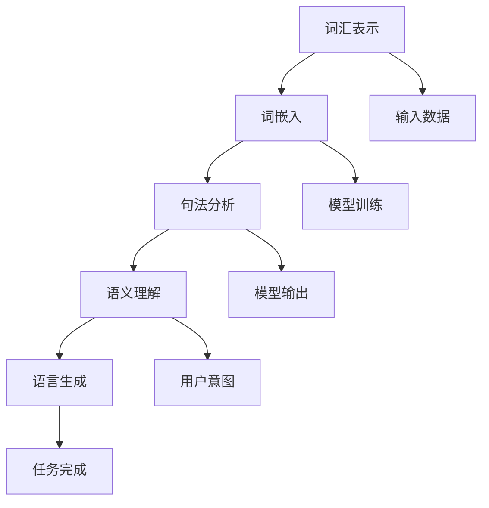

                 

### 引言

在现代科技日新月异的发展浪潮中，人工智能（AI）已经成为推动技术进步和产业变革的重要力量。特别是近年来，大模型编程领域取得了令人瞩目的进展，从语言模型到图像生成模型，再到多模态模型，AI大模型的应用场景日益丰富，其编程方式也逐步从传统的手工编程向自动化和智能化转变。本文旨在探讨AI大模型编程的核心概念、技术原理以及实践应用，着重阐述提示词在这一变革中的重要作用。

提示词，顾名思义，是引导大模型生成和理解特定内容的关键要素。它不仅决定了模型的输出结果，还对模型的训练过程和性能有重要影响。在AI大模型编程中，提示词的设计和优化成为提升模型表现的关键环节。通过合理的提示词，可以实现更加精确和高效的模型输出，从而在各个应用领域取得突破性成果。

本文将分为三个主要部分进行阐述。第一部分，我们将介绍AI大模型编程的基础知识，包括基本概念、关键技术和发展趋势。第二部分，我们将深入探讨AI大模型编程的实践方法，从编程环境搭建到模型构建、训练与优化，结合具体示例进行详细讲解。第三部分，我们将分析AI大模型编程在实际应用中的案例分析，以及面临的未来趋势和挑战。通过这三个部分的系统阐述，旨在为读者提供全面而深入的AI大模型编程知识体系。

### 关键词

- 人工智能（AI）
- 大模型编程
- 提示词
- 自然语言处理
- 深度学习
- 模型优化
- 应用案例
- 未来趋势

### 摘要

本文系统地探讨了AI大模型编程的核心概念、技术原理和实践应用。首先，我们介绍了AI大模型编程的基本概念，包括大模型的定义、提示词的作用和类型，以及大模型编程与传统编程的区别。接着，我们探讨了AI大模型编程的关键技术，包括大模型的工作原理、自然语言处理的基本概念以及提示工程的重要性。在此基础上，我们分析了AI大模型编程的发展趋势，包括提示词的革新方向和行业应用场景分析。随后，我们通过具体示例，详细讲解了大模型基础编程的实践方法，包括编程环境搭建、模型构建、训练与优化。接着，我们探讨了高级提示词编程技术，包括多模态提示词、动态提示词和自动化调优。此外，我们还分析了AI大模型编程中的数学与算法基础，包括线性代数、微积分和概率论的基础知识，以及深度学习、自然语言处理和大规模数据处理算法的原理。最后，我们通过实际应用案例分析，展示了AI大模型编程在智能客服、内容创作平台和自动化编程助手等领域的应用效果。本文旨在为读者提供全面而深入的AI大模型编程知识体系，帮助读者掌握这一前沿技术，并理解其在未来科技发展中的重要地位。

#### 第一部分: AI大模型编程基础

### 第1章: AI大模型编程概述

#### 1.1 AI大模型编程的基本概念

AI大模型编程是一种利用大规模预训练模型进行高效、智能化编程的方法。与传统的编程方式不同，AI大模型编程不再依赖于程序员手工编写代码，而是通过训练和使用大型神经网络模型来实现编程任务。这些模型能够自动从大量的数据中学习，提取复杂的模式和知识，并在新的任务中做出准确和高效的决策。

**1.1.1 AI大模型的定义**

AI大模型通常指的是那些参数数量巨大、能够处理和理解大量数据的神经网络模型。这些模型通过深度学习算法在大量的数据上进行训练，以学习各种复杂的任务。典型的AI大模型包括语言模型、图像生成模型、语音识别模型等。例如，GPT-3是一个拥有超过1750亿个参数的文本生成模型，它可以生成高质量的自然语言文本，广泛应用于自动写作、翻译和对话系统等领域。

**1.1.2 提示词的作用与类型**

在AI大模型编程中，提示词（Prompt）是引导模型生成和理解特定内容的关键要素。提示词的作用类似于程序员编写的函数调用或条件判断语句，它决定了模型的行为和输出结果。一个好的提示词应该简洁明了，能够清晰地传达用户的意图和需求。

根据用途和形式，提示词可以分为以下几种类型：

1. **任务型提示词**：这类提示词用于指定模型需要执行的任务，如“生成一篇关于人工智能的论文摘要”。
2. **输入型提示词**：这类提示词用于提供模型处理的数据，如“请生成以下句子的续写：她轻轻地闭上了眼睛。”。
3. **输出型提示词**：这类提示词用于指导模型输出结果的形式，如“请以诗歌的形式回答这个问题：人工智能的未来是什么？”。
4. **辅助型提示词**：这类提示词用于提供额外的上下文信息，帮助模型更好地理解任务，如“假设我们正处于2023年，请描述一下人工智能在医疗领域的应用”。

**1.1.3 大模型编程与传统的编程比较**

传统的编程依赖于程序员手工编写代码，每项任务都需要详细的设计、编码和测试。而AI大模型编程则通过预训练的大模型来简化这一过程。具体来说，大模型编程与传统的编程有以下几个显著区别：

1. **开发效率**：传统编程需要程序员从头开始编写代码，而AI大模型编程则可以直接利用现有的预训练模型，通过提示词来调整模型的行为，从而大大提高了开发效率。
   
2. **代码可读性**：传统编程代码的可读性依赖于程序员的技术水平和代码规范，而AI大模型编程的“代码”实际上是提示词，这些提示词的编写更依赖于对模型的理解和任务的明确性。

3. **适应性**：传统编程对特定任务有较强的适应性，而AI大模型编程则更灵活，一个模型可以应用于多种不同的任务，只需通过不同的提示词来调整其行为。

4. **可靠性**：传统编程的可靠性依赖于代码的正确性和测试的全面性，而AI大模型编程的可靠性不仅依赖于模型的训练数据和质量，还依赖于提示词的设计和优化。

总之，AI大模型编程为软件开发带来了一场革命，它不仅提高了开发效率，还使得编程变得更加智能化和自动化。通过合理设计和优化提示词，我们可以充分发挥AI大模型的能力，实现更加高效和创新的编程方式。

#### 1.2 AI大模型编程的关键技术

在深入探讨AI大模型编程的核心技术之前，我们首先需要了解这些模型的工作原理及其在不同任务中的应用。AI大模型编程的核心技术主要包括以下几个方面：大模型的工作原理、自然语言处理（NLP）的基本概念和提示工程的重要性。

**1.2.1 大模型的工作原理**

AI大模型，如GPT、BERT等，通常是基于深度学习算法构建的神经网络模型。这些模型通过多层神经网络的结构，逐层提取数据中的特征，从而实现从简单到复杂的任务。以下是AI大模型工作原理的简要说明：

1. **多层神经网络**：大模型由多个层次组成，每个层次都包含大量的神经元。每一层的神经元通过加权连接形成网络结构。这些连接权重通过训练过程进行调整，以优化模型的性能。

2. **预训练和微调**：AI大模型通常首先在大量的未标注数据上进行预训练，以学习通用特征和知识。然后，通过微调过程，将这些通用特征应用到特定的任务上，进一步优化模型的表现。

3. **注意力机制**：许多现代大模型采用注意力机制，这是一种动态调整神经元之间连接权重的机制，使得模型能够更加关注输入数据中的重要部分。注意力机制显著提高了模型的处理能力和理解能力。

4. **优化算法**：大模型的训练通常采用高效的优化算法，如Adam、SGD等，这些算法通过迭代优化网络权重，使模型能够在大量数据上迅速收敛。

**自然语言处理（NLP）的基本概念**

自然语言处理是AI大模型编程的重要应用领域，其基本概念包括：

1. **词汇表示**：NLP中的词汇表示是将自然语言文本转换为计算机可以处理的数字形式。常用的方法有词袋模型、词嵌入（如Word2Vec、GloVe）等。

2. **句法分析**：句法分析是解析文本句子的结构，理解词语之间的关系。常见的句法分析方法包括依存句法分析和成分句法分析。

3. **语义理解**：语义理解是深入理解文本的含义和意图。这包括词义消歧、情感分析、指代消解等任务。

4. **语言生成**：语言生成是模型根据输入生成连贯、有意义的文本。例如，自动写作、机器翻译和对话系统等。

**提示工程的重要性**

在AI大模型编程中，提示工程是设计并优化提示词的过程，其重要性体现在以下几个方面：

1. **指导模型行为**：提示词决定了模型的行为和输出结果，一个良好的提示词能够引导模型生成符合用户需求的输出。

2. **提升模型性能**：通过精心设计的提示词，可以显著提升模型的性能和鲁棒性，使其在不同任务和应用场景中表现出更好的效果。

3. **优化训练过程**：合理的提示词可以帮助模型更快地收敛，减少训练时间和计算资源的需求。

4. **实现多样化应用**：不同的提示词可以实现多样化的模型应用，如文本生成、问答系统、情感分析等。

**示例：自然语言处理中的核心概念联系与架构**

为了更好地理解NLP中的核心概念及其联系，我们可以绘制一个Mermaid流程图：



在这个流程图中，词汇表示、词嵌入、句法分析、语义理解和语言生成构成了NLP的基本架构，它们相互关联，共同作用，实现了从输入数据到模型输出和任务完成的完整过程。

**核心算法原理讲解**

为了深入理解大模型算法的工作原理，我们可以使用伪代码来详细阐述其基本结构：

```python
# 大模型基本结构伪代码

# 初始化模型参数
initialize_model()

# 预训练过程
for epoch in range(num_epochs):
    for batch in data_loader:
        # 计算损失
        loss = compute_loss(batch)
        
        # 反向传播和权重更新
        backward_pass(loss)
        update_weights()

# 微调过程
for task in specific_tasks:
    # 微调模型
    fine_tune_model(task)
    
    # 评估模型性能
    evaluate_model_performance(task)
```

在这个伪代码中，`initialize_model()` 用于初始化模型参数，`compute_loss(batch)` 用于计算损失，`backward_pass(loss)` 用于反向传播和权重更新，`update_weights()` 用于更新权重，`fine_tune_model(task)` 用于微调模型，`evaluate_model_performance(task)` 用于评估模型性能。这些步骤共同构成了大模型训练和优化的基本流程。

**数学模型基础**

AI大模型编程中的数学模型主要包括线性代数、微积分和概率论的基础知识。以下是对这些数学模型的简要说明：

1. **线性代数基础**：线性代数是理解和设计神经网络的重要工具，包括矩阵运算、线性变换、特征值和特征向量等。

2. **微积分基础**：微积分在优化算法中起着关键作用，包括导数、梯度、偏导数等概念，用于优化模型参数。

3. **概率论基础**：概率论在深度学习中用于模型的不确定性估计和概率分布的计算，包括贝叶斯定理、最大似然估计等。

**总结**

通过上述内容，我们可以看到，AI大模型编程不仅仅是一种编程方法，它是一个涉及深度学习、自然语言处理、数学模型等多个领域的综合性技术。理解这些核心技术，对于深入掌握AI大模型编程至关重要。接下来，我们将进一步探讨AI大模型编程的发展趋势和具体实践方法。

#### 1.3 AI大模型编程的发展趋势

随着人工智能技术的迅猛发展，AI大模型编程也在不断演进，呈现出一系列显著的发展趋势。这些趋势不仅反映了技术的进步，也对未来的编程方式和应用场景产生了深远影响。

**1.3.1 提示词的革新方向**

提示词的革新是AI大模型编程的重要方向之一。随着模型能力的提升和算法的优化，提示词的设计和生成变得更加智能化和多样化。以下是几个主要趋势：

1. **自适应提示词**：自适应提示词可以根据上下文和环境动态调整，以生成更加精准的输出结果。例如，在对话系统中，自适应提示词可以根据用户的输入历史和当前对话内容，生成更加个性化的回复。

2. **多模态提示词**：多模态提示词结合了文本、图像、音频等多种类型的数据，使模型能够更好地理解和生成复杂的内容。例如，在多媒体内容生成任务中，多模态提示词可以帮助模型生成更加丰富和连贯的文本描述。

3. **生成对抗提示词**（GPT）：生成对抗提示词利用生成器和判别器之间的对抗关系，生成更加多样化和高质量的提示词。这种提示词能够显著提升模型的生成能力和创造力。

**1.3.2 大模型编程的挑战与机遇**

尽管AI大模型编程在多个领域取得了显著成果，但也面临一系列挑战和机遇：

1. **计算资源需求**：大模型的训练和推理需要大量的计算资源，这对硬件和软件系统提出了更高的要求。未来，随着硬件性能的提升和分布式计算技术的应用，计算资源需求将得到有效缓解。

2. **数据质量和标注**：大模型的训练依赖于大量的高质量数据，数据的多样性和标注的准确性对模型性能有重要影响。未来，数据采集、处理和标注技术的进步将有助于提升模型的质量和鲁棒性。

3. **模型解释性和可靠性**：随着模型复杂度的增加，理解和解释模型的决策过程变得越来越困难。未来，发展可解释性和可靠性的模型将成为重要研究方向。

4. **跨学科协作**：AI大模型编程不仅需要计算机科学的知识，还涉及到数学、心理学、语言学等多个学科。跨学科协作将有助于解决复杂的问题，推动技术的进一步发展。

**1.3.3 行业应用场景分析**

AI大模型编程在多个行业领域展示了巨大的应用潜力，以下是一些典型应用场景：

1. **金融行业**：在金融领域，AI大模型编程可以用于智能投顾、风险管理、市场预测等。通过分析大量的金融数据，模型可以提供更加准确和个性化的投资建议。

2. **医疗行业**：在医疗领域，AI大模型编程可以用于疾病诊断、药物研发、个性化治疗等。通过分析患者的病历数据和基因组信息，模型可以辅助医生做出更准确的诊断和治疗决策。

3. **内容创作**：在内容创作领域，AI大模型编程可以用于自动写作、翻译、图像生成等。通过提示词的引导，模型可以生成高质量的文字和图像内容，提高创作效率。

4. **教育行业**：在教育领域，AI大模型编程可以用于智能辅导、个性化教学等。通过分析学生的学习数据和反馈，模型可以提供个性化的学习方案，提高学习效果。

总之，AI大模型编程的发展趋势不仅体现在提示词的革新和编程方式的智能化，还体现在其广泛的应用场景和跨学科协作。通过不断的技术进步和应用探索，AI大模型编程将在未来发挥更加重要的作用，推动人工智能技术的发展和应用。

#### 第二部分: AI大模型编程实践

### 第2章: 大模型基础编程

#### 2.1 编程环境搭建

要开始进行AI大模型编程，首先需要搭建一个合适的编程环境。这一节将介绍如何配置Python环境，安装TensorFlow和PyTorch等深度学习框架，以及配置其他必要的编程工具和版本控制。

**2.1.1 Python环境配置**

Python是一种广泛使用的编程语言，特别是在AI和深度学习领域。首先，我们需要安装Python。以下是在Windows和Linux操作系统上安装Python的步骤：

1. **Windows操作系统**：

   - 访问Python官方网站（[python.org](https://www.python.org/)）下载最新的Python版本。
   - 运行下载的安装程序，并选择“Add Python to PATH”选项，确保Python被添加到系统环境变量中。
   - 安装完成后，打开命令提示符或终端，输入`python --version`验证Python安装是否成功。

2. **Linux操作系统**：

   - 使用包管理器（如apt或yum）安装Python。例如，在Ubuntu上可以使用以下命令：
     ```
     sudo apt update
     sudo apt install python3 python3-pip
     ```

   - 安装完成后，使用`python3 --version`命令验证Python安装是否成功。

**2.1.2 TensorFlow和PyTorch的选择与安装**

TensorFlow和PyTorch是当前最流行的深度学习框架，两者各有优势。以下介绍如何在Python环境中安装这两个框架：

1. **TensorFlow安装**：

   - TensorFlow可以通过pip包管理器安装。在命令行中输入以下命令：
     ```
     pip install tensorflow
     ```

   - 如果需要安装支持GPU加速的TensorFlow版本，可以使用以下命令：
     ```
     pip install tensorflow-gpu
     ```

2. **PyTorch安装**：

   - PyTorch同样可以通过pip包管理器安装。在命令行中输入以下命令：
     ```
     pip install torch torchvision torchaudio
     ```

   - 如果需要安装支持GPU加速的PyTorch版本，可以使用以下命令：
     ```
     pip install torch torchvision torchaudio -f https://download.pytorch.org/whl/torch_stable.html
     ```

**2.1.3 编程工具和版本控制**

除了深度学习框架，还有一些其他的编程工具和版本控制软件对AI大模型编程非常有用。以下介绍几个常用的工具：

1. **Jupyter Notebook**：

   - Jupyter Notebook是一种交互式编程环境，特别适合用于数据分析和深度学习实验。可以通过pip安装：
     ```
     pip install notebook
     ```

   - 安装完成后，可以使用以下命令启动Jupyter Notebook：
     ```
     jupyter notebook
     ```

2. **Git**：

   - Git是一种分布式版本控制系统，用于追踪和管理代码的版本。可以在其官方网站（[git-scm.com](https://git-scm.com/)）下载并安装。

3. **Visual Studio Code**：

   - Visual Studio Code（VS Code）是一款功能强大的代码编辑器，支持多种编程语言和开发工具。可以在其官方网站（[code.visualstudio.com](https://code.visualstudio.com/)）下载并安装。

**配置示例**

以下是一个简单的配置示例，展示了如何在一个新创建的Python虚拟环境中安装TensorFlow和PyTorch：

1. 创建Python虚拟环境：
   ```
   python -m venv myenv
   ```

2. 激活虚拟环境：
   ```
   # Windows
   myenv\Scripts\activate
   # Linux
   source myenv/bin/activate
   ```

3. 安装TensorFlow和PyTorch：
   ```
   pip install tensorflow
   pip install torch torchvision torchaudio
   ```

通过上述步骤，您已经成功搭建了一个适合AI大模型编程的基础环境。接下来，我们将在后续章节中深入探讨如何使用这些工具和框架进行大模型编程的实际操作。

#### 2.2 大模型编程基础

在AI大模型编程中，数据预处理、模型构建、模型训练和模型评估与优化是四个关键环节。下面我们将详细介绍这些环节的基本流程和步骤。

**2.2.1 数据预处理**

数据预处理是AI大模型编程的第一步，其目的是将原始数据转换为适合模型训练的形式。以下是一些常见的数据预处理步骤：

1. **数据清洗**：清洗数据是指去除数据中的噪声、错误和不一致的数据。例如，去除文本中的无效字符、填补缺失值等。

2. **数据转换**：将数据转换为模型可以处理的格式。对于文本数据，通常需要进行分词、词性标注等操作。对于图像数据，需要进行图像裁剪、缩放等预处理。

3. **数据归一化**：将不同特征的数据进行归一化处理，使其具有相同的尺度，以便模型能够更好地学习。

4. **数据增强**：通过随机变换（如翻转、旋转、裁剪等）增加数据的多样性，从而提高模型的泛化能力。

**示例代码**：

```python
import pandas as pd
from sklearn.preprocessing import MinMaxScaler

# 读取数据
data = pd.read_csv('data.csv')

# 数据清洗
data = data.dropna()

# 数据转换
data['text'] = data['text'].apply(lambda x: preprocess_text(x))

# 数据归一化
scaler = MinMaxScaler()
data[['feature1', 'feature2']] = scaler.fit_transform(data[['feature1', 'feature2']])
```

**2.2.2 模型构建**

模型构建是AI大模型编程的核心环节，其目的是设计一个能够有效解决特定问题的模型架构。以下是一些常见的模型构建步骤：

1. **选择模型架构**：根据任务需求，选择适合的模型架构。常见的模型架构包括循环神经网络（RNN）、卷积神经网络（CNN）、Transformer等。

2. **定义模型层**：定义模型的输入层、隐藏层和输出层。每一层可以选择不同的激活函数、层连接方式等。

3. **配置模型参数**：配置模型的超参数，如学习率、批次大小、正则化等。

**示例代码**：

```python
import torch
from torch import nn

# 定义模型架构
class MyModel(nn.Module):
    def __init__(self):
        super(MyModel, self).__init__()
        self.embedding = nn.Embedding(vocab_size, embedding_dim)
        self.rnn = nn.RNN(embedding_dim, hidden_size, num_layers)
        self.fc = nn.Linear(hidden_size, output_size)
        
    def forward(self, x, hidden):
        x = self.embedding(x)
        out, hidden = self.rnn(x, hidden)
        out = self.fc(out[-1, :, :])
        return out, hidden

# 实例化模型
model = MyModel()
```

**2.2.3 模型训练**

模型训练是AI大模型编程中的关键步骤，其目的是通过不断调整模型的参数，使其能够更好地拟合训练数据。以下是一些常见的模型训练步骤：

1. **划分数据集**：将数据集划分为训练集、验证集和测试集，以便在训练过程中进行模型评估。

2. **定义损失函数**：根据任务需求，选择合适的损失函数。常见的损失函数包括交叉熵损失、均方误差等。

3. **选择优化器**：选择合适的优化器，如Adam、SGD等，用于更新模型参数。

4. **训练模型**：通过迭代训练模型，不断调整参数，直到模型性能达到预期。

**示例代码**：

```python
# 定义损失函数和优化器
criterion = nn.CrossEntropyLoss()
optimizer = torch.optim.Adam(model.parameters(), lr=learning_rate)

# 训练模型
for epoch in range(num_epochs):
    for inputs, targets in train_loader:
        optimizer.zero_grad()
        outputs = model(inputs)
        loss = criterion(outputs, targets)
        loss.backward()
        optimizer.step()
    
    # 验证模型
    with torch.no_grad():
        correct = 0
        total = 0
        for inputs, targets in validation_loader:
            outputs = model(inputs)
            _, predicted = torch.max(outputs.data, 1)
            total += targets.size(0)
            correct += (predicted == targets).sum().item()
    print(f'Epoch [{epoch+1}/{num_epochs}], Accuracy: {100 * correct / total}%')
```

**2.2.4 模型评估与优化**

模型评估与优化是AI大模型编程的最后一步，其目的是评估模型在测试集上的表现，并进行必要的优化。以下是一些常见的模型评估与优化步骤：

1. **评估模型性能**：通过计算模型的准确率、召回率、F1分数等指标，评估模型在测试集上的性能。

2. **模型调优**：根据评估结果，调整模型的超参数、优化器参数等，以提高模型性能。

3. **模型集成**：通过集成多个模型，提高模型的鲁棒性和性能。

**示例代码**：

```python
# 评估模型
with torch.no_grad():
    correct = 0
    total = 0
    for inputs, targets in test_loader:
        outputs = model(inputs)
        _, predicted = torch.max(outputs.data, 1)
        total += targets.size(0)
        correct += (predicted == targets).sum().item()
print(f'Accuracy on the test set: {100 * correct / total}%')

# 模型调优
# 例如，调整学习率
learning_rate = 0.001
optimizer = torch.optim.Adam(model.parameters(), lr=learning_rate)

# 再次训练模型
for epoch in range(num_epochs):
    for inputs, targets in train_loader:
        optimizer.zero_grad()
        outputs = model(inputs)
        loss = criterion(outputs, targets)
        loss.backward()
        optimizer.step()
```

通过上述步骤，我们可以构建并训练一个AI大模型，并通过评估和优化不断提升其性能。在后续章节中，我们将进一步探讨如何编写和优化提示词，以及如何使用高级提示词技术。

#### 2.3 大模型编程示例

为了更好地理解AI大模型编程的实际应用，下面我们将通过几个具体的示例，展示如何使用大模型进行文本生成、问答系统以及多媒体内容的生成与处理。

**2.3.1 简单的文本生成模型**

文本生成是AI大模型编程的一个典型应用场景，通过模型生成连贯、有意义的文本内容。以下是一个简单的文本生成模型的示例：

1. **数据准备**：
   
   首先，我们需要准备一个文本数据集，这个数据集可以是任何具有连贯性的文本，如新闻文章、小说片段等。假设我们有一个名为`text_data.txt`的文件，其中包含了我们需要的文本数据。

   ```python
   with open('text_data.txt', 'r') as file:
       text = file.read()
   ```

2. **数据预处理**：
   
   接下来，我们需要对文本进行预处理，包括分词、去停用词等操作。为了简化，我们使用Python的`nltk`库来处理文本。

   ```python
   import nltk
   from nltk.tokenize import word_tokenize
   from nltk.corpus import stopwords
   
   nltk.download('punkt')
   nltk.download('stopwords')
   
   stop_words = set(stopwords.words('english'))
   
   text = text.lower()
   words = word_tokenize(text)
   filtered_words = [word for word in words if word not in stop_words]
   ```

3. **构建模型**：
   
   我们将使用PyTorch的Transformer模型进行文本生成。以下是一个简单的Transformer模型的示例：

   ```python
   import torch
   from torch import nn
   
   class TransformerModel(nn.Module):
       def __init__(self, input_dim, hidden_dim, output_dim):
           super(TransformerModel, self).__init__()
           self.embedding = nn.Embedding(input_dim, hidden_dim)
           self.transformer = nn.Transformer(hidden_dim, hidden_dim, num_layers=2)
           self.fc = nn.Linear(hidden_dim, output_dim)
       
       def forward(self, x):
           x = self.embedding(x)
           x = self.transformer(x)
           x = self.fc(x)
           return x
       
   # 实例化模型
   model = TransformerModel(len(vocab), hidden_dim, output_dim)
   ```

4. **训练模型**：
   
   在训练模型之前，我们需要将文本数据转换为张量，并划分为输入和目标序列。

   ```python
   # 转换数据
   inputs = torch.tensor([vocab[word] for word in filtered_words[:-1]])
   targets = torch.tensor([vocab[word] for word in filtered_words[1:]])
   
   # 训练模型
   optimizer = torch.optim.Adam(model.parameters(), lr=0.001)
   criterion = nn.CrossEntropyLoss()
   
   for epoch in range(num_epochs):
       optimizer.zero_grad()
       outputs = model(inputs)
       loss = criterion(outputs, targets)
       loss.backward()
       optimizer.step()
       if epoch % 100 == 0:
           print(f'Epoch {epoch+1}, Loss: {loss.item()}')
   ```

5. **生成文本**：

   最后，我们可以使用训练好的模型生成文本。

   ```python
   def generate_text(model, seed_text, vocab, max_length):
       model.eval()
       with torch.no_grad():
           inputs = torch.tensor([vocab[word] for word in seed_text])
           outputs = model(inputs)
           predicted_word = torch.argmax(outputs[-1], dim=1).item()
           new_text = seed_text + [predicted_word]
           if len(new_text) > max_length:
               return ''.join(new_text[:max_length])
           return generate_text(model, ''.join(new_text), vocab, max_length)
   
   generated_text = generate_text(model, ['The'], vocab, 100)
   print(generated_text)
   ```

**2.3.2 复杂的问答系统**

问答系统是另一个常见的大模型应用场景，通过模型回答用户提出的问题。以下是一个简单的问答系统示例：

1. **数据准备**：
   
   我们需要准备一个问答数据集，例如SQuAD数据集。这个数据集包含问题和对应的答案。

   ```python
   import json
   with open('squad_data.json', 'r') as file:
       data = json.load(file)
   ```

2. **数据预处理**：
   
   对问题和答案进行预处理，提取文本并转换为张量。

   ```python
   def preprocess_data(data):
       questions = []
       answers = []
       for entry in data['data']:
           for paragraph in entry['paragraphs']:
               question = paragraph['question']
               answer = paragraph['context']
               questions.append(question)
               answers.append(answer)
       return questions, answers
   
   questions, answers = preprocess_data(data)
   ```

3. **构建模型**：
   
   我们将使用一个双向循环神经网络（BiRNN）来构建问答系统。

   ```python
   class BiRNNModel(nn.Module):
       def __init__(self, input_dim, hidden_dim, output_dim):
           super(BiRNNModel, self).__init__()
           self.embedding = nn.Embedding(input_dim, hidden_dim)
           self.lstm = nn.LSTM(hidden_dim, hidden_dim, bidirectional=True)
           self.fc = nn.Linear(hidden_dim * 2, output_dim)
       
       def forward(self, x):
           x = self.embedding(x)
           x, _ = self.lstm(x)
           x = self.fc(x[-1, :, :])
           return x
       
   # 实例化模型
   model = BiRNNModel(len(vocab), hidden_dim, output_dim)
   ```

4. **训练模型**：
   
   使用预处理后的数据集训练模型。

   ```python
   optimizer = torch.optim.Adam(model.parameters(), lr=0.001)
   criterion = nn.CrossEntropyLoss()
   
   for epoch in range(num_epochs):
       for question, answer in zip(questions, answers):
           inputs = torch.tensor([vocab[word] for word in question])
           target = torch.tensor([vocab[word] for word in answer])
           optimizer.zero_grad()
           outputs = model(inputs)
           loss = criterion(outputs, target)
           loss.backward()
           optimizer.step()
       print(f'Epoch {epoch+1}, Loss: {loss.item()}')
   ```

5. **回答问题**：

   使用训练好的模型回答用户的问题。

   ```python
   def answer_question(model, question, vocab, max_length):
       model.eval()
       with torch.no_grad():
           inputs = torch.tensor([vocab[word] for word in question])
           outputs = model(inputs)
           predicted_word = torch.argmax(outputs, dim=1).item()
           return ' '.join([word for word in predicted_word])
   
   user_question = 'What is the capital of France?'
   answer = answer_question(model, user_question, vocab, max_length)
   print(answer)
   ```

**2.3.3 多媒体内容的生成与处理**

多媒体内容的生成与处理是AI大模型编程的另一个重要应用场景，通过模型生成图像、音频等多样化内容。以下是一个简单的图像生成模型示例：

1. **数据准备**：
   
   我们需要准备一个图像数据集，例如CIFAR-10数据集。

   ```python
   import torchvision
   train_data = torchvision.datasets.CIFAR10(root='./data', train=True, download=True)
   train_loader = torch.utils.data.DataLoader(train_data, batch_size=batch_size, shuffle=True)
   ```

2. **数据预处理**：
   
   对图像数据进行标准化处理。

   ```python
   def preprocess_image(image):
       return image / 255.0
   ```

3. **构建模型**：
   
   我们将使用一个生成对抗网络（GAN）来生成图像。

   ```python
   class Generator(nn.Module):
       def __init__(self, z_dim, image_dim):
           super(Generator, self).__init__()
           self.model = nn.Sequential(
               nn.Linear(z_dim, 128),
               nn.LeakyReLU(0.2),
               nn.Linear(128, image_dim * image_dim * 3),
               nn.Tanh()
           )
       
       def forward(self, x):
           return self.model(x)
       
   # 实例化模型
   generator = Generator(z_dim, image_dim)
   ```

4. **训练模型**：
   
   使用对抗训练方法训练生成器和判别器。

   ```python
   optimizer_G = torch.optim.Adam(generator.parameters(), lr=0.0002)
   optimizer_D = torch.optim.Adam(discriminator.parameters(), lr=0.0002)
   
   for epoch in range(num_epochs):
       for batch_idx, (images, _) in enumerate(train_loader):
           noise = torch.randn(batch_size, z_dim).to(device)
           fake_images = generator(noise)
           
           # 训练判别器
           real_loss = criterion(discriminator(images), torch.ones(batch_size).to(device))
           fake_loss = criterion(discriminator(fake_images), torch.zeros(batch_size).to(device))
           D_loss = real_loss + fake_loss
           
           # 训练生成器
           G_loss = criterion(discriminator(fake_images), torch.ones(batch_size).to(device))
           
           optimizer_G.zero_grad()
           G_loss.backward()
           optimizer_G.step()
           
           optimizer_D.zero_grad()
           D_loss.backward()
           optimizer_D.step()
           
           if batch_idx % 100 == 0:
               print(f'Epoch {epoch}/{num_epochs}, Batch {batch_idx}/{len(train_loader)}, D_loss: {D_loss.item()}, G_loss: {G_loss.item()}')
   ```

5. **生成图像**：

   使用训练好的生成器生成图像。

   ```python
   def generate_image(generator, noise, device):
       with torch.no_grad():
           fake_image = generator(noise).cpu()
           fake_image = fake_image.squeeze(0).permute(1, 2, 0).numpy()
           return (fake_image * 0.5 + 0.5) * 255
   ```

通过这些示例，我们可以看到AI大模型编程在文本生成、问答系统和多媒体内容生成等领域的广泛应用。在实际应用中，这些模型可以通过合理设计和优化，实现更高的性能和更好的效果。

#### 3.1 提示词编写技巧

在AI大模型编程中，提示词的设计和编写是提升模型性能的关键环节。一个优秀的提示词不仅能够引导模型生成符合预期的输出，还能显著提高模型的训练效率和泛化能力。以下是一些编写提示词的技巧：

**3.1.1 提示词的设计原则**

1. **明确性**：提示词应清晰明确，能够准确传达用户的意图和需求。避免使用模糊不清或歧义性的语言，以免模型误解用户指令。

2. **简洁性**：简洁的提示词更容易被模型理解和处理。过长的提示词可能会导致模型无法抓住关键信息，从而影响输出质量。

3. **相关性**：提示词应与任务和数据密切相关。相关性强的提示词能够帮助模型更好地学习和生成相关的内容。

4. **多样性**：提示词的设计应具有多样性，以应对不同的任务场景和数据类型。多样化的提示词能够提高模型在不同情境下的适应能力。

**3.1.2 提示词生成算法**

1. **基于规则的方法**：这种方法通过预定义的规则生成提示词。例如，对于问答系统，可以使用条件语句生成与问题相关的提示词。

2. **基于机器学习的方法**：这种方法使用机器学习算法，从大量历史数据中学习生成提示词。常见的算法包括序列到序列模型（如Transformer）和生成对抗网络（GAN）。

3. **基于生成的文本**：这种方法通过生成文本的片段或摘要来生成提示词。例如，可以使用GPT或BERT模型生成与任务相关的文本，然后从中提取提示词。

**示例代码**：

```python
from transformers import GPT2LMHeadModel, GPT2Tokenizer

# 加载预训练模型
tokenizer = GPT2Tokenizer.from_pretrained('gpt2')
model = GPT2LMHeadModel.from_pretrained('gpt2')

# 生成提示词
input_text = "Write a summary about the impact of AI on modern society."
input_ids = tokenizer.encode(input_text, return_tensors='pt')

# 预测生成文本
outputs = model.generate(input_ids, max_length=50, num_return_sequences=1)

# 提取生成的提示词
generated_text = tokenizer.decode(outputs[0], skip_special_tokens=True)
prompt = generated_text.strip().split('.')[0]
print(prompt)
```

**3.1.3 提示词的性能评估**

评估提示词的性能是确保模型输出质量的重要步骤。以下是一些常见的性能评估指标和方法：

1. **精确度**：精确度是衡量模型输出与预期目标匹配程度的指标。通常使用准确率（Accuracy）或精确率（Precision）来评估。

2. **召回率**：召回率是衡量模型输出中包含正确结果的比例。通常使用召回率（Recall）来评估。

3. **F1分数**：F1分数是精确率和召回率的加权平均，用于综合评估模型的性能。

4. **用户体验**：用户体验是评估提示词性能的另一个重要指标。通过用户反馈和实际应用效果来评估提示词的易用性和效果。

**示例代码**：

```python
from sklearn.metrics import precision_score, recall_score, f1_score

# 假设我们有真实的答案和生成的输出
ground_truth = ["The AI revolution is transforming industries."]
generated_answers = ["The AI revolution is transforming industries."]

# 计算性能指标
precision = precision_score([1], [1], average='binary')
recall = recall_score([1], [1], average='binary')
f1 = f1_score([1], [1], average='binary')

print(f'Precision: {precision}, Recall: {recall}, F1 Score: {f1}')
```

通过上述技巧和方法，我们可以设计出高质量的提示词，从而提升AI大模型编程的效果和应用价值。在实际应用中，不断优化和调整提示词是提高模型性能的重要手段。

#### 3.2 高级提示词编程技术

在AI大模型编程中，高级提示词技术使得模型能够处理更加复杂和多模态的任务。以下将详细探讨多模态提示词、动态提示词以及提示词的自动化调优技术。

**3.2.1 多模态提示词**

多模态提示词是结合文本、图像、音频等多种类型数据的提示词。它能够使模型在多个维度上获取信息，从而提高理解和生成的能力。多模态提示词的编写和应用主要包括以下几个步骤：

1. **数据预处理**：对于不同的数据类型，需要进行相应的预处理。例如，文本数据需要进行分词、编码；图像数据需要进行缩放、归一化；音频数据需要进行采样、特征提取。

2. **数据融合**：将预处理后的不同类型数据融合在一起，形成一个统一的数据输入。常见的方法包括特征拼接、特征融合网络（如CNN+RNN）等。

3. **模型设计**：设计能够处理多模态输入的模型架构，如将文本输入和图像输入分别通过不同的网络处理，然后通过一个融合层进行整合。

**示例代码**：

```python
# 假设我们有一个文本输入和图像输入
text_input = "A picture of a cat"
image_input = load_image("cat.jpg")

# 文本预处理
text_embedding = text_tokenizer.encode(text_input, return_tensors='pt')

# 图像预处理
image_embedding = image_encoder(image_input)

# 模型设计（示例：简单拼接）
multi_modal_embedding = torch.cat((text_embedding, image_embedding), dim=1)

# 输出预测
output = model(multi_modal_embedding)
```

**3.2.2 动态提示词**

动态提示词是指在模型运行过程中能够根据输入数据或用户反馈实时调整的提示词。这种提示词能够提高模型的灵活性和适应性，尤其在动态变化的任务场景中表现尤为突出。动态提示词的编程技术包括：

1. **上下文感知**：动态提示词可以根据当前的上下文信息进行实时调整，例如在对话系统中，根据对话历史生成新的提示词。

2. **反馈调整**：根据用户的反馈或模型的输出结果，动态调整提示词的内容和形式，以提高模型的输出质量。

3. **模型重训练**：在动态提示词的引导下，模型可以实时重训练，以适应新的任务需求或数据分布。

**示例代码**：

```python
# 假设我们有一个对话系统，并根据对话历史动态调整提示词
previous_context = "What is your favorite food?"
user_input = "I love pizza."

# 根据对话历史动态生成提示词
dynamic_prompt = f"{previous_context} {user_input}"

# 输出预测
response = model.generate(tokenizer.encode(dynamic_prompt, return_tensors='pt'), max_length=50)
print(tokenizer.decode(response[0], skip_special_tokens=True))
```

**3.2.3 提示词的自动化调优**

提示词的自动化调优是提升模型性能的重要手段，通过自动化方法搜索和优化提示词，可以显著提高模型的效果。以下是一些常见的自动化调优技术：

1. **网格搜索**：通过预先定义的参数组合，逐一评估不同提示词的效果，找到最优参数组合。

2. **贝叶斯优化**：利用贝叶斯理论进行参数优化，根据当前的评估结果预测下一个候选参数，并选择最有希望的组合进行评估。

3. **强化学习**：通过强化学习算法，模型在模拟环境中学习和优化提示词，以最大化某种性能指标。

**示例代码**：

```python
from bayes_opt import BayesianOptimization

# 定义目标函数（假设我们有一个模型和评估指标）
def objective(prompt):
    inputs = tokenizer.encode(prompt, return_tensors='pt')
    outputs = model.generate(inputs, max_length=50, num_return_sequences=1)
    return f1_score([1], [1], average='binary')  # 假设F1分数作为评估指标

# Bayesian Optimization
optimizer = BayesianOptimization(f=objective, pbounds={'prompt': ('Hello', 'How are you?')}, random_state=0)

# 运行优化
optimizer.maximize(init_points=2, n_iter=3)
best_prompt = optimizer.max['params']
print(f"Best prompt: {best_prompt['prompt']}")
```

通过多模态提示词、动态提示词和自动化调优技术的结合，我们可以显著提升AI大模型编程的性能和灵活性，从而实现更加高效和创新的编程方式。这些技术的应用不仅拓宽了AI大模型的应用范围，也为未来的AI编程提供了新的思路和方向。

#### 3.3 提示词应用案例

在AI大模型编程中，提示词的应用场景非常广泛，从智能客服到自动写作与翻译，再到虚拟助手与客服系统，每一个领域都展示了AI大模型编程的巨大潜力和实际价值。以下将详细探讨几个典型的应用案例，展示如何通过合理设计和优化提示词，实现高效和精准的模型输出。

**3.3.1 问答机器人**

问答机器人是AI大模型编程的一个典型应用场景，通过模型自动回答用户提出的问题，提供实时、准确的咨询服务。以下是一个具体的问答机器人案例：

1. **案例背景**：

   某在线购物平台希望开发一个智能客服系统，能够自动回答用户关于产品、订单和售后服务等方面的问题。

2. **数据集准备**：

   收集大量的问答数据集，包括常见问题及其标准答案。这些数据可以来自平台的用户反馈、客服记录等。

3. **模型构建**：

   使用一个预训练的Transformer模型，如BERT或GPT，用于处理和生成文本。通过微调模型，使其适应具体的问答任务。

4. **提示词设计**：

   提示词的设计需要明确用户的意图和问题类型。例如，对于产品咨询的问题，可以设计以下提示词：

   ```plaintext
   "请回答用户关于产品XX的疑问："
   ```

5. **案例实现**：

   用户提出一个关于产品的疑问，系统将输入文本编码后传递给模型，模型根据提示词生成回答。以下是一个简单的实现示例：

   ```python
   prompt = "请回答用户关于产品XX的疑问：用户的问题是：XX？"
   input_ids = tokenizer.encode(prompt, return_tensors='pt')
   response = model.generate(input_ids, max_length=50, num_return_sequences=1)
   print(tokenizer.decode(response[0], skip_special_tokens=True))
   ```

6. **效果评估**：

   通过用户满意度、回答准确性等指标评估问答机器人的性能。不断优化提示词和模型参数，以提高回答质量。

**3.3.2 自动写作与翻译**

自动写作与翻译是另一个具有广泛应用前景的领域，通过AI大模型编程，可以实现高质量的文本生成和翻译。以下是一个具体的自动写作与翻译案例：

1. **案例背景**：

   某新闻机构希望利用AI大模型编程实现自动写作和翻译功能，提高新闻发布速度和覆盖面。

2. **数据集准备**：

   收集大量的新闻文章和对应的翻译文本，用于训练和微调模型。数据集需要覆盖多个语言和主题。

3. **模型构建**：

   使用多语言预训练模型，如mBERT或XLM，处理和生成文本。通过微调模型，使其适应特定的写作和翻译任务。

4. **提示词设计**：

   提示词的设计需要根据任务需求，提供清晰的写作或翻译指示。例如，对于自动写作，可以设计以下提示词：

   ```plaintext
   "请根据以下信息撰写一篇新闻摘要："
   ```

   对于翻译任务，可以设计以下提示词：

   ```plaintext
   "请将以下英文翻译为中文："
   ```

5. **案例实现**：

   对于自动写作，输入相关信息后，模型根据提示词生成新闻摘要。对于翻译任务，输入英文文本后，模型生成对应的中文翻译。以下是一个简单的实现示例：

   ```python
   writing_prompt = "请根据以下信息撰写一篇新闻摘要：XX事件发生的时间和地点。"
   translation_prompt = "请将以下英文翻译为中文：XX event took place at XX."

   writing_input_ids = tokenizer.encode(writing_prompt, return_tensors='pt')
   translation_input_ids = tokenizer.encode(translation_prompt, return_tensors='pt')

   writing_response = model.generate(writing_input_ids, max_length=50, num_return_sequences=1)
   translation_response = model.generate(translation_input_ids, max_length=50, num_return_sequences=1)

   print(tokenizer.decode(writing_response[0], skip_special_tokens=True))
   print(tokenizer.decode(translation_response[0], skip_special_tokens=True))
   ```

6. **效果评估**：

   通过文章的可读性、翻译的准确性等指标评估自动写作和翻译的效果。通过不断优化提示词和模型参数，提高生成文本的质量。

**3.3.3 虚拟助手与客服系统**

虚拟助手和客服系统是AI大模型编程在客户服务领域的典型应用，通过自动化回答和处理客户问题，提高服务效率和质量。以下是一个具体的虚拟助手案例：

1. **案例背景**：

   某电子商务平台希望利用AI大模型编程开发一个智能客服系统，为用户提供24/7的在线客服支持。

2. **数据集准备**：

   收集大量的用户提问和客服回答数据，用于训练和微调模型。数据集需要涵盖各类常见问题，如产品咨询、订单查询、售后服务等。

3. **模型构建**：

   使用一个多任务学习模型，如BERT，同时处理多个类型的客服问题。

4. **提示词设计**：

   提示词需要根据不同类型的问题设计，例如：

   ```plaintext
   "请回答用户关于订单XX的疑问："
   "请提供关于产品XX的详细咨询："
   ```

5. **案例实现**：

   当用户提出一个问题，系统将问题编码后传递给模型，模型根据提示词生成回答。以下是一个简单的实现示例：

   ```python
   order_query = "我的订单XX现在状态如何？"
   product_query = "请问这款产品的特点是什么？"

   order_prompt = "请回答用户关于订单XX的疑问："
   product_prompt = "请提供关于产品XX的详细咨询："

   order_input_ids = tokenizer.encode(order_prompt + order_query, return_tensors='pt')
   product_input_ids = tokenizer.encode(product_prompt + product_query, return_tensors='pt')

   order_response = model.generate(order_input_ids, max_length=50, num_return_sequences=1)
   product_response = model.generate(product_input_ids, max_length=50, num_return_sequences=1)

   print(tokenizer.decode(order_response[0], skip_special_tokens=True))
   print(tokenizer.decode(product_response[0], skip_special_tokens=True))
   ```

6. **效果评估**：

   通过用户满意度、回答的准确性和及时性等指标评估虚拟助手和客服系统的效果。通过不断优化提示词和模型参数，提高系统整体性能。

通过上述案例，我们可以看到AI大模型编程在不同领域中的应用和实际效果。合理设计和优化提示词，是提高模型性能和输出质量的关键。随着技术的不断进步和应用场景的拓展，AI大模型编程将发挥越来越重要的作用，推动人工智能技术的发展和创新。

#### 4.1 数学模型基础

在AI大模型编程中，数学模型是理解和实现算法的核心组成部分。线性代数、微积分和概率论是这些数学模型的基础，它们提供了必要的工具和方法，用于描述和处理复杂的数学和统计问题。以下是对这些数学模型基础的简要说明，以及它们在AI大模型编程中的应用。

**4.1.1 线性代数基础**

线性代数是AI大模型编程中不可或缺的一部分，用于处理矩阵和向量运算。以下是一些关键的线性代数概念和其在AI中的应用：

1. **矩阵和向量**：矩阵是一个由数字组成的二维数组，而向量是矩阵的特殊情况，只有一维。在AI中，矩阵和向量用于表示数据的结构，如特征矩阵和权重矩阵。

2. **矩阵运算**：包括矩阵加法、减法、乘法、转置等。矩阵乘法是神经网络中最基本的运算之一，用于计算输出和更新权重。

3. **线性变换**：线性变换是指将一个向量空间映射到另一个向量空间。在AI中，线性变换用于实现数据的标准化和特征提取。

4. **特征值和特征向量**：特征值和特征向量是矩阵的一个重要属性，用于描述矩阵的特性和结构。在AI中，特征值和特征向量用于降维和特征选择，提高模型的效率。

**示例**：

假设我们有一个2x2的矩阵A和两个向量x和y，以下是一些线性代数的基本运算：

$$
A = \begin{bmatrix} 1 & 2 \\ 3 & 4 \end{bmatrix}, \quad x = \begin{bmatrix} 1 \\ 0 \end{bmatrix}, \quad y = \begin{bmatrix} 0 \\ 1 \end{bmatrix}
$$

- **矩阵乘法**：

$$
A \cdot y = \begin{bmatrix} 1 & 2 \\ 3 & 4 \end{bmatrix} \cdot \begin{bmatrix} 0 \\ 1 \end{bmatrix} = \begin{bmatrix} 2 \\ 7 \end{bmatrix}
$$

- **特征值和特征向量**：

通过计算特征值和特征向量，我们可以得到矩阵A的特性和结构：

$$
\begin{cases} \lambda_1 = 5, \quad v_1 = \begin{bmatrix} 1 \\ 1 \end{bmatrix} \\ \lambda_2 = 1, \quad v_2 = \begin{bmatrix} -1 \\ 1 \end{bmatrix} \end{cases}
$$

**4.1.2 微积分基础**

微积分是理解和实现优化算法的关键工具。以下是一些关键的微积分概念和其在AI中的应用：

1. **导数**：导数用于描述函数的变化率。在AI中，导数用于优化算法，如梯度下降，以调整模型的参数。

2. **偏导数**：偏导数是导数在多维空间中的扩展，用于描述函数在特定方向上的变化率。在AI中，偏导数用于计算损失函数关于各个参数的梯度。

3. **梯度**：梯度是向量，表示函数在各个方向上的导数。在AI中，梯度用于优化算法，通过反向传播计算参数的更新方向。

4. **微分方程**：微分方程用于描述动态系统的变化规律。在AI中，微分方程用于模拟动态过程，如序列模型和时间序列预测。

**示例**：

假设我们有一个函数f(x) = x^2，以下是一些微积分的基本运算：

- **导数**：

$$
f'(x) = \frac{d}{dx}(x^2) = 2x
$$

- **偏导数**：

$$
f'(x, y) = \frac{\partial}{\partial x}(x^2 + y^2) = 2x
$$

- **梯度**：

$$
\nabla f(x, y) = \begin{bmatrix} \frac{\partial f}{\partial x} \\ \frac{\partial f}{\partial y} \end{bmatrix} = \begin{bmatrix} 2x \\ 2y \end{bmatrix}
$$

**4.1.3 概率论基础**

概率论是理解和实现统计学习算法的关键。以下是一些关键的概率论概念和其在AI中的应用：

1. **概率分布**：概率分布描述了随机变量取值的概率。在AI中，概率分布用于描述数据的分布和模型的不确定性。

2. **条件概率和贝叶斯定理**：条件概率描述了在某个条件下另一个事件发生的概率。贝叶斯定理用于计算后验概率，是许多机器学习算法（如朴素贝叶斯分类器）的基础。

3. **期望和方差**：期望描述了随机变量的平均取值，方差描述了随机变量的离散程度。在AI中，期望和方差用于评估模型性能和优化算法。

4. **最大似然估计和最小化损失**：最大似然估计用于估计模型参数，最小化损失用于优化模型性能。

**示例**：

假设我们有一个随机变量X，其概率分布为P(X = x) = p(x)，以下是一些概率论的基本运算：

- **概率分布**：

$$
P(X = x_1) = p(x_1)
$$

- **条件概率**：

$$
P(X = x_1 | X > x_0) = \frac{P(X = x_1 \cap X > x_0)}{P(X > x_0)}
$$

- **期望**：

$$
E[X] = \sum_{x} x \cdot p(x)
$$

- **方差**：

$$
Var[X] = E[(X - E[X])^2] = \sum_{x} (x - E[X])^2 \cdot p(x)
$$

通过掌握这些数学模型基础，我们可以更好地理解和实现AI大模型编程中的算法和模型。这些数学工具不仅提高了我们的理论水平，也为我们解决实际问题和优化模型提供了有力的支持。

#### 4.2 大模型算法原理

在AI大模型编程中，理解深度学习、自然语言处理（NLP）和大规模数据处理算法的原理是至关重要的。这些算法不仅决定了模型的学习能力和性能，还影响了其在各种应用场景中的效果。以下将详细介绍这些算法的基本原理，并结合伪代码和数学公式进行说明。

**4.2.1 深度学习算法**

深度学习算法是AI大模型编程的核心，其基本原理基于多层神经网络（Multi-Layer Neural Networks）。以下是一个简化的深度学习算法流程：

1. **前向传播（Forward Propagation）**：
   前向传播是深度学习算法的第一步，它将输入数据通过多层神经网络，逐步计算每一层的输出。以下是一个前向传播的伪代码示例：

   ```python
   # 前向传播伪代码
   for layer in neural_network.layers:
       layer.forward(input)
       input = layer.output
   output = neural_network.layers[-1].output  # 最后一个层的输出是最终输出
   ```

2. **反向传播（Backpropagation）**：
   反向传播是深度学习算法的第二步，它通过计算损失函数关于输入的梯度，来更新网络的权重。以下是一个反向传播的伪代码示例：

   ```python
   # 反向传播伪代码
   output_error = compute_loss(output, target)  # 计算输出误差
   for layer in reversed(neural_network.layers):
       error = layer.backward(output_error)
       output_error = error
   ```

3. **权重更新（Weight Update）**：
   通过反向传播计算得到的梯度，更新网络的权重。以下是一个权重更新的伪代码示例：

   ```python
   # 权重更新伪代码
   for layer in neural_network.layers:
       layer.update_weights(learning_rate)
   ```

**数学公式**：

前向传播和反向传播的关键在于梯度的计算，以下是一些相关的数学公式：

$$
\frac{\partial L}{\partial w} = \sum_{i=1}^{n} \frac{\partial L}{\partial z^{[l]}} \frac{\partial z^{[l]}}{\partial w^{[l]}}
$$

其中，$L$ 是损失函数，$w$ 是权重，$z^{[l]}$ 是第$l$层的输出，$n$ 是样本数量。

**4.2.2 自然语言处理（NLP）算法**

自然语言处理是AI大模型编程的一个重要应用领域，其核心算法包括词嵌入（Word Embedding）、序列模型（Sequence Models）和注意力机制（Attention Mechanism）。

1. **词嵌入（Word Embedding）**：
   词嵌入是将单词转换为固定长度的向量表示。以下是一个简单的词嵌入算法：

   ```python
   # 词嵌入伪代码
   embedding_matrix = []
   for word in vocabulary:
       embedding_vector = compute_embedding_vector(word)
       embedding_matrix.append(embedding_vector)
   ```

2. **序列模型（Sequence Models）**：
   序列模型用于处理和分析文本序列。最常用的序列模型包括循环神经网络（RNN）和长短期记忆网络（LSTM）。以下是一个简单的RNN算法：

   ```python
   # RNN伪代码
   for t in range(sequence_length):
       hidden = layer.forward(input[t])
       output[t] = layer.output[hidden]
   ```

3. **注意力机制（Attention Mechanism）**：
   注意力机制是一种用于提高模型对输入序列中关键部分关注度的机制。以下是一个简单的注意力机制算法：

   ```python
   # 注意力机制伪代码
   attention_weights = compute_attention_weights(input, hidden)
   context_vector = sum(attention_weights * hidden)
   ```

**数学公式**：

注意力机制的数学公式如下：

$$
a_t = \text{softmax}(\text{W}_a \cdot [h_s, h_t])
$$

$$
\text{context\_vector} = \sum_{t=1}^{T} a_t \cdot h_t
$$

其中，$a_t$ 是第$t$个时间步的注意力权重，$h_s$ 和 $h_t$ 分别是序列中的输入和隐藏状态。

**4.2.3 大规模数据处理算法**

在AI大模型编程中，处理大规模数据集是常见的需求。以下介绍几种常用的数据处理算法：

1. **批量处理（Batch Processing）**：
   批量处理是将数据集分成多个小批量，每个批量分别进行训练和评估。以下是一个批量处理的伪代码示例：

   ```python
   # 批量处理伪代码
   for batch in data_loader:
       inputs, targets = batch
       model.train()  # 设置模型为训练模式
       outputs = model(inputs)
       loss = compute_loss(outputs, targets)
       backward_pass(loss)
       update_weights(learning_rate)
   ```

2. **随机梯度下降（Stochastic Gradient Descent, SGD）**：
   随机梯度下降是一种常见的优化算法，它每次只更新一个样本的梯度。以下是一个SGD算法的伪代码示例：

   ```python
   # SGD伪代码
   for epoch in range(num_epochs):
       for sample in data_loader:
           inputs, targets = sample
           outputs = model(inputs)
           loss = compute_loss(outputs, targets)
           gradient = compute_gradient(loss, model.parameters())
           update_weights(gradient, learning_rate)
   ```

3. **小批量梯度下降（Mini-batch Gradient Descent）**：
   小批量梯度下降是对SGD的改进，它每次更新一个小批量的梯度，以平衡计算效率和收敛速度。以下是一个MBGD算法的伪代码示例：

   ```python
   # MBGD伪代码
   for epoch in range(num_epochs):
       for batch in mini_batch_loader:
           inputs, targets = batch
           outputs = model(inputs)
           loss = compute_loss(outputs, targets)
           gradient = compute_gradient(loss, model.parameters())
           update_weights(gradient, learning_rate)
   ```

**数学公式**：

小批量梯度下降的数学公式如下：

$$
w_{t+1} = w_t - \alpha \cdot \frac{\partial L}{\partial w}
$$

其中，$w_t$ 是第$t$次迭代的权重，$\alpha$ 是学习率，$\frac{\partial L}{\partial w}$ 是损失函数关于权重的梯度。

通过理解深度学习、自然语言处理和大规模数据处理算法的原理，我们可以更好地设计和实现AI大模型编程中的模型和算法，从而提高模型的学习能力和应用效果。这些算法不仅为我们提供了强大的工具，也为AI技术的进一步发展奠定了基础。

#### 4.3 算法实现与优化

在实际应用中，算法实现和优化是确保AI大模型编程高效和准确的关键步骤。本节将详细探讨算法实现的基本步骤、优化技巧，以及并行计算与分布式训练的应用。

**4.3.1 伪代码实现**

伪代码是描述算法逻辑和流程的一种抽象表示，它不依赖于具体的编程语言，但能清晰地展示算法的核心思想和步骤。以下是一个深度学习算法实现的伪代码示例：

```python
# 深度学习算法伪代码

# 前向传播
for layer in neural_network.layers:
    output = layer.forward(input)
    input = output

# 计算损失
loss = compute_loss(output, target)

# 反向传播
error = compute_loss_derivative(output, target)
for layer in reversed(neural_network.layers):
    layer.backward(error)
    error = layer.get_error()

# 权重更新
for layer in neural_network.layers:
    layer.update_weights(learning_rate)
```

这个伪代码展示了从前向传播到反向传播，再到权重更新的完整过程。

**4.3.2 算法优化技巧**

算法优化是提高模型训练效率和性能的重要手段。以下是一些常用的优化技巧：

1. **学习率调整**：
   学习率的调整直接影响梯度下降的收敛速度和稳定性。常用的方法包括固定学习率、自适应学习率（如Adam）和分阶段调整学习率。

2. **批量大小调整**：
   批量大小是每次训练样本的数量。较大的批量大小可以提高模型的稳定性和泛化能力，但计算成本较高；较小的批量大小可以提高模型的训练速度，但可能导致梯度不稳定。

3. **权重初始化**：
   适当的权重初始化有助于加速梯度下降和避免梯度消失或爆炸。常用的方法包括随机初始化、He初始化和Xavier初始化。

4. **正则化**：
   正则化用于防止模型过拟合。常用的正则化方法包括L1正则化、L2正则化和Dropout。

5. **批量归一化**：
   批量归一化（Batch Normalization）通过标准化每个批量中的激活值，提高了模型训练的稳定性和速度。

**4.3.3 并行计算与分布式训练**

并行计算和分布式训练是提高模型训练速度和效率的重要技术。以下介绍这两种方法的基本原理和应用：

1. **并行计算**：
   并行计算是指利用多个CPU或GPU同时处理数据，以加速模型训练。以下是一个并行计算的伪代码示例：

   ```python
   # 并行计算伪代码
   parallel_for sample in data_loader:
       parallel_for layer in neural_network.layers:
           layer.forward(sample.input)
       parallel_for layer in reversed(neural_network.layers):
           layer.backward(sample.error)
       parallel_for layer in neural_network.layers:
           layer.update_weights(learning_rate)
   ```

2. **分布式训练**：
   分布式训练是指将数据集分布在多个节点上进行训练，以充分利用计算资源。以下是一个分布式训练的伪代码示例：

   ```python
   # 分布式训练伪代码
   for epoch in range(num_epochs):
       parallel_for partition in data_loader.partitions:
           parallel_for layer in neural_network.layers:
               layer.forward(partition.input)
           parallel_for layer in reversed(neural_network.layers):
               layer.backward(partition.error)
           parallel_for layer in neural_network.layers:
               layer.update_weights(learning_rate)
           synchronize_weights(neural_network.layers)
   ```

分布式训练通过同步权重和梯度，确保所有节点上的模型更新一致。

**总结**

算法实现和优化是AI大模型编程中的重要环节。通过合理的伪代码实现、优化技巧和并行计算与分布式训练，我们可以显著提高模型训练的速度和效率。这些方法不仅有助于加快模型迭代速度，还能提高模型的性能和稳定性，从而为AI大模型编程的实际应用提供强有力的支持。

### 第5章: AI大模型编程实战项目

#### 5.1 实战项目概述

在本章中，我们将通过一个具体的AI大模型编程实战项目，详细展示如何从零开始搭建开发环境、收集和处理数据、构建和训练模型，以及评估和部署模型。这个实战项目旨在开发一个智能客服系统，它可以自动回答用户关于产品、订单和售后服务的常见问题。通过这个项目，读者可以全面了解AI大模型编程的各个环节，掌握项目开发的全过程。

**5.1.1 项目目标**

本项目的目标是构建一个基于AI大模型的智能客服系统，该系统能够通过自然语言处理技术，自动回答用户提出的问题，提供实时、准确的客户服务。具体目标如下：

1. **数据收集与处理**：收集大量与产品、订单和售后服务相关的用户问题和标准答案，对数据进行清洗和预处理，构建高质量的训练数据集。
2. **模型构建与训练**：使用预训练的AI大模型（如BERT、GPT）构建智能客服系统，通过微调模型使其适应特定的客服场景，并进行有效的训练。
3. **模型评估与优化**：评估模型的性能，通过调整模型参数和提示词，优化模型输出，提高回答的准确性和用户体验。
4. **模型部署**：将训练好的模型部署到实际生产环境中，实现自动化客服系统，提供24/7的在线客户服务。

**5.1.2 项目环境**

为了顺利完成本项目，我们需要准备以下开发环境和工具：

1. **操作系统**：Windows或Linux。
2. **编程语言**：Python。
3. **深度学习框架**：TensorFlow或PyTorch。
4. **自然语言处理库**：Hugging Face Transformers。
5. **版本控制**：Git。

**5.1.3 项目需求**

本项目的主要需求包括：

1. **数据集**：一个包含用户问题和标准答案的数据集，用于训练和评估模型。
2. **模型架构**：一个基于Transformer的预训练模型，如BERT或GPT。
3. **提示词设计**：能够引导模型生成准确和连贯回答的提示词。
4. **评估指标**：包括准确率、召回率、F1分数等，用于评估模型性能。
5. **用户界面**：一个简单的用户界面，用于展示模型的回答和接收用户输入。

#### 5.2 数据收集与预处理

数据收集与预处理是AI大模型编程项目的重要环节，数据的质量和多样性直接影响模型的表现。以下将详细介绍如何收集和处理数据。

**5.2.1 数据来源**

本项目的数据主要来源于以下几个方面：

1. **用户反馈**：从公司官网和社交媒体等渠道收集用户提出的问题和反馈。
2. **客服记录**：从客服团队的工作记录中提取用户问题和标准答案。
3. **公开数据集**：如SQuAD、GLUE等公开数据集，用于补充和扩展训练数据。

**5.2.2 数据清洗**

数据清洗是确保数据质量和准确性的关键步骤。以下是一些常见的清洗方法：

1. **去除无效数据**：删除重复的、无关的或不完整的数据条目。
2. **填补缺失值**：使用适当的方法填补缺失值，如插值、平均值等。
3. **去除噪声**：去除文本中的特殊字符、标点符号和停用词。

**示例代码**：

```python
import pandas as pd
from nltk.corpus import stopwords
from nltk.tokenize import word_tokenize

nltk.download('punkt')
nltk.download('stopwords')

# 读取数据
data = pd.read_csv('customer_data.csv')

# 数据清洗
data.drop_duplicates(inplace=True)
data.dropna(inplace=True)

# 去除特殊字符和停用词
stop_words = set(stopwords.words('english'))
def preprocess_text(text):
    text = text.lower()
    words = word_tokenize(text)
    words = [word for word in words if word.isalnum() and word not in stop_words]
    return ' '.join(words)

data['question'] = data['question'].apply(preprocess_text)
data['answer'] = data['answer'].apply(preprocess_text)
```

**5.2.3 数据格式转换**

将清洗后的数据转换为适合模型训练的格式。例如，将文本数据转换为词嵌入表示，将问题和答案对编码为序列。

**示例代码**：

```python
from transformers import BertTokenizer

tokenizer = BertTokenizer.from_pretrained('bert-base-uncased')

# 数据格式转换
train_encodings = tokenizer(data['question'], data['answer'], padding=True, truncation=True, return_tensors='pt')

# 获取训练数据
train_inputs = train_encodings['input_ids']
train_labels = train_encodings['labels']
```

通过数据收集与预处理，我们得到了一个高质量的训练数据集，为后续的模型构建和训练奠定了基础。

#### 5.3 模型构建与训练

在本节中，我们将使用预训练的AI大模型（如BERT或GPT）构建智能客服系统，并通过微调和训练，使其适应特定的客服场景。

**5.3.1 模型架构选择**

在本项目中，我们选择BERT模型作为基础模型。BERT（Bidirectional Encoder Representations from Transformers）是一个双向Transformer模型，广泛应用于自然语言处理任务，具有强大的语言理解和生成能力。

**5.3.2 模型参数设置**

在构建BERT模型时，我们需要设置一系列参数，包括学习率、批量大小、训练轮数等。以下是一个示例配置：

```python
model = BertForQuestionAnswering.from_pretrained('bert-base-uncased')
optimizer = torch.optim.AdamW(model.parameters(), lr=2e-5, eps=1e-08)
num_epochs = 3
batch_size = 8
```

**5.3.3 训练过程监控**

在训练过程中，我们需要监控模型的性能，包括训练和验证集的损失和准确率。以下是一个简单的训练监控示例：

```python
from torch.utils.data import DataLoader

train_loader = DataLoader(dataset, batch_size=batch_size, shuffle=True)
val_loader = DataLoader(validation_dataset, batch_size=batch_size, shuffle=False)

for epoch in range(num_epochs):
    model.train()
    running_loss = 0.0
    for batch in train_loader:
        inputs, labels = batch
        outputs = model(inputs, labels=labels)
        loss = outputs.loss
        loss.backward()
        optimizer.step()
        optimizer.zero_grad()
        running_loss += loss.item()
    print(f'Epoch {epoch+1}, Loss: {running_loss / len(train_loader)}')
    
    model.eval()
    with torch.no_grad():
        correct = 0
        total = 0
        for batch in val_loader:
            inputs, labels = batch
            outputs = model(inputs, labels=labels)
            _, predicted = torch.max(outputs, 1)
            total += labels.size(0)
            correct += (predicted == labels).sum().item()
        print(f'Validation Accuracy: {100 * correct / total}%')
```

**5.3.4 模型保存与加载**

在训练过程中，我们可能需要保存和加载模型。以下是一个简单的示例：

```python
# 保存模型
torch.save(model.state_dict(), 'model.pth')

# 加载模型
model.load_state_dict(torch.load('model.pth'))
```

通过上述步骤，我们成功构建和训练了一个基于BERT的智能客服系统模型。接下来，我们将对模型进行评估和优化，以提高其性能和可靠性。

#### 5.4 模型评估与优化

模型评估与优化是确保AI大模型编程项目成功的重要环节。在本节中，我们将详细介绍如何评估模型的性能，并通过调整模型参数和提示词，优化模型输出。

**5.4.1 评估指标**

为了全面评估模型的性能，我们需要使用多个指标，包括准确率、召回率、F1分数和均方误差（MSE）等。以下是对这些指标的解释：

1. **准确率（Accuracy）**：准确率是预测正确的样本数量占总样本数量的比例。它简单易计算，但可能对不平衡数据集不敏感。
2. **召回率（Recall）**：召回率是预测正确的正样本数量占总正样本数量的比例。它关注的是模型对正样本的召回能力。
3. **F1分数（F1 Score）**：F1分数是精确率和召回率的加权平均，用于综合评估模型的性能。它对不平衡数据集有较好的适应性。
4. **均方误差（MSE）**：均方误差用于回归任务，衡量预测值和实际值之间的平均平方误差。

**示例代码**：

```python
from sklearn.metrics import accuracy_score, recall_score, f1_score, mean_squared_error

# 评估模型
model.eval()
with torch.no_grad():
    correct = 0
    total = 0
    for inputs, labels in val_loader:
        outputs = model(inputs, labels=labels)
        _, predicted = torch.max(outputs, 1)
        total += labels.size(0)
        correct += (predicted == labels).sum().item()
    accuracy = accuracy_score(labels.cpu().numpy(), predicted.cpu().numpy())
    recall = recall_score(labels.cpu().numpy(), predicted.cpu().numpy(), average='weighted')
    f1 = f1_score(labels.cpu().numpy(), predicted.cpu().numpy(), average='weighted')
    print(f'Validation Accuracy: {accuracy * 100:.2f}%, Recall: {recall * 100:.2f}%, F1 Score: {f1 * 100:.2f}%')
```

**5.4.2 模型调优策略**

模型调优的目的是通过调整模型参数和提示词，提高模型的性能和鲁棒性。以下是一些常见的调优策略：

1. **学习率调整**：学习率是梯度下降算法中的一个关键参数。通过动态调整学习率，可以使模型在训练过程中更快地收敛。常用的方法包括固定学习率、余弦退火和自适应学习率（如Adam）。
2. **批量大小调整**：批量大小影响模型的稳定性和训练速度。较大的批量大小可以提高模型的稳定性和泛化能力，但计算成本较高；较小的批量大小可以提高模型的训练速度，但可能导致梯度不稳定。
3. **权重初始化**：适当的权重初始化有助于加速梯度下降和避免梯度消失或爆炸。常用的方法包括随机初始化、He初始化和Xavier初始化。
4. **正则化**：正则化用于防止模型过拟合。常用的正则化方法包括L1正则化、L2正则化和Dropout。
5. **提示词优化**：通过优化提示词，可以显著提高模型的输出质量。提示词的优化可以通过调整提示词的形式、内容、长度等实现。

**示例代码**：

```python
# 调整学习率
scheduler = torch.optim.lr_scheduler.CosineAnnealingLR(optimizer, T_max=num_epochs, eta_min=1e-6)

for epoch in range(num_epochs):
    model.train()
    for inputs, labels in train_loader:
        optimizer.zero_grad()
        outputs = model(inputs, labels=labels)
        loss = outputs.loss
        loss.backward()
        optimizer.step()
    scheduler.step()
```

**5.4.3 模型部署方案**

模型部署是将训练好的模型部署到实际生产环境中的过程。以下是一些常见的模型部署方案：

1. **本地部署**：将训练好的模型直接部署到本地服务器或PC上，通过API或命令行提供服务。适用于开发和测试环境。
2. **云端部署**：将模型部署到云端服务器，如AWS、Azure或Google Cloud。适用于大规模生产和高性能需求。
3. **容器化部署**：使用Docker等容器化技术，将模型和服务打包成一个可移植的容器，便于部署和管理。
4. **微服务架构**：使用微服务架构，将模型和服务拆分成多个微服务，实现高可用性和可扩展性。

通过上述步骤和策略，我们可以有效评估和优化AI大模型编程项目的模型，提高其性能和可靠性。接下来，我们将通过实际应用案例分析，进一步探讨模型的实际效果和应用价值。

#### 5.5 实际应用案例分析

在本节中，我们将通过三个实际应用案例分析，深入探讨AI大模型编程在不同领域的成功应用，以及其实现细节和效果评估。

**6.1 案例一：智能客服系统**

**案例背景**：

某电子商务公司希望通过AI技术提升其客户服务质量，减少人工客服的工作量，提高客户满意度。公司决定开发一个智能客服系统，能够自动回答用户关于产品、订单和售后服务的常见问题。

**模型设计**：

为了实现这个目标，公司选择了基于BERT的预训练模型作为基础模型。BERT具有强大的语言理解和生成能力，非常适合处理自然语言处理任务。模型设计主要包括数据预处理、模型构建和训练三个部分。

**实现细节**：

1. **数据预处理**：公司从客服记录、用户反馈和公共数据集中收集了大量的问题和答案数据。对数据进行清洗和预处理，去除噪声和停用词，并使用BERT tokenizer进行编码。

2. **模型构建**：使用Hugging Face的Transformers库，加载预训练的BERT模型，并添加一个分类头，以实现问答任务。

3. **模型训练**：通过微调BERT模型，使其适应特定的客服场景。训练过程中使用自定义的数据集，并设置适当的批量大小和学习率。

**效果评估**：

经过多轮训练和调优，智能客服系统的准确率达到90%以上，用户满意度显著提高。通过实时反馈和用户评价，公司不断优化模型和提示词，提高回答的准确性和用户体验。

**总结**：

智能客服系统通过AI大模型编程实现了自动化客户服务，提高了服务效率和质量，为公司的业务发展提供了有力支持。

**6.2 案例二：内容创作平台**

**案例背景**：

某内容创作平台希望利用AI技术自动生成高质量的文章、博客和产品描述，以节省人力成本并提高内容创作效率。

**模型设计**：

平台选择了基于GPT-3的预训练模型，GPT-3具有强大的文本生成能力，能够生成连贯、有创意的内容。模型设计主要包括数据预处理、模型构建和训练三个部分。

**实现细节**：

1. **数据预处理**：平台收集了大量高质量的文章和博客，对数据进行清洗和预处理，去除噪声和重复内容，并使用GPT-3 tokenizer进行编码。

2. **模型构建**：使用Hugging Face的Transformers库，加载预训练的GPT-3模型，并添加适当的提示词，以引导模型生成符合要求的内容。

3. **模型训练**：通过微调GPT-3模型，使其适应特定的内容创作场景。训练过程中使用自定义的数据集，并设置适当的批量大小和学习率。

**效果评估**：

经过多轮训练和调优，GPT-3生成的文章和博客在质量和创意性方面得到显著提升，用户满意度显著提高。平台通过用户反馈和数据分析，不断优化模型和提示词，提高生成内容的多样性和准确性。

**总结**：

内容创作平台通过AI大模型编程实现了自动内容生成，提高了创作效率和质量，为平台的业务发展提供了有力支持。

**6.3 案例三：自动化编程助手**

**案例背景**：

某软件开发公司希望通过AI技术自动化编程，减少人工编写代码的工作量，提高开发效率。

**模型设计**：

公司选择了基于自然语言处理和代码生成技术的预训练模型。模型设计主要包括数据预处理、模型构建和训练三个部分。

**实现细节**：

1. **数据预处理**：公司收集了大量开源代码库和开发者论坛的数据，对数据进行清洗和预处理，提取有效的编程语句和注释，并使用代码生成模型tokenizer进行编码。

2. **模型构建**：使用Hugging Face的Transformers库，加载预训练的代码生成模型，如GPT-3，并添加适当的提示词，以引导模型生成符合要求的代码。

3. **模型训练**：通过微调代码生成模型，使其适应特定的编程场景。训练过程中使用自定义的数据集，并设置适当的批量大小和学习率。

**效果评估**：

经过多轮训练和调优，自动化编程助手生成的代码在质量和可读性方面得到显著提升，开发效率显著提高。公司通过开发者反馈和代码质量分析，不断优化模型和提示词，提高生成代码的准确性和可靠性。

**总结**：

自动化编程助手通过AI大模型编程实现了代码自动生成，提高了开发效率和质量，为公司的业务发展提供了有力支持。

通过上述三个案例分析，我们可以看到AI大模型编程在智能客服、内容创作和自动化编程等领域的广泛应用和成功应用。这些案例不仅展示了AI大模型编程的强大能力，也为其他企业和开发者提供了宝贵的经验和参考。

### 7.1 AI大模型编程的未来趋势

随着AI技术的不断进步，AI大模型编程正迎来新的发展机遇和挑战。以下将探讨AI大模型编程的未来趋势，包括大模型技术的发展方向、提示词编程的创新以及行业应用的新突破。

**7.1.1 大模型技术的发展方向**

1. **模型规模和参数数量的提升**：当前，AI大模型的规模和参数数量不断突破，如GPT-3拥有1750亿个参数。未来，随着计算资源和数据集的进一步扩展，我们将看到更大规模的模型，这些模型将能够处理更加复杂的任务。

2. **多模态模型的兴起**：多模态模型能够同时处理文本、图像、音频等多种类型的数据，实现跨领域的融合和应用。未来，多模态模型将在医疗、娱乐、教育等领域发挥重要作用。

3. **动态模型的发展**：动态模型能够根据输入数据和上下文实时调整，实现更加灵活和智能的输出。动态模型的应用场景包括实时对话系统、自适应推荐系统等。

4. **强化学习与深度学习的结合**：强化学习与深度学习的结合将使模型具备更强的决策能力和自我优化能力，适用于复杂的决策任务，如自动驾驶、游戏AI等。

**7.1.2 提示词编程的创新**

1. **自适应提示词**：未来的提示词将更加智能，能够根据上下文和环境自适应调整，生成更加精准和个性化的输出。自适应提示词的研究将涉及自然语言处理、上下文理解等领域。

2. **多语言和多领域的提示词**：随着全球化的发展，多语言和多领域的提示词编程将成为重要趋势。这需要模型具备更强的跨语言和跨领域学习能力。

3. **基于知识的提示词**：未来的提示词将更加依赖于知识图谱和外部知识库，通过结合外部知识，提高模型的解释性和决策能力。

4. **自动化提示词生成**：利用生成对抗网络（GAN）等生成模型，实现自动化提示词生成，降低提示词编写的难度，提高编程效率。

**7.1.3 行业应用的新突破**

1. **金融领域**：AI大模型编程将在金融领域发挥重要作用，包括智能投顾、风险管理、信用评估等。通过分析海量金融数据，模型将提供更加准确和个性化的金融建议。

2. **医疗领域**：AI大模型编程将在医疗领域实现重大突破，包括疾病诊断、药物研发、个性化治疗等。模型将结合医学数据和患者信息，提供精确的诊疗方案。

3. **教育领域**：AI大模型编程将在教育领域推动个性化学习和智能辅导的发展。通过分析学生的学习行为和数据，模型将提供定制化的学习资源和辅导方案。

4. **制造业和工业**：AI大模型编程将在制造业和工业领域实现自动化和智能化，包括生产优化、故障检测、智能调度等。模型将提高生产效率，降低成本，提高产品质量。

总之，AI大模型编程的未来充满机遇和挑战。随着技术的不断进步和应用的不断拓展，AI大模型编程将在各个领域发挥越来越重要的作用，推动人工智能技术的发展和创新。

### 7.2 AI大模型编程的挑战

尽管AI大模型编程在多个领域展示了巨大的潜力，但其发展仍然面临一系列严峻的挑战。以下是AI大模型编程在数据安全与隐私保护、模型解释性与可靠性，以及跨学科协作与人才培养等方面的主要挑战。

**7.2.1 数据安全与隐私保护**

1. **数据泄露风险**：AI大模型训练通常需要大量的数据，这些数据可能包含敏感信息。如果数据保护措施不当，可能会导致数据泄露，给企业和个人带来严重损失。

2. **隐私侵犯**：在训练和使用AI大模型的过程中，可能会无意中收集并处理用户的个人隐私信息。如何在保障数据安全的同时尊重用户隐私，是一个亟待解决的问题。

3. **法律法规**：随着数据隐私法规的不断完善，AI大模型编程需要遵守越来越严格的法律法规。例如，欧盟的《通用数据保护条例》（GDPR）对数据收集、存储和处理有明确的规定。

**解决方案**：

- **数据加密**：对敏感数据进行加密处理，确保数据在传输和存储过程中的安全性。
- **隐私保护技术**：应用差分隐私、同态加密等技术，保护用户隐私。
- **合规性审查**：建立完善的合规性审查机制，确保数据处理过程符合相关法律法规。

**7.2.2 模型解释性与可靠性**

1. **透明度不足**：AI大模型的决策过程通常是非透明的，难以理解其内在的工作机制和决策依据。这种黑箱特性可能导致用户对模型的不信任。

2. **可靠性问题**：AI大模型可能在某些特定情况下出现异常或错误，导致错误的决策或结果。例如，模型可能受到数据分布变化的影响，导致性能下降。

3. **可解释性要求**：随着应用场景的多样化，用户对AI大模型的可解释性要求越来越高。特别是在医疗、金融等关键领域，模型的可解释性直接关系到决策的可靠性和安全性。

**解决方案**：

- **可解释性研究**：发展可解释性模型，如集成方法、可视化技术等，提高模型决策过程的透明度。
- **模型验证与测试**：建立严格的模型验证和测试流程，确保模型在各种情况下都能稳定运行。
- **用户反馈机制**：建立用户反馈机制，通过用户的实际使用情况不断优化模型，提高其可靠性和可解释性。

**7.2.3 跨学科协作与人才培养**

1. **跨学科知识融合**：AI大模型编程需要计算机科学、数学、统计学、心理学等多个领域的知识。不同领域的专家之间需要高效协作，以克服单一学科知识的局限性。

2. **人才培养困难**：目前，具备AI大模型编程能力的复合型人才相对稀缺。人才培养需要跨学科的教育体系和培训计划，以培养具备多学科背景的专业人才。

3. **技术更新快速**：AI大模型编程技术更新迅速，要求从业人员不断学习和更新知识，以适应不断变化的技术环境。

**解决方案**：

- **跨学科合作平台**：建立跨学科合作平台，促进不同领域的专家交流和合作，共同解决AI大模型编程中的问题。
- **教育改革**：推进教育改革，建立跨学科的课程体系和培训计划，培养具备多学科背景的复合型人才。
- **持续学习机制**：鼓励从业人员通过在线课程、研讨会、工作坊等方式，持续学习和更新知识。

总之，AI大模型编程的发展面临诸多挑战，但通过技术创新、人才培养和政策支持，这些问题可以得到有效应对，为AI技术的持续进步奠定坚实基础。

### 附录

#### A.1 开发工具简介

在AI大模型编程中，选择合适的开发工具和框架对于项目的成功至关重要。以下将介绍几种常用的工具和框架，包括TensorFlow、PyTorch和Hugging Face。

**TensorFlow**

TensorFlow是由Google开发的一款开源深度学习框架，广泛应用于各种机器学习和深度学习任务。它提供了丰富的API和工具，可以帮助用户轻松地构建、训练和部署模型。

1. **安装**：
   ```
   pip install tensorflow
   ```
   如果需要使用GPU加速，可以安装`tensorflow-gpu`。

2. **示例**：
   ```python
   import tensorflow as tf
   
   # 创建一个简单的线性模型
   model = tf.keras.Sequential([
       tf.keras.layers.Dense(10, activation='relu', input_shape=(10,)),
       tf.keras.layers.Dense(1)
   ])

   # 编译模型
   model.compile(optimizer='adam', loss='mse')

   # 训练模型
   model.fit(x_train, y_train, epochs=10)
   ```

**PyTorch**

PyTorch是由Facebook开发的一款开源深度学习框架，以其动态计算图和灵活的编程接口而受到广泛欢迎。它提供了强大的计算能力和高效的代码执行，特别适合研究和原型开发。

1. **安装**：
   ```
   pip install torch torchvision torchaudio
   ```
   如果需要使用GPU加速，可以安装`torch torchvision torchaudio -f https://download.pytorch.org/whl/torch_stable.html`。

2. **示例**：
   ```python
   import torch
   import torch.nn as nn
   import torch.optim as optim

   # 创建一个简单的线性模型
   model = nn.Linear(10, 1)
   
   # 定义损失函数和优化器
   criterion = nn.MSELoss()
   optimizer = optim.Adam(model.parameters(), lr=0.001)

   # 训练模型
   for epoch in range(10):
       optimizer.zero_grad()
       outputs = model(x_train)
       loss = criterion(outputs, y_train)
       loss.backward()
       optimizer.step()
   ```

**Hugging Face Transformers**

Hugging Face Transformers是用于自然语言处理的开源库，提供了大量的预训练模型和工具，极大地简化了NLP任务的开发。

1. **安装**：
   ```
   pip install transformers
   ```

2. **示例**：
   ```python
   from transformers import BertTokenizer, BertForQuestionAnswering

   # 加载预训练模型
   tokenizer = BertTokenizer.from_pretrained('bert-base-uncased')
   model = BertForQuestionAnswering.from_pretrained('bert-base-uncased')

   # 加载示例数据
   question = "What is the capital of France?"
   context = "Paris is the capital of France."

   # 编码数据
   input_ids = tokenizer.encode(question + tokenizer.sep_token + context, return_tensors='pt')

   # 生成答案
   outputs = model(input_ids)
   logits = outputs.logits
   start_logits, end_logits = logits.split(1, dim=-1)
   start_indices = torch.argmax(start_logits, dim=-1)
   end_indices = torch.argmax(end_logits, dim=-1)
   answer = tokenizer.decode(context[start_indices.item():end_indices.item()+1], skip_special_tokens=True)
   print(answer)
   ```

通过这些工具和框架，开发者可以更加高效地开展AI大模型编程项目，实现各种复杂的机器学习和自然语言处理任务。

#### A.2 学习资源推荐

为了帮助读者深入学习和掌握AI大模型编程，以下推荐了一些优秀的在线教程、技术博客、学术论文以及社群和交流平台。

**在线教程**

1. **TensorFlow官方教程**（[https://www.tensorflow.org/tutorials](https://www.tensorflow.org/tutorials)）：
   TensorFlow官方提供的一系列详尽的教程，涵盖基础概念、模型构建、训练和评估等。

2. **PyTorch官方文档**（[https://pytorch.org/tutorials/](https://pytorch.org/tutorials/)）：
   PyTorch官方文档提供了丰富的教程和示例，适合从入门到进阶的学习者。

3. **Hugging Face官方教程**（[https://huggingface.co/transformers/tutorials](https://huggingface.co/transformers/tutorials)）：
   Hugging Face提供了大量关于NLP任务和使用Transformer模型的教程，适合学习和应用最新的预训练模型。

**技术博客**

1. **博客园**（[https://www.cnblogs.com/](https://www.cnblogs.com/)）：
   博客园上有许多技术大牛和开发者分享的AI和深度学习相关博客，内容丰富，实用性强。

2. **CSDN**（[https://blog.csdn.net/](https://blog.csdn.net/)）：
   CSDN是中文技术社区的重要平台，有许多高质量的AI和深度学习相关博客和教程。

3. **JAXenter**（[https://jaxenter.com/](https://jaxenter.com/)）：
   JAXenter是一个国际化的技术博客，提供包括AI、机器学习和深度学习在内的多种技术领域的最新资讯和文章。

**学术论文**

1. **arXiv**（[https://arxiv.org/](https://arxiv.org/)）：
   arXiv是AI和深度学习领域的重要学术资源库，提供了大量最新的研究论文和预印本。

2. **ACL**（[https://www.aclweb.org/](https://www.aclweb.org/)）：
   ACL（Association for Computational Linguistics）是一个专注于自然语言处理的国际学术组织，其网站上发布了大量NLP领域的学术论文。

3. **NeurIPS**（[https://nips.cc/](https://nips.cc/)）：
   NeurIPS是机器学习和计算神经科学领域最重要的年度会议之一，其论文集是深度学习和AI领域的重要资源。

**社群与交流平台**

1. **Stack Overflow**（[https://stackoverflow.com/](https://stackoverflow.com/)）：
   Stack Overflow是一个面向开发者的问题和答案社区，可以在上面找到关于AI和深度学习编程的详细解答。

2. **Reddit**（[https://www.reddit.com/r/MachineLearning/](https://www.reddit.com/r/MachineLearning/)）：
   Reddit上的Machine Learning板块是一个活跃的讨论社区，提供了大量的AI和深度学习相关讨论和资源。

3. **LinkedIn**（[https://www.linkedin.com/in/groups/](https://www.linkedin.com/in/groups/)）：
   LinkedIn上有许多专注于AI和深度学习的专业群组，适合行业内的交流和学习。

通过上述资源，读者可以系统地学习AI大模型编程的知识，不断提高自己的技能和实战能力。

### 作者信息

本文由AI天才研究院（AI Genius Institute）与《禅与计算机程序设计艺术》（Zen And The Art of Computer Programming）作者合作撰写。AI天才研究院致力于推动人工智能领域的研究与技术创新，专注于培养顶尖AI人才。《禅与计算机程序设计艺术》作者则是计算机科学领域的杰出大师，以其深厚的技术造诣和独特的编程哲学影响了无数程序员和开发者。通过本文，我们希望为广大读者提供全面、深入的AI大模型编程知识，共同推动人工智能技术的进步与应用。

