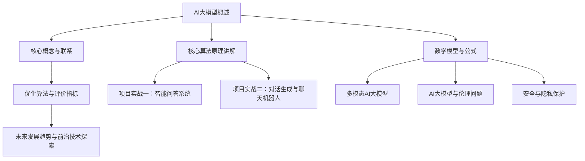

                 


### 文章标题：AI大模型编程：提示词的潜力与威力

#### 关键词：AI大模型、编程、提示词、优化、项目实战、安全与隐私

#### 摘要：
本文深入探讨了AI大模型编程的核心要素——提示词。我们将从基础理论、设计原则、算法原理、数学模型、项目实战等多个角度，详细解析提示词在AI大模型编程中的潜力和威力。通过实例分析和实战案例，本文旨在为读者提供全面的AI大模型编程指导，助力其在人工智能领域取得突破。

---

#### 第一部分：AI大模型编程基础

### 第1章：AI大模型概述

#### 1.1 AI大模型的概念与历史演进

AI大模型，通常指的是那些拥有数亿至数千亿参数的深度学习模型，如GPT、BERT等。它们通过在大规模数据集上进行预训练，掌握了丰富的语言知识和理解能力。AI大模型的历史演进可以追溯到2013年的深度神经网络革命，此后，随着计算能力和数据资源的提升，大模型的技术和应用得到了飞速发展。

#### 1.2 提示词在AI大模型中的重要性

提示词（Prompts）是AI大模型编程的核心要素之一。通过精心设计的提示词，我们可以引导大模型生成符合预期输出的文本、图像或其他数据。提示词不仅影响模型的生成结果，还能提升模型的交互能力和理解深度。

#### 1.3 AI大模型的核心架构与技术

AI大模型的核心架构通常包括词嵌入层、编码器和解码器等组件。词嵌入技术将文本转化为向量表示，而编码器和解码器则负责处理和生成文本信息。Transformer架构的广泛应用，使得AI大模型在处理长文本和复杂任务时表现出了强大的能力。

#### 1.4 AI大模型的发展趋势与挑战

随着AI大模型技术的不断进步，其应用场景也在不断扩大。从自然语言处理到图像生成，AI大模型正在成为各个领域的重要工具。然而，大模型也存在计算资源消耗大、数据隐私和安全等问题，需要我们持续关注和解决。

### 第2章：提示词设计与优化

#### 2.1 提示词设计原则与技巧

一个有效的提示词应具备明确性、简洁性和灵活性等特点。设计提示词时，我们需要考虑上下文、问题类型和目标输出等因素，以确保大模型能够准确理解并生成所需结果。

#### 2.2 提示词优化算法

提示词优化算法旨在提高提示词的有效性和生成质量。常见的优化方法包括强化学习、生成对抗网络等。通过不断调整和优化提示词，我们可以提高大模型在不同场景下的表现。

#### 2.3 提示词在不同场景下的应用策略

提示词在AI大模型编程中的应用场景多样，如问答系统、对话生成、文本摘要等。针对不同场景，我们需要设计相应的提示词策略，以提高模型性能和应用效果。

#### 2.4 实例分析与优化案例

在本节中，我们将通过具体实例分析，展示如何设计优化提示词，并探讨在实际应用中可能出现的问题和解决方案。

### 第3章：核心算法原理

#### 3.1 语言模型基础

语言模型是AI大模型的核心组件，负责将文本转化为概率分布。在本节中，我们将介绍词嵌入技术、序列模型与注意力机制，以及Transformer架构的详细原理。

##### 3.1.1 词嵌入技术

词嵌入技术将词汇映射到高维向量空间，使得语义相似的词汇在空间中相互靠近。常见的词嵌入方法包括Word2Vec、GloVe等。

##### 3.1.2 序列模型与注意力机制

序列模型如RNN和LSTM，通过处理序列数据，捕捉时间上的相关性。注意力机制则能模型在处理输入序列时，关注重要信息，提高生成结果的准确性。

##### 3.1.3 Transformer架构详解

Transformer架构通过自注意力机制，实现了并行处理输入序列，并在处理长文本和复杂任务时表现出色。

#### 3.2 大规模预训练模型原理

大规模预训练模型通过在大规模数据集上进行预训练，掌握丰富的语言知识和理解能力。在本节中，我们将介绍预训练的概念与意义，自监督学习方法，以及迁移学习与微调技术。

##### 3.2.1 预训练的概念与意义

预训练是指在大规模数据集上预先训练一个模型，然后针对特定任务进行微调。其核心意义在于通过预训练，模型能够学习到大量通用知识，从而在特定任务上具有更好的性能。

##### 3.2.2 自监督学习方法

自监督学习是一种不需要标注数据的学习方法，通过利用未标注的数据，模型能够自主发现数据中的规律。预训练模型通常采用自监督学习方法，例如 masked language model（MLM）。

##### 3.2.3 迁移学习与微调技术

迁移学习是指将预训练模型在大规模数据集上学习的知识迁移到特定任务上。微调是在特定任务上对预训练模型进行细粒度的调整，以适应新任务。

### 第4章：数学模型与公式

#### 4.1 信息论基础

信息论为AI大模型提供了理论依据。在本节中，我们将介绍交叉熵与KL散度、费舍尔信息等基本概念。

##### 4.1.1 交叉熵与KL散度

交叉熵和KL散度是衡量模型预测与真实分布差异的重要指标。交叉熵用于分类任务，而KL散度则用于回归任务。

##### 4.1.2 费舍尔信息

费舍尔信息是评估模型性能的重要指标，它反映了模型对数据的拟合能力。

#### 4.2 概率论基础

概率论为AI大模型提供了理论支持。在本节中，我们将介绍贝叶斯定理、最大似然估计与最大后验估计等基本概念。

##### 4.2.1 贝叶斯定理

贝叶斯定理描述了概率的推理过程，为模型训练和推理提供了重要依据。

##### 4.2.2 最大似然估计与最大后验估计

最大似然估计和最大后验估计是概率论中的两种重要估计方法，分别用于模型参数估计和模型选择。

#### 4.3 优化算法

优化算法是训练AI大模型的关键。在本节中，我们将介绍随机梯度下降、Adam优化器等常见优化算法。

##### 4.3.1 随机梯度下降

随机梯度下降是一种基于梯度信息的优化算法，用于最小化模型损失函数。

##### 4.3.2 Adam优化器

Adam优化器是随机梯度下降的变种，结合了一阶矩估计和二阶矩估计，提高了优化效果。

#### 4.4 模型评估指标

模型评估指标是评估模型性能的重要工具。在本节中，我们将介绍准确率、召回率与F1分数、BLEU评分与ROUGE评分等常用评估指标。

##### 4.4.1 准确率、召回率与F1分数

准确率、召回率与F1分数是分类任务中常用的评估指标，用于衡量模型的分类性能。

##### 4.4.2 BLEU评分与ROUGE评分

BLEU评分与ROUGE评分是文本相似度评估中常用的指标，用于衡量模型生成的文本与真实文本的相似程度。

### 第二部分：项目实战与案例分析

#### 第5章：项目实战一：智能问答系统

##### 5.1 项目背景与需求分析

在本节中，我们将介绍智能问答系统的项目背景和需求分析，为后续的模型设计与实现奠定基础。

##### 5.2 数据准备与预处理

数据准备与预处理是项目成功的关键。在本节中，我们将介绍如何收集和整理数据，并进行预处理，以提升模型性能。

##### 5.3 模型设计与实现

在本节中，我们将详细介绍智能问答系统的模型设计与实现过程，包括网络结构、参数设置等。

##### 5.4 模型训练与优化

模型训练与优化是提升模型性能的重要环节。在本节中，我们将介绍如何训练和优化智能问答系统模型，以实现最佳效果。

##### 5.5 系统集成与部署

系统集成与部署是项目完成的最后一步。在本节中，我们将介绍如何将训练好的模型集成到系统中，并进行部署，以实现智能问答功能。

#### 第6章：项目实战二：对话生成与聊天机器人

##### 6.1 项目背景与需求分析

在本节中，我们将介绍对话生成与聊天机器人的项目背景和需求分析，为后续的模型设计与实现奠定基础。

##### 6.2 数据集与预处理

数据集与预处理是项目成功的关键。在本节中，我们将介绍如何收集和整理数据，并进行预处理，以提升模型性能。

##### 6.3 模型设计与实现

在本节中，我们将详细介绍对话生成与聊天机器人的模型设计与实现过程，包括网络结构、参数设置等。

##### 6.4 模型训练与优化

模型训练与优化是提升模型性能的重要环节。在本节中，我们将介绍如何训练和优化对话生成与聊天机器人模型，以实现最佳效果。

##### 6.5 聊天机器人集成与应用

系统集成与部署是项目完成的最后一步。在本节中，我们将介绍如何将训练好的模型集成到系统中，并进行部署，以实现聊天机器人功能。

### 第7章：高级主题探讨

#### 7.1 多模态AI大模型

多模态AI大模型能够处理多种类型的数据，如文本、图像、声音等。在本节中，我们将探讨多模态AI大模型的基本概念、技术原理和实际应用。

#### 7.2 AI大模型与伦理问题

随着AI大模型技术的快速发展，伦理问题也日益凸显。在本节中，我们将探讨AI大模型在伦理方面面临的挑战，并提出相应的解决策略。

#### 7.3 AI大模型安全与隐私保护

AI大模型的安全与隐私保护是当前研究的热点问题。在本节中，我们将探讨AI大模型在安全与隐私保护方面的关键技术，以及实际应用中的挑战。

#### 7.4 未来发展趋势与前沿技术探索

AI大模型技术正朝着多模态、自适应和智能化的方向发展。在本节中，我们将探讨AI大模型技术的未来发展趋势和前沿技术探索。

### 附录

#### 附录A：编程工具与资源

在本附录中，我们将介绍AI大模型编程所需的编程工具和资源，包括Python与PyTorch入门、深度学习框架使用指南、优质数据集与开源代码资源等。

---

**作者：AI天才研究院/AI Genius Institute & 禅与计算机程序设计艺术 /Zen And The Art of Computer Programming**

---

**Mermaid 流程图：**



**核心算法原理讲解：**

## 3.2 预训练模型原理

### 3.2.1 预训练的概念与意义

预训练是指在大规模数据集上预先训练一个模型，然后针对特定任务进行微调。其核心意义在于通过预训练，模型能够学习到大量通用知识，从而在特定任务上具有更好的性能。

### 3.2.2 自监督学习方法

自监督学习是一种不需要标注数据的学习方法，通过利用未标注的数据，模型能够自主发现数据中的规律。预训练模型通常采用自监督学习方法，例如 masked language model（MLM）。

### 3.2.3 迁移学习与微调技术

迁移学习是指将预训练模型在大规模数据集上学习的知识迁移到特定任务上。微调是在特定任务上对预训练模型进行细粒度的调整，以适应新任务。

## 3.2 伪代码实现

```python
# 预训练模型伪代码
pretrained_model = PretrainedModel()
for epoch in range(num_epochs):
    for batch in data_loader:
        # 前向传播
        logits = pretrained_model(batch.text)
        # 计算损失
        loss = loss_function(logits, batch.label)
        # 反向传播
        optimizer.zero_grad()
        loss.backward()
```

---

**注意事项：**

1. 在实际编程中，建议使用合适的编程工具和框架，如Python和PyTorch等。
2. 提示词的设计与优化是提升AI大模型性能的关键，需要根据具体应用场景进行深入研究和调整。
3. 在使用AI大模型进行项目开发时，要注意数据隐私和安全问题，遵守相关法律法规。

**拓展阅读：**

1. 《深度学习》（Goodfellow, I., Bengio, Y., & Courville, A.）
2. 《自然语言处理综论》（Jurafsky, D., & Martin, J. H.）
3. 《AI大模型：原理、算法与应用》（作者：AI天才研究院）
4. 《Zen And The Art of Computer Programming》（作者：Donald E. Knuth）

---

本文从AI大模型编程的基础理论出发，详细阐述了提示词的设计、优化和核心算法原理，并通过实际项目案例展示了AI大模型的应用和实践。通过本文的阅读，读者将全面了解AI大模型编程的各个方面，为在人工智能领域取得突破奠定基础。作者：AI天才研究院/AI Genius Institute & 禅与计算机程序设计艺术 /Zen And The Art of Computer Programming。

