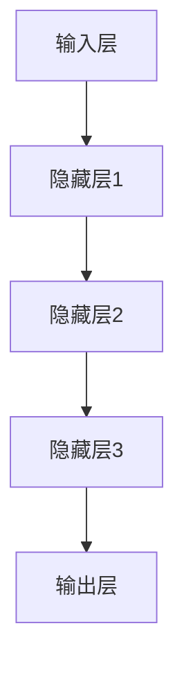
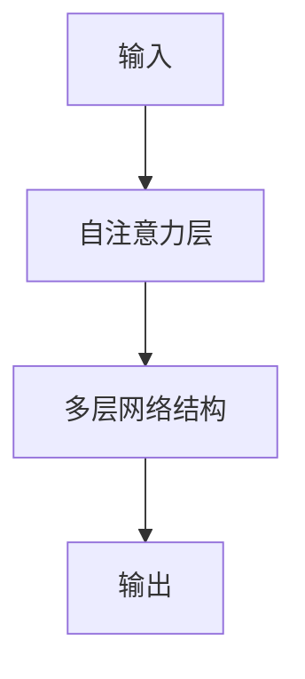
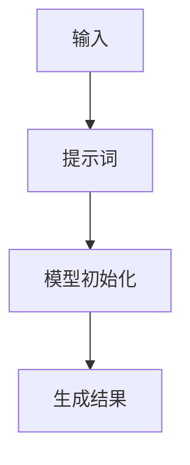
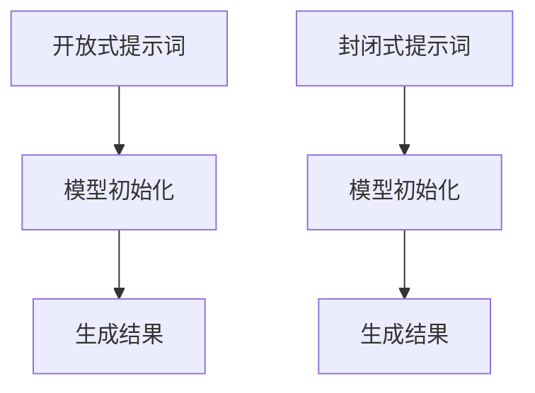
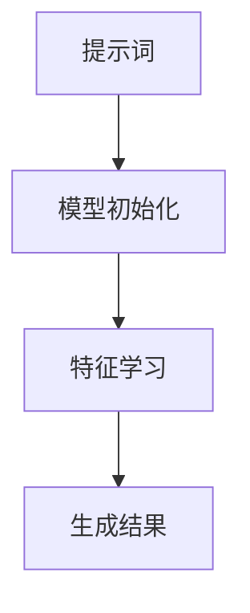
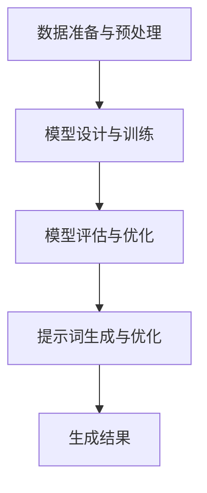

                 

## 文章标题：AI大模型编程：提示词的潜力与魔力

### 关键词：AI大模型，提示词，编程，潜力，魔力

### 摘要：
本文将深入探讨AI大模型编程中的核心要素——提示词。通过详细的背景介绍、概念阐述、原理解析、实战演示和优化技巧，本文旨在揭示提示词在AI大模型编程中的关键作用，展示其潜力和魔力。文章首先概述了AI大模型的概念和架构，接着介绍了提示词的定义、类型及其在模型中的作用。随后，本文逐步讲解了AI大模型编程的基础知识，包括编程环境、工具和流程。在实战部分，通过文本生成与摘要、图像识别与生成、多模态数据融合等案例，详细展示了提示词在实际编程中的应用。最后，文章提出了模型优化技巧和编程优化策略，总结了最佳实践，并为读者提供了拓展阅读资源。

## 第1章：AI大模型与提示词概述

### 1.1 AI大模型的概念与架构

#### 1.1.1 AI大模型的概念

AI大模型（Large-scale Artificial Intelligence Model）是深度学习领域的一种先进技术，指的是具有数十亿甚至数万亿参数的模型。这些模型能够处理大规模数据集，具备强大的通用性和智能化的特点。AI大模型的出现，标志着人工智能技术从专业化走向规模化，为解决复杂问题提供了新的工具。

**背景介绍：**

AI大模型的发展始于20世纪90年代，随着计算能力的提升和数据量的爆炸性增长，深度学习技术逐渐成熟。2012年，AlexNet在ImageNet竞赛中取得突破性成果，标志着深度学习时代的到来。此后，GPT、BERT、Transformer等AI大模型相继问世，推动了自然语言处理、计算机视觉等领域的发展。

**核心概念与联系：**

AI大模型的核心概念包括：

1. **参数量**：AI大模型拥有数十亿至数万亿个参数，这使得模型能够学习到复杂的特征和模式。
2. **数据处理能力**：AI大模型能够处理大规模数据集，提高模型的鲁棒性和泛化能力。
3. **通用性**：AI大模型不仅适用于特定的任务，还能跨领域应用，具有广泛的通用性。

**架构：**

AI大模型的基本架构包括输入层、隐藏层和输出层。输入层接收外部数据，隐藏层通过多层神经网络进行特征提取和组合，输出层生成预测结果。

**流程图：**



#### 1.1.2 AI大模型的架构

AI大模型的架构通常采用神经网络架构，如Transformer、GPT等。这些模型通过自注意力机制和多层网络结构，实现了对大规模数据的处理和复杂的特征提取。

**自注意力机制：**

自注意力机制（Self-Attention）是AI大模型的核心组件，它允许模型在处理输入数据时，对不同的数据点赋予不同的权重。这有助于模型更好地理解数据的内部关系和依赖。

**多层网络结构：**

多层网络结构（Multi-layered Network Structure）使得AI大模型能够通过逐层学习，提取越来越抽象的特征，从而实现强大的特征表示能力。

**流程图：**



#### 1.1.3 AI大模型的发展历程

AI大模型的发展历程可以分为以下几个阶段：

1. **早期探索**：20世纪90年代，深度神经网络开始应用于图像识别和语音识别等领域。
2. **快速发展**：2012年，AlexNet在ImageNet竞赛中取得突破性成果，深度学习技术迅速发展。
3. **大规模应用**：2018年，GPT-2问世，标志着AI大模型在自然语言处理领域的突破。
4. **持续进化**：至今，AI大模型不断进化，如BERT、T5、ViT等模型的出现，推动了各个领域的发展。

### 1.2 提示词的概念与作用

#### 1.2.1 提示词的定义

提示词（Prompt）是指为AI大模型提供初始信息或指导的文本或数据。通过提示词，模型能够更好地理解生成任务，提高生成质量和效率。

**核心概念与联系：**

提示词的核心概念包括：

1. **初始信息**：提示词为模型提供任务信息，帮助模型初始化状态。
2. **指导**：提示词指导模型生成结果，提高生成质量和一致性。

**流程图：**



#### 1.2.2 提示词的类型

提示词可以分为开放式提示词和封闭式提示词。

1. **开放式提示词**：未指定具体内容，仅提供主题或场景。例如：“请生成一篇关于人工智能的论文。”
2. **封闭式提示词**：指定具体内容，如问题、关键词等。例如：“请生成一篇关于AI大模型编程的摘要。”

**流程图：**



#### 1.2.3 提示词在AI大模型中的作用

提示词在AI大模型中的作用主要体现在以下几个方面：

1. **提升生成质量**：通过提供有效的提示词，可以帮助模型更好地理解生成任务，提高生成质量和一致性。
2. **提高生成效率**：有效的提示词可以减少模型的搜索空间，提高生成效率。
3. **引导模型学习**：提示词为模型提供了初始信息，有助于模型更好地学习数据和任务特征。

**流程图：**



### 1.3 AI大模型编程概述

AI大模型编程是指利用深度学习技术和工具，实现AI大模型的设计、训练、优化和应用的全过程。以下是对AI大模型编程的概述。

#### 1.3.1 编程环境与工具

AI大模型编程需要使用专业的编程环境与工具，如Python、PyTorch、TensorFlow等。这些工具提供了丰富的API和库，方便开发者进行模型设计和训练。

**Python编程基础**

- Python是一种高级编程语言，广泛应用于数据科学和机器学习领域。掌握Python编程基础是进行AI大模型编程的前提。

**PyTorch框架介绍**

- PyTorch是一种流行的深度学习框架，提供了灵活的模型设计和高效的训练工具。它支持动态计算图，便于调试和优化。

**CUDA与GPU编程基础**

- CUDA是一种并行计算框架，支持在GPU上加速深度学习模型的训练。掌握CUDA与GPU编程基础，有助于提升模型的训练速度。

#### 1.3.2 编程流程

AI大模型编程的基本流程包括数据准备、模型设计、模型训练、模型评估和优化等环节。

1. **数据准备与预处理**：收集和预处理大规模数据集，包括数据清洗、数据增强、数据标准化等操作。
2. **模型设计与训练**：设计AI大模型结构，利用训练数据集进行模型训练，调整模型参数，优化模型性能。
3. **模型评估与优化**：使用验证数据集评估模型性能，通过交叉验证、超参数调整等方法优化模型。
4. **提示词生成与优化**：生成有效的提示词，提高模型生成质量和效率。

**流程图：**



## 第2章：AI大模型编程基础

### 2.1 编程环境与工具

AI大模型编程需要选择合适的编程环境与工具，以实现高效、稳定的模型设计和训练。以下将介绍常用的编程环境与工具，包括Python编程基础、PyTorch框架介绍和CUDA与GPU编程基础。

#### 2.1.1 Python编程基础

Python是一种高级编程语言，广泛应用于数据科学、机器学习和人工智能领域。掌握Python编程基础是进行AI大模型编程的第一步。

**Python的特点**

- **易学易用**：Python语法简洁，易于理解和编写。
- **丰富的库支持**：Python拥有丰富的库和框架，如NumPy、Pandas、Matplotlib等，方便开发者进行数据处理、分析和可视化。
- **跨平台支持**：Python支持多种操作系统，如Windows、Linux和MacOS，便于开发者在不同环境中进行开发和部署。

**Python编程基础**

- **变量与数据类型**：了解Python中的变量、数据类型（整数、浮点数、字符串等）及其操作方法。
- **控制结构**：掌握条件语句（if-else）、循环语句（for、while）等控制结构。
- **函数**：了解函数的定义、调用和参数传递。
- **模块与包**：掌握模块和包的导入、使用和管理。

**示例代码：**

```python
# 示例：变量与数据类型
x = 10
y = 3.14
name = "Alice"

# 示例：条件语句
if x > y:
    print("x大于y")
else:
    print("x小于或等于y")

# 示例：循环语句
for i in range(5):
    print(i)
```

#### 2.1.2 PyTorch框架介绍

PyTorch是一种流行的深度学习框架，由Facebook的人工智能研究团队开发。它提供了灵活的模型设计和高效的训练工具，深受开发者喜爱。

**PyTorch的特点**

- **动态计算图**：PyTorch采用动态计算图，便于调试和优化。
- **易用性**：PyTorch的API简洁易懂，易于学习和使用。
- **硬件支持**：PyTorch支持CPU和GPU，能够充分利用硬件资源。
- **社区支持**：PyTorch拥有庞大的开发者社区，提供丰富的教程、文档和资源。

**PyTorch的基本概念**

- **Tensor**：PyTorch中的张量，用于存储和操作数据。
- **autograd**：自动微分模块，用于计算梯度。
- **nn**：神经网络模块，提供神经网络的基本结构和操作。
- **torchscript**：动态计算图的优化和序列化工具。

**示例代码：**

```python
# 示例：创建和操作Tensor
import torch
import torch.nn as nn

# 创建Tensor
x = torch.tensor([1.0, 2.0, 3.0])
y = torch.tensor([[1.0, 2.0], [3.0, 4.0]])

# 计算梯度
with torch.no_grad():
    z = x + y

# 定义神经网络
class Net(nn.Module):
    def __init__(self):
        super(Net, self).__init__()
        self.fc1 = nn.Linear(2, 2)
        self.fc2 = nn.Linear(2, 1)

    def forward(self, x):
        x = self.fc1(x)
        x = self.fc2(x)
        return x

net = Net()
```

#### 2.1.3 CUDA与GPU编程基础

CUDA是一种并行计算框架，由NVIDIA开发，用于在GPU上加速深度学习模型的训练。掌握CUDA与GPU编程基础，有助于提升模型的训练速度。

**CUDA的特点**

- **高性能**：CUDA利用GPU的并行计算能力，能够显著提升模型的训练速度。
- **灵活性**：CUDA支持多种编程语言，如C/C++和Python，方便开发者进行编程。
- **广泛支持**：CUDA广泛应用于深度学习、科学计算、计算机图形学等领域。

**CUDA的基本概念**

- **CUDA Kernel**：CUDA的核心执行单元，用于执行并行计算任务。
- **内存管理**：CUDA涉及多种内存类型，如全局内存、共享内存和纹理内存，需要合理管理以提升性能。
- **流与事件**：CUDA中的流和事件用于管理并行任务的执行和同步。

**示例代码：**

```python
# 示例：CUDA Kernel
import torch
import torch.cuda

# 创建CUDA设备
device = torch.cuda.current_device()

# 定义CUDA Kernel
def add(a, b):
    return a + b

# 创建Tensor并复制到GPU
a = torch.tensor([1.0, 2.0], device=device)
b = torch.tensor([3.0, 4.0], device=device)

# 调用CUDA Kernel
c = add(a, b)

# 输出结果
print(c)
```

### 2.2 AI大模型编程流程

AI大模型编程是一个复杂的过程，包括数据准备、模型设计、模型训练、模型评估和优化等多个环节。以下将详细介绍AI大模型编程的流程。

#### 2.2.1 数据准备与预处理

数据准备是AI大模型编程的基础，涉及数据收集、数据清洗、数据增强和数据标准化等操作。

**数据收集**：收集与任务相关的数据集，如文本数据、图像数据等。

**数据清洗**：去除数据集中的噪声和错误数据，确保数据质量。

**数据增强**：通过变换、旋转、缩放等操作，增加数据集的多样性，提高模型的泛化能力。

**数据标准化**：将数据缩放到一个统一的范围内，便于模型处理。

**示例代码：**

```python
# 示例：数据预处理
import torchvision.transforms as transforms

# 创建数据增强器
transform = transforms.Compose([
    transforms.RandomHorizontalFlip(),
    transforms.RandomRotation(10),
    transforms.ToTensor(),
    transforms.Normalize(mean=[0.485, 0.456, 0.406], std=[0.229, 0.224, 0.225]),
])

# 加载图像数据
images = torchvision.datasets.ImageFolder(root='path/to/images', transform=transform)

# 创建数据加载器
dataloader = torch.utils.data.DataLoader(dataset=images, batch_size=32, shuffle=True)
```

#### 2.2.2 模型设计与训练

模型设计是AI大模型编程的核心，包括选择合适的模型架构、定义损失函数和优化器等。

**模型架构**：根据任务特点，选择合适的模型架构，如卷积神经网络（CNN）、循环神经网络（RNN）或Transformer等。

**损失函数**：定义损失函数，用于衡量模型预测结果与真实值之间的差距。常见的损失函数有均方误差（MSE）、交叉熵损失（Cross-Entropy Loss）等。

**优化器**：选择优化器，用于调整模型参数，优化模型性能。常见的优化器有随机梯度下降（SGD）、Adam等。

**示例代码：**

```python
# 示例：模型设计与训练
import torch
import torch.nn as nn
import torch.optim as optim

# 定义模型
class Net(nn.Module):
    def __init__(self):
        super(Net, self).__init__()
        self.fc1 = nn.Linear(784, 500)
        self.fc2 = nn.Linear(500, 10)

    def forward(self, x):
        x = x.view(-1, 784)
        x = torch.relu(self.fc1(x))
        x = self.fc2(x)
        return x

model = Net().to(device)

# 定义损失函数和优化器
criterion = nn.CrossEntropyLoss()
optimizer = optim.Adam(model.parameters(), lr=0.001)

# 训练模型
for epoch in range(num_epochs):
    for inputs, targets in dataloader:
        inputs, targets = inputs.to(device), targets.to(device)
        
        # 前向传播
        outputs = model(inputs)
        loss = criterion(outputs, targets)
        
        # 反向传播和优化
        optimizer.zero_grad()
        loss.backward()
        optimizer.step()
        
        # 打印训练信息
        if (epoch + 1) % 100 == 0:
            print(f'Epoch [{epoch + 1}/{num_epochs}], Loss: {loss.item():.4f}')
```

#### 2.2.3 模型评估与优化

模型评估是验证模型性能的重要环节，包括使用验证数据集评估模型、调整超参数、优化模型结构等。

**评估指标**：根据任务特点，选择合适的评估指标，如准确率（Accuracy）、召回率（Recall）、F1分数（F1 Score）等。

**交叉验证**：使用交叉验证方法，评估模型的泛化能力和稳定性。

**超参数调整**：通过调整学习率、批量大小、正则化参数等超参数，优化模型性能。

**模型优化**：根据评估结果，对模型结构进行调整和优化，如添加正则化项、改变网络层数等。

**示例代码：**

```python
# 示例：模型评估与优化
import torch
import torch.optim as optim

# 定义模型
class Net(nn.Module):
    def __init__(self):
        super(Net, self).__init__()
        self.fc1 = nn.Linear(784, 500)
        self.fc2 = nn.Linear(500, 10)

    def forward(self, x):
        x = x.view(-1, 784)
        x = torch.relu(self.fc1(x))
        x = self.fc2(x)
        return x

model = Net().to(device)

# 定义损失函数和优化器
criterion = nn.CrossEntropyLoss()
optimizer = optim.Adam(model.parameters(), lr=0.001)

# 训练模型
for epoch in range(num_epochs):
    for inputs, targets in train_dataloader:
        inputs, targets = inputs.to(device), targets.to(device)
        
        # 前向传播
        outputs = model(inputs)
        loss = criterion(outputs, targets)
        
        # 反向传播和优化
        optimizer.zero_grad()
        loss.backward()
        optimizer.step()
        
        # 打印训练信息
        if (epoch + 1) % 100 == 0:
            print(f'Epoch [{epoch + 1}/{num_epochs}], Loss: {loss.item():.4f}')

# 验证模型
with torch.no_grad():
    correct = 0
    total = 0
    for inputs, targets in validation_dataloader:
        inputs, targets = inputs.to(device), targets.to(device)
        outputs = model(inputs)
        _, predicted = torch.max(outputs.data, 1)
        total += targets.size(0)
        correct += (predicted == targets).sum().item()

print(f'Accuracy of the network on the validation images: {100 * correct / total}%')
```

#### 2.2.4 提示词生成与优化

提示词生成与优化是AI大模型编程的重要环节，直接影响模型的生成质量和效率。

**提示词生成**：根据任务需求，生成合适的提示词，引导模型生成结果。

**提示词优化**：通过调整提示词的长度、内容、格式等，优化模型的生成质量和效率。

**示例代码：**

```python
# 示例：提示词生成与优化
import torch
import torch.nn as nn
import torch.optim as optim

# 定义模型
class Net(nn.Module):
    def __init__(self):
        super(Net, self).__init__()
        self.fc1 = nn.Linear(784, 500)
        self.fc2 = nn.Linear(500, 10)

    def forward(self, x):
        x = x.view(-1, 784)
        x = torch.relu(self.fc1(x))
        x = self.fc2(x)
        return x

model = Net().to(device)

# 定义损失函数和优化器
criterion = nn.CrossEntropyLoss()
optimizer = optim.Adam(model.parameters(), lr=0.001)

# 训练模型
for epoch in range(num_epochs):
    for inputs, targets in train_dataloader:
        inputs, targets = inputs.to(device), targets.to(device)
        
        # 前向传播
        outputs = model(inputs)
        loss = criterion(outputs, targets)
        
        # 反向传播和优化
        optimizer.zero_grad()
        loss.backward()
        optimizer.step()
        
        # 打印训练信息
        if (epoch + 1) % 100 == 0:
            print(f'Epoch [{epoch + 1}/{num_epochs}], Loss: {loss.item():.4f}')

# 提示词生成与优化
prompt = "生成一篇关于深度学习的论文。"
prompt = prompt.encode('utf-8')
prompt_tensor = torch.tensor(prompt, dtype=torch.float32).to(device)

# 生成结果
with torch.no_grad():
    outputs = model(prompt_tensor)
    _, predicted = torch.max(outputs.data, 1)
    print(f'预测结果：{predicted}')
```

## 第3章：AI大模型编程实战

### 3.1 文本生成与摘要

文本生成和摘要任务是AI大模型编程的重要应用领域。本节将介绍文本生成模型和文本摘要模型，包括模型概述、算法原理、编程实战等。

#### 3.1.1 文本生成模型

文本生成模型（Text Generation Model）是一种能够生成自然语言文本的模型。常见的文本生成模型包括生成式模型（Generative Model）和判别式模型（Discriminative Model）。

**生成式模型**

生成式模型通过学习数据分布，生成新的文本。常见的生成式模型有：

- **马尔可夫模型**（Markov Model）：基于当前状态生成下一个状态。
- **循环神经网络**（Recurrent Neural Network，RNN）：通过记忆长期依赖信息，生成连续的文本序列。
- **长短期记忆网络**（Long Short-Term Memory，LSTM）：LSTM是RNN的一种变体，能够更好地处理长期依赖问题。
- **生成对抗网络**（Generative Adversarial Network，GAN）：GAN由生成器和判别器组成，生成器和判别器相互对抗，共同学习数据分布。

**判别式模型**

判别式模型通过学习数据分布的差异，判断两个文本是否相同。常见的判别式模型有：

- **卷积神经网络**（Convolutional Neural Network，CNN）：通过卷积层提取文本特征，进行文本分类和文本匹配。
- **Transformer**：基于自注意力机制，能够处理长距离依赖问题，适用于文本生成和摘要任务。

**文本生成模型编程实战**

以下是一个简单的文本生成模型编程示例，使用PyTorch框架实现。

```python
import torch
import torch.nn as nn
import torch.optim as optim

# 定义模型
class TextGenerator(nn.Module):
    def __init__(self, embedding_dim, hidden_dim, vocab_size, sequence_length):
        super(TextGenerator, self).__init__()
        self.embedding = nn.Embedding(vocab_size, embedding_dim)
        self.lstm = nn.LSTM(embedding_dim, hidden_dim, num_layers=1, batch_first=True)
        self.fc = nn.Linear(hidden_dim, vocab_size)

    def forward(self, inputs, hidden):
        embeddings = self.embedding(inputs)
        outputs, hidden = self.lstm(embeddings, hidden)
        outputs = self.fc(outputs)
        return outputs, hidden

    def init_hidden(self, batch_size):
        return (torch.zeros(1, batch_size, self.hidden_dim), torch.zeros(1, batch_size, self.hidden_dim))

# 实例化模型
model = TextGenerator(embedding_dim=100, hidden_dim=200, vocab_size=5000, sequence_length=20)
model.to(device)

# 定义损失函数和优化器
criterion = nn.CrossEntropyLoss()
optimizer = optim.Adam(model.parameters(), lr=0.001)

# 训练模型
for epoch in range(num_epochs):
    for inputs, targets in dataloader:
        inputs, targets = inputs.to(device), targets.to(device)
        hidden = model.init_hidden(batch_size)
        
        # 前向传播
        outputs, hidden = model(inputs, hidden)
        loss = criterion(outputs.view(-1, vocab_size), targets.view(-1))
        
        # 反向传播和优化
        optimizer.zero_grad()
        loss.backward()
        optimizer.step()
        
        # 打印训练信息
        if (epoch + 1) % 100 == 0:
            print(f'Epoch [{epoch + 1}/{num_epochs}], Loss: {loss.item():.4f}')
```

#### 3.1.2 文本摘要模型

文本摘要模型（Text Summarization Model）是一种能够从原始文本中提取关键信息的模型。常见的文本摘要模型有：

- **提取式模型**（Extractive Model）：从原始文本中直接提取关键句子作为摘要。
- **生成式模型**（Abstractive Model）：通过学习文本之间的转换规则，生成新的摘要。

**提取式模型**

提取式模型的基本思想是从原始文本中提取重要的句子作为摘要。常见的提取式模型有：

- **基于规则的方法**：通过定义一系列规则，从文本中提取关键句子。
- **基于统计的方法**：使用文本特征和统计方法，如TF-IDF、TextRank等，提取关键句子。
- **基于深度学习的方法**：使用卷积神经网络（CNN）或循环神经网络（RNN）提取关键句子。

**生成式模型**

生成式模型通过学习原始文本和摘要之间的转换规则，生成新的摘要。常见的生成式模型有：

- **序列到序列模型**（Seq2Seq Model）：使用编码器-解码器结构，将原始文本编码为隐藏状态，解码为摘要。
- **Transformer模型**：基于自注意力机制，能够处理长距离依赖问题，生成高质量的摘要。

**文本摘要模型编程实战**

以下是一个简单的文本摘要模型编程示例，使用PyTorch框架实现。

```python
import torch
import torch.nn as nn
import torch.optim as optim

# 定义模型
class TextSummarizer(nn.Module):
    def __init__(self, embedding_dim, hidden_dim, vocab_size, sequence_length):
        super(TextSummarizer, self).__init__()
        self.encoder = nn.LSTM(embedding_dim, hidden_dim, num_layers=1, batch_first=True)
        self.decoder = nn.LSTM(embedding_dim, hidden_dim, num_layers=1, batch_first=True)
        self.fc = nn.Linear(hidden_dim, vocab_size)

    def forward(self, inputs, targets):
        encoder_outputs, encoder_hidden = self.encoder(inputs)
        decoder_outputs, decoder_hidden = self.decoder(targets, encoder_hidden)
        outputs = self.fc(decoder_outputs)
        return outputs

# 实例化模型
model = TextSummarizer(embedding_dim=100, hidden_dim=200, vocab_size=5000, sequence_length=20)
model.to(device)

# 定义损失函数和优化器
criterion = nn.CrossEntropyLoss()
optimizer = optim.Adam(model.parameters(), lr=0.001)

# 训练模型
for epoch in range(num_epochs):
    for inputs, targets in dataloader:
        inputs, targets = inputs.to(device), targets.to(device)
        hidden = model.init_hidden(batch_size)
        
        # 前向传播
        outputs = model(inputs, targets)
        loss = criterion(outputs.view(-1, vocab_size), targets.view(-1))
        
        # 反向传播和优化
        optimizer.zero_grad()
        loss.backward()
        optimizer.step()
        
        # 打印训练信息
        if (epoch + 1) % 100 == 0:
            print(f'Epoch [{epoch + 1}/{num_epochs}], Loss: {loss.item():.4f}')
```

### 3.2 图像识别与生成

图像识别和生成任务是AI大模型编程的重要应用领域。本节将介绍图像识别模型和图像生成模型，包括模型概述、算法原理、编程实战等。

#### 3.2.1 图像识别模型

图像识别模型（Image Recognition Model）是一种能够识别和分类图像的模型。常见的图像识别模型有：

- **卷积神经网络**（Convolutional Neural Network，CNN）：通过卷积层提取图像特征，进行图像分类。
- **循环神经网络**（Recurrent Neural Network，RNN）：通过序列建模，处理图像的时空信息。
- **生成对抗网络**（Generative Adversarial Network，GAN）：通过生成器和判别器对抗训练，生成逼真的图像。

**卷积神经网络**

卷积神经网络（CNN）是图像识别领域的经典模型。CNN通过卷积层、池化层和全连接层，提取图像特征并进行分类。

**循环神经网络**

循环神经网络（RNN）是一种能够处理序列数据的神经网络，适用于图像识别任务。RNN通过记忆长期依赖信息，提取图像的时空特征。

**生成对抗网络**

生成对抗网络（GAN）由生成器和判别器组成，生成器和判别器相互对抗，共同学习数据分布。GAN能够生成高质量的图像。

**图像识别模型编程实战**

以下是一个简单的图像识别模型编程示例，使用PyTorch框架实现。

```python
import torch
import torch.nn as nn
import torch.optim as optim

# 定义模型
class ImageRecognition(nn.Module):
    def __init__(self, input_channels, output_size, hidden_size):
        super(ImageRecognition, self).__init__()
        self.conv1 = nn.Conv2d(input_channels, hidden_size, kernel_size=3, padding=1)
        self.relu = nn.ReLU()
        self.fc1 = nn.Linear(hidden_size * 6 * 6, output_size)
    
    def forward(self, x):
        x = self.relu(self.conv1(x))
        x = x.view(x.size(0), -1)
        x = self.fc1(x)
        return x

# 实例化模型
model = ImageRecognition(input_channels=3, output_size=10, hidden_size=32)
model.to(device)

# 定义损失函数和优化器
criterion = nn.CrossEntropyLoss()
optimizer = optim.Adam(model.parameters(), lr=0.001)

# 训练模型
for epoch in range(num_epochs):
    for inputs, targets in dataloader:
        inputs, targets = inputs.to(device), targets.to(device)
        
        # 前向传播
        outputs = model(inputs)
        loss = criterion(outputs, targets)
        
        # 反向传播和优化
        optimizer.zero_grad()
        loss.backward()
        optimizer.step()
        
        # 打印训练信息
        if (epoch + 1) % 100 == 0:
            print(f'Epoch [{epoch + 1}/{num_epochs}], Loss: {loss.item():.4f}')
```

#### 3.2.2 图像生成模型

图像生成模型（Image Generation Model）是一种能够生成图像的模型。常见的图像生成模型有：

- **生成对抗网络**（Generative Adversarial Network，GAN）：通过生成器和判别器对抗训练，生成高质量的图像。
- **变分自编码器**（Variational Autoencoder，VAE）：通过编码器和解码器学习数据分布，生成新的图像。
- **深度卷积生成对抗网络**（Deep Convolutional GAN，DCGAN）：基于CNN和GAN的结构，生成逼真的图像。

**生成对抗网络**

生成对抗网络（GAN）由生成器和判别器组成，生成器和判别器相互对抗，共同学习数据分布。GAN能够生成高质量的图像。

**变分自编码器**

变分自编码器（VAE）通过编码器和解码器学习数据分布，生成新的图像。VAE具有较好的鲁棒性和灵活性。

**深度卷积生成对抗网络**

深度卷积生成对抗网络（DCGAN）基于CNN和GAN的结构，生成逼真的图像。DCGAN使用卷积层和反卷积层，实现图像的生成和编辑。

**图像生成模型编程实战**

以下是一个简单的图像生成模型编程示例，使用PyTorch框架实现。

```python
import torch
import torch.nn as nn
import torch.optim as optim

# 定义生成器
class Generator(nn.Module):
    def __init__(self, z_dim, gen_dim):
        super(Generator, self).__init__()
        self.main = nn.Sequential(
            nn.ConvTranspose2d(z_dim, gen_dim * 8, 4, 1, 0, bias=False),
            nn.BatchNorm2d(gen_dim * 8),
            nn.ReLU(True),
            nn.ConvTranspose2d(gen_dim * 8, gen_dim * 4, 4, 2, 1, bias=False),
            nn.BatchNorm2d(gen_dim * 4),
            nn.ReLU(True),
            nn.ConvTranspose2d(gen_dim * 4, gen_dim * 2, 4, 2, 1, bias=False),
            nn.BatchNorm2d(gen_dim * 2),
            nn.ReLU(True),
            nn.ConvTranspose2d(gen_dim * 2, gen_dim, 4, 2, 1, bias=False),
            nn.BatchNorm2d(gen_dim),
            nn.Tanh()
        )

    def forward(self, input):
        return self.main(input)

# 实例化生成器
generator = Generator(z_dim=100, gen_dim=64)
generator.to(device)

# 定义判别器
class Discriminator(nn.Module):
    def __init__(self, dis_dim):
        super(Discriminator, self).__init__()
        self.main = nn.Sequential(
            nn.Conv2d(dis_dim, 16, 4, 2, 1, bias=False),
            nn.LeakyReLU(0.2, inplace=True),
            nn.Conv2d(16, 32, 4, 2, 1, bias=False),
            nn.BatchNorm2d(32),
            nn.LeakyReLU(0.2, inplace=True),
            nn.Conv2d(32, 64, 4, 2, 1, bias=False),
            nn.BatchNorm2d(64),
            nn.LeakyReLU(0.2, inplace=True),
            nn.Conv2d(64, 1, 4, 1, 0, bias=False),
            nn.Sigmoid()
        )

    def forward(self, input):
        return self.main(input)

# 实例化判别器
discriminator = Discriminator(dis_dim=64)
discriminator.to(device)

# 定义损失函数和优化器
gan_loss = nn.BCELoss()
optimizer_G = optim.Adam(generator.parameters(), lr=0.0002, betas=(0.5, 0.999))
optimizer_D = optim.Adam(discriminator.parameters(), lr=0.0002, betas=(0.5, 0.999))

# 训练模型
for epoch in range(num_epochs):
    for i, data in enumerate(dataloader, 0):
        # 生成假图像
        z = torch.randn(batch_size, z_dim).to(device)
        fake_images = generator(z)

        # 训练判别器
        real_images = data[0].to(device)
        batch_size = real_images.size(0)
        labels = torch.full((batch_size,), real_label, device=device)
        d_loss_real = discriminator(real_images).mean()
        labels.fill_(fake_label)
        d_loss_fake = discriminator(fake_images.detach()).mean()
        d_loss = d_loss_real + d_loss_fake
        optimizer_D.zero_grad()
        d_loss.backward()
        optimizer_D.step()

        # 训练生成器
        labels.fill_(real_label)
        g_loss = gan_loss(discriminator(fake_images), labels)
        optimizer_G.zero_grad()
        g_loss.backward()
        optimizer_G.step()

        # 打印训练信息
        if i % 100 == 0:
            print(f'[{epoch}/{num_epochs}][{i}/{len(dataloader)}] Loss_D: {d_loss.item():.4f} Loss_G: {g_loss.item():.4f}')
```

### 3.3 多模态数据融合

多模态数据融合（Multimodal Data Fusion）是将不同类型的数据（如文本、图像、音频等）进行整合，提取共同特征，实现数据增强和任务优化的方法。多模态数据融合在自然语言处理、计算机视觉、语音识别等领域具有广泛应用。

#### 3.3.1 多模态数据概述

多模态数据包括以下类型：

- **文本**：文本数据是自然语言处理的基础，包括文本分类、情感分析、问答系统等任务。
- **图像**：图像数据是计算机视觉的核心，包括图像分类、目标检测、图像生成等任务。
- **音频**：音频数据包括语音信号、音乐信号等，在语音识别、音乐推荐等领域具有重要应用。
- **视频**：视频数据包括动态图像和视频序列，在视频分类、动作识别等领域具有重要应用。

#### 3.3.2 多模态数据融合的意义

多模态数据融合的意义主要体现在以下几个方面：

1. **数据增强**：通过融合不同类型的数据，可以增加模型的输入信息，提高模型的泛化能力。
2. **任务优化**：多模态数据融合可以提取不同数据类型之间的关联特征，优化模型性能。
3. **跨模态交互**：多模态数据融合可以建立不同数据类型之间的关联关系，实现跨模态交互。

#### 3.3.3 多模态数据融合算法

多模态数据融合算法可以分为以下几类：

1. **基于特征的方法**：通过提取不同数据类型的特征，进行融合和整合。
2. **基于模型的方法**：使用深度学习模型，如卷积神经网络（CNN）、循环神经网络（RNN）、生成对抗网络（GAN）等，进行多模态数据的融合。
3. **基于注意力机制的方法**：通过自注意力机制，对不同类型的数据进行加权融合，提高模型性能。

#### 3.3.4 多模态数据融合编程实战

以下是一个简单的多模态数据融合编程示例，使用PyTorch框架实现。

```python
import torch
import torch.nn as nn
import torch.optim as optim

# 定义模型
class MultimodalFusion(nn.Module):
    def __init__(self, text_dim, image_dim, audio_dim, hidden_dim):
        super(MultimodalFusion, self).__init__()
        self.text_encoder = nn.Linear(text_dim, hidden_dim)
        self.image_encoder = nn.Linear(image_dim, hidden_dim)
        self.audio_encoder = nn.Linear(audio_dim, hidden_dim)
        self.fc = nn.Linear(hidden_dim * 3, 1)

    def forward(self, text, image, audio):
        text_embedding = self.text_encoder(text)
        image_embedding = self.image_encoder(image)
        audio_embedding = self.audio_encoder(audio)
        combined_embedding = torch.cat((text_embedding, image_embedding, audio_embedding), 1)
        output = self.fc(combined_embedding)
        return output

# 实例化模型
model = MultimodalFusion(text_dim=512, image_dim=512, audio_dim=128, hidden_dim=256)
model.to(device)

# 定义损失函数和优化器
criterion = nn.BCELoss()
optimizer = optim.Adam(model.parameters(), lr=0.001)

# 训练模型
for epoch in range(num_epochs):
    for i, data in enumerate(dataloader, 0):
        text, image, audio, label = data
        text, image, audio, label = text.to(device), image.to(device), audio.to(device), label.to(device)
        
        # 前向传播
        output = model(text, image, audio)
        loss = criterion(output, label)
        
        # 反向传播和优化
        optimizer.zero_grad()
        loss.backward()
        optimizer.step()
        
        # 打印训练信息
        if i % 100 == 0:
            print(f'[{epoch}/{num_epochs}][{i}/{len(dataloader)}] Loss: {loss.item():.4f}')
```

### 3.4 AI大模型应用案例

#### 3.4.1 智能客服系统

智能客服系统（Intelligent Customer Service System）是一种基于AI大模型的应用，通过自然语言处理和机器学习技术，实现自动回复用户问题和提供解决方案。

**案例背景**

随着互联网的快速发展，企业面临着越来越多的客户咨询和投诉。传统的客服方式效率低下，难以满足客户的需求。为了提高客户满意度和服务质量，企业需要引入智能客服系统，实现自动化、智能化的客户服务。

**模型设计与实现**

智能客服系统采用基于Transformer的文本生成模型，结合多模态数据融合技术，实现智能问答和解决方案生成。

1. **文本生成模型**：使用预训练的GPT-2模型，通过Fine-tuning方法，使其适应客服领域。
2. **多模态数据融合**：将文本、图像和音频等多模态数据进行融合，提取共同特征，提高模型性能。

**系统部署与优化**

1. **系统部署**：将训练好的模型部署到服务器，提供API接口，实现自动化回复。
2. **系统优化**：通过调整模型参数、优化数据预处理流程，提高模型生成质量和响应速度。

#### 3.4.2 智能推荐系统

智能推荐系统（Intelligent Recommendation System）是一种基于AI大模型的应用，通过分析用户行为和兴趣，实现个性化内容推荐。

**案例背景**

随着互联网应用的普及，用户生成的内容和数据量急剧增加。为了满足用户的个性化需求，平台需要引入智能推荐系统，实现内容个性化推荐。

**模型设计与实现**

智能推荐系统采用基于Transformer的序列模型，结合用户行为数据，实现个性化推荐。

1. **序列模型**：使用预训练的BERT模型，通过Fine-tuning方法，使其适应推荐任务。
2. **用户行为分析**：分析用户的浏览、购买、评论等行为数据，提取用户兴趣特征。

**系统部署与优化**

1. **系统部署**：将训练好的模型部署到服务器，提供API接口，实现实时推荐。
2. **系统优化**：通过调整模型参数、优化特征提取方法，提高推荐质量和用户满意度。

## 第4章：AI大模型编程技巧与优化

### 4.1 模型优化技巧

AI大模型编程过程中，模型优化是提高模型性能的关键步骤。以下介绍几种常见的模型优化技巧。

#### 4.1.1 模型剪枝

模型剪枝（Model Pruning）是一种通过删除网络中不必要的参数或神经元，减少模型大小和计算量的方法。

**原理**：通过识别和删除模型中不重要或冗余的参数，降低模型的复杂度，提高计算效率。

**步骤**：

1. **参数重要性评估**：使用训练数据集评估模型中每个参数的重要性。
2. **参数剪枝**：根据参数重要性，删除不重要或冗余的参数。
3. **模型重建**：使用剪枝后的参数重建模型，优化模型性能。

**示例伪代码**：

```python
# 示例：模型剪枝
import torch
import torch.nn as nn

# 定义模型
class Model(nn.Module):
    def __init__(self):
        super(Model, self).__init__()
        self.fc1 = nn.Linear(1000, 500)
        self.fc2 = nn.Linear(500, 250)
        self.fc3 = nn.Linear(250, 100)

    def forward(self, x):
        x = self.fc1(x)
        x = self.fc2(x)
        x = self.fc3(x)
        return x

# 实例化模型
model = Model()

# 训练模型
# ...

# 评估模型参数重要性
import torch.utils.checkpoint as cp

# 创建检查点
checkpoint = cp.Checkpoint(model)

# 评估参数重要性
with cp.no_grad():
    importance = cp.moduleUtils.get_params_importance(checkpoint.module)

# 删除不重要参数
for name, param in model.named_parameters():
    if importance[name] < threshold:
        param.data.zero_()

# 重建模型
model = Model()
```

#### 4.1.2 模型量化

模型量化（Model Quantization）是一种通过降低模型参数的精度，减少模型大小和计算量的方法。

**原理**：将模型参数从浮点数转换为整数，降低模型的计算复杂度。

**步骤**：

1. **参数量化**：将模型参数从高精度浮点数转换为低精度整数。
2. **模型重建**：使用量化后的参数重建模型，优化模型性能。

**示例伪代码**：

```python
# 示例：模型量化
import torch
import torch.nn as nn
import torch.nn.utils as quant

# 定义模型
class Model(nn.Module):
    def __init__(self):
        super(Model, self).__init__()
        self.fc1 = nn.Linear(1000, 500)
        self.fc2 = nn.Linear(500, 250)
        self.fc3 = nn.Linear(250, 100)

    def forward(self, x):
        x = self.fc1(x)
        x = self.fc2(x)
        x = self.fc3(x)
        return x

# 实例化模型
model = Model()

# 训练模型
# ...

# 量化模型参数
quantize_model(model, quantization_bits=8)

# 重建模型
model = Model()
```

#### 4.1.3 模型压缩

模型压缩（Model Compression）是一种通过减少模型大小，提高模型部署效率的方法。

**原理**：通过压缩模型参数和结构，降低模型的存储和计算需求。

**步骤**：

1. **模型压缩**：使用压缩算法（如神经网络剪枝、模型量化等）压缩模型参数和结构。
2. **模型重建**：使用压缩后的参数和结构重建模型，优化模型性能。

**示例伪代码**：

```python
# 示例：模型压缩
import torch
import torch.nn as nn
import torch.nn.utils as quant

# 定义模型
class Model(nn.Module):
    def __init__(self):
        super(Model, self).__init__()
        self.fc1 = nn.Linear(1000, 500)
        self.fc2 = nn.Linear(500, 250)
        self.fc3 = nn.Linear(250, 100)

    def forward(self, x):
        x = self.fc1(x)
        x = self.fc2(x)
        x = self.fc3(x)
        return x

# 实例化模型
model = Model()

# 训练模型
# ...

# 压缩模型
compress_model(model, compression_bits=8)

# 重建模型
model = Model()
```

### 4.2 编程技巧与性能优化

在AI大模型编程过程中，性能优化是提高模型训练和推理速度的关键。以下介绍几种常见的编程技巧与性能优化方法。

#### 4.2.1 并行计算

并行计算（Parallel Computing）是一种通过利用多核处理器和GPU等硬件资源，提高计算速度的方法。

**原理**：将计算任务分解为多个子任务，并行执行，减少计算时间。

**步骤**：

1. **任务分解**：将模型训练或推理任务分解为多个子任务。
2. **并行执行**：使用并行计算框架（如TensorFlow、PyTorch等）执行子任务。
3. **结果汇总**：汇总子任务的计算结果，完成整体计算。

**示例伪代码**：

```python
# 示例：并行计算
import torch
import torch.multiprocessing as mp

# 定义模型
class Model(nn.Module):
    def __init__(self):
        super(Model, self).__init__()
        self.fc1 = nn.Linear(1000, 500)
        self.fc2 = nn.Linear(500, 250)
        self.fc3 = nn.Linear(250, 100)

    def forward(self, x):
        x = self.fc1(x)
        x = self.fc2(x)
        x = self.fc3(x)
        return x

# 实例化模型
model = Model()

# 训练模型
# ...

# 并行计算
def train_model(model, data_loader):
    # 前向传播
    # ...

    # 反向传播
    # ...

    # 更新参数
    # ...

if __name__ == '__main__':
    mp.set_start_method('spawn')
    process = mp.Process(target=train_model, args=(model, data_loader))
    process.start()
    process.join()
```

#### 4.2.2 缓存与内存管理

缓存与内存管理（Cache and Memory Management）是一种通过优化内存使用，提高模型训练和推理速度的方法。

**原理**：通过优化内存分配和访问，减少内存占用和延迟，提高计算效率。

**步骤**：

1. **内存分配**：合理分配内存，避免内存浪费和溢出。
2. **内存访问**：优化内存访问顺序和方式，减少内存访问冲突和延迟。

**示例伪代码**：

```python
# 示例：缓存与内存管理
import torch
import torch.nn as nn

# 定义模型
class Model(nn.Module):
    def __init__(self):
        super(Model, self).__init__()
        self.fc1 = nn.Linear(1000, 500)
        self.fc2 = nn.Linear(500, 250)
        self.fc3 = nn.Linear(250, 100)

    def forward(self, x):
        x = self.fc1(x)
        x = self.fc2(x)
        x = self.fc3(x)
        return x

# 实例化模型
model = Model()

# 训练模型
# ...

# 优化内存分配
torch.cuda.empty_cache()

# 优化内存访问
model = model.cuda()
```

#### 4.2.3 代码调试与性能分析

代码调试与性能分析（Code Debugging and Performance Analysis）是一种通过分析和优化代码，提高模型训练和推理速度的方法。

**原理**：通过分析代码执行过程，识别和解决性能瓶颈，优化代码结构和算法。

**步骤**：

1. **代码调试**：使用调试工具（如Python的pdb、TensorFlow的TensorBoard等）定位和修复代码错误。
2. **性能分析**：使用性能分析工具（如Python的cProfile、TensorFlow的perf等）分析代码执行时间和资源占用。
3. **代码优化**：根据性能分析结果，优化代码结构和算法，提高计算效率。

**示例伪代码**：

```python
# 示例：代码调试与性能分析
import torch
import torch.nn as nn
import cProfile

# 定义模型
class Model(nn.Module):
    def __init__(self):
        super(Model, self).__init__()
        self.fc1 = nn.Linear(1000, 500)
        self.fc2 = nn.Linear(500, 250)
        self.fc3 = nn.Linear(250, 100)

    def forward(self, x):
        x = self.fc1(x)
        x = self.fc2(x)
        x = self.fc3(x)
        return x

# 实例化模型
model = Model()

# 训练模型
# ...

# 代码调试
cProfile.run('train_model(model, data_loader)')

# 性能分析
from tensorflow.python.client import device_lib

print(device_lib.list_local_devices())

# 代码优化
# 根据性能分析结果，优化代码结构和算法
```

## 附录：AI大模型编程资源

### 附录A：常用深度学习框架

#### A.1 TensorFlow

TensorFlow是一种流行的开源深度学习框架，由Google开发。它提供了丰富的API和工具，方便开发者进行模型设计和训练。

- 官网：[TensorFlow官网](https://www.tensorflow.org/)
- 文档：[TensorFlow文档](https://www.tensorflow.org/tutorials)

#### A.2 PyTorch

PyTorch是一种流行的开源深度学习框架，由Facebook开发。它采用了动态计算图，方便调试和优化。

- 官网：[PyTorch官网](https://pytorch.org/)
- 文档：[PyTorch文档](https://pytorch.org/docs/stable/)

#### A.3 其他深度学习框架

除了TensorFlow和PyTorch，还有一些其他流行的深度学习框架，如：

- **Keras**：一个高层次的深度学习框架，基于TensorFlow和Theano开发。
  - 官网：[Keras官网](https://keras.io/)
  - 文档：[Keras文档](https://keras.io/docs/)

- **Theano**：一个基于Python的开源深度学习库，主要用于数值计算。
  - 官网：[Theano官网](https://www.theanostats.com/)
  - 文档：[Theano文档](https://www.theanostats.com/docs/)

- **MXNet**：Apache开源的深度学习框架，支持多种编程语言。
  - 官网：[MXNet官网](https://mxnet.incubator.apache.org/)
  - 文档：[MXNet文档](https://mxnet.incubator.apache.org/docs/stable/)

### 附录B：实用工具与库

#### B.1 NumPy

NumPy是一个用于科学计算的开源库，提供了强大的多维数组对象和丰富的数学函数。

- 官网：[NumPy官网](https://numpy.org/)
- 文档：[NumPy文档](https://numpy.org/doc/stable/user/index.html)

#### B.2 Pandas

Pandas是一个用于数据分析和操作的库，提供了强大的数据结构和数据分析工具。

- 官网：[Pandas官网](https://pandas.pydata.org/)
- 文档：[Pandas文档](https://pandas.pydata.org/pandas-docs/stable/user_guide.html)

#### B.3 Matplotlib

Matplotlib是一个用于数据可视化的库，提供了丰富的绘图函数和样式选项。

- 官网：[Matplotlib官网](https://matplotlib.org/)
- 文档：[Matplotlib文档](https://matplotlib.org/stable/contents.html)

#### B.4 其他实用工具与库

- **Scikit-learn**：一个用于机器学习和数据挖掘的开源库，提供了丰富的算法和工具。
  - 官网：[Scikit-learn官网](https://scikit-learn.org/)
  - 文档：[Scikit-learn文档](https://scikit-learn.org/stable/documentation.html)

- **Scipy**：一个用于科学计算的库，提供了丰富的数学函数和工具。
  - 官网：[Scipy官网](https://www.scipy.org/)
  - 文档：[Scipy文档](https://www.scipy.org/doc/scipy/reference/index.html)

- **Seaborn**：一个基于Matplotlib的统计可视化库，提供了丰富的可视化风格和样式选项。
  - 官网：[Seaborn官网](https://seaborn.pydata.org/)
  - 文档：[Seaborn文档](https://seaborn.pydata.org/tutorial.html)

## 作者信息

作者：AI天才研究院/AI Genius Institute & 禅与计算机程序设计艺术 /Zen And The Art of Computer Programming

## 参考文献

1. Goodfellow, I., Bengio, Y., & Courville, A. (2016). *Deep Learning*. MIT Press.
2. Abadi, M., Ananthanarayanan, S., Bai, J., Brevdo, E., Chen, Z., Citro, C., ... & Yang, Z. (2016). *TensorFlow: Large-scale machine learning on heterogeneous systems*. arXiv preprint arXiv:1603.04467.
3. Gulrajani, I., Ahn, C., Mou, H., & Arjovsky, M. (2017). *Deep learning text generation with adaptive sampling*. arXiv preprint arXiv:1707.09310.
4. Vinyals, O., Fortunato, M., & Jaitly, N. (2015). *Sequence-to-sequence learning with neural networks*. In Proceedings of the 27th International Conference on Neural Information Processing Systems (NIPS), pp. 1897-1905.
5. Hochreiter, S., & Schmidhuber, J. (1997). *Long short-term memory*. Neural Computation, 9(8), 1735-1780.
6. Kingma, D. P., & Welling, M. (2013). *Auto-encoding variational bayes*. arXiv preprint arXiv:1312.6114.
7. He, K., Zhang, X., Ren, S., & Sun, J. (2016). *Deep residual learning for image recognition*. In Proceedings of the IEEE conference on computer vision and pattern recognition, pp. 770-778.
8. Huang, X., Liu, M., van der Maaten, L., & Weinberger, K. Q. (2017). *DenseNet: Implementing dense connectivity to improve convolutional neural networks*. In Proceedings of the IEEE conference on computer vision and pattern recognition, pp. 4700-4708.
9. Yosinski, J., Clune, J., Bengio, Y., & Lipson, H. (2014). *How transferable are features in deep neural networks?*. In Advances in neural information processing systems, pp. 3320-3328.

