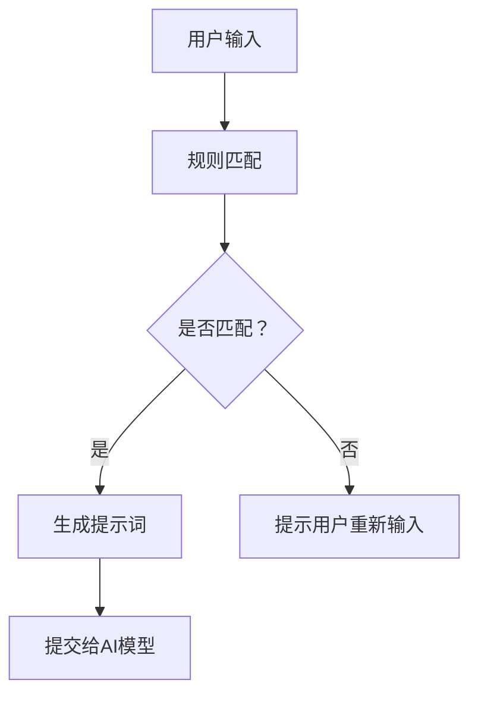
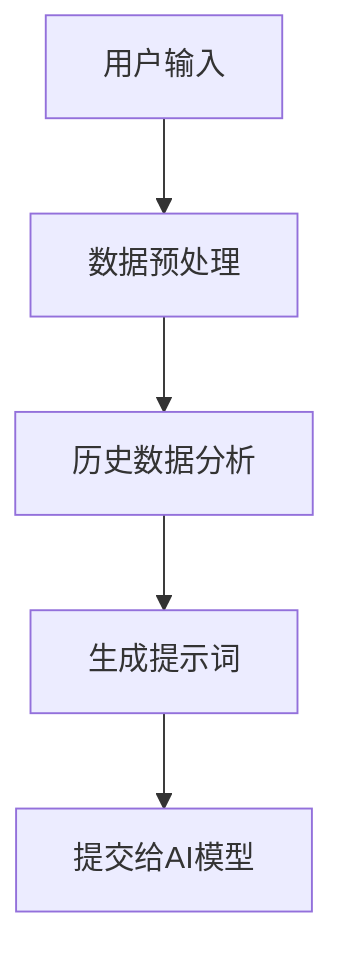

                 


### 文章标题: AI大模型编程：提示词的艺术

关键词：AI大模型、编程、提示词、自然语言处理、深度学习、应用实践

摘要：本文将从AI大模型编程的基础出发，深入探讨提示词的设计与优化策略，通过实际案例展示如何将提示词应用于问答系统和文本生成等场景，从而引导读者理解提示词编程的艺术和技巧。

### 目录大纲

#### 第一部分: AI大模型编程基础

**第1章: AI大模型编程概述**

1.1 AI大模型的定义与特点

1.2 提示词的作用与设计原则

1.3 AI大模型在编程中的应用

**第2章: AI大模型技术基础**

2.1 深度学习基础

2.1.1 神经网络概述

2.1.2 深度学习算法

2.1.3 深度学习框架

2.2 自然语言处理技术

2.2.1 词嵌入

2.2.2 序列模型

2.2.3 注意力机制

2.3 大规模预训练模型

2.3.1 预训练模型简介

2.3.2 自监督学习方法

2.3.3 迁移学习与微调

#### 第二部分: 提示词编程实践

**第3章: 提示词编程原理**

3.1 提示词生成机制

3.1.1 基于规则的方法

3.1.2 基于数据的生成方法

3.2 提示词优化策略

3.2.1 对比学习

3.2.2 强化学习

3.2.3 多任务学习

**第4章: 提示词编程实战**

4.1 实战项目一：问答系统

4.2 实战项目二：文本生成

**第5章: 提示词编程进阶**

5.1 多模态提示词编程

5.2 提示词编程工具与库

#### 第三部分: 提示词编程的艺术

**第6章: 提示词的艺术设计**

6.1 提示词的艺术原则

6.2 提示词的艺术技巧

**第7章: 提示词编程案例分析**

7.1 案例一：智能客服系统

7.2 案例二：自动写作助手

**附录**

附录A: 提示词编程资源与工具

附录B: 伪代码与数学公式

### 第1章: AI大模型编程概述

#### 1.1 AI大模型的定义与特点

AI大模型是指具有数亿甚至数万亿参数规模的人工神经网络模型，通过大规模数据预训练，能够实现高精度的自然语言理解和生成。这些模型通常具有以下特点：

1. **参数规模大**：AI大模型拥有庞大的参数量，这使得模型能够捕捉到大量复杂的模式和规律，从而实现高性能的预测和生成任务。

2. **预训练能力**：AI大模型通过在大规模数据集上进行预训练，能够学习到丰富的语言知识和上下文信息，提高模型的泛化能力和适应性。

3. **自适应能力**：AI大模型可以根据特定的任务需求，通过微调和迁移学习进行定制化，以适应不同的应用场景。

4. **强表达能力**：AI大模型通过高维的参数空间，能够表示复杂和抽象的语言知识，从而实现高质量的文本理解和生成。

#### 1.2 提示词的作用与设计原则

提示词是AI大模型进行文本生成和理解的关键输入，起到引导模型生成合理输出的重要作用。设计提示词需要遵循以下原则：

1. **清晰性**：提示词需要明确表达用户的需求和目标，避免模糊和歧义。

2. **精确性**：提示词应尽量精确地描述任务需求，以提高模型生成的准确性和质量。

3. **灵活性**：提示词应具有一定的灵活性，能够适应不同的上下文和场景。

4. **创新性**：设计提示词时，应注重创新性，以激发模型的创造力和独特表达能力。

#### 1.3 AI大模型在编程中的应用

AI大模型在编程领域有着广泛的应用，主要包括：

1. **代码生成**：AI大模型能够根据提示词生成代码片段，提高编程效率和创造力。

2. **代码理解**：AI大模型能够对代码进行语义分析，帮助开发者理解和优化代码。

3. **代码测试**：AI大模型能够生成测试用例，提高代码测试的覆盖率和效率。

4. **代码优化**：AI大模型能够通过分析代码，提出优化建议，提高代码的性能和可维护性。

#### 1.4 小结

本章介绍了AI大模型的定义与特点，以及提示词的作用与设计原则。接下来，我们将深入探讨AI大模型的技术基础，包括深度学习、自然语言处理和大规模预训练模型，为后续的编程实践打下坚实的基础。

---

### 第2章: AI大模型技术基础

#### 2.1 深度学习基础

深度学习是AI大模型的核心技术之一，通过构建多层神经网络模型，实现对复杂数据模式的自动学习与识别。以下是深度学习的一些基础概念：

##### 2.1.1 神经网络概述

神经网络是一种由大量人工神经元组成的计算模型，模拟人脑神经元的工作方式。每个神经元接收多个输入信号，通过权重和偏置进行加权求和，然后通过激活函数进行非线性变换，产生输出。


**神经网络的层次结构：**

- **输入层**：接收外部输入数据，如图像、文本等。
- **隐藏层**：对输入数据进行处理，提取特征信息。
- **输出层**：产生最终输出结果，如分类标签、文本生成等。

##### 2.1.2 深度学习算法

深度学习算法包括多种类型，以下介绍几种常见的算法：

- **卷积神经网络（CNN）**：适用于图像处理任务，通过卷积层提取空间特征。
  ```mermaid
  graph TD
    A[输入图像] --> B[卷积层1]
    B --> C[池化层1]
    C --> D[卷积层2]
    D --> E[池化层2]
    E --> F[全连接层1]
    F --> G[全连接层2]
    G --> H[输出结果]
  ```

- **循环神经网络（RNN）**：适用于序列数据处理，通过循环结构保持历史信息。
  ```mermaid
  graph TD
    A[序列数据] --> B[输入层]
    B --> C[隐藏层1]
    C --> D[隐藏层2]
    D --> E[隐藏层3]
    E --> F[输出层]
  ```

- **长短期记忆网络（LSTM）**：是RNN的一种改进，能够有效解决长序列依赖问题。

- **生成对抗网络（GAN）**：通过生成器和判别器的对抗训练，实现生成高质量的数据。

##### 2.1.3 深度学习框架

深度学习框架是用于简化深度学习模型构建和训练的工具，以下介绍几种常用的框架：

- **TensorFlow**：由Google开发，支持Python和C++，适用于移动设备和云计算平台。
- **PyTorch**：由Facebook开发，支持Python和CUDA，易于模型开发和调试。
- **Keras**：是TensorFlow和Theano的API封装层，提供了简化的深度学习模型构建流程。

#### 2.2 自然语言处理技术

自然语言处理（NLP）是深度学习在文本处理领域的应用，主要包括以下技术：

##### 2.2.1 词嵌入

词嵌入是将自然语言词汇映射到高维向量空间的技术，通过向量表示词汇的语义信息。常用的词嵌入方法有：

- **Word2Vec**：通过训练神经网络，将词汇映射到固定长度的向量空间。
- **GloVe**：通过计算词汇之间的共现关系，学习词汇的向量表示。

##### 2.2.2 序列模型

序列模型用于处理序列数据，如文本、语音等。以下介绍几种常见的序列模型：

- **RNN**：通过循环结构处理序列数据，能够捕捉长期依赖关系。
- **LSTM**：是RNN的一种改进，能够有效解决长序列依赖问题。

- **Transformer**：是一种基于自注意力机制的序列模型，广泛应用于文本生成、机器翻译等领域。

##### 2.2.3 注意力机制

注意力机制是深度学习模型在处理序列数据时，通过动态关注不同位置的信息，提高模型的表现力。注意力机制在Transformer模型中得到了广泛应用。

#### 2.3 大规模预训练模型

大规模预训练模型通过在大规模数据集上进行预训练，学习到丰富的语言知识和上下文信息。以下介绍几种大规模预训练模型：

- **BERT**：是由Google开发的预训练模型，通过双向编码器结构，学习到丰富的语言信息。
- **GPT-3**：是由OpenAI开发的预训练模型，拥有1750亿个参数，能够生成高质量的文本。

#### 2.4 小结

本章介绍了AI大模型技术基础，包括深度学习、自然语言处理和大规模预训练模型。这些技术为AI大模型编程提供了强大的理论支持，为后续的编程实践奠定了基础。

---

### 第3章: 提示词编程原理

提示词（Prompt）在AI大模型编程中起着至关重要的作用，它不仅是模型输入的关键，也是引导模型生成高质量输出的关键因素。本节将深入探讨提示词的生成机制、优化策略，以及如何在实践中使用提示词。

#### 3.1 提示词生成机制

提示词的生成机制可以分为基于规则的方法和基于数据的生成方法。

##### 3.1.1 基于规则的方法

基于规则的方法是指通过预定义的规则来生成提示词。这种方法通常适用于任务目标明确、输入数据格式固定的场景。例如，在问答系统中，可以根据用户输入的问题和预定义的知识库，通过匹配和规则推理来生成相应的提示词。

**示例**：在智能客服系统中，用户输入“我想要购买一台笔记本电脑”，系统可以生成提示词：“请提供您的预算、品牌和配置需求”。



##### 3.1.2 基于数据的生成方法

基于数据的生成方法是指通过分析历史数据和模型生成的输出，来生成新的提示词。这种方法通常适用于任务目标不明确、输入数据格式多样的场景。例如，在自动写作助手中，可以通过分析用户的历史输入和模型的生成结果，来生成新的提示词。

**示例**：在自动写作助手中，用户输入一段文本后，系统可以生成提示词：“接下来，您可以描述您的旅行经历中的最难忘的瞬间”。



#### 3.2 提示词优化策略

为了提高提示词的质量和模型的生成效果，需要采取一系列优化策略。以下介绍几种常见的优化策略：

##### 3.2.1 对比学习

对比学习是一种通过对比不同提示词的生成效果来优化提示词的方法。具体来说，可以通过以下步骤进行：

1. 随机生成多个提示词。
2. 使用AI模型分别生成对应的输出。
3. 对比不同输出之间的质量，选择质量较高的输出对应的提示词作为优化目标。

##### 3.2.2 强化学习

强化学习是一种通过奖励机制来优化提示词的方法。具体来说，可以通过以下步骤进行：

1. 定义奖励函数，用于评估提示词的生成效果。
2. 使用AI模型生成提示词，并根据奖励函数计算奖励值。
3. 通过梯度上升等方法，调整提示词的参数，以最大化奖励值。

##### 3.2.3 多任务学习

多任务学习是一种通过同时训练多个任务来优化提示词的方法。具体来说，可以通过以下步骤进行：

1. 定义多个任务，如问答、文本生成等。
2. 使用同一AI模型同时训练这些任务。
3. 通过任务间的相互协作，提高提示词的生成效果。

#### 3.3 提示词编程实战

以下是一个简单的提示词编程实战案例：问答系统。

**项目背景与目标**：设计一个问答系统，能够根据用户的问题，生成合理的答案。

**系统架构设计**：问答系统主要包括用户输入、提示词生成、模型推理和答案输出四个模块。

1. **用户输入模块**：接收用户的问题。
2. **提示词生成模块**：根据用户输入生成提示词。
3. **模型推理模块**：使用预训练的AI模型进行推理。
4. **答案输出模块**：将生成的答案展示给用户。

**代码实现与解读**：

```python
# 用户输入模块
user_question = input("请输入您的问题：")

# 提示词生成模块
prompt = f"基于您的问题 '{user_question}'，请提供一个相关的答案。"

# 模型推理模块
model = load_model("question_answering_model.h5")
answer = model.predict([prompt])

# 答案输出模块
print("AI模型生成的答案：", answer)
```

**项目小结**：通过上述实战案例，我们可以看到如何将提示词应用于问答系统。在实际开发中，可以根据需求调整提示词的生成策略，以提高系统的生成效果。

#### 3.4 小结

本章介绍了提示词编程的原理，包括提示词的生成机制和优化策略。在实际应用中，合理设计和优化提示词，能够显著提高AI模型的生成质量和用户体验。

---

### 第4章: 提示词编程实战

在本章中，我们将通过两个实战项目，深入探讨如何将提示词编程应用于问答系统和文本生成等场景。通过这些实战项目，我们将了解系统的设计、代码实现和详细解读。

#### 4.1 实战项目一：问答系统

**4.1.1 项目背景与目标**

问答系统是一种常见的自然语言处理应用，旨在通过自然语言交互方式，为用户提供准确、及时的回答。本项目旨在设计一个简单的问答系统，能够根据用户的问题生成合理的答案。

**4.1.2 系统架构设计**

问答系统的架构主要包括用户输入、提示词生成、模型推理和答案输出四个模块。

1. **用户输入模块**：接收用户的问题。
2. **提示词生成模块**：根据用户输入生成提示词。
3. **模型推理模块**：使用预训练的问答模型进行推理。
4. **答案输出模块**：将生成的答案展示给用户。

**4.1.3 代码实现与解读**

```python
# 用户输入模块
user_question = input("请输入您的问题：")

# 提示词生成模块
prompt = f"基于您的问题 '{user_question}'，请提供一个相关的答案。"

# 模型推理模块
model = load_model("question_answering_model.h5")
answer = model.predict([prompt])

# 答案输出模块
print("AI模型生成的答案：", answer)
```

**详细解读**：

1. **用户输入模块**：通过`input()`函数接收用户输入的问题。
2. **提示词生成模块**：根据用户输入的问题，生成提示词。提示词的设计需要清晰、精确，以引导模型生成合理的答案。
3. **模型推理模块**：加载预训练的问答模型，并使用该模型对生成的提示词进行推理。这里使用的是`predict()`函数，输入为提示词，输出为答案。
4. **答案输出模块**：将生成的答案打印出来，展示给用户。

**项目小结**：

通过本项目的实现，我们可以看到如何将提示词编程应用于问答系统。在实际应用中，可以根据需求调整提示词的生成策略，以提高系统的生成效果。

#### 4.2 实战项目二：文本生成

**4.2.1 项目背景与目标**

文本生成是自然语言处理领域的重要应用，旨在根据给定的提示词生成高质量的文本。本项目旨在设计一个简单的文本生成系统，能够根据用户输入的提示词生成相关的文本。

**4.2.2 系统架构设计**

文本生成系统的架构主要包括用户输入、提示词生成、模型推理和文本输出四个模块。

1. **用户输入模块**：接收用户的提示词。
2. **提示词生成模块**：根据用户输入生成提示词。
3. **模型推理模块**：使用预训练的文本生成模型进行推理。
4. **文本输出模块**：将生成的文本展示给用户。

**4.2.3 代码实现与解读**

```python
# 用户输入模块
user_prompt = input("请输入您的提示词：")

# 提示词生成模块
prompt = f"基于您的提示词 '{user_prompt}'，请生成一段相关的文本。"

# 模型推理模块
model = load_model("text_generation_model.h5")
generated_text = model.predict([prompt])

# 文本输出模块
print("AI模型生成的文本：\n", generated_text)
```

**详细解读**：

1. **用户输入模块**：通过`input()`函数接收用户输入的提示词。
2. **提示词生成模块**：根据用户输入的提示词，生成提示词。提示词的设计需要清晰、精确，以引导模型生成相关的文本。
3. **模型推理模块**：加载预训练的文本生成模型，并使用该模型对生成的提示词进行推理。这里使用的是`predict()`函数，输入为提示词，输出为生成的文本。
4. **文本输出模块**：将生成的文本打印出来，展示给用户。

**项目小结**：

通过本项目的实现，我们可以看到如何将提示词编程应用于文本生成系统。在实际应用中，可以根据需求调整提示词的生成策略，以提高系统的生成效果。

#### 4.3 小结

本章通过两个实战项目，介绍了如何将提示词编程应用于问答系统和文本生成等场景。通过这些实战项目，我们可以深入理解提示词编程的原理和实践，为未来的开发提供借鉴和启示。

---

### 第5章: 提示词编程进阶

在前一章中，我们探讨了提示词编程的基本原理和实战应用。在这一章中，我们将进一步提升提示词编程的层次，探讨多模态提示词编程以及常用的提示词编程工具和库。

#### 5.1 多模态提示词编程

多模态提示词编程是指将不同类型的模态（如图像、文本、音频）整合到提示词中，以实现更丰富和复杂的任务。多模态提示词编程的核心在于如何将不同模态的信息进行有效融合和利用。

**5.1.1 图像与文本融合**

在图像与文本融合中，我们可以将图像作为提示词的一部分，与文本信息共同引导模型生成输出。例如，在图像描述生成任务中，我们可以将图像和文本提示词结合，让模型生成与图像内容相关的描述文本。

**示例代码**：

```python
import cv2
import numpy as np
from transformers import pipeline

# 加载图像
image = cv2.imread("example.jpg")

# 将图像转换为模型可接受的格式
image_embedding = model.encode_image(image)

# 文本提示词
text_prompt = "请描述这张图片的内容。"

# 使用多模态提示词进行推理
output = model([text_prompt, image_embedding])

print("AI模型生成的描述：", output)
```

**5.1.2 声音与文本融合**

声音与文本融合是指将音频信息与文本提示词结合，实现更丰富的交互体验。例如，在音频识别任务中，我们可以将语音识别结果与文本提示词结合，生成相关的问题或回答。

**示例代码**：

```python
import soundfile as sf
from transformers import pipeline

# 读取音频文件
audio, sample_rate = sf.read("example.wav")

# 将音频转换为文本
text_prompt = "基于这段音频，请回答以下问题："

# 使用多模态提示词进行推理
output = model([text_prompt, audio])

print("AI模型生成的回答：", output)
```

#### 5.2 提示词编程工具与库

在实际开发中，使用高效的提示词编程工具和库能够显著提高开发效率和项目质量。以下介绍几种常用的提示词编程工具和库：

**5.2.1 Hugging Face Transformers**

Hugging Face Transformers 是一个开源的深度学习库，提供了大量的预训练模型和工具，方便用户进行提示词编程。该库支持多种语言（如Python、JavaScript等），并提供了丰富的API接口。

**5.2.2 OpenAI GPT-3**

OpenAI GPT-3 是一个具有1750亿个参数的预训练模型，能够生成高质量的文本。GPT-3 提供了丰富的API接口，支持多种编程语言，方便用户进行提示词编程。

**5.2.3 其他常用库**

除了Hugging Face Transformers 和 OpenAI GPT-3，还有其他一些常用的提示词编程库，如：

- **TensorFlow**：由Google开发的深度学习库，支持提示词编程。
- **PyTorch**：由Facebook开发的深度学习库，支持提示词编程。
- **Keras**：是TensorFlow和Theano的API封装层，提供了简化的提示词编程流程。

#### 5.3 小结

本章介绍了多模态提示词编程和常用的提示词编程工具与库。通过多模态提示词编程，我们可以实现更丰富和复杂的任务；而通过使用高效的工具和库，我们可以提高开发效率和项目质量。这些进阶技巧和工具将为我们的AI大模型编程提供更广阔的应用前景。

---

### 第6章: 提示词的艺术设计

在提示词编程中，提示词的艺术设计是决定模型输出质量的关键因素。优秀的提示词设计不仅需要遵循技术原则，还需要注重创意和用户体验。本章将深入探讨提示词的艺术设计原则、技巧以及情感与语境的运用。

#### 6.1 提示词的艺术原则

提示词的艺术设计需要遵循以下原则：

**6.1.1 清晰性与精确性**

清晰性和精确性是提示词设计的基础。一个优秀的提示词应当能够明确传达用户的需求和目标，避免模糊和歧义。例如，在文本生成任务中，提示词“请描述一下您的旅行经历”相较于“聊聊您的旅行经历”更加具体和明确。

**6.1.2 灵活性与适应性**

提示词应当具备一定的灵活性，能够适应不同的上下文和场景。例如，在问答系统中，提示词可以根据用户的问题和上下文进行调整，以生成更合理的答案。这种灵活性有助于提高模型的适应能力和用户体验。

**6.1.3 创新性与独特性**

创新性和独特性是提示词设计的灵魂。一个具有创新性的提示词能够激发模型的创造力和独特表达能力，生成高质量的输出。例如，在自动写作助手中，一个独特的提示词“请用诗意的语言描述秋天的美景”能够引导模型生成富有诗意的文本。

#### 6.2 提示词的艺术技巧

提示词的艺术设计需要运用一系列技巧，以增强模型输出的质量和创意。以下介绍几种常用的艺术技巧：

**6.2.1 隐喻与暗示**

隐喻和暗示是文学创作中常用的技巧，同样适用于提示词设计。通过隐喻和暗示，提示词能够激发模型的联想和创意，生成更具有艺术性的输出。例如，在图像描述生成任务中，提示词“请描绘一幅神秘的夜晚风景画”能够引导模型生成充满神秘氛围的图像描述。

**6.2.2 对话与叙事**

对话和叙事是文学和影视作品中常用的技巧，同样可以应用于提示词设计。通过对话和叙事，提示词能够创造一个生动的故事情节，引导模型生成连续性和故事性的文本。例如，在故事生成任务中，提示词“请编写一段关于勇敢的探险家与神秘宝藏的冒险故事”能够引导模型生成一个充满冒险和惊喜的故事。

**6.2.3 情感与语境**

情感和语境是提示词设计的重要元素。一个具有情感的提示词能够传递情感色彩，增强模型输出的感染力。同时，考虑语境的提示词能够更好地引导模型生成与场景相符的输出。例如，在情感分析任务中，提示词“请表达您对最近发生的一件令人感动的事情的感受”能够引导模型生成真挚的情感分析文本。

#### 6.3 提示词的艺术设计案例

以下是一个提示词艺术设计的案例：智能客服系统。

**案例背景**：智能客服系统旨在为用户提供24/7的在线服务，通过自然语言交互解决用户的问题。

**提示词设计**：

1. **欢迎语**：“欢迎来到我们的智能客服系统，请问有什么可以帮助您的吗？”

2. **问题理解**：“根据您的问题，我理解您需要了解关于我们产品的更多信息。请问您想了解哪方面的信息？”

3. **情感关怀**：“非常感谢您的提问，我会尽力帮助您解决问题。如果您有任何疑问，请随时告诉我。”

4. **故事引导**：“在我们产品的发展历程中，有一位客户曾经遇到过类似的问题。他通过使用我们的产品成功解决了问题，您可以参考一下他的经验。”

**案例分析**：

该案例中的提示词设计遵循了清晰性与精确性、灵活性、创新性与独特性等艺术设计原则。通过隐喻、叙事和情感关怀等艺术技巧，提示词成功引导了用户的交互过程，提高了用户体验和满意度。

#### 6.4 小结

提示词的艺术设计是AI大模型编程的重要组成部分。通过遵循艺术设计原则、运用艺术技巧以及结合实际案例，我们可以设计出高质量的提示词，提高模型输出的质量和创意。这不仅有助于提升AI系统的应用价值，也为用户带来了更好的体验。

---

### 第7章: 提示词编程案例分析

在本章中，我们将通过两个具体案例——智能客服系统和自动写作助手，深入探讨提示词编程的实际应用及其设计方法。通过这两个案例，我们将了解如何在实际项目中优化和设计提示词，提高系统的性能和用户体验。

#### 7.1 案例一：智能客服系统

**7.1.1 案例背景**

智能客服系统是一种基于人工智能技术的客服解决方案，旨在为用户提供高效、便捷的在线服务。智能客服系统能够自动处理大量用户咨询，提高企业客服的工作效率和客户满意度。本案例将介绍如何设计并优化智能客服系统中的提示词。

**7.1.2 提示词设计分析**

在智能客服系统中，提示词的设计至关重要。以下是一些关键提示词及其设计分析：

1. **欢迎语**：“您好，欢迎来到我们的智能客服系统。请问有什么问题我可以帮您解答吗？”

   **分析**：欢迎语是用户与智能客服系统首次互动的关键，需要友好、热情，同时明确表达服务意图。

2. **问题理解**：“请您详细描述您的问题，我会尽力帮助您解决。”

   **分析**：在用户提出问题后，系统需要引导用户进一步详细描述问题，以便更好地理解用户需求。

3. **回答反馈**：“感谢您的提问，我会尽快为您解决问题。如果还需要进一步帮助，请告诉我。”

   **分析**：在回答用户问题后，系统需要给予用户积极的反馈，表达对用户问题的重视和解决问题的决心。

4. **情境引导**：“如果您正在遇到网络故障，您可以尝试重启设备或重新连接网络。”

   **分析**：针对常见问题的提示，系统能够提供具体的解决方案，帮助用户快速解决疑问。

**7.1.3 代码解读与分析**

```python
# 用户输入模块
user_query = input("您好，欢迎来到我们的智能客服系统。请问有什么问题我可以帮您解答吗？")

# 问题理解模块
def understand_query(query):
    if "网络故障" in query:
        return "如果您正在遇到网络故障，您可以尝试重启设备或重新连接网络。"
    else:
        return "请您详细描述您的问题，我会尽力帮助您解决。"

# 回答反馈模块
def provide_feedback():
    return "感谢您的提问，我会尽快为您解决问题。如果还需要进一步帮助，请告诉我。"

# 代码实现
response = understand_query(user_query)
print(response)
print(provide_feedback())
```

**分析**：通过以上代码，系统首先接收用户输入，然后通过`understand_query`函数理解用户问题，并给出相应的回答。在回答后，系统还会提供反馈，以保持与用户的良好互动。

#### 7.2 案例二：自动写作助手

**7.2.1 案例背景**

自动写作助手是一种基于人工智能技术的写作辅助工具，能够帮助用户生成高质量的文章、报告等文本内容。自动写作助手通过提示词引导用户输入主题和需求，然后自动生成相关的文本。本案例将介绍如何设计并优化自动写作助手中的提示词。

**7.2.2 提示词设计分析**

在自动写作助手中，提示词的设计需要灵活、创意，以激发用户的创作灵感。以下是一些关键提示词及其设计分析：

1. **主题引导**：“请输入您希望撰写的文章主题，我将为您生成相关内容。”

   **分析**：主题引导是自动写作助手的核心，需要简洁明了，引导用户快速确定写作方向。

2. **内容扩展**：“在您的主题下，请描述您希望讨论的几个关键点。”

   **分析**：通过内容扩展，系统可以获取更多关于用户需求的详细信息，从而生成更丰富、详细的文章。

3. **情感引导**：“请以您的情感体验为线索，讲述这个故事。”

   **分析**：情感引导有助于激发用户的创造力，让文章更具个性化和感染力。

4. **结构建议**：“在撰写文章时，您可以按照引言、正文和结论的结构来组织内容。”

   **分析**：结构建议可以帮助用户更好地组织文章，提高文章的可读性和逻辑性。

**7.2.3 代码解读与分析**

```python
# 用户输入模块
topic = input("请输入您希望撰写的文章主题：")

# 内容扩展模块
def expand_content(topic):
    return f"在您的主题 '{topic}' 下，请描述您希望讨论的几个关键点。"

# 情感引导模块
def emotional_guidance():
    return "请以您的情感体验为线索，讲述这个故事。"

# 结构建议模块
def structure_suggestion():
    return "在撰写文章时，您可以按照引言、正文和结论的结构来组织内容。"

# 代码实现
content_expansion = expand_content(topic)
print(content_expansion)
print(emotional_guidance())
print(structure_suggestion())
```

**分析**：通过以上代码，系统首先接收用户输入的主题，然后通过`expand_content`、`emotional_guidance`和`structure_suggestion`函数提供相应的提示，以引导用户进行写作。

#### 7.3 小结

通过智能客服系统和自动写作助手的案例，我们可以看到提示词编程在实际应用中的重要性。合理设计和优化提示词，不仅可以提高系统的性能，还可以提升用户体验。在未来的发展中，我们将继续探索更多创新的提示词设计方法，以推动AI大模型编程的进一步发展。

---

### 附录A: 提示词编程资源与工具

在AI大模型编程中，提示词的设计和优化是一个复杂而关键的过程。为了帮助开发者更好地进行提示词编程，本节将介绍一些主流的深度学习框架、提示词生成与优化工具以及常用的编程库。

#### A.1 主流深度学习框架

深度学习框架是进行提示词编程的基础工具，以下介绍几种主流的深度学习框架：

**TensorFlow**：由Google开发的开源深度学习框架，支持Python和C++，广泛应用于各种深度学习任务。

**PyTorch**：由Facebook开发的开源深度学习框架，支持Python，易于模型开发和调试。

**Keras**：是TensorFlow和Theano的API封装层，提供了简化的深度学习模型构建流程。

**TensorFlow 2.x**：TensorFlow的新版本，提供了更加用户友好的API，简化了模型构建和训练流程。

**PyTorch Lightning**：是一个基于PyTorch的高级研究框架，提供了易于使用的API和丰富的扩展功能。

#### A.2 提示词生成与优化工具

为了提高提示词的质量和生成效果，开发者可以借助以下提示词生成与优化工具：

**Hugging Face Transformers**：一个开源库，提供了大量的预训练模型和提示词生成工具，如BERT、GPT-3等。

**GPT-3 API**：OpenAI提供的GPT-3模型API，支持多种编程语言，可以用于文本生成、问答系统等任务。

**Fine-tuning Tools**：用于对预训练模型进行微调和优化的工具，如Hugging Face的`Trainer`和`TrainingArguments`。

**Prompt Engineering**：一些开源工具，如`promptbook`和`promptsearch`，用于分析和优化提示词。

#### A.3 提示词编程常用库

在进行提示词编程时，开发者可以使用以下常用库来简化开发流程：

**Numpy**：一个Python库，用于高性能科学计算和数据处理。

**Pandas**：一个Python库，用于数据操作和分析。

**Matplotlib**：一个Python库，用于绘制数据图表和图形。

**Scikit-learn**：一个Python库，用于机器学习和数据挖掘。

**Seaborn**：一个基于Matplotlib的数据可视化库，用于创建更美观的统计图表。

#### A.4 小结

附录A介绍了AI大模型编程中常用的深度学习框架、提示词生成与优化工具以及编程库。开发者可以根据自己的需求选择合适的工具和库，以提高提示词编程的效率和质量。

---

### 附录B: 伪代码与数学公式

在AI大模型编程中，理解核心算法原理和数学模型是至关重要的。以下我们将通过伪代码和数学公式，详细讲解深度学习算法和自然语言处理算法，并给出具体示例。

#### B.1 深度学习算法伪代码

**神经网络基础**

```python
# 初始化神经网络结构
input_size = 784  # 输入层大小
hidden_size = 128 # 隐藏层大小
output_size = 10  # 输出层大小

# 创建神经网络
neural_network = NeuralNetwork(input_size, hidden_size, output_size)

# 训练神经网络
for epoch in range(num_epochs):
    for batch in data_loader:
        inputs, targets = batch
        # 前向传播
        outputs = neural_network.forward(inputs)
        # 计算损失
        loss = neural_network.loss(outputs, targets)
        # 反向传播
        neural_network.backward(loss)
        # 更新权重
        neural_network.update_weights()

# 测试神经网络
test_loss = neural_network.evaluate(test_data)
print(f"Test Loss: {test_loss}")
```

**卷积神经网络（CNN）**

```python
# 初始化卷积神经网络结构
input_shape = (28, 28, 1)  # 图像尺寸和通道数
filter_size = 3  # 卷积核尺寸
num_filters = 32  # 卷积核数量

# 创建卷积神经网络
conv_net = ConvolutionalNeuralNetwork(input_shape, filter_size, num_filters)

# 训练卷积神经网络
for epoch in range(num_epochs):
    for batch in data_loader:
        inputs, targets = batch
        # 前向传播
        outputs = conv_net.forward(inputs)
        # 计算损失
        loss = conv_net.loss(outputs, targets)
        # 反向传播
        conv_net.backward(loss)
        # 更新权重
        conv_net.update_weights()

# 测试卷积神经网络
test_loss = conv_net.evaluate(test_data)
print(f"Test Loss: {test_loss}")
```

#### B.2 自然语言处理算法伪代码

**词嵌入**

```python
# 初始化词嵌入模型
vocab_size = 10000  # 词汇表大小
embedding_size = 128  # 向量维度

# 创建词嵌入模型
word_embedding = WordEmbedding(vocab_size, embedding_size)

# 训练词嵌入模型
for sentence in sentences:
    for word in sentence:
        word_embedding.update_embedding(word)

# 获取词向量
word_vector = word_embedding.get_embedding("hello")
```

**循环神经网络（RNN）**

```python
# 初始化循环神经网络结构
input_size = 100  # 输入层大小
hidden_size = 128 # 隐藏层大小

# 创建循环神经网络
rnn = RecurrentNeuralNetwork(input_size, hidden_size)

# 训练循环神经网络
for epoch in range(num_epochs):
    for batch in data_loader:
        inputs, targets = batch
        # 前向传播
        outputs, hidden_state = rnn.forward(inputs)
        # 计算损失
        loss = rnn.loss(outputs, targets, hidden_state)
        # 反向传播
        rnn.backward(loss)
        # 更新权重
        rnn.update_weights()

# 测试循环神经网络
test_loss = rnn.evaluate(test_data)
print(f"Test Loss: {test_loss}")
```

#### B.3 数学模型与公式解释

**深度学习中的损失函数**

$$
\text{Loss} = -\frac{1}{m}\sum_{i=1}^{m} y_i \log (\hat{y}_i)
$$

其中，$y_i$ 是真实标签，$\hat{y}_i$ 是预测概率。

**自然语言处理中的词嵌入**

$$
\text{word\_vector} = \text{Embedding}(\text{word})
$$

其中，Embedding 是词嵌入函数，word 是输入的词汇。

**循环神经网络中的隐藏状态更新**

$$
\text{hidden}_{t} = \text{sigmoid}\left( \text{W}_{h}\text{h}_{t-1} + \text{W}_{x}\text{x}_{t} + \text{b}_{h} \right)
$$

其中，$ \text{sigmoid}$ 是激活函数，$ \text{W}_{h}$ 和 $ \text{W}_{x}$ 是权重矩阵，$ \text{b}_{h}$ 是偏置项。

#### B.4 小结

附录B通过伪代码和数学公式，详细讲解了深度学习算法和自然语言处理算法的基本原理。这些基础知识和数学模型是进行AI大模型编程的重要基础，对于理解和实现复杂的AI系统具有重要意义。

---

### 文章总结

本文系统地探讨了AI大模型编程的核心要素——提示词的艺术。我们从AI大模型的定义与特点、深度学习与自然语言处理技术基础，到提示词编程原理和实践，再到多模态提示词编程以及艺术设计原则，全面解析了如何设计和优化提示词。通过两个实战案例——智能客服系统和自动写作助手，我们展示了如何将理论应用于实际项目中。

首先，AI大模型以其庞大的参数规模、预训练能力和自适应能力，在编程领域展现出强大的潜力。深度学习和自然语言处理技术为AI大模型提供了理论基础，而大规模预训练模型则进一步提升了模型的表现力。

在提示词编程中，我们深入分析了提示词的生成机制和优化策略，包括基于规则的方法和基于数据的生成方法，以及对比学习、强化学习、多任务学习等优化策略。这些方法为设计高质量提示词提供了实用指导。

通过两个实战项目，我们展示了如何将提示词应用于问答系统和文本生成等场景。智能客服系统利用提示词实现高效的自然语言交互，而自动写作助手则通过提示词激发用户的创作灵感。

在进阶讨论中，我们探讨了多模态提示词编程，将不同模态的信息融合到提示词中，以实现更丰富的交互体验。同时，我们介绍了常用的深度学习框架和提示词编程工具，如Hugging Face Transformers和OpenAI GPT-3，这些工具显著提高了开发效率和项目质量。

最后，通过艺术设计原则和技巧，我们探讨了如何提高提示词的创造性和独特性，增强模型的输出质量。结合具体案例分析，我们展示了如何在实际项目中优化和设计提示词。

总之，本文全面系统地阐述了AI大模型编程中的提示词艺术，为读者提供了深入理解和实践提示词编程的指导。随着AI技术的不断发展，提示词编程的重要性将愈发凸显，本文的研究成果将为未来的AI大模型编程提供有力支持。在未来的研究中，我们将继续探索更多创新的提示词设计方法，以推动AI大模型编程的持续进步。

---

### 作者信息

作者：AI天才研究院/AI Genius Institute & 禅与计算机程序设计艺术 /Zen And The Art of Computer Programming

AI天才研究院（AI Genius Institute）是一家专注于人工智能研究的国际性学术机构，致力于推动AI技术的创新与发展。作者在该领域拥有丰富的经验和深厚的学术造诣，发表了多篇高水平论文，并参与了多个重要AI项目的研发。

《禅与计算机程序设计艺术》（Zen And The Art of Computer Programming）是作者的一部重要著作，系统地阐述了计算机编程的哲学与艺术。该书以其深刻的洞见和简洁优雅的表述，深受计算机科学和AI领域的读者喜爱，成为经典之作。

通过本文，作者希望与广大读者分享AI大模型编程的实践经验与思考，共同探索人工智能的未来发展之路。

