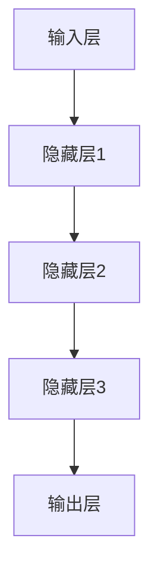

                 

## 文章标题

《AI大模型编程：提示词的艺术》

> 关键词：AI大模型、提示词、编程、深度学习、神经网络

> 摘要：本文深入探讨了AI大模型编程的核心要素——提示词的艺术。从基础概念、数学原理到实战应用，系统介绍了提示词在AI大模型编程中的重要作用和设计策略。通过分析实际案例，本文揭示了提示词优化和微调的关键技巧，并展望了AI大模型编程的未来发展方向。

---

## 目录

#### 第一部分：AI大模型编程基础

1. [第1章：AI大模型编程概述](#第1章-ai大模型编程概述)
   1.1 AI大模型编程的核心概念
   1.2 AI大模型的架构与组件
   1.3 AI大模型编程与传统编程的区别

2. [第2章：AI大模型编程数学基础](#第2章-ai大模型编程数学基础)
   2.1 线性代数基础
   2.2 概率论与统计学基础

3. [第3章：深度学习基础](#第3章-深度学习基础)
   3.1 神经网络原理
   3.2 循环神经网络（RNN）与长短期记忆网络（LSTM）

#### 第二部分：提示词技术详解

4. [第4章：提示词生成技术](#第4章-提示词生成技术)
   4.1 提示词的概念与作用
   4.2 提示词生成算法
   4.3 提示词生成的优化策略

5. [第5章：提示词优化与微调](#第5章-提示词优化与微调)
   5.1 提示词优化的目标与方法
   5.2 提示词微调实践

#### 第三部分：AI大模型编程实战

6. [第6章：AI大模型编程项目实战](#第6章-ai大模型编程项目实战)
   6.1 实战项目介绍
   6.2 数据预处理与模型训练
   6.3 提示词设计与优化

7. [第7章：AI大模型编程的最佳实践与展望](#第7章-ai大模型编程的最佳实践与展望)
   7.1 AI大模型编程的最佳实践
   7.2 AI大模型编程的未来展望

#### 附录

8. [附录A：AI大模型编程工具与资源](#附录a-ai大模型编程工具与资源)
   8.1 主流深度学习框架介绍
   8.2 AI大模型编程学习资源推荐

---

## 引言

### AI大模型的崛起与编程挑战

近年来，人工智能（AI）技术取得了飞速发展，尤其是AI大模型的兴起，彻底改变了传统计算机编程的范式。AI大模型，如GPT-3、BERT等，凭借其强大的语义理解和生成能力，在自然语言处理、图像识别、语音合成等多个领域取得了显著的突破。然而，这些大模型的编程与使用也带来了前所未有的挑战。

在传统编程中，程序员通过编写代码实现特定的功能，而AI大模型编程则更加注重数据的输入与模型的调优。提示词（Prompts）在这个过程中起到了至关重要的作用。提示词不仅是模型输入的关键，更是模型与外界交互的桥梁。通过巧妙设计提示词，程序员可以引导大模型生成更加准确和有用的输出，从而实现高效的编程和自动化。

### 提示词的艺术

提示词的艺术在于如何通过精确的词汇和结构，激发AI大模型的最大潜力。首先，我们需要理解提示词的概念与类型。根据用途和形式，提示词可以分为指令性提示词、描述性提示词、问题性提示词等。不同的提示词类型适用于不同的应用场景，如文本生成、问题回答、图像描述等。

其次，提示词生成技术是AI大模型编程的核心。文本生成模型（如GPT）和对抗生成网络（GAN）是常用的提示词生成方法。通过这些技术，我们可以生成高质量的提示词，进一步优化模型的性能。

最后，提示词优化与微调是提升模型表现的关键。通过目标明确的优化策略和细致的微调实践，我们可以使模型更好地适应特定的任务和应用场景。

### 本文章结构

本文将分为三个主要部分。第一部分介绍了AI大模型编程的基础知识，包括核心概念、数学基础和深度学习原理。第二部分详细讲解了提示词技术的各个方面，从概念、生成到优化与微调。第三部分通过实际项目展示了AI大模型编程的实战经验，并提出了最佳实践和未来展望。通过本文的阅读，读者将全面了解AI大模型编程的核心要点，掌握提示词的艺术，为实际应用打下坚实基础。

### 第1章：AI大模型编程概述

AI大模型编程是现代人工智能技术中的一个重要分支，其核心在于如何有效地构建、训练和优化大型深度学习模型。本章将首先介绍AI大模型编程的核心概念，包括大模型的概念与类型，探讨其与传统编程的区别，并深入分析大模型的架构与组件。

#### 1.1.1 AI大模型的概念与类型

AI大模型（Large-scale AI Models）通常指的是那些拥有数十亿甚至数万亿参数的深度学习模型。这些模型具有强大的表征和学习能力，可以处理复杂的数据和任务。大模型的应用范围广泛，包括自然语言处理、计算机视觉、语音识别、推荐系统等。

大模型的类型可以分为以下几种：

1. **语言模型**：如GPT-3、BERT等，主要用于文本生成和语义理解。
2. **图像模型**：如VGG、ResNet等，用于图像分类和物体检测。
3. **多模态模型**：如ViT、DALL-E等，可以同时处理图像和文本信息。
4. **强化学习模型**：如AlphaGo、DoTA等，用于复杂决策和策略优化。

#### 1.1.2 AI大模型编程的重要性

AI大模型编程的重要性体现在以下几个方面：

1. **提升任务性能**：大模型通常具有更高的参数量和更强的学习能力，可以显著提升任务性能。
2. **降低编程复杂度**：通过自动化和优化的编程方法，减少手动编码的工作量。
3. **拓展应用场景**：大模型可以应用于更多复杂的任务，推动AI技术的发展。
4. **促进跨领域合作**：大模型的出现促使不同领域的专家进行合作，共同解决复杂问题。

#### 1.1.3 AI大模型编程与传统编程的区别

与传统编程相比，AI大模型编程具有以下显著区别：

1. **数据驱动**：AI大模型编程依赖于大量数据来训练模型，而非手动编写规则和算法。
2. **模型优化**：AI大模型编程注重模型结构和参数的优化，以提升模型性能。
3. **分布式计算**：由于大模型参数量巨大，通常需要分布式计算和并行处理技术。
4. **不确定性处理**：AI大模型编程需要处理模型的不确定性和鲁棒性问题。

#### 1.2 AI大模型的架构与组件

AI大模型通常由多个关键组件构成，其架构复杂且紧密协作：

1. **输入层**：接收外部输入数据，如文本、图像或音频。
2. **隐藏层**：通过复杂的神经网络结构对输入数据进行处理和转换。
3. **输出层**：生成预测结果或输出，如分类标签、文本或图像。

以下是AI大模型常见架构的Mermaid流程图：



#### 1.2.1 模型架构的组成

AI大模型的架构通常包括以下组成部分：

1. **神经元**：基本计算单元，负责执行加权求和和激活函数。
2. **神经网络**：由多个神经元层组成，用于非线性变换。
3. **损失函数**：用于评估模型预测与实际结果之间的差异。
4. **优化器**：调整模型参数，以最小化损失函数。

#### 1.2.2 模型训练与优化的原理

模型训练与优化的过程如下：

1. **初始化参数**：随机初始化模型参数。
2. **前向传播**：将输入数据通过神经网络，计算输出。
3. **计算损失**：通过损失函数计算预测结果与实际结果之间的差异。
4. **反向传播**：更新模型参数，以最小化损失。
5. **迭代优化**：重复前向传播和反向传播，逐步优化模型。

以下是模型训练过程的伪代码：

```python
# 初始化参数
W = randn(n_params)

# 迭代优化
for epoch in range(num_epochs):
    for batch in data_loader:
        # 前向传播
        output = forward_pass(batch, W)
        
        # 计算损失
        loss = compute_loss(output, target)
        
        # 反向传播
        dW = backward_pass(output, target)
        
        # 更新参数
        W -= learning_rate * dW
```

#### 1.2.3 模型评估与部署的方法

模型评估与部署的方法如下：

1. **评估指标**：使用准确率、召回率、F1分数等指标评估模型性能。
2. **验证集与测试集**：使用验证集进行模型调优，测试集进行最终评估。
3. **模型压缩**：使用量化、剪枝、知识蒸馏等技术减少模型大小和计算量。
4. **部署策略**：选择适合的应用场景和硬件平台，实现模型的实时部署。

通过本章的介绍，读者对AI大模型编程有了初步的认识。在接下来的章节中，我们将进一步探讨AI大模型编程所需的数学基础和深度学习原理，并详细讲解提示词技术，为读者提供全面的技术指导。

### 第2章：AI大模型编程数学基础

AI大模型编程的核心在于处理和优化大量的数据，这离不开坚实的数学基础。本章将深入探讨AI大模型编程中常用的数学工具，包括线性代数、概率论和统计学。这些数学基础不仅帮助构建和理解深度学习模型，还在模型的训练、优化和应用中起到关键作用。

#### 2.1 线性代数基础

线性代数是AI大模型编程的基石，它提供了处理多维数据和矩阵运算的基本工具。

##### 2.1.1 矩阵与向量操作

1. **矩阵与向量的定义**：矩阵是一个二维数组，每个元素可以是实数或复数。向量是矩阵的特殊形式，通常是一维矩阵。

2. **矩阵与向量的运算**：
   - **加法与减法**：两个相同尺寸的矩阵或向量对应元素相加或相减。
   - **数乘**：将矩阵或向量的每个元素乘以一个标量。
   - **矩阵乘法**：两个矩阵相乘得到一个新的矩阵，满足结合律和分配律。

3. **矩阵分解**：通过矩阵分解技术，如LU分解、SVD分解，将复杂矩阵分解为简单形式，便于进一步处理。

##### 2.1.2 线性方程组与特征值

1. **线性方程组**：线性方程组是描述多个线性方程同时成立的问题，可以通过矩阵形式表示。常用的求解方法包括高斯消元法、迭代法等。

2. **特征值与特征向量**：特征值和特征向量是矩阵对角化的结果。特征值是矩阵的一个重要属性，表示矩阵的稳定性和方向。特征向量是特征值的对应向量，具有方向性的意义。

   ```latex
   \text{若矩阵 } A \text{ 满足 } Av = \lambda v \text{，则 } \lambda \text{ 是 } A \text{ 的特征值，} v \text{ 是特征值对应的特征向量。}
   ```

##### 2.1.3 矩阵分解与特征空间

1. **矩阵分解**：通过矩阵分解技术，将复杂矩阵分解为简单矩阵，便于进一步分析。常用的分解方法包括LU分解、SVD分解。

2. **特征空间**：特征空间是特征向量构成的集合，反映了矩阵的内在结构。通过特征空间，我们可以更好地理解矩阵的性质和行为。

   ```mermaid
   graph TD
   A[原始矩阵] --> B[特征值]
   B --> C[特征向量]
   C --> D[特征空间]
   ```

#### 2.2 概率论与统计学基础

概率论和统计学是AI大模型编程中理解和处理数据的重要工具，特别是在概率分布、统计估计和模型评估中。

##### 2.2.1 概率分布与期望

1. **概率分布**：概率分布描述了随机变量取值的概率。常见的概率分布包括正态分布、伯努利分布、二项分布等。

2. **期望**：期望是概率分布的中心位置，表示随机变量在多次试验中取值的平均值。

   ```latex
   E[X] = \sum_{x} x \cdot P(x)
   ```

##### 2.2.2 最大似然估计与最小二乘法

1. **最大似然估计**：最大似然估计是一种参数估计方法，通过最大化似然函数找到最佳参数值。似然函数表示观察到的数据在特定参数下的概率。

   ```latex
   \text{似然函数 } L(\theta) = P(\text{数据} | \theta)
   ```

2. **最小二乘法**：最小二乘法是一种无偏估计方法，通过最小化误差平方和找到最佳参数值。

   ```latex
   \text{最小化 } \sum_{i=1}^{n} (y_i - \hat{y}_i)^2
   ```

##### 2.2.3 贝叶斯推断与隐变量模型

1. **贝叶斯推断**：贝叶斯推断是一种基于概率的推理方法，通过贝叶斯定理更新概率分布，进行决策和预测。

   ```latex
   P(A|B) = \frac{P(B|A) \cdot P(A)}{P(B)}
   ```

2. **隐变量模型**：隐变量模型是一种包含未观测变量的概率模型，通过隐变量和观测变量之间的关系进行推断和预测。

   ```mermaid
   graph TD
   A[观测变量] --> B[隐变量]
   B --> C[概率模型]
   C --> D[预测结果]
   ```

通过本章的讨论，读者对AI大模型编程所需的数学基础有了全面的理解。这些数学工具不仅帮助我们构建和优化深度学习模型，还在实际应用中提供了强大的分析和推理能力。在接下来的章节中，我们将深入探讨深度学习的基础理论，进一步揭示AI大模型编程的奥秘。

### 第3章：深度学习基础

深度学习是AI大模型编程的核心技术，它通过多层神经网络结构对数据进行自动特征提取和模式识别。本章将详细探讨深度学习的理论基础，包括神经网络原理、循环神经网络（RNN）和长短期记忆网络（LSTM）。

#### 3.1 神经网络原理

神经网络（Neural Networks）是深度学习的基础，其灵感来源于人脑神经元的工作原理。

##### 3.1.1 神经元与感知机

1. **神经元**：神经元是神经网络的基本计算单元，负责接收输入信号，通过加权求和和激活函数产生输出。

   ```mermaid
   graph TD
   A[输入] --> B[加权求和]
   B --> C[激活函数]
   C --> D[输出]
   ```

2. **感知机**：感知机是神经网络的基础模型，主要用于二分类问题。其通过计算输入向量和权重向量的点积，并应用阈值函数进行判断。

   ```latex
   f(x) = \text{sign}(w \cdot x + b)
   ```

##### 3.1.2 神经网络的学习算法

神经网络的学习算法包括前向传播和反向传播。

1. **前向传播**：将输入数据通过网络的每个层，逐层计算输出。前向传播的过程可以表示为：

   ```mermaid
   graph TD
   A[输入] --> B[层1]
   B --> C[层2]
   C --> D[层3]
   D --> E[输出]
   ```

2. **反向传播**：通过反向传播算法，计算网络输出的误差，并更新网络权重和偏置。反向传播的过程可以表示为：

   ```mermaid
   graph TD
   E[输出] --> D[层3]
   D --> C[层2]
   C --> B[层1]
   B --> A[输入]
   ```

##### 3.1.3 卷积神经网络（CNN）

卷积神经网络（Convolutional Neural Network，CNN）是专门用于处理图像数据的深度学习模型。

1. **卷积层**：卷积层通过卷积运算提取图像的特征，通过卷积核（filter）对图像进行局部操作。

2. **池化层**：池化层通过下采样操作减少数据维度，提高计算效率。

3. **全连接层**：全连接层将卷积层和池化层的输出连接到一个全连接的线性层，进行最终的分类或回归任务。

   ```mermaid
   graph TD
   A[输入图像] --> B[卷积层]
   B --> C[池化层]
   C --> D[全连接层]
   D --> E[输出]
   ```

#### 3.2 循环神经网络（RNN）与长短期记忆网络（LSTM）

循环神经网络（Recurrent Neural Network，RNN）和长短期记忆网络（Long Short-Term Memory，LSTM）是专门用于处理序列数据的深度学习模型。

##### 3.2.1 RNN的原理与不足

1. **RNN原理**：RNN通过循环结构对序列数据进行处理，每个时间步的输出都依赖于前一个时间步的输出。

   ```mermaid
   graph TD
   A[输入1] --> B[状态]
   B --> C[输出1]
   C --> D[输入2]
   D --> E[状态]
   E --> F[输出2]
   ```

2. **不足**：传统的RNN在处理长序列时存在梯度消失和梯度爆炸的问题，导致难以学习长距离依赖关系。

##### 3.2.2 LSTM的改进与优化

LSTM通过引入门控机制解决了RNN的不足，使其能够有效地学习长距离依赖关系。

1. **LSTM结构**：LSTM包括三个门控单元：输入门、遗忘门和输出门。

   ```mermaid
   graph TD
   A[输入] --> B[输入门]
   A --> C[遗忘门]
   A --> D[输出门]
   B --> E[状态]
   C --> F[状态]
   D --> G[输出]
   ```

2. **工作机制**：LSTM通过门控机制控制信息的输入和输出，遗忘门控制遗忘哪些信息，输入门控制新信息的加入，输出门控制输出哪些信息。

##### 3.2.3 RNN与LSTM在自然语言处理中的应用

1. **文本分类**：RNN和LSTM可以用于文本分类任务，通过将文本序列转换为固定长度的向量，然后输入到全连接层进行分类。

   ```mermaid
   graph TD
   A[文本序列] --> B[RNN/LSTM]
   B --> C[全连接层]
   C --> D[输出]
   ```

2. **机器翻译**：RNN和LSTM可以用于机器翻译任务，通过编码器-解码器架构，将源语言文本编码为固定长度的向量，然后解码为目标语言文本。

   ```mermaid
   graph TD
   A[源语言文本] --> B[编码器RNN/LSTM]
   B --> C[固定长度向量]
   C --> D[解码器RNN/LSTM]
   D --> E[目标语言文本]
   ```

通过本章的讨论，读者对深度学习的理论基础有了全面的了解。神经网络原理、RNN和LSTM的深入分析为AI大模型编程提供了坚实的理论基础。在接下来的章节中，我们将进一步探讨提示词技术，揭示其在AI大模型编程中的关键作用。

### 第4章：提示词生成技术

在AI大模型编程中，提示词（Prompts）是引导模型进行有效预测和生成的重要输入。本章将详细介绍提示词的概念、作用及其设计原则和方法，并探讨常用的提示词生成算法，如文本生成模型（如GPT）和对抗生成网络（GAN）。

#### 4.1 提示词的概念与作用

提示词是指提供给AI大模型的一组信息或指令，用于指导模型的生成和预测过程。它们可以是文字、图像、声音或其他形式的数据，根据具体的任务和应用场景而设计。

1. **概念**：提示词是用户与AI大模型之间的交互桥梁，用于传递用户意图和需求，使模型能够生成符合预期的输出。

2. **作用**：提示词在AI大模型编程中具有以下几个重要作用：
   - **引导模型生成**：通过提示词，用户可以引导模型生成特定的内容或结果，如文本、图像或音频。
   - **优化性能**：高质量的提示词可以帮助模型更好地理解和处理复杂任务，提高预测和生成的准确性。
   - **多样化输出**：通过灵活的提示词设计，用户可以获得多样化的生成结果，满足不同场景的需求。

#### 4.2 提示词生成算法

提示词生成是AI大模型编程中的一个重要环节，下面介绍几种常用的提示词生成算法。

##### 4.2.1 文本生成模型（如GPT）

文本生成模型（如GPT）是一种基于深度学习的文本生成算法，通过训练大量文本数据，可以生成高质量的文本内容。

1. **原理**：GPT是一种基于Transformer的预训练语言模型，其核心思想是通过自注意力机制捕捉文本序列中的长距离依赖关系。

2. **应用**：GPT可以应用于各种文本生成任务，如文章写作、对话系统、文本摘要等。

3. **示例**：以下是一个使用GPT生成文本的简单示例：

   ```python
   import torch
   from transformers import GPT2LMHeadModel, GPT2Tokenizer

   # 加载预训练模型
   model = GPT2LMHeadModel.from_pretrained('gpt2')
   tokenizer = GPT2Tokenizer.from_pretrained('gpt2')

   # 输入提示词
   prompt = "今天是一个美好的日子。"

   # 生成文本
   inputs = tokenizer.encode(prompt, return_tensors='pt')
   outputs = model.generate(inputs, max_length=50, num_return_sequences=1)

   # 解码输出
   generated_text = tokenizer.decode(outputs[0], skip_special_tokens=True)
   print(generated_text)
   ```

##### 4.2.2 对抗生成网络（GAN）

对抗生成网络（Generative Adversarial Network，GAN）是一种通过生成器和判别器对抗训练的模型，可以生成高质量的图像、文本和其他形式的数据。

1. **原理**：GAN由生成器和判别器两个网络组成，生成器生成数据，判别器判断生成数据和真实数据之间的差异。通过对抗训练，生成器的生成质量不断提高。

2. **应用**：GAN可以应用于图像生成、文本生成、视频生成等任务。

3. **示例**：以下是一个使用GAN生成图像的简单示例：

   ```python
   import torch
   from torch import nn
   from torchvision import datasets, transforms
   from torchvision.utils import save_image

   # 定义生成器和判别器
   generator = nn.Sequential(
       nn.ConvTranspose2d(100, 256, 4, 1, 0, bias=False),
       nn.BatchNorm2d(256),
       nn.ReLU(True),
       nn.ConvTranspose2d(256, 128, 4, 2, 1, bias=False),
       nn.BatchNorm2d(128),
       nn.ReLU(True),
       nn.ConvTranspose2d(128, 64, 4, 2, 1, bias=False),
       nn.BatchNorm2d(64),
       nn.ReLU(True),
       nn.ConvTranspose2d(64, 3, 4, 2, 1, bias=False),
       nn.Tanh()
   )

   discriminator = nn.Sequential(
       nn.Conv2d(3, 64, 4, 2, 1),
       nn.LeakyReLU(0.2, inplace=True),
       nn.Conv2d(64, 128, 4, 2, 1),
       nn.BatchNorm2d(128),
       nn.LeakyReLU(0.2, inplace=True),
       nn.Conv2d(128, 256, 4, 2, 1),
       nn.BatchNorm2d(256),
       nn.LeakyReLU(0.2, inplace=True),
       nn.Conv2d(256, 1, 4, 1, 0, bias=False),
       nn.Sigmoid()
   )

   # 训练GAN
   criterion = nn.BCELoss()
   optimizer_g = torch.optim.Adam(generator.parameters(), lr=0.0002)
   optimizer_d = torch.optim.Adam(discriminator.parameters(), lr=0.0002)

   for epoch in range(num_epochs):
       for i, (imgs, _) in enumerate(data_loader):
           # 生成假图像
           z = torch.randn(imgs.size(0), 100, 1, 1).to(device)
           gen_imgs = generator(z)

           # 判别器训练
           optimizer_d.zero_grad()
           real_loss = criterion(discriminator(imgs), torch.ones(imgs.size(0)).to(device))
           fake_loss = criterion(discriminator(gen_imgs.detach()), torch.zeros(imgs.size(0)).to(device))
           d_loss = real_loss + fake_loss
           d_loss.backward()
           optimizer_d.step()

           # 生成器训练
           optimizer_g.zero_grad()
           g_loss = criterion(discriminator(gen_imgs), torch.ones(imgs.size(0)).to(device))
           g_loss.backward()
           optimizer_g.step()

           # 保存图像
           if i % 50 == 0:
               with torch.no_grad():
                   z = torch.randn(64, 100, 1, 1).to(device)
                   fake = generator(z)
                   save_image(fake.data[:64], 'fake_samples_epoch_%d.png' % epoch, nrow=8, normalize=True)
   ```

##### 4.2.3 提示词生成的优化策略

为了提高提示词生成的质量和效率，可以采用以下优化策略：

1. **数据增强**：通过增加数据的多样性，提高模型的泛化能力。
2. **模型调优**：通过调整模型结构和超参数，优化模型性能。
3. **对齐策略**：通过损失函数和对齐机制，使生成数据和真实数据在统计上更加接近。
4. **多样性控制**：通过引入多样性指标，控制生成结果的多样性。

通过本章的讨论，读者对提示词生成技术有了深入的理解，包括其概念、作用、常用算法和优化策略。在接下来的章节中，我们将进一步探讨提示词优化与微调，提升AI大模型编程的效果和性能。

### 第5章：提示词优化与微调

在AI大模型编程中，提示词的优化与微调是提升模型性能和生成质量的关键环节。本章将详细介绍提示词优化的目标和方法，以及提示词微调的实践过程。

#### 5.1 提示词优化的目标与方法

提示词优化旨在提升模型在特定任务上的表现，包括生成质量、响应速度和计算效率等方面。以下是一些常见的优化目标和优化方法：

##### 5.1.1 提示词优化的目标

1. **生成质量**：优化提示词，使其能够引导模型生成更加准确、连贯、具有创造力的内容。
2. **响应速度**：减少模型处理提示词的时间，提高系统的实时响应能力。
3. **计算效率**：通过优化提示词和模型结构，降低计算资源的需求，提升模型在不同硬件平台上的适应性。

##### 5.1.2 提示词优化的方法

1. **数据增强**：通过增加数据的多样性，提升模型的泛化能力。例如，对提示词进行随机替换、插入、删除等操作。
2. **模型调优**：通过调整模型结构和超参数，优化模型性能。例如，增加或减少模型的层数、调整学习率、批量大小等。
3. **对齐策略**：通过损失函数和对齐机制，使生成数据和真实数据在统计上更加接近。例如，使用对抗损失函数、跨模态对齐等。
4. **多样性控制**：通过引入多样性指标，控制生成结果的多样性。例如，使用熵、KL散度等指标衡量生成结果的多样性。

#### 5.2 提示词微调实践

提示词微调是通过调整提示词来优化模型在特定任务上的表现。以下是一个提示词微调的实践过程：

##### 5.2.1 微调流程与步骤

1. **数据收集与预处理**：收集与任务相关的数据，并对数据进行预处理，如清洗、归一化等。
2. **模型选择与配置**：选择合适的预训练模型，并配置模型参数，如学习率、批量大小等。
3. **训练与验证**：使用预处理后的数据进行模型训练，并在验证集上进行性能评估。
4. **微调与优化**：根据验证集上的性能评估结果，调整提示词和模型参数，进行进一步的微调和优化。
5. **测试与部署**：在测试集上评估模型性能，确保其满足任务需求，然后部署到生产环境。

##### 5.2.2 微调过程中常见的问题与解决方案

1. **过拟合**：模型在训练集上表现良好，但在验证集或测试集上表现不佳。解决方案包括增加数据多样性、使用正则化技术、调整模型复杂度等。
2. **生成质量不高**：生成的文本或图像质量不佳，缺乏创造力和连贯性。解决方案包括调整提示词、增加训练数据、优化模型结构等。
3. **计算资源不足**：模型训练和微调过程中需要大量的计算资源。解决方案包括使用更高效的模型架构、优化计算资源分配、使用分布式训练等。

##### 5.2.3 提示词微调的案例解析

以下是一个提示词微调的案例：

**案例背景**：假设我们使用GPT模型进行文本生成任务，需要通过微调来优化模型的生成质量。

**数据收集与预处理**：收集大量文本数据，并对数据进行清洗和预处理，如去除标点符号、停用词等。

**模型选择与配置**：选择预训练的GPT模型，并配置模型参数，如学习率、批量大小等。

**训练与验证**：使用预处理后的数据对模型进行训练，并在验证集上进行性能评估。

**微调与优化**：根据验证集上的性能评估结果，调整提示词和模型参数，进行进一步的微调和优化。

- **调整提示词**：通过增加具体的指示词、关键词或上下文信息，使提示词更加明确和具体。
  ```text
  原提示词：写一篇关于人工智能的文章。
  调整后提示词：请写一篇关于人工智能在医疗领域应用的文章，包括其优势、挑战和未来发展趋势。
  ```

- **调整模型参数**：通过调整学习率、批量大小、训练轮数等参数，优化模型性能。
  ```text
  原学习率：0.001
  调整后学习率：0.0005
  ```

**测试与部署**：在测试集上评估模型性能，确保其满足任务需求，然后部署到生产环境。

通过上述案例，我们可以看到提示词微调在提升模型生成质量、响应速度和计算效率方面的重要作用。在AI大模型编程中，不断优化和调整提示词是实现高效、准确生成的基础。

### 第6章：AI大模型编程项目实战

在实际应用中，AI大模型编程不仅仅是理论知识的积累，更需要通过实际项目来验证和提升技能。本章将详细介绍一个AI大模型编程项目实战，从项目背景、开发环境与工具、项目流程与组织结构等方面进行阐述，并通过数据预处理、模型训练、提示词设计与优化等具体步骤，展示如何实现一个高质量的AI大模型应用。

#### 6.1 实战项目介绍

**项目背景与目标**：

随着互联网和大数据的快速发展，个性化推荐系统已经成为许多应用场景中的重要组成部分。本项目旨在开发一个基于AI大模型的个性化推荐系统，为用户提供精准、个性化的内容推荐。该系统将利用AI大模型处理海量用户数据和内容数据，通过深度学习和提示词技术，实现高效、准确的推荐结果。

**项目开发环境与工具**：

- **编程语言**：Python
- **深度学习框架**：PyTorch
- **文本处理库**：NLTK、spaCy
- **版本控制**：Git
- **数据预处理与可视化**：Pandas、Matplotlib、Seaborn
- **模型训练与优化**：CUDA、GPU加速

**项目流程与组织结构**：

1. **需求分析与规划**：明确项目目标、功能需求和性能指标。
2. **数据收集与预处理**：收集并清洗用户数据、内容数据，进行数据预处理。
3. **模型设计与训练**：设计AI大模型结构，进行模型训练与优化。
4. **提示词设计与优化**：设计高质量的提示词，进行提示词优化与微调。
5. **模型评估与部署**：评估模型性能，部署模型到生产环境。

#### 6.2 数据预处理与模型训练

**数据预处理**：

数据预处理是构建AI大模型的基础步骤，主要包括以下内容：

1. **数据收集**：从用户行为日志、内容库等渠道收集数据。
2. **数据清洗**：去除缺失值、重复值和噪声数据，对文本数据去除标点符号、停用词等。
3. **数据归一化**：对数值型特征进行归一化处理，使数据分布更加均匀。
4. **特征工程**：提取用户和内容的特征，如用户标签、内容标签、文本摘要等。

**模型训练**：

模型训练是AI大模型编程的核心步骤，主要包括以下内容：

1. **模型设计**：根据项目需求，设计适合的AI大模型结构，如Transformer、BERT等。
2. **数据划分**：将数据集划分为训练集、验证集和测试集，用于模型训练、验证和评估。
3. **模型训练**：使用训练集对模型进行训练，通过前向传播和反向传播更新模型参数。
4. **模型优化**：通过调整学习率、批量大小、训练轮数等超参数，优化模型性能。
5. **模型评估**：使用验证集评估模型性能，选择性能最优的模型。

#### 6.3 提示词设计与优化

**提示词设计**：

提示词是引导AI大模型生成高质量结果的关键，主要包括以下内容：

1. **提示词类型**：根据任务需求，设计不同的提示词类型，如指令性提示词、描述性提示词等。
2. **提示词结构**：设计提示词的输入结构，包括关键词、上下文、问题等。
3. **提示词优化**：根据模型性能和用户反馈，不断优化提示词，提高生成质量。

**提示词优化**：

提示词优化主要包括以下内容：

1. **优化策略**：采用数据增强、模型调优、对齐策略等方法，优化提示词生成效果。
2. **反馈机制**：收集用户反馈，通过用户满意度、生成质量等指标，评估和调整提示词。
3. **迭代优化**：不断迭代优化提示词，提升模型生成质量和用户体验。

#### 6.4 项目小结

通过本项目的实战，我们深入了解了AI大模型编程的各个关键环节，从数据预处理到模型训练，再到提示词设计与优化。以下是项目小结：

- **成功经验**：
  - 数据预处理和特征工程对模型性能有重要影响，需要仔细处理和优化。
  - 提示词设计直接影响模型生成质量，需要根据任务需求进行精细调整。
  - 模型训练和优化需要持续迭代，不断调整超参数和优化策略。

- **不足与改进**：
  - 模型训练时间较长，未来可以考虑使用更高效的模型架构和训练算法。
  - 提示词生成过程中存在一定的不确定性，可以进一步优化提示词生成算法。

通过本项目的实战，我们不仅掌握了AI大模型编程的技能，还积累了宝贵的项目经验，为未来更复杂的AI应用奠定了基础。

### 第7章：AI大模型编程的最佳实践与展望

在AI大模型编程的领域，最佳实践是确保项目成功和高效的关键。本章将探讨AI大模型编程的最佳实践，包括编程规范、代码质量、项目管理和团队协作，并展望未来AI大模型编程的发展趋势、面临的挑战与机遇。

#### 7.1 AI大模型编程的最佳实践

1. **编程规范与代码质量**：

   编程规范是确保代码可读性、可维护性和可扩展性的基础。以下是一些编程规范的最佳实践：

   - **代码风格统一**：使用统一的代码风格，如PEP8规范，提高代码的可读性。
   - **代码注释与文档**：编写详细的注释和文档，帮助其他人理解代码的功能和逻辑。
   - **代码复用**：编写可复用的模块和函数，减少重复代码，提高开发效率。
   - **代码审查**：定期进行代码审查，确保代码质量和遵循编程规范。

   代码质量是项目成功的关键，以下是一些提升代码质量的方法：

   - **单元测试**：编写单元测试，验证代码的每个功能模块是否按预期工作。
   - **性能优化**：对关键代码进行性能优化，减少计算资源和时间开销。
   - **代码重构**：定期进行代码重构，改进代码结构，提高代码质量和可维护性。

2. **项目管理与团队协作**：

   项目管理是确保项目按时完成和质量达标的重要环节。以下是一些项目管理的最佳实践：

   - **需求管理**：明确项目需求，制定详细的任务和计划，确保项目目标的达成。
   - **进度跟踪**：使用项目管理工具，如Jira、Trello等，实时跟踪项目进度和任务状态。
   - **风险管理**：识别项目风险，制定应对措施，降低项目风险对项目进度和质量的影响。

   团队协作是项目成功的关键，以下是一些团队协作的最佳实践：

   - **沟通机制**：建立有效的沟通机制，确保团队成员之间的信息畅通。
   - **角色分工**：明确团队成员的角色和职责，提高团队工作效率。
   - **协作工具**：使用协作工具，如Git、Slack等，提高团队协作效率和沟通效果。

3. **持续集成与持续部署（CI/CD）**：

   持续集成与持续部署是现代软件开发中的重要实践，以下是一些最佳实践：

   - **自动化测试**：实现自动化测试，确保每次代码提交后都能自动执行测试，及时发现和修复问题。
   - **自动化部署**：实现自动化部署流程，减少人工干预，提高部署效率和可靠性。
   - **容器化与云原生**：使用容器化和云原生技术，提高系统的可移植性和可扩展性。

#### 7.2 AI大模型编程的未来展望

1. **发展趋势**：

   AI大模型编程在未来将继续快速发展，以下是一些趋势：

   - **模型规模和参数量增加**：随着计算能力的提升和数据量的增加，模型规模和参数量将继续增加，推动AI技术的进一步突破。
   - **多模态学习**：多模态学习将成为AI大模型编程的重要研究方向，通过结合文本、图像、声音等多种数据类型，实现更广泛的应用。
   - **自适应与个性化**：AI大模型将更加注重自适应和个性化，通过不断学习和优化，为用户提供更好的体验和服务。

2. **面临的挑战与机遇**：

   AI大模型编程在发展过程中也面临着一些挑战和机遇：

   - **挑战**：
     - **计算资源需求**：大模型训练和优化需要大量的计算资源，如何优化计算资源利用和降低成本是重要挑战。
     - **数据隐私和安全**：在大数据时代，数据隐私和安全问题日益突出，如何保障用户数据安全和隐私是重要挑战。
     - **模型可解释性和透明度**：大模型往往具有黑盒特性，如何提升模型的可解释性和透明度，使其更易于理解和接受是重要挑战。

   - **机遇**：
     - **商业应用**：AI大模型编程在商业应用中具有巨大潜力，如智能客服、个性化推荐、自动驾驶等，将推动AI技术在各个领域的应用。
     - **跨学科融合**：AI大模型编程将与其他学科（如医学、金融、教育等）融合，推动多学科的创新发展。
     - **开源生态**：开源技术在AI大模型编程中的应用将越来越广泛，开源生态的繁荣将为开发者提供更多的工具和资源。

通过本章的讨论，读者可以了解到AI大模型编程的最佳实践和未来展望。在接下来的附录中，我们将提供更多AI大模型编程的工具与资源，帮助读者更好地掌握这一前沿技术。

### 附录A：AI大模型编程工具与资源

AI大模型编程的发展离不开一系列强大的工具和丰富的资源。以下介绍几款主流的深度学习框架、开源代码与项目、在线课程与教程，以及社区与论坛交流平台，为读者提供全面的AI大模型编程学习资源。

#### A.1 主流深度学习框架介绍

1. **TensorFlow**：由Google开发的开源深度学习框架，支持多种编程语言（Python、C++等），广泛应用于各种AI应用。官方网站：[TensorFlow](https://www.tensorflow.org/)

2. **PyTorch**：由Facebook开发的开源深度学习框架，以其灵活性和动态计算图著称，深受研究人员和开发者的喜爱。官方网站：[PyTorch](https://pytorch.org/)

3. **Keras**：基于Theano和TensorFlow的神经网络库，提供简单、易用的API，方便快速构建和训练模型。官方网站：[Keras](https://keras.io/)

4. **TensorFlow.js**：用于在浏览器中运行机器学习模型的开源库，实现TensorFlow模型在Web上的部署。官方网站：[TensorFlow.js](https://js.tensorflow.org/)

#### A.2 AI大模型编程学习资源推荐

1. **开源代码与项目**：

   - **GitHub**：众多开源项目和代码示例，为开发者提供了丰富的学习资源。地址：[GitHub](https://github.com/)
   - **Google Colab**：免费的GPU和TPU计算资源，方便在线实验和项目开发。地址：[Google Colab](https://colab.research.google.com/)

2. **在线课程与教程**：

   - **Coursera**：提供大量深度学习和AI相关的课程，由知名大学和机构开设。地址：[Coursera](https://www.coursera.org/)
   - **Udacity**：提供专业的深度学习与AI课程，包括项目实践和职业认证。地址：[Udacity](https://www.udacity.com/)
   - **edX**：全球领先的在线教育平台，提供各种深度学习和AI课程。地址：[edX](https://www.edx.org/)

3. **社区与论坛交流**：

   - **Stack Overflow**：编程问题解答社区，涵盖深度学习和AI技术。地址：[Stack Overflow](https://stackoverflow.com/)
   - **Reddit**：深度学习和AI相关论坛，讨论和分享最新研究和技术。地址：[Reddit](https://www.reddit.com/r/deeplearning/)
   - **Discourse**：各种深度学习和AI论坛，提供技术交流和资源分享。地址：[Discourse](https://www.discourse.org/)

通过这些工具和资源，读者可以更好地掌握AI大模型编程的核心技术，提升自己的实践能力，为未来的创新和应用打下坚实基础。

### 作者信息

**作者：AI天才研究院/AI Genius Institute & 禅与计算机程序设计艺术 /Zen And The Art of Computer Programming**

