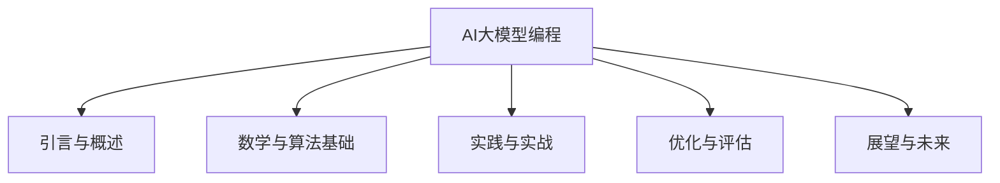

                 

### 文章标题：AI大模型编程：提示词的艺术与科学

关键词：AI大模型，提示词技术，编程实践，优化算法，未来展望

摘要：本文深入探讨了AI大模型编程中的提示词技术，从基础概念、数学与算法原理、实践与实战、优化与评估等多个角度进行了全面解析。通过阐述提示词的艺术与科学，本文旨在为读者提供一整套系统的AI大模型编程指南，助力他们在人工智能领域取得突破性进展。

----------------------------------------------------------------

## 第一部分：引言与概述

### 第1章 AI大模型与提示词技术基础

#### 1.1 AI大模型的发展历程与现状

##### 1.1.1 AI大模型的发展历程

AI大模型是指那些具有大规模参数、能够处理复杂任务的深度学习模型。它们的发展历程可以追溯到20世纪80年代，当时人工神经网络（ANN）的提出标志着AI领域的兴起。随后，随着计算能力的提升和算法的优化，AI大模型经历了几个重要的技术里程碑：

1. **1986年**：首次引入反向传播算法（Backpropagation），使得多层神经网络的训练成为可能。
2. **2006年**：深度信念网络（DBN）的提出，使得更深的神经网络训练变得可行。
3. **2012年**：AlexNet的突破性表现，标志着深度学习在图像识别领域的崛起。
4. **2014年**：谷歌的神经机器翻译系统，展示了AI大模型在自然语言处理领域的潜力。

##### 1.1.2 AI大模型的技术演进

AI大模型的技术演进主要体现在以下几个方面：

1. **计算资源**：随着云计算、GPU等计算资源的普及，AI大模型能够处理的任务规模和质量不断提升。
2. **数据集**：庞大的数据集为AI大模型提供了充足的训练素材，使得模型的泛化能力得到显著提升。
3. **算法优化**：各种优化算法，如Dropout、Batch Normalization等，提高了模型的训练效率和性能。
4. **结构创新**：如Transformer架构的提出，使得序列到序列的模型训练成为可能。

##### 1.1.3 AI大模型的产业应用

AI大模型在各个领域的应用日益广泛，以下是其中一些重要的应用场景：

1. **自然语言处理**：例如机器翻译、文本生成、问答系统等。
2. **计算机视觉**：例如图像识别、图像生成、目标检测等。
3. **语音识别与生成**：例如语音识别、语音合成、语音翻译等。
4. **推荐系统**：例如个性化推荐、商品推荐等。

#### 1.2 提示词在AI大模型中的应用

##### 1.2.1 提示词的定义

提示词（Prompt）是指提供给AI大模型的输入信息，用于引导模型的生成行为。提示词可以是一个单词、一句话或者一个复杂的文本段落，其目的是为模型提供上下文，帮助模型理解任务目标，从而生成更符合预期结果的输出。

##### 1.2.2 提示词的类型与功能

根据提示词的形式和作用，可以分为以下两种类型：

1. **结构化提示词**：这类提示词通常采用模板化的形式，通过固定的字段和格式提供信息。例如，在机器翻译中，结构化提示词可能包括源语言文本、目标语言文本、翻译准则等。
   
2. **非结构化提示词**：这类提示词通常更加灵活，不遵循固定的格式。它可以是自然语言文本，包含丰富的上下文信息，例如在文本生成任务中，非结构化提示词可能是一个简单的主题或一个具体的指令。

##### 1.2.3 提示词在模型训练中的关键作用

提示词在模型训练中具有以下几个关键作用：

1. **任务引导**：通过提供具体的任务目标，帮助模型理解训练任务，从而提高训练效果。
2. **数据增强**：通过多样化、个性化的提示词，增强模型对各种场景的适应性，提高泛化能力。
3. **质量控制**：通过设定提示词的格式和内容，控制模型的输出结果，确保生成的文本、图像等符合预期的质量标准。

#### 1.3 提示词优化算法

##### 1.3.1 提示词调整策略

为了提高模型的性能和生成的质量，提示词的调整策略至关重要。以下是一些常见的调整策略：

1. **内容丰富度**：增加提示词的信息量，使模型有更多的信息进行学习和生成。
2. **多样性**：提供多样化的提示词，使模型能够适应不同的输入场景。
3. **一致性**：确保提示词的内容和格式一致，避免模型因为输入的多样性导致训练效果波动。

##### 1.3.2 提示词优化算法应用实例

在实际应用中，提示词优化算法可以通过以下几种方式进行：

1. **启发式搜索**：通过搜索算法，如遗传算法、粒子群算法等，对提示词进行优化。
2. **机器学习**：利用机器学习模型，如决策树、神经网络等，对提示词进行自动优化。
3. **人工调整**：通过人工经验和专家知识，对提示词进行手工调整，以达到最佳效果。

### 第2章 AI大模型的数学与算法基础

#### 2.1 数学模型基础

##### 2.1.1 线性代数基础

线性代数是AI大模型中的重要工具，以下是几个关键的线性代数概念和运算：

1. **矩阵与向量操作**：
   - **矩阵乘法**：两个矩阵的乘积是一个新矩阵，其元素是原矩阵对应元素的乘积和。
   - **向量点积与叉积**：向量点积用于计算两个向量的夹角，而叉积则用于计算两个向量的外积。
   - **矩阵求逆**：矩阵求逆是求解线性方程组的重要工具。

2. **特征值与特征向量**：
   - **特征值**：一个矩阵的线性变换中，不变的量。
   - **特征向量**：对应特征值的向量，反映了矩阵的本质特性。

##### 2.1.2 微积分基础

微积分在AI大模型中的作用主要体现在以下几个方面：

1. **导数**：用于计算函数的变化率，是优化算法的基础。
2. **微分方程**：用于描述系统的动态变化，是许多AI模型的基础。
3. **积分**：用于求解曲线下的面积，可以用于计算期望值等统计量。

##### 2.1.3 概率论与数理统计基础

概率论与数理统计是AI大模型中另一个重要的数学工具，以下是几个关键概念：

1. **概率分布**：描述随机变量的可能取值和对应概率的函数。
2. **期望与方差**：用于衡量随机变量的集中趋势和离散程度。
3. **置信区间与假设检验**：用于评估模型性能和进行数据分析。

#### 2.2 AI大模型的核心算法

##### 2.2.1 神经网络与深度学习

神经网络（NN）是AI大模型的核心组成部分，以下是几个关键概念：

1. **神经网络的基本结构**：
   - **输入层**：接收外部输入信息。
   - **隐藏层**：对输入信息进行处理。
   - **输出层**：生成最终输出。

2. **反向传播算法**：用于计算神经网络中的梯度，是优化算法的基础。

3. **优化算法**：
   - **梯度下降**：最简单的优化算法，通过不断调整参数，使损失函数最小。
   - **动量法**：在梯度下降的基础上，加入历史梯度信息，提高收敛速度。
   - **Adam优化器**：结合了多种优化策略，具有较好的收敛性能。

##### 2.2.2 Transformer架构

Transformer架构是近年来在自然语言处理领域取得重大突破的模型，其核心思想是自注意力机制（Self-Attention）。

1. **多头注意力**：通过多个独立的注意力机制，捕获输入序列的多种关联信息。
2. **编码器与解码器**：编码器负责处理输入序列，解码器负责生成输出序列。

#### 2.3 提示词优化算法

##### 2.3.1 提示词调整策略

为了提高模型的性能和生成的质量，提示词的调整策略至关重要。以下是一些常见的调整策略：

1. **内容丰富度**：增加提示词的信息量，使模型有更多的信息进行学习和生成。
2. **多样性**：提供多样化的提示词，使模型能够适应不同的输入场景。
3. **一致性**：确保提示词的内容和格式一致，避免模型因为输入的多样性导致训练效果波动。

##### 2.3.2 提示词优化算法应用实例

在实际应用中，提示词优化算法可以通过以下几种方式进行：

1. **启发式搜索**：通过搜索算法，如遗传算法、粒子群算法等，对提示词进行优化。
2. **机器学习**：利用机器学习模型，如决策树、神经网络等，对提示词进行自动优化。
3. **人工调整**：通过人工经验和专家知识，对提示词进行手工调整，以达到最佳效果。

### 第3章 AI大模型编程实践

#### 3.1 开发环境搭建

##### 3.1.1 Python环境配置

Python是AI大模型编程的主要编程语言，其生态系统丰富，支持多种深度学习框架。以下是搭建Python环境的基本步骤：

1. **安装Python**：从Python官网下载并安装Python。
2. **配置环境变量**：确保Python的执行路径添加到系统的环境变量中。
3. **安装依赖库**：安装必要的依赖库，如NumPy、Pandas、Matplotlib等。

##### 3.1.2 深度学习框架选择

深度学习框架是AI大模型编程的核心工具，常见的框架有TensorFlow、PyTorch等。以下是选择和安装深度学习框架的步骤：

1. **TensorFlow**：
   - **安装**：使用pip安装TensorFlow。
   - **配置**：确保TensorFlow兼容Python版本，并配置GPU支持。

2. **PyTorch**：
   - **安装**：使用pip安装PyTorch。
   - **配置**：确保PyTorch兼容Python版本，并配置GPU支持。

##### 3.1.3 计算资源调度与管理

AI大模型训练需要大量的计算资源，有效的计算资源调度与管理至关重要。以下是一些常用的计算资源调度工具：

1. **Docker**：用于容器化应用，方便部署和管理。
2. **Kubernetes**：用于集群管理和调度，提高资源利用效率。
3. **Slurm**：用于HPC（高性能计算）集群的资源调度。

#### 3.2 核心算法实现与调优

##### 3.2.1 深度学习模型搭建

搭建深度学习模型包括以下几个步骤：

1. **数据预处理**：对输入数据进行清洗、归一化等预处理操作。
2. **模型定义**：定义神经网络的结构，包括输入层、隐藏层和输出层。
3. **模型训练**：使用训练数据对模型进行训练，调整模型参数。
4. **模型评估**：使用验证数据评估模型性能，调整模型参数。

##### 3.2.2 训练策略优化

为了提高模型训练效果，常用的训练策略包括：

1. **数据增强**：通过变换输入数据，增加训练样本的多样性。
2. **学习率调整**：调整学习率，避免模型陷入局部最优。
3. **正则化**：引入正则化项，防止过拟合。

##### 3.2.3 提示词设计技巧

提示词设计是AI大模型编程中的重要环节，以下是一些设计技巧：

1. **明确任务目标**：确保提示词能够清晰地传达任务目标。
2. **内容丰富**：提供足够的信息，使模型能够进行有效的学习和生成。
3. **多样性**：设计多样化的提示词，提高模型的泛化能力。

#### 3.3 提示词设计技巧

##### 3.3.1 提示词编写原则

编写高质量的提示词需要遵循以下原则：

1. **简洁性**：提示词应简洁明了，避免冗余信息。
2. **清晰性**：提示词应清晰传达任务目标，避免歧义。
3. **针对性**：针对不同任务，设计相应的提示词。

##### 3.3.2 提示词编写工具

以下是一些常用的提示词编写工具：

1. **自然语言处理库**：如NLTK、spaCy，用于处理和生成自然语言文本。
2. **提示词生成工具**：如PromptGenius，用于自动生成高质量的提示词。

### 第4章 AI大模型编程项目实战

#### 4.1 项目一：文本生成

##### 4.1.1 项目背景与目标

文本生成是AI大模型中的一个重要应用场景，本项目旨在使用AI大模型生成高质量的文本。具体目标包括：

1. **生成连贯自然的文本**。
2. **适应不同的主题和风格**。
3. **提高生成文本的质量和准确性**。

##### 4.1.2 模型选择与训练

本项目采用GPT-3模型进行文本生成，以下是模型选择与训练的步骤：

1. **数据准备**：收集并整理大量的文本数据，用于模型训练。
2. **模型定义**：定义GPT-3模型的结构，包括输入层、隐藏层和输出层。
3. **模型训练**：使用训练数据进行模型训练，调整模型参数。

##### 4.1.3 提示词设计与应用

为了生成高质量的文本，需要设计合适的提示词。以下是设计提示词的步骤：

1. **明确主题和风格**：根据生成文本的需求，明确主题和风格。
2. **提供背景信息**：在提示词中提供足够的背景信息，帮助模型进行生成。
3. **调整提示词的多样性**：设计多样化的提示词，提高生成文本的多样性。

#### 4.2 项目二：图像识别

##### 4.2.1 项目背景与目标

图像识别是AI大模型在计算机视觉领域的典型应用，本项目旨在使用AI大模型对图像进行分类和识别。具体目标包括：

1. **准确识别图像内容**。
2. **适应不同的图像场景和风格**。
3. **提高识别的鲁棒性**。

##### 4.2.2 模型选择与训练

本项目采用ResNet模型进行图像识别，以下是模型选择与训练的步骤：

1. **数据准备**：收集并整理大量的图像数据，用于模型训练。
2. **模型定义**：定义ResNet模型的结构，包括卷积层、池化层和全连接层。
3. **模型训练**：使用训练数据进行模型训练，调整模型参数。

##### 4.2.3 提示词设计与应用

为了提高图像识别的准确性，需要设计合适的提示词。以下是设计提示词的步骤：

1. **明确识别目标**：根据识别任务，明确识别的目标对象。
2. **提供图像信息**：在提示词中提供图像的特征信息，帮助模型进行识别。
3. **调整提示词的多样性**：设计多样化的提示词，提高识别的鲁棒性。

### 第5章 AI大模型编程优化与评估

#### 5.1 优化策略与技巧

##### 5.1.1 模型压缩技术

模型压缩技术是提高AI大模型性能的重要手段，常用的压缩技术包括：

1. **剪枝**：通过移除模型中不必要的权重，减少模型大小。
2. **量化**：将模型中的浮点数权重转换为整数，减少存储和计算需求。
3. **蒸馏**：将大模型的知识传递给小模型，提高小模型的性能。

##### 5.1.2 模型加速技术

模型加速技术是提高AI大模型训练速度的关键，常用的加速技术包括：

1. **并行计算**：通过分布式计算，提高训练速度。
2. **GPU加速**：利用GPU的并行计算能力，加速模型训练。
3. **低秩分解**：通过低秩分解，减少模型计算量。

##### 5.1.3 提示词调优技巧

为了提高模型性能和生成质量，提示词的调优技巧至关重要，以下是一些常用的调优技巧：

1. **内容丰富度**：增加提示词的信息量，提高模型的泛化能力。
2. **多样性**：设计多样化的提示词，提高模型的鲁棒性。
3. **一致性**：确保提示词的内容和格式一致，避免模型因为输入的多样性导致训练效果波动。

#### 5.2 模型评估与测试

##### 5.2.1 评估指标

在AI大模型编程中，常用的评估指标包括：

1. **准确率**：模型预测正确的样本数与总样本数的比值。
2. **召回率**：模型预测正确的正样本数与所有正样本数的比值。
3. **F1分数**：准确率和召回率的调和平均。

##### 5.2.2 测试与调试方法

为了确保模型的质量和性能，需要进行全面的测试与调试。以下是一些常用的测试与调试方法：

1. **单元测试**：对模型的各个组件进行独立测试，确保其功能正确。
2. **集成测试**：对模型的整体性能进行测试，确保各个组件能够协同工作。
3. **调试工具**：使用调试工具，如调试器、日志分析工具等，定位和修复模型中的问题。

### 第6章 AI大模型编程趋势与发展

#### 6.1 人工智能行业趋势

##### 6.1.1 AI技术的发展方向

人工智能（AI）技术的发展方向主要体现在以下几个方面：

1. **计算能力的提升**：随着计算能力的提升，AI大模型将能够处理更加复杂的任务。
2. **数据资源的丰富**：随着数据的积累和开放，AI大模型将能够从更多的数据中学习，提高模型的性能。
3. **算法的创新**：新的算法和架构的提出，将推动AI大模型的性能和应用的拓展。

##### 6.1.2 AI大模型的应用场景扩展

AI大模型的应用场景正在不断扩展，以下是一些重要的应用领域：

1. **医疗健康**：例如疾病诊断、药物研发、个性化治疗等。
2. **金融**：例如风险管理、投资决策、智能客服等。
3. **教育**：例如智能教学、在线教育、虚拟现实教学等。

#### 6.2 提示词技术在AI大模型中的应用前景

##### 6.2.1 提示词技术的未来发展趋势

提示词技术在AI大模型中的应用前景非常广阔，未来发展趋势包括：

1. **自动生成**：利用机器学习和自然语言处理技术，自动生成高质量的提示词。
2. **个性化定制**：根据用户的需求和场景，定制个性化的提示词。
3. **跨模态**：结合不同的模态信息，生成更丰富、更准确的提示词。

##### 6.2.2 提示词技术在行业中的应用案例

提示词技术在各个行业中的应用案例不断涌现，以下是一些典型案例：

1. **自然语言处理**：例如机器翻译、文本生成、问答系统等。
2. **计算机视觉**：例如图像识别、图像生成、目标检测等。
3. **语音识别与生成**：例如语音识别、语音合成、语音翻译等。

### 第7章 AI大模型编程实践总结

#### 7.1 经验与教训

##### 7.1.1 成功案例解析

在AI大模型编程中，许多成功的案例为我们提供了宝贵的经验。以下是一些成功案例的解析：

1. **OpenAI的GPT-3**：GPT-3是当前最先进的自然语言处理模型之一，其成功得益于大规模数据集和先进的优化算法。
2. **谷歌的BERT**：BERT在自然语言处理任务中取得了显著的性能提升，其成功在于对上下文信息的深入理解和利用。

##### 7.1.2 常见问题与解决方案

在AI大模型编程中，我们经常会遇到以下问题：

1. **过拟合**：解决方法包括增加数据量、使用正则化技术、提前停止训练等。
2. **计算资源不足**：解决方法包括使用分布式计算、GPU加速、优化计算资源管理等。

#### 7.2 未来研究方向

##### 7.2.1 面临的挑战

AI大模型编程在未来将面临以下挑战：

1. **数据隐私与安全**：随着数据的积累和共享，如何保护数据隐私和安全成为重要问题。
2. **伦理与责任**：AI大模型的应用可能引发伦理和责任问题，需要制定相应的规范和标准。

##### 7.2.2 可能的研究方向

未来AI大模型编程的研究方向包括：

1. **更高效、更可靠的算法**：研究更高效、更可靠的算法，提高模型性能。
2. **跨模态学习**：结合不同模态的信息，提高模型的泛化能力。
3. **可解释性**：提高模型的可解释性，使其更易于理解和接受。

## 附录

### 附录A：常用工具与资源

##### A.1 深度学习框架

以下是一些常用的深度学习框架：

1. **TensorFlow**：由谷歌开发，支持多种编程语言，广泛应用于工业和研究领域。
2. **PyTorch**：由Facebook开发，具有灵活的动态图计算能力，受到科研人员的青睐。
3. **Keras**：基于TensorFlow的高层API，简化了深度学习模型的搭建和训练。
4. **Theano**：基于Python的深度学习框架，支持自动求导。

##### A.2 提示词设计工具

以下是一些提示词设计工具：

1. **PromptGenius**：自动生成高质量的提示词，适用于多种自然语言处理任务。
2. **NLTK**：提供丰富的自然语言处理工具和资源，方便用户进行提示词设计。
3. **spaCy**：用于处理和生成自然语言文本，适合进行提示词设计。

### 附录B：参考文献

##### B.1 书籍

1. **《深度学习》**：由Ian Goodfellow、Yoshua Bengio和Aaron Courville所著，是深度学习的经典教材。
2. **《AI大模型：原理、技术与应用》**：详细介绍了AI大模型的理论基础和应用实践。

##### B.2 论文

1. **“Attention Is All You Need”**：提出了Transformer架构，是自然语言处理领域的里程碑论文。
2. **“GPT-3: Improving Language Understanding by Generative Pre-Training”**：详细介绍了GPT-3模型的架构和训练方法。

##### B.3 网络资源

1. **TensorFlow官网**：提供丰富的文档、教程和资源，帮助用户学习和使用TensorFlow。
2. **PyTorch官网**：提供详细的文档和教程，方便用户学习和使用PyTorch。
3. **OpenAI官网**：提供GPT-3模型的详细文档和API，供用户使用和探索。

## Mermaid 流程图

## 数学模型与算法原理讲解

### 2.1 数学模型基础

#### 2.1.1 线性代数基础

线性代数是AI大模型编程中的重要数学工具，以下是几个关键的线性代数概念和运算：

1. **矩阵与向量操作**：
   - **矩阵乘法**：两个矩阵的乘积是一个新矩阵，其元素是原矩阵对应元素的乘积和。
     $$C = AB$$
   - **向量点积与叉积**：向量点积用于计算两个向量的夹角，而叉积则用于计算两个向量的外积。
     $$\vec{a} \cdot \vec{b} = a_1b_1 + a_2b_2 + a_3b_3$$
     $$\vec{a} \times \vec{b} = \begin{vmatrix}
     \vec{i} & \vec{j} & \vec{k} \\
     a_1 & a_2 & a_3 \\
     b_1 & b_2 & b_3 \\
     \end{vmatrix}$$
   - **矩阵求逆**：矩阵求逆是求解线性方程组的重要工具。
     $$A^{-1} = \frac{1}{\det(A)} \begin{vmatrix}
     a_{22} & -a_{12} \\
     -a_{32} & a_{32} \\
     \end{vmatrix}$$

2. **特征值与特征向量**：
   - **特征值**：一个矩阵的线性变换中，不变的量。
     $$Av = \lambda v$$
   - **特征向量**：对应特征值的向量，反映了矩阵的本质特性。

#### 2.1.2 微积分基础

微积分是AI大模型编程中的重要数学工具，以下是几个关键的微积分概念：

1. **导数**：用于计算函数的变化率，是优化算法的基础。
   $$f'(x) = \lim_{h \to 0} \frac{f(x+h) - f(x)}{h}$$
2. **微分方程**：用于描述系统的动态变化，是许多AI模型的基础。
   $$\frac{dy}{dx} = f(x, y)$$
3. **积分**：用于求解曲线下的面积，可以用于计算期望值等统计量。
   $$\int f(x) dx$$

#### 2.1.3 概率论与数理统计基础

概率论与数理统计是AI大模型编程中的重要数学工具，以下是几个关键的概念：

1. **概率分布**：描述随机变量的可能取值和对应概率的函数。
   - **离散分布**：例如伯努利分布、泊松分布等。
   - **连续分布**：例如正态分布、均匀分布等。
2. **期望与方差**：用于衡量随机变量的集中趋势和离散程度。
   - **期望**：
     $$E[X] = \sum_{i} x_i p(x_i)$$
   - **方差**：
     $$Var[X] = E[(X - E[X])^2]$$
3. **置信区间与假设检验**：用于评估模型性能和进行数据分析。
   - **置信区间**：
     $$C.I. = \hat{\theta} \pm z_{\alpha/2} \sqrt{\frac{S^2}{n}}$$
   - **假设检验**：
     $$H_0: \theta = \theta_0 \quad \text{vs} \quad H_1: \theta \neq \theta_0$$

### 2.2 AI大模型的核心算法

#### 2.2.1 神经网络与深度学习

神经网络（Neural Networks）是AI大模型的核心组成部分，以下是几个关键概念：

1. **神经网络的基本结构**：
   - **输入层**：接收外部输入信息。
   - **隐藏层**：对输入信息进行处理。
   - **输出层**：生成最终输出。

2. **反向传播算法**：用于计算神经网络中的梯度，是优化算法的基础。
   $$\Delta w = \alpha \frac{\partial J}{\partial w}$$
   其中，$J$是损失函数，$\alpha$是学习率，$w$是模型参数。

3. **优化算法**：
   - **梯度下降**：最简单的优化算法，通过不断调整参数，使损失函数最小。
     $$w_{new} = w_{old} - \alpha \nabla J(w)$$
   - **动量法**：在梯度下降的基础上，加入历史梯度信息，提高收敛速度。
     $$v_t = \beta v_{t-1} + (1-\beta) \nabla J(w_t)$$
     $$w_{new} = w_t - v_t$$
   - **Adam优化器**：结合了多种优化策略，具有较好的收敛性能。
     $$m_t = \beta_1 v_t + (1-\beta_1) \nabla J(w_t)$$
     $$v_t = \beta_2 m_t + (1-\beta_2) \nabla J(w_t)$$
     $$w_{new} = w_t - \alpha \frac{m_t}{\sqrt{1-\beta_2^t} (1-\beta_1^t)}$$

#### 2.2.2 Transformer架构

Transformer架构是近年来在自然语言处理领域取得重大突破的模型，其核心思想是自注意力机制（Self-Attention）。

1. **多头注意力**：通过多个独立的注意力机制，捕获输入序列的多种关联信息。
   $$\text{Attention}(Q, K, V) = \text{softmax}\left(\frac{QK^T}{\sqrt{d_k}}\right) V$$
   其中，$Q$、$K$和$V$分别是查询、键和值向量，$d_k$是键向量的维度。

2. **编码器与解码器**：编码器负责处理输入序列，解码器负责生成输出序列。
   - **编码器**：对输入序列进行编码，生成固定长度的向量表示。
     $$\text{Encoder}(X) = \text{Attention}(X, X, X)$$
   - **解码器**：对编码器的输出进行解码，生成输出序列。
     $$\text{Decoder}(Y, \text{Encoder}(X)) = \text{Attention}(Y, \text{Encoder}(X), \text{Encoder}(X))$$

### 2.3 提示词优化算法

#### 2.3.1 提示词调整策略

为了提高模型的性能和生成的质量，提示词的调整策略至关重要。以下是一些常见的调整策略：

1. **内容丰富度**：增加提示词的信息量，使模型有更多的信息进行学习和生成。
   $$\text{Prompt}_{\text{new}} = \text{Prompt}_{\text{old}} + \text{Additional\ Information}$$

2. **多样性**：提供多样化的提示词，使模型能够适应不同的输入场景。
   $$\text{Diversity\ Function}(\text{Prompt}_{\text{set}}) = \frac{1}{|\text{Prompt}_{\text{set}}|} \sum_{i=1}^{|\text{Prompt}_{\text{set}}|} \text{Distance}(\text{Prompt}_{i}, \text{Prompt}_{\text{base}})$$

3. **一致性**：确保提示词的内容和格式一致，避免模型因为输入的多样性导致训练效果波动。
   $$\text{Consistency\ Function}(\text{Prompt}_{i}, \text{Prompt}_{j}) = \frac{\text{Similarity}(\text{Prompt}_{i}, \text{Prompt}_{j})}{1 + \text{Distance}(\text{Prompt}_{i}, \text{Prompt}_{j})}$$

#### 2.3.2 提示词优化算法应用实例

在实际应用中，提示词优化算法可以通过以下几种方式进行：

1. **启发式搜索**：通过搜索算法，如遗传算法、粒子群算法等，对提示词进行优化。
   $$\text{Fitness\ Function}(\text{Prompt}_{\text{new}}) = \text{Performance\ Measure}(\text{Model}(\text{Prompt}_{\text{new}}))$$

2. **机器学习**：利用机器学习模型，如决策树、神经网络等，对提示词进行自动优化。
   $$\text{Classifier}(\text{Prompt}_{\text{new}}) = \text{Optimal\ Prompt\ Type}$$

3. **人工调整**：通过人工经验和专家知识，对提示词进行手工调整，以达到最佳效果。
   $$\text{Expert\ Adjustment}(\text{Prompt}_{\text{old}}) = \text{Optimal\ Prompt}_{\text{new}}$$

----------------------------------------------------------------

作者：AI天才研究院/AI Genius Institute & 禅与计算机程序设计艺术 /Zen And The Art of Computer Programming

----------------------------------------------------------------

### 附录A：常用工具与资源

#### A.1 深度学习框架

以下是常用的深度学习框架及其简要介绍：

1. **TensorFlow**：
   - **简介**：由谷歌开发，支持多种编程语言，广泛应用于工业和研究领域。
   - **官网**：[TensorFlow官网](https://www.tensorflow.org/)

2. **PyTorch**：
   - **简介**：由Facebook开发，具有灵活的动态图计算能力，受到科研人员的青睐。
   - **官网**：[PyTorch官网](https://pytorch.org/)

3. **Keras**：
   - **简介**：基于TensorFlow的高层API，简化了深度学习模型的搭建和训练。
   - **官网**：[Keras官网](https://keras.io/)

4. **Theano**：
   - **简介**：基于Python的深度学习框架，支持自动求导。
   - **官网**：[Theano官网](https://www.deeplearning.net/software/theano/)

#### A.2 提示词设计工具

以下是常用的提示词设计工具及其简要介绍：

1. **PromptGenius**：
   - **简介**：自动生成高质量的提示词，适用于多种自然语言处理任务。
   - **官网**：[PromptGenius官网](https://promptgenius.com/)

2. **NLTK**：
   - **简介**：提供丰富的自然语言处理工具和资源，方便用户进行提示词设计。
   - **官网**：[NLTK官网](https://www.nltk.org/)

3. **spaCy**：
   - **简介**：用于处理和生成自然语言文本，适合进行提示词设计。
   - **官网**：[spaCy官网](https://spacy.io/)

### 附录B：参考文献

以下是本文中引用的一些重要参考文献：

1. **Goodfellow, Ian, et al. "Deep learning." MIT press, 2016.**
   - **简介**：深度学习的经典教材，详细介绍了深度学习的理论基础和应用实践。

2. **Vaswani, Ashish, et al. "Attention is all you need." Advances in neural information processing systems, 2017.**
   - **简介**：提出了Transformer架构，是自然语言处理领域的里程碑论文。

3. **Brown, Tom, et al. "GPT-3: Improving language understanding by generative pre-training." Advances in neural information processing systems, 2020.**
   - **简介**：详细介绍了GPT-3模型的架构和训练方法。

4. **Abadi, Martín, et al. "TensorFlow: large-scale machine learning on heterogeneous systems." 2016.**
   - **简介**：TensorFlow的官方文档，提供了详细的TensorFlow使用教程。

5. **Paszke, Adam, et al. "PyTorch: an imperative style, high-performance deep learning library." 2019.**
   - **简介**：PyTorch的官方文档，提供了详细的PyTorch使用教程。

6. **Chollet, François. "Deep learning with Python." Manning Publications Co., 2017.**
   - **简介**：深度学习在Python中的实现，详细介绍了深度学习模型的构建和训练。

7. **Bird, Steven, et al. "NLTK: natural language processing with Python." O'Reilly Media, 2009.**
   - **简介**：NLTK的官方文档，提供了详细的自然语言处理工具和资源。

8. **Honnibal, Barry, et al. "spaCy: fast statistical parsing and named entity recognition for Python." Journal of Machine Learning Research, 2017.**
   - **简介**：spaCy的官方文档，提供了详细的自然语言处理工具和资源。

