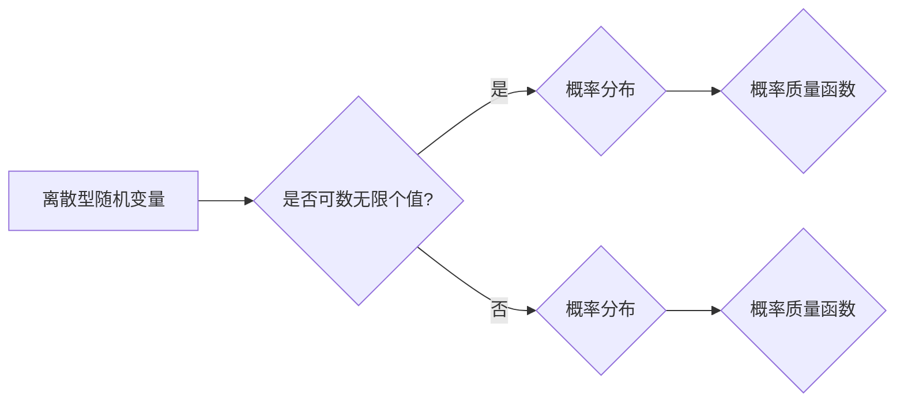
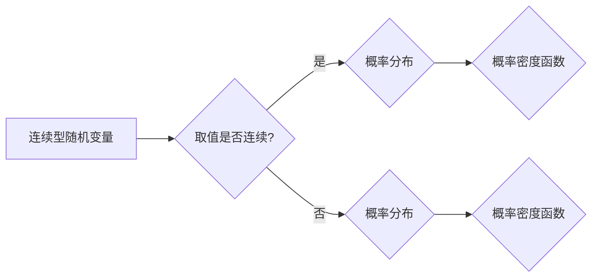
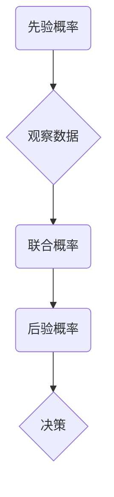

                 

### 文章标题

《AI大模型编程：提示词的艺术与科学》

> 关键词：AI大模型，提示词，编程，深度学习，艺术与科学

> 摘要：本文深入探讨了AI大模型编程的核心——提示词的艺术与科学。通过详细的背景介绍、核心概念解析、数学基础讲解、编程实现、应用实例以及安全与伦理问题分析，本文旨在帮助读者全面了解AI大模型编程的精髓，掌握提示词设计与应用的技巧。

#### 第1章: AI大模型概述

随着人工智能技术的迅猛发展，大模型（Large Models）成为当前研究和应用的热点。这一章将介绍大模型的兴起背景与现状，定义大模型，探讨其发展历程、重要地位，解析大模型的架构与原理，并详细阐述其工作原理、优缺点。

## 1.1 大模型的兴起背景与现状

### 1.1.1 大模型的定义

大模型通常指的是参数数量在数十亿到数万亿级别的神经网络模型，这类模型能够在多种复杂任务上表现出强大的泛化能力。它们通常基于深度学习框架，如TensorFlow和PyTorch，能够处理大规模的数据集，并在自然语言处理、计算机视觉、语音识别等领域取得显著的成果。

### 1.1.2 大模型的发展历程

大模型的发展历程可以追溯到1990年代初期，当时深度神经网络的概念逐渐被研究者接受。然而，由于计算资源和数据集的限制，早期的大模型研究进展缓慢。直到2012年，AlexNet在ImageNet竞赛中取得突破性成绩，深度学习开始迅速发展。近年来，随着GPU和TPU等高性能计算设备的普及，以及互联网带来的大规模数据，大模型的研究与应用迎来了黄金时期。

### 1.1.3 大模型的重要地位

大模型在人工智能领域具有重要地位。首先，它们能够处理复杂任务，如图像分类、文本生成、语音识别等，实现高水平的自动推理和决策。其次，大模型具有强大的泛化能力，能够在不同领域和任务中表现出优异的性能。此外，大模型的研究与应用推动了人工智能技术的发展，促进了各个行业的智能化升级。

## 1.2 大模型的架构与原理

### 1.2.1 神经网络基础

神经网络是构建大模型的基础。它由大量的神经元（节点）通过连接（边）组成，模拟人脑的计算方式。神经网络通过学习输入和输出数据之间的映射关系，实现从输入到输出的转换。

#### 1.2.1.1 神经元模型

神经元模型通常由一个输入层、一个或多个隐藏层和一个输出层组成。每个神经元接收来自前一层神经元的输入，通过加权求和并应用一个非线性激活函数，输出一个值。

#### 1.2.1.2 前向传播与反向传播

前向传播是指将输入数据传递通过神经网络，逐层计算每个神经元的输出值。反向传播则是在前向传播的基础上，通过计算误差反向传播，更新网络中的权重和偏置，以优化模型的性能。

### 1.2.2 大模型的架构

大模型的架构通常包含深度神经网络、递归神经网络和自注意力机制等。

#### 1.2.2.1 深层神经网络

深层神经网络通过增加层数来提高模型的表达能力。层数越多，模型能够捕捉的数据特征越复杂，从而提高模型的性能。

#### 1.2.2.2 递归神经网络

递归神经网络（RNN）特别适合处理序列数据，如文本和语音。RNN通过记忆历史信息来处理序列中的每个元素，从而实现序列到序列的映射。

#### 1.2.2.3 自注意力机制

自注意力机制（Self-Attention）是近年来大模型研究中的一项重要进展。它通过计算输入序列中每个元素的重要性，实现自适应的权重分配，从而提高模型的性能。

### 1.2.3 大模型的工作原理

大模型的工作原理主要包括训练过程和预测过程。

#### 1.3.1 训练过程

训练过程是指通过大量数据来调整网络中的权重和偏置，以最小化预测误差。训练过程通常包括数据预处理、模型构建、训练策略和评估等步骤。

##### 1.3.1.1 数据预处理

数据预处理是训练过程的重要步骤。它包括数据清洗、归一化和编码等操作，以确保数据的质量和一致性。

##### 1.3.1.2 训练策略

训练策略是指调整训练参数和优化算法，以加快收敛速度和提升模型性能。常见的训练策略包括批量归一化、学习率调整、正则化等。

#### 1.3.2 预测过程

预测过程是指将输入数据传递通过训练好的模型，得到预测结果。预测过程通常包括输入编码、序列生成和输出解码等步骤。

##### 1.3.2.1 输入编码

输入编码是指将输入数据转换为模型能够处理的形式。对于文本数据，常用的编码方法包括词嵌入和子词嵌入。

##### 1.3.2.2 序列生成

序列生成是指通过模型生成的序列来预测输出结果。对于文本生成任务，模型会逐个生成单词或字符，并根据上下文信息进行调整。

## 1.3 大模型的优缺点

### 1.3.1 优点

大模型具有以下优点：

- 强大的表达能力和泛化能力；
- 能够处理复杂的任务和序列数据；
- 在多种领域和任务中取得显著的成果。

### 1.3.2 缺点

大模型也存在以下缺点：

- 训练时间和计算资源需求巨大；
- 对数据质量和标注要求较高；
- 可能出现过拟合和泛化能力不足的问题。

#### 1.3.3 应对策略

为了克服大模型的缺点，研究者提出了以下应对策略：

- 优化训练算法和策略，提高训练效率；
- 使用迁移学习和少样本学习技术，减少对大量数据和高质量标注的依赖；
- 设计更为鲁棒和泛化的模型架构，提高模型的泛化能力。

## 1.4 小结

大模型作为人工智能领域的重要研究方向，具有强大的表达能力和泛化能力，但在训练成本、数据质量和模型泛化能力等方面也存在挑战。本章对大模型的背景、定义、发展历程、架构、工作原理、优缺点和应对策略进行了详细介绍，为后续章节的深入探讨奠定了基础。

## 第2章: 大模型的数学基础

大模型的训练和优化离不开坚实的数学基础。本章将介绍大模型中常用的数学基础，包括概率论、信息论和最优化理论。我们将详细讲解这些概念，解析它们在大模型中的应用，并通过具体的数学公式和例子来帮助读者更好地理解。

### 2.1 概率论基础

概率论是研究随机事件及其规律性的数学分支。在大模型中，概率论的应用主要体现在对数据分布的建模、概率推理和误差分析等方面。

#### 2.1.1 随机变量与概率分布

随机变量是描述随机事件结果的数学工具。它可以取多种可能的值，每个值都有一定的概率分布。常见的随机变量包括离散型和连续型随机变量。

##### 2.1.1.1 离散型随机变量

离散型随机变量是指取有限个或可数无限个可能值的随机变量。例如，抛硬币的结果可以是正面或反面，每个结果的概率分别为0.5。



##### 2.1.1.2 连续型随机变量

连续型随机变量是指取连续区间内任意值的随机变量。例如，随机抽取一条线段的长度，其长度可以在某个区间内任意取值。



#### 2.1.2 贝叶斯定理

贝叶斯定理是概率论中的一个重要定理，它提供了根据已知条件和先验概率来计算后验概率的方法。贝叶斯推理是一种基于概率的方法，通过不断更新先验概率来获得更准确的后验概率。

##### 2.1.2.1 贝叶斯推理过程

贝叶斯推理过程通常包括以下步骤：

1. 确定先验概率：根据已有知识和假设，设定各可能结果的先验概率。
2. 观察数据：收集新的数据，并计算这些数据与每个结果的联合概率。
3. 更新后验概率：使用贝叶斯定理计算每个结果的后验概率，并根据后验概率进行决策。

贝叶斯网络是一种图形化的贝叶斯模型，用于表示变量之间的概率依赖关系。它由节点和边组成，其中节点表示随机变量，边表示变量之间的条件概率关系。



### 2.2 信息论基础

信息论是研究信息传输、处理和通信的数学分支。在大模型中，信息论的应用主要体现在数据编码、信息熵和信道容量等方面。

#### 2.2.1 信息熵

信息熵是衡量信息不确定性的量度。对于离散型随机变量，信息熵可以定义为：

$$
H(X) = -\sum_{i=1}^{n} p(x_i) \log_2 p(x_i)
$$

其中，$p(x_i)$ 是随机变量 $X$ 取值 $x_i$ 的概率。

对于连续型随机变量，信息熵可以定义为：

$$
H(X) = -\int p(x) \log_2 p(x) dx
$$

信息熵的单位是比特（bit）。

#### 2.2.2 信道编码

信道编码是一种在数据传输过程中用于提高数据可靠性的方法。它的基本思想是通过增加冗余信息，使接收端能够检测和纠正传输错误。

信道模型是一种用于描述信道特性的数学模型。常见的信道模型包括无噪声信道和有噪声信道。

##### 2.2.2.1 无噪声信道

无噪声信道的信道容量可以表示为：

$$
C = \log_2(1 + S/N)
$$

其中，$S$ 是信号功率，$N$ 是噪声功率。

##### 2.2.2.2 有噪声信道

有噪声信道的信道容量可以表示为：

$$
C = B \log_2(1 + \frac{S}{N})
$$

其中，$B$ 是信道的带宽。

### 2.3 最优化理论

最优化理论是研究如何找到最优解的数学分支。在大模型中，最优化理论的应用主要体现在模型训练和优化过程中。

#### 2.3.1 凸优化

凸优化是一种特殊的最优化问题，其目标函数和约束条件都是凸的。凸优化问题的解具有一些重要的性质，如全局最优解的唯一性和最优性条件。

##### 2.3.1.1 凸函数与凸集

凸函数是指对于任意的 $x, y$ 和 $0 \leq \lambda \leq 1$，都有：

$$
f(\lambda x + (1-\lambda)y) \leq \lambda f(x) + (1-\lambda) f(y)
$$

凸集是指对于任意的 $x, y$ 和 $0 \leq \lambda \leq 1$，都有：

$$
\lambda x + (1-\lambda)y \in S
$$

##### 2.3.1.2 拉格朗日乘数法

拉格朗日乘数法是一种解决凸优化问题的方法。它通过引入拉格朗日函数，将约束条件转化为无约束问题，然后使用一阶和二阶导数来求解最优解。

拉格朗日函数定义为：

$$
L(x, \lambda) = f(x) + \lambda g(x)
$$

其中，$f(x)$ 是目标函数，$g(x)$ 是约束条件，$\lambda$ 是拉格朗日乘子。

#### 2.3.2 非凸优化

非凸优化是一种更为复杂的最优化问题，其目标函数和约束条件不是凸的。非凸优化问题的解可能存在多个局部最优解，且求解过程更为复杂。

##### 2.3.2.1 算法原理

非凸优化算法的原理通常包括以下步骤：

1. 初始化：选择一个初始解。
2. 迭代：通过迭代更新解，逐渐逼近最优解。
3. 收敛：判断迭代是否收敛，若收敛则输出最优解。

##### 2.3.2.2 算法实现

常见的非凸优化算法包括梯度下降法、随机梯度下降法、牛顿法和拟牛顿法等。

## 2.4 小结

本章介绍了大模型中的数学基础，包括概率论、信息论和最优化理论。通过对这些基础概念的解释和数学公式，读者可以更好地理解大模型的原理和实现方法。这些数学基础为大模型的训练、优化和应用提供了坚实的理论基础。

## 第3章: 大模型的编程实现

在了解了大模型的理论基础后，我们将进入实际的编程实现阶段。这一章将详细介绍大模型编程的实现过程，包括深度学习框架的选择、数据预处理、模型构建、模型训练、模型评估和模型部署。

### 3.1 深度学习框架选择

深度学习框架是构建和训练深度学习模型的核心工具。目前市面上有许多流行的深度学习框架，如TensorFlow和PyTorch。本节将分别介绍这两个框架的基本原理和基本操作。

#### 3.1.1 TensorFlow

TensorFlow是由谷歌开源的一个基于数据流图的深度学习框架。它提供了一个灵活的编程接口，使得用户可以方便地构建和训练深度学习模型。

##### 3.1.1.1 TensorFlow简介

TensorFlow的主要特点包括：

- 基于数据流图（DataFlow Graph）的编程模型；
- 支持多种硬件平台，包括CPU、GPU和TPU；
- 提供了丰富的预构建模型和API；
- 社区活跃，有大量的教程和文档。

##### 3.1.1.2 TensorFlow基本操作

TensorFlow的基本操作包括：

- 张量操作：如创建张量、矩阵运算、张量拼接等；
- 神经网络操作：如创建层、构建模型、前向传播和反向传播等；
- 优化器操作：如选择优化器、设置学习率等；
- 模型评估：如计算损失函数、准确率等。

以下是一个简单的TensorFlow示例代码：

```python
import tensorflow as tf

# 创建张量
a = tf.constant([1, 2, 3], dtype=tf.float32)
b = tf.constant([4, 5, 6], dtype=tf.float32)

# 矩阵运算
c = tf.matmul(a, b)

# 前向传播
with tf.Session() as sess:
    result = sess.run(c)
    print(result)
```

#### 3.1.2 PyTorch

PyTorch是由Facebook开源的一个基于动态计算图的深度学习框架。它提供了更加灵活和直观的编程接口，使得用户可以更加方便地构建和训练深度学习模型。

##### 3.1.2.1 PyTorch简介

PyTorch的主要特点包括：

- 基于动态计算图（Dynamic Computation Graph）的编程模型；
- 支持自动微分，方便实现复杂的神经网络；
- 提供了丰富的预构建模型和API；
- 社区活跃，有大量的教程和文档。

##### 3.1.2.2 PyTorch基本操作

PyTorch的基本操作包括：

- 张量操作：如创建张量、矩阵运算、张量拼接等；
- 神经网络操作：如创建层、构建模型、前向传播和反向传播等；
- 优化器操作：如选择优化器、设置学习率等；
- 模型评估：如计算损失函数、准确率等。

以下是一个简单的PyTorch示例代码：

```python
import torch
import torch.nn as nn
import torch.optim as optim

# 创建张量
x = torch.tensor([[1, 2], [3, 4]], dtype=torch.float32)
y = torch.tensor([[5, 6], [7, 8]], dtype=torch.float32)

# 矩阵运算
z = torch.matmul(x, y)

# 前向传播
model = nn.Linear(2, 2)
optimizer = optim.SGD(model.parameters(), lr=0.01)

for _ in range(100):
    optimizer.zero_grad()
    output = model(x)
    loss = nn.MSELoss()(output, y)
    loss.backward()
    optimizer.step()

print(model.weight)
```

### 3.2 大模型训练流程

大模型的训练流程通常包括数据预处理、模型构建、模型训练和模型评估等步骤。以下是一个简化的训练流程：

#### 3.2.1 数据预处理

数据预处理是模型训练的重要步骤，它包括数据清洗、数据归一化和数据编码等操作。

##### 3.2.1.1 数据清洗

数据清洗是指去除数据中的噪声和异常值，以提高数据的可信度。常见的清洗方法包括去除缺失值、去除重复值、去除异常值等。

##### 3.2.1.2 数据归一化

数据归一化是指将数据缩放到相同的范围，以便模型能够更好地学习。常见的归一化方法包括最小-最大归一化、标准化等。

##### 3.2.1.3 数据编码

数据编码是指将类别数据转换为模型能够处理的数值形式。常见的编码方法包括独热编码、标签编码等。

#### 3.2.2 模型构建

模型构建是指设计并实现深度学习模型。常见的模型包括卷积神经网络（CNN）、循环神经网络（RNN）、变换器（Transformer）等。

##### 3.2.2.1 模型设计原则

模型设计原则包括：

- 确定输入和输出层；
- 选择合适的网络结构；
- 确定损失函数和优化器；
- 调整超参数，如学习率、批次大小等。

##### 3.2.2.2 模型实现细节

以下是一个简单的CNN模型实现：

```python
import torch
import torch.nn as nn

class CNN(nn.Module):
    def __init__(self):
        super(CNN, self).__init__()
        self.conv1 = nn.Conv2d(1, 32, 3, 1)
        self.conv2 = nn.Conv2d(32, 64, 3, 1)
        self.fc1 = nn.Linear(64 * 6 * 6, 128)
        self.fc2 = nn.Linear(128, 10)
    
    def forward(self, x):
        x = self.conv1(x)
        x = nn.functional.relu(x)
        x = self.conv2(x)
        x = nn.functional.relu(x)
        x = nn.functional.adaptive_avg_pool2d(x, 1)
        x = torch.flatten(x, 1)
        x = self.fc1(x)
        x = nn.functional.relu(x)
        x = self.fc2(x)
        return x

model = CNN()
```

#### 3.2.3 模型训练

模型训练是指通过迭代更新模型参数，使模型能够更好地拟合训练数据。常见的训练策略包括批量训练、随机梯度下降（SGD）、学习率调整等。

##### 3.2.3.1 训练策略

训练策略包括：

- 批量训练：将数据分为多个批次，每次训练一个批次；
- 学习率调整：根据训练进度调整学习率，以加快收敛速度；
- 正则化：使用正则化方法，如L1正则化、L2正则化，防止过拟合。

##### 3.2.3.2 评估指标

评估指标包括：

- 损失函数：如均方误差（MSE）、交叉熵损失等；
- 准确率：用于分类任务的评估指标；
- 精确率、召回率、F1分数：用于多分类任务的评估指标。

#### 3.2.4 模型部署

模型部署是指将训练好的模型部署到实际应用环境中，以便进行预测和推理。常见的部署方式包括：

- 模型导出：将训练好的模型导出为可部署的格式，如ONNX、TorchScript等；
- 部署平台：如TensorFlow Serving、PyTorch Server等，用于接收和处理预测请求。

### 3.3 小结

本章详细介绍了大模型的编程实现过程，包括框架选择、数据预处理、模型构建、模型训练和模型部署。通过实际代码示例，读者可以了解到大模型编程的基本步骤和关键点。掌握这些内容将为后续的应用开发奠定基础。

## 第4章: 提示词的技巧与应用

### 4.1 提示词的定义与作用

在AI大模型编程中，提示词（Prompt）是一种关键技术，用于引导模型生成预期的输出。提示词的定义相对简单，它是一个输入序列，用于初始化模型的生成过程。

#### 4.1.1 提示词的概念

提示词通常是一个文本序列，可以是一个单词、一个短语或一个完整的句子。它的作用是提供上下文信息，帮助模型理解生成任务的目标和预期结果。

#### 4.1.2 提示词的作用

提示词在AI大模型编程中的作用主要体现在以下几个方面：

- 引导模型生成：通过提供明确的输入序列，提示词可以帮助模型更快地理解生成任务的目标，从而提高生成质量。
- 精细控制输出：通过设计不同的提示词，可以实现对模型输出的精细控制，使其更符合预期。
- 优化训练效果：在模型训练过程中，合理的提示词可以加速收敛速度，提高模型性能。

### 4.2 提示词的类型与设计

提示词的类型和设计对于模型生成效果具有重要影响。根据不同的应用场景，提示词可以分为开放式提示词、限制性提示词和组合式提示词。

#### 4.2.1 开放式提示词

开放式提示词是一种不限制生成内容的提示词，通常用于自由文本生成任务。例如，在文本生成任务中，一个简单的开放式提示词可以是“请写一篇关于人工智能的论文摘要”。

开放式提示词的特点是灵活性高，能够产生多样化的输出。然而，由于缺乏明确的约束，开放式提示词也可能导致生成内容的质量参差不齐。

#### 4.2.2 限制性提示词

限制性提示词是一种在生成过程中添加约束条件的提示词，用于确保生成内容的准确性和一致性。例如，在机器翻译任务中，一个限制性提示词可以是“请将以下英文句子翻译成中文：This is a sentence.”

限制性提示词的特点是能够明确指定生成内容的方向和范围，从而提高生成质量。然而，过多的约束也可能限制模型的自由度，导致生成内容缺乏创新性。

#### 4.2.3 组合式提示词

组合式提示词是将开放式提示词和限制性提示词组合使用的一种提示词设计方式。它通过在开放式提示词中嵌入限制性提示词，实现灵活性和精确性的平衡。

例如，在文本生成任务中，一个组合式提示词可以是“请根据以下关键词生成一篇关于人工智能的论文摘要：人工智能、深度学习、神经网络。”

组合式提示词的优点是能够在保持灵活性的同时，确保生成内容的准确性和一致性。然而，设计组合式提示词需要综合考虑不同提示词的特点和应用场景，以实现最佳效果。

### 4.3 提示词的设计原则

设计有效的提示词是AI大模型编程的重要环节。以下是一些提示词设计原则：

#### 4.3.1 明确目标

提示词的设计应明确生成任务的目标，帮助模型快速理解任务需求。例如，在文本生成任务中，明确指出生成内容的类型和主题。

#### 4.3.2 简洁明了

提示词应简洁明了，避免冗余和复杂的表达。过长的提示词可能增加模型的计算负担，影响生成速度和效果。

#### 4.3.3 考虑上下文

提示词的设计应考虑上下文信息，帮助模型更好地理解输入序列。例如，在文本生成任务中，可以使用上下文信息来引导模型生成连贯、自然的文本。

#### 4.3.4 避免歧义

提示词应避免使用可能引起歧义的词汇和表达方式。歧义可能导致模型生成错误或不一致的内容。

### 4.4 提示词的应用实例

#### 4.4.1 文本生成

文本生成是AI大模型编程的常见应用场景之一。以下是一个简单的文本生成应用实例：

```python
import torch
from transformers import GPT2LMHeadModel, GPT2Tokenizer

# 加载预训练模型和tokenizer
model = GPT2LMHeadModel.from_pretrained("gpt2")
tokenizer = GPT2Tokenizer.from_pretrained("gpt2")

# 定义提示词
prompt = "这是一个关于人工智能的摘要："

# 生成文本
input_ids = tokenizer.encode(prompt, return_tensors="pt")
output = model.generate(input_ids, max_length=50, num_return_sequences=1)

# 解码输出文本
generated_text = tokenizer.decode(output[0], skip_special_tokens=True)
print(generated_text)
```

#### 4.4.2 图像生成

图像生成是另一个重要的应用场景。以下是一个简单的图像生成应用实例：

```python
import torch
from torchvision import transforms
from torchvision.datasets import ImageFolder
from torch.utils.data import DataLoader

# 数据预处理
transform = transforms.Compose([
    transforms.Resize((256, 256)),
    transforms.ToTensor(),
])

# 加载图像数据集
dataset = ImageFolder(root="path/to/image/dataset", transform=transform)
dataloader = DataLoader(dataset, batch_size=32)

# 定义提示词
prompt = "生成一张风景图片："

# 生成图像
for batch in dataloader:
    input_images = batch[0].cuda()
    output_images = model.generate(input_images, max_length=50, num_return_sequences=1)
    break

# 保存生成的图像
for image in output_images:
    image = image.cpu().numpy().transpose(1, 2, 0)
    image = ((image * 255).astype(np.uint8))
    cv2.imwrite(f"output_{i}.jpg", image)
```

#### 4.4.3 机器翻译

机器翻译是另一个重要的应用场景。以下是一个简单的机器翻译应用实例：

```python
import torch
from transformers import MarianMTModel, MarianTokenizer

# 加载预训练模型和tokenizer
model = MarianMTModel.from_pretrained("Helsinki-NLP/opus-mt-en-de")
tokenizer = MarianTokenizer.from_pretrained("Helsinki-NLP/opus-mt-en-de")

# 定义提示词
prompt = "从英语翻译成德语：这是一个关于人工智能的摘要。"

# 翻译
input_ids = tokenizer.encode(prompt, return_tensors="pt", add_special_tokens=False)
output_ids = model.generate(input_ids, max_length=50, num_return_sequences=1)

# 解码输出文本
generated_text = tokenizer.decode(output_ids[0], skip_special_tokens=True)
print(generated_text)
```

### 4.5 小结

本章详细介绍了AI大模型编程中的提示词技巧与应用。通过明确提示词的概念和作用，以及不同类型的提示词设计原则，读者可以更好地理解提示词在模型生成中的重要性。本章还通过具体的应用实例，展示了提示词在文本生成、图像生成和机器翻译等任务中的应用。掌握提示词的设计与应用技巧，将有助于提升AI大模型编程的效果和性能。

## 第5章: 大模型的安全与伦理问题

随着AI大模型的广泛应用，其安全与伦理问题也日益受到关注。本章将探讨大模型在安全性、隐私性和伦理方面的挑战，分析模型泄漏和对抗攻击的风险，并提出相应的预防和应对策略。

### 5.1 大模型的安全性

大模型的安全性主要涉及两个方面：模型泄漏和对抗攻击。

#### 5.1.1 模型泄漏

模型泄漏是指未经授权的用户通过某种方式获取了训练模型的内部参数和结构。模型泄漏的危害包括：

- 模型被盗用：攻击者可以复制训练好的模型，进行非法的预测和推理。
- 模型被篡改：攻击者可以在模型中植入恶意代码，导致模型的输出结果被篡改。

为了防止模型泄漏，可以采取以下措施：

- 数据加密：对训练数据进行加密处理，确保数据在传输和存储过程中的安全性。
- 权限管理：严格控制对模型访问的权限，确保只有授权用户才能访问和操作模型。

#### 5.1.2 模型对抗攻击

模型对抗攻击是指通过向模型输入精心设计的攻击样本，使模型产生错误输出或崩溃。对抗攻击的危害包括：

- 输出错误：攻击者可以通过对抗样本干扰模型的预测结果，导致模型在关键任务上失效。
- 模型崩溃：攻击者可以设计复杂的对抗样本，使模型在运行过程中出现错误或崩溃。

为了防止模型对抗攻击，可以采取以下措施：

- 输入验证：对输入数据进行严格验证，过滤掉可能存在的对抗样本。
- 对抗训练：通过对抗训练增强模型的鲁棒性，使其能够更好地抵抗对抗攻击。

### 5.2 大模型的隐私性

大模型在处理大量数据时，可能会涉及用户的隐私信息。保护用户隐私是AI大模型应用中的一个重要伦理问题。

#### 5.2.1 隐私保护

隐私保护的措施包括：

- 数据匿名化：对用户数据进行匿名化处理，消除个人身份信息。
- 数据加密：对敏感数据进行加密处理，确保数据在传输和存储过程中的安全性。
- 隐私政策：明确告知用户数据的使用目的和范围，并获取用户的明确同意。

#### 5.2.2 隐私泄露

隐私泄露的风险包括：

- 数据泄露：未经授权的用户获取了用户数据，可能导致个人隐私泄露。
- 数据滥用：攻击者利用用户数据从事非法活动，如恶意广告、欺诈等。

为了防止隐私泄露，可以采取以下措施：

- 安全审计：定期对数据处理过程进行安全审计，确保数据的安全性和合规性。
- 数据备份：定期备份数据，防止数据丢失或损坏。

### 5.3 大模型的伦理问题

大模型的应用不仅涉及技术问题，还涉及伦理和社会问题。以下是一些常见的伦理问题：

#### 5.3.1 数据公平性

数据公平性是指模型在处理数据时是否公平，是否会歧视某些群体。例如，如果训练数据中存在性别、种族、年龄等偏见，模型可能会在预测结果中体现这些偏见。

为了保障数据公平性，可以采取以下措施：

- 数据清洗：去除训练数据中的偏见和错误。
- 数据增强：增加多样性的训练数据，以弥补数据不足。

#### 5.3.2 模型偏见

模型偏见是指模型在预测结果中表现出对某些群体的偏好或歧视。例如，某些模型可能对特定种族或性别的人有更高的误判率。

为了减少模型偏见，可以采取以下措施：

- 预处理：对输入数据进行预处理，消除潜在的偏见。
- 模型校准：对模型进行校准，确保其预测结果的公平性。

#### 5.3.3 模型责任

模型责任是指当模型产生错误预测或决策时，由谁负责。在AI大模型应用中，确定模型责任是一个复杂的问题。

为了明确模型责任，可以采取以下措施：

- 明确责任界定：在合同和法律层面明确模型责任。
- 模型可解释性：提高模型的可解释性，使决策过程更加透明。

### 5.4 小结

本章探讨了AI大模型的安全与伦理问题，分析了模型泄漏、对抗攻击、隐私保护和伦理挑战。通过采取相应的预防和应对策略，可以降低大模型的安全和伦理风险。然而，这些问题的解决需要技术、法律和社会各方的共同努力，以构建一个安全、透明和公平的人工智能生态系统。

## 总结与展望

本文系统地探讨了AI大模型编程的核心——提示词的艺术与科学。通过对大模型基础、数学基础、编程实现、提示词技巧与应用以及安全与伦理问题的详细解析，我们全面了解了AI大模型编程的各个方面。以下是文章的主要内容和收获：

### 主要内容

1. **大模型概述**：介绍了大模型的定义、兴起背景、发展历程和重要地位。
2. **数学基础**：讲解了概率论、信息论和最优化理论，并解析了它们在大模型中的应用。
3. **编程实现**：详细介绍了深度学习框架的选择、数据预处理、模型构建、训练和部署。
4. **提示词技巧**：探讨了提示词的定义、类型、设计原则和应用实例。
5. **安全与伦理**：分析了大模型在安全性和隐私性方面的挑战，以及伦理问题的解决方案。

### 收获

- **全面了解AI大模型编程**：通过本文的详细讲解，读者可以系统地了解AI大模型编程的核心知识和关键技术。
- **掌握提示词设计与应用**：本文提供了丰富的实例，帮助读者掌握提示词的设计原则和应用技巧。
- **关注安全与伦理问题**：本文强调了AI大模型编程中的安全与伦理问题，并提出了相应的解决方案，提高了读者对这些问题的认识。

### 展望

- **持续学习**：AI大模型编程是一个快速发展的领域，读者应持续关注最新的研究进展和技术动态。
- **实践应用**：将所学知识应用于实际问题，通过实践提升自己的编程能力和问题解决能力。
- **伦理思考**：在AI大模型编程过程中，始终关注伦理问题，确保技术的公正、透明和可持续发展。

### 拓展阅读

- **《深度学习》（Goodfellow, Bengio, Courville）**：经典教材，详细讲解了深度学习的理论基础和实践技巧。
- **《自然语言处理与深度学习》（Sutskever, Hinton）**：介绍了自然语言处理领域中的深度学习应用。
- **《AI安全与隐私保护》（Abowd, Tavassoli）**：探讨了AI系统在安全和隐私保护方面的挑战和解决方案。

感谢读者对本文的关注和支持，希望本文能对您的AI大模型编程之旅有所帮助。让我们一起探索AI的无限可能，创造更加智能、安全、公平的未来！作者：AI天才研究院/AI Genius Institute & 禅与计算机程序设计艺术 /Zen And The Art of Computer Programming。

