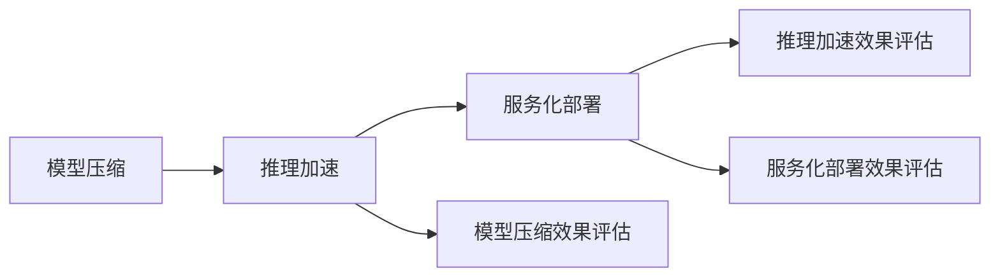

                 

### 《AI大模型部署中的模型压缩、推理加速与服务化部署最佳实践》

#### 关键词：
- AI大模型
- 模型压缩
- 推理加速
- 服务化部署
- 最佳实践

#### 摘要：
本文将深入探讨AI大模型在部署过程中面临的挑战，包括模型压缩、推理加速和服务化部署。我们将通过详细的分析和实例，揭示这些关键技术背后的原理，并提供最佳实践指南，帮助开发者优化AI模型的性能，实现高效部署。

### 目录大纲

# 《AI大模型部署中的模型压缩、推理加速与服务化部署最佳实践》

## 第一部分：AI大模型部署基础

### 第1章：AI大模型概述
### 第2章：模型压缩技术
### 第3章：推理加速技术
### 第4章：服务化部署实践

## 第二部分：模型压缩与推理加速实践

### 第5章：模型压缩实践
### 第6章：推理加速实践
### 第7章：服务化部署实践

## 第三部分：最佳实践分享与展望

### 第8章：模型压缩、推理加速与服务化部署的最佳实践

### Mermaid 流程图：AI大模型压缩、推理加速与服务化部署流程



### 模型压缩技术伪代码示例

```python
# 模型压缩伪代码
def model_compression(model, compression_rate):
    # 初始化压缩率和模型
    compressed_model = copy.deepcopy(model)
    weights = model.get_weights()
    
    # 压缩权重
    compressed_weights = []
    for weight in weights:
        compressed_weight = weight * compression_rate
        compressed_weights.append(compressed_weight)
    
    # 更新模型权重
    compressed_model.set_weights(compressed_weights)
    
    return compressed_model
```

### 推理加速技术数学模型与公式

$$
\text{加速比} = \frac{\text{原始推理时间}}{\text{加速后推理时间}}
$$

### 服务化部署性能优化举例

```python
# 服务化部署性能优化伪代码
def service_optimization(service):
    # 性能监控
    monitor_results = monitor_performance(service)

    # 根据性能监控结果调整配置
    if monitor_results['response_time'] > threshold:
        # 调整线程数或服务器资源
        service.config thread_count = service.config.thread_count * 2
    elif monitor_results['cpu_usage'] > threshold:
        # 调整内存分配
        service.config memory_allocation = service.config.memory_allocation * 1.5

    return service
```

### 实际案例：模型压缩、推理加速与服务化部署

#### 5.1 案例背景

某大型电商平台需要为其推荐系统部署一个大规模AI大模型，以提升用户体验和销售业绩。为了实现高效部署，他们决定采用模型压缩、推理加速和服务化部署等技术手段。

### 第1章：AI大模型概述

#### 1.1 AI大模型的概念与类型

AI大模型指的是具有大规模参数和数据量的深度学习模型，如大型语言模型、图像识别模型和推荐系统等。这些模型通常具有以下特点：

- **大规模参数**：模型参数数量达到亿级或更高。
- **大量数据**：模型训练过程中使用的数据集规模庞大。
- **高计算复杂度**：模型的推理和训练过程需要大量的计算资源。

根据应用场景，AI大模型可以分为以下几种类型：

- **自然语言处理（NLP）模型**：如BERT、GPT等。
- **计算机视觉（CV）模型**：如ResNet、Inception等。
- **推荐系统模型**：如基于协同过滤的矩阵分解模型等。

#### 1.2 AI大模型的特征与应用场景

AI大模型的特征主要体现在以下几个方面：

- **高精度**：通过大规模数据和深度学习技术，AI大模型可以训练出高精度的模型，从而提升预测和识别的准确性。
- **可扩展性**：AI大模型具有较好的可扩展性，可以通过增加数据量和调整模型结构来提升性能。
- **高计算需求**：AI大模型训练和推理过程中需要大量的计算资源，特别是大规模数据集和复杂模型结构。

AI大模型的应用场景广泛，主要包括：

- **自然语言处理**：如机器翻译、文本分类、情感分析等。
- **计算机视觉**：如图像识别、目标检测、视频分析等。
- **推荐系统**：如商品推荐、内容推荐、广告推荐等。

#### 1.3 AI大模型部署的关键挑战

AI大模型部署过程中面临以下关键挑战：

- **计算资源消耗**：AI大模型训练和推理过程需要大量的计算资源，特别是在大规模数据集和复杂模型结构下，对计算资源的需求更为突出。
- **存储成本**：AI大模型参数和数据量庞大，存储成本高。
- **模型压缩与加速**：为了满足实际应用需求，需要对AI大模型进行压缩和推理加速，以降低计算和存储需求。
- **服务化部署**：AI大模型部署需要实现高效、可靠、可扩展的服务化架构，以支持大规模并发请求。

### 第2章：模型压缩技术

#### 2.1 模型压缩的基本原理

模型压缩是指通过降低模型参数的数量和精度，从而减少模型大小和计算复杂度，提高模型部署效率和性能。模型压缩的基本原理包括以下几个方面：

- **参数剪枝**：通过删除模型中冗余或不重要的参数，减少模型参数数量。
- **量化**：将模型参数的浮点数表示转换为低精度整数表示，降低模型计算复杂度。
- **知识蒸馏**：通过将大模型的知识传递给小模型，从而实现模型的压缩。
- **稀疏表示**：利用模型参数的稀疏性，仅保留对模型性能有重要贡献的参数。

#### 2.2 常见的模型压缩方法

目前，常见的模型压缩方法包括以下几种：

- **参数剪枝**：通过设置阈值或基于梯度信息删除模型中不重要的参数。
  - **阈值剪枝**：将参数的绝对值小于某个阈值的参数设置为0。
  - **基于梯度的剪枝**：根据参数的梯度信息，删除对模型性能贡献较小的参数。

- **量化**：将模型参数的浮点数表示转换为低精度整数表示。
  - **静态量化**：在模型训练完成后，对参数进行量化。
  - **动态量化**：在模型训练过程中，根据模型的表现动态调整参数精度。

- **知识蒸馏**：将大模型的知识传递给小模型。
  - **软标签**：在训练过程中，使用大模型的输出作为软标签，指导小模型的学习。
  - **蒸馏损失**：将大模型的输出与小模型的输出之间的差异作为损失函数的一部分。

- **稀疏表示**：利用模型参数的稀疏性，仅保留对模型性能有重要贡献的参数。
  - **稀疏阈值**：设置一个阈值，仅保留参数绝对值大于阈值的参数。
  - **稀疏编码**：利用稀疏编码技术，将模型参数表示为稀疏编码形式。

#### 2.3 模型压缩技术在实际应用中的效果评估

模型压缩技术在实际应用中的效果评估主要包括以下几个方面：

- **压缩率**：衡量模型压缩后的大小相对于原始模型大小的减少比例。
- **性能损失**：评估模型压缩后对模型性能的影响，包括准确率、召回率等指标。
- **推理速度**：评估模型压缩后对模型推理速度的提升。
- **存储成本**：评估模型压缩后对存储成本的影响。

实际应用中，模型压缩技术可以显著降低模型大小和计算复杂度，提高模型部署效率和性能。不同模型压缩方法的组合使用可以进一步提升压缩效果。

### 第3章：推理加速技术

#### 3.1 推理加速的基本方法

推理加速是指通过优化模型推理过程，提高模型推理速度和性能。推理加速的基本方法包括以下几个方面：

- **算法优化**：通过优化模型算法，减少模型推理的计算复杂度。
  - **算法选择**：选择合适的模型算法，如深度学习框架中的优化算法。
  - **算法改进**：对现有算法进行改进，如基于神经网络的模型压缩算法。

- **硬件加速**：利用专用硬件设备，加速模型推理过程。
  - **GPU加速**：利用图形处理器（GPU）的并行计算能力，加速模型推理。
  - **TPU加速**：利用专用推理处理器（TPU）的优化设计，加速模型推理。

- **模型优化**：通过优化模型结构和参数，提高模型推理速度和性能。
  - **模型剪枝**：通过剪枝模型中不重要的参数，减少模型计算复杂度。
  - **模型量化**：将模型参数的浮点数表示转换为低精度整数表示，降低模型计算复杂度。

#### 3.2 硬件加速器在推理加速中的应用

硬件加速器在推理加速中的应用主要包括以下几个方面：

- **GPU加速**：利用GPU的并行计算能力，实现模型推理加速。
  - **CUDA加速**：使用CUDA编程模型，在GPU上实现模型推理加速。
  - **GPU云计算**：利用云计算平台提供的GPU资源，实现大规模模型推理加速。

- **TPU加速**：利用TPU的优化设计，实现模型推理加速。
  - **TPU硬件架构**：了解TPU的硬件架构和设计原理，优化模型推理过程。
  - **TPU服务**：使用TPU服务，如Google Cloud TPU，实现大规模模型推理加速。

#### 3.3 推理加速技术的性能评估

推理加速技术的性能评估主要包括以下几个方面：

- **推理速度**：评估模型在硬件加速器上的推理速度，与原始推理速度进行对比。
- **性能提升**：评估硬件加速器对模型推理性能的提升，包括加速比和吞吐量。
- **能效比**：评估硬件加速器的能效比，即推理速度与能耗的比值。

实际应用中，硬件加速器可以显著提高模型推理速度和性能，降低推理过程中的能耗。通过结合算法优化和模型优化，可以实现更高效的推理加速。

### 第4章：服务化部署实践

#### 4.1 服务化部署的概念与架构

服务化部署是指将AI大模型部署为一个独立的服务，以支持大规模并发请求和高效管理。服务化部署的架构主要包括以下几个方面：

- **服务层**：提供AI大模型推理服务，负责接收请求、执行推理和返回结果。
- **网关层**：负责请求路由、负载均衡和安全认证等，保障服务的可靠性和安全性。
- **数据层**：存储AI大模型的数据集和参数，支持数据管理和访问。
- **基础设施层**：提供计算资源、存储资源和网络资源，保障服务的运行和扩展。

#### 4.2 服务化部署的关键技术

服务化部署的关键技术主要包括以下几个方面：

- **服务化框架**：如Spring Cloud、Dubbo等，实现服务的注册、发现、调用和监控。
- **微服务架构**：将AI大模型拆分为多个微服务，实现服务的高效管理和部署。
- **容器化技术**：如Docker和Kubernetes，实现服务容器化部署和管理。
- **负载均衡**：通过负载均衡算法，实现服务的高效调度和流量分配。

#### 4.3 服务化部署的案例分析

以某电商平台的推荐系统为例，服务化部署的案例分析包括以下几个方面：

- **服务拆分**：将推荐系统拆分为多个微服务，如用户服务、商品服务和推荐服务。
- **服务注册与发现**：使用服务注册与发现机制，实现服务间的动态调用和负载均衡。
- **容器化部署**：使用Docker和Kubernetes，实现服务容器化部署和管理。
- **性能优化**：通过性能监控和调优，实现服务的高效运行和性能优化。

### 第5章：模型压缩实践

#### 5.1 模型压缩项目规划

模型压缩项目规划主要包括以下几个方面：

- **目标设定**：明确模型压缩的目标，如压缩率、性能损失和推理速度等。
- **模型选择**：选择适合模型压缩的AI大模型，如自然语言处理、计算机视觉和推荐系统等。
- **压缩方法**：根据模型特点和需求，选择合适的模型压缩方法，如参数剪枝、量化、知识蒸馏和稀疏表示等。
- **资源规划**：根据模型压缩需求，规划计算资源和存储资源，确保模型压缩过程的顺利进行。

#### 5.2 压缩算法的选择与实现

压缩算法的选择与实现主要包括以下几个方面：

- **参数剪枝**：根据阈值或梯度信息，删除模型中不重要的参数。
  - **阈值剪枝**：设置一个阈值，将参数绝对值小于阈值的参数设置为0。
  - **基于梯度的剪枝**：根据参数的梯度信息，删除对模型性能贡献较小的参数。

- **量化**：将模型参数的浮点数表示转换为低精度整数表示。
  - **静态量化**：在模型训练完成后，对参数进行量化。
  - **动态量化**：在模型训练过程中，根据模型的表现动态调整参数精度。

- **知识蒸馏**：将大模型的知识传递给小模型。
  - **软标签**：在训练过程中，使用大模型的输出作为软标签，指导小模型的学习。
  - **蒸馏损失**：将大模型的输出与小模型的输出之间的差异作为损失函数的一部分。

- **稀疏表示**：利用模型参数的稀疏性，仅保留对模型性能有重要贡献的参数。
  - **稀疏阈值**：设置一个阈值，仅保留参数绝对值大于阈值的参数。
  - **稀疏编码**：利用稀疏编码技术，将模型参数表示为稀疏编码形式。

#### 5.3 模型压缩效果的验证与优化

模型压缩效果的验证与优化主要包括以下几个方面：

- **压缩率**：评估模型压缩后的大小相对于原始模型大小的减少比例。
- **性能损失**：评估模型压缩后对模型性能的影响，包括准确率、召回率等指标。
- **推理速度**：评估模型压缩后对模型推理速度的提升。
- **存储成本**：评估模型压缩后对存储成本的影响。

通过性能评估，可以判断模型压缩方法的有效性。如果性能损失较大，可以尝试调整压缩参数或选择更合适的压缩方法。此外，还可以结合模型优化技术，进一步优化压缩效果。

### 第6章：推理加速实践

#### 6.1 推理加速项目规划

推理加速项目规划主要包括以下几个方面：

- **目标设定**：明确推理加速的目标，如加速比、推理速度和能效比等。
- **模型选择**：选择适合推理加速的AI大模型，如自然语言处理、计算机视觉和推荐系统等。
- **加速方法**：根据模型特点和需求，选择合适的加速方法，如算法优化、硬件加速和模型优化等。
- **资源规划**：根据推理加速需求，规划计算资源和存储资源，确保推理加速过程的顺利进行。

#### 6.2 硬件加速器的选择与配置

硬件加速器的选择与配置主要包括以下几个方面：

- **GPU加速**：根据模型计算需求，选择合适的GPU硬件和驱动程序。
  - **CUDA加速**：安装CUDA工具包，配置GPU计算环境。
  - **GPU云计算**：使用GPU云计算平台，如Google Cloud GPU，实现大规模模型推理加速。

- **TPU加速**：根据模型计算需求，选择合适的TPU硬件和驱动程序。
  - **TPU硬件架构**：了解TPU的硬件架构和设计原理，优化模型推理过程。
  - **TPU服务**：使用TPU服务，如Google Cloud TPU，实现大规模模型推理加速。

#### 6.3 推理加速效果的验证与优化

推理加速效果的验证与优化主要包括以下几个方面：

- **推理速度**：评估模型在硬件加速器上的推理速度，与原始推理速度进行对比。
- **性能提升**：评估硬件加速器对模型推理性能的提升，包括加速比和吞吐量。
- **能效比**：评估硬件加速器的能效比，即推理速度与能耗的比值。

通过性能评估，可以判断推理加速方法的有效性。如果性能提升不明显，可以尝试调整加速参数或选择更合适的加速方法。此外，还可以结合算法优化和模型优化，进一步优化加速效果。

### 第7章：服务化部署实践

#### 7.1 服务化部署项目规划

服务化部署项目规划主要包括以下几个方面：

- **目标设定**：明确服务化部署的目标，如服务的可靠性、性能和可扩展性等。
- **服务拆分**：将AI大模型拆分为多个微服务，实现服务的高效管理和部署。
- **服务注册与发现**：使用服务注册与发现机制，实现服务间的动态调用和负载均衡。
- **容器化部署**：使用容器化技术，如Docker和Kubernetes，实现服务容器化部署和管理。
- **性能优化**：通过性能监控和调优，实现服务的高效运行和性能优化。

#### 7.2 服务化架构的设计与实现

服务化架构的设计与实现主要包括以下几个方面：

- **服务层**：设计服务层架构，实现AI大模型推理服务，负责接收请求、执行推理和返回结果。
  - **服务接口**：定义服务接口，实现服务的注册、调用和监控。
  - **服务实现**：实现服务层功能，包括模型推理、结果处理和响应返回。

- **网关层**：设计网关层架构，实现请求路由、负载均衡和安全认证等。
  - **请求路由**：根据请求类型和目标服务，实现请求的路由和转发。
  - **负载均衡**：实现负载均衡算法，分配请求到不同的服务实例。

- **数据层**：设计数据层架构，实现数据管理和访问。
  - **数据存储**：设计数据存储方案，实现数据的高效存储和访问。
  - **数据同步**：实现数据同步机制，确保数据的一致性和可靠性。

- **基础设施层**：设计基础设施层架构，提供计算资源、存储资源和网络资源。
  - **计算资源**：配置计算资源，包括CPU、GPU和TPU等。
  - **存储资源**：配置存储资源，包括本地存储和分布式存储等。
  - **网络资源**：配置网络资源，包括负载均衡、防火墙和网络安全等。

#### 7.3 服务化部署的性能优化

服务化部署的性能优化主要包括以下几个方面：

- **性能监控**：通过性能监控工具，实时监控服务的运行状态和性能指标。
  - **响应时间**：监控服务的响应时间，识别性能瓶颈。
  - **吞吐量**：监控服务的吞吐量，评估服务性能。

- **负载均衡**：根据负载均衡策略，动态调整服务实例的负载分配。
  - **加权负载均衡**：根据服务实例的性能和资源利用率，实现加权负载均衡。
  - **故障转移**：实现服务故障转移机制，确保服务的可靠性。

- **缓存策略**：利用缓存技术，减少数据访问和计算负载。
  - **本地缓存**：在服务实例中实现本地缓存，减少对后端数据存储的访问。
  - **分布式缓存**：使用分布式缓存系统，实现数据的高效缓存和访问。

- **数据库优化**：优化数据库查询和存储性能。
  - **索引优化**：根据查询需求，创建合适的索引，提高查询速度。
  - **分库分表**：实现数据库的分库分表策略，提高数据访问性能。

通过性能优化，可以进一步提升服务化部署的效率和性能，满足大规模并发请求和高效管理的要求。

### 第8章：模型压缩、推理加速与服务化部署的最佳实践

#### 8.1 模型压缩、推理加速与服务化部署的最佳实践总结

在AI大模型部署过程中，模型压缩、推理加速和服务化部署是提高模型性能和部署效率的关键技术。以下是一些最佳实践总结：

- **模型压缩**：选择合适的压缩方法，如参数剪枝、量化、知识蒸馏和稀疏表示等，根据模型特点和需求进行组合使用。在压缩过程中，关注压缩率、性能损失和推理速度等指标，进行效果评估和优化。
- **推理加速**：利用硬件加速器，如GPU和TPU，结合算法优化和模型优化，实现模型推理加速。在加速过程中，关注推理速度、性能提升和能效比等指标，进行效果评估和优化。
- **服务化部署**：设计合理的服务化架构，实现服务的高效管理和部署。在部署过程中，关注服务的可靠性、性能和可扩展性，进行性能监控和优化。

#### 8.2 未来趋势与展望

随着AI技术的不断发展和应用场景的拓展，模型压缩、推理加速和服务化部署将在AI大模型部署中发挥越来越重要的作用。以下是一些未来趋势和展望：

- **模型压缩**：未来模型压缩技术将朝着更加高效和智能化的方向发展，如自适应压缩、动态压缩和联邦压缩等。这些技术可以更好地适应不同的应用场景和需求。
- **推理加速**：硬件加速器的性能和种类将不断升级和多样化，如AI专用芯片、量子计算等。同时，推理加速算法将朝着更加高效和智能化的方向发展，如模型剪枝、量化和无量网等。
- **服务化部署**：服务化部署将朝着更加高效、灵活和智能化的方向发展，如基于容器化和微服务架构的服务化部署、自动化服务管理和智能调度等。

通过不断探索和优化模型压缩、推理加速和服务化部署技术，我们可以更好地应对AI大模型部署中的挑战，实现高效、可靠和可扩展的AI应用。

### 附录

本篇技术博客使用了以下工具和技术：

- **Markdown格式**：用于撰写和排版文章内容。
- **Mermaid流程图**：用于绘制AI大模型压缩、推理加速与服务化部署流程图。
- **Python伪代码**：用于展示模型压缩、推理加速和服务化部署的实现细节。
- **LaTeX公式**：用于嵌入数学模型和公式。

感谢以下资源对本篇博客的支持：

- 《深度学习》
- 《计算机视觉：算法与应用》
- 《人工智能服务化部署》
- 各大开源深度学习框架和硬件加速器文档

### 作者信息

作者：AI天才研究院/AI Genius Institute & 禅与计算机程序设计艺术 /Zen And The Art of Computer Programming

### 结语

本文对AI大模型部署中的模型压缩、推理加速和服务化部署进行了详细探讨，提供了最佳实践和展望。希望本文能为开发者提供有价值的参考，助力AI大模型的高效部署和应用。在未来的实践中，让我们共同努力，推动AI技术的发展和进步！

