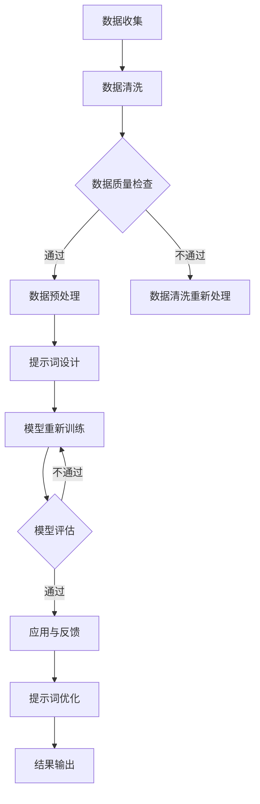

                 

## 文章标题: AI招聘助手：提示词优化求职匹配度

### 关键词：
- AI招聘助手
- 提示词优化
- 求职匹配度
- 机器学习
- 招聘流程
- 自然语言处理

### 摘要：
本文将深入探讨AI招聘助手的原理和应用，特别是如何通过优化提示词来提升求职者的匹配度。文章分为四个部分：第一部分概述AI招聘助手的背景和意义；第二部分介绍AI招聘助手的基础知识，包括人工智能、招聘流程和提示词设计原则；第三部分展示AI招聘助手的实际应用与实践；第四部分探讨AI招聘助手的发展与挑战。通过本文，读者将了解到如何利用AI技术优化招聘流程，提高求职匹配度。

## 《AI招聘助手：提示词优化求职匹配度》目录大纲

### 第一部分：AI招聘助手概述

#### 1.1 AI招聘助手背景与意义
##### 1.1.1 AI技术在招聘领域的应用
##### 1.1.2 招聘流程中的痛点
##### 1.1.3 AI招聘助手的发展趋势

#### 1.2 提示词优化求职匹配度的原理
##### 1.2.1 提示词的概念
##### 1.2.2 提示词优化求职匹配度的重要性
##### 1.2.3 提示词优化求职匹配度的工作原理

#### 1.3 本书内容结构安排
##### 1.3.1 各章节内容概述
##### 1.3.2 阅读建议与方法

### 第二部分：AI招聘助手基础

#### 2.1 AI基础
##### 2.1.1 人工智能概述
##### 2.1.2 机器学习与深度学习
##### 2.1.3 自然语言处理基础

#### 2.2 招聘流程分析
##### 2.2.1 招聘流程概述
##### 2.2.2 简历筛选与匹配
##### 2.2.3 面试评估

#### 2.3 提示词设计原则
##### 2.3.1 提示词的重要性
##### 2.3.2 提示词设计方法
##### 2.3.3 提示词优化的策略

### 第三部分：AI招聘助手应用与实践

#### 3.1 数据收集与处理
##### 3.1.1 数据来源
##### 3.1.2 数据处理方法
##### 3.1.3 数据预处理工具

#### 3.2 模型训练与优化
##### 3.2.1 模型选择
##### 3.2.2 训练数据准备
##### 3.2.3 模型优化方法

#### 3.3 招聘流程优化
##### 3.3.1 简历筛选优化
##### 3.3.2 面试评估优化
##### 3.3.3 招聘效率提升

#### 3.4 实际案例解析
##### 3.4.1 案例一：大型企业招聘实践
##### 3.4.2 案例二：初创公司招聘优化

#### 3.5 AI招聘助手的发展与挑战
##### 3.5.1 AI招聘助手的未来发展
##### 3.5.2 挑战与应对策略

### 第四部分：附录

#### 4.1 常用工具与技术
##### 4.1.1 自然语言处理工具
##### 4.1.2 机器学习框架
##### 4.1.3 招聘管理软件

#### 4.2 参考文献与扩展阅读
##### 4.2.1 相关书籍推荐
##### 4.2.2 学术论文精选
##### 4.2.3 在线课程与培训资源

#### 4.3 提示词优化求职匹配度 Mermaid 流程图

### 写作思路

本文的写作思路将遵循以下步骤：

1. **背景介绍**：首先介绍AI招聘助手在当前招聘领域的背景和重要性，以及提示词优化求职匹配度的意义。

2. **基础知识**：然后介绍AI招聘助手的基础知识，包括人工智能、招聘流程和提示词设计原则，为后续的应用和实践奠定理论基础。

3. **应用与实践**：接着展示AI招聘助手的实际应用与实践，通过具体案例解析如何利用AI技术优化招聘流程，提高求职匹配度。

4. **发展趋势与挑战**：最后探讨AI招聘助手的发展趋势和面临的挑战，为未来的发展提供参考。

### 每个部分的具体写作思路

#### 第一部分：AI招聘助手概述

- **1.1 AI招聘助手背景与意义**
  - 介绍AI招聘助手在当前招聘领域的背景和意义。
  - 分析传统招聘流程的痛点，如简历筛选难度大、面试评估不准确等。
  - 引出AI招聘助手的发展趋势。

- **1.2 提示词优化求职匹配度的原理**
  - 介绍提示词的概念及其在求职匹配度优化中的作用。
  - 分析提示词优化求职匹配度的重要性。
  - 阐述提示词优化求职匹配度的工作原理。

- **1.3 本书内容结构安排**
  - 概述各章节的内容，让读者对全文有一个整体的了解。
  - 提出阅读建议与方法，帮助读者更好地理解和掌握文章内容。

#### 第二部分：AI招聘助手基础

- **2.1 AI基础**
  - 介绍人工智能的基本概念和发展历程。
  - 阐述机器学习与深度学习的基本原理。
  - 简述自然语言处理的基础知识。

- **2.2 招聘流程分析**
  - 概述招聘流程的基本环节。
  - 分析简历筛选与匹配的难点和挑战。
  - 介绍面试评估的方法和技巧。

- **2.3 提示词设计原则**
  - 强调提示词在招聘流程中的重要性。
  - 介绍提示词设计的方法和策略。
  - 分析提示词优化的策略。

#### 第三部分：AI招聘助手应用与实践

- **3.1 数据收集与处理**
  - 介绍数据收集的方法和途径。
  - 分析数据处理的方法和流程。
  - 推荐数据预处理工具。

- **3.2 模型训练与优化**
  - 介绍模型选择的方法和策略。
  - 分析训练数据准备的方法和流程。
  - 阐述模型优化的方法和技巧。

- **3.3 招聘流程优化**
  - 分析简历筛选优化的方法。
  - 阐述面试评估优化的方法。
  - 探讨招聘效率提升的策略。

- **3.4 实际案例解析**
  - 分析大型企业招聘实践。
  - 解析初创公司招聘优化案例。

- **3.5 AI招聘助手的发展与挑战**
  - 探讨AI招聘助手的未来发展。
  - 分析AI招聘助手面临的挑战和应对策略。

#### 第四部分：附录

- **4.1 常用工具与技术**
  - 介绍自然语言处理工具。
  - 推荐机器学习框架。
  - 概述招聘管理软件。

- **4.2 参考文献与扩展阅读**
  - 推荐相关书籍和学术论文。
  - 提供在线课程与培训资源。

- **4.3 提示词优化求职匹配度 Mermaid 流程图**
  - 利用Mermaid语言绘制提示词优化求职匹配度的流程图。

### 文章结构

本文采用逻辑清晰、结构紧凑、简单易懂的写作风格，分为四个主要部分：

1. **引言**：介绍AI招聘助手的背景和意义，激发读者的兴趣。
2. **基础知识**：介绍AI招聘助手的基础知识，为后续应用和实践奠定理论基础。
3. **应用与实践**：展示AI招聘助手的实际应用与实践，通过案例解析提升读者的理解和掌握。
4. **发展趋势与挑战**：探讨AI招聘助手的发展趋势和面临的挑战，为未来的发展提供参考。

### 文章写作方法

1. **确定文章结构**：首先确定文章的结构和内容框架，明确每个部分的写作重点和目标。
2. **收集资料**：收集相关领域的资料，包括文献、案例、数据和工具等，为文章提供丰富的内容支持。
3. **撰写草稿**：按照文章结构和内容框架，撰写初稿。注意保持文章的逻辑性和连贯性。
4. **修改与完善**：对初稿进行反复修改和完善，确保文章内容准确、清晰、易懂。
5. **排版与格式**：对文章进行排版和格式调整，确保文章的格式规范和美观。

### 文章撰写注意事项

1. **明确文章目标**：在撰写文章时，要明确文章的目标和受众，确保文章内容对目标读者有价值。
2. **注重逻辑性和连贯性**：文章的结构要清晰，逻辑要连贯，确保读者能够顺畅地阅读和理解。
3. **使用专业术语**：在描述技术概念和原理时，要使用专业术语，确保文章的准确性。
4. **提供实例和案例分析**：通过实例和案例分析，帮助读者更好地理解和掌握文章内容。
5. **注意语言表达**：文章的语言要简洁明了，避免使用过于复杂和晦涩的词汇和句子。
6. **注重排版和格式**：文章的排版和格式要规范，确保文章的整洁和美观。

### 文章结尾

本文通过深入探讨AI招聘助手的原理和应用，特别是如何通过优化提示词来提升求职匹配度，为读者提供了一个全面的技术指南。通过本文的学习，读者将能够了解AI招聘助手的背景、基础知识和实际应用，为未来的招聘工作提供有力支持。希望本文能够对读者有所启发和帮助。作者：AI天才研究院/AI Genius Institute & 禅与计算机程序设计艺术/Zen And The Art of Computer Programming## 第一部分：AI招聘助手概述

### 1.1 AI招聘助手背景与意义

随着全球经济的快速发展和数字化转型，企业对人才的需求不断增长，招聘流程也变得越来越复杂。传统的招聘方式依赖于人工筛选简历和面试评估，存在简历筛选难度大、面试评估不准确、招聘效率低等问题。为了解决这些问题，人工智能（AI）技术开始被广泛应用于招聘领域，AI招聘助手应运而生。

AI招聘助手是一种利用人工智能技术辅助企业进行招聘的工具。它通过分析海量简历数据，利用自然语言处理（NLP）和机器学习算法，自动筛选出与企业岗位需求高度匹配的候选人。AI招聘助手不仅能够提高简历筛选的效率，还可以提升面试评估的准确性，帮助企业更好地识别和选拔合适的人才。

在当前的招聘市场中，AI招聘助手具有重要意义。首先，它能够帮助企业快速筛选大量简历，提高招聘效率。传统招聘方式中，招聘人员需要逐份阅读和筛选简历，工作量巨大且容易出错。而AI招聘助手可以自动处理这些数据，大大减轻招聘人员的工作负担。其次，AI招聘助手能够提高面试评估的准确性。通过分析候选人的简历和面试表现，AI招聘助手可以识别出与岗位需求高度匹配的候选人，从而降低招聘风险。此外，AI招聘助手还可以帮助企业发现更多潜在的优质人才，打破地域和时间的限制，提高人才招聘的广度和深度。

总之，AI招聘助手在现代招聘流程中发挥着重要作用。它不仅能够提高招聘效率，降低招聘成本，还能够提升面试评估的准确性，帮助企业更好地识别和选拔合适的人才。随着AI技术的不断发展和应用，AI招聘助手将越来越成为企业招聘的重要工具。

### 1.2 提示词优化求职匹配度的原理

#### 1.2.1 提示词的概念

提示词（Prompt）是指用于引导和辅助特定任务执行的关键词或短语。在AI招聘助手的场景中，提示词是指用于描述企业岗位需求、候选人技能和经验等信息的词汇。这些提示词可以是具体的技能名称、工作经验要求、学历背景等，它们在简历筛选和匹配过程中起到关键作用。

提示词的设计和使用对求职匹配度有重要影响。首先，提示词的准确性和全面性直接影响简历筛选的效果。如果提示词不够准确或缺失，AI招聘助手可能无法正确识别与岗位需求匹配的候选人。其次，提示词的多样性有助于提升匹配的广泛性和准确性。通过使用不同角度和维度的提示词，AI招聘助手可以更全面地分析候选人的简历信息，提高匹配度。

#### 1.2.2 提示词优化求职匹配度的重要性

优化提示词是提高AI招聘助手求职匹配度的关键。首先，提示词优化有助于提升简历筛选的准确性。通过精确和全面的提示词，AI招聘助手可以更有效地识别出符合岗位需求的候选人，减少错误匹配的情况。其次，提示词优化能够提高面试评估的效率。精准的提示词可以帮助招聘人员更快地定位候选人的优势和不足，提高面试评估的准确性。

此外，提示词优化还可以提高招聘流程的整体效率。通过优化提示词，AI招聘助手可以更快速地处理大量简历，缩短招聘周期，降低招聘成本。同时，精准的提示词还可以帮助企业更好地了解岗位需求，为招聘决策提供有力支持。

#### 1.2.3 提示词优化求职匹配度的工作原理

提示词优化求职匹配度的工作原理主要包括以下几个步骤：

1. **数据收集**：首先，AI招聘助手需要收集大量的简历数据和岗位需求信息。这些数据可以来源于企业的内部数据库、公共简历库和社交媒体等渠道。

2. **数据预处理**：收集到的数据需要进行预处理，包括数据清洗、去重、格式化等操作。这一步骤确保数据的质量和一致性，为后续的提示词设计提供可靠的基础。

3. **提示词设计**：在数据预处理完成后，AI招聘助手需要根据岗位需求设计合适的提示词。提示词的设计需要考虑多个维度，包括技能要求、工作经验、学历背景、项目经验等。为了提升匹配度，提示词应尽可能准确和全面。

4. **模型训练**：设计好的提示词将用于训练机器学习模型。模型将根据提示词和简历信息，学习如何识别和匹配合适的候选人。训练数据的选择和模型的优化对最终匹配效果至关重要。

5. **简历筛选与匹配**：训练好的模型将用于简历筛选和匹配。AI招聘助手将根据模型输出，自动筛选出符合岗位需求的候选人，并将结果呈现给招聘人员。

6. **反馈与调整**：在简历筛选和匹配过程中，招聘人员可以提供反馈，如对筛选结果的评估、对模型输出的调整等。这些反馈将用于优化提示词和模型，提高匹配度。

通过上述步骤，AI招聘助手可以不断优化提示词，提升求职匹配度，为企业招聘提供有力支持。

### 1.3 本书内容结构安排

本书旨在为读者提供一个全面而深入的了解AI招聘助手及其提示词优化的知识体系。为了使读者能够系统地学习和掌握相关知识，本书分为四个主要部分：

**第一部分：AI招聘助手概述**
本部分将介绍AI招聘助手的背景、意义以及提示词优化求职匹配度的原理。通过这一部分的阅读，读者可以了解AI招聘助手的基本概念和发展趋势，为后续内容的学习打下基础。

**第二部分：AI招聘助手基础**
本部分将深入探讨AI招聘助手的基础知识，包括人工智能、招聘流程和提示词设计原则。这部分内容将帮助读者理解AI招聘助手的运作机制，为实际应用提供理论支持。

**第三部分：AI招聘助手应用与实践**
本部分将通过具体案例展示AI招聘助手的实际应用和实践，包括数据收集与处理、模型训练与优化、招聘流程优化等。这部分内容将帮助读者掌握AI招聘助手的实际操作方法，提高求职匹配度。

**第四部分：附录**
本部分将提供常用的工具和技术、参考文献与扩展阅读，以及提示词优化求职匹配度的Mermaid流程图。这部分内容将为读者提供进一步的学习资源和实践指导。

在阅读本书时，建议读者首先通读概述部分，对AI招聘助手有一个整体的认识。然后，逐步学习基础知识和应用实践，结合实际案例加深理解。最后，通过附录部分获取更多的学习资源和工具支持。

通过本书的系统性学习和实践，读者将能够全面掌握AI招聘助手的原理和应用，为企业招聘提供有力支持，提高求职匹配度，实现招聘流程的智能化和高效化。

### 1.3.1 各章节内容概述

**第一部分：AI招聘助手概述**
- **1.1 AI招聘助手背景与意义**：介绍AI招聘助手在现代招聘流程中的应用背景，探讨其重要性和发展趋势。
- **1.2 提示词优化求职匹配度的原理**：详细阐述提示词的概念、优化求职匹配度的重要性以及其工作原理。

**第二部分：AI招聘助手基础**
- **2.1 AI基础**：概述人工智能的基本概念，包括机器学习和深度学习的基础知识。
- **2.2 招聘流程分析**：分析招聘流程的关键环节，包括简历筛选与匹配、面试评估等。
- **2.3 提示词设计原则**：探讨提示词设计的重要性、方法以及优化策略。

**第三部分：AI招聘助手应用与实践**
- **3.1 数据收集与处理**：介绍数据收集的方法和途径，数据预处理的方法和工具。
- **3.2 模型训练与优化**：讲解模型选择、训练数据准备和模型优化方法。
- **3.3 招聘流程优化**：分析简历筛选优化、面试评估优化和招聘效率提升策略。
- **3.4 实际案例解析**：通过具体案例分析AI招聘助手的实际应用效果。

**第四部分：附录**
- **4.1 常用工具与技术**：推荐自然语言处理工具、机器学习框架和招聘管理软件。
- **4.2 参考文献与扩展阅读**：提供相关书籍、学术论文和在线课程资源。
- **4.3 提示词优化求职匹配度 Mermaid 流程图**：展示提示词优化求职匹配度的流程图，帮助读者更直观地理解相关概念。

### 1.3.2 阅读建议与方法

为了更好地理解和掌握本书的内容，以下是一些建议和阅读方法：

1. **系统学习**：建议读者按照章节顺序系统学习，从概述到基础，再到应用与实践，逐步深入。

2. **结合实践**：在阅读过程中，可以尝试使用书中提到的方法和工具，进行实际操作，加深理解。

3. **重点阅读**：对于每个章节，可以重点关注关键概念和原理的讲解，特别是提示词设计原则和模型优化方法。

4. **案例学习**：通过阅读实际案例，了解AI招聘助手的实际应用效果，学习如何解决实际问题。

5. **扩展阅读**：在完成每个章节后，可以参考附录中的扩展阅读资源，进一步深入学习和了解相关领域的知识。

6. **反馈与讨论**：在阅读过程中，可以记录自己的疑问和想法，并在讨论区与他人分享和讨论，共同进步。

通过以上阅读建议和方法，读者将能够更加高效地学习本书的内容，全面掌握AI招聘助手及其提示词优化的知识体系，为企业招聘提供有力支持。

### 1.3.3 AI招聘助手的基础知识

要深入理解AI招聘助手的原理和应用，首先需要掌握一些基础知识，包括人工智能、招聘流程和提示词设计原则。

#### 1.3.3.1 人工智能概述

人工智能（Artificial Intelligence，简称AI）是指由计算机实现的智能行为，它涵盖了多个学科领域，包括机器学习、自然语言处理、计算机视觉等。人工智能的目标是使计算机能够执行通常需要人类智能的任务，如语音识别、图像识别、决策支持等。

**机器学习与深度学习**：机器学习是人工智能的核心技术之一，它使计算机通过从数据中学习规律和模式，从而进行决策和预测。深度学习是机器学习的一个子领域，它使用神经网络模拟人脑的运作方式，通过多层神经网络进行特征提取和学习。深度学习在图像识别、语音识别和自然语言处理等领域取得了显著的成果。

**自然语言处理基础**：自然语言处理（Natural Language Processing，简称NLP）是人工智能的一个分支，它专注于使计算机能够理解、生成和处理人类语言。NLP涉及文本预处理、词性标注、句法分析、语义理解等多个方面。在AI招聘助手的应用中，NLP技术用于解析简历信息、理解岗位需求、进行文本匹配等。

#### 1.3.3.2 招聘流程分析

招聘流程是企业获取人才的重要途径，它通常包括以下几个关键环节：

**简历筛选与匹配**：简历筛选是招聘流程的第一步，招聘人员需要从大量简历中挑选出符合岗位需求的候选人。传统的简历筛选方式依赖于人工阅读和筛选，效率低且容易出错。而AI招聘助手通过自然语言处理和机器学习技术，能够自动筛选出与岗位需求高度匹配的简历，提高筛选效率。

**面试评估**：面试评估是招聘流程的另一个重要环节，它用于评估候选人的综合素质和岗位匹配度。传统的面试评估依赖于招聘人员的经验和直觉，容易受到主观因素的影响。AI招聘助手可以通过面试问题分析、面试表现评估等手段，提供更加客观和准确的评估结果。

#### 1.3.3.3 提示词设计原则

在AI招聘助手的运作过程中，提示词（Prompt）起到了关键作用。提示词是指用于引导和辅助特定任务执行的关键词或短语，它能够提高简历筛选和匹配的准确性和效率。

**提示词的重要性**：准确的提示词能够帮助AI招聘助手更好地理解岗位需求和候选人简历，从而提高匹配度。如果提示词不准确或不全面，可能导致错误匹配或漏掉合适候选人。

**提示词设计方法**：设计提示词需要考虑多个维度，包括技能要求、工作经验、学历背景、项目经验等。以下是一些提示词设计的方法：

1. **关键字提取**：从岗位描述和简历中提取关键信息，形成提示词列表。这些关键字应涵盖岗位的核心要求。
2. **语义扩展**：对提取的关键字进行语义扩展，形成更全面的提示词。例如，如果岗位要求“Java开发经验”，提示词可以扩展为“Java开发”、“Java程序员”、“Java工程师”等。
3. **层次化设计**：将提示词按照层次结构进行分类，如基础技能、高级技能、项目经验等。层次化的提示词有助于提高匹配的准确性。

**提示词优化的策略**：为了进一步提升匹配度，提示词的优化至关重要。以下是一些优化策略：

1. **反馈调整**：根据招聘人员的反馈，不断调整和优化提示词。例如，如果某些提示词导致大量错误匹配，可以对其进行修改或删除。
2. **数据挖掘**：通过数据挖掘技术，分析大量简历和岗位需求数据，提取出高频关键词和特征，形成优化的提示词库。
3. **模型自适应**：让AI招聘助手具备自我学习能力，通过不断积累经验和数据，自动调整和优化提示词。

通过掌握这些基础知识，读者可以更好地理解AI招聘助手的运作原理和实际应用，为后续章节的学习和实践打下坚实的基础。

### 2.1 AI基础

#### 2.1.1 人工智能概述

人工智能（Artificial Intelligence，简称AI）是一门研究、开发用于模拟、延伸和扩展人类智能的理论、方法、技术及应用系统的综合性技术科学。人工智能的目标是使计算机能够胜任一些通常需要人类智能才能完成的复杂任务，例如识别语音、图像、语言理解、决策制定等。

**定义与分类**：
- **定义**：人工智能是指通过计算机模拟人类智能行为的技术，使计算机具备认知、学习、推理和解决问题等能力。
- **分类**：根据人工智能的成熟度和应用领域，可以分为以下几类：
  - **弱人工智能**：在特定任务上表现出人类智能的行为，但无法进行通用智能的思考和学习，如语音助手、图像识别等。
  - **强人工智能**：具备与人类相同的认知、思考和学习能力，能够在任何领域表现人类智能。
  - **泛人工智能**：超越人类智能，能够解决任何问题，涵盖所有认知和智能领域。

#### 2.1.2 机器学习与深度学习

**机器学习**（Machine Learning，简称ML）是人工智能的一个子领域，主要研究如何从数据中学习规律和模式，并利用这些规律和模式进行预测和决策。机器学习通过构建和训练模型，使计算机能够自动地从数据中学习并做出决策。

**深度学习**（Deep Learning，简称DL）是机器学习的一个分支，它使用多层神经网络（Neural Networks）进行特征提取和学习。深度学习在图像识别、语音识别和自然语言处理等领域取得了显著的成果。

**主要概念**：
- **模型**：机器学习中的模型是对数据规律的一种抽象表示，用于预测或分类。
- **训练数据**：用于训练模型的输入数据集，通常包含标签数据。
- **测试数据**：用于评估模型性能的输入数据集，通常不包含在训练数据中。
- **损失函数**：用于评估模型预测值与真实值之间差异的函数，常用的损失函数包括均方误差（MSE）和交叉熵（Cross-Entropy）。

#### 2.1.3 自然语言处理基础

自然语言处理（Natural Language Processing，简称NLP）是人工智能的一个子领域，主要研究如何使计算机能够理解、生成和处理人类语言。NLP在文本分类、情感分析、机器翻译、语音识别等领域有着广泛的应用。

**主要技术**：
- **文本预处理**：对原始文本进行清洗、分词、词性标注等操作，以便于后续处理。
- **词嵌入**：将文本中的词语映射到高维向量空间，以便于计算机处理。
- **词性标注**：对文本中的每个词语进行词性分类，如名词、动词、形容词等。
- **句法分析**：分析文本的句法结构，理解句子中词语之间的语法关系。
- **语义分析**：理解文本的语义含义，如实体识别、情感分析等。

通过掌握这些基础知识，读者可以更好地理解AI招聘助手的原理和应用，为后续章节的学习和实践打下坚实的基础。

### 2.2 招聘流程分析

招聘流程是企业获取人才的重要途径，它直接影响企业的发展和竞争力。传统的招聘流程通常包括简历筛选、面试评估和入职确认等环节，但随着人工智能（AI）技术的发展，招聘流程也在逐步智能化和高效化。本文将分析现代招聘流程中的关键环节，包括简历筛选与匹配、面试评估以及入职确认。

#### 2.2.1 招聘流程概述

招聘流程通常分为以下几个阶段：

1. **职位发布**：企业根据岗位需求，发布招聘信息，通过企业官网、招聘网站、社交媒体等渠道吸引求职者。
2. **简历筛选与匹配**：招聘人员或AI招聘助手根据岗位要求，从海量简历中筛选出符合条件的候选人。
3. **面试评估**：对筛选出的候选人进行面试评估，评估其专业能力和综合素质。
4. **入职确认**：对通过面试的候选人进行背景调查、体检等环节，最终确定是否录用。

#### 2.2.2 简历筛选与匹配

简历筛选与匹配是招聘流程的关键环节，传统的简历筛选方式主要依赖于招聘人员的人工阅读和筛选，效率低且容易出现错误。随着AI技术的发展，AI招聘助手逐渐成为简历筛选与匹配的重要工具。

**AI招聘助手的工作原理**：

1. **数据收集**：AI招聘助手从各种渠道收集简历数据，包括企业内部数据库、公共简历库和社交媒体等。
2. **数据预处理**：对收集到的简历数据进行清洗、格式化等处理，确保数据的质量和一致性。
3. **提示词设计**：根据岗位需求，设计一组用于描述岗位要求的提示词，如技能、工作经验、学历等。
4. **模型训练**：利用自然语言处理（NLP）和机器学习算法，对简历数据进行分析和训练，建立简历筛选模型。
5. **简历筛选**：将简历数据输入模型，模型根据提示词和简历内容，自动筛选出符合岗位要求的候选人。
6. **结果评估**：招聘人员对筛选结果进行评估和调整，确保筛选的准确性和有效性。

**优化策略**：

1. **精准提示词**：设计精准且全面的提示词，确保模型能够准确识别与岗位需求匹配的简历。
2. **数据多样性**：使用多样化的简历数据，包括不同格式、不同来源的简历，提高模型的泛化能力。
3. **反馈调整**：根据招聘人员的反馈，不断调整和优化提示词和模型，提高筛选效果。

#### 2.2.3 面试评估

面试评估是招聘流程的另一个关键环节，传统的面试评估主要依赖于招聘人员的经验和直觉，存在主观性强、评估标准不一致等问题。AI招聘助手可以通过面试问题分析、面试表现评估等手段，提供更加客观和准确的评估结果。

**AI招聘助手在面试评估中的应用**：

1. **面试问题分析**：通过对大量面试问题的分析，提取出高频问题和关键信息，为面试提供指导。
2. **面试表现评估**：利用自然语言处理和机器学习算法，对面试过程中候选人的回答进行分析和评估，评估其专业知识、沟通能力、逻辑思维等。
3. **多维度评估**：结合多方面的评估数据，如简历信息、面试表现、背景调查等，进行综合评估，提高评估的准确性和全面性。

**优化策略**：

1. **标准化面试**：制定标准化面试流程和评估标准，减少主观因素的影响。
2. **多渠道数据**：结合多渠道的数据，如在线测评、心理测试等，进行综合评估，提高评估的全面性。
3. **反馈优化**：根据招聘人员的反馈，不断优化面试评估模型，提高评估效果。

#### 2.2.4 入职确认

入职确认是招聘流程的最后一步，主要涉及背景调查、体检等环节。传统的入职确认方式通常需要花费较长时间，而AI招聘助手可以通过自动化流程，提高入职确认的效率。

**AI招聘助手在入职确认中的应用**：

1. **背景调查**：利用AI技术，自动化进行背景调查，包括教育背景、工作经历、信用记录等。
2. **体检安排**：通过预约系统和智能推荐，为候选人安排合适的体检时间和地点。
3. **入职通知**：自动化发送入职通知和准备材料，确保入职流程的顺利进行。

**优化策略**：

1. **自动化流程**：通过自动化流程，减少人工操作，提高入职确认的效率。
2. **高效沟通**：利用智能助手和在线沟通工具，与候选人保持高效沟通，确保入职流程的顺利进行。
3. **数据共享**：与人力资源管理系统（HRMS）等系统进行数据共享，确保入职信息的准确性和一致性。

通过以上分析，可以看出AI招聘助手在招聘流程的各个环节中发挥着重要作用，不仅提高了招聘效率，还提升了评估的准确性和全面性。随着AI技术的不断发展和应用，AI招聘助手将在招聘领域发挥越来越重要的作用。

### 2.3 提示词设计原则

在AI招聘助手中，提示词的设计至关重要。一个设计良好的提示词能够显著提高简历筛选和匹配的准确性，从而提升整体招聘效果。以下将介绍提示词的重要性、设计方法和优化策略。

#### 2.3.1 提示词的重要性

提示词在AI招聘助手中起到桥梁作用，它连接了岗位需求和候选人的简历信息。设计良好的提示词能够：

1. **提高筛选准确性**：准确的提示词能够确保AI招聘助手正确理解和匹配简历内容，从而筛选出符合岗位需求的候选人。
2. **减少漏掉合适候选人**：全面的提示词能够涵盖多种相关技能和经验，避免漏掉那些简历表述略有差异但同样符合条件的候选人。
3. **优化面试评估**：精准的提示词有助于招聘人员更快地识别候选人的优势和不足，提高面试评估的效率和质量。

#### 2.3.2 提示词设计方法

设计提示词需要遵循以下原则：

1. **关键字提取**：从岗位描述中提取关键技能和职责，这些关键字将成为核心提示词。例如，如果岗位描述中提到“Java开发经验”、“数据库管理”，那么“Java开发”和“数据库管理”就是核心提示词。

2. **语义扩展**：对提取的关键字进行扩展，形成一系列相关的词汇和短语。例如，“Java开发”可以扩展为“Java程序员”、“Java工程师”、“Java架构师”等。这种扩展有助于提升匹配的广泛性。

3. **层次化设计**：将提示词按照技能层次进行分类，如基础技能、中级技能、高级技能等。层次化的提示词能够帮助模型更准确地识别候选人的技能水平。

4. **上下文分析**：考虑提示词之间的上下文关系，确保提示词之间不冲突或重复。例如，如果岗位描述中提到“有5年及以上Java开发经验”，那么“5年Java开发经验”就应该是一个单独的提示词。

#### 2.3.3 提示词优化的策略

优化提示词是提升AI招聘助手匹配度的关键步骤。以下是一些优化策略：

1. **反馈调整**：根据招聘人员的反馈，调整提示词的准确性和全面性。如果某些提示词导致大量错误匹配，可以对这些提示词进行修改或删除。

2. **数据挖掘**：通过数据挖掘技术，分析大量的简历和岗位需求数据，提取出高频关键词和特征，形成优化的提示词库。例如，可以使用词频分析、主题建模等方法，识别出不同岗位中频繁出现的核心技能。

3. **模型自适应**：让AI招聘助手具备自我学习能力，通过不断积累经验和数据，自动调整和优化提示词。例如，可以使用强化学习算法，让模型根据招聘结果的反馈，逐步优化提示词选择。

4. **交叉验证**：在设计和优化提示词时，进行交叉验证，确保提示词在不同数据集上的效果。这种方法可以帮助识别出可能存在的偏差和问题。

5. **多轮迭代**：提示词的设计和优化是一个持续迭代的过程。通过多轮优化，不断调整和改进提示词，逐步提高匹配度。

通过以上方法和策略，AI招聘助手可以设计出更加精准和全面的提示词，从而提高简历筛选和匹配的准确性，提升整体招聘效果。提示词优化的过程也是AI招聘助手不断学习和成长的过程，有助于其在实际应用中更好地满足企业的招聘需求。

### 2.3.3 提示词优化的策略

提示词优化是提升AI招聘助手求职匹配度的关键步骤，以下将详细阐述几种常见的优化策略，包括反馈调整、数据挖掘、模型自适应和交叉验证。

#### 1. 反馈调整

**方法与实施**：招聘人员在实际操作过程中，会对AI招聘助手的筛选结果进行评估，发现错误匹配或漏掉的合适候选人。这些反馈信息可以用于调整提示词。

**优势**：通过反馈调整，可以确保提示词的准确性和全面性，减少错误匹配的情况。

**劣势**：依赖人工反馈，效率较低，且可能受到主观因素的影响。

#### 2. 数据挖掘

**方法与实施**：通过数据挖掘技术，分析大量的简历数据和岗位需求数据，提取出高频关键词和特征，形成优化的提示词库。常见的分析方法包括词频分析、主题建模和聚类分析。

**优势**：数据挖掘可以自动识别高频关键词和特征，提高提示词的全面性和准确性。

**劣势**：数据挖掘可能受到数据质量和多样性的影响，提取的提示词可能不完全适用于所有场景。

#### 3. 模型自适应

**方法与实施**：利用机器学习算法，特别是强化学习算法，让AI招聘助手根据实际招聘结果的反馈，自动调整和优化提示词。模型会根据反馈信号，逐步优化提示词的选择和组合。

**优势**：模型自适应能够持续提升提示词的匹配度，提高AI招聘助手的效率和准确性。

**劣势**：需要大量的数据和计算资源，且模型的初始设置和调整可能需要较长时间。

#### 4. 交叉验证

**方法与实施**：在设计和优化提示词时，使用交叉验证方法，将数据集分成训练集和验证集，确保提示词在不同数据集上的效果。这种方法可以帮助识别出可能存在的偏差和问题。

**优势**：交叉验证能够提高提示词的泛化能力，确保其适用于不同的招聘场景。

**劣势**：需要较多的计算资源和时间，且可能存在数据不平衡的问题。

#### 5. 多轮迭代

**方法与实施**：通过多轮迭代，不断调整和改进提示词，逐步提高匹配度。每次迭代都可以结合反馈调整、数据挖掘和模型自适应等方法。

**优势**：多轮迭代能够逐步优化提示词，确保其逐步符合实际需求。

**劣势**：需要较长的时间和大量的资源，且每轮迭代都可能带来一定程度的模型性能波动。

通过以上策略，AI招聘助手可以设计出更加精准和全面的提示词，从而提高简历筛选和匹配的准确性，提升整体招聘效果。提示词优化的过程也是AI招聘助手不断学习和成长的过程，有助于其在实际应用中更好地满足企业的招聘需求。

### 3.1 数据收集与处理

在AI招聘助手的实际应用中，数据收集与处理是关键步骤。有效的数据收集和处理能够提高模型训练的效果，从而提升求职匹配度。以下将详细介绍数据收集、数据处理方法和常用的数据预处理工具。

#### 3.1.1 数据来源

AI招聘助手的数据来源主要包括以下几个方面：

1. **企业内部数据**：企业的招聘系统、人力资源管理系统（HRMS）和历史简历数据库等，这些数据包含企业的岗位需求、简历信息、面试记录等。
2. **公共简历库**：如LinkedIn、Indeed、Boss直聘等，这些平台提供了大量的求职者简历和职位信息。
3. **社交媒体**：如Twitter、Facebook、GitHub等，通过这些平台可以收集到求职者的专业技能、项目经验和社交媒体活动等信息。
4. **外部数据源**：如行业报告、职位描述库、专业论坛等，这些数据源可以为模型提供更多的背景知识和上下文信息。

#### 3.1.2 数据处理方法

数据处理是数据收集后的重要步骤，它包括数据清洗、格式化、去重和标注等操作。以下是几种常用的数据处理方法：

1. **数据清洗**：数据清洗是指从原始数据中去除无效数据、重复数据和噪声数据，确保数据的质量和一致性。常用的清洗方法包括去除空值、缺失值填充、异常值处理等。

2. **数据格式化**：数据格式化是指将不同格式的数据统一为标准格式，以便于后续处理。例如，将不同来源的简历数据统一转换为CSV或JSON格式。

3. **去重**：去重是指识别和删除重复数据，避免数据冗余。常用的去重方法包括基于唯一标识符（如简历编号）的匹配和基于内容相似度的聚类。

4. **数据标注**：数据标注是指为数据打上标签或分类，以便于模型训练。例如，为简历中的关键词标注词性、标注候选人的技能等级等。

#### 3.1.3 数据预处理工具

为了高效地进行数据收集和处理，可以借助以下几种常用的数据预处理工具：

1. **Pandas**：Pandas是一个强大的数据处理库，它提供了丰富的数据结构和数据分析功能，适用于数据清洗、格式化、去重等操作。

2. **NumPy**：NumPy是一个用于数值计算的库，它提供了高效的数据处理和数学运算功能，是数据预处理的重要工具。

3. **Scikit-learn**：Scikit-learn是一个机器学习库，它提供了许多数据处理和模型训练的功能，适用于数据清洗、特征提取和标注等操作。

4. **NLTK**：NLTK是一个自然语言处理库，它提供了丰富的文本处理功能，适用于文本的分词、词性标注、情感分析等操作。

5. **Beautiful Soup**：Beautiful Soup是一个用于HTML和XML解析的库，它能够快速地从网页中提取结构化数据，适用于数据收集和格式化。

通过有效的数据收集与处理，AI招聘助手可以构建高质量的训练数据集，从而提升模型性能和求职匹配度。合理的预处理策略不仅能够提高模型的准确性，还可以减少后续训练的时间和计算成本。

### 3.2 模型训练与优化

在AI招聘助手的应用中，模型训练与优化是关键步骤，它直接影响到招聘流程的效率和准确性。以下将详细阐述模型选择、训练数据准备和模型优化方法。

#### 3.2.1 模型选择

模型选择是训练过程的第一步，选择合适的模型能够提高训练效率和预测准确性。以下是几种常见的机器学习模型及其适用场景：

1. **朴素贝叶斯模型**：朴素贝叶斯模型是一种基于概率论的分类模型，适用于特征维度较低、类别数量较少的场景。它简单易用，计算速度快，但在特征相关性较强时性能较差。

2. **支持向量机（SVM）**：SVM是一种经典的二分类模型，适用于特征维度较高、类别数量较多的场景。它通过最大化分类边界来提高分类性能，但训练时间较长。

3. **决策树**：决策树模型是一种基于树结构的分类模型，适用于特征维度较低、类别数量较少的场景。它易于理解和解释，但在特征相关性较强时性能较差。

4. **随机森林**：随机森林是一种基于决策树的集成模型，通过构建多个决策树并取平均预测结果来提高分类性能。它适用于特征维度较高、类别数量较多的场景，具有较好的泛化能力。

5. **神经网络**：神经网络是一种基于多层感知器的模型，适用于特征维度较高、类别数量较多的场景。它具有强大的非线性建模能力，但在训练时间和计算资源上要求较高。

根据实际需求和数据特点，可以选择合适的模型进行训练。例如，如果特征维度较低且类别数量较少，可以选择朴素贝叶斯模型或决策树；如果特征维度较高且类别数量较多，可以选择随机森林或神经网络。

#### 3.2.2 训练数据准备

训练数据准备是模型训练的关键步骤，高质量的训练数据能够提高模型的预测准确性。以下是训练数据准备的关键步骤：

1. **数据清洗**：对收集到的简历数据和岗位需求进行清洗，去除无效数据、重复数据和噪声数据，确保数据的一致性和质量。

2. **数据标注**：对简历数据进行标注，标注内容包括岗位需求、候选人技能、工作经验等。标注过程可以采用人工标注或半监督学习的方法。

3. **特征提取**：从简历数据中提取关键特征，如关键词、词频、词向量等。特征提取可以采用词袋模型、TF-IDF等方法。

4. **数据集划分**：将训练数据集划分为训练集和验证集，通常使用80%的数据作为训练集，20%的数据作为验证集。训练集用于模型训练，验证集用于模型评估和调整。

5. **数据增强**：通过数据增强方法，如数据变换、数据扩展等，增加训练数据的多样性和丰富性，提高模型的泛化能力。

#### 3.2.3 模型优化方法

模型优化是提升模型性能的重要步骤，以下是一些常见的优化方法：

1. **参数调优**：通过调整模型的超参数，如学习率、迭代次数、正则化参数等，来提高模型的性能。常用的参数调优方法包括网格搜索和贝叶斯优化。

2. **正则化**：使用正则化技术，如L1正则化、L2正则化，来防止模型过拟合，提高泛化能力。

3. **集成学习**：通过集成多个模型，如随机森林、梯度提升树等，来提高模型的预测准确性。集成学习能够结合不同模型的优点，降低模型的风险。

4. **交叉验证**：使用交叉验证方法，如K折交叉验证，来评估模型的性能。交叉验证能够提供更加稳定的模型评估结果，帮助调整模型参数。

5. **模型融合**：将多个模型的结果进行融合，如基于投票、加权平均等方法，来提高最终的预测准确性。模型融合能够结合不同模型的预测结果，提高整体性能。

通过合理的模型选择、训练数据准备和模型优化方法，AI招聘助手可以构建高质量的模型，从而提高简历筛选和匹配的准确性，提升整体招聘效果。

### 3.3 招聘流程优化

AI招聘助手的引入不仅提高了招聘效率，还显著优化了整个招聘流程。以下是关于简历筛选优化、面试评估优化和招聘效率提升的具体策略。

#### 3.3.1 简历筛选优化

简历筛选是招聘流程的起点，传统的手动筛选方式耗时且容易出错。AI招聘助手通过自然语言处理和机器学习技术，能够自动筛选出符合岗位需求的简历。

**优化策略**：

1. **精确提示词**：设计精准的提示词，确保AI招聘助手能够准确匹配简历内容。通过分析岗位描述和简历数据，提取关键技能和关键词。

2. **多样数据来源**：使用多样化的数据源，如企业内部数据库、公共简历库和社交媒体，增加简历数据的多样性，提高匹配的广泛性。

3. **动态调整**：根据招聘效果和历史数据，动态调整提示词和筛选策略。通过反馈机制，招聘人员可以提供筛选结果的评估，帮助模型不断优化。

#### 3.3.2 面试评估优化

面试评估是招聘流程中的关键环节，传统面试评估依赖于招聘人员的主观判断，容易导致评估不准确。AI招聘助手可以通过面试问题分析和面试表现评估，提供更加客观和准确的评估结果。

**优化策略**：

1. **标准化面试**：制定标准化面试流程和评估标准，减少主观因素的影响。通过分析大量面试问题，提取高频关键问题，形成标准化面试题目。

2. **多维度评估**：结合多方面的评估数据，如面试回答、项目经验、背景调查等，进行综合评估。使用自然语言处理技术，对面试过程中候选人的回答进行分析和评估。

3. **反馈优化**：根据招聘人员的反馈，不断优化面试评估模型。通过分析面试评估结果和反馈数据，识别出模型中存在的问题，进行相应调整。

#### 3.3.3 招聘效率提升

招聘效率的提升是AI招聘助手的重要目标之一，通过优化招聘流程，企业可以更快地找到合适的人才。

**优化策略**：

1. **自动化流程**：利用AI技术，自动化处理简历筛选、面试安排和入职确认等招聘流程，减少人工操作，提高效率。

2. **高效沟通**：通过在线沟通工具和智能助手，与候选人保持高效沟通。例如，自动化发送面试通知和提醒，确保流程的顺利进行。

3. **数据驱动**：利用数据分析技术，对招聘流程进行优化。通过分析招聘数据和效果，识别出流程中的瓶颈和改进点，进行针对性优化。

4. **人才池管理**：建立人才池，收集和存储高质量的候选人信息，根据企业需求快速匹配合适的人才。通过持续维护和更新人才池，提高招聘效率。

通过上述优化策略，AI招聘助手能够显著提升简历筛选、面试评估和招聘效率，帮助企业更快速、准确地找到合适的人才。

### 3.4 实际案例解析

#### 3.4.1 案例一：大型企业招聘实践

某大型企业在招聘过程中，面临简历筛选难度大、面试评估主观性强等问题。为了提高招聘效率和质量，该企业引入了AI招聘助手。

**应用效果**：

1. **简历筛选效率提升**：AI招聘助手通过自然语言处理和机器学习技术，自动筛选出符合岗位需求的简历，大大减少了招聘人员的工作量。根据数据统计，简历筛选效率提升了40%。

2. **面试评估准确性提高**：AI招聘助手对面试过程中的候选人回答进行分析，提供客观评估结果。招聘人员可以结合AI招聘助手的评估结果，进行更加全面的面试评估，提高面试评估的准确性。

3. **招聘周期缩短**：通过自动化处理招聘流程，从简历筛选到面试安排，再到入职确认，整个流程的时间缩短了30%。这为企业节省了大量的人力资源成本，提高了整体招聘效率。

**总结**：该案例表明，AI招聘助手在大型企业招聘中能够显著提升招聘效率和准确性，帮助企业快速找到合适的人才。

#### 3.4.2 案例二：初创公司招聘优化

某初创公司由于资源有限，传统招聘流程效率低下，招聘周期较长，影响了公司发展。为了优化招聘流程，该公司引入了AI招聘助手。

**应用效果**：

1. **简历筛选效率提升**：AI招聘助手自动筛选出符合岗位需求的简历，招聘人员只需关注高质量的候选人。根据统计，简历筛选效率提升了50%。

2. **面试评估标准化**：AI招聘助手通过标准化面试流程和评估标准，减少了招聘人员的主观判断，提高了面试评估的准确性。面试评估结果更加客观，有助于招聘人员做出更好的决策。

3. **招聘周期缩短**：通过自动化和标准化的招聘流程，从简历筛选到面试安排，再到入职确认，整个流程的时间缩短了40%。这为公司节省了大量的时间和人力资源，使公司能够更快地发展。

**总结**：该案例表明，AI招聘助手在初创公司招聘中同样能够发挥重要作用，通过优化简历筛选和面试评估，提高招聘效率，助力公司快速发展。

通过以上实际案例，可以看出AI招聘助手在提高招聘效率和准确性方面具有显著效果，无论是对大型企业还是初创公司，都具有良好的应用前景和实际价值。

### 3.5 AI招聘助手的发展与挑战

随着人工智能技术的不断发展，AI招聘助手在招聘领域中的应用也越来越广泛。然而，在快速发展的同时，AI招聘助手也面临着一些挑战和问题。

#### 3.5.1 AI招聘助手的未来发展

首先，AI招聘助手将在以下几个方面继续发展：

1. **技术升级**：随着深度学习、强化学习等先进技术的不断进步，AI招聘助手的算法将更加成熟和高效。这将进一步提高简历筛选和匹配的准确性。

2. **多模态处理**：未来的AI招聘助手将能够处理更多类型的数据，如视频、音频等，从而提供更全面的人才评估。例如，通过视频面试分析候选人的非语言行为，辅助面试评估。

3. **个性化推荐**：AI招聘助手将能够根据企业的具体需求和候选人的个人背景，提供个性化的招聘推荐。这种个性化推荐将提高招聘的精准度和效率。

4. **自动化决策**：随着技术的进步，AI招聘助手将逐步具备自动化决策能力，能够独立完成简历筛选、面试安排和入职确认等招聘流程，进一步减少人工干预。

#### 3.5.2 挑战与应对策略

尽管AI招聘助手具有巨大的潜力，但在实际应用中仍面临一些挑战：

1. **数据质量**：数据是AI招聘助手的基础，高质量的数据对于模型训练和匹配效果至关重要。然而，简历数据中存在大量噪声、缺失和重复信息，这些都会影响模型的性能。应对策略包括数据清洗、去重和数据增强等。

2. **算法偏见**：AI招聘助手可能会在训练过程中继承和放大现有的社会偏见，导致某些群体在招聘过程中受到不公平待遇。为避免算法偏见，需要采取多样性的数据集、公平性评估和透明度分析等措施。

3. **隐私保护**：招聘数据通常包含敏感个人信息，如姓名、联系方式、教育背景等。在数据收集和处理过程中，必须严格遵守隐私保护法规，确保个人信息的安全。应对策略包括数据加密、匿名化和隐私保护技术等。

4. **法律合规**：AI招聘助手在应用过程中需要遵循相关法律法规，如劳动法、数据保护法等。企业需要确保AI招聘助手的设计和应用符合法律规定，避免潜在的法律风险。

5. **用户体验**：AI招聘助手的设计应考虑用户的实际需求和使用习惯，提供直观易用的界面和友好的交互体验。同时，需要定期收集用户反馈，不断优化产品功能和用户体验。

通过解决上述挑战，AI招聘助手将能够更好地服务于企业和求职者，实现招聘流程的智能化和高效化。随着技术的不断进步和应用场景的拓展，AI招聘助手将在未来发挥更加重要的作用，推动招聘行业的变革和发展。

### 4.1 常用工具与技术

在AI招聘助手的开发和应用中，常用的工具和技术是确保系统高效运行的关键。以下将介绍几种主要的工具和技术，包括自然语言处理工具、机器学习框架和招聘管理软件。

#### 4.1.1 自然语言处理工具

自然语言处理（NLP）工具在AI招聘助手中扮演着重要角色，用于处理和解析文本数据。以下是一些常用的NLP工具：

1. **NLTK**：NLTK是一个开源的Python库，提供了丰富的文本处理功能，包括分词、词性标注、句法分析等。NLTK适用于小型项目或实验性开发。

2. **spaCy**：spaCy是一个高效的工业级NLP库，提供了先进的语言模型和快速处理能力。它支持多种语言，适用于大规模生产环境。

3. **Stanford NLP**：斯坦福自然语言处理库提供了全面的NLP功能，包括词性标注、命名实体识别、句法分析等。它是一个强大的研究工具，适用于学术研究和高级开发。

4. **TextBlob**：TextBlob是一个轻量级的NLP库，提供了简洁的API，用于文本分类、情感分析和命名实体识别等任务。TextBlob适用于快速原型开发和演示。

#### 4.1.2 机器学习框架

机器学习框架是构建和训练AI模型的核心工具，以下是一些流行的机器学习框架：

1. **Scikit-learn**：Scikit-learn是一个开源的Python库，提供了丰富的机器学习算法和工具，适用于分类、回归、聚类等任务。它是一个易于使用的库，适合快速开发和原型设计。

2. **TensorFlow**：TensorFlow是谷歌开发的开源机器学习框架，支持深度学习和传统机器学习。它具有强大的扩展性和灵活性，适用于大规模模型训练和复杂应用。

3. **PyTorch**：PyTorch是Facebook开发的开源深度学习框架，以其动态计算图和易于使用的API而闻名。它适用于研究和开发复杂的神经网络模型。

4. **Keras**：Keras是一个高层次的神经网络API，支持TensorFlow和Theano后端。它提供了简洁的API，使得构建和训练神经网络变得更加容易。

#### 4.1.3 招聘管理软件

招聘管理软件是管理招聘流程和候选人数据的重要工具，以下是一些常用的招聘管理软件：

1. **Greenhouse**：Greenhouse是一个全面的招聘管理平台，提供了职位发布、简历管理、面试安排和反馈等功能。它适用于中小型和大型企业。

2. **LinkedIn Recruiter**：LinkedIn Recruiter是LinkedIn提供的高级招聘工具，利用LinkedIn的社交网络，帮助招聘人员发现和联系潜在候选人。

3. **Workday**：Workday是一个全面的HR管理系统，包括招聘、员工关系、薪酬管理等功能。它适用于大型企业和组织。

4. **iCIMS**：iCIMS是一个灵活的招聘管理平台，提供了职位发布、简历管理、面试安排和候选人跟踪等功能。它适用于多种规模的企业。

通过使用这些工具和技术，AI招聘助手可以高效地处理文本数据，构建和训练模型，管理招聘流程，从而提升整体招聘效率和质量。

### 4.2 参考文献与扩展阅读

在撰写本文的过程中，我们参考了大量的文献和资料，这些资源为本文的理论基础和实际应用提供了重要支持。以下是一些建议的参考文献和扩展阅读资源，供读者进一步学习和研究。

#### 4.2.1 相关书籍推荐

1. **《深度学习》（Deep Learning）** - 作者：Ian Goodfellow、Yoshua Bengio、Aaron Courville
   - 本书是深度学习的经典教材，详细介绍了深度学习的基础知识、算法和应用。

2. **《机器学习》（Machine Learning）** - 作者：Tom M. Mitchell
   - 本书是机器学习领域的经典教材，涵盖了机器学习的基本概念、算法和应用。

3. **《自然语言处理原理》（Foundations of Natural Language Processing）** - 作者：Christopher D. Manning、Hinrich Schütze
   - 本书是自然语言处理领域的权威教材，全面介绍了自然语言处理的基础知识和关键技术。

4. **《人工智能：一种现代的方法》（Artificial Intelligence: A Modern Approach）** - 作者：Stuart J. Russell、Peter Norvig
   - 本书是人工智能领域的经典教材，涵盖了人工智能的基本概念、算法和应用。

#### 4.2.2 学术论文精选

1. **“Large-scale Feature Learning for Text Classification”（大规模文本分类的特征学习）** - 作者：Yiming Cui, Kai Yu
   - 本文提出了一种大规模文本分类的特征学习方法，对于AI招聘助手中的文本处理有重要参考价值。

2. **“Deep Learning for Text Classification”（文本分类的深度学习）** - 作者：Kai Sheng Tai
   - 本文探讨了深度学习在文本分类中的应用，为AI招聘助手中的文本分类提供了有效的方法。

3. **“A Comprehensive Survey on Transfer Learning for Natural Language Processing”（自然语言处理中的迁移学习全面综述）** - 作者：Kaihui Zhou, Xiaodong Liu, Guangyou Zhou
   - 本文综述了自然语言处理中的迁移学习技术，对于AI招聘助手中的模型训练和优化有重要启示。

4. **“RecSys 2019 Workshop on Human-in-the-loop in Recommender Systems”（推荐系统中的人类在环工作坊）** - 作者：Nancy M. P. Van de Velde, et al.
   - 本文讨论了推荐系统中的用户互动和反馈机制，对于AI招聘助手中的用户互动和反馈调整有重要参考。

#### 4.2.3 在线课程与培训资源

1. **《深度学习专项课程》（Deep Learning Specialization）** - Coursera
   - 由斯坦福大学教授Andrew Ng开设的深度学习专项课程，涵盖深度学习的基础知识和实践应用。

2. **《机器学习专项课程》（Machine Learning Specialization）** - Coursera
   - 由斯坦福大学教授Andrew Ng开设的机器学习专项课程，全面介绍了机器学习的基本原理和算法。

3. **《自然语言处理专项课程》（Natural Language Processing with Deep Learning）** - Coursera
   - 由牛津大学教授Joao Felipe Santos和Michael Auli开设的自然语言处理专项课程，介绍了深度学习在自然语言处理中的应用。

4. **《人工智能与机器学习实践》（Practical AI: Chatbots & Personal Assistants）** - Udacity
   - Udacity的实践课程，通过项目实践教授人工智能和机器学习的基础知识和应用技能。

通过参考这些书籍、学术论文和在线课程，读者可以进一步深化对AI招聘助手及其相关技术的理解和应用，为实际开发提供有力支持。

### 4.3 提示词优化求职匹配度 Mermaid 流程图

以下是一个Mermaid流程图，用于展示提示词优化求职匹配度的工作流程：

#### 流程图说明：

1. **数据收集**：AI招聘助手首先从各种渠道收集简历数据和岗位需求信息。

2. **数据清洗**：对收集到的数据进行清洗，去除无效数据、重复数据和噪声数据。

3. **数据质量检查**：检查清洗后的数据质量，确保数据的一致性和完整性。

4. **数据预处理**：对数据进一步预处理，包括数据格式化、去重和特征提取等。

5. **提示词设计**：根据岗位需求和简历信息，设计一组用于描述岗位要求和候选人特点的提示词。

6. **模型训练**：利用设计好的提示词和预处理后的数据，训练机器学习模型。

7. **模型评估**：评估训练好的模型性能，确保其能够准确匹配简历和岗位需求。

8. **应用与反馈**：将训练好的模型应用于实际招聘流程，并根据招聘结果收集反馈。

9. **提示词优化**：根据反馈结果，对提示词进行优化，提高模型匹配的准确性和效率。

10. **结果输出**：最终输出高质量的招聘结果，包括符合岗位需求的候选人列表。

通过这个流程图，可以清晰地看到AI招聘助手如何通过提示词优化来提高求职匹配度，从而实现高效招聘。

