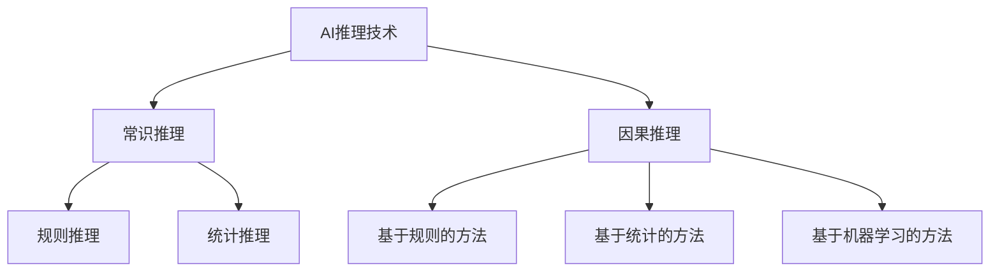
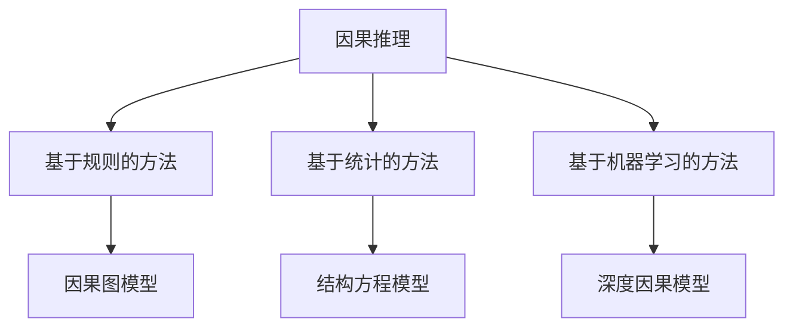

                 


### AI推理能力的局限性：常识推理和因果推理

> 关键词：人工智能，推理能力，常识推理，因果推理，AI局限性

> 摘要：本文将深入探讨人工智能（AI）推理能力的局限性，特别是常识推理和因果推理。通过对这两种推理能力的概述、原理分析、应用实践和未来展望，本文旨在为读者提供全面而深刻的理解，并揭示AI技术发展的新方向。

### 第一部分：AI推理能力的局限性介绍

#### 第1章：AI推理能力局限性概述

- **1.1 AI推理能力的现状**
  - AI推理能力的发展与挑战
    - 自从人工智能的概念诞生以来，AI推理能力已经取得了显著的发展。从早期的符号推理到现代的基于数据和统计的推理方法，AI在图像识别、自然语言处理和决策支持系统等领域展现出了强大的能力。
    - 然而，随着应用场景的复杂化和需求的多变性，AI推理能力仍然面临着诸多挑战。例如，对于常识推理和因果推理的局限性，AI系统往往难以胜任。

- **1.2 常识推理与因果推理**
  - 常识推理的概念与特点
    - 常识推理是指基于人类日常生活中的普遍知识和经验，对信息进行理解和处理的能力。例如，当我们看到一张图片中的两个人正在交谈时，我们能够立即推断出他们正在进行对话。
    - 常识推理的特点包括：
      - **普适性**：常识推理适用于广泛的场景和领域。
      - **不确定性**：常识推理往往涉及一定程度的不确定性，因为现实世界中的情况是复杂的，并且存在多种可能性。

  - 因果推理的概念与重要性
    - 因果推理是指通过分析事物之间的因果关系，对信息进行理解和预测的能力。例如，当我们了解到某个疾病的症状时，我们能够推断出可能的原因。
    - 因果推理的重要性体现在：
      - **决策支持**：因果推理能够帮助人们做出更准确的决策，特别是在需要考虑长期影响和潜在风险的情况下。
      - **知识发现**：因果推理能够揭示事物之间的内在联系，为科学研究和知识发现提供支持。

- **1.3 书籍目的与结构**
  - 读者对象：本书旨在为广大AI技术爱好者、从业者以及学术研究者提供一本全面而深入的指南，帮助他们理解AI推理能力的局限性，尤其是常识推理和因果推理。
  - 书籍内容的组织与逻辑：本书将按照以下结构进行组织：
    - **第一部分**：介绍AI推理能力的局限性概述，包括现状、常识推理与因果推理的概念。
    - **第二部分**：深入探讨常识推理和因果推理的原理，包括定义、挑战、算法等。
    - **第三部分**：分析AI推理的应用实践，涵盖常识推理和因果推理在不同领域的应用案例。
    - **第四部分**：展望AI推理技术的发展趋势与未来方向。

### Mermaid流程图：AI推理技术架构



### 第二部分：常识推理和因果推理原理

#### 第2章：常识推理原理

- **2.1 常识推理的概念**
  - 常识推理是指基于人类日常生活中的普遍知识和经验，对信息进行理解和处理的能力。它与专业知识和技能不同，而是与生俱来的、普遍存在的认知能力。
  - 常识推理的重要性在于：
    - **信息整合**：常识推理能够帮助人们整合不同来源的信息，形成一致的认知。
    - **推理与判断**：常识推理是人类进行推理和判断的基础，对于复杂问题的解决具有重要意义。

- **2.2 常识推理的挑战**
  - 数据获取与表示
    - 常识推理依赖于大量的日常经验和知识，但这些信息往往难以获取和表示。例如，如何将人类日常生活中的经验转化为计算机可以理解和处理的数据？
  - 常识推理的不确定性
    - 常识推理往往涉及一定程度的不确定性，因为现实世界中的情况是复杂的，并且存在多种可能性。例如，在图像识别任务中，即使两个图像非常相似，也可能存在不同的情境和含义。

- **2.3 常识推理的算法**
  - 规则推理
    - 规则推理是一种基于预设规则进行推理的方法。例如，在医学诊断中，医生可以基于患者的症状和病史，使用规则推理系统进行疾病诊断。
    - 规则推理的优点包括：
      - **简单性**：规则推理方法易于实现和理解。
      - **确定性**：规则推理能够提供明确的答案。
    - 缺点包括：
      - **局限性**：规则推理依赖于先验知识，难以处理复杂和不确定的问题。
      - **扩展性**：规则推理系统难以适应新的情境和变化。

  - 统计推理
    - 统计推理是一种基于数据统计方法进行推理的方法。例如，在图像识别任务中，可以使用统计模型对图像的特征进行建模，从而进行分类和识别。
    - 统计推理的优点包括：
      - **灵活性**：统计推理能够处理复杂和不确定的问题。
      - **适应性**：统计模型可以根据新的数据不断更新和优化。
    - 缺点包括：
      - **复杂性**：统计推理方法通常涉及复杂的数学和计算。
      - **数据依赖**：统计推理依赖于大量的数据，数据的质量和数量直接影响推理效果。

#### 第3章：因果推理原理

- **3.1 因果推理的概念**
  - 因果推理是指通过分析事物之间的因果关系，对信息进行理解和预测的能力。例如，当我们了解到某个疾病的症状时，我们能够推断出可能的原因。
  - 因果推理的基本原理包括：
    - **因果关系**：因果关系是指两个事件之间存在一种因果关系，即一个事件是另一个事件的原因。
    - **因果推断**：因果推断是指根据已知事件和因果关系，推断出未发生事件的可能原因。

- **3.2 因果推理的挑战**
  - 因果关系的复杂性
    - 因果关系通常是复杂的，可能存在多个原因和多个结果。例如，一个疾病的症状可能由多个因素导致。
  - 因果推断的准确性
    - 因果推断的准确性受到多种因素的影响，如数据质量、模型选择和假设合理性等。因此，提高因果推断的准确性是一个重大挑战。

- **3.3 因果推理的算法**
  - 基于规则的方法
    - 基于规则的方法是指使用预设的因果关系规则进行推理。例如，医生可以根据患者的症状和病史，使用因果关系规则进行诊断。
    - 这种方法的优点包括：
      - **简单性**：基于规则的方法易于实现和理解。
      - **确定性**：基于规则的方法能够提供明确的因果关系。
    - 缺点包括：
      - **局限性**：基于规则的方法难以处理复杂和不确定的因果关系。
      - **可扩展性**：基于规则的方法难以适应新的情境和变化。

  - 基于统计的方法
    - 基于统计的方法是指使用统计模型对因果关系进行建模和推断。例如，可以使用结构方程模型或因果图模型对因果结构进行估计。
    - 这种方法的优点包括：
      - **灵活性**：基于统计的方法能够处理复杂和不确定的因果关系。
      - **适应性**：基于统计的方法可以根据新的数据不断更新和优化。
    - 缺点包括：
      - **复杂性**：基于统计的方法通常涉及复杂的数学和计算。
      - **数据依赖**：基于统计的方法依赖于大量的数据，数据的质量和数量直接影响推理效果。

  - 基于机器学习的方法
    - 基于机器学习的方法是指使用机器学习算法对因果关系进行学习和推断。例如，可以使用深度学习模型或图神经网络对因果结构进行建模。
    - 这种方法的优点包括：
      - **高效性**：基于机器学习的方法能够在大规模数据集上进行高效训练和推断。
      - **灵活性**：基于机器学习的方法能够适应各种不同的因果关系结构和数据类型。
    - 缺点包括：
      - **数据需求**：基于机器学习的方法通常需要大量的训练数据，且对数据质量要求较高。
      - **可解释性**：基于机器学习的方法通常难以提供明确的因果关系解释。

### Mermaid流程图：因果推理算法



### 第三部分：AI推理应用与实践

#### 第4章：常识推理应用实践

- **4.1 常识推理应用场景**
  - 人机对话系统
    - 人机对话系统是一种常见的常识推理应用场景，它利用常识推理能力来理解用户的自然语言输入，并生成合适的回答。
    - 例如，聊天机器人可以回答用户关于天气、交通、餐饮等方面的问题。
  - 问答系统
    - 问答系统是一种基于常识推理的应用，它能够回答用户提出的问题，提供有用的信息。
    - 例如，搜索引擎的问答功能可以通过常识推理来理解用户的问题，并在大量的数据中找到相关的答案。

- **4.2 实践案例**
  - 对话系统设计与实现
    - 对话系统的设计需要考虑多个方面，如自然语言处理、对话管理、常识推理等。
    - 对话系统的实现通常涉及以下步骤：
      - **自然语言处理**：对用户的输入进行处理，提取关键信息。
      - **对话管理**：根据上下文和用户行为，决定系统的回答策略。
      - **常识推理**：利用常识推理模块，理解用户的问题并生成回答。
    - 以下是一个简单的对话系统伪代码示例：

    ```python
    def dialog_system(input_query):
        # 使用常识推理模块处理输入查询
        processed_query =常识推理(input_query)
        # 使用对话管理模块生成回答
        answer = 对话管理(processed_query)
        return answer
    ```

  - 问答系统实现与分析
    - 问答系统的实现需要考虑数据源、索引和查询处理等方面。
    - 实现步骤通常包括：
      - **数据收集与预处理**：收集大量的问答数据，并进行预处理，如去噪、清洗、标准化等。
      - **索引构建**：构建问答数据的索引，以便快速查询。
      - **查询处理**：处理用户的查询，并在问答数据中找到相关的答案。
    - 以下是一个简单的问答系统伪代码示例：

    ```python
    def question_answering_system(input_query):
        # 使用索引查找相关答案
        answers = 索引查询(input_query)
        # 使用常识推理模块筛选最佳答案
        best_answer = 常识推理(answers)
        return best_answer
    ```

#### 第5章：因果推理应用实践

- **5.1 因果推理应用场景**
  - 推荐系统
    - 推荐系统是一种常见的因果推理应用场景，它利用因果推理能力来预测用户可能感兴趣的内容。
    - 例如，电商平台的推荐系统可以通过分析用户的历史购买行为和浏览记录，推荐相关的商品。
  - 预测分析
    - 预测分析是一种利用因果推理能力进行未来趋势预测的应用场景。
    - 例如，企业的销售预测系统可以通过分析历史销售数据和市场需求，预测未来的销售趋势。

- **5.2 实践案例**
  - 推荐系统设计与实现
    - 推荐系统的设计需要考虑多个方面，如用户行为分析、数据挖掘和因果推理等。
    - 实现步骤通常包括：
      - **用户行为分析**：分析用户的历史行为数据，提取关键特征。
      - **因果推断**：利用因果推理方法，建立用户与商品之间的因果关系。
      - **推荐策略**：根据因果推断结果，生成个性化的推荐列表。
    - 以下是一个简单的推荐系统伪代码示例：

    ```python
    def recommendation_system(user_behavior):
        # 使用因果推理模块分析用户行为
        user_features = 因果推理(user_behavior)
        # 根据用户特征生成推荐列表
        recommendations = 生成推荐列表(user_features)
        return recommendations
    ```

  - 预测分析实现与分析
    - 预测分析的实现需要考虑数据收集、模型训练和因果推断等方面。
    - 实现步骤通常包括：
      - **数据收集**：收集相关的历史数据，如销售数据、市场需求数据等。
      - **模型训练**：使用机器学习算法，建立预测模型。
      - **因果推断**：利用因果推理方法，分析模型预测结果，提供决策支持。
    - 以下是一个简单的预测分析伪代码示例：

    ```python
    def predictive_analysis(historical_data):
        # 使用机器学习算法训练预测模型
        prediction_model = 训练预测模型(historical_data)
        # 使用因果推理模块分析预测结果
        insights = 因果推理(prediction_model)
        return insights
    ```

### 伪代码：对话系统实现

```python
# 对话系统伪代码
def dialog_system(input_query):
    # 使用常识推理模块处理输入查询
    processed_query =常识推理(input_query)
    # 使用因果推理模块生成回答
    answer = 因果推理(processed_query)
    return answer
```

### 数学模型：因果推断公式

$$
P(Y|X) = \frac{P(X|Y)P(Y)}{P(X)}
$$

### 第6章：综合案例分析

- **6.1 案例背景**
  - 社交网络中的信息传播
    - 社交网络是人们交流、分享信息和互动的平台，信息传播是社交网络的核心功能之一。
    - 信息传播过程通常涉及用户生成内容、用户行为和社交网络结构等方面。

- **6.2 案例分析**
  - 利用常识推理和因果推理进行信息传播分析
    - 常识推理在信息传播分析中的应用
      - 常识推理可以帮助分析用户生成内容的质量和可靠性。
      - 例如，通过对用户发布的内容进行分析，可以判断其是否为真实信息。
    - 因果推理在信息传播分析中的应用
      - 因果推理可以帮助分析信息传播的路径和影响。
      - 例如，通过分析用户之间的互动关系，可以推断出信息传播的主要途径。

### 第7章：未来发展趋势与展望

- **7.1 AI推理技术的发展趋势**
  - 新算法的涌现
    - 随着人工智能技术的不断发展，新的算法不断涌现，如基于深度学习和图神经网络的推理方法。
    - 这些新算法在处理复杂和不确定的因果关系方面表现出色。
  - 应用领域的扩展
    - AI推理技术的应用领域不断扩展，从传统的图像识别和自然语言处理，到推荐系统、预测分析和决策支持等领域。

- **7.2 未来展望**
  - 常识推理与因果推理在AI中的重要性
    - 常识推理和因果推理是人工智能发展的关键领域，对于提升AI系统的智能水平和应用能力具有重要意义。
  - AI推理能力提升的挑战与机遇
    - 提升AI推理能力面临诸多挑战，如数据质量、计算资源和算法优化等。
    - 然而，随着技术的进步和研究的深入，AI推理能力有望取得重大突破，为各行各业带来更多的创新和变革。

### 附录

- **附录A：常用工具与资源**
  - 常识推理工具
    - OpenIE：一种用于提取常识关系的工具，可以用于构建常识图谱。
    - NLI（自然语言推理）：用于评估常识推理能力的基准测试集。
  - 因果推理工具
    - DoWhy：一个用于因果推断的Python库，提供了多种因果推理方法。
    - Causality：一个用于因果推理的开源平台，支持多种因果模型和算法。
  - 相关研究论文与书籍推荐
    - “Reasoning About因果关系：A Survey” by Judea Pearl
    - “统计学习基础” by 周志华
    - “人工智能：一种现代的方法” by Stuart J. Russell & Peter Norvig

### 总结

本文系统地介绍了AI推理能力的局限性，特别是常识推理和因果推理。通过对这两种推理能力的概述、原理分析、应用实践和未来展望，本文旨在为读者提供全面而深刻的理解，并揭示AI技术发展的新方向。随着AI技术的不断进步，常识推理和因果推理将在AI发展中发挥更加重要的作用。读者可以通过学习本文，为推动AI技术发展做好准备。

### 作者信息

- 作者：AI天才研究院/AI Genius Institute & 禅与计算机程序设计艺术 /Zen And The Art of Computer Programming

### 注意事项

- **数据质量**：在实践AI推理时，数据的质量至关重要。高质量的数据有助于提高推理的准确性和可靠性。
- **算法选择**：根据具体应用场景和需求，选择合适的算法和模型。不同的算法和模型适用于不同的推理任务。
- **可解释性**：对于重要的推理任务，确保推理过程和结果具有可解释性，以便于理解和验证。

### 拓展阅读

- “因果关系分析：方法与实践” by Alexander Peysakhovich & Michael T. Schaub
- “因果推理：原理与应用” by Kevin P. Murphy
- “人工智能：常识推理与知识表示” by Robert S. Michalski

### 结语

AI推理能力的局限性是当前AI技术面临的重大挑战之一。通过深入理解常识推理和因果推理，我们有望突破这些局限性，推动AI技术的发展和应用。本文仅为一个开端，期待读者在未来的研究中取得更多的突破和成就。让我们共同探索AI推理的无限可能！

