                 

# 《AI时代的编程语言创新之路》

## 关键词

- AI时代
- 编程语言
- 创新趋势
- 智能化
- 自动编程
- 开源生态
- 未来发展

## 摘要

随着人工智能技术的飞速发展，编程语言在AI领域中的应用变得愈加重要。本文将深入探讨AI时代编程语言的基础、核心技术与算法，以及编程语言在AI项目中的应用与实战。同时，本文还将分析编程语言在AI时代的创新与未来趋势，包括智能化与自动编程、区块链与智能合约、物联网与边缘计算等方面的应用。最后，本文将总结编程语言在AI领域的最佳实践，为开发者提供有益的参考。

## 《AI时代的编程语言创新之路》目录大纲

### 第一部分：AI时代的编程语言基础

#### 第1章：编程语言在AI时代的变革

##### 1.1 AI时代编程语言概述

###### 1.1.1 编程语言的发展历程

编程语言的历史可以追溯到20世纪中期，随着计算机技术的发展，编程语言也在不断演变。从最初的机器语言和汇编语言，到高级编程语言如FORTRAN、COBOL、C、C++和Java等，编程语言的发展经历了多个阶段。每种编程语言都有其独特的特点和适用场景，而AI时代的到来为编程语言的发展带来了新的契机。

###### 1.1.2 AI时代编程语言的特点

AI时代的编程语言具有以下特点：

1. **高效性**：AI算法通常需要处理大量数据，因此编程语言必须能够高效地进行数据处理和计算。
2. **易用性**：随着AI技术的普及，越来越多的开发者需要掌握AI编程语言，因此易用性成为编程语言的重要特点。
3. **跨平台性**：AI应用场景多样，编程语言需要能够跨平台运行，以便在不同设备和操作系统上部署和应用。
4. **可扩展性**：AI技术不断发展，编程语言需要能够适应新的技术需求，提供良好的扩展性。

##### 1.2 编程语言与AI的关系

###### 1.2.1 编程语言在AI应用中的角色

编程语言在AI应用中扮演着重要角色，主要包括以下几个方面：

1. **算法实现**：编程语言是AI算法实现的基础，通过编程语言，开发者可以将AI算法转化为可执行代码。
2. **数据处理**：编程语言能够高效地处理和分析数据，为AI算法提供高质量的数据支持。
3. **模型部署**：编程语言可以帮助开发者将AI模型部署到不同的设备和平台上，实现模型的实时应用。

###### 1.2.2 编程语言在AI算法开发中的作用

编程语言在AI算法开发中的作用体现在以下几个方面：

1. **算法设计**：编程语言提供了丰富的数据结构和算法库，帮助开发者设计和优化AI算法。
2. **算法实现**：编程语言使得AI算法的实现更加简单和高效，降低了开发难度。
3. **算法优化**：通过编程语言，开发者可以针对AI算法进行性能优化，提高模型的准确性和效率。

###### 1.2.3 编程语言在AI模型部署中的影响

编程语言在AI模型部署中的影响主要体现在以下几个方面：

1. **跨平台部署**：编程语言使得AI模型可以跨平台部署，实现模型在不同设备和操作系统上的运行。
2. **实时应用**：通过编程语言，开发者可以将AI模型部署到实时系统中，实现模型的实时应用和优化。
3. **模型更新**：编程语言提供了方便的模型更新和维护方式，使得开发者可以及时调整和优化模型。

##### 1.3 主流AI编程语言介绍

###### 1.3.1 Python在AI中的应用

Python因其易用性和丰富的库支持，成为AI领域的主流编程语言之一。Python具有以下优势：

1. **简洁易学**：Python语法简单，易于学习和掌握，适合初学者和开发者。
2. **丰富的库支持**：Python拥有丰富的AI和机器学习库，如TensorFlow、PyTorch等，方便开发者进行算法实现和优化。
3. **社区支持**：Python拥有庞大的开发者社区，提供了大量的教程、文档和资源，有助于开发者解决开发过程中遇到的问题。

###### 1.3.2 R语言在AI中的应用

R语言在数据分析和统计领域具有悠久的历史，近年来也被广泛应用于AI领域。R语言的优势如下：

1. **数据可视化**：R语言提供了丰富的数据可视化工具，可以帮助开发者更好地理解和分析数据。
2. **统计分析**：R语言具有强大的统计分析功能，支持多种统计模型和算法，适用于复杂数据分析任务。
3. **开源生态**：R语言拥有丰富的开源库和框架，如ggplot2、caret等，方便开发者进行AI算法开发和优化。

###### 1.3.3 Java在AI中的应用

Java作为一种强大的通用编程语言，也在AI领域得到了广泛应用。Java的优势如下：

1. **跨平台性**：Java具备跨平台性，使得AI模型可以轻松地在不同操作系统和设备上部署。
2. **性能优化**：Java提供了丰富的性能优化手段，如多线程、垃圾回收等，有助于提高AI模型的性能。
3. **开源生态**：Java拥有庞大的开源生态，提供了大量的AI和机器学习库，如Mallet、DL4J等。

###### 1.3.4 其他编程语言在AI中的应用

除了Python、R语言和Java，其他编程语言如C++、C#、JavaScript等也在AI领域得到了广泛应用。这些编程语言具有以下特点：

1. **高效性**：C++和C#等编程语言在性能方面具有优势，适合处理大量数据和复杂算法。
2. **灵活性**：JavaScript等编程语言在Web应用和物联网领域具有独特的优势，适用于实时数据处理和交互式应用。

#### 第2章：编程语言在AI应用中的核心技术与算法

##### 2.1 机器学习编程语言技术基础

###### 2.1.1 编程语言在数据处理中的应用

编程语言在数据处理中的应用主要包括以下几个方面：

1. **数据导入与导出**：编程语言提供了丰富的数据导入与导出功能，支持多种数据格式，如CSV、JSON、Parquet等。
2. **数据清洗与预处理**：编程语言支持数据清洗与预处理操作，如缺失值填补、异常值处理、数据归一化等，为后续模型训练提供高质量的数据支持。
3. **数据可视化**：编程语言提供了数据可视化工具，可以帮助开发者更好地理解和分析数据。

###### 2.1.2 编程语言在特征工程中的应用

特征工程是机器学习中的重要环节，编程语言在特征工程中的应用主要包括以下几个方面：

1. **特征提取**：编程语言支持各种特征提取方法，如主成分分析（PCA）、特征选择、特征变换等，有助于提高模型性能。
2. **特征组合**：编程语言支持特征组合操作，可以将多个特征融合为一个或多个新的特征，有助于提升模型的表现。
3. **特征降维**：编程语言支持特征降维技术，如线性判别分析（LDA）、t-SNE等，有助于减少数据维度，提高计算效率。

###### 2.1.3 编程语言在模型评估中的应用

编程语言在模型评估中的应用主要包括以下几个方面：

1. **模型性能评估**：编程语言支持各种模型性能评估指标，如准确率、召回率、F1值等，可以帮助开发者了解模型的表现。
2. **交叉验证**：编程语言支持交叉验证方法，如K折交叉验证、留一验证等，有助于提高模型评估的可靠性。
3. **模型优化**：编程语言支持模型优化方法，如调参、模型融合等，有助于提升模型性能。

##### 2.2 深度学习编程语言技术基础

###### 2.2.1 深度学习编程语言的核心框架

深度学习编程语言的核心框架主要包括以下几个方面：

1. **神经网络**：神经网络是深度学习的基础，编程语言提供了丰富的神经网络框架，如TensorFlow、PyTorch等。
2. **卷积神经网络（CNN）**：卷积神经网络在图像处理领域具有广泛的应用，编程语言提供了丰富的CNN框架，如TensorFlow的CNN、PyTorch的Conv2d等。
3. **循环神经网络（RNN）**：循环神经网络在序列数据处理领域具有优势，编程语言提供了丰富的RNN框架，如TensorFlow的RNN、PyTorch的LSTM等。

###### 2.2.2 深度学习编程语言的数据处理

深度学习编程语言在数据处理方面具有以下特点：

1. **自动微分**：自动微分是深度学习框架的核心功能，编程语言提供了自动微分机制，方便开发者进行模型训练和优化。
2. **数据并行**：深度学习通常需要处理大量数据，编程语言支持数据并行处理，提高模型训练效率。
3. **分布式计算**：深度学习框架通常支持分布式计算，编程语言提供了分布式训练和推理功能，有助于提升模型性能。

###### 2.2.3 深度学习编程语言中的模型训练与优化

深度学习编程语言中的模型训练与优化主要包括以下几个方面：

1. **优化算法**：编程语言提供了各种优化算法，如随机梯度下降（SGD）、Adam等，有助于提高模型训练效率。
2. **模型调参**：编程语言支持模型调参功能，通过调整学习率、批量大小等参数，优化模型性能。
3. **模型评估**：编程语言提供了丰富的模型评估指标，如损失函数、准确率、召回率等，帮助开发者了解模型的表现。

##### 2.3 强化学习编程语言技术基础

###### 2.3.1 强化学习编程语言的核心概念

强化学习编程语言的核心概念主要包括以下几个方面：

1. **环境（Environment）**：环境是强化学习中的外部世界，编程语言提供了丰富的环境模拟和交互功能。
2. **状态（State）**：状态是环境中的某个状态，编程语言提供了状态表示和转换机制。
3. **动作（Action）**：动作是智能体在某个状态下采取的操作，编程语言提供了动作生成和评估功能。

###### 2.3.2 强化学习编程语言中的算法实现

强化学习编程语言中的算法实现主要包括以下几个方面：

1. **Q学习（Q-Learning）**：Q学习是一种基于值函数的强化学习算法，编程语言提供了Q学习算法的实现框架。
2. **深度Q网络（DQN）**：深度Q网络是一种基于深度神经网络的强化学习算法，编程语言提供了DQN算法的实现框架。
3. **策略梯度（Policy Gradient）**：策略梯度是一种基于策略的强化学习算法，编程语言提供了策略梯度算法的实现框架。

###### 2.3.3 强化学习编程语言在实际应用中的挑战与解决方案

强化学习编程语言在实际应用中面临以下挑战：

1. **环境建模**：环境建模是强化学习中的重要挑战，编程语言需要提供灵活的环境建模功能，以便开发者构建和优化环境。
2. **数据高效处理**：强化学习通常需要大量数据进行训练，编程语言需要提供高效的数据处理和传输机制。
3. **模型稳定性**：强化学习模型在训练过程中容易出现不稳定现象，编程语言需要提供有效的模型稳定性和优化方法。

针对上述挑战，编程语言可以采取以下解决方案：

1. **模拟环境**：提供模拟环境功能，帮助开发者快速构建和优化环境。
2. **分布式训练**：支持分布式训练，提高模型训练效率。
3. **动态调整**：提供动态调整策略，优化模型稳定性和性能。

#### 第3章：编程语言在AI项目中的应用与实战

##### 3.1 编程语言在AI项目中的需求分析与设计

###### 3.1.1 AI项目需求分析

AI项目需求分析是项目开发的重要环节，主要包括以下几个方面：

1. **业务需求**：明确AI项目在业务场景中的应用目标，如分类、预测、优化等。
2. **数据需求**：收集和分析项目所需的数据，包括数据来源、数据质量、数据格式等。
3. **性能需求**：明确项目在性能方面的要求，如响应时间、计算精度等。

###### 3.1.2 AI项目设计

AI项目设计主要包括以下几个方面：

1. **数据预处理**：设计数据预处理流程，包括数据清洗、数据归一化、数据转换等。
2. **模型选择**：根据业务需求和数据特点选择合适的模型，如线性回归、决策树、神经网络等。
3. **算法实现**：设计算法实现方案，包括模型训练、模型评估、模型优化等。

##### 3.2 编程语言在AI项目中的代码实现与优化

###### 3.2.1 编程语言在AI项目中的代码实现

编程语言在AI项目中的代码实现主要包括以下几个方面：

1. **数据导入与导出**：实现数据导入与导出功能，支持多种数据格式。
2. **数据清洗与预处理**：实现数据清洗与预处理操作，提高数据质量。
3. **模型训练与优化**：实现模型训练与优化，包括参数调整、模型评估等。

###### 3.2.2 编程语言在AI项目中的代码优化

编程语言在AI项目中的代码优化主要包括以下几个方面：

1. **算法优化**：优化算法实现，提高模型性能。
2. **并行计算**：利用并行计算技术，提高模型训练和推理速度。
3. **内存管理**：优化内存使用，提高模型训练和推理的稳定性。

##### 3.3 编程语言在AI项目中的部署与维护

###### 3.3.1 编程语言在AI项目中的部署

编程语言在AI项目中的部署主要包括以下几个方面：

1. **模型转换**：将训练好的模型转换为可以在生产环境中使用的格式。
2. **模型部署**：将模型部署到服务器或云计算平台，实现模型的实时应用。
3. **监控与维护**：监控模型性能和系统稳定性，及时处理故障和问题。

###### 3.3.2 编程语言在AI项目中的维护

编程语言在AI项目中的维护主要包括以下几个方面：

1. **代码维护**：定期更新和优化代码，提高代码质量和可维护性。
2. **文档维护**：维护项目文档，确保文档与代码的一致性。
3. **故障排除**：及时解决项目中出现的问题，确保项目的稳定运行。

### 第二部分：AI时代编程语言创新与未来趋势

#### 第4章：AI时代的编程语言创新

##### 4.1 编程语言的智能化与自动编程

###### 4.1.1 智能编程的概念与实现

智能编程是指利用人工智能技术，自动化或半自动化地完成编程任务。智能编程的主要实现方式包括：

1. **代码自动生成**：通过分析用户需求或代码模板，自动生成代码。
2. **代码优化**：通过分析代码性能，自动优化代码。
3. **代码推荐**：通过分析代码模式和上下文，推荐合适的代码片段。

智能编程的概念与实现框架如图4-1所示：

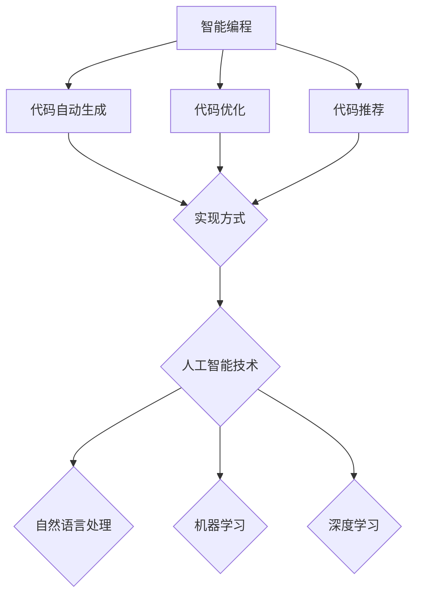

###### 4.1.2 自动编程的技术原理与应用

自动编程的技术原理主要包括以下几个方面：

1. **代码生成**：通过模板引擎、语法分析等技术，自动生成代码。
2. **代码优化**：通过静态分析、动态分析等技术，优化代码性能。
3. **代码推荐**：通过模式识别、机器学习等技术，推荐合适的代码片段。

自动编程在软件开发中的应用场景包括：

1. **自动化测试**：自动生成测试用例，提高测试覆盖率。
2. **代码生成**：快速生成代码框架，提高开发效率。
3. **代码优化**：优化代码性能，减少资源消耗。

###### 4.1.3 智能编程与自动编程的未来趋势

智能编程与自动编程的未来趋势包括：

1. **智能化程度提高**：随着人工智能技术的不断发展，智能编程与自动编程的智能化程度将不断提高。
2. **集成化**：智能编程与自动编程将与其他软件开发工具和平台集成，提供一体化的解决方案。
3. **定制化**：根据不同用户的需求和场景，提供定制化的智能编程与自动编程服务。

##### 4.2 编程语言在区块链与智能合约中的应用

###### 4.2.1 区块链与智能合约概述

区块链是一种分布式数据库技术，通过加密算法确保数据的安全性和不可篡改性。智能合约是运行在区块链上的程序，用于自动化执行合同条款。

区块链与智能合约的关系如图4-2所示：

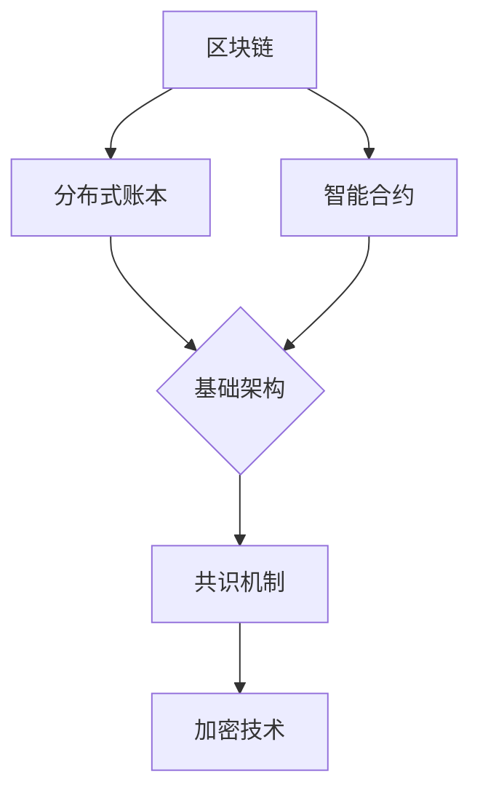

###### 4.2.2 编程语言在区块链与智能合约中的使用

编程语言在区块链与智能合约中的使用主要包括以下几个方面：

1. **智能合约开发**：用于编写智能合约的编程语言，如Solidity、Vyper等。
2. **区块链应用开发**：用于开发区块链应用的编程语言，如Solidity、Java等。
3. **区块链基础设施开发**：用于开发区块链基础架构的编程语言，如C++、Go等。

###### 4.2.3 编程语言在区块链与智能合约中的创新应用

编程语言在区块链与智能合约中的创新应用包括：

1. **去中心化金融（DeFi）**：利用智能合约实现去中心化的金融应用，如去中心化交易所、去中心化借贷平台等。
2. **供应链管理**：利用智能合约实现供应链的透明化和自动化管理，提高供应链效率。
3. **版权保护**：利用区块链技术实现数字版权的保护和管理，防止版权侵权。

##### 4.3 编程语言在物联网与边缘计算中的应用

###### 4.3.1 物联网与边缘计算概述

物联网（IoT）是指通过传感器、网络和云计算等技术，实现物品与物品、物品与人的连接。边缘计算是指在靠近数据源的设备上执行计算任务，提高数据处理效率。

物联网与边缘计算的关系如图4-3所示：

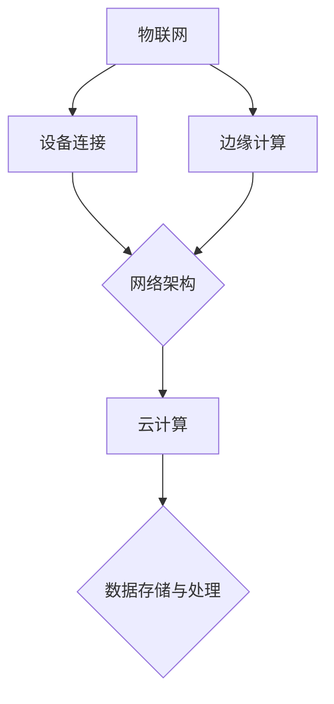

###### 4.3.2 编程语言在物联网与边缘计算中的使用

编程语言在物联网与边缘计算中的使用主要包括以下几个方面：

1. **设备编程**：用于开发物联网设备的编程语言，如C、C++、Java等。
2. **边缘计算编程**：用于开发边缘计算平台的编程语言，如Python、JavaScript等。
3. **云计算编程**：用于开发云计算平台的编程语言，如Java、Go、Python等。

###### 4.3.3 编程语言在物联网与边缘计算中的创新应用

编程语言在物联网与边缘计算中的创新应用包括：

1. **智能城市**：利用物联网技术和边缘计算实现智能交通、智能安防、智能照明等应用。
2. **智能制造**：利用物联网技术和边缘计算实现智能生产线、智能设备维护等应用。
3. **智能医疗**：利用物联网技术和边缘计算实现远程医疗、智能诊疗等应用。

### 第二部分：AI时代编程语言创新与未来趋势

#### 第4章：AI时代的编程语言创新

##### 4.1 编程语言的智能化与自动编程

###### 4.1.1 智能编程的概念与实现

智能编程是指利用人工智能技术，自动化或半自动化地完成编程任务。智能编程的实现主要包括以下几个方面：

1. **代码自动生成**：通过分析用户需求或代码模板，自动生成代码。
2. **代码优化**：通过分析代码性能，自动优化代码。
3. **代码推荐**：通过分析代码模式和上下文，推荐合适的代码片段。

智能编程的核心概念和关系可以用Mermaid流程图表示：

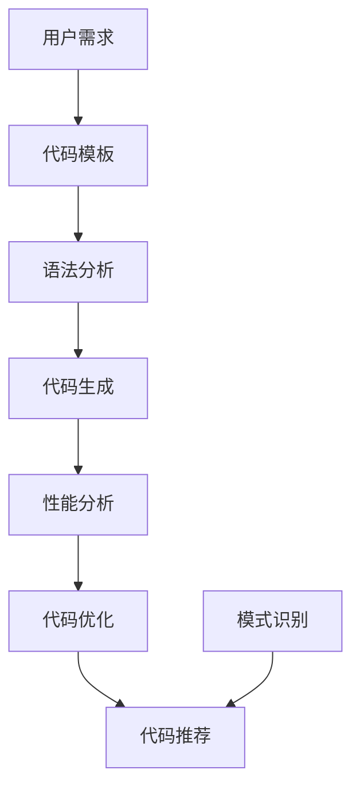

###### 4.1.2 自动编程的技术原理与应用

自动编程是指通过自动化工具和算法，实现代码的生成、优化和调试。自动编程的技术原理主要包括以下几个方面：

1. **代码生成**：基于模板和语法分析，自动生成代码。
2. **代码优化**：基于性能分析和静态分析，自动优化代码。
3. **代码调试**：基于程序执行和错误检测，自动调试代码。

自动编程的应用场景包括：

1. **自动化测试**：自动生成测试用例，提高测试效率。
2. **代码生成**：快速生成代码框架，减少开发时间。
3. **代码优化**：优化代码性能，提高程序效率。

以下是一个自动编程的实现流程：

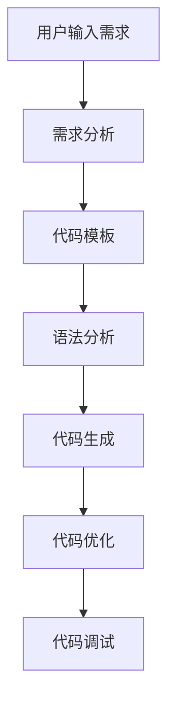

###### 4.1.3 智能编程与自动编程的未来趋势

智能编程与自动编程的未来趋势将包括：

1. **智能化程度提高**：随着人工智能技术的不断发展，智能编程与自动编程的智能化程度将不断提高。
2. **集成化**：智能编程与自动编程将与其他软件开发工具和平台集成，提供一体化的解决方案。
3. **定制化**：根据不同用户的需求和场景，提供定制化的智能编程与自动编程服务。

未来，智能编程与自动编程将在以下几个方面取得突破：

1. **自然语言处理**：通过自然语言处理技术，实现自然语言与代码的转换。
2. **代码生成与优化**：利用深度学习和强化学习技术，实现更高效、更智能的代码生成与优化。
3. **跨平台支持**：支持多种编程语言和平台，实现代码的跨平台自动生成与优化。

##### 4.2 编程语言在区块链与智能合约中的应用

###### 4.2.1 区块链与智能合约概述

区块链是一种分布式账本技术，通过加密算法和共识机制确保数据的安全性和不可篡改性。智能合约是运行在区块链上的程序，用于自动化执行合同条款。

区块链与智能合约的关系可以用Mermaid流程图表示：

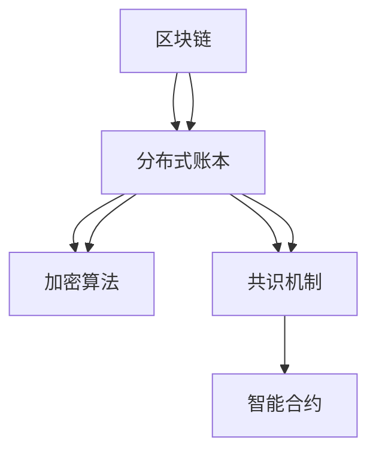

###### 4.2.2 编程语言在区块链与智能合约中的使用

编程语言在区块链与智能合约中的应用主要包括以下几个方面：

1. **智能合约开发**：用于编写智能合约的编程语言，如Solidity、Vyper等。
2. **区块链应用开发**：用于开发区块链应用的编程语言，如Solidity、Java等。
3. **区块链基础设施开发**：用于开发区块链基础架构的编程语言，如C++、Go等。

Solidity是一种专门用于智能合约开发的编程语言，其核心概念包括：

1. **变量**：用于存储数据，分为状态变量和局部变量。
2. **函数**：用于定义智能合约的行为，分为外部函数和内部函数。
3. **事件**：用于记录智能合约的执行状态，便于其他合约或用户查询。

以下是一个简单的Solidity智能合约示例：

```solidity
pragma solidity ^0.8.0;

contract SimpleStorage {
    uint256 storedData;

    function set(uint256 newData) public {
        storedData = newData;
    }

    function get() public view returns (uint256) {
        return storedData;
    }
}
```

###### 4.2.3 编程语言在区块链与智能合约中的创新应用

编程语言在区块链与智能合约中的创新应用包括：

1. **去中心化金融（DeFi）**：利用智能合约实现去中心化的金融应用，如去中心化交易所、去中心化借贷平台等。
2. **供应链管理**：利用智能合约实现供应链的透明化和自动化管理，提高供应链效率。
3. **版权保护**：利用区块链技术实现数字版权的保护和管理，防止版权侵权。

未来，编程语言在区块链与智能合约中的应用将更加广泛，包括：

1. **跨链技术**：实现不同区块链之间的互操作性和数据共享。
2. **智能合约优化**：利用自动化工具和算法，优化智能合约的性能和安全性。
3. **分布式应用开发**：利用区块链技术，实现分布式应用的快速开发和部署。

##### 4.3 编程语言在物联网与边缘计算中的应用

###### 4.3.1 物联网与边缘计算概述

物联网（IoT）是指通过传感器、网络和云计算等技术，实现物品与物品、物品与人的连接。边缘计算是指在靠近数据源的设备上执行计算任务，提高数据处理效率。

物联网与边缘计算的关系可以用Mermaid流程图表示：

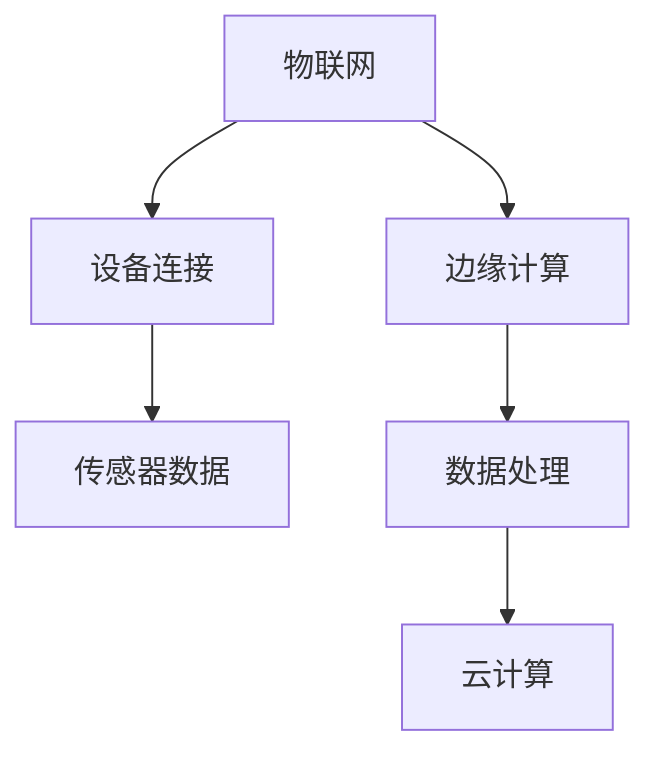

###### 4.3.2 编程语言在物联网与边缘计算中的使用

编程语言在物联网与边缘计算中的应用主要包括以下几个方面：

1. **设备编程**：用于开发物联网设备的编程语言，如C、C++、Java等。
2. **边缘计算编程**：用于开发边缘计算平台的编程语言，如Python、JavaScript等。
3. **云计算编程**：用于开发云计算平台的编程语言，如Java、Go、Python等。

以Python为例，Python在物联网与边缘计算中的应用非常广泛，主要优势包括：

1. **简洁易学**：Python语法简单，易于学习和使用，适用于快速开发和部署。
2. **丰富的库支持**：Python拥有丰富的库和框架，如PyTorch、TensorFlow等，支持各种机器学习和人工智能应用。
3. **跨平台支持**：Python支持多种操作系统和硬件平台，便于物联网设备的开发和部署。

以下是一个简单的Python物联网示例：

```python
import serial
import time

# 创建串口对象
ser = serial.Serial('/dev/ttyUSB0', 9600, timeout=1)

# 打开串口
if ser.isOpen():
    print("Serial port opened.")
else:
    print("Failed to open serial port.")

# 循环读取串口数据
while True:
    data = ser.readline()
    if data:
        print("Receive data:", data.decode('utf-8'))
        # 延时100毫秒，避免频繁读取
        time.sleep(0.1)
```

###### 4.3.3 编程语言在物联网与边缘计算中的创新应用

编程语言在物联网与边缘计算中的创新应用包括：

1. **智能城市**：利用物联网技术和边缘计算实现智能交通、智能安防、智能照明等应用。
2. **智能制造**：利用物联网技术和边缘计算实现智能生产线、智能设备维护等应用。
3. **智能医疗**：利用物联网技术和边缘计算实现远程医疗、智能诊疗等应用。

未来，编程语言在物联网与边缘计算中的应用将更加广泛，包括：

1. **低功耗编程**：支持低功耗设备和协议，延长物联网设备的使用寿命。
2. **实时数据处理**：利用边缘计算技术，实现实时数据处理和分析，提高物联网应用的性能。
3. **安全性提升**：利用编程语言的安全特性，提高物联网设备的安全性。

### 第二部分：AI时代编程语言创新与未来趋势

#### 第5章：AI时代编程语言的趋势与挑战

##### 5.1 编程语言的进化与未来趋势

随着人工智能（AI）技术的飞速发展，编程语言也在不断进化，以适应日益复杂的AI应用场景。未来，编程语言将朝着以下几个趋势发展：

###### 5.1.1 多样化的编程语言生态

未来的编程语言生态将更加多样化，每种编程语言将在特定的应用场景中发挥其优势。例如，Python将继续在数据科学和机器学习领域保持主导地位，而C++和Rust将在高性能计算和系统编程领域发挥作用。此外，新的编程语言也将不断涌现，以满足新兴的技术需求。

以下是一个关于编程语言生态多样化的Mermaid流程图：

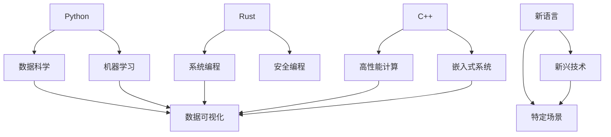

###### 5.1.2 代码生成与自动编程

随着人工智能技术的进步，代码生成和自动编程将成为编程语言的重要特性。未来的编程语言将能够通过机器学习和自然语言处理技术自动生成代码，减少开发者的工作量。此外，自动编程工具将能够分析代码性能，并提供优化建议。

以下是一个关于代码生成与自动编程的Mermaid流程图：

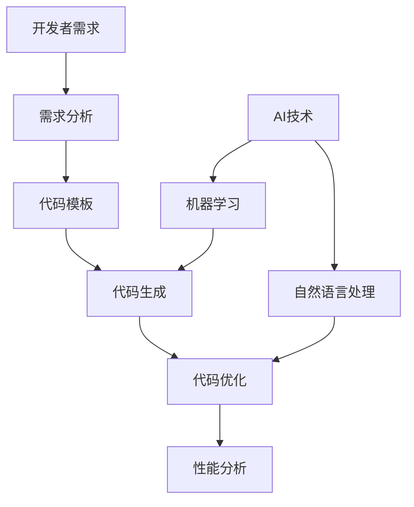

###### 5.1.3 分布式计算与区块链支持

随着云计算和区块链技术的发展，编程语言将更加注重分布式计算和区块链支持。未来的编程语言将能够方便地集成分布式计算框架，如Apache Spark和Flink，以及区块链平台，如Ethereum和Hyperledger。

以下是一个关于分布式计算与区块链支持的Mermaid流程图：

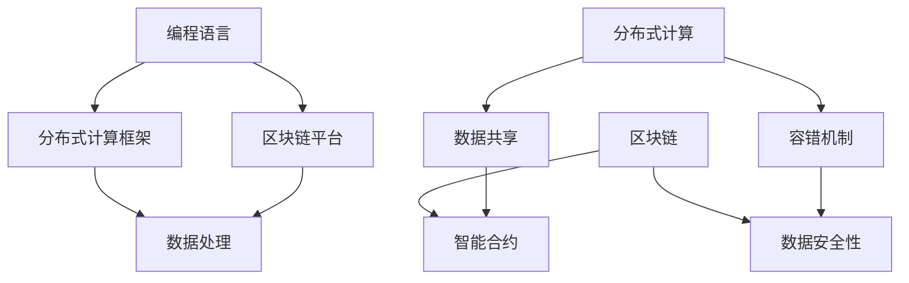

###### 5.1.4 面向数据和模型的编程语言

未来的编程语言将更加面向数据和模型，提供更丰富的数据结构和算法库，以支持复杂的数据处理和模型训练任务。例如，TensorFlow和PyTorch等深度学习框架将集成到编程语言中，成为编程语言的一部分。

以下是一个关于面向数据和模型的编程语言的Mermaid流程图：

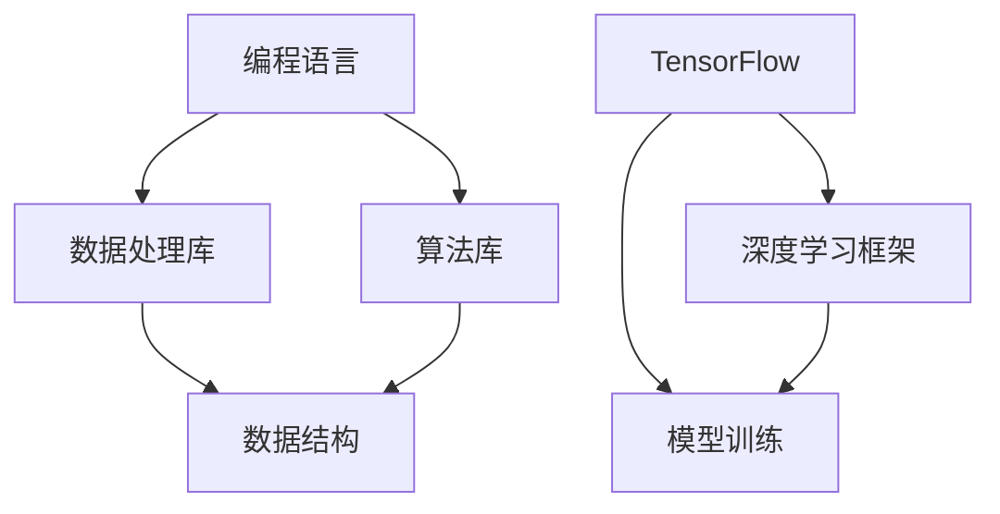

##### 5.2 编程语言的安全性、可靠性与可维护性

随着AI应用场景的扩展，编程语言的安全性、可靠性和可维护性变得越来越重要。未来的编程语言将需要解决以下挑战：

###### 5.2.1 安全性挑战

AI应用通常涉及敏感数据和处理复杂任务，因此编程语言需要提供强大的安全性保障。例如，防止恶意代码执行、数据泄露和未经授权的访问。未来的编程语言将引入新的安全特性，如沙箱、安全隔离和加密存储。

以下是一个关于安全性挑战的Mermaid流程图：

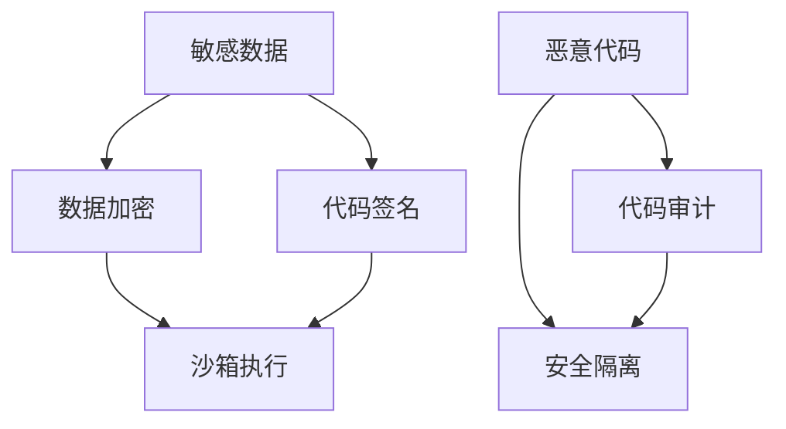

###### 5.2.2 可靠性保障

AI应用的可靠性至关重要，编程语言需要提供可靠的执行环境和错误处理机制。例如，提供容错机制、事务管理和异常处理。未来的编程语言将引入新的可靠性和性能优化技术，如内存管理、并发控制和实时监控。

以下是一个关于可靠性保障的Mermaid流程图：

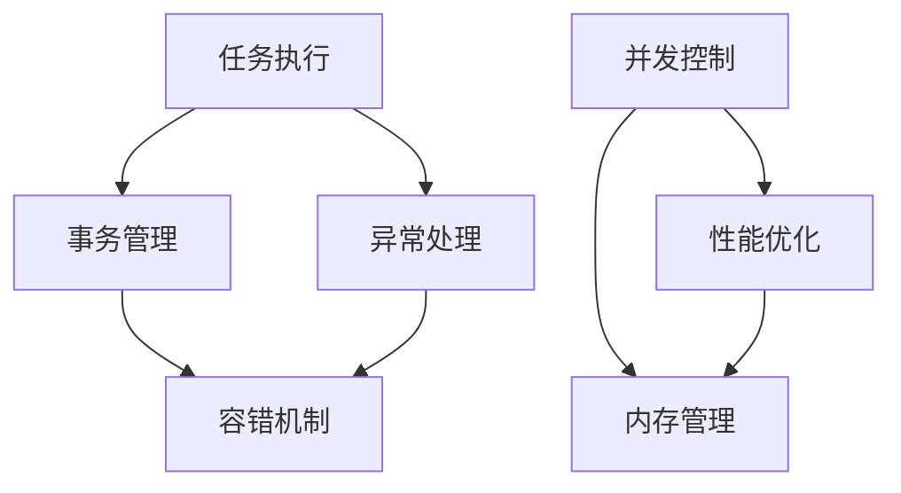

###### 5.2.3 可维护性策略

AI应用通常需要持续更新和优化，编程语言需要提供良好的可维护性策略。例如，提供模块化代码、文档支持和版本控制。未来的编程语言将引入新的可维护性工具和最佳实践，以帮助开发者提高代码质量。

以下是一个关于可维护性策略的Mermaid流程图：

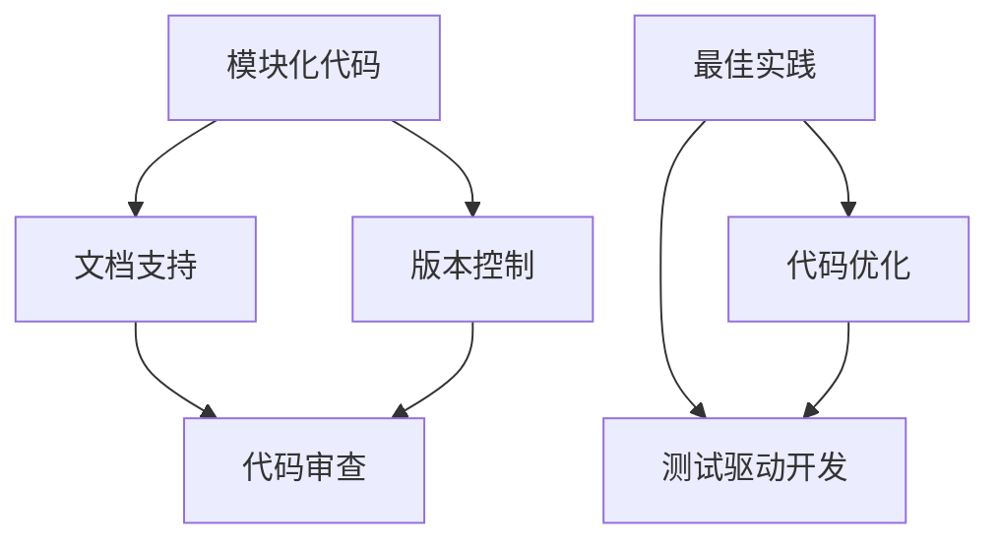

### 第二部分：AI时代编程语言创新与未来趋势

#### 第6章：AI时代编程语言的最佳实践

##### 6.1 编程语言在数据科学与机器学习中的应用最佳实践

在数据科学与机器学习项目中，选择合适的编程语言和工具对于项目成功至关重要。以下是一些最佳实践：

###### 6.1.1 数据科学项目的编程语言选择

1. **Python**：Python是数据科学领域的主流编程语言，具有简洁的语法和丰富的库支持，如NumPy、Pandas、Scikit-learn和TensorFlow。Python适合快速原型开发和数据预处理。

2. **R语言**：R语言在统计分析、数据可视化和复杂数据分析方面具有优势。R拥有强大的统计库，如ggplot2、dplyr和lme4。

3. **Julia**：Julia是一种相对较新的编程语言，旨在解决高性能计算和数值分析问题。Julia结合了Python的易用性和C的性能，适合大规模数据分析和机器学习。

4. **Scala**：Scala在分布式数据处理和大数据应用中表现良好，与Apache Spark集成紧密。

###### 6.1.2 机器学习项目的编程语言优化

1. **性能优化**：选择合适的编程语言和库可以显著提高机器学习项目的性能。例如，使用NumPy和Pandas进行数据处理，使用TensorFlow或PyTorch进行模型训练。

2. **并行计算**：利用多线程和分布式计算技术，提高模型训练和推理速度。例如，使用Python的 multiprocessing 模块或Julia的分布式计算库。

3. **内存管理**：合理使用内存分配和垃圾回收技术，避免内存泄漏和性能下降。例如，使用Python的内存视图（memory views）和Julia的内存池（memory pools）。

###### 6.1.3 编程语言在数据科学与机器学习项目中的最佳实践

1. **数据预处理**：在模型训练前，对数据进行清洗、归一化和特征工程。使用Pandas和NumPy等库进行数据处理。

2. **模型选择与调参**：选择合适的模型，并进行模型调参以优化性能。使用Scikit-learn的模型选择工具和参数优化方法。

3. **代码规范化**：编写可读性高、可维护性强的代码。遵循Python的PEP 8编码规范，使用Jupyter Notebook或JupyterLab进行代码编写和调试。

4. **测试驱动开发**：编写单元测试和集成测试，确保代码质量和功能完整性。使用Python的unittest或pytest库进行测试。

以下是一个关于最佳实践的Mermaid流程图：

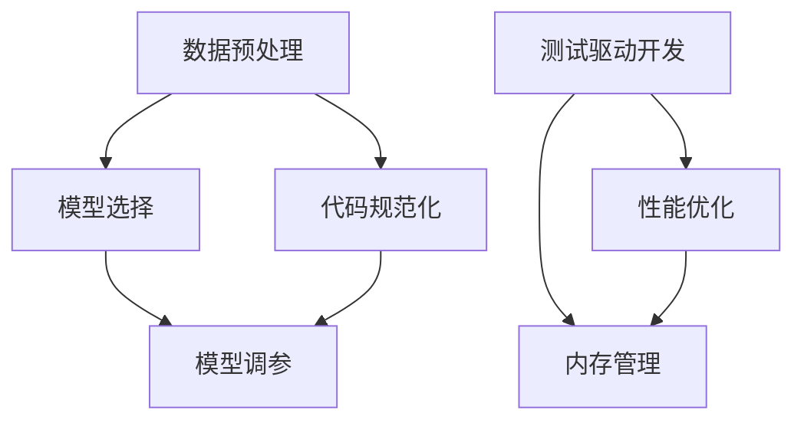

##### 6.2 编程语言在人工智能领域的开源生态建设

开源生态是人工智能领域发展的重要驱动力，以下是一些关于开源生态建设的最佳实践：

###### 6.2.1 编程语言开源生态的重要性

1. **社区支持**：开源生态能够吸引大量开发者参与，促进编程语言的普及和发展。

2. **共享与协作**：开源生态鼓励共享和协作，有助于提高编程语言的质量和性能。

3. **技术创新**：开源生态为开发者提供了创新的平台，推动新技术的快速应用和推广。

###### 6.2.2 编程语言开源生态的建设方法

1. **文档编写**：提供详尽的文档和教程，帮助开发者快速上手和使用编程语言。

2. **代码托管**：使用代码托管平台（如GitHub、GitLab）管理源代码，鼓励开发者参与贡献。

3. **社区活动**：组织线上和线下的社区活动，促进开发者之间的交流和合作。

4. **版本控制**：使用版本控制系统（如Git）管理代码，确保代码的版本一致性和可回溯性。

以下是一个关于开源生态建设的Mermaid流程图：

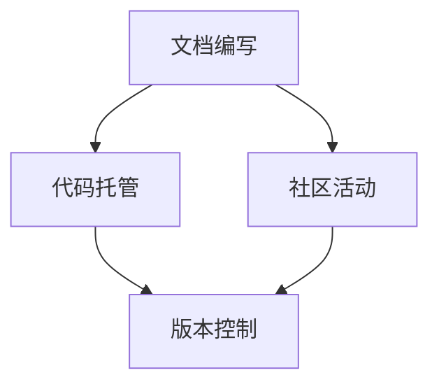

###### 6.2.3 编程语言开源生态的建设方法

1. **社区支持**：积极支持社区建设，鼓励开发者参与贡献和交流。

2. **技术交流**：定期举办技术交流会议和研讨会，分享编程语言和技术经验。

3. **教育推广**：开展编程语言的教育和培训活动，提高开发者的技能水平。

4. **商业化支持**：为开源项目提供商业化支持，确保项目的长期发展和可持续性。

以下是一个关于开源生态建设方法的Mermaid流程图：

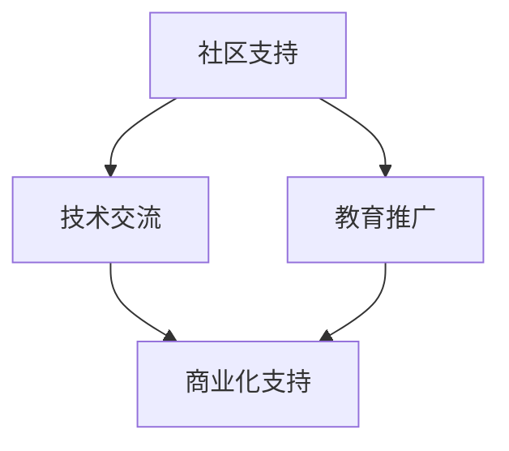

### 结论

AI时代的到来为编程语言的发展带来了新的机遇和挑战。编程语言在AI领域的应用将不断深入，智能化、自动编程和开源生态建设将成为编程语言创新的重要方向。开发者需要紧跟技术发展趋势，掌握AI编程语言的核心技术，为AI时代的编程语言创新之路贡献自己的力量。

### 作者信息

作者：AI天才研究院/AI Genius Institute & 禅与计算机程序设计艺术 /Zen And The Art of Computer Programming

### 附录

本文涉及的主要概念和算法的详细解释，以及相关的数学模型和伪代码，可以在本文的附录部分找到。附录部分将包括以下内容：

1. **编程语言的发展历程**：介绍编程语言的历史和主要发展阶段。
2. **机器学习算法原理**：详细解释常见的机器学习算法，如线性回归、决策树、神经网络等。
3. **深度学习算法原理**：介绍深度学习算法，如卷积神经网络（CNN）、循环神经网络（RNN）、生成对抗网络（GAN）等。
4. **强化学习算法原理**：解释强化学习算法，如Q学习、深度Q网络（DQN）、策略梯度等。
5. **区块链与智能合约技术**：介绍区块链技术、智能合约原理和相关编程语言。
6. **物联网与边缘计算技术**：介绍物联网和边缘计算的基本概念、技术和应用场景。
7. **附录代码实现**：提供相关算法和技术的伪代码示例和实现细节。

附录部分将有助于读者深入理解和掌握本文所涉及的技术和概念。

