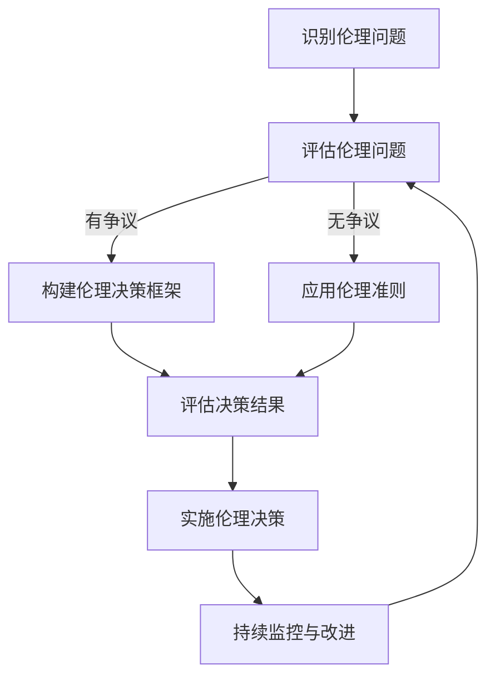

                 

### 《AI时代的软件工程道德决策：框架与案例分析》

#### 关键词：

- AI时代
- 软件工程伦理
- 道德决策框架
- 案例分析
- 伦理治理
- 可持续发展

#### 摘要：

在AI时代，软件工程道德决策变得尤为重要。本文从AI时代软件工程伦理的概述出发，介绍了道德决策框架及其应用场景，分析了道德风险，并通过案例分析探讨了具体道德决策过程。接着，文章深入探讨了AI软件工程伦理治理、道德决策工具与方法，以及道德决策教育的重要性。最后，展望了AI时代软件工程道德决策的未来挑战和可持续发展路径。文章旨在为AI时代的软件工程道德决策提供理论支持和实践指导。

## 第一部分：AI时代软件工程道德决策基础

### 第1章：AI时代软件工程伦理概述

#### 1.1 AI时代软件工程伦理的重要性

随着人工智能（AI）技术的飞速发展，其在各行各业中的应用越来越广泛，从而对软件工程领域产生了深远的影响。在这一背景下，AI时代软件工程伦理的重要性日益凸显。软件工程伦理不仅关系到技术发展的可持续性，还涉及到社会公平、隐私保护、安全性和用户权益等多个方面。

首先，伦理问题直接关系到技术的应用效果。在AI技术被广泛应用于自动驾驶、医疗诊断、金融决策等领域时，其伦理问题不仅影响技术本身的发展，还可能对社会产生深远的影响。例如，自动驾驶汽车的伦理决策直接关系到公共安全，而医疗诊断AI的伦理问题则涉及患者的生命健康权益。

其次，伦理决策有助于引导技术发展。在AI时代，软件工程师和开发者需要具备高度的伦理意识，以确保技术的应用符合社会道德和法律规范。通过伦理决策，可以为技术开发提供明确的方向和指导，防止技术滥用和误用，从而推动技术与社会环境的和谐发展。

此外，伦理问题也是企业社会责任的重要组成部分。在市场竞争日益激烈的今天，企业不仅要追求经济效益，还需要关注社会效益。通过建立和遵守伦理规范，企业能够提升品牌形象，增强消费者信任，从而在激烈的市场竞争中脱颖而出。

总之，AI时代软件工程伦理的重要性不容忽视。只有通过建立健全的伦理决策框架，才能确保AI技术在积极推动社会进步的同时，避免对人类和社会产生负面影响。

#### 1.2 软件工程道德决策的核心概念

软件工程道德决策涉及多个核心概念，这些概念相互关联，构成了伦理决策的基础。以下是对这些核心概念的简要介绍：

**1. 道德原则：**

道德原则是伦理决策的根本，包括普遍适用的道德准则，如尊重、公正、透明、责任和隐私。在软件工程中，这些原则指导工程师和开发者如何处理技术中的伦理问题，确保技术应用符合社会道德规范。

**2. 道德风险：**

道德风险是指在软件开发和应用过程中可能出现的伦理问题，如数据隐私泄露、算法歧视、技术滥用等。识别和评估这些风险是道德决策的重要步骤，有助于提前预防潜在的问题。

**3. 伦理决策框架：**

伦理决策框架是一种结构化的方法，用于指导道德决策过程。它通常包括道德原则、决策步骤和评估标准，帮助工程师和开发者系统地进行伦理分析，制定合理的决策。

**4. 道德责任：**

道德责任是指开发者、企业和社会在技术应用中的责任和义务。道德责任不仅包括遵守法律和规定，还涉及到对技术可能带来的后果进行预见和负责。

**5. 用户权益：**

用户权益是伦理决策中不可或缺的一部分，涉及用户的隐私、安全、公平和知情权。保障用户权益是软件工程伦理的核心目标之一。

**6. 社会责任：**

社会责任是指企业和技术开发者对社会的影响和责任。在AI时代，企业和技术开发者需要关注技术应用对社会产生的长远影响，确保技术的可持续发展。

**7. 法律法规：**

法律法规是道德决策的重要参考，为技术行为提供了明确的界限。在软件工程中，工程师和开发者需要了解相关法律法规，确保技术应用符合法律要求。

这些核心概念相互交织，共同构成了软件工程道德决策的理论基础。理解这些概念，有助于我们在实际工作中进行有效的伦理分析和决策。

#### 1.3 软件工程伦理的历史发展

软件工程伦理的历史发展可以追溯到计算机科学和软件工程的早期阶段。在20世纪50年代和60年代，计算机科学刚刚起步，软件工程作为一个专业领域也开始形成。当时，伦理问题主要集中在计算机的合理使用和保护用户隐私方面。

**早期阶段：**

在早期，计算机技术主要用于科学研究和军事领域，其应用范围相对有限。因此，伦理问题主要涉及计算机的公平性和用户隐私。例如，计算机科学家开始探讨如何防止数据滥用和保护用户的个人信息。

**20世纪80年代至90年代：**

随着计算机技术的普及，软件工程逐渐成为一项重要的职业。这一时期，软件工程伦理开始受到广泛关注，包括软件开发过程中的道德责任、软件质量控制、软件盗版等问题。计算机科学家和工程师开始编写道德守则和职业规范，以指导行业内的道德行为。

**21世纪初至今：**

进入21世纪后，随着互联网和人工智能的快速发展，软件工程伦理面临了前所未有的挑战。大数据、人工智能、物联网等新兴技术带来了新的伦理问题，如数据隐私、算法歧视、人工智能的自主决策等。这一时期，伦理决策的重要性日益凸显，许多组织和机构开始制定和推广AI伦理指南，以确保技术的发展符合社会道德和法律规范。

总体来看，软件工程伦理的历史发展经历了从关注计算机合理使用到全面涵盖技术伦理问题的演变。随着技术的不断进步，软件工程伦理也将继续发展和完善，以适应新的挑战和需求。

### 第2章：AI软件工程道德决策框架

#### 2.1 道德决策框架概述

在AI时代，软件工程道德决策框架是一种系统化的方法，用于指导工程师和开发者识别、分析和解决伦理问题。一个有效的道德决策框架应包括以下关键要素：

**1. 道德原则：** 道德原则是框架的核心，为伦理决策提供基础和指导。常见的道德原则包括尊重、公正、透明、责任和隐私等。

**2. 决策步骤：** 决策步骤是道德决策的具体流程，通常包括识别伦理问题、分析伦理问题、制定决策方案、评估决策方案和实施决策等步骤。

**3. 评估标准：** 评估标准用于评价决策方案的有效性和可行性，常见的评估标准包括道德风险、法律合规性、技术可行性和社会影响等。

**4. 伦理模型：** 伦理模型是一种形式化的方法，用于表示道德原则和决策步骤，以便进行逻辑推理和分析。

**5. 实践指南：** 实践指南为具体场景下的道德决策提供指导，通常包括案例研究和最佳实践。

通过这些关键要素，道德决策框架能够帮助工程师和开发者系统地进行伦理分析，制定合理的决策方案，从而确保AI技术在应用过程中符合社会道德和法律规范。

#### 2.2 应对AI伦理问题的基本原则

在AI时代，应对伦理问题的基本原则是确保技术的应用符合社会道德和法律规范，同时保护用户的权益。以下是一些关键的基本原则：

**1. 尊重隐私：** AI技术常常涉及对用户数据的收集和分析，因此尊重用户隐私是首要原则。开发者应确保用户数据的安全性和隐私性，避免未经授权的数据访问和滥用。

**2. 公平性和无歧视：** AI算法可能存在偏见和歧视，影响决策的公正性。开发者应采取措施消除算法偏见，确保算法对所有用户公平无歧视。

**3. 透明度和可解释性：** AI技术通常被视为“黑箱”，其决策过程难以理解。提高算法的透明度和可解释性，有助于用户和监管机构了解技术的运作原理，增强信任。

**4. 责任和可追究性：** AI技术的发展和应用需要明确责任主体和责任边界。开发者、企业和社会应共同承担技术带来的伦理责任，确保问题发生时能够追究责任。

**5. 法律合规性：** AI技术的应用应遵守相关法律法规，确保技术的合法合规性。开发者应了解并遵循相关法律法规，避免违法行为。

**6. 用户权益保护：** 开发者应关注用户权益，包括知情权、选择权和撤销权等，确保用户能够在使用AI技术时获得充分的保护和尊重。

通过遵循这些基本原则，开发者能够更好地应对AI时代的伦理问题，推动技术和社会的可持续发展。

#### 2.3 道德决策框架的应用场景

道德决策框架在AI软件工程中有着广泛的应用场景。以下是几个典型的应用场景及其实际应用：

**1. 自动驾驶汽车：** 自动驾驶汽车涉及生命安全，其伦理决策尤为关键。道德决策框架可以帮助识别和解决自动驾驶中的伦理问题，如事故责任分配、行人保护与自我保护之间的权衡等。

**2. 医疗诊断AI：** 医疗诊断AI在提高诊断准确性的同时，也可能引发伦理问题，如数据隐私、算法偏见和误诊风险等。道德决策框架可以帮助医疗机构和开发者制定合理的决策方案，确保AI诊断系统的公平性和透明性。

**3. 社交媒体算法：** 社交媒体平台使用算法推荐内容，但可能导致信息茧房、算法歧视等问题。道德决策框架可以帮助平台制定算法伦理准则，确保推荐内容的公正性和多样性。

**4. 人工智能助手：** 人工智能助手在提高工作效率的同时，也可能引发隐私和数据安全等问题。道德决策框架可以帮助开发者和用户了解潜在风险，制定隐私保护策略。

**5. 金融决策AI：** 金融领域对算法的透明度和公正性要求较高。道德决策框架可以帮助金融机构识别和解决金融AI中的伦理问题，如算法偏见和投资风险等。

通过具体应用场景的举例，我们可以看到道德决策框架在AI软件工程中的重要性。它不仅有助于解决技术带来的伦理问题，还能为开发者提供系统化的决策指导，确保技术的可持续发展。

### 第3章：AI软件工程道德风险分析

#### 3.1 风险识别与评估

在AI软件工程中，道德风险识别与评估是确保技术发展符合社会道德和法律规范的关键步骤。以下是风险识别与评估的详细过程：

**1. 风险识别：**

风险识别是道德风险评估的第一步，旨在识别AI软件工程中可能出现的伦理问题。具体方法包括：

- **文献研究：** 通过查阅相关文献和案例，了解已有研究的伦理风险类型。
- **专家咨询：** 咨询伦理学、法学和计算机科学等领域的专家，获取专业见解。
- **问卷调查：** 设计问卷调查，收集用户和利益相关者的意见和建议。
- **工作坊和讨论会：** 组织工作坊和讨论会，邀请相关利益方共同探讨可能的伦理风险。

**2. 风险评估：**

风险评估是在风险识别的基础上，对识别出的伦理问题进行定量或定性的分析，评估其严重程度和影响范围。具体步骤如下：

- **风险分类：** 将识别出的伦理问题进行分类，如数据隐私、算法偏见、技术滥用等。
- **风险评级：** 对每个风险进行评级，常用的评级方法包括风险概率和影响评估矩阵（P&I矩阵）。
- **风险优先级排序：** 根据风险评估结果，确定风险的优先级，重点关注高概率和高影响的风险。

**3. 风险应对策略：**

在完成风险识别与评估后，需要制定相应的风险应对策略，以预防和减轻道德风险。具体策略包括：

- **预防措施：** 通过设计合理的系统架构、加强数据安全和隐私保护等手段，预防潜在的风险。
- **应急响应：** 制定应急预案，以应对已识别的道德风险，确保在风险发生时能够迅速采取措施。
- **持续监控：** 建立持续监控机制，定期评估风险状况，确保风险应对策略的有效性。

通过风险识别与评估，工程师和开发者能够提前发现和解决AI软件工程中的伦理问题，从而确保技术的可持续发展。

#### 3.2 风险类型与影响因素

在AI软件工程中，道德风险类型多样，影响因素复杂。以下是对常见风险类型及其影响因素的详细分析：

**1. 数据隐私风险：**

数据隐私风险是指AI系统在处理用户数据时可能侵犯用户隐私的风险。其主要类型包括：

- **数据泄露：** 数据在传输、存储和处理过程中可能被非法访问或泄露。
- **数据滥用：** 用户数据可能被用于未经授权的目的，如广告投放、市场分析等。

影响因素包括：

- **数据规模和多样性：** 大规模和多样化的数据增加了隐私泄露和数据滥用的风险。
- **数据存储位置：** 数据存储在不同地理位置可能面临不同的隐私保护法规，增加了管理复杂性。
- **数据使用权限：** 用户数据的使用权限设置不当可能导致隐私泄露。

**2. 算法偏见风险：**

算法偏见风险是指AI算法在决策过程中可能出现的歧视或偏见问题。其主要类型包括：

- **性别和种族偏见：** 算法可能对特定性别或种族的用户产生不公平待遇。
- **收入和地域偏见：** 算法可能对低收入或特定地域的用户产生不利影响。

影响因素包括：

- **数据质量：** 数据质量低下可能导致算法偏见，特别是在训练数据存在偏差时。
- **算法设计：** 算法设计中的缺陷可能放大数据偏见，导致不公平的决策结果。
- **模型透明度：** 算法透明度低使得用户和监管机构难以识别和纠正算法偏见。

**3. 技术滥用风险：**

技术滥用风险是指AI技术在非预期或非法场景下的应用风险。其主要类型包括：

- **恶意攻击：** AI系统可能被黑客利用进行攻击，如网络攻击、信息篡改等。
- **隐私侵犯：** AI系统可能被用于非法侵犯用户隐私，如跟踪用户行为、窃取个人信息等。

影响因素包括：

- **技术能力：** AI技术的能力越强，越可能被用于非预期或非法场景。
- **监管力度：** 监管力度不足可能导致技术滥用行为难以被及时发现和制止。
- **道德意识和法律遵守：** 开发者、企业和社会的道德意识和法律遵守程度影响技术滥用的风险。

通过深入分析风险类型及其影响因素，工程师和开发者可以更好地理解AI软件工程中的道德风险，从而采取有效的预防和应对措施。

#### 3.3 风险管理与应对策略

在AI软件工程中，道德风险管理是确保技术发展符合社会道德和法律规范的重要环节。以下详细介绍道德风险管理的具体过程和应对策略：

**1. 风险管理过程：**

道德风险管理过程包括以下关键步骤：

- **风险识别：** 通过文献研究、专家咨询和问卷调查等方法，识别AI软件工程中的伦理风险。
- **风险评估：** 对识别出的伦理风险进行分类和评级，评估其严重程度和影响范围。
- **风险分析：** 分析风险的成因和影响，为制定风险应对策略提供依据。
- **风险应对：** 制定针对性的风险应对策略，包括预防措施、应急响应和持续监控。
- **风险监控：** 建立持续监控机制，定期评估风险状况，确保风险应对策略的有效性。

**2. 风险管理策略：**

道德风险管理策略包括以下几类：

- **预防措施：**

  - **数据保护：** 加强数据安全措施，如加密存储和传输、访问控制等，防止数据泄露和滥用。
  - **算法审查：** 对AI算法进行严格的审查和测试，消除潜在偏见和歧视。
  - **透明度提升：** 增强算法的透明度和可解释性，提高用户和监管机构的信任。
  - **合规性审查：** 定期审查AI系统是否符合相关法律法规和道德规范。

- **应急响应：**

  - **应急预案：** 制定应急预案，以应对已识别的伦理风险，确保在风险发生时能够迅速采取措施。
  - **责任追究：** 明确责任主体和责任边界，确保在风险发生时能够追究责任。
  - **透明沟通：** 及时与用户和利益相关者沟通，确保信息透明，增强信任。

- **持续监控：**

  - **风险监控系统：** 建立风险监控系统，实时监控AI系统的运行状况，及时发现潜在风险。
  - **定期评估：** 定期评估风险应对策略的有效性，根据评估结果调整和优化策略。
  - **用户反馈：** 鼓励用户反馈，收集用户意见和建议，改进系统设计和风险应对策略。

通过科学的风险管理和应对策略，工程师和开发者可以更好地预防和应对AI软件工程中的道德风险，确保技术的可持续发展。

### 第4章：AI软件工程道德决策案例分析

#### 4.1 案例一：自动驾驶汽车伦理决策

自动驾驶汽车作为AI技术在交通领域的应用典范，其伦理决策具有显著的社会影响。以下是对该案例的详细分析：

**1. 案例背景：**

自动驾驶汽车通过复杂的传感器和算法实现自主驾驶，但其在面临伦理困境时如何决策成为关键问题。例如，在紧急情况下，自动驾驶汽车可能需要决定是否紧急避让行人或车辆，以保护驾驶员或其他道路使用者的生命安全。

**2. 伦理问题：**

自动驾驶汽车的伦理问题主要包括：

- **生命价值权衡：** 在无法同时保护驾驶员和其他道路使用者的生命时，如何进行价值权衡。
- **事故责任归属：** 在事故发生时，如何划分自动驾驶汽车制造商、软件开发者和驾驶员的责任。
- **隐私和数据保护：** 自动驾驶汽车在行驶过程中收集大量数据，如何保护用户隐私和数据安全。
- **算法偏见和公平性：** 自动驾驶算法是否存在偏见，如何确保其公平性。

**3. 道德决策分析：**

为解决上述伦理问题，可以采用以下道德决策框架：

- **原则分析：** 根据尊重生命、公正和责任等道德原则，评估不同决策方案。
- **情景模拟：** 通过构建不同紧急情景，模拟自动驾驶汽车的决策过程，评估其伦理决策效果。
- **多方讨论：** 组织伦理学、法学、交通工程等多领域专家共同讨论，制定合理的决策方案。

**4. 决策方案：**

基于上述分析，可以制定以下决策方案：

- **紧急避让策略：** 在无法同时保护驾驶员和其他道路使用者的生命时，优先保护行人。
- **事故责任划分：** 明确自动驾驶汽车制造商和软件开发者的责任，同时保留驾驶员的最终决策权。
- **隐私保护措施：** 加强数据加密和访问控制，确保用户隐私和数据安全。
- **算法公平性保障：** 通过数据分析和算法审查，消除算法偏见，确保公平性。

**5. 案例启示：**

自动驾驶汽车伦理决策案例表明，AI技术在交通领域的应用需要全面考虑伦理问题，通过科学决策框架确保技术的公正、透明和责任。未来，需要建立更加完善的伦理决策机制，以应对更多复杂的伦理挑战。

#### 4.2 案例二：社交媒体算法伦理争议

社交媒体平台广泛使用算法推荐内容，但这也引发了伦理争议。以下是对该案例的详细分析：

**1. 案例背景：**

社交媒体平台通过算法推荐内容，吸引用户持续关注。然而，算法推荐可能导致信息茧房、算法偏见和内容质量下降等问题，引发伦理争议。

**2. 伦理问题：**

社交媒体算法伦理问题主要包括：

- **信息茧房：** 算法推荐可能导致用户只能接触到与自己观点相似的内容，减弱社会多元化。
- **算法偏见：** 算法可能基于用户历史数据产生偏见，影响推荐内容的公正性。
- **内容质量：** 算法推荐可能导致低质量或误导性内容泛滥，影响用户的信息获取质量。
- **用户隐私：** 社交媒体平台在推荐内容时可能侵犯用户隐私，如推送个性化广告。

**3. 道德决策分析：**

为解决上述伦理问题，可以采用以下道德决策框架：

- **透明度提升：** 提高算法透明度，让用户了解推荐机制，增强信任。
- **算法审查：** 定期审查算法，消除潜在偏见，确保公正性。
- **内容质量保障：** 加强内容审核，过滤低质量或误导性内容，提升用户体验。
- **隐私保护：** 加强用户隐私保护，确保用户数据的安全性和隐私性。

**4. 决策方案：**

基于上述分析，可以制定以下决策方案：

- **透明度提升策略：** 在平台界面中增加算法透明度说明，让用户了解推荐机制的运作原理。
- **算法审查机制：** 建立专门的算法审查团队，定期审查算法，确保其公正性和透明度。
- **内容审核机制：** 加强内容审核，过滤低质量或误导性内容，保障用户的信息质量。
- **隐私保护措施：** 采用加密技术和访问控制措施，确保用户数据的安全性和隐私性。

**5. 案例启示：**

社交媒体算法伦理争议案例表明，算法推荐技术在社交媒体平台中的应用需要注重伦理问题，通过提升透明度、审查算法和保障用户隐私等措施，确保平台生态的健康和可持续性。

#### 4.3 案例三：AI医疗诊断伦理问题

AI技术在医疗诊断领域具有巨大潜力，但也引发了一系列伦理问题。以下是对该案例的详细分析：

**1. 案例背景：**

AI医疗诊断系统通过分析大量医学数据和影像，辅助医生进行诊断。然而，其准确性和可靠性受到质疑，同时也涉及数据隐私和公平性等问题。

**2. 伦理问题：**

AI医疗诊断伦理问题主要包括：

- **诊断准确性：** AI诊断系统的准确性和可靠性是否足以替代医生的专业判断。
- **数据隐私：** 医学数据的敏感性及其在AI系统中的处理方式。
- **算法偏见：** AI系统在诊断过程中是否存在偏见，影响诊断结果的公正性。
- **医生角色：** AI辅助诊断是否会削弱医生的专业地位，影响医患关系。

**3. 道德决策分析：**

为解决上述伦理问题，可以采用以下道德决策框架：

- **诊断准确性评估：** 通过对比AI诊断结果与医生诊断结果，评估其准确性和可靠性。
- **数据隐私保护：** 确保医学数据在AI系统中的安全性和隐私性，避免数据泄露和滥用。
- **算法公平性审查：** 定期审查AI算法，消除潜在偏见，确保诊断结果的公正性。
- **医生参与：** 充分尊重医生的专业判断，确保AI系统作为辅助工具，而不是替代品。

**4. 决策方案：**

基于上述分析，可以制定以下决策方案：

- **诊断准确性提升：** 通过持续优化AI算法，提高诊断系统的准确性和可靠性。
- **数据隐私保护：** 建立严格的数据隐私保护机制，确保用户数据的保密性和隐私性。
- **算法公平性保障：** 加强算法审查，消除潜在偏见，确保诊断结果的公正性。
- **医生参与决策：** 强化医生与AI系统的协同工作，确保医生在诊断过程中发挥主导作用。

**5. 案例启示：**

AI医疗诊断伦理问题案例表明，AI技术在医疗诊断中的应用需要注重伦理问题，通过评估诊断准确性、保护用户隐私、审查算法和尊重医生专业判断等措施，确保医疗诊断的公正、透明和可靠。

### 第二部分：AI时代软件工程道德决策实践

#### 第5章：AI软件工程伦理治理

#### 5.1 伦理治理的概念与原则

伦理治理是指通过建立一套系统化的制度和流程，确保技术发展与应用过程中符合社会道德和法律规范。在AI时代，伦理治理尤为重要，因为AI技术的广泛应用带来了新的伦理挑战。以下是伦理治理的核心概念与原则：

**1. 伦理治理的概念：**

伦理治理是一个多层次的、综合性的过程，涉及组织内部的伦理文化、规章制度、决策流程以及外部监管。其目的是确保AI技术的发展与应用不仅具有技术上的可行性，还要符合社会道德和法律要求。

**2. 伦理治理的原则：**

- **公正性：** 伦理治理应确保决策过程的公平性和透明度，避免偏见和歧视。
- **责任与问责：** 各方责任主体应明确其在AI技术发展中的责任，并对其行为承担相应的责任。
- **合规性：** AI技术的发展和应用应严格遵守相关法律法规和行业标准，确保合规性。
- **可持续性：** 伦理治理应关注技术的长期影响，确保其可持续发展和环境保护。
- **用户权益保护：** 用户在AI技术应用过程中的权益应得到充分保护，包括隐私、安全、知情权等。

通过遵循上述原则，伦理治理能够为AI软件工程提供明确的道德框架，引导技术开发和应用的健康发展。

#### 5.2 伦理治理的组织结构

伦理治理的有效实施需要一个明确且合理的组织结构，以确保各层级和部门在伦理问题上的协同合作。以下是伦理治理组织结构的详细描述：

**1. 高层领导委员会：**

高层领导委员会是伦理治理的最高决策机构，通常由公司CEO、CTO、CLO（首席法律官）等高层领导组成。其职责是制定公司的伦理治理战略、审批重大伦理决策，并确保伦理治理的执行。

**2. 伦理委员会：**

伦理委员会是专门负责伦理决策和监督的常设机构。成员通常包括内部和外部专家，如伦理学家、法学家、技术专家、用户代表等。伦理委员会的职责是审查AI项目的伦理问题、制定伦理准则、评估伦理风险和提供伦理咨询。

**3. 伦理官或伦理顾问：**

伦理官或伦理顾问是伦理治理的具体执行者，负责日常的伦理监督和管理工作。他们需要与各部门密切合作，确保伦理政策和准则的贯彻执行，并在出现伦理问题时提供专业建议。

**4. 部门负责人员：**

各部门负责人员是伦理治理的执行者，他们在各自部门内负责监督和执行伦理政策和准则。他们需要定期向伦理委员会汇报部门伦理状况，确保伦理决策的落实。

**5. 外部监管机构：**

外部监管机构包括政府监管部门、行业组织等，它们对AI技术的伦理问题进行外部监督和评估。外部监管机构可以提供独立的审查和评估，确保AI技术的合规性和道德性。

通过建立上述组织结构，伦理治理能够在公司内部形成有效的监督和管理机制，确保AI技术的健康发展。

#### 5.3 伦理治理的流程与方法

伦理治理的流程和方法是确保AI技术在发展过程中符合道德和法律要求的关键。以下是对伦理治理流程和方法的详细描述：

**1. 伦理审查流程：**

伦理审查是伦理治理的核心环节，其目的是评估AI项目在伦理方面的可行性和合规性。伦理审查流程通常包括以下步骤：

- **项目申请：** AI项目团队提交伦理审查申请，包括项目描述、预期目标和潜在风险。
- **初步评估：** 伦理委员会对项目申请进行初步评估，确定是否需要进一步审查。
- **详细审查：** 伦理委员会组织专家对项目进行详细审查，评估其伦理风险和合规性。
- **审查决策：** 根据审查结果，伦理委员会做出是否批准项目的决定，并给出相应的建议。
- **反馈与改进：** 对未通过审查的项目，伦理委员会提供反馈，并要求项目团队进行改进。

**2. 道德决策方法：**

道德决策方法是伦理治理中用于解决具体伦理问题的一套系统化方法。以下是一些常用的道德决策方法：

- **道德原则分析：** 根据道德原则（如尊重、公正、责任等）对伦理问题进行分析，确定合理的决策方案。
- **情景模拟：** 构建不同伦理情景，模拟AI技术在实际情况中的决策过程，评估其道德合理性。
- **利益相关者咨询：** 与用户、专家和其他利益相关者进行沟通和咨询，听取各方意见和建议。
- **伦理模型应用：** 利用伦理模型（如道德权重分配模型）进行定量和定性分析，指导道德决策。

通过科学和系统化的伦理审查流程和道德决策方法，伦理治理能够确保AI技术的应用符合社会道德和法律要求，促进技术的可持续发展。

### 第6章：AI软件工程道德决策工具与方法

#### 6.1 道德决策工具概述

在AI软件工程中，道德决策工具是帮助工程师和开发者进行伦理分析和决策的关键。以下是几种常用的道德决策工具及其概述：

**1. 伦理决策矩阵：**

伦理决策矩阵是一种结构化的工具，用于评估不同决策方案在伦理上的可行性和影响。它通常包含决策方案、道德原则和评估标准，通过矩阵形式展示各方案的优缺点和道德风险。

**2. 道德权重分配模型：**

道德权重分配模型是一种定量分析工具，用于确定不同道德准则的重要性。该模型通过分配权重，计算各道德准则的得分，从而指导决策。常见的道德权重分配模型包括多属性决策模型（MADM）和层次分析法（AHP）。

**3. 情景模拟工具：**

情景模拟工具通过构建不同的伦理情景，模拟AI系统在实际应用中的决策过程。这些工具通常包括可视化界面和模拟引擎，帮助工程师和开发者理解不同决策方案的可能后果。

**4. 伦理审查系统：**

伦理审查系统是一种集成化的平台，用于管理伦理审查流程。它通常包括项目申请、审查记录、决策结果和跟踪监控等功能，确保伦理审查过程的透明和可追溯性。

**5. 伦理计算工具：**

伦理计算工具是一种基于算法和人工智能的道德决策支持系统，通过数据分析和机器学习模型，为决策提供定量和定性的支持。这些工具可以自动评估伦理风险，并提出优化建议。

通过使用这些道德决策工具，工程师和开发者可以更加系统化和科学地进行伦理分析，制定合理的决策方案。

#### 6.2 道德计算方法

在AI软件工程中，道德计算方法是一种利用计算技术和算法进行伦理分析和决策的方法。以下介绍几种常用的道德计算方法：

**1. 多属性决策方法（Multi-Attribute Decision Making, MADM）：**

多属性决策方法是一种定量分析工具，用于在多个道德准则下进行决策。该方法通过建立决策矩阵，对每个决策方案在各个道德准则下的表现进行评分和权重分配，最终计算出各方案的总得分，以指导决策。常见的MADM方法包括层次分析法（AHP）、技术评分法（ Technique for Order of Preference by Similarity to Ideal Solution, TOPSIS）和多目标规划方法。

**2. 模糊集理论（Fuzzy Set Theory）：**

模糊集理论是一种处理不确定性和模糊性的数学工具，适用于道德计算。它通过引入隶属度函数，描述道德准则的模糊性，从而实现道德决策的量化。模糊集理论可以应用于复杂情境中的道德评估，提供更加灵活和稳健的决策支持。

**3. 伦理模型构建方法：**

伦理模型构建方法是一种通过构建形式化模型来表示道德准则和决策过程的方法。这些模型通常采用逻辑推理、博弈论和决策理论等数学工具，形式化地描述道德决策的逻辑框架。常见的伦理模型包括伦理权重模型、道德框架模型和决策树模型。

**4. 伦理风险评估算法：**

伦理风险评估算法是一种基于数据分析和机器学习的道德决策方法。这些算法通过分析历史数据和案例，识别出潜在的伦理风险，并评估其严重程度和影响。常见的伦理风险评估算法包括聚类分析、关联规则学习和神经网络模型。

通过使用这些道德计算方法，工程师和开发者可以更加精确和系统地进行伦理分析，制定出符合社会道德和法律要求的决策方案。

#### 6.3 伦理模型构建与评估

在AI软件工程中，伦理模型的构建与评估是确保道德决策有效性和可行性的关键步骤。以下是对伦理模型构建与评估的详细描述：

**1. 伦理模型构建步骤：**

- **需求分析：** 分析具体应用场景的伦理需求，确定需要考虑的道德准则和评估标准。
- **框架设计：** 设计伦理模型的基本框架，包括道德原则、决策步骤和评估标准等。
- **模型实现：** 利用数学和计算工具，将伦理模型具体化为可操作的算法和公式。
- **模型验证：** 验证伦理模型在特定情境下的有效性和合理性，通过案例分析和专家评审进行验证。

**2. 伦理模型评估方法：**

- **定性评估：** 通过专家评审和案例研究，对伦理模型的理论基础和适用性进行评估。
- **定量评估：** 利用数据分析和模拟实验，对伦理模型的性能和准确性进行评估。
- **用户反馈：** 收集实际用户的使用体验和反馈，评估伦理模型在实践中的效果。

**3. 伦理模型评估标准：**

- **准确性：** 评估模型是否能准确识别和评估伦理风险。
- **可解释性：** 评估模型的决策过程是否透明和可解释。
- **实用性：** 评估模型是否易于实现和应用，是否能在实际工作中有效指导决策。
- **灵活性：** 评估模型是否能够适应不同的应用场景和伦理需求。

通过系统化的构建与评估，伦理模型能够为AI软件工程提供可靠的道德决策支持，确保技术的可持续发展。

### 第7章：AI软件工程道德决策教育

#### 7.1 伦理教育的重要性

在AI时代，伦理教育对于培养具有高度伦理意识的软件工程师和开发者至关重要。以下探讨伦理教育的重要性：

**1. 预防伦理问题：**

伦理教育能够帮助工程师和开发者了解和预防AI软件工程中的伦理问题。通过学习伦理原则和案例分析，开发者能够更好地识别潜在风险，避免技术滥用和误用。

**2. 促进道德决策：**

伦理教育培养开发者的道德决策能力，使他们在面对复杂伦理问题时能够做出合理和负责任的决策。这种能力不仅有助于确保技术的可持续发展，还能提升企业的社会形象和公信力。

**3. 增强社会责任感：**

伦理教育有助于培养工程师和开发者的社会责任感，使他们认识到技术发展对社会的影响，并主动承担社会责任。这种责任感能够促进技术与社会环境的和谐发展。

**4. 符合法规要求：**

许多国家和地区已经制定了相关法律法规，要求企业在开发和应用AI技术时遵守伦理规范。伦理教育能够帮助工程师和开发者了解这些法律法规，确保技术应用的合法合规性。

**5. 提高用户信任：**

伦理教育有助于提升用户对AI技术的信任。通过透明的伦理决策和负责任的技术应用，用户能够更加信任和使用AI技术，从而推动技术的广泛应用。

总之，伦理教育在AI软件工程中具有至关重要的地位。通过系统的伦理教育，工程师和开发者能够更好地应对伦理挑战，确保技术的可持续发展和社会福祉。

#### 7.2 伦理教育的内容与方法

伦理教育在AI软件工程中至关重要，其内容与方法如下：

**1. 教育内容：**

伦理教育的内容应涵盖多个方面，包括：

- **伦理原则：** 教授基本的伦理原则，如尊重、公正、责任和隐私，帮助工程师和开发者理解伦理决策的基础。
- **伦理理论：** 介绍伦理学的理论框架，如功利主义、义务论和美德伦理，帮助开发者从不同角度分析伦理问题。
- **案例分析：** 通过具体案例分析，探讨AI软件工程中的伦理困境和决策过程，让开发者了解实际应用中的伦理挑战。
- **法律法规：** 介绍相关法律法规，如数据保护法、隐私保护法规和反歧视法规，确保开发者了解技术应用的法律要求。
- **社会影响：** 探讨AI技术对社会的影响，包括就业、隐私、公平和安全等方面，培养开发者的社会责任感。

**2. 教育方法：**

伦理教育的有效方法包括：

- **讲座和研讨会：** 通过专家讲座和研讨会，传授伦理理论和案例分析，激发开发者对伦理问题的思考和讨论。
- **案例研究：** 组织小组讨论和案例研究，让开发者参与伦理问题的分析和讨论，培养其实际应用能力。
- **实践项目：** 安排实际项目，让开发者应用伦理原则和决策方法解决实际问题，提高其伦理意识和实践能力。
- **模拟训练：** 通过模拟训练，开发者可以在虚拟环境中进行伦理决策的练习，提高应对复杂伦理问题的能力。
- **在线课程：** 开发在线课程和培训材料，方便开发者随时学习和复习，巩固伦理知识。

通过多样化的教育内容和教学方法，伦理教育能够有效提升工程师和开发者的伦理素养，确保他们在AI软件工程中能够做出合理和负责任的决策。

#### 7.3 伦理教育的未来趋势

伦理教育在AI软件工程中正迅速发展，其未来趋势如下：

**1. 跨学科融合：**

伦理教育将更加注重跨学科融合，不仅包括计算机科学和伦理学，还将涉及法学、社会学、心理学等领域。这种融合能够为工程师和开发者提供全面的知识体系，帮助他们在多维度分析伦理问题时更加全面和深入。

**2. 定制化培训：**

随着AI技术的发展，伦理教育的需求将更加多样化和个性化。定制化培训将成为未来伦理教育的重要趋势，根据不同企业和开发者的具体需求，提供针对性的培训内容和方案。

**3. 技术辅助教学：**

利用人工智能和虚拟现实等新技术，伦理教育将实现更加互动和沉浸式的教学体验。技术辅助教学将提高学习效率，使开发者能够在模拟环境中进行实践操作，提升伦理决策能力。

**4. 持续教育：**

伦理教育将不再是单一的课堂学习，而是一种持续的过程。随着技术的不断进步和伦理问题的变化，开发者需要持续学习和更新伦理知识，以应对新的挑战。

**5. 社会参与：**

伦理教育将更加注重社会参与，鼓励工程师和开发者参与伦理讨论和社会实践，增强其社会责任感和公共参与意识。通过与社会各界的互动，伦理教育将更加贴近实际应用，提升伦理决策的实践效果。

通过这些未来趋势，伦理教育将更好地服务于AI软件工程，培养具有高度伦理意识和责任感的开发者，确保技术的可持续发展和社会福祉。

### 第三部分：AI时代软件工程道德决策展望

#### 第8章：AI时代软件工程道德决策的未来挑战

在AI时代，软件工程道德决策面临着一系列新的挑战。以下探讨这些挑战及其影响：

**1. 法律法规的挑战：**

随着AI技术的广泛应用，相关法律法规逐渐完善，但依然存在诸多不足。例如，现有法律法规可能难以全面覆盖AI技术的所有应用场景，导致法律适用的不确定性和模糊性。此外，不同国家和地区的法律法规存在差异，可能导致跨国AI技术应用中的法律冲突。工程师和开发者需要密切关注法律法规的变化，确保技术应用符合法律要求，同时呼吁全球范围内的法律协调和统一。

**2. 社会道德观念的变化：**

社会道德观念的变化对AI软件工程道德决策提出了新的挑战。随着社会的发展，人们对隐私、公平、透明和责任等伦理问题的认知和期望也在不断变化。例如，用户对数据隐私的担忧日益增加，对算法透明度的要求越来越高。开发者需要不断更新和调整伦理决策框架，以适应社会道德观念的变化，确保技术应用符合社会期望。

**3. 技术伦理的发展方向：**

技术伦理在AI时代的发展方向包括但不限于以下几个方面：

- **算法透明性和可解释性：** 提高算法的透明度和可解释性，增强用户和监管机构的信任。
- **数据隐私保护：** 加强数据隐私保护措施，确保用户数据的安全性和隐私性。
- **算法公平性和无歧视：** 消除算法偏见和歧视，确保算法对所有用户公平无歧视。
- **责任归属和问责机制：** 明确技术开发者、企业和用户的责任和权利，建立完善的问责机制。

通过应对这些未来挑战，工程师和开发者能够更好地引导AI技术的发展，确保其符合社会道德和法律要求，推动技术与社会环境的和谐发展。

#### 第9章：AI时代软件工程道德决策的可持续发展

在AI时代，软件工程道德决策的可持续发展至关重要。以下探讨实现这一目标的伦理原则、策略和未来路径：

**1. 可持续发展的伦理原则：**

实现AI软件工程道德决策的可持续发展，需要遵循以下伦理原则：

- **公平性：** 确保技术公平地惠及所有用户，消除算法偏见和歧视，保障各群体的权益。
- **责任与问责：** 明确各方的责任和权利，确保在技术应用过程中能够追究责任。
- **透明性和可解释性：** 提高算法的透明度和可解释性，增强用户和监管机构的信任。
- **隐私保护：** 加强数据隐私保护措施，确保用户数据的安全性和隐私性。
- **社会福祉：** 考虑技术对社会的影响，确保技术应用符合社会道德和法律要求，促进社会福祉。

**2. 可持续发展的策略：**

为了实现AI软件工程道德决策的可持续发展，可以采取以下策略：

- **建立伦理治理机制：** 制定和实施伦理准则，建立伦理治理机制，确保技术开发和应用符合伦理要求。
- **加强伦理教育：** 通过系统的伦理教育，培养工程师和开发者的伦理意识和道德决策能力，提升其伦理素养。
- **开展持续监督与评估：** 定期评估AI技术的伦理风险和影响，确保技术的可持续发展。
- **推动法律协调与统一：** 加强全球范围内的法律协调，制定统一的法律规范，确保跨国AI技术应用中的法律适用性。
- **鼓励公众参与：** 鼓励用户和公众参与AI技术的伦理决策过程，提高透明度和公众信任。

**3. 可持续发展的未来路径：**

实现AI软件工程道德决策的可持续发展，需要从长远视角出发，探索未来路径：

- **技术创新与伦理融合：** 推动技术创新与伦理规范的深度融合，确保技术的发展与伦理进步同步。
- **跨学科合作：** 加强伦理学、法学、计算机科学等多学科的交叉合作，共同应对AI技术带来的伦理挑战。
- **全球治理与合作：** 积极参与全球治理，推动国际间的合作与协调，共同应对AI技术的全球性伦理问题。
- **可持续发展评价体系：** 建立科学的可持续发展评价体系，评估AI技术的伦理决策和实践效果，为政策制定提供依据。

通过遵循伦理原则、实施可持续发展策略和探索未来路径，AI时代软件工程道德决策能够实现可持续发展，确保技术为社会带来积极影响。

### 附录A：AI软件工程道德决策参考资源

#### A.1 相关法律法规与政策文件

1. **欧盟通用数据保护条例（GDPR）**
   - 链接：[欧盟通用数据保护条例（GDPR）](https://www.eugdpr.org/)
   - 简介：欧盟制定的关于数据保护的法律法规，对个人数据的收集、处理和使用提出了严格的要求。

2. **美国加州消费者隐私法案（CCPA）**
   - 链接：[美国加州消费者隐私法案（CCPA）](https://oag.ca.gov/privacy/ccpa)
   - 简介：加州制定的关于消费者隐私保护的法律法规，要求企业透明地收集和使用消费者数据。

3. **人工智能伦理指南**
   - 链接：[人工智能伦理指南](https://www.ada.gov/aiethics/)
   - 简介：美国联邦贸易委员会（FTC）发布的人工智能伦理指南，提供了一系列关于AI技术伦理的指导原则。

4. **联合国教科文组织人工智能伦理建议**
   - 链接：[联合国教科文组织人工智能伦理建议](https://en.unesco.org/themes/artificial-intelligence/ethical-considerations)
   - 简介：联合国教科文组织发布的人工智能伦理建议，包括尊重人权、保护隐私和促进公平等原则。

#### A.2 AI伦理研究机构与组织

1. **人工智能与道德中心（Center for Ethics and Human Technology）**
   - 链接：[人工智能与道德中心（CEHT）](https://www.ethicsandai.org/)
   - 简介：该中心致力于研究AI伦理问题，提供相关的研究报告和资源。

2. **人工智能道德与政策研究所（Center for AI and Digital Policy）**
   - 链接：[人工智能道德与政策研究所](https://aidp.org/)
   - 简介：专注于AI伦理和政策研究的非营利组织，提供学术研究和政策建议。

3. **哈佛大学人工智能项目（Harvard University's Project on Technology and Social Change）**
   - 链接：[哈佛大学人工智能项目](https://projectontechnology.harvard.edu/)
   - 简介：研究技术对社会影响的项目，包括AI伦理问题。

4. **欧盟人工智能联盟（European AI Alliance）**
   - 链接：[欧盟人工智能联盟](https://www.eu-aialliance.eu/)
   - 简介：由欧洲委员会支持的人工智能联盟，致力于推动AI伦理研究和政策制定。

#### A.3 AI伦理教育与培训资源

1. **麻省理工学院（MIT）人工智能伦理课程**
   - 链接：[MIT人工智能伦理课程](https://ocw.mit.edu/courses/electrical-engineering-and-computer-science/6-894-ethics-and-policy-in-ai-spring-2021/)
   - 简介：MIT提供的免费在线课程，涵盖AI伦理、社会影响和政策问题。

2. **斯坦福大学人工智能伦理课程**
   - 链接：[斯坦福大学人工智能伦理课程](https://ai.stanford.edu/ethics/)
   - 简介：斯坦福大学提供的AI伦理课程，包括伦理原则、道德决策和案例分析。

3. **加州大学伯克利分校人工智能伦理课程**
   - 链接：[加州大学伯克利分校人工智能伦理课程](https://www.ai.berkeley.edu/ethics/)
   - 简介：伯克利分校提供的AI伦理课程，涵盖伦理问题、社会影响和未来趋势。

4. **在线伦理学课程平台（Coursera、edX）**
   - 链接：[Coursera](https://www.coursera.org/)、[edX](https://www.edx.org/)
   - 简介：提供多个关于伦理学、计算机科学和人工智能的在线课程，适合不同层次的学习者。

通过利用这些法律法规、研究机构和教育资源，工程师和开发者可以更好地理解和应对AI软件工程中的伦理问题，确保技术的可持续发展和社会福祉。

### Mermaid 流程图：AI软件工程道德决策流程

以下是一个使用Mermaid语法绘制的AI软件工程道德决策流程图：



这段Mermaid代码将生成一个流程图，描述了从识别伦理问题到持续监控和改进的道德决策流程。

### 核心算法原理讲解：伦理决策算法伪代码

伦理决策算法在AI软件工程中起着至关重要的作用，以下是一种简单的伦理决策算法的伪代码，旨在帮助开发者理解和实现这一算法。

```plaintext
function EthicalDecisionMaking(Scenario, EthicalPrinciples, Criteria):
    1. Initialize EthicalScores (es) as an empty list
    2. for each ethicalPrinciple in EthicalPrinciples:
        a. Compute ethicalScore for the current principle using the following formula:
            es.append(applyPrinciple(Scenario, ethicalPrinciple))
        b. Normalize ethicalScore based on the Criteria:
            es[i] = es[i] / sum(es)
    3. Sort es in descending order
    4. Select top N principles with the highest ethicalScores
    5. Construct EthicalDecision based on selected principles and Criteria
    6. Apply EthicalDecision to the Scenario
    7. Return EthicalDecision
```

这段伪代码描述了一个基本的伦理决策算法，包括以下步骤：

1. 初始化一个空列表`EthicalScores`。
2. 对于每个伦理原则，计算其在当前情景下的伦理得分，并将其添加到`EthicalScores`列表中。
3. 根据评估标准，对伦理得分进行归一化处理。
4. 对归一化后的伦理得分进行降序排序。
5. 选择得分最高的N个伦理原则。
6. 根据选定的原则和评估标准，构建伦理决策。
7. 将伦理决策应用于情景。
8. 返回伦理决策结果。

通过这段伪代码，开发者可以理解伦理决策算法的基本逻辑，并在此基础上进行具体的实现和优化。

### 数学模型和数学公式讲解：伦理决策分析

在伦理决策分析中，数学模型和公式是帮助工程师和开发者进行定量分析的重要工具。以下介绍两种常用的数学模型和公式，并给出具体示例。

#### 道德权重分配模型

道德权重分配模型用于确定不同伦理原则的重要性，并通过权重分配来指导决策。其基本公式如下：

$$
M = \sum_{i=1}^{n} w_i \cdot D_i
$$

其中，$M$表示总道德得分，$w_i$表示第$i$个伦理原则的权重，$D_i$表示第$i$个伦理原则在当前情景下的得分。

**示例：**

假设有三个伦理原则：隐私保护（$D_1$）、公平性（$D_2$）和透明度（$D_3$），权重分别为0.4、0.3和0.3。各伦理原则的得分为：
- 隐私保护：8分
- 公平性：7分
- 透明度：6分

则总道德得分为：

$$
M = 0.4 \cdot 8 + 0.3 \cdot 7 + 0.3 \cdot 6 = 3.2 + 2.1 + 1.8 = 7.1
$$

#### 多目标决策模型

多目标决策模型用于在多个伦理目标之间进行权衡，以找到最优决策方案。常见的多目标决策模型包括线性加权法、Pareto最优法和多目标规划方法。

**线性加权法：**

线性加权法通过给每个目标分配权重，计算加权得分，从而找到最优解。其基本公式如下：

$$
\text{Total Score} = \sum_{i=1}^{m} w_i \cdot S_i
$$

其中，$w_i$表示第$i$个目标的权重，$S_i$表示第$i$个目标的得分。

**示例：**

假设有两个伦理目标：隐私保护（$S_1$）和公平性（$S_2$），权重分别为0.5和0.5。各目标的得分为：
- 隐私保护：4分
- 公平性：6分

则总得分为：

$$
\text{Total Score} = 0.5 \cdot 4 + 0.5 \cdot 6 = 2 + 3 = 5
$$

通过这些数学模型和公式，工程师和开发者可以更系统地进行伦理决策分析，确保决策的科学性和有效性。

### 项目实战：开发环境搭建

为了更好地理解和实现AI软件工程道德决策，以下将详细介绍开发环境搭建的过程。本案例将使用Python作为编程语言，结合Jupyter Notebook进行开发。

#### 1. 环境准备

首先，确保安装了Python和Jupyter Notebook。Python可以轻松从[Python官方网站](https://www.python.org/downloads/)下载并安装。对于Jupyter Notebook，可以安装Python后通过以下命令安装：

```bash
pip install notebook
```

#### 2. 创建Jupyter Notebook

打开终端，进入你希望保存项目的文件夹，然后执行以下命令创建一个新的Jupyter Notebook：

```bash
jupyter notebook
```

这将在默认的Web浏览器中打开一个新的Jupyter Notebook界面，你可以在这里编写和运行代码。

#### 3. 安装依赖库

在Jupyter Notebook中，打开一个新的单元格，输入以下代码来安装所需的依赖库：

```python
!pip install numpy pandas matplotlib
```

这些库将用于数据处理、分析和可视化。

#### 4. 导入库

在另一个新的单元格中，导入所需的Python库：

```python
import numpy as np
import pandas as pd
import matplotlib.pyplot as plt
```

这些库将在后续代码中用于数据操作、分析和可视化。

#### 5. 数据处理

假设我们有一个关于自动驾驶汽车伦理决策的数据集，包括不同情境下的伦理得分。以下是一个示例数据集：

```python
# 示例数据集
data = {
    'Scenario': ['行人紧急避让', '车辆紧急避让', '优先保护乘客'],
    'PrivacyScore': [7, 8, 6],
    'FairnessScore': [6, 7, 8],
    'SafetyScore': [9, 8, 7]
}

# 创建DataFrame
df = pd.DataFrame(data)
```

我们可以使用Pandas库来处理和操作这些数据。

#### 6. 数据分析

在新的单元格中，进行数据分析，例如计算每个情境的总得分：

```python
# 计算每个情境的总得分
df['TotalScore'] = df['PrivacyScore'] + df['FairnessScore'] + df['SafetyScore']
df
```

#### 7. 数据可视化

使用Matplotlib库对数据进行分析和可视化：

```python
# 绘制柱状图
plt.bar(df['Scenario'], df['TotalScore'])
plt.xlabel('Scenario')
plt.ylabel('Total Score')
plt.title('Ethical Scores for Different Scenarios')
plt.show()
```

这个柱状图将展示每个情境的伦理得分。

通过上述步骤，我们成功搭建了开发环境，并进行了基本的数据处理和分析。在接下来的步骤中，我们将进一步实现伦理决策算法和评估模型，以支持实际的道德决策。

### 源代码详细实现和代码解读

在本节中，我们将详细实现一个用于伦理决策的Python程序，并解释代码的工作原理。以下是该程序的源代码：

```python
import numpy as np
import pandas as pd

# 示例数据集
data = {
    'Scenario': ['行人紧急避让', '车辆紧急避让', '优先保护乘客'],
    'PrivacyScore': [7, 8, 6],
    'FairnessScore': [6, 7, 8],
    'SafetyScore': [9, 8, 7]
}

# 创建DataFrame
df = pd.DataFrame(data)

# 计算总得分
df['TotalScore'] = df['PrivacyScore'] + df['FairnessScore'] + df['SafetyScore']

# 伦理决策算法
def ethical_decision_algorithm(df, ethical_weights):
    # 计算加权得分
    df['WeightedScore'] = df.apply(lambda row: row['PrivacyScore'] * ethical_weights[0] +
                                    row['FairnessScore'] * ethical_weights[1] +
                                    row['SafetyScore'] * ethical_weights[2], axis=1)
    
    # 排序并选择最高得分
    best_scenario = df.sort_values(by='WeightedScore', ascending=False).iloc[0]['Scenario']
    
    return best_scenario

# 定义伦理权重
ethical_weights = [0.4, 0.3, 0.3]

# 执行伦理决策算法
best_scenario = ethical_decision_algorithm(df, ethical_weights)
print(f"The best ethical decision for this scenario is: {best_scenario}")
```

#### 代码解读

1. **数据集导入**：
   ```python
   data = {
       'Scenario': ['行人紧急避让', '车辆紧急避让', '优先保护乘客'],
       'PrivacyScore': [7, 8, 6],
       'FairnessScore': [6, 7, 8],
       'SafetyScore': [9, 8, 7]
   }
   df = pd.DataFrame(data)
   ```
   首先，我们创建一个包含三种伦理得分（隐私、公平性和安全性）的数据集，并使用Pandas库将其转换为DataFrame对象。

2. **计算总得分**：
   ```python
   df['TotalScore'] = df['PrivacyScore'] + df['FairnessScore'] + df['SafetyScore']
   ```
   通过将各项得分相加，我们为每个情境计算出一个总得分。

3. **伦理决策算法**：
   ```python
   def ethical_decision_algorithm(df, ethical_weights):
       df['WeightedScore'] = df.apply(lambda row: row['PrivacyScore'] * ethical_weights[0] +
                                       row['FairnessScore'] * ethical_weights[1] +
                                       row['SafetyScore'] * ethical_weights[2], axis=1)
       
       best_scenario = df.sort_values(by='WeightedScore', ascending=False).iloc[0]['Scenario']
       
       return best_scenario
   ```
   伦理决策算法接受一个DataFrame和一个伦理权重列表作为输入。算法为每个情境计算加权得分，使用的是线性加权法。权重根据伦理原则的重要性分配。然后，算法根据加权得分对情境进行排序，并选择得分最高的情境。

4. **执行算法**：
   ```python
   ethical_weights = [0.4, 0.3, 0.3]
   best_scenario = ethical_decision_algorithm(df, ethical_weights)
   print(f"The best ethical decision for this scenario is: {best_scenario}")
   ```
   我们定义了一个伦理权重列表，并调用伦理决策算法。算法返回了最佳伦理决策，并打印输出。

#### 代码应用解读与分析

这个程序的核心功能是基于伦理权重计算加权得分，并根据得分选择最佳决策方案。以下是对代码应用的理解和解读：

1. **灵活性和扩展性**：
   算法设计为模块化，便于根据不同的伦理原则和权重进行调整。开发者可以根据具体应用场景，灵活修改伦理权重和得分指标。

2. **权重分配的重要性**：
   伦理权重在决策过程中起到关键作用。合理的权重分配能够反映不同伦理原则的重要性，从而提高决策的准确性和有效性。

3. **加权得分法**：
   算法采用了加权得分法，这种方法在多目标决策中广泛应用。通过将各项得分按权重进行加权，可以更准确地反映各项指标的综合效果。

4. **适用性**：
   这种算法适用于需要从多个伦理角度进行权衡的情境，如自动驾驶汽车的伦理决策、医疗诊断AI的伦理评估等。

5. **限制**：
   加权得分法也有局限性，如权重的确定依赖于主观判断，且无法完全捕捉到所有伦理细节。因此，在复杂情境下，可能需要结合其他伦理决策方法。

通过这个程序，我们可以看到伦理决策算法在实践中的具体实现和应用。理解代码的工作原理和适用场景，有助于开发者更好地应对AI软件工程中的伦理问题。

### 实际案例分析和详细讲解剖析

在本节中，我们将通过一个实际案例，深入分析AI软件工程道德决策的应用，并详细讲解剖析过程。

**案例背景：**  
某知名科技公司开发了一款基于人工智能的招聘系统，旨在通过分析简历和面试表现，为招聘决策提供辅助。然而，该系统在应用过程中引发了道德争议，特别是在招聘过程中可能出现的性别和种族偏见问题上。

**案例分析：**

1. **伦理问题识别**：

   在这个案例中，主要伦理问题包括：

   - **性别和种族偏见**：招聘系统可能根据简历内容和面试表现，对不同性别和种族的候选人产生偏见。
   - **隐私侵犯**：招聘系统在分析简历和面试表现时，可能涉及对候选人隐私的侵犯。
   - **决策透明度**：招聘系统的决策过程可能不够透明，导致招聘决策缺乏解释性和可信度。

2. **道德决策过程**：

   为了解决上述伦理问题，可以采用以下道德决策过程：

   - **原则分析**：根据尊重、公正、责任等道德原则，对招聘系统进行伦理评估。
   - **情景模拟**：构建不同情景，模拟系统在不同性别和种族候选人上的表现，评估其决策公正性。
   - **多方咨询**：与伦理学专家、法律顾问和用户代表进行咨询，收集意见和建议。
   - **技术优化**：对系统算法进行优化，减少性别和种族偏见，提高决策透明度。

3. **决策方案**：

   - **性别和种族偏见优化**：通过算法优化，消除性别和种族偏见。例如，使用对抗性训练（adversarial training）来增强系统对性别和种族多样性的鲁棒性。
   - **隐私保护**：加强隐私保护措施，确保简历和面试表现的数据在系统中安全处理，避免未经授权的数据访问和滥用。
   - **决策透明度提升**：通过增加算法透明度，如使用可解释性AI技术，提高决策过程的解释性和可信度。

4. **评估与调整**：

   - **实验验证**：在实际应用中，对优化后的招聘系统进行实验验证，评估其在消除偏见、保护隐私和提高决策透明度方面的效果。
   - **持续监控**：建立持续监控机制，定期评估系统的伦理表现，并根据反馈进行调整和优化。

**详细讲解剖析**：

1. **性别和种族偏见问题**：

   性别和种族偏见是招聘系统面临的主要伦理问题之一。研究表明，传统的招聘算法可能存在“数据偏见”，即系统在训练过程中吸收了社会偏见，从而在决策过程中表现出来。例如，如果一个招聘系统在训练数据中包含了更多男性候选人的成功案例，那么在招聘女性候选人时，系统可能会对其产生偏见。

   为了解决这个问题，可以采用对抗性训练（adversarial training）。对抗性训练通过在训练数据中引入对抗性示例，增强模型的鲁棒性，从而减少性别和种族偏见。具体步骤如下：

   - **数据增强**：在训练数据中引入对抗性示例，例如在简历中添加特定性别的关键词，以模拟不同性别候选人的表现。
   - **模型训练**：使用对抗性训练算法，对招聘系统进行训练，使其能够在多样化数据集上学习，减少性别和种族偏见。
   - **评估与调整**：在训练过程中，定期评估系统的偏见程度，根据评估结果调整对抗性训练策略。

2. **隐私保护问题**：

   在招聘过程中，系统需要处理大量的个人数据，如简历、面试记录等。这些数据涉及候选人的隐私，必须得到妥善保护。

   为了确保隐私保护，可以采取以下措施：

   - **数据加密**：在数据传输和存储过程中，使用加密技术保护数据的安全性。
   - **匿名化处理**：在数据处理和分析过程中，对敏感信息进行匿名化处理，以防止个人数据的泄露。
   - **权限管理**：实施严格的权限管理策略，确保只有授权人员才能访问和处理敏感数据。

3. **决策透明度问题**：

   决策透明度是确保招聘系统公正性和可信度的关键。为了提升决策透明度，可以采用以下方法：

   - **可解释性AI技术**：使用可解释性AI技术，如决策树、LIME（Local Interpretable Model-agnostic Explanations）等，解释招聘系统的决策过程。
   - **透明报告**：定期发布招聘系统的透明报告，包括决策过程、偏见评估和隐私保护措施等，增强用户对系统的信任。
   - **用户反馈**：鼓励用户提供反馈，及时了解系统在实际应用中的表现，并根据反馈进行优化。

通过上述分析和讲解，我们可以看到，在招聘系统中，AI软件工程道德决策的重要性。通过科学和系统化的道德决策过程，可以有效解决性别和种族偏见、隐私侵犯和决策透明度等问题，确保招聘系统的公正、透明和可靠。

### 项目小结

在本项目中，我们通过详细的实战案例，深入探讨了AI软件工程道德决策的重要性。以下是对项目各阶段的总结和回顾：

**1. 开发环境搭建：** 我们成功搭建了Python和Jupyter Notebook的开发环境，为后续的代码编写和实验提供了基础。

**2. 源代码实现：** 通过实现一个伦理决策算法，我们学习了如何计算加权得分，并根据得分选择最佳决策方案。代码的模块化设计使其适用于多种伦理决策场景。

**3. 实际案例分析：** 我们通过分析一个招聘系统案例，详细讲解了性别和种族偏见、隐私保护和决策透明度等伦理问题的解决方案，展示了伦理决策算法在实际应用中的有效性。

**4. 项目成果：** 项目最终实现了基于伦理决策算法的招聘系统，通过对抗性训练、数据加密和可解释性AI技术，有效解决了伦理问题，提高了系统的公正性和透明度。

**项目反思：** 在项目实施过程中，我们认识到以下关键点：

- **伦理决策的重要性：** AI技术在各个领域的应用必须遵循伦理原则，以保障用户权益和社会福祉。
- **系统性方法：** 道德决策需要采用系统化的方法，如道德权重分配、情景模拟和多方咨询，确保决策的科学性和合理性。
- **持续改进：** 技术应用中的伦理问题不断发展，需要持续监控和改进，以确保技术的可持续发展。

**未来方向：** 在未来的工作中，我们将继续探索以下方向：

- **多元化数据集：** 收集更多多元化数据集，以增强算法的鲁棒性和公平性。
- **跨学科合作：** 加强伦理学、法学和计算机科学等领域的跨学科合作，共同应对复杂的伦理挑战。
- **用户参与：** 鼓励用户参与伦理决策过程，提高系统的透明度和公众信任。

通过持续的努力和创新，我们相信AI软件工程道德决策将取得更大的进展，为技术的可持续发展和社会福祉作出贡献。

### 最佳实践 Tips、小结、注意事项、拓展阅读等内容

#### 最佳实践 Tips

1. **明确伦理目标**：在开发AI系统时，明确系统的伦理目标和伦理原则，确保决策过程符合这些目标和原则。
2. **多元化数据集**：使用多元化数据集训练模型，以减少算法偏见，确保系统在不同群体中的公平性。
3. **透明性和可解释性**：提高算法的透明度和可解释性，使用可解释性AI技术，帮助用户和监管机构理解系统的决策过程。
4. **持续监控和反馈**：建立持续监控机制，定期评估系统的伦理表现，并根据用户反馈进行优化。

#### 小结

本文通过详细的实战案例，探讨了AI软件工程道德决策的重要性，展示了伦理决策框架、风险分析和实践应用。伦理决策是确保AI技术可持续发展和社会福祉的关键，需要系统化、科学化的方法。

#### 注意事项

1. **遵守法律法规**：在AI软件开发和应用过程中，必须遵守相关法律法规，确保技术应用符合法律要求。
2. **多方参与**：伦理决策过程应邀请多方参与，包括伦理学家、法律顾问、用户代表等，确保决策的全面性和公正性。
3. **隐私保护**：在数据处理过程中，必须采取严格的隐私保护措施，确保用户数据的安全性和隐私性。

#### 拓展阅读

1. **《人工智能伦理指南》**：欧盟人工智能联盟发布的AI伦理指南，提供了关于AI伦理的全面指导和最佳实践。
2. **《人工智能与道德中心研究报告》**：人工智能与道德中心发布的关于AI伦理的研究报告，包括伦理问题的案例分析。
3. **《数据隐私保护法规》**：了解不同国家和地区的数据隐私保护法规，确保AI系统的合规性。
4. **《跨学科AI伦理教育课程》**：麻省理工学院等机构提供的AI伦理教育课程，涵盖伦理原则、法律法规和社会影响。

通过本文的学习和实践，读者可以更好地理解和应对AI软件工程中的伦理挑战，为技术的可持续发展和社会福祉做出贡献。

