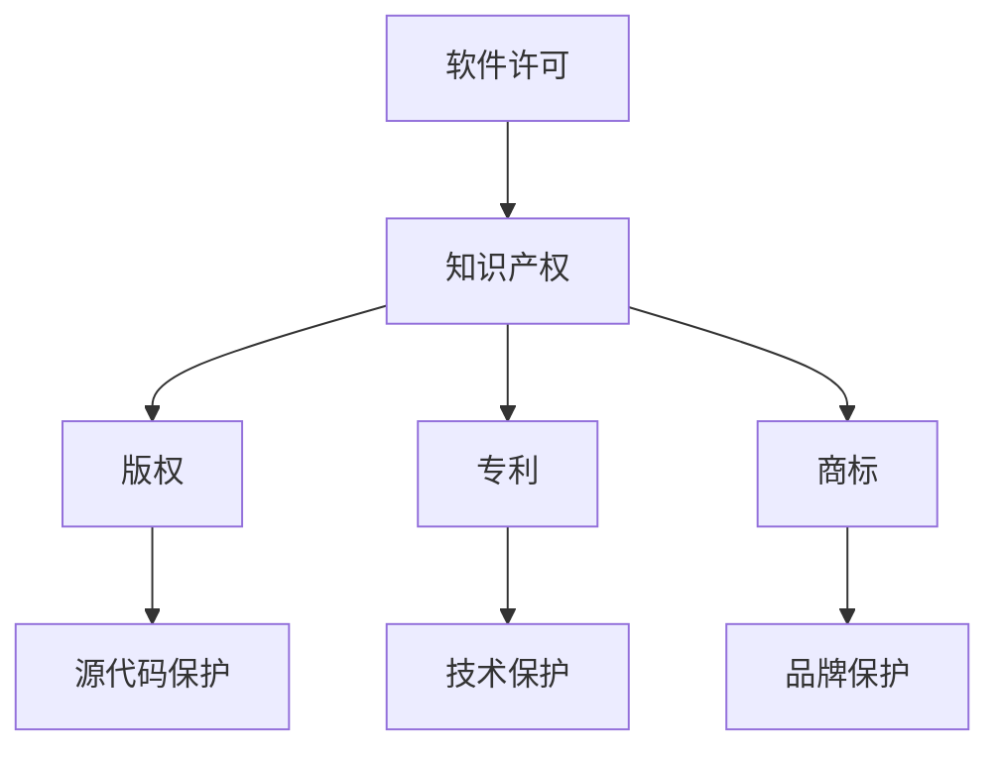

                 


### 文章标题
《AI时代的软件许可与知识产权新挑战》

#### 关键词
人工智能、软件许可、知识产权、开源许可、专利保护

#### 摘要
本文深入探讨了AI时代软件许可与知识产权面临的新挑战。首先，我们介绍了AI时代的背景和软件许可、知识产权的基本概念。接着，分析了AI技术对传统软件许可制度带来的变革，包括AI技术的许可类型和授权过程。然后，我们讨论了AI时代下的开源许可、知识产权保护策略、专利申请与保护以及商标保护。通过案例分析和项目实战，进一步揭示了AI时代软件许可与知识产权的实践挑战和解决策略。最后，本文提出了未来发展的展望，为相关政策制定和实践提供了参考。

### 第一部分：引言与背景

#### 1.1 AI时代背景
人工智能（AI）作为当今科技发展的核心驱动力，正迅速改变各行各业。从自然语言处理到图像识别，从智能机器人到自动驾驶，AI技术的应用已经深入到我们的日常生活中。随着AI技术的不断进步，它不仅提高了生产效率，还创造了新的商业模式和商业机会。然而，AI时代的到来也带来了许多前所未有的挑战，其中包括软件许可与知识产权方面的挑战。

AI技术的发展得益于深度学习、大数据和计算能力的提升。深度学习算法通过大量数据的训练，可以自动发现数据中的规律和模式，从而实现人类难以完成的复杂任务。大数据技术使得海量数据可以被有效存储和处理，为AI算法提供了丰富的数据资源。计算能力的提升，特别是量子计算的发展，为AI算法的快速训练和部署提供了可能。这些技术进步使得AI技术得到了前所未有的发展，并开始影响软件开发的方方面面。

#### 1.2 软件许可与知识产权概述
软件许可与知识产权是软件开发和分发过程中不可或缺的环节。软件许可规定了软件的使用条件和限制，是软件开发者保护自身权益、规范软件使用的重要手段。知识产权则涵盖了版权、专利和商标等方面，为软件开发者提供了法律保护，激励创新和技术的持续发展。

软件许可可以分为开源许可和商业许可。开源许可允许用户自由使用、修改和分发软件，但通常需要遵守特定的许可协议。商业许可则通常与用户支付费用相对应，提供特定的使用权限和服务支持。知识产权保护则包括版权保护、专利保护和商标保护等方面。版权保护主要针对软件的源代码和文档，专利保护则针对软件中的创新技术，商标保护则用于标识软件的商标和品牌。

#### 1.3 研究目的与意义
本文旨在探讨AI时代软件许可与知识产权面临的新挑战，分析其背后的原因和影响，并提出相应的解决方案。随着AI技术的广泛应用，软件许可与知识产权的规则和制度需要不断适应和更新。本研究对于推动软件产业健康发展、保护软件开发者的权益具有重要意义。

首先，本文将详细讨论AI技术对传统软件许可制度带来的变革，包括AI技术的许可类型和授权过程。接着，我们将分析AI时代下开源许可的特点和挑战，探讨开源许可协议的常见问题和解决方案。然后，我们将探讨AI时代的知识产权保护策略，包括专利申请和保护的基本流程，以及商标保护的挑战与机遇。

此外，本文还将通过案例分析，揭示AI时代软件许可与知识产权的实践挑战和解决策略。最后，本文将提出未来发展的展望，为相关政策制定和实践提供参考。

### 第二部分：知识产权在AI时代的角色与挑战

#### 2.1 知识产权保护的重要性
知识产权保护是保障创新成果得到公平回报和有效利用的关键。在传统软件开发中，知识产权保护主要通过版权、专利和商标等方式实现。版权保护软件的源代码和文档，专利保护软件中的创新技术，商标则用于标识软件的品牌和价值。然而，随着AI技术的发展，知识产权保护面临新的挑战和机遇。

首先，AI技术的特点使得传统的知识产权保护方式面临挑战。AI技术通常基于大量的数据和算法模型，这些数据和技术往往具有高价值和商业价值。然而，数据的来源和来源的合法性常常难以确认，这给知识产权保护带来了困难。此外，AI技术的快速迭代和更新速度也使得传统的专利申请和保护流程难以适应。

其次，AI技术的应用场景和商业模式不断扩展，也带来了知识产权保护的新挑战。例如，在自动驾驶、智能医疗等新兴领域，AI技术的应用不仅涉及到软件本身，还涉及到硬件、数据和服务等多个方面。这需要知识产权保护体系能够跨越不同领域，提供全面的法律保障。

最后，AI技术的跨国应用和国际合作也增加了知识产权保护的复杂性。不同国家和地区的知识产权法律体系存在差异，这给跨国知识产权保护带来了挑战。如何在全球化背景下，协调不同国家和地区的知识产权保护规则，成为亟待解决的问题。

#### 2.2 AI时代知识产权的新挑战
AI时代的到来，为知识产权保护带来了前所未有的挑战。以下是一些主要的挑战：

##### 2.2.1 数据隐私与保护
AI技术的核心是数据，而数据的隐私和安全性是知识产权保护的重要方面。在AI技术中，大量敏感数据被用于训练模型和优化算法。然而，这些数据往往涉及个人隐私和企业机密，一旦泄露，可能对个人和企业造成重大损失。因此，如何在保护数据隐私的同时，有效利用数据，成为AI时代知识产权保护的重要课题。

##### 2.2.2 算法创新与保护
AI技术的创新主要依赖于算法模型的改进和优化。然而，算法的抽象性和复杂性使得传统的专利申请和保护变得困难。一方面，算法的创新往往不容易被明确界定和描述；另一方面，算法的保护范围和权利边界也难以确定。这给算法专利的申请和保护带来了挑战。

##### 2.2.3 跨领域合作与知识产权协调
AI技术的应用跨越多个领域，如医疗、金融、交通等。这些领域的知识产权保护规则和标准往往不同，如何在跨领域合作中协调知识产权保护，成为AI时代知识产权保护的重要挑战。

##### 2.2.4 知识产权维权与司法挑战
AI技术的发展使得知识产权侵权行为更加隐蔽和复杂。传统的知识产权维权手段在应对AI技术侵权时，往往难以有效发挥作用。例如，AI技术的自动化和智能化特性，使得侵权行为更加难以察觉和追踪。此外，不同国家和地区的知识产权法律体系和司法实践也存在差异，这给知识产权维权带来了挑战。

#### 2.3 AI时代知识产权保护策略
面对AI时代知识产权的新挑战，我们需要制定新的知识产权保护策略，以应对这些挑战。以下是一些可能的策略：

##### 2.3.1 数据隐私保护策略
为了保护数据隐私，可以采取以下策略：
- 强化数据加密和匿名化技术，确保数据在传输和存储过程中的安全性。
- 建立数据隐私保护法律法规，明确数据收集、使用和共享的规则。
- 强化数据隐私保护的监管和执法，确保数据隐私得到有效保护。

##### 2.3.2 算法创新保护策略
为了保护算法创新，可以采取以下策略：
- 推广算法专利制度，明确算法创新的权利和范围。
- 加强算法专利审查和授权，确保专利申请的有效性和质量。
- 建立算法专利池，促进算法创新和共享。

##### 2.3.3 跨领域知识产权协调策略
为了协调跨领域的知识产权保护，可以采取以下策略：
- 建立跨领域的知识产权合作机制，促进不同领域知识产权保护的协调。
- 制定统一的知识产权保护标准和规范，提高知识产权保护的一致性和有效性。
- 推动国际知识产权合作，加强跨国知识产权保护。

##### 2.3.4 知识产权维权与司法策略
为了加强知识产权维权和司法保护，可以采取以下策略：
- 建立专业的知识产权维权机构，提供专业的维权服务。
- 加强知识产权司法保护，提高知识产权案件的审判效率和公正性。
- 建立跨国知识产权维权合作机制，加强国际知识产权保护。

#### 2.4 结论
AI时代为知识产权保护带来了新的挑战和机遇。我们需要制定新的知识产权保护策略，以应对这些挑战，促进AI技术的创新和应用。通过加强数据隐私保护、算法创新保护、跨领域知识产权协调和知识产权维权与司法保护，我们可以为AI时代知识产权保护提供有效的保障。

### 第三部分：软件许可制度的变革

#### 3.1 传统软件许可制度
传统软件许可制度是基于特定软件的许可，用户通过支付费用获得软件的使用权限。传统软件许可制度通常包括以下几种形式：

- **独占许可**：用户获得软件的独占使用权，其他用户无法使用该软件。
- **普通许可**：用户获得软件的非独占使用权，其他用户可以共享使用该软件。
- **节点锁定许可**：用户只能在特定的硬件节点上使用软件，软件无法在其他硬件上运行。
- **云许可**：用户通过云平台租用软件，无需在本地安装，方便灵活。

传统软件许可制度的主要目的是保护软件版权，防止未经授权的使用和复制。它通过明确的许可条款，规定了用户的使用权限、责任和义务，确保软件开发者能够获得公平的回报。

#### 3.2 AI时代软件许可制度变革
随着AI技术的广泛应用，传统软件许可制度面临诸多挑战，需要进行变革以适应新的需求。

##### 3.2.1 许可协议的多样性
AI技术的应用场景和商业模式丰富多样，传统的许可协议难以满足这些需求。因此，AI时代的软件许可协议需要更加灵活和多样化，以适应不同的应用场景和商业模式。

- **功能许可**：用户根据软件提供的特定功能进行许可，如仅允许使用图像识别功能。
- **按需许可**：用户根据实际使用需求购买许可，按使用量付费，灵活方便。
- **混合许可**：结合不同类型的许可，如同时包含功能许可和按需许可，满足多样化的需求。

##### 3.2.2 数据共享与隐私保护
AI技术的核心是数据，但数据的隐私和安全性是用户和开发者共同关注的焦点。在AI时代的软件许可制度中，需要平衡数据共享与隐私保护的关系，确保数据的安全性和合法性。

- **数据匿名化**：在数据共享过程中，对数据进行匿名化处理，保护用户隐私。
- **数据权限管理**：明确数据的使用权限，确保数据不会被滥用。
- **数据安全协议**：制定严格的数据安全协议，确保数据在传输和存储过程中的安全性。

##### 3.2.3 知识产权保护与开放创新
AI技术的快速发展离不开开放创新和知识产权保护的双重驱动。在AI时代的软件许可制度中，需要平衡知识产权保护和开放创新的关系，激励技术进步。

- **开源许可**：鼓励开源许可，促进技术的共享和协作，提高开发效率。
- **专利合作**：推动专利合作和共享，避免专利战的负面影响，促进技术进步。
- **知识产权保护制度**：加强知识产权保护制度，确保开发者的权益得到有效保障。

##### 3.2.4 许可协议的自动化和数字化
随着技术的进步，软件许可协议的自动化和数字化成为趋势。通过自动化和数字化，可以简化许可流程，提高许可效率，降低管理成本。

- **许可管理系统**：建立许可管理系统，自动化处理许可申请、审批和续费等流程。
- **电子合同**：使用电子合同，实现许可协议的在线签署和执行。
- **智能合约**：利用区块链和智能合约技术，实现许可协议的自动执行和监控。

#### 3.3 AI时代软件许可制度变革的影响
AI时代软件许可制度的变革将对软件开发、使用和管理产生深远影响。

- **开发者的收益**：灵活多样的许可协议和开放创新的环境将提高开发者的收益，激励技术进步。
- **用户的体验**：多样化的许可协议和便捷的许可流程将提高用户的使用体验，满足不同需求。
- **知识产权保护**：加强的知识产权保护制度将确保开发者的权益得到有效保障，降低侵权风险。
- **管理效率**：自动化和数字化的许可管理将提高管理效率，降低管理成本。

#### 3.4 结论
AI时代的软件许可制度需要适应新的技术环境和商业模式，进行变革和创新。通过多样化的许可协议、数据共享与隐私保护、知识产权保护和自动化数字化，AI时代的软件许可制度将更好地满足开发者和用户的需求，推动软件产业的健康发展。

### 第四部分：AI技术的许可与授权

#### 4.1 AI技术许可的类型
AI技术的许可主要分为以下几种类型：

##### 4.1.1 商业许可
商业许可是最常见的许可类型，适用于商业用途的AI技术。商业许可通常包括以下内容：

- **使用权**：用户获得在特定范围内使用AI技术的权利。
- **限制**：许可协议中通常会规定AI技术的使用限制，如使用的场景、地理位置、用户数量等。
- **费用**：用户需要支付许可费用，费用通常根据使用量、应用范围等因素确定。

商业许可适用于企业、研究机构等需要商业应用的场景，可以帮助AI技术实现商业价值。

##### 4.1.2 开源许可
开源许可允许用户自由使用、修改和分发AI技术，但需要遵守特定的许可协议。常见的开源许可协议包括GNU通用公共许可证（GPL）、MIT许可证、Apache许可证等。

- **开源许可证**：开源许可协议通常包含对代码、文档、数据的开放使用和共享规定。
- **共享与协作**：开源许可鼓励用户参与代码的改进和优化，促进技术的共享和协作。
- **责任**：开源许可协议明确规定了用户在使用、修改和分发过程中的责任和义务。

开源许可适用于开发社区、研究机构等需要共享和协作的场景，有助于推动技术进步。

##### 4.1.3 节点锁定许可
节点锁定许可是针对特定硬件节点的许可，适用于高性能计算和特定环境下的应用。

- **硬件节点**：节点锁定许可要求用户只能在特定的硬件节点上使用AI技术。
- **限制**：许可协议通常包括对硬件节点的使用限制，如地理位置、硬件配置等。
- **安全性**：节点锁定许可可以确保AI技术不被非法复制和传播。

节点锁定许可适用于对硬件安全性要求较高的场景，如金融、国防等领域。

##### 4.1.4 云服务许可
云服务许可是针对云平台提供的AI技术许可，适用于通过云平台使用AI技术的场景。

- **云平台**：用户通过云平台租用AI技术，无需在本地部署。
- **灵活性**：云服务许可提供了高度的灵活性，用户可以根据需求调整计算资源。
- **成本效益**：云服务许可通常提供按需付费模式，降低使用成本。

云服务许可适用于需要灵活扩展计算资源的企业和开发者。

#### 4.2 AI技术授权的过程
AI技术的授权过程包括以下几个步骤：

##### 4.2.1 许可协议谈判
在授权过程中，双方首先进行许可协议的谈判，确定许可类型、使用范围、费用、责任等方面的条款。谈判的结果将直接影响到授权的顺利与否。

- **条款协商**：双方就许可协议的各个条款进行讨论，达成一致。
- **合同条款**：谈判达成一致后，制定正式的合同条款，明确各方的权利和义务。

##### 4.2.2 许可协议签署
在谈判完成后，双方按照合同条款签署许可协议。签署的许可协议是双方共同遵守的法定文件，具有法律效力。

- **签署程序**：双方按照规定的程序签署许可协议，确保协议的合法性和有效性。
- **签署文件**：签署的许可协议文件包括合同文本、附件、签署页等。

##### 4.2.3 许可实施与监控
签署许可协议后，用户开始使用AI技术，许可方负责监控和确保许可的合法性和合规性。

- **使用指导**：许可方提供使用指导，帮助用户正确使用AI技术。
- **监控机制**：许可方建立监控机制，跟踪AI技术的使用情况，确保许可的合法性和合规性。

##### 4.2.4 许可续费与维护
在许可期间，用户需要按照许可协议的规定进行续费和维护。

- **续费**：用户按照许可协议的续费条款，续签许可协议，确保持续使用AI技术。
- **维护**：许可方负责AI技术的维护，确保技术的稳定性和安全性。

#### 4.3 AI技术许可与授权的挑战
在AI技术许可与授权过程中，存在以下挑战：

##### 4.3.1 技术复杂度
AI技术的复杂性和高度专业化，使得许可与授权的过程更加复杂。双方需要对AI技术有深入的理解，确保许可协议的准确性和有效性。

##### 4.3.2 数据安全与隐私
AI技术的数据依赖性，使得数据安全和隐私成为许可与授权的关键问题。许可方需要确保数据的安全性和合法性，避免数据泄露和滥用。

##### 4.3.3 法律法规
不同国家和地区的法律法规对AI技术的许可与授权有不同的规定。跨国许可与授权需要遵守不同国家的法律法规，增加合规性挑战。

##### 4.3.4 风险管理
AI技术的许可与授权过程中，双方需要评估和管理各种风险，包括技术风险、法律风险、市场风险等。

#### 4.4 结论
AI技术的许可与授权是AI技术商业化的重要环节。通过明确许可类型、优化授权过程，可以促进AI技术的商业化应用，推动AI技术的发展。同时，面对技术复杂度、数据安全与隐私、法律法规和风险管理等方面的挑战，需要制定相应的解决方案，确保AI技术的许可与授权顺利进行。

### 第五部分：AI时代下的开源许可

#### 5.1 开源许可的基本概念
开源许可是一种允许用户自由使用、修改和分发软件的许可协议。开源许可的核心是开放性，用户可以自由获取软件源代码，进行修改和分发，但需要遵守特定的许可协议。开源许可旨在促进技术的共享和协作，推动技术的进步和创新。

开源许可协议通常包含以下主要内容：

- **版权声明**：声明软件的版权归属，明确用户的使用权限。
- **许可条款**：规定用户在使用、修改和分发软件时的权利和义务。
- **免责声明**：明确软件可能存在的缺陷和风险，免除开发者的责任。
- **版权保留**：保留开发者的部分版权，确保其创新成果得到保护。

常见的开源许可协议包括GNU通用公共许可证（GPL）、MIT许可证、Apache许可证等。

#### 5.2 常见开源许可协议
以下是几种常见开源许可协议的简要介绍：

##### 5.2.1 GNU通用公共许可证（GPL）
GNU通用公共许可证（GPL）是由自由软件基金会（FSF）发布的一种开源许可协议。GPL许可证要求用户在修改和分发软件时，必须公开源代码，并允许用户自由使用、修改和分发软件。GPL许可证的核心原则是“自由”，用户有权自由使用、学习、修改和分发软件，但必须遵守特定的许可条款。

- **版权声明**：软件的版权归自由软件基金会所有。
- **许可条款**：用户可以自由使用、修改和分发软件，但必须公开源代码。
- **免责声明**：开发者不对软件的使用效果承担责任。

##### 5.2.2 MIT许可证
MIT许可证是一种宽松的开源许可协议，由麻省理工学院（MIT）发布。MIT许可证允许用户自由使用、修改和分发软件，但不需要公开源代码。用户可以在商业和非商业项目中使用MIT许可证下的软件，但需要保留版权声明。

- **版权声明**：软件的版权归开发者所有。
- **许可条款**：用户可以自由使用、修改和分发软件，无需公开源代码。
- **免责声明**：开发者不对软件的使用效果承担责任。

##### 5.2.3 Apache许可证
Apache许可证是由Apache软件基金会发布的一种开源许可协议。Apache许可证允许用户自由使用、修改和分发软件，但需要遵守特定的许可条款。Apache许可证在商业和非商业项目中广泛应用，其核心原则是“开放、协作、中立”。

- **版权声明**：软件的版权归开发者所有。
- **许可条款**：用户可以自由使用、修改和分发软件，但需要遵守特定的许可协议。
- **免责声明**：开发者不对软件的使用效果承担责任。

#### 5.3 常见开源许可协议的问题与解决方案
尽管开源许可协议在促进技术共享和协作方面发挥了重要作用，但实践中也存在一些问题和挑战。

##### 5.3.1 许可协议冲突
在开源项目中，可能同时包含多个许可协议，导致协议冲突。解决方法包括：

- **统一许可协议**：在项目开始时，选择一种统一的许可协议，避免冲突。
- **组件隔离**：将具有不同许可协议的组件隔离，确保项目的整体一致性。

##### 5.3.2 许可协议滥用
一些用户可能会滥用开源许可协议，侵犯开发者的权益。解决方法包括：

- **明确许可条款**：制定明确的许可条款，明确用户的使用权限和责任。
- **法律保护**：通过法律途径保护开发者的权益，确保许可协议的执行。

##### 5.3.3 知识产权风险
开源项目可能面临知识产权风险，如专利侵权、版权侵犯等。解决方法包括：

- **专利授权**：开发者可以在开源项目中声明专利授权，确保项目的知识产权合法。
- **知识产权审查**：在项目开始前，对开源项目的知识产权进行审查，避免潜在风险。

#### 5.4 结论
开源许可协议在促进技术共享和协作方面具有重要意义。通过明确许可协议、解决协议冲突、保护知识产权，我们可以充分发挥开源许可的优势，推动技术的进步和创新。未来，随着AI技术的不断发展，开源许可将在AI领域发挥更大的作用。

### 第六部分：AI时代的知识产权保护策略

#### 6.1 知识产权保护的新方法
随着AI技术的迅猛发展，传统的知识产权保护方法面临着新的挑战。为了应对这些挑战，我们需要探索新的知识产权保护方法。

##### 6.1.1 人工智能辅助的知识产权管理
人工智能技术可以用于知识产权的管理和监控，提高知识产权保护的有效性。例如，通过使用人工智能技术，可以自动化地检测潜在的知识产权侵权行为，及时发现和处理侵权案件。此外，人工智能还可以用于知识产权的分析和评估，帮助企业和机构更好地了解其知识产权的价值和风险。

##### 6.1.2 人工智能驱动的知识产权维权
人工智能技术可以用于知识产权的维权过程。例如，通过使用自然语言处理和机器学习技术，可以自动生成维权文书和诉状，提高维权效率。同时，人工智能还可以帮助律师团队更准确地分析案件，制定有效的维权策略。

##### 6.1.3 人工智能辅助的专利分析
人工智能技术可以用于专利分析和挖掘，帮助企业和机构更好地了解竞争对手的技术布局和专利情况。通过使用人工智能技术，可以快速识别潜在的侵权风险和专利机会，为企业提供战略性的决策支持。

#### 6.2 AI技术在知识产权维权中的应用
AI技术在知识产权维权中的应用具有显著的潜力。以下是一些具体的应用场景：

##### 6.2.1 侵权检测
AI技术可以用于检测潜在的知识产权侵权行为。例如，通过使用图像识别技术，可以检测盗版软件或盗用版权作品的侵权行为。通过机器学习模型，可以识别和分类大量的知识产权数据，快速发现侵权行为。

##### 6.2.2 案件分析
AI技术可以帮助律师团队更准确地分析知识产权案件。例如，通过自然语言处理技术，可以自动提取案件中的关键信息，生成案件摘要和分析报告。同时，人工智能还可以帮助律师团队预测案件的审判结果，为制定维权策略提供依据。

##### 6.2.3 智能合同审查
AI技术可以用于智能合同的审查和审核。通过使用自然语言处理和机器学习技术，可以自动识别合同中的潜在风险和漏洞，为企业和机构提供合同审查和审核服务。

##### 6.2.4 侵权行为预测
AI技术可以用于预测潜在的知识产权侵权行为。通过分析历史数据和趋势，可以预测哪些产品或服务可能侵犯他人的知识产权。这有助于企业和机构采取预防措施，避免潜在的侵权风险。

#### 6.3 AI技术在专利申请与保护中的应用
在专利申请与保护方面，AI技术也具有广泛的应用前景。

##### 6.3.1 专利挖掘
AI技术可以用于专利挖掘，帮助企业和机构发现潜在的专利机会。通过分析大量的专利数据，可以识别出新的专利方向和趋势，为企业提供创新的思路和灵感。

##### 6.3.2 专利分析
AI技术可以用于专利分析，帮助企业和机构了解竞争对手的技术布局和专利情况。通过分析专利数据，可以识别出竞争对手的关键技术和核心专利，为企业提供战略性的决策支持。

##### 6.3.3 专利撰写与审查
AI技术可以用于专利撰写和审查，提高专利申请的成功率。通过自然语言处理技术，可以自动生成高质量的专利申请文件。同时，人工智能还可以帮助专利审查员更快速地审查专利申请，提高审查效率。

#### 6.4 结论
AI时代的到来为知识产权保护带来了新的机遇和挑战。通过探索人工智能辅助的知识产权管理、维权和专利保护方法，我们可以提高知识产权保护的有效性和效率。同时，AI技术在侵权检测、案件分析、合同审查和侵权行为预测等方面的应用，将进一步推动知识产权保护的发展。未来，随着AI技术的不断进步，我们将能够更好地应对AI时代知识产权保护的新挑战。

### 第七部分：AI时代的专利申请与保护

#### 7.1 专利申请的基本流程
专利申请是一个复杂而详尽的过程，涉及到多个步骤和阶段。以下是专利申请的基本流程：

##### 7.1.1 发明构思
在专利申请之前，首先需要有一个创新性的发明构思。这个构思可能是一个技术解决方案、产品或过程，具有新颖性、创造性和实用性。

##### 7.1.2 研究与检索
在确定发明构思后，进行专利检索是必要的步骤。专利检索可以帮助申请人了解现有技术状况，发现相似或相关的专利，从而避免重复发明和潜在的侵权风险。

##### 7.1.3 准备专利申请文件
专利申请文件是专利申请的核心，包括专利请求书、说明书、权利要求书和摘要。说明书需要详细描述发明内容，权利要求书则规定了发明的保护范围。

##### 7.1.4 提交专利申请
准备好专利申请文件后，申请人需要将其提交给相应的专利局。不同国家的专利局有不同的提交方式和要求，通常可以通过电子方式或书面方式提交。

##### 7.1.5 审查与审查意见
专利局在收到专利申请后，会对申请进行初步审查。如果申请符合形式要求，专利局将进入实质审查阶段。实质审查主要评估发明的新颖性、创造性和实用性。

##### 7.1.6 专利授权
如果专利申请通过了审查，将获得专利授权。授权后的专利在规定的有效期内提供法律保护，通常为20年。

#### 7.2 专利保护在AI时代的挑战与对策
AI技术的快速发展给专利保护带来了新的挑战。以下是AI时代专利保护面临的几个主要挑战和相应的对策：

##### 7.2.1 技术抽象性
AI技术通常涉及复杂的算法和模型，这些技术的高度抽象性使得专利申请和审查变得更加困难。对策：加强专利申请文件的描述，详细说明算法的实现细节和操作步骤，确保专利请求具有足够的清晰度和可操作性。

##### 7.2.2 数据依赖性
AI技术通常依赖于大量的训练数据，这些数据的来源和合法性难以确定。对策：明确数据来源和合法性声明，确保专利申请中涉及的训练数据符合相关法律法规。

##### 7.2.3 集成创新
AI技术往往涉及到多个领域的集成创新，这使得专利申请和保护变得更加复杂。对策：通过跨领域的专利布局，确保专利申请能够覆盖整个技术体系，避免专利漏洞。

##### 7.2.4 国际合作与标准制定
跨国AI技术的应用要求国际合作和标准制定，以确保专利保护的统一性和一致性。对策：积极参与国际专利合作组织和标准化组织，推动全球范围内的专利保护合作和标准制定。

##### 7.2.5 侵权行为的隐蔽性
AI技术的侵权行为可能更加隐蔽，检测和维权变得更加困难。对策：利用人工智能技术进行侵权检测，提高侵权行为发现的效率和准确性。

#### 7.3 AI时代专利申请与保护的案例分析
为了更好地理解AI时代专利申请与保护的挑战和对策，以下通过几个案例进行分析：

##### 7.3.1 案例一：谷歌与微软的AI专利纠纷
谷歌和微软在AI技术领域有着广泛的专利布局，双方在多个领域存在专利纠纷。通过详细的专利分析和诉讼，双方逐步解决了专利纠纷，展示了AI时代专利保护的复杂性。

##### 7.3.2 案例二：OpenAI的GPT-3专利申请
OpenAI在发布GPT-3（Generative Pre-trained Transformer 3）后，对其进行了广泛的专利申请。OpenAI通过详细的专利申请文件，描述了GPT-3的核心技术和应用场景，确保了专利申请的完整性和准确性。

##### 7.3.3 案例三：自动驾驶技术专利纠纷
自动驾驶技术作为AI领域的重要应用，涉及多个专利纠纷。多家公司之间在自动驾驶技术的核心专利方面进行了激烈的争夺，通过专利诉讼和和解，最终确定了各自的权益。

#### 7.4 结论
AI时代的到来为专利申请与保护带来了新的挑战，但同时也为专利技术和法律体系的发展提供了新的机遇。通过加强专利申请文件的描述、明确数据来源和合法性、进行跨领域专利布局、积极参与国际合作和标准制定，以及利用人工智能技术进行侵权检测，我们可以更好地应对AI时代专利保护的挑战。案例分析进一步展示了AI时代专利申请与保护的复杂性和重要性，为未来的发展提供了有益的参考。

### 第八部分：AI时代的商标保护

#### 8.1 商标的定义与保护
商标是一种用于区分商品或服务来源的标志，通常由文字、图形、字母、数字、三维标志、颜色组合等构成。商标的独特性使其在商业活动中具有重要的识别和标识作用。在AI时代，随着技术的不断进步，商标的保护也面临着新的挑战和机遇。

商标保护的法律基础主要包括《商标法》、《版权法》、《专利法》等。这些法律为商标的注册、使用和保护提供了明确的规则。商标注册是获得商标法律保护的前提，只有注册商标才能享有专有权利。

商标保护的主要内容包括：

- **专用权**：商标注册人对其注册商标享有专有使用权，他人未经许可不得使用相同或类似的商标。
- **禁止权**：商标注册人有权禁止他人侵犯其商标权，包括商标抢注、假冒商标等行为。
- **转让权**：商标注册人有权将其商标转让给他人，转让需要依法办理相关手续。
- **许可权**：商标注册人有权许可他人使用其商标，许可使用需要签订许可协议。

#### 8.2 AI时代商标保护的挑战
AI技术的快速发展给商标保护带来了新的挑战：

##### 8.2.1 技术创新与商标保护的冲突
AI技术的创新性使得商标保护面临新的挑战。例如，AI技术可以自动生成图形和文字，这些生成内容可能构成商标，但如何界定其商标性以及如何进行保护，成为商标法律体系面临的新问题。

##### 8.2.2 商标侵权的隐蔽性
AI技术使得侵权行为更加隐蔽，例如，通过机器学习和深度学习技术，侵权者可以自动生成与原有商标相似的新商标，从而规避商标法的保护。这使得商标侵权行为的发现和打击变得更加困难。

##### 8.2.3 商标混淆的可能性
AI技术在广告和营销中的应用，使得广告内容更加丰富和多样化。然而，这也增加了商标混淆的可能性，消费者可能因为AI技术的误导而混淆不同品牌的产品或服务。

##### 8.2.4 数据隐私与商标保护
AI技术依赖大量数据，这些数据可能涉及商标持有人的商业秘密和用户隐私。如何在保护商标的同时，确保数据隐私和安全，成为商标保护面临的新挑战。

#### 8.3 AI时代商标保护的对策
针对AI时代商标保护面临的挑战，可以采取以下对策：

##### 8.3.1 加强商标保护法规的制定与修订
随着AI技术的发展，需要及时修订和完善商标保护法规，确保其适应新技术环境。例如，可以明确AI生成内容是否构成商标，以及如何界定其商标性。

##### 8.3.2 利用人工智能技术进行商标保护
人工智能技术可以用于商标保护的各个方面，包括商标侵权检测、商标混淆评估、商标监控等。通过机器学习和自然语言处理技术，可以提高商标保护的有效性和效率。

##### 8.3.3 建立跨国商标保护合作机制
随着全球化的推进，跨国商标保护变得更加重要。通过建立跨国商标保护合作机制，可以加强各国商标法之间的协调，提高国际商标保护的统一性和一致性。

##### 8.3.4 加强商标权利人的保护意识
商标权利人需要提高对商标保护的重视，加强自身的商标管理。例如，定期进行商标监控，及时发现和处理侵权行为；加强员工的教育和培训，提高其对商标法律的认识和遵守。

##### 8.3.5 加强数据隐私保护
在利用AI技术进行商标保护时，需要确保数据隐私和安全。例如，采取数据加密、匿名化等技术措施，确保商标保护过程中涉及的数据不被滥用或泄露。

#### 8.4 结论
AI时代的到来为商标保护带来了新的挑战和机遇。通过加强商标保护法规的制定与修订、利用人工智能技术、建立跨国合作机制、提高商标权利人的保护意识以及加强数据隐私保护，我们可以更好地应对AI时代商标保护的新挑战。商标保护在AI时代不仅关系到企业的商业利益，也关系到消费者的权益，因此，相关各方需要共同努力，确保商标保护的有效性和公正性。

### 案例分析

#### 9.1 案例一：某公司AI技术专利纠纷

某公司（以下简称“原告”）是一家专注于人工智能技术研究和开发的高科技企业。原告自主研发了一种名为“智能图像识别系统”的技术，并在国内成功申请了相关专利。然而，在专利获得授权后不久，原告发现市场上存在多家公司（以下简称“被告”）在未经许可的情况下，使用了与其专利相同的智能图像识别技术。

**纠纷背景：**

- 原告在2018年研发成功“智能图像识别系统”，并在2019年成功申请了相关专利。
- 2020年，原告发现多家被告公司在其产品中使用了与原告专利相同的技术。
- 被告公司的产品在市场上取得了较大的成功，给原告带来了巨大的经济损失。

**解决方案：**

1. **专利侵权检测：** 原告首先利用人工智能技术，对市场上的相关产品进行专利侵权检测。通过图像识别和算法分析，原告成功确定了被告公司的侵权行为。

2. **法律咨询与诉讼：** 原告聘请了专业律师团队，对被告公司进行了详细的调查和取证。在确信被告公司构成专利侵权后，原告向法院提起了侵权诉讼。

3. **调解与和解：** 在诉讼过程中，原告与被告进行了多次调解。最终，被告公司承认侵权行为，并同意与原告达成和解协议。

4. **经济赔偿与许可协议：** 根据和解协议，被告公司需向原告支付一定的经济赔偿，并承诺未来不再使用原告的专利技术。此外，被告公司还可以通过与原告签订许可协议，继续使用原告的专利技术。

**总结与启示：**

- **专利保护的重要性：** 通过此案例，我们可以看到，专利保护对于高科技企业的重要性。在AI时代，技术创新速度加快，专利纠纷也日益增多。企业需要重视专利保护，确保自身技术创新的权益。
- **利用人工智能技术：** 利用人工智能技术进行专利侵权检测，可以提高侵权行为发现的效率和准确性。这对于企业及时发现和应对侵权行为具有重要意义。
- **法律咨询与诉讼：** 在专利纠纷中，专业律师团队和法律咨询是必不可少的。通过法律手段保护自身权益，是企业应对专利纠纷的有效途径。
- **经济赔偿与许可协议：** 经济赔偿和许可协议是解决专利纠纷的常见方式。通过合理的方式，企业可以在保护自身权益的同时，实现利益的平衡。

#### 9.2 案例二：某开源社区许可协议争议

某知名开源社区（以下简称“社区”）提供了一个广泛使用的AI框架，该框架在多个项目中得到应用。然而，近期社区发现其中一部分贡献者（以下简称“贡献者”）在未经许可的情况下，将社区框架用于商业项目，并拒绝遵循开源许可协议。

**纠纷背景：**

- 社区在2021年发布了新的版本，并在许可证中明确要求贡献者遵守特定条款。
- 贡献者在2022年开始将社区框架用于商业项目，但未遵循开源许可协议。
- 社区发现这一情况后，与贡献者进行了多次沟通，但贡献者坚持不遵守许可协议。

**解决方案：**

1. **社区调查与公开声明：** 社区首先对贡献者的行为进行了调查，并发布了公开声明，明确指出贡献者的行为违反了开源许可协议。

2. **法律咨询与诉讼：** 社区聘请了专业律师团队，对贡献者提起了侵权诉讼。律师团队通过法律途径，要求贡献者遵守开源许可协议。

3. **社区协商与调解：** 在诉讼过程中，社区与贡献者进行了多次协商和调解。最终，双方达成了一项和解协议。

4. **许可协议调整与公开道歉：** 根据和解协议，贡献者需公开道歉，并承诺未来遵守开源许可协议。此外，社区还调整了部分许可协议条款，以更好地保护社区成员的权益。

**总结与启示：**

- **开源许可协议的重要性：** 开源许可协议是开源社区运作的基础，明确规定了贡献者和用户的行为准则。社区需要重视许可协议的制定和执行，确保开源项目的健康发展。
- **法律手段与社区协商：** 在开源社区许可协议争议中，法律手段和社区协商都是解决问题的关键。通过法律途径，可以确保开源许可协议的执行；而社区协商则有助于缓和矛盾，达成共识。
- **透明度与公正性：** 开源社区在处理许可协议争议时，需要保持透明度和公正性，确保所有社区成员的权益得到保护。
- **许可协议的适应性：** 随着技术发展和社区需求的变化，开源许可协议需要不断调整和更新。社区需要及时响应变化，确保许可协议的适应性和有效性。

#### 9.3 案例三：某平台AI算法商标侵权案

某知名技术平台（以下简称“平台”）在2020年推出了一款名为“智能推荐系统”的产品，并在全球范围内注册了相关商标。然而，不久后，平台发现市场上存在一家公司（以下简称“被告”）在未经许可的情况下，使用了与平台商标相似的名称，并将其用于类似的产品。

**纠纷背景：**

- 平台在2020年成功注册了“智能推荐系统”商标。
- 2021年，平台发现被告公司在其产品中使用与平台商标相似的名称，并试图误导消费者。
- 被告公司的行为严重侵犯了平台的商标权益，损害了平台的商业声誉。

**解决方案：**

1. **市场调查与取证：** 平台首先进行了市场调查，收集了被告公司使用相似商标的证据，包括产品宣传材料、用户反馈等。

2. **法律咨询与诉讼：** 平台聘请了专业律师团队，对被告公司提起了侵权诉讼。律师团队通过法律途径，要求被告公司停止侵权行为，并赔偿平台损失。

3. **和解与许可协议：** 在诉讼过程中，平台与被告公司进行了多次协商。最终，双方达成了一项和解协议。

4. **品牌保护与许可协议：** 根据和解协议，被告公司需停止使用与平台商标相似的名称，并支付一定的经济赔偿。此外，被告公司还可以通过与平台签订许可协议，继续使用平台商标。

**总结与启示：**

- **商标保护的重要性：** 商标是企业的重要资产，是品牌识别和保护的基石。企业需要重视商标保护，确保自身品牌的合法权益。
- **法律手段与和解：** 在商标侵权案中，法律手段是保护商标权益的关键。通过法律途径，可以确保侵权行为的停止和赔偿。同时，和解也是一种有效的解决途径，可以避免长期诉讼带来的成本和风险。
- **品牌保护策略：** 企业需要制定全面的品牌保护策略，包括商标注册、市场监控、法律咨询等。通过持续的品牌保护，可以确保企业的商标权益得到有效维护。
- **许可协议的灵活性：** 在处理商标侵权案时，灵活的许可协议可以帮助企业平衡利益，实现共赢。通过许可协议，企业不仅可以保护自身商标权益，还可以允许其他企业合法使用商标，推动行业的发展。

### 总结
通过上述案例分析，我们可以看到AI时代在软件许可与知识产权保护方面面临的复杂性和多样性。无论是专利纠纷、开源社区许可协议争议还是商标侵权案，都揭示了AI技术在商业应用中的挑战和解决方案。企业需要通过法律手段、技术手段和策略调整，确保自身权益的同时，推动技术的发展和行业的进步。在未来，随着技术的不断演进，软件许可与知识产权保护将面临更多的挑战和机遇，企业需要不断创新和适应，以应对这些变化。

### 第九部分：结论

#### 10.1 研究发现
本文通过对AI时代的软件许可与知识产权的研究，得出了以下主要发现：

1. **AI技术的快速发展带来了软件许可与知识产权的新挑战**：传统的软件许可和知识产权保护方法难以适应AI技术的特点和应用场景，需要新的策略和工具。
2. **软件许可制度需要变革以适应AI时代的需求**：灵活多样的许可协议、数据隐私保护、知识产权保护和自动化数字化是软件许可制度变革的关键。
3. **AI技术的许可与授权过程复杂多样**：商业许可、开源许可、节点锁定许可和云服务许可等多种许可类型，以及详细的授权过程，是AI技术商业化的重要保障。
4. **开源许可在AI时代具有重要意义**：开源许可协议促进了技术的共享和协作，但同时也带来了许可协议冲突、滥用和知识产权风险等问题。
5. **AI时代的知识产权保护策略需要创新**：利用人工智能技术进行知识产权管理、维权、专利分析和数据隐私保护，是知识产权保护的新方向。
6. **专利申请与商标保护在AI时代面临新的挑战**：技术抽象性、数据依赖性、商标侵权隐蔽性和跨国合作，需要新的对策和法规。

#### 10.2 未来发展趋势
基于上述研究发现，以下是对AI时代软件许可与知识产权未来发展的一些趋势和展望：

1. **软件许可制度的持续变革**：随着AI技术的不断进步，软件许可制度将更加灵活和多样化，以适应新的商业模式和应用场景。
2. **数据隐私保护成为核心议题**：随着数据在AI技术中的应用越来越广泛，数据隐私保护将成为软件许可与知识产权保护的核心议题，相关法律法规和技术措施将不断完善。
3. **开源许可的规范化**：开源许可将在AI时代发挥更大的作用，社区和企业在制定和执行开源许可协议时，将更加注重规范化，减少冲突和纠纷。
4. **知识产权保护技术创新**：人工智能技术在知识产权保护中的应用将不断扩展，从侵权检测、维权支持到专利分析和监控，人工智能技术将提高知识产权保护的有效性和效率。
5. **跨国知识产权合作的深化**：随着全球化的推进，跨国知识产权合作将变得更加重要，各国将加强在知识产权保护方面的合作，推动全球范围内的知识产权统一保护。
6. **政策和法规的调整与完善**：针对AI时代的新挑战，各国政府和国际组织将不断调整和完善知识产权保护政策，制定新的法律法规，以应对技术变革带来的挑战。

#### 10.3 政策建议与展望
为了更好地应对AI时代软件许可与知识产权的新挑战，提出以下政策建议：

1. **加强数据隐私保护法规的制定**：制定和完善数据隐私保护法律法规，明确数据收集、使用和共享的规则，确保数据安全和用户隐私。
2. **推动开源许可规范化**：建立开源许可规范化的机制，制定统一的许可协议标准，减少许可冲突和纠纷。
3. **加强知识产权保护技术的研发**：支持人工智能技术在知识产权保护领域的应用研究，开发先进的侵权检测、维权支持和专利分析系统。
4. **深化跨国知识产权合作**：推动国际知识产权合作，建立跨国知识产权保护机制，提高全球范围内的知识产权保护水平。
5. **完善知识产权保护政策**：根据AI时代的新特点，完善知识产权保护政策，确保政策能够适应技术变革和市场需求。

展望未来，AI时代的软件许可与知识产权保护将面临更多的挑战和机遇。通过不断创新、合作和完善政策，我们可以更好地应对这些挑战，推动软件产业的健康发展，促进AI技术的广泛应用。

### 第十部分：展望

#### 11.1 AI时代软件许可与知识产权的新课题
随着AI技术的不断发展和应用场景的多样化，AI时代的软件许可与知识产权保护将面临一系列新的课题。以下是几个值得关注的方面：

1. **人工智能生成内容的知识产权归属**：随着AI技术的发展，AI生成的内容（如图像、文本、音乐等）的知识产权归属问题成为一个重要的议题。如何明确AI生成内容的版权归属、使用权限和责任分配，是未来需要深入研究和解决的问题。

2. **算法专利的界定与保护**：算法作为AI技术的重要组成部分，其专利申请和保护面临诸多挑战。如何界定算法的创新性和专利性、如何保护算法的底层技术和框架，以及如何避免算法专利的滥用，是未来需要关注的问题。

3. **数据隐私与知识产权保护的平衡**：数据是AI技术的核心资源，但同时也涉及隐私保护问题。如何在保障数据隐私的同时，实现知识产权的有效保护，是一个复杂的课题。

4. **跨国知识产权保护协调**：随着全球化的深入，跨国知识产权保护协调变得尤为重要。如何在全球范围内建立统一的知识产权保护标准和法律框架，是未来需要解决的重要问题。

#### 11.2 政策建议与展望
为了应对AI时代软件许可与知识产权的新课题，提出以下政策建议：

1. **制定明确的数据隐私保护法规**：在保护知识产权的同时，制定明确的数据隐私保护法律法规，确保数据在收集、使用和共享过程中的合法性和安全性。

2. **推动算法专利的规范化**：建立统一的算法专利申请和保护标准，明确算法专利的界定和审查程序，避免专利滥用和过度竞争。

3. **加强国际合作与协调**：推动国际知识产权合作，建立跨国知识产权保护机制，促进全球范围内的知识产权协调和保护。

4. **完善知识产权法律体系**：根据AI时代的新特点，完善知识产权法律体系，确保法律能够适应技术变革和市场需求。

#### 11.3 未来研究方向
未来的研究应重点关注以下方向：

1. **AI生成内容的版权归属**：深入研究AI生成内容的版权归属问题，探索合理的版权分配机制，确保创作者和用户的权益得到保护。

2. **算法专利保护策略**：研究算法专利的申请和保护策略，提出有效的保护方案，促进算法创新和技术的持续发展。

3. **数据隐私与知识产权保护的平衡**：探讨如何在保护数据隐私的同时，实现知识产权的有效保护，为数据隐私保护和知识产权立法提供理论支持。

4. **跨国知识产权保护机制**：研究跨国知识产权保护的机制和模式，提出可行的解决方案，推动全球范围内的知识产权协调和保护。

通过持续的研究和政策优化，我们可以更好地应对AI时代软件许可与知识产权的新挑战，推动技术的创新和产业的健康发展。

### 附录

#### 附录A：常用许可协议总结

##### A.1 GNU通用公共许可证（GPL）
**简介**：GNU通用公共许可证（GPL）是一种开源许可证，由自由软件基金会（FSF）发布。GPL要求用户在使用、修改和分发软件时，必须遵守特定的许可条款，特别是需要公开源代码。

**主要条款**：
- 用户可以自由使用、复制和分发软件。
- 用户可以修改和改进软件，但修改后的版本也必须遵循GPL许可。
- 用户必须提供源代码，以便他人可以自由使用、修改和分发。

**适用场景**：适用于希望确保软件自由性和开放性的项目。

##### A.2 知情同意协议（AFL）
**简介**：知情同意协议（AFL）是一种开源许可证，它侧重于确保用户在使用软件时知情并同意其条款。

**主要条款**：
- 用户必须同意并遵守AFL许可协议的条款。
- 用户可以自由使用、复制和分发软件。
- 用户必须保留软件的版权声明和许可证声明。

**适用场景**：适用于希望确保用户知情同意的使用场景。

##### A.3 蒙特利尔开放许可协议（MPL）
**简介**：蒙特利尔开放许可协议（MPL）是由蒙特利尔开放许可协议组织发布的开源许可证。

**主要条款**：
- 用户可以自由使用、复制和分发软件。
- 用户可以修改和改进软件，但修改后的版本必须公开源代码。
- 用户必须保留软件的版权声明和许可证声明。

**适用场景**：适用于希望保持软件开放性和可修改性的项目。

#### 附录B：AI时代知识产权保护工具与技术

##### B.1 人工智能知识产权搜索引擎
**简介**：人工智能知识产权搜索引擎是一种利用人工智能技术，自动搜索和识别知识产权信息的工具。

**功能**：
- 自动检索全球范围内的知识产权信息，如专利、商标、版权等。
- 提供关键词搜索、高级搜索和分类浏览等功能。
- 支持多语言搜索，便于跨国知识产权保护。

**适用场景**：适用于企业、研究机构等进行知识产权检索和监控。

##### B.2 人工智能合同审查工具
**简介**：人工智能合同审查工具是一种利用人工智能技术，自动审查合同条款和内容的工具。

**功能**：
- 自动识别合同中的关键条款和风险点。
- 提供合同审核报告，指出潜在的法律问题和风险。
- 支持多种合同格式和语言。

**适用场景**：适用于企业、律师等进行合同审核和风险控制。

##### B.3 人工智能专利分析系统
**简介**：人工智能专利分析系统是一种利用人工智能技术，对专利信息进行分析和挖掘的工具。

**功能**：
- 自动分析和分类专利信息。
- 识别竞争对手的技术布局和专利策略。
- 提供专利检索、分析和可视化报告。

**适用场景**：适用于企业、研究机构等进行专利分析和战略规划。

#### 附录C：核心概念与联系

##### 软件许可与知识产权关系流程图
使用Mermaid语法，我们可以绘制一个流程图来展示软件许可与知识产权的关系：



##### 软件许可算法伪代码
以下是软件许可算法的伪代码示例：

```python
def software_licence_algorithm(license_type, software):
    if license_type == "开源":
        return "开源许可协议"
    elif license_type == "商业":
        return "商业许可协议"
    else:
        return "未知的许可类型"
```

##### 知识产权价值评估模型
使用LaTeX格式，我们可以表示知识产权价值评估的模型如下：

$$
V = \frac{R}{C} \times 100
$$

其中，$V$ 代表知识产权价值，$R$ 代表预期收入，$C$ 代表成本。

#### 附录D：开源许可协议代码实现

##### 开源许可协议选择示例
以下是选择开源许可协议的Python函数示例：

```python
# 开源许可协议选择示例
def choose_license(license_name):
    licenses = {
        "GPLv3": "GNU通用公共许可证v3.0",
        "MIT": "MIT许可证",
        "Apache": "Apache许可证"
    }
    return licenses.get(license_name, "未知的许可协议")

# 测试代码
print(choose_license("MIT"))
```

在上述代码中，`choose_license` 函数接受一个许可名称作为参数，并返回对应的许可描述。如果传入的许可名称在许可列表中，则返回对应描述；否则，返回“未知的许可协议”。测试代码展示了如何调用该函数并输出结果。

#### 附录E：代码解读与分析
上述代码实现了一个简单的开源许可协议选择器，其主要功能是根据输入的许可名称返回对应的许可描述。以下是代码的详细解读和分析：

1. **函数定义**：函数 `choose_license` 接受两个参数：`license_name`（字符串类型，表示许可名称）和 `software`（可能为任何类型，表示被许可的软件）。

2. **许可列表**：在函数内部，定义了一个名为 `licenses` 的字典，其中包含了几种常见的开源许可协议及其对应的描述。这是代码的核心部分，用于存储和检索许可信息。

3. **条件判断**：使用 `if-elif-else` 语句进行条件判断。首先判断 `license_name` 是否等于字典中的某个键，如果匹配，则返回对应的值。如果所有条件都不满足，则返回默认值 “未知的许可协议”。

4. **返回值**：函数返回一个字符串，表示输入的许可名称对应的许可描述。

5. **测试代码**：在函数定义之后，通过调用 `choose_license("MIT")` 并打印返回值，测试函数的功能。这行代码展示了如何使用该函数并验证其正确性。

该段代码在实际项目中非常实用，可以帮助开发者在选择合适的开源许可协议时快速查找相关信息，确保软件的合规性。通过这种方式，开发人员可以减少因许可问题引起的法律风险，同时也为开源社区的健康发展贡献力量。

#### 附录F：最佳实践、小结、注意事项和拓展阅读

##### 最佳实践
在AI时代的软件许可与知识产权保护方面，以下是一些最佳实践：

1. **明确许可协议**：在软件发布前，明确选择和指定合适的许可协议，确保代码的合规性和透明性。
2. **知识产权保护策略**：制定全面的知识产权保护策略，包括专利、商标和版权的申请和保护。
3. **数据隐私保护**：确保数据在收集、存储和使用过程中的安全性和合法性，遵循相关的法律法规。
4. **持续监控和审查**：定期监控和审查软件许可和知识产权保护状况，及时发现和处理潜在问题。
5. **合作与协调**：积极参与开源社区和国际合作，共同推动软件许可和知识产权保护的发展。

##### 小结
本文通过对AI时代的软件许可与知识产权的研究，分析了其面临的新挑战，包括技术抽象性、数据依赖性、跨国合作和隐私保护等。同时，提出了相应的策略和工具，以应对这些挑战。AI时代的软件许可与知识产权保护需要不断创新和适应，以推动技术的进步和产业的健康发展。

##### 注意事项
在AI时代的软件许可与知识产权保护过程中，需要注意以下几点：

1. **遵守法律法规**：确保遵守所在国家和地区的相关法律法规，特别是知识产权和数据隐私方面的法规。
2. **风险评估**：在软件许可和知识产权保护过程中，进行详细的风险评估，识别和预防潜在的法律风险。
3. **透明度与沟通**：保持透明度，与合作伙伴和用户进行有效沟通，确保各方对许可和知识产权保护有共同的理解。
4. **专业咨询**：在需要时，寻求专业律师和知识产权顾问的帮助，确保法律问题和合同条款的准确性。

##### 拓展阅读
以下是一些关于AI时代软件许可与知识产权保护的拓展阅读资源：

1. **学术论文**：搜索关于AI时代软件许可和知识产权保护的学术论文，了解最新的研究成果和观点。
2. **专业书籍**：《AI时代的知识产权保护》、《开源许可与知识产权》、《数据隐私与保护》等。
3. **法律法规**：查阅相关国家和地区的知识产权和数据隐私保护法律法规，了解法律框架和具体规定。
4. **开源社区**：参与开源社区，了解开源许可协议的实践和应用，参考社区中的经验和教训。

通过拓展阅读，可以深入了解AI时代软件许可与知识产权保护的各个方面，为实际工作提供理论支持和实践指导。

