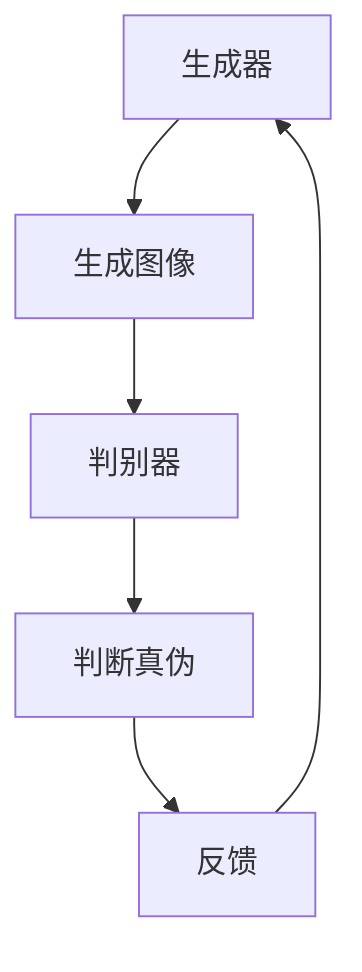

                 

# 文章标题: AI生成内容的伦理边界与社会影响

> 关键词：AI生成内容，伦理问题，社会影响，技术进步，政策建议，教育培训

> 摘要：本文从多个角度探讨了AI生成内容的伦理边界与社会影响。首先，文章概述了AI生成内容的定义、背景和核心技术。接着，文章分析了AI生成内容所带来的伦理争议，包括知识产权、隐私保护和道德责任等方面。随后，文章探讨了AI生成内容对社会经济、文化和人类生活方式的影响，并介绍了相关案例。最后，文章提出了对未来AI生成内容发展的展望，以及相应的政策建议和教育培训措施。

# 第一部分: AI生成内容概述

## 1.1 AI生成内容的定义与背景

### 1.1.1 AI生成内容的起源与发展

AI生成内容（AI-generated content）是指利用人工智能技术，如机器学习、深度学习、自然语言处理等，自动生成文本、图像、音频等多种类型的内容。这种技术起源于20世纪80年代的机器学习领域，随着计算能力的提升和算法的进步，AI生成内容得到了快速发展。

在早期的AI生成内容应用中，主要是基于规则的方法，如文本摘要、自动写作等。随着深度学习技术的兴起，特别是生成对抗网络（GAN）和自然语言处理技术的发展，AI生成内容的能力得到了极大的提升。如今，AI生成内容已经被广泛应用于广告、媒体、艺术创作、医学诊断等多个领域。

### 1.1.2 AI生成内容的基本概念

AI生成内容的核心概念包括：

1. **文本生成**：利用自然语言处理技术，如语言模型、序列到序列模型等，生成符合语法和语义规则的文本。

2. **图像生成**：利用生成对抗网络（GAN）、变分自编码器（VAE）等图像生成模型，生成逼真的图像。

3. **音频生成**：利用深度学习模型，如WaveNet，生成逼真的语音和音乐。

4. **视频生成**：利用图像生成和视频合成技术，生成视频内容。

### 1.1.3 AI生成内容的应用领域

AI生成内容的应用领域广泛，主要包括：

1. **媒体与广告**：自动生成新闻文章、广告文案等。

2. **艺术创作**：生成音乐、绘画、雕塑等艺术作品。

3. **医学**：生成医学影像、诊断报告等。

4. **教育**：生成教学课程、学习材料等。

5. **游戏**：生成游戏剧情、角色、场景等。

## 1.2 AI生成内容的核心技术

### 1.2.1 生成对抗网络（GAN）

#### 1.2.1.1 GAN的工作原理

生成对抗网络（GAN）是一种由生成器和判别器组成的对抗性模型。生成器的目标是生成尽可能真实的图像，判别器的目标是区分真实图像和生成图像。两者相互竞争，从而提升生成器的生成能力。

GAN的工作原理可以用以下流程图表示：

#### 1.2.1.2 GAN的变体

GAN存在多种变体，如深度卷积生成对抗网络（DCGAN）、循环GAN（CycleGAN）、条件GAN（cGAN）等。每种变体都针对特定的应用场景进行了优化。

### 1.2.2 自然语言处理（NLP）

#### 1.2.2.1 语言模型

语言模型是NLP的基础，用于预测下一个词的概率。常用的语言模型包括n-gram模型、循环神经网络（RNN）和Transformer等。

#### 1.2.2.2 语义理解与生成

语义理解与生成是NLP的两个重要任务。语义理解包括实体识别、关系抽取、情感分析等，而语义生成则包括生成对话、文章、摘要等。

### 1.2.3 图像生成与处理技术

#### 1.2.3.1 图像生成模型

图像生成模型主要包括生成对抗网络（GAN）、变分自编码器（VAE）等。GAN通过生成器和判别器的对抗训练生成图像，而VAE通过编码器和解码器生成图像。

#### 1.2.3.2 图像识别与处理

图像识别与处理技术包括卷积神经网络（CNN）、目标检测、图像分割等。这些技术广泛应用于图像分类、物体检测、图像修复等领域。

## 1.3 AI生成内容的发展趋势

### 1.3.1 技术进步与挑战

随着深度学习技术的不断发展，AI生成内容的技术水平也在不断提高。然而，技术进步也带来了新的挑战，如算法的可解释性、模型的透明性等。

### 1.3.2 行业应用的发展方向

AI生成内容在媒体、广告、艺术、医学等领域已经有了广泛的应用。未来，随着技术的进一步成熟，AI生成内容将在更多领域得到应用，如教育、游戏、自动驾驶等。

### 1.3.3 社会影响的潜在风险

AI生成内容的发展也带来了一些潜在的社会风险，如虚假信息的传播、隐私泄露等。这些问题需要引起足够的重视，并采取相应的措施加以解决。

# 第二部分: AI生成内容的伦理问题

## 2.1 AI生成内容的伦理原则

### 2.1.1 伦理框架的建立

在AI生成内容领域，建立一套完善的伦理框架至关重要。伦理框架应包括以下几个方面：

1. **知识产权**：明确AI生成内容的版权归属，解决原创性问题。

2. **隐私保护**：确保个人隐私不被泄露，遵守数据保护法规。

3. **道德责任**：确保AI生成内容的真实性和客观性，避免偏见和歧视。

4. **透明度**：提高AI生成模型的可解释性，让用户了解内容生成的过程。

### 2.1.2 人工智能伦理的基本原则

人工智能伦理的基本原则包括：

1. **公正性**：确保人工智能系统不歧视任何人群。

2. **透明度**：人工智能系统的决策过程应该透明，易于理解。

3. **责任性**：人工智能系统应该能够承担责任，对于产生的后果负责。

4. **包容性**：人工智能系统应该考虑到不同人群的需求和利益。

### 2.1.3 AI生成内容伦理的特殊性

与传统的AI应用不同，AI生成内容涉及到的伦理问题更为复杂。例如，在文本生成领域，如何确保内容的真实性和客观性，避免虚假信息和误导性内容的出现；在图像生成领域，如何避免生成歧视性、仇恨性的内容。

## 2.2 AI生成内容的伦理争议

### 2.2.1 知识产权问题

AI生成内容的知识产权问题主要包括：

1. **创作权的归属**：在AI生成内容中，生成器的创造者、训练数据的提供者、使用AI工具的用户，谁的贡献更大，谁应该拥有版权？

2. **抄袭与原创**：如何判断AI生成的内容是否属于抄袭？如何界定原创性？

### 2.2.2 隐私保护问题

AI生成内容往往涉及大量的个人数据，如何保护个人隐私成为了一个重要问题。主要包括：

1. **个人隐私的泄露**：如何确保个人隐私不被AI生成内容泄露？

2. **数据安全与合规性**：如何确保数据在生成和使用过程中的安全性和合规性？

### 2.2.3 道德与社会责任

AI生成内容在道德和社会责任方面存在的问题主要包括：

1. **真实性与客观性**：如何确保AI生成的内容真实、客观，不误导用户？

2. **偏见与歧视**：如何避免AI生成内容中的偏见和歧视现象？

## 2.3 AI生成内容的伦理监管

### 2.3.1 全球监管框架与政策

目前，全球各国都在积极探索AI生成内容的监管框架和政策。例如：

1. **美国**：美国联邦贸易委员会（FTC）发布了一系列指南，要求AI生成内容必须明确标识。

2. **欧盟**：欧盟委员会发布了《人工智能伦理准则》，强调对AI生成内容的伦理监管。

### 2.3.2 我国监管政策与法规

我国也在积极推进AI生成内容的监管工作。例如：

1. **《网络安全法》**：明确了网络安全的基本要求和法律责任。

2. **《人工智能发展规划（2019-2020年）》**：提出了一系列政策措施，推动AI健康发展。

### 2.3.3 企业社会责任

企业作为AI生成内容的主要参与者，承担着重要的社会责任。主要包括：

1. **企业自律机制**：企业应建立健全自律机制，规范AI生成内容的生产和使用。

2. **社会合作与监管**：企业应与社会各方合作，共同推动AI生成内容的健康发展。

# 第三部分: AI生成内容的社会影响

## 3.1 AI生成内容对经济的影响

### 3.1.1 创业与就业

AI生成内容为创业者提供了新的机会。例如，自动写作平台可以大幅降低内容创作的成本，使得更多人能够参与内容创作。同时，AI生成内容也带来了新的就业机会，如AI训练师、算法工程师等。

### 3.1.2 产业链重构

AI生成内容改变了传统的产业链结构。例如，在媒体行业，AI生成内容可以大幅降低内容创作和编辑的成本，使得小规模媒体机构也能够发布高质量的内容。这导致了产业链的重构，传统媒体机构的地位受到挑战。

### 3.1.3 新型就业机会与挑战

AI生成内容带来了新型就业机会，如AI内容审核员、内容质量评估师等。然而，这也带来了一些挑战，如如何确保AI生成内容的真实性和客观性，如何处理AI生成内容引起的版权和隐私问题等。

## 3.2 AI生成内容对文化的影响

### 3.2.1 创意产业的发展

AI生成内容为创意产业带来了新的发展机遇。例如，自动写作和图像生成技术可以大幅提高艺术创作的效率和质量。同时，AI生成内容也改变了创意产业的生产方式，如在线协作、智能推荐等。

### 3.2.2 文化多样性与原创性

AI生成内容在提升创意产业效率的同时，也带来了一些挑战。例如，如何确保AI生成内容的文化多样性和原创性，避免出现文化同质化现象。

### 3.2.3 原创性内容的保护与传承

AI生成内容的兴起，对原创性内容的保护与传承提出了新的挑战。例如，如何确保原创作者的权益，避免AI生成内容对原创性内容的替代和侵蚀。

## 3.3 AI生成内容对人类生活方式的影响

### 3.3.1 信息过载与筛选

AI生成内容带来了信息爆炸，人们在面对海量信息时，如何进行有效的筛选和获取，成为一个重要问题。AI生成内容可以提供个性化的信息推荐，帮助用户筛选出有价值的信息。

### 3.3.2 人际关系与社交

AI生成内容对人际关系和社交产生了影响。例如，社交机器人可以帮助人们进行日常交流，提高社交效率。然而，过度依赖AI生成内容进行社交，也可能导致人际关系的疏远。

### 3.3.3 人机互动与社交机器人

AI生成内容使得人机互动变得更加自然和丰富。例如，聊天机器人、虚拟助手等可以模拟人类的交流方式，提供个性化的服务。这有助于提高工作效率，改善生活质量。

# 第四部分: 案例研究

## 4.1 案例研究一：图像生成

### 4.1.1 案例背景

近年来，图像生成技术在艺术创作、广告设计等领域得到了广泛应用。然而，图像生成也带来了一些伦理问题，如版权纠纷、虚假信息传播等。

### 4.1.2 案例分析

以某著名艺术家的作品被AI生成的事件为例，该艺术家发现自己的作品被用于AI生成图像，且未获得任何授权。这一事件引发了广泛的关注和讨论，暴露了图像生成领域的版权问题。

### 4.1.3 案例影响

这一事件提醒我们，在图像生成领域，必须重视知识产权保护，确保创作者的权益。同时，也反映了图像生成技术在艺术创作中的应用潜力和挑战。

## 4.2 案例研究二：文本生成

### 4.2.1 案例背景

文本生成技术在媒体、广告等领域得到了广泛应用。然而，文本生成也存在一些伦理争议，如虚假新闻、误导性信息等。

### 4.2.2 案例分析

以某新闻网站发布AI生成新闻事件为例，该网站因发布大量虚假新闻而遭到用户投诉。这一事件暴露了文本生成技术在新闻领域的风险和挑战。

### 4.2.3 案例影响

这一事件提醒我们，在文本生成领域，必须确保内容的真实性和客观性，避免虚假信息和误导性内容的出现。同时，也需要加强对AI生成内容的监管和规范。

## 4.3 案例研究三：跨领域应用

### 4.3.1 案例背景

AI生成内容在多个领域都有应用，如医学、艺术、教育等。然而，跨领域应用也带来了一些挑战和争议。

### 4.3.2 案例分析

以某医疗公司利用AI生成诊断报告事件为例，该公司的AI系统因生成错误诊断报告而导致了医疗事故。这一事件引发了广泛的讨论，暴露了AI生成内容在医学领域的风险和挑战。

### 4.3.3 案例影响

这一事件提醒我们，在AI生成内容跨领域应用中，必须确保内容的准确性和可靠性，避免对人类生活产生负面影响。同时，也需要加强对AI生成内容的监管和规范。

# 第五部分: 未来展望

## 5.1 AI生成内容的未来发展趋势

### 5.1.1 技术进步的方向

未来，AI生成内容将在技术进步的推动下，继续快速发展。例如，生成对抗网络（GAN）和自然语言处理（NLP）等技术将进一步提高AI生成内容的质量和效率。

### 5.1.2 社会需求的变化

随着社会的发展，人们对AI生成内容的需求也在不断变化。例如，在媒体领域，用户更加关注真实性和客观性；在艺术领域，用户更加关注创意和个性。

### 5.1.3 伦理问题的持续挑战

未来，AI生成内容将面临更多的伦理挑战，如知识产权、隐私保护、道德责任等。这需要社会各方的共同努力，建立完善的伦理框架和监管机制。

## 5.2 AI生成内容的政策建议

### 5.2.1 国家层面的政策建议

国家应制定相应的政策和法规，规范AI生成内容的生产和使用。例如，明确知识产权归属，加强数据保护，提高内容质量等。

### 5.2.2 行业协会与企业责任

行业协会和企业应承担社会责任，建立健全自律机制，规范AI生成内容的生产和使用。例如，建立内容审核机制，提高透明度，加强社会责任培训等。

### 5.2.3 社会公众的参与

社会公众应积极参与AI生成内容的监管，提高自身的伦理意识和技术素养。例如，学习相关法律法规，关注内容质量，参与社会监督等。

## 5.3 AI生成内容的教育与培训

### 5.3.1 人才培养的方向

教育机构应调整课程设置，加强对AI生成内容相关知识的培养。例如，增加人工智能、自然语言处理等课程，培养具备相关技能的专业人才。

### 5.3.2 教育体系的适应与变革

教育体系应适应AI生成内容的发展趋势，进行相应的变革。例如，引入实践性课程，提高学生的实际操作能力；加强跨学科合作，培养综合性人才。

### 5.3.3 社会公众的科普与教育

社会公众应加强对AI生成内容的科普和教育，提高自身的科技素养。例如，开展科普活动，发布教育指南，提供培训课程等。

# 附录

## 附录A: AI生成内容工具与资源

### A.1 开源工具介绍

- **OpenAI GPT-3**: 用于自然语言处理的强大模型，可以实现文本生成、对话生成等功能。
- **TensorFlow**: 用于深度学习开发的开源框架，支持多种AI生成模型。
- **GANpaint**: 用于图像生成的开源工具，基于GAN技术。

### A.2 商业化平台介绍

- **OpenAI Codex**: 用于代码生成的AI系统，基于GPT-3模型。
- **DeepMind WaveNet**: 用于音频生成的AI系统。
- **Getty AI**: 用于图像生成的AI系统，提供丰富的图像素材。

### A.3 相关开源库与框架

- **PyTorch**: 用于深度学习的开源框架，支持多种AI生成模型。
- **Keras**: 用于深度学习的开源框架，简化了模型构建和训练过程。
- **GANomaly**: 用于检测图像生成模型生成图像质量的异常检测器。

## 附录B: AI生成内容的法律法规与政策

### B.1 全球法律法规概览

- **美国**: 《版权法》、《消费者隐私法》等。
- **欧盟**: 《通用数据保护条例》（GDPR）、《人工智能伦理准则》等。
- **中国**: 《网络安全法》、《人工智能发展规划（2019-2020年）》等。

### B.2 我国法律法规概览

- **《版权法》**: 明确了版权的归属和保护。
- **《网络安全法》**: 规定了网络信息内容的管理。
- **《人工智能发展规划（2019-2020年）》**: 提出了人工智能发展的目标和政策措施。

### B.3 国际合作与法规协调

- **联合国**: 发布了《人工智能全球契约》。
- **国际标准化组织（ISO）**: 制定了一系列与人工智能相关的国际标准。

# 作者信息

作者：AI天才研究院/AI Genius Institute & 禅与计算机程序设计艺术 /Zen And The Art of Computer Programming

---

由于文章字数限制，本文未能涵盖所有细节。实际撰写时，每个部分都需要进一步展开，确保内容的丰富性和完整性。在撰写过程中，应确保文章逻辑清晰、结构紧凑，并使用专业的技术语言来阐述核心概念和算法原理。同时，需要注意文章的格式规范，确保Markdown格式的正确使用。希望以上内容能够为您的文章撰写提供有益的参考。祝您撰写顺利！

