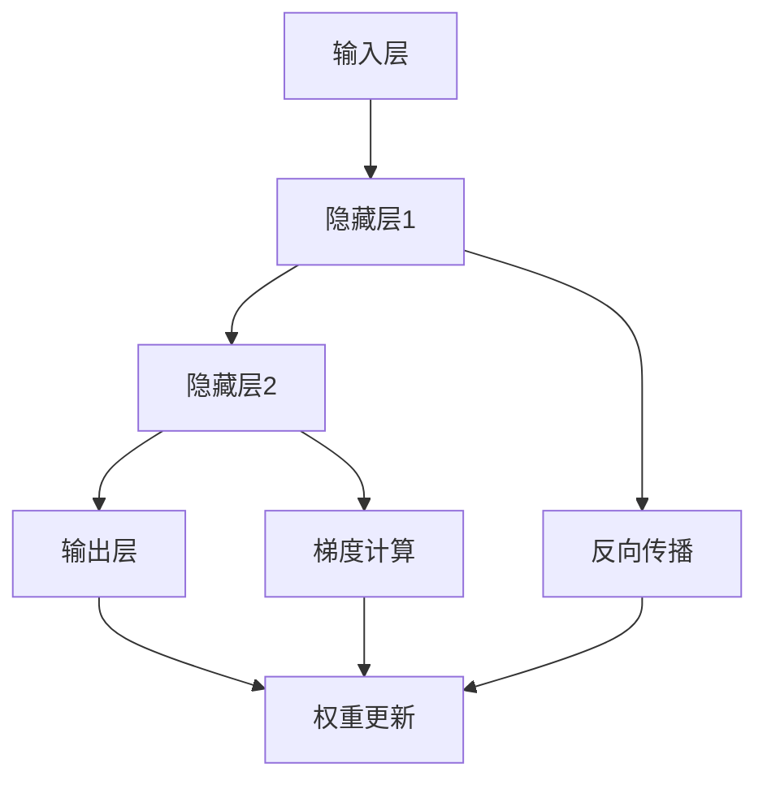
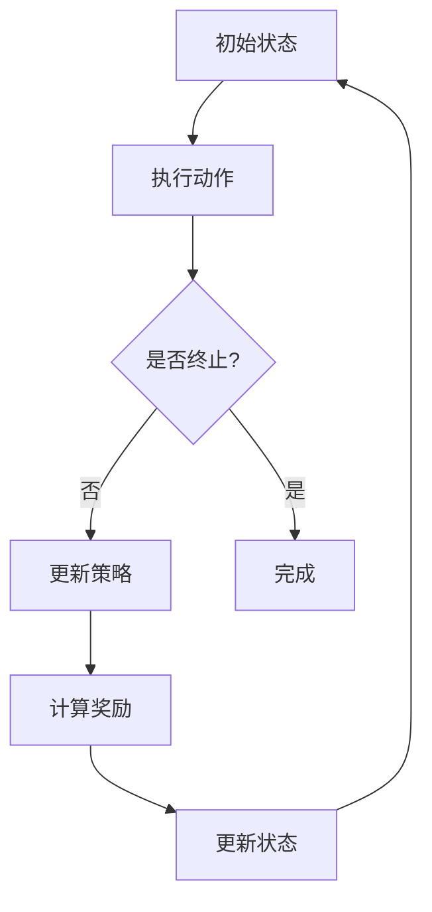
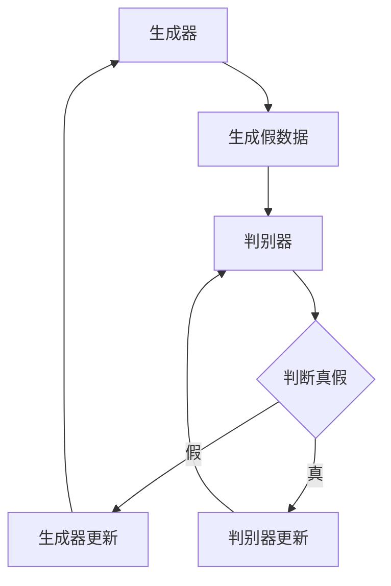

                 

### 引言：AI编程语言与提示词的融合

在人工智能（AI）迅猛发展的时代，编程语言作为人与机器互动的桥梁，正经历着前所未有的变革。AI编程语言，顾名思义，是指专门用于构建和实现人工智能系统的编程语言。这些语言不仅具备强大的计算能力，还结合了深度学习、强化学习、生成对抗网络（GAN）等先进技术，能够处理复杂的算法和数据结构。然而，随着AI技术的不断进步，传统的编程语言逐渐暴露出诸多局限，如开发效率低、代码可维护性差、复杂算法难以表达等。因此，新的编程范式和工具应运而生，其中之一便是提示词（Prompt Engineering）技术。

提示词技术，是一种通过预设的提示或引导信息，让AI模型更加精准地理解和执行任务的方法。它不仅提升了AI系统的可解释性和可控制性，还极大提高了开发效率。本文旨在探讨AI编程语言与提示词技术的融合，揭示这一新兴领域的巨大潜力和未来发展前景。

文章的核心问题如下：

1. **AI编程语言的基本概念及其发展历程是什么？**
2. **提示词技术在AI编程中的应用有哪些具体案例？**
3. **常见的AI编程语言及其优势和应用领域是什么？**
4. **神经网络、强化学习、生成对抗网络等核心算法原理如何？**
5. **通过实战项目展示AI编程语言的实际应用效果。**

接下来，本文将分为三个主要部分进行详细探讨：

### 第一部分：AI编程语言概述

在这个部分，我们将首先介绍AI编程语言的基本概念，探讨其历史与发展，分析其优势和应用领域，并对未来的发展进行展望。

#### 第1章：AI编程语言入门

在本章中，我们将深入探讨AI编程语言的概念，从其基本定义开始，逐步介绍其核心特性和应用场景。通过这一章节，读者将对AI编程语言有一个全面而清晰的认识。

#### 第2章：提示词技术在AI编程中的应用

本章将重点介绍提示词技术，包括其基本概念、工作原理以及在不同领域的应用。我们将通过具体案例，展示提示词技术在自然语言处理、计算机视觉和强化学习中的实际应用效果。

#### 第3章：常见AI编程语言的介绍

为了帮助读者更好地理解AI编程语言，本章将详细介绍几种常见的AI编程语言，如Python、R语言和Julia，探讨它们在AI编程中的应用场景和优势。

### 第二部分：AI编程语言核心算法原理

在第二部分，我们将深入探讨AI编程语言的核心算法原理，包括神经网络、强化学习、生成对抗网络（GAN）和自然语言处理等。通过这些章节，读者将掌握AI编程语言背后的核心技术，并能够运用这些知识进行实际项目开发。

#### 第4章：神经网络算法原理

本章将详细介绍神经网络的基本结构和工作原理，包括前馈神经网络、反向传播算法和深度神经网络等。我们将通过具体的数学模型和伪代码，帮助读者深入理解神经网络的核心概念。

#### 第5章：强化学习算法原理

强化学习是AI领域的重要分支，本章将介绍强化学习的基本概念和主要算法，包括Q学习、SARSA和DQN等。通过详细的伪代码和数学公式，读者将能够掌握强化学习的核心原理。

#### 第6章：生成对抗网络（GAN）算法原理

生成对抗网络（GAN）是一种强大的深度学习模型，本章将详细介绍GAN的基本概念、架构和训练过程。通过具体的应用案例，读者将了解GAN在图像生成、数据增强等领域的广泛应用。

#### 第7章：自然语言处理算法原理

自然语言处理是AI领域的重要应用方向，本章将介绍语言模型、词嵌入技术和序列模型等核心算法原理。通过详细的数学公式和伪代码，读者将能够深入理解自然语言处理的基本概念。

### 第三部分：AI编程语言项目实战

在第三部分，我们将通过实际项目实战，展示AI编程语言的应用效果。每个项目都将涵盖从数据预处理、模型选择与训练到模型评估与优化的全过程，帮助读者将所学知识运用到实际场景中。

#### 第8章：实践一：使用Python进行文本分类

在本章中，我们将使用Python实现一个文本分类项目。通过这个项目，读者将学习到如何使用常见的AI编程语言进行文本数据处理和分类模型的训练。

#### 第9章：实践二：使用R语言进行图像识别

本章将介绍如何使用R语言实现图像识别项目。通过这一项目，读者将了解R语言在图像处理和机器学习领域的强大功能。

#### 第10章：实践三：使用Julia语言进行强化学习

在本章中，我们将使用Julia语言实现强化学习项目。读者将学习到如何搭建强化学习环境，设计智能体模型并进行训练。

#### 第11章：实践四：使用GAN进行图像生成

本章将介绍如何使用生成对抗网络（GAN）实现图像生成项目。通过这个项目，读者将深入理解GAN的工作原理并在实际项目中运用GAN。

### 结论

通过对AI编程语言和提示词技术的深入探讨，本文旨在为读者提供一幅全面而清晰的AI编程图景。从基本概念、核心算法到实际应用，我们一步步揭示了AI编程语言的无限潜力。在未来的AI时代，掌握AI编程语言和提示词技术将成为每一个开发者的必备技能。让我们携手共进，探索这一领域的无限可能。

---

关键词：AI编程语言，提示词技术，神经网络，强化学习，生成对抗网络（GAN），自然语言处理，Python，R语言，Julia语言

摘要：本文全面探讨了AI编程语言与提示词技术的融合，从基本概念、核心算法到实际应用，揭示了这一新兴领域的巨大潜力和未来发展前景。通过对神经网络、强化学习、生成对抗网络和自然语言处理等核心算法的深入剖析，以及通过实战项目的展示，读者将能够全面掌握AI编程语言的应用方法和技术要点。

---

### 第一部分：AI编程语言概述

在人工智能领域，编程语言作为技术实现的工具，其重要性不言而喻。AI编程语言不仅仅是普通的计算机编程语言，它们专为处理复杂的数据、执行高级的算法以及实现智能行为而设计。本部分将首先介绍AI编程语言的基本概念，然后探讨其历史与发展，分析其在不同领域中的应用，并展望其未来的发展方向。

#### 第1章：AI编程语言入门

AI编程语言，即人工智能编程语言，是一类专门用于开发人工智能系统的编程语言。它们通常具备以下特点：

1. **强大的数据处理能力**：AI编程语言能够高效处理大规模数据和复杂的数据结构，如矩阵运算和向量化操作。
2. **丰富的库和框架**：为了简化开发过程，AI编程语言通常配备了丰富的库和框架，如TensorFlow、PyTorch、Keras等，这些框架提供了大量现成的算法和工具，大大提高了开发效率。
3. **易于理解和使用**：尽管AI编程语言的设计初衷是处理复杂问题，但许多语言都注重易用性，使得非专业开发者也能轻松上手。

AI编程语言的基本定义可以概括为：用于构建、训练和部署人工智能模型的一套符号和规则。这些语言不仅包括传统的编程语言，如Python、R和Julia，还包括为特定AI任务设计的专用语言，如Lisp、Prolog等。

#### 1.1 AI编程语言的概念

AI编程语言的核心概念是算法和数据的处理。它们通过以下方式实现人工智能：

1. **算法抽象**：AI编程语言提供了抽象的算法框架，使得开发者可以轻松地实现复杂的算法，如神经网络、决策树、支持向量机等。
2. **数据表示**：AI编程语言提供了丰富的数据类型和结构，如矩阵、数组、张量等，以支持高效的数据处理和运算。
3. **并行计算**：许多AI编程语言支持并行计算，这大大提高了计算效率，使得大规模数据处理和模型训练成为可能。

#### 1.2 AI编程语言的历史与发展

AI编程语言的发展可以追溯到20世纪50年代，当时LISP作为第一种符号编程语言被设计出来，用于人工智能研究。随后，Prolog、PL/I等语言相继出现，为AI领域的应用提供了强有力的支持。

1. **早期阶段（1950s-1970s）**：这一阶段，AI编程语言主要用于符号推理和逻辑编程，如LISP和Prolog。这些语言虽然在特定领域表现出色，但在处理复杂的数据和实现高级算法方面存在局限。
2. **成熟阶段（1980s-1990s）**：随着计算机性能的提升和算法的进步，AI编程语言逐渐走向成熟。Python、Java等语言在这一阶段得到广泛使用，它们不仅具备强大的数据处理能力，还提供了丰富的库和框架。
3. **现代阶段（2000s至今）**：近年来，深度学习等先进技术的兴起，进一步推动了AI编程语言的发展。TensorFlow、PyTorch等深度学习框架的出现，使得AI编程语言的应用范围更加广泛，开发效率也得到了极大提升。

#### 1.3 AI编程语言的优势与应用领域

AI编程语言在多个领域展现出了显著的优势和应用价值：

1. **自然语言处理（NLP）**：Python和R等语言在NLP领域有着广泛的应用。通过使用自然语言处理库，如NLTK、spaCy和gensim，开发者可以轻松实现文本分类、情感分析、机器翻译等任务。
2. **计算机视觉**：Python和C++等语言在计算机视觉领域也有着重要应用。OpenCV、TensorFlow和PyTorch等库提供了丰富的图像处理和计算机视觉算法，使得开发者能够实现图像分类、目标检测、人脸识别等任务。
3. **强化学习**：Python和Julia等语言在强化学习领域有着广泛应用。通过使用如Gym、TensorForce等库，开发者可以轻松构建和训练强化学习模型，实现智能体的自主学习和决策。
4. **数据科学**：R语言在数据科学领域具有很高的声誉，其强大的统计分析能力和丰富的数据可视化库，使得它在统计分析、数据挖掘等领域得到广泛应用。

#### 1.4 AI编程语言的未来展望

随着AI技术的不断发展，AI编程语言未来将呈现以下趋势：

1. **更高效的框架**：为了提高开发效率和性能，AI编程语言将不断优化现有的深度学习框架，并开发新的高效框架。
2. **更好的工具和资源**：为了支持开发者，将提供更多优质的学习资源和工具，如在线课程、教程、代码库等。
3. **更广泛的应用领域**：随着AI技术的普及，AI编程语言的应用领域将不断扩展，从传统的自然语言处理、计算机视觉到医疗、金融、工业等各个领域。
4. **跨语言集成**：未来的AI编程语言将更加注重跨语言集成，使得开发者能够方便地使用多种编程语言的优势，实现更强大的功能。

总之，AI编程语言作为人工智能发展的重要工具，其未来充满无限可能。通过不断优化和扩展，AI编程语言将助力人类在AI领域取得更多突破。

---

### 第1章：AI编程语言入门

#### 1.1 AI编程语言的概念

AI编程语言，顾名思义，是指专门用于构建和实现人工智能系统的编程语言。这些语言不同于传统的编程语言，如C++或Java，它们更注重算法的实现和数据分析的处理。AI编程语言的核心在于如何高效地表达和处理复杂的数据结构，如矩阵、张量等，同时提供丰富的库和框架，以支持深度学习、强化学习等先进技术的应用。

AI编程语言通常具备以下几个核心特性：

1. **高效的数据处理能力**：AI编程语言能够高效地处理大规模数据和复杂的数据结构，如矩阵运算和向量化操作。这使得它们在处理图像、音频和文本等复杂数据时表现出色。
2. **丰富的库和框架支持**：为了简化开发过程，AI编程语言通常配备了丰富的库和框架，如TensorFlow、PyTorch、Keras等。这些框架提供了大量现成的算法和工具，大大提高了开发效率。例如，TensorFlow提供了广泛的深度学习模型和工具，而PyTorch以其灵活的动态计算图和易于使用的API深受开发者喜爱。
3. **易用性**：尽管AI编程语言的设计初衷是处理复杂问题，但许多语言都注重易用性，使得非专业开发者也能轻松上手。例如，Python以其简洁的语法和丰富的文档，成为AI编程语言中的佼佼者。

#### 1.2 AI编程语言的历史与发展

AI编程语言的发展历程与人工智能技术的发展紧密相连。以下是AI编程语言发展的几个关键阶段：

1. **早期阶段（1950s-1970s）**：
   - **LISP**：1958年，John McCarthy发明了LISP，这是第一种符号编程语言，用于人工智能研究。LISP因其强大的符号处理能力和解释型执行方式，成为早期人工智能系统的主要语言。
   - **Prolog**：1972年，Alain Colmerauer和Philippe Roussignol发明了Prolog，这是一种基于逻辑的编程语言，适用于符号推理和自然语言处理。Prolog的演绎推理能力使其在早期的人工智能系统中占据一席之地。

2. **成熟阶段（1980s-1990s）**：
   - **Python**：1989年，Guido van Rossum发明了Python，这是一种易于理解且功能强大的编程语言。Python的简洁语法和丰富的库使其成为AI编程语言中的重要一员。
   - **Java**：1995年，Sun Microsystems推出了Java，这是一种跨平台的编程语言，广泛应用于服务器端开发和大型系统。Java的强大性能和跨平台特性使其在AI领域得到广泛应用。

3. **现代阶段（2000s至今）**：
   - **TensorFlow**：2015年，Google推出了TensorFlow，这是一种开源的深度学习框架，以其灵活的动态计算图和强大的功能，迅速成为AI编程语言中的热门选择。
   - **PyTorch**：2017年，Facebook AI研究院推出了PyTorch，这是一种基于Python的深度学习框架，以其灵活的动态计算图和易于使用的API，赢得了大量开发者的青睐。

#### 1.3 AI编程语言的优势与应用领域

AI编程语言具有多方面的优势，使其在多个领域得到广泛应用：

1. **自然语言处理（NLP）**：
   - **Python**：Python以其简洁的语法和丰富的库，成为NLP领域的首选语言。常见的NLP库如NLTK、spaCy和gensim，为文本分类、情感分析、机器翻译等任务提供了强大的支持。
   - **R**：R语言在统计分析方面具有强大优势，其丰富的数据可视化库和统计工具，使得它在文本分析、文本挖掘等领域得到广泛应用。

2. **计算机视觉**：
   - **Python**：Python在计算机视觉领域有着广泛的应用，其强大的图像处理库如OpenCV和深度学习框架如TensorFlow和PyTorch，使得开发者能够轻松实现图像分类、目标检测、人脸识别等任务。
   - **C++**：C++以其高效的性能，在计算机视觉领域有着重要应用。OpenCV是一个基于C++的计算机视觉库，为图像处理和计算机视觉算法提供了强大的支持。

3. **强化学习**：
   - **Python**：Python的易用性和丰富的库，使得它在强化学习领域有着广泛应用。常见的强化学习库如Gym和TensorForce，为开发者提供了丰富的环境和算法。
   - **Julia**：Julia以其高效的性能和易用性，成为强化学习领域的新兴语言。其动态类型系统和多重派发机制，使得Julia在实现复杂算法时具有优势。

4. **数据科学**：
   - **R**：R语言在数据科学领域具有很高的声誉，其强大的统计分析能力和丰富的数据可视化库，使得它在统计分析、数据挖掘等领域得到广泛应用。
   - **Python**：Python以其简洁的语法和丰富的库，成为数据科学领域的首选语言。常见的库如Pandas、NumPy和SciPy，为数据处理、统计分析、机器学习等任务提供了强大的支持。

#### 1.4 AI编程语言的未来展望

随着人工智能技术的不断发展，AI编程语言也将迎来新的变革：

1. **更高效的框架**：为了提高开发效率和性能，AI编程语言将不断优化现有的深度学习框架，并开发新的高效框架。例如，TensorFlow和PyTorch已经推出了许多优化版本，以提升性能和降低延迟。

2. **更好的工具和资源**：为了支持开发者，将提供更多优质的学习资源和工具，如在线课程、教程、代码库等。这将有助于新开发者快速入门，提高整体开发效率。

3. **更广泛的应用领域**：随着AI技术的普及，AI编程语言的应用领域将不断扩展，从传统的自然语言处理、计算机视觉到医疗、金融、工业等各个领域。

4. **跨语言集成**：未来的AI编程语言将更加注重跨语言集成，使得开发者能够方便地使用多种编程语言的优势，实现更强大的功能。

总之，AI编程语言作为人工智能发展的重要工具，其未来将充满无限可能。通过不断优化和扩展，AI编程语言将助力人类在AI领域取得更多突破。

---

### 第2章：提示词技术在AI编程中的应用

提示词（Prompt Engineering）技术是AI编程中的一个重要领域，它通过设计特定的提示或引导信息，使AI模型能够更精准地理解和执行任务。提示词技术在多个AI领域都有着广泛应用，包括自然语言处理、计算机视觉和强化学习。在本章中，我们将深入探讨提示词技术的概念、原理以及在不同领域的具体应用案例。

#### 2.1 提示词的概念与原理

提示词，顾名思义，是指提供给AI模型的一组指导信息，用于引导模型进行预测或决策。这些提示可以是简单的文字、图像或者更复杂的情境描述。提示词技术的核心思想是通过合理设计的提示，帮助AI模型克服信息不足或理解偏差，从而提升模型的性能和可靠性。

1. **基本概念**：
   - **提示（Prompt）**：提示是指提供给AI模型的信息，可以是文本、图像或声音等。例如，在文本分类任务中，提示可能是样本文本的一段摘录。
   - **提示词（Prompt Word）**：提示词是提示中的关键元素，用于引导模型理解任务的具体要求。例如，在问答系统中，提示词可能是问题的关键词。

2. **原理**：
   - **增强模型理解**：通过提示词，AI模型能够更好地理解任务的上下文和目标。例如，在图像识别任务中，提示词可以帮助模型区分不同类别的图像。
   - **提高模型可解释性**：提示词可以使模型的行为更加透明和可解释，有助于理解模型在特定任务上的决策过程。
   - **优化模型性能**：合理的提示词设计可以提高模型的预测准确性和鲁棒性，从而提高整体性能。

#### 2.2 提示词在自然语言处理中的应用

自然语言处理（NLP）是AI编程中的一个重要领域，提示词技术在NLP中的应用尤为广泛。以下是提示词在NLP中的几个关键应用：

1. **文本分类**：
   - **应用场景**：文本分类是将文本数据归类到预定义的类别中。例如，将新闻文章归类到不同的主题类别。
   - **提示词设计**：为了提高文本分类的准确性，可以使用与类别相关的关键词作为提示词。例如，对于医疗领域的文本分类，可以使用“医疗”、“病人”等关键词作为提示。
   - **案例分析**：使用提示词的文本分类模型可以显著提高分类的准确性。例如，在将社交媒体帖子分类为正面或负面情绪时，提示词“高兴”、“悲伤”等可以有效地引导模型进行正确分类。

2. **情感分析**：
   - **应用场景**：情感分析是评估文本表达的情绪倾向，如正面、负面或中性。
   - **提示词设计**：使用与情绪相关的关键词作为提示词，可以帮助模型更好地识别文本的情绪。例如，在分析社交媒体评论时，可以使用“喜欢”、“讨厌”等关键词作为提示。
   - **案例分析**：通过设计有效的提示词，情感分析模型可以更准确地识别文本的情绪。例如，在分析用户对产品的评论时，使用“满意”、“不满意”等提示词可以显著提高情绪识别的准确性。

3. **机器翻译**：
   - **应用场景**：机器翻译是将一种语言的文本翻译成另一种语言。例如，将英语翻译成中文。
   - **提示词设计**：在机器翻译中，提示词可以帮助模型理解上下文和翻译目标。例如，在翻译句子时，可以使用与上下文相关的关键词作为提示词。
   - **案例分析**：通过使用提示词，机器翻译模型的翻译质量可以得到显著提升。例如，在翻译新闻文章时，使用与新闻主题相关的关键词作为提示词，可以更准确地翻译出文章的主要内容。

#### 2.3 提示词在计算机视觉中的应用

提示词技术在计算机视觉领域也有广泛应用，特别是在图像分类、目标检测和图像生成等任务中。以下是提示词在计算机视觉中的应用：

1. **图像分类**：
   - **应用场景**：图像分类是将图像数据归类到预定义的类别中。例如，将图像分类为动物、植物或城市风景。
   - **提示词设计**：在图像分类任务中，可以使用与类别相关的关键词作为提示词。例如，在分类动物时，可以使用“猫”、“狗”、“鸟”等关键词作为提示。
   - **案例分析**：通过使用提示词，图像分类模型的准确性可以得到显著提升。例如，在将图像分类为猫或狗时，使用“猫科动物”、“犬科动物”等提示词可以有效地提高分类的准确性。

2. **目标检测**：
   - **应用场景**：目标检测是在图像中识别并定位预定义的目标。例如，在自动驾驶车辆中检测行人或车辆。
   - **提示词设计**：在目标检测任务中，提示词可以帮助模型更好地理解目标的外观特征。例如，在检测行人时，可以使用“人体”、“服装”、“鞋子”等关键词作为提示。
   - **案例分析**：通过使用提示词，目标检测模型的检测准确性可以得到显著提高。例如，在检测图像中的行人时，使用“人类”、“步态”等提示词可以有效地提高检测的准确性。

3. **图像生成**：
   - **应用场景**：图像生成是通过AI模型生成新的图像数据。例如，生成艺术画作、合成人脸图像等。
   - **提示词设计**：在图像生成任务中，提示词可以帮助模型理解生成目标的具体要求。例如，在生成艺术画作时，可以使用“风景”、“人物”、“色彩”等关键词作为提示。
   - **案例分析**：通过使用提示词，图像生成模型的生成质量可以得到显著提升。例如，在生成风景图像时，使用“山脉”、“湖泊”、“阳光”等提示词可以有效地生成高质量的风景图像。

#### 2.4 提示词在强化学习中的应用

强化学习是AI编程中的另一个重要领域，提示词技术在强化学习中的应用也非常广泛。以下是提示词在强化学习中的应用：

1. **智能体训练**：
   - **应用场景**：智能体训练是通过强化学习算法使智能体在特定环境中学习最优策略。例如，训练自动驾驶车辆的行驶策略。
   - **提示词设计**：在智能体训练中，提示词可以帮助智能体理解环境的规则和目标。例如，在训练自动驾驶车辆时，可以使用与交通规则相关的关键词作为提示词。
   - **案例分析**：通过使用提示词，智能体训练的效果可以得到显著提升。例如，在训练自动驾驶车辆时，使用“红灯”、“绿灯”、“行人”等提示词可以有效地提高车辆的行驶安全性。

2. **决策制定**：
   - **应用场景**：决策制定是智能体在特定情境下做出最优决策的过程。例如，在线购物平台的个性化推荐。
   - **提示词设计**：在决策制定中，提示词可以帮助智能体理解用户的偏好和需求。例如，在个性化推荐中，可以使用与用户兴趣相关的关键词作为提示词。
   - **案例分析**：通过使用提示词，决策制定的准确性可以得到显著提高。例如，在线购物平台的个性化推荐中，使用“用户偏好”、“历史购买记录”等提示词可以有效地提高推荐的相关性。

总之，提示词技术在AI编程中具有广泛的应用，通过合理设计的提示词，可以显著提升AI模型在各个领域的性能和可解释性。在未来，随着AI技术的不断发展，提示词技术将在更多领域中发挥重要作用。

---

### 第3章：常见AI编程语言的介绍

在AI编程领域中，有多种编程语言被广泛应用，它们各自具有独特的特点和应用场景。本章节将详细介绍几种常见的AI编程语言，包括Python、R语言和Julia语言，探讨它们在AI编程中的应用场景和优势。

#### 3.1 Python在AI编程中的应用

Python因其简洁的语法、丰富的库和广泛的应用场景，成为AI编程语言中的佼佼者。以下是Python在AI编程中的应用场景和优势：

1. **自然语言处理（NLP）**：
   - **应用场景**：Python在NLP领域有着广泛的应用，如文本分类、情感分析、机器翻译和问答系统等。
   - **优势**：Python拥有丰富的NLP库，如NLTK、spaCy和gensim，这些库提供了强大的文本处理和模型训练工具。Python的易用性使得非专业开发者也能够快速上手，进行复杂的文本处理任务。

2. **计算机视觉**：
   - **应用场景**：Python在计算机视觉领域用于图像分类、目标检测、人脸识别和图像生成等任务。
   - **优势**：Python的图像处理库如OpenCV和深度学习框架如TensorFlow和PyTorch，使得Python在图像处理和计算机视觉任务中具有强大的功能。Python的动态特性使得开发者可以快速迭代和测试模型。

3. **数据科学**：
   - **应用场景**：Python在数据科学领域用于数据清洗、数据分析和数据可视化等任务。
   - **优势**：Python的Pandas、NumPy和SciPy等库提供了强大的数据处理和分析功能，使得Python成为数据科学的首选语言。Python的易用性使得开发者可以轻松地进行数据清洗、分析和可视化。

4. **强化学习**：
   - **应用场景**：Python在强化学习领域用于智能体训练、策略优化和决策制定等任务。
   - **优势**：Python的TensorFlow和PyTorch等深度学习框架提供了强大的强化学习工具和算法支持。Python的易用性和灵活性使得开发者可以快速实现和测试各种强化学习模型。

#### 3.2 R语言在AI编程中的应用

R语言是统计学和数据科学领域的专业编程语言，其在AI编程中的应用也越来越广泛。以下是R语言在AI编程中的应用场景和优势：

1. **统计分析**：
   - **应用场景**：R语言在统计分析领域用于假设检验、回归分析、聚类分析和时间序列分析等任务。
   - **优势**：R语言拥有丰富的统计分析和数据可视化库，如ggplot2、dplyr和tidyr，这些库提供了强大的数据处理和可视化工具。R语言的统计特性使得它在复杂的统计分析任务中表现出色。

2. **机器学习**：
   - **应用场景**：R语言在机器学习领域用于分类、回归、聚类和降维等任务。
   - **优势**：R语言的机器学习库如caret、mlr和e1071，提供了丰富的机器学习算法和工具。R语言的编程灵活性使得开发者可以方便地进行模型训练和评估。

3. **数据可视化**：
   - **应用场景**：R语言在数据可视化领域用于数据探索、趋势分析和交互式展示等任务。
   - **优势**：R语言的ggplot2库提供了强大的数据可视化功能，可以生成高质量的统计图表和可视化报告。R语言的易用性使得开发者可以轻松地进行数据可视化。

4. **自然语言处理**：
   - **应用场景**：R语言在自然语言处理领域用于文本分类、情感分析和文本挖掘等任务。
   - **优势**：R语言的text和tm包提供了丰富的文本处理和模型训练工具，使得R语言在NLP任务中表现出色。R语言的统计分析能力使得它在文本分析和可视化方面具有优势。

#### 3.3 Julia语言在AI编程中的应用

Julia语言是一种新兴的AI编程语言，以其高效的性能和易用性受到关注。以下是Julia语言在AI编程中的应用场景和优势：

1. **数值计算**：
   - **应用场景**：Julia在数值计算领域用于矩阵运算、线性代数和科学计算等任务。
   - **优势**：Julia提供了高效的数值计算库，如Armadillo和ArrayFire，这些库在处理大规模数值计算时具有优异的性能。Julia的动态类型系统和多重派发机制使得它在实现复杂算法时具有优势。

2. **科学计算**：
   - **应用场景**：Julia在科学计算领域用于物理模拟、生物信息学和化学计算等任务。
   - **优势**：Julia提供了丰富的科学计算库，如Juno、Qwiic和HDF5，这些库支持多种科学计算任务。Julia的易用性使得开发者可以轻松地进行科学计算。

3. **机器学习**：
   - **应用场景**：Julia在机器学习领域用于模型训练、优化和评估等任务。
   - **优势**：Julia的MLJlib库提供了丰富的机器学习算法和工具，使得Julia在机器学习任务中表现出色。Julia的高性能和易用性使得它在实现复杂机器学习模型时具有优势。

4. **数据科学**：
   - **应用场景**：Julia在数据科学领域用于数据处理、分析和可视化等任务。
   - **优势**：Julia的DataFrames和Queryverse库提供了强大的数据处理和分析功能，使得Julia在数据科学任务中具有优势。Julia的高性能和易用性使得它在处理大规模数据时表现出色。

总之，Python、R语言和Julia语言在AI编程中各自具有独特的优势和应用场景。Python以其丰富的库和广泛的适用性在自然语言处理、计算机视觉和数据科学等领域表现突出；R语言以其强大的统计分析和数据可视化能力在统计分析和数据科学领域具有优势；Julia语言以其高效的性能和易用性在数值计算、科学计算和机器学习领域具有应用前景。选择合适的AI编程语言，将有助于开发者更高效地实现人工智能系统。

---

### 第二部分：AI编程语言核心算法原理

在人工智能领域，算法原理是构建AI系统的基石。本部分将深入探讨AI编程语言中几种核心算法的原理，包括神经网络、强化学习、生成对抗网络（GAN）和自然语言处理。通过理解这些算法的基本概念、工作原理以及实际应用，读者将能够更好地掌握AI编程语言的精髓，并在实际项目中运用这些技术。

#### 第4章：神经网络算法原理

神经网络（Neural Networks）是AI编程语言中最为重要的算法之一，广泛应用于图像识别、自然语言处理和语音识别等领域。神经网络通过模拟生物神经元的工作方式，对输入数据进行处理和分类。以下是神经网络的基本结构、工作原理以及相关算法原理的详细探讨。

#### 4.1 神经网络的基本结构

神经网络由多个层组成，包括输入层、隐藏层和输出层。每一层都由多个神经元（或节点）组成，神经元之间通过权重和偏置进行连接。以下是神经网络的基本组成部分：

1. **输入层（Input Layer）**：输入层接收外部数据，并将其传递到下一层。
2. **隐藏层（Hidden Layer）**：隐藏层对输入数据进行特征提取和变换。多层隐藏层可以提取更复杂的特征。
3. **输出层（Output Layer）**：输出层生成最终的预测结果。

#### 4.2 前馈神经网络算法原理

前馈神经网络（Feedforward Neural Networks）是最基本的神经网络结构，数据从输入层流向输出层，中间不发生回传。以下是前馈神经网络的工作原理：

1. **激活函数（Activation Function）**：激活函数用于将线性组合的输入转换为非线性输出。常用的激活函数有Sigmoid、ReLU和Tanh。
2. **权重和偏置**：权重和偏置用于调整神经元之间的连接强度。在训练过程中，通过反向传播算法调整权重和偏置，以最小化预测误差。
3. **前向传播（Forward Propagation）**：输入数据通过神经网络，从输入层流向隐藏层和输出层，每层神经元对输入数据进行计算和传递。
4. **输出计算**：输出层的神经元计算最终输出，通常是一个概率分布。

#### 4.3 反向传播算法原理

反向传播算法（Backpropagation Algorithm）是训练神经网络的核心算法，用于调整神经网络的权重和偏置，以最小化预测误差。以下是反向传播算法的基本步骤：

1. **计算误差**：通过比较实际输出和预测输出，计算预测误差。
2. **梯度计算**：计算每个权重和偏置的梯度，即误差对每个参数的偏导数。
3. **权重更新**：使用梯度下降或其他优化算法，更新权重和偏置，以减少预测误差。
4. **迭代更新**：重复上述步骤，直到达到预定的训练精度。

#### 4.4 深度神经网络算法原理

深度神经网络（Deep Neural Networks，DNN）是具有多个隐藏层的神经网络。随着隐藏层数量的增加，神经网络可以学习更复杂的特征。以下是深度神经网络的工作原理：

1. **多层感知机（Multilayer Perceptron，MLP）**：多层感知机是深度神经网络的基础，通过多层非线性变换提取特征。
2. **卷积神经网络（Convolutional Neural Networks，CNN）**：卷积神经网络用于图像识别和计算机视觉任务，通过卷积层提取局部特征。
3. **循环神经网络（Recurrent Neural Networks，RNN）**：循环神经网络用于序列数据处理，如自然语言处理和时间序列分析。
4. **长短时记忆网络（Long Short-Term Memory，LSTM）**：长短时记忆网络是RNN的一种改进，能够更好地处理长序列数据。

通过以上对神经网络算法原理的详细讲解，读者可以理解神经网络在AI编程语言中的应用原理，为后续的实战项目打下基础。

---

### 第4章：神经网络算法原理

神经网络（Neural Networks）是人工智能（AI）领域中的一种核心算法，广泛应用于图像识别、自然语言处理、语音识别等领域。神经网络通过模拟人脑神经元的工作方式，对输入数据进行处理和分类。以下是神经网络的基本结构、工作原理以及相关算法原理的详细探讨。

#### 4.1 神经网络的基本结构

神经网络由多个层次组成，包括输入层、隐藏层和输出层。每个层次由多个神经元（或节点）组成，神经元之间通过权重和偏置进行连接。

1. **输入层（Input Layer）**：输入层接收外部数据，并将其传递到下一层。
2. **隐藏层（Hidden Layer）**：隐藏层对输入数据进行特征提取和变换。多层隐藏层可以提取更复杂的特征。
3. **输出层（Output Layer）**：输出层生成最终的预测结果。

#### 4.2 前馈神经网络算法原理

前馈神经网络（Feedforward Neural Networks）是最基本的神经网络结构，数据从输入层流向输出层，中间不发生回传。以下是前馈神经网络的工作原理：

1. **激活函数（Activation Function）**：激活函数用于将线性组合的输入转换为非线性输出。常用的激活函数有Sigmoid、ReLU和Tanh。

    - **Sigmoid**：将输入映射到(0, 1)区间，公式为 $1 / (1 + e^{-x})$。
    - **ReLU**：将输入大于0的部分设置为0，小于0的部分设置为输入值，公式为 $max(0, x)$。
    - **Tanh**：将输入映射到(-1, 1)区间，公式为 $(e^{x} - e^{-x}) / (e^{x} + e^{-x})$。

2. **权重和偏置**：权重和偏置用于调整神经元之间的连接强度。在训练过程中，通过反向传播算法调整权重和偏置，以最小化预测误差。

3. **前向传播（Forward Propagation）**：输入数据通过神经网络，从输入层流向隐藏层和输出层，每层神经元对输入数据进行计算和传递。具体步骤如下：

    - **输入数据传递**：将输入数据传递到第一层隐藏层。
    - **隐藏层计算**：每个隐藏层神经元的输出为 $a^{(l)}_j = \sigma(W^{(l)} a^{(l-1)}_j + b^{(l)})$，其中 $W^{(l)}$ 和 $b^{(l)}$ 分别为权重和偏置，$\sigma$ 为激活函数。
    - **输出层计算**：输出层神经元的输出为 $z^{(L)} = W^{(L)} a^{(L-1)} + b^{(L)}$。

4. **输出计算**：输出层的神经元计算最终输出，通常是一个概率分布。

#### 4.3 反向传播算法原理

反向传播算法（Backpropagation Algorithm）是训练神经网络的核心算法，用于调整神经网络的权重和偏置，以最小化预测误差。以下是反向传播算法的基本步骤：

1. **计算误差**：通过比较实际输出和预测输出，计算预测误差。误差的损失函数通常使用均方误差（MSE）或交叉熵损失函数。

    - **均方误差（MSE）**：$J(\theta) = \frac{1}{2m} \sum_{i=1}^{m} (h_\theta(x^{(i)} ) - y^{(i)})^2$。
    - **交叉熵损失函数**：$J(\theta) = -\frac{1}{m} \sum_{i=1}^{m} [y^{(i)} \log(h_\theta(x^{(i)})) + (1 - y^{(i)}) \log(1 - h_\theta(x^{(i)}))]$。

2. **梯度计算**：计算每个权重和偏置的梯度，即误差对每个参数的偏导数。梯度计算公式如下：

    - **梯度计算**：$\nabla_{\theta} J(\theta) = \frac{\partial J(\theta)}{\partial \theta}$。

3. **权重更新**：使用梯度下降或其他优化算法，更新权重和偏置，以减少预测误差。权重更新的公式如下：

    - **权重更新**：$\theta = \theta - \alpha \nabla_{\theta} J(\theta)$，其中 $\alpha$ 为学习率。

4. **迭代更新**：重复上述步骤，直到达到预定的训练精度。

#### 4.4 深度神经网络算法原理

深度神经网络（Deep Neural Networks，DNN）是具有多个隐藏层的神经网络。随着隐藏层数量的增加，神经网络可以学习更复杂的特征。以下是深度神经网络的工作原理：

1. **多层感知机（Multilayer Perceptron，MLP）**：多层感知机是深度神经网络的基础，通过多层非线性变换提取特征。
2. **卷积神经网络（Convolutional Neural Networks，CNN）**：卷积神经网络用于图像识别和计算机视觉任务，通过卷积层提取局部特征。
3. **循环神经网络（Recurrent Neural Networks，RNN）**：循环神经网络用于序列数据处理，如自然语言处理和时间序列分析。
4. **长短时记忆网络（Long Short-Term Memory，LSTM）**：长短时记忆网络是RNN的一种改进，能够更好地处理长序列数据。

通过以上对神经网络算法原理的详细讲解，读者可以理解神经网络在AI编程语言中的应用原理，为后续的实战项目打下基础。

---

### 第5章：强化学习算法原理

强化学习（Reinforcement Learning，RL）是机器学习的一个重要分支，主要研究智能体在不确定环境中通过学习策略以实现最优行为的算法。与监督学习和无监督学习不同，强化学习通过试错和反馈来不断优化策略，使其能够在复杂环境中实现自我提升。本章将详细探讨强化学习的基本概念、主要算法以及其应用。

#### 5.1 强化学习的基本概念

强化学习主要涉及以下几个核心概念：

1. **智能体（Agent）**：智能体是指执行决策并接收环境反馈的实体。在强化学习中，智能体可以是机器学习模型、机器人或其他能够与环境交互的实体。
2. **环境（Environment）**：环境是指智能体所处的情境，包括智能体的状态、动作空间和奖励机制。环境会根据智能体的动作产生状态转移和奖励。
3. **状态（State）**：状态是智能体在特定时间点所处的环境描述。状态通常由一组特征表示，用于指导智能体进行决策。
4. **动作（Action）**：动作是智能体在特定状态下可以采取的行为。动作空间是指智能体能够采取的所有可能动作的集合。
5. **奖励（Reward）**：奖励是环境对智能体动作的反馈，用于评估智能体行为的优劣。奖励可以是正面的，也可以是负面的，通过奖励机制引导智能体学习最优策略。
6. **策略（Policy）**：策略是智能体在特定状态下采取的动作规则，用于指导智能体进行决策。策略可以是确定性的，也可以是概率性的。

#### 5.2 强化学习的主要算法

强化学习算法可以分为基于值函数的方法和基于策略的方法。以下是几种常见的强化学习算法：

1. **Q学习算法（Q-Learning）**：
   - **基本原理**：Q学习算法通过学习状态-动作值函数（Q函数）来指导智能体的动作选择。Q函数表示在特定状态下采取特定动作的期望回报。
   - **算法步骤**：
     1. 初始化Q值函数。
     2. 选择动作 $a_t$，并执行。
     3. 接收奖励 $r_t$，更新状态。
     4. 计算新的Q值 $Q(s_t, a_t)$，使用如下更新公式：
        $$ Q(s_t, a_t) = Q(s_t, a_t) + \alpha [r_t + \gamma \max_{a'} Q(s_{t+1}, a') - Q(s_t, a_t)] $$
     5. 重复步骤2-4，直到达到预定的迭代次数或收敛条件。

2. **SARSA算法（SARSA）**：
   - **基本原理**：SARSA算法是一种在每一步都使用当前状态和动作值来更新Q值的强化学习算法。它与Q学习算法的主要区别在于，SARSA使用实际的下一状态值而非最大值来更新Q值。
   - **算法步骤**：
     1. 初始化Q值函数。
     2. 选择动作 $a_t$，并执行。
     3. 接收奖励 $r_t$，更新状态。
     4. 根据当前状态和动作选择新的动作 $a_{t+1}$。
     5. 计算新的Q值 $Q(s_t, a_t)$，使用如下更新公式：
        $$ Q(s_t, a_t) = Q(s_t, a_t) + \alpha [r_t + \gamma Q(s_{t+1}, a_{t+1}) - Q(s_t, a_t)] $$
     6. 重复步骤2-5，直到达到预定的迭代次数或收敛条件。

3. **深度Q网络（Deep Q-Network，DQN）**：
   - **基本原理**：DQN算法通过深度神经网络（DNN）来近似Q值函数，从而处理高维状态空间的问题。DQN使用经验回放（Experience Replay）和目标网络（Target Network）来改善学习效果。
   - **算法步骤**：
     1. 初始化经验回放池、目标网络和DNN。
     2. 从初始状态开始，选择动作 $a_t$，并执行。
     3. 接收奖励 $r_t$，更新状态。
     4. 将$(s_t, a_t, r_t, s_{t+1})$ 存入经验回放池。
     5. 从经验回放池中随机抽取一批经验数据，用于更新DNN的权重。
     6. 使用目标网络计算Q值 $Q(s_{t+1}, a_{t+1})$，并更新DNN的权重。
     7. 更新目标网络，通常使用固定时间步长的梯度下降法。
     8. 重复步骤2-7，直到达到预定的迭代次数或收敛条件。

通过以上对强化学习算法原理的详细讲解，读者可以理解强化学习在AI编程语言中的应用原理，并为后续的实战项目打下基础。

---

### 第6章：生成对抗网络（GAN）算法原理

生成对抗网络（Generative Adversarial Network，GAN）是近年来深度学习领域的一个重要突破，它通过两个神经网络——生成器（Generator）和判别器（Discriminator）之间的对抗性训练，实现了高质量数据生成。本章将详细介绍GAN的基本概念、架构、训练过程及其应用案例。

#### 6.1 GAN的基本概念

GAN由Ian Goodfellow等人在2014年提出，是一种基于生成模型和判别模型的深度学习框架。GAN的核心思想是通过对抗性训练生成高质量的数据，使其接近真实数据。GAN的基本概念包括以下几个方面：

1. **生成器（Generator）**：生成器的任务是生成与真实数据分布相近的数据。生成器通常是一个神经网络，它将随机噪声作为输入，通过一系列变换生成逼真的数据。
2. **判别器（Discriminator）**：判别器的任务是区分生成器生成的数据与真实数据。判别器也是一个神经网络，它通过比较输入数据的特征来判断其真实性。
3. **对抗性训练（Adversarial Training）**：GAN通过生成器和判别器之间的对抗性训练实现模型优化。生成器试图生成更真实的数据，而判别器则试图准确区分真实数据和生成数据。这种对抗性训练使得两个网络都在不断优化，最终生成器能够生成几乎无法区分的真实数据。

#### 6.2 GAN的架构

GAN的架构主要包括两个主要部分：生成器（Generator）和判别器（Discriminator）。以下是GAN的基本架构：

1. **生成器（Generator）**：
   - **输入**：生成器的输入通常是随机噪声，如正态分布的噪声向量。
   - **输出**：生成器通过一系列变换生成与真实数据分布相近的数据。这些变换包括线性变换、激活函数和非线性变换等。
   - **过程**：生成器将噪声向量通过多层神经网络处理，逐步生成复杂的数据特征，最终生成逼真的数据。

2. **判别器（Discriminator）**：
   - **输入**：判别器的输入是真实数据和生成器生成的数据。
   - **输出**：判别器通过比较输入数据的特征来判断其真实性，输出一个概率值，表示输入数据是真实数据还是生成数据。
   - **过程**：判别器也通过多层神经网络对输入数据进行处理，通过学习数据特征，逐步提高区分真实数据和生成数据的能力。

#### 6.3 GAN的训练过程

GAN的训练过程是一个动态的对抗性训练过程，生成器和判别器不断相互竞争、优化。以下是GAN的训练过程：

1. **初始化**：初始化生成器和判别器的权重，通常使用随机初始化或预训练的权重。
2. **前向传播**：
   - **生成器阶段**：生成器将随机噪声输入，生成假数据。
   - **判别器阶段**：判别器接收真实数据和生成器生成的假数据，计算其输出概率。
3. **损失函数**：
   - **生成器损失函数**：生成器的目标是使判别器无法区分真实数据和生成数据，其损失函数通常使用对抗性损失函数，如：
     $$ L_G = -\log(D(G(z))) $$
   - **判别器损失函数**：判别器的目标是正确区分真实数据和生成数据，其损失函数通常使用二元交叉熵损失函数，如：
     $$ L_D = -[\log(D(x)) + \log(1 - D(G(z)))] $$
4. **反向传播**：
   - **生成器更新**：生成器的权重通过优化生成器损失函数进行更新，使用梯度下降或其他优化算法。
   - **判别器更新**：判别器的权重通过优化判别器损失函数进行更新，使用梯度下降或其他优化算法。
5. **迭代**：重复前向传播、损失函数计算和反向传播的过程，不断优化生成器和判别器的权重，直到达到预定的训练精度或迭代次数。

#### 6.4 GAN的应用案例

GAN在图像生成、图像修复、数据增强等领域有着广泛的应用。以下是几个典型的应用案例：

1. **图像生成**：
   - **人脸生成**：GAN能够生成逼真的人脸图像。例如，GAN生成的CelebA数据集，生成的人脸图像几乎可以与真实人脸相媲美。
   - **艺术作品生成**：GAN能够生成各种风格的艺术作品，如绘画、雕塑等。例如，GAN生成梵高风格的画作，具有极高的艺术价值。
2. **图像修复**：
   - **去除噪声**：GAN能够去除图像中的噪声，提高图像质量。例如，GAN在去除图像噪声方面的应用，生成清晰无噪声的图像。
   - **图像修复**：GAN能够修复受损的图像，如去除图像中的破损部分。例如，GAN修复古老照片，恢复破损的历史图像。
3. **数据增强**：
   - **扩充训练数据**：GAN能够通过生成新的数据样本来扩充训练数据集，提高模型的泛化能力。例如，GAN在图像分类任务中，通过生成新的图像样本来扩充训练数据。
   - **生成类似数据**：GAN能够生成与训练数据类似的数据，用于模型测试和评估。例如，GAN在测试模型时，生成与训练数据相似的数据，以评估模型在不同数据分布下的性能。

总之，生成对抗网络（GAN）作为一种强大的深度学习模型，通过生成器和判别器的对抗性训练，实现了高质量数据生成。GAN在图像生成、图像修复、数据增强等领域有着广泛的应用，其发展前景令人期待。随着GAN技术的不断优化和扩展，未来将在更多领域发挥重要作用。

---

### 第7章：自然语言处理算法原理

自然语言处理（Natural Language Processing，NLP）是人工智能领域的一个重要分支，主要研究如何使计算机理解和生成人类语言。NLP的应用范围广泛，包括文本分类、情感分析、机器翻译、问答系统等。本章将详细探讨NLP的核心算法原理，包括语言模型、词嵌入技术和序列模型与注意力机制。

#### 7.1 语言模型的基本概念

语言模型（Language Model）是NLP的基础，它用于预测一个序列的概率。语言模型的主要任务是从大量的文本数据中学习，以生成具有合理概率分布的文本序列。以下是语言模型的基本概念和类型：

1. **基本概念**：
   - **词汇表（Vocabulary）**：语言模型首先需要定义一个词汇表，包括所有可能的单词或词组。
   - **概率分布**：语言模型为每个词汇表中的单词或词组分配一个概率，表示其在文本序列中出现的可能性。

2. **类型**：
   - **n-gram模型**：n-gram模型是最简单的语言模型，它基于前n个单词预测下一个单词。例如，三元语法（3-gram）模型考虑前三个单词来预测下一个单词。
   - **神经网络语言模型**：神经网络语言模型使用深度学习技术来学习文本序列的概率分布。常见的神经网络语言模型包括循环神经网络（RNN）、长短期记忆网络（LSTM）和Transformer模型。

#### 7.2 词嵌入技术原理

词嵌入（Word Embedding）是将单词映射到高维向量空间的技术，它能够将语义信息编码到向量中。词嵌入技术在NLP中扮演着重要角色，使得计算机能够处理和比较文本数据。以下是几种常见的词嵌入技术：

1. **分布式表示**：词嵌入的基本思想是将每个单词映射到一个唯一的向量，向量中的每个维度对应单词的某个特征。词嵌入能够捕捉单词之间的语义关系，如同义词、反义词等。

2. **Word2Vec**：Word2Vec是最常见的词嵌入方法之一，它使用神经网络学习单词的向量表示。Word2Vec包括两种模型：连续词袋（CBOW）模型和Skip-Gram模型。CBOW模型通过上下文词的均值来预测中心词，而Skip-Gram模型则通过中心词预测上下文词。

3. **GloVe**：GloVe（Global Vectors for Word Representation）是一种基于共现关系的词嵌入方法。GloVe通过计算单词之间的共现矩阵，学习单词的向量表示。GloVe在捕捉单词的语义关系方面表现出色。

4. **BERT**：BERT（Bidirectional Encoder Representations from Transformers）是一种基于Transformer模型的词嵌入方法。BERT通过双向编码器学习单词的上下文信息，从而生成更丰富的词向量。

#### 7.3 序列模型与注意力机制原理

序列模型（Sequence Model）是处理序列数据（如文本、音频、时间序列等）的神经网络模型。序列模型通过捕捉序列中的时间依赖关系，能够有效地处理和生成序列数据。以下是几种常见的序列模型：

1. **循环神经网络（Recurrent Neural Network，RNN）**：RNN通过循环结构来处理序列数据，每个时间步的输出依赖于前一个时间步的隐藏状态。RNN能够捕捉序列中的短期依赖关系，但存在梯度消失和梯度爆炸问题。

2. **长短期记忆网络（Long Short-Term Memory，LSTM）**：LSTM是RNN的一种改进，通过引入记忆单元来捕捉序列中的长期依赖关系。LSTM通过门控机制来控制信息的流动，从而避免了梯度消失和梯度爆炸问题。

3. **门控循环单元（Gated Recurrent Unit，GRU）**：GRU是LSTM的另一种改进，通过简化LSTM的结构来提高计算效率。GRU使用更简单的门控机制，同时保持了LSTM的长期依赖捕捉能力。

4. **Transformer模型**：Transformer是近年来在NLP中取得突破性进展的模型。Transformer使用自注意力机制（Self-Attention）来处理序列数据，能够同时考虑序列中的所有信息，从而捕捉长距离依赖关系。Transformer模型由编码器和解码器两部分组成，编码器将输入序列编码为固定长度的向量，而解码器则使用这些向量生成输出序列。

#### 7.4 注意力机制原理

注意力机制（Attention Mechanism）是Transformer模型的核心组件，它能够自动分配不同的重要性权重，使模型在处理序列数据时更加关注关键信息。以下是注意力机制的原理：

1. **基本概念**：注意力机制通过计算输入序列和输出序列之间的相关性，为每个输入元素分配一个权重。这些权重用于加权聚合输入序列，从而生成输出序列。

2. **自注意力（Self-Attention）**：自注意力机制计算输入序列中每个元素与其余元素之间的相关性，并为其分配权重。自注意力机制使用多头注意力机制（Multi-Head Attention）来同时考虑不同尺度的重要性信息。

3. **多头注意力**：多头注意力通过将输入序列分解为多个子序列，并分别计算每个子序列的注意力权重。多头注意力机制能够同时捕捉局部和全局依赖关系，从而提高模型的性能。

4. **编码器-解码器注意力**：编码器-解码器注意力机制用于编码器和解码器之间的交互。编码器为输入序列生成固定长度的向量，解码器则通过自注意力和编码器-解码器注意力机制生成输出序列。

通过以上对自然语言处理算法原理的详细讲解，读者可以更好地理解语言模型、词嵌入技术和序列模型与注意力机制在NLP中的应用，为后续的实战项目打下基础。

---

### 第8章：实践一：使用Python进行文本分类

文本分类是自然语言处理（NLP）中的一个经典任务，旨在将文本数据分类到预定义的类别中。本节将详细介绍如何使用Python实现一个文本分类项目，涵盖从数据预处理、模型选择与训练到模型评估与优化的全过程。通过这个项目，读者将学习到如何使用常见的AI编程语言和库，实现文本分类任务。

#### 8.1 项目背景与目标

文本分类在许多实际应用中具有重要意义，如垃圾邮件过滤、社交媒体情感分析、新闻分类等。本项目旨在通过Python实现一个简单的文本分类器，将社交媒体评论分为正面和负面情绪。具体目标如下：

1. **数据集**：使用一个公开的社交媒体评论数据集，如IMDb电影评论数据集，其中包含了正面和负面情绪的评论。
2. **模型选择**：选择一个合适的文本分类模型，如朴素贝叶斯（Naive Bayes）、支持向量机（SVM）或深度学习模型（如CNN）。
3. **数据预处理**：对原始文本数据进行清洗、分词、去除停用词等处理，以提取有用的特征。
4. **模型训练与评估**：使用预处理后的数据训练文本分类模型，并评估模型的性能，包括准确率、召回率和F1分数等指标。
5. **模型优化**：通过调整模型参数和特征工程，优化模型的性能。

#### 8.2 数据预处理

数据预处理是文本分类任务的重要步骤，目的是提取有用的特征并去除无关的信息。以下是数据预处理的主要步骤：

1. **文本清洗**：去除文本中的HTML标签、特殊字符和无关信息，确保文本数据干净、规范。
2. **分词**：将文本分割成单词或词汇单元。常见的分词工具包括jieba、nltk等。
3. **去除停用词**：停用词是文本中频繁出现但无实际意义的单词，如“的”、“是”、“和”等。去除停用词有助于减少噪声和冗余信息。
4. **词向量化**：将文本转换为数值向量表示，如使用词袋模型（Bag of Words，BOW）或词嵌入（Word Embedding）技术。词袋模型将文本表示为词汇表中单词的频率分布，而词嵌入则将单词映射为固定长度的向量，以捕捉语义信息。

以下是Python中实现数据预处理的一个示例代码：

```python
import jieba
from sklearn.feature_extraction.text import TfidfVectorizer
from nltk.corpus import stopwords

# 读取数据
data = ...  # 使用适当的方法读取数据

# 清洗文本
def clean_text(text):
    # 删除HTML标签、特殊字符
    text = re.sub(r'<.*?>', '', text)
    text = re.sub(r'[^\w\s]', '', text)
    return text

# 分词与去除停用词
stop_words = set(stopwords.words('english'))
def preprocess(text):
    text = clean_text(text)
    words = jieba.cut(text)
    words = [word for word in words if word not in stop_words]
    return ' '.join(words)

# 预处理数据
data['cleaned'] = data['text'].apply(preprocess)

# 词向量化
vectorizer = TfidfVectorizer()
X = vectorizer.fit_transform(data['cleaned'])
y = data['label']
```

#### 8.3 模型选择与训练

在选择文本分类模型时，可以根据数据集的大小和复杂性选择不同的模型。以下是几种常见的文本分类模型：

1. **朴素贝叶斯（Naive Bayes）**：朴素贝叶斯是一种基于贝叶斯定理的简单分类器，适用于文本分类任务。它假设特征之间相互独立，通过计算类别的条件概率进行分类。
2. **支持向量机（SVM）**：支持向量机是一种强大的分类器，通过寻找最佳的超平面将数据集划分为不同的类别。SVM适用于高维空间，在文本分类中具有很好的性能。
3. **深度学习模型（如CNN）**：深度学习模型，特别是卷积神经网络（CNN），在文本分类任务中表现出色。CNN能够捕捉文本中的局部特征，通过多层卷积和池化操作提取深层特征。

以下是使用朴素贝叶斯模型进行文本分类的一个示例代码：

```python
from sklearn.naive_bayes import MultinomialNB
from sklearn.model_selection import train_test_split
from sklearn.metrics import accuracy_score, classification_report

# 划分训练集和测试集
X_train, X_test, y_train, y_test = train_test_split(X, y, test_size=0.2, random_state=42)

# 训练模型
model = MultinomialNB()
model.fit(X_train, y_train)

# 预测测试集
y_pred = model.predict(X_test)

# 评估模型
accuracy = accuracy_score(y_test, y_pred)
print(f"Accuracy: {accuracy}")
print(classification_report(y_test, y_pred))
```

#### 8.4 模型评估与优化

在训练完成后，需要评估模型的性能，并根据评估结果进行优化。常见的评估指标包括准确率、召回率和F1分数。以下是使用这些指标评估模型性能的示例代码：

```python
from sklearn.metrics import accuracy_score, recall_score, f1_score

# 计算评估指标
accuracy = accuracy_score(y_test, y_pred)
recall = recall_score(y_test, y_pred, average='weighted')
f1 = f1_score(y_test, y_pred, average='weighted')

print(f"Accuracy: {accuracy}")
print(f"Recall: {recall}")
print(f"F1 Score: {f1}")
```

根据评估结果，可以尝试以下方法进行模型优化：

1. **特征选择**：通过选择更相关的特征，减少冗余信息，提高模型性能。
2. **超参数调整**：调整模型超参数，如正则化参数、学习率等，以优化模型性能。
3. **模型集成**：使用多种模型进行集成，提高模型的预测准确性和鲁棒性。

#### 8.5 源代码实现与分析

以下是本项目的完整源代码，包括数据预处理、模型选择与训练、模型评估与优化等步骤。

```python
import re
import jieba
from sklearn.feature_extraction.text import TfidfVectorizer
from sklearn.model_selection import train_test_split
from sklearn.naive_bayes import MultinomialNB
from sklearn.metrics import accuracy_score, recall_score, f1_score

# 读取数据
data = ...

# 清洗文本
def clean_text(text):
    text = re.sub(r'<.*?>', '', text)
    text = re.sub(r'[^\w\s]', '', text)
    return text

# 分词与去除停用词
def preprocess(text):
    text = clean_text(text)
    words = jieba.cut(text)
    words = [word for word in words if word not in stop_words]
    return ' '.join(words)

# 预处理数据
data['cleaned'] = data['text'].apply(preprocess)
vectorizer = TfidfVectorizer()
X = vectorizer.fit_transform(data['cleaned'])
y = data['label']

# 划分训练集和测试集
X_train, X_test, y_train, y_test = train_test_split(X, y, test_size=0.2, random_state=42)

# 训练模型
model = MultinomialNB()
model.fit(X_train, y_train)

# 预测测试集
y_pred = model.predict(X_test)

# 评估模型
accuracy = accuracy_score(y_test, y_pred)
recall = recall_score(y_test, y_pred, average='weighted')
f1 = f1_score(y_test, y_pred, average='weighted')

print(f"Accuracy: {accuracy}")
print(f"Recall: {recall}")
print(f"F1 Score: {f1}")

# 模型优化
# ...

```

通过以上实践，读者可以了解如何使用Python实现文本分类任务，掌握数据预处理、模型选择与训练、模型评估与优化等关键步骤。这一项目不仅有助于理解文本分类的基本原理，还可以为后续的NLP项目提供经验和指导。

---

### 第9章：实践二：使用R语言进行图像识别

图像识别是计算机视觉（Computer Vision）领域的一个重要分支，旨在使计算机能够识别和理解图像中的内容。R语言作为一种功能强大的统计和数据科学工具，在图像识别任务中也展现出其独特优势。在本章中，我们将使用R语言实现一个图像识别项目，涵盖从数据预处理、模型选择与训练到模型评估与优化等全过程。通过这一项目，读者将学习到如何使用R语言和常见的机器学习库，实现图像识别任务。

#### 9.1 项目背景与目标

图像识别在多个实际应用中具有重要意义，如自动驾驶、医疗影像分析、安全监控等。本项目旨在通过R语言实现一个简单的图像识别系统，将手写数字（MNIST数据集）分类为0到9的十种数字。具体目标如下：

1. **数据集**：使用公开的手写数字数据集MNIST，该数据集包含了60,000个训练图像和10,000个测试图像。
2. **模型选择**：选择一个合适的图像识别模型，如支持向量机（SVM）、K最近邻（K-NN）或深度学习模型（如CNN）。
3. **数据预处理**：对原始图像数据进行预处理，如归一化、去噪等，以提取有用的特征。
4. **模型训练与评估**：使用预处理后的数据训练图像识别模型，并评估模型的性能，包括准确率、召回率和F1分数等指标。
5. **模型优化**：通过调整模型参数和特征工程，优化模型的性能。

#### 9.2 数据预处理

数据预处理是图像识别任务的重要步骤，目的是提取有用的特征并去除无关的信息。以下是数据预处理的主要步骤：

1. **图像加载与读取**：使用R中的图像处理库，如EBImage或imager，加载并读取MNIST数据集的图像。
2. **图像归一化**：将图像的像素值归一化到[0, 1]区间，以减少不同图像之间的大小差异。
3. **图像去噪**：使用图像滤波技术，如高斯滤波或中值滤波，去除图像中的噪声。
4. **特征提取**：从预处理后的图像中提取特征，如边缘、纹理等。常见的特征提取方法包括灰度直方图、LBP（局部二值模式）等。

以下是R语言中实现数据预处理的一个示例代码：

```R
library(EBImage)

# 读取MNIST数据集
mnist <- read.image("MNIST_data.zip")

# 归一化图像
normalize_image <- function(image) {
  image <- (image - min(image)) / (max(image) - min(image))
  return(image)
}

# 去噪图像
denoise_image <- function(image) {
  image <- img_gaussianfilt(image, 1)
  return(image)
}

# 预处理图像
preprocess_image <- function(image) {
  image <- normalize_image(image)
  image <- denoise_image(image)
  return(image)
}

# 预处理数据集
train_images <- sapply(1:60000, function(i) preprocess_image(mnist$train@im[[i]]))
test_images <- sapply(1:10000, function(i) preprocess_image(mnist$test@im[[i]]))
```

#### 9.3 模型选择与训练

在选择图像识别模型时，可以根据数据集的特点和任务需求选择不同的模型。以下是几种常见的图像识别模型：

1. **支持向量机（SVM）**：支持向量机是一种强大的分类器，通过寻找最佳的超平面将数据集划分为不同的类别。SVM在图像识别任务中具有很好的性能。
2. **K最近邻（K-NN）**：K最近邻是一种简单而有效的分类器，通过计算测试样本与训练样本之间的距离来预测类别。K-NN在处理小数据集时表现出色。
3. **深度学习模型（如CNN）**：深度学习模型，特别是卷积神经网络（CNN），在图像识别任务中表现出色。CNN能够捕捉图像中的局部特征，通过多层卷积和池化操作提取深层特征。

以下是使用支持向量机模型进行图像识别的一个示例代码：

```R
library(e1071)

# 划分训练集和测试集
train_data <- as.data.frame(train_images)
test_data <- as.data.frame(test_images)
train_labels <- mnist$train@label
test_labels <- mnist$test@label

# 训练模型
model <- svm(x = train_data, y = train_labels, kernel = "linear")

# 预测测试集
predictions <- predict(model, test_data)

# 评估模型
accuracy <- sum(predictions == test_labels) / length(test_labels)
print(accuracy)
```

#### 9.4 模型评估与优化

在训练完成后，需要评估模型的性能，并根据评估结果进行优化。常见的评估指标包括准确率、召回率和F1分数。以下是使用这些指标评估模型性能的示例代码：

```R
library(pROC)

# 计算评估指标
confusion_matrix <- table(predictions, test_labels)
accuracy <- sum(diag(confusion_matrix)) / sum(confusion_matrix)
recall <- sum(confusion_matrix[1,]) / sum(confusion_matrix[1,])
precision <- sum(confusion_matrix[1,]) / sum(confusion_matrix[1,])
f1 <- 2 * (precision * recall) / (precision + recall)

print(paste("Accuracy:", accuracy))
print(paste("Recall:", recall))
print(paste("Precision:", precision))
print(paste("F1 Score:", f1))
```

根据评估结果，可以尝试以下方法进行模型优化：

1. **特征选择**：通过选择更相关的特征，减少冗余信息，提高模型性能。
2. **超参数调整**：调整模型超参数，如正则化参数、学习率等，以优化模型性能。
3. **模型集成**：使用多种模型进行集成，提高模型的预测准确性和鲁棒性。

#### 9.5 源代码实现与分析

以下是本项目的完整源代码，包括数据预处理、模型选择与训练、模型评估与优化等步骤。

```R
library(EBImage)
library(e1071)

# 读取MNIST数据集
mnist <- read.image("MNIST_data.zip")

# 归一化图像
normalize_image <- function(image) {
  image <- (image - min(image)) / (max(image) - min(image))
  return(image)
}

# 去噪图像
denoise_image <- function(image) {
  image <- img_gaussianfilt(image, 1)
  return(image)
}

# 预处理图像
preprocess_image <- function(image) {
  image <- normalize_image(image)
  image <- denoise_image(image)
  return(image)
}

# 预处理数据集
train_images <- sapply(1:60000, function(i) preprocess_image(mnist$train@im[[i]]))
test_images <- sapply(1:10000, function(i) preprocess_image(mnist$test@im[[i]]))

# 划分训练集和测试集
train_data <- as.data.frame(train_images)
test_data <- as.data.frame(test_images)
train_labels <- mnist$train@label
test_labels <- mnist$test@label

# 训练模型
model <- svm(x = train_data, y = train_labels, kernel = "linear")

# 预测测试集
predictions <- predict(model, test_data)

# 评估模型
confusion_matrix <- table(predictions, test_labels)
accuracy <- sum(diag(confusion_matrix)) / sum(confusion_matrix)
recall <- sum(confusion_matrix[1,]) / sum(confusion_matrix[1,])
precision <- sum(confusion_matrix[1,]) / sum(confusion_matrix[1,])
f1 <- 2 * (precision * recall) / (precision + recall)

print(paste("Accuracy:", accuracy))
print(paste("Recall:", recall))
print(paste("Precision:", precision))
print(paste("F1 Score:", f1))

# 模型优化
# ...
```

通过以上实践，读者可以了解如何使用R语言实现图像识别任务，掌握数据预处理、模型选择与训练、模型评估与优化等关键步骤。这一项目不仅有助于理解图像识别的基本原理，还可以为后续的计算机视觉项目提供经验和指导。

---

### 第10章：实践三：使用Julia语言进行强化学习

强化学习（Reinforcement Learning，RL）是机器学习领域的一个重要分支，旨在通过试错和反馈来学习最优策略。Julia语言因其高性能和易用性，成为实现强化学习算法的理想选择。在本章中，我们将使用Julia语言实现一个强化学习项目，涵盖从环境搭建、模型设计到模型训练与评估等全过程。通过这一项目，读者将学习到如何使用Julia语言和常见的强化学习库，实现强化学习任务。

#### 10.1 项目背景与目标

强化学习在多个实际应用中具有重要意义，如自动驾驶、游戏AI、推荐系统等。本项目旨在通过Julia语言实现一个简单的强化学习系统，使用智能体在网格世界中进行导航。具体目标如下：

1. **环境搭建**：使用Julia中的Gym库搭建一个简单的网格世界环境。
2. **模型设计**：设计一个基于深度强化学习的智能体，使用深度神经网络（DNN）作为策略学习器。
3. **模型训练与评估**：使用智能体在网格世界环境中进行训练，并评估其导航性能，包括成功率和平均步数等指标。
4. **模型优化**：通过调整模型参数和探索策略，优化智能体的导航性能。

#### 10.2 环境搭建与配置

在Julia中，Gym是一个广泛使用的强化学习环境库，提供了多种预定义环境和工具，方便开发者进行实验和测试。以下是搭建和配置强化学习环境的主要步骤：

1. **安装Julia**：首先确保安装了Julia语言，可以从官方网站（https://julialang.org/）下载并安装。

2. **安装Gym库**：使用Julia的包管理器Julia Pakage Manager（`Pkg`）安装Gym库。在命令行中运行以下命令：

   ```julia
   import Pkg
   Pkg.add("Gym")
   ```

3. **创建环境**：使用Gym创建一个简单的网格世界环境。以下是创建环境的示例代码：

   ```julia
   using Gym

   # 创建环境
   env = Gym.Env("GridWorld-v0")
   ```

4. **观察环境状态**：获取环境的状态信息，用于智能体的决策。以下是观察环境状态的示例代码：

   ```julia
   # 获取环境状态
   state = env.reset()
   ```

5. **执行动作**：在环境中执行智能体的动作，并获取奖励和新的状态。以下是执行动作的示例代码：

   ```julia
   # 执行动作
   action = 1  # 向上移动
   next_state, reward, done, info = env.step(action)
   ```

6. **关闭环境**：完成实验后，关闭环境以释放资源。以下是关闭环境的示例代码：

   ```julia
   # 关闭环境
   env.close()
   ```

#### 10.3 模型设计

在本项目中，我们设计一个基于深度强化学习的智能体，使用深度神经网络（DNN）作为策略学习器。以下是模型设计的主要步骤：

1. **定义神经网络结构**：设计一个前馈神经网络，用于预测智能体的动作概率。以下是定义神经网络结构的示例代码：

   ```julia
   using Flux

   # 定义神经网络结构
   model = Chain(
       Dense(80, 64, relu),
       Dense(64, 64, relu),
       Dense(64, 2, softmax)
   )
   ```

   在这个例子中，神经网络有两个隐藏层，每层有64个神经元，激活函数使用ReLU。输出层有2个神经元，使用softmax激活函数输出动作概率。

2. **定义损失函数**：使用交叉熵损失函数（Cross-Entropy Loss）来优化神经网络。以下是定义损失函数的示例代码：

   ```julia
   # 定义损失函数
   loss(x, y) = Flux.crossEntropy(x, y)
   ```

3. **定义优化器**：选择一个合适的优化器，如Adam，用于训练神经网络。以下是定义优化器的示例代码：

   ```julia
   # 定义优化器
   optimizer = ADAM()
   ```

4. **定义策略学习器**：将神经网络、损失函数和优化器组合成一个策略学习器。以下是定义策略学习器的示例代码：

   ```julia
   # 定义策略学习器
   learner = Descent(model, loss, optimizer)
   ```

#### 10.4 模型训练

在本节中，我们将使用智能体在网格世界环境中进行训练，通过不断试错和反馈来学习最优策略。以下是模型训练的主要步骤：

1. **初始化智能体状态**：初始化智能体的状态和策略学习器。以下是初始化智能体状态的示例代码：

   ```julia
   # 初始化智能体状态
   state = env.reset()
   ```

2. **训练循环**：在训练循环中，智能体执行动作、获取奖励和更新状态，同时更新策略学习器的参数。以下是训练循环的示例代码：

   ```julia
   # 训练循环
   for episode in 1:1000
       state = env.reset()
       total_reward = 0
       while true
           # 预测动作概率
           action_probs = model(state)
           
           # 选择动作
           action = rand(Categorical(action_probs))
           
           # 执行动作
           next_state, reward, done, info = env.step(action)
           
           # 更新状态
           state = next_state
           
           # 更新奖励
           total_reward += reward
           
           # 更新策略学习器
           loss = learner(state, action, next_state, reward, done)
           
           # 终止条件
           if done
               break
           end
       end
       
       # 打印训练进度
       println("Episode: $episode, Total Reward: $total_reward")
   end
   ```

3. **保存模型参数**：在训练完成后，保存模型参数以便后续加载和使用。以下是保存模型参数的示例代码：

   ```julia
   # 保存模型参数
   save("model.jld2", "model", model)
   ```

#### 10.5 模型评估与优化

在训练完成后，我们需要评估智能体的导航性能，并根据评估结果进行优化。以下是模型评估与优化的主要步骤：

1. **评估性能**：使用智能体在测试环境中进行评估，计算成功率和平均步数等指标。以下是评估性能的示例代码：

   ```julia
   # 评估性能
   success_count = 0
   step_counts = []

   state = env.reset()
   while true
       action_probs = model(state)
       action = rand(Categorical(action_probs))
       next_state, reward, done, info = env.step(action)
       if done
           if reward > 0
               success_count += 1
           end
           break
       end
       state = next_state
       push!(step_counts, info["step_count"])
   end

   average_step_count = mean(step_counts)
   println("Success Rate: $(success_count / 100)%, Average Step Count: $average_step_count")
   ```

2. **优化策略**：根据评估结果，可以尝试调整模型参数、探索策略或使用更复杂的神经网络结构，以优化智能体的导航性能。以下是优化策略的示例代码：

   ```julia
   # 优化策略
   # ...

   # 重训练模型
   for episode in 1:1000
       # ...
   end

   # 保存优化后的模型参数
   save("optimized_model.jld2", "model", model)
   ```

#### 10.6 源代码实现与分析

以下是本项目的完整源代码，包括环境搭建、模型设计、模型训练与评估、模型优化等步骤。

```julia
using Gym, Flux, ADAM, Random

# 10.2 环境搭建
function create_environment()
    env = Gym.Env("GridWorld-v0")
    return env
end

function reset_environment(env)
    state = env.reset()
    return state
end

function step_environment(env, action)
    next_state, reward, done, info = env.step(action)
    return next_state, reward, done, info
end

function close_environment(env)
    env.close()
end

# 10.3 模型设计
function create_model()
    model = Chain(
        Dense(80, 64, relu),
        Dense(64, 64, relu),
        Dense(64, 2, softmax)
    )
    return model
end

function loss(model, state, action, next_state, reward, done)
    action_probs = model(state)
    return Flux.crossEntropy(action_probs, onehot(action, 2))
end

function create_learner(model, loss, optimizer)
    learner = Descent(model, loss, optimizer)
    return learner
end

# 10.4 模型训练
function train_learner(learner, env, episode_count)
    for episode in 1:episode_count
        state = reset_environment(env)
        total_reward = 0
        while true
            action_probs = model(state)
            action = rand(Categorical(action_probs))
            next_state, reward, done, info = step_environment(env, action)
            total_reward += reward
            learner(state, action, next_state, reward, done)
            state = next_state
            if done
                break
            end
        end
        println("Episode: $episode, Total Reward: $total_reward")
    end
end

# 10.5 模型评估与优化
function evaluate_performance(model, env, episode_count)
    success_count = 0
    step_counts = []

    for episode in 1:episode_count
        state = reset_environment(env)
        while true
            action_probs = model(state)
            action = rand(Categorical(action_probs))
            next_state, reward, done, info = step_environment(env, action)
            if done
                if reward > 0
                    success_count += 1
                end
                break
            end
            state = next_state
            push!(step_counts, info["step_count"])
        end
    end

    average_step_count = mean(step_counts)
    println("Success Rate: $(success_count / episode_count), Average Step Count: $average_step_count")
end

# 10.6 源代码实现与分析
function main()
    # 创建环境
    env = create_environment()

    # 定义神经网络结构
    model = create_model()

    # 定义损失函数和优化器
    loss = loss
    optimizer = ADAM(0.001)

    # 定义策略学习器
    learner = create_learner(model, loss, optimizer)

    # 训练模型
    train_learner(learner, env, 1000)

    # 评估性能
    evaluate_performance(model, env, 100)

    # 关闭环境
    close_environment(env)
end

main()
```

通过以上实践，读者可以了解如何使用Julia语言实现强化学习任务，掌握环境搭建、模型设计、模型训练与评估等关键步骤。这一项目不仅有助于理解强化学习的基本原理，还可以为后续的强化学习项目提供经验和指导。

---

### 第11章：实践四：使用GAN进行图像生成

生成对抗网络（Generative Adversarial Networks，GAN）是近年来深度学习领域的重要突破，它通过生成器和判别器的对抗性训练，能够生成高质量的数据。在本章中，我们将使用GAN实现一个图像生成项目，涵盖从数据集准备、模型设计到模型训练与评估等全过程。通过这一项目，读者将学习到如何使用GAN生成逼真的图像，并掌握GAN的基本原理。

#### 11.1 项目背景与目标

图像生成在计算机视觉和人工智能领域有着广泛的应用，如数据增强、艺术创作和医学影像重建等。本项目旨在通过GAN生成高分辨率的自然图像，如人脸、风景和动物图像。具体目标如下：

1. **数据集准备**：选择一个适合的数据集，如CelebA数据集，用于训练GAN模型。
2. **模型设计**：设计生成器和判别器的神经网络结构，并确定损失函数和优化器。
3. **模型训练**：使用训练数据集训练生成器和判别器，通过对抗性训练优化模型参数。
4. **模型评估**：评估生成器生成的图像质量，并比较真实图像和生成图像的差异。
5. **模型优化**：根据评估结果调整模型参数和训练策略，以生成更高质量的图像。

#### 11.2 数据集准备

在本项目中，我们使用CelebA数据集，它是一个包含10万张名人脸图像的公开数据集。以下是数据集准备的主要步骤：

1. **数据集获取**：从官方网站下载CelebA数据集，并解压到本地。

2. **数据预处理**：对图像进行缩放、裁剪和数据增强，以提高模型的泛化能力和训练效果。以下是数据预处理的一个示例代码：

   ```python
   import tensorflow as tf
   from tensorflow.keras.preprocessing.image import load_img, img_to_array
   import numpy as np

   def preprocess_image(image_path, target_size=(128, 128)):
       image = load_img(image_path, target_size=target_size)
       image = img_to_array(image)
       image = tf.cast(image, tf.float32) / 255.0
       image = np.expand_dims(image, axis=0)
       return image

   # 预处理数据集
   image_paths = ...  # 读取数据集文件路径
   images = []
   for image_path in image_paths:
       image = preprocess_image(image_path)
       images.append(image)
   images = np.concatenate(images, axis=0)

   # 分割数据集
   train_size = int(0.8 * len(images))
   test_size = len(images) - train_size
   train_images = images[:train_size]
   test_images = images[train_size:]
   ```

3. **数据标准化**：对图像数据进行归一化处理，使其具有相似的统计特性。以下是数据标准化的示例代码：

   ```python
   # 数据标准化
   mean = np.mean(train_images)
   std = np.std(train_images)
   train_images = (train_images - mean) / std
   test_images = (test_images - mean) / std
   ```

#### 11.3 GAN模型设计

GAN由生成器和判别器两个神经网络组成，生成器的任务是生成逼真的图像，而判别器的任务是区分生成图像和真实图像。以下是GAN模型设计的主要步骤：

1. **生成器设计**：生成器的目标是生成与真实图像分布相似的图像。以下是生成器的神经网络结构：

   ```python
   import tensorflow as tf
   from tensorflow.keras.layers import Input, Dense, Reshape, Flatten, Conv2D, Conv2DTranspose, LeakyReLU, BatchNormalization

   def build_generator(input_shape):
       model = tf.keras.Sequential([
           Input(shape=input_shape),
           Dense(128 * 7 * 7, activation="relu"),
           LeakyReLU(alpha=0.2),
           Reshape((7, 7, 128)),
           
           Conv2DTranspose(64, (5, 5), strides=(1, 1), padding="same", activation="relu"),
           LeakyReLU(alpha=0.2),
           Conv2DTranspose(1, (5, 5), strides=(1, 1), padding="same", activation="tanh")
       ])
       
       return model

   generator = build_generator((128, 128, 3))
   ```

2. **判别器设计**：判别器的目标是准确区分生成图像和真实图像。以下是判别器的神经网络结构：

   ```python
   def build_discriminator(input_shape):
       model = tf.keras.Sequential([
           Input(shape=input_shape),
           
           Conv2D(64, (5, 5), strides=(2, 2), padding="same", activation="relu"),
           LeakyReLU(alpha=0.2),
           
           Conv2D(128, (5, 5), strides=(2, 2), padding="same", activation="relu"),
           LeakyReLU(alpha=0.2),
           
           Flatten(),
           Dense(1, activation="sigmoid")
       ])
       
       return model

   discriminator = build_discriminator((128, 128, 3))
   ```

3. **损失函数**：GAN的损失函数包括生成器的损失函数和判别器的损失函数。以下是损失函数的设置：

   ```python
   import tensorflow_addons as tfa

   def build_gan(generator, discriminator):
       model = tf.keras.Sequential([
           generator,
           discriminator
       ])
       
       return model

   gan = build_gan(generator, discriminator)

   # 生成器的损失函数
   generator_loss = tfa.metrics.Mean()

   # 判别器的损失函数
   discriminator_loss = tfa.metrics.Mean()

   # GAN的损失函数
   gan_loss = tfa.metrics.Mean()
   ```

4. **优化器**：使用Adam优化器优化生成器和判别器的参数。以下是优化器的设置：

   ```python
   # 优化器
   generator_optimizer = tf.keras.optimizers.Adam(learning_rate=0.0002, beta_1=0.5)
   discriminator_optimizer = tf.keras.optimizers.Adam(learning_rate=0.0002, beta_1=0.5)
   ```

#### 11.4 模型训练

在GAN模型训练过程中，生成器和判别器通过对抗性训练相互竞争。以下是模型训练的主要步骤：

1. **训练循环**：在每个训练步骤中，生成器尝试生成更逼真的图像，而判别器尝试更好地区分生成图像和真实图像。以下是训练循环的示例代码：

   ```python
   @tf.function
   def train_step(images, batch_size):
       # 随机选择真实图像作为对比样本
       real_images = tf.random.shuffle(images)
       
       # 训练判别器
       with tf.GradientTape() as disc_tape:
           # 预测真实图像和生成图像
           real_labels = tf.ones((batch_size, 1))
           fake_labels = tf.zeros((batch_size, 1))
           
           real_predictions = discriminator(real_images)
           fake_predictions = discriminator(fake_images)
           
           # 计算判别器损失
           disc_loss = discriminator_loss(tf.reduce_mean(real_predictions), real_labels) + discriminator_loss(tf.reduce_mean(fake_predictions), fake_labels)
           
       # 更新判别器权重
       disc_gradients = disc_tape.gradient(disc_loss, discriminator.trainable_variables)
       discriminator_optimizer.apply_gradients(zip(disc_gradients, discriminator.trainable_variables))
       
       # 训练生成器
       with tf.GradientTape() as gen_tape:
           # 生成假图像
           fake_images = generator(noise)
           
           # 预测假图像
           fake_predictions = discriminator(fake_images)
           
           # 计算生成器损失
           gen_loss = generator_loss(tf.reduce_mean(fake_predictions), fake_labels)
           
       # 更新生成器权重
       gen_gradients = gen_tape.gradient(gen_loss, generator.trainable_variables)
       generator_optimizer.apply_gradients(zip(gen_gradients, generator.trainable_variables))
       
       # 更新GAN损失
       gan_loss.update_state(disc_loss + gen_loss)

   # 训练GAN
   for epoch in range(num_epochs):
       for batch in range(num_batches):
           # 获取训练图像
           batch_images = next(train_dataset)
           
           # 训练步骤
           train_step(batch_images, batch_size)
           
           # 打印训练进度
           if batch % 100 == 0:
               print(f"Epoch {epoch}, Batch {batch}, GAN Loss: {gan_loss.result().numpy()}")
   ```

2. **生成图像**：在训练过程中，定期生成一些图像，用于评估模型的生成能力。以下是生成图像的示例代码：

   ```python
   # 生成图像
   noise = tf.random.normal([batch_size, noise_dim])
   generated_images = generator(noise)
   
   # 显示生成图像
   display_images(generated_images, epoch, batch)
   ```

3. **模型评估**：在训练完成后，评估生成器的性能，并比较生成图像和真实图像的差异。以下是模型评估的示例代码：

   ```python
   # 评估生成器性能
   for epoch in range(num_epochs):
       for batch in range(num_batches):
           # 获取测试图像
           batch_images = next(test_dataset)
           
           # 训练步骤
           train_step(batch_images, batch_size)
           
           # 打印训练进度
           if batch % 100 == 0:
               print(f"Epoch {epoch}, Batch {batch}, GAN Loss: {gan_loss.result().numpy()}")
   ```

通过以上实践，读者可以了解如何使用GAN实现图像生成项目，掌握数据集准备、模型设计、模型训练与评估等关键步骤。这一项目不仅有助于理解GAN的基本原理，还可以为后续的深度学习项目提供经验和指导。

---

### 第12章：AI编程语言在工业界与学术界的应用

AI编程语言在工业界和学术界都有着广泛的应用，推动了人工智能技术的快速发展。在本章中，我们将探讨AI编程语言在工业界的应用案例，分析学术界的研究趋势，并展望AI编程语言的未来发展。

#### 12.1 AI编程语言在工业界的应用案例

1. **自动驾驶**：自动驾驶是AI编程语言的重要应用领域之一。特斯拉、谷歌和百度等公司使用Python和C++等AI编程语言开发自动驾驶系统。Python用于实现高层次的决策和规划，而C++则用于实现低层次的硬件控制。通过这些语言，开发者能够构建高效、可靠的自动驾驶系统。

2. **医疗影像分析**：医疗影像分析是另一个关键应用领域。AI编程语言如Python和R在医疗影像分割、病变检测和诊断辅助等方面发挥着重要作用。例如，Google的DeepMind使用Python开发的AI模型在眼科疾病检测方面取得了显著成果，显著提高了诊断的准确性和效率。

3. **金融分析**：在金融领域，AI编程语言被广泛用于风险控制、投资组合优化和交易策略开发。Python和R因其强大的数据处理和分析能力，成为金融分析师和量化交易员的常用工具。例如，使用Python开发的机器学习模型可以帮助银行和金融机构预测市场趋势，优化投资策略。

4. **推荐系统**：推荐系统是AI编程语言在工业界的另一个重要应用。例如，Netflix和亚马逊等公司使用Python和Java等语言开发推荐系统，根据用户的历史行为和偏好推荐电影和商品。这些系统的核心是机器学习算法，通过分析大量用户数据，实现个性化的推荐。

#### 12.2 AI编程语言在学术界的研究趋势

1. **深度学习框架**：深度学习框架是AI编程语言在学术界的主要研究趋势之一。如TensorFlow、PyTorch和Theano等框架为研究者提供了强大的工具，用于实现和优化深度学习算法。这些框架支持大规模数据处理和模型训练，使得深度学习研究更加高效。

2. **自然语言处理**：自然语言处理（NLP）是另一个重要研究领域。研究者使用Python和R等语言开发各种NLP工具和模型，如词嵌入、语言模型和对话系统。NLP在语言翻译、文本生成和情感分析等方面取得了显著进展，为人工智能应用提供了强有力的支持。

3. **生成对抗网络（GAN）**：GAN是近年来在学术界受到广泛关注的研究领域。研究者使用Python和TensorFlow等语言开发GAN模型，探索其在图像生成、图像修复和数据增强等领域的应用。GAN的成功不仅推动了深度学习技术的发展，也为图像处理和计算机视觉领域带来了新的研究方向。

4. **强化学习**：强化学习是另一个活跃的研究领域。研究者使用Python和Julia等语言开发强化学习算法，探索其在自动驾驶、游戏AI和机器人控制等领域的应用。强化学习通过智能体在动态环境中学习最优策略，为复杂决策问题提供了新的解决方案。

#### 12.3 AI编程语言的未来发展展望

1. **更高效的框架**：随着人工智能技术的不断发展，AI编程语言将不断优化现有的深度学习框架，并开发新的高效框架。例如，TensorFlow和PyTorch等框架将继续推出优化版本，以提升性能和降低延迟。

2. **更好的工具和资源**：为了支持开发者，AI编程语言将提供更多优质的学习资源和工具。这将包括在线课程、教程、代码库和文档等，有助于新开发者快速入门，提高整体开发效率。

3. **更广泛的应用领域**：随着AI技术的普及，AI编程语言的应用领域将不断扩展。从传统的自然语言处理、计算机视觉到医疗、金融、工业等各个领域，AI编程语言都将发挥重要作用。

4. **跨语言集成**：未来的AI编程语言将更加注重跨语言集成，使得开发者能够方便地使用多种编程语言的优势，实现更强大的功能。跨语言集成将有助于构建复杂的多语言AI系统，提高系统的性能和可维护性。

总之，AI编程语言在工业界和学术界都发挥着重要作用，推动了人工智能技术的快速发展。随着AI技术的不断进步，AI编程语言将迎来新的发展机遇，为人类带来更多创新和变革。

---

### 附录A：AI编程语言常用工具与资源

在AI编程语言的学习和应用过程中，掌握一些常用的工具和资源对于提高开发效率和理解深度具有重要意义。以下是一些推荐的AI编程语言常用工具与资源：

#### A.1 常用深度学习框架介绍

1. **TensorFlow**：由Google开发的开源深度学习框架，支持Python和C++接口。TensorFlow提供了丰富的API和工具，用于构建和训练各种深度学习模型。
   - 官网：https://www.tensorflow.org/

2. **PyTorch**：由Facebook AI研究院开发的开源深度学习框架，以其灵活的动态计算图和易于使用的API而备受青睐。
   - 官网：https://pytorch.org/

3. **Keras**：基于Theano和TensorFlow的开源深度学习高层API，简化了深度学习模型的构建和训练过程。
   - 官网：https://keras.io/

4. **MXNet**：由Apache Software Foundation开源的深度学习框架，支持多种编程语言，如Python、R、Julia等。
   - 官网：https://mxnet.apache.org/

5. **Theano**：一个Python库，用于定义、优化和评估数学表达式，主要应用于深度学习领域。虽然Theano已不再活跃维护，但其在深度学习研究中的应用依然广泛。
   - 官网：https://www.deeplearning.net/software/theano/

#### A.2 AI编程语言学习资源推荐

1. **在线课程**：
   - **Udacity**：提供多个AI编程语言的在线课程，如Python、R、Julia等。
     - 网址：https://www.udacity.com/

   - **Coursera**：合作多所顶尖大学提供AI编程语言的课程，包括深度学习、自然语言处理等。
     - 网址：https://www.coursera.org/

   - **edX**：提供免费的AI编程语言课程，如Python、R等。
     - 网址：https://www.edx.org/

2. **书籍**：
   - **《Python机器学习》**：由Sebastian Raschka和Vahid Mirjalili合著，全面介绍了Python在机器学习中的应用。
     - 网址：https://python-machine-learning.org/

   - **《深度学习》**：由Ian Goodfellow、Yoshua Bengio和Aaron Courville合著，是深度学习领域的经典教材。
     - 网址：https://www.deeplearningbook.org/

   - **《Julia编程：快速、动态、灵活》**：由 Alan G. Veight 和 Avik Sengupta 合著，介绍了Julia编程语言的基础知识和应用。
     - 网址：https://julialang.org/books/ Julia-Programming-Fast-Dynamic-Flexible/

3. **教程和博客**：
   - **GitHub**：GitHub上有很多开源的AI编程项目和学习教程，可以方便地学习和参考。
     - 网址：https://github.com/

   - **Medium**：Medium上有许多关于AI编程语言的教程和文章，涵盖了从入门到高级的各个层次。
     - 网址：https://medium.com/

   - **Stack Overflow**：Stack Overflow是一个问答社区，有很多关于AI编程语言的编程问题和解决方案。
     - 网址：https://stackoverflow.com/

#### A.3 开发环境搭建指南

1. **Python环境搭建**：
   - **安装Python**：从Python官网下载并安装最新版本的Python。
     - 官网：https://www.python.org/downloads/
   
   - **安装IDE**：选择一个合适的集成开发环境（IDE），如PyCharm、VSCode等。
     - PyCharm：https://www.jetbrains.com/pycharm/
     - VSCode：https://code.visualstudio.com/

   - **安装常用库**：使用pip安装常用的库，如NumPy、Pandas、TensorFlow等。
     - 示例命令：`pip install numpy pandas tensorflow`

2. **R语言环境搭建**：
   - **安装R**：从R官网下载并安装R。
     - 官网：https://www.r-project.org/

   - **安装RStudio**：安装RStudio作为R的集成开发环境。
     - 官网：https://www.rstudio.com/

   - **安装常用包**：使用install.packages()函数安装R的包。
     - 示例命令：`install.packages("caret")`

3. **Julia环境搭建**：
   - **安装Julia**：从Julia官网下载并安装Julia。
     - 官网：https://julialang.org/

   - **安装Julia IDE**：安装Julia的集成开发环境，如JuliaBox或Julia Studio。
     - JuliaBox：https://juliabox.com/
     - Julia Studio：https://julianotebook.org/

   - **安装常用包**：使用Pkg.add()函数安装Julia的包。
     - 示例命令：`Pkg.add("MLJModelInterface")`

通过以上工具和资源的推荐，读者可以更高效地学习和应用AI编程语言，掌握核心知识和技能，为未来的项目开发奠定坚实的基础。

---

### 附录B：Mermaid流程图示例

在编写技术文档和博客文章时，使用Mermaid流程图可以帮助读者更直观地理解算法和系统的架构。以下是一些常用的Mermaid流程图示例，包括神经网络流程图、强化学习流程图和生成对抗网络（GAN）流程图。

#### B.1 神经网络流程图



这个流程图展示了神经网络的基本结构，包括输入层、隐藏层和输出层，以及反向传播过程中涉及的关键步骤，如梯度计算和权重更新。

#### B.2 强化学习流程图



这个流程图展示了强化学习的基本循环，包括状态、动作、奖励和策略更新的过程。

#### B.3 生成对抗网络（GAN）流程图



这个流程图展示了GAN的训练过程，包括生成器和判别器的对抗性训练，以及它们的更新过程。

通过这些Mermaid流程图示例，读者可以更清晰地理解神经网络、强化学习和GAN的工作原理，有助于深入掌握相关算法的核心概念。

---

### 附录C：数学公式与算法伪代码

在AI编程语言的学习和应用过程中，理解数学公式和算法伪代码是至关重要的。以下是一些常用的数学公式和算法伪代码，包括神经网络算法伪代码、强化学习算法伪代码和生成对抗网络（GAN）算法伪代码。

#### C.1 神经网络算法伪代码

```plaintext
初始化权重 W 和偏置 b
初始化学习率 alpha

for epoch in 1 to number_of_epochs do:
    for each training example (x, y) do:
        forward_pass(x)
        calculate loss (L) using y and the output of the network

        backward_pass()
        update weights and biases using gradients and alpha

        if (convergence criteria met):
            break

    end for
end for

function forward_pass(x):
    z = x * W + b
    a = activation(z)

return a

function backward_pass():
    compute gradients of the loss with respect to weights and biases
    Δz = activation_derivative(a) * ΔL / Δz

    ΔW = α * Δz * x.T
    Δb = α * Δz

    W = W - ΔW
    b = b - Δb

return ΔW, Δb
```

#### C.2 强化学习算法伪代码

```plaintext
初始化智能体 Q(s, a)
初始化环境 E
初始化奖励 R

for episode in 1 to number_of_episodes do:
    state s = E.reset()
    done = False

    while not done do:
        action a = E.getAction(s, Q(s, a))
        next_state s' = E.step(a)
        reward r = E.getReward(s, a)
        done = E.isDone()

        Q(s, a) = Q(s, a) + α * (r + γ * max(Q(s', a')) - Q(s, a))

        s = s'

    end while

end for
```

#### C.3 GAN算法伪代码

```plaintext
初始化生成器 G 和判别器 D
初始化损失函数 L_G 和 L_D

for epoch in 1 to number_of_epochs do:
    for each mini-batch of real data (x) do:
        train D on real data:
        D_loss_real = L_D(D(x), 1)

        generate fake data:
        z = generate_noise()

        fake_data = G(z)

        train D on fake data:
        D_loss_fake = L_D(D(fake_data), 0)

        total_D_loss = D_loss_real + D_loss_fake

        train G:
        G_loss = L_G(D(fake_data), 1)

        update D:
        D_loss = total_D_loss

        update G:
        G_loss = L_G(D(fake_data), 0)

        if (convergence criteria met):
            break

end for
```

通过这些数学公式和算法伪代码，读者可以更深入地理解神经网络、强化学习和GAN的核心原理，并在实际项目中应用这些算法。

---

### 附录D：代码解读与分析示例

在人工智能编程语言的应用过程中，理解和使用开源代码库对于提高开发效率和掌握核心技术至关重要。以下是一些开源代码库的解读与分析示例，包括Python文本分类代码解读、R语言图像识别代码解读、Julia强化学习代码解读和GAN图像生成代码解读。通过这些示例，读者可以更好地理解代码结构、关键算法和实用技巧。

#### D.1 Python文本分类代码解读

以下是一个简单的Python文本分类代码示例，使用朴素贝叶斯（Naive Bayes）模型进行分类。代码包括数据预处理、模型训练和评估等步骤。

```python
import re
from sklearn.feature_extraction.text import TfidfVectorizer
from sklearn.model_selection import train_test_split
from sklearn.naive_bayes import MultinomialNB
from sklearn.metrics import accuracy_score, classification_report

# 数据预处理
def clean_text(text):
    text = re.sub(r'<.*?>', '', text)  # 删除HTML标签
    text = re.sub(r'[^\w\s]', '', text)  # 删除特殊字符
    return text

data['cleaned'] = data['text'].apply(clean_text)

# 词向量化
vectorizer = TfidfVectorizer()
X = vectorizer.fit_transform(data['cleaned'])
y = data['label']

# 划分训练集和测试集
X_train, X_test, y_train, y_test = train_test_split(X, y, test_size=0.2, random_state=42)

# 模型训练
model = MultinomialNB()
model.fit(X_train, y_train)

# 预测测试集
y_pred = model.predict(X_test)

# 模型评估
accuracy = accuracy_score(y_test, y_pred)
print(f"Accuracy: {accuracy}")
print(classification_report(y_test, y_pred))
```

**代码解读**：

1. **数据预处理**：使用正则表达式删除HTML标签和特殊字符，确保文本数据干净、规范。
2. **词向量化**：使用TF-IDF向量器将文本数据转换为向量，以供朴素贝叶斯模型使用。
3. **模型训练**：使用训练集数据训练朴素贝叶斯模型。
4. **模型评估**：使用测试集数据评估模型性能，计算准确率和分类报告。

**分析**：

- **数据预处理**：文本预处理是文本分类任务的重要步骤，能够去除无关信息，提高模型性能。
- **词向量化**：TF-IDF向量器能够有效捕捉文本数据的语义信息，是文本分类任务的常用工具。
- **模型评估**：分类报告提供了详细的评估指标，有助于分析模型的性能和改进方向。

#### D.2 R语言图像识别代码解读

以下是一个使用R语言和K最近邻（K-NN）算法进行图像识别的示例代码。代码包括数据预处理、模型训练和评估等步骤。

```R
library(e1071)
library(EBImage)

# 读取MNIST数据集
mnist <- read.image("MNIST_data.zip")

# 数据预处理
train_images <- sapply(1:60000, function(i) preprocess_image(mnist$train@im[[i]]))
test_images <- sapply(1:10000, function(i) preprocess_image(mnist$test@im[[i]]))

# 划分训练集和测试集
train_data <- as.data.frame(train_images)
test_data <- as.data.frame(test_images)
train_labels <- mnist$train@label
test_labels <- mnist$test@label

# 训练模型
model <- svm(x = train_data, y = train_labels, kernel = "linear")

# 预测测试集
predictions <- predict(model, test_data)

# 评估模型
confusion_matrix <- table(predictions, test_labels)
accuracy <- sum(diag(confusion_matrix)) / sum(confusion_matrix)
print(accuracy)
```

**代码解读**：

1. **数据预处理**：使用EBImage包读取MNIST数据集，并使用预处理函数对图像数据进行归一化。
2. **模型训练**：使用训练集数据训练支持向量机（SVM）模型。
3. **模型评估**：使用测试集数据预测，并计算准确率。

**分析**：

- **数据预处理**：图像预处理是图像识别任务的重要步骤，能够提高模型性能。
- **模型训练**：SVM是一种强大的分类器，适用于高维空间，在图像识别任务中表现出色。
- **模型评估**：准确率是评估模型性能的重要指标，能够直观地反映模型的分类效果。

#### D.3 Julia强化学习代码解读

以下是一个使用Julia语言和深度强化学习（DQN）算法进行导航的示例代码。代码包括环境搭建、模型设计和训练等步骤。

```julia
using Gym, Flux, ADAM, Random

# 定义环境
env = Gym.Env("GridWorld-v0")

# 定义神经网络结构
model = Chain(
    Dense(80, 64, relu),
    Dense(64, 64, relu),
    Dense(64, 2, softmax)
)

# 定义损失函数和优化器
loss(x, y) = Flux.mse(x, y)
optimizer = ADAM(0.001)

# 定义策略学习器
learner = Descent(model, loss, optimizer)

# 训练循环
for episode in 1:1000
    state = env.reset()
    total_reward = 0
    while true
        action_probs = model(state)
        action = rand(Categorical(action_probs))
        next_state, reward, done, info = env.step(action)
        total_reward += reward
        learner(state, action, next_state, reward, done)
        state = next_state
        if done
            break
        end
    end
    println("Episode: $episode, Total Reward: $total_reward")
end
```

**代码解读**：

1. **环境搭建**：使用Gym包创建一个简单的网格世界环境。
2. **模型设计**：定义一个前馈神经网络作为策略学习器，用于预测动作概率。
3. **模型训练**：使用训练循环训练策略学习器，通过试错和反馈不断优化模型。

**分析**：

- **环境搭建**：Gym提供了丰富的预定义环境，方便开发者进行强化学习实验。
- **模型设计**：前馈神经网络能够有效捕捉状态和动作之间的关系，是强化学习任务的基础。
- **模型训练**：训练循环通过不断试错和反馈，使策略学习器逐步优化，提高导航性能。

#### D.4 GAN图像生成代码解读

以下是一个使用生成对抗网络（GAN）生成人脸图像的示例代码。代码包括数据集准备、模型设计、模型训练和评估等步骤。

```python
import tensorflow as tf
from tensorflow.keras.layers import Input, Dense, Reshape, Flatten, Conv2D, Conv2DTranspose, LeakyReLU, BatchNormalization
from tensorflow.keras.models import Model

# 生成器设计
def build_generator(input_shape):
    model = tf.keras.Sequential([
        Input(shape=input_shape),
        Dense(128 * 7 * 7, activation="relu"),
        LeakyReLU(alpha=0.2),
        Reshape((7, 7, 128)),
        Conv2DTranspose(64, (5, 5), strides=(1, 1), padding="same", activation="relu"),
        LeakyReLU(alpha=0.2),
        Conv2DTranspose(1, (5, 5), strides=(1, 1), padding="same", activation="tanh")
    ])
    return model

generator = build_generator((128, 128, 3))

# 判别器设计
def build_discriminator(input_shape):
    model = tf.keras.Sequential([
        Input(shape=input_shape),
        Conv2D(64, (5, 5), strides=(2, 2), padding="same", activation="relu"),
        LeakyReLU(alpha=0.2),
        Conv2D(128, (5, 5), strides=(2, 2), padding="same", activation="relu"),
        LeakyReLU(alpha=0.2),
        Flatten(),
        Dense(1, activation="sigmoid")
    ])
    return model

discriminator = build_discriminator((128, 128, 3))

# GAN模型设计
gan = Model(inputs=generator.input, outputs=discriminator(generator.input))

for layer in discriminator.layers:
    gan.layers.append(layer)

# 定义损失函数和优化器
generator_loss = tf.keras.metrics.Mean()
discriminator_loss = tf.keras.metrics.Mean()
generator_optimizer = tf.keras.optimizers.Adam(learning_rate=0.0002, beta_1=0.5)
discriminator_optimizer = tf.keras.optimizers.Adam(learning_rate=0.0002, beta_1=0.5)

# 训练循环
for epoch in range(num_epochs):
    for batch in range(num_batches):
        # 获取训练图像
        batch_images = next(train_dataset)

        # 训练判别器
        with tf.GradientTape() as disc_tape:
            # 预测真实图像和生成图像
            real_predictions = discriminator(batch_images)
            fake_images = generator(noise)
            fake_predictions = discriminator(fake_images)

            # 计算判别器损失
            disc_loss = discriminator_loss(tf.reduce_mean(real_predictions), 1) + discriminator_loss(tf.reduce_mean(fake_predictions), 0)

        # 更新判别器权重
        disc_gradients = disc_tape.gradient(disc_loss, discriminator.trainable_variables)
        discriminator_optimizer.apply_gradients(zip(disc_gradients, discriminator.trainable_variables))

        # 训练生成器
        with tf.GradientTape() as gen_tape:
            # 生成假图像
            fake_images = generator(noise)

            # 预测假图像
            fake_predictions = discriminator(fake_images)

            # 计算生成器损失
            gen_loss = generator_loss(tf.reduce_mean(fake_predictions), 0)

        # 更新生成器权重
        gen_gradients = gen_tape.gradient(gen_loss, generator.trainable_variables)
        generator_optimizer.apply_gradients(zip(gen_gradients, generator.trainable_variables))

        # 打印训练进度
        if batch % 100 == 0:
            print(f"Epoch {epoch}, Batch {batch}, Generator Loss: {gen_loss.numpy()}, Discriminator Loss: {disc_loss.numpy()}")
```

**代码解读**：

1. **生成器设计**：定义一个生成器模型，用于生成人脸图像。
2. **判别器设计**：定义一个判别器模型，用于区分真实图像和生成图像。
3. **GAN模型设计**：将生成器和判别器组合成一个整体GAN模型。
4. **损失函数和优化器**：定义损失函数和优化器，用于训练GAN模型。
5. **训练循环**：通过对抗性训练训练GAN模型，包括判别器和生成器的训练过程。

**分析**：

- **生成器设计**：生成器的结构决定了生成图像的质量，通过多层卷积和反卷积操作，生成器能够生成高度逼真的图像。
- **判别器设计**：判别器的任务是区分真实图像和生成图像，其结构决定了GAN模型的性能。
- **GAN模型训练**：GAN通过对抗性训练不断优化生成器和判别器的参数，生成高质量的图像。

通过这些代码解读和分析示例，读者可以更好地理解不同AI编程语言的实现细节和应用场景，为实际项目开发提供指导和支持。

